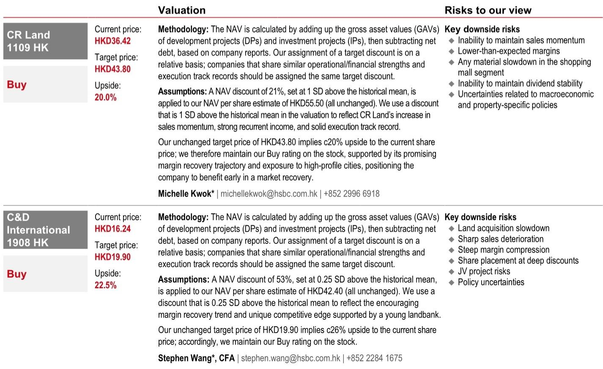
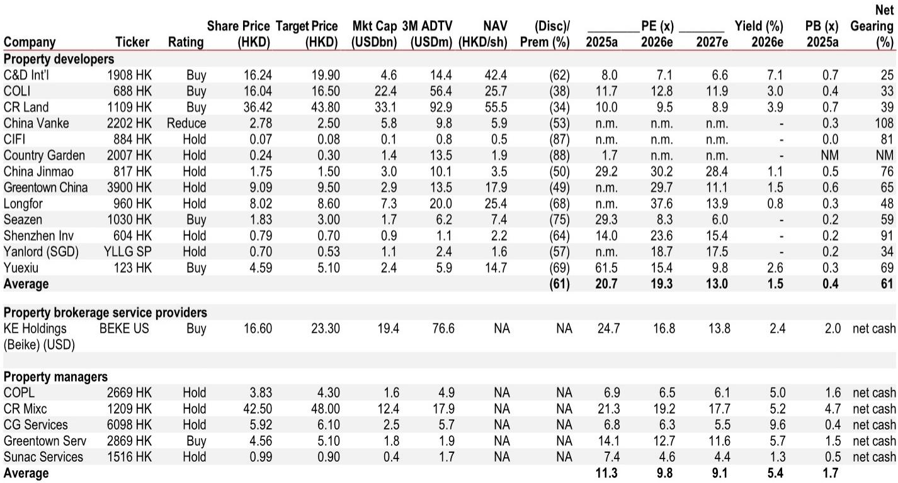
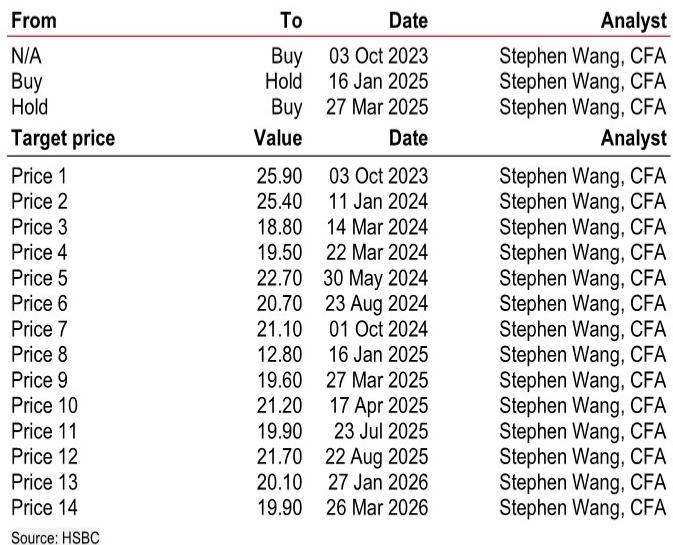

# 市场真正低估的不是需求，而是供给侧信心的重建

过去两个月，中国房地产市场的叙事正在发生一次不易察觉但意义深远的切换。

2025年四季度到2026年初，市场关注的焦点几乎全部集中在需求端：政策还能不能进一步松绑、居民购房意愿何时触底、二手房成交量能否持续。但5月的数据揭示出一个更值得关注的变化——供给侧的信心正在重建。开发商开始愿意以更高的溢价拿地，而这一行为背后隐含的判断，比任何单月销售数字都更具结构性意义。

某外资投行最新发布的研报明确指出，5月土地市场出现早期复苏信号，全国土地出让降幅收窄，平均溢价率从4月的6%回升至10%。上海、苏州、南京等地出现多宗高溢价成交，其中中海在苏州以高出底价30%的价格获取一幅住宅地块，创下该省单价纪录。这不是孤例。5月29日上海出让的五幅地块中，四幅溢价率在17%至40%之间。

这些数字放在一起，指向一个被市场普遍低估的结论：开发商正在用真金白银投票，重新相信这个市场有定价权、有利润空间、有可持续的需求。而这一信心的重建，才是支撑后续股价和估值修复的真正底层变量。

报告同时覆盖了5月销售数据、二手房市场表现以及个股偏好，但其最核心的洞察，并不是“销售回暖”，而是“开发商行为正在从防御转向主动”。这一转变的可持续性，将决定未来6至12个月板块的投资逻辑是否能够从“政策博弈”切换为“基本面驱动”。

以下是我们从这份报告中提炼出的五个关键层次。

## 1. 5月销售的分化不是周期性的，而是结构性的：优质国企正在与行业脱钩

5月六家优质国企开发商平均实现同比正增长，其中华润置地增长28%，越秀增长18%，中海增长14%。而同期民营开发商的平均同比跌幅为40%。这一分化不是简单的“国企比民企好”，而是反映了两个根本性的差异：一是可售资源的充裕程度，二是产品定价能力。

报告特别提到，深圳高端项目的热销证明了改善型需求的韧性，而杭州多个单价在1000万至2亿元之间的顶豪项目集中入市，正在重塑市场对“什么产品能卖得动”的认知。这些项目并非靠低价去化，而是靠产品力实现了高于周边均价数倍的成交价。这意味着，对于拥有高端产品线和充足土储的国企开发商而言，当前的市场环境不是“寒冬”，而是一次份额收割和利润重构的机会。

所以呢？投资者需要关注的不是全行业销售何时见底，而是哪些开发商能够在“总量收缩、结构分化”的环境中持续扩大自己的有效市场份额。华润置地和中海在5月的股价表现已经部分反映了这一点，但报告认为市场仍未充分定价其2027年潜在的盈利复苏。

## 2. 土地市场的溢价信号比销售数据更值得认真对待

这是整份报告中最容易被忽略但最关键的判断。5月全国土地出让金同比降幅从4月的41%收窄至36%，平均溢价率从6%回升至10%。单纯看这两个数字，似乎只是边际改善。但结合具体案例来看，信号的意义完全不同。

中海在苏州以30%溢价拿地，华润、建发等在上海、杭州、南京等地的高溢价成交，说明的不是“开发商钱多没处花”，而是经过过去两年的深度调整，头部国企开发商的资产负债表已经修复到足以支撑主动扩张的阶段。他们在拿地时做出的判断是：当前的土地价格相对于未来可实现的售价，仍有合理的利润空间。

这一判断能否成立，取决于两个尚未完全验证的假设：一是高端需求的持续性，二是未来售价的稳定性。但无论如何，从“不拿地”到“愿意溢价拿地”的行为转变，本身就是信心的有力佐证。报告将这一现象解读为“开发商信心重建”，我们认为这个用词是准确的。

所以呢？土地市场的溢价率变化，往往领先于销售价格和利润率的拐点。如果这一趋势在未来两个月得到确认，那么当前开发商普遍被压低的NAV折价和市盈率，可能面临一次系统性的重估。

## 3. 上海二手房的放量不是脉冲，而是结构性的购买力释放

5月上海二手房成交量达到28023套，创下五年同期新高。更值得关注的是，国家统计局数据显示，上海二手房价格已经连续三个月环比上涨，4月涨幅为0.7%。

报告明确排除了两种常见的解释：一是认为这是五一假期带来的短期脉冲，二是认为这是政策放松后积压需求的集中释放。报告自己的判断是，这轮复苏背后有两个结构性支撑——财富效应和可负担性的实质性改善。后者尤其值得关注。报告在另一篇专题中提出，当前居民购房可负担性处于十年最佳水平，这意味着即使收入预期没有明显改善，利率下降和房价调整已经使得一线城市的购房门槛大幅降低。

所以呢？上海二手房的韧性如果能够持续，将逐步传导至新房市场，进而改善开发商的去化速度和现金流。对于布局在一线和强二线的国企开发商而言，这是一个正向循环的起点。但报告也提醒，其他城市的二手房表现参差不齐，杭州、南京等地的同比增幅明显低于上海，说明这轮复苏的广度仍有待观察。

## 4. 报告没有完全回答的关键问题：土地溢价的可持续性取决于什么？

这是整份报告留给读者最大的开放性问题。报告本身对土地市场复苏持积极态度，但坦率地说，它并没有完全解释清楚一个问题：当前的高溢价拿地，究竟是开发商对未来的理性定价，还是因为优质地块供应稀缺导致的竞价泡沫？

从数据上看，5月全国土地出让金仍然同比下降36%，说明总量的复苏远未到来。高溢价成交主要集中在上海、苏州、南京等少数城市的核心地段。如果这些项目未来的去化速度或售价低于预期，那么当前的溢价就可能是成本而非机会。

此外，报告提到的“开发商信心重建”主要基于国企的行为，民营开发商仍然处于被动去杠杆的阶段。一个只有国企参与的土拍市场，能否支撑全行业的复苏，本身就是一个需要持续观察的问题。

这个问题的答案，将直接决定当前市场对国企开发商的估值溢价是否合理。如果土地溢价能够转化为未来的利润增长，那么当前10倍左右的市盈率和30%以上的NAV折价显然偏低。如果溢价最终被证明为过度乐观，那么估值修复的空间就会受到严重制约。

## 5. 投资者需要建立的新观察框架：从“政策预期”转向“执行兑现”

过去两年，房地产板块的投资逻辑几乎完全由政策预期驱动。每一次政策松绑都带来一轮脉冲式上涨，但随后又因为基本面未能跟上而回落。这份报告暗示，这一模式可能正在发生变化。

新的观察框架应该围绕三个维度展开：第一，高端项目的去化速度和售价能否维持甚至提升，这决定了开发商的利润率和盈利能见度；第二，土地市场的溢价率是否能够持续回升，这反映了开发商对未来的真实信心；第三，国企开发商能否在2027年实现盈利复苏，这是当前估值能否被验证的核心假设。

这三个维度中，前两个是先行指标，第三个是结果指标。报告对华润置地和建发国际给出了明确的买入评级，核心逻辑正是基于其在高端项目上的执行能力、定价权以及C-REITs市场扩张带来的投资物业重估收益。但报告也承认，这些判断需要未来两个季度的数据来验证。

对于产业决策者和高净值读者而言，当前最值得做的不是判断“市场是否已经见底”，而是建立一个能够持续跟踪上述三个维度的观察框架。当先行指标出现连续改善时，才是真正可以加大配置的时机。

---

回到开篇的判断：市场真正低估的不是需求，而是供给侧信心的重建。这份研报的价值，不在于它给出了多么乐观的销售预测，而在于它捕捉到了一个正在发生的、从防御到主动的行为转变。土地溢价、高端项目热销、二手房放量，这些信号单独看都可能被解释为短期现象，但放在一起，它们指向一个更根本的故事：一部分开发商正在用行动表明，他们相信这个市场还有利润可赚。

这个故事能否被市场接受，取决于未来几个月的数据能否延续当前的趋势。而报告中最值得反复研读的部分，恰恰是那些它没有完全展开的假设——比如土地溢价的可持续性、民营开发商的出清节奏、以及高端需求能否从一线城市向强二线城市扩散。这些问题的答案，将决定这轮复苏是昙花一现还是趋势反转。

欢迎来星球微信群里继续讨论。我们会在社群中分享这份报告完整的估值表格和敏感性分析，并持续追踪土地溢价率和高端项目去化率的变化，帮助大家建立自己的决策框架。

Personal reading notes and learning share only. Not investment advice.

