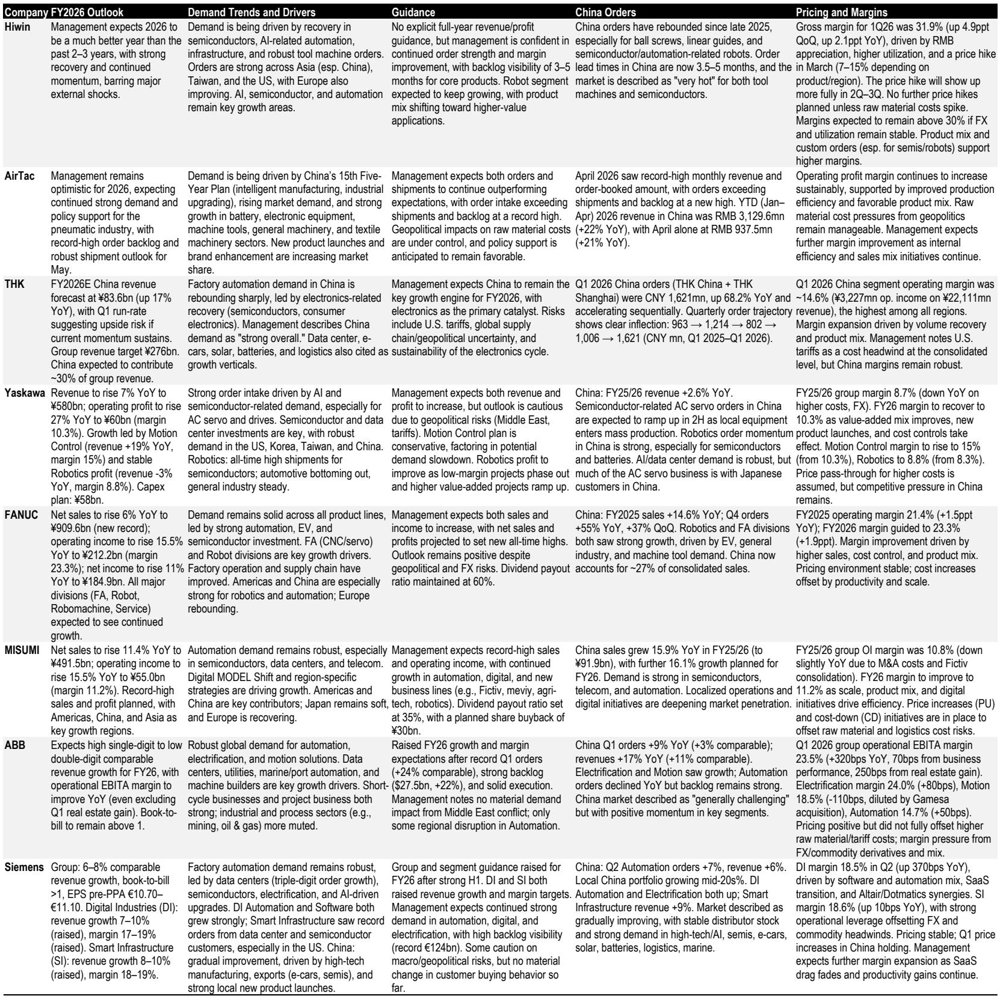
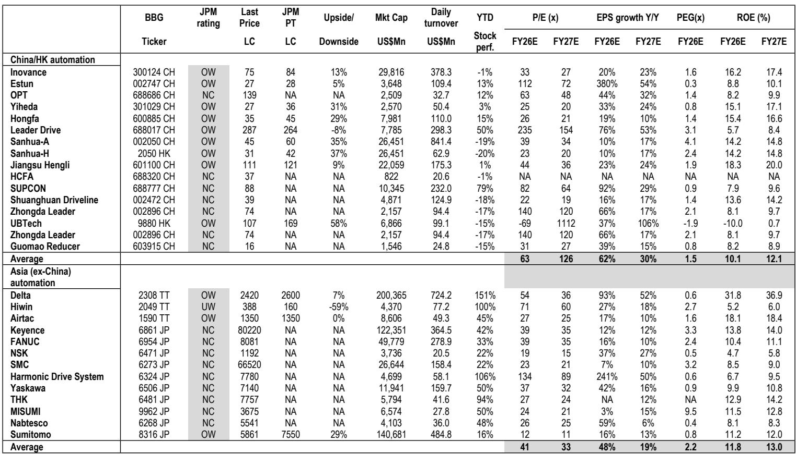
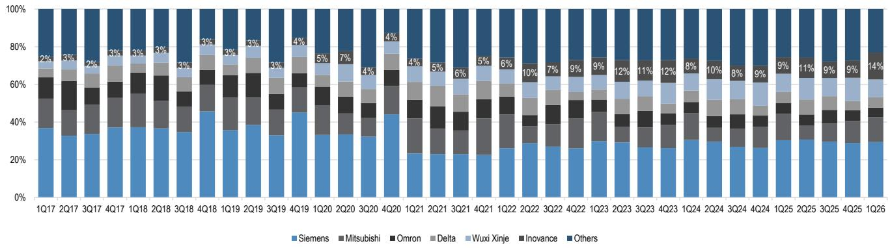

# The China Factory Automation Cycle Is Broadening, But Only a Handful of Players Will Convert Demand Into Margin

China’s factory automation sector has entered 2026 with a fundamentally stronger footing, but the easy phase of the cycle is over. The question is no longer whether demand is recovering—it is, with factory automation sales up 7% year-on-year in the first quarter, the strongest print since late 2022. The critical question now is which companies can translate robust order flow into profitable shipments, and which will see their margins squeezed by resurgent input costs, component tightness, and the relentless pressure of price-sensitive customers. The data from MIR’s first-quarter review and the broader read-across from Asian and European peers paint a clear picture: this is a cycle that rewards execution over exposure, and the dispersion between winners and laggards is set to widen.

The report from a global investment bank makes a compelling case that the recovery is both real and broadening. Factory automation is forecast to grow 13% this year and 10% in 2027, with the strongest demand pools concentrated in electronics, semiconductors, robotics, and new-energy-vehicle-related capital expenditure. But the headline numbers mask a more complex reality. Process automation remains a laggard, growing only 1% year-on-year, and raw material inflation is already forcing suppliers to make difficult pricing decisions. Some have implemented price hikes; others cannot. The result is a market that is polarizing around those with solution breadth, supply-chain resilience, and the ability to defend gross margins through mix and productivity gains.

This is not a beta trade. It is a stock-picker’s market, and the data supports that view. Market share shifts are becoming more visible, with Inovance gaining six percentage points in small PLCs, two points in mid-to-large PLCs, and two points in AC servos year-on-year. Estun has strengthened its top-player status in robotics with a clearer mix upgrade angle. Meanwhile, smaller players risk being squeezed by faster cost resets and customers who remain price-sensitive even as demand improves. The cycle is increasingly quality-led, and the winners are those who can combine the right end-market exposure with the operational discipline to deliver.

## The cycle is shifting from "is demand recovering" to "who can convert orders into margin"

The first-quarter data provides a solid foundation for the bull case, but the narrative has already moved on. Investors are no longer asking whether orders will improve; they are asking whether reported revenue will lag order momentum, and whether margin delivery will keep pace with volume growth. The report highlights that order-to-delivery cycles of one to three months for standard products mean that reported revenue may trail order momentum in the near term. But the strategic direction is clear: those who can scale capacity without introducing margin leakage are the ones who will win.

This is where the report’s analysis of pricing dynamics becomes crucial. Input-cost volatility and component tightness are resurfacing, and the ability to pass through costs is becoming a key differentiator. The mid-to-high end of the market is showing clear polarization. Tier-one players with stronger product competitiveness, delivery reliability, and solution breadth are in a better position to push pricing through. Smaller players, by contrast, risk being squeezed between customers that remain price-sensitive and cost lines that reset faster than selling prices. The result is a familiar pattern of share shift and margin dispersion, where pricing power becomes a market-share tool rather than a purely defensive lever.

The practical implication for investors is that the upcycle is rewarding discipline. Players with pricing power and solution attach are more likely to hold gross margins steady, while price-takers risk a margin squeeze even if revenue prints look fine. This is not a new insight, but it is one that becomes more acute as the cycle matures and the easy re-rating of 2025 gives way to a more execution-driven 2026.

## Product-level momentum confirms a high-quality cycle, with control and motion leading the way

The product-level data reinforces the view that this is not a broad-based recovery but a cycle shaped by advanced manufacturing capital expenditure. PLCs and AC servos sustained over 10% year-on-year growth in the first quarter, with AC servo leading at 17%. Low-voltage inverters posted a rebound to 4% growth, but the read-through is that demand remains more mixed and sensitive to project cadence and export-linked EPC dynamics.

The demand drivers look "quality" rather than purely cyclical. Lithium battery-related activity surprised positively, including supporting infrastructure such as substations. Auto customers accelerated production-line equipment procurement. And AI supply-chain capital expenditure in PCB, electronics, and semiconductors created spillover into selected adjacent categories such as laser equipment. This mix supports the view that the cycle is increasingly shaped by advanced manufacturing capex rather than broad industrial volume alone.

For investors, the implication is that end-market diversity is becoming a competitive advantage. Suppliers exposed to both "new economy" capex and structurally upgrading legacy industries are better positioned to sustain growth if macro conditions remain uneven. The report’s analysis of peer read-across from Taiwan and Japan confirms this: the strongest demand pools remain electronics, batteries, machine tools, and general machinery, while the margin narrative is framed around production efficiency and mix rather than price-led growth alone.

## Robotics growth is moderating but staying double-digit, with quality becoming the key differentiator

The industrial robot market retained double-digit growth in the first quarter at 14% year-on-year, moderating from 17% in the fourth quarter of 2025 but not breaking the trend. End-demand looks broadly positive, with electronics including auto electronics leading at over 20% growth, and auto parts and lithium battery demand staying robust at 19%.

But the more important takeaway for investors is that robotics demand is increasingly "application- and customer-specific." This tends to reward suppliers with a proven portfolio, fast iteration, and service capability, rather than a pure price-led strategy. The report notes that robot vendors are increasingly emphasizing "high-quality growth"—selective bidding, higher-margin scenarios, standardized workstations, and after-sales expansion—rather than pure volume share. This is supportive for steadier margin progression even if commoditized segments remain highly competitive.

The competitive dynamics in industrial robots continue to evolve, with domestic leaders consolidating but product mix still mattering for the "quality of share." Estun regained the number-one position in the first quarter, together with Inovance and KUKA, each at 9.7% share. Inovance was the most visible share gainer, though its mix skews more toward smaller-sized robots versus Estun, which matters for average selling prices, application mix, and margin structure. For global peers like Fanuc, ABB, and Yaskawa, shares broadly stabilized at around 10%, 5%, and 5% respectively over the past three years, albeit with a mild declining bias. The structure suggests domestic players are gaining relevance, but investors still need to underwrite where the share is being won—product tier, applications, and customer quality—not just the headline share number.

## What the report does not fully answer: the sustainability of margin improvement and the humanoid robot timeline

The report is thorough in its analysis of the current cycle, but it leaves several meaningful open questions that readers of the full report will want to explore. First, the sustainability of margin improvement remains uncertain. The report notes that pricing actions are re-emerging and that some players have implemented price hikes, but it does not fully address how long pricing power can persist in a market where customers remain price-sensitive and competition is intensifying. If input costs continue to rise, will the current pricing actions hold, or will they be eroded by competitive pressure?

Second, the humanoid robot opportunity is acknowledged as a "secondary optionality" for 2026 earnings, but the report does not provide a clear timeline for when this theme could become a meaningful earnings driver. The report notes that humanoid-related demand is already influencing capacity planning for precision components, with Leader Drive standing out as a direct beneficiary due to harmonic reducer intensity in humanoids. But the question of when humanoid robots transition from a capacity-planning influence to a material revenue contributor remains unanswered. Investors will need to assess whether the current valuation premiums for humanoid-exposed names are justified by the long-term opportunity or whether they reflect near-term exuberance.

Third, the report does not fully address the risk of a demand pull-forward. The strong order momentum in the first quarter could partly reflect customers ordering ahead of expected price increases or component shortages. If this is the case, there is a risk that second-half demand moderates as customers work through inventory. The report’s forecast of 13% growth for 2026 and 10% for 2027 implies a deceleration, but the magnitude of the deceleration and the risk of a sharper slowdown are not fully explored.

## A decision framework for investors: three filters to separate winners from laggards

The report’s analysis provides a clear framework for investors to evaluate factory automation and robotics names. The first filter is end-market exposure. Companies with significant exposure to electronics, semiconductors, AI-related capital expenditure, and lithium battery are best positioned to benefit from the strongest demand pools. Companies with heavy exposure to process automation segments such as oil and gas, metallurgy, and petrochemical are likely to face a more muted demand environment.

The second filter is pricing power and margin resilience. The report makes clear that the ability to pass through input costs is becoming a key differentiator. Investors should assess whether a company has the product breadth, delivery reliability, and solution attach to defend gross margins in a rising-cost environment. Companies that are price-takers in commoditized segments are at risk of margin compression even if revenue growth looks solid.

The third filter is supply-chain execution and capacity scalability. The report highlights that capacity and delivery capability are becoming actionable constraints, with some players targeting significant capacity lifts to clear order backlogs. Companies that can scale capacity without introducing margin leakage—through localization, longer-term supplier agreements, and productivity gains—are better positioned to convert order momentum into sustainable earnings growth. Companies that face capacity constraints or supply-chain disruptions risk losing market share to more resilient competitors.

## The community question: which names can sustain the re-rating as the cycle matures?

The report’s stock views remain constructive, favoring leading names that are best positioned to benefit from accelerating market-share gains, robust new product launches, and the ongoing shift toward higher-value, innovation-driven growth. But the easy re-rating of 2025 is behind us, and 2026 is increasingly about execution. The market is already reflecting a two-speed pattern, with some names outperforming on specific drivers such as humanoid-linked volume ramp or margin recovery off a low base.

For investors looking to navigate this cycle, the key question is which companies can sustain their momentum as the cycle matures and as input-cost pressures and competitive dynamics intensify. The report’s analysis provides a strong foundation for making that assessment, but the full picture requires a deeper dive into the specific financial trajectories, margin drivers, and competitive positioning of individual names.

Join the community to read the full report and review the original charts.

*This article is for learning and discussion only and does not constitute investment advice.*

Personal reading notes and learning share only. Not investment advice.

