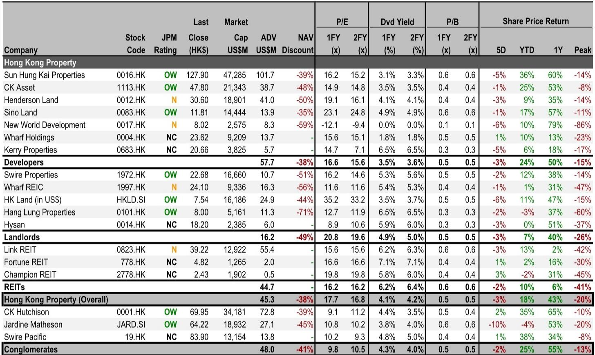
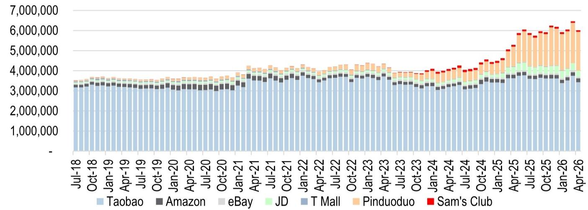

# Hong Kong Retail Is Stabilizing, but the Landlord Reversion Trade Has Not Yet Arrived

Hong Kong’s April retail sales grew 9% year-on-year, a mild moderation from March’s 13% gain. On the surface, this looks like a continuation of the recovery that began in late 2025. But the headline number masks a more nuanced picture: relative to the pre-pandemic average of 2015-2018, April sales were 15% below that benchmark, a deterioration from March’s 9% deficit. The recovery is real, but it is not yet self-sustaining.

The critical question for investors is not whether Hong Kong retail is improving—it is—but whether that improvement is sufficient to drive positive rental reversion for the city’s major commercial landlords. The data so far suggests a disconnect. Retail sales have been stabilizing for several months, yet the two key retail landlord proxies—Wharf REIC and Link REIT—have not seen their rental reversions turn positive. This is the central tension in the Hong Kong commercial property story today.

Why does this matter now? Because the market is pricing in a recovery that has not yet fully materialized in landlord earnings. The valuation summary from a global investment bank report shows that Hong Kong property developers have rallied 50% over the past year, while landlords are up 40%. Link REIT, however, has returned only 2% over the same period. The divergence between retail sales momentum and landlord performance is a signal that the market is waiting for concrete evidence of rent growth before re-rating these names further.

This article unpacks the April retail data, examines the structural headwinds that may cap the recovery, and offers a decision framework for investors trying to position for the next phase of the cycle.

## The April Data Reveals a Two-Speed Recovery That Favors Discretionary Spending but Shows Signs of Fatigue

The headline 9% year-on-year growth in April is respectable, but the composition tells a more instructive story. Discretionary retail grew 13% year-on-year, continuing to outperform staples, which rose only 5%. Yet even within discretionary, there are warning signs. Excluding the exceptionally strong growth in motor vehicles (+46%) and electrical goods (+22%), discretionary retail would have risen only 8% year-on-year, down from 14% in March. The moderation is the first since the second quarter of 2025.

Jewelry and valuable gifts, a bellwether for high-end tourist spending, also showed signs of cooling. Growth slowed from 28% in March to 20% in April, likely influenced by lower gold prices. This category remains heavily dependent on mainland Chinese tourist traffic, and while tourist arrivals grew 9% year-on-year in May, that was a slight deceleration from April’s 10% pace. The recovery in visitor numbers is happening, but it is not accelerating.

The staples category, meanwhile, is treading water. Supermarket sales grew only 3% year-on-year in April, and just 2% year-to-date. This is consistent with Link REIT’s recent commentary about “stabilizing tenant sales”—a phrase that suggests the worst is over but the recovery is not strong enough to drive meaningful rent increases.

The pattern is clear: Hong Kong retail is in a stabilization phase, not a re-acceleration phase. The base effects from the weak 2024 period are fading, and the second half of 2026 will face tougher comparisons. The report projects retail sales growth of 5-10% over the next few months, but that range is modest by historical standards.

## Cross-Border E-Commerce Is Reshaping Hong Kong’s Staples Market and Capping the Upside for Neighborhood Landlords

One of the most underappreciated structural shifts in Hong Kong retail is the rapid penetration of cross-border e-commerce platforms, particularly Pinduoduo. The data on monthly active users in Hong Kong is striking: from approximately 50,000 in April 2018, Pinduoduo’s Hong Kong MAU has surged to over 2.15 million by April 2026. That is a 43-fold increase in eight years.

This matters because Pinduoduo and similar platforms are directly competing with Hong Kong’s staple retailers—supermarkets, drugstores, and general merchandise outlets—which are the core tenant base for neighborhood landlords like Link REIT. When a Hong Kong consumer can order daily necessities from mainland platforms at significantly lower prices, the pricing power of local brick-and-mortar retailers erodes.

The report explicitly states that with the increasing penetration of cross-border e-commerce, it does not expect a material improvement in staples retail in the near term. This is a critical insight for investors in Link REIT and other landlords with significant exposure to neighborhood retail. Even if tourist-driven discretionary spending recovers further, the structural headwind from e-commerce may keep staples growth in the mid-single-digit range, making it difficult for landlords to push through positive rental reversion.

The implication is that the recovery in Hong Kong retail is not uniform. The high-end, tourist-dependent segments may continue to improve as mainland visitation normalizes, but the everyday spending that supports neighborhood malls and shopping centers faces a structural challenge that will not disappear even if the macro environment improves.

## The Disconnect Between Retail Sales and Rental Reversion Is the Key Risk for Landlord Valuations

The most puzzling aspect of the current cycle is why stabilizing retail sales have not translated into positive rental reversion for Wharf REIC and Link REIT. The report maintains a Neutral rating on both, though it sees more upside risk in Link REIT due to its above-6% dividend yield and potential capital recycling.

To understand this disconnect, consider the mechanics of commercial property leases in Hong Kong. Most retail leases have three-year terms with built-in rent review clauses. Even if current tenant sales are improving, landlords cannot immediately reset rents upward. They must wait for lease expiries, and tenants are likely to resist significant increases until they see sustained improvement in their own margins.

Moreover, the recovery in sales is not evenly distributed across categories. Consumer durable goods and jewelry are outperforming, but these categories tend to be concentrated in prime locations like Tsim Sha Tsui and Causeway Bay. For neighborhood landlords like Link REIT, whose tenant mix is heavily weighted toward supermarkets, food and beverage, and everyday services, the recovery is much more muted.

The report’s data on supermarket sales—up just 3% in April and 2% year-to-date—underscores this point. Link REIT’s tenant sales are stabilizing, as management noted, but “stabilizing” is not the same as “growing.” Until that stabilization turns into sustained growth across a broader tenant base, landlords will struggle to demonstrate the earnings momentum needed to justify a valuation re-rating.

## What the Report Does Not Fully Answer: The Turning Point for Rental Reversion

The report provides a thorough analysis of current conditions but leaves several critical questions unanswered. The most important is: what catalyst would trigger a shift from neutral to positive rental reversion for Hong Kong’s retail landlords?

The report does not specify a threshold for retail sales growth that would be sufficient to drive rent increases. Is it 10% year-on-year sustained over multiple quarters? 15%? Or does it depend more on the composition of that growth? Similarly, the report does not model the impact of cross-border e-commerce penetration on landlord rental income over the next three to five years.

Another open question is the role of capital recycling. The report notes that Link REIT’s potential to recycle capital could be an upside catalyst, but it does not detail what assets might be sold or at what valuations. Given that Link REIT’s share price has returned only 2% over the past year while the broader property sector has rallied, the market is clearly skeptical about the near-term benefits of such a strategy.

Finally, the report does not address the impact of interest rates on landlord valuations. With dividend yields of 5-6% for REITs and landlords, the sector is sensitive to changes in the risk-free rate. If the interest rate environment shifts, it could have a larger impact on valuations than any improvement in retail sales.

These gaps are not weaknesses in the analysis; they are the natural boundaries of a research report that focuses on the current data. But they are precisely the questions that investors need to answer before making a commitment to the sector.

## A Decision Framework for Investors: Three Scenarios for Hong Kong Retail Landlords

For investors trying to position themselves, the key is to identify which scenario is most likely to unfold over the next 12 to 18 months. Based on the report’s data and analysis, three scenarios are plausible:

Scenario 1: Sustained Recovery with Positive Reversion (Bull Case). In this scenario, tourist arrivals continue to improve, discretionary spending accelerates, and the base effects from the weak 2024 period drive retail sales growth above 10% for multiple quarters. Tenant sales improve broadly enough that landlords can push through positive rental reversion on lease renewals. The beneficiaries would be Link REIT and Wharf REIC, with Link REIT having more upside due to its higher dividend yield and potential for capital recycling. The risk to this scenario is that cross-border e-commerce continues to cap staples growth, limiting the breadth of the recovery.

Scenario 2: Stabilization Without Reversion (Base Case). This is the scenario implied by the report’s Neutral ratings. Retail sales grow at 5-10% year-on-year, driven by discretionary spending, but staples remain subdued. Landlords see flat to slightly negative rental reversion as tenants remain cautious. Dividend yields provide a floor for valuations, but there is no catalyst for a re-rating. In this scenario, Link REIT’s above-6% dividend yield makes it a more attractive income play than Wharf REIC, but neither stock offers significant capital appreciation.

Scenario 3: Renewed Deterioration (Bear Case). If tourist arrivals slow again, or if the mainland Chinese economy weakens, Hong Kong retail could stall. The report notes that tourist arrivals in May grew only 9% year-on-year, a deceleration from April. If this trend continues, the recovery could lose momentum. In this scenario, retail sales growth could slip back to mid-single digits or lower, and landlords would face negative rental reversion. The high dividend yields would not provide a floor if earnings are declining, and both stocks could de-rate.

The decision framework is straightforward: investors who believe in Scenario 1 should be overweight Link REIT and consider adding Wharf REIC. Those who see Scenario 2 as most likely should maintain neutral positions and focus on income rather than capital gains. Those who fear Scenario 3 should avoid the sector entirely.

## The Recovery Is Real, but the Re-Rating Requires More Than Stabilization

Hong Kong’s retail recovery is underway, but it is not yet broad enough or strong enough to drive the positive rental reversion that would justify a significant re-rating of the major retail landlords. The April data shows a two-speed recovery, with discretionary spending leading and staples lagging. The structural headwind from cross-border e-commerce adds a layer of uncertainty that will not resolve quickly.

For investors, the decision comes down to patience. If you believe the recovery will broaden and accelerate, the current valuations—particularly for Link REIT with its above-6% dividend yield—offer an attractive entry point. If you believe the recovery will remain narrow and capped by structural forces, the risk of disappointment is real.

The report’s data is clear, but its conclusions are appropriately cautious. The market is pricing in a recovery that has not yet fully materialized in landlord earnings. Until it does, the trade remains one of waiting—and watching the data closely.

Join the community to read the full report and review the original charts. The detailed breakdown by category, the historical comparisons, and the valuation tables provide the context that every serious investor needs to make their own judgment on this market.

*This article is for learning and discussion only and does not constitute investment advice.*

Personal reading notes and learning share only. Not investment advice.

