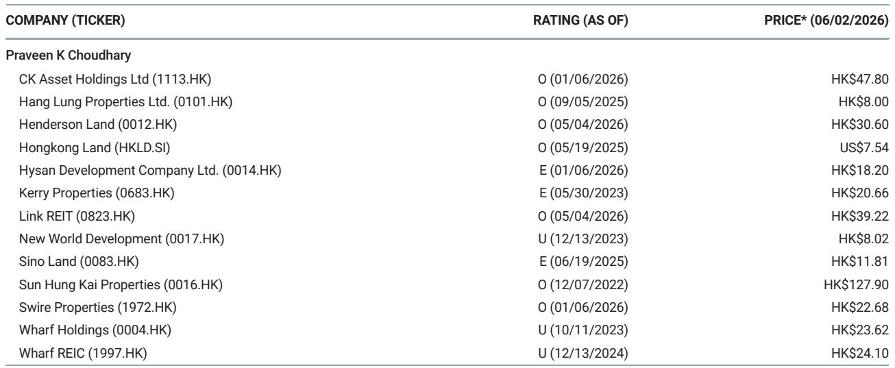
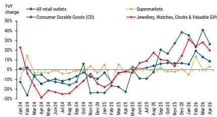

# Hong Kong Retail Is Splitting Into Two Markets, and Only One Is Investable

Hong Kong's April retail sales rose 8.6 percent year-on-year to HK$31.4 billion, decelerating from March's 12.8 percent growth and falling short of the Bloomberg consensus of 13.7 percent. On the surface, this is a modest miss that could be dismissed as monthly volatility. But beneath the headline number lies a structural divergence that every investor in Hong Kong property and consumer exposure needs to understand: the market is fracturing into a high-end, tourism-driven segment that is gaining momentum and a mass-market, domestic segment that is losing ground to digital disruption. The same forces that are boosting luxury sales and inbound visitor spending are simultaneously accelerating the decline of traditional department stores and supermarkets. This is not a cyclical slowdown. It is the emergence of two separate retail economies, and the investment implications for Hong Kong landlords, REITs, and consumer stocks are profoundly different depending on which side of the divide they sit.

The report from a global investment bank makes clear that the April data point is not an outlier but an inflection signal. Four-month cumulative sales growth of 11.3 percent remains healthy, yet the composition of that growth is shifting in ways that reward selective positioning and punish broad-based exposure. For investors, the key question is no longer whether Hong Kong retail is recovering, but which parts of the recovery are durable and which are vulnerable to structural erosion. The answer will determine portfolio allocation for the next 12 to 18 months.

## Luxury and Electrical Goods Are Benefiting from Wealth Effects, Not Just Tourism

The strongest performers in April were electrical goods, up 21.9 percent year-on-year, and luxury items including jewellery, watches, clocks, and valuable gifts, up 19.8 percent. Both categories decelerated from March, but their absolute growth rates remain well above the overall market. The report attributes this to positive wealth effects from the active housing market and the strengthening renminbi, which is giving mainland visitors greater purchasing power.

This is a critical distinction. Many observers assume that luxury retail strength is purely a function of tourist arrivals, but the data suggests a more nuanced mechanism. Mainland visitor arrivals surged 11.5 percent year-on-year during the May Golden Week holidays, and overall May visitation was up 9.5 percent. Yet the luxury sales momentum predates this surge and appears to be sustained by local demand as well. Hong Kong's residential property market has been in an upcycle since early 2026, and rising asset values are feeding through to discretionary spending on high-ticket items. The renminbi appreciation adds an additional tailwind for cross-border shoppers, but it is not the sole driver.

The implication for investors is that luxury-oriented retail landlords and REITs with prime locations in tourist districts and high-end shopping malls are likely to see continued rental support, even as the broader market softens. The wealth effect cycle tends to be self-reinforcing until housing turnover peaks, and we are not there yet. However, the report also notes that both electrical and luxury sales slowed month-on-month, which raises a question about sustainability. Is this a natural moderation after a strong first quarter, or the beginning of a deceleration? The answer depends on whether the housing market maintains its momentum through the second half of the year.

## Mass Retail Is Being Hollowed Out by Chinese E-Commerce Penetration

The most troubling data point in the April report is the continued weakness in department stores, which declined 6.7 percent year-on-year, and the modest recovery in supermarkets, which grew only 3 percent. These segments represent the core of Hong Kong's domestic consumption, and they are being squeezed from two directions. On one side, rising rents and operating costs are compressing margins. On the other, Chinese e-commerce platforms are aggressively expanding their reach into Hong Kong, offering lower prices and faster delivery than traditional brick-and-mortar retailers.

The report explicitly warns that mass retail could remain vulnerable with further penetration of Chinese e-commerce. Online retail sales jumped 30.6 percent year-on-year in April, and the four-month cumulative growth stands at 30.2 percent. This is not a temporary pandemic-era trend; it is a permanent shift in consumer behavior that is accelerating as logistics infrastructure improves and payment systems become seamless across the border.

For Hong Kong property investors, this creates a structural headwind for suburban shopping malls, neighborhood retail centers, and any asset that relies on mass-market tenants such as supermarket chains, apparel brands, and general merchandise stores. These tenants are facing declining foot traffic and margin pressure, which will inevitably feed through to lower rental reversion rates and higher vacancy risk. The report's assessment of Link REIT's outlook is instructive: despite stabilizing spot rents in its Hong Kong retail portfolio, management has given relatively conservative guidance on rental reversion, projecting a negative 8 percent year-on-year for fiscal year 2027. This suggests that even the most resilient mass-market landlord expects rents to decline, not just stabilize.

## The Rental Recovery Will Lag Sales Recovery by at Least 12 to 18 Months

One of the most valuable insights from the report is the time lag between retail sales recovery and rental recovery. The report expects necessity trade sales to further stabilize, but overall rentals could still decline until the first half of 2028. This is a sobering forecast for anyone who assumes that rising sales automatically translate into higher rents.

The logic is straightforward. Retail leases in Hong Kong typically have three to five year terms, and many were signed during the downturn when rents were already compressed. As these leases come up for renewal, landlords are competing for a shrinking pool of quality tenants. Even if foot traffic improves, landlords cannot immediately renegotiate existing leases upward. Moreover, the structural shift toward e-commerce means that physical retailers are demanding smaller footprints, more flexible terms, and lower base rents in exchange for shorter commitments.

For investors, this means that the earnings recovery for retail landlords will be back-end loaded. The report's projection of May retail sales growth staying at high-single-digit year-on-year is encouraging, but it will take time to flow through to net property income. The key metric to watch is not monthly sales data but leasing spreads, which will remain negative for the foreseeable future. This favors landlords with strong balance sheets that can weather the transition, such as Link REIT, and penalizes highly leveraged owners who need rental income to service debt.

## What the Report Does Not Fully Answer: The Interaction Between Housing Turnover and Retail Demand

The report identifies positive wealth effects from the active housing market as a driver of luxury and electrical goods sales, but it does not fully explore the feedback loop between these two markets. Hong Kong's residential upcycle, which began in early 2026 after seven years of decline, has been driven by a combination of low interest rates, easing of mortgage restrictions, and pent-up demand from first-time buyers. As property prices rise, homeowners feel wealthier and increase discretionary spending. But rising prices also make it harder for new buyers to enter the market, which could eventually slow turnover and reduce the wealth effect.

The question that remains open is whether the housing market can sustain its current pace through 2027 and 2028. If turnover peaks sooner than expected, the tailwind for luxury retail could fade quickly. Conversely, if the upcycle extends, the wealth effect could broaden to mid-market segments. The report does not provide a definitive view on housing market trajectory, and investors should look for additional data points on mortgage applications, transaction volumes, and developer pricing strategies to gauge the sustainability of this cycle.

Another unresolved question is the extent to which Chinese e-commerce penetration will accelerate. Online retail in Hong Kong is still a relatively small share of total sales, but the growth rate is alarming for traditional retailers. If Chinese platforms continue to invest in same-day delivery and localized inventory, the displacement of mass-market physical retail could happen faster than most landlords expect. The report flags this risk but does not quantify the potential impact on rental values across different asset classes.

## A Decision Framework for Hong Kong Retail Property Investors

Based on the report's analysis, investors should evaluate Hong Kong retail exposure using a three-factor framework: tenant mix, lease duration, and balance sheet strength.

First, tenant mix determines which side of the retail divide a property sits on. Assets with high exposure to luxury, jewellery, and electrical goods tenants will benefit from wealth effects and tourism. Assets reliant on supermarkets, department stores, and general merchandise will face structural headwinds from e-commerce displacement. Investors should map their portfolio to these categories and adjust accordingly.

Second, lease duration determines how quickly a landlord can capture the recovery. Properties with shorter lease terms and frequent rent reviews will benefit sooner from improving market conditions, but they are also more exposed to downside risk if the recovery stalls. Longer leases provide stability but delay the upside. The report's guidance that rentals could decline until mid-2028 suggests that landlords with near-term lease expirations may face continued pressure, while those with longer-dated leases can wait for the cycle to turn.

Third, balance sheet strength determines whether a landlord can survive the transition. The report's recommendation of Link REIT as an overweight position reflects confidence in its ability to manage negative rental reversions while maintaining distributions. Highly leveraged landlords may be forced to sell assets or cut dividends if the recovery takes longer than expected. Investors should prioritize companies with low loan-to-value ratios, strong interest coverage, and diversified portfolios.

The report also highlights the importance of May retail sales data as a near-term catalyst. With high-single-digit growth expected on revived inbound tourism and healthy economic growth, the May print could provide a positive signal for the sector. But investors should not mistake a good month for a structural turn. The divergence between high-end and mass retail is likely to widen, not narrow, in the coming quarters.

The Hong Kong retail market is no longer a single asset class. It is two markets moving in opposite directions, and the investment challenge is to identify which properties and which companies are positioned for the future rather than the past. The report provides the data and the framework; the judgment call is up to each investor.

Join the community to read the full report and review the original charts.

*This article is for learning and discussion only and does not constitute investment advice.*

Personal reading notes and learning share only. Not investment advice.

