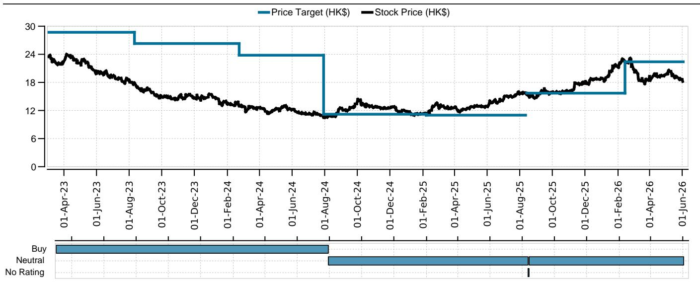
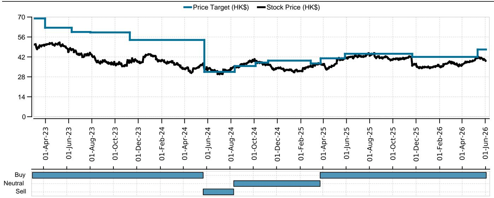
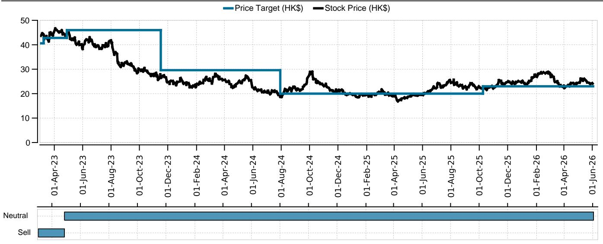

# Hong Kong Retail Sales Are Decelerating, and the Structural Story Beneath the Surface Is More Worrisome Than the Headline

Hong Kong’s April retail sales rose 9 percent year-on-year. At first glance, this number sits comfortably within the high-single-digit range that analysts had expected. It is not a miss. It is not a shock. But for anyone managing capital in Hong Kong real estate, luxury retail, or consumer-facing equities, the headline is a trap. The real story lies in what happens when you strip away the temporary drivers.

The April figure marks a clear deceleration from March’s 13 percent growth and the 12 percent pace seen in the first two months of 2026. Momentum is softening. And the composition of that growth reveals a market that is increasingly dependent on a narrow set of non-recurring factors: surging gold prices, the iPhone cycle, and a one-time pull-forward of electric vehicle deliveries tied to the expiration of a tax exemption.

Remove those three categories, and underlying retail sales growth drops to 6 percent year-on-year. That is down from 8 percent in March and 9 percent in the January-February period. The deceleration in underlying demand is real, and it is broad-based. The question for investors is not whether Hong Kong retail is slowing. It is how to position for a market where the structural tailwinds are fading and the cyclical supports are becoming less reliable.

This report unpacks the data behind the headline, identifies the segments where the risk is most concentrated, and presents a decision framework for navigating the next six to twelve months. It also highlights the analytical questions that the latest data cannot yet answer—questions that will determine whether this is a soft patch or the beginning of a more sustained downturn.

## The Luxury Slowdown Is Real, but Volume Has Not Caved Yet—And That Is the Critical Distinction

Luxury goods sales grew 20 percent year-on-year in April, down from 28 percent in March. That is a meaningful deceleration. But the more instructive metric is volume. After adjusting for price effects, luxury sales volume rose 6.5 percent year-on-year in April, nearly identical to the 6.4 percent pace in March. Volume is stabilizing, not collapsing.

This distinction matters because it tells us something about the nature of the slowdown. The moderation in value growth is being driven primarily by price effects, not by a sudden drop in consumer willingness to buy. Gold prices have been a key factor. When gold prices rise, the value of gold jewelry sales increases even if the number of units sold remains flat or declines. Conversely, as gold prices weaken sequentially, the value growth rate naturally decelerates even if volume holds steady.

So the luxury story is not one of demand destruction. It is one of normalization after a period of exceptional price-driven gains. That is a more manageable risk for landlords and retailers, but it is still a risk. Volume stabilization at a lower growth rate is not the same as volume acceleration. And if gold prices continue to soften, the value growth rate could decelerate further even if volume remains stable.

For discretionary-focused retail landlords such as Wharf REIC and Hysan, the implication is clear. Their tenants' sales performance is increasingly reliant on a narrow set of variables: gold prices, tourist spending patterns, and the timing of product cycles. None of these are under their control. The slowing momentum in luxury is a negative read-across for these names, and the April data reinforces that view.

## Three Temporary Drivers Masked the Underlying Weakness, and All Three Are Fading

The April retail sales number was propped up by three distinct forces, none of which are sustainable. The first is strong gold price performance, which inflated the value of jewelry and watch sales. The second is continued robust demand for new iPhones, which boosted consumer electronics sales by 22 percent year-on-year. The third is the delayed delivery of electric vehicles following the expiration of the first registration tax exemption at the end of March, which pushed motor vehicle and parts sales up 46 percent year-on-year.

Taken together, these three categories contributed disproportionately to the headline number. Excluding them, retail sales growth would have been 6 percent year-on-year. That is a full three percentage points below the reported figure. And all three drivers are either already fading or set to fade in the coming months.

Gold prices have shown signs of weakening sequentially. The iPhone cycle will eventually mature. And the EV delivery backlog will normalize as the tax exemption expiry fades into the rearview mirror. The underlying demand picture, which was already decelerating in March, continued to soften in April. The question is whether the rest of the retail market can compensate.

The answer, based on the April data, is not yet. Supermarket sales returned to 3 percent growth after being flat in March, which is a modest positive. But food and beverage sales were flat year-on-year, and department store sales fell 7 percent. The staples side of the market is not providing the offset that would be needed to sustain overall growth at current levels.

## Visitor Arrivals Are Growing, but the Quality of That Growth Is Shifting in Ways That Matter for Spending

Mainland visitor arrivals grew 12 percent year-on-year in April, up from 10 percent in March. Overseas visitor arrivals grew 3 percent, down from 8 percent. The overall visitor growth picture is positive, but the composition is changing in ways that have direct implications for retail spending.

Mainland visitors tend to spend more per capita on luxury goods and jewelry than overseas visitors. So a pickup in mainland arrivals is, in theory, a positive for luxury retailers. But the data also show that outbound travel by Hong Kong residents to the mainland remained stable at 10 percent growth, while overseas outbound travel narrowed to a 1 percent decline from a 12 percent decline in March. This suggests that Hong Kong residents are still traveling north in significant numbers, which represents a leakage of local consumption.

The net effect is a market that is increasingly dependent on mainland tourists to drive spending, while local consumers redirect their discretionary budgets toward cross-border shopping. That dynamic creates a fragile equilibrium. If mainland tourist spending softens, there is no local cushion to absorb the impact.

The report also notes that the slowdown in overseas visitors could be linked to recent increases in airfares following the Middle East conflict. That is a geopolitical variable that is entirely outside the control of Hong Kong retailers or landlords. It is another reminder that the recovery in Hong Kong retail is not just a function of local conditions. It is deeply tied to global travel patterns, currency dynamics, and geopolitical stability.

## The Report Does Not Fully Answer Whether the Structural Shift in Consumer Behavior Is Permanent or Cyclical

One of the most important questions raised by this data is whether the changes in consumer behavior are temporary or structural. The report provides evidence of deceleration, but it does not resolve the deeper question of whether Hong Kong retail is undergoing a permanent reset.

Consider the online penetration data. Online retail sales growth moderated to 31 percent year-on-year in April, down from 35 percent in March. But online penetration remained stable at 10 percent month-on-month. That stability suggests that the shift toward e-commerce is not accelerating, but it is also not reversing. The question is whether 10 percent penetration represents a new equilibrium or whether it will continue to drift higher as consumer habits evolve.

Similarly, the stabilization in luxury volume growth at 6.5 percent year-on-year could be interpreted in two ways. Optimists would say that volume has found a floor and that the market is normalizing after a period of volatility. Pessimists would note that volume growth at 6.5 percent is still below the pre-pandemic trend and that the composition of that growth is heavily dependent on mainland visitors whose spending patterns may shift over time.

The report does not provide a definitive answer to this question, and it cannot. The data only covers one month. But for investors, this is the central analytical challenge. If the slowdown is cyclical, then the appropriate response is to wait for the next catalyst. If it is structural, then the implications for asset values, rental income, and equity valuations are much more serious.

## A Decision Framework for Investors: Three Questions to Determine Positioning

For investors trying to navigate this environment, the April data points to three questions that should drive portfolio decisions.

First, how much of your exposure to Hong Kong retail is tied to luxury goods and discretionary spending? If the answer is significant, then the slowing momentum in luxury is a direct risk. The report explicitly calls out Wharf REIC and Hysan as names that could see negative read-across. Investors should assess whether their positions in these names are based on a thesis that requires luxury growth to accelerate or stabilize at higher levels.

Second, do you have exposure to staples-anchored retail assets such as Link REIT? The slight pickup in supermarket sales is a modest positive catalyst for Link REIT, which benefits from a more defensive tenant mix. If the broader retail market continues to soften, the relative resilience of staples-focused landlords could become a source of outperformance.

Third, what is your view on the sustainability of mainland tourist spending? This is the most important variable, and it is also the most uncertain. The report shows that mainland arrivals are growing, but it does not provide data on per-capita spending. If spending per visitor is declining, then the headline arrival numbers could be misleading. Investors need to monitor this metric closely and be prepared to adjust their positioning if the trend turns negative.

These three questions form a simple but effective framework for assessing risk and opportunity in Hong Kong retail real estate. The April data does not provide a clear answer to any of them. But it does provide enough evidence to warrant a cautious stance until the picture becomes clearer.

## Join the Community to Read the Full Report and Review the Original Charts

The analysis above is based on the latest Hong Kong retail sales data, but it only scratches the surface. The full report includes detailed breakdowns by category, historical comparisons to pre-pandemic levels, and specific stock-level implications that are essential for anyone with exposure to Hong Kong property or consumer equities. It also includes charts that show the trajectory of retail sales recovery versus visitor arrivals, the contribution of each category to overall growth, and the evolution of online penetration over time. Join the community to read the full report and review the original charts.

*This article is for learning and discussion only and does not constitute investment advice.*

Personal reading notes and learning share only. Not investment advice.

