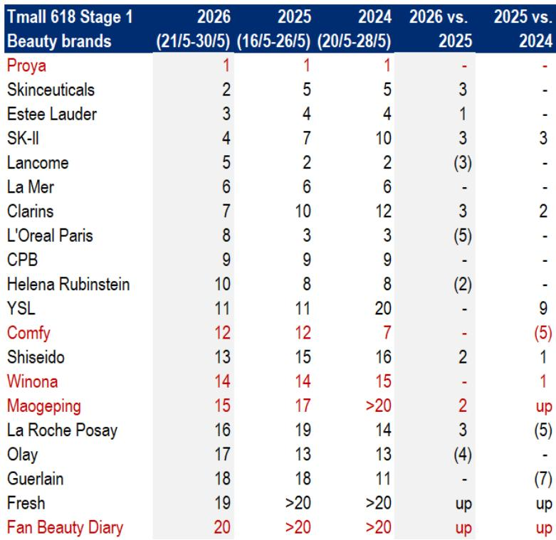
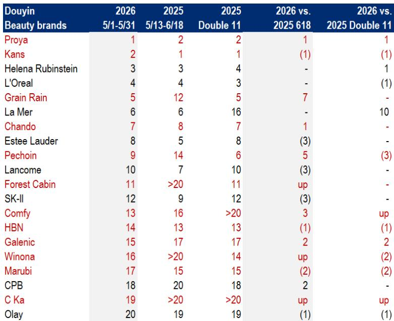
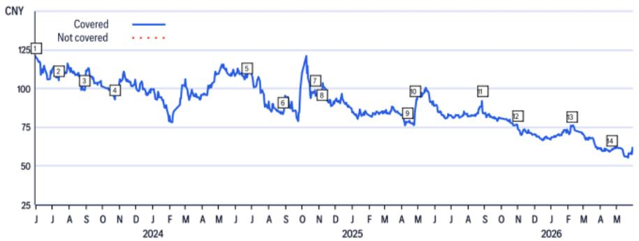

# 618大促揭示的真正信号：国货美妆的份额增长已从“故事”变为“结构”

如果你只看了今年618第一阶段的天猫榜单，可能会得出一个模糊的结论：国货品牌表现“稳住了”。珀莱雅继续第一，可复美和薇诺娜维持了去年的排位。

但这份稳定，恰恰是市场最容易误读的信号。

某外资投行在最新发布的研报中，系统拆解了天猫618第一阶段（5月21日至30日）以及抖音5月全月的销售排名数据。对比去年同一时期，真正值得关注的不是“谁还在前十”，而是“谁在往上走、谁在往下掉”，以及这些位移背后所折射出的行业竞争结构变化。

报告的核心判断是：中国化妆品行业整体延续了自去年双十一和今年女神节以来的温和改善趋势。但在这个“温和”的表象之下，国货品牌与国际品牌之间正在发生一次非对称的格局重塑。而毛戈平，是这一轮结构性变化中最具代表性的标的。

这不是一次简单的促销周期波动。它涉及品牌定价权、渠道效率、消费者心智迁移等多个层面的深层变量。

## 1. 天猫榜单的“稳定”只是表象，真正的位移发生在高端价格带

从天猫618第一阶段的排名来看，国货品牌整体表现稳健。珀莱雅蝉联第一，可复美、薇诺娜分别守住第12和第14位。表面上看，国货似乎只是在原地踏步。

但把目光转向国际品牌，变化就剧烈得多。修丽可从第5跃升至第2，SK-II从第7升至第4，而巴黎欧莱雅从第3跌至第8，兰蔻从第2滑至第5。赫莲娜也后退了两位。

这意味着什么？国际品牌内部正在发生一次“高端化再排序”。排名上升的品牌，无一例外都是客单价更高、品牌溢价更强的奢侈或专业级品牌。排名下滑的，则是那些过去依靠大众市场放量的品牌。

这背后的含义是：在天猫这个以品牌心智为主导的平台上，消费者的购买决策正在向更高价格带集中。而在这个价格带里，国货品牌长期缺席——直到毛戈平的出现。

毛戈平从去年的第17位上升到第15位。这个两名的提升，在数字上并不惊人。但它的真正意义在于：毛戈平是唯一一个进入天猫美妆前20名的国货高端品牌。在前20名几乎被国际高端品牌垄断的格局下，这个“唯一”本身就是一种结构性突破。

所以，天猫榜单的“稳定”是一个误导。真正重要的不是国货品牌守住了大众市场，而是毛戈平在高端价格带撕开了一个口子。这个口子能否扩大，将决定国货美妆下一阶段的估值天花板。

## 2. 抖音榜单揭示的真相：国货品牌正在从“流量驱动”转向“品牌驱动”

如果说天猫榜单反映的是品牌心智的存量竞争，那么抖音榜单则更像是一场增量战场的重新洗牌。

根据报告中的抖音5月数据（覆盖了618大促近半的时间窗口），前20名中出现了12个国货品牌或中国公司控股的品牌，而天猫同榜单中只有4个。珀莱雅从去年618的第2位升至第1位，可复美从第16升至第13，薇诺娜重新进入前20。

但更值得关注的是那些排名大幅跃升的品牌：谷雨从第12升至第5，百雀羚从第14升至第9，林清轩直接进入前20位列第11。而与此同时，几乎所有国际品牌在抖音上的排名都在下降或持平。

这组数据传递了一个比天猫更强烈的信号：在抖音这个以内容和算法为驱动的生态里，国货品牌的竞争力正在系统性增强。过去，国货在抖音的优势往往被归结为“更会做直播”“更懂投流”。但这一次的变化不同——那些排名上升的国货品牌，并非都是新锐流量玩家。谷雨和百雀羚都有较长的品牌历史，它们的上升更多来自于品牌力的积累与渠道策略的匹配。

换句话说，国货在抖音的增长，已经从“流量红利”过渡到了“品牌+渠道”的双轮驱动阶段。而国际品牌在抖音上排名的普遍下滑，则说明它们尚未找到与这个生态高效适配的打法。

这一差异背后，有一个更根本的结构性问题：抖音的推荐逻辑天然倾向于高互动、高复购、高内容生产力的品牌，而国货品牌在这三个维度上普遍优于国际品牌。这不是短期促销策略的差异，而是品牌运营能力的长期差距。

## 3. 毛戈平的独特性不在于增速，而在于它占据了唯一没有国货竞争的价格带

报告将毛戈平列为中国化妆品板块的首选买入标的，给出的目标价为97.9港元，对应2026年预期市盈率27倍。这个估值处于国内化妆品同业的高端，但报告认为这是合理的，理由是毛戈平拥有更快的增长潜力、更高的ROE和更强的品牌资产。

这些判断并不令人意外。真正值得深入思考的是：毛戈平的竞争壁垒到底是什么？

如果只看产品，毛戈平的彩妆线并不比国际一线品牌更丰富。如果看渠道，它在线下的专柜数量也远不及雅诗兰黛或兰蔻。毛戈平真正的稀缺性在于：它是目前唯一一个成功进入中国高端美妆价格带，并获得消费者认可的国货品牌。

在天猫前20名中，绝大多数品牌都是国际高端品牌。而在国货品牌中，除了毛戈平，其余全部集中在平价或大众价格带。这意味着，毛戈平所处的竞争环境与其他国货品牌完全不同——它的直接对手不是珀莱雅或薇诺娜，而是修丽可、SK-II和CPB。

这是一个没有国货竞争对手的赛道。如果毛戈平能够持续在这个价格带站稳脚跟，它的品牌溢价和利润结构将与其他国货品牌拉开代际差距。这也是报告给予其更高估值倍数的核心逻辑。

但这里有一个必须正视的风险：毛戈平的高度依赖于创始人IP。报告在风险提示中也明确指出了这一点。创始人毛戈平本人既是品牌的灵魂，也是品牌认知的核心载体。这种模式在品牌建设初期提供了极强的差异化优势，但在规模化扩张阶段，可能会成为品类延伸和团队建设的制约。

报告提到毛戈平在向护肤品类拓展时面临挑战，这正是创始人IP模式的内在矛盾——消费者认可的是“毛戈平”在彩妆领域的专业权威，但这个权威能否平移至护肤领域，目前尚未被验证。

## 4. 一个尚未被充分讨论的关键变量：基石投资者解禁对股价的影响

报告在毛戈平的风险部分，提到了一个容易被忽略但可能产生实质性冲击的因素：基石投资者的锁定期将于2026年6月10日到期。

这是一个典型的“事件驱动型风险”。基石投资者在IPO时以特定价格买入，锁定期结束后，是否选择减持，取决于他们对公司基本面的判断以及自身的资金需求。通常情况下，解禁前后的股价波动会显著加大。

报告并未对这一事件给出明确的方向性判断，只是将其列为风险因素之一。但这里有一个值得深入推敲的问题：如果基石投资者选择减持，股价承压，这反而可能是一个中长期布局的窗口，还是意味着某些基本面问题尚未被市场充分定价？

目前来看，毛戈平的基本面趋势是积极的。618的排名提升、高端价格带的唯一性、以及报告给出的27倍目标市盈率，都指向一个相对乐观的预期。但基石解禁的时间点恰好处于618数据公布之后、市场情绪可能最为亢奋的阶段，这种时间上的重合，可能会放大短期股价的波动。

对于投资者而言，这里的关键判断不是“解禁会不会导致下跌”，而是“如果下跌，下跌的幅度是否超出了基本面变化的合理范围”。这需要结合解禁规模、当前持仓结构以及市场流动性来综合评估，而报告并未展开这一分析。

## 5. 投资者需要重新建立一套观察框架：从“份额”到“价格带”再到“渠道适配度”

基于以上分析，我认为传统的“国货vs国际”二元框架已经不足以解释当前的市场变化。投资者需要建立一个更精细的观察体系，至少包含三个维度：

第一，价格带分布。国货品牌整体市占率提升，但如果这种提升主要集中在大众价格带，其利润弹性和品牌壁垒是有限的。真正具有投资价值的，是那些能够在高端价格带与国际品牌直接竞争的品牌。目前来看，只有毛戈平符合这个条件。

第二，渠道适配度。不同平台对品牌能力的要求不同。天猫更看重品牌认知和历史积累，抖音更看重内容生产和用户运营。一个品牌在两个平台上的表现差异，往往能反映出它真正的能力边界。例如，珀莱雅在两个平台都表现强势，说明它的品牌和渠道能力已经实现了跨平台复用。而一些只在抖音表现突出的品牌，其增长的可持续性仍需验证。

第三，竞争格局的非对称性。国货品牌之间的竞争正在加剧，但更值得关注的是国货与国际品牌之间的“错位竞争”。国货在大众价格带占据优势，国际品牌在高端价格带占据优势，而毛戈平恰好处于两者之间的空白地带。这个空白地带能否被更多国货品牌填补，将决定整个行业未来五年的竞争格局。

报告没有直接给出这些框架，但数据本身已经指向了这个方向。对于产业决策者和投资者而言，重要的不是记住618的排名数字，而是理解这些数字背后所代表的竞争逻辑变化。

---

这份报告提供了详实的排名数据和品牌分析，但仍有几个关键问题尚未完全回答：毛戈平的护肤品类拓展究竟何时能见到成效？基石解禁后的实际抛压有多大？抖音上国货品牌排名的提升，有多少来自促销补贴的拉动，多少来自品牌力的真实提升？这些问题，需要更长时间的跟踪和更细颗粒度的数据来验证。欢迎来星球微信群里继续讨论，我们会持续跟踪这些变量，并在关键节点分享更新判断。

Personal reading notes and learning share only. Not investment advice.

