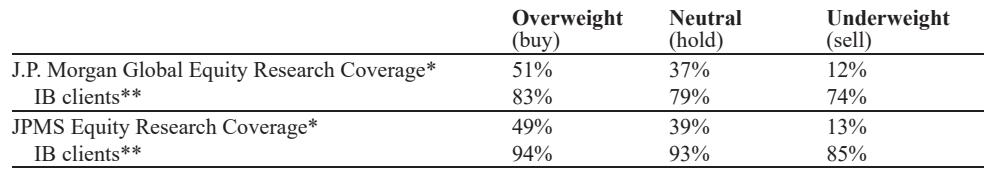

# The AI Infrastructure Battle Has Shifted From Chips to Systems: Why the Next Winner Must Own the Full Stack

The most important signal from Computex 2026 is not a new chip announcement. It is the structural shift in how the semiconductor industry must compete. For the past two years, the narrative has been about raw compute performance—more teraflops, larger memory bandwidth, faster interconnects. That era is ending. The defining competitive advantage in AI infrastructure is no longer the chip alone; it is the ability to design, integrate, and optimize the entire hardware-software stack from silicon to data center power management.

NVIDIA's GTC keynote at Computex made this unmistakably clear. The company unveiled its first Windows PC processor, the N1X, in partnership with MediaTek, but the real weight of the presentation was not on the product itself. It was on the architecture of the AI factory. NVIDIA introduced DSX, a full-stack infrastructure reference design that moves beyond selling chips and racks to offering a complete blueprint for AI data centers. This is not a product launch. It is a strategic pivot that redefines the competitive landscape for every company in the Asian tech supply chain.

Why does this matter now? Because the capital intensity of AI infrastructure is escalating at a pace that makes previous technology cycles look modest. The report notes that the cost per gigawatt of AI data center capacity may rise from $20-30 billion in prior generations to $80-100 billion in the future. At these levels, customers—primarily cloud service providers—cannot afford to assemble best-of-breed components from disparate vendors. They need integrated solutions that minimize power waste, maximize token throughput, and reduce deployment complexity. The company that can deliver that integration wins. The one that cannot becomes a commodity supplier.

The implications for investors, strategists, and technology executives are profound. The next phase of growth in AI hardware will not be evenly distributed. It will favor those who can control the full stack, from CPU design to cooling systems to software orchestration. This article unpacks the five strategic takeaways from the Computex analysis that every decision-maker should understand.

## NVIDIA's Vera Rubin Production Ramp Confirms That the Bottleneck Has Shifted From Design to Supply Chain Execution

The report confirms that NVIDIA's Vera Rubin platform is now in full production, with Microsoft and Dell/CoreWeave already standing up engineering racks. This is not a surprise—the timeline is largely in line with expectations. What matters is what this production ramp reveals about the changing nature of competitive advantage.

The production efficiency improvement is staggering. Vera Rubin racks can now be assembled in approximately five minutes, compared with two hours for the prior Blackwell generation. This 24x reduction in assembly time comes from eliminating cabling and fans in favor of liquid cooling and a mid-plane PCB for interconnections. This is not merely an operational improvement; it is a structural barrier to entry. Any competitor that cannot match this level of integration will face a permanent cost disadvantage.

The report also highlights that Vera Rubin's emphasis is on co-design of compute elements—Vera CPU, Bluefield DPU, storage rack, Spectrum SPX rack with co-packaged optics, and LPX for fast tokens—to enable 10x higher token throughput compared to GB300s. The metric that matters here is not teraflops but "revenue per gigawatt." NVIDIA is optimizing for the economics of the AI factory, not the benchmark score.

Yet the report also flags a critical constraint: HBM4 supply and CoWoS-L packaging issues will likely limit Rubin shipments through 2026. The estimate of approximately 2 million units of front-end shipments translating to roughly 10,000 racks of VR200 NVL 72 deliveries in 2026 suggests that supply, not demand, remains the binding constraint. For investors, this means the winners in the supply chain—TSMC, OSATs like ASE, substrate vendors—will continue to benefit from tight capacity well into 2027. The losers will be those who cannot secure allocation.

## The Vera CPU Represents NVIDIA's Most Underappreciated Growth Vector and Signals a New Competitive Front in the Data Center

Perhaps the most strategically significant detail in the report is the heavy focus on the Vera CPU. Jensen Huang spent significant time detailing a CPU designed specifically for agentic AI workloads. This is not an incremental improvement on existing x86 architectures. It is a purpose-built processor that delivers 1.8x agentic AI sandbox performance versus x86, with the highest instructions per clock in the world.

The technical specifications are impressive: first to implement PCIe 6 and LPDDR5X memory at 1.2 TB/s, delivering 3x bandwidth both internally and externally while consuming 40% lower peak memory latency. On database workloads, Vera runs SQL 3x faster than x86. But the strategic implication is what matters. NVIDIA is positioning standalone Vera CPU sales as a major incremental growth driver, with shipments expected to ramp from approximately 0.6 million units in 2026 to over 3 million units in 2027.

This is a direct assault on the traditional CPU duopoly of Intel and AMD, and it opens a new total addressable market for the semiconductor ecosystem. The report explicitly notes that datacenter CPUs represent a very strong new TAM growth opportunity, adjacent to AI accelerators, which should prolong supply shortages well into 2027. For cooling suppliers, CPU racks have more cold plates and quick disconnects, potentially benefiting companies like AVC and Fositek.

The open question that the report does not fully answer is how quickly the hyper scalers will adopt Vera as a standalone CPU versus continuing to use x86 for general-purpose workloads. The report mentions that Qualcomm and potentially MediaTek are entering the fray, along with in-house projects at all major CSPs. The competitive dynamics here are still fluid, and the outcome will depend on software ecosystem compatibility, not just hardware performance.

## Agentic AI Workloads Will Redesign the Compute Architecture, Splitting Processing Between Edge and Cloud in Ways That Most Investors Have Not Modeled

Both NVIDIA and Qualcomm spent significant keynote time on agentic AI workloads, and for good reason. The report projects that token consumption will grow 40x from 2026 to 2030. But the more important insight is where that compute will happen.

Qualcomm's CEO explicitly stated that agentic AI workload will be distributed between on-device and cloud over time, unlike now where almost 100% of AI workload resides in the cloud. This is a fundamental shift. If agents are to work across multiple devices—smartphones, PCs, smart glasses, cars—then the compute must be distributed. Qualcomm indicated that certain workloads such as coding and webpage creation could run with 30-60% fewer tokens using a device-cloud hybrid approach.

NVIDIA's N1X processor, designed for Windows PCs, is the clearest signal of this trend. With 1 petaflop of AI capability and the ability to run 120 billion parameter LLMs at up to a 1 million context window, it brings high-end token processing to the client device. NVIDIA envisions this as a key enabler for bringing AI agents to personal computers.

But the report also raises a critical caveat: the re-imagining of the application suite for agentic AI and the compatibility of legacy x86 applications remain key factors in determining success. This has been the Achilles' heel of Qualcomm's ARM PC growth, and it will be the same for NVIDIA's N1X. The question is not whether the hardware can perform, but whether the software ecosystem will follow.

The near-term outlook, according to the report, is that the quest for faster LLMs will keep most compute on the cloud. This means the edge AI replacement cycle is a medium-term thesis, not a near-term catalyst. The report hints that Apple's WWDC announcements could be more important than anything shown at Computex for giving momentum to edge-based AI compute.

## What the Report Does Not Fully Answer: The Software and Ecosystem Dependency That Will Determine Whether Hardware Wins Translate into Market Share

For all its analytical rigor, the report leaves several critical questions unresolved. The most important is the software and ecosystem dependency that will determine whether the impressive hardware specifications translate into actual market share.

For NVIDIA's N1X in Windows PCs, the success factor is not the 1 petaflop of AI capability. It is whether Microsoft and independent software vendors will re-architect their applications for agentic AI workflows, and whether legacy x86 application compatibility can be maintained. The report notes that these are "still key factors in determining the success of this product in the medium term," but it does not provide a framework for assessing the probability of either condition being met.

For the Vera CPU in data centers, the question is whether the software ecosystem—compilers, libraries, orchestration tools—will support a smooth transition from x86. NVIDIA has CUDA-X libraries and Nemotron open models, but the CPU market has decades of software inertia behind x86. The report does not address how quickly enterprises and cloud providers can migrate their CPU-bound workloads to Vera.

For the edge AI thesis, the report acknowledges that the timing of a replacement cycle for edge devices is uncertain. Qualcomm expects agentic AI to redesign how applications are written for personal devices, but the report does not provide a timeline or a catalyst for when this redesign will happen at scale.

These are not criticisms of the report; they are the natural boundaries of any forward-looking analysis. But they are precisely the questions that investors and strategists need to answer for themselves. The hardware roadmap is clear. The software and ecosystem roadmap is not.

## A Decision Framework for Evaluating AI Infrastructure Investments in the Post-Chip Era

Given the structural shift from chips to systems, investors need a new framework for evaluating opportunities. The old framework—compare teraflops, memory bandwidth, and power efficiency—is no longer sufficient. Here is a four-part framework derived from the report's logic.

First, assess integration capability. The key metric is not chip performance but rack-level efficiency. NVIDIA's ability to reduce rack assembly time from two hours to five minutes is a competitive moat that no chip vendor can replicate without full-stack control. Companies that can demonstrate similar levels of system-level integration—whether in cooling, power management, or interconnect—will have pricing power. Those that cannot will face margin compression.

Second, evaluate exposure to the data center CPU TAM. The report identifies datacenter CPUs as a very strong new growth opportunity adjacent to AI accelerators. For semiconductor ecosystem players—TSMC, OSATs, substrate vendors—this represents a multi-year demand tailwind. For cooling suppliers, the shift to CPU racks with more cold plates and quick disconnects creates specific product opportunities. The question for each company is whether they have the capacity and technology to capture this new demand.

Third, analyze the edge AI timing. The report suggests that the edge AI replacement cycle is real but not imminent. The key watch point is whether increasing edge AI adoption will stimulate incremental PC unit shipments. For now, the answer appears to be no. Investors should model edge AI as a medium-term catalyst, not a near-term driver, and should focus on companies that have both cloud and edge exposure to hedge against timing uncertainty.

Fourth, monitor the software ecosystem. The success of every hardware product discussed in the report depends on software compatibility and application redesign. The report does not provide a way to measure this, but investors can track developer adoption of NVIDIA's CUDA-X libraries, the number of applications optimized for agentic AI workflows, and the progress of x86 emulation on ARM and Vera architectures.

## The Unresolved Questions That Make This Report Essential Reading

The Computex analysis raises more strategic questions than it answers, and that is precisely its value. The most important unresolved question is whether the AI infrastructure market will consolidate around a single full-stack provider or remain fragmented across specialized vendors. NVIDIA is clearly pursuing the former strategy, but the report notes that Qualcomm and MediaTek are entering the CPU market, and all major CSPs have in-house projects. The outcome of this competitive dynamic will determine the shape of the semiconductor industry for the next decade.

A second unresolved question is the pace of the edge AI transition. The report is cautiously optimistic but provides no catalyst for acceleration. Will Apple's WWDC provide that catalyst? Will enterprise adoption of AI agents drive demand for on-device compute? Or will the cloud remain dominant for the foreseeable future? The answer has profound implications for PC and smartphone vendors, as well as for the entire mobile semiconductor ecosystem.

A third question is the sustainability of the supply chain tightness. The report expects supply shortages to continue well into 2027, but this depends on demand growth, capacity additions, and the pace of technological transition. If agentic AI workloads grow faster than expected, or if Vera CPU adoption surprises to the upside, the shortages could persist longer. If demand softens or capacity comes online faster, the cycle could turn.

These are not questions that can be answered from a single report. They require ongoing analysis, supply chain checks, and a deep understanding of the technology and competitive dynamics. The report provides the foundation; the reader must build the structure.

Join the community to read the full report and review the original charts.

*This article is for learning and discussion only and does not constitute investment advice.*

Personal reading notes and learning share only. Not investment advice.

