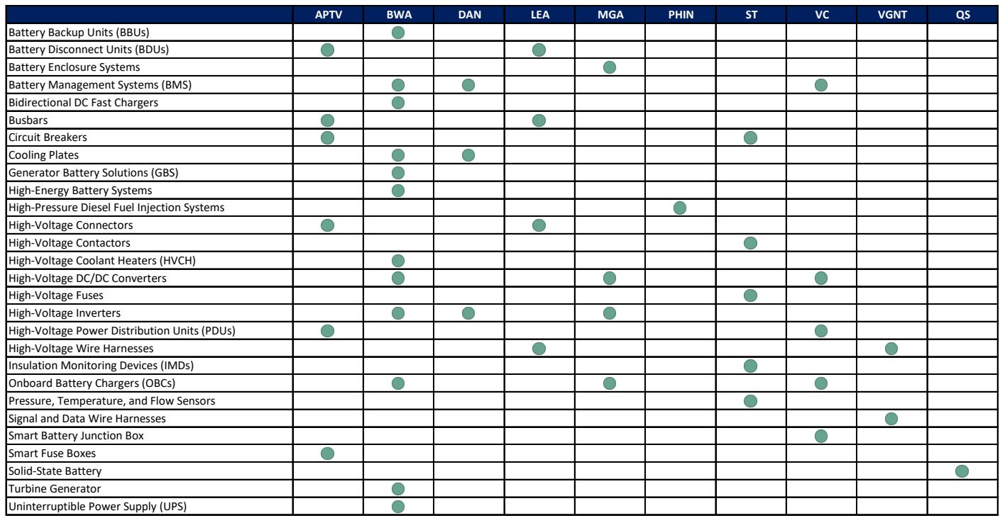

# 市场真正低估的不是电动车需求，而是汽车供应商的800V技术迁移能力

当投资者仍在争论电动车渗透率何时见顶时，一份来自某外资投行的研报提出了一个截然不同的叙事框架：汽车供应商真正的增长期权，可能不在四轮上，而在AI数据中心和电池储能系统里。

这份研报的核心判断非常直接——汽车零部件公司为800V电动车架构积累的技术能力，恰好是下一代AI数据中心和储能系统最稀缺的基础设施组件。这不是一个“可能有机会”的模糊判断，而是一个有产品、有路径、有时钟的增量市场迁移。

更关键的是，这份报告指出，当前市场对这些公司的估值，几乎完全没有反映这一增量。换句话说，如果这个判断成立，部分汽车供应商正在被市场以“传统周期股”的框架定价，而它们实际上拥有一个几乎纯增量的、与AI基础设施挂钩的增长期权。

为什么这件事现在变得重要？因为2025年的市场环境与2018年截然不同。当时市场对自动驾驶和电动车的狂热，更多建立在消费者接受度、监管推动和远期技术上。而今天AI数据中心的资本开支和储能需求，背后是真实的经济回报和明确的电力基础设施升级路径。报告特别指出，当前来自汽车和非汽车投资者对AI相关机会的兴趣，已经达到2018年自动驾驶/电动车狂热时期的高点，但这一次的底层逻辑更扎实。

## 1. 800V架构迁移正在创造一个新的电力基础设施供应链

理解这个机会，首先要理解一个技术事实：下一代AI数据中心正在从传统的400V架构转向800V直流电架构。

原因并不复杂。随着GPU集群密度持续提升，传统的电力输送方式遇到了物理瓶颈。在更低电压下，要传输相同功率需要更大的电流，这意味着更粗的电缆、更多的热量、更高的能量损耗。800V架构的核心优势在于，通过提高电压来降低电流，从而在同样的功率下大幅减少热损耗和线缆尺寸，让更密集的算力部署成为可能。

报告引用NVIDIA的观点，认为800V直流电将成为“下一代智能的基础架构”。预计首批800V架构的部署将在2027年伴随下一代机架级系统（Kyber）落地，并在2020年代末加速普及。

这个架构变化带来的供应链机会是结构性的。传统的AI数据中心电力输送链条复杂，电力从电网以交流电进入后，需要经过多次交直流转换，最终以较低电压输送到服务器。而800V架构简化了这一流程：电力在电网边缘完成一次交直流转换，然后以高压直流电的形式在数据中心内部高效分配，仅在最接近服务器的环节进行降压。

这意味着，整个电力分配环节的核心组件需要重新设计。高压连接器、汇流排、直流-直流转换器、高压接触器、传感器——这些原本为800V电动车开发的产品，突然在AI数据中心找到了新的应用场景。

报告还指出，储能系统同样存在类似的800V迁移逻辑。在传统储能系统中，电池电力需要经过多次交直流转换，造成能量损耗。800V架构允许电池以高压直流形式更直接地输出能量，减少转换次数，提升效率。

## 2. 汽车供应商的核心竞争力恰好匹配这个新需求

汽车供应商为什么有机会？不是因为它们“碰巧”有相关产品，而是因为800V电动车供应链与800V数据中心基础设施供应链在底层能力上高度重合。

汽车行业过去几年为支持800V电动车平台，已经投入了大量研发和产能。这些供应商在功率电子、高压连接、热管理、传感器等领域建立了深厚的技术积累。更重要的是，它们学会了如何以“汽车级”的精度和可靠性进行大规模制造，管理复杂的全球供应链。

报告认为，技术能力本身不是瓶颈。真正需要解决的问题，是如何将汽车领域的经验翻译到新的终端市场，以及建立相应的销售能力。但这对于已经在全球范围内管理复杂供应链的汽车供应商来说，并非不可逾越的障碍。

报告用一张能力矩阵图系统梳理了10家汽车供应商在800V相关产品上的布局。从这张图可以看出，不同公司的切入点各不相同，但整体上形成了一个完整的800V组件图谱。

博格华纳（BWA）是布局最全面的公司之一。它已经推出了TurboCell产品、储能系统以及双向微电网逆变器。报告特别指出，博格华纳还具备逆变器、转换器以及固态变压器（SST）所需的技术能力——后者是800V数据中心架构中可能采用的前沿技术。

安波福（APTV）的优势在于高压连接器和汇流排。报告认为，这让市场对其8-10%的非汽车业务年增长目标更有信心。一个有趣的对比是，虽然安费诺（APH）和泰科电子（TEL）也在高压连接器领域有布局，但它们已经在AI电力领域有部分收入，而安波福的这些机会几乎是纯增量的。

森萨塔（ST）的机会则来自数据中心从风冷向液冷转型过程中的传感器需求增加。压力、温度、流量传感器在液冷系统中成为关键监控组件。同时，森萨塔为800V电动车开发的高压接触器，也可以直接用于新的800V应用场景。

## 3. 市场规模正在快速成型，但具体产品的TAM仍需验证

报告给出了一个让人印象深刻的市场规模框架。

在AI数据中心侧，UBS Evidence Lab的数据显示，全球数据中心电力容量中，在建或规划中的规模达到181GW，而目前运营中的容量为121GW。排除中国后，仍有172GW的规划或在建容量。报告估计，从2027年到2030年，新增的800V电力容量可能达到40GW。按照每兆瓦约400万美元的设备支出计算，这意味着每GW约40亿美元的市场机会。

在储能侧，全球储能需求预计将从2025年的约334GWh增长到2030年的约1.6TWh。排除中国后，这一数字约为591GWh。按照美国国家可再生能源实验室对电池资本成本的估算，2027-2030年全球储能市场的累计TAM约为1.3万亿美元，排除中国后约为5090亿美元。

但报告也诚实地指出，这些数字是宏观层面的市场规模估算。具体到每个产品组件的TAM，因为800V直流电架构仍处于非常早期的发展阶段，架构本身可能随时间演变，目前很难做出精确的测算。报告对某些关键产品给出了范围较宽的估算，但核心价值在于识别出哪些产品可以找到新的应用场景。

## 4. 报告尚未完全回答的关键问题：技术路径的演变与竞争格局的模糊

尽管这份报告的框架非常清晰，但有几个关键问题仍需要进一步验证。

第一个问题是技术路径的不确定性。800V直流电架构虽然逻辑上成立，但从NVIDIA规划的2027年首批部署到大规模普及，中间还有很长的路。架构本身可能随时间演变，这意味着今天看起来有优势的产品组合，可能在三年后需要调整。报告也承认，“架构仍处于初期阶段，虽然我们描述的是一种合理的发展路径，但很多事情仍可能改变。”

第二个问题是竞争格局的模糊性。报告主要分析了汽车供应商的能力和机会，但并没有深入讨论来自传统电力设备供应商、工业自动化公司以及新兴创业公司的竞争压力。汽车供应商的“汽车级”制造能力确实是优势，但电力设备行业的客户关系、认证体系和销售渠道同样构成壁垒。汽车供应商能否在这些领域快速建立竞争力，仍然是一个需要观察的问题。

第三个问题是估值框架的缺失。报告指出了“能力+机会+低估值”的组合，但没有给出具体的估值测算。如果这些增量机会开始兑现，合理的估值倍数应该是多少？市场是否会像对待其他AI基础设施供应商一样，给予这些汽车供应商更高的估值？这些问题在报告中留下了讨论空间。

## 5. 如何观察这个逻辑的兑现：三个关键信号

对于希望跟踪这个逻辑的读者，有几个关键的观察节点值得关注。

第一个信号是头部汽车供应商的非汽车业务收入披露。如果博格华纳、安波福、森萨塔等公司在未来几个季度的财报中，开始单独披露与AI数据中心或储能相关的收入，这将是最直接的验证。

第二个信号是NVIDIA的800V架构落地进度。报告明确提到，首批800V架构预计在2027年伴随Kyber系统落地。如果这个时间表提前或延后，将直接影响相关供应商的收入时间窗口。

第三个信号是汽车供应商在非汽车领域的并购或合作公告。如果这些公司开始收购电力设备领域的标的，或者与数据中心运营商、储能系统集成商建立战略合作，说明它们正在将技术能力转化为商业落地。

这三个信号共同构成了这个投资逻辑的“验证链”。如果三个信号同时兑现，那么市场对汽车供应商的定价框架可能需要重新审视。

这份报告最有趣的地方在于，它不是在讲一个“汽车行业转型”的故事，而是在讲一个“技术能力的跨行业迁移”的故事。汽车供应商的800V技术能力，在电动车需求放缓的背景下，找到了新的应用场景。而市场目前对这个机会的定价，几乎为零。

但正如报告所承认的，800V直流电架构仍处于早期阶段，技术路径和竞争格局都存在不确定性。这正是需要持续跟踪和深入讨论的地方。

欢迎来星球微信群里继续讨论这些未解问题——哪些公司最有可能率先兑现增量收入，技术路径演变对产品组合意味着什么，以及市场何时会开始重新定价这些“隐藏的AI供应商”。

Personal reading notes and learning share only. Not investment advice.

