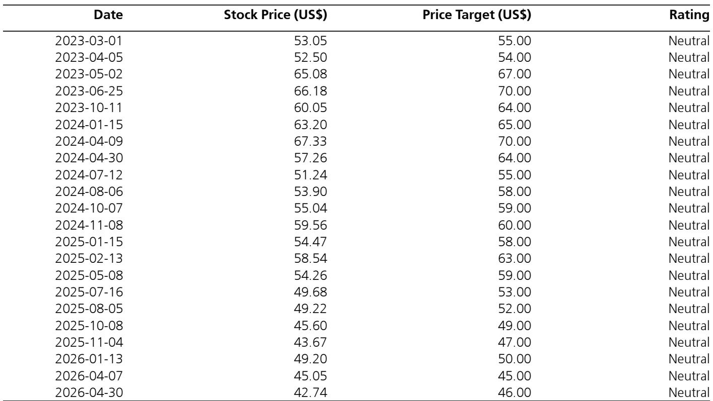
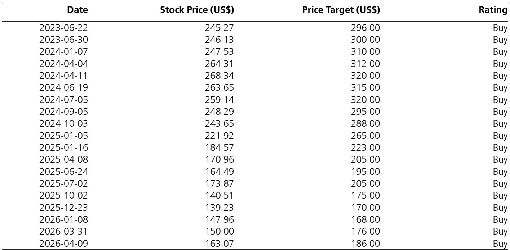
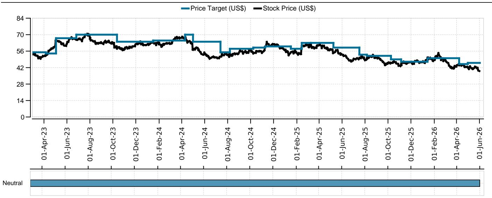

# The 2026 World Cup Will Lift US Beer Volumes by Less Than 1%, Making It a Marketing Event, Not a Demand Inflection

The 2026 FIFA World Cup, hosted across the United States, Canada, and Mexico, represents the most significant global sporting event ever staged in North America. For a US beer industry grappling with persistent volume declines driven by health-conscious consumers and demographic headwinds, this tournament has become a focal point of investor optimism. Yet a careful examination of historical data from prior World Cups and comparable US sporting events reveals a sobering reality: the total annual volume uplift for US beer will likely register in the low single digits, translating to less than a 1% boost on an annualized basis. This conclusion is not a dismissal of the event's importance. Rather, it reframes the World Cup as a powerful but narrow marketing opportunity, one that benefits specific brands and distribution channels without reversing the structural challenges facing the broader category. The strategic question for investors is not whether beer volumes will rise, but which companies are best positioned to convert temporary shelf-space gains into durable brand advantage.

The current beverage alcohol landscape is defined by tepid demand, shifting consumer preferences toward lower-alcohol and no-alcohol alternatives, and a long-term erosion of beer's share of stomach. Against this backdrop, management teams across major brewers have consistently highlighted the 2026 World Cup as a catalyst. However, their language is notably measured. Executives describe the event as a "meaningful" tailwind, but one that is "execution-dependent" and unlikely to produce a step-change in underlying demand. This caution is not mere conservatism. It reflects a data-driven understanding that even the largest sporting occasions produce only modest, temporary volume spikes in mature beer markets. The World Cup's true value lies in its role as an extended, multi-week marketing platform that can amplify existing brand strategies, not as a panacea for secular decline.

## Historical World Cup Data Shows Consistent but Modest Volume Uplifts in Host Markets

Analysis of beer volumes during the last three World Cups demonstrates a repeatable pattern of incremental consumption, but the magnitude is consistently limited. In Brazil (2014), total beer volumes rose 3.5% year-over-year. In Russia (2018), volumes increased 3.2% despite a pre-existing downward trend that had seen volumes contract at a CAGR of approximately -5% since 2010. In Qatar (2022), volumes surged 32.1%, but this figure is misleading due to Qatar's exceptionally small base, representing roughly 0.1% of the volume of Brazil or Russia. These data points, drawn from both on-trade and off-trade channels, suggest that a low-single-digit percentage uplift is the reliable expectation for a large, developed host market. The Russian example is particularly instructive: the World Cup temporarily reversed a multi-year decline, but did not alter the underlying trajectory. For the US, which is structurally beer-centric and already the world's largest beer market by revenue, the absolute volume base is so large that even a 3% uplift would represent a significant absolute number, but an annualized impact of less than 1%. Investors should anchor on this range rather than extrapolating from outlier cases.

## Super Bowl Comparisons Confirm That Even Peak Sporting Events Deliver Less Than 1% Annual Volume Impact

To ground expectations further, it is useful to examine the most comparable US sporting event: the Super Bowl. Nielsen data from the previous four Super Bowls indicates that the event adds approximately 7% to weekly beer volumes relative to a seasonally adjusted trend. However, when annualized across 52 weeks, this translates to a roughly 0.13% total annual impact. The World Cup, lasting approximately one month and featuring multiple matches across 11 host cities, will undoubtedly produce a larger absolute effect. But the scaling logic is straightforward: if a single-day event that commands the highest viewership in US television can only move the annual needle by a fraction of a percent, a multi-week tournament cannot generate a step-change. The more realistic comparison is the cumulative effect of March Madness, which spans several weeks but still produces a total annual volume impact well below 1%. The World Cup's advantage lies in its concentrated geographic activation across host cities, where on-premise consumption and retail displays will see meaningful local spikes. But nationally, the arithmetic is unforgiving.

## The Real Strategic Value Lies in Retail Shelf Space and Brand Positioning, Not Aggregate Volume

The most insightful commentary from management teams reveals a more nuanced understanding of the World Cup's value. Boston Beer Company's candid remarks are particularly telling: "I don't think there's going to be a burst of consumption. It'd be a big deal if it went up 1%. We look at it differently. What we're looking at is they changed the retailer's strategies." This perspective reframes the tournament as a competition for retail real estate and consumer mindshare. The World Cup provides a compelling reason for retailers to build displays, grant incremental shelf space, and feature specific brands. For a brand like Truly, which has been losing ground to White Claw in the hard seltzer category, the US Soccer sponsorship offers a tactical opportunity to regain visibility and trial. Similarly, Molson Coors is making its "single largest media investment in many years" tied to the World Cup, while Constellation Brands plans to leverage Modelo's strong Hispanic consumer affinity. The tournament becomes a vehicle for brand differentiation within a zero-sum retail environment. The winners will be those companies that convert temporary display placements into lasting distribution gains, not those hoping for a category-wide volume renaissance.

## What the Report Does Not Fully Answer: The Consumer Spending Environment and Second-Order Effects

The historical data provides a reliable baseline, but it cannot fully account for the current US consumer backdrop, which remains under pressure from elevated inflation, shifting discretionary spending patterns, and growing price sensitivity. The 2014 Brazilian World Cup occurred during a period of economic expansion in that country, while the 2018 Russian tournament benefited from a relatively stable ruble. The 2026 US consumer is navigating a more uncertain environment, with savings rates declining and credit card debt rising. It is plausible that the volume uplift could be lower than historical averages if consumers trade down to cheaper alternatives or reduce overall alcohol spend. Conversely, the tournament's concentration in a wealthy, beer-centric market with high marketing intensity could produce a slightly higher uplift than the Brazilian or Russian examples. The report's framework does not model this sensitivity explicitly, leaving room for investor debate. Additionally, the second-order effects on adjacent categories, such as spirits, wine, and non-alcoholic beverages, are not fully explored. If beer captures incremental consumption, it may come at the expense of other alcohol segments, creating relative winners and losers within the broader beverage alcohol space. Investors should pressure-test these dynamics when evaluating portfolio exposure.

## A Decision Framework for Investors: Three Questions to Determine Which Companies Benefit Most

Rather than treating the World Cup as a single catalyst, investors should evaluate each company's exposure through three lenses. First, brand alignment: does the company own brands with natural affinity to soccer culture, particularly among Hispanic and younger demographics? Constellation Brands, with Modelo and Corona, scores highly here, as does Boston Beer's Truly through its US Soccer sponsorship. Second, retail execution capability: can the company convert temporary display space into sustained distribution gains? This requires strong wholesaler relationships, trade marketing budgets, and the ability to track and measure shelf-space persistence post-event. Third, financial leverage: is the company's current valuation pricing in a volume recovery, or does the World Cup represent a free option? For companies where volumes have been declining, even a modest absolute uplift could produce meaningful earnings leverage if fixed costs are covered. Conversely, companies that are already growing may see the World Cup as a marginal tailwind rather than a needle-mover. By applying this framework, investors can distinguish between companies that are making smart marketing investments and those that are over-relying on an event that, historically, has never transformed a category.

The 2026 World Cup is a genuine opportunity for the US beer industry, but it is an opportunity of scale and precision, not of transformation. The data is clear: the annual volume impact will be less than 1%. The strategic winners will be those companies that use the tournament to strengthen brand equity, secure retail advantage, and deepen consumer relationships in key demographics. The losers will be those that mistake a temporary tailwind for a structural recovery. As the tournament approaches, the most important question is not "how much will beer volumes rise?" but "which brands will still be on the shelf when the final whistle blows?"

Join the community to read the full report and review the original charts.

*This article is for learning and discussion only and does not constitute investment advice.*

Personal reading notes and learning share only. Not investment advice.

