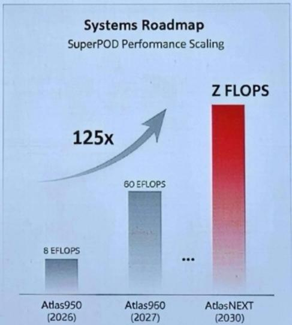
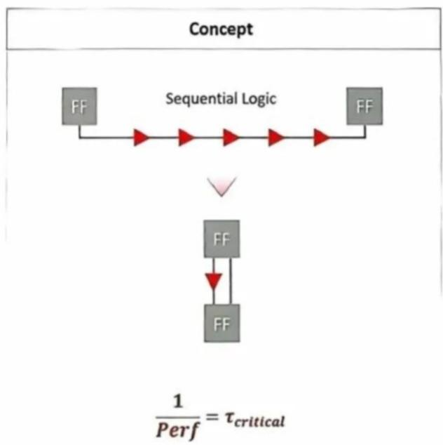
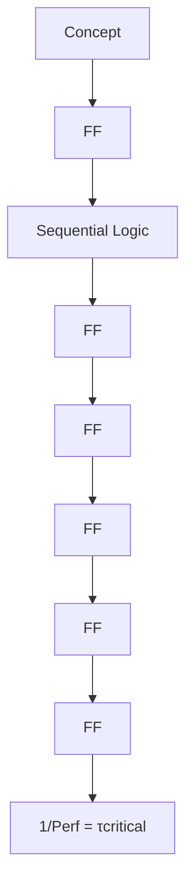
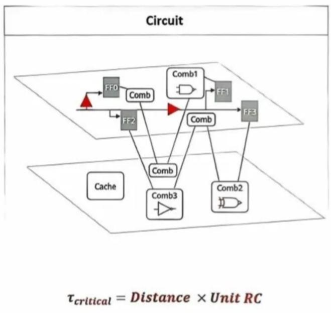
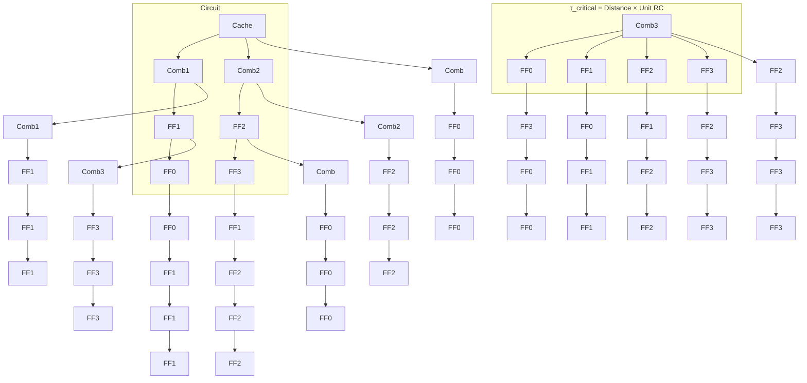

# China Semiconductors

# China Semis: Huawei's LogicFolding, an underestimated breakthrough

Qingyuan Lin, Ph.D.

+852 2123 2654

qingyuan.lin@bernsteinsg.com

Francis Ma

+852 2123 2626

francis.ma@bernsteinsg.com

Huawei unveiled the "Tau ( $\tau$ ) Scaling Law" at ISCAS 2026 on May 25, 2026, we wrote about the implications in our previous report. One of the key tech enabler in the Tau Law is called LogicFolding, which is used to improve chip performance through stacking. Recent market feedback remains skeptical, but the skepticism appears to underappreciate how different LogicFolding is from existing 3DIC packaging solutions that is already commercialized. We believe it could be one of the most important breakthroughs in China semis that is underestimated. This report explains how is the approach is technically differentiated, and why it is impressive.

# Skepticism one: LogicFolding is just copying other 3DIC solutions and won't be able to solve the overheat issue after stacking.

The most common criticism: LogicFolding is the same as other leading 3DIC solutions like TSMC SolC, Intel Foveros Direct, or Samsung 3D Cube. However, if that is the case, then just like these solutions, stacking can easily increase transistor density, but putting two dies on top of each other will inevitably double the power consumption and heat generation, and therefore fail to deliver practical performance gains (actually it will usually lead to lower clock frequency due to overheat). However, spec from Huawei's Kirin 2026 chip showed opposite results: $41\%$ power efficiency gain and $13\%$ frequency improvement. This indicates that LogicFolding is actually a completely different packaging technology. The advance is not merely more transistors per footprint; it is a simultaneous improvement in density, energy efficiency, and frequency that justify itself as the next generation process.

So what is the real differentiation? The key technology breakthrough is, LogicFolding breaks down one functional logic circuits that was originally designed in one die, and distributes that across two vertically stacked wafer layers at the design stage, which is completely different from packaging two independently designed good dies together (usually logic + SRAM).

Why is that important? Because only through this new design, the packaging can reduce the power consumption and increase the frequency. To understand how it works, let's take a step back and think about how logic circuits functions. If we keep it oversimplified, then you can think of the operation of a chip that is basically two parts, the transistors and the interconnects between the transistors. Therefore, power consumption and latency are just the aggregated sum of these two parts. Without node migration, obviously Huawei cannot make any improvement on the transistor level, however they can use the packaging to reduce the power consumption and latency for interconnects. For the traditional 2D design, if two transistors are far away from each other, then talking to each other need to go through a long distance that lead to long latency and high power consumption. But if you use packaging to stack the two transistors on top of each other, the interconnect distance will be much shorter and therefore significantly reducing the power consumption and latency. The Kirin 2026 showed -30% change of wire length in a representative core, which is not yet fully optimized according to their disclosure and thus further improvement could be achieved in next generations.

Why is this breakthrough impressive? To realize the performance gain demonstrated above, there are three challenges: new EDA tool, new circuit design/optimization methodology, and advanced packaging. This is also why LogicFolding should not be treated as interchangeable with conventional 3DIC solutions. These other solutions can solve the packaging challenge, but they don't have EDA and Fabless innovations that are equally critical to achieve these results. The barrier is therefore not only packaging capability, but also design methodology, software tooling, and architecture-level co-development.

This is exactly the reason why I call the Tau's law another DeepSeek moment. Just like DeepSeek, they are forced to innovate on infrastructure as they are constrained on compute power, which helped to reduce the inferencing cost by an order of magnitude. In this case, Huawei is constrained on lithography, but that indeed forced them to innovate on packaging, which is also very critical for the development of China Semis.

# Skepticism two: this solution stays on paper, we can't trust it until we see it.

A second criticism is that LogicFolding is still a research concept that may need years before reaching product commercialization. But the reality is Huawei plans the first commercial LogicFolding implementation in a Kirin smartphone processor scheduled for fall 2026, which is very likely the next Mate series. So it's not years away, it's just months away. If Huawei doesn't have the chip already in volume production, it is hard for us to imaging why they would say this is coming out in next mobile phone. So this tech breakthrough is not just a concept, but already at delivery stage.

Additionally, some may also concern that if the packaging yield is low, then the cost of chip will be so high that it can't really be commercially successful. But we are impressed to see that Huawei claimed that they can achieve $\sim 100\%$ yield through smart redundancy, implying Huawei is already addressing one of the key cost and manufacturability objections associated with this technology. In practice, that means the market can easily see supporting facts in the next few months after product launch, as chip performance benchmark data and teardown evidence should be able to validate whether the performance claims and design novelty are real. Market should re-rate when that happens.

# Skepticism three: Global players can easily copy that

A third criticism is that even if LogicFolding works, global leaders can replicate it quickly, limiting Huawei's long-term advantage. That argument overlooks the complexity of this end-to-end optimization of EDA/design/manufacturing. Most global fabless likely won't be willing to adopt the technology until it's matured, but EDA vendors cannot make improvement if customer is not willing to use it, and foundry also cannot further optimize their packaging process around it. Therefore, although technically global players can copy this concept, the implementation will be very challenging. Note that Huawei is not necessarily the first company to create this idea of vertical logic partitioning, but it is the first to reach commercialization of this technology and achieve impressive power consumption reduction and frequency improvement.

On the other hand, even if global vendors can copy Huawei on that technology and pursue similar architectures, early mover advantages in EDA adaptation, design libraries, process integration, and product learning cycles can still matter materially. That would not erase the node gap with frontier foundries, but it could help Huawei offset part of that gap and potentially narrow competitive distance in selected end markets over time.

We like SMIC, NAURA, Piotech the most under this theme, as this opens up more upside for advance logic demand in China. SMIC could sell more advanced logic chips, NAURA could benefit from acceleration in advanced logic capacity expansion, and Piotech could potentially benefit from the surging bonding tools demand.

BERNSTEIN TICKER TABLE 

<table><tr><td rowspan="2" colspan="3"></td><td colspan="2">3 Jun 2026</td><td rowspan="3">TTM Rel.</td><td rowspan="2" colspan="4">Reported EPS</td><td rowspan="2" colspan="3">Reported P/E (x)</td></tr><tr><td rowspan="2">Closing Price</td><td rowspan="2">Target Perf.</td></tr><tr><td>Ticker</td><td>Rating</td><td>Cur</td><td>Cur</td><td>2025A</td><td>2026E</td><td>2027E</td><td>2025A</td><td>2026E</td><td>2027E</td></tr><tr><td>688981.CH (SMIC-A)</td><td>O</td><td>CNY</td><td>134.00</td><td>120.00</td><td>10.3%</td><td>USD</td><td>0.09</td><td>0.10</td><td>0.13</td><td>231.0</td><td>197.8</td><td>157.1</td></tr><tr><td>981.HK (SMIC-H)</td><td>O</td><td>HKD</td><td>82.95</td><td>70.00</td><td>53.8%</td><td>USD</td><td>0.09</td><td>0.10</td><td>0.13</td><td>123.4</td><td>105.6</td><td>83.9</td></tr><tr><td>688347.CH (Hua Hong-A)</td><td>O</td><td>CNY</td><td>233.24</td><td>140.00</td><td>332.4%</td><td>USD</td><td>0.03</td><td>0.11</td><td>0.16</td><td>N/M</td><td>324.1</td><td>222.0</td></tr><tr><td>1347.HK (Hua Hong-H)</td><td>O</td><td>HKD</td><td>151.70</td><td>100.00</td><td>343.3%</td><td>USD</td><td>0.03</td><td>0.11</td><td>0.16</td><td>609.8</td><td>181.9</td><td>124.6</td></tr><tr><td>002371.CH (NAURA)</td><td>O</td><td>CNY</td><td>614.84</td><td>680.00</td><td>44.4%</td><td>CNY</td><td>5.66</td><td>10.22</td><td>16.41</td><td>108.6</td><td>60.2</td><td>37.5</td></tr><tr><td>688012.CH (AMEC)</td><td>O</td><td>CNY</td><td>285.92</td><td>500.00</td><td>86.6%</td><td>CNY</td><td>3.40</td><td>4.95</td><td>7.18</td><td>84.1</td><td>57.8</td><td>39.8</td></tr><tr><td>688072.CH (Piotech)</td><td>O</td><td>CNY</td><td>615.49</td><td>580.00</td><td>282.3%</td><td>CNY</td><td>3.32</td><td>8.12</td><td>12.40</td><td>185.4</td><td>75.8</td><td>49.6</td></tr><tr><td>688256.CH (Cambricon)</td><td>O</td><td>CNY</td><td>1,378.10</td><td>2,000.00</td><td>187.2%</td><td>CNY</td><td>(1.09)</td><td>5.38</td><td>11.26</td><td>N/M</td><td>256.0</td><td>122.4</td></tr><tr><td>688041.CH (Hygon)</td><td>O</td><td>CNY</td><td>285.94</td><td>280.00</td><td>59.3%</td><td>CNY</td><td>0.83</td><td>1.35</td><td>2.42</td><td>344.5</td><td>211.9</td><td>118.2</td></tr><tr><td>ASIAX</td><td></td><td></td><td>2,056.69</td><td></td><td></td><td></td><td></td><td></td><td></td><td></td><td></td><td></td></tr></table>

O - Outperform, M - Market-Perform, U - Underperform, NR - Not Rated, CS - Coverage Suspended 688256.CH. 688041.CH base year is 2024:   
Source: Bloomberg, Bernstein estimates and analysis.

# INVESTMENT IMPLICATIONS

# We rate SMIC, Hua Hong, NAURA, AMEC, Piotech, Cambricon, Hygon Outperform benefiting from this new roadmap for China Semis.

On beneficiaries, we see the Tau Law roadmap as structurally positive for China's leading foundry, advanced-packaging supply chain, and AI chip ecosystem. On foundry, SMIC is a clear strategic partner and likely a critical enabler if Huawei is to deliver the roadmap and eventually reach TSMC A14-equivalent logic density via multi-die integration without EUV, implying sustained demand for SMIC's most advanced DUV based multi-patterning advanced logic nodes. Hua Hong likely will also benefit as the expected acquisition of Huali who is potentially also working on advanced logic packaging. In semicap, we see upside skewed to domestic tool vendors who has higher exposure for advanced logic and packaging: NAURA should benefit more than AMEC as it has much higher exposure in advanced logic, while Piotech has been working on bonding tools for advanced packaging and thus market will perceive it as one of the core beneficiaries. For AI fabless, Huawei's framework provides a clearer path to sustain performance scaling under EUV constraints, which should be supportive for domestic accelerator and CPU vendors such as Cambricon and Hygon as they co-optimize architectures to exploit higher effective density and lower latency interconnect within China's manufacturing envelope. On the other hand they also face more intense competition from Huawei so the upside will be smaller for the AI fabless names compared to foundry and semicap.

# DETAILS

# HUAWEI'S ROADMAP ON CIRCUITS AND SYSTEMS

In the event, Huawei released its roadmap for chip improvement under the guidance of Tau Scaling Law.

Three key highlights:

1. Fast transistor density improvement. Trough advanced packaging (or so-called 'LogicFolding' by Huawei), they are able to improve the transistor density from 155 MTr/mm^2 in 2025 (HiSilicon Kirin 9030, based on SMIC N+3 node, between TSMC N5 and N7) to 238 MTr/mm^2 in 2026 (equivalent to TSMC N3 node density. Likely that's based on two chips stack on top of each other, for example one SMIC N+3 node chip with another SMIC N+2 node chip, so no longer apple to apple comparison). By 2031, they target to achieve 400+ MTr/mm^2 (equivalent to TSMC 14A density, but again not apple to apple comparison);   
2. Steadily increasing max frequency. The speed of a transistor is generally measured by how fast it can switch, or the frequency, further improvement on the max frequency is achieved through the tau optimization that reduced the latency, which is the critical-path delay between adjacent transistors, which in turn is dominated by interconnect RC;   
3. Exponentially growing AI cluster scaling. On top of improvement on chip performance, the Tau Scaling Law also emphasizes on the improvement of networking between chips to build exponentially larger AI superPoDs, we have illustrated that in the Huawei AI chip roadmap analysis, and now Huawei targets to achieve 125X improvement in superPoD total compute power by 2030, which indicates an aggressive 3.3X improvement every year.

EXHIBIT 1: Huawei's tau scaling roadmap   
τ-Scaling Roadmap: Sustainable PPDC Evolution   

line

| Year | Density* (MTr/mm²) | P-Core Freq. (GHe) |
|------|---------------------|--------------------|
| 2023 | 126                 | 2.6                |
| 2024 | 126                 | 2.65               |
| 2025 | 155                 | 2.75               |
| 2026 | 238                 | 3.1                |
| 2027 | 252                 | 3.39               |
| 2028 | 266                 | 3.71               |
| 2029 | 277                 | 4.0                |
| 2030 | 292                 | 4.3                |
| 2031 | 5.0                 | 400+               |

bar

Systems Roadmap
SuperPOD Performance Scaling
| System | Performance Scaling (EFLOPS) |
| :--- | :--- |
| Atlas950 (2026) | 8 |
| Atlas960 (2027) | 60 |
| AtlasNEXT (2030) | Z FLOPS |
125x

Source: Company reports, Bernstein analysis

# THE LOGICFOLDING INNOVATION

# EXHIBIT 2: Technology improvement in LogicFold

# Sidebar A — LogicFolding at a Glance

- Hybrid-bonding pitch: sub-2 $\mu$ m (1.5 $\mu$ m in Kirin 2026; target gear ratio $\approx$ 1)   
• Overlay accuracy: under 0.5 μm   
- TSV CD/KOZ: sub-1.5 $\mu$ m; pitch sub-6 $\mu$ m; failure rate $< 100$ ppm; repair rate $99.9\%$   
• Yield: \~100% with smart redundancy   
• Transistor density: $155 \rightarrow 238$ MTr/mm $^{2}$ in a single step   
• Power-efficiency / frequency gain (SoC P-core): +41% / +13%   
• SRAM operating frequency: +40%+   
- Clock-buffer count / clock skew / wire length on a representative core: $-50\%$ / $-25\%$ / $-30\%$

Source: Company reports, Bernstein Analysis

# EXHIBIT 3: Illustration of the LogicFolding principle

# LogicFolding

flowchart

flowchart

Source: Company reports, Bernstein analysis

# THE TIME SCALING THEORY

Link to the full technical paper: A Time Scaling Theory for Multi-Layer Electronic Systems

Copying the abstract here:

For six decades, Moore's geometric scaling drove progress in semiconductors. That industry compact no longer holds: returns from pure dimensional shrinking have flattened, leading-edge design budgets exceed one billion dollars per chip, and cost-per-transistor at the most advanced nodes is no longer falling. This perspective argues for a successor scaling principle — T scaling — that adopts time itself, rather than transistor area, as the primary metric of progress, applying a single characteristic time constant T as the unifying optimization target across twelve orders of magnitude, from a switching transistor to a data-center workload. Two production-scale demonstrations are presented. On a mobile SoC, LogicFolding — a methodology that partitions digital, analog, and memory circuits across vertically stacked active tiers — delivers a 55% step-wise increase in transistor density and a 41% power-efficiency gain at a fixed device node. On AI systems, a co-designed stack comprising the memory-semantic Unified Bus fabric, near-packaged Hi-ONE optical I/O, and edge-to-surface 3D Folding projects more than 100× growth in hardware integration by 2035. The deeper claim is methodological: T scaling is the first scaling principle since Dennard to establish a shared optimization target across the entire computing stack.

The theory dictates optimizing and compressing delay $(\tau)$ across four collaborative layers of the compute stack:

- Transistor Level: Reducing intrinsic transistor switching and interconnect delays. This part is where the Moore's law has been making the direct impact, where shrinking the feature size of a transistor help to improve the speed of calculation. Beyond shrinking the size of the feature, changing the structure could also improve transistor performance (e.g. from planner to FinFET to GAA structure). We believe local foundry are also making progress at this level, such as using DUV to manufacture GAA structure;   
- Circuit Level: Implementing LogicFolding (breaking down and vertically stacking logic, memory, and analog blocks using 3D heterogeneous integration and fine-pitch hybrid bonding) to drastically shorten critical wiring and reduce RC loads. Beyond the traditional 3DIC roadmap, Huawei further bring the design from 'Chip to Chip' stacking to 'Cell to Cell' stacking, allow different part of the circuit function (the Combinational logic and Sequential logic, which performs the calculation and memory parts within a transistor) to be stacked on to of each other.   
- Chip Level: Optimizing silicon and software holistically to reduce total execution time. This is commonly cited as 'Design-Technology Co-Optimization' by the industry. As Huawei is forced to build its own know-how on process, and even build its own fabs, it's also possible that Huawei can move faster in the co-optimization to deliver better results at the chip level.   
- System Level: Utilizing memory-semantic unified bus structures (e.g., UnifiedBus) and high-speed optical I/O (e.g., Hi-ONE) to bypass physical distance bottlenecks and compress cluster communication latency from tens of microseconds to \~100 nanoseconds. This is the networking architecture optimization illustrated in Huawei's paper on UB-Mesh (UB-Mesh: a Hierarchically Localized nD-FullMesh Datacenter Network Architecture)

Specifically, in the paper Huawei illustrates the advanced packaging technology that they rely on to get to the impressive 238 MTr/mm^2 transistor density in 2026 that likely will be deployed on its next generation mobile phone Huawei Mate90, and the networking innovations that allow Huawei to deliver more scaling capabilities for AI clusters for the next decade.

# I. REQUIRED DISCLOSURES

References to "Bernstein" or the "Firm" in these disclosures relate to the following entities: Bernstein Institutional Services LLC (April 1, 2024 onwards), Bernstein & Co., LLC (pre April 1, 2024), Bernstein Autonomous LLP, BSG France S.A. (April 1, 2024 onwards), Bernstein (Hong Kong) Limited 盛博香港有限公司, Bernstein (Canada) Limited, Bernstein (India) Private Limited (SEBI registration no. INH000006378), Bernstein (Singapore) Private Limited, Bernstein Japan KK (サンフォード・C・バーンスタイン株式会社) and analysts employed by SG Africa Technologies & Services to produce Bernstein under a Global Services Agreement in place between Bernstein and SG.

Bernstein is part of a joint venture between SG (SG) and AllianceBernstein, L.P. (AB). Unless specifically noted otherwise, for purposes of these disclosures, references to Bernstein's "affiliates" relate to both SG and AB and their respective affiliates.

# VALUATION METHODOLOGY

This research publication covers six or more companies. For valuation methodology and other company disclosures:

Please visit: https://bernstein-autonomous.bluematrix.com/sellside/Disclosures.action.

Or, you can also write to the Director of Compliance, Bernstein Institutional Services LLC, 245 Park Avenue, New York, NY 10167.

# RISKS

This research publication covers six or more companies. For risks and other company disclosures:

Please visit: https://bernstein-autonomous.bluematrix.com/sellside/Disclosures.action.

Or, you can also write to the Director of Compliance, Bernstein Institutional Services LLC, 245 Park Avenue, New York, NY 10167.

# RATINGS DEFINITIONS, BENCHMARKS AND DISTRIBUTION

# EQUITY RATINGS DEFINITIONS

# Bernstein brand

The Bernstein brand rates stocks based on forecasts of relative performance for the next 12 months versus the S&P 500 for stocks listed on the U.S. and Canadian exchanges, versus the Bloomberg Europe Developed Markets Large and Mid Cap Price Return Index EUR (EDME) for stocks listed on the European exchanges and emerging markets exchanges outside of the Asia Pacific region, versus the Bloomberg Japan Large and Mid Cap Price Return Index USD (JPL) for stocks listed on the Japanese exchanges, and versus the Bloomberg Asia ex-Japan Large and Mid Cap Price Return Index (ASIAX) for stocks listed on the Asian (ex-Japan) exchanges -unless otherwise specified.

The Bernstein brand has three categories of ratings:

- Outperform: Stock will outpace the market index by more than 15 pp   
- Market-Perform: Stock will perform in line with the market index to within +/-15 pp   
• Underperform: Stock will trail the performance of the market index by more than 15 pp

Coverage Suspended: Coverage of a company under the Bernstein brand has been suspended. Ratings and price targets are suspended temporarily, are no longer current, and should therefore not be relied upon.

Not Rated: A rating assigned when the stock cannot be accurately valued, or the performance of the company accurately predicted, at the present time. The covering analyst may continue to publish research reports on the company to update investors on events and developments.

Not Covered (NC) denotes companies that are not under coverage.

Bernstein brand stock ratings are based on a 12-month time horizon.

# Autonomous brand – common stocks

The Autonomous brand rates common stocks as indicated below. As our benchmarks we use the Bloomberg Europe 500 Banks And Financial Services Index (BEBANKS) and Bloomberg Europe Dev Mkt Financials Large and Mid Cap Price Ret Index EUR (EDMFI) index for developed European banks and Payments, the Bloomberg Europe 500 Insurance Index (BEINSUR) for European insurers, the S&P 500 and S&P Financials for US banks and Payments coverage, S5LIFE for US Insurance, the S&P Insurance Select Industry (SPSIINS) for US Non-Life Insurers coverage, and the Bloomberg Emerging Markets Financials Large, Mid and Small Cap Price Return Index (EMLSF) for emerging market banks and insurers and Payments. Ratings are stated relative to the sector (not the market).

The Autonomous brand has three categories of common stock ratings:

- Outperform (OP): Stock will outpace the relevant index by more than 10 pp   
- Neutral (N): Stock will perform in line with the market index to within +/-10 pp   
• Underperform (UP): Stock will trail the performance of the relevant index by more than 10 pp

Coverage Suspended: Coverage of a company under the Autonomous research brand has been suspended. Ratings and price targets are suspended temporarily, are no longer current, and should therefore not be relied upon.

Not Rated: A rating assigned when the stock cannot be accurately valued, or the performance of the company accurately predicted, at the present time. The covering analyst may continue to publish research reports on the company to update investors on events and developments.

Those denoted as 'Feature' (e.g., Feature Outperform FOP, Feature Under Outperform FUP) are our core ideas.

Not Covered (NC) denotes companies that are not under coverage.

Autonomous brand common stock ratings are based on a 12-month time horizon.

# Autonomous brand – preferred stocks

The Autonomous brand has three categories of preferred stock ratings:

- Outperform (OP): The total return of the preferred instrument is expected to outperform preferred securities of other issuers operating in similar sectors or rating categories over the next six months.   
- Neutral (N): The total return of the preferred instrument is expected to perform in line with preferred securities of other issuers operating in similar sectors or rating categories over the next six months.   
- Underperform (UP): The total return of the preferred instrument is expected to underperform preferred securities of other issuers operating in similar sectors or rating categories over the next six months.

Autonomous preferred stock ratings are based on a 6-month time horizon.

# AUTONOMOUS CREDIT RESEARCH

Where this report contains investment recommendations for credit instruments, as defined in article 3(1)(35) of the Market Abuse Regulation, the information below is presented to comply with its disclosure requirements.

The report may also include reference(s) to published opinions by other Autonomous or Bernstein analysts covering the equity securities of the issuer(s) referenced herein. Please note an investment recommendation for credit instruments published by the author(s) of this report may differ from the published view of the analyst covering equity securities for the issuer(s) contained in this report and vice versa.

# CREDIT RATINGS DEFINITIONS

The Autonomous brand has three categories of credit ratings:

\- Credit Outperform (C-OP): The total return of the Reference Credit Instrument is expected to outperform the credit spread of bonds of other issuers operating in similar sectors or rating categories over the next six months.

- Credit Neutral (C-N): The total return of the Reference Credit Instrument is expected to perform in line with the credit spread of bonds of other issuers operating in similar sectors or rating categories over the next six months.   
- Credit Underperform (C-UP): The total return of the Reference Credit Instrument is expected to underperform the credit spread of bonds of other issuers operating in similar sectors or rating categories over the next six months.

Autonomous credit ratings are based on a 6-month time horizon.

A list of all investment recommendations produced by the author(s) of this report alongside credit ratings history are available upon request.

It is at the sole discretion of the Firm as to when to initiate, update and cease research coverage. The Firm has established, maintains and relies on information barriers to control the flow of information contained in one or more areas (i.e. the private side) within the Firm, and into other areas, units, groups or affiliates (i.e. public side) of the Firm

DISTRIBUTION OF EQUITY RATINGS/INVESTMENT BANKING SERVICES 

<table><tr><td>Equity Rating</td><td>Market Abuse Regulation (MAR) and FINRA Rating Category</td><td>Global Rating Distribution</td><td>Investment Banking Relationships*</td></tr><tr><td>Outperform</td><td>BUY</td><td>51.1%</td><td>16.5%</td></tr><tr><td>Market-Perform (Bernstein Brand) Neutral (Autonomous Brand)</td><td>HOLD</td><td>36.3%</td><td>17.8%</td></tr><tr><td>Underperform</td><td>SELL</td><td>12.6%</td><td>14.9%</td></tr></table>

\* These figures represent the percentage of companies within each equity rating category for which affiliates of Bernstein have provided investment banking services within the previous 12 months.
As of March 31, 2026. All figures are updated quarterly.

# PRICE CHARTS/ RATINGS AND PRICE TARGET HISTORY

This research publication covers six or more companies. For price chart and other company disclosures, please visit https://bernstein-autonomous.bluematrix.com/sellside/Disclosures.action or you can write to the Director of Compliance, Bernstein Institutional Services LLC, 245 Park Avenue, New York, NY 10167.

# OTHER MATTERS

The legal entity(ies) employing the analyst(s) listed in this report, and their location, can be determined by the country code of their phone number, as follows:

+1 Bernstein Institutional Services LLC; New York, New York, USA   
+44 Bernstein Autonomous LLP; London UK   
+212 SG Africa Technologies & Services; Casablanca, Morocco   
+33 BSG France S.A.; Paris, France   
+34 BSG France S.A.; Madrid, Spain   
+41 Bernstein Autonomous LLP; Geneva, Switzerland   
+49 BSG France S.A.; Frankfurt, Germany   
+91 Bernstein (India) Private Limited; Mumbai, India   
+852 Bernstein (Hong Kong) Limited 盛博香港有限公司; Hong Kong, China   
+65 Bernstein (Singapore) Private Limited; Singapore

+81 Bernstein Japan KK; Tokyo, Japan

Where this report has been prepared by research analyst(s) employed by a non-US affiliate, such analyst(s), is/are (unless otherwise expressly noted below) not registered as associated persons of Bernstein Institutional Services LLC or any other SEC-registered broker-dealer and are not licensed or qualified as research analysts with FINRA. Accordingly, such analyst(s) may not be subject to FINRA's restrictions regarding (among other things) communications by research analysts with a subject company, interactions between research analysts and investment banking personnel, participation by research analysts in solicitation and marketing activities relating to investment banking transactions, public appearances by research analysts, and trading securities held by a research analyst account.

Where this report has been prepared by research analyst(s) employed by SG Africa Technologies & Services (part of the SG group of companies), it has been prepared on behalf of a Bernstein company under a Global Services Agreement in place between Bernstein and SG.

# CERTIFICATION

Each research analyst listed in this report, who is primarily responsible for the preparation of the content of this report, certifies that all of the views expressed in this publication accurately reflect that analyst's personal views about any and all of the subject securities or issuers and that no part of that analyst's compensation was, is, or will be, directly or indirectly, related to the specific recommendations or views in this publication.

# II. ADDITIONAL GLOBAL CONFLICT DISCLOSURES

It is at the sole discretion of the Firm as to when to initiate, update and cease research coverage. The Firm has established, maintains and relies on information barriers to control the flow of information contained in one or more areas (i.e., the private side) within the Firm, and into other areas, units, groups or affiliates (i.e., public side) of the Firm.

# III. OTHER IMPORTANT INFORMATION AND DISCLOSURES

Separate branding is maintained for "Bernstein" and "Autonomous" research products.

- Bernstein produces a number of different types of research products including, among others, fundamental analysis and quantitative analysis under both the “Autonomous” and “Bernstein” brands. Recommendations contained within one type of research product may differ from recommendations contained within other types of research products, whether as a result of differing time horizons, methodologies or otherwise. Furthermore, views or recommendations within a research product issued under one brand may differ from views or recommendations under the same type of research product issued under the other brand. The Research Ratings System for the two brands and other information related to those Rating Systems are included in the previous section.   
- Autonomous operates as a separate business unit within the following entities: Bernstein Institutional Services LLC, Bernstein Autonomous LLP, Bernstein (Hong Kong) Limited 盛博香港有限公司 and Bernstein (India) Private Limited. For information relating to “Autonomous” branded products (including certain Sales materials) please visit: www.autonomous.com. For information relating to Bernstein branded products please visit: www.bernsteinresearch.com.

Analysts are compensated based on aggregate contributions to the research franchise as measured by account penetration, productivity and proactivity of investment ideas. No analysts are compensated based on performance in, or contributions to, generating investment banking revenues.

This report has been produced by an independent analyst as defined in Article 3 (1)(34)(i) of EU 596/2014 Market Abuse Regulation (“MAR”) and the same article of MAR as it forms part of United Kingdom domestic law by virtue of the European Union (Withdrawal) Act 2018.

To our readers in the United States: Bernstein Institutional Services LLC, a broker-dealer registered with the U.S. Securities and Exchange Commission (“SEC”) and a member of the U.S. Financial Industry Regulatory Authority, Inc. (“FINRA”) is distributing this publication in the United States and accepts responsibility for its contents. Where this material contains an analysis of debt product(s), such material is intended only for institutional investors and is not subject to the US independence and disclosure standards applicable to debt research prepared for retail investors.

Bernstein Institutional Services LLC may act as principal for its own account or as agent for another person (including an affiliate) in sales or purchases of any security which is a subject of this report. This report does not purport to meet the objectives or needs of any specific individuals, entities or accounts.

To our readers in Canada: If this publication pertains to a Canadian domiciled company, it is being distributed in Canada by Bernstein (Canada) Limited, which is licensed and regulated by the Canadian Investment Regulatory Organization. If the publication pertains to a non-Canadian domiciled company, it is being distributed by Bernstein Institutional Services LLC, which is licensed and regulated by both the SEC and FINRA, into Canada under the International Dealers Exemption.

This document may not be passed onto any person in Canada unless that person qualifies as "permitted client" as defined in Section 1.1 of NI 31-103.

To our readers in Brazil: This report has been prepared by Bernstein Institutional Services LLC, and Banco BTG Pactual S.A. ("BTG") is responsible for the distribution of this report in Brazil.

To readers in the United Kingdom: This publication has been issued or approved for issue in the United Kingdom by Bernstein Autonomous LLP, authorised and regulated by the Financial Conduct Authority and located at 60 London Wall, London EC2M 5SH, +44 (0)20-7170-5000. Registered in England & Wales No OC343985.

This document is for distribution only to persons who (i) have professional experience in matters relating to investments falling within Article 19(5) of the Financial Services and Markets Act 2000 (Financial Promotion) Order 2005 (as amended, the “Financial Promotion Order”), (ii) are persons falling within Article 49(2)(a) to (d) (“high net worth companies, unincorporated associations, etc.”) of the Financial Promotion Order, (iii) are outside the United Kingdom, or (iv) are persons to whom an invitation or inducement to engage in investment activity (within the meaning of section 21 of the FSMA) in connection with the issue or sale of any securities may otherwise lawfully be communicated or caused to be communicated (all such persons together being referred to as “relevant persons”). This document is directed only at relevant persons and must not be acted on or relied on by persons who are not relevant persons. Any investment or investment activity to which this document relates is available only to relevant persons and will be engaged in only with relevant persons.

To our readers in the member states of the EEA: This publication is being distributed by BSG France SA, which is authorised and regulated by the Autorité de Contrôle Prudentiel et de Résolution (ACPR) and Autorité des Marchés Financiers (AMF).

To our readers in Hong Kong: This publication is being distributed in Hong Kong by Bernstein (Hong Kong) Limited 盛博香港有限公司, which is licensed and regulated by the Hong Kong Securities and Futures Commission (Central Entity No. AXC846) to carry out Type 4 (Advising on Securities) regulated activities and subject to the licensing conditions mentioned in the SFC Public Register (https://www.sfc.hk/publicregWeb/corp/AXC846/details)). This publication is solely for professional investors, as defined in the Securities and Futures Ordinance (Cap. 571). The purpose of this report is solely to provide an analysis of the issuers referred to in this report and is not intended for any purpose contrary to the laws of Hong Kong.

To our readers in Singapore: This publication is being distributed in Singapore by Bernstein (Singapore) Private Limited, only to accredited investors or institutional investors, as defined in the Securities and Futures Act 2001 of Singapore ("SFA"). Recipients in Singapore should contact Bernstein (Singapore) Private Limited in respect of matters arising from, or in connection with, this publication. Bernstein (Singapore) Private Limited is regulated by the Monetary Authority of Singapore and licensed under the SFA as a capital markets services licence holder for dealing in capital markets products that are securities and collective investment schemes and an exempt financial adviser for advising on, issuing and promulgating analyses and reports on securities. Bernstein (Singapore) Private Limited is registered in Singapore with Company Registration No. 20213710W and located at One Raffles Quay, #27-11 South Tower, Singapore 048583, +65-6230-4612.

To our readers in the People's Republic of China: The securities referred to in this document are not being offered or sold and may not be offered or sold, directly or indirectly, in the People's Republic of China (for such purposes, not including the Hong Kong and Macau Special Administrative Regions or Taiwan, the "PRC") in contravention of any applicable laws of the PRC.

This document does not constitute an offer to sell or the solicitation of an offer to buy any securities in the PRC to any person to whom it is unlawful to make the offer or solicitation in the PRC.

We do not represent that this document may be lawfully distributed, or that any securities may be lawfully offered, in compliance with any applicable registration or other requirements in the PRC, or pursuant to an exemption available thereunder, or assume any responsibility for facilitating any such distribution or offering. In particular, no action has been taken by us which would permit a public offering of any securities or distribution of this document in the PRC. Accordingly, the securities are not being offered or sold within the PRC by means of this document or any other document. Neither this document nor any advertisement or other offering material may be distributed or published in the PRC, except under circumstances that will result in compliance with any applicable laws and regulations.

To our readers in Japan: This publication is being distributed in Japan by Bernstein Japan KK (サンフォード・C・バーンスタイン株式会社), which is registered in Japan as a Financial Instruments Business Operator with the Kanto Local Finance Bureau (registration number: The Director-General of Kanto Local Finance Bureau (FIBO) No.3387) and regulated by the Financial Services Agency. It is also a member of Japan Investment Advisers Association. This publication is solely for qualified institutional investors in Japan only, as defined in Article 2, paragraph (3), items (i) of the Financial Instruments and Exchange Act.

For the institutional client readers in Japan who have been granted access to the Bernstein website by Daiwa Group Inc. ("Daiwa"), your access to this document should not be construed as meaning that Bernstein is providing you with investment advice for any purposes. Whilst Bernstein has prepared this document, your relationship is, and will remain with, Daiwa, and Bernstein has neither any contractual relationship with you nor any obligations towards you.

To our readers in Australia: Bernstein (Hong Kong) Limited 盛博香港有限公司 is responsible for distributing research in Australia. It is regulated by the Securities and Exchange Commission under U.S. laws, by the Financial Conduct Authority under U.K. laws, which differs from Australian laws. Bernstein (Hong Kong) Limited 盛博香港有限公司 is exempt from the requirement to hold an Australian financial services license under the Corporations Act 2001 in respect of the provision of the following financial services to wholesale clients:

• providing financial product advice;   
• dealing in a financial product;   
• making a market for a financial product; and   
• providing a custodial or depository service.

To our readers in India: This publication is being distributed in India by Bernstein (India) Private Limited (SCB India) which is licensed and regulated by Securities and Exchange Board of India ("SEBI") as a research analyst entity under the SEBI (Research Analyst) Regulations, 2014, having registration no. INH000006378 and as a stock broker having registration no. INZ000213537. SCB India is currently engaged in the business of providing research and stock broking services. Please refer to www.bernsteinresearch.in for more information.

- SCB India is a Private limited company incorporated under the Companies Act, 2013, on April 12, 2017 bearing corporate identification number U65999MH2017FTC293762, and registered office at Level 3A, 4th Floor, First International Financial Centre, Plot Nos C-54 and C-55, G Block, Near CBI Office, Bandra Kurla Complex, Bandra (East), Mumbai 400098, Maharashtra, India (Phone No: +91-22-68421401).   
- For details of Associates (i.e., affiliates/group companies) of SCB India, kindly email MUM-BERNSTEIN-InCompliance@bernsteinsg.com.   
• SCB India does not have any disciplinary history as on the date of this report.   
- Except as noted above, SCB India and/or its Associates (i.e., affiliates/group companies), the Research Analysts authoring this report, and their relatives

• do not have any financial interest in the subject company   
- do not have actual/beneficial ownership of one percent or more in securities of the subject company;   
- is not engaged in any investment banking activities for Indian companies, as such;   
• have not managed or co-managed a public offering in the past twelve months for any Indian companies;   
- have not received any compensation for investment banking services or merchant banking services from the subject company in the past 12 months;   
• have not received compensation for brokerage services from the subject company in the past twelve months;   
- have not received any compensation or other benefits from the subject company or third party related to the specific recommendations or views in this report; and   
- do not currently, but may in the future, act as a market maker in the financial instruments of the companies covered in the report.   
- do not have any conflict of interest in the subject company as of the date of this report.

- Except as noted above, the subject company has not been a client of SCB India during twelve months preceding the date of distribution of this research report. Neither SCB India nor its Associates (i.e., affiliates/group companies) have received compensation for products or services other than investment banking, merchant banking or brokerage services from the subject company in the past twelve months.   
- The principal research analyst(s) who prepared this report, members of the analysts' team, and members of their households are not an officer, director, employee or advisory board member of the companies covered in the report.   
- Our Compliance officer / Grievance officer is Ms. Rupal Talati, who can be reached at +91-22-68421451, or MUM-BERNSTEIN-InCompliance@bernsteinsg.com / Scbin-investorgrievance@bernsteinsg.com   
- The Research investor charter and Terms & Conditions of SCB India are available on its website and may be accessed at Bernstein (India) Private Limited (https://bernsteinresearch.in/) for your reference.   
- Disclaimer: Registration granted by SEBI, and certification from NISM, is in no way a guarantee of performance of the intermediary or provide any assurance of returns to investors. Investments in securities market are subject to market risks. Read all the related documents carefully before investing.

To our readers in Switzerland: This document is provided in Switzerland by or through Bernstein Autonomous LLP, and is provided only to qualified investors as defined in article 10 of the Swiss Collective Investment Scheme Act (“CISA”) and related provisions of the Collective Investment Scheme Ordinance and in strict compliance with applicable Swiss law and regulations. The products mentioned in this document may not be suitable for all types of investors. This document is based on the Directives on the Independence of Financial Research issued by the Swiss Bankers Association (SBA) in January 2008.

To our readers in the Middle East: Bernstein Autonomous LLP, DIFC branch has its principal office at Gate Village 06, DIFC, Dubai, UAE. Bernstein Autonomous LLP, DIFC branch is regulated by the Dubai Financial Services Authority (DFSA) with the registration number CL10040 and is provisioned for Arranging Deals in Investments and Advising on Financial Products. All communications and services are directed at Professional Clients and Market Counterparties only (as defined in the DFSA rulebook). Persons other than Professional Clients and Market Counterparties, such as Retail Clients, are not the intended recipients of our communications or services.

# LEGAL

All research publications are disseminated to our clients through posting on the firm's password protected websites, bernsteinresearch.com and autonomous.com. Certain, but not all, research publications are also made available to clients through third-party vendors or redistributed to clients through alternate electronic means as a convenience.

This publication has been published and distributed in accordance with the Firm's policy for management of conflicts of interest in investment research, a copy of which is available from Bernstein Institutional Services LLC, Director of Compliance, 245 Park Avenue, New York, NY 10167. Additional disclosures and information regarding Bernstein's business are available on our website www.bernsteinresearch.com.

The securities described herein may not be eligible for sale in all jurisdictions or to certain categories of investors where that permission profile is not consistent with the licenses held by the entities noted herein. This document is for distribution only as may be permitted by law. This publication is not directed to, or intended for distribution to or use by, any person or entity who is a citizen or resident of, or located in any locality, state, country or other jurisdiction where such distribution, publication, availability or use would be contrary to law or regulation or which would subject any of the entities referenced herein or any of their subsidiaries or affiliates to any registration or licensing requirement within such jurisdiction. This publication is based upon public sources we believe to be reliable, but no representation is made by us that the publication is accurate or complete. We do not undertake to advise you of any change in the reported information or in the opinions herein. This publication was prepared and issued by entity referred to herein for distribution to eligible counterparties or professional clients. This publication is not an offer to buy or sell any security, and it does not constitute investment, legal or tax advice. The investments referred to herein may not be suitable for you. Investors must make their own investment decisions in consultation with their professional advisors in light of their specific circumstances. The value of investments may fluctuate, and investments that are denominated in foreign currencies may fluctuate in value as a result of exposure to exchange rate movements. Information about past performance of an investment is not necessarily a guide to, indicator of, or assurance of, future performance.

This report is directed to and intended only for our clients who are “eligible counterparties”, “professional clients”, “institutional investors” and/or “professional investors” as defined by the aforementioned regulators, and must not be redistributed to retail clients as defined by the aforementioned regulators. Retail clients who receive this report should note that the services of the entities noted herein are not available to them and should not rely on the material herein to make an investment decision. The result of such act will not hold the entities noted herein liable for any loss thus incurred as the entities noted herein are not registered/ authorised/ licensed to deal with retail clients and will not enter into any contractual agreement/arrangement with retail clients. This report is provided subject to the terms and conditions of any agreement that the clients may have entered into with the entities noted herein. All research reports are disseminated on a simultaneous basis to eligible clients through electronic publication to our client portal.

The information in this report was prepared by Bernstein solely for the internal business use of our clients. Clients may store, display, analyze, reformat and print the information in this report for this limited use only. Clients may not copy, alter, create derivative works, resell, reverse engineer, commercially exploit, share or distribute any part of the information contained herein for any purpose without Bernstein's express written consent. These restrictions include extracting data or using the content to develop indices or other products. Further, you may not use this report, or any portion of this report, to train or finetune any third-party machine learning or artificial intelligence system, or as a prompt or input into any such system. You also may not, without Bernstein's express written consent, do any of the foregoing in connection with your own internal machine learning or artificial intelligence system.

Bernstein may use artificial intelligence tools in the preparation of its materials. Any such materials are reviewed by Bernstein's research analysts prior to publication.

This report has been prepared for information purposes only and is based on current public information that we consider reliable, but the entities noted herein do not warrant or represent (express or implied) as to the sources of information or data contained herein are accurate, complete, not misleading or as to its fitness for the purpose intended even though the entities noted herein rely on reputable or trustworthy data providers, it should not be relied upon as such. Opinions expressed are the author(s)' current opinions as of the date appearing on the material only and we do not undertake to advise you of any change in the reported information or in the opinions herein.

This publication was prepared and issued by the entity referred to herein for distribution to eligible counterparties or professional clients. The information in this report is intended for general circulation and does not constitute an offer to buy or sell any security, investment, legal or tax advice nor a personal recommendation, as defined by any of the aforementioned regulators. It does not take into account the particular investment objectives, financial situations, or needs of individual investors. The report has not been reviewed by any of the aforementioned regulators and does not represent any official recommendation from the aforementioned regulators. The investments referred to herein may not be suitable for you. Investors must make their own investment decisions in consultation with advice sought from a financial adviser regarding the suitability of the investment product, taking into account the specific investment objectives, financial situation or particular needs of any recipient of the recommendation, before the recipient makes a commitment to purchase the investment product.

The analysis contained herein is based on numerous assumptions. Different assumptions could result in materially different results. The information in this report does not constitute, or form part of, any offer to sell or issue, or any offer to purchase or subscribe for shares, or to induce engage in any other investment activity. The value of any securities or financial instruments mentioned in this report may fluctuate subject to market conditions. Information about past performance of an investment is not necessarily a guide to, indicative of, or assurance of future performance. Estimates of future performance mentioned by the research analyst in this report are based on assumptions that may not be realized due to unforeseen factors like market volatility/fluctuation. In relation to securities or financial instruments denominated in a foreign currency other than the clients' home currency, movements in exchange rates will have an effect on the value, either favorable or unfavorable. Before acting on any recommendations in this report, recipients should consider the appropriateness of investing in the subject securities or financial instruments mentioned in this report and, if necessary, seek for independent professional advice.

The securities described herein may not be eligible for sale in all jurisdictions or to certain categories of investors where that permission profile is not consistent with the licenses held by the entities noted herein. This document is for distribution only as may be permitted by law. It is not directed to, or intended for distribution to or use by, any person or entity who is a citizen or resident of or located in any locality, state, country or other jurisdiction where such distribution, publication, availability or use would be contrary to law or regulation or would subject the entities noted herein to any regulation or licensing requirement within such jurisdiction.

Source: Bloomberg Index Services Limited. BLOOMBERG® is a trademark and service mark of Bloomberg Finance L.P. and its affiliates (collectively "Bloomberg"). Bloomberg or Bloomberg's licensors own all proprietary rights in the Bloomberg Indices. Neither Bloomberg nor Bloomberg's licensors approves or endorses this material, or guarantees the accuracy or completeness of any information herein, or makes any warranty, express or implied, as to the results to be obtained therefrom and, to the maximum extent allowed by law, neither shall have any liability or responsibility for injury or damages arising in connection therewith.

No part of this material may be reproduced, distributed or transmitted or otherwise made available without prior consent of the entities noted herein. Copyright Bernstein Institutional Services LLC Bernstein Autonomous LLP, BSG France S.A., Bernstein (Hong Kong) Limited 盛博香港有限公司, Bernstein (Canada) Limited, Bernstein (India) Private Limited (SEBI registration no. INH000006378), Bernstein (Singapore) Private Limited and Bernstein Japan KK (サンフォード・C・バーンスタイン株式会社). All rights reserved. The trademarks and service marks contained herein are the property of their respective owners. Any unauthorized use or disclosure is strictly prohibited. The entities noted herein may pursue legal action if the unauthorized use results in any defamation and/or reputational risk to the entities noted herein and research published under the Bernstein and Autonomous brands.