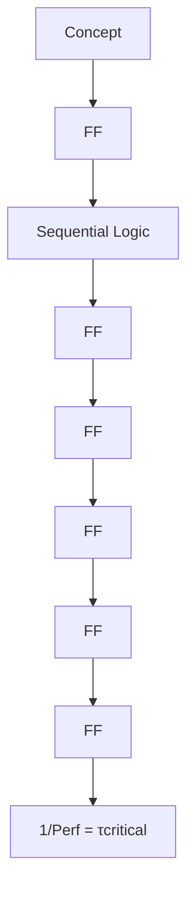
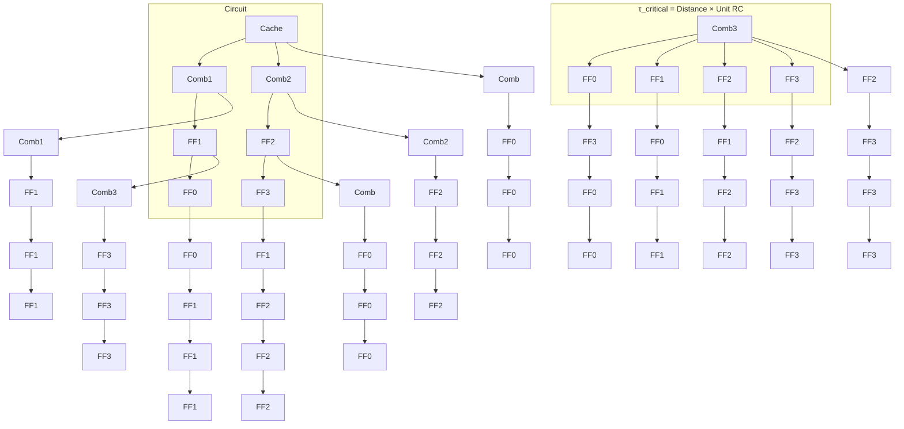

你是麦肯锡/投研风格的微信公众号财经文章主笔，擅长用金字塔原理把研报内容转化为“有主张、有层次、有洞察、但仍保留完整报告阅读欲望”的长文。

【目标】
- 基于下面的研报解析内容，写一篇微信公众号文章 Markdown。
- 风格：稳重、专业、克制、有洞察，像咨询公司合伙人写给高净值读者/产业决策者的研报导读。
- 长度：约 3000 字，允许上下浮动 15%。
- 不要使用 emoji。
- 可以基于报告内容做适度发散，但必须是从原文逻辑推出的判断，不要编造数据、公司动作或引用。
- 不要把研报所有正文内容讲完，要留下明确但自然的伏笔，让读者愿意加入社群阅读完整报告。

【金字塔原理写作原则】
1. 结论先行：文章开头先回答“这份报告最值得看的判断是什么”，而不是介绍背景。
2. 统领思想：全文只能服务一个主判断，避免变成摘要合集。
3. 纵向回答：每一层都要回答上一层提出的“为什么”或“所以呢”。
4. 横向 MECE：每个一级小节必须彼此独立、共同支撑主判断，避免重叠。
5. Synthesis over summary：不要复述报告段落，要提炼“这些事实合在一起意味着什么”。
6. So what：每个小节末尾必须落到对行业、公司、竞争格局、资产定价或读者观察框架的含义。
7. Action title：所有 `##` 小标题必须是“直接讲述洞察的完整句子”，不能是目录标签。

【标题与小标题硬性要求】
- `# 标题` 必须直接表达一个判断，例如“市场真正低估的不是需求，而是供给侧的再定价”。
- 禁止使用以下机械标题：
  - 一、核心判断
  - 二、真正重要的是结构性变量
  - 三、报告没有说透
  - 四、对读者的启发
  - 关键变化
  - 投资启示
  - 总结
- 所有 `##` 标题都要像麦肯锡报告里的 action title：读完标题就知道这一节结论。
- 小标题可以带序号，但序号后必须是一句洞察，例如：`## 1. 这轮变化真正考验的是企业能否把规模转化为议价权`。

【建议结构，但不要机械照抄标题】
1. `# 标题`：一句主判断，不超过 32 字。
2. 开头 4-6 段：直接给出主判断、为什么现在重要、报告提供了什么新信号。
3. 4-6 个 `##` 小节：每个小节标题都是洞察句，不是栏目名。
4. 至少一个小节讨论“报告尚未完全回答的关键问题”，但标题也要是洞察句。
5. 至少一个小节给出读者的观察框架，但不要命名为“对读者的启发”。
6. 文末自然承接未解问题，引导读者加入社群/微信群继续讨论。不要照抄固定话术，请基于本文未解问题每次重新写一段自然 CTA；语义可以参考：欢迎来星球微信群里继续讨论。
7. 在免责声明前，单独插入这张图片链接：``
8. 结尾只输出英文灰色免责声明：`
Personal reading notes and learning share only. Not investment advice.
`

【hook 要求】
- 不要硬插“加入社群”。
- hook 应该来自正文自然出现的未解问题，比如：关键假设尚未验证、竞争优势仍需拆解、图表背后的二阶影响没有展开。
- 文末 CTA 要像“顺着这些未解问题继续读完整报告/继续讨论”，不是广告口吻。
- CTA 必须每篇重新写，不能固定输出“加入社群，领取完整研报解读与原始图表”。可以类似“欢迎来星球微信群里继续讨论”。

【图片要求】
- 不要主动生成 MinerU 图片 markdown；系统会在文章生成后自动插入 MinerU 原始图片。
- 但文末免责声明前必须保留知识星球图片：``。

【内容边界】
- 只能基于研报原文和解析结果推导，不要编造数据、公司动作、引用。
- 遇到不确定内容，要用“这里仍需验证”“报告没有完全展开”等表达。
- 避免“震惊”“爆款”“一文看懂”等浮夸表达。
- 不要出现小红书话题标签。
- 不要出现 emoji。
- 默认避免出现具体投行品牌名，比如“GS”“GS”，统一写作“投行研报”。
- 不要解释你的思考过程，不要输出多余说明。

【研报解析内容】
"""
# China Semiconductors

# China Semis: Huawei's LogicFolding, an underestimated breakthrough

Qingyuan Lin, Ph.D.

+852 2123 2654

qingyuan.lin@bernsteinsg.com

Francis Ma

+852 2123 2626

francis.ma@bernsteinsg.com

Huawei unveiled the "Tau ( $\tau$ ) Scaling Law" at ISCAS 2026 on May 25, 2026, we wrote about the implications in our previous report. One of the key tech enabler in the Tau Law is called LogicFolding, which is used to improve chip performance through stacking. Recent market feedback remains skeptical, but the skepticism appears to underappreciate how different LogicFolding is from existing 3DIC packaging solutions that is already commercialized. We believe it could be one of the most important breakthroughs in China semis that is underestimated. This report explains how is the approach is technically differentiated, and why it is impressive.

# Skepticism one: LogicFolding is just copying other 3DIC solutions and won't be able to solve the overheat issue after stacking.

The most common criticism: LogicFolding is the same as other leading 3DIC solutions like TSMC SolC, Intel Foveros Direct, or Samsung 3D Cube. However, if that is the case, then just like these solutions, stacking can easily increase transistor density, but putting two dies on top of each other will inevitably double the power consumption and heat generation, and therefore fail to deliver practical performance gains (actually it will usually lead to lower clock frequency due to overheat). However, spec from Huawei's Kirin 2026 chip showed opposite results: $41\%$ power efficiency gain and $13\%$ frequency improvement. This indicates that LogicFolding is actually a completely different packaging technology. The advance is not merely more transistors per footprint; it is a simultaneous improvement in density, energy efficiency, and frequency that justify itself as the next generation process.

So what is the real differentiation? The key technology breakthrough is, LogicFolding breaks down one functional logic circuits that was originally designed in one die, and distributes that across two vertically stacked wafer layers at the design stage, which is completely different from packaging two independently designed good dies together (usually logic + SRAM).

Why is that important? Because only through this new design, the packaging can reduce the power consumption and increase the frequency. To understand how it works, let's take a step back and think about how logic circuits functions. If we keep it oversimplified, then you can think of the operation of a chip that is basically two parts, the transistors and the interconnects between the transistors. Therefore, power consumption and latency are just the aggregated sum of these two parts. Without node migration, obviously Huawei cannot make any improvement on the transistor level, however they can use the packaging to reduce the power consumption and latency for interconnects. For the traditional 2D design, if two transistors are far away from each other, then talking to each other need to go through a long distance that lead to long latency and high power consumption. But if you use packaging to stack the two transistors on top of each other, the interconnect distance will be much shorter and therefore significantly reducing the power consumption and latency. The Kirin 2026 showed -30% change of wire length in a representative core, which is not yet fully optimized according to their disclosure and thus further improvement could be achieved in next generations.

Why is this breakthrough impressive? To realize the performance gain demonstrated above, there are three challenges: new EDA tool, new circuit design/optimization methodology, and advanced packaging. This is also why LogicFolding should not be treated as interchangeable with conventional 3DIC solutions. These other solutions can solve the packaging challenge, but they don't have EDA and Fabless innovations that are equally critical to achieve these results. The barrier is therefore not only packaging capability, but also design methodology, software tooling, and architecture-level co-development.

This is exactly the reason why I call the Tau's law another DeepSeek moment. Just like DeepSeek, they are forced to innovate on infrastructure as they are constrained on compute power, which helped to reduce the inferencing cost by an order of magnitude. In this case, Huawei is constrained on lithography, but that indeed forced them to innovate on packaging, which is also very critical for the development of China Semis.

# Skepticism two: this solution stays on paper, we can't trust it until we see it.

A second criticism is that LogicFolding is still a research concept that may need years before reaching product commercialization. But the reality is Huawei plans the first commercial LogicFolding implementation in a Kirin smartphone processor scheduled for fall 2026, which is very likely the next Mate series. So it's not years away, it's just months away. If Huawei doesn't have the chip already in volume production, it is hard for us to imaging why they would say this is coming out in next mobile phone. So this tech breakthrough is not just a concept, but already at delivery stage.

Additionally, some may also concern that if the packaging yield is low, then the cost of chip will be so high that it can't really be commercially successful. But we are impressed to see that Huawei claimed that they can achieve $\sim 100\%$ yield through smart redundancy, implying Huawei is already addressing one of the key cost and manufacturability objections associated with this technology. In practice, that means the market can easily see supporting facts in the next few months after product launch, as chip performance benchmark data and teardown evidence should be able to validate whether the performance claims and design novelty are real. Market should re-rate when that happens.

# Skepticism three: Global players can easily copy that

A third criticism is that even if LogicFolding works, global leaders can replicate it quickly, limiting Huawei's long-term advantage. That argument overlooks the complexity of this end-to-end optimization of EDA/design/manufacturing. Most global fabless likely won't be willing to adopt the technology until it's matured, but EDA vendors cannot make improvement if customer is not willing to use it, and foundry also cannot further optimize their packaging process around it. Therefore, although technically global players can copy this concept, the implementation will be very challenging. Note that Huawei is not necessarily the first company to create this idea of vertical logic partitioning, but it is the first to reach commercialization of this technology and achieve impressive power consumption reduction and frequency improvement.

On the other hand, even if global vendors can copy Huawei on that technology and pursue similar architectures, early mover advantages in EDA adaptation, design libraries, process integration, and product learning cycles can still matter materially. That would not erase the node gap with frontier foundries, but it could help Huawei offset part of that gap and potentially narrow competitive distance in selected end markets over time.

We like SMIC, NAURA, Piotech the most under this theme, as this opens up more upside for advance logic demand in China. SMIC could sell more advanced logic chips, NAURA could benefit from acceleration in advanced logic capacity expansion, and Piotech could potentially benefit from the surging bonding tools demand.

BERNSTEIN TICKER TABLE 

<table><tr><td rowspan="2" colspan="3"></td><td colspan="2">3 Jun 2026</td><td rowspan="3">TTM Rel.</td><td rowspan="2" colspan="4">Reported EPS</td><td rowspan="2" colspan="3">Reported P/E (x)</td></tr><tr><td rowspan="2">Closing Price</td><td rowspan="2">Target Perf.</td></tr><tr><td>Ticker</td><td>Rating</td><td>Cur</td><td>Cur</td><td>2025A</td><td>2026E</td><td>2027E</td><td>2025A</td><td>2026E</td><td>2027E</td></tr><tr><td>688981.CH (SMIC-A)</td><td>O</td><td>CNY</td><td>134.00</td><td>120.00</td><td>10.3%</td><td>USD</td><td>0.09</td><td>0.10</td><td>0.13</td><td>231.0</td><td>197.8</td><td>157.1</td></tr><tr><td>981.HK (SMIC-H)</td><td>O</td><td>HKD</td><td>82.95</td><td>70.00</td><td>53.8%</td><td>USD</td><td>0.09</td><td>0.10</td><td>0.13</td><td>123.4</td><td>105.6</td><td>83.9</td></tr><tr><td>688347.CH (Hua Hong-A)</td><td>O</td><td>CNY</td><td>233.24</td><td>140.00</td><td>332.4%</td><td>USD</td><td>0.03</td><td>0.11</td><td>0.16</td><td>N/M</td><td>324.1</td><td>222.0</td></tr><tr><td>1347.HK (Hua Hong-H)</td><td>O</td><td>HKD</td><td>151.70</td><td>100.00</td><td>343.3%</td><td>USD</td><td>0.03</td><td>0.11</td><td>0.16</td><td>609.8</td><td>181.9</td><td>124.6</td></tr><tr><td>002371.CH (NAURA)</td><td>O</td><td>CNY</td><td>614.84</td><td>680.00</td><td>44.4%</td><td>CNY</td><td>5.66</td><td>10.22</td><td>16.41</td><td>108.6</td><td>60.2</td><td>37.5</td></tr><tr><td>688012.CH (AMEC)</td><td>O</td><td>CNY</td><td>285.92</td><td>500.00</td><td>86.6%</td><td>CNY</td><td>3.40</td><td>4.95</td><td>7.18</td><td>84.1</td><td>57.8</td><td>39.8</td></tr><tr><td>688072.CH (Piotech)</td><td>O</td><td>CNY</td><td>615.49</td><td>580.00</td><td>282.3%</td><td>CNY</td><td>3.32</td><td>8.12</td><td>12.40</td><td>185.4</td><td>75.8</td><td>49.6</td></tr><tr><td>688256.CH (Cambricon)</td><td>O</td><td>CNY</td><td>1,378.10</td><td>2,000.00</td><td>187.2%</td><td>CNY</td><td>(1.09)</td><td>5.38</td><td>11.26</td><td>N/M</td><td>256.0</td><td>122.4</td></tr><tr><td>688041.CH (Hygon)</td><td>O</td><td>CNY</td><td>285.94</td><td>280.00</td><td>59.3%</td><td>CNY</td><td>0.83</td><td>1.35</td><td>2.42</td><td>344.5</td><td>211.9</td><td>118.2</td></tr><tr><td>ASIAX</td><td></td><td></td><td>2,056.69</td><td></td><td></td><td></td><td></td><td></td><td></td><td></td><td></td><td></td></tr></table>

O - Outperform, M - Market-Perform, U - Underperform, NR - Not Rated, CS - Coverage Suspended 688256.CH. 688041.CH base year is 2024:   
Source: Bloomberg, Bernstein estimates and analysis.

# INVESTMENT IMPLICATIONS

# We rate SMIC, Hua Hong, NAURA, AMEC, Piotech, Cambricon, Hygon Outperform benefiting from this new roadmap for China Semis.

On beneficiaries, we see the Tau Law roadmap as structurally positive for China's leading foundry, advanced-packaging supply chain, and AI chip ecosystem. On foundry, SMIC is a clear strategic partner and likely a critical enabler if Huawei is to deliver the roadmap and eventually reach TSMC A14-equivalent logic density via multi-die integration without EUV, implying sustained demand for SMIC's most advanced DUV based multi-patterning advanced logic nodes. Hua Hong likely will also benefit as the expected acquisition of Huali who is potentially also working on advanced logic packaging. In semicap, we see upside skewed to domestic tool vendors who has higher exposure for advanced logic and packaging: NAURA should benefit more than AMEC as it has much higher exposure in advanced logic, while Piotech has been working on bonding tools for advanced packaging and thus market will perceive it as one of the core beneficiaries. For AI fabless, Huawei's framework provides a clearer path to sustain performance scaling under EUV constraints, which should be supportive for domestic accelerator and CPU vendors such as Cambricon and Hygon as they co-optimize architectures to exploit higher effective density and lower latency interconnect within China's manufacturing envelope. On the other hand they also face more intense competition from Huawei so the upside will be smaller for the AI fabless names compared to foundry and semicap.

# DETAILS

# HUAWEI'S ROADMAP ON CIRCUITS AND SYSTEMS

In the event, Huawei released its roadmap for chip improvement under the guidance of Tau Scaling Law.

Three key highlights:

1. Fast transistor density improvement. Trough advanced packaging (or so-called 'LogicFolding' by Huawei), they are able to improve the transistor density from 155 MTr/mm^2 in 2025 (HiSilicon Kirin 9030, based on SMIC N+3 node, between TSMC N5 and N7) to 238 MTr/mm^2 in 2026 (equivalent to TSMC N3 node density. Likely that's based on two chips stack on top of each other, for example one SMIC N+3 node chip with another SMIC N+2 node chip, so no longer apple to apple comparison). By 2031, they target to achieve 400+ MTr/mm^2 (equivalent to TSMC 14A density, but again not apple to apple comparison);   
2. Steadily increasing max frequency. The speed of a transistor is generally measured by how fast it can switch, or the frequency, further improvement on the max frequency is achieved through the tau optimization that reduced the latency, which is the critical-path delay between adjacent transistors, which in turn is dominated by interconnect RC;   
3. Exponentially growing AI cluster scaling. On top of improvement on chip performance, the Tau Scaling Law also emphasizes on the improvement of networking between chips to build exponentially larger AI superPoDs, we have illustrated that in the Huawei AI chip roadmap analysis, and now Huawei targets to achieve 125X improvement in superPoD total compute power by 2030, which indicates an aggressive 3.3X improvement every year.

EXHIBIT 1: Huawei's tau scaling roadmap   
τ-Scaling Roadmap: Sustainable PPDC Evolution   

line

| Year | Density* (MTr/mm²) | P-Core Freq. (GHe) |
|------|---------------------|--------------------|
| 2023 | 126                 | 2.6                |
| 2024 | 126                 | 2.65               |
| 2025 | 155                 | 2.75               |
| 2026 | 238                 | 3.1                |
| 2027 | 252                 | 3.39               |
| 2028 | 266                 | 3.71               |
| 2029 | 277                 | 4.0                |
| 2030 | 292                 | 4.3                |
| 2031 | 5.0                 | 400+               |

bar

Systems Roadmap
SuperPOD Performance Scaling
| System | Performance Scaling (EFLOPS) |
| :--- | :--- |
| Atlas950 (2026) | 8 |
| Atlas960 (2027) | 60 |
| AtlasNEXT (2030) | Z FLOPS |
125x

Source: Company reports, Bernstein analysis

# THE LOGICFOLDING INNOVATION

# EXHIBIT 2: Technology improvement in LogicFold

# Sidebar A — LogicFolding at a Glance

- Hybrid-bonding pitch: sub-2 $\mu$ m (1.5 $\mu$ m in Kirin 2026; target gear ratio $\approx$ 1)   
• Overlay accuracy: under 0.5 μm   
- TSV CD/KOZ: sub-1.5 $\mu$ m; pitch sub-6 $\mu$ m; failure rate $< 100$ ppm; repair rate $99.9\%$   
• Yield: \~100% with smart redundancy   
• Transistor density: $155 \rightarrow 238$ MTr/mm $^{2}$ in a single step   
• Power-efficiency / frequency gain (SoC P-core): +41% / +13%   
• SRAM operating frequency: +40%+   
- Clock-buffer count / clock skew / wire length on a representative core: $-50\%$ / $-25\%$ / $-30\%$

Source: Company reports, Bernstein Analysis

# EXHIBIT 3: Illustration of the LogicFolding principle

# LogicFolding

flowchart

flowchart

Source: Company reports, Bernstein analysis

# THE TIME SCALING THEORY

Link to the full technical paper: A Time Scaling Theory for Multi-Layer Electronic Systems

Copying the abstract here:

For six decades, Moore's geometric scaling drove progress in semiconductors. That industry compact no longer holds: returns from pure dimensional shrinking have flattened, leading-edge design budgets exceed one billion dollars per chip, and cost-per-transistor at the most advanced nodes is no longer falling. This perspective argues for a successor scaling principle — T scaling — that adopts time itself, rather than transistor area, as the primary metric of progress, applying a single characteristic time constant T as the unifying optimization target across twelve orders of magnitude, from a switching transistor to a data-center workload. Two production-scale demonstrations are presented. On a mobile SoC, LogicFolding — a methodology that partitions digital, analog, and memory circuits across vertically stacked active tiers — delivers a 55% step-wise increase in transistor density and a 41% power-efficiency gain at a fixed device node. On AI systems, a co-designed stack comprising the memory-semantic Unified Bus fabric, near-packaged Hi-ONE optical I/O, and edge-to-surface 3D Folding projects more than 100× growth in hardware integration by 2035. The deeper claim is methodological: T scaling is the first scaling principle since Dennard to establish a shared optimization target across the entire computing stack.

The theory dictates 

[中间内容因长度限制已省略]

 learning or artificial intelligence system, or as a prompt or input into any such system. You also may not, without Bernstein's express written consent, do any of the foregoing in connection with your own internal machine learning or artificial intelligence system.

Bernstein may use artificial intelligence tools in the preparation of its materials. Any such materials are reviewed by Bernstein's research analysts prior to publication.

This report has been prepared for information purposes only and is based on current public information that we consider reliable, but the entities noted herein do not warrant or represent (express or implied) as to the sources of information or data contained herein are accurate, complete, not misleading or as to its fitness for the purpose intended even though the entities noted herein rely on reputable or trustworthy data providers, it should not be relied upon as such. Opinions expressed are the author(s)' current opinions as of the date appearing on the material only and we do not undertake to advise you of any change in the reported information or in the opinions herein.

This publication was prepared and issued by the entity referred to herein for distribution to eligible counterparties or professional clients. The information in this report is intended for general circulation and does not constitute an offer to buy or sell any security, investment, legal or tax advice nor a personal recommendation, as defined by any of the aforementioned regulators. It does not take into account the particular investment objectives, financial situations, or needs of individual investors. The report has not been reviewed by any of the aforementioned regulators and does not represent any official recommendation from the aforementioned regulators. The investments referred to herein may not be suitable for you. Investors must make their own investment decisions in consultation with advice sought from a financial adviser regarding the suitability of the investment product, taking into account the specific investment objectives, financial situation or particular needs of any recipient of the recommendation, before the recipient makes a commitment to purchase the investment product.

The analysis contained herein is based on numerous assumptions. Different assumptions could result in materially different results. The information in this report does not constitute, or form part of, any offer to sell or issue, or any offer to purchase or subscribe for shares, or to induce engage in any other investment activity. The value of any securities or financial instruments mentioned in this report may fluctuate subject to market conditions. Information about past performance of an investment is not necessarily a guide to, indicative of, or assurance of future performance. Estimates of future performance mentioned by the research analyst in this report are based on assumptions that may not be realized due to unforeseen factors like market volatility/fluctuation. In relation to securities or financial instruments denominated in a foreign currency other than the clients' home currency, movements in exchange rates will have an effect on the value, either favorable or unfavorable. Before acting on any recommendations in this report, recipients should consider the appropriateness of investing in the subject securities or financial instruments mentioned in this report and, if necessary, seek for independent professional advice.

The securities described herein may not be eligible for sale in all jurisdictions or to certain categories of investors where that permission profile is not consistent with the licenses held by the entities noted herein. This document is for distribution only as may be permitted by law. It is not directed to, or intended for distribution to or use by, any person or entity who is a citizen or resident of or located in any locality, state, country or other jurisdiction where such distribution, publication, availability or use would be contrary to law or regulation or would subject the entities noted herein to any regulation or licensing requirement within such jurisdiction.

Source: Bloomberg Index Services Limited. BLOOMBERG® is a trademark and service mark of Bloomberg Finance L.P. and its affiliates (collectively "Bloomberg"). Bloomberg or Bloomberg's licensors own all proprietary rights in the Bloomberg Indices. Neither Bloomberg nor Bloomberg's licensors approves or endorses this material, or guarantees the accuracy or completeness of any information herein, or makes any warranty, express or implied, as to the results to be obtained therefrom and, to the maximum extent allowed by law, neither shall have any liability or responsibility for injury or damages arising in connection therewith.

No part of this material may be reproduced, distributed or transmitted or otherwise made available without prior consent of the entities noted herein. Copyright Bernstein Institutional Services LLC Bernstein Autonomous LLP, BSG France S.A., Bernstein (Hong Kong) Limited 盛博香港有限公司, Bernstein (Canada) Limited, Bernstein (India) Private Limited (SEBI registration no. INH000006378), Bernstein (Singapore) Private Limited and Bernstein Japan KK (サンフォード・C・バーンスタイン株式会社). All rights reserved. The trademarks and service marks contained herein are the property of their respective owners. Any unauthorized use or disclosure is strictly prohibited. The entities noted herein may pursue legal action if the unauthorized use results in any defamation and/or reputational risk to the entities noted herein and research published under the Bernstein and Autonomous brands.
"""
