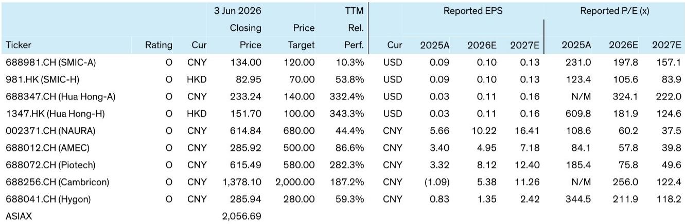
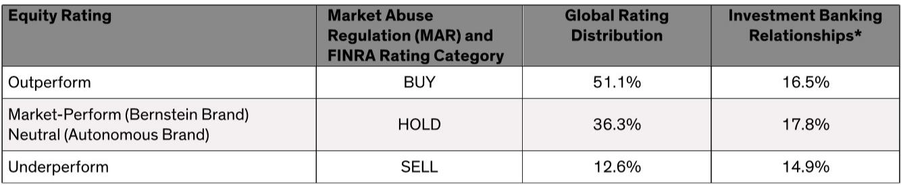
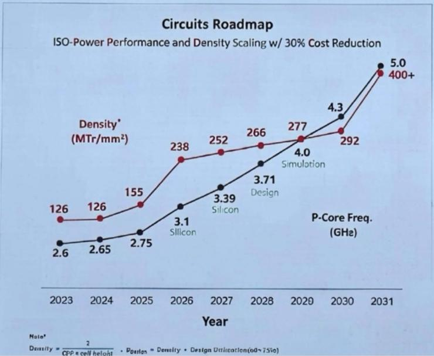

# 市场真正低估的不是需求，而是华为LogicFolding的供给端突破

半导体行业从来不缺宏大叙事，但真正能改变产业底层逻辑的突破，往往在初期被市场以“不过是另一种封装方案”的轻率判断所低估。某外资投行最新研报指出，华为在ISCAS 2026上披露的LogicFolding技术，极有可能成为继DeepSeek之后中国半导体产业又一个被低估的结构性转折点。

市场当前的质疑集中在三个层面：认为LogicFolding不过是现有3DIC方案的翻版、认为该技术仍停留在论文阶段、以及认为全球领先企业可以快速复制。但研报通过技术细节拆解和商业化时间表验证，给出了截然不同的判断：这或许是中国半导体在缺乏EUV光刻机条件下，实现芯片性能持续提升的最重要路径之一。

这份报告的价值不在于罗列技术参数，而在于它揭示了一个被忽视的事实——当外部限制迫使企业在基础设施层面进行创新时，往往会催生出传统路径依赖下不可能出现的突破。正如DeepSeek在算力受限时倒逼出推理成本数量级下降，华为在光刻机受限时，正在封装和设计协同优化上开辟一条新路。

## 1. 核心质疑的底层逻辑错误：LogicFolding不是堆叠芯片，而是重构芯片

市场最常见的误解，是将LogicFolding等同于TSMC的SoIC、Intel的Foveros Direct或Samsung的3D Cube。如果只是堆叠两个独立设计的芯片，那么晶体管密度提升的同时，功耗和发热也将翻倍，最终导致频率下降而非提升。但华为Kirin 2026芯片的实际数据给出了相反的结果：能效提升41%，频率提升13%。

这个矛盾本身就说明，LogicFolding不是传统意义上的封装技术。它的核心差异在于：不是把两个已经设计好的独立芯片（通常是逻辑+SRAM）堆叠在一起，而是在设计阶段就主动将一个完整的逻辑电路拆解、分配到垂直堆叠的两层晶圆上。这意味着功耗和延迟的改善并非来自晶体管层面的进步——华为在晶体管层面没有节点迁移——而是来自互连线的根本性优化。

在2D设计中，两个距离较远的晶体管通信需要经过长互连线，带来高延迟和高功耗。而通过垂直堆叠，互连距离大幅缩短。Kirin 2026在一个代表性核心上实现了30%的线长减少，且报告披露这尚未完全优化，意味着后续迭代还有更大空间。

这一判断的含义是：市场如果仍以“封装技术”的框架来理解LogicFolding，就会低估它作为下一代制程替代方案的潜力。它不是对现有方案的补充，而是对芯片设计范式的重新定义。

## 2. 从论文到量产仅数月之隔，商业化节奏远超市场预期

第二个质疑认为LogicFolding仍处于研究概念阶段，距离商业化还需要数年时间。但研报披露，华为计划在2026年秋季的Kirin智能手机处理器中首次实现商业化应用，这极大概率将是下一代Mate系列。从时间线来看，这不是“几年后”的事，而是一个季度内的事。

更值得关注的是，华为宣称通过智能冗余设计可以实现接近100%的封装良率。如果这一数字属实，意味着成本可控性已经不再是商业化障碍。对于投资者而言，这意味着在未来几个月内，芯片性能基准测试数据和拆解证据将能直接验证这些性能声明的真实性。市场预期届时将出现重新定价。

这里的未解问题是：100%良率是否仅适用于特定设计规模或特定工艺组合？在大规模量产中能否持续维持？报告没有完全展开这些细节，但这恰恰是后续需要密切跟踪的关键变量。

## 3. 全球玩家能复制吗？技术壁垒不在于概念，而在于系统级协同

第三个质疑认为即使LogicFolding有效，全球领先企业也能快速复制，限制华为的长期优势。但这一论点忽视了实现性能增益所需的三重挑战：新的EDA工具、新的电路设计/优化方法、以及先进封装能力。传统3DIC方案只能解决封装挑战，而无法解决EDA和Fabless层面的创新。

关键洞察在于：大多数全球Fabless企业不太可能在技术成熟之前采用这一方案，而EDA供应商在客户不使用的情况下也无法进行优化，晶圆厂同样无法围绕它改进封装工艺。因此，虽然全球玩家在技术上可以复制这一概念，但实施难度极高。华为未必是第一个提出垂直逻辑分割概念的公司，但它是第一个将其商业化并实现显著功耗降低和频率提升的企业。

此外，全球玩家即使能够复制，早期在EDA适配、设计库、工艺集成和产品学习周期上的先发优势依然重要。这并不会消除与前沿晶圆厂的节点差距，但可能帮助华为在特定终端市场缩小竞争距离。

## 4. 报告尚未完全回答的关键问题：这一突破对产业格局的再定义

研报虽然给出了乐观判断，但仍有几个关键问题需要进一步验证。首先，LogicFolding的密度提升是否可持续？从2026年的238 MTr/mm²到2031年的400+ MTr/mm²，中间需要经历多次迭代，每代的增量提升幅度在逐渐缩小。报告没有完全解释这种密度提升的边际递减趋势如何被克服。

其次，AI集群规模的指数级增长——从2026年的8 EFLOPS到2030年的125倍提升——依赖于网络互联的同步突破。报告提到了Unified Bus和Hi-ONE光学I/O，但这些技术的成熟度和量产时间表尚未充分披露。如果网络互联成为瓶颈，芯片层面的突破将无法转化为系统层面的性能提升。

最后，对国内AI Fabless企业的影响是双刃剑。华为的框架为寒武纪、海光等提供了更清晰的性能演进路径，但同时也意味着它们将面临来自华为更激烈的竞争。研报认为Foundry和Semicap的受益程度高于AI Fabless，这一判断的准确性取决于华为在AI芯片领域是否会采取开放生态策略还是垂直整合策略。

## 5. 投资者需要建立的新观察框架：从节点竞赛转向协同创新评估

如果LogicFolding被证实有效，那么评估中国半导体企业的框架需要根本性调整。传统的“制程节点对标”思维将让位于“设计-封装-EDA协同能力”的综合评估。

对于Foundry而言，SMIC将成为这一新路径的关键战略合作伙伴。如果华为要通过多芯片集成达到与TSMC A14相当的逻辑密度，SMIC最先进的DUV多重图形化工艺将面临持续需求。对于设备厂商，NAURA在先进逻辑领域的暴露度高于AMEC，而拓荆科技在键合工具上的布局将使其被市场视为核心受益者。

对于AI Fabless，关键问题不再是“能否获得先进制程”，而是“能否与华为的架构进行协同优化”。那些能够主动适配LogicFolding架构、利用更高有效密度和更低延迟互连的企业，将获得相对竞争优势。反之，如果只是被动接受标准方案，则可能被边缘化。

这一判断的含义是：市场对国内半导体企业的估值逻辑，将从“制程节点追赶”转向“生态位价值”。那些能够在新范式中找到独特定位的企业，其估值中枢可能面临系统性上移。

---

这份研报的价值在于，它提供了一个超越短期市场情绪的思考框架。当市场还在纠结于“能不能做出来”时，报告已经转向“做出来之后意味着什么”。当然，任何技术突破都存在验证风险——100%良率在量产中能否维持、EDA工具链是否足够成熟、网络互联能否跟上芯片进步——这些都需要在未来几个月内通过产品拆解和性能测试来逐一验证。

欢迎来星球微信群里继续讨论：如果LogicFolding被证实有效，哪些细分赛道的企业最有可能在估值重构中受益？SMIC、NAURA、拓荆科技的投资逻辑分别应该如何调整？我们将在社群中分享完整的原始研报、技术细节图表以及后续的跟踪框架。

Personal reading notes and learning share only. Not investment advice.

