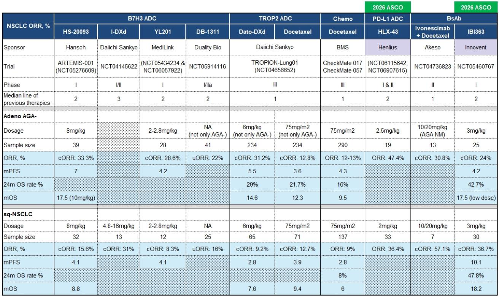
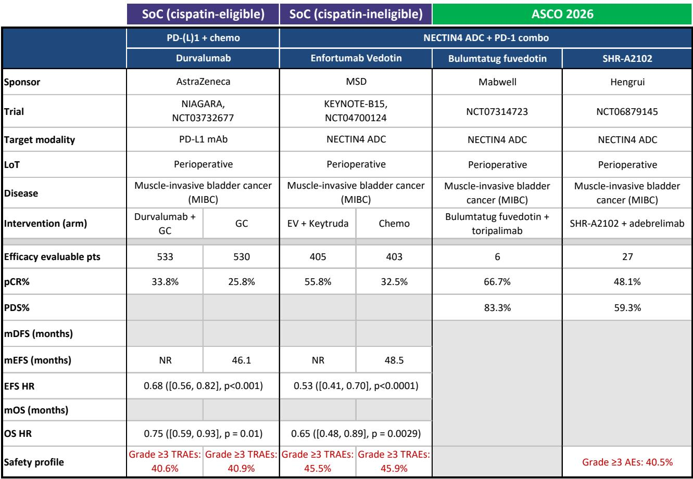
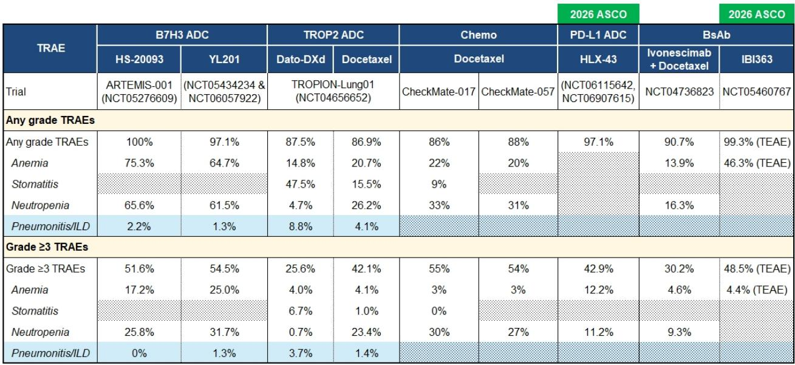

# 市场低估的不是中国创新药的短期回调，而是结构性定价重置的起点

ASCO 2026 落幕后的两周，中国医药板块经历了一场罕见的集体杀跌。恒生医疗保健指数自 2025 年高点已回撤超过 30%，部分创新药公司的 1 年远期市销率已经跌至甚至低于 2024 年 4 月的底部。某外资投行的最新研报直接点出了一个令产业决策者无法回避的问题：在基本面没有出现任何实质性负面变化的情况下，资本为何如此决绝地离场？

这份报告的核心判断并非简单的“超跌反弹”。它提出了一个更有张力的叙事：当前中国医药资产正在经历一次被动的“去杠杆式”定价重置，而这一过程恰好掩盖了 ASCO 上涌现出的几个真正具有结构性意义的信号——某些公司的临床数据，已经不再是“追赶”，而是在特定治疗领域开始定义新的标准。

对于持有或关注中国医药资产的投资者而言，真正需要回答的问题不是“市场什么时候见底”，而是“当资金回流时，哪些资产会最先被重新定价”。这份研报给出了三个明确的候选者，而它们背后的逻辑，远比股价波动本身更值得深挖。

## 1. 当前估值已无法用基本面解释，但市场需要一个新的锚点

研报中展示的估值图表令人警觉。以 1 年远期市盈率衡量，恒瑞医药从 2025 年 10 月峰值的 50 倍跌至当前的 31 倍，已低于 2024 年 4 月低点的 47 倍。翰森制药从 38 倍降至 26 倍，接近其 2024 年低点。更令人不安的是生物科技板块：科伦博泰的市销率从峰值的 39 倍压缩至 25 倍，而 2026-2029 年其收入复合增长率预计高达 66%；信达生物从 10 倍降至 6 倍，同期收入复合增长预期为 26%。

这是一个典型的“增长溢价消失”场景。当宏观不确定性上升、全球资金从新兴市场回流美元资产时，市场不再奖励远期增长，而是惩罚一切无法立即产生现金流的资产。中国创新药公司大多尚未盈利，其估值天然依赖对未来现金流的折现。一旦折现率上升，估值压缩的幅度会远超传统制药企业。

但研报的核心洞察在于：这种定价重置并非基于任何一家公司的临床失败或监管挫折。ASCO 上展示的数据，无论是科伦博泰的 sac-TMT 还是信达生物的 IBI363，都呈现出积极的增量信息。这意味着当前的估值水平隐含了一个假设——市场认为这些临床数据要么不可重复，要么无法转化为商业价值。这个假设是否成立，正是接下来需要验证的核心问题。

## 2. 科伦博泰：sac-TMT 正在成为肺癌免疫治疗最可信的“搭档”

在 ASCO 2026 上，科伦博泰的 sac-TMT 展示的数据可能是整个会议中最被低估的亮点。研报将其描述为“最可信的免疫治疗搭档”，这个判断值得仔细拆解。

在 1L PD-L1 阳性非小细胞肺癌（NSCLC）中，sac-TMT 联合 Keytruda 相比 Keytruda 单药，不仅取得了更高的客观缓解率（ORR），更重要的是展示了更深的肿瘤缩小和更持久的应答。PFS 风险比为 0.35，意味着疾病进展风险降低了 65%，中位 PFS 超过 16 个月。OS 风险比趋势为 0.55，虽然尚未成熟，但研报认为，基于已展示的应答深度和持久性，最终的 OS 获益大概率会得到验证。

这背后的含义是结构性的。Keytruda 作为全球最畅销的免疫检查点抑制剂，其单药在 PD-L1 高表达 NSCLC 中的疗效已经达到一个平台期。任何药物想要证明自己能够“加持”Keytruda，门槛极高。sac-TMT 不仅跨过了这个门槛，而且给出了一个在统计学和临床意义上都极具说服力的数据。如果最终 OS 数据确认为阳性，sac-TMT 将成为全球范围内第一个在随机对照试验中证明能够显著增强 Keytruda 疗效的联合用药。

更值得关注的是 sac-TMT 在 EGFR 突变 NSCLC 后线治疗中的差异化优势。在 2L+ EGFR 突变患者中，sac-TMT 是目前唯一一个展示出统计学显著 OS 获益的药物。这个细分市场长期以来缺乏有效治疗手段，TROP2 ADC 的突破性数据意味着一个未被满足的巨大临床需求正在被填补。

科伦博泰的股价自 ASCO 以来下跌约 15%，报告认为这是“基本面和市场定价之间最大的失衡”。其逻辑是：sac-TMT 的临床增量信息是明确的、积极的，不存在任何悬而未决的监管或安全风险。当前的估值回调更多是宏观情绪驱动的被动抛售，而非基本面恶化。

## 3. 信达生物：IBI363 可能在 PD-1 双抗赛道中开辟第三条路径

如果说 sac-TMT 是在现有标准治疗上做加法，那么信达生物的 IBI363 则是在尝试做乘法。这款 PD-1 x IL-2 beta 双特异性抗体的设计逻辑，与其说是对现有 PD-1 单抗的改良，不如说是试图重新定义免疫治疗的作用机制。

研报中给出的数据令人印象深刻。在 2L+ 免疫治疗经治的非鳞状 NSCLC 患者中，IBI363 展示了一个突出的生存拖尾效应：24 个月 OS 率在鳞癌患者中为 48%，在腺癌患者中为 43%。作为对比，标准化疗多西他赛的 24 个月 OS 率仅为 8% 和 21.7%，而 Dato-DXd 在腺癌中的数据约为 29%。这意味着 IBI363 在免疫治疗失败的患者群体中，可能正在创造一种全新的治疗范式。

更引人注目的是 1L 数据。在 PD-L1 全人群的 1L NSCLC 中，IBI363 的 ORR 达到 86%，是所有在研药物中最高的。虽然 PFS 和 OS 数据尚未成熟，但如此高的初始应答率，结合其在后线展示的长期生存优势，暗示这款药物可能具有超越现有 PD-1 单抗和 PD-1 x VEGF 双抗的潜力。

研报没有回避 IBI363 的不确定性：它仍处于早期临床阶段，全球三期试验刚刚启动。但报告同时指出，信达生物今年与礼来和辉瑞达成的两项大型交易，以及其 GLP-1 资产即将在 ADA 上公布的数据，都在为 IBI363 的价值兑现提供额外的安全边际。

信达生物当前 6 倍的市销率，对于一个拥有潜在 best-in-class 免疫治疗资产、且商业化能力已经验证的公司而言，定价显然过于保守。但市场目前关注的是短期不确定性，而非长期价值创造。

## 4. 康方生物：AK112 的 OS 胜利是真实的，但更大的战役仍未决出胜负

康方生物的 AK112 是 ASCO 2026 上最受关注的资产之一，但它的叙事比科伦博泰和信达生物更为复杂。HARMONi-6 试验在鳞状 NSCLC 中取得了 OS 风险比 0.66 的阳性结果，这是一个历史性的突破——这是 AK112、也是任何 PD-1 x VEGF 双抗或任何涉及免疫联合抗血管生成机制的疗法，在这个适应症中首次达到 OS 终点。

但研报的表述非常克制。它指出了两个关键问题。第一，HARMONi-6 的 OS 获益仅限于鳞癌患者，而鳞癌仅占 NSCLC 的约 30%。对于更大的非鳞癌人群，HARMONi-2 和 HARMONi-6 的亚组数据并未提供足够的信心。第二，ASCO 讨论环节中出现了针对试验设计的质疑，包括年龄和性别分布以及出血风险排除标准，这些质疑虽然不一定动摇试验结果的有效性，但确实增加了全球监管审批的不确定性。

研报的判断是：AK112 的鳞癌数据为全球三期 HARMONi-3-sq 提供了积极的读通，该试验预计在 2026 年三季度发布最终 PFS 和中期 OS 读出。但 HARMONi-3-nsq 仍将是一场艰苦的战斗。康方生物面临的核心挑战在于，其最大的商业机会恰恰在于非鳞癌这一更大的适应症，而目前的数据并不支持在这一领域取得同样的成功。

这是一个典型的“好数据，但不够好”的案例。AK112 证明了 PD-1 x VEGF 双抗的机制可行性，但商业价值的兑现，取决于它能否在更大的患者群体中复制鳞癌中的成功。

## 5. 报告未完全解答的关键问题：当基本面重新被定价，谁是真正的赢家

这份研报的价值不在于它给出了多少买入建议，而在于它揭示了一个被当前市场情绪掩盖的结构性问题：中国创新药资产的估值体系正在经历一次根本性的重构，而这次重构的最终结果，将取决于几个尚未被充分讨论的关键变量。

第一个变量是全球化能力的真实折现。科伦博泰的 sac-TMT 已经通过授权合作获得了默克这一全球顶级合作伙伴，其全球三期临床试验正在推进。信达生物的 IBI363 仍处于早期阶段，但已展现出全球竞争力的潜力。康方生物的 AK112 则在全球化路径上遇到了更多不确定性。市场对这些资产的定价差异，本质上是对它们全球化成功概率的不同假设。但这些假设的验证，可能需要 12 到 18 个月的时间。

第二个变量是商业化竞争格局的演变。NSCLC 是一个年治疗市场规模超过 300 亿美元的超级赛道。sac-TMT、AK112 和 IBI363 虽然都瞄准这一市场，但切入的角度和竞争定位截然不同。sac-TMT 是“最佳搭档”，AK112 是“一线替代”，IBI363 是“后线颠覆”。这三种策略的最终商业价值差异巨大，而市场目前并未充分区分这些差异。

第三个变量是资本市场的流动性周期。中国医药板块当前的估值压缩，很大程度上是宏观因素驱动的被动抛售。当全球资金重新流入新兴市场时，基本面最扎实的资产将率先修复。但“最先修复”并不意味着“修复幅度最大”。那些同时具备强基本面、低机构持仓、无重大悬疑的资产，可能迎来戴维斯双击。

## 欢迎在星球微信群里继续讨论

上述分析只是这份研报的冰山一角。原报告还详细讨论了恒瑞医药的 Nectin-4 ADC 在 NSCLC 中的早期数据（ORR 高达 80.8%，但应答持续时间和生存数据仍需验证）、BeOne 的 CDK4 抑制剂在 1L 肺癌中的首次人体试验结果，以及科伦博泰 SKB500（B7H3 ADC）在小细胞肺癌中的差异化安全性特征。这些资产虽然处于更早期阶段，但它们揭示的技术路线和竞争动态，同样值得深入推敲。

此外，报告中包含的全球 NSCLC 市场规模分析、各资产的临床数据对比表格、以及估值与增长预期的交叉验证，都是做出独立判断不可或缺的工具。限于篇幅，本文无法一一展开。如果你对这些未解问题感兴趣，欢迎来星球的微信群里继续讨论。我们会在群内分享完整报告的解读版本，并定期组织对关键资产的跟踪讨论。

---

Personal reading notes and learning share only. Not investment advice.

