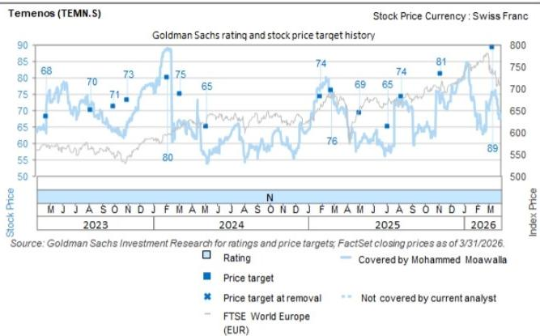

# Technology: Software: 30th European Financials Conference - European Software & Payments Key Takeaways

European Financials Conference

2-4 June 2026 | Zurich

Explore >

We hosted public and private companies across the Payments and Fintech sectors at the European Financials Conference in Zurich. Key themes from the discussions were: 1) Modern tech stacks continue to drive competitive advantage, enabling improved customer experiences and clearer product differentiation; 2) The importance of orchestrating semantic layers around business context to leverage Agentic AI; 3) Optimisation of the cost base as a business model evolves towards consumption-based tokens; 4) Increased investment in marketing and customer acquisition across payment players, as the need to differentiate intensifies; and 5) Greater regulatory clarity helping confidence across digital assets space.

Please see inside for detailed takeaways.

Key Takeaways

# Capgemini (Buy; €100.8)

We hosted Sudhir Pai, Deputy Group Chief Technology Officer at Capgemini, for a fireside chat at the European Financials Conference in 2026.

# Key takeaways

# Pace of AI innovation continues to accelerate around agentic AI

The speaker noted an exponential increase in AI capabilities, with over 1,200–1,500 new AI services launched by major tech firms in the past year, alongside two million open-source large language models (LLMs). Previously, companies were largely focused on the number of use cases, but are now identifying real value-creating capabilities. Currently, there is a significant push to production and shipping these models to the public, however, for companies, the challenge remains centred around how to utilise these models effectively and orchestrate their semantic layer around business context to underpin real value extraction from agentic AI. Given this, the

Mohammed Moawalla

+44(20)7774-1726

mohammed.moawalla@gs.com

GS International

Deepshikha Agarwal

+1(212)934-6961

deepshikha.agarwal@gs.com

GS India SPL

Uzair Merchant

+44(20)7774-7645

uzair.merchant@gs.com

GS International

Ahlam Haouach

+44(20)7051-8714

ahlam.haouach@gs.com

GS International

speaker noted Capgemini has a strong role to play across the agentic ecosystem, given long-standing relationships and good business knowledge of customers. As of now, the company indicated customer service and back-office functions such as risk and fraud are seeing the greatest concentration of AI implementation. Overall, the speaker stressed the importance of the being able to track and determine the real value of AI over time.

# Shift to consumption pricing models

The speaker suggested the business model is shifting from primarily subscription to a subscription + consumption-based model, given the rising use of tokens to perform agentic AI. The speaker indicated that the cost of tokens can balloon, depending on the complexity of the task and the challenge for CFOs is allocating enough capital to IT budgets which are being quickly exhausted. In addition, companies are increasingly exploring domain-specific/small language models trained on specific business contexts that provide more optimised outcomes as an alternative, given rising token costs.

# Importance of cybersecurity and resilience in the cloud

On cloud migrations, the speaker indicated this is largely driven by companies seeing the real business value accretion from the upgrade, with many companies interested in European vendors given European cloud sovereignty. In addition, given the fast development of capabilities from frontier AI companies, such as Anthropic's Mythos, the speaker indicated that the cybersecurity and resilience of companies is increasingly being challenged.

# Headcounts likely to shrink but challenge on how to best optimise time saving

The speaker mentioned that rising productivity, owing to AI, will likely naturally reduce headcounts. However, companies are currently still figuring out how to best optimise the time saved. The key differentiator for companies over the mid-term will be how effectively they re-skill employees for other revenue generating functions.

# Temenos AG (Neutral; SFr70.15)

We hosted Takis Spiliopoulos, Chief Executive Officer & Interim Chief Financial Officer at Temenos, for a fireside chat at the European Financials Conference in 2026.

# Key takeaways

# Structural growth runway in core banking software remains significant

Temenos remains well positioned in the banking software market, as many banks' internal systems are decades-old and penetration of core banking software remains low at c.35%, while ERP and HR software penetration sits near 80%-90%, leaving significant growth runway. Management noted that the key bank push back to platform modernisation has historically been lengthy implementation time frames, which they now expect AI tools to help compress. On the near-term outlook, management flagged a stable macro backdrop, with no impact to pipeline or conversion despite ongoing geopolitical volatility, and positive underlying sentiment building on last year's momentum, supported by banks generally performing well.

# Three key revenue growth levers, with continued momentum in the US

Management outlined three key levers for revenue growth: (1) continued penetration into tier 3 and smaller banks with core banking functionality; (2) tier 1/2 banks adopting specific functional modules; and (3) adjacent growth engines (Wealth, FCM, Payments), which typically grow faster than the core business. Within this, the US was highlighted as a particular area of momentum, with a number of flagship clients now going live, c.20 salespeople targeting 160 multi-regional banks, and a newly opened innovation hub in Orlando (the first outside India).

# Balanced AI investment strategy focused on value

Temenos noted it maintains a balanced approach to AI, leveraging open source or lower-cost models where sufficient, rather than defaulting to the newest/most expensive option. Internally, efficiency gains are already visible, especially in engineering. Beyond internal efficiency, management flagged that the core banking and context layer becomes more valuable in an AI world given the need for deterministic, governed data, an area where Temenos is well positioned to benefit.

# Pricing model remains volume-led

Temenos further noted it does not operate solely on a seat-based model but is largely volume-based, and while it would be open to outcome-based pricing, banks generally prefer SaaS or subscription fees.

# Capital allocation: continued returns alongside selective bolt-on M&A

Temenos reiterated its capital allocation strategy, with management expecting to continue returning capital alongside selective bolt-on M&A activity.

# Wise (Buy, on CL; 868p)

We hosted Diana Martinez Moscosso and Sarah Lewandowski from Investor Relations, for investor meetings at the European Financials Conference 2026.

# Key takeaways

# Core mission anchored in solving cross-border payment inefficiencies

Wise reiterated its core mission of addressing the inefficiencies of cross-border payments, mostly speed and cost, by offering a better customer experience through faster, cheaper, and more reliable transfers. Wise's growth is further supported by its expanded product offering, including the Wise Account, the Wise multi-currency card, Wise Assets, and Wise Business, which help broaden the addressable opportunity.

On the competitive landscape, Wise maintains a focus on providing the best customer experience for customers with international needs, rather than trying to be a bank, though it acknowledged that a US banking license remains a gap in the infrastructure that could unlock better integrations and interest-paying capabilities, at the cost of higher capital requirements. On pricing, no major price decreases are expected in the near term, though Wise acknowledged competitors may cross-subsidize and be aggressive on cross-border pricing.

# Wise Platforms as a key long-term growth lever

Wise reiterated that it continues to see Platforms as a key lever of long term growth, now accounting for $+5\%$ of cross-border volume and expected to reach c.10% in the mid-term, as it benefits from the flywheel effect, with Wise Connect (June 30 in the US) set to further build momentum.

# Limited risk from stablecoins

On stablecoins, Wise maintained its position that it is technology agnostic and focused on delivering the best value products to customers. While Wise remains open to adopting stablecoins as a rail if they enabled cheaper remittance and customer demand materialised, customers today continue to prioritise spendable, usable balances, an area where Wise's own value proposition remains better positioned.

# Capital allocation framework

On capital allocation, management is focused on maintaining a buffer above regulatory requirements but remains open to the potential return of capital to shareholders (with more details to come at FY results), noting an investor preference for buybacks.

Key Takeaways: Private companies

# Zopa

We hosted Jaidev Janardana, Chief Executive Officer at Zopa, for a fireside chat at the European Financials Conference in 2026.

# Company profile:

Zopa is a fully licensed and FSCS-regulated UK digital bank that started as a P2P lender before expanding into a full suite of retail banking products.

# Key takeaways

# Evolution into a full-suite UK digital bank

Zopa highlighted its evolution from a P2P lender to a fully licensed UK digital bank, now offering an increasingly complete product suite spanning personal loans, credit cards, savings, current accounts, and investments. Management noted the company serves c.2mn customers (1.7mn at year-end) and generated £375mn in revenue and £65mn in underlying pre-tax profit. As it continues to expand its offering, management noted it is focused on trust, value, and ease as the core customer priorities, areas where they view legacy banks as having structurally under-delivered, positioning Zopa well to continue capturing market share.

# Three key growth engines, with lending as the key revenue engine

Management identified three primary growth drivers going forward: (1) lending as the main engine, leveraging a £4bn loan book and strong unit economics; (2) fees from current accounts and credit cards, with increased marketing investment to drive customer acquisition; and (3) POS finance, underpinned by two recent acquisitions and further driven by the economics of the lending side enabling more competitive rates than pure payments players. Management also highlighted that the business is fairly resilient to interest rate cycles, and the combination of scale lending and a low

cost-to-income ratio allows Zopa to pass superior value back to customers.

# UK remains the core focus, with potential European expansion

On geographic expansion, management noted that while Zopa remains open to inorganic growth in continental Europe through opportunistic M&A, the UK remains the core focus given it currently holds only c.7% market share, with significant runway ahead supported by recent product launches.

# Operating leverage to drive profit ahead of revenue

On profitability, management continues to expect profit to grow faster than revenue, reflecting operating leverage in the model, though Zopa has focused on reinvesting in customer growth, particularly via increased marketing for current accounts and credit cards.

# Raisin

We hosted Frank Freund, Co-Founder and Chief Financial Officer at Raisin, for a fireside chat at the European Financials Conference in 2026.

# Company profile:

Raisin is a German-based fintech that connects retail savers across Europe and the US with banks offering deposit and savings products, enabling banks to access needed liquidity and customers to tap higher-yielding accounts across multiple institutions through a single platform.

# Key takeaways

# Durable customer base driving sustained growth momentum

Raisin highlighted continued growth momentum, underpinned by a durable customer base: generally older and with larger investable assets, a demographic with limited overlap to typical neobanks. Management further noted strong cohort dynamics, with negative churn, double-digit referral rates, and consistent top-ups from existing customers helping drive growth, notably in Germany where savings behaviour is deeply embedded.

# Structurally under-served deposit market with significant runway

Management also flagged that Raisin operates in a segment of the deposit market that has been structurally under-served, with no scaled direct competitor in continental Europe, and that Raisin's still limited penetration of Germany's €2.3tn deposit pool alone leaves substantial runway. Looking ahead, management flagged the following key growth drivers: (1) geographic scaling, with a focus on ramping recently launched markets (notably Italy); (2) product breadth, via expansion into investments; and (3) US growth, benefiting from tailwinds around deregulation under the current administration.

Management also acknowledged the impact of rate uncertainty on their business model, though they continue to see it as manageable: higher rates support customer acquisition as savers shop around, while lower rates have historically made bank onboarding more difficult. That said, the core savings behaviour, consumers setting aside income annually, was noted to be largely rate-agnostic.

# AI deployment focused on internal efficiency

On AI, management noted it is focused on deploying coding agents internally, flagging that token spend is more than 10x offset by personnel cost savings for them, with the largest efficiency gains seen in engineering and customer care. On the customer-facing side, however, management remains cautious as more specialised agents face a trust barrier with customers.

# M&A: selective and mostly at scale

On M&A, management noted limited interest in small or adjacent targets following prior M&A execution, and would only consider further deals if justified at scale.

# Key Takeaways: Digital Assets and Banking perspectives on payments and fintech

Presenters: We hosted Mathew Mcdermott, Global Head of Digital Assets at GS, and Stephen Considine, Co-Head of the Financial Institutions Group at GS, for a fireside chat at the European Financials Conference 2026.

# Key takeaways:

# Greater regulatory clarity tailwind for digital assets industry

The panel suggested that there has been a transformational increase in clarity on the regulatory and legislative front, particular in the US, over the past 12-18 months which has contributed to greater confidence and investment into the digital assets industry (e.g., the GENIUS Act in July 2025) and with MiCA 2 currently on going in Europe. This has led to significant activity across both sell-side and buy-side firms in building digital asset functions. The speaker's outlook on tokenisation of assets is positive, seeing significant benefits such a greater operational efficiencies, resilience and increased collateral mobility. The speaker used the example of tokenisation on Robinhood, that allows users to trade blockchain-based stocks with greater liquidity and fractional ownership. On stablecoins, the speaker's outlook is positive, while noting some of the value proposition may depend on whether they are yield bearing. As such, the speaker suggested the velocity of stablecoins will likely exponentially increase but the AUM uptake may be more limited as customers off-ramp into other currencies.

# Funding environment bifurcated while IPO pipeline building

The panel described the current environment as fast moving and bifurcated, with growing enthusiasm around the next wave of private fintechs with companies listed 10 years ago increasingly viewed as legacy. The speaker noted healthy demand within private markets, but at the same time noted public fintechs continue to trade less well, with valuations under pressure. That said, the speaker noted a healthy IPO pipeline with private equity remaining active in deploying capital.

# Focus on profitable growth and robust business models

The speakers stressed that the market's focus currently remains centred around a mix growth and profitability, while companies that can demonstrate business plans underpinned by solid unit economics and attractive customer and geography expansions are being well-received. However, the market remains cautious around companies

undergoing business model shifts and go-to-market evolution given broader strategic uncertainty.

# Valuation/Risks

We are Buy-rated on Capgemini. Our 12-month price target of €165 is based on c.11x 2Q27E-1Q28E PF EPS.

Key risks to our view and price target: (1) a weaker-than-expected macro environment, (2) M&A-related integration and execution issues, and (3) risks related to a dynamic competitive landscape/pricing pressure.

We are Neutral-rated on Temenos. Our 12m PT is SFr 93. It is based on: (i) an $85\%$ weighting of our core P/E-based valuation of SFr 83, based on c.20x 2Q27-1Q28E PF EPS; and (ii) a $15\%$ weighting of our M&A theoretical valuation of SFr 147 based on c.10x 2Q27-1Q28E EV/Sales, consistent with precedent transactions.

Key risks include: (1) continued strong/weak execution; (2) greater/lower-than-expected success in the US market; (3) better/worse-than-expected industry growth; (4) accelerated/decelerated ramp-up in partnerships with IT services companies; and (5) M&A.

We are Buy-rated on Wise (on CL). Our 12-month price targets for WISEa.L/WSE are 1,400p/US\$19, based on a DCF valuation (11.2% WACC, 3.5% TGR).

Key risks to our view and price target are as follows: (1) Macroeconomic risks; (2) Slower-than-expected pace of shift to digital cross-border payments; (3) Execution on growth/growing pains; (4) FX exposure; (5) Competition; (6) Regulatory risks; (7) Potential compliance issues; (8) Cybersecurity; (9) Chargeback risks; and (10) Cryptocurrencies/stablecoins.

# Disclosure Appendix

# Reg AC

We, Mohammed Moawalla, Deepshikha Agarwal, Uzair Merchant and Ahlam Haouach, hereby certify that all of the views expressed in this report accurately reflect our personal views about the subject company or companies and its or their securities. We also certify that no part of our compensation was, is or will be, directly or indirectly, related to the specific recommendations or views expressed in this report.

Unless otherwise stated, the individuals listed on the cover page of this report are analysts in GS' Global Investment Research division.

Contributing Authors: Mohammed Moawalla GS International, Deepshikha Agarwal GS India SPL, Uzair Merchant GS International, Ahlam Haouach GS International.

Unless otherwise stated, the individuals listed in the Contributing Authors disclosure of this report are analysts in GS' Global Investment Research division.

# GS Factor Profile

The GS Factor Profile provides investment context for a stock by comparing key attributes to the market (i.e. our universe of rated stocks) and its sector peers. The four key attributes depicted are: Growth, Financial Returns, Multiple (e.g. valuation) and Integrated (a composite of Growth, Financial Returns and Multiple). Growth, Financial Returns and Multiple are calculated by using normalized ranks for specific metrics for each stock. The normalized ranks for the metrics are then averaged and converted into percentiles for the relevant attribute. The precise calculation of each metric may vary depending on the fiscal year, industry and region, but the standard approach is as follows:

Growth is based on a stock's forward-looking sales growth, EBITDA growth and EPS growth (for financial stocks, only EPS and sales growth), with a higher percentile indicating a higher growth company. Financial Returns is based on a stock's forward-looking ROE, ROCE and CROCI (for financial stocks, only ROE), with a higher percentile indicating a company with higher financial returns. Multiple is based on a stock's forward-looking P/E, P/B, price/dividend (P/D), EV/EBITDA, EV/FCF and EV/Debt Adjusted Cash Flow (DACF) (for financial stocks, only P/E, P/B and P/D), with a higher percentile indicating a stock trading at a higher multiple. The Integrated percentile is calculated as the average of the Growth percentile, Financial Returns percentile and (100% - Multiple percentile).

Financial Returns and Multiple use the GS analyst forecasts at the fiscal year-end at least three quarters in the future. Growth uses inputs for the fiscal year at least seven quarters in the future compared with the year at least three quarters in the future (on a per-share basis for all metrics).

For a more detailed description of how we calculate the GS Factor Profile, please contact your GS representative.

# M&A Rank

Across our global coverage, we examine stocks using an M&A framework, considering both qualitative factors and quantitative factors (which may vary across sectors and regions) to incorporate the potential that certain companies could be acquired. We then assign a M&A rank as a means of scoring companies under our rated coverage from 1 to 3, with 1 representing high (30%-50%) probability of the company becoming an acquisition target, 2 representing medium (15%-30%) probability and 3 representing low (0%-15%) probability. For companies ranked 1 or 2, in line with our standard departmental guidelines we incorporate an M&A component into our target price. M&A rank of 3 is considered immaterial and therefore does not factor into our price target, and may or may not be discussed in research.

# Quantum

Quantum is GS' proprietary database providing access to detailed financial statement histories, forecasts and ratios. It can be used for in-depth analysis of a single company, or to make comparisons between companies in different sectors and markets.

# Disclosures

The rating(s) for Capgemini, Temenos and Wise Group is/are relative to the other companies in its/their coverage universe: Adyen NV, Capgemini, Dassault Systemes, Indra, Nemetschek, Nexi, Ovh Groupe, SAP, SECO, Sage Group, Sinch AB, TeamViewer, Temenos, TietoEVRY, Wise Group, Worldline

# Company-specific regulatory disclosures

The following disclosures relate to relationships between The GS Group, Inc. (with its affiliates, “GS”) and companies covered by GS Global Investment Research and referred to in this research.

GS has received compensation for investment banking services in the past 12 months: Capgemini (€100.80), Temenos (SFr70.15), Wise Group (868p), Wise Group (\$11.54) and Zopa Ltd

GS expects to receive or intends to seek compensation for investment banking services in the next 3 months: Capgemini (€100.80), Raisin GMBH, Temenos (SFr70.15), Wise Group (868p), Wise Group (\$11.54) and Zopa Ltd

GS had an investment banking services client relationship during the past 12 months with: Capgemini (€100.80), Raisin GMBH, Temenos (SFr70.15), Wise Group (868p), Wise Group (\$11.54) and Zopa Ltd

GS had a non-investment banking securities-related services client relationship during the past 12 months with: Capgemini (€100.80), Raisin GMBH and Temenos (SFr70.15)

GS had a non-securities services client relationship during the past 12 months with: Capgemini (€100.80) and Raisin GMBH

GS makes a market in the securities or derivatives thereof: Wise Group (868p) and Wise Group (\$11.54)

# Distribution of ratings/investment banking relationships

GS Investment Research global Equity coverage universe

<table><tr><td rowspan="2"></td><td colspan="3">Rating Distribution</td><td colspan="3">Investment Banking Relationships</td></tr><tr><td>Buy</td><td>Hold</td><td>Sell</td><td>Buy</td><td>Hold</td><td>Sell</td></tr><tr><td>Global</td><td>50%</td><td>34%</td><td>16%</td><td>65%</td><td>60%</td><td>45%</td></tr></table>

As of April 1, 2026, GS Global Investment Research had investment ratings on 3,074 equity securities. GS assigns stocks as Buys and Sells on various regional Investment Lists; stocks not so assigned are deemed Neutral. Such assignments equate to Buy, Hold and Sell for the purposes of the above disclosure required by the FINRA Rules. See 'Ratings, Coverage universe and related definitions' below. The Investment Banking Relationships chart reflects the percentage of subject companies within each rating category for whom GS has provided investment banking services within the previous twelve months.

Price target and rating history chart(s)   
  
The price targets shown should be considered in the context of all prior published GS, which may or may not have included price targets, as well as developments relating to the company, its industry and financial markets.

  
The price targets shown should be considered in the context of all prior published GS, which may or may not have included price targets, as well as developments relating to the company, its industry and financial markets.

  
The price targets shown should be considered in the context of all prior published GS, which may or may not have included price targets, as well as developments relating to the company, its industry and financial markets.

Target price history table(s)   
Temenos (TEMN.S) 

<table><tr><td>Date of report</td><td>Target price (SFr)</td><td>Closing price (SFr)</td></tr><tr><td>22-Apr-26</td><td>93.00</td><td>80.20</td></tr><tr><td>11-Mar-26</td><td>89.00</td><td>74.65</td></tr><tr><td>10-Nov-25</td><td>81.00</td><td>74.20</td></tr><tr><td>08-Aug-25</td><td>74.00</td><td>73.05</td></tr><tr><td>07-Jul-25</td><td>65.00</td><td>57.65</td></tr><tr><td>02-May-25</td><td>69.00</td><td>60.45</td></tr><tr><td>24-Feb-25</td><td>76.00</td><td>75.20</td></tr><tr><td>31-Jan-25</td><td>74.00</td><td>77.95</td></tr><tr><td>08-May-24</td><td>65.00</td><td>53.95</td></tr><tr><td>06-Mar-24</td><td>75.00</td><td>66.32</td></tr><tr><td>05-Feb-24</td><td>80.00</td><td>89.00</td></tr><tr><td>03-Nov-23</td><td>73.00</td><td>66.50</td></tr><tr><td>02-Oct-23</td><td>71.00</td><td>64.32</td></tr><tr><td>09-Aug-23</td><td>70.00</td><td>71.54</td></tr></table>

Wise Group (WSE) 

<table><tr><td>Date of report</td><td>Target price ($)</td><td>Closing price ($)</td></tr><tr><td>12-May-26</td><td>19.00</td><td>14.17</td></tr></table>

Capgemini (CAPP.PA) 

<table><tr><td>Date of report</td><td>Target price (€)</td><td>Closing price (€)</td></tr><tr><td>30-Apr-26</td><td>165.00</td><td>103.00</td></tr><tr><td>17-Feb-26</td><td>170.00</td><td>103.70</td></tr><tr><td>06-Nov-25</td><td>195.00</td><td>124.75</td></tr><tr><td>31-Jul-25</td><td>187.00</td><td>130.90</td></tr><tr><td>29-Apr-25</td><td>180.00</td><td>138.00</td></tr><tr><td>11-Apr-25</td><td>175.00</td><td>124.60</td></tr><tr><td>29-Jan-25</td><td>200.00</td><td>172.35</td></tr><tr><td>30-Oct-24</td><td>210.00</td><td>164.80</td></tr><tr><td>30-Jul-24</td><td>245.00</td><td>184.80</td></tr><tr><td>11-Jul-24</td><td>250.00</td><td>187.85</td></tr><tr><td>19-Feb-24</td><td>270.00</td><td>221.50</td></tr><tr><td>30-Jan-24</td><td>240.00</td><td>208.50</td></tr><tr><td>16-Oct-23</td><td>210.00</td><td>166.15</td></tr><tr><td>01-Aug-23</td><td>215.00</td><td>168.95</td></tr></table>

Wise Group (WISEa.L) 

<table><tr><td>Date of report</td><td>Target price (£)</td><td>Closing price (£)</td></tr><tr><td>30-Mar-26</td><td>1,400</td><td>907.5</td></tr><tr><td>06-Nov-25</td><td>1,500</td><td>910</td></tr><tr><td>01-Sep-25</td><td>1,550</td><td>1,070</td></tr><tr><td>17-Jul-25</td><td>1,400</td><td>1,067</td></tr><tr><td>05-Jun-25</td><td>1,420</td><td>1,160</td></tr><tr><td>02-Jan-25</td><td>1,320</td><td>1,066</td></tr><tr><td>06-Nov-24</td><td>1,200</td><td>800</td></tr><tr><td>16-Jul-24</td><td>1,140</td><td>796</td></tr><tr><td>13-Jun-24</td><td>1,110</td><td>746.5</td></tr><tr><td>14-Mar-24</td><td>1,300</td><td>908.4</td></tr><tr><td>16-Jan-24</td><td>1,250</td><td>884.6</td></tr><tr><td>08-Jan-24</td><td>1,200</td><td>845.6</td></tr><tr><td>14-Nov-23</td><td>1,150</td><td>722.6</td></tr><tr><td>12-Oct-23</td><td>1,050</td><td>724.6</td></tr><tr><td>14-Sep-23</td><td>960</td><td>692.8</td></tr><tr><td>18-Jul-23</td><td>900</td><td>712</td></tr><tr><td>27-Jun-23</td><td>890</td><td>611.4</td></tr></table>

Price targets shown in table(s) are unadjusted for corporate actions.

# Regulatory disclosures

# Disclosures required by United States laws and regulations

See company-specific regulatory disclosures above for any of the following disclosures required as to companies referred to in this report: manager or co-manager in a pending transaction; $1\%$ or other ownership; compensation for certain services; types of client relationships; managed/co-managed public offerings in prior periods; directorships; for equity securities, market making and/or specialist role. GS trades or may trade as a principal in debt securities (or in related derivatives) of issuers discussed in this report.

The following are additional required disclosures: Ownership and material conflicts of interest: GS policy prohibits its analysts, professionals reporting to analysts and members of their households from owning securities of any company in the analyst's area of coverage. Analyst compensation: Analysts are paid in part based on the profitability of GS, which includes investment banking revenues. Analyst as officer or director: GS policy generally prohibits its analysts, persons reporting to analysts or members of their households from serving as an officer, director or advisor of any company in the analyst's area of coverage. Non-U.S. Analysts: Non-U.S. analysts may not be associated persons of GS & Co. LLC and therefore may not be subject to FINRA Rule 2241 or FINRA Rule 2242 restrictions on communications with a subject company, public appearances and trading in securities covered by the analysts.

Distribution of ratings: See the distribution of ratings disclosure above. Price chart: See the price chart, with changes of ratings and price targets in prior periods, above, or, if electronic format or if with respect to multiple companies which are the subject of this report, on the GS website at https://www.gs.com/research/hedge.html.

# Additional disclosures required under the laws and regulations of jurisdictions other than the United States

The following disclosures are those required by the jurisdiction indicated, except to the extent already made above pursuant to United States laws and regulations. Australia: GS Australia Pty Ltd and its affiliates are not authorised deposit-taking institutions (as that term is defined in the Banking Act 1959 (Cth)) in Australia and do not provide banking services, nor carry on a banking business, in Australia. This research, and any access to it, is intended only for “wholesale clients” within the meaning of the Australian Corporations Act, unless otherwise agreed by GS. In producing research reports, members of Global Investment Research of GS Australia may attend site visits and other meetings hosted by the companies and other entities which are the subject of its research reports. In some instances the costs of such site visits or meetings may be met in part or in whole by the issuers concerned if GS Australia considers it is appropriate and reasonable in the specific circumstances relating to the site visit or meeting. To the extent that the contents of this document contains any financial product advice, it is general advice only and has been prepared by GS without taking into account a client’s objectives, financial situation or needs. A client should, before acting on any such advice, consider the appropriateness of the advice having regard to the client’s own objectives, financial situation and needs. A copy of certain GS Australia and New Zealand disclosure of interests and a copy of GS’ Australian Sell-Side Research Independence Policy Statement are available at: https://www.goldmansachs.com/disclosures/australia-new-zealand/index.html. Brazil: Disclosure information in relation to CVM Resolution n. 20 is available at https://www.gs.com/worldwide/brazil/area/gir/index.html. Where applicable, the Brazil-registered analyst primarily responsible for the content of this research report, as defined in Article 20 of CVM Resolution n. 20, is the first author named at the beginning of this report, unless indicated otherwise at the end of the text. Canada: This information is being provided to you for information purposes only and is not, and under no circumstances should be construed as, an advertisement, offering or solicitation by GS & Co. LLC for purchasers of securities in Canada to trade in any Canadian security. GS & Co. LLC is not registered as a dealer in any jurisdiction in Canada under applicable Canadian securities laws and generally is not permitted to trade in Canadian securities and may be prohibited from selling certain securities and products in certain jurisdictions in Canada. If you wish to trade in any Canadian securities or other products in Canada please contact GS Canada Inc., an affiliate of The GS Group Inc., or another registered Canadian dealer. Hong Kong: Further information on the securities of covered companies referred to in this research may be obtained on request from GS (Asia) L.L.C. India: Further information on the subject company or companies referred to in this research may be obtained from GS (India) Securities Private Limited, Research Analyst - SEBI Registration Number INH000001493, 10th Floor, Ascent-Worli, Sudam Kalu Ahire Marg, Worli, Mumbai-400 025, India, Corporate Identity Number U74140MH2006FTC160634, Phone +91 22 6616 9000, Fax +91 22 6616 9001. GS may beneficially own 1% or more of the securities (as such term is defined in clause 2 (h) the Indian Securities Contracts (Regulation) Act, 1956) of the subject company or companies referred to in this research report. Investment in securities market are subject to market risks. Read all the related documents carefully before investing. Registration granted by SEBI and certification from NISM in no way guarantee performance of the intermediary or provide any assurance of returns to investors. GS (India) Securities Private Limited compliance officer and investor grievance contact details can be found at: https://www.goldmansachs.com/worldwide/india/documents/Grievance-Redressal-and-Escalation-Matrix.pdf, and a copy of the annual audit compliance report can be found at this link: https://publishing.gs.com/content/site/india-annual-compliance-report.html. Japan: See below. Korea:

This research, and any access to it, is intended only for “professional investors” within the meaning of the Financial Services and Capital Markets Act, unless otherwise agreed by GS. Further information on the subject company or companies referred to in this research may be obtained from GS (Asia) L.L.C., Seoul Branch. New Zealand: GS New Zealand Limited and its affiliates are neither “registered banks” nor “deposit takers” (as defined in the Reserve Bank of New Zealand Act 1989) in New Zealand. This research, and any access to it, is intended for “wholesale clients” (as defined in the Financial Advisers Act 2008) unless otherwise agreed by GS. A copy of certain GS Australia and New Zealand disclosure of interests is available at: https://www.goldmansachs.com/disclosures/australia-new-zealand/index.html.

Russia: Research reports distributed in the Russian Federation are not advertising as defined in the Russian legislation, but are information and analysis not having product promotion as their main purpose and do not provide appraisal within the meaning of the Russian legislation on appraisal activity. Research reports do not constitute a personalized investment recommendation as defined in Russian laws and regulations, are not addressed to a specific client, and are prepared without analyzing the financial circumstances, investment profiles or risk profiles of clients. GS assumes no responsibility for any investment decisions that may be taken by a client or any other person based on this research report. Singapore: GS (Singapore) Pte. (Company Number: 198602165W), which is regulated by the Monetary Authority of Singapore, accepts legal responsibility for this research, and should be contacted with respect to any matters arising from, or in connection with, this research. Taiwan: This material is for reference only and must not be reprinted without permission. Investors should carefully consider their own investment risk. Investment results are the responsibility of the individual investor. United Kingdom: Persons who would be categorized as retail clients in the United Kingdom, as such term is defined in the rules of the Financial Conduct Authority, should read this research in conjunction with prior GS on the covered companies referred to herein and should refer to the risk warnings that have been sent to them by GS International. A copy of these risks warnings, and a glossary of certain financial terms used in this report, are available from GS International on request.

European Union and United Kingdom: Disclosure information in relation to Article 6 (2) of the European Commission Delegated Regulation (EU) (2016/958) supplementing Regulation (EU) No 596/2014 of the European Parliament and of the Council (including as that Delegated Regulation is implemented into United Kingdom domestic law and regulation following the United Kingdom's departure from the European Union and the European Economic Area) with regard to regulatory technical standards for the technical arrangements for objective presentation of investment recommendations or other information recommending or suggesting an investment strategy and for disclosure of particular interests or indications of conflicts of interest is available at https://www.gs.com/disclosures/europeanpolicy.html which states the European Policy for Managing Conflicts of Interest in Connection with Investment Research.

Japan: GS Japan Co., Ltd. is a Financial Instrument Dealer registered with the Kanto Financial Bureau under registration number Kinsho 69, and a member of Japan Securities Dealers Association, Financial Futures Association of Japan Type II Financial Instruments Firms Association, and Investment Management Association of Japan. Sales and purchase of equities are subject to commission pre-determined with clients plus consumption tax. See company-specific disclosures as to any applicable disclosures required by Japanese stock exchanges, the Japanese Securities Dealers Association or the Japanese Securities Finance Company.

# Ratings, coverage universe and related definitions

Buy (B), Neutral (N), Sell (S) Analysts recommend stocks as Buys or Sells for inclusion on various regional Investment Lists. Being assigned a Buy or Sell on an Investment List is determined by a stock's total return potential relative to its coverage universe. Any stock not assigned as a Buy or a Sell on an Investment List with an active rating (i.e., a stock that is not Rating Suspended, Not Rated, Early-Stage Biotech, Coverage Suspended or Not Covered), is deemed Neutral. Each region manages Regional Conviction Lists, which are selected from Buy rated stocks on the respective region's Investment Lists and represent investment recommendations focused on the size of the total return potential and/or the likelihood of the realization of the return across their respective areas of coverage. The addition or removal of stocks from such Conviction Lists are managed by the Investment Review Committee or other designated committee in each respective region and do not represent a change in the analysts' investment rating for such stocks.

Total return potential represents the upside or downside differential between the current share price and the price target, including all paid or anticipated dividends, expected during the time horizon associated with the price target. Price targets are required for all covered stocks. The total return potential, price target and associated time horizon are stated in each report adding or reiterating an Investment List membership.

Coverage Universe: A list of all stocks in each coverage universe is available by primary analyst, stock and coverage universe at https://www.gs.com/research/hedge.html.

Not Rated (NR). The investment rating, target price and earnings estimates (where relevant) are removed pursuant to GS policy when GS is acting in an advisory capacity in a merger or in a strategic transaction involving this company, when there are legal, regulatory or policy constraints due to GS' involvement in a transaction, and in certain other circumstances. Early-Stage Biotech (ES). An investment rating and a target price are not assigned pursuant to GS policy when this company has neither a drug, treatment or medical device that has passed a Phase II clinical trial nor a license to distribute a post-Phase II drug, treatment or medical device. Rating Suspended (RS). GS has suspended the investment rating and price target for this stock, because there is not a sufficient fundamental basis for determining an investment rating or target price. The previous investment rating and target price, if any, are no longer in effect for this stock and should not be relied upon. Coverage Suspended (CS). GS has suspended coverage of this company. Not Covered (NC). GS does not cover this company.

# Global product; distributing entities

GS Global Investment Research produces and distributes research products for clients of GS on a global basis. Analysts based in GS offices around the world produce research on industries and companies, and research on macroeconomics, currencies, commodities and portfolio strategy. This research is disseminated in Australia by GS Australia Pty Ltd (ABN 21 006 797 897); in Brazil by GS do Brasil Corretora de Títulos e Valores Mobiliários S.A.; Public Communication Channel GS Brazil: 0800 727 5764 and / or contatogoldmanbrasil@gs.com. Available Weekdays (except holidays), from 9am to 6pm. Canal de Comunicação com o Público GS Brasil: 0800 727 5764 e/ou contatogoldmanbrasil@gs.com. Horário de funcionamento: segunda-feira à sexta-feira (exceto feriados), das 9h às 18h; in Canada by GS & Co. LLC; in Hong Kong by GS (Asia) L.L.C.; in India by GS (India) Securities Private Ltd.; in Japan by GS Japan Co., Ltd.; in the Republic of Korea by GS (Asia) L.L.C., Seoul Branch; in New Zealand by GS New Zealand Limited; in Russia by OOO GS; in Singapore by GS (Singapore) Pte. (Company Number: 198602165W); and in the United States of America by GS & Co. LLC. GS International has approved this research in connection with its distribution in the United Kingdom.

GS International ("GSI"), authorised by the Prudential Regulation Authority ("PRA") and regulated by the Financial Conduct Authority ("FCA") and the PRA, has approved this research in connection with its distribution in the United Kingdom.

European Economic Area: GS Bank Europe SE (“GSBE”) is a credit institution incorporated in Germany and, within the Single Supervisory Mechanism, subject to direct prudential supervision by the European Central Bank and in other respects supervised by German Federal Financial Supervisory Authority (Bundesanstalt für Finanzdienstleistungsaufsicht, BaFin) and Deutsche Bundesbank and disseminates research within the European Economic Area.

# General disclosures

This research is for our clients only. Other than disclosures relating to GS, this research is based on current public information that we consider reliable, but we do not represent it is accurate or complete, and it should not be relied on as such. The information, opinions, estimates and forecasts contained herein are as of the date hereof and are subject to change without prior notification. We seek to update our research as appropriate, but various regulations may prevent us from doing so. Other than certain industry reports published on a periodic basis, the large majority of reports are published at irregular intervals as appropriate in the analyst's judgment.

GS conducts a global full-service, integrated investment banking, investment management, and brokerage business. We have investment banking and other business relationships with a substantial percentage of the companies covered by Global Investment Research. GS & Co. LLC, the United States broker dealer, is a member of SIPC (https://www.sipc.org).

Our salespeople, traders, and other professionals may provide oral or written market commentary or trading strategies to our clients and principal trading desks that reflect opinions that are contrary to the opinions expressed in this research. Our asset management area, principal trading desks and investing businesses may make investment decisions that are inconsistent with the recommendations or views expressed in this research.

The analysts named in this report may have from time to time discussed with our clients, including GS salespersons and traders, or may discuss in this report, trading strategies that reference catalysts or events that may have a near-term impact on the market price of the equity securities discussed in this report, which impact may be directionally counter to the analyst's published price target expectations for such stocks. Any such trading strategies are distinct from and do not affect the analyst's fundamental equity rating for such stocks, which rating reflects a stock's return potential relative to its coverage universe as described herein.

We and our affiliates, officers, directors, and employees will from time to time have long or short positions in, act as principal in, and buy or sell, the securities or derivatives, if any, referred to in this research, unless otherwise prohibited by regulation or GS policy.

The views attributed to third party presenters at GS arranged conferences, including individuals from other parts of GS, do not necessarily reflect those of Global Investment Research and are not an official view of GS.

Any third party referenced herein, including any salespeople, traders and other professionals or members of their household, may have positions in the products mentioned that are inconsistent with the views expressed by analysts named in this report.

This research is not an offer to sell or the solicitation of an offer to buy any security in any jurisdiction where such an offer or solicitation would be illegal. It does not constitute a personal recommendation or take into account the particular investment objectives, financial situations, or needs of individual clients. Clients should consider whether any advice or recommendation in this research is suitable for their particular circumstances and, if appropriate, seek professional advice, including tax advice. The price and value of investments referred to in this research and the income from them may fluctuate. Past performance is not a guide to future performance, future returns are not guaranteed, and a loss of original capital may occur. Fluctuations in exchange rates could have adverse effects on the value or price of, or income derived from, certain investments.

Certain transactions, including those involving futures, options, and other derivatives, give rise to substantial risk and are not suitable for all investors. Investors should review current options and futures disclosure documents which are available from GS sales representatives or at https://www.theocc.com/about/publications/character-risks.jsp and https://www.goldmansachs.com/disclosures/cftc\_fcm\_disclosures. Transaction costs may be significant in option strategies calling for multiple purchase and sales of options such as spreads. Supporting documentation will be supplied upon request.

Differing Levels of Service provided by Global Investment Research: The level and types of services provided to you by GS Global Investment Research may vary as compared to that provided to internal and other external clients of GS, depending on various factors including your individual preferences as to the frequency and manner of receiving communication, your risk profile and investment focus and perspective (e.g., marketwide, sector specific, long term, short term), the size and scope of your overall client relationship with GS, and legal and regulatory constraints. As an example, certain clients may request to receive notifications when research on specific securities is published, and certain clients may request that specific data underlying analysts' fundamental analysis available on our internal client websites be delivered to them electronically through data feeds or otherwise. No change to an analyst's fundamental research views (e.g., ratings, price targets, or material changes to earnings estimates for equity securities), will be communicated to any client prior to inclusion of such information in a research report broadly disseminated through electronic publication to our internal client websites or through other means, as necessary, to all clients who are entitled to receive such reports.

All research reports are disseminated and available to all clients simultaneously through electronic publication to our internal client websites. Not all research content is redistributed to our clients or available to third-party aggregators, nor is GS responsible for the redistribution of our research by third party aggregators. For research, models or other data related to one or more securities, markets or asset classes (including related services) that may be available to you, please contact your GS representative or go to https://research.gs.com.

Disclosure information is also available at https://www.gs.com/research/hedge.html or from Research Compliance, 200 West Street, New York, NY 10282.

# © 2026 GS.

You are permitted to store, display, analyze, modify, reformat, and print the information made available to you via this service only for your own use. You may not resell or reverse engineer this information to calculate or develop any index for disclosure and/or marketing or create any other derivative works or commercial product(s), data or offering(s) without the express written consent of GS. You are not permitted to publish, transmit, or otherwise reproduce this information, in whole or in part, in any format to any third party without the express written consent of GS. This foregoing restriction includes, without limitation, using, extracting, downloading or retrieving this information, in whole or in part, to train or finetune a machine learning or artificial intelligence system, or to provide or reproduce this information, in whole or in part, as a prompt or input to any such system.