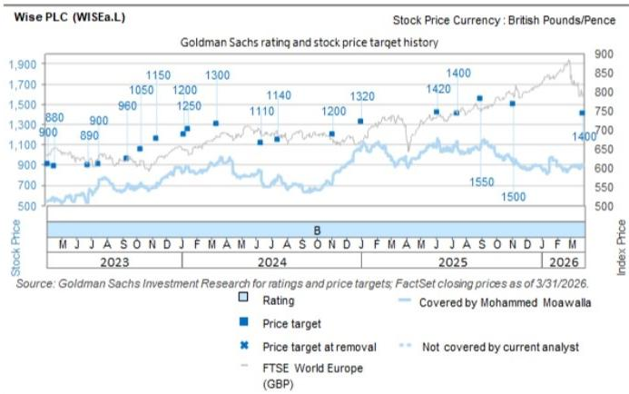
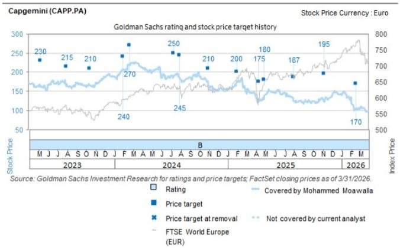

# European Software and Payments Are Entering a New Strategic Era: The Winner Is Not the One with the Best Technology, but the One Who Orchestrates the Semantic Layer

The conference halls in Zurich this June were filled with a different kind of energy. Not the breathless hype of 2021, nor the defensive crouch of 2023. What emerged from the discussions across European software, payments, and digital assets was a clear and sobering thesis: the technological frontier has shifted from building AI to *managing the cost and context* of AI. The companies that will win the next cycle are not those with the most advanced models, but those that can orchestrate a semantic layer around business context, optimize token consumption, and prove that their core infrastructure is more valuable—not less—in an agentic world.

This is not a report about product launches. It is a strategic diagnosis of an industry at an inflection point. The old pricing models are breaking. The old headcount assumptions are dying. And the old distinction between software vendor and business partner is collapsing. For investors and executives alike, the question is no longer “what is the growth rate?” but “what is the defensibility of your business model when every input cost is variable and every output is measured in tokens?”

The following analysis synthesizes the key insights from the European Financials Conference, but it does not merely summarize. It argues that the most important strategic variable for European software and payments companies over the next 24 months will be their ability to manage the unit economics of intelligence—and that the market is not yet pricing this shift correctly.

## The Agentic AI Transition Is Not a Technology Problem—It Is an Operating Model Problem That Most Companies Are Not Prepared to Solve

The most striking insight from the conference was not about the capabilities of frontier models, but about the *operational chaos* they are creating. One major technology services firm noted that over 1,200 to 1,500 new AI services have been launched by major tech firms in the past year alone, alongside two million open-source large language models. The market is drowning in supply. The bottleneck is not intelligence—it is integration.

The speaker from Capgemini framed this precisely: companies are now moving beyond counting use cases to identifying real value-creating capabilities. But the challenge is not technical. It is organizational. The critical task is orchestrating a "semantic layer" around business context—a layer that allows agentic AI to understand what a company actually does, who its customers are, and what constitutes a good outcome. Without this layer, the most powerful models are just expensive parlor tricks.

This is where the strategic insight becomes uncomfortable for many investors. The companies that will capture value from agentic AI are not necessarily the hyperscalers or the model providers. They are the incumbents with deep, long-standing customer relationships and accumulated business knowledge—the Capgeminis and Temenoses of the world. These companies have something the models cannot replicate: contextual trust. The market currently assigns them pedestrian multiples, implicitly betting that AI will commoditize their services. The opposite may be true. As AI becomes more powerful, the value of the deterministic, governed data layer that sits between the model and the business decision increases exponentially.

The "so what" for investors is uncomfortable: the current valuation dispersion between AI-native companies and legacy software firms may be exactly backwards. The incumbents with the semantic layer may be the ones with the most durable competitive advantage.

## The Shift from Subscription to Consumption-Based Token Pricing Will Fundamentally Restructure Software Margins, and the Market Has Not Modeled the Second-Order Effects

One of the most consequential themes to emerge from the conference was the accelerating shift from subscription-based pricing to subscription-plus-consumption models, driven by the rising use of tokens to perform agentic AI. This is not a minor pricing tweak. It is a structural change in how software companies generate revenue and, critically, how their customers budget for technology.

The Capgemini discussion made this explicit: the cost of tokens can balloon depending on the complexity of the task, and CFOs are struggling to allocate enough capital to IT budgets that are being quickly exhausted. This creates a paradox. The more valuable AI becomes, the more tokens companies consume, and the more pressure there is on the software vendor to manage costs. For vendors, this means their revenue becomes more variable, more tied to usage, and less predictable. For customers, it means IT spend is no longer a fixed line item but a variable cost that scales with intelligence consumption.

The second-order implications are significant. First, companies are increasingly exploring domain-specific small language models trained on specific business contexts as an alternative to general-purpose frontier models. This is not just a cost-saving measure—it is a strategic move to reclaim control over the semantic layer. Second, the pricing model shift will likely compress margins for software vendors who cannot demonstrate clear ROI per token. Third, it will create a new category of "token optimization" services, much as cloud optimization became a multi-billion-dollar market after the initial cloud migration wave.

Temenos provided a revealing counterpoint here. While acknowledging the shift, management noted that it does not operate solely on a seat-based model but is largely volume-based, and that banks generally prefer SaaS or subscription fees. This suggests a tension in the market: customers want the flexibility of consumption pricing, but they also want the predictability of subscriptions. The winning vendors will be those that can offer a hybrid model that captures the upside of usage growth while protecting customers from cost volatility.

## The Cost Base Is Being Optimized, but the Real Strategic Question Is How to Reallocate the Time AI Saves—and Most Companies Are Not Answering It

A recurring theme across both public and private company discussions was the impact of AI on headcount and cost structures. The Capgemini speaker noted that rising productivity will likely naturally reduce headcounts, but that companies are currently still figuring out how to best optimize the time saved. Temenos flagged that efficiency gains are already visible in engineering. Raisin noted that token spend is more than 10x offset by personnel cost savings, with the largest gains in engineering and customer care.

The pattern is clear: AI is delivering measurable cost savings. But the strategic question is not about the savings themselves. It is about *reallocation*. The key differentiator for companies over the medium term, as the Capgemini speaker put it, will be how effectively they re-skill employees for other revenue-generating functions.

This is where the market's focus on near-term margin expansion may be misleading. Companies that simply take the cost savings as profit will look good for two quarters and then find themselves strategically hollowed out. Companies that reinvest those savings into customer acquisition, product development, and geographic expansion—as Zopa is doing with increased marketing investment for current accounts and credit cards—will build the compound growth engines that deliver long-term value.

The data point from Raisin is instructive here. The company is deploying coding agents internally and seeing massive efficiency gains, but it remains cautious on customer-facing AI because of a trust barrier. This suggests that the most effective AI deployment strategies are not about replacing customer-facing roles, but about making the back office so efficient that front-line teams can focus on higher-value interactions. The companies that understand this distinction will outperform those that see AI primarily as a cost-cutting tool.

## The Payments Landscape Is Consolidating around a "Platform Plus" Model, but the Real Battle Is for the Customer Relationship, Not the Transaction

The discussions across Wise, Zopa, and Raisin revealed a payments and fintech landscape that is maturing rapidly but still has significant structural runway. The key insight is that the battle is no longer about transaction processing—it is about owning the customer relationship across multiple products.

Wise is the most instructive case. The company reiterated its core mission of solving cross-border payment inefficiencies, but its growth story is increasingly about the broader product ecosystem: the Wise Account, the multi-currency card, Wise Assets, and Wise Business. The Platforms channel, which now accounts for over 5% of cross-border volume and is expected to reach approximately 10% in the medium term, represents a shift from a direct-to-consumer model to an infrastructure model. This is a classic platform play, and it is being enabled by the same forces driving the software side: the need for deterministic, governed data layers that allow third parties to build on top of a trusted infrastructure.

Zopa's evolution from a P2P lender to a full-suite UK digital bank follows a similar logic. With approximately 2 million customers and three growth engines—lending, fee-based current accounts and credit cards, and POS finance—Zopa is building a relationship-based model that is resilient to interest rate cycles. The company's focus on trust, value, and ease is not marketing fluff; it is a direct response to the structural under-delivery of legacy banks in these areas.

Raisin operates in a different segment but with the same strategic logic. By connecting retail savers across Europe and the US with banks offering deposit products, Raisin is building a platform that aggregates demand and supply. The company's durable customer base—older, with larger investable assets, and with negative churn—is the kind of sticky relationship that becomes more valuable over time.

The common thread across all three is that the most valuable payments companies are those that can expand beyond the transaction into the broader financial relationship. The transaction is a commodity. The relationship is the moat.

## What the Report Does Not Fully Answer: How to Value the Semantic Layer in a World of Commoditized Models

For all the depth of the conference discussions, one critical question remains unresolved: how do you value the semantic layer? The report provides strong qualitative evidence that companies with deep business context and long-standing customer relationships are well-positioned to capture value from agentic AI. But it does not provide a framework for quantifying that value.

This is not a criticism of the report—it is a reflection of the market's current state. The semantic layer is an intangible asset that does not appear on balance sheets. It is embedded in customer relationships, proprietary data, and organizational knowledge. Valuing it requires a shift from a product-centric to a relationship-centric valuation framework, and most investors are not there yet.

The open question for the community is this: if the semantic layer is the new moat, how do you measure its depth? Is it the number of years of customer relationships? The volume of proprietary data? The switching costs embedded in the integration? Or something else entirely? The answer will determine which companies are undervalued today.

## A Decision Framework for Investors and Executives

Based on the themes from the conference, here is a three-question framework for evaluating any European software or payments company in the current environment:

**First, does the company own a semantic layer?** This means more than having data. It means having a governed, deterministic, business-context-aware layer that sits between the customer and the AI model. Companies that have this will become more valuable as AI scales. Companies that do not will be disintermediated.

**Second, is the company's pricing model aligned with value creation or value extraction?** The shift to consumption-based token pricing creates a fundamental tension. Companies that can demonstrate clear ROI per token and offer hybrid pricing models will win customer trust. Companies that simply pass through token costs will face margin compression and customer churn.

**Third, is the company reinvesting its AI-driven cost savings into growth or taking them as profit?** The evidence from the conference suggests that the most successful companies are using AI to fund customer acquisition, product expansion, and geographic scaling. Companies that focus solely on margin expansion are building a short-term earnings story at the expense of long-term competitive position.

This framework is deliberately simple. The execution is anything but. But for investors and executives who can answer these three questions with conviction, the next 24 months will offer significant opportunities.

Join the community to read the full report and review the original charts.

*This article is for learning and discussion only and does not constitute investment advice.*

Personal reading notes and learning share only. Not investment advice.

