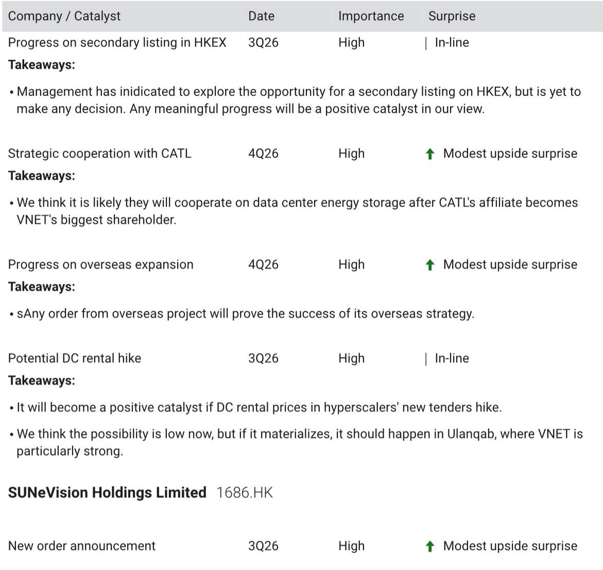
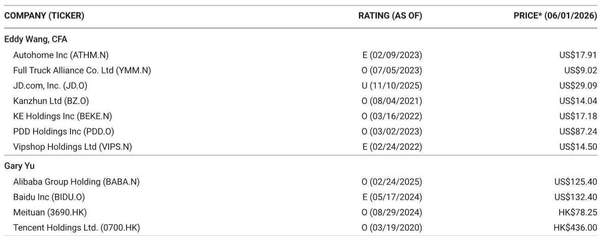
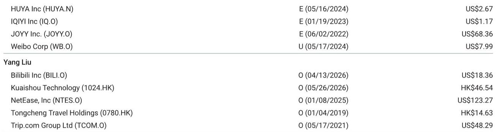

# 市场低估的不是AI概念，而是催化剂事件对盈利拐点的确认

过去六个月，中国互联网板块经历了一轮由AI叙事驱动的估值修复。但真正值得关注的信号，不是大模型发布会上的参数竞赛，而是一系列正在逼近的、可验证的盈利催化剂。某外资投行刚刚发布的催化剂预览报告，系统梳理了2026年三季度至四季度影响中国互联网、软件及数据中心公司股价的关键事件。这份报告的核心判断值得认真对待：市场正在从“相信故事”转向“验证数字”，而三季度将集中出现一批足以改变盈利预期的硬数据点。

报告覆盖的催化剂事件横跨游戏、AI应用、在线旅游、数据中心等多个子行业，但贯穿其中的主线非常清晰——每一家公司的股价催化，都指向同一个问题：AI和宏观改善能否在财务上落地。这不再是概念炒作阶段，而是业绩兑现的检验期。

## 1. 游戏板块正在进入“爆款验证窗口”，三季度是关键分水岭

报告中最引人注目的催化剂，集中在游戏公司的产品上线节点。网易的《Sea of Reminants》定档三季度，报告给出的年化流水预期是30亿元人民币，被定义为“网易2026年最重要的新游发布之一”。这个数字本身已经不小，但更值得关注的是它的战略意义——它将是网易在MMO品类上的一次集中火力检验，直接关系到市场对网易游戏管线价值的重估。

Bilibili的《三国：王霸天下》同样定档四季度，报告给出的年化流水预期是20亿元。对于Bilibili这样一家仍在探索游戏业务盈利模式的公司来说，这款产品能否达到甚至超越预期，将直接影响市场对其游戏业务是否具备“第二增长曲线”的判断。Bilibili的投资者日可能同期举行，如果游戏数据向好，叠加新回购计划，公司估值逻辑可能发生系统性变化。

这里的关键洞察在于：游戏行业已经告别了“立项即涨”的阶段。现在市场对游戏公司的定价，越来越依赖“上线后三个月的流水数据”。三季度将同时出现多款高预期产品的上线，如果其中多数达到或超过目标，整个板块的盈利预期将被系统性上修。反之，如果出现关键产品低于预期的情况，市场对游戏公司AI赋能叙事的信任度也会同步打折。

## 2. AI从“模型发布”转向“ARR增长”，Kuaishou的Kling是观测样本

Kuaishou的Kling模型及其竞品（SeeDance、Happy Horse、VEO）的三季度模型迭代，被报告列为高重要性催化剂。但更有价值的信号藏在“takeaways”中：报告明确指出，“任何关于ARR的信息发布都可能成为催化剂”，以及“Kling的潜在分拆可能成为重大事件”。

这两句话透露了一个重要变化：AI模型的估值锚点正在从MAU转向ARR。过去一年，市场对AI应用的关注集中在用户增长上，但用户的商业价值尚未被充分验证。Kuaishou如果能通过Kling模型展示出清晰的ARR增长路径——比如广告主付费意愿、订阅收入、或者分拆独立融资——那么它将为整个短视频+AI赛道提供一个可量化的估值参照系。

报告还提到，Meitu在6月17日的“美图视觉大赏”上可能发布新AI产品、AI商业化进展以及海外生产力更新。Meitu的催化剂被标为“非常重要的上行惊喜”，说明市场对AI在垂直场景（图像处理、视频编辑）中的变现能力抱有较高期待。如果Meitu能在这个节点上展示出AI订阅收入的加速趋势，那么“AI+工具”这个细分赛道的估值逻辑将被强化。

## 3. 在线旅游的催化剂并不来自需求，而来自“监管落地”和“成本改善”

Trip.com的催化剂清单中，有两件事值得特别注意：一是反垄断调查的监管更新，二是航空燃油附加费的下调可能性。

反垄断调查的监管落地，报告给出的判断是“一次性罚款对公司价值影响极小”，但“强制改变商业模式或佣金率将触发市场对其盈利能力重新估值”。这个表述其实是在提示一个被低估的风险与机会并存的结构性变化：如果调查结果只是罚款，那对股价是靴子落地式的利好；但如果涉及商业模式调整，则可能重塑整个在线旅游行业的竞争格局。

燃油附加费的下调，则是一个更直接的短期催化剂。报告指出，高油价已经显著抑制了中国国内旅游需求，任何正向变化都将带来反弹，而且“这对暑期旺季表现至关重要”。这里隐含的判断是：当前旅游需求并非缺乏弹性，而是被成本压住了。一旦成本端出现改善，压抑的需求可能集中释放，三季度旅游数据有望超预期。

## 4. 数据中心行业正在等待“订单潮”和“提价信号”，VNET是核心观测标的

VNET的催化剂清单覆盖了多个维度：超大规模云服务商的新订单、与CATL在数据中心储能领域的合作、海外扩张进展、以及潜在的数据中心租金上调。

其中最值得关注的，是“乌兰察布数据中心租金上调”的可能性。报告明确写道：“我们认为目前可能性较低，但如果发生，应该发生在乌兰察布，而VNET在那里特别强。”这句话点出了一个被市场忽视的结构性变量：中国数据中心行业长期面临供过于求的压力，但如果一线城市周边的优质节点开始出现租金上调信号，那将意味着供需关系的拐点正在到来。

VNET与CATL的合作也值得深入解读。CATL关联方已成为VNET最大股东，双方在数据中心储能领域的合作几乎是必然的。这不仅是VNET的催化剂，更是整个数据中心行业“绿电+储能”商业模式的一次重要验证。如果合作顺利，数据中心将从单纯的“算力出租”转向“算力+能源服务”的综合运营商，估值逻辑可能随之重估。

## 5. 报告尚未完全回答的关键问题：AI ARR的可持续性能否被验证

尽管报告列出了大量催化剂事件，但有一个关键假设尚未被充分验证：AI产品的ARR增长是否可持续？Kuaishou的Kling、Meitu的AI产品、以及WPS AI Agent的发布，都指向AI商业化正在加速，但报告并没有提供这些公司AI ARR的具体基数或增长轨迹。

这里存在一个二阶问题：如果三季度多家公司同时发布AI ARR数据，且增速符合或超过预期，那么市场对“AI+互联网”的整体估值溢价可能系统性上升。但反过来，如果只有个别公司表现突出，而多数公司低于预期，那么AI叙事将出现分化——真正有产品壁垒和变现路径的公司将获得更高估值，而纯概念公司将被抛弃。

另一个未解问题是：数据中心租金上调的时机和幅度。报告认为可能性较低，但并未排除。如果三季度真的出现乌兰察布或类似节点的租金上调，那将是整个IDC板块估值修复的导火索。但这一假设目前仍缺乏足够的前瞻信号，需要持续跟踪超大规模云服务商的招标动态。

## 6. 投资者需要建立“催化剂验证日历”，而非简单押注单个事件

基于这份报告，一个更务实的观察框架是：不要试图押注单个催化剂事件，而是建立一份“催化剂验证日历”，跟踪多个关键节点的数据发布节奏。

具体来说，三季度需要重点关注的节点包括：Meitu的AI商业化进展（6月17日）、Beisen的年度业绩（6月22日）、网易《Justice Mobile》新版本上线（6月26日）、WPS AI Agent产品发布（7月）、Bilibili World及潜在投资者日（7月）、以及Kuaishou Kling模型迭代（三季度）。每个节点都可能产生上行或下行惊喜，但更重要的不是单个节点的结果，而是这些结果叠加后形成的“验证密度”——如果多数节点都释放正向信号，市场对中国互联网板块的盈利预期将被系统性上修。

四季度则需要关注：网易《Sea of Reminants》上线数据、Bilibili《三国：王霸天下》上线数据、VNET与CATL合作进展、以及数据中心租金变化。这些事件将决定全年盈利预测是否还有上修空间。

这份报告的真正价值，不在于它预测了哪些事件会上涨，而在于它提供了一组可验证的假设。投资者需要做的，是跟踪这些假设的验证结果，并据此调整对行业整体盈利趋势的判断。

---

以上讨论的只是这份报告的一部分观察框架。报告中还包含大量未在这篇文章中展开的细节——比如Beisen的AI ARR预期、Bilibili回购计划对股东回报的持续影响、以及SUNeVision在香港数据中心市场的新订单前景。这些内容都在报告原文中有更完整的分析。如果你对某个具体公司的催化剂逻辑或估值框架感兴趣，欢迎来星球微信群里继续讨论，我们可以基于报告原文做更深入的拆解和推演。

Personal reading notes and learning share only. Not investment advice.

