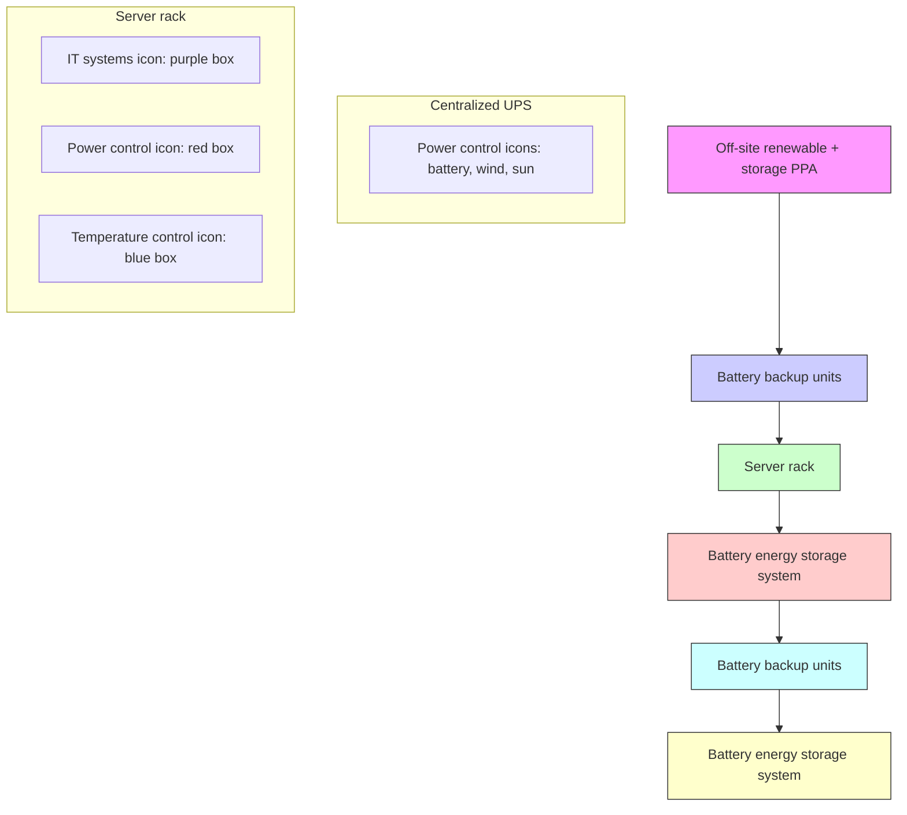

You are a senior financial newsletter editor with a consulting-style strategy lens. You turn research-report material into a long-form English article that is structured, insightful, and suitable for a serious business audience.

Objective:
- Write an English Markdown article based on the report parsing below.
- Target length: around 2200 words, plus or minus 15%.
- Tone: serious, analytical, strategic, and readable.
- The article should not feel like a summary. It should make an argument.
- You may extend the report's logic into reasonable second-order implications, but do not invent data, company actions, or quotes.
- Do not disclose every detail. Leave several meaningful open questions that make readers want the full report.

McKinsey-style writing principles:
1. Answer first: open with the controlling idea, not background.
2. Governing thought: every section must support the main answer.
3. Mutually exclusive, collectively exhaustive logic: avoid overlapping sections.
4. So what: every section must explain why the point matters.
5. Synthesis over summary: do not list facts; interpret what the pattern means.
6. Action titles: section headings must be complete, insight-bearing sentences. Do not use generic headings such as "Key Takeaways", "Market Background", "Core View", or "Reader Implications".
7. Natural hooks: if you want readers to join the community or read the full report, the hook should emerge from unresolved analytical questions, not from promotional language.

Required Markdown structure:
- `# Title`: make it a direct argument, not a topic label.
- Opening: 4-6 short paragraphs that state the main thesis and why now matters.
- 4-6 `##` sections. Each `##` heading must be an action title: a sentence that tells the reader the insight.
- One section should identify what the report does not fully answer yet.
- One section should translate the report into a decision framework for readers.
- Final section: naturally invite readers to join the community or read the full report using this CTA: Join the community to read the full report and review the original charts.
- End with: `*This article is for learning and discussion only and does not constitute investment advice.*`

Content boundaries:
- Do not mention specific investment bank names such as GS. Use "a global investment bank report" if needed.
- Do not use emoji.
- Do not write like a viral post.
- Do not output your reasoning process.
- Do not generate image Markdown; the system will insert original MinerU images afterward.

Report parsing:
"""
# AIDC ESS

# Reference Architectures and Early Orders Point to ESS Adoption

Siemens (SIE GR, OW, covered by Phil Buller) announced that it is working with NVIDIA (NVDA US, OW, Covered by Harlan Sur) and partnering with Fluence Energy (FLNC US, Neutral, covered by Mark Strouse) to develop reference power-and-controls architecture for AIDCs. Within this architecture, Fluence Energy contributes the battery energy storage system. Together with Fluence Energy's previous announcement on MAS with hyperscalers, we believe these should rebuff market concerns on whether AIDCs need ESS. During our recent visit to Sungrow, management shared a similar view that ESS is a major solution to AIDC power constraints and they have already received ESS orders from datacenter power developers. Meanwhile, LEGS (373220 KS, OW, covered by Parsley Ong) also announced that it has signed a \$1.6bn contract to supply 6GWh of ESS batteries to DTE Energy. This is in line with our key takeaways from the expert call we hosted (link), where the expert saw that ESS is likely to be part of the AIDC power solution in a tight power supply market, but orders will likely be more back-end loaded, due to the development sequence. Within the APAC region, we highlight key OW-rated names under JPM APAC coverage: CATL-H/A, Sungrow, Samsung SDI, LGES and Nari.

Siemens partners with Fluence Energy to develop power architecture for AIDCs: Siemens, working with NVIDIA and partnering with Fluence Energy, has developed UL-aligned reference power-and-controls architecture for next-generation AIDCs that translates the “AI factory” concept into a deployable, modular electrical blueprint (official release link). Within this architecture, Fluence Energy contributes battery energy storage to add resilience and flexibility in power-constrained environments – supporting capabilities such as ride-through, black start, demand response, and AI load smoothing – so operators can bring extreme-density compute online faster while staying within fixed power envelopes.

Key takeaways from the AIDC ESS developments: We have seen a few positive developments with respect to AIDC ESS. In addition to the one mentioned above, in early May 2026, Fluence Energy announced that it had signed Master Supply Agreements (MAS) with two hyperscalers and expected first orders during F3Q (report link). We believe these developments should rebuff market concerns on whether AIDCs need ESS and result in rising expectations for AIDC ESS demand into FY26/27.

How this aligns with APAC companies: During our visit to Sungrow (report link) in mid May 2026, management shared that ESS is a major solution to AIDC power constraints; Sungrow has already received ESS orders from data-center power developers, while these ESS will be used to support AIDCs. This should further reinforce the thesis for AIDC ESS deployment. In late May 2026, LG Energy Solution (373220 KS, OW, covered by Parsley Ong) announced that it had signed a \$1.6bn contract to supply 6GWh of ESS batteries to DTE Energy (see Parsley's report link).

# APAC Utilities & Renewables | Sustainable Investing

# Alan Hon AC

(852) 2800-8573

alan.hon@JPM.com

JPM Securities (Asia Pacific) Limited/ JPM Broking (Hong Kong) Limited

# Rebecca Wen AC

(852) 2800-8505

rebecca.y.wen@JPM.com

JPM Securities (Asia Pacific) Limited/ JPM Broking (Hong Kong) Limited

# Daqi Jiao

(852) 2800-8595

daqi.jiao@JPM.com

JPM Securities (Asia Pacific) Limited/ JPM Broking (Hong Kong) Limited

# Parsley Ong

(65) 6882-8578

parsley.rh.ong@JPM.com

JPM Securities Singapore Private Limited/

JPM Securities (Asia Pacific) Limited/ JPM Broking (Hong Kong) Limited

# Sonny Lee

(82-2) 758 5716

sonny.lee@JPM.com

JPM Securities (Far East) Limited, Seoul

Branch

# Nick Lai

(65) 6801-3176

nick.yc.lai@JPM.com

JPM Securities Singapore Private Limited/

JPM Securities (Asia Pacific) Limited/ JPM Broking (Hong Kong) Limited

# Stephen Tsui, CFA

(852) 2800-8592

stephen.tsui@JPM.com

JPM Securities (Asia Pacific) Limited/ JPM Broking (Hong Kong) Limited

Re-cap from the AIDC ESS expert call: We hosted an expert call on AIDC ESS (report link) in late April 2026, where an industry expert shared that ESS is likely to be part of the AIDC power solution in a tight power supply market, as most new AIDCs will require BESS for reliability and optimization, with rising attachment rates and durations. However, AIDC ESS will likely be more back-end loaded, due to the development sequence. Furthermore, distinct AIDC ESS requirements favour leading players with strong product quality, i.e. Sungrow and LGES.

- ESS adoption in AIDCs appears slow, development sequence explains the lag: AIDC ESS adoption is taking time due to construction sequencing, not a lack of demand. ESS installation in a typical AIDC build occurs in the later stages — after land and civil works, foundation works, onsite power generation and the construction of data center halls and control buildings. Most large-scale AIDCs are still in the early construction phases. ESS procurement and installation should accelerate meaningfully as these projects progress toward completion. The expert’s view is that the best period for ESS demand is still ahead, concentrated in the back half of the current build cycle.   
- Distinct AIDC ESS requirements favor players with strong product quality: AIDC ESS is a distinct product category from utility-scale ESS, despite similar battery hardware. Utility-scale ESS is optimized for energy arbitrage, daily cycling and predictable loads. In contrast, AIDC ESS is designed for power quality, redundancy and the protection of valuable IT equipment, requiring rapid response, high power density and frequent micro-cycling. This demands high-quality product. The industry is moving toward integrating BESS and UPS into a unified energy layer.

Mix of launches of BESS in data centers, by storage duration

pie

| Category | Percentage (%) |
|---|---|
| <2 hours | 23 |
| 2 hours | 23 |
| 4 hours | 33 |
| 10+ hours | 8 |
| 4-10 hours | 15 |

Source: BloombergNEF. Note: Not all projects disclose storage duration. Data as of 30 March 2026.

Mix of AIDC ESS use cases (in terms of capacity) in the US, averaged over 2026E-30E

pie

| Category | Value (%) |
|---|---|
| Power smoothing | 5 |
| IPS | 9 |
| Solar and storage PPAs | 23 |
| Gas generation support | 34 |
| Flexibility | 29 |

Source: BloombergNEF.

Figure 1: Levels of energy storage in a data center   

flowchart

Source: BloombergNEF. PPA = power purchasing agreement; UPS = uninterruptible power supply.

Figure 2: Types of energy storage used in data centers 

<table><tr><td></td><td>Off-site energy storage</td><td>UPS</td><td>BBU</td><td>On-site energy storage</td></tr><tr><td>Adoption</td><td>Common</td><td>Near universal</td><td>Hyperscale/AI</td><td>Limited</td></tr><tr><td>Battery chemistry</td><td>Lithium-ion (LFP)Redox-flow, iron-air</td><td>Lead-acidLithium-ion (NMC, LFP)Nickel-zinc</td><td>Lithium-ion (LFP)Supercapacitor</td><td>Lithium-ion (LFP)Redox-flow, iron-air</td></tr><tr><td>Runtime</td><td>2-4 hours5+ hour storage less common</td><td>5-30 mins</td><td>1.5-5 mins</td><td>2-4 hours5+ hour storage less common</td></tr><tr><td>Purpose</td><td>Co-located with renewable power generation</td><td>Short-term back up/ride through to generatorPower smoothing</td><td>Short term back up/ride through to generatorPower smoothing</td><td>Supporting on-site generationFlexibilityPower smoothing</td></tr><tr><td>Grid interactive/flexible</td><td>Yes</td><td>Can be but usually not</td><td>No</td><td>Yes</td></tr><tr><td>Ownership</td><td>Energy developer</td><td>Data center</td><td>Rack owner</td><td>Energy developer, alternative models</td></tr></table>

Source: BloombergNEF. Note: UPS = uninterruptible power supply; NMC = nickel manganese cobalt; LFP = lithium iron phosphate; BBU = battery backup unit.

# Recommendations

The table below summarizes the key relevant stocks under JPM coverage and their exposure to the ESS business.

- We recently initiated coverage of Deye at OW. Deye is a distributed generation (DG) energy storage (ESS) producer with a first-mover advantage in Emerging Markets (EM). We see structural growth in ESS globally, on energy transition and renewables' intermittent issues. ESS battery shipment data in April also indicated DG has higher growth (C&I +154%yoy) than utility-scale (+93% yoy). By geography, multiple EM regions will see >50% 2025-27 installation CAGR, per Bloomberg New Energy Finance (BNEF). Near term, energy supply shocks are catalyzing faster adoption of DG of solar +storage, especially in regions where DG diesel was adopted. Longer term, we may see a policy tilt towards energy resilience, providing a long-term growth tailwind. Deye's legacy exposure to home appliances enables its cost leadership, owing to the rise in in-house fabrication (link to initiation report).   
- Largest PCS supplier – Sungrow (OW): Sungrow is the world’s largest solar inverter producer by volume, gaining market share in recent years due to cost advantage. Sungrow offers superior product quality and stronger brand recognition compared to domestic peers. We expect Sungrow to benefit from robust ESS demand and rising orders from utilities and data centers.   
- China ESS battery: CATL-A (OW) is the largest ESS battery maker globally and our top pick in China's battery value chain. EVE Energy (N) has the highest ESS exposure among covered battery makers, followed by CALB (N). We also favor BYD-H/A (OW), given strong demand for its EV models in overseas markets and benefits from vertical integration in EV and ESS.

\- Korean battery players see improved opportunities and margins in US ESS: ESS order win momentum at LGES (OW) has been strong, and we estimate that the company has the largest LFP ESS order backlog among Korean battery makers. ESS visibility is also improving for SDI (OW): US battery import data indicate that China-origin shipments have fallen further since July 2025 (post-OBBBA), while Korea-origin (largely SDI) shipments have risen sequentially, supporting an ongoing sourcing shift as US regulations remain effective. SDI's LFP cathode contract with L&F implies \~25GWh/year of US ESS shipments by 2028-29.

Figure 3: Summary of ESS value chain stocks under JPM coverage 

<table><tr><td rowspan="2">Company</td><td rowspan="2">Ticker</td><td rowspan="2">Cover Analyst</td><td rowspan="2">JPM Rating</td><td rowspan="2">ESS business</td><td colspan="3">ESS revenue exposure</td><td colspan="3">ESS volume exposure</td></tr><tr><td>FY25A</td><td>FY26E</td><td>FY27E</td><td>FY25A</td><td>FY26E</td><td>FY27E</td></tr><tr><td>CATL</td><td>300750 CH</td><td>Rebecca Wen</td><td>OW</td><td>ESS battery</td><td>15%</td><td>18%</td><td>22%</td><td>18%</td><td>22%</td><td>26%</td></tr><tr><td>CALB</td><td>3931 HK</td><td>Rebecca Wen</td><td>N</td><td>ESS battery</td><td>32%</td><td>27%</td><td>30%</td><td>41%</td><td>40%</td><td>43%</td></tr><tr><td>EVE Energy*</td><td>300014 CH</td><td>Rebecca Wen</td><td>N</td><td>ESS battery</td><td>40%</td><td>38%</td><td>40%</td><td>59%</td><td>54%</td><td>56%</td></tr><tr><td>Gotion</td><td>002074 CH</td><td>Rebecca Wen</td><td>UW</td><td>ESS battery</td><td>19%</td><td>21%</td><td>24%</td><td>30%</td><td>33%</td><td>37%</td></tr><tr><td>BYD-H</td><td>1211 HK</td><td>Nick Lai</td><td>OW</td><td>ESS battery</td><td>4%</td><td>5%</td><td>n/a</td><td>20%</td><td>27%</td><td>n/a</td></tr><tr><td>LGES</td><td>373220 KS</td><td>Parsley Ong</td><td>OW</td><td>ESS battery</td><td>13%</td><td>33%</td><td>41%</td><td>8%</td><td>23%</td><td>31%</td></tr><tr><td>Samsung SDI</td><td>006400 KS</td><td>Sonny Lee</td><td>OW</td><td>ESS battery</td><td>22%</td><td>30%</td><td>31%</td><td>33%</td><td>44%</td><td>49%</td></tr><tr><td>Sungrow</td><td>300274 CH</td><td>Alan Hon</td><td>OW</td><td>PCS+EMS+integration</td><td>42%</td><td>49%</td><td>53%</td><td>n/a</td><td>n/a</td><td>n/a</td></tr><tr><td>Deye</td><td>605117 CH</td><td>Alan Hon</td><td>OW</td><td>PCS+battery+packs</td><td>74%</td><td>86%</td><td>89%</td><td>n/a</td><td>n/a</td><td>n/a</td></tr><tr><td>Nari</td><td>600406 CH</td><td>Stephen Tsui</td><td>OW</td><td>BMS+PCS+EMS+integration</td><td>n/a</td><td>n/a</td><td>n/a</td><td>n/a</td><td>n/a</td><td>n/a</td></tr><tr><td>Xuji</td><td>000400 CH</td><td>Stephen Tsui</td><td>OW</td><td>PCS+EPC</td><td>n/a</td><td>n/a</td><td>n/a</td><td>n/a</td><td>n/a</td><td>n/a</td></tr></table>

Source: Company data, JPM estimates. Note: ESS battery may include BMS or system integration. EVE's ESS volume exposure refers to ESS battery volume over total power battery, not incl. consumer battery. Note: Gotion FY25 exposure is JPMe. Note: SDI's total revenue includes electronic materials and small battery while volume excludes electronic materials and small battery.

Companies Discussed in This Report (all prices in this report as of market close on 02 June 2026, unless otherwise indicated) BYD Company Limited - A(002594.SZ/Rmb96.76/OW), BYD Company Limited - H(1211.HK/HK\$96.75/OW), CALB(3931.HK/HK\$31.96/OW), CATL - A(300750.SZ/Rmb433.89/OW), CATL - H(3750.HK/HK\$779.50/OW), Deye - A(605117.SS/Rmb111.10/OW), EVE Energy(300014.SZ/Rmb65.48/N), LG Energy Solution(373220.KS/W443,500/OW), Nari Technology - A(600406.SS/Rmb24.64/OW), Samsung SDI(006400.KS/W601,000/OW), Sungrow - A(300274.SZ/Rmb172.70/OW)

Analyst Certification: The Research Analyst(s) denoted by an “AC” on the cover of this report certifies (or, where multiple Research Analysts are primarily responsible for this report, the Research Analyst denoted by an “AC” on the cover or within the document individually certifies, with respect to each security or issuer that the Research Analyst covers in this research) that: (1) all of the views expressed in this report accurately reflect the Research Analyst’s personal views about any and all of the subject securities or issuers; and (2) no part of any of the Research Analyst's compensation was, is, or will be directly or indirectly related to the specific recommendations or views expressed by the Research Analyst(s) in this report. For all Korea-based Research Analysts listed on the front cover, if applicable, they also certify, as per KOFIA requirements, that the Research Analyst’s analysis was made in good faith and that the views reflect the Research Analyst’s own opinion, without undue influence or intervention.

All authors named within this report are Research Analysts who produce independent research unless otherwise specified. In Europe, Sector Specialists (Sales and Trading) may be shown on this report as contacts but are not authors of the report or part of the Research Department.

Research excerpts: This material may include excerpts from previously published reports. For access to the full reports, including analyst certification and important disclosures, please contact your sales representative or the covering analyst's team, or visit https://www.JPMmarkets.com.

# Important Disclosures

• Market Maker/ Liquidity Provider: JPM is a market maker and/or liquidity provider in the financial instruments of/related to LG Energy Solution, Samsung SDI or related entities.   
- Manager or Co-manager: JPM acted as manager or co-manager in a public offering of securities or financial instruments (as such term is defined in Directive 2014/65/EU) of/for LG Energy Solution or related entities within the past 12 months.   
- Beneficial Ownership (1% or more): JPM beneficially owns 1% or more of a class of common equity securities of LG Energy Solution or related entities.   
- Client: JPM currently has, or had within the past 12 months, the following entity(ies) as clients: LG Energy Solution, Samsung SDI or related entities.   
- Client/Investment Banking: JPM currently has, or had within the past 12 months, the following entity(ies) as investment banking clients: LG Energy Solution or related entities.   
- Client/Non-Investment Banking, Securities-Related: JPM currently has, or had within the past 12 months, the following entity(ies) as clients, and the services provided were non-investment-banking, securities-related: LG Energy Solution, Samsung SDI or related entities.   
- Client/Non-Securities-Related: JPM currently has, or had within the past 12 months, the following entity(ies) as clients, and the services provided were non-securities-related: LG Energy Solution or related entities.   
- Investment Banking Compensation Received: JPM has received in the past 12 months compensation for investment banking services from LG Energy Solution or related entities.   
- Potential Investment Banking Compensation: JPM expects to receive, or intends to seek, compensation for investment banking services in the next three months from LG Energy Solution, Samsung SDI or related entities.   
• Non-Investment Banking Compensation Received: JPM has received compensation in the past 12 months for products or services other than investment banking from LG Energy Solution, Samsung SDI or related entities.   
- Debt Position: JPM may hold a position in the debt securities of LG Energy Solution, Samsung SDI or related entities, if any.

Company-Specific Disclosures: JPM does and seeks to do business with companies covered in its research reports. A

[中间内容因长度限制已省略]

dates may be provided on companies/industries based on company-specific developments or announcements, market conditions or any other publicly available information. There can be no assurance that future results or events will be consistent with any such opinions, forecasts or projections, which represent only one possible outcome. Furthermore, such opinions, forecasts or projections are subject to certain risks, uncertainties and assumptions that have not been verified, and future actual results or events could differ materially. The value of, or income from, any investments referred to in this material may fluctuate and/or be affected by changes in exchange rates. All pricing is indicative as of the close of market for the securities discussed, unless otherwise stated. Past performance is not indicative of future results. Accordingly, investors may receive back less than originally invested. This material is not intended as an offer or solicitation for the purchase or sale of any financial instrument. The opinions and recommendations herein do not take into account individual client circumstances, objectives, or needs and are not intended as recommendations of particular securities, financial instruments or strategies to particular clients. This material may include views on structured securities, options, futures and other derivatives. These are complex instruments, may involve a high degree of risk and may be appropriate investments only for sophisticated investors who are capable of understanding and assuming the risks involved. The recipients of this material must make their own independent decisions regarding any securities or financial instruments mentioned herein and should seek advice from such independent financial, legal, tax or other adviser as they deem necessary. JPM may trade as a principal on the basis of the Research Analysts' views and research, and it may also engage in transactions for its own account or for its clients' accounts in a manner inconsistent with the views taken in this material, and JPM is under no obligation to ensure that such other communication is

brought to the attention of any recipient of this material. Others within JPM, including Strategists, Sales staff and other Research Analysts, may take views that are inconsistent with those taken in this material. Employees of JPM not involved in the preparation of this material may have investments in the securities (or derivatives of such securities) mentioned in this material and may trade them in ways different from those discussed in this material. This material is not an advertisement for or marketing of any issuer, its products or services, or its securities in any jurisdiction.

Confidentiality and Security Notice: This transmission may contain information that is privileged, confidential, legally privileged, and/or exempt from disclosure under applicable law. If you are not the intended recipient, you are hereby notified that any disclosure, copying, distribution, or use of the information contained herein (including any reliance thereon) is STRICTLY PROHIBITED. Although this transmission and any attachments are believed to be free of any virus or other defect that might affect any computer system into which it is received and opened, it is the responsibility of the recipient to ensure that it is virus free and no responsibility is accepted by JPM Chase & Co., its subsidiaries and affiliates, as applicable, for any loss or damage arising in any way from its use. If you received this transmission in error, please immediately contact the sender and destroy the material in its entirety, whether in electronic or hard copy format. This message is subject to electronic monitoring: https://www.JPM.com/disclosures/email

MSCI: Certain information herein (“Information”) is reproduced by permission of MSCI Inc., its affiliates and information providers (“MSCI”) ©2026. No reproduction or dissemination of the Information is permitted without an appropriate license. MSCI MAKES NO EXPRESS OR IMPLIED WARRANTIES (INCLUDING MERCHANTABILITY OR FITNESS) AS TO THE INFORMATION AND DISCLAIMS ALL LIABILITY TO THE EXTENT PERMITTED BY LAW. No Information constitutes investment advice, except for any applicable Information from MSCI ESG Research. Subject also to msci.com/disclaimer

Sustainalytics: Certain information, data, analyses and opinions contained herein are reproduced by permission of Sustainalytics and: (1) includes the proprietary information of Sustainalytics; (2) may not be copied or redistributed except as specifically authorized; (3) do not constitute investment advice nor an endorsement of any product or project; (4) are provided solely for informational purposes; and (5) are not warranted to be complete, accurate or timely. Sustainalytics is not responsible for any trading decisions, damages or other losses related to it or its use. The use of the data is subject to conditions available at https://www.sustainalytics.com/legal-disclaimers. ©2026 Sustainalytics. All Rights Reserved.

"Other Disclosures" last revised May 16, 2026.

Copyright 2026 JPM Chase & Co. All rights reserved. This material or any portion hereof may not be reprinted, sold or redistributed without the written consent of JPM. It is strictly prohibited to use or share without prior written consent from JPM any research material received from JPM or an authorized third-party (“JPM Data”) in any third-party artificial intelligence (“AI”) systems or models when such JPM Data is accessible by a third-party.

Completed 02 Jun 2026 09:25 PM HKT

Disseminated 02 Jun 2026 09:25 PM HKT
"""
