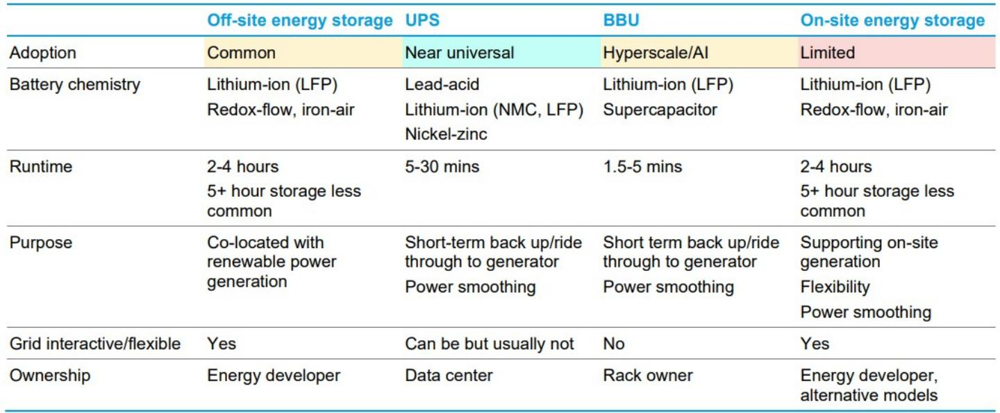
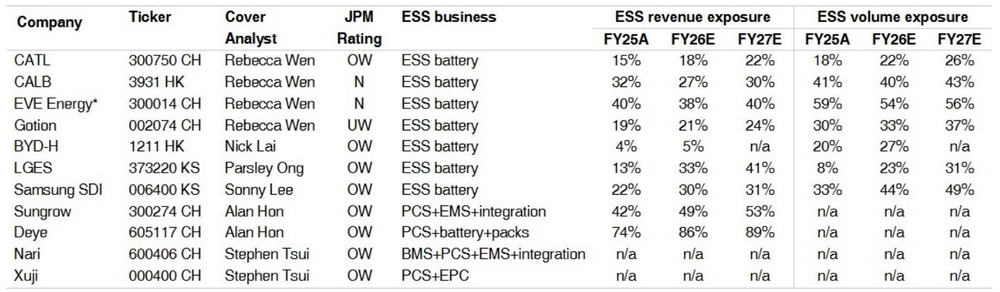
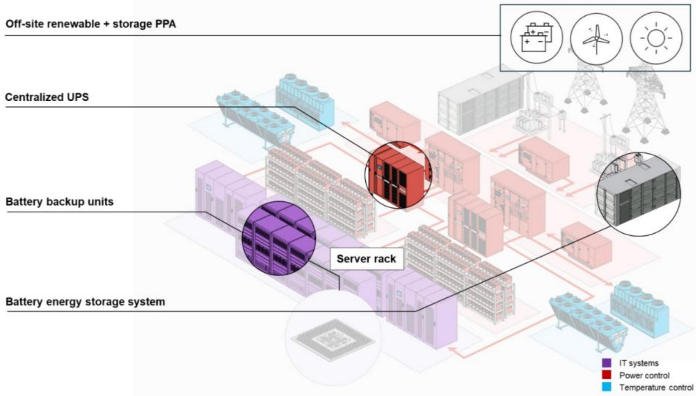

# AI Data Centers Cannot Scale Without Energy Storage: Three Catalysts That Just Changed the Calculus

The debate over whether artificial intelligence data centers need battery energy storage has been settled by a cascade of announcements in recent weeks. The answer is yes, and the implications for the energy storage supply chain are far larger than the market currently prices in. A global investment bank report has tracked three distinct catalysts that together mark a structural shift: a major industrial partnership that created the first reference architecture for AI data center power systems, master supply agreements between hyperscalers and a leading storage provider, and a $1.6 billion battery supply contract from a US utility. These are not isolated events. They form a coherent pattern that reframes energy storage from an optional add-on to a necessary enabler of AI infrastructure deployment.

The timing matters. AI data center construction is accelerating globally, but power constraints have emerged as the primary bottleneck. The conventional view held that battery storage was too expensive, too untested at scale, or simply unnecessary for data center operations. That view is now outdated. The evidence points in a single direction: energy storage systems will become standard equipment in next-generation AI data centers, and the companies positioned in this supply chain will see demand accelerate through 2027 and beyond.

This article argues that the AI data center energy storage thesis has moved from theoretical to operational, and that investors should focus on three layers of opportunity: the architecture shift, the procurement cycle timing, and the product differentiation that favors specific suppliers.

## The Siemens-NVIDIA-Fluence Reference Architecture Turns Energy Storage from an Option into a Standard

The most consequential development for the AI data center energy storage thesis is not a contract or a product launch. It is a reference architecture. Siemens, working with NVIDIA and partnering with Fluence Energy, has developed a UL-aligned power and controls blueprint for next-generation AI data centers that explicitly incorporates battery energy storage as a core component. This is not a theoretical proposal. It is a deployable, modular electrical design that translates the "AI factory" concept into engineering specifications that operators can implement today.

Why this matters is straightforward. Reference architectures reduce risk. When a major industrial company like Siemens, a dominant computing platform like NVIDIA, and a specialized storage provider like Fluence jointly publish a standardized design, it lowers the barrier for every data center developer evaluating whether to include storage. The architecture addresses the key engineering challenges: ride-through capability during grid disturbances, black start functionality for recovery after outages, demand response participation to manage power costs, and AI load smoothing to handle the extreme power variance of GPU clusters. These capabilities are not nice-to-have features. They are essential for operating extreme-density compute within fixed power envelopes.

The strategic implication is that energy storage is no longer an experiment that each operator must validate independently. It is now a pre-engineered solution. This accelerates adoption timelines across the industry, not just for one customer or one region. The reference architecture creates a template that can be replicated, modified for local conditions, and scaled. For the energy storage supply chain, this means that demand is not dependent on a handful of pioneering operators making bespoke decisions. It is now embedded in the standard engineering playbook for AI data center construction.

## Hyperscaler Master Supply Agreements Confirm That Demand Is Real and Immediate

The second catalyst is equally concrete. In early May 2026, Fluence Energy announced that it had signed Master Supply Agreements with two hyperscalers, with first orders expected during the third fiscal quarter of 2026. This is not speculation about future demand. It is a contractual commitment from the largest operators of AI infrastructure to procure energy storage systems.

The significance of master supply agreements should not be underestimated. Hyperscalers do not sign these agreements for technology experiments. They sign them when they have validated the use case, defined the specifications, and committed to deployment timelines. The fact that two hyperscalers have done this simultaneously suggests that the internal evaluations at multiple major cloud providers have converged on the same conclusion: energy storage is necessary for their AI data center expansion plans.

This development directly rebuts the market concern that AI data centers do not need energy storage. The concern was always plausible on the surface. Traditional data centers have operated for decades with uninterruptible power supplies and backup generators, not large-scale battery systems. Why would AI change that? The answer is power density. AI clusters draw far more power per rack than traditional workloads, and the variability of that power draw creates grid stability challenges that conventional solutions cannot address. The hyperscalers have now confirmed this with their procurement decisions.

For investors, the implication is that the demand signal is no longer theoretical. The procurement cycle has begun. The question is no longer whether orders will come, but how quickly they will scale and which suppliers will capture the most value.

## The $1.6 Billion LGES-DTE Contract Signals Utility-Scale Cross-Sector Demand

The third catalyst extends beyond data center operators to the utility sector. In late May 2026, LG Energy Solution announced a $1.6 billion contract to supply 6 GWh of energy storage batteries to DTE Energy. While this contract is not explicitly tied to AI data centers, its timing and scale are instructive. DTE Energy serves a region with significant data center development activity, and utilities are increasingly viewing energy storage as the bridge between constrained grid capacity and the power demands of AI infrastructure.

This contract demonstrates that the energy storage demand from AI is not limited to on-site systems at data center facilities. It extends to the utility side of the meter. As data centers connect to the grid, utilities need storage to manage the load impact, maintain reliability, and avoid costly transmission upgrades. The LGES-DTE contract is a leading indicator of this broader trend.

The pattern across all three catalysts is consistent. The architecture partnership creates the technical standard. The hyperscaler agreements create the demand signal. The utility contract creates the infrastructure enabler. Together, they form a self-reinforcing cycle that will drive energy storage deployment across multiple layers of the AI data center ecosystem.

## The Timing Puzzle: Why Energy Storage Orders Will Be Back-End Loaded and What That Means for Investors

Despite the positive catalysts, one critical question remains unanswered by the current data: when will the bulk of energy storage orders materialize? The report acknowledges that adoption has appeared slow, but it attributes this to construction sequencing rather than a lack of demand. This distinction is essential for investment timing.

Energy storage installation in a typical AI data center build occurs in the later stages of construction. The sequence is land acquisition, civil works, foundation construction, onsite power generation installation, data center hall construction, control building completion, and only then energy storage system installation. Most large-scale AI data centers are still in the early phases of this sequence. The expert call referenced in the report confirms that the best period for energy storage demand is still ahead, concentrated in the back half of the current build cycle.

This creates a timing puzzle for investors. The demand thesis is validated, but the revenue recognition for storage suppliers may be delayed relative to the hype cycle. The risk is that markets become impatient with the lag between contract announcements and actual deliveries. The opportunity is that patient investors can position ahead of the inflection point when procurement accelerates.

The report does not fully resolve this timing question. It provides directional guidance that orders will be back-end loaded, but it does not specify the quarters or the magnitude of the acceleration. This is one of the meaningful open questions that readers should explore in the full report. Understanding the specific milestones that will trigger the next wave of orders is essential for constructing a precise investment timeline.

## A Decision Framework for Evaluating AI Data Center Energy Storage Exposure

For investors navigating this theme, the report provides enough data to construct a decision framework. The framework has three dimensions: product type, geographic exposure, and competitive positioning.

First, product type. The report distinguishes between utility-scale energy storage and AI data center energy storage. They use similar battery hardware, but the application requirements are fundamentally different. Utility-scale storage is optimized for energy arbitrage, daily cycling, and predictable loads. AI data center storage is designed for power quality, redundancy, and protection of valuable IT equipment. It requires rapid response, high power density, and frequent micro-cycling. This distinction favors suppliers with strong product quality and proven reliability. The report specifically identifies Sungrow and LGES as benefiting from this differentiation.

Second, geographic exposure. The report focuses on APAC suppliers, but the demand is global. The Siemens-Fluence architecture is UL-aligned for the US market. The hyperscaler agreements are likely global. The utility contract is with a US utility. Investors should evaluate which suppliers have the manufacturing capacity, regulatory approvals, and customer relationships to serve multiple regions simultaneously.

Third, competitive positioning. The report provides a detailed table of energy storage value chain stocks under coverage, including revenue and volume exposure estimates through 2027. The data reveals wide variation in energy storage exposure. Companies like Deye have 74% revenue exposure to energy storage in FY25, rising to 89% by FY27. Sungrow has 42% rising to 53%. CATL has 15% rising to 22%. LGES has 13% rising to 41%. Samsung SDI has 22% rising to 31%. The decision framework should weight these exposure levels against the expected growth in AI data center storage demand.

The framework also requires assessing which companies have the product quality to serve the distinct AI data center application. The report notes that the industry is moving toward integrating battery energy storage systems and uninterruptible power supplies into a unified energy layer. This convergence favors suppliers with expertise in both power electronics and battery systems. Companies that can deliver integrated solutions will capture more value than those supplying components alone.

## What the Report Does Not Fully Answer: The Unresolved Questions

The report is comprehensive, but it leaves several important questions open. These are not weaknesses in the analysis. They are the natural boundaries of what can be known at this stage of the cycle.

The first open question is the total addressable market. The report provides evidence of demand acceleration, but it does not size the total opportunity for AI data center energy storage. How many GWh of storage will be required per GW of AI data center capacity? What is the attachment rate of storage to new data center builds? How does the storage duration vary by application? The report includes a chart showing the mix of storage durations in data centers, with 2-hour and 4-hour systems accounting for the largest shares, but it does not project how this mix will evolve.

The second open question is pricing and margins. The energy storage industry has experienced significant price compression in recent years, driven by declining battery costs and intense competition. Will AI data center storage command a premium over utility-scale storage due to the higher performance requirements? Or will the same competitive dynamics apply? The report does not address this directly, but it is critical for understanding which suppliers will generate attractive returns.

The third open question is the regulatory and policy environment. The US market benefits from the Inflation Reduction Act and related policies that incentivize domestic battery production. The report notes that China-origin battery shipments to the US have fallen since mid-2025, while Korea-origin shipments have risen. This sourcing shift creates opportunities for Korean battery makers, but the durability of these policy tailwinds is uncertain. Changes in trade policy or tariff structures could reshape the competitive landscape.

These open questions are precisely why the full report is valuable. It provides the foundation for analysis, but investors need to dig deeper to build conviction on timing, sizing, and competitive dynamics.

## The Community Advantage: Why Reading the Full Report Changes the Investment Conversation

The analysis presented in this article is based on a single report from a global investment bank. The report contains charts, expert call summaries, company-specific estimates, and detailed financial projections that cannot be fully captured in a summary format. The charts showing the mix of energy storage use cases in US AI data centers and the levels of energy storage in a data center are particularly valuable for understanding the application landscape.

Investors who stop at this article will have a solid framework for thinking about the AI data center energy storage theme. But they will miss the granularity that separates a general thesis from an actionable investment strategy. The full report includes specific estimates for each covered company's energy storage revenue and volume exposure through 2027. It includes the expert call transcript that provides color on the construction sequence and procurement timing. It includes the original chart data that allows readers to verify the analysis and draw their own conclusions.

The community of readers who access the full report gain an additional advantage: they can engage with the analysis, ask questions, and test their own assumptions against the data. The energy storage theme is evolving rapidly, and the best investment decisions come from continuous learning and debate.

Join the community to read the full report and review the original charts.

*This article is for learning and discussion only and does not constitute investment advice.*

Personal reading notes and learning share only. Not investment advice.

