# Japan Video Gaming

# Japan Video Gaming: Acceptance is the first step to change?

Robin Zhu

+852 2123 2659

robin.zhu@bernsteinsg.com

Charles Gou

+852 2123 2618

charles.gou@bernsteinsg.com

Min-Joo Kang

+852 2123 2644

minjoo.kang@bernsteinsg.com

Hyrum Caesar

+81 3 6777 6979

hyrum.caesar@bernsteinsg.com

A year of extremes. 2026 has continued to be a frustrating year for our Japan Video Gaming coverage. While the companies we like continue to do well fundamentally, market flows dominated by AI capex spend and geopolitical omnishambles have continued to contribute to multiple compression... and investor sentiment bordering on resignation. This note represents our latest quarterly look at sector risk-reward, and a summary of our takeaways after a series of meetings with our coverage companies.

Capcom and Konami taking care of business. There's not a lot Capcom and Konami can do to turn themselves into bottlenecks in the AI capex build-out. Leaving that aside, both companies continue to execute strongly, and now trade on forward PE multiples meaningfully below long-term averages. Pragmata sales have exceeded targets built into Capcom's guidance for new game units in FY3/27E, and an MH Wilds expansion announcement now feels more likely than not. Konami confirmed very strong eFootball growth in April and May, which should signal a large Q1 beat. The debate on a post-World Cup monetisation pull-back will continue... but strong user growth and lower platform fees bodes well for outer year growth. The pair remain our top picks in the sector.

Even Square Enix has found a way to sound better. Catalog growth and Switch 2 version releases should help raise the floor for Square Enix earnings. Nintendo pointing to a willingness to add remake titles to the first-party cadence felt additive to hopes for a 2027 rebound (with Pokémon Wind & Waves already) confirmed. We remain somewhat concerned at how Bandai Namco plans to deliver on guidance for a jump in Digital profits in H2 FY3/27E... but Toy & Hobby growth should continue to deliver against conservative expectations. Nexon will go down as one of our bigger analytical errors of 2026... though even here range-low PE multiples and renewed cash returns should offer some support.

So you want AI ROI? A year ago, the debate across our Japan Video Gaming coverage focused on whether these companies might be too conservative to move quickly on AI adoption. Capcom now partners with Google on AI, and speaks of cutting 3-5k hours of human playtesting time to 72 hours, and 30,000 hours of autonomous AI testing hours a month. This in turn was said to be contributing to a busier release cadence which has benefited Capcom's mid-sized franchises. Other aspects of video gaming development where AI adoption has become commonplace across our coverage companies include concept and prototyping, localisation drafts, and the analysis of community feedback.

GTA VI a... clearing event? Our tracker of 28 listed video gaming companies globally pointed to $11.3\%$ aggregate revenue growth in the March quarter, which implied c. $4 - 5\%$ annualised growth against pre-Covid baselines. Consensus projections pointing to industry growth acceleration into the end of 2026 are heavily influenced by the long-awaited GTA VI launch. We've heard every kind of bull case for GTA VI launch sales in recent months. But we do wonder if Godot's arrival will represent a clearing event for our coverage companies in Japan, both because many of them have consciously avoided the holiday 2026 launch window... and in terms of investor flows within global video gaming.

BERNSTEIN TICKER TABLE 

<table><tr><td rowspan="2">Ticker</td><td colspan="5">3 Jun 2026</td><td colspan="4">Reported EPS</td><td colspan="3">Reported P/E (x)</td></tr><tr><td>Rating</td><td>Cur</td><td>Closing Price</td><td>Price Target</td><td>TTM Rel. Perf.</td><td>Cur</td><td>2026A</td><td>2027E</td><td>2028E</td><td>2026A</td><td>2027E</td><td>2028E</td></tr><tr><td>7974.JP (Nintendo)</td><td>O</td><td>JPY</td><td>7,457.00</td><td>10,300</td><td>(80.6)%</td><td>JPY</td><td>364.51</td><td>350.74</td><td>423.85</td><td>20.5</td><td>21.3</td><td>17.6</td></tr><tr><td>OLD</td><td></td><td></td><td></td><td></td><td></td><td></td><td></td><td>350.56</td><td>423.69</td><td></td><td></td><td></td></tr><tr><td>9766.JP (Konami)</td><td>O</td><td>JPY</td><td>19,885</td><td>26,800</td><td>(43.7)%</td><td>JPY</td><td>737.79</td><td>896.16</td><td>1,032.05</td><td>27.0</td><td>22.2</td><td>19.3</td></tr><tr><td>9697.JP (Capcom)</td><td>O</td><td>JPY</td><td>2,953.00</td><td>4,600.00</td><td>(75.2)%</td><td>JPY</td><td>130.50</td><td>153.47</td><td>174.04</td><td>22.6</td><td>19.2</td><td>17.0</td></tr><tr><td>OLD</td><td></td><td></td><td></td><td></td><td></td><td></td><td></td><td>154.02</td><td>174.61</td><td></td><td></td><td></td></tr><tr><td>7832.JP (Bandai Namco)</td><td>M</td><td>JPY</td><td>3,722.00</td><td>4,700.00</td><td>(62.6)%</td><td>JPY</td><td>217.49</td><td>206.36</td><td>223.90</td><td>17.1</td><td>18.0</td><td>16.6</td></tr><tr><td>OLD</td><td></td><td></td><td></td><td>4,800.00</td><td></td><td></td><td></td><td>204.42</td><td>221.15</td><td></td><td></td><td></td></tr><tr><td>3659.JP (Nexon)</td><td>O</td><td>JPY</td><td>2,342.50</td><td>3,000.00</td><td>(53.9)%</td><td>JPY</td><td>114.12</td><td>156.63</td><td>146.09</td><td>20.5</td><td>15.0</td><td>16.0</td></tr><tr><td>OLD</td><td></td><td></td><td></td><td>4,400.00</td><td></td><td></td><td></td><td>176.42</td><td>178.97</td><td></td><td></td><td></td></tr><tr><td>9684.JP (Square Enix)</td><td>M</td><td>JPY</td><td>2,523.00</td><td>2,550.00</td><td>(60.3)%</td><td>JPY</td><td>82.08</td><td>106.81</td><td>121.75</td><td>30.7</td><td>23.6</td><td>20.7</td></tr><tr><td>OLD</td><td></td><td></td><td></td><td>2,300.00</td><td></td><td></td><td></td><td>106.65</td><td>110.31</td><td></td><td></td><td></td></tr><tr><td>JPL</td><td></td><td></td><td>2,575.72</td><td></td><td></td><td></td><td></td><td></td><td></td><td></td><td></td><td></td></tr></table>

# PRICE TARGET CHANGE / ESTIMATE CHANGE IN BOLD

O - Outperform, M - Market-Perform, U - Underperform, NR - Not Rated, CS - Coverage Suspended

3659.JP base year is 2025;

Source: Bloomberg, Bernstein estimates and analysis.

# INVESTMENT IMPLICATIONS

2026 continues to represent a challenging year for our Japan Video Gaming coverage. While companies we like, like Capcom and Konami continue to execute well, the flip side of inflows into AI capex beneficiaries has continued to drive valuation multiple de-rating across our coverage. We sympathize with the market's AI bullishness to a large extent, but our gaming coverage now includes several stocks that should compound earnings at double-digit percentages for many years... while trading on forward PE multiples that are materially below multi-year averages.

Capcom and Konami remain our top picks in the sector. We consider both steady compounders that have long growth runways, which now trade on range-low forward PE multiples. Both stocks look well set-up for Q1 beats, and we expect upcoming summer showcases to offer more clarity on their go-forward launch pipelines. Nintendo sentiment has also shown some tentative signs of at least stabilisation.

The changes to our Square Enix, Nexon, Bandai Namco price targets reflect updated earnings estimates, multiplied by unchanged FY+1 PE multiples.

# VALUATION COMPS TABLE

EXHIBIT 1: Japan Video Gaming: global valuation summary 

<table><tr><td rowspan="2"></td><td rowspan="2">Rating</td><td rowspan="2">Price target</td><td rowspan="2">Last price</td><td rowspan="2">Crncy</td><td rowspan="2">Market cap (US$mn)</td><td colspan="3">PE</td><td colspan="3">EV/sales</td></tr><tr><td>FY3/27E</td><td>FY3/28E</td><td>FY3/29E</td><td>FY3/27E</td><td>FY3/28E</td><td>FY3/29E</td></tr><tr><td colspan="12">Japan Video Gaming</td></tr><tr><td>Nintendo</td><td>O</td><td>10,300</td><td>7,372</td><td>JPY</td><td>59,366</td><td>19.5x</td><td>16.1x</td><td>14.3x</td><td>2.4x</td><td>2.1x</td><td>2.0x</td></tr><tr><td>Capcom</td><td>O</td><td>4,600</td><td>2,943</td><td>JPY</td><td>9,812</td><td>19.5x</td><td>17.3x</td><td>15.7x</td><td>5.1x</td><td>4.6x</td><td>4.2x</td></tr><tr><td>Bandai Namco</td><td>M</td><td>4,700</td><td>3,705</td><td>JPY</td><td>14,950</td><td>18.2x</td><td>16.8x</td><td>15.8x</td><td>1.6x</td><td>1.4x</td><td>1.4x</td></tr><tr><td>Konami</td><td>O</td><td>26,800</td><td>19,700</td><td>JPY</td><td>17,685</td><td>22.1x</td><td>19.2x</td><td>17.3x</td><td>4.3x</td><td>3.9x</td><td>3.6x</td></tr><tr><td>Square Enix</td><td>M</td><td>2,550</td><td>2,516</td><td>JPY</td><td>5,786</td><td>24.1x</td><td>21.1x</td><td>19.0x</td><td>2.1x</td><td>1.9x</td><td>1.7x</td></tr><tr><td>Sony</td><td>M</td><td>3,400</td><td>3,616</td><td>JPY</td><td>134,943</td><td>18.2x</td><td>17.4x</td><td>15.5x</td><td>1.6x</td><td>1.6x</td><td>1.5x</td></tr><tr><td>Nexon</td><td>O</td><td>3,000</td><td>2,331</td><td>JPY</td><td>11,560</td><td>19.3x</td><td>18.8x</td><td>18.5x</td><td>3.2x</td><td>3.1x</td><td>2.9x</td></tr><tr><td>Koei Tecmo</td><td></td><td></td><td>1,484</td><td>JPY</td><td>3,119</td><td>14.4x</td><td>13.6x</td><td>12.9x</td><td>5.2x</td><td>4.9x</td><td>4.5x</td></tr><tr><td>Sega Sammy</td><td></td><td></td><td>2,378</td><td>JPY</td><td>3,177</td><td>12.7x</td><td>10.8x</td><td>9.9x</td><td>1.0x</td><td>0.9x</td><td>0.9x</td></tr><tr><td>Kadokawa</td><td></td><td></td><td>3,290</td><td>JPY</td><td>3,066</td><td>47.2x</td><td>29.0x</td><td>28.3x</td><td>1.4x</td><td>1.3x</td><td>1.3x</td></tr><tr><td colspan="12">China Video Gaming</td></tr><tr><td>Tencent</td><td>O</td><td>780</td><td>466.40</td><td>HKD</td><td>542,490</td><td>13.8x</td><td>11.9x</td><td>10.3x</td><td>4.5x</td><td>3.9x</td><td>3.5x</td></tr><tr><td>NetEase</td><td>O</td><td>150</td><td>124.75</td><td>USD</td><td>79,606</td><td>13.7x</td><td>12.8x</td><td>12.1x</td><td>3.2x</td><td>3.0x</td><td>2.8x</td></tr><tr><td colspan="12">Global Video Gaming</td></tr><tr><td>EA</td><td></td><td></td><td>202.01</td><td>USD</td><td>50,654</td><td>23.4x</td><td>22.5x</td><td>20.7x</td><td>6.1x</td><td>6.0x</td><td>5.7x</td></tr><tr><td>Take Two</td><td></td><td></td><td>222.38</td><td>USD</td><td>41,289</td><td>56.9x</td><td>33.2x</td><td>22.1x</td><td>6.3x</td><td>5.0x</td><td>4.6x</td></tr><tr><td>Unity</td><td></td><td></td><td>30.77</td><td>USD</td><td>13,432</td><td>29.9x</td><td>23.3x</td><td>18.6x</td><td>6.5x</td><td>5.7x</td><td>5.0x</td></tr><tr><td>Roblox</td><td></td><td></td><td>45.00</td><td>USD</td><td>32,340</td><td>n.a.</td><td>n.a.</td><td>n.a.</td><td>4.6x</td><td>3.7x</td><td>3.1x</td></tr><tr><td>Ubisoft</td><td></td><td></td><td>5.50</td><td>EUR</td><td>861</td><td>n.a.</td><td>n.a.</td><td>n.a.</td><td>0.7x</td><td>0.8x</td><td>0.7x</td></tr><tr><td>Paradox</td><td></td><td></td><td>122.60</td><td>SEK</td><td>1,389</td><td>20.4x</td><td>18.4x</td><td>16.4x</td><td>5.4x</td><td>5.1x</td><td>4.7x</td></tr><tr><td>Embracer</td><td></td><td></td><td>69.50</td><td>SEK</td><td>1,706</td><td>20.4x</td><td>12.2x</td><td>9.0x</td><td>0.8x</td><td>0.8x</td><td>0.7x</td></tr><tr><td>CD Projekt</td><td></td><td></td><td>227.40</td><td>PLN</td><td>6,236</td><td>57.9x</td><td>16.0x</td><td>14.8x</td><td>25.6x</td><td>7.6x</td><td>7.5x</td></tr></table>

2026-2028E multiples shown for companies with December year ends.   
Source: Corporate reports, Bloomberg, Bernstein estimates and analysis.

# DETAILS

# LIVING UNDER THE AI CAPEX SHADOW

This note represents our latest quarterly look at the Japan Video Gaming sector - taking stock of the latest high frequency data, and quarterly reporting across the industry. We've also taken into account full year FY3/27E guidance from the companies we cover, and thoughts following a series of meetings we recently hosted with our coverage companies in Japan.

At a high level, this continues to be a frustrating year for the sector, as flows in favor of AI capex beneficiaries have continued to weigh on multiples - even in the case of companies that are doing well, where we think Street estimates remain much too low. Sentiment among gaming-focused investors we speak with border on resignation, with discussions on exit valuation multiples still skewed towards further de-rating because of excitement elsewhere. It's been notable that the best days for our stocks have coincided with positioning unwinds elsewhere.

We're AI bulls at a high level, and it's hard to fault investors bidding up stocks on the basis of a generational capex build out, and price increases. A broader worldview dominated by geo-strategic competition, consumer repression, and capex-led growth argues against consumer-oriented sectors beyond video gaming. On the flip side, the companies themselves conitnue to execute well, and it does feel somewhat notable that some investors we speak with are starting to shift focus towards how to stick the landing on their AI capex investments.

It should eventually matter that the Japan Video Gaming sector is now home to a few stocks where multi-year double-digit earnings growth trajectories are now valued meaningfully below long-term average multiples. It should eventually matter that AI helps to accelerate video gaming development. The “when” remains a tricky question to answer, but the elastic band of positioning likely works in both directions when it does.

# Capcom, Konami on sale - thoughts from meeting our coverage companies

Last week we spent several days in Japan, traveling with investors to visit our coverage companies. The takeaways from these meetings were helpful on several fronts. Stock-picking wise, Capcom and Konami continue to strike us as the clearest names in the sector, where fundamentals look solid both on the basis of near-term earnings set-ups, and medium-term growth trajectories. Both companies sounded confident, and in our view look set to comfortably clear Street expectations for FY3/27E earnings. Both stocks now trade on forward PE meaningfully below long-term averages... and (perhaps a quaint concept in the current environment) the sum of discounted future cash flows.

For Capcom, Pragmata sales were indicated to be ahead of plan versus what's embedded in Capcom's guidance for 12mn new units in FY3/27E. The company promised more information on the MH Wilds expansion title “over the summer” - we think launch will be in the company's typical February/March slot. Gold (including the base game) and Switch 2 editions for MH Wilds feel likely to us too. Konami confirmed the accuracy of very strong-looking Sensor Tower data in Q1. The debate around Konami's shares continues to focus partly on the post-World Cup monetisation pull back. But user growth within the game remains strong, and Konami stands to benefit meaningfully from lower platform fees in the next couple years - which the company indicated will fall mostly to operating profit.

Memory prices remain the obvious headwind for Nintendo and Sony. Nintendo in particular remains firmly stuck in the “memory losers” basket for many investors, and 2026 is now commonly described as a write-off (Sony’s shares may be benefitting from excitement around the TSMC JV). But here too we think a stronger 2027 means asymmetry in the stock potentially starts to look interesting on a one-year view. In our meeting, Nintendo signaled a willingness to use remake titles to augment the first-party launch cadence, which sounded confirmatory of recent online chatter over the 2026-2027 line-up (e.g. Ocarina of Time remake), but also potentially opens up possibilities down the line.

On the flip side, our meetings left us with questions on how Bandai Namco might live up to its guidance for strong Digital profits in H2 FY3/27E. Dragon Ball Xenoverse 3 was confirmed by partners to be a FY3/28E title. Square Enix guidance sounded sensible for the most part, and growth in catalog sales raises the floor for the company's HD games segment. But the latest delay in Dragon Quest XII development felt indicative of the task facing management leading up to the next medium term plan. Nexon's H2 turnaround also felt like a work in progress, contingent on stabilisation in China... but forward valuation multiples have fallen to bargain-basement levels.

Encouraging feedback on AI gains in video gaming development - Capcom the poster child

A year ago, the debate on AI use in the Japan Video Gaming sector centred around whether the Japanese industry would be too conservative to adopt AI broadly, and therefore become an AI laggard. A year on, several of the companies we met with reported tangible progress. On our travels, Capcom offered the most concrete feedback on areas where AI adoption was already beginning to yield productivity gains. The company is a Google partner (remember when Project Genie was supposed to disrupt budget gaming?), and recently published an example where agentic AI was used to compress 3-5k hours of human playtesting time to 72 hours of compute. The company now runs 30,000 playtesting hours a month with AI help. Other areas where AI was described by our companies as having seen meaningful productivity uplifts included during the concept and prototyping stages, production workflows like localization drafts, the design and production of marketing creatives, and the analysis of community feedback.

Most of our coverage companies signalled an aversion to putting AI generated assets in-game, which is probably sensible in the context of the potential for online fan resistance. Putting a number on the financial value of AI gains remains a tricky endeavour. But hearing Capcom signal a greater capacity for new game releases beyond the big annual title (e.g. Pragmata, Onimusha this year) was encouraging evidence that productivity gains are beginning to show up in release capacity.

We remain of the view that video gaming will go from being perceived as “disrupted by AI” around Google’s Project Genie announcement to one of the hardest things for AI to displace - reflecting the complexity of video games as multimedia entertainment products, but also the fact only the 99.9 $^{th}$ percentile product matters to investors.

# The industry backdrop - could GTA VI be a clearing event?

Exhibit 4 shows our updated tracker of listed video gaming company revenues, while Exhibit 5 compares annualised industry growth with 2018-2019 baselines. On a year on year basis, our tracker of 28 companies pointed to 11.3% aggregate revenue growth. On a NTM basis, aggregate industry revenue is projected to grow 7.3% year on year. In our meetings with our coverage companies, GTA VI unsurprisingly came up repeatedly as a sink for gamer attention. From current valuation levels, though, we're tempted to think that the GTA VI launch will serve as a clearing event for global gaming ex. Take-Two - including our Japan Video Gaming coverage.

Exhibit 6 shows our latest tracker of new game releases across our Japanese coverage.

EXHIBIT 2: The Japan Video Gaming sector has had a difficult start to 2026...   
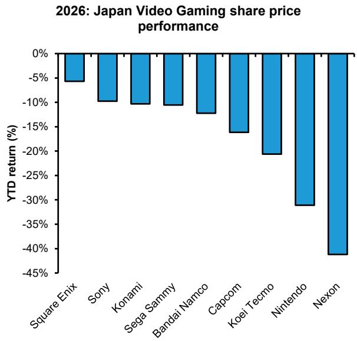

bar

2026: Japan Video Gaming share price performance
| Company | YTD return (%) |
| :--- | :--- |
| Square Enix | -5.5 |
| Sony | -9.5 |
| Konami | -9.5 |
| Sega Sammy | -9.5 |
| Bandai Namco | -12.5 |
| Capcom | -16.5 |
| Koei Tecmo | -20.5 |
| Nintendo | -30.5 |
| Nexon | -41.5 |

Source: Bloomberg and Bernstein analysis

EXHIBIT 3: ...with valuation de-rating representing a headwind more or less across the board   
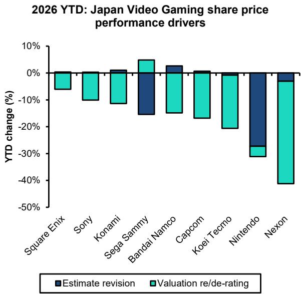

bar

| Company       | Estimate revision | Valuation re/de-rating |
| ------------- | ------------------ | ----------------------- |
| Square Enix   | -                  | -5%                     |
| Sony          | -                  | -10%                    |
| Konami        | -                  | -10%                    |
| Sega Sammy    | -15%               | 5%                      |
| Bandai Namco  | 5%                 | -10%                    |
| Capcom        | -                  | -15%                    |
| Koei Tecmo    | -                  | -20%                    |
| Nintendo      | -30%               | -30%                    |
| Nexon         | -5%                | -45%                    |

Source: Bloomberg and Bernstein analysis.

EXHIBIT 4: Our tracker of the top global video gaming companies showed c. 11.3% industry revenue growth in the March quarter   
2020-2027E: Global listed video game companies aggregate revenue & growth   
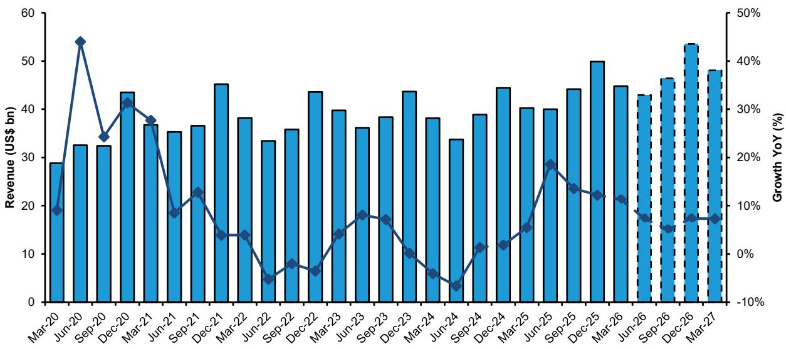

bar_line

| Month    | Revenue (US$ bn) | Growth YoY (%) |
|----------|------------------|----------------|
| Mar-20   | 29               | 10             |
| Jun-20   | 32               | 45             |
| Sep-20   | 32               | 25             |
| Dec-20   | 43               | 35             |
| Mar-21   | 37               | 30             |
| Jun-21   | 35               | 18             |
| Sep-21   | 36               | 23             |
| Dec-21   | 45               | 14             |
| Mar-22   | 38               | 14             |
| Jun-22   | 33               | 5              |
| Sep-22   | 36               | 8              |
| Dec-22   | 43               | 6              |
| Mar-23   | 40               | 14             |
| Jun-23   | 36               | 18             |
| Sep-23   | 38               | 17             |
| Dec-23   | 43               | 10             |
| Mar-24   | 38               | 6              |
| Jun-24   | 33               | -5             |
| Sep-24   | 39               | 11             |
| Dec-24   | 44               | 12             |
| Mar-25   | 40               | 15             |
| Jun-25   | 40               | 19             |
| Sep-25   | 44               | 14             |
| Dec-25   | 50               | 13             |
| Mar-26   | 45               | 11             |
| Jun-26   | 43               | 9              |
| Sep-26   | 46               | 7              |
| Dec-26   | 53               | 7              |
| Mar-27   | 48               | 7              |

Source: Corporate reports, Bloomberg, Bernstein estimates and analysis.

EXHIBIT 5: The last couple quarters have implied mid-single digit industry revenue CAGR compared with 2018-2019 baselines... consensus forecasts point to acceleration into late 2026, with GTA VI on deck   
2020-2027E: Global listed video game companies aggregate revenue CAGR   
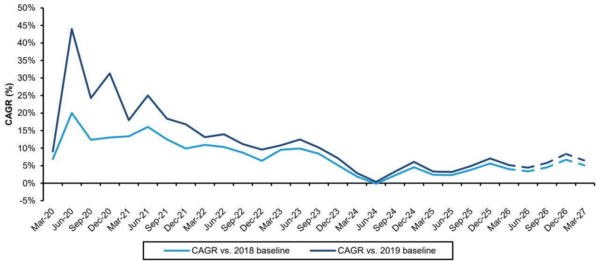

line

| Date    | CAGR vs. 2018 baseline | CAGR vs. 2019 baseline |
|---------|------------------------|------------------------|
| Mar-20  | 7%                     | 9%                     |
| Jun-20  | 20%                    | 44%                    |
| Sep-20  | 13%                    | 24%                    |
| Dec-20  | 13%                    | 31%                    |
| Mar-21  | 14%                    | 18%                    |
| Jun-21  | 16%                    | 25%                    |
| Sep-21  | 13%                    | 18%                    |
| Dec-21  | 10%                    | 17%                    |
| Mar-22  | 11%                    | 14%                    |
| Jun-22  | 10%                    | 14%                    |
| Sep-22  | 9%                     | 13%                    |
| Dec-22  | 6%                     | 10%                    |
| Mar-23  | 9%                     | 13%                    |
| Jun-23  | 10%                    | 13%                    |
| Sep-23  | 8%                     | 10%                    |
| Dec-23  | 6%                     | 8%                     |
| Mar-24  | 3%                     | 4%                     |
| Jun-24  | 0%                     | 0%                     |
| Sep-24  | 4%                     | 6%                     |
| Dec-24  | 5%                     | 6%                     |
| Mar-25  | 3%                     | 4%                     |
| Jun-25  | 3%                     | 4%                     |
| Sep-25  | 5%                     | 6%                     |
| Dec-25  | 6%                     | 7%                     |
| Mar-26  | 5%                     | 6%                     |
| Jun-26  | 4%                     | 5%                     |
| Sep-26  | 5%                     | 6%                     |
| Dec-26  | 6%                     | 8%                     |
| Mar-27  | 5%                     | 7%                     |

Source: Corporate reports, Bloomberg, Bernstein estimates and analysis.

EXHIBIT 6: We've updated our tracker of new launches, reflecting the PlayStation State of Play... the upcoming summer showcases should help to add clarity to new launch pipelines across our coverage companies 

<table><tr><td rowspan="2">Game title</td><td rowspan="2">Developer</td><td colspan="5">Platform</td><td rowspan="2">Launch</td></tr><tr><td>PS5</td><td>Xbox</td><td>Switch</td><td>PC</td><td>Mobile</td></tr><tr><td colspan="8">NINTENDO</td></tr><tr><td>Star Fox</td><td>Nintendo</td><td></td><td></td><td>√</td><td></td><td></td><td>Jun 25, 2026</td></tr><tr><td>Rhythm Heaven Groove</td><td>Nintendo</td><td></td><td></td><td>√</td><td></td><td></td><td>Jul 2, 2026</td></tr><tr><td>Splatoon Raiders</td><td>Nintendo</td><td></td><td></td><td>√</td><td></td><td></td><td>Jul 23, 2026</td></tr><tr><td>Fire Emblem: Fortune&#x27;s Weave</td><td>Intelligent Systems</td><td></td><td></td><td>√</td><td></td><td></td><td>2026</td></tr><tr><td>Pokemon Winds &amp; Waves</td><td>Game Freak</td><td></td><td></td><td>√</td><td></td><td></td><td>2027</td></tr><tr><td colspan="8">CAPCOM</td></tr><tr><td>Onimusha: Way of the Sword</td><td>Capcom</td><td>√</td><td>√</td><td></td><td>√</td><td></td><td>Sep 24, 2026</td></tr><tr><td>Megaman: Dual Override</td><td>Capcom</td><td>√</td><td>√</td><td>√</td><td>√</td><td></td><td>2027</td></tr><tr><td>Monster Hunter Outlanders</td><td>Capcom</td><td></td><td></td><td></td><td></td><td>√</td><td>TBD</td></tr><tr><td colspan="8">BANDAI NAMCO</td></tr><tr><td>Bleach Mirrors High</td><td>Bandai Namco</td><td></td><td></td><td></td><td></td><td>√</td><td>Summer 2026</td></tr><tr><td>Captain Tsubasa 2: World Fighters</td><td>Tamsoft Corporation</td><td>√</td><td>√</td><td></td><td>√</td><td></td><td>Aug 27, 2026</td></tr><tr><td>The Blood of Dawnwalker</td><td>Rebel Wolves</td><td>√</td><td>√</td><td></td><td>√</td><td></td><td>Sep 6, 2026</td></tr><tr><td>Ace Combat 8: Wings of Theve</td><td>Bandai Namco</td><td>√</td><td>√</td><td></td><td>√</td><td></td><td>Oct 2, 2026</td></tr><tr><td>Dragon Ball: Xenoverse 3</td><td>Bandai Namco</td><td>√</td><td>√</td><td></td><td>√</td><td></td><td>2027</td></tr><tr><td colspan="8">KONAMI</td></tr><tr><td>eFootball Kick Off</td><td>Konami</td><td></td><td></td><td>√</td><td></td><td></td><td>Jun 3, 2026</td></tr><tr><td>Power Pros 2026-2027</td><td>Konami</td><td>√</td><td></td><td>√</td><td></td><td></td><td>Jun 11, 2026</td></tr><tr><td>Goemon&#x27;s Great Gatherin</td><td>Konami</td><td>√</td><td></td><td>√</td><td>√</td><td></td><td>Jul 2, 2026</td></tr><tr><td>The Price of Tennis Remasters</td><td>Konami</td><td></td><td></td><td>√</td><td>√</td><td></td><td>Jul 30, 2026</td></tr><tr><td>Metal Gear Solid: Master Collection Vol. 2</td><td>Konami</td><td>√</td><td>√</td><td>√</td><td>√</td><td></td><td>Aug 27, 2026</td></tr><tr><td>Silent Hill: Townfall</td><td>Screen Burn</td><td>√</td><td></td><td></td><td>√</td><td></td><td>Sep 24, 2026</td></tr><tr><td>Castlevania: Belmont&#x27;s Curse</td><td>Konami</td><td>√</td><td>√</td><td>√</td><td>√</td><td></td><td>2026</td></tr><tr><td colspan="8">SQUARE ENIX</td></tr><tr><td>The Adventures of Elliot: The Millennium Tales</td><td>Square Enix</td><td>√</td><td>√</td><td>√</td><td>√</td><td></td><td>Jun 19, 2026</td></tr><tr><td>Dragon Quest XII: Beyond Dreams</td><td>Square Enix</td><td>√</td><td>√</td><td>√</td><td>√</td><td></td><td>TBD</td></tr><tr><td colspan="8">NEXON</td></tr><tr><td>DNF: Idle RPG</td><td>Nexon</td><td></td><td></td><td></td><td></td><td>√</td><td>2026</td></tr><tr><td>DNF Classic</td><td>Nexon</td><td></td><td></td><td></td><td>√</td><td></td><td>2027</td></tr><tr><td>Nakwon: Last Paradise</td><td>Nexon</td><td>√</td><td>√</td><td></td><td>√</td><td></td><td>2027</td></tr><tr><td>Woochi the Wayfarer</td><td>Nexon /Lore Vault</td><td>√</td><td>√</td><td></td><td>√</td><td></td><td>2027</td></tr><tr><td colspan="8">SONY FIRST PARTY</td></tr><tr><td>Marvel&#x27;s Wolverine</td><td>Insomniac Games</td><td>√</td><td></td><td></td><td></td><td></td><td>Sep 15, 2026</td></tr><tr><td>God of War Laufey</td><td>Santa Monica Studio</td><td>√</td><td></td><td></td><td></td><td></td><td>TBD</td></tr></table>

Source: Corporate reports and Bernstein analysis.

# QUALITY ON SALE

If Japan Video Gaming sector valuations went from expensive across the board in the summer of 2025 to “okay” to start 2026, we’re now firmly in “below average” territory. The average stock we cover now trades on 19.7x FY3/27E and 17.7x FY3/28E PE, and 11.9x FY3/27E and 10.11x FY3/28E EV/EBIT, taking into account the impact of balance sheet cash (see Exhibit 7 to Exhibit 12).

Our price targets are generally set on the basis of FY+1 (i.e. quarter 5-8) PE multiples, but it seems reasonable to expect valuation time frames to shift towards FY3/28E PE in the next six months or so.

EXHIBIT 7: The Japan Video Gaming stocks we cover (ex. Sony) now trade on 19.7x FY3/27E PE...   
FY3/27E: Japan Video Gaming PE multiples   
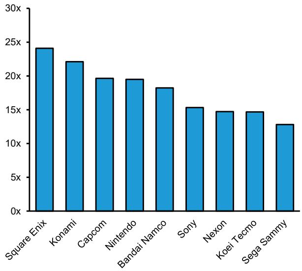

bar

| Company | Value (x) |
| :--- | :--- |
| Square Enix | 24 |
| Konami | 22 |
| Capcom | 19.5 |
| Nintendo | 19.5 |
| Bandai Namco | 18.3 |
| Sony | 15.4 |
| Nexon | 14.8 |
| Koei Tecmo | 14.7 |
| Sega Sammy | 12.8 |

Source: Corporate reports, Bloomberg, Bernstein estimates and analysis.

EXHIBIT 8: ... and 17.7x FY3/28 P/E on our estimates, which we'd expect investors to focus more on over time   
FY3/28E: Japan Video Gaming PE multiples   
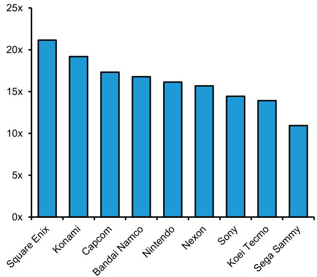

bar

| Company | Value (x) |
| :--- | :--- |
| Square Enix | 21.2 |
| Konami | 19.3 |
| Capcom | 17.4 |
| Bandai Namco | 16.8 |
| Nintendo | 16.0 |
| Nexon | 15.6 |
| Sony | 14.5 |
| Koei Tecmo | 13.9 |
| Sega Sammy | 10.8 |

Source: Corporate reports, Bloomberg, Bernstein estimates and analysis.

EXHIBIT 9: Japan Video Gaming sector 1-year forward PE now stands below average levels since 2020   
2020-2026: Sector average 1-year blended forward PE   
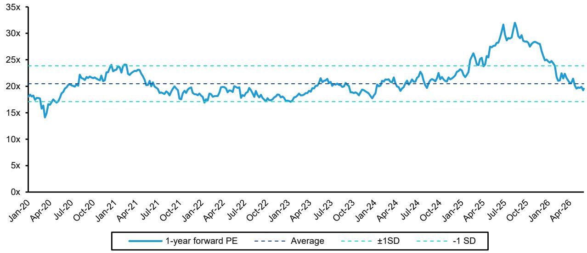

line

| Date    | 1-year forward PE |
|---------|-------------------|
| Jan-20  | ~18x              |
| Apr-20  | ~14x              |
| Jul-20  | ~20x              |
| Oct-20  | ~22x              |
| Jan-21  | ~24x              |
| Apr-21  | ~23x              |
| Jul-21  | ~20x              |
| Oct-21  | ~19x              |
| Jan-22  | ~18x              |
| Apr-22  | ~19x              |
| Jul-22  | ~20x              |
| Oct-22  | ~18x              |
| Jan-23  | ~17x              |
| Apr-23  | ~18x              |
| Jul-23  | ~21x              |
| Oct-23  | ~20x              |
| Jan-24  | ~18x              |
| Apr-24  | ~20x              |
| Jul-24  | ~22x              |
| Oct-24  | ~21x              |
| Jan-25  | ~23x              |
| Apr-25  | ~25x              |
| Jul-25  | ~32x              |
| Oct-25  | ~30x              |
| Jan-26  | ~28x              |
| Apr-26  | ~20x              |

Source: Bloomberg and Bernstein analysis.

EXHIBIT 10: Most Japan Video Gaming stocks now sit toward the lower half of their 10–90th percentile forward PE ranges   
2022-2026E: Japan Video Gaming sector 1-year consensus blended forward PE   
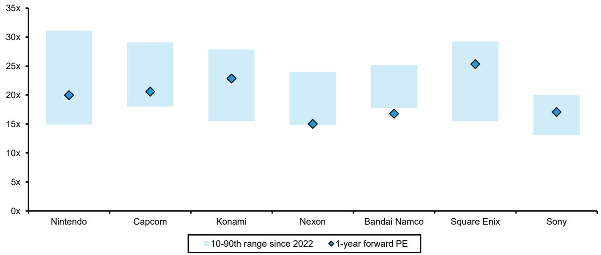

bar_line

| Company       | 10-90th range since 2022 | 1-year forward PE |
| ------------- | ------------------------ | ----------------- |
| Nintendo      | ~31x                     | 20x               |
| Capcom        | ~29x                     | 21x               |
| Konami        | ~28x                     | 23x               |
| Nexon         | ~24x                     | 15x               |
| Bandai Namco  | ~25x                     | 17x               |
| Square Enix   | ~29x                     | 25x               |
| Sony          | ~20x                     | 17x               |

Source: Bloomberg and Bernstein analysis.

EXHIBIT 11: Our coverage stocks now average 11.9x FY3/27 EV/EBIT...   
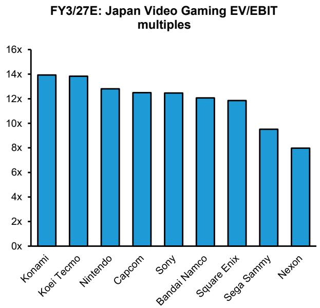

bar

| Company       | EV/EBIT multiples |
| ------------- | ----------------- |
| Konami        | 14x               |
| Koei Tecmo    | 14x               |
| Nintendo      | 13x               |
| Capcom        | 13x               |
| Sony          | 13x               |
| Bandai Namco  | 12x               |
| Square Enix   | 12x               |
| Sega Sammy     | 9.5x              |
| Nexon         | 8x                |

Source: Bloomberg and Bernstein analysis.

EXHIBIT 12: ... and 10.11x FY3/28 EV/EBIT, similarly cheap compared with history   
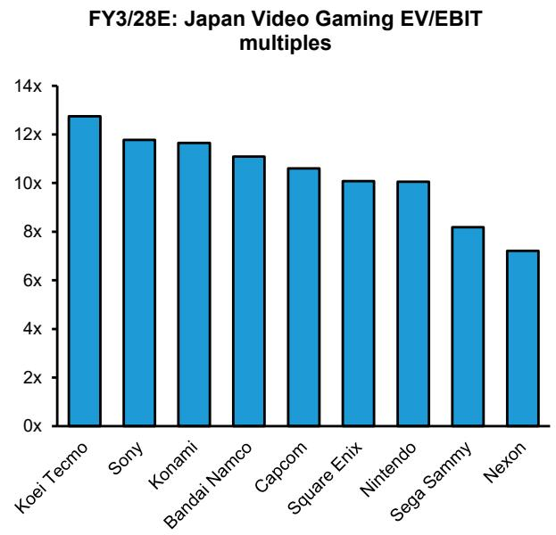

bar

FY3/28E: Japan Video Gaming EV/EBIT multiples
| Company | EV/EBIT (x) |
| :--- | :--- |
| Koei Tecmo | 12.7 |
| Sony | 11.8 |
| Konami | 11.6 |
| Bandai Namco | 11.1 |
| Capcom | 10.6 |
| Square Enix | 10.1 |
| Nintendo | 10.1 |
| Sega Sammy | 8.2 |
| Nexon | 7.2 |

Source: Bloomberg and Bernstein analysis.

# CAPCOM: STILL MAKING IT LOOK EASY

Our discussions with Capcom in Osaka yielded several interesting data points. Pragmata was confirmed to have exceeded internal targets baked into Capcom's 12mn new units guidance for FY3/27E. A reveal of the expansion title for MH Wilds now feels beyond question, following the company's promise of updates "over the summer". Management framed both their latest 10% operating profit growth goal (to JPY83bn) and use of 140 USD:JPY as intentionally conservative. We estimate Capcom's operating profit rises by just over 1% for every 1% of yen depreciation, and we'd expect the company to comfortably exceed its operating profit target even assuming a considerable front-loading of R&D spend.

Shorter term, the reversal of JPY9bn in revenue deferral will boost Q1 reporting, as will strong Pragmata sales... and ongoing strength in RE Requiem and other Resident Evil catalog titles through April and May. Our base case remains that the MH Wilds expansion game will fill its typical February/March slot. In addition to let's say a 30% attach rate on 12-13mn units of MH Wilds sold at that point, we expect a gold edition of the game - and expansion game bundles - to support Capcom's software units. Dataminers previously found Switch 2 code in one of the MH Wilds updates - a Switch 2 launch for the gold edition would make sense timing wise, and likely add another 300-500k units.

Thinking longer-term, we consider Capcom the most forward-thinking company in our Japan Video Gaming coverage, when it comes to addressing the AI question. The company's example of significant reductions to playtesting time was mentioned as part of its partnership with Google, and management cited gains in other parts of development, including concept, prototyping, and localisation. Encouragingly, the company pointed to the Pragmata and Onimusha launches this year as examples where expanded headcount and AI productivity gains had enabled a greater focus on the company's second tier of IP franchises.

With this note we've made some minor adjustments to our Capcom estimates (see Exhibit 18).

EXHIBIT 13: RE Requiem has continued to sell well, and drive Resident Evil catalog sales   
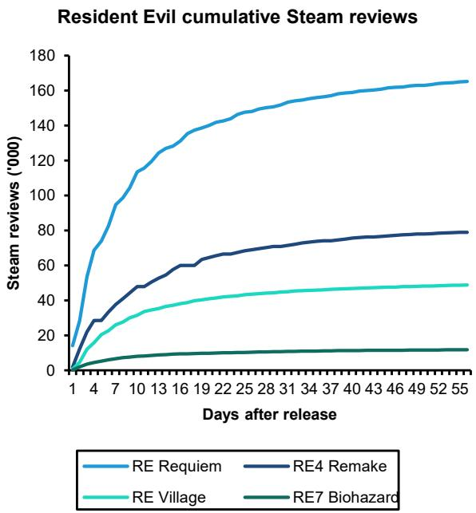

line

| Days after release | RE Requiem | RE4 Remake | RE Village | RE7 Biohazard |
| ------------------ | ---------- | ---------- | ---------- | ------------- |
| 1                  | 0          | 0          | 0          | 0             |
| 4                  | 70         | 30         | 20         | 5             |
| 7                  | 100        | 45         | 30         | 10            |
| 10                 | 120        | 55         | 35         | 15            |
| 13                 | 130        | 60         | 40         | 20            |
| 16                 | 140        | 65         | 45         | 25            |
| 19                 | 145        | 70         | 50         | 30            |
| 22                 | 150        | 75         | 55         | 35            |
| 25                 | 155        | 78         | 60         | 40            |
| 28                 | 160        | 80         | 65         | 45            |
| 31                 | 162        | 82         | 70         | 50            |
| 34                 | 164        | 83         | 72         | 52            |
| 37                 | 165        | 84         | 73         | 53            |
| 40                 | 166        | 85         | 74         | 54            |
| 43                 | 167        | 86         | 75         | 55            |
| 46                 | 168        | 87         | 76         | 56            |
| 49                 | 169        | 88         | 77         | 57            |
| 52                 | 170        | 89         | 78         | 58            |
| 55                 | 171        | 90         | 79         | 59            |

Source: SteamDB and Bernstein analysis.

EXHIBIT 14: Pragmata was confirmed to have exceed sales targets baked into this year's new units guide   
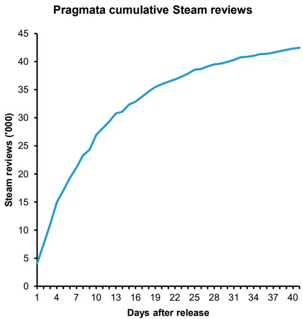

line

| Days after release | Steam reviews ('000) |
| ------------------ | -------------------- |
| 1                  | 4                    |
| 4                  | 15                   |
| 7                  | 20                   |
| 10                 | 27                   |
| 13                 | 31                   |
| 16                 | 33                   |
| 19                 | 35                   |
| 22                 | 37                   |
| 25                 | 38                   |
| 28                 | 39                   |
| 31                 | 40                   |
| 34                 | 41                   |
| 37                 | 42                   |
| 40                 | 43                   |

Source: SteamDB and Bernstein analysis.

EXHIBIT 15: With MH Wilds now fixed, and Capcom releasing several hits in a row, we expect the company's catalog growth to look strong in the coming quarters   
FY3/21- FY3/26: Capcom catalogue sales volume by IP   
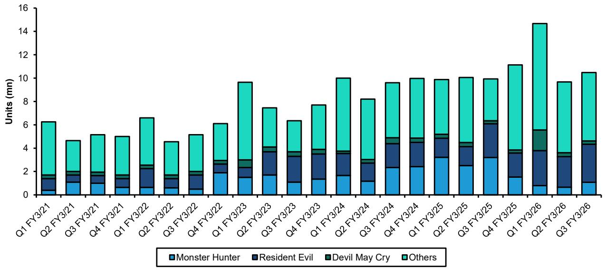

bar_stacked

| Quarter | Monster Hunter (mn) | Resident Evil (mn) | Devil May Cry (mn) | Others (mn) |
| :--- | :--- | :--- | :--- | :--- |
| Q1 FY3/21 | 0.3 | 1.0 | 0.5 | 4.8 |
| Q2 FY3/21 | 1.0 | 0.7 | 0.3 | 2.9 |
| Q3 FY3/21 | 0.9 | 0.8 | 0.4 | 3.6 |
| Q4 FY3/21 | 0.7 | 0.6 | 0.5 | 3.5 |
| Q1 FY3/22 | 0.6 | 1.8 | 0.4 | 4.5 |
| Q2 FY3/22 | 0.6 | 0.7 | 0.5 | 2.7 |
| Q3 FY3/22 | 0.5 | 1.4 | 0.4 | 3.6 |
| Q4 FY3/22 | 1.8 | 0.7 | 0.4 | 3.1 |
| Q1 FY3/23 | 1.4 | 0.8 | 0.5 | 6.5 |
| Q2 FY3/23 | 1.6 | 1.8 | 0.5 | 3.1 |
| Q3 FY3/23 | 1.0 | 2.5 | 0.4 | 2.7 |
| Q4 FY3/23 | 1.3 | 1.8 | 0.4 | 3.5 |
| Q1 FY3/24 | 1.6 | 1.8 | 0.4 | 5.5 |
| Q2 FY3/24 | 1.1 | 1.4 | 0.4 | 4.9 |
| Q3 FY3/24 | 2.2 | 2.5 | 0.5 | 4.0 |
| Q4 FY3/24 | 2.3 | 2.5 | 0.5 | 4.5 |
| Q1 FY3/25 | 3.1 | 1.6 | 0.4 | 4.5 |
| Q2 FY3/25 | 2.4 | 1.6 | 0.4 | 4.7 |
| Q3 FY3/25 | 3.1 | 3.0 | 0.5 | 3.6 |
| Q4 FY3/25 | 1.4 | 2.5 | 0.4 | 6.5 |
| Q1 FY3/26 | 0.7 | 2.8 | 1.8 | 7.8 |
| Q2 FY3/26 | 0.6 | 2.5 | 0.4 | 5.7 |
| Q3 FY3/26 | 1.0 | 2.8 | 0.4 | 4.9 |
The chart displays a stacked bar chart with each bar representing a total of units sold for each fiscal quarter from Q1 to Q3 of the year.

Source: Corporate reports, Bernstein estimates and analysis.

EXHIBIT 16: We expect the MH Wilds expansion to be announced during summer showcase season 

<table><tr><td></td><td>Resident Evil - originals</td><td>Resident Evil - remakes</td><td>Monster Hunter</td><td>Other franchises</td></tr><tr><td>FY3/17</td><td>RE 7: BiohazardJan 2017</td><td></td><td></td><td></td></tr><tr><td>FY3/18</td><td></td><td></td><td>MH WorldJan 2018</td><td></td></tr><tr><td>FY3/19</td><td></td><td>RE 2 RemakeJan 2019</td><td></td><td>Devil May Cry 5May 2019</td></tr><tr><td>FY3/20</td><td></td><td></td><td>MH World: IceborneSep 2019</td><td></td></tr><tr><td>FY3/21</td><td></td><td>RE 3 RemakeApr 2020</td><td>MH RiseMar 2021</td><td></td></tr><tr><td>FY3/22</td><td>RE VillageMay 2021</td><td></td><td>MH Stories 2: Wings of RuinJul 2021</td><td></td></tr><tr><td>FY3/23</td><td></td><td>RE 4 RemakeMar 2023</td><td>MH Rise: SunbreakJun 2022</td><td></td></tr><tr><td>FY3/24</td><td></td><td></td><td></td><td>Street Fighter 6Jun 2023Dragon Dogma IIMar 2024</td></tr><tr><td>FY3/25</td><td></td><td></td><td>MH WildsFeb 2025</td><td></td></tr><tr><td>FY3/26</td><td>RE RequiemFeb 2026</td><td></td><td>MH Stories 3: Twisted ReflectionMar 2026</td><td>PragamataApr 2026</td></tr><tr><td>FY3/27E</td><td></td><td></td><td>MH Wilds: Expansion?</td><td>Onimusha: Way of the SwordSep 2026</td></tr><tr><td>FY3/28E</td><td></td><td>RE Code Veronica?</td><td></td><td></td></tr></table>

Source: Corporate reports, Bernstein estimates and analysis.

EXHIBIT 17: Capcom's forward PE multiple now stands close to one standard deviation below long-term mean   
2020-2026: Capcom 1-year blended forward PE   
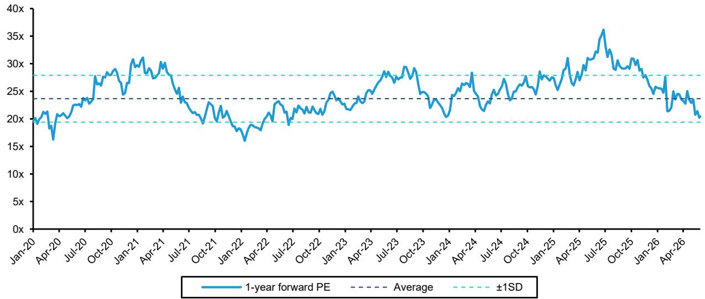

line

| Date    | 1-year forward PE |
|---------|-------------------|
| Jan-20  | ~20x              |
| Apr-20  | ~17x              |
| Jul-20  | ~23x              |
| Oct-20  | ~28x              |
| Jan-21  | ~30x              |
| Apr-21  | ~31x              |
| Jul-21  | ~24x              |
| Oct-21  | ~20x              |
| Jan-22  | ~16x              |
| Apr-22  | ~19x              |
| Jul-22  | ~23x              |
| Oct-22  | ~21x              |
| Jan-23  | ~24x              |
| Apr-23  | ~28x              |
| Jul-23  | ~29x              |
| Oct-23  | ~25x              |
| Jan-24  | ~21x              |
| Apr-24  | ~27x              |
| Jul-24  | ~23x              |
| Oct-24  | ~26x              |
| Jan-25  | ~28x              |
| Apr-25  | ~31x              |
| Jul-25  | ~36x              |
| Oct-25  | ~30x              |
| Jan-26  | ~25x              |
| Apr-26  | ~21x              |

Source: Corporate reports, Bloomberg, and Bernstein analysis.

EXHIBIT 18: Capcom: Summary of estimate changes 

<table><tr><td>Summary of estimate changes</td><td>FY3/27E</td><td>FY3/28E</td><td>FY3/29E</td></tr><tr><td colspan="4">Revenue (JPY bn)</td></tr><tr><td>Bernstein - old</td><td>208</td><td>225</td><td>242</td></tr><tr><td>Growth YoY</td><td>14.0%</td><td>8.1%</td><td>7.7%</td></tr><tr><td>Bernstein - new</td><td>210</td><td>226</td><td>236</td></tr><tr><td>Growth YoY</td><td>7.5%</td><td>7.6%</td><td>4.6%</td></tr><tr><td>Consensus</td><td>209</td><td>229</td><td>250</td></tr><tr><td>Growth YoY</td><td>12.9%</td><td>9.4%</td><td>9.2%</td></tr><tr><td>Bernstein new vs. old</td><td>0.9%</td><td>0.5%</td><td>-2.4%</td></tr><tr><td>Bernstein new vs. consensus</td><td>0.3%</td><td>-1.3%</td><td>-5.5%</td></tr><tr><td colspan="4">Operating profit (JPY bn)</td></tr><tr><td>Bernstein - old</td><td>86</td><td>98</td><td>110</td></tr><tr><td>Growth YoY</td><td>16.5%</td><td>13.5%</td><td>12.5%</td></tr><tr><td>Margin</td><td>41.3%</td><td>43.4%</td><td>45.3%</td></tr><tr><td>Bernstein - new</td><td>86</td><td>97</td><td>107</td></tr><tr><td>Growth YoY</td><td>13.7%</td><td>13.6%</td><td>10.2%</td></tr><tr><td>Margin</td><td>40.8%</td><td>43.0%</td><td>45.3%</td></tr><tr><td>Consensus</td><td>87</td><td>96</td><td>108</td></tr><tr><td>Growth YoY</td><td>11.9%</td><td>11.3%</td><td>12.6%</td></tr><tr><td>Margin</td><td>41.3%</td><td>42.1%</td><td>43.4%</td></tr><tr><td>Bernstein new vs. old</td><td>-0.4%</td><td>-0.3%</td><td>-2.3%</td></tr><tr><td>Bernstein new vs. consensus</td><td>-1.1%</td><td>0.9%</td><td>-1.2%</td></tr><tr><td colspan="4">EPS (JPY)</td></tr><tr><td>Bernstein - old</td><td>154</td><td>175</td><td>196</td></tr><tr><td>Growth YoY</td><td>20.4%</td><td>13.4%</td><td>12.3%</td></tr><tr><td>Bernstein - new</td><td>153</td><td>174</td><td>192</td></tr><tr><td>Growth YoY</td><td>17.6%</td><td>13.4%</td><td>10.1%</td></tr><tr><td>Consensus</td><td>146</td><td>165</td><td>187</td></tr><tr><td>Growth YoY</td><td>11.9%</td><td>12.8%</td><td>13.0%</td></tr><tr><td>Bernstein new vs. old</td><td>-0.4%</td><td>-0.3%</td><td>-2.3%</td></tr><tr><td>Bernstein new vs. consensus</td><td>4.9%</td><td>5.5%</td><td>2.8%</td></tr></table>

Source: Bloomberg, Corporate reports, Bernstein estimates and analysis.

# KONAMI: GROWTH EXTENDS BEYOND THE WORLD CUP

In our minds, Konami also fits into the category of a quality name with obvious catalysts that's been hurt by AI-related outflows. Q1 earnings should significantly exceed street estimates, with eFootball billings jumping month on month in both April and May, and expected to continue to rise sequentially in June and July. The recent Naruto and 1bn downloads campaigns were said to have contributed 10-20% to recent incremental growth, but recent strength was described as not yet related to World Cup excitement (see Exhibit 19).

World Cup billings aside, our most recent discussions with Konami pointed to off platform monetisation having started across 20-30 countries in addition to Japan. Initial traction was said to have largely aligned with Konami's home market, and further progress should continue to contribute to eFootball operating margins... versus the low-50% range at present. Across the business, we expect platform fees to fall from high-20% to low-20% in the next two years, which Konami indicated will mostly fall to operating profit. The latest Sensor Tower data points to robust weekly eFootball billings trends - assuming a similar absolute bump in World Cup engagement over the next couple months (e.g. far smaller proportionate to the overall game than in 2022) would imply large beats to Q1 and potentially Q2 expectations. In contrast with the 2022 Qatar World Cup, we're hopeful a longer tournament featuring 48 teams will prolong the period of eFootball billings strength this year.

A period of slower eFootball monetization is probably likely in the back half of 2026. On the other hand, new user growth within eFootball has remained strong across both mobile and PC/console (see Exhibit 21 and Exhibit 22). The expansion of the upcoming World Cup to 48 teams should help to engender greater interest in football video games in new markets. The feedback we've heard also pointed to stronger growth than we'd previously anticipated in Yu-Gi-Oh! cards, and a solid cadence of single-title games (e.g. annual Silent Hill or MGS releases) going forward on top of the usual diet of Power Pros and Momotetsu games.

From a starting point of c. 22x FY3/28E PE, we'd argue Konami's shares already reflect a healthy degree of caution around longer term growth, and think go-forward risk-reward looks positive (see Exhibit 23).

EXHIBIT 19: Konami's Q1 is setting up to look far stronger than Street expectations, with eFootball monthly revenues growing sharply even before World Cup excitement really takes off   
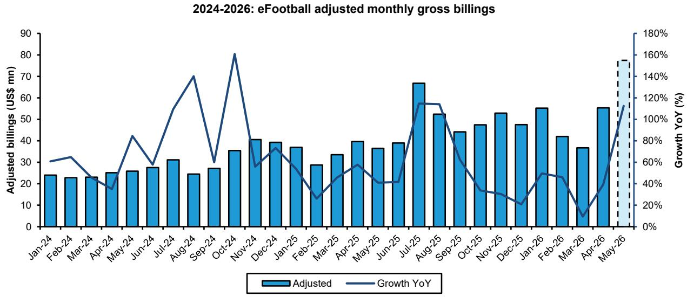

bar_line

2024-2026: eFootball adjusted monthly gross billings
| Month | Adjusted billings (US$ mn) | Growth YoY (%) |
|---|---|---|
| Jan-24 | 24 | 58 |
| Feb-24 | 23 | 61 |
| Mar-24 | 23 | 47 |
| Apr-24 | 25 | 39 |
| May-24 | 26 | 58 |
| Jun-24 | 28 | 31 |
| Jul-24 | 31 | 60 |
| Aug-24 | 24 | 140 |
| Sep-24 | 27 | 31 |
| Oct-24 | 35 | 168 |
| Nov-24 | 40 | 30 |
| Dec-24 | 39 | 60 |
| Jan-25 | 37 | 47 |
| Feb-25 | 29 | 27 |
| Mar-25 | 33 | 31 |
| Apr-25 | 39 | 50 |
| May-25 | 36 | 38 |
| Jun-25 | 39 | 31 |
| Jul-25 | 67 | 118 |
| Aug-25 | 52 | 118 |
| Sep-25 | 44 | 70 |
| Oct-25 | 47 | 37 |
| Nov-25 | 53 | 31 |
| Dec-25 | 47 | 23 |
| Jan-26 | 55 | 48 |
| Feb-26 | 42 | 46 |
| Mar-26 | 36 | 13 |
| Apr-26 | 55 | 39 |
| May-26 | - | 158 |

Source: Sensor Tower, Bernstein estimates and analysis.

EXHIBIT 20: eFootball is now a much larger game than in 2022, but even assuming a similar absolute World Cup (e.g. much smaller in percentage terms) implies significant beats to Q1 and potentially Q2 expectations   
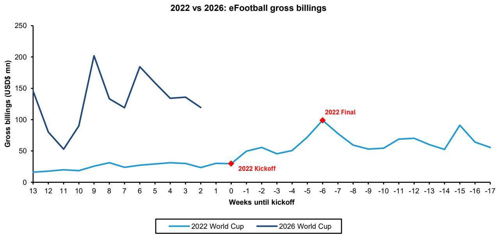

line

| Weeks until kickoff | 2022 World Cup | 2026 World Cup |
| ------------------- | -------------- | -------------- |
| 13                  | ~15            | 145            |
| 12                  | ~18            | 80             |
| 11                  | ~20            | 55             |
| 10                  | ~18            | 90             |
| 9                   | ~25            | 200            |
| 8                   | ~30            | 130            |
| 7                   | ~25            | 120            |
| 6                   | ~30            | 185            |
| 5                   | ~30            | 160            |
| 4                   | ~30            | 135            |
| 3                   | ~30            | 135            |
| 2                   | ~25            | 120            |
| 1                   | ~30            | —              |
| 0                   | ~30            | —              |
| -6                  | —              | 100            |
| -5                  | —              | —              |
| -4                  | —              | —              |
| -3                  | —              | —              |
| -2                  | —              | —              |
| -1                  | —              | —              |
| 0                   | —              | —              |
| -6                  | —              | —              |
| -7                  | —              | —              |
| -8                  | —              | —              |
| -9                  | —              | —              |
| -10                 | —              | —              |
| -11                 | —              | —              |
| -12                 | —              | —              |
| -13                 | —              | —              |
| -14                 | —              | —              |
| -15                 | —              | 90             |
| -16                 | —              | 65             |
| -17                 | —              | 55             |

Source: Corporate reports and Bernstein analysis.

EXHIBIT 21: Sensor Tower data likely understates eFootball mobile MAUs...   
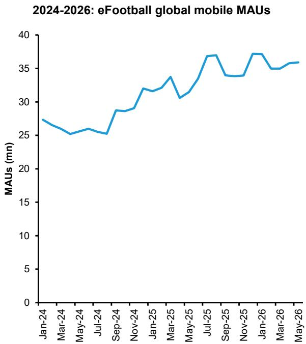

line

| Month    | MAUs (mn) |
| -------- | --------- |
| Jan-24   | 27.5      |
| Mar-24   | 25.5      |
| May-24   | 26.0      |
| Jul-24   | 25.0      |
| Sep-24   | 28.5      |
| Nov-24   | 29.0      |
| Jan-25   | 31.5      |
| Mar-25   | 33.5      |
| May-25   | 30.5      |
| Jul-25   | 37.0      |
| Sep-25   | 34.0      |
| Nov-25   | 34.0      |
| Jan-26   | 37.0      |
| Mar-26   | 35.0      |
| May-26   | 36.0      |

Source: Sensor Tower and Bernstein analysis.

EXHIBIT 22: ...while PC/console billings growth was said to have matched mobile in recent months   
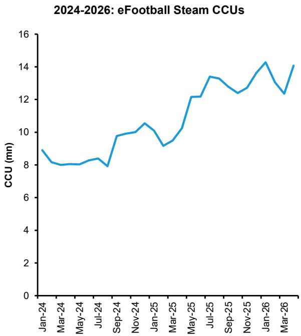

line

| Month    | CCU (mm) |
| -------- | -------- |
| Jan-24   | 9.0      |
| Mar-24   | 8.0      |
| May-24   | 8.0      |
| Jul-24   | 8.5      |
| Sep-24   | 9.5      |
| Nov-24   | 10.5     |
| Jan-25   | 10.0     |
| Mar-25   | 9.0      |
| May-25   | 12.0     |
| Jul-25   | 13.5     |
| Sep-25   | 13.0     |
| Nov-25   | 12.5     |
| Jan-26   | 14.5     |
| Mar-26   | 12.5     |

Source: SteamDB and Bernstein analysis.

EXHIBIT 23: Konami's forward PE multiple has fallen a long way from last summer's highs, and risk-reward looks favourable in our view   
2020-2026: Konami 1-year blended forward PE   
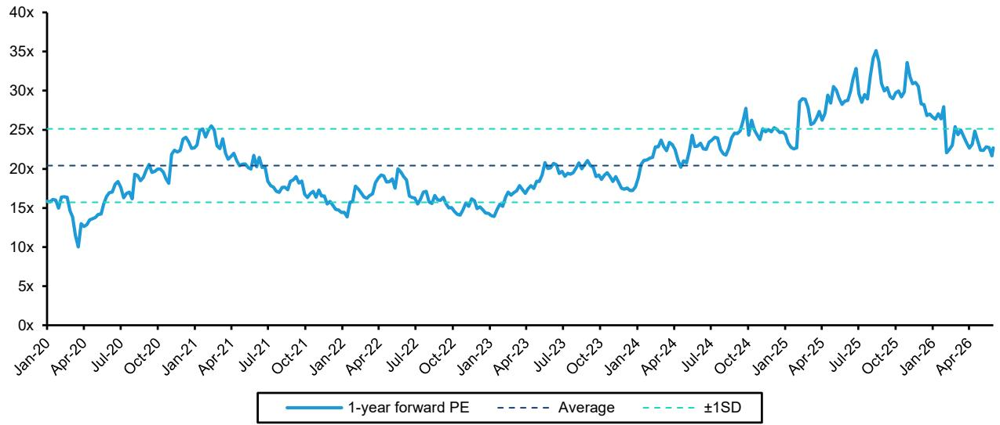

line

| Date    | 1-year forward PE |
|---------|-------------------|
| Jan-20  | 15x               |
| Apr-20  | 10x               |
| Jul-20  | 18x               |
| Oct-20  | 20x               |
| Jan-21  | 25x               |
| Apr-21  | 22x               |
| Jul-21  | 20x               |
| Oct-21  | 18x               |
| Jan-22  | 15x               |
| Apr-22  | 18x               |
| Jul-22  | 20x               |
| Oct-22  | 16x               |
| Jan-23  | 14x               |
| Apr-23  | 17x               |
| Jul-23  | 20x               |
| Oct-23  | 19x               |
| Jan-24  | 17x               |
| Apr-24  | 22x               |
| Jul-24  | 25x               |
| Oct-24  | 28x               |
| Jan-25  | 25x               |
| Apr-25  | 30x               |
| Jul-25  | 35x               |
| Oct-25  | 33x               |
| Jan-26  | 28x               |
| Apr-26  | 25x               |

Source: Corporate reports, Bloomberg, and Bernstein analysis.

# NINTENDO: A STRONGER 2027?

The memory prices question remains an overhang for Nintendo's shares, but our Kyoto visit yielded several incremental data points which felt, in aggregate, helpful for go-forward growth visibility. On production rates, Nintendo acknowledged the incentive to produce ahead of sell-in, to take advantage of better than feared memory pricing in FY3/27E. Guidance that hardware gross profit will remain flattish year on year this year reflected Nintendo's \$50 of price increases, but also pricing negotiations which started relatively early on, and a tariff burden that's most likely no worse year on year. Our base case remains for incremental memory price headwind in FY3/28E, but for the next few quarters guidance that spot price volatility will not cause the JPY100bn of cost headwind guidance to change felt encouraging on the margin.

On the software front, the company acknowledged facing longer game development cycles on its largest AAA titles, and using B-franchise titles as a way to populate the launch cadence. Interestingly, the company confirmed an openness to using remake titles to augment the first-party launch line-up, which felt supportive of ongoing fan speculation over a Zelda title this year. Marketing spend was guided lower this year versus FY3/26, on account of the non-repeat of live events related to the Switch 2 launch. Investors we speak with remain focused on Nintendo's hardware margin, and the likelihood of further incremental hardware cost headwinds. But a software line-up featuring Pokémon Wind & Waves (and finally 3D Mario??) would probably make the next \$50 price increases more palatable, if the need arose.

On Nintendo's guidance, we think it's worth clarifying that the 60mn units of Switch 2 software guided for FY3/27E excludes Switch games bought by Switch 2 owners for their new devices (we think Nintendo made a mistake not classifying these as Switch 2 games, which has led to unnecessary confusion)... or bundle units like the recent Pokopia bundle. Nintendo's 105mn unit guide for Switch software sales this year was confirmed to have included a greater volume of sales on Switch 2 devices than last year.

With this note we've made adjustments to our Nintendo estimates (see Exhibit 27 and Exhibit 28).

EXHIBIT 24: We expect assembler output to pick up in the next few months, as Nintendo produces ahead of sell-in EXHIBIT 25: We've assumed an incremental memory cost headwind for Nintendo in FY3/28, but...

2022-2026: Foxconn Tech monthly revenue   
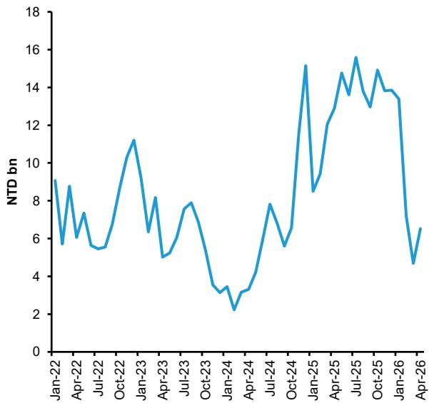

line

| Date    | NTD bn |
|---------|--------|
| Jan-22  | 9.0    |
| Apr-22  | 8.5    |
| Jul-22  | 7.0    |
| Oct-22  | 11.0   |
| Jan-23  | 6.5    |
| Apr-23  | 8.0    |
| Jul-23  | 7.5    |
| Oct-23  | 3.0    |
| Jan-24  | 2.5    |
| Apr-24  | 3.5    |
| Jul-24  | 7.5    |
| Oct-24  | 15.0   |
| Jan-25  | 8.5    |
| Apr-25  | 14.0   |
| Jul-25  | 15.5   |
| Oct-25  | 13.0   |
| Jan-26  | 14.0   |
| Apr-26  | 4.5    |

Source: Corporate reports and Bernstein analysis.

2025-2026E: Discrete LPDDR5 12Gb contract price   
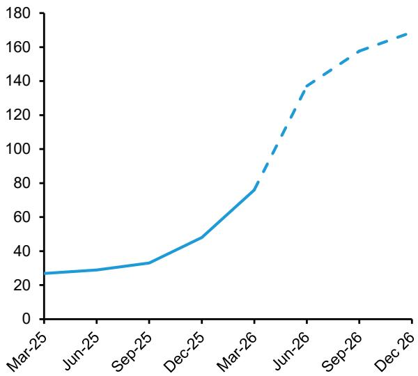

line

| Date   | Value |
|--------|-------|
| Mar-25 | 25    |
| Jun-25 | 30    |
| Sep-25 | 35    |
| Dec-25 | 45    |
| Mar-26 | 75    |
| Jun-26 | 135   |
| Sep-26 | 155   |
| Dec-26 | 165   |

Source: TrendForce and Bernstein analysis.

EXHIBIT 26: ...a stronger 2027 line-up, with Pokemon Wind & Waves confirmed, should help the company to better manage the impact year on year; the company's openness to remake titles was interesting to note   
Nintendo Switch 1P title first year sales   
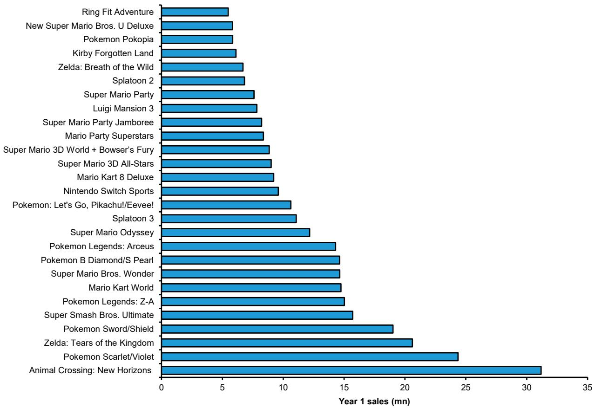

bar

| Game | Year 1 sales (mn) |
| :--- | :--- |
| Ring Fit Adventure | 5.5 |
| New Super Mario Bros. U Deluxe | 6.0 |
| Pokemon Pokopia | 6.0 |
| Kirby Forgotten Land | 6.2 |
| Zelda: Breath of the Wild | 6.8 |
| Splatoon 2 | 7.0 |
| Super Mario Party | 8.0 |
| Luigi Mansion 3 | 8.2 |
| Super Mario Party Jamboree | 8.5 |
| Mario Party Superstars | 8.7 |
| Super Mario 3D World + Bowser's Fury | 9.0 |
| Super Mario 3D All-Stars | 9.2 |
| Mario Kart 8 Deluxe | 9.4 |
| Nintendo Switch Sports | 9.6 |
| Pokemon: Let's Go, Pikachu!/Eevee! | 10.5 |
| Splatoon 3 | 11.0 |
| Super Mario Odyssey | 12.0 |
| Pokemon Legends: Arceus | 14.2 |
| Pokemon B Diamond/S Pearl | 14.5 |
| Super Mario Bros. Wonder | 14.6 |
| Mario Kart World | 14.7 |
| Pokemon Legends: Z-A | 15.0 |
| Super Smash Bros. Ultimate | 15.5 |
| Pokemon Sword/Shield | 19.0 |
| Zelda: Tears of the Kingdom | 20.5 |
| Pokemon Scarlet/Violet | 24.5 |
| Animal Crossing: New Horizons | 31.0 |

Source: Corporate reports and Bernstein analysis.

EXHIBIT 27: Nintendo's forward PE multiples are now back near long-term averages, while earnings estimates have fallen to reflect the rise in memory prices   
2020-2026: Nintendo 1-year blended forward PE   
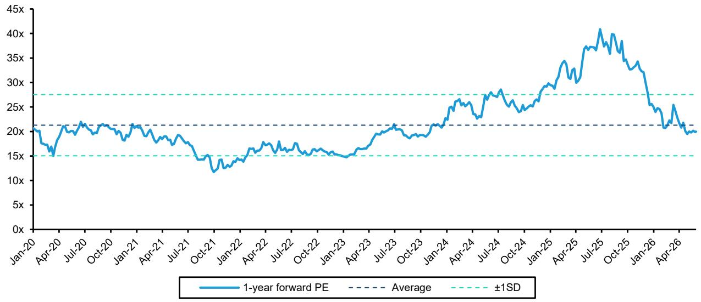

line

| Date    | 1-year forward PE |
|---------|-------------------|
| Jan-20  | ~20x              |
| Apr-20  | ~15x              |
| Jul-20  | ~21x              |
| Oct-20  | ~20x              |
| Jan-21  | ~21x              |
| Apr-21  | ~19x              |
| Jul-21  | ~18x              |
| Oct-21  | ~14x              |
| Jan-22  | ~13x              |
| Apr-22  | ~16x              |
| Jul-22  | ~17x              |
| Oct-22  | ~16x              |
| Jan-23  | ~15x              |
| Apr-23  | ~16x              |
| Jul-23  | ~21x              |
| Oct-23  | ~19x              |
| Jan-24  | ~20x              |
| Apr-24  | ~25x              |
| Jul-24  | ~28x              |
| Oct-24  | ~25x              |
| Jan-25  | ~30x              |
| Apr-25  | ~35x              |
| Jul-25  | ~41x              |
| Oct-25  | ~38x              |
| Jan-26  | ~33x              |
| Apr-26  | ~20x              |

Source: Corporate reports, Bloomberg, and Bernstein analysis.

EXHIBIT 28: Nintendo: Summary of estimate changes 

<table><tr><td>Nintendo: summary of estimate changes</td><td>FY3/27E</td><td>FY3/28E</td><td>FY3/29E</td></tr><tr><td colspan="4">Revenue (JPY bn)</td></tr><tr><td>Bernstein - Old</td><td>2,661</td><td>2,972</td><td>2,918</td></tr><tr><td>Growth YoY</td><td>16.4%</td><td>11.7%</td><td>-1.8%</td></tr><tr><td>Bernstein - New</td><td>2,333</td><td>2,576</td><td>2,693</td></tr><tr><td>Growth YoY</td><td>2.0%</td><td>10.4%</td><td>4.5%</td></tr><tr><td>Consensus</td><td>2,341</td><td>2,566</td><td>2,596</td></tr><tr><td>Growth YoY</td><td>0.5%</td><td>9.6%</td><td>1.2%</td></tr><tr><td>New vs. old</td><td>-12.3%</td><td>-13.3%</td><td>-7.7%</td></tr><tr><td>Bernstein vs. consensus</td><td>-0.4%</td><td>0.4%</td><td>3.7%</td></tr><tr><td colspan="4">Operating profit (JPY bn)</td></tr><tr><td>Bernstein - Old</td><td>427</td><td>545</td><td>596</td></tr><tr><td>Growth YoY</td><td>14.4%</td><td>27.8%</td><td>9.4%</td></tr><tr><td>Margin</td><td>16.0%</td><td>18.3%</td><td>20.4%</td></tr><tr><td>Bernstein - New</td><td>437</td><td>547</td><td>627</td></tr><tr><td>Growth YoY</td><td>17.1%</td><td>25.3%</td><td>14.5%</td></tr><tr><td>Margin</td><td>18.7%</td><td>21.2%</td><td>23.3%</td></tr><tr><td>Consensus</td><td>435</td><td>537</td><td>616</td></tr><tr><td>Growth YoY</td><td>12.1%</td><td>23.2%</td><td>14.8%</td></tr><tr><td>Margin</td><td>18.6%</td><td>20.9%</td><td>23.7%</td></tr><tr><td>New vs. old</td><td>2.4%</td><td>0.4%</td><td>5.1%</td></tr><tr><td>Bernstein vs. consensus</td><td>0.3%</td><td>2.0%</td><td>1.7%</td></tr><tr><td colspan="4">EPS (JPY)</td></tr><tr><td>Bernstein - Old</td><td>351</td><td>424</td><td>459</td></tr><tr><td>Growth YoY</td><td>-5.7%</td><td>20.9%</td><td>8.4%</td></tr><tr><td>Bernstein - New</td><td>351</td><td>424</td><td>479</td></tr><tr><td>Growth YoY</td><td>-3.8%</td><td>20.8%</td><td>13.1%</td></tr><tr><td>Consensus</td><td>348</td><td>417</td><td>454</td></tr><tr><td>Growth YoY</td><td>-1.9%</td><td>19.9%</td><td>8.7%</td></tr><tr><td>New vs. old</td><td>0.1%</td><td>0.0%</td><td>4.4%</td></tr><tr><td>Bernstein vs. consensus</td><td>0.7%</td><td>1.5%</td><td>5.6%</td></tr></table>

Source: Bloomberg, Corporate reports, Bernstein estimates and analysis.

# NEXON: MEA CULPA... BUT CASH IS NOW 45% OF MARKET CAP

With the benefit of hindsight, we badly misjudged the durability of Arc Raiders as an ongoing contributor to earnings. 2025 was a rebound year, helped by both MapleStory recovery in Korea, and new game launch successes like Mabinogi Mobile.

Looking at the past four quarters ended March, Nexon reported JPY140bn of operating profit, which we think breaks down into c. JPY25-30bn of Arc Raiders (somewhat influenced by the company's deferral of Q1 billings), JPY90bn from China revenue share (on which the main offsetting costs relate to a few hundred people at Neople, we've assumed a 90% gross margin), and JPY 25bn to everything else. Estimated on the same basis, the “everything else” generated a JPY24bn aggregate operating loss in 2024, and JPY25bn of profit in 2025.

Nexon expenses R&D, which means the incremental contribution from new game launches drops more or less straight to operating profit. With the company signaling a barren H2 2026 (which means operating profits decline in Q3, before a very low Q4 comp), the next set of meaningful new launches will need to be DNF Idle RPG (launching in Korea in Q4) and DNF Classic. MapleStory Idle RPG showed the idle game formula can work with Nexon's key IP. In our discussions, Nexon management talked up the outlook for Nakwon, due for launch in 2027. In the interim, however, the direction of DNF in China has continued to trend worse than we'd hoped for. PC at least shows stable visitation - the hope is that the summer and National Day updates do better than the most recent one in April. But DNF Mobile continues to lose ground, on the evidence of DAU and time spent trends. The company's change of tone on marketing spend this year (indicated flat year on year during the company's CMD, now expected to rise to reflect MapleStory Idle RPG spend) also leaves us with mixed feelings.

The question that remains is... now what? The stock has fallen a long way year to date, and expectations are now very low. Assuming say JPY80bn of China contribution next year, and a modest level of new launch success besides implies something like JPY110-120bn of operating profit, which drops down to JPY110 or so of (floor?) EPS. One can of course debate whether 20x or 17-18x floor EPS represents real margin of safety... though the last two times Nexon traded on current multiples on the basis of consensus forward PE multiples marked local minima for the stock. Cash now represents 45% of Nexon's market cap... assuming the company reinstates a JPY100bn buyback (on top of JPY30bn already announced, and JPY35bn of dividends) implies 7% annualized capital return yield.

Exhibit 35 shows a summary of our estimate changes for Nexon. Our latest price target for the company is based on 20x FY+1 PE compared with materially lowered earnings estimates.

EXHIBIT 29: Arc Raiders concurrent users have trended down steadily since launch peak   
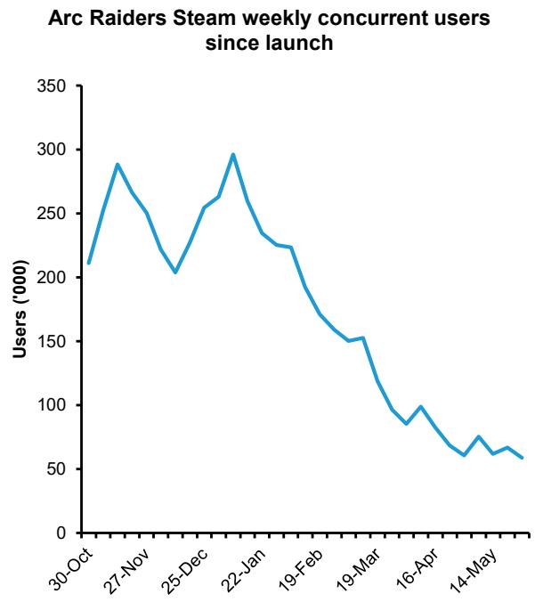

line

| Date     | Users ('000) |
| -------- | ------------ |
| 30-Oct   | 210          |
| 27-Nov   | 290          |
| 25-Dec   | 205          |
| 22-Jan   | 295          |
| 19-Feb   | 225          |
| 19-Mar   | 150          |
| 16-Apr   | 85           |
| 14-May   | 60           |

Source: SteamDB and Bernstein analysis.

EXHIBIT 30: China operating profit steps down as ex-China contribution becomes larger gradually   
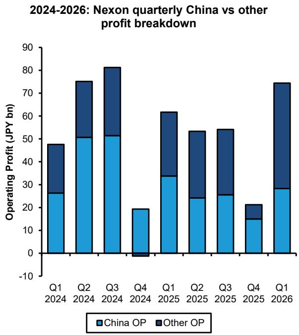

bar_stacked

2024-2026: Nexon quarterly China vs other profit breakdown
| Quarter | China OP (JPY bn) | Other OP (JPY bn) |
| :--- | :--- | :--- |
| Q1 2024 | 26 | 25 |
| Q2 2024 | 50 | 27 |
| Q3 2024 | 51 | 31 |
| Q4 2024 | 19 | -1 |
| Q1 2025 | 33 | 33 |
| Q2 2025 | 24 | 38 |
| Q3 2025 | 25 | 38 |
| Q4 2025 | 14 | 6 |
| Q1 2026 | 28 | 51 |

Source: Corporate reports and Bernstein analysis.

EXHIBIT 31: DNF mobile DAUs have fallen sharply from launch and continue to drift lower   
2024-2026: DNF mobile DAUs   
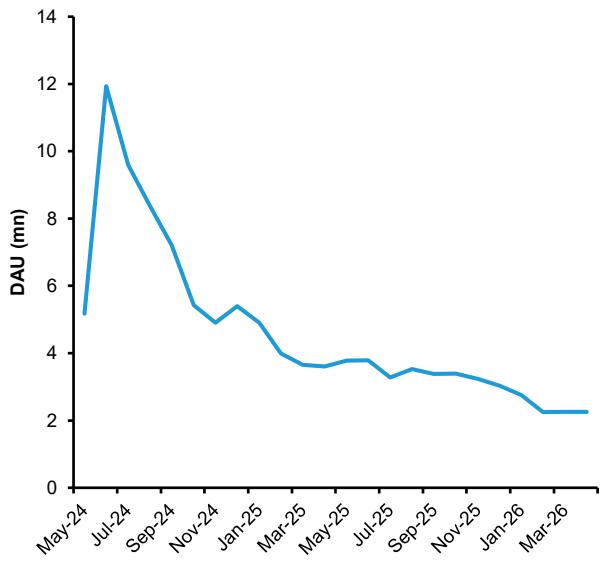

line

| Month    | DAU (mn) |
| -------- | -------- |
| May-24   | 5.0      |
| Jul-24   | 12.0     |
| Sep-24   | 7.0      |
| Nov-24   | 5.0      |
| Jan-25   | 5.5      |
| Mar-25   | 4.0      |
| May-25   | 3.8      |
| Jul-25   | 3.5      |
| Sep-25   | 3.6      |
| Nov-25   | 3.4      |
| Jan-26   | 3.0      |
| Mar-26   | 2.2      |

Source: QuestMobile and Bernstein analysis.

EXHIBIT 32: DNF mobile total time spent mirrors DAU declines, settling at much lower levels   
2024-2026: DNF mobile total time spent   
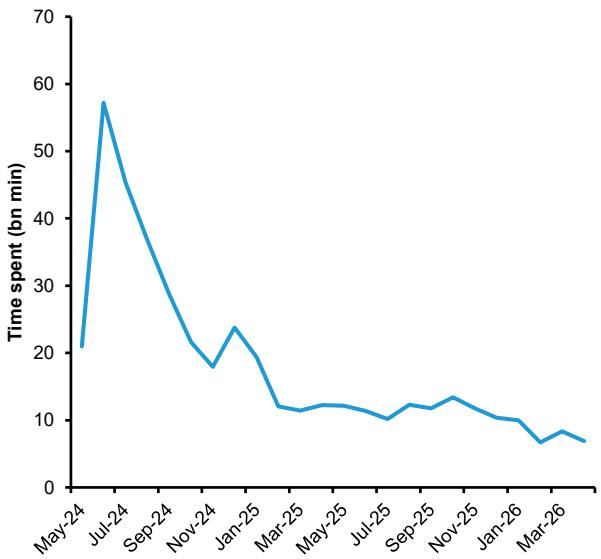

line

| Month    | Time spent (bn min) |
| -------- | ------------------- |
| May-24   | 20                  |
| Jul-24   | 57                  |
| Sep-24   | 35                  |
| Nov-24   | 20                  |
| Jan-25   | 24                  |
| Mar-25   | 12                  |
| May-25   | 12                  |
| Jul-25   | 10                  |
| Sep-25   | 13                  |
| Nov-25   | 14                  |
| Jan-26   | 10                  |
| Mar-26   | 7                   |

Source: QuestMobile and Bernstein analysis.

EXHIBIT 33: Similarweb visits to dnf.qq.com are volatile but broadly flat after the mid-2025 spike   
2024-2026: Similarweb visits on dnf.qq.com   
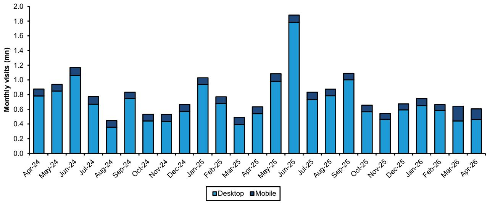

bar_stacked

| Month | Desktop (mn) | Mobile (mn) |
| :--- | :--- | :--- |
| Apr-24 | 0.78 | 0.15 |
| May-24 | 0.83 | 0.15 |
| Jun-24 | 1.05 | 0.18 |
| Jul-24 | 0.65 | 0.15 |
| Aug-24 | 0.35 | 0.12 |
| Sep-24 | 0.75 | 0.12 |
| Oct-24 | 0.43 | 0.12 |
| Nov-24 | 0.42 | 0.12 |
| Dec-24 | 0.57 | 0.11 |
| Jan-25 | 0.93 | 0.11 |
| Feb-25 | 0.67 | 0.11 |
| Mar-25 | 0.39 | 0.11 |
| Apr-25 | 0.53 | 0.11 |
| May-25 | 0.97 | 0.13 |
| Jun-25 | 1.79 | 0.13 |
| Jul-25 | 0.74 | 0.11 |
| Aug-25 | 0.78 | 0.11 |
| Sep-25 | 1.00 | 0.11 |
| Oct-25 | 0.57 | 0.11 |
| Nov-25 | 0.46 | 0.11 |
| Dec-25 | 0.60 | 0.11 |
| Jan-26 | 0.65 | 0.11 |
| Feb-26 | 0.59 | 0.11 |
| Mar-26 | 0.43 | 0.19 |
| Apr-26 | 0.46 | 0.19 |

Source: Similarweb and Bernstein analysis.

EXHIBIT 34: Nexon's surprise accounting change in Q4 drove a large reset of the company's go-forward PE multiple   
2020-2026: Nexon 1-year blended forward PE   
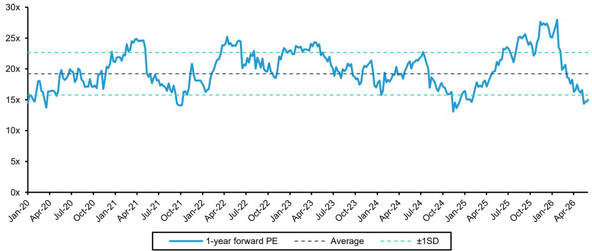

line

| Date    | 1-year forward PE |
|---------|-------------------|
| Jan-20  | 15x               |
| Apr-20  | 17x               |
| Jul-20  | 19x               |
| Oct-20  | 18x               |
| Jan-21  | 20x               |
| Apr-21  | 24x               |
| Jul-21  | 18x               |
| Oct-21  | 16x               |
| Jan-22  | 17x               |
| Apr-22  | 25x               |
| Jul-22  | 23x               |
| Oct-22  | 20x               |
| Jan-23  | 23x               |
| Apr-23  | 24x               |
| Jul-23  | 20x               |
| Oct-23  | 19x               |
| Jan-24  | 18x               |
| Apr-24  | 20x               |
| Jul-24  | 23x               |
| Oct-24  | 18x               |
| Jan-25  | 16x               |
| Apr-25  | 18x               |
| Jul-25  | 23x               |
| Oct-25  | 25x               |
| Jan-26  | 28x               |
| Apr-26  | 15x               |

Source: Corporate reports, Bloomberg, and Bernstein analysis.

EXHIBIT 35: Nexon: Summary of estimate changes 

<table><tr><td>Summary of estimate changes</td><td>2026E</td><td>2027E</td><td>2028E</td></tr><tr><td colspan="4">Revenue</td></tr><tr><td>Bernstein - Old</td><td>559</td><td>538</td><td>546</td></tr><tr><td>Growth YoY</td><td>9.8%</td><td>-3.8%</td><td>1.6%</td></tr><tr><td>Bernstein - New</td><td>485</td><td>493</td><td>502</td></tr><tr><td>Growth YoY</td><td>2.2%</td><td>1.6%</td><td>1.7%</td></tr><tr><td>Consensus</td><td>524</td><td>536</td><td>554</td></tr><tr><td>Growth YoY</td><td>7.5%</td><td>2.2%</td><td>3.5%</td></tr><tr><td>New vs. old</td><td>-13.2%</td><td>-8.3%</td><td>-8.2%</td></tr><tr><td>New vs. consensus</td><td>-7.4%</td><td>-7.9%</td><td>-9.5%</td></tr><tr><td colspan="4">Non-GAAP operating income</td></tr><tr><td>Bernstein - Old</td><td>165</td><td>167</td><td>171</td></tr><tr><td>Growth YoY</td><td>4.2%</td><td>1.6%</td><td>2.1%</td></tr><tr><td>Margin</td><td>29.4%</td><td>31.1%</td><td>31.3%</td></tr><tr><td>Bernstein - New</td><td>125</td><td>127</td><td>126</td></tr><tr><td>Growth YoY</td><td>0.6%</td><td>1.5%</td><td>-0.2%</td></tr><tr><td>Margin</td><td>25.7%</td><td>25.7%</td><td>25.2%</td></tr><tr><td>Consensus</td><td>149</td><td>153</td><td>159</td></tr><tr><td>Growth YoY</td><td>-0.8%</td><td>3.0%</td><td>3.8%</td></tr><tr><td>Margin</td><td>28.4%</td><td>28.6%</td><td>28.7%</td></tr><tr><td>New vs. old</td><td>-24.3%</td><td>-24.3%</td><td>-26.0%</td></tr><tr><td>New vs. consensus</td><td>-16.2%</td><td>-17.4%</td><td>-20.6%</td></tr><tr><td colspan="4">EPS(JPY)</td></tr><tr><td>Bernstein - Old</td><td>176</td><td>179</td><td>182</td></tr><tr><td>Growth YoY</td><td>11.6%</td><td>1.4%</td><td>1.8%</td></tr><tr><td>Bernstein - New</td><td>157</td><td>146</td><td>146</td></tr><tr><td>Growth YoY</td><td>37.3%</td><td>-6.7%</td><td>0.0%</td></tr><tr><td>Consensus</td><td>151</td><td>154</td><td>166</td></tr><tr><td>Growth YoY</td><td>8.0%</td><td>2.1%</td><td>7.7%</td></tr><tr><td>New vs. old</td><td>-11.2%</td><td>-18.4%</td><td>-19.9%</td></tr><tr><td>New vs. consensus</td><td>4.0%</td><td>-5.0%</td><td>-11.8%</td></tr></table>

Source: Bloomberg, Corporate reports, Bernstein estimates and analysis.

# SQUARE ENIX: CATALOG SALES GROWTH SUPPORTS PROFITS

We still struggle to be especially constructive on Square Enix's shares, trading on one of the highest forward PE multiples across the sector. The highly-anticipated Dragon Quest XII announcement turning out to be another delay in development felt emblematic of the task facing management to restore the company to a reliable new game launch cadence. That said, for the first time in a while our meeting with Square Enix left us with a sense of progress.

Looking back, the company framed FY3/25 and FY3/26 as years focused on domestic then overseas reorganisation, while organizational upheaval was described as less likely in FY3/27E. Catalog sales should continue to grow, supported by Square Enix putting a wide range of existing games on Switch 2 (see Exhibit 36). The guidance for lower operating profit this year was explained through the lens of non-repeating Final Fantasy x MTG royalties, but described as intentionally conservative. The Evercold expansion for Final Fantasy XIV lands in January 2027 and will therefore only contribute partly to this financial year, but higher MMO revenue year on year should also help to add a sense of stability to the company (see Exhibit 38 and Exhibit 37).

Questions will continue to be asked about Square Enix's ability to launch new games profitably, starting with two mobile games this year, and The Adventures of Elliott in June. But the company's content production account has been cut down to size in recent years, including from a JPY7bn impairment in Q4, which reduces the risk of large losses when the company releases more major titles in FY3/28E and beyond.

With this note we've made some minor adjustments to our Square Enix estimates (see Exhibit 39 and Exhibit 40).

EXHIBIT 36: Higher repeat sales and cost savings continue to support a higher floor for Square Enix profits... continued growth in FY3/27E feels likely given the company's release of various Switch 2 edition games   
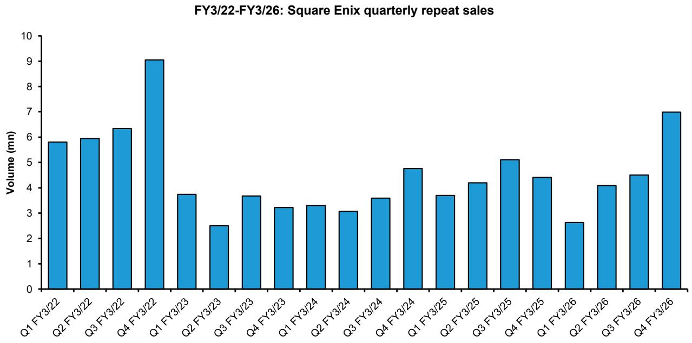

bar

FY3/22-FY3/26: Square Enix quarterly repeat sales
| Quarter | Volume (mn) |
| :--- | :--- |
| Q1 FY3/22 | 5.8 |
| Q2 FY3/22 | 5.9 |
| Q3 FY3/22 | 6.3 |
| Q4 FY3/22 | 9.0 |
| Q1 FY3/23 | 3.7 |
| Q2 FY3/23 | 2.5 |
| Q3 FY3/23 | 3.6 |
| Q4 FY3/23 | 3.2 |
| Q1 FY3/24 | 3.3 |
| Q2 FY3/24 | 3.0 |
| Q3 FY3/24 | 3.5 |
| Q4 FY3/24 | 4.7 |
| Q1 FY3/25 | 3.6 |
| Q2 FY3/25 | 4.1 |
| Q3 FY3/25 | 5.0 |
| Q4 FY3/25 | 4.4 |
| Q1 FY3/26 | 2.6 |
| Q2 FY3/26 | 4.0 |
| Q3 FY3/26 | 4.4 |
| Q4 FY3/26 | 6.9 |

Source: Corporate reports, Bernstein estimates and analysis.

EXHIBIT 37: MMO revenue was guided to grow in FY3/27E, helped by the Evercold expansion for Final Fantasy XIV   
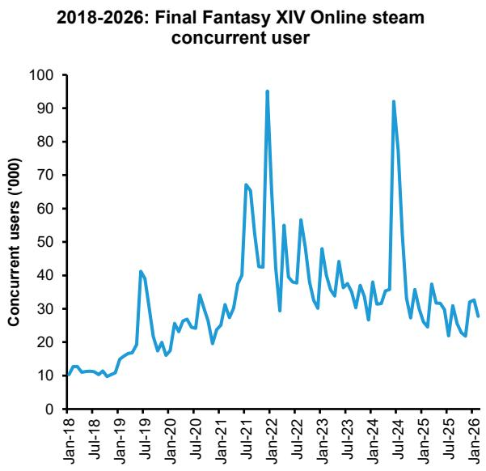

line

| Date    | Concurrent users ('000) |
|---------|--------------------------|
| Jan-18  | 10                       |
| Jul-18  | 10                       |
| Jan-19  | 15                       |
| Jul-19  | 40                       |
| Jan-20  | 20                       |
| Jul-20  | 25                       |
| Jan-21  | 30                       |
| Jul-21  | 65                       |
| Jan-22  | 95                       |
| Jul-22  | 55                       |
| Jan-23  | 45                       |
| Jul-23  | 35                       |
| Jan-24  | 30                       |
| Jul-24  | 90                       |
| Jan-25  | 35                       |
| Jul-25  | 30                       |
| Jan-26  | 25                       |

Source: Corporate reports, SteamDB, Bernstein estimates and analysis.

EXHIBIT 38: Square Enix's upcoming mobile launches will be interesting to watch   
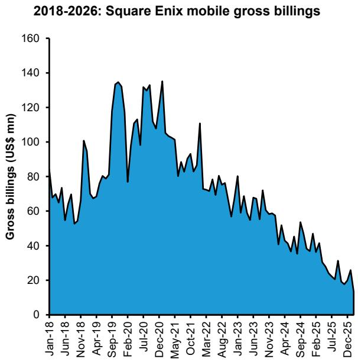

line

| Date    | Gross billings (US$ mn) |
|---------|--------------------------|
| Jan-18  | ~70                      |
| Jun-18  | ~65                      |
| Nov-18  | ~75                      |
| Apr-19  | ~80                      |
| Sep-19  | ~135                     |
| Feb-20  | ~110                     |
| Jul-20  | ~130                     |
| Dec-20  | ~135                     |
| May-21  | ~105                     |
| Oct-21  | ~90                      |
| Mar-22  | ~75                      |
| Aug-22  | ~70                      |
| Jan-23  | ~65                      |
| Jun-23  | ~60                      |
| Nov-23  | ~55                      |
| Apr-24  | ~45                      |
| Sep-24  | ~40                      |
| Feb-25  | ~35                      |
| Jul-25  | ~30                      |
| Dec-25  | ~25                      |

Source: Sensor Tower and Bernstein analysis.

EXHIBIT 39: In a sector full of cheap stocks, it's still hard for us to call Square Enix's shares especially attractive, but the sense of stability at the company was encouraging   
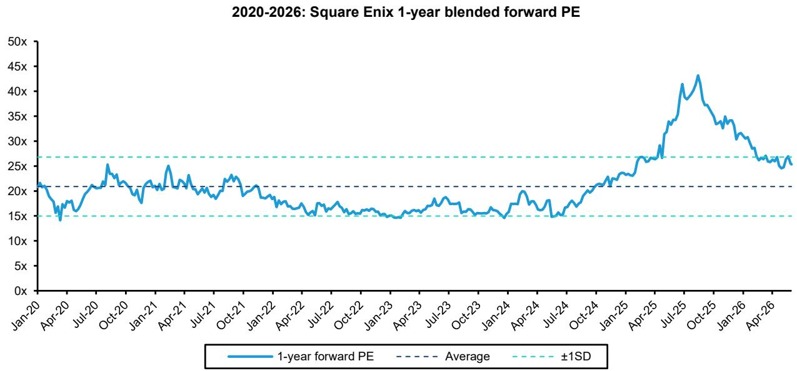

line

| Date    | 1-year forward PE |
|---------|-------------------|
| Jan-20  | 21x               |
| Apr-20  | 15x               |
| Jul-20  | 25x               |
| Oct-20  | 20x               |
| Jan-21  | 23x               |
| Apr-21  | 20x               |
| Jul-21  | 22x               |
| Oct-21  | 23x               |
| Jan-22  | 20x               |
| Apr-22  | 18x               |
| Jul-22  | 17x               |
| Oct-22  | 16x               |
| Jan-23  | 15x               |
| Apr-23  | 16x               |
| Jul-23  | 18x               |
| Oct-23  | 17x               |
| Jan-24  | 15x               |
| Apr-24  | 18x               |
| Jul-24  | 16x               |
| Oct-24  | 20x               |
| Jan-25  | 23x               |
| Apr-25  | 27x               |
| Jul-25  | 35x               |
| Oct-25  | 43x               |
| Jan-26  | 35x               |
| Apr-26  | 27x               |

Source: Corporate reports, Bloomberg, and Bernstein analysis.

EXHIBIT 40: Square Enix: Summary of estimate changes 

<table><tr><td>Summary of estimate changes</td><td>FY3/27E</td><td>FY3/28E</td><td>FY3/29E</td></tr><tr><td colspan="4">Revenue (JPY bn)</td></tr><tr><td>Bernstein - old</td><td>296</td><td>307</td><td>319</td></tr><tr><td>Growth YoY</td><td>-0.6%</td><td>3.7%</td><td>3.8%</td></tr><tr><td>Bernstein</td><td>308</td><td>320</td><td>348</td></tr><tr><td>Growth YoY</td><td>3.5%</td><td>3.8%</td><td>8.9%</td></tr><tr><td>Consensus</td><td>305</td><td>319</td><td>327</td></tr><tr><td>Growth YoY</td><td>3.4%</td><td>4.6%</td><td>2.6%</td></tr><tr><td>Bernstein new vs. old</td><td>4.1%</td><td>4.3%</td><td>9.3%</td></tr><tr><td>Bernstein new vs. consensus</td><td>1.0%</td><td>0.3%</td><td>6.5%</td></tr><tr><td colspan="4">Operating profit (JPY bn)</td></tr><tr><td>Bernstein - old</td><td>54</td><td>56</td><td>60</td></tr><tr><td>Growth YoY</td><td>-5.0%</td><td>3.5%</td><td>7.4%</td></tr><tr><td>Margin</td><td>18.2%</td><td>18.1%</td><td>18.8%</td></tr><tr><td>Bernstein</td><td>54</td><td>62</td><td>69</td></tr><tr><td>Growth YoY</td><td>-4.9%</td><td>14.3%</td><td>11.6%</td></tr><tr><td>Margin</td><td>17.5%</td><td>19.2%</td><td>19.7%</td></tr><tr><td>Consensus</td><td>51</td><td>53</td><td>58</td></tr><tr><td>Growth YoY</td><td>-1.3%</td><td>4.8%</td><td>9.4%</td></tr><tr><td>Margin</td><td>16.6%</td><td>16.6%</td><td>17.8%</td></tr><tr><td>Bernstein new vs. old</td><td>0.2%</td><td>10.6%</td><td>14.9%</td></tr><tr><td>Bernstein new vs. consensus</td><td>6.3%</td><td>15.9%</td><td>18.3%</td></tr><tr><td colspan="4">EPS (JPY)</td></tr><tr><td>Bernstein - old</td><td>107</td><td>110</td><td>118</td></tr><tr><td>Growth YoY</td><td>21.3%</td><td>3.4%</td><td>7.2%</td></tr><tr><td>Bernstein</td><td>107</td><td>122</td><td>136</td></tr><tr><td>Growth YoY</td><td>21.4%</td><td>14.0%</td><td>11.4%</td></tr><tr><td>Consensus</td><td>97</td><td>116</td><td>115</td></tr><tr><td>Growth YoY</td><td>18.8%</td><td>19.7%</td><td>-0.9%</td></tr><tr><td>Bernstein new vs. old</td><td>0.2%</td><td>10.4%</td><td>14.6%</td></tr><tr><td>Bernstein new vs. consensus</td><td>9.8%</td><td>4.6%</td><td>17.6%</td></tr></table>

Source: Corporate reports, Bloomberg, Bernstein estimates and analysis.

# BANDAI NAMCO: THE DIGITAL GUIDE CONTINUES TO WORRY US, BUT...

Our Bandai Namco view continues to be split between confidence that the Toy & Hobby segment will continue to surprise versus a deliberately conservative guide, and the Digital segment where the go-forward pipeline worries us. In our recent discussions, the company sounded confident on Toy & Hobby growth, and progress made in the core Gundam franchise. A “few billion yen” of headwinds from higher energy prices was said to have been embedded in the company’s FY3/27E operating profit guidance (see Exhibit 41 and Exhibit 42).

On the flip side, with Dragon Ball Xenoverse 3 confirmed as a FY3/28E title, Bandai Namco's FY3/27E new game launch line-up consists of Ace Combat (2.8mn units expected) and The Blood of Dawnwalker as the clearest volume drivers. Bandai Namco's distribution of EA FC should see a bump during a World Cup year, but the margins on such sales are likely lower. Elden Ring and Nightreign repeat sales most likely decline year on year in FY3/27E. On the Network Content side, SD Gundam will likely see revenues decline year on year, which leaves the company's trio of Japan-only mobile game launches to pick up the slack within Network Content in FY3/27E.

Trading on c. 18x FY3/28E PE on our estimates for the company, Bandai Namco's forward multiples are back to range lows. In our recent discussions, the company's indifferent Digital segment performance has raised questions on whether the company should be valued more like a toy business, using Hasbro or Tomy as the more appropriate peer group. But even this (e.g. Hasbro has averaged 16-17x PE in the longer-term) only implies modest downside. Kadokawa's struggles related to self-publishing just might suggest all is not lost on the FromSoftware front going forward. On the other hand, it does feel somewhat notable that Toei Animation recently started an in-house studio focused on video game development.

With this note we've made some minor adjustments to our Bandai Namco estimates (see Exhibit 43 and Exhibit 44).

EXHIBIT 41: Our base case remains that growth in Bandai Namco's Toy & Hobby business tracks broader anime growth... around the $10\%$ per annum range   
FY3/23-FY3/26: Group Toy & Hobby revenue by IP   
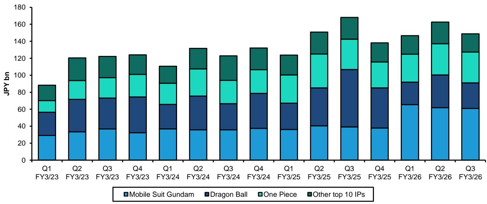

bar_stacked

| Quarter | Mobile Suit Gundam | Dragon Ball | One Piece | Other top 10 IPs |
|---------|--------------------|-------------|-----------|------------------|
| Q1 FY3/23 | 28 | 24 | 12 | 19 |
| Q2 FY3/23 | 32 | 34 | 18 | 22 |
| Q3 FY3/23 | 36 | 32 | 20 | 21 |
| Q4 FY3/23 | 31 | 36 | 21 | 20 |
| Q1 FY3/24 | 36 | 26 | 20 | 19 |
| Q2 FY3/24 | 35 | 37 | 25 | 20 |
| Q3 FY3/24 | 34 | 28 | 25 | 20 |
| Q4 FY3/24 | 37 | 34 | 24 | 19 |
| Q1 FY3/25 | 35 | 29 | 27 | 19 |
| Q2 FY3/25 | 40 | 40 | 30 | 20 |
| Q3 FY3/25 | 38 | 57 | 28 | 19 |
| Q4 FY3/25 | 37 | 44 | 25 | 19 |
| Q1 FY3/26 | 65 | 27 | 27 | 19 |
| Q2 FY3/26 | 61 | 34 | 28 | 19 |
| Q3 FY3/26 | 60 | 28 | 30 | 19 |

Source: Corporate reports and Bernstein analysis.

EXHIBIT 42: The lack of FromSoftware games in 2026 and 2027 represents a headwind for Bandai Namco... can SD Gundam, repeat sales, Ace Combat 8, and Blood of Dawnwalker get us there?   
FY3/24-FY3/27E: Bandai Namco Digital segment operating profit   
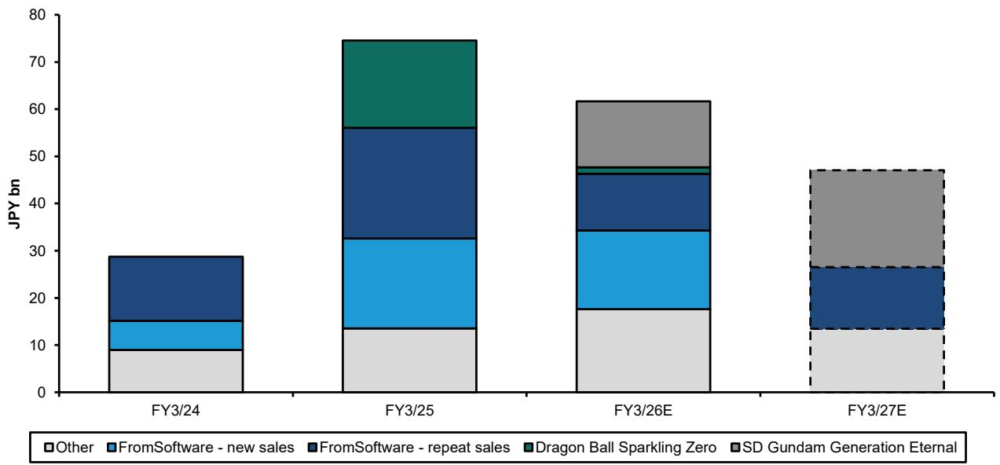

bar_stacked

| Fiscal Year | FromSoftware - new sales (JPY bn) | FromSoftware - repeat sales (JPY bn) | Dragon Ball Sparkling Zero (JPY bn) | SD Gundam Generation Eternal (JPY bn) |
| :--- | :--- | :--- | :--- | :--- |
| FY3/24 | 9 | 6 | 0 | 0 |
| FY3/25 | 14 | 22 | 18 | 0 |
| FY3/26E | 18 | 14 | 1 | 10 |
| FY3/27E | 14 | 12 | 0 | 20 |

Source: Source: Corporate reports, Bernstein estimates and analysis.

EXHIBIT 43: Bandai Namco's forward PE multiple now stands almost one standard deviation below the mean since 2019, but the lack of an obvious catalyst remains an issue in our view   
2020-2026: Bandai Namco 1-year blended forward PE   
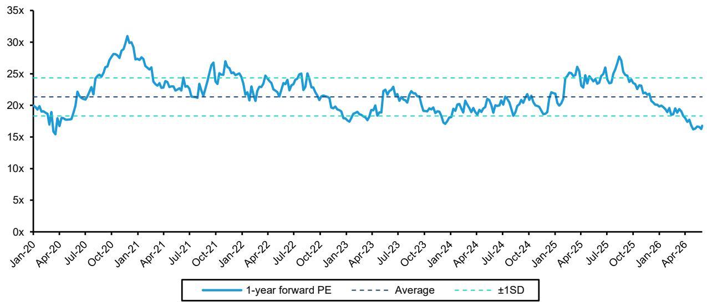

line

| Date    | 1-year forward PE |
|---------|-------------------|
| Jan-20  | ~19x              |
| Apr-20  | ~17x              |
| Jul-20  | ~21x              |
| Oct-20  | ~28x              |
| Jan-21  | ~31x              |
| Apr-21  | ~24x              |
| Jul-21  | ~23x              |
| Oct-21  | ~27x              |
| Jan-22  | ~25x              |
| Apr-22  | ~23x              |
| Jul-22  | ~25x              |
| Oct-22  | ~21x              |
| Jan-23  | ~18x              |
| Apr-23  | ~19x              |
| Jul-23  | ~22x              |
| Oct-23  | ~21x              |
| Jan-24  | ~17x              |
| Apr-24  | ~19x              |
| Jul-24  | ~20x              |
| Oct-24  | ~19x              |
| Jan-25  | ~21x              |
| Apr-25  | ~25x              |
| Jul-25  | ~24x              |
| Oct-25  | ~28x              |
| Jan-26  | ~23x              |
| Apr-26  | ~16x              |

Source: Corporate reports, Bloomberg, and Bernstein analysis.

EXHIBIT 44: Bandai Namco: Summary of estimate changes 

<table><tr><td>Summary of estimate changes</td><td>FY3/27E</td><td>FY3/28E</td><td>FY3/29E</td></tr><tr><td colspan="4">Revenue (JPY bn)</td></tr><tr><td>Bernstein - old</td><td>1,343</td><td>1,454</td><td>1,567</td></tr><tr><td>Growth YoY</td><td>2.6%</td><td>8.3%</td><td>7.8%</td></tr><tr><td>Bernstein - new</td><td>1,387</td><td>1,521</td><td>1,624</td></tr><tr><td>Growth YoY</td><td>6.1%</td><td>9.7%</td><td>6.8%</td></tr><tr><td>Consensus</td><td>1,365</td><td>1,432</td><td>1,541</td></tr><tr><td>Growth YoY</td><td>4.5%</td><td>4.9%</td><td>7.7%</td></tr><tr><td>Bernstein new vs. old</td><td>3.3%</td><td>4.6%</td><td>3.6%</td></tr><tr><td>Bernstein new vs. consensus</td><td>1.6%</td><td>6.2%</td><td>5.4%</td></tr><tr><td colspan="4">Operating profit (JPY bn)</td></tr><tr><td>Bernstein - old</td><td>181</td><td>196</td><td>213</td></tr><tr><td>Growth YoY</td><td>-2.7%</td><td>8.5%</td><td>8.7%</td></tr><tr><td>Margin</td><td>13.5%</td><td>13.5%</td><td>13.6%</td></tr><tr><td>Bernstein - new</td><td>182</td><td>199</td><td>212</td></tr><tr><td>Growth YoY</td><td>-0.6%</td><td>8.8%</td><td>6.5%</td></tr><tr><td>Margin</td><td>13.2%</td><td>13.1%</td><td>13.0%</td></tr><tr><td>Consensus</td><td>196</td><td>213</td><td>229</td></tr><tr><td>Growth YoY</td><td>7.9%</td><td>8.8%</td><td>7.3%</td></tr><tr><td>Margin</td><td>14.4%</td><td>14.9%</td><td>14.9%</td></tr><tr><td>Bernstein new vs. old</td><td>1.0%</td><td>1.3%</td><td>-0.7%</td></tr><tr><td>Bernstein new vs. consensus</td><td>-6.9%</td><td>-6.9%</td><td>-7.6%</td></tr><tr><td colspan="4">EPS (JPY)</td></tr><tr><td>Bernstein - old</td><td>204</td><td>221</td><td>240</td></tr><tr><td>Growth YoY</td><td>-4.3%</td><td>8.2%</td><td>8.4%</td></tr><tr><td>Bernstein - new</td><td>206</td><td>224</td><td>238</td></tr><tr><td>Growth YoY</td><td>-0.6%</td><td>8.5%</td><td>6.3%</td></tr><tr><td>Consensus</td><td>221</td><td>240</td><td>261</td></tr><tr><td>Growth YoY</td><td>8.1%</td><td>8.4%</td><td>8.9%</td></tr><tr><td>Bernstein new vs. old</td><td>0.9%</td><td>1.2%</td><td>-0.7%</td></tr><tr><td>Bernstein new vs. consensus</td><td>-6.7%</td><td>-6.7%</td><td>-8.9%</td></tr></table>

Source: Bloomberg, Corporate reports, Bernstein estimates and analysis.

# APPENDIX - FINANCIAL FORECASTS

EXHIBIT 45: Nintendo: Income Statement 

<table><tr><td>JPY mn</td><td>FY3/23</td><td>FY3/24</td><td>FY3/25</td><td>FY3/26</td><td>FY3/27E</td><td>FY3/28E</td><td>FY3/29E</td></tr><tr><td>Revenue</td><td>1,601,677</td><td>1,671,865</td><td>1,164,922</td><td>2,313,051</td><td>2,332,591</td><td>2,576,167</td><td>2,692,927</td></tr><tr><td>Gross profit</td><td>885,440</td><td>954,335</td><td>710,168</td><td>908,957</td><td>1,007,233</td><td>1,147,393</td><td>1,292,599</td></tr><tr><td>Advertising expenses</td><td>-94,984</td><td>-104,312</td><td>-86,575</td><td>-144,684</td><td>-137,980</td><td>-137,402</td><td>-170,720</td></tr><tr><td>R&amp;D expenses</td><td>-110,015</td><td>-137,749</td><td>-143,788</td><td>-177,892</td><td>-190,344</td><td>-203,669</td><td>-217,925</td></tr><tr><td>Administrative expenses</td><td>-176,066</td><td>-183,333</td><td>-197,252</td><td>-226,263</td><td>-242,101</td><td>-259,049</td><td>-277,182</td></tr><tr><td>Operating profit</td><td>504,375</td><td>528,941</td><td>282,553</td><td>360,118</td><td>436,808</td><td>547,274</td><td>626,772</td></tr><tr><td>Ordinary profit</td><td>601,070</td><td>680,497</td><td>372,316</td><td>542,196</td><td>567,169</td><td>685,384</td><td>775,078</td></tr><tr><td>Profit before tax</td><td>600,757</td><td>680,722</td><td>372,331</td><td>568,194</td><td>567,169</td><td>685,384</td><td>775,078</td></tr><tr><td>Income tax expense</td><td>-167,957</td><td>-190,080</td><td>-93,479</td><td>-144,101</td><td>-158,807</td><td>-191,907</td><td>-217,022</td></tr><tr><td>Earnings attributable to shareholders</td><td>432,768</td><td>490,602</td><td>278,806</td><td>424,057</td><td>408,362</td><td>493,476</td><td>558,056</td></tr><tr><td>Earnings per share</td><td>371.41</td><td>421.39</td><td>239.47</td><td>364.51</td><td>350.74</td><td>423.85</td><td>479.32</td></tr></table>

Source: Corporate reports, Bernstein estimates and analysis.

EXHIBIT 46: Nintendo: Cash Flow Statement 

<table><tr><td>JPY mn</td><td>FY3/23</td><td>FY3/24</td><td>FY3/25</td><td>FY3/26</td><td>FY3/27E</td><td>FY3/28E</td><td>FY3/29E</td></tr><tr><td>Profit before tax</td><td>600,757</td><td>680,722</td><td>372,331</td><td>568,194</td><td>567,169</td><td>685,384</td><td>775,078</td></tr><tr><td>Depreciation &amp; amortization</td><td>11,040</td><td>17,856</td><td>15,361</td><td>15,854</td><td>18,931</td><td>19,964</td><td>21,152</td></tr><tr><td>Changes in working capital</td><td>-15,508</td><td>62,062</td><td>-200,201</td><td>-43,185</td><td>49,634</td><td>-35,381</td><td>-13,516</td></tr><tr><td>Other</td><td>-273,446</td><td>-298,541</td><td>-175,423</td><td>-251,068</td><td>-230,807</td><td>-271,907</td><td>-305,022</td></tr><tr><td>Cash flow from operations</td><td>322,843</td><td>462,099</td><td>12,068</td><td>289,795</td><td>404,927</td><td>398,059</td><td>477,692</td></tr><tr><td>Capex</td><td>-22,190</td><td>-16,123</td><td>-19,008</td><td>-27,169</td><td>-28,326</td><td>-30,762</td><td>-31,929</td></tr><tr><td>Other</td><td>133,697</td><td>-614,509</td><td>772,073</td><td>-182,886</td><td>0</td><td>0</td><td>0</td></tr><tr><td>Cash flow from investments</td><td>111,507</td><td>-630,632</td><td>753,065</td><td>-210,055</td><td>-28,326</td><td>-30,762</td><td>-31,929</td></tr><tr><td>Cash flow from financing</td><td>-290,973</td><td>-236,957</td><td>-195,125</td><td>-249,713</td><td>-245,017</td><td>-296,086</td><td>-334,834</td></tr><tr><td>Net effect of FX changes</td><td>28,474</td><td>64,356</td><td>-9,317</td><td>72,538</td><td>0</td><td>0</td><td>0</td></tr><tr><td>Net change in cash</td><td>171,851</td><td>-341,136</td><td>560,689</td><td>-97,441</td><td>131,584</td><td>71,212</td><td>110,929</td></tr><tr><td>Beginning cash</td><td>1,022,718</td><td>1,194,569</td><td>853,433</td><td>1,414,122</td><td>1,316,681</td><td>1,448,265</td><td>1,519,477</td></tr><tr><td>Ending cash</td><td>1,194,569</td><td>853,433</td><td>1,414,122</td><td>1,316,681</td><td>1,448,265</td><td>1,519,477</td><td>1,630,406</td></tr></table>

Source: Corporate reports, Bernstein estimates and analysis.

EXHIBIT 47: Nintendo: Balance Sheet 

<table><tr><td>JPY mn</td><td>FY3/23</td><td>FY3/24</td><td>FY3/25</td><td>FY3/26</td><td>FY3/27E</td><td>FY3/28E</td><td>FY3/29E</td></tr><tr><td>Cash and deposits</td><td>1,263,666</td><td>1,484,350</td><td>1,586,275</td><td>1,791,802</td><td>1,923,387</td><td>1,994,599</td><td>2,105,528</td></tr><tr><td>Notes and trade receivables</td><td>119,932</td><td>93,608</td><td>65,180</td><td>147,485</td><td>191,720</td><td>211,161</td><td>221,336</td></tr><tr><td>Securities</td><td>615,699</td><td>768,355</td><td>471,915</td><td>425,054</td><td>446,307</td><td>468,622</td><td>492,053</td></tr><tr><td>Inventories</td><td>258,628</td><td>155,987</td><td>486,428</td><td>539,804</td><td>472,045</td><td>507,488</td><td>498,747</td></tr><tr><td>Other current assets</td><td>56,587</td><td>71,001</td><td>142,551</td><td>105,638</td><td>106,530</td><td>117,655</td><td>122,987</td></tr><tr><td>Total current asset</td><td>2,314,513</td><td>2,573,301</td><td>2,752,349</td><td>3,009,783</td><td>3,139,989</td><td>3,299,524</td><td>3,440,652</td></tr><tr><td>Property, plant &amp; equipment, net</td><td>99,509</td><td>108,518</td><td>112,612</td><td>127,450</td><td>135,845</td><td>145,643</td><td>155,420</td></tr><tr><td>Investment securities</td><td>276,253</td><td>290,620</td><td>369,373</td><td>420,875</td><td>492,875</td><td>572,875</td><td>660,875</td></tr><tr><td>Other non-current assets</td><td>164,008</td><td>178,954</td><td>164,178</td><td>247,203</td><td>258,331</td><td>269,965</td><td>282,131</td></tr><tr><td>Total assets</td><td>2,854,283</td><td>3,151,393</td><td>3,398,512</td><td>3,805,311</td><td>4,027,040</td><td>4,288,007</td><td>4,539,078</td></tr><tr><td>Notes and trade payables</td><td>149,217</td><td>58,084</td><td>201,091</td><td>236,082</td><td>272,334</td><td>292,781</td><td>287,739</td></tr><tr><td>Other current liabilities</td><td>384,263</td><td>421,192</td><td>396,553</td><td>524,063</td><td>545,434</td><td>579,088</td><td>607,437</td></tr><tr><td>Total current liabilities</td><td>533,480</td><td>479,276</td><td>597,644</td><td>760,145</td><td>817,768</td><td>871,869</td><td>895,175</td></tr><tr><td>Non-current liabilities</td><td>54,337</td><td>67,120</td><td>75,421</td><td>89,983</td><td>90,743</td><td>100,219</td><td>104,761</td></tr><tr><td>Total liabilities</td><td>587,818</td><td>546,396</td><td>673,065</td><td>850,128</td><td>908,511</td><td>972,088</td><td>999,936</td></tr><tr><td>Total net assets</td><td>2,266,466</td><td>2,604,997</td><td>2,725,445</td><td>2,955,177</td><td>3,118,522</td><td>3,315,912</td><td>3,539,135</td></tr><tr><td>Total liabilities &amp; net assets</td><td>2,854,283</td><td>3,151,393</td><td>3,398,510</td><td>3,805,305</td><td>4,027,033</td><td>4,288,000</td><td>4,539,071</td></tr></table>

Source: Corporate reports, Bernstein estimates and analysis.

EXHIBIT 48: Konami: Income Statement 

<table><tr><td>JPY million</td><td>FY3/23</td><td>FY3/24</td><td>FY3/25</td><td>FY3/26E</td><td>FY3/27E</td><td>FY3/28E</td><td>FY3/29E</td></tr><tr><td>Net sales</td><td>314,321</td><td>360,314</td><td>421,602</td><td>493,677</td><td>539,451</td><td>570,954</td><td>592,377</td></tr><tr><td>Cost of sales</td><td>-191,930</td><td>-200,277</td><td>-222,681</td><td>-250,498</td><td>-266,618</td><td>-276,879</td><td>-282,099</td></tr><tr><td>Gross profit</td><td>122,391</td><td>160,037</td><td>198,921</td><td>243,179</td><td>272,832</td><td>294,075</td><td>310,279</td></tr><tr><td>Selling, general &amp; administrative expenses</td><td>76,206</td><td>79,775</td><td>96,977</td><td>107,288</td><td>105,866</td><td>101,525</td><td>96,502</td></tr><tr><td>Operating profit</td><td>46,185</td><td>80,262</td><td>101,944</td><td>135,891</td><td>166,966</td><td>192,550</td><td>213,777</td></tr><tr><td>Profit before tax</td><td>47,120</td><td>82,685</td><td>104,008</td><td>140,667</td><td>168,726</td><td>194,310</td><td>215,537</td></tr><tr><td>Total income taxes</td><td>12,225</td><td>23,513</td><td>29,316</td><td>40,654</td><td>47,243</td><td>54,407</td><td>60,350</td></tr><tr><td>Profit after tax</td><td>34,895</td><td>59,172</td><td>74,692</td><td>100,013</td><td>121,483</td><td>139,903</td><td>155,186</td></tr><tr><td>Earnings attributable to shareholders</td><td>34,895</td><td>59,171</td><td>74,692</td><td>100,013</td><td>121,483</td><td>139,903</td><td>155,186</td></tr><tr><td>Earnings per share</td><td>257.48</td><td>436.50</td><td>551.00</td><td>737.79</td><td>896.16</td><td>1,032.05</td><td>1,144.79</td></tr></table>

Source: Corporate reports, Bernstein estimates and analysis.

EXHIBIT 49: Konami: Cash Flow Statement 

<table><tr><td>JPY million</td><td>FY3/23</td><td>FY3/24</td><td>FY3/25</td><td>FY3/26</td><td>FY3/27E</td><td>FY3/28E</td><td>FY3/29E</td></tr><tr><td>Net income before income taxes</td><td>34,895</td><td>59,172</td><td>74,692</td><td>100,013</td><td>121,483</td><td>139,903</td><td>155,186</td></tr><tr><td>Depreciation &amp; amortisation</td><td>23,845</td><td>23,267</td><td>28,488</td><td>34,190</td><td>30,370</td><td>32,642</td><td>34,985</td></tr><tr><td>Interest income/expense, net</td><td>15,735</td><td>26,574</td><td>28,242</td><td>38,647</td><td>45,483</td><td>52,647</td><td>58,590</td></tr><tr><td>Net change in working capital</td><td>-12,389</td><td>1,038</td><td>-207</td><td>-9,893</td><td>5,487</td><td>2,446</td><td>1,273</td></tr><tr><td>Other</td><td>-25,988</td><td>-6,990</td><td>-16,595</td><td>-27,293</td><td>-45,883</td><td>-53,047</td><td>-58,990</td></tr><tr><td>Net cash from operating activities</td><td>36,098</td><td>103,061</td><td>114,620</td><td>135,664</td><td>156,939</td><td>174,591</td><td>191,045</td></tr><tr><td>Capex</td><td>-43,779</td><td>-29,316</td><td>-66,862</td><td>-55,680</td><td>-48,551</td><td>-51,386</td><td>-53,314</td></tr><tr><td>Payments for intangible assets</td><td>-98</td><td>-192</td><td>-1,288</td><td>-461</td><td>0</td><td>0</td><td>0</td></tr><tr><td>Other</td><td>1,091</td><td>292</td><td>265</td><td>818</td><td>0</td><td>0</td><td>0</td></tr><tr><td>Net cash from investing activities</td><td>-42,786</td><td>-29,216</td><td>-67,885</td><td>-55,323</td><td>-48,551</td><td>-51,386</td><td>-53,314</td></tr><tr><td>Net cash from financing activities</td><td>-27,467</td><td>-24,199</td><td>-25,784</td><td>-51,897</td><td>-36,445</td><td>-41,971</td><td>-46,556</td></tr><tr><td>Effect of FX changes</td><td>2,707</td><td>4,838</td><td>-482</td><td>4,904</td><td>0</td><td>0</td><td>0</td></tr><tr><td>Net change in cash and equivalents</td><td>-31,448</td><td>54,484</td><td>20,469</td><td>33,348</td><td>71,944</td><td>81,234</td><td>91,175</td></tr><tr><td>Period beginning cash and equivalents</td><td>250,711</td><td>219,263</td><td>273,747</td><td>294,216</td><td>327,564</td><td>399,508</td><td>480,742</td></tr><tr><td>Period end cash and equivalents</td><td>219,263</td><td>273,747</td><td>294,216</td><td>327,564</td><td>399,508</td><td>480,742</td><td>571,917</td></tr><tr><td>Free cash flow</td><td>-7,779</td><td>73,553</td><td>46,470</td><td>79,523</td><td>108,389</td><td>123,205</td><td>137,731</td></tr></table>

Source: Corporate reports, Bernstein estimates and analysis.

EXHIBIT 50: Konami: Balance Sheet 

<table><tr><td>JPY million</td><td>FY3/23</td><td>FY3/24</td><td>FY3/25</td><td>FY3/26</td><td>FY3/27E</td><td>FY3/28E</td><td>FY3/29E</td></tr><tr><td>Cash and cash equivalents</td><td>219,263</td><td>273,747</td><td>294,216</td><td>327,564</td><td>399,508</td><td>480,742</td><td>571,917</td></tr><tr><td>Trade and other receivables</td><td>39,276</td><td>43,887</td><td>47,220</td><td>60,023</td><td>66,508</td><td>70,199</td><td>73,033</td></tr><tr><td>Inventories</td><td>12,705</td><td>13,764</td><td>12,108</td><td>18,968</td><td>18,262</td><td>18,912</td><td>19,322</td></tr><tr><td>Other current assets</td><td>18,797</td><td>12,462</td><td>13,292</td><td>17,959</td><td>19,624</td><td>20,770</td><td>21,550</td></tr><tr><td>Total current assets</td><td>290,041</td><td>343,860</td><td>366,836</td><td>424,514</td><td>503,901</td><td>590,624</td><td>685,821</td></tr><tr><td>Property, plant and equipment, net</td><td>155,788</td><td>154,454</td><td>163,617</td><td>187,186</td><td>205,367</td><td>224,111</td><td>242,440</td></tr><tr><td>Other non-current assets</td><td>101,394</td><td>107,536</td><td>134,587</td><td>137,065</td><td>137,465</td><td>137,865</td><td>138,265</td></tr><tr><td>Total assets</td><td>547,223</td><td>605,850</td><td>665,040</td><td>748,765</td><td>846,733</td><td>952,600</td><td>1,066,526</td></tr><tr><td>Trade and other payables</td><td>37,558</td><td>44,257</td><td>45,406</td><td>50,545</td><td>54,785</td><td>56,737</td><td>57,965</td></tr><tr><td>Other current liabilities</td><td>37,536</td><td>41,669</td><td>70,908</td><td>67,865</td><td>74,157</td><td>78,488</td><td>81,433</td></tr><tr><td>Total current liabilities</td><td>75,094</td><td>85,926</td><td>116,314</td><td>118,410</td><td>128,942</td><td>135,226</td><td>139,399</td></tr><tr><td>Long-term borrowings</td><td>59,819</td><td>59,862</td><td>39,911</td><td>39,936</td><td>39,936</td><td>39,936</td><td>39,936</td></tr><tr><td>Other current liabilities</td><td>36,031</td><td>32,684</td><td>26,947</td><td>25,866</td><td>28,264</td><td>29,915</td><td>31,037</td></tr><tr><td>Total liabilities</td><td>170,944</td><td>178,472</td><td>183,172</td><td>184,212</td><td>197,142</td><td>205,077</td><td>210,372</td></tr><tr><td>Total net assets</td><td>376,279</td><td>427,378</td><td>481,868</td><td>564,553</td><td>649,591</td><td>747,523</td><td>856,154</td></tr><tr><td>Total liabilities &amp; net assets</td><td>547,223</td><td>605,850</td><td>665,040</td><td>748,765</td><td>846,733</td><td>952,600</td><td>1,066,526</td></tr></table>

Source: Corporate reports, Bernstein estimates and analysis.

EXHIBIT 51: Capcom: Income Statement 

<table><tr><td>JPY million</td><td>FY3/23</td><td>FY3/24</td><td>FY3/25</td><td>FY3/26</td><td>FY3/27E</td><td>FY3/28E</td><td>FY3/29E</td></tr><tr><td>Net sales</td><td>125,930</td><td>152,410</td><td>169,604</td><td>195,365</td><td>210,035</td><td>226,073</td><td>236,449</td></tr><tr><td>Cost of sales</td><td>-52,110</td><td>-67,755</td><td>-70,846</td><td>-85,147</td><td>-86,964</td><td>-90,947</td><td>-90,035</td></tr><tr><td>Gross profit</td><td>73,820</td><td>84,655</td><td>98,758</td><td>110,218</td><td>123,071</td><td>135,125</td><td>146,414</td></tr><tr><td>Selling, general &amp; administrative expenses</td><td>23,006</td><td>27,572</td><td>32,980</td><td>34,923</td><td>37,455</td><td>37,878</td><td>39,198</td></tr><tr><td>Operating profit</td><td>50,814</td><td>57,083</td><td>65,778</td><td>75,295</td><td>85,616</td><td>97,248</td><td>107,215</td></tr><tr><td>Total non-operating income/expenses</td><td>-557</td><td>-2,340</td><td>142</td><td>1,161</td><td>-1,140</td><td>-1,140</td><td>-1,140</td></tr><tr><td>Ordinary profit</td><td>51,371</td><td>59,423</td><td>65,636</td><td>74,134</td><td>86,756</td><td>98,388</td><td>108,355</td></tr><tr><td>Total extraordinary income/loss</td><td>225</td><td>139</td><td>-16</td><td>200</td><td>0</td><td>0</td><td>0</td></tr><tr><td>Profit before tax</td><td>51,146</td><td>59,284</td><td>65,652</td><td>73,934</td><td>86,756</td><td>98,388</td><td>108,355</td></tr><tr><td>Total income taxes</td><td>14,406</td><td>15,908</td><td>17,205</td><td>19,314</td><td>22,557</td><td>25,581</td><td>28,172</td></tr><tr><td>Profit after tax</td><td>36,740</td><td>43,376</td><td>48,447</td><td>54,620</td><td>64,200</td><td>72,807</td><td>80,183</td></tr><tr><td>Earnings attributable to shareholders</td><td>36,740</td><td>43,376</td><td>48,454</td><td>54,589</td><td>64,200</td><td>72,807</td><td>80,183</td></tr><tr><td>Earnings per share</td><td>174.73</td><td>103.71</td><td>115.85</td><td>130.50</td><td>153.47</td><td>174.04</td><td>191.68</td></tr></table>

Source: Corporate reports, Bernstein estimates and analysis.

EXHIBIT 52: Capcom: Cash Flow Statement 

<table><tr><td>JPY million</td><td>FY3/23</td><td>FY3/24</td><td>FY3/25</td><td>FY3/26E</td><td>FY3/27E</td><td>FY3/28E</td><td>FY3/29E</td></tr><tr><td>Net income before income taxes</td><td>51,146</td><td>59,284</td><td>65,652</td><td>73,934</td><td>86,756</td><td>98,388</td><td>108,355</td></tr><tr><td>Depreciation &amp; amortisation</td><td>3,438</td><td>4,221</td><td>4,675</td><td>5,200</td><td>5,493</td><td>5,646</td><td>5,786</td></tr><tr><td>Interest income/expense, net</td><td>-376</td><td>-1,126</td><td>-1,039</td><td>-1,489</td><td>-1,140</td><td>-1,140</td><td>-1,140</td></tr><tr><td>Net change in working capital &amp; other</td><td>-32,416</td><td>-25,454</td><td>-1,669</td><td>-46,267</td><td>-19,683</td><td>-33,480</td><td>-40,278</td></tr><tr><td>Net cash from operating activities</td><td>21,792</td><td>36,925</td><td>67,619</td><td>31,378</td><td>71,427</td><td>69,413</td><td>72,723</td></tr><tr><td>Payments for acquisitions of tangible assets</td><td>-7,103</td><td>-4,838</td><td>-5,846</td><td>-13,593</td><td>-6,208</td><td>-6,281</td><td>-6,141</td></tr><tr><td>Other</td><td>-576</td><td>-1,123</td><td>-1,427</td><td>-42,269</td><td>-300</td><td>-300</td><td>-300</td></tr><tr><td>Net cash from investing activities</td><td>-7,679</td><td>-5,961</td><td>-7,273</td><td>-55,862</td><td>-6,508</td><td>-6,581</td><td>-6,441</td></tr><tr><td>Net cash from financing activities</td><td>-22,483</td><td>-15,969</td><td>-18,735</td><td>-26,067</td><td>-21,648</td><td>-24,896</td><td>-28,630</td></tr><tr><td>Effect of FX changes on cash and equivalents</td><td>2,209</td><td>4,631</td><td>-274</td><td>2,958</td><td>0</td><td>0</td><td>0</td></tr><tr><td>Net change in cash and equivalents</td><td>-6,161</td><td>19,626</td><td>41,337</td><td>-47,593</td><td>43,271</td><td>37,936</td><td>37,652</td></tr><tr><td>Period beginning cash and equivalents</td><td>95,635</td><td>89,474</td><td>109,100</td><td>150,437</td><td>102,844</td><td>146,115</td><td>184,051</td></tr><tr><td>Period end cash and equivalents</td><td>89,474</td><td>109,100</td><td>150,437</td><td>102,844</td><td>146,115</td><td>184,051</td><td>221,703</td></tr><tr><td>Free cash flow</td><td>14,377</td><td>31,790</td><td>61,342</td><td>17,080</td><td>64,919</td><td>62,832</td><td>66,282</td></tr></table>

Source: Corporate reports, Bernstein estimates and analysis.

EXHIBIT 53: Capcom: Balance Sheet 

<table><tr><td>JPY million</td><td>FY3/23</td><td>FY3/24</td><td>FY3/25</td><td>FY3/26</td><td>FY3/27E</td><td>FY3/28E</td><td>FY3/29E</td></tr><tr><td>Cash and time deposits</td><td>102,116</td><td>125,191</td><td>166,783</td><td>148,002</td><td>191,273</td><td>229,209</td><td>266,861</td></tr><tr><td>Trade receivables and contract assets</td><td>25,097</td><td>25,383</td><td>33,341</td><td>33,283</td><td>40,281</td><td>43,238</td><td>45,346</td></tr><tr><td>Work in progress for game software</td><td>38,510</td><td>39,035</td><td>49,209</td><td>54,628</td><td>60,628</td><td>66,628</td><td>77,628</td></tr><tr><td>Other current assets</td><td>5,675</td><td>8,215</td><td>12,749</td><td>22,024</td><td>10,598</td><td>11,248</td><td>11,499</td></tr><tr><td>Total current assets</td><td>171,398</td><td>197,824</td><td>262,082</td><td>257,937</td><td>302,779</td><td>350,322</td><td>401,335</td></tr><tr><td>Total tangible fixed assets</td><td>27,945</td><td>30,468</td><td>33,554</td><td>45,305</td><td>35,917</td><td>36,721</td><td>37,291</td></tr><tr><td>Intangible assets</td><td>1,630</td><td>1,444</td><td>1,436</td><td>1,600</td><td>1,720</td><td>1,851</td><td>1,936</td></tr><tr><td>Other non-current assets</td><td>16,387</td><td>13,737</td><td>15,907</td><td>34,460</td><td>37,048</td><td>39,876</td><td>41,707</td></tr><tr><td>Total assets</td><td>217,360</td><td>243,473</td><td>312,979</td><td>339,302</td><td>377,464</td><td>428,772</td><td>482,269</td></tr><tr><td>Trade payables</td><td>3,357</td><td>2,603</td><td>3,117</td><td>4,082</td><td>7,148</td><td>7,455</td><td>7,400</td></tr><tr><td>Short-term borrowings</td><td>7,217</td><td>4,217</td><td>3,591</td><td>0</td><td>0</td><td>0</td><td>0</td></tr><tr><td>Other current liabilities</td><td>35,466</td><td>26,390</td><td>62,766</td><td>52,172</td><td>54,998</td><td>58,088</td><td>60,088</td></tr><tr><td>Total current liabilities</td><td>46,040</td><td>33,210</td><td>69,474</td><td>56,254</td><td>62,146</td><td>65,543</td><td>67,488</td></tr><tr><td>Long-term borrowings</td><td>626</td><td>3,000</td><td>3,000</td><td>0</td><td>0</td><td>0</td><td>0</td></tr><tr><td>Other current liabilities</td><td>9,563</td><td>12,178</td><td>14,196</td><td>15,331</td><td>15,331</td><td>15,331</td><td>15,331</td></tr><tr><td>Total liabilities</td><td>56,229</td><td>48,388</td><td>86,670</td><td>71,585</td><td>77,477</td><td>80,874</td><td>82,819</td></tr><tr><td>Total net assets</td><td>161,129</td><td>195,082</td><td>226,303</td><td>267,713</td><td>310,264</td><td>358,176</td><td>409,729</td></tr><tr><td>Total liabilities &amp; net assets</td><td>217,358</td><td>243,470</td><td>312,973</td><td>339,298</td><td>387,742</td><td>439,050</td><td>492,547</td></tr></table>

Source: Corporate reports, Bernstein estimates and analysis.

EXHIBIT 54: Bandai Namco: Income Statement 

<table><tr><td>JPY million</td><td>FY3/23</td><td>FY3/24</td><td>FY3/25</td><td>FY3/26</td><td>FY3/27E</td><td>FY3/28E</td><td>FY3/29E</td></tr><tr><td>Net sales</td><td>990,089</td><td>1,050,210</td><td>1,241,513</td><td>1,348,246</td><td>1,386,515</td><td>1,520,511</td><td>1,624,236</td></tr><tr><td>Cost of sales</td><td>-621,433</td><td>-679,251</td><td>-746,327</td><td>-817,074</td><td>-834,275</td><td>-910,177</td><td>-971,389</td></tr><tr><td>Gross profit</td><td>368,656</td><td>370,959</td><td>495,186</td><td>531,172</td><td>552,239</td><td>610,333</td><td>652,847</td></tr><tr><td>Selling, general &amp; administrative expenses</td><td>-252,183</td><td>-280,277</td><td>-314,956</td><td>-341,654</td><td>-369,768</td><td>-411,753</td><td>-441,298</td></tr><tr><td>Operating profit</td><td>116,473</td><td>90,682</td><td>180,230</td><td>189,518</td><td>182,471</td><td>198,580</td><td>211,549</td></tr><tr><td>Total non-operating income/expenses</td><td>11,533</td><td>13,482</td><td>6,240</td><td>12,405</td><td>10,000</td><td>10,000</td><td>10,000</td></tr><tr><td>Ordinary profit</td><td>128,006</td><td>104,164</td><td>186,470</td><td>201,923</td><td>192,471</td><td>208,580</td><td>221,549</td></tr><tr><td>Total extraordinary income/loss</td><td>-1,791</td><td>42,476</td><td>-2,349</td><td>-4,225</td><td>-3,000</td><td>-3,000</td><td>-3,000</td></tr><tr><td>Profit before tax</td><td>126,215</td><td>146,640</td><td>184,121</td><td>197,698</td><td>189,471</td><td>205,580</td><td>218,549</td></tr><tr><td>Total income taxes</td><td>-35,870</td><td>-45,125</td><td>-54,764</td><td>-56,773</td><td>-55,894</td><td>-60,646</td><td>-64,472</td></tr><tr><td>Profit after tax</td><td>90,345</td><td>101,515</td><td>129,357</td><td>140,925</td><td>133,577</td><td>144,934</td><td>154,077</td></tr><tr><td>Earnings attributable to shareholders</td><td>90,345</td><td>101,493</td><td>129,300</td><td>140,649</td><td>133,577</td><td>144,934</td><td>154,077</td></tr><tr><td>Earnings per share</td><td>136.88</td><td>153.85</td><td>197.87</td><td>217.49</td><td>206.36</td><td>223.90</td><td>238.03</td></tr></table>

Source: Corporate reports, Bernstein estimates and analysis.

EXHIBIT 55: Bandai Namco: Cash Flow Statement 

<table><tr><td>JPY million</td><td>FY3/23</td><td>FY3/24</td><td>FY3/25</td><td>FY3/26</td><td>FY3/27E</td><td>FY3/28E</td><td>FY3/29E</td></tr><tr><td>Net income before income taxes</td><td>126,215</td><td>146,640</td><td>184,120</td><td>197,697</td><td>189,471</td><td>205,580</td><td>218,549</td></tr><tr><td>Depreciation &amp; amortisation</td><td>28,671</td><td>38,364</td><td>40,216</td><td>47,204</td><td>30,918</td><td>31,606</td><td>32,230</td></tr><tr><td>Amortisation of goodwill</td><td>2,431</td><td>2,676</td><td>2,618</td><td>2,355</td><td>0</td><td>0</td><td>0</td></tr><tr><td>Interest income/expense, net</td><td>-2,307</td><td>-4,010</td><td>-4,341</td><td>-4,495</td><td>-4,200</td><td>-4,150</td><td>-4,100</td></tr><tr><td>Net change in working capital</td><td>-10,692</td><td>-10,593</td><td>-2,497</td><td>-12,560</td><td>763</td><td>-14,053</td><td>-16,124</td></tr><tr><td>Other</td><td>-48,690</td><td>-84,170</td><td>-32,784</td><td>-65,485</td><td>-51,694</td><td>-56,496</td><td>-60,372</td></tr><tr><td>Net cash from operating activities</td><td>95,628</td><td>88,907</td><td>187,332</td><td>164,716</td><td>165,258</td><td>162,487</td><td>170,183</td></tr><tr><td>Purchases of property, plant &amp; equipment</td><td>-25,376</td><td>-24,699</td><td>-33,554</td><td>-35,811</td><td>-22,000</td><td>-22,000</td><td>-22,000</td></tr><tr><td>Payments for acquisitions of intangible asset</td><td>-8,431</td><td>-10,210</td><td>-8,882</td><td>-10,010</td><td>-6,000</td><td>-6,000</td><td>-6,000</td></tr><tr><td>Other</td><td>-7,069</td><td>45,047</td><td>-19,569</td><td>4,690</td><td>0</td><td>0</td><td>0</td></tr><tr><td>Net cash from investing activities</td><td>-40,876</td><td>10,138</td><td>-62,005</td><td>-41,131</td><td>-28,000</td><td>-28,000</td><td>-28,000</td></tr><tr><td>Net cash from financing activities</td><td>-59,523</td><td>-75,236</td><td>-77,345</td><td>-82,963</td><td>-44,835</td><td>-48,647</td><td>-51,715</td></tr><tr><td>Effect of FX changes</td><td>3,174</td><td>11,170</td><td>1,711</td><td>10,856</td><td>0</td><td>0</td><td>0</td></tr><tr><td>Net change in cash and equivalents</td><td>-1,597</td><td>34,979</td><td>49,693</td><td>51,478</td><td>92,423</td><td>85,840</td><td>90,467</td></tr><tr><td>Period beginning cash and equivalents</td><td>277,891</td><td>276,294</td><td>311,273</td><td>360,966</td><td>412,444</td><td>504,867</td><td>590,707</td></tr><tr><td>Period end cash and equivalents</td><td>276,294</td><td>311,273</td><td>360,966</td><td>412,444</td><td>504,867</td><td>590,707</td><td>681,174</td></tr><tr><td>Free cash flow</td><td>61,821</td><td>53,998</td><td>144,896</td><td>118,895</td><td>137,258</td><td>134,487</td><td>142,183</td></tr></table>

Source: Corporate reports, Bernstein estimates and analysis.

EXHIBIT 56: Bandai Namco: Balance Sheet 

<table><tr><td>JPY million</td><td>FY3/23</td><td>FY3/24</td><td>FY3/25</td><td>FY3/26</td><td>FY3/27E</td><td>FY3/28E</td><td>FY3/29E</td></tr><tr><td>Cash and time deposits</td><td>280,226</td><td>321,868</td><td>388,460</td><td>433,262</td><td>525,685</td><td>611,525</td><td>701,992</td></tr><tr><td>Trade receivables and contract assets</td><td>99,007</td><td>118,190</td><td>123,998</td><td>146,181</td><td>136,752</td><td>149,558</td><td>160,199</td></tr><tr><td>Finished goods and merchandise</td><td>41,324</td><td>40,170</td><td>43,375</td><td>55,507</td><td>54,856</td><td>59,684</td><td>63,872</td></tr><tr><td>Work in progress</td><td>104,835</td><td>92,665</td><td>77,501</td><td>64,616</td><td>103,501</td><td>116,501</td><td>129,501</td></tr><tr><td>Other current assets</td><td>67,243</td><td>69,728</td><td>71,607</td><td>81,333</td><td>83,642</td><td>91,725</td><td>97,982</td></tr><tr><td>Total current assets</td><td>592,635</td><td>642,621</td><td>704,941</td><td>780,899</td><td>904,436</td><td>1,028,993</td><td>1,153,546</td></tr><tr><td>Property, plant &amp; equipment</td><td>107,458</td><td>118,636</td><td>139,127</td><td>152,933</td><td>154,493</td><td>161,044</td><td>166,939</td></tr><tr><td>Intangible assets</td><td>36,183</td><td>32,176</td><td>31,226</td><td>27,426</td><td>30,785</td><td>30,628</td><td>30,502</td></tr><tr><td>Other non-current assets</td><td>190,078</td><td>178,403</td><td>227,340</td><td>229,231</td><td>229,231</td><td>229,231</td><td>229,231</td></tr><tr><td>Total assets</td><td>926,354</td><td>971,836</td><td>1,102,634</td><td>1,190,489</td><td>1,318,945</td><td>1,449,895</td><td>1,580,218</td></tr><tr><td>Trade payables</td><td>99,244</td><td>99,254</td><td>98,068</td><td>101,717</td><td>137,141</td><td>149,209</td><td>159,680</td></tr><tr><td>Short-term borrowings</td><td>10,770</td><td>0</td><td>0</td><td>0</td><td>0</td><td>0</td><td>0</td></tr><tr><td>Other current liabilities</td><td>137,304</td><td>144,863</td><td>180,539</td><td>191,582</td><td>197,020</td><td>216,060</td><td>230,799</td></tr><tr><td>Total current liabilities</td><td>247,318</td><td>244,117</td><td>278,607</td><td>293,299</td><td>334,161</td><td>365,270</td><td>390,480</td></tr><tr><td>Long-term borrowings</td><td>0</td><td>0</td><td>0</td><td>0</td><td>0</td><td>0</td><td>0</td></tr><tr><td>Other current liabilities</td><td>26,899</td><td>27,894</td><td>30,807</td><td>35,768</td><td>36,783</td><td>40,338</td><td>43,090</td></tr><tr><td>Total liabilities</td><td>274,217</td><td>272,011</td><td>309,414</td><td>329,067</td><td>370,944</td><td>405,608</td><td>433,570</td></tr><tr><td>Total net assets</td><td>652,132</td><td>699,822</td><td>793,215</td><td>861,422</td><td>950,164</td><td>1,046,452</td><td>1,148,813</td></tr><tr><td>Total liabilities &amp; net assets</td><td>926,349</td><td>971,833</td><td>1,102,629</td><td>1,190,489</td><td>1,321,109</td><td>1,452,059</td><td>1,582,382</td></tr></table>

Source: Corporate reports, Bernstein estimates and analysis.

EXHIBIT 57: Nexon: Income statement 

<table><tr><td>JPY million</td><td>2022</td><td>2023</td><td>2024</td><td>2025</td><td>2026E</td><td>2027E</td><td>2028E</td></tr><tr><td>Net sales</td><td>353,714</td><td>423,356</td><td>446,211</td><td>475,102</td><td>485,439</td><td>493,142</td><td>501,517</td></tr><tr><td>Cost of sales</td><td>-105,778</td><td>-137,938</td><td>-164,838</td><td>-193,088</td><td>-189,945</td><td>-190,730</td><td>-197,457</td></tr><tr><td>Gross profit</td><td>247,936</td><td>285,418</td><td>281,373</td><td>282,014</td><td>295,494</td><td>302,412</td><td>304,060</td></tr><tr><td>Selling, general &amp; administrative expenses</td><td>144,240</td><td>150,673</td><td>157,197</td><td>158,002</td><td>170,792</td><td>175,872</td><td>177,732</td></tr><tr><td>Operating profit</td><td>103,696</td><td>134,745</td><td>124,176</td><td>124,012</td><td>124,703</td><td>126,540</td><td>126,328</td></tr><tr><td>Total non-operating income/expenses</td><td>-36,829</td><td>8,816</td><td>-71,811</td><td>-16,439</td><td>-47,067</td><td>-40,000</td><td>-40,000</td></tr><tr><td>Ordinary profit</td><td>140,525</td><td>125,929</td><td>195,987</td><td>140,451</td><td>171,770</td><td>166,540</td><td>166,328</td></tr><tr><td>Total extraordinary income/loss</td><td>0</td><td>0</td><td>0</td><td>0</td><td>0</td><td>0</td><td>0</td></tr><tr><td>Profit before tax</td><td>140,525</td><td>125,929</td><td>195,987</td><td>140,451</td><td>171,770</td><td>166,540</td><td>166,328</td></tr><tr><td>Total income taxes</td><td>40,535</td><td>54,845</td><td>59,771</td><td>50,752</td><td>47,818</td><td>49,962</td><td>49,899</td></tr><tr><td>Profit after tax</td><td>99,990</td><td>71,084</td><td>136,216</td><td>89,699</td><td>123,952</td><td>116,578</td><td>116,430</td></tr><tr><td>Earnings attributable to shareholders</td><td>100,339</td><td>70,609</td><td>134,848</td><td>92,052</td><td>124,426</td><td>115,928</td><td>115,780</td></tr><tr><td>Earnings per share</td><td>113.81</td><td>82.33</td><td>160.90</td><td>114.12</td><td>156.63</td><td>146.09</td><td>146.04</td></tr></table>

Source: Corporate reports, Bernstein estimates and analysis.

EXHIBIT 58: Nexon: Cash flow statement 

<table><tr><td>JPY million</td><td>2022</td><td>2023</td><td>2024</td><td>2025</td><td>2026E</td><td>2027E</td><td>2028E</td></tr><tr><td>Net income before income taxes</td><td>140,525</td><td>125,929</td><td>195,987</td><td>140,451</td><td>171,770</td><td>166,540</td><td>166,328</td></tr><tr><td>Depreciation &amp; amortisation</td><td>6,767</td><td>8,598</td><td>10,142</td><td>11,409</td><td>11,408</td><td>10,583</td><td>9,945</td></tr><tr><td>Interest income/expense, net</td><td>-12,398</td><td>-23,211</td><td>-21,927</td><td>-19,940</td><td>-51,755</td><td>-44,000</td><td>-44,000</td></tr><tr><td>Net change in working capital</td><td>8,621</td><td>14,268</td><td>-51,530</td><td>61,987</td><td>-16,161</td><td>-103</td><td>1,027</td></tr><tr><td>Other</td><td>-13,371</td><td>3,128</td><td>-31,704</td><td>-22,035</td><td>8,625</td><td>-1,962</td><td>-1,899</td></tr><tr><td>Net cash from operating activities</td><td>130,144</td><td>128,712</td><td>100,968</td><td>171,872</td><td>123,886</td><td>131,057</td><td>131,403</td></tr><tr><td>Payments for acquisitions of tangible assets</td><td>-2,801</td><td>-3,407</td><td>-3,639</td><td>-7,934</td><td>-6,085</td><td>-6,182</td><td>-6,287</td></tr><tr><td>Payments for acquisitions of intangible assets</td><td>-3,101</td><td>-2,306</td><td>-4,047</td><td>-1,560</td><td>-1,196</td><td>-1,215</td><td>-1,236</td></tr><tr><td>Other</td><td>-5,016</td><td>-182,654</td><td>15,131</td><td>111,741</td><td>0</td><td>0</td><td>0</td></tr><tr><td>Net cash from investing activities</td><td>-10,918</td><td>-188,367</td><td>7,445</td><td>102,247</td><td>-7,282</td><td>-7,397</td><td>-7,523</td></tr><tr><td>Net cash from financing activities</td><td>-105,859</td><td>-78,554</td><td>-64,777</td><td>-118,688</td><td>-52,329</td><td>-47,980</td><td>-47,945</td></tr><tr><td>Effect of FX changes on cash and equivalents</td><td>30,762</td><td>9,356</td><td>7,780</td><td>11,506</td><td>0</td><td>0</td><td>0</td></tr><tr><td>Net change in cash and equivalents</td><td>44,129</td><td>-128,853</td><td>51,416</td><td>166,937</td><td>64,275</td><td>75,680</td><td>75,935</td></tr><tr><td>Period beginning cash and equivalents</td><td>365,240</td><td>409,369</td><td>280,516</td><td>331,932</td><td>498,869</td><td>563,144</td><td>638,824</td></tr><tr><td>Period end cash and equivalents</td><td>409,369</td><td>280,516</td><td>331,932</td><td>498,869</td><td>563,144</td><td>638,824</td><td>714,759</td></tr><tr><td>Free cash flow</td><td>124,362</td><td>123,040</td><td>93,418</td><td>162,465</td><td>116,604</td><td>123,660</td><td>123,880</td></tr></table>

Source: Corporate reports, Bernstein estimates and analysis.

EXHIBIT 59: Nexon: Balance sheet 

<table><tr><td>JPY million</td><td>2022</td><td>2023</td><td>2024</td><td>2025</td><td>2026E</td><td>2027E</td><td>2028E</td></tr><tr><td>Cash and cash equivalents</td><td>571,858</td><td>596,758</td><td>600,865</td><td>841,107</td><td>905,382</td><td>981,062</td><td>1,056,997</td></tr><tr><td>Trade receivables and contract assets</td><td>30,444</td><td>37,873</td><td>88,717</td><td>86,295</td><td>93,098</td><td>94,575</td><td>95,919</td></tr><tr><td>Other current assets</td><td>39,727</td><td>54,875</td><td>62,691</td><td>64,444</td><td>65,846</td><td>66,891</td><td>68,027</td></tr><tr><td>Total current assets</td><td>642,029</td><td>689,506</td><td>752,273</td><td>991,846</td><td>1,064,326</td><td>1,142,529</td><td>1,220,943</td></tr><tr><td>Property, plant and equipment</td><td>26,885</td><td>28,854</td><td>28,365</td><td>32,928</td><td>15,409</td><td>11,628</td><td>8,559</td></tr><tr><td>Intangible assets</td><td>9,655</td><td>17,847</td><td>34,815</td><td>36,705</td><td>37,504</td><td>38,099</td><td>38,746</td></tr><tr><td>Right-of-use assets</td><td>83,595</td><td>58,120</td><td>63,669</td><td>63,740</td><td>63,740</td><td>63,740</td><td>63,740</td></tr><tr><td>Other</td><td>280,685</td><td>303,776</td><td>377,649</td><td>284,969</td><td>286,065</td><td>286,882</td><td>287,769</td></tr><tr><td>Total assets</td><td>1,042,849</td><td>1,098,103</td><td>1,256,771</td><td>1,410,188</td><td>1,467,044</td><td>1,542,877</td><td>1,619,757</td></tr><tr><td>Trade payables</td><td>14,705</td><td>16,332</td><td>15,651</td><td>42,253</td><td>31,224</td><td>31,353</td><td>32,370</td></tr><tr><td>Deferred income</td><td>18,942</td><td>21,065</td><td>23,861</td><td>55,437</td><td>56,643</td><td>57,542</td><td>58,519</td></tr><tr><td>Other current liabilities</td><td>49,487</td><td>51,977</td><td>68,150</td><td>125,605</td><td>128,338</td><td>130,374</td><td>132,588</td></tr><tr><td>Non-current liabilities</td><td>92,169</td><td>102,154</td><td>118,584</td><td>120,975</td><td>123,607</td><td>125,569</td><td>127,701</td></tr><tr><td>Total liabilities</td><td>175,303</td><td>191,528</td><td>226,246</td><td>344,270</td><td>339,812</td><td>344,838</td><td>351,179</td></tr><tr><td>Total net assets</td><td>867,546</td><td>906,575</td><td>1,030,525</td><td>1,065,918</td><td>1,127,232</td><td>1,198,039</td><td>1,268,578</td></tr><tr><td>Total liabilities &amp; net assets</td><td>1,042,849</td><td>1,098,103</td><td>1,256,771</td><td>1,410,188</td><td>1,467,044</td><td>1,542,877</td><td>1,619,757</td></tr></table>

Source: Corporate reports, Bernstein estimates and analysis.

EXHIBIT 60: Square Enix: Income Statement 

<table><tr><td>JPY million</td><td>FY3/23</td><td>FY3/24</td><td>FY3/25</td><td>FY3/26</td><td>FY3/27E</td><td>FY3/28E</td><td>FY3/29E</td></tr><tr><td>Net sales</td><td>343,267</td><td>356,344</td><td>324,506</td><td>297,661</td><td>308,322</td><td>320,148</td><td>348,489</td></tr><tr><td>Cost of sales</td><td>-167,377</td><td>-188,975</td><td>-161,840</td><td>-138,712</td><td>-159,970</td><td>-159,838</td><td>-173,880</td></tr><tr><td>Gross profit</td><td>175,890</td><td>167,369</td><td>162,666</td><td>158,949</td><td>148,352</td><td>160,310</td><td>174,610</td></tr><tr><td>Selling, general and administrative expenses</td><td>-131,557</td><td>-134,810</td><td>-122,085</td><td>-104,213</td><td>-94,465</td><td>-98,720</td><td>-105,870</td></tr><tr><td>Operating profit</td><td>44,333</td><td>32,559</td><td>40,581</td><td>54,736</td><td>53,887</td><td>61,590</td><td>68,739</td></tr><tr><td>Non-operating income/expenses</td><td>10,378</td><td>8,983</td><td>359</td><td>9,734</td><td>2,000</td><td>2,000</td><td>2,000</td></tr><tr><td>Ordinary income</td><td>54,711</td><td>41,542</td><td>40,940</td><td>64,470</td><td>55,887</td><td>63,590</td><td>70,739</td></tr><tr><td>Extraordinary gain/loss, net</td><td>3,721</td><td>-23,606</td><td>-1,396</td><td>-14,114</td><td>-800</td><td>-800</td><td>-800</td></tr><tr><td>Profit before income taxes</td><td>58,432</td><td>17,936</td><td>39,544</td><td>50,356</td><td>55,087</td><td>62,790</td><td>69,939</td></tr><tr><td>Income tax expenses</td><td>-9,143</td><td>-3,001</td><td>-15,101</td><td>-20,709</td><td>-16,526</td><td>-18,837</td><td>-20,982</td></tr><tr><td>Net profit</td><td>49,289</td><td>14,935</td><td>24,443</td><td>29,647</td><td>38,561</td><td>43,953</td><td>48,958</td></tr><tr><td>Earnings attributable to shareholders</td><td>49,264</td><td>14,912</td><td>24,417</td><td>29,617</td><td>38,561</td><td>43,953</td><td>48,958</td></tr><tr><td>Earnings per share</td><td>410.93</td><td>124.30</td><td>67.79</td><td>82.08</td><td>106.81</td><td>121.75</td><td>135.62</td></tr></table>

Source: Corporate reports, Bernstein estimates and analysis.

EXHIBIT 61: Square Enix: Cash Flow Statement 

<table><tr><td>JPY million</td><td>FY3/23</td><td>FY3/24</td><td>FY3/25</td><td>FY3/26</td><td>FY3/27E</td><td>FY3/28E</td><td>FY3/29E</td></tr><tr><td>Profit before income taxes</td><td>58,431</td><td>17,936</td><td>39,544</td><td>50,356</td><td>55,087</td><td>62,790</td><td>69,939</td></tr><tr><td>Depreciation and amortization</td><td>6,921</td><td>7,557</td><td>8,463</td><td>8,686</td><td>10,029</td><td>10,464</td><td>10,898</td></tr><tr><td>Interest income/expenses, net</td><td>-643</td><td>-1,363</td><td>-3,474</td><td>-2,744</td><td>0</td><td>0</td><td>0</td></tr><tr><td>Changes in net working capital</td><td>-15,586</td><td>20,465</td><td>2,470</td><td>-9,289</td><td>-10,855</td><td>-12,474</td><td>-10,975</td></tr><tr><td>Other</td><td>-36,895</td><td>7,635</td><td>-4,216</td><td>4,572</td><td>-16,090</td><td>-18,353</td><td>-19,823</td></tr><tr><td>Net cash from operating activities</td><td>12,228</td><td>52,230</td><td>42,787</td><td>51,581</td><td>38,171</td><td>42,427</td><td>50,040</td></tr><tr><td>Purchases of property and equipment</td><td>-5,676</td><td>-9,285</td><td>-10,870</td><td>-6,245</td><td>-10,328</td><td>-10,724</td><td>-11,673</td></tr><tr><td>Purchase of intangible assets</td><td>-2,873</td><td>-1,162</td><td>-1,203</td><td>-1,150</td><td>-1,143</td><td>-1,187</td><td>-1,292</td></tr><tr><td>Other</td><td>36,155</td><td>-2,766</td><td>-3,042</td><td>1,184</td><td>0</td><td>0</td><td>0</td></tr><tr><td>Net cash from investing activities</td><td>27,606</td><td>-13,213</td><td>-15,115</td><td>-6,211</td><td>-11,471</td><td>-11,911</td><td>-12,965</td></tr><tr><td>Net cash from financing activities</td><td>-15,523</td><td>-14,786</td><td>-6,599</td><td>-18,429</td><td>-11,558</td><td>-13,174</td><td>-14,674</td></tr><tr><td>Effect of FX changes</td><td>5,975</td><td>8,029</td><td>-637</td><td>5,240</td><td>0</td><td>0</td><td>0</td></tr><tr><td>Net change in cash and equivalents</td><td>30,286</td><td>32,260</td><td>20,436</td><td>32,181</td><td>15,142</td><td>17,342</td><td>22,400</td></tr><tr><td>Period beginning cash and equivalents</td><td>160,628</td><td>190,914</td><td>223,185</td><td>243,621</td><td>275,802</td><td>290,945</td><td>308,286</td></tr><tr><td>Period end cash and equivalents</td><td>190,914</td><td>223,185</td><td>243,621</td><td>275,802</td><td>290,945</td><td>308,286</td><td>330,687</td></tr><tr><td>Free cash flow</td><td>3,679</td><td>41,783</td><td>30,714</td><td>44,186</td><td>26,700</td><td>30,516</td><td>37,075</td></tr></table>

Source: Corporate reports, Bernstein estimates and analysis.

EXHIBIT 62: Square Enix: Balance Sheet 

<table><tr><td>JPY million</td><td>FY3/23</td><td>FY3/24</td><td>FY3/25</td><td>FY3/26</td><td>FY3/27E</td><td>FY3/28E</td><td>FY3/29E</td></tr><tr><td>Cash and deposits</td><td>193,501</td><td>225,901</td><td>247,760</td><td>276,054</td><td>291,196</td><td>308,538</td><td>330,938</td></tr><tr><td>Notes and accounts receivable</td><td>39,908</td><td>44,683</td><td>33,175</td><td>30,482</td><td>35,478</td><td>36,738</td><td>40,100</td></tr><tr><td>Content production account</td><td>87,217</td><td>48,577</td><td>46,936</td><td>46,258</td><td>57,032</td><td>68,383</td><td>78,494</td></tr><tr><td>Other</td><td>21,629</td><td>20,057</td><td>16,644</td><td>15,599</td><td>16,158</td><td>16,777</td><td>18,263</td></tr><tr><td>Total current assets</td><td>342,255</td><td>339,218</td><td>344,515</td><td>368,393</td><td>399,864</td><td>430,437</td><td>467,795</td></tr><tr><td>Property and equipment</td><td>17,743</td><td>23,075</td><td>27,829</td><td>27,409</td><td>30,944</td><td>32,385</td><td>34,343</td></tr><tr><td>Other</td><td>39,631</td><td>48,579</td><td>43,814</td><td>42,214</td><td>44,042</td><td>45,555</td><td>49,279</td></tr><tr><td>Total assets</td><td>399,629</td><td>410,872</td><td>416,158</td><td>438,016</td><td>474,849</td><td>508,377</td><td>551,417</td></tr><tr><td>Notes and accounts payable</td><td>23,558</td><td>24,384</td><td>17,439</td><td>17,192</td><td>21,914</td><td>21,836</td><td>23,819</td></tr><tr><td>Other</td><td>48,144</td><td>57,173</td><td>49,918</td><td>57,536</td><td>59,580</td><td>61,848</td><td>67,282</td></tr><tr><td>Non-current liabilities</td><td>10,661</td><td>12,186</td><td>12,430</td><td>14,061</td><td>14,565</td><td>15,123</td><td>16,462</td></tr><tr><td>Total liabilities</td><td>82,363</td><td>93,743</td><td>79,787</td><td>88,789</td><td>96,059</td><td>98,807</td><td>107,564</td></tr><tr><td>Total net assets</td><td>317,265</td><td>317,138</td><td>336,367</td><td>349,222</td><td>376,225</td><td>407,004</td><td>441,287</td></tr><tr><td>Total liabilities and net assets</td><td>399,628</td><td>410,881</td><td>416,154</td><td>438,011</td><td>472,284</td><td>505,811</td><td>548,851</td></tr></table>

Source: Corporate reports, Bernstein estimates and analysis.

# I. REQUIRED DISCLOSURES

References to "Bernstein" or the "Firm" in these disclosures relate to the following entities: Bernstein Institutional Services LLC (April 1, 2024 onwards), Bernstein & Co., LLC (pre April 1, 2024), Bernstein Autonomous LLP, BSG France S.A. (April 1, 2024 onwards), Bernstein (Hong Kong) Limited 盛博香港有限公司, Bernstein (Canada) Limited, Bernstein (India) Private Limited (SEBI registration no. INH000006378), Bernstein (Singapore) Private Limited, Bernstein Japan KK (サンフォード・C・バーンスタイン株式会社) and analysts employed by SG Africa Technologies & Services to produce Bernstein under a Global Services Agreement in place between Bernstein and SG.

Bernstein is part of a joint venture between SG (SG) and AllianceBernstein, L.P. (AB). Unless specifically noted otherwise, for purposes of these disclosures, references to Bernstein's “affiliates” relate to both SG and AB and their respective affiliates.

# VALUATION METHODOLOGY

# Nintendo Co Ltd

We value Nintendo at JPY10,300 on 25x multiple of FY+1 (i.e. quarters 5-8) EPS.

# Konami Group Corporation

We value Konami at JPY26,800 per share, on a 26x P/E multiple of FY+1 (i.e. quarters 5-8) EPS.

# Capcom Co Ltd

We value Capcom at JPY4,600 per share, on a 26x P/E multiple of FY+1 (i.e. quarters 5-8) EPS.

# Bandai Namco Holdings Inc

We value Bandai Namco at JPY4,700 per share, on a 21x multiple of FY+1 (i.e. quarters 5-8) EPS.

# Nexon Co Ltd

We value Nexon at JPY3,000 per share, on a 20x multiple of FY+1 (i.e. quarters 5-8) EPS.

# Square Enix Holdings Co Ltd.

We value Square Enix at JPY2,550 per share, on a 21x multiple of FY+1 (i.e. quarters 5-8) EPS

# RISKS

# Nintendo Co Ltd

The main downside risks to our views on Nintendo include (1) execution around the Switch 2 ramp; (2) the market reaction to new game launches - driving software tie ratios on the Switch 2; and (3) operating leverage more broadly - including any impact from volatility in the JPY. Extreme macro or trade related headwinds are lower-probability risks to remain mindful of.

# Konami Group Corporation

The main downside risks to our view on Konami and price target relate to (1) the success of key live service franchises like eFootball, baseball, Yu-Gi-Oh!; (2) the success or failure of single title launches; and (3) broader operating leverage. and future game releases. In the event of a severe macro slowdown, there may also be some downside risk to consumer appetite for video gaming.

# Capcom Co Ltd

The main downside risks specific to our price target on Capcom relate to (1) the timing and success or failure of new game launches; (2) the company's focus around maintaining high levels of legacy game sales volumes; and (3) broader operating leverage - including any impact from volatility in the JPY. In the event of a severe macro slowdown, there may also be some downside risk to consumer appetite for video gaming.

# Bandai Namco Holdings Inc

Aside from the success or failure of individual new launches, the main downside risks specific to our views on Bandai Namco include (1) potential impact a macro slowdown could have on Toy & Hobby revenue growth; (2) the impact of higher oil prices on Toy & Hobby input costs and margins; and (3) competition for the publishing rights to games from top developers (e.g. FromSoftware).

The main upside risks specific to our views on Bandai Namco include (1) higher-than-expected Toy & Hobby revenue growth; (2) the potential impact of lower oil prices on Toy & Hobby input costs and margins; and (3) higher-than-expected sales from the Digital segment.

# Nexon Co Ltd

The main downside risks associated with Nexon's business relate to (1) key live service franchises like MapleStory, DNF, and FC in Korea; (2) the success or failure of new game launches; and (3) the company's large exposure to China royalty revenues from Tencent, where the latter maintains a large influence in live operations.

# Square Enix Holdings Co Ltd.

The main upside risks to our view on Square Enix and price target relate to (1) the success of key IP franchises like Final Fantasy, Dragon Quest; (2) cost reductions such those supported as the company's attempts to drive off-platform monetisation in mobile; and (3) possible M&A. The main downside risks relate to product failure and cost overruns related to new game launches.

# RATINGS DEFINITIONS, BENCHMARKS AND DISTRIBUTION

# EQUITY RATINGS DEFINITIONS

# Bernstein brand

The Bernstein brand rates stocks based on forecasts of relative performance for the next 12 months versus the S&P 500 for stocks listed on the U.S. and Canadian exchanges, versus the Bloomberg Europe Developed Markets Large and Mid Cap Price Return Index EUR (EDME) for stocks listed on the European exchanges and emerging markets exchanges outside of the Asia Pacific region, versus the Bloomberg Japan Large and Mid Cap Price Return Index USD (JPL) for stocks listed on the Japanese exchanges, and versus the Bloomberg Asia ex-Japan Large and Mid Cap Price Return Index (ASIAX) for stocks listed on the Asian (ex-Japan) exchanges -unless otherwise specified.

The Bernstein brand has three categories of ratings:

- Outperform: Stock will outpace the market index by more than 15 pp   
• Market-Perform: Stock will perform in line with the market index to within +/-15 pp   
• Underperform: Stock will trail the performance of the market index by more than 15 pp

Coverage Suspended: Coverage of a company under the Bernstein brand has been suspended. Ratings and price targets are suspended temporarily, are no longer current, and should therefore not be relied upon.

Not Rated: A rating assigned when the stock cannot be accurately valued, or the performance of the company accurately predicted, at the present time. The covering analyst may continue to publish research reports on the company to update investors on events and developments.

Not Covered (NC) denotes companies that are not under coverage.

Bernstein brand stock ratings are based on a 12-month time horizon.

# Autonomous brand – common stocks

The Autonomous brand rates common stocks as indicated below. As our benchmarks we use the Bloomberg Europe 500 Banks And Financial Services Index (BEBANKS) and Bloomberg Europe Dev Mkt Financials Large and Mid Cap Price Ret Index EUR (EDMFI) index for developed European banks and Payments, the Bloomberg Europe 500 Insurance Index (BEINSUR) for European insurers, the S&P 500 and S&P Financials for US banks and Payments coverage, S5LIFE for US Insurance, the S&P Insurance Select Industry (SPSIINS) for US Non-Life Insurers coverage, and the Bloomberg Emerging Markets Financials Large, Mid and Small Cap Price Return Index (EMLSF) for emerging market banks and insurers and Payments. Ratings are stated relative to the sector (not the market).

The Autonomous brand has three categories of common stock ratings:

- Outperform (OP): Stock will outpace the relevant index by more than 10 pp   
- Neutral (N): Stock will perform in line with the market index to within +/-10 pp   
• Underperform (UP): Stock will trail the performance of the relevant index by more than 10 pp

Coverage Suspended: Coverage of a company under the Autonomous research brand has been suspended. Ratings and price targets are suspended temporarily, are no longer current, and should therefore not be relied upon.

Not Rated: A rating assigned when the stock cannot be accurately valued, or the performance of the company accurately predicted, at the present time. The covering analyst may continue to publish research reports on the company to update investors on events and developments.

Those denoted as ‘Feature’ (e.g., Feature Outperform FOP, Feature Under Outperform FUP) are our core ideas.

Not Covered (NC) denotes companies that are not under coverage.

Autonomous brand common stock ratings are based on a 12-month time horizon.

# Autonomous brand – preferred stocks

The Autonomous brand has three categories of preferred stock ratings:

- Outperform (OP): The total return of the preferred instrument is expected to outperform preferred securities of other issuers operating in similar sectors or rating categories over the next six months.   
- Neutral (N): The total return of the preferred instrument is expected to perform in line with preferred securities of other issuers operating in similar sectors or rating categories over the next six months.   
- Underperform (UP): The total return of the preferred instrument is expected to underperform preferred securities of other issuers operating in similar sectors or rating categories over the next six months.

Autonomous preferred stock ratings are based on a 6-month time horizon.

# AUTONOMOUS CREDIT RESEARCH

Where this report contains investment recommendations for credit instruments, as defined in article 3(1)(35) of the Market Abuse Regulation, the information below is presented to comply with its disclosure requirements.

The report may also include reference(s) to published opinions by other Autonomous or Bernstein analysts covering the equity securities of the issuer(s) referenced herein. Please note an investment recommendation for credit instruments published by the author(s) of this report may differ from the published view of the analyst covering equity securities for the issuer(s) contained in this report and vice versa.

# CREDIT RATINGS DEFINITIONS

The Autonomous brand has three categories of credit ratings:

- Credit Outperform (C-OP): The total return of the Reference Credit Instrument is expected to outperform the credit spread of bonds of other issuers operating in similar sectors or rating categories over the next six months.   
- Credit Neutral (C-N): The total return of the Reference Credit Instrument is expected to perform in line with the credit spread of bonds of other issuers operating in similar sectors or rating categories over the next six months.

\- Credit Underperform (C-UP): The total return of the Reference Credit Instrument is expected to underperform the credit spread of bonds of other issuers operating in similar sectors or rating categories over the next six months.

Autonomous credit ratings are based on a 6-month time horizon.

A list of all investment recommendations produced by the author(s) of this report alongside credit ratings history are available upon request.

It is at the sole discretion of the Firm as to when to initiate, update and cease research coverage. The Firm has established, maintains and relies on information barriers to control the flow of information contained in one or more areas (i.e. the private side) within the Firm, and into other areas, units, groups or affiliates (i.e. public side) of the Firm

DISTRIBUTION OF EQUITY RATINGS/INVESTMENT BANKING SERVICES 

<table><tr><td>Equity Rating</td><td>Market Abuse Regulation (MAR) and FINRA Rating Category</td><td>Global Rating Distribution</td><td>Investment Banking Relationships*</td></tr><tr><td>Outperform</td><td>BUY</td><td>51.1%</td><td>16.5%</td></tr><tr><td>Market-Perform (Bernstein Brand) Neutral (Autonomous Brand)</td><td>HOLD</td><td>36.3%</td><td>17.8%</td></tr><tr><td>Underperform</td><td>SELL</td><td>12.6%</td><td>14.9%</td></tr></table>

\* These figures represent the percentage of companies within each equity rating category for which affiliates of Bernstein have provided investment banking services within the previous 12 months.   
As of March 31, 2026. All figures are updated quarterly.

# PRICE CHARTS / RATINGS AND PRICE TARGET HISTORY

Nintendo Co Ltd (7974.JP) Rating History for Bernstein as of 06/02/2026   
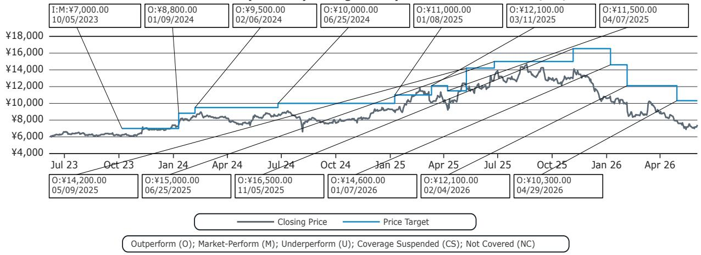

line

| Date       | Closing Price | Price Target |
|------------|---------------|--------------|
| 10/05/2023 | $7,000.00     | -            |
| 01/09/2024 | $8,800.00     | -            |
| 02/06/2024 | $9,500.00     | -            |
| 06/25/2024 | $10,000.00    | -            |
| 01/08/2025 | $11,000.00    | -            |
| 03/11/2025 | $12,100.00    | -            |
| 04/07/2025 | $11,500.00    | -            |
| 05/09/2025 | $14,200.00    | -            |
| 06/25/2025 | $15,000.00    | -            |
| 11/05/2025 | $16,500.00    | -            |
| 01/07/2026 | $14,600.00    | -            |
| 02/04/2026 | $12,100.00    | -            |
| 04/29/2026 | $10,300.00    | -            |

Konami Group Corporation (9766.JP) Rating History for Bernstein as of 06/02/2026   
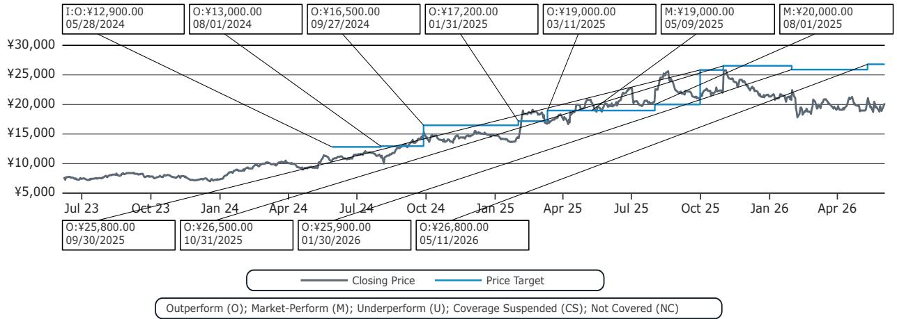

line

| Date       | Closing Price | Price Target |
|------------|---------------|--------------|
| 05/28/2024 | ¥12,900.00    | -            |
| 08/01/2024 | -             | ¥13,000.00   |
| 09/27/2024 | -             | ¥16,500.00   |
| 01/31/2025 | -             | ¥17,200.00   |
| 03/11/2025 | -             | ¥19,000.00   |
| 05/09/2025 | -             | ¥19,000.00   |
| 08/01/2025 | -             | ¥20,000.00   |
| 09/30/2025 | -             | ¥25,800.00   |
| 10/31/2025 | -             | ¥26,500.00   |
| 01/30/2026 | -             | ¥25,900.00   |
| 05/11/2026 | -             | ¥26,800.00   |

Capcom Co Ltd (9697.JP) Rating History for Bernstein as of 06/02/2026   
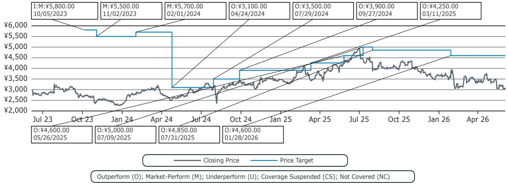

line

| Date       | Closing Price | Price Target |
|------------|---------------|--------------|
| 10/05/2023 | $5,800.00     | $5,800.00    |
| 11/02/2023 | $5,500.00     | $5,500.00    |
| 02/01/2024 | $5,700.00     | $5,700.00    |
| 04/24/2024 | $3,100.00     | $3,100.00    |
| 07/29/2024 | $3,500.00     | $3,500.00    |
| 09/27/2024 | $3,900.00     | $3,900.00    |
| 03/11/2025 | $4,250.00     | $4,250.00    |
| 05/26/2025 | $4,600.00     | $4,600.00    |
| 07/09/2025 | $5,000.00     | $5,000.00    |
| 07/31/2025 | $4,850.00     | $4,850.00    |
| 01/28/2026 | $4,600.00     | $4,600.00    |

Bandai Namco Holdings Inc (7832.JP) Rating History for Bernstein as of 06/02/2026   
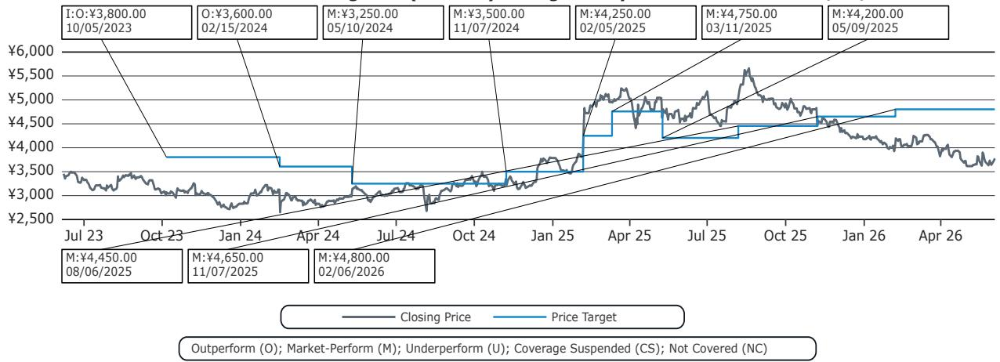

line

| Date       | Closing Price | Price Target |
| ---------- | ------------- | ------------ |
| 10/05/2023 | $3,800.00     | -            |
| 02/15/2024 | $3,600.00     | -            |
| 05/10/2024 | $3,250.00     | -            |
| 11/07/2024 | $3,500.00     | -            |
| 02/05/2025 | $4,250.00     | -            |
| 03/11/2025 | $4,750.00     | -            |
| 05/09/2025 | $4,200.00     | -            |
| 08/06/2025 | $4,450.00     | -            |
| 11/07/2025 | $4,650.00     | -            |
| 02/06/2026 | $4,800.00     | -            |

Nexon Co Ltd (3659.JP) Rating History for Bernstein as of 06/02/2026   
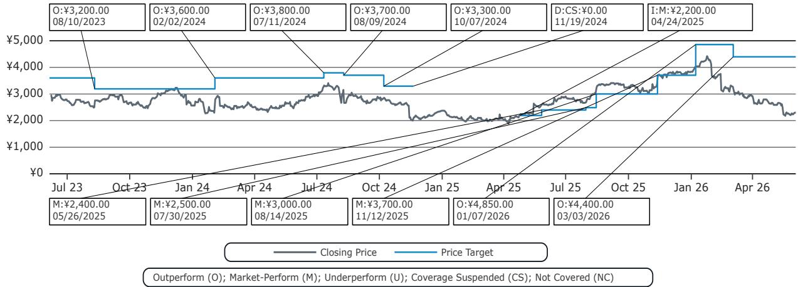

line

| Date       | Closing Price | Price Target |
|------------|---------------|--------------|
| 08/10/2023 | ¥3,200.00     | ¥3,200.00    |
| 02/02/2024 | ¥3,600.00     | ¥3,600.00    |
| 07/11/2024 | ¥3,800.00     | ¥3,800.00    |
| 08/09/2024 | ¥3,700.00     | ¥3,700.00    |
| 10/07/2024 | ¥3,300.00     | ¥3,300.00    |
| 11/19/2024 | ¥3,00.00      | ¥3,00.00     |
| 04/24/2025 | ¥2,200.00     | ¥2,200.00    |
| 05/26/2025 | ¥2,400.00     | ¥2,400.00    |
| 07/30/2025 | ¥2,500.00     | ¥2,500.00    |
| 08/14/2025 | ¥3,000.00     | ¥3,000.00    |
| 11/12/2025 | ¥3,700.00     | ¥3,700.00    |
| 01/07/2026 | ¥4,850.00     | ¥4,850.00    |
| 03/03/2026 | ¥4,400.00     | ¥4,400.00    |

Square Enix Holdings Co Ltd. (9684.JP) Rating History for Bernstein as of 06/02/2026   
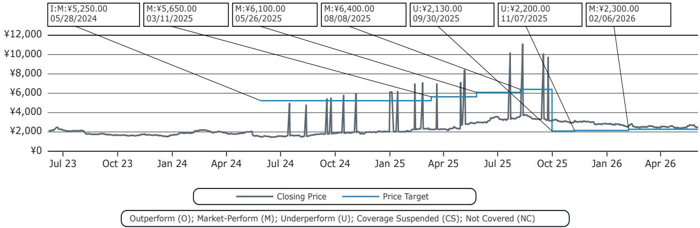

bar_line

| Date       | Closing Price | Price Target |
| ---------- | ------------- | ------------ |
| 05/28/2024 | ¥5,250.00     | -            |
| 03/11/2025 | -             | ¥5,650.00    |
| 05/26/2025 | -             | ¥6,100.00    |
| 08/08/2025 | -             | ¥6,400.00    |
| 09/30/2025 | -             | ¥2,130.00    |
| 11/07/2025 | -             | ¥2,200.00    |
| 02/06/2026 | -             | ¥2,300.00    |

All price target and closing price data in the chart(s) above are denominated in the currency noted in the Ticker Table of this report.

# OTHER MATTERS

The legal entity(ies) employing the analyst(s) listed in this report, and their location, can be determined by the country code of their phone number, as follows:

+1 Bernstein Institutional Services LLC; New York, New York, USA

+44 Bernstein Autonomous LLP; London UK

+212 SG Africa Technologies & Services; Casablanca, Morocco

+33 BSG France S.A.; Paris, France

+34 BSG France S.A.; Madrid, Spain

+41 Bernstein Autonomous LLP; Geneva, Switzerland

+49 BSG France S.A.; Frankfurt, Germany

+91 Bernstein (India) Private Limited; Mumbai, India

+852 Bernstein (Hong Kong) Limited 盛博香港有限公司; Hong Kong, China

+65 Bernstein (Singapore) Private Limited; Singapore

+81 Bernstein Japan KK; Tokyo, Japan

Where this report has been prepared by research analyst(s) employed by a non-US affiliate, such analyst(s), is/are (unless otherwise expressly noted below) not registered as associated persons of Bernstein Institutional Services LLC or any other SEC-registered broker-dealer and are not licensed or qualified as research analysts with FINRA. Accordingly, such analyst(s) may not be subject to FINRA's restrictions regarding (among other things) communications by research analysts with a subject company, interactions between research analysts and investment banking personnel, participation by research analysts in solicitation and marketing activities relating to investment banking transactions, public appearances by research analysts, and trading securities held by a research analyst account.

Where this report has been prepared by research analyst(s) employed by SG Africa Technologies & Services (part of the SG group of companies), it has been prepared on behalf of a Bernstein company under a Global Services Agreement in place between Bernstein and SG.

# CERTIFICATION

Each research analyst listed in this report, who is primarily responsible for the preparation of the content of this report, certifies that all of the views expressed in this publication accurately reflect that analyst's personal views about any and all of the subject securities or issuers and that no part of that analyst's compensation was, is, or will be, directly or indirectly, related to the specific recommendations or views in this publication.

# II. ADDITIONAL GLOBAL CONFLICT DISCLOSURES

It is at the sole discretion of the Firm as to when to initiate, update and cease research coverage. The Firm has established, maintains and relies on information barriers to control the flow of information contained in one or more areas (i.e., the private side) within the Firm, and into other areas, units, groups or affiliates (i.e., public side) of the Firm.

# III. OTHER IMPORTANT INFORMATION AND DISCLOSURES

Separate branding is maintained for “Bernstein” and “Autonomous” research products.

- Bernstein produces a number of different types of research products including, among others, fundamental analysis and quantitative analysis under both the “Autonomous” and “Bernstein” brands. Recommendations contained within one type of research product may differ from recommendations contained within other types of research products, whether as a result of differing time horizons, methodologies or otherwise. Furthermore, views or recommendations within a research product issued under one brand may differ from views or recommendations under the same type of research product issued under the other brand. The Research Ratings System for the two brands and other information related to those Rating Systems are included in the previous section.   
- Autonomous operates as a separate business unit within the following entities: Bernstein Institutional Services LLC, Bernstein Autonomous LLP, Bernstein (Hong Kong) Limited 盛博香港有限公司 and Bernstein (India) Private Limited. For information relating to “Autonomous” branded products (including certain Sales materials) please visit: www.autonomous.com. For information relating to Bernstein branded products please visit: www.bernsteinresearch.com.

Analysts are compensated based on aggregate contributions to the research franchise as measured by account penetration, productivity and proactivity of investment ideas. No analysts are compensated based on performance in, or contributions to, generating investment banking revenues.

This report has been produced by an independent analyst as defined in Article 3 (1)(34)(i) of EU 596/2014 Market Abuse Regulation (“MAR”) and the same article of MAR as it forms part of United Kingdom domestic law by virtue of the European Union (Withdrawal) Act 2018.

To our readers in the United States: Bernstein Institutional Services LLC, a broker-dealer registered with the U.S. Securities and Exchange Commission (“SEC”) and a member of the U.S. Financial Industry Regulatory Authority, Inc. (“FINRA”) is distributing this publication in the United States and accepts responsibility for its contents. Where this material contains an analysis of debt product(s), such material is intended only for institutional investors and is not subject to the US independence and disclosure standards applicable to debt research prepared for retail investors.

Bernstein Institutional Services LLC may act as principal for its own account or as agent for another person (including an affiliate) in sales or purchases of any security which is a subject of this report. This report does not purport to meet the objectives or needs of any specific individuals, entities or accounts.

To our readers in Canada: If this publication pertains to a Canadian domiciled company, it is being distributed in Canada by Bernstein (Canada) Limited, which is licensed and regulated by the Canadian Investment Regulatory Organization. If the publication pertains to a non-Canadian domiciled company, it is being distributed by Bernstein Institutional Services LLC, which is licensed and regulated by both the SEC and FINRA, into Canada under the International Dealers Exemption.

This document may not be passed onto any person in Canada unless that person qualifies as "permitted client" as defined in Section 1.1 of NI 31-103.

To our readers in Brazil: This report has been prepared by Bernstein Institutional Services LLC, and Banco BTG Pactual S.A. ("BTG") is responsible for the distribution of this report in Brazil.

To readers in the United Kingdom: This publication has been issued or approved for issue in the United Kingdom by Bernstein Autonomous LLP, authorised and regulated by the Financial Conduct Authority and located at 60 London Wall, London EC2M 5SH, +44 (0)20-7170-5000. Registered in England & Wales No OC343985.

This document is for distribution only to persons who (i) have professional experience in matters relating to investments falling within Article 19(5) of the Financial Services and Markets Act 2000 (Financial Promotion) Order 2005 (as amended, the “Financial Promotion Order”), (ii) are persons falling within Article 49(2)(a) to (d) (“high net worth companies, unincorporated associations, etc.”) of the Financial Promotion Order, (iii) are outside the United Kingdom, or (iv) are persons to whom an invitation or inducement to engage in investment activity (within the meaning of section 21 of the FSMA) in connection with the issue or sale of any securities may otherwise lawfully be communicated or caused to be communicated (all such persons together being referred to as “relevant persons”). This document is directed only at relevant persons and must not be acted on or relied on by persons who are not relevant persons. Any investment or investment activity to which this document relates is available only to relevant persons and will be engaged in only with relevant persons.

To our readers in the member states of the EEA: This publication is being distributed by BSG France SA, which is authorised and regulated by the Autorité de Contrôle Prudentiel et de Résolution (ACPR) and Autorité des Marchés Financiers (AMF).

To our readers in Hong Kong: This publication is being distributed in Hong Kong by Bernstein (Hong Kong) Limited 盛博香港有限公司, which is licensed and regulated by the Hong Kong Securities and Futures Commission (Central Entity No. AXC846) to carry out Type 4 (Advising on Securities) regulated activities and subject to the licensing conditions mentioned in the SFC Public Register (https://www.sfc.hk/publicregWeb/corp/AXC846/details)). This publication is solely for professional investors, as defined in the Securities and Futures Ordinance (Cap. 571). The purpose of this report is solely to provide an analysis of the issuers referred to in this report and is not intended for any purpose contrary to the laws of Hong Kong.

To our readers in Singapore: This publication is being distributed in Singapore by Bernstein (Singapore) Private Limited, only to accredited investors or institutional investors, as defined in the Securities and Futures Act 2001 of Singapore ("SFA"). Recipients in Singapore should contact Bernstein (Singapore) Private Limited in respect of matters arising from, or in connection with, this publication. Bernstein (Singapore) Private Limited is regulated by the Monetary Authority of Singapore and licensed under the SFA as a capital markets services licence holder for dealing in capital markets products that are securities and collective investment schemes and an exempt financial adviser for advising on, issuing and promulgating analyses and reports on securities. Bernstein (Singapore) Private Limited is registered in Singapore with Company Registration No. 20213710W and located at One Raffles Quay, #27-11 South Tower, Singapore 048583, +65-6230-4612.

To our readers in the People's Republic of China: The securities referred to in this document are not being offered or sold and may not be offered or sold, directly or indirectly, in the People's Republic of China (for such purposes, not including the Hong Kong and Macau Special Administrative Regions or Taiwan, the "PRC") in contravention of any applicable laws of the PRC.

This document does not constitute an offer to sell or the solicitation of an offer to buy any securities in the PRC to any person to whom it is unlawful to make the offer or solicitation in the PRC.

We do not represent that this document may be lawfully distributed, or that any securities may be lawfully offered, in compliance with any applicable registration or other requirements in the PRC, or pursuant to an exemption available thereunder, or assume any responsibility for facilitating any such distribution or offering. In particular, no action has been taken by us which would permit a public offering of any securities or distribution of this document in the PRC. Accordingly, the securities are not being offered or sold within the PRC by means of this document or any other document. Neither this document nor any advertisement or other offering material may be distributed or published in the PRC, except under circumstances that will result in compliance with any applicable laws and regulations.

To our readers in Japan: This publication is being distributed in Japan by Bernstein Japan KK (サンフォード・C・バーンスタイン株式会社), which is registered in Japan as a Financial Instruments Business Operator with the Kanto Local Finance Bureau (registration number: The Director-General of Kanto Local Finance Bureau (FIBO) No.3387) and regulated by the Financial Services Agency. It is also a member of Japan Investment Advisers Association. This publication is solely for qualified institutional investors in Japan only, as defined in Article 2, paragraph (3), items (i) of the Financial Instruments and Exchange Act.

For the institutional client readers in Japan who have been granted access to the Bernstein website by Daiwa Group Inc. ("Daiwa"), your access to this document should not be construed as meaning that Bernstein is providing you with investment advice for any purposes. Whilst Bernstein has prepared this document, your relationship is, and will remain with, Daiwa, and Bernstein has neither any contractual relationship with you nor any obligations towards you.

To our readers in Australia: Bernstein (Hong Kong) Limited 盛博香港有限公司 is responsible for distributing research in Australia. It is regulated by the Securities and Exchange Commission under U.S. laws, by the Financial Conduct Authority under U.K. laws, which differs from Australian laws. Bernstein (Hong Kong) Limited 盛博香港有限公司 is exempt from the requirement to hold an Australian financial services license under the Corporations Act 2001 in respect of the provision of the following financial services to wholesale clients:

• providing financial product advice;   
• dealing in a financial product;   
• making a market for a financial product; and   
• providing a custodial or depository service.

To our readers in India: This publication is being distributed in India by Bernstein (India) Private Limited (SCB India) which is licensed and regulated by Securities and Exchange Board of India ("SEBI") as a research analyst entity under the SEBI (Research Analyst) Regulations, 2014, having registration no. INH000006378 and as a stock broker having registration no. INZ000213537. SCB India is currently engaged in the business of providing research and stock broking services. Please refer to www.bernsteinresearch.in for more information.

- SCB India is a Private limited company incorporated under the Companies Act, 2013, on April 12, 2017 bearing corporate identification number U65999MH2017FTC293762, and registered office at Level 3A, 4th Floor, First International Financial Centre, Plot Nos C-54 and C-55, G Block, Near CBI Office, Bandra Kurla Complex, Bandra (East), Mumbai 400098, Maharashtra, India (Phone No: +91-22-68421401).   
- For details of Associates (i.e., affiliates/group companies) of SCB India, kindly email MUM-BERNSTEIN-InCompliance@bernsteinsg.com.   
• SCB India does not have any disciplinary history as on the date of this report.   
- Except as noted above, SCB India and/or its Associates (i.e., affiliates/group companies), the Research Analysts authoring this report, and their relatives

• do not have any financial interest in the subject company   
• do not have actual/beneficial ownership of one percent or more in securities of the subject company;   
- is not engaged in any investment banking activities for Indian companies, as such;   
• have not managed or co-managed a public offering in the past twelve months for any Indian companies;   
- have not received any compensation for investment banking services or merchant banking services from the subject company in the past 12 months;   
• have not received compensation for brokerage services from the subject company in the past twelve months;   
- have not received any compensation or other benefits from the subject company or third party related to the specific recommendations or views in this report; and   
- do not currently, but may in the future, act as a market maker in the financial instruments of the companies covered in the report.   
- do not have any conflict of interest in the subject company as of the date of this report.

- Except as noted above, the subject company has not been a client of SCB India during twelve months preceding the date of distribution of this research report. Neither SCB India nor its Associates (i.e., affiliates/group companies) have received compensation for products or services other than investment banking, merchant banking or brokerage services from the subject company in the past twelve months.   
- The principal research analyst(s) who prepared this report, members of the analysts' team, and members of their households are not an officer, director, employee or advisory board member of the companies covered in the report.   
- Our Compliance officer / Grievance officer is Ms. Rupal Talati, who can be reached at +91-22-68421451, or MUM-BERNSTEIN-InCompliance@bernsteinsg.com / Scbin-investorgrievance@bernsteinsg.com   
- The Research investor charter and Terms & Conditions of SCB India are available on its website and may be accessed at Bernstein (India) Private Limited (https://bernsteinresearch.in/) for your reference.   
- Disclaimer: Registration granted by SEBI, and certification from NISM, is in no way a guarantee of performance of the intermediary or provide any assurance of returns to investors. Investments in securities market are subject to market risks. Read all the related documents carefully before investing.

To our readers in Switzerland: This document is provided in Switzerland by or through Bernstein Autonomous LLP, and is provided only to qualified investors as defined in article 10 of the Swiss Collective Investment Scheme Act (“CISA”) and related provisions of the Collective Investment Scheme Ordinance and in strict compliance with applicable Swiss law and regulations. The products mentioned in this document may not be suitable for all types of investors. This document is based on the Directives on the Independence of Financial Research issued by the Swiss Bankers Association (SBA) in January 2008.

To our readers in the Middle East: Bernstein Autonomous LLP, DIFC branch has its principal office at Gate Village 06, DIFC, Dubai, UAE. Bernstein Autonomous LLP, DIFC branch is regulated by the Dubai Financial Services Authority (DFSA) with the registration number CL10040 and is provisioned for Arranging Deals in Investments and Advising on Financial Products. All communications and services are directed at Professional Clients and Market Counterparties only (as defined in the DFSA rulebook). Persons other than Professional Clients and Market Counterparties, such as Retail Clients, are not the intended recipients of our communications or services.

# LEGAL

All research publications are disseminated to our clients through posting on the firm's password protected websites, bernsteinresearch.com and autonomous.com. Certain, but not all, research publications are also made available to clients through third-party vendors or redistributed to clients through alternate electronic means as a convenience.

This publication has been published and distributed in accordance with the Firm's policy for management of conflicts of interest in investment research, a copy of which is available from Bernstein Institutional Services LLC, Director of Compliance, 245 Park Avenue, New York, NY 10167. Additional disclosures and information regarding Bernstein's business are available on our website www.bernsteinresearch.com.

The securities described herein may not be eligible for sale in all jurisdictions or to certain categories of investors where that permission profile is not consistent with the licenses held by the entities noted herein. This document is for distribution only as may be permitted by law. This publication is not directed to, or intended for distribution to or use by, any person or entity who is a citizen or resident of, or located in any locality, state, country or other jurisdiction where such distribution, publication, availability or use would be contrary to law or regulation or which would subject any of the entities referenced herein or any of their subsidiaries or affiliates to any registration or licensing requirement within such jurisdiction. This publication is based upon public sources we believe to be reliable, but no representation is made by us that the publication is accurate or complete. We do not undertake to advise you of any change in the reported information or in the opinions herein. This publication was prepared and issued by entity referred to herein for distribution to eligible counterparties or professional clients. This publication is not an offer to buy or sell any security, and it does not constitute investment, legal or tax advice. The investments referred to herein may not be suitable for you. Investors must make their own investment decisions in consultation with their professional advisors in light of their specific circumstances. The value of investments may fluctuate, and investments that are denominated in foreign currencies may fluctuate in value as a result of exposure to exchange rate movements. Information about past performance of an investment is not necessarily a guide to, indicator of, or assurance of, future performance.

This report is directed to and intended only for our clients who are “eligible counterparties”, “professional clients”, “institutional investors” and/or “professional investors” as defined by the aforementioned regulators, and must not be redistributed to retail clients as defined by the aforementioned regulators. Retail clients who receive this report should note that the services of the entities noted herein are not available to them and should not rely on the material herein to make an investment decision. The result of such act will not hold the entities noted herein liable for any loss thus incurred as the entities noted herein are not registered/ authorised/ licensed to deal with retail clients and will not enter into any contractual agreement/arrangement with retail clients. This report is provided subject to the terms and conditions of any agreement that the clients may have entered into with the entities noted herein. All research reports are disseminated on a simultaneous basis to eligible clients through electronic publication to our client portal.

The information in this report was prepared by Bernstein solely for the internal business use of our clients. Clients may store, display, analyze, reformat and print the information in this report for this limited use only. Clients may not copy, alter, create derivative works, resell, reverse engineer, commercially exploit, share or distribute any part of the information contained herein for any purpose without Bernstein's express written consent. These restrictions include extracting data or using the content to develop indices or other products. Further, you may not use this report, or any portion of this report, to train or finetune any third-party machine learning or artificial intelligence system, or as a prompt or input into any such system. You also may not, without Bernstein's express written consent, do any of the foregoing in connection with your own internal machine learning or artificial intelligence system.

Bernstein may use artificial intelligence tools in the preparation of its materials. Any such materials are reviewed by Bernstein's research analysts prior to publication.

This report has been prepared for information purposes only and is based on current public information that we consider reliable, but the entities noted herein do not warrant or represent (express or implied) as to the sources of information or data contained herein are accurate, complete, not misleading or as to its fitness for the purpose intended even though the entities noted herein rely on reputable or trustworthy data providers, it should not be relied upon as such. Opinions expressed are the author(s)' current opinions as of the date appearing on the material only and we do not undertake to advise you of any change in the reported information or in the opinions herein.

This publication was prepared and issued by the entity referred to herein for distribution to eligible counterparties or professional clients. The information in this report is intended for general circulation and does not constitute an offer to buy or sell any security, investment, legal or tax advice nor a personal recommendation, as defined by any of the aforementioned regulators. It does not take into account the particular investment objectives, financial situations, or needs of individual investors. The report has not been reviewed by any of the aforementioned regulators and does not represent any official recommendation from the aforementioned regulators. The investments referred to herein may not be suitable for you. Investors must make their own investment decisions in consultation with advice sought from a financial adviser regarding the suitability of the investment product, taking into account the specific investment objectives, financial situation or particular needs of any recipient of the recommendation, before the recipient makes a commitment to purchase the investment product.

The analysis contained herein is based on numerous assumptions. Different assumptions could result in materially different results. The information in this report does not constitute, or form part of, any offer to sell or issue, or any offer to purchase or subscribe for shares, or to induce engage in any other investment activity. The value of any securities or financial instruments mentioned in this report may fluctuate subject to market conditions. Information about past performance of an investment is not necessarily a guide to, indicative of, or assurance of future performance. Estimates of future performance mentioned by the research analyst in this report are based on assumptions that may not be realized due to unforeseen factors like market volatility/fluctuation. In relation to securities or financial instruments denominated in a foreign currency other than the clients' home currency, movements in exchange rates will have an effect on the value, either favorable or unfavorable. Before acting on any recommendations in this report, recipients should consider the appropriateness of investing in the subject securities or financial instruments mentioned in this report and, if necessary, seek for independent professional advice.

The securities described herein may not be eligible for sale in all jurisdictions or to certain categories of investors where that permission profile is not consistent with the licenses held by the entities noted herein. This document is for distribution only as may be permitted by law. It is not directed to, or intended for distribution to or use by, any person or entity who is a citizen or resident of or located in any locality, state, country or other jurisdiction where such distribution, publication, availability or use would be contrary to law or regulation or would subject the entities noted herein to any regulation or licensing requirement within such jurisdiction.

Source: Bloomberg Index Services Limited. BLOOMBERG® is a trademark and service mark of Bloomberg Finance L.P. and its affiliates (collectively “Bloomberg”). Bloomberg or Bloomberg’s licensors own all proprietary rights in the Bloomberg Indices. Neither Bloomberg nor Bloomberg’s licensors approves or endorses this material, or guarantees the accuracy or completeness of any information herein, or makes any warranty, express or implied, as to the results to be obtained therefrom and, to the maximum extent allowed by law, neither shall have any liability or responsibility for injury or damages arising in connection therewith.

No part of this material may be reproduced, distributed or transmitted or otherwise made available without prior consent of the entities noted herein. Copyright Bernstein Institutional Services LLC Bernstein Autonomous LLP, BSG France S.A., Bernstein (Hong Kong) Limited 盛博香港有限公司, Bernstein (Canada) Limited, Bernstein (India) Private Limited (SEBI registration no. INH000006378), Bernstein (Singapore) Private Limited and Bernstein Japan KK (サンフォード・C・バーンスタイン株式会社). All rights reserved. The trademarks and service marks contained herein are the property of their respective owners. Any unauthorized use or disclosure is strictly prohibited. The entities noted herein may pursue legal action if the unauthorized use results in any defamation and/or reputational risk to the entities noted herein and research published under the Bernstein and Autonomous brands.