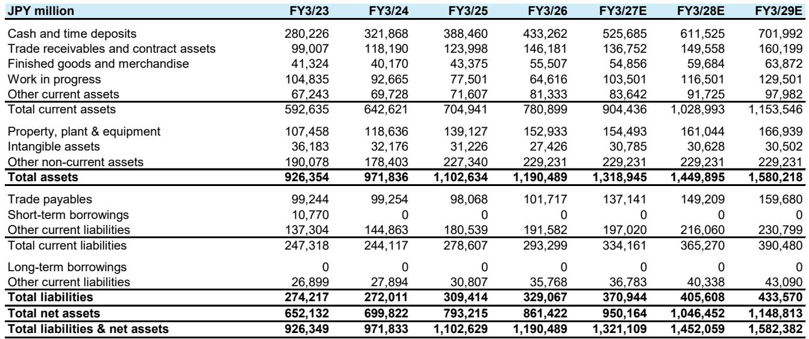
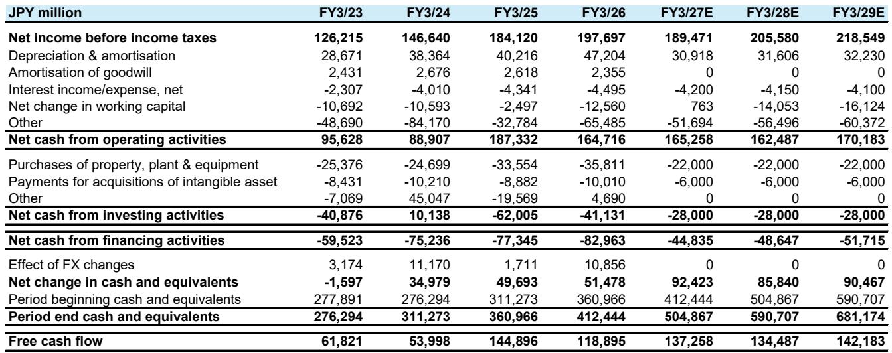
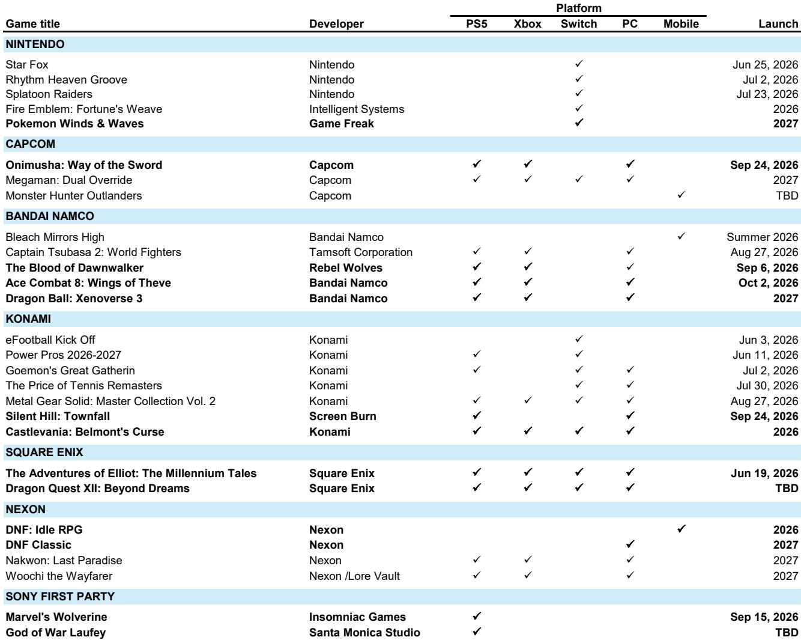

# 日本游戏股被低估的不是业绩，而是AI带来的供给侧重塑

2026年过半，日本游戏板块的投资者正经历一种罕见的情绪：公司基本面强劲，但股价却持续承压。某外资投行最新发布的日本游戏行业季度报告直言，这是一个“令人沮丧的年份”。AI资本开支主题的资金虹吸效应，导致优质游戏公司的估值倍数持续压缩，即便那些盈利增速有望达到双位数的企业，当前PE也已显著低于多年均值。

但这份报告真正值得关注的判断，并非“估值便宜”，而是：**市场正在用旧框架定价新逻辑**。

投资者将日本游戏公司简单归入“消费者可选”或“内容制造”类别，忽视了AI正在从供给侧重塑游戏开发的成本结构、产能上限和竞争门槛。当Capcom将3,000-5,000小时的人工测试压缩至72小时，当月度自动化测试量达到3万小时，这不是成本节约的故事，而是产能释放的拐点。

报告的核心张力在于：一边是AI带来的供给侧革命，另一边是市场因AI主题而忽视这些公司。这种错位，恰恰是当前最值得关注的定价机会。

## 1. Capcom和Konami处于“业绩超预期、估值低水位”的罕见交集

报告中最清晰的信号来自两家公司：Capcom和Konami。它们不是AI资本开支的直接受益者，但它们在执行层面几乎没有瑕疵。

Capcom的新作Pragmata销量已超过公司计入FY3/27E指引的预期，而《怪物猎人：荒野》资料片的宣布概率正在上升。更关键的是，Capcom正在将AI工具嵌入核心开发流程：与Google合作，将人工测试时间从数千小时压缩至72小时，每月运行3万小时的AI辅助测试。报告认为，这正在帮助Capcom实现更密集的发布节奏，中型IP的产出能力明显提升。

Konami方面，eFootball在4-5月的增长数据非常强劲，Sensor Tower的数据得到公司确认。市场对世界杯后变现回落的担忧仍在，但用户增长本身强劲，加上平台费率下降的利好将在未来两年逐步释放——且公司明确表示，这部分节省将大部分转化为运营利润。

两家公司当前前向PE均显著低于长期均值。报告将其定位为“steady compounders with long growth runways”，且Q1业绩大概率超预期。

## 2. 市场用“AI输家”的标签定价任天堂，但供给侧逻辑同样适用于它

任天堂是当前板块中情绪最极端的案例。由于内存价格上涨直接侵蚀硬件利润，加之2026年被普遍视为Switch 2的过渡年，许多投资者将其归入“memory losers”篮筐。报告指出，2026年对任天堂而言几乎被定义为“write-off”。

但这里有一个被忽视的维度：任天堂在最近的投资者交流中暗示，愿意使用重制版作品来补充第一方发布节奏。这听起来像是短期补位策略，但报告认为，这实际上打开了更长期的可能——如果AI能够加速开发流程，任天堂完全有可能突破其传统上缓慢的第一方发布频率。

报告对任天堂的定位是：2027年的产品线可能比市场预期的更强，而当前估值已反映了最悲观的假设。Pokemon Wind & Waves已经确认，加上可能的重制版阵容，2027年的反弹概率正在上升。

## 3. Square Enix和Bandai Namco的改善是结构性的，但仍有悬而未决的问题

Square Enix是报告中最令人意外的正面信号。过去几年，这家公司被视为日本主机游戏行业困境的代名词。但报告指出，目录销售的增长和Switch 2版本的发布正在抬高其HD游戏部门的盈利底部。任天堂愿意将重制版作品纳入第一方发布阵容，对Square Enix的IP授权收入也是正面信号。

不过，Dragon Quest XII开发的最新延期，表明管理层面临的挑战尚未完全解决。报告将其描述为：基本面底部在抬高，但上行催化仍需等待下一个中期计划。

Bandai Namco的情况则更复杂。公司指引要求FY3/27E下半财年数字业务利润大幅跃升，但报告在交流中未能找到清晰的实现路径。Dragon Ball Xenoverse 3已被合作伙伴确认为FY3/28E的作品，意味着下半财年的业绩压力并未缓解。玩具与手办业务继续超预期，但数字业务的缺口仍是一个悬而未决的问题。

## 4. GTA VI可能成为日本游戏股的“清算事件”

报告提出了一个值得深思的框架：GTA VI的发布可能不是一个竞争威胁，而是一个“clearing event”。

逻辑如下：市场对2026年底行业增长加速的共识预期，很大程度上依赖于GTA VI的销售。但日本主要游戏公司几乎都刻意避开了2026年圣诞档期。这意味着，当GTA VI如期引爆全球销售时，日本公司不会直接受益于销量，但也不会受到冲击。

更重要的是，GTA VI的发布可能改变全球游戏投资的资金流向。当前，资金从日本游戏板块流向AI主题的趋势非常明显。但如果GTA VI的成功重新激活市场对游戏行业本身的关注，那些被忽视的优质日本公司可能成为资金再平衡的受益者。

报告没有给出明确的时点判断，但提出了一个关键问题：当AI叙事出现任何疲劳迹象时，那些估值处于多年低点、盈利增长轨迹清晰的日本游戏股，是否会成为最直接的替代选择？

## 5. 报告没有完全回答的三个关键问题

这份报告提供了清晰的判断框架，但也留下了几个值得深入讨论的问题：

第一，AI带来的产能提升，究竟能在多大程度上转化为收入和利润增长？Capcom的案例令人鼓舞，但其他公司的AI应用仍处于早期。产能释放的规模和时间表，目前仍缺乏可量化的预测。

第二，平台费率下降的利好是否会被竞争加剧所抵消？Konami是平台费率下降的明确受益者，但这一趋势对所有公司是否对称？报告没有展开。

第三，GTA VI作为“clearing event”的假设需要什么条件才能成立？如果AI叙事持续强势，资金是否仍然会留在AI主题中，即便游戏公司的估值更具吸引力？这涉及到对宏观资金流向的判断，超出了这份报告的覆盖范围。

这些问题恰恰是深入研究日本游戏板块的核心价值所在——它们不是简单的“买还是卖”，而是关于定价框架的重新构建。

---

欢迎来星球微信群里继续讨论。我们将围绕这份报告的未尽问题，展开更细致的拆解：AI对游戏开发成本曲线的实际影响如何建模？GTA VI发布前后的资金流向历史数据如何解读？日本游戏公司的估值折价是否已经进入“过度”区间？这些讨论将帮助你把研报的洞察转化为可操作的观察框架。

Personal reading notes and learning share only. Not investment advice.

