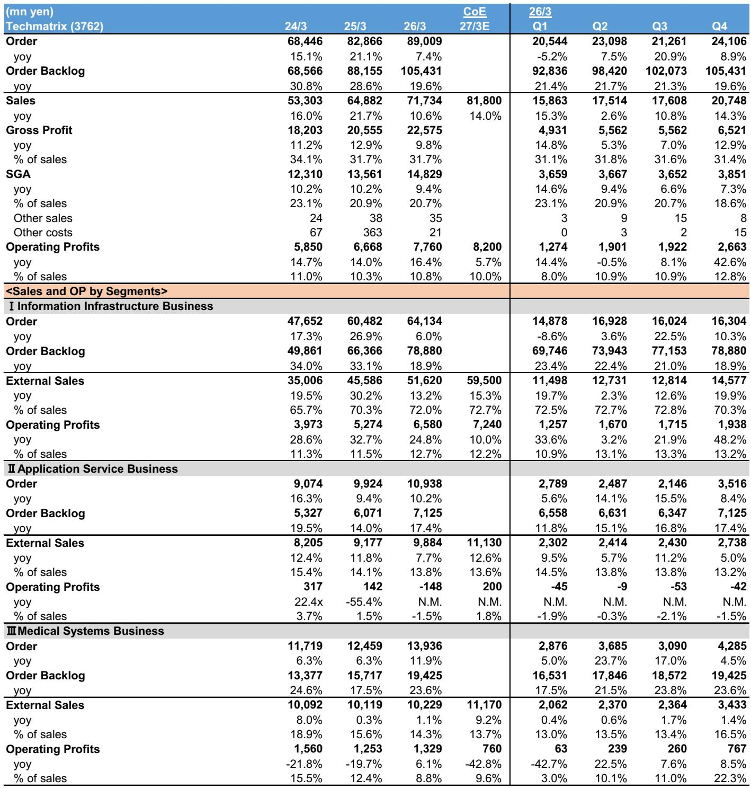
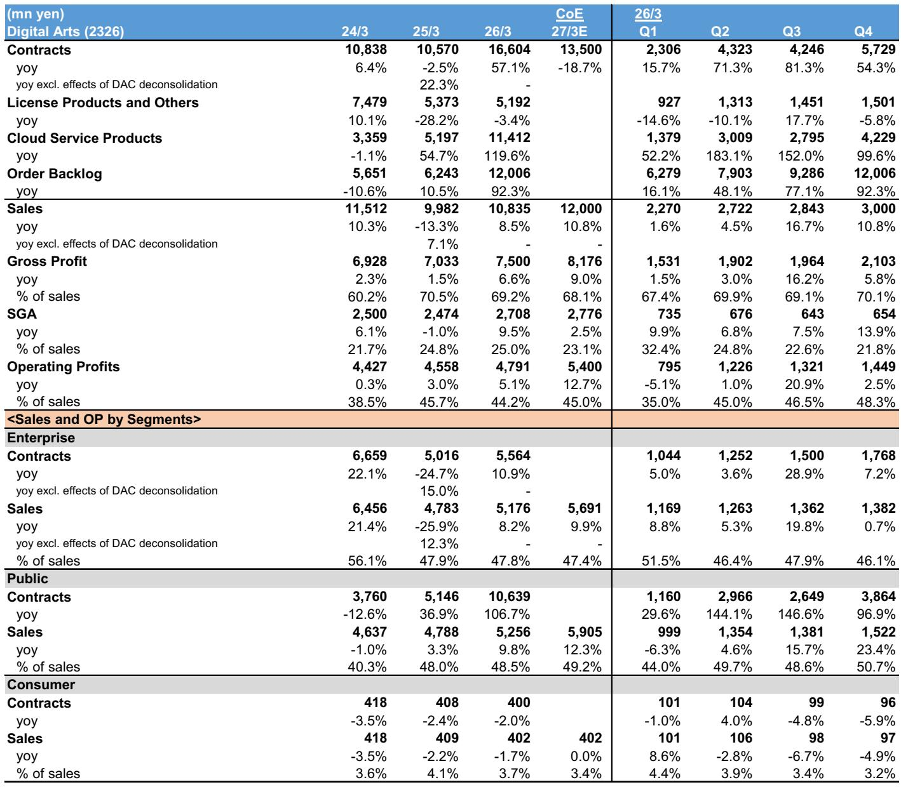

# Japan's Cybersecurity Sector Is Growing, But the Leaders Are Being Held Back by Their Own Ambitions

The Japanese cybersecurity market is experiencing a genuine structural tailwind. Demand for network security, cloud-based filtering, and compliance-driven investment is rising across both public and enterprise sectors. A forthcoming security measures evaluation system from the Ministry of Economy, Trade and Industry (METI) is expected to accelerate corporate spending. This should be a clear positive for the domestic earnings of established players like Trend Micro and for resellers such as Otsuka.

Yet a close examination of two key, non-covered security vendors reveals a more complicated picture. Techmatrix and Digital Arts both reported results and guidance that fell short of their medium-term targets. Their challenges are not due to a lack of demand. Instead, they stem from strategic decisions that create near-term earnings drag: an acquisition that requires years of upfront investment, a brutal price war in the education technology segment, and the ongoing costs of transitioning from on-premise to cloud architectures.

The core argument of this analysis is straightforward: the Japanese IT services sector is at an inflection point where structural demand for cybersecurity is strong, but company-specific execution risks and portfolio choices are creating significant divergence in performance. Investors cannot simply buy the theme. They must differentiate between companies that are managing these transitions effectively and those that are being weighed down by their own strategic bets.

The following sections unpack the read-across from these two vendors, identify the patterns that matter for the broader sector, and offer a decision framework for evaluating which companies are likely to emerge stronger.

## The Security Tailwind Is Real, But It Is Not Lifting All Boats Equally

The most important takeaway from the report is that security-related demand remains robust. Techmatrix's information infrastructure business, which focuses on network security, saw operating profits rise by 48% year-over-year in the fourth quarter. On an underlying basis, excluding a one-off factor, growth was still 35%. The company's order value for next-generation firewalls, SOC automation, and mail security products increased by 10% year-over-year in the same quarter. This is not a market that is softening.

However, this strength is concentrated in specific product categories and customer segments. Techmatrix's growth is being driven by a handful of high-value products from US vendors like Palo Alto Networks and Proofpoint. The company's standalone recurring sales ratio of 88% provides earnings stability, but it also means that growth is heavily dependent on the renewal and upsell cycle of these specific solutions. For a company like Digital Arts, which competes more directly in the web filtering and school security space, the demand picture is far more contested.

The implication for the broader sector is that the security tailwind is real but not uniform. Companies with a strong position in next-generation network security and cloud-based solutions are benefiting disproportionately. Those with exposure to legacy on-premise products or to segments where competition is intensifying are seeing their margins squeezed. The METI evaluation system will likely widen this gap, as it will reward vendors with comprehensive, modern security portfolios.

## Techmatrix's Growth Engine Is Strong, But Its Medical Acquisition Is a Multi-Year Drag

Techmatrix presents a clear case of a company with a strong core business that is being obscured by a strategic acquisition. The information infrastructure business is performing exceptionally well. Operating profit guidance for FY3/27 calls for a 10% year-over-year increase, driven by sustained demand for cloud-based security products. The company is also less susceptible to supply chain issues, as its main products are software-based and storage products account for less than 3% of segment sales.

The problem lies in the medical systems business, specifically the consolidation of Medmain, a provider of AI software and cloud services for pathological diagnosis support. This acquisition is expected to depress operating profits by approximately 400 million yen in FY3/27. The company's guidance for the medical segment calls for a 43% year-over-year decline in profits. Management has indicated that Medmain is in an upfront investment phase and will likely take about five years to turn a profit.

The critical open question here is the amortization of intangible fixed assets from the acquisition. The purchase price allocation (PPA) has not been completed, meaning the amortization expense is not yet included in guidance. Once finalized, this will be an additional downside factor for earnings targets. For investors, this creates a significant uncertainty. The core business is performing well, but the medical acquisition introduces a multi-year drag that is not fully quantified. The question is whether the long-term strategic rationale of entering the AI-powered medical diagnostics market justifies the near-term earnings dilution.

## Digital Arts Is Losing the Price War in Education, and Its Recovery Is Not Assured

Digital Arts offers a different, but equally instructive, cautionary tale. The company's core product, i-FILTER, has long been a dominant player in the Japanese school web filtering market. During the first phase of the GIGA school initiative, the company held a 53% cumulative market share. By the end of the third quarter of FY3/26, that share had risen to 95%, driven by a clear technological lead.

Then the competitive dynamic shifted. In the fourth quarter, several competitors launched an aggressive price offensive, offering prices at roughly half of Digital Arts' level. The company's cumulative market share plummeted from 95% to 70% in a single quarter. Management now assumes a cumulative share of 70% for the end of FY3/27, which is higher than the first phase level but represents a significant loss of dominance. The company has acknowledged that it may need to propose slightly lower prices to some customers.

This is not a temporary blip. The company cited a reduction in the size of public sector projects due to a shift from multi-year to single-year contracts, as well as a delay in sales recognition due to an increasing cloud ratio. All of these factors are described as ongoing. The FY3/27 operating profit guidance of 5.4 billion yen is well below the medium-term plan target of 7.8 billion yen.

The strategic question for Digital Arts is whether it can defend its market position through product differentiation rather than price. The company is launching Z-FILTER, a new product with more features and a higher unit price. The pipeline is approximately 1 billion yen, mostly from existing customers. But the company's ability to grow in the enterprise segment will depend on whether it can convince customers that its integrated solution is worth the premium over cheaper alternatives. The METI evaluation system could be a tailwind, but it is not factored into current plans.

## What the Report Does Not Fully Answer: The Sustainability of the Cloud Transition and the Cost of Competition

The report provides a detailed snapshot of current performance, but it leaves several critical questions unanswered. First, the cloud transition is a double-edged sword. Both companies are seeing higher cloud ratios, which improve recurring revenue but also increase costs. Digital Arts specifically cited rising AWS server fees as a headwind. The report does not fully explore whether the margin structure of cloud-based security products is inherently less attractive than on-premise solutions, or whether scale will eventually offset these costs.

Second, the competitive dynamics in the education segment are not fully resolved. Digital Arts' market share decline is dramatic, but the report does not provide a clear view of the competitors' strategies or financial capacity to sustain low prices. If the price war continues, the company's recovery plan may prove insufficient.

Third, the impact of the METI security measures evaluation system is described as a potential tailwind, but it is not quantified. The report notes that it is "highly likely" to expand corporate security investment, but it does not model the potential revenue impact for either Techmatrix or Digital Arts. This creates a meaningful gap for investors trying to assess the upside scenario.

## A Decision Framework for Evaluating Japanese IT Services Companies

Given the divergence between strong demand and uneven execution, investors need a systematic way to evaluate companies in this sector. The following framework is derived from the patterns observed in this report.

**Step 1: Assess the quality of the core revenue stream.** Look for companies with a high recurring revenue ratio, ideally above 80%. This provides earnings stability and visibility. Techmatrix's 88% ratio in its information infrastructure business is a clear positive. Digital Arts' transition to cloud-based contracts is improving its recurring base, but the price war in its core segment undermines the value of that revenue.

**Step 2: Evaluate the drag from non-core or acquired businesses.** Any company that is making acquisitions or investing in new verticals should be assessed for the duration and magnitude of the earnings dilution. Techmatrix's Medmain acquisition is a five-year drag with an unknown amortization cost. The question is whether the long-term strategic value justifies the near-term pain. If the answer is unclear, the stock should be discounted accordingly.

**Step 3: Analyze the competitive moat in each segment.** The education security market shows that even a dominant technological lead can be eroded by aggressive pricing. Companies with a diversified product portfolio and a presence in multiple end-markets are better positioned to absorb competitive shocks. Those that are overly reliant on a single product or customer segment are more vulnerable.

**Step 4: Model the regulatory tailwind conservatively.** The METI evaluation system is a positive catalyst, but it is not yet factored into guidance. Investors should treat it as upside optionality rather than a base-case assumption. Companies that are already investing in compliance-ready products are better positioned to capture this demand when it materializes.

**Step 5: Monitor the cloud transition margin profile.** As companies shift from on-premise to cloud, the cost structure changes. Higher server fees, longer sales cycles, and delayed revenue recognition can all depress near-term margins. The key metric to watch is the trend in gross margin and operating margin over the next four to six quarters. A declining margin trend, even with rising revenue, is a warning sign.

## The Strategic Choice: Patience on Execution, Skepticism on Guidance

The Japanese cybersecurity market is a compelling long-term story. Demand is structurally supported by digitalization, regulatory pressure, and the increasing sophistication of threats. But the near-term reality is that two of the most prominent players in this space are trading below their potential. Techmatrix is being held back by a multi-year acquisition drag. Digital Arts is fighting a price war that has already cost it significant market share.

For investors, the right approach is to separate the theme from the execution. The theme is strong. The execution is mixed. The companies that will ultimately deliver the best returns are those that can manage their portfolio transitions effectively, maintain pricing power in their core segments, and avoid overpaying for growth through acquisitions that take years to pay off.

The report raises a final, unresolved question: If the two vendors most directly exposed to the security tailwind are struggling to meet their own targets, what does that imply for the broader IT services sector? The answer is that the tailwind is real, but it is not a tide that lifts all boats. The market is rewarding companies with strong execution in their core business and punishing those with strategic distractions. The investment opportunity lies in identifying the former before the market fully discounts the latter.

Join the community to read the full report and review the original charts.

*This article is for learning and discussion only and does not constitute investment advice.*

Personal reading notes and learning share only. Not investment advice.

