# GLOBAL CREDIT TRADER

# The Hybrid Renaissance

The momentum behind hybrid debt issuance—which began in early 2024 following a change to Moody’s rating methodology—has accelerated in 2026. While the elevated pace of year-to-date hybrid supply is especially notable in the EUR market, the USD market is also on track to set a new annual record.   
The amount of outstanding USD hybrid debt has doubled vs. early 2024. Even so, hybrid spreads have outperformed both BBBs and BBs since that time. The recent performance of EUR hybrids vs. BBBs has been more range-bound, owing to the more mature stage of the market (and significant outperformance in 2022).   
For IG-focused investors searching for incremental spread (vs. BBBs), hybrids can be an attractive solution, as they offer a spread premium to compensate for structural subordination—typically within an IG-rated parent company capital structure—and certain issuer-friendly terms. That said, determining whether this compensation is adequate requires a clear understanding of issuer-specific capital management priorities and sector-specific headwinds.   
- USD hybrids offer (on average) 61bp of additional spread vs. BBBs. We view this as moderately attractive in the context of the tight spread environment and expect the spread premium to compress vs. BBBs as the hybrid market grows further.   
In the EUR market, the incremental spread ‘pickup’ of hybrids vs. BBBs is 53bp. We do not see much scope for further absolute spread compression, given the more challenging growth-inflation-monetary policy mix in the region. That said, the additional carry of hybrids vs. EUR BBBs can be attractive for a range of investor types. Given our more cautious positioning in the EUR market (relative to USD), we would focus on higher-quality hybrid issuers in more economically resilient sectors.

# Amanda Lynam, CPA

+1(212)934-1895

amanda.lynam@gs.com

GS & Co. LLC

# Spencer Rogers, CFA

+1(801)884-1104

spencer.rogers@gs.com

GS & Co. LLC

# Sara Grut

+44(20)7774-8622 | sara.grut@gs.com

GS International

# Shamshad Ali

+1(212)902-6712

shamshad.ali@gs.com

GS & Co. LLC

# The Hybrid Renaissance

# Hybrid supply: On pace to set new records, especially in the EUR market

The issuance tailwind behind the hybrid debt market—which began in early 2024 following a change to the Moody’s rating methodology—has accelerated in 2026. As shown in Exhibit 1, both the USD and EUR markets are on pace to set new annual records for hybrid gross supply.

In the USD market, there are now more than a dozen hybrid bonds with \$1 billion or more of notional outstanding—and some of the largest hybrid new issues were launched in recent months. The elevated gross supply of EUR hybrids partly reflects a more mature market, which has had a high share of bonds being called this year. For comparison, while gross supply is up 132% year to date vs. the same period last year, the notional amount outstanding of the EUR hybrid market has increased by a more modest 9% since the end of 2025.

Utilities have been among the most active sectors in both markets, accounting for 50% and 40% of hybrid supply in the USD and EUR markets, respectively, since 2024 (Exhibits 2 and 3).

Exhibit 1: Hybrid supply is running at the fastest pace of the post financial crisis era, in both the USD and EUR markets Gross issuance of USD (left panel) and EUR (right panel) non-bank hybrids   
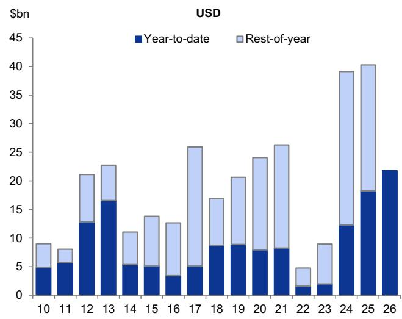

bar_stacked

USD
| Year | Year-to-date ($bn) | Rest-of-year ($bn) |
| :--- | :--- | :--- |
| 10 | 4.5 | 4.0 |
| 11 | 5.5 | 3.0 |
| 12 | 12.5 | 8.0 |
| 13 | 16.5 | 6.0 |
| 14 | 5.0 | 7.0 |
| 15 | 4.5 | 9.0 |
| 16 | 3.0 | 10.0 |
| 17 | 4.5 | 22.0 |
| 18 | 8.5 | 8.0 |
| 19 | 8.5 | 10.0 |
| 20 | 7.5 | 14.0 |
| 21 | 8.0 | 16.0 |
| 22 | 1.0 | 2.0 |
| 23 | 1.5 | 7.0 |
| 24 | 12.0 | 23.0 |
| 25 | 18.0 | 19.0 |
| 26 | 21.5 | 0.0 |

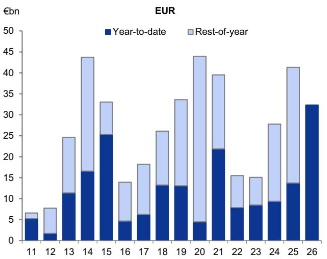

bar_stacked

EUR
| Period | Year-to-date (€bn) | Rest-of-year (€bn) |
|---|---|---|
| 11 | 5.0 | 1.0 |
| 12 | 1.5 | 7.0 |
| 13 | 11.0 | 14.0 |
| 14 | 16.5 | 28.0 |
| 15 | 25.0 | 7.0 |
| 16 | 4.5 | 10.0 |
| 17 | 6.0 | 13.0 |
| 18 | 13.0 | 14.0 |
| 19 | 13.0 | 22.0 |
| 20 | 4.5 | 42.0 |
| 21 | 22.0 | 20.0 |
| 22 | 7.5 | 9.0 |
| 23 | 8.0 | 6.0 |
| 24 | 9.5 | 23.0 |
| 25 | 13.5 | 27.0 |
| 26 | 32.5 | 0.0 |

Note: As of June 1, 2026.   
Source: Dealogic (ION Analytics), GS Global Investment Research

Exhibit 2: In the USD market, Utilities have generated a large share of hybrid supply in recent years   
Share of total USD non-bank hybrid supply, by sector   
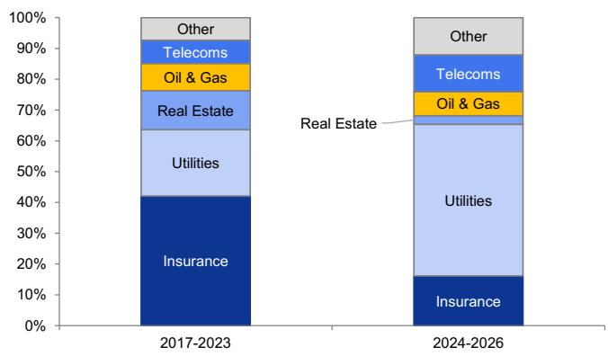

bar_stacked

| Period | Insurance (%) | Utilities (%) | Real Estate (%) | Oil & Gas (%) | Telecoms (%) | Other (%) |
| :--- | :--- | :--- | :--- | :--- | :--- | :--- |
| 2017-2023 | 41 | 18 | 0 | 9 | 5 | 5 |
| 2024-2026 | 16 | 54 | 2 | 5 | 7 | 11 |

Note: As of June 1, 2026.   
Source: Dealogic (ION Analytics), GS Global Investment Research

Exhibit 3: Utilities are also active hybrid issuers in the EUR market, although there is some additional sector diversification compared to the USD market   
Share of total EUR non-bank hybrid supply, by sector   
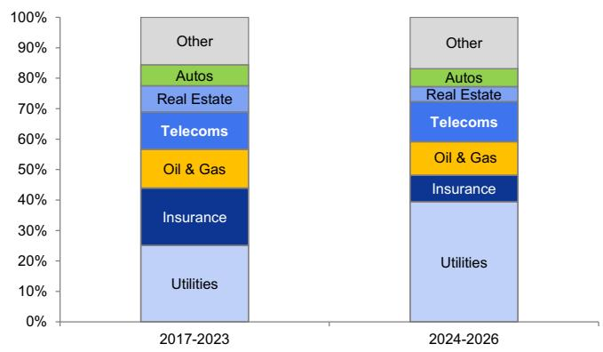

bar_stacked

| Category | 2017-2023 (%) | 2024-2026 (%) |
| :--- | :--- | :--- |
| Utilities | 25 | 38 |
| Insurance | 20 | 10 |
| Telecoms | 15 | 15 |
| Real Estate | 10 | 10 |
| Autos | 8 | 8 |
| Other | 15 | 15 |

Note: Note: As of June 1, 2026.   
Source: Dealogic (ION Analytics), GS Global Investment Research

# The drivers of hybrid issuance and investment

With the broader debt capital markets open to a wide range of borrowers, many market participants have questioned why an issuer might opt for a subordinated (higher coupon) hybrid instrument vs. a more traditional financing option in senior unsecured form.

Issuers in capital intensive industries—which often operate with large debt capital structures—tend to favor hybrid debt for two key reasons. First is the partial equity credit it receives from the rating agencies, which reflects its ‘equity like’ characteristics, including subordination in the capital structure and the ability to defer coupon payments without triggering a default. For a capital structure with limited ‘headroom’ within a targeted leverage or rating band, this partial equity credit can be attractive—especially since it does not involve diluting shareholders.

Second is the favorable tax deductibility of hybrid interest (relative to preferred stock, for example). For a profitable corporate taxpayer, the tax shield can help optimize the weighted average cost of capital—even if the hybrid debt has a moderately higher coupon.

# Placing the growth of the hybrid market (across regions) in context

Exhibits 4 and 5 show the evolution of the size of the hybrid asset class across regions. We start in the USD market and first turn to the ICE-BAML USD Developed Markets Corporate (ex-Banks) Hybrid Bond Index as a proxy for the USD hybrid universe.

As shown in Exhibit 4, the USD Hybrid Index had \$140 billion of notional outstanding as of June 3, 2026—up 96% vs. January 2024. The number of bonds in the index has also doubled since that time (to 172, currently). For context, the notional size of the ICE-BAML USD BBB Corporate Index grew 5% (to \$4.3 trillion) over that same time frame and the BB Corporate Index grew 41% (to \$880 billion). Of note, these BBB and BB indices include hybrids.

Exhibit 4: The size of the USD hybrid market has doubled since early 2024   
Face value and number of bonds in the ICE-BAML USD Developed Markets Corporate (ex-Banks) Hybrid Bond Index   
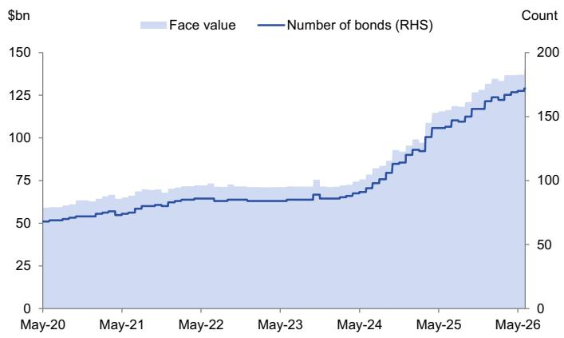

line

| Date   | Face value | Number of bonds (RHS) |
|--------|------------|------------------------|
| May-20 | ~50        | ~50                    |
| May-21 | ~60        | ~60                    |
| May-22 | ~65        | ~65                    |
| May-23 | ~65        | ~65                    |
| May-24 | ~70        | ~70                    |
| May-25 | ~110       | ~110                   |
| May-26 | ~130       | ~130                   |

Note: As of June 2, 2026.   
Source: ICE-BAML, GS Global Investment Research

In contrast to its USD peer, the EUR hybrid market is more mature. It experienced the most significant growth prior to mid-2022 (Exhibit 5). Here, we are using the ICE EUR Hybrid Corporate and High Yield Index as a proxy for the EUR hybrid market. As shown below, the June 2026 notional value (€226 billion) is 2% above the June 2022 peak. For context, the EUR BBB index has grown 6% since that time (to €1.56 trillion), while the EUR BB index has contracted 11% (to €282 billion). Here, too, the BBB and BB indices include hybrids.

Exhibit 5: The peak in sizing of the EUR Hybrid market was in mid-2022   
Face value and number of bonds in the ICE EUR Hybrid Corporate & High Yield Index   
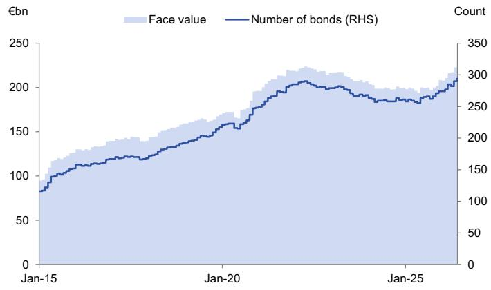

line

| Date    | Face value (€bn) | Number of bonds (RHS) |
|---------|------------------|------------------------|
| Jan-15  | ~80              | ~100                   |
| Jan-20  | ~160             | ~200                   |
| Jan-25  | ~210             | ~300                   |

Note: As of June 3, 2026.   
Source: ICE, GS Global Investment Research

# Assessing relative value—with some important caveats

It is important to acknowledge up front that the composition of these EUR and USD hybrid indices can make direct relative value comparisons to the broader corporate credit market challenging. For example, in both regions, the hybrid indices contain a mix of ratings across IG and HY (for example, blending BBBs and BBs together, in one index), and fewer—yet more concentrated—industry exposures.

Exhibits 6 through 9 provide snapshot summaries of the USD and EUR hybrid indices by rating and by industry. Given the rating distributions shown in Exhibits 6 and 8, we view BBB rated debt (and, to a lesser extent, BBs) as the most relevant comparable to hybrids. Additionally, the concentrated hybrid sector weights shown in Exhibits 7 and 9 are important to keep in mind when interpreting the index-level relative value relationships that follow.

Exhibit 6: The EUR Hybrid Index is tilted primarily towards BBBs and BBs   
Rating weights (by market value %) 

<table><tr><td>Rating</td><td>EUR Hybrid</td><td>EUR BBB</td><td>EUR BB</td></tr><tr><td>A+</td><td>4.2</td><td>0.0</td><td>0.0</td></tr><tr><td>A</td><td>7.9</td><td>0.0</td><td>0.0</td></tr><tr><td>A-</td><td>6.7</td><td>0.0</td><td>0.0</td></tr><tr><td>BBB+</td><td>9.4</td><td>45.9</td><td>0.0</td></tr><tr><td>BBB</td><td>11.9</td><td>33.6</td><td>0.0</td></tr><tr><td>BBB-</td><td>28.8</td><td>20.4</td><td>0.0</td></tr><tr><td>BB+</td><td>13.7</td><td>0.0</td><td>44.9</td></tr><tr><td>BB</td><td>14.5</td><td>0.0</td><td>32.1</td></tr><tr><td>BB-</td><td>1.5</td><td>0.0</td><td>23.1</td></tr><tr><td>B+</td><td>0.5</td><td>0.0</td><td>0.0</td></tr><tr><td>B</td><td>0.8</td><td>0.0</td><td>0.0</td></tr><tr><td>CCC</td><td>0.1</td><td>0.0</td><td>0.0</td></tr></table>

Note: As of June 2, 2026.   
Source: ICE and ICE-BAML, GS Global Investment Research

Exhibit 8: The USD Hybrid market also has a strong skew toward BBBs and BBs   
Rating weights (by market value %) 

<table><tr><td>Rating</td><td>USD Hybrid</td><td>USD BBB</td><td>USD BB</td></tr><tr><td>A+</td><td>1.6</td><td>0.0</td><td>0.0</td></tr><tr><td>A</td><td>1.4</td><td>0.0</td><td>0.0</td></tr><tr><td>A-</td><td>11.4</td><td>0.0</td><td>0.0</td></tr><tr><td>BBB+</td><td>5.6</td><td>37.0</td><td>0.0</td></tr><tr><td>BBB</td><td>19.6</td><td>40.6</td><td>0.0</td></tr><tr><td>BBB-</td><td>35.2</td><td>22.3</td><td>0.0</td></tr><tr><td>BB+</td><td>19.1</td><td>0.0</td><td>23.5</td></tr><tr><td>BB</td><td>6.0</td><td>0.0</td><td>35.3</td></tr><tr><td>BB-</td><td>0.0</td><td>0.0</td><td>41.1</td></tr></table>

Note: As of June 2, 2026.   
Source: ICE and ICE-BAML, GS Global Investment Research

Exhibit 7: The EUR Hybrid market has large weights to Utilities, Insurance, Telecom, Energy and Autos   
Industry weights (by market value %) 

<table><tr><td>Sector</td><td>EUR Hybrid</td><td>EUR BBB</td><td>EUR BB</td></tr><tr><td>Automotive</td><td>7.4</td><td>5.4</td><td>13.8</td></tr><tr><td>Banking</td><td>0.0</td><td>17.8</td><td>4.6</td></tr><tr><td>Basic Industry</td><td>0.6</td><td>5.0</td><td>6.0</td></tr><tr><td>Capital Goods</td><td>0.9</td><td>3.1</td><td>4.0</td></tr><tr><td>Consumer Goods</td><td>4.1</td><td>5.8</td><td>3.5</td></tr><tr><td>Energy</td><td>10.9</td><td>2.9</td><td>2.6</td></tr><tr><td>Financial Services</td><td>0.9</td><td>3.8</td><td>5.5</td></tr><tr><td>Healthcare</td><td>3.1</td><td>4.0</td><td>5.4</td></tr><tr><td>Insurance</td><td>25.5</td><td>3.4</td><td>0.0</td></tr><tr><td>Leisure</td><td>0.5</td><td>0.6</td><td>4.3</td></tr><tr><td>Media</td><td>0.0</td><td>1.3</td><td>0.9</td></tr><tr><td>Real Estate</td><td>3.3</td><td>8.3</td><td>6.0</td></tr><tr><td>Retail</td><td>0.0</td><td>2.7</td><td>3.6</td></tr><tr><td>Services</td><td>0.8</td><td>1.6</td><td>5.4</td></tr><tr><td>Technology &amp; Electronics</td><td>0.7</td><td>2.3</td><td>2.8</td></tr><tr><td>Telecommunications</td><td>10.8</td><td>8.2</td><td>15.6</td></tr><tr><td>Transportation</td><td>2.4</td><td>4.3</td><td>5.0</td></tr><tr><td>Utility</td><td>28.1</td><td>19.4</td><td>11.0</td></tr></table>

Note: As of June 2, 2026.   
Source: ICE and ICE-BAML, GS Global Investment Research

Exhibit 9: The USD Hybrid market has more concentrated sector weights, relative to the broader BBB and BB markets   
Industry weights (by market value %) 

<table><tr><td>Sector</td><td>USD Hybrid</td><td>USD BBB</td><td>USD BB</td></tr><tr><td>Automotive</td><td>0.4</td><td>3.0</td><td>3.3</td></tr><tr><td>Banking</td><td>0.0</td><td>6.5</td><td>0.2</td></tr><tr><td>Basic Industry</td><td>0.0</td><td>6.5</td><td>9.8</td></tr><tr><td>Capital Goods</td><td>0.0</td><td>5.0</td><td>5.8</td></tr><tr><td>Consumer Goods</td><td>0.0</td><td>5.1</td><td>2.6</td></tr><tr><td>Energy</td><td>14.4</td><td>11.9</td><td>12.9</td></tr><tr><td>Financial Services</td><td>3.5</td><td>8.6</td><td>9.0</td></tr><tr><td>Healthcare</td><td>3.3</td><td>9.0</td><td>7.5</td></tr><tr><td>Insurance</td><td>31.6</td><td>3.8</td><td>1.1</td></tr><tr><td>Leisure</td><td>0.0</td><td>1.4</td><td>5.6</td></tr><tr><td>Media</td><td>0.0</td><td>1.9</td><td>9.1</td></tr><tr><td>Real Estate</td><td>0.0</td><td>4.7</td><td>3.7</td></tr><tr><td>Retail</td><td>0.0</td><td>3.3</td><td>5.8</td></tr><tr><td>Services</td><td>0.0</td><td>1.3</td><td>5.2</td></tr><tr><td>Technology &amp; Electronics</td><td>0.0</td><td>7.4</td><td>5.6</td></tr><tr><td>Telecommunications</td><td>11.7</td><td>7.0</td><td>6.7</td></tr><tr><td>Transportation</td><td>0.0</td><td>2.0</td><td>1.6</td></tr><tr><td>Utility</td><td>35.2</td><td>11.7</td><td>4.4</td></tr></table>

Note: As of June 2, 2026.   
Source: ICE and ICE-BAML, GS Global Investment Research

# Performance: Solid (despite recent growth) for USD hybrids and range-bound for EUR

The swift growth in the USD hybrid market has not derailed performance. As Exhibit 10 illustrates, the spread ratio of the USD Hybrid Index vs. both BBBs and BBs has compressed since early 2024—indicating hybrid outperformance.

In the EUR market, the recent performance backdrop for hybrids has been largely range-bound—at least compared to BBBs (Exhibit 11). This likely reflects, in our view, the more mature stage of the market and the significant periods of outperformance in prior years (most recently in 2022, for example).

Exhibit 10: The performance of hybrids vs. the broader BBB and BB cohorts has been resilient over the past year, even as it has grown   
Spread ratios: USD hybrid OAS vs. BBBs and BBs   
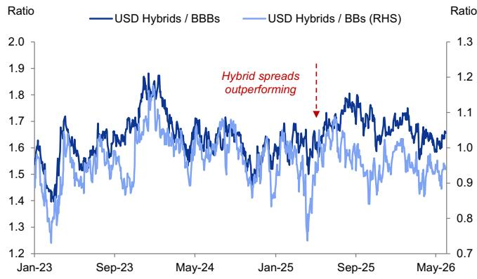

line

| Date   | USD Hybrids / BBBs | USD Hybrids / BBs (RHS) |
|--------|---------------------|--------------------------|
| Jan-23 | 1.6                 | 1.4                      |
| Sep-23 | 1.8                 | 1.6                      |
| May-24 | 1.7                 | 1.5                      |
| Jan-25 | 1.7                 | 1.4                      |
| Sep-25 | 1.8                 | 1.6                      |
| May-26 | 1.6                 | 1.4                      |

Note: As of June 2, 2026.   
Source: ICE-BAML, GS Global Investment Research

Exhibit 11: After a period of EUR hybrid outperformance in 2022, the relative value relationship vs. EUR BBBs has been range-bound   
Spread ratios: EUR hybrid OAS vs. BBBs and BBs   
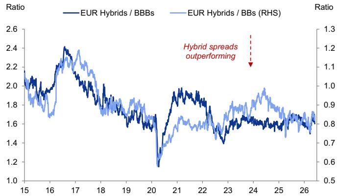

line

| Year | EUR Hybrids / BBBs | EUR Hybrids / BBs (RHS) |
|------|---------------------|--------------------------|
| 15   | 2.0                 | 1.0                      |
| 16   | 2.4                 | 1.1                      |
| 17   | 2.3                 | 1.2                      |
| 18   | 2.0                 | 1.0                      |
| 19   | 1.8                 | 0.9                      |
| 20   | 1.2                 | 0.7                      |
| 21   | 1.9                 | 0.8                      |
| 22   | 1.6                 | 0.9                      |
| 23   | 1.4                 | 1.0                      |
| 24   | 1.7                 | 1.1                      |
| 25   | 1.6                 | 1.0                      |
| 26   | 1.5                 | 0.9                      |

Note: As of June 2, 2026.   
Source: ICE-BAML, GS Global Investment Research

The more mature state of the EUR hybrid market is also a key reason why we show a longer performance history in Exhibit 11 relative to the shorter performance history for USD hybrids in Exhibit 10. As highlighted earlier in Exhibit 4, the USD hybrid market did not cross \$90 billion in notional value until late 2024. Meanwhile, the EUR hybrid market stood at €95 billion in notional outstanding as early as 2015 (again, Exhibit 5).

Exhibits 12 and 13 provide a comparison of excess returns, which remove the performance influence from interest rates and focus instead on credit risk. The takeaway is clear, in our view: in periods where excess returns are positive, hybrids tend to outperform their BBB peers (albeit to varying degrees across markets and periods). However, in a year such as 2022 when excess returns were negative, hybrids underperformed.

Exhibit 12: Hybrids have outperformed BBBs on an excess return basis for the past few years, but have lagged during risk-off periods such as 2022   
Annual and year-to-date 2026 excess returns for the ICE-BAML USD Developed Markets Corporate (ex-Banks) Hybrid Bond Index, and the USD BBB and BB Corporate indices   
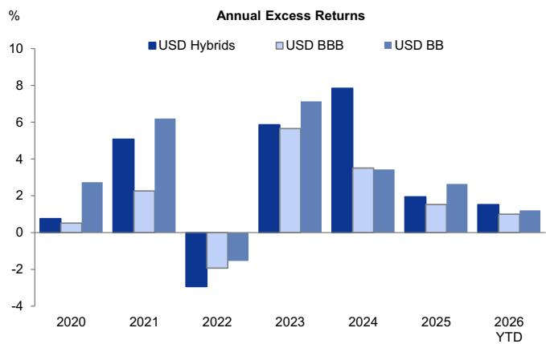

bar

Annual Excess Returns
| Year | USD Hybrids (%) | USD BBB (%) | USD BB (%) |
| :--- | :--- | :--- | :--- |
| 2020 | 0.8 | 0.5 | 2.7 |
| 2021 | 5.1 | 2.2 | 6.2 |
| 2022 | -3.0 | -1.8 | -1.4 |
| 2023 | 5.9 | 5.6 | 7.1 |
| 2024 | 7.9 | 3.5 | 3.4 |
| 2025 | 1.9 | 1.5 | 2.6 |
| 2026 YTD | 1.6 | 1.0 | 1.2 |

Note: As of June 2, 2026.   
Source: ICE-BAML, GS Global Investment Research

Exhibit 13: Hybrids have also frequently outperformed BBBs in the EUR market, but have lagged in risk-off periods   
Annual and year-to-date excess returns for the ICE EUR Hybrid Index, and the EUR BBB and BB Corporate indices   
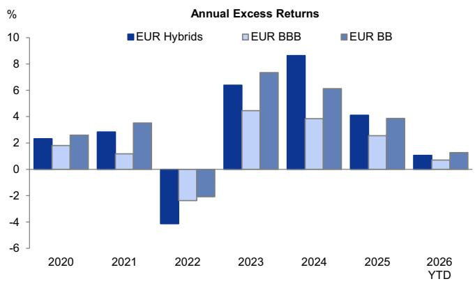

bar

Annual Excess Returns
| Year | EUR Hybrids (%) | EUR BBB (%) | EUR BB (%) |
| :--- | :--- | :--- | :--- |
| 2020 | 2.3 | 1.8 | 2.6 |
| 2021 | 2.9 | 1.2 | 3.5 |
| 2022 | -4.3 | -2.5 | -1.8 |
| 2023 | 6.4 | 4.4 | 7.4 |
| 2024 | 8.7 | 3.8 | 6.1 |
| 2025 | 4.1 | 2.5 | 3.9 |
| 2026 YTD | 1.1 | 0.6 | 1.3 |

Note: As of June 2, 2026.   
Source: ICE, GS Global Investment Research

# Hybrids generally trade structure risk for quality risk

For IG-focused investors searching for ways to capture incremental spread without deviating too far down the quality spectrum, hybrids can be an attractive solution given the spread premium they offer vs. senior debt.

This additional spread premia serves as ‘compensation’ for hybrids’ subordination as well as some issuer-friendly structural features, such as the ability to defer interest payments in certain situations (without triggering a default).

That said, determining whether this compensation is adequate requires a clear understanding of the company-specific capital management priorities for each hybrid issuer. It also requires a thorough analysis of the potential long-term fundamental headwinds facing the issuers' industries to evaluate the risk of financial distress (which may necessitate deferral of interest).

Very few investors expect hybrid issuers to actually utilize the provision to defer interest—especially if that issuer already has a large debt capital structure which requires frequent refinancing. The assumption is that deferring the hybrid’s coupon payments may make it more difficult—due to investor push back from overlapping buyer bases—to refinance the ‘regular’ (non-subordinated) debt when the time comes. In many instances, deferring a hybrid coupon may also prevent an issuer from paying its common equity dividend.

The value of this interest deferral provision to the issuer increases during times of economic weakness, which can often result in hybrids underperforming during risk-off moves (again, Exhibit 12 and 13).

# Quantifying the compensation for subordination

To quantify this compensation premium, we again use the USD and EUR hybrid indices mentioned earlier, comparing index-level average (and current) spreads relative to the broader BBB and BB markets. Leaving the important rating and industry compositional difference caveats aside, we show the index-level absolute spread differentials across regions in Exhibit 14 and 15.

Exhibit 14: USD hybrids trade, on average, 61bp wide to USD BBBs and 10bp tight to USD BBs   
Average index-level spread differentials   
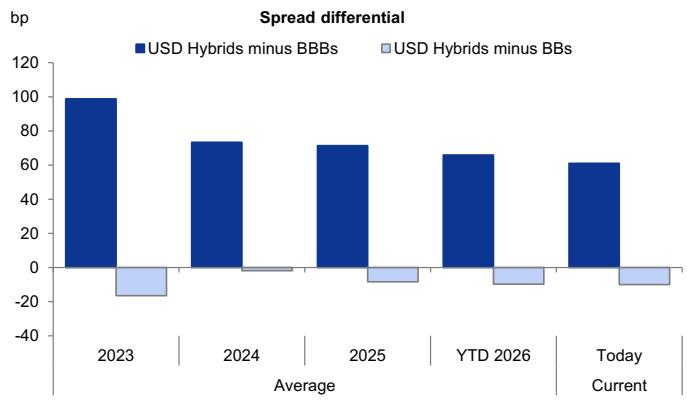

bar

Spread differential
| Year | USD Hybrids minus BBBs (bp) | USD Hybrids minus BBs (bp) |
| :--- | :--- | :--- |
| 2023 | 100 | -15 |
| 2024 | 73 | -5 |
| 2025 | 71 | -8 |
| YTD 2026 | 66 | -10 |
| Today Current | 61 | -10 |

Note: As of June 2, 2026.

Exhibit 15: EUR hybrids trade, on average, 53bp wide to EUR BBBs and 26bp tight to EUR BBs   
Average index-level spread differentials   
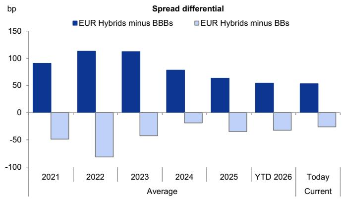

bar

Spread differential
| Year | EUR Hybrids minus BBBs (bp) | EUR Hybrids minus BBs (bp) |
| :--- | :--- | :--- |
| 2021 | 92 | -48 |
| 2022 | 114 | -84 |
| 2023 | 113 | -43 |
| 2024 | 79 | -24 |
| 2025 | 63 | -36 |
| YTD 2026 | 55 | -34 |
| Today Current | 54 | -27 |

Note: As of June 2, 2026.   
Source: ICE-BAML, GS Global Investment Research   
Source: ICE, GS Global Investment Research

For example, the absolute spread differential between USD hybrids and USD BBBs compressed from 99bp (on average) in 2023 to 61bp, currently (again, Exhibit 14). While this is narrower vs. a few years ago, it is consistent with the directional trend of spread tightening in the USD market. As a result, we view this index-level compensation as moderately attractive considering spreads for many markets are hovering at the tight end of the post-financial crisis history (Exhibits 37 and 38 show spread percentile ranks vs. history). We also expect the hybrid spread premium to compress as the market grows further.

In the EUR market, the hybrid vs. BBB spread differential is currently 53bp (again, Exhibit 15). This tighter spread differential likely reflects, in part, the more mature positioning of the EUR hybrid market, as investors and issuers have become very familiar with the structures over the past decade.

We do not see much scope for further absolute spread tightening (compression) in EUR hybrids, given the more challenging growth-inflation-monetary policy mix stemming from the ongoing energy shock. That said, the additional carry vs. EUR BBBs can be attractive for a range of investor types. Given our more cautious positioning in the EUR market (relative to USD), we would focus on higher-quality hybrid issuers in more economically resilient sectors.

The authors would like to thank Patricia Pacheco for her contribution to this report.

# Forecast dashboard: Spreads, returns, issuance, defaults, and ratings migrations

Exhibit 16: USD and EUR spread forecasts 

<table><tr><td rowspan="2">Index</td><td colspan="4">Updated as of Jun. 03, 2026</td></tr><tr><td>Current</td><td>2026Q2</td><td>2026Q3</td><td>2026Q4</td></tr><tr><td colspan="5">USD spreads</td></tr><tr><td>USD IG</td><td>73</td><td>95</td><td>92</td><td>90</td></tr><tr><td>USD Fin</td><td>76</td><td>103</td><td>98</td><td>94</td></tr><tr><td>USD Non-Fin</td><td>70</td><td>92</td><td>89</td><td>86</td></tr><tr><td>USD HY</td><td>263</td><td>335</td><td>325</td><td>315</td></tr><tr><td colspan="5">EUR spreads</td></tr><tr><td>EUR IG</td><td>86</td><td>120</td><td>117</td><td>114</td></tr><tr><td>EUR Fin</td><td>92</td><td>127</td><td>122</td><td>118</td></tr><tr><td>EUR Non-Fin</td><td>83</td><td>116</td><td>113</td><td>111</td></tr><tr><td>EUR HY</td><td>261</td><td>375</td><td>368</td><td>360</td></tr></table>

Source: Bloomberg, ICE-BAML, iBoxx, GS Global Investment Research

Exhibit 18: Issuance forecasts 

<table><tr><td>Market</td><td>2026 YTD (bn)</td><td>2026 full-year forecast (bn)</td></tr><tr><td colspan="3">USD market</td></tr><tr><td colspan="3">Gross issuance</td></tr><tr><td>IG</td><td>$1,109</td><td>$2,100</td></tr><tr><td>HY</td><td>$159</td><td>$400</td></tr><tr><td>Leveraged loans</td><td>$182</td><td>--</td></tr><tr><td colspan="3">Net issuance</td></tr><tr><td>IG</td><td>$478</td><td>$850</td></tr><tr><td>HY</td><td>$43</td><td>$160</td></tr><tr><td colspan="3">EUR market</td></tr><tr><td colspan="3">Gross issuance</td></tr><tr><td>IG</td><td>€ 426</td><td>€ 850</td></tr><tr><td>HY</td><td>€ 47</td><td>€ 125</td></tr><tr><td colspan="3">Net issuance</td></tr><tr><td>IG</td><td>€ 98</td><td>€ 265</td></tr><tr><td>HY</td><td>€ 21</td><td>€ 60</td></tr></table>

Source: Dealogic, Bloomberg, GS Global Investment Research

Exhibit 17: USD and EUR excess returns forecast 

<table><tr><td rowspan="2">Index</td><td colspan="3">Updated as of Jun. 03, 2026</td></tr><tr><td>Current duration</td><td>2026</td><td>2026 full-year forecast (%)</td></tr><tr><td colspan="4">USD excess returns</td></tr><tr><td>USD IG</td><td>6.8</td><td>0.8%</td><td>0.0%</td></tr><tr><td>USD HY</td><td>3.0</td><td>1.3%</td><td>1.3%</td></tr><tr><td colspan="4">EUR excess returns</td></tr><tr><td>EUR IG</td><td>4.7</td><td>0.8%</td><td>0.0%</td></tr><tr><td>EUR HY</td><td>2.7</td><td>1.1%</td><td>-0.4%</td></tr></table>

Source: Bloomberg, ICE-BAML, iBoxx, GS Global Investment Research

Exhibit 19: Ratings migration and default forecasts   
Default rates are issuer-weighted and 12-month trailing 

<table><tr><td rowspan="2">Market</td><td colspan="2">Updated as of Jun. 03, 2026</td></tr><tr><td>2026 YTD</td><td>2026 full-year forecast</td></tr><tr><td colspan="3">USD market</td></tr><tr><td>Rising stars</td><td>$43bn</td><td>$75bn</td></tr><tr><td>Fallen angels</td><td>$31bn</td><td>$60bn</td></tr><tr><td>HY defaults (12-month trailing)</td><td>3.6%</td><td>3.0%</td></tr><tr><td>Leveraged loan defaults (12-month trailing)</td><td>5.1%</td><td>4.75%</td></tr><tr><td colspan="3">EUR market</td></tr><tr><td>Rising stars</td><td>€ 6bn</td><td>€20bn</td></tr><tr><td>Fallen angels</td><td>€ 4bn</td><td>€30bn</td></tr><tr><td>HY defaults (12-month trailing)</td><td>4.5%</td><td>4.7%</td></tr><tr><td>Leveraged loan defaults (12-month trailing)</td><td>3.3%</td><td>4.0%</td></tr></table>

Source: Bloomberg, Moody's, GS Global Investment Research

# Forecast dashboard: Relative value views

Exhibit 20: Relative value views 

<table><tr><td colspan="3">Relative value views</td></tr><tr><td colspan="3">Corporate Credit</td></tr><tr><td>Regional</td><td>Overweight USD vs. EUR</td><td>The growth, inflation and monetary policy mix is somewhat more favorable in the US, relative to Europe. As a result, and relative to the USD market, we forecast a wider peak (and a slower recovery in 2H2026) in EUR credit spreads.</td></tr><tr><td rowspan="7">USD market</td><td>Overweight IG vs. HY</td><td>We have a slight preference for IG vs. HY in the USD market, owing to valuations and our economists&#x27; forecasts for below-potential growth. We view the BB/BBB spread ratio as fairly priced amid a somewhat more challenging growth and inflation mix, and have a neutral view between the two rating cohorts.</td></tr><tr><td>Overweight BBBs vs. higher-rated cohorts</td><td>We prefer owning BBBs over the higher-rated segments of USD IG (As and AAs), as a way to capture additional spread. We also see scope for balance sheet deterioration at the highest end of the rating spectrum in IG.</td></tr><tr><td>Overweight BBs, Neutral CCCs, Underweight Bs</td><td>Current spread levels indicate that single-Bs offer the lowest credit risk premium relative to expected losses among all HY rating buckets.</td></tr><tr><td>Overweight HY bonds vs. loans</td><td>HY bonds still provide a superior trade-off between carry and duration compared to leveraged loans. In addition, loans&#x27; substantial software sector exposure is likely to present a sentiment overhang, at least in the near-term.</td></tr><tr><td>Overweight CLO mezz tranches vs. leveraged loansNeutral CLO vs. USD IGNeutral CLO vs. CMOs</td><td>For floating rate investors, we prefer CLO mezzanine tranches vs. leveraged loans. Historical data points to low impairment rates for BB and BBB CLO tranches, and current valuations offer attractive carry and a cushion against moderate to elevated default outcomes. Elsewhere, we are neutral between senior CLO tranches and USD IG; we would use spread widening to add exposure in CLOs. We are also neutral between CLO AAA and CMO floaters.</td></tr><tr><td>Prefer Agency MBS vs. IG</td><td>Agency MBS offers an attractive diversification benefit vs. a portfolio of IG corporate bonds.</td></tr><tr><td>Overweight Hybrids vs. BBBs</td><td>We view the additional spread compensation of hybrids vs. BBBs as moderately attractive in the context of the tight spread environment. We also expect the hybrid spread premium to compress vs. BBBs, as the hybrid market grows further.</td></tr><tr><td rowspan="6">EUR market</td><td>Overweight IG vs. HY</td><td>We prefer IG over HY given the more challenging growth, inflation, and monetary policy mix in the Euro Area.</td></tr><tr><td>Overweight As vs. BBBs</td><td>In the EUR market, we prefer As over BBBs, as the weaker growth backdrop warrants more of an up-in-quality stance. That said, we would not move too far up the quality spectrum, as we expect supply technicals will be a headwind in the EUR AA market.</td></tr><tr><td>Overweight HY bonds vs. loans</td><td>Similar to the US, we prefer HY bonds given the loan market&#x27;s weighting toward software (and the potential negative sentiment overhang). The reaction function of the ECB may also increase borrowing costs for floating rate issuers, given the central bank&#x27;s focus on inflationary pressures.</td></tr><tr><td>Overweight BBs, Neutral Bs, Underweight CCCs</td><td>At current valuations and given our expectation for heightened dispersion, we prefer moving up in quality within EUR HY.</td></tr><tr><td>Underweight AT1s vs. EUR HY</td><td>Given downside tail risks and a limited valuation cushion, we recommend an underweight on AT1s vs. EUR HY.</td></tr><tr><td>Neutral Hybrids vs. BBBs</td><td>The additional carry vs. EUR BBBs is unlikely to compress further. Given our more cautious positioning in the EUR market (relative to USD), we would focus on higher-quality hybrid issuers in more economically resilient sectors.</td></tr></table>

Source: GS Global Investment Research

# Performance dashboard: Cash and synthetic markets

Exhibit 21: Performance of USD and EUR markets 

<table><tr><td rowspan="2">Market</td><td colspan="2">Current*</td><td colspan="3">Total return</td><td rowspan="2">Spread change (YTD,bp)</td><td rowspan="2">Yield change (YTD, %)</td></tr><tr><td>Spread</td><td>Yield</td><td>MTD</td><td>QTD</td><td>YTD</td></tr><tr><td colspan="8">USD Corporate bonds</td></tr><tr><td>IG</td><td>73</td><td>5.2</td><td>-0.26</td><td>0.95</td><td>0.41</td><td>-5</td><td>0.38</td></tr><tr><td>AA</td><td>48</td><td>5.0</td><td>-0.25</td><td>0.58</td><td>0.26</td><td>-1</td><td>0.38</td></tr><tr><td>A</td><td>62</td><td>5.1</td><td>-0.26</td><td>0.83</td><td>0.44</td><td>-3</td><td>0.35</td></tr><tr><td>BBB</td><td>93</td><td>5.4</td><td>-0.24</td><td>1.28</td><td>0.80</td><td>-8</td><td>0.32</td></tr><tr><td>HY</td><td>263</td><td>7.1</td><td>-0.19</td><td>2.00</td><td>1.49</td><td>-3</td><td>0.56</td></tr><tr><td>BB</td><td>165</td><td>6.3</td><td>-0.13</td><td>1.86</td><td>1.47</td><td>-4</td><td>0.32</td></tr><tr><td>B</td><td>299</td><td>7.8</td><td>-0.18</td><td>2.31</td><td>1.93</td><td>-2</td><td>0.41</td></tr><tr><td>CCC</td><td>947</td><td>13.8</td><td>-0.17</td><td>2.06</td><td>-0.19</td><td>62</td><td>0.91</td></tr><tr><td colspan="8">USD Leveraged Loans</td></tr><tr><td>Leveraged loan index</td><td>437</td><td>8.2</td><td>0.00</td><td>0.09</td><td>-0.46</td><td>42</td><td>0.4</td></tr><tr><td>BB</td><td>257</td><td>6.3</td><td>0.00</td><td>0.00</td><td>0.70</td><td>2</td><td>-0.1</td></tr><tr><td>B</td><td>448</td><td>8.3</td><td>0.00</td><td>0.00</td><td>-0.93</td><td>57</td><td>0.5</td></tr><tr><td>CCC</td><td>1877</td><td>23.9</td><td>0.00</td><td>0.00</td><td>-5.09</td><td>314</td><td>3.3</td></tr><tr><td colspan="8">USD Securitized products</td></tr><tr><td>Agency MBS</td><td>23</td><td>5.0</td><td>-0.28</td><td>0.08</td><td>0.48</td><td>1</td><td>0.4</td></tr><tr><td>ABS (Autos)</td><td>59</td><td>4.6</td><td>-0.04</td><td>0.54</td><td>1.21</td><td>-7</td><td>0.4</td></tr><tr><td>ABS (Credit cards)</td><td>31</td><td>4.3</td><td>-0.09</td><td>0.41</td><td>0.92</td><td>-2</td><td>0.4</td></tr><tr><td>ABS (Student loans)</td><td>101</td><td>4.9</td><td>0.08</td><td>0.75</td><td>1.84</td><td>128</td><td>-0.1</td></tr><tr><td colspan="8">USD Macro indices</td></tr><tr><td>CDX IG</td><td>51</td><td>--</td><td>-0.02</td><td>0.66</td><td>0.43</td><td>1</td><td>--</td></tr><tr><td>CDX HY</td><td>305</td><td>--</td><td>-0.17</td><td>3.15</td><td>1.28</td><td>-11</td><td>--</td></tr><tr><td colspan="8">EUR Corporate bonds</td></tr><tr><td>IG</td><td>88</td><td>3.7</td><td>-0.28</td><td>1.56</td><td>0.54</td><td>-2</td><td>0.3</td></tr><tr><td>AA</td><td>63</td><td>3.6</td><td>-0.33</td><td>1.36</td><td>0.41</td><td>2</td><td>0.3</td></tr><tr><td>A</td><td>81</td><td>3.7</td><td>-0.30</td><td>1.51</td><td>0.51</td><td>-3</td><td>0.2</td></tr><tr><td>BBB</td><td>101</td><td>3.8</td><td>-0.25</td><td>1.64</td><td>0.59</td><td>-1</td><td>0.3</td></tr><tr><td>HY</td><td>261</td><td>5.8</td><td>0.02</td><td>3.03</td><td>1.26</td><td>-9</td><td>0.3</td></tr><tr><td>AT1</td><td>275</td><td>5.5</td><td>-0.12</td><td>3.47</td><td>2.06</td><td>-12</td><td>0.2</td></tr><tr><td colspan="8">EUR Leveraged loans</td></tr><tr><td>Leveraged loan index</td><td>497</td><td>7.2</td><td>0.00</td><td>0.18</td><td>-0.87</td><td>47</td><td>0.6</td></tr><tr><td>BB</td><td>282</td><td>5.0</td><td>0.00</td><td>0.00</td><td>0.75</td><td>-70</td><td>-0.6</td></tr><tr><td>B</td><td>471</td><td>6.9</td><td>0.00</td><td>0.00</td><td>-1.30</td><td>56</td><td>0.7</td></tr><tr><td colspan="8">EUR Macro indices</td></tr><tr><td>iTraxx Main</td><td>54</td><td>--</td><td>-0.04</td><td>0.97</td><td>0.4</td><td>3</td><td>--</td></tr><tr><td>iTraxx Xover</td><td>263</td><td>--</td><td>-0.18</td><td>4.80</td><td>2.1</td><td>19</td><td>--</td></tr><tr><td>iTraxx SenFin</td><td>57</td><td>--</td><td>-0.06</td><td>1.15</td><td>0.6</td><td>2</td><td>--</td></tr><tr><td>iTraxx SubFin</td><td>93</td><td>--</td><td>-0.09</td><td>2.12</td><td>1.2</td><td>0</td><td>--</td></tr></table>

\*Data as of previous day close.   
For USD IG and HY we use the Bloomberg indices with history back to Jun-89 and Jan-94, respectively. Corp rating level, Agency MBS and ABS we use ICE-BAML indices with history back to Dec-96, EUR IG we use the iBoxx QW5A index with history back to Jan-99, EUR HY we use the ICE-BAML index with history back to Dec-97, and USD and EUR leveraged loans we use the Morningstar LSTA LLI and ELLI indices with data going back to Jan-97 and Jan-02, respectively.   
Source: Bloomberg, iBoxx, ICE-BAML, Pitchbook LCD, GS Global Investment Research

# Performance dashboard: Sectors

Exhibit 22: Sector performance: USD IG 

<table><tr><td rowspan="2">Sector</td><td colspan="7">Metrics</td><td colspan="4">Spread change</td><td colspan="4">Total return</td></tr><tr><td>Index weight</td><td>Mkt val ($bn)</td><td>OAS</td><td>Percentile rank (2010-today)</td><td>YTW</td><td>Dur</td><td>Rating</td><td>1-week</td><td>MTD</td><td>QTD</td><td>YTD</td><td>1-week</td><td>MTD</td><td>QTD</td><td>YTD</td></tr><tr><td>Basic Industry</td><td>2%</td><td>179.5</td><td>76</td><td>●----</td><td>5.3</td><td>7.5</td><td>BAA1/BAA2</td><td>0</td><td>0</td><td>-21</td><td>-14</td><td>-0.1</td><td>-0.2</td><td>1.4</td><td>1.0</td></tr><tr><td>Chemicals</td><td>1%</td><td>81.2</td><td>81</td><td>●----</td><td>5.4</td><td>7.7</td><td>BAA1/BAA2</td><td>1</td><td>1</td><td>-20</td><td>-16</td><td>-0.1</td><td>-0.2</td><td>1.5</td><td>1.4</td></tr><tr><td>Metals &amp; Mining</td><td>1%</td><td>72.0</td><td>65</td><td>●----</td><td>5.2</td><td>7.7</td><td>A3/BAA1</td><td>-1</td><td>-1</td><td>-24</td><td>-13</td><td>0.0</td><td>-0.2</td><td>1.5</td><td>0.7</td></tr><tr><td>Paper</td><td>0%</td><td>26.3</td><td>86</td><td>●----</td><td>5.3</td><td>6.0</td><td>BAA2/BAA3</td><td>0</td><td>0</td><td>-19</td><td>-10</td><td>-0.1</td><td>-0.2</td><td>1.2</td><td>0.4</td></tr><tr><td>Capital Goods</td><td>6%</td><td>412.2</td><td>57</td><td>●----</td><td>5.0</td><td>6.8</td><td>A3/BAA1</td><td>1</td><td>1</td><td>-19</td><td>-11</td><td>-0.1</td><td>-0.2</td><td>0.8</td><td>0.5</td></tr><tr><td>Aerospace &amp; Defense</td><td>2%</td><td>150.9</td><td>63</td><td>●----</td><td>5.2</td><td>8.3</td><td>BAA1/BAA2</td><td>1</td><td>1</td><td>-19</td><td>-12</td><td>-0.1</td><td>-0.3</td><td>1.1</td><td>0.6</td></tr><tr><td>Building Materials</td><td>1%</td><td>40.4</td><td>73</td><td>●----</td><td>5.2</td><td>6.7</td><td>BAA1/BAA2</td><td>5</td><td>5</td><td>-16</td><td>-5</td><td>-0.1</td><td>-0.2</td><td>1.0</td><td>0.4</td></tr><tr><td>Diversified Manufacturing</td><td>2%</td><td>118.0</td><td>56</td><td>●----</td><td>5.0</td><td>6.6</td><td>A3/BAA1</td><td>0</td><td>0</td><td>-19</td><td>-8</td><td>-0.1</td><td>-0.2</td><td>0.8</td><td>0.5</td></tr><tr><td>Construction Machinery</td><td>1%</td><td>57.6</td><td>34</td><td>●----</td><td>4.6</td><td>4.7</td><td>A1/A2</td><td>3</td><td>3</td><td>-24</td><td>-17</td><td>-0.1</td><td>-0.2</td><td>0.5</td><td>0.4</td></tr><tr><td>Packaging</td><td>0%</td><td>14.3</td><td>71</td><td>●----</td><td>5.0</td><td>4.5</td><td>BAA2/BAA3</td><td>0</td><td>0</td><td>-21</td><td>-10</td><td>-0.1</td><td>-0.2</td><td>0.7</td><td>0.4</td></tr><tr><td>Environmental</td><td>0%</td><td>31.0</td><td>42</td><td>●----</td><td>4.8</td><td>5.8</td><td>A3/A3</td><td>1</td><td>1</td><td>-20</td><td>-14</td><td>-0.1</td><td>-0.2</td><td>0.3</td><td>0.2</td></tr><tr><td>Communications</td><td>8%</td><td>562.2</td><td>89</td><td>●----</td><td>5.5</td><td>8.7</td><td>A3/BAA1</td><td>2</td><td>2</td><td>-11</td><td>-6</td><td>-0.1</td><td>-0.3</td><td>0.8</td><td>0.1</td></tr><tr><td>Cable &amp; Satellite</td><td>1%</td><td>107.7</td><td>132</td><td>●----</td><td>6.0</td><td>9.4</td><td>BAA1/BAA2</td><td>2</td><td>2</td><td>-5</td><td>1</td><td>-0.1</td><td>-0.4</td><td>0.5</td><td>0.2</td></tr><tr><td>Media &amp; Entertainment</td><td>2%</td><td>136.4</td><td>77</td><td>●----</td><td>5.4</td><td>8.7</td><td>A1/A2</td><td>1</td><td>1</td><td>-6</td><td>-9</td><td>0.0</td><td>-0.2</td><td>0.4</td><td>-1.1</td></tr><tr><td>Wireless</td><td>2%</td><td>125.3</td><td>74</td><td>●----</td><td>5.2</td><td>7.3</td><td>BAA1/BAA2</td><td>1</td><td>1</td><td>-18</td><td>-8</td><td>-0.1</td><td>-0.3</td><td>1.0</td><td>0.6</td></tr><tr><td>Wirelines</td><td>3%</td><td>192.9</td><td>84</td><td>●----</td><td>5.5</td><td>9.3</td><td>BAA1/BAA2</td><td>3</td><td>3</td><td>-12</td><td>-6</td><td>-0.2</td><td>-0.4</td><td>0.9</td><td>0.5</td></tr><tr><td>Consumer Cyclical</td><td>7%</td><td>542.0</td><td>65</td><td>●----</td><td>5.1</td><td>6.3</td><td>A2/A3</td><td>2</td><td>2</td><td>-21</td><td>-9</td><td>-0.1</td><td>-0.3</td><td>0.9</td><td>0.4</td></tr><tr><td>Automotive</td><td>2%</td><td>170.0</td><td>80</td><td>●----</td><td>5.1</td><td>4.3</td><td>A3/BAA1</td><td>2</td><td>2</td><td>-24</td><td>-10</td><td>-0.1</td><td>-0.3</td><td>1.1</td><td>0.8</td></tr><tr><td>Leisure</td><td>0%</td><td>4.8</td><td>94</td><td>●----</td><td>5.3</td><td>6.4</td><td>BAA2/BAA2</td><td>2</td><td>2</td><td>-21</td><td>-8</td><td>-0.2</td><td>-0.4</td><td>1.5</td><td>0.0</td></tr><tr><td>Gaming</td><td>0%</td><td>22.8</td><td>102</td><td>●----</td><td>5.3</td><td>4.8</td><td>BAA2/BAA3</td><td>1</td><td>1</td><td>-22</td><td>-8</td><td>-0.2</td><td>-0.3</td><td>1.3</td><td>0.7</td></tr><tr><td>Home Construction</td><td>0%</td><td>9.7</td><td>81</td><td>●----</td><td>5.1</td><td>5.1</td><td>BAA1/BAA2</td><td>0</td><td>0</td><td>-17</td><td>-3</td><td>0.0</td><td>-0.2</td><td>0.8</td><td>0.4</td></tr><tr><td>Lodging</td><td>0%</td><td>20.0</td><td>67</td><td>●----</td><td>5.0</td><td>4.8</td><td>BAA2/BAA3</td><td>1</td><td>1</td><td>-24</td><td>-9</td><td>-0.1</td><td>-0.3</td><td>0.9</td><td>0.3</td></tr><tr><td>Retailers</td><td>3%</td><td>252.6</td><td>50</td><td>●----</td><td>5.0</td><td>7.8</td><td>A1/A2</td><td>3</td><td>3</td><td>-18</td><td>-5</td><td>-0.1</td><td>-0.3</td><td>0.7</td><td>0.2</td></tr><tr><td>Restaurants</td><td>0%</td><td>33.4</td><td>56</td><td>●----</td><td>5.1</td><td>7.6</td><td>BAA1/BAA2</td><td>0</td><td>0</td><td>-22</td><td>-12</td><td>-0.1</td><td>-0.2</td><td>0.9</td><td>0.5</td></tr><tr><td>Consumer Cyc Services</td><td>0%</td><td>28.8</td><td>72</td><td>●----</td><td>5.1</td><td>6.2</td><td>A3/BAA1</td><td>1</td><td>1</td><td>-17</td><td>0</td><td>0.0</td><td>-0.2</td><td>0.8</td><td>0.1</td></tr><tr><td>Consumer Non-Cyclical</td><td>15%</td><td>1123.6</td><td>62</td><td>●----</td><td>5.2</td><td>7.9</td><td>A2/A3</td><td>1</td><td>1</td><td>-18</td><td>-8</td><td>-0.1</td><td>-0.2</td><td>0.9</td><td>0.3</td></tr><tr><td>Consumer Products</td><td>1%</td><td>59.5</td><td>44</td><td>●----</td><td>4.8</td><td>6.0</td><td>A2/A3</td><td>2</td><td>2</td><td>-20</td><td>-12</td><td>-0.2</td><td>-0.3</td><td>0.6</td><td>0.4</td></tr><tr><td>Food &amp; Beverage</td><td>3%</td><td>232.1</td><td>67</td><td>●----</td><td>5.2</td><td>7.7</td><td>A3/BAA1</td><td>2</td><td>2</td><td>-19</td><td>-3</td><td>-0.1</td><td>-0.3</td><td>1.0</td><td>0.1</td></tr><tr><td>Healthcare</td><td>4%</td><td>327.2</td><td>70</td><td>●----</td><td>5.2</td><td>7.9</td><td>A3/BAA1</td><td>0</td><td>0</td><td>-17</td><td>-8</td><td>-0.1</td><td>-0.2</td><td>0.8</td><td>0.3</td></tr><tr><td>Pharmaceuticals</td><td>5%</td><td>405.9</td><td>53</td><td>●----</td><td>5.1</td><td>8.5</td><td>A1/A2</td><td>2</td><td>2</td><td>-18</td><td>-10</td><td>-0.1</td><td>-0.3</td><td>0.8</td><td>0.3</td></tr><tr><td>Supermarkets</td><td>0%</td><td>13.5</td><td>81</td><td>●----</td><td>5.5</td><td>9.6</td><td>BAA1/BAA2</td><td>0</td><td>0</td><td>-15</td><td>-6</td><td>0.0</td><td>-0.2</td><td>1.1</td><td>0.3</td></tr><tr><td>Tobacco</td><td>1%</td><td>85.5</td><td>69</td><td>●----</td><td>5.1</td><td>6.6</td><td>A3/BAA1</td><td>1</td><td>1</td><td>-18</td><td>-11</td><td>-0.2</td><td>-0.3</td><td>0.9</td><td>0.4</td></tr><tr><td>Energy</td><td>7%</td><td>532.3</td><td>74</td><td>●----</td><td>5.3</td><td>7.7</td><td>A3/BAA1</td><td>1</td><td>1</td><td>-19</td><td>-17</td><td>-0.1</td><td>-0.2</td><td>1.2</td><td>1.3</td></tr><tr><td>Independent Energy</td><td>1%</td><td>92.9</td><td>73</td><td>●----</td><td>5.3</td><td>7.6</td><td>BAA1/BAA2</td><td>0</td><td>0</td><td>-22</td><td>-23</td><td>-0.1</td><td>-0.2</td><td>1.5</td><td>2.1</td></tr><tr><td>Integrated Energy</td><td>1%</td><td>103.3</td><td>49</td><td>●----</td><td>5.1</td><td>8.3</td><td>AA3/A1</td><td>1</td><td>1</td><td>-19</td><td>-16</td><td>-0.1</td><td>-0.2</td><td>0.8</td><td>0.7</td></tr><tr><td>Oil Field Services</td><td>0%</td><td>24.6</td><td>75</td><td>●----</td><td>5.3</td><td>7.7</td><td>A3/BAA1</td><td>3</td><td>3</td><td>-19</td><td>-23</td><td>-0.2</td><td>-0.3</td><td>1.2</td><td>1.5</td></tr><tr><td>Refining</td><td>0%</td><td>30.3</td><td>83</td><td>●----</td><td>5.3</td><td>7.2</td><td>BAA1/BAA2</td><td>-1</td><td>-1</td><td>-19</td><td>-21</td><td>-0.1</td><td>-0.2</td><td>1.3</td><td>1.7</td></tr><tr><td>Midstream</td><td>4%</td><td>281.1</td><td>82</td><td>●----</td><td>5.4</td><td>7.5</td><td>BAA1/BAA2</td><td>1</td><td>1</td><td>-18</td><td>-15</td><td>-0.2</td><td>-0.3</td><td>1.3</td><td>1.2</td></tr><tr><td>Technology</td><td>10%</td><td>759.6</td><td>75</td><td>●----</td><td>5.2</td><td>7.3</td><td>A2/A3</td><td>2</td><td>2</td><td>-18</td><td>-2</td><td>0.0</td><td>-0.3</td><td>1.1</td><td>0.4</td></tr><tr><td>Transportation</td><td>2%</td><td>147.0</td><td>66</td><td>●----</td><td>5.3</td><td>9.3</td><td>A3/BAA1</td><td>1</td><td>1</td><td>-19</td><td>-9</td><td>-0.1</td><td>-0.2</td><td>1.1</td><td>0.6</td></tr><tr><td>Airlines</td><td>0%</td><td>16.5</td><td>84</td><td>●----</td><td>5.1</td><td>3.7</td><td>A2/A3</td><td>3</td><td>3</td><td>-18</td><td>-7</td><td>0.0</td><td>-0.1</td><td>0.8</td><td>0.8</td></tr><tr><td>Railroads</td><td>1%</td><td>88.8</td><td>61</td><td>●----</td><td>5.4</td><td>11.0</td><td>A3/BAA1</td><td>2</td><td>2</td><td>-19</td><td>-10</td><td>-0.1</td><td>-0.2</td><td>1.2</td><td>0.5</td></tr><tr><td>Transportation Services</td><td>1%</td><td>41.6</td><td>69</td><td>●----</td><td>5.2</td><td>7.9</td><td>A3/BAA1</td><td>0</td><td>0</td><td>-18</td><td>-8</td><td>-0.1</td><td>-0.2</td><td>1.0</td><td>0.7</td></tr><tr><td>Other Industrial</td><td>1%</td><td>38.6</td><td>58</td><td>●----</td><td>5.3</td><td>10.4</td><td>AA3/A1</td><td>-1</td><td>-1</td><td>-17</td><td>-8</td><td>0.0</td><td>-0.1</td><td>0.8</td><td>0.5</td></tr><tr><td>Utility</td><td>10%</td><td>762.6</td><td>78</td><td>●----</td><td>5.3</td><td>8.2</td><td>A3/BAA1</td><td>1</td><td>1</td><td>-16</td><td>-8</td><td>-0.2</td><td>-0.3</td><td>0.9</td><td>0.5</td></tr><tr><td>Electric</td><td>9%</td><td>687.8</td><td>77</td><td>●----</td><td>5.3</td><td>8.2</td><td>A3/BAA1</td><td>1</td><td>1</td><td>-16</td><td>-8</td><td>-0.2</td><td>-0.3</td><td>0.9</td><td>0.4</td></tr><tr><td>Natural Gas</td><td>1%</td><td>58.0</td><td>87</td><td>●----</td><td>5.4</td><td>7.9</td><td>A3/BAA1</td><td>2</td><td>2</td><td>-17</td><td>-9</td><td>-0.2</td><td>-0.3</td><td>1.1</td><td>0.6</td></tr><tr><td>Other Utility</td><td>0%</td><td>16.8</td><td>66</td><td>●----</td><td>5.2</td><td>8.1</td><td>BAA1/BAA2</td><td>2</td><td>2</td><td>-17</td><td>-5</td><td>-0.2</td><td>-0.3</td><td>0.8</td><td>0.0</td></tr><tr><td>Financial Institutions</td><td>32%</td><td>2410.1</td><td>76</td><td>●----</td><td>5.1</td><td>5.4</td><td>A2/A3</td><td>1</td><td>1</td><td>-19</td><td>-2</td><td>-0.1</td><td>-0.2</td><td>0.9</td><td>0.2</td></tr><tr><td>Banking</td><td>22%</td><td>1647.6</td><td>71</td><td>●----</td><td>5.0</td><td>4.9</td><td>A2/A3</td><td>1</td><td>1</td><td>-17</td><td>0</td><td>-0.1</td><td>-0.3</td><td>0.8</td><td>0.2</td></tr><tr><td>Brokerage Asset Managers Exchanges</td><td>2%</td><td>119.3</td><td>75</td><td>●----</td><td>5.2</td><td>6.2</td><td>A3/BAA1</td><td>1</td><td>1</td><td>-20</td><td>2</td><td>-0.2</td><td>-0.3</td><td>1.1</td><td>0.2</td></tr><tr><td>Finance Companies</td><td>1%</td><td>107.8</td><td>147</td><td>●----</td><td>5.7</td><td>3.6</td><td>BAA2/BAA3</td><td>0</td><td>0</td><td>-19</td><td>4</td><td>0.0</td><td>-0.2</td><td>1.5</td><td>0.5</td></tr><tr><td>Insurance</td><td>4%</td><td>333.2</td><td>82</td><td>●----</td><td>5.4</td><td>8.3</td><td>A3/BAA1</td><td>0</td><td>0</td><td>-23</td><td>-9</td><td>-0.1</td><td>-0.2</td><td>1.5</td><td>0.4</td></tr><tr><td>REITS</td><td>3%</td><td>194.7</td><td>70</td><td>●----</td><td>5.0</td><td>5.4</td><td>A3/BAA1</td><td>0</td><td>0</td><td>-21</td><td>-9</td><td>-0.1</td><td>-0.2</td><td>0.8</td><td>0.4</td></tr><tr><td>Other Financial</td><td>0%</td><td>7.5</td><td>91</td><td>●----</td><td>5.2</td><td>4.7</td><td>A3/BAA1</td><td>0</td><td>0</td><td>-19</td><td>-10</td><td>-0.1</td><td>-0.2</td><td>1.1</td><td>1.0</td></tr><tr><td>US Corporate IG</td><td></td><td>7469.6</td><td>73</td><td></td><td></td><td></td><td></td><td></td><td></td><td></td><td></td><td></td><td></td><td></td><td></td></tr></table>

Source: Bloomberg, GS Global Investment Research

Exhibit 23: Sector performance: USD HY 

<table><tr><td rowspan="2">Sector</td><td colspan="7">Metrics</td><td colspan="4">Spread change</td><td colspan="4">Total return</td><td></td><td></td><td></td></tr><tr><td>Index weight</td><td>Mkt val ($bn)</td><td>OAS</td><td>Percentile rank (2010-today)</td><td>YTW</td><td>Dur</td><td>Rating</td><td>1-week</td><td>MTD</td><td>QTD</td><td>YTD</td><td>1-week</td><td>MTD</td><td>QTD</td><td>YTD</td><td></td><td></td><td></td></tr><tr><td>Basic Industry</td><td>6%</td><td>93.1</td><td>246</td><td>●----</td><td>7.0</td><td>3.3</td><td>BA3/B1</td><td>4</td><td>4</td><td>-24</td><td>-15</td><td>0.0</td><td>-0.2</td><td>2.6</td><td>2.4</td><td></td><td></td><td></td></tr><tr><td>Chemicals</td><td>3%</td><td>47.6</td><td>218</td><td>●----</td><td>6.7</td><td>3.5</td><td>BA3/B1</td><td>3</td><td>3</td><td>-27</td><td>-32</td><td>-0.1</td><td>-0.2</td><td>2.4</td><td>3.8</td><td></td><td></td><td></td></tr><tr><td>Metals &amp; Mining</td><td>3%</td><td>38.3</td><td>194</td><td>●----</td><td>6.4</td><td>3.2</td><td>BA3/B1</td><td>8</td><td>8</td><td>-30</td><td>-7</td><td>0.1</td><td>-0.2</td><td>3.0</td><td>1.8</td><td></td><td></td><td></td></tr><tr><td>Paper</td><td>0%</td><td>7.2</td><td>711</td><td>----●</td><td>11.5</td><td>2.6</td><td>B1/B2</td><td>2</td><td>2</td><td>-1</td><td>42</td><td>-0.2</td><td>-0.4</td><td>1.5</td><td>-2.9</td><td></td><td></td><td></td></tr><tr><td>Capital Goods</td><td>10%</td><td>149.8</td><td>214</td><td>●----</td><td>6.6</td><td>3.1</td><td>BA3/B1</td><td>3</td><td>3</td><td>-17</td><td>1</td><td>0.1</td><td>-0.1</td><td>1.8</td><td>-0.1</td><td></td><td></td><td></td></tr><tr><td>Aerospace &amp; Defense</td><td>2%</td><td>30.7</td><td>108</td><td>●----</td><td>5.7</td><td>2.9</td><td>BA3/B1</td><td>4</td><td>4</td><td>-22</td><td>8</td><td>-0.1</td><td>-0.2</td><td>1.3</td><td>1.1</td><td></td><td></td><td></td></tr><tr><td>Building Materials</td><td>2%</td><td>36.3</td><td>345</td><td>----●</td><td>8.0</td><td>3.4</td><td>BA3/B1</td><td>-2</td><td>-2</td><td>-17</td><td>21</td><td>0.6</td><td>0.4</td><td>2.4</td><td>-1.1</td><td></td><td></td><td></td></tr><tr><td>Diversified Manufacturing</td><td>2%</td><td>27.8</td><td>158</td><td>●----</td><td>6.0</td><td>2.6</td><td>BA2/BA3</td><td>-1</td><td>-1</td><td>-20</td><td>50</td><td>0.0</td><td>-0.1</td><td>1.1</td><td>0.9</td><td></td><td></td><td></td></tr><tr><td>Construction Machinery</td><td>1%</td><td>21.5</td><td>122</td><td>●----</td><td>5.7</td><td>3.0</td><td>BA3/B1</td><td>40</td><td>40</td><td>-33</td><td>-7</td><td>-0.1</td><td>-0.3</td><td>1.9</td><td>1.6</td><td></td><td></td><td></td></tr><tr><td>Packaging</td><td>2%</td><td>25.2</td><td>319</td><td>----●</td><td>7.6</td><td>3.2</td><td>B1/B2</td><td>1</td><td>1</td><td>-6</td><td>-23</td><td>-0.1</td><td>-0.3</td><td>2.3</td><td>-2.6</td><td></td><td></td><td></td></tr><tr><td>Environmental</td><td>1%</td><td>8.3</td><td>147</td><td>●----</td><td>6.0</td><td>3.2</td><td>BA3/B1</td><td>0</td><td>0</td><td>-14</td><td>-1</td><td>-0.1</td><td>-0.2</td><td>1.1</td><td>1.2</td><td></td><td></td><td></td></tr><tr><td>Communications</td><td>15%</td><td>216.6</td><td>409</td><td>----●</td><td>8.5</td><td>3.7</td><td>B1/B2</td><td>2</td><td>2</td><td>-6</td><td>18</td><td>-0.2</td><td>-0.3</td><td>1.3</td><td>1.2</td><td></td><td></td><td></td></tr><tr><td>Cable &amp; Satellite</td><td>5%</td><td>79.9</td><td>557</td><td>----●</td><td>9.8</td><td>2.9</td><td>B1/B2</td><td>3</td><td>3</td><td>3</td><td>39</td><td>-0.5</td><td>-0.4</td><td>-1.0</td><td>-0.5</td><td></td><td></td><td></td></tr><tr><td>Media &amp; Entertainment</td><td>5%</td><td>80.7</td><td>312</td><td>●----</td><td>7.6</td><td>4.2</td><td>BA3/B1</td><td>1</td><td>1</td><td>-12</td><td>-7</td><td>0.1</td><td>-0.1</td><td>3.1</td><td>1.8</td><td></td><td></td><td></td></tr><tr><td>Wireless</td><td>1%</td><td>19.7</td><td>266</td><td>●----</td><td>7.2</td><td>4.1</td><td>BA3/B1</td><td>2</td><td>2</td><td>-17</td><td>6</td><td>0.0</td><td>-0.1</td><td>2.1</td><td>0.7</td><td></td><td></td><td></td></tr><tr><td>Wirelines</td><td>2%</td><td>36.3</td><td>376</td><td>●----</td><td>8.3</td><td>4.2</td><td>B1/B2</td><td>4</td><td>4</td><td>-9</td><td>20</td><td>-0.3</td><td>-0.4</td><td>2.3</td><td>3.4</td><td></td><td></td><td></td></tr><tr><td>Consumer Cyclical</td><td>18%</td><td>271.8</td><td>236</td><td>●----</td><td>6.8</td><td>3.2</td><td>BA3/B1</td><td>2</td><td>2</td><td>-21</td><td>-6</td><td>-0.1</td><td>-0.2</td><td>2.2</td><td>1.4</td><td></td><td></td><td></td></tr><tr><td>Automotive</td><td>3%</td><td>47.3</td><td>259</td><td>●----</td><td>6.9</td><td>3.1</td><td>BA3/B1</td><td>2</td><td>2</td><td>-25</td><td>-6</td><td>-0.2</td><td>-0.3</td><td>2.5</td><td>1.4</td><td></td><td></td><td></td></tr><tr><td>Leisure</td><td>2%</td><td>29.2</td><td>197</td><td>●----</td><td>6.4</td><td>3.4</td><td>BA3/B1</td><td>16</td><td>16</td><td>-15</td><td>10</td><td>-0.3</td><td>-0.4</td><td>1.4</td><td>0.9</td><td></td><td></td><td></td></tr><tr><td>Gaming</td><td>3%</td><td>45.3</td><td>261</td><td>●----</td><td>7.1</td><td>3.0</td><td>BA3/B1</td><td>1</td><td>1</td><td>-15</td><td>7</td><td>-0.1</td><td>-0.2</td><td>1.9</td><td>1.1</td><td></td><td></td><td></td></tr><tr><td>Home Construction</td><td>1%</td><td>18.4</td><td>186</td><td>●----</td><td>6.3</td><td>2.9</td><td>BA3/B1</td><td>-2</td><td>-2</td><td>-27</td><td>-8</td><td>0.2</td><td>0.1</td><td>2.3</td><td>1.7</td><td></td><td></td><td></td></tr><tr><td>Lodging</td><td>1%</td><td>16.5</td><td>119</td><td>●----</td><td>5.7</td><td>3.8</td><td>BA2/BA3</td><td>2</td><td>2</td><td>-28</td><td>-10</td><td>-0.1</td><td>-0.2</td><td>1.8</td><td>1.1</td><td></td><td></td><td></td></tr><tr><td>Retailers</td><td>4%</td><td>61.1</td><td>235</td><td>●----</td><td>6.7</td><td>3.3</td><td>BA3/B1</td><td>1</td><td>1</td><td>-30</td><td>-28</td><td>0.0</td><td>-0.1</td><td>2.7</td><td>1.8</td><td></td><td></td><td></td></tr><tr><td>Restaurants</td><td>1%</td><td>11.7</td><td>161</td><td>●----</td><td>6.0</td><td>3.9</td><td>BA3/B1</td><td>4</td><td>4</td><td>-14</td><td>-1</td><td>-0.2</td><td>-0.2</td><td>1.6</td><td>1.3</td><td></td><td></td><td></td></tr><tr><td>Consumer Cyc Services</td><td>3%</td><td>42.4</td><td>297</td><td>●----</td><td>7.4</td><td>2.6</td><td>B1/B2</td><td>0</td><td>0</td><td>-16</td><td>7</td><td>0.0</td><td>-0.2</td><td>2.2</td><td>1.2</td><td></td><td></td><td></td></tr><tr><td>Consumer Non-Cyclical</td><td>11%</td><td>160.2</td><td>250</td><td>●----</td><td>7.0</td><td>3.2</td><td>B1/B2</td><td>4</td><td>4</td><td>-11</td><td>2</td><td>-0.2</td><td>-0.3</td><td>1.6</td><td>1.6</td><td></td><td></td><td></td></tr><tr><td>Consumer Products</td><td>2%</td><td>24.6</td><td>336</td><td>●----</td><td>7.7</td><td>4.0</td><td>BA3/B1</td><td>1</td><td>1</td><td>-5</td><td>3</td><td>-0.5</td><td>-0.6</td><td>0.5</td><td>-0.6</td><td></td><td></td><td></td></tr><tr><td>Food &amp; Beverage</td><td>2%</td><td>28.9</td><td>174</td><td>●----</td><td>6.2</td><td>3.5</td><td>B1/B2</td><td>3</td><td>3</td><td>-5</td><td>2</td><td>-0.2</td><td>-0.3</td><td>1.1</td><td>1.1</td><td></td><td></td><td></td></tr><tr><td>Healthcare</td><td>5%</td><td>71.5</td><td>215</td><td>●----</td><td>6.6</td><td>2.8</td><td>B1/B2</td><td>7</td><td>7</td><td>-14</td><td>3</td><td>-0.1</td><td>-0.2</td><td>1.8</td><td>2.1</td><td></td><td></td><td></td></tr><tr><td>Pharmaceuticals</td><td>2%</td><td>25.2</td><td>388</td><td>●----</td><td>8.4</td><td>3.0</td><td>B2/B3</td><td>1</td><td>1</td><td>-17</td><td>-11</td><td>-0.2</td><td>-0.3</td><td>3.3</td><td>3.3</td><td></td><td></td><td></td></tr><tr><td>Supermarkets</td><td>1%</td><td>9.8</td><td>158</td><td>●----</td><td>6.0</td><td>3.7</td><td>BA2/BA3</td><td>2</td><td>2</td><td>-5</td><td>129</td><td>-0.2</td><td>-0.3</td><td>0.4</td><td>0.3</td><td></td><td></td><td></td></tr><tr><td>Tobacco</td><td>0%</td><td>0.3</td><td>186</td><td>●----</td><td>6.5</td><td>3.3</td><td>BA3/BA3</td><td>-4</td><td>-4</td><td>-25</td><td>8</td><td>0.0</td><td>0.0</td><td>2.3</td><td>0.4</td><td></td><td></td><td></td></tr><tr><td>Energy</td><td>11%</td><td>167.3</td><td>156</td><td>●----</td><td>6.1</td><td>3.1</td><td>BA2/BA3</td><td>3</td><td>3</td><td>-21</td><td>-42</td><td>0.0</td><td>-0.1</td><td>1.6</td><td>4.2</td><td></td><td></td><td></td></tr><tr><td>Independent Energy</td><td>3%</td><td>45.0</td><td>168</td><td>●----</td><td>6.3</td><td>2.8</td><td>BA3/B1</td><td>2</td><td>2</td><td>-17</td><td>-32</td><td>0.0</td><td>0.0</td><td>1.6</td><td>4.3</td><td></td><td></td><td></td></tr><tr><td>Oil Field Services</td><td>2%</td><td>27.4</td><td>172</td><td>●----</td><td>6.4</td><td>2.9</td><td>BA3/B1</td><td>3</td><td>3</td><td>-17</td><td>-43</td><td>-0.1</td><td>-0.1</td><td>1.3</td><td>4.0</td><td></td><td></td><td></td></tr><tr><td>Refining</td><td>0%</td><td>6.1</td><td>220</td><td>●----</td><td>6.8</td><td>2.3</td><td>BA3/B1</td><td>1</td><td>1</td><td>-12</td><td>-39</td><td>0.1</td><td>0.0</td><td>1.3</td><td>5.7</td><td></td><td></td><td></td></tr><tr><td>Midstream</td><td>6%</td><td>88.8</td><td>141</td><td>●----</td><td>5.9</td><td>3.4</td><td>BA2/BA3</td><td>5</td><td>5</td><td>-25</td><td>-48</td><td>0.0</td><td>-0.1</td><td>1.7</td><td>4.0</td><td></td><td></td><td></td></tr><tr><td>Technology</td><td>9%</td><td>139.2</td><td>322</td><td>●----</td><td>7.7</td><td>3.1</td><td>BA3/B1</td><td>-1</td><td>-1</td><td>-21</td><td>2</td><td>0.2</td><td>0.0</td><td>3.0</td><td>1.2</td><td></td><td></td><td></td></tr><tr><td>Transportation</td><td>2%</td><td>31.6</td><td>447</td><td>●----</td><td>8.9</td><td>2.7</td><td>BA3/B1</td><td>2</td><td>2</td><td>-12</td><td>23</td><td>-0.4</td><td>-0.5</td><td>1.6</td><td>-0.8</td><td></td><td></td><td></td></tr><tr><td>Airlines</td><td>1%</td><td>13.2</td><td>383</td><td>●----</td><td>8.1</td><td>2.6</td><td>BA3/B1</td><td>5</td><td>5</td><td>-15</td><td>38</td><td>-0.8</td><td>-0.9</td><td>1.7</td><td>-0.7</td><td></td><td></td><td></td></tr><tr><td>Railroads</td><td>0%</td><td>1.9</td><td>1270</td><td>●----●●●●●●●●●●●●●●●●●●●●●●●●●●●●●●●●●●●●●●●●●●●●●●●●●●●●●●●●●●●●●●●●●●●●●●●●●●●●●●●●●●●●●●●●●●●●●●●●●●●● ●●●●●●●●●●●●●●●●●●●●●●●●●●●●●●●●●●●●●●●●●●●●●●●●●●●●●●●●●●●●●●●●●●●●●●●●●●●●●●●●●●●●●●●●●●●●●●●●●●●●—●●●●●●●●●●●●●●●●●●●●●●●●●●●●●●●●●●●●●●●●●●●●●●●●●●●●●●●●●●●●●●●●●●●●●●●●●●●●●●●●●●●●●●●●●●●●●●●●●●●——●●●●●●●●●●●●●●●●●●●●●●●●●●●●●●●●●●●●●●●●●●●●●●●●●●●●●●●●●●●●●●●●●●●●●●●●●●●●●●●●●●●●●●●●●●●●●●●●●●●○○○○○○○○○○○○○○○○○○○○○○○○○○○○○○○○○○○○○○○○○○○○○○○○○○○○○○○○○○○○○○○○○○○○○○○○○○○○○○○○○○○○○○○○○○○○○○○○○○○○ ○○○○○○○○○○○○○○○○○○○○○○○○○○○○○○○○○○○○○○○○○○○○○○○○○○○○○○○○○○○○○○○○○○○○○○○○○○○○○○○○○○○○○○○○○○○○○○○○○○○○△○○○○○○○○○○○○○○○○○○○○○○○○○○○○○○○○○○○○○○○○○○○○○○○○○○○○○○○○○○○○○○○○○○○○○○○○○○○○○○○○○○○○○○○○○○○○○○○○○○○×○○○○○○○○○○○○○○○○○○○○○○○○○○○○○○○○○○○○○○○○○○○○○○○○○○○○○○○○○○○○○○○○○○○○○○○○○○○○○○○○○○○○○○○○○○○○○○○○○○○——○○○○○○○○○○○○○○○○○○○○○○○○○○○○○○○○○○○○○○○○○○○○○○○○○○○○○○○○○○○○○○○○○○○○○○○○○○○○○○○○○○○○○○○○○○○○○○○○○○○▲○○○○○○○○○○○○○○○○○○○○○○○○○○○○○○○○○○○○○○○○○○○○○○○○○○○○○○○○○○○○○○○○○○○○○○○○○○○○○○○○○○○○○○○○○○○○○○○○○○○</td><td></td><td></td><td></td><td></td><td></td><td></td><td></td><td></td><td></td><td></td><td></td><td></td><td></td><td></td></tr></table>

Source: Bloomberg, GS Global Investment Research

Exhibit 24: Sector performance: EUR IG 

<table><tr><td rowspan="2">Sector</td><td colspan="7">Metrics</td><td colspan="4">Spread Change</td><td colspan="4">Total Return</td></tr><tr><td>%Mkt</td><td>MktVal(€bn)</td><td>OAS</td><td>Percentile</td><td>YTM</td><td>Dur</td><td>Rating</td><td>1-Wk</td><td>MTD</td><td>QTD</td><td>YTD</td><td>1-Wk</td><td>MTD</td><td>QTD</td><td>YTD</td></tr><tr><td>Consumer Goods</td><td>12.6</td><td>€ 397.2</td><td>82.1</td><td>-</td><td>3.7</td><td>4.7</td><td>A</td><td>-3</td><td>-3</td><td>-21</td><td>-2</td><td>-0.06</td><td>-0.28</td><td>1.63</td><td>0.52</td></tr><tr><td>Automobiles &amp; Parts</td><td>5.2</td><td>€ 164.8</td><td>96.6</td><td>-</td><td>3.8</td><td>3.8</td><td>A</td><td>-5</td><td>-5</td><td>-30</td><td>-5</td><td>-0.02</td><td>-0.22</td><td>1.72</td><td>0.62</td></tr><tr><td>Beverages</td><td>2.9</td><td>€ 92.2</td><td>79.8</td><td>-</td><td>3.8</td><td>5.9</td><td>A</td><td>-1</td><td>-2</td><td>-15</td><td>-1</td><td>-0.10</td><td>-0.36</td><td>1.70</td><td>0.54</td></tr><tr><td>Food Producers</td><td>2.0</td><td>€ 62.1</td><td>68.0</td><td>-</td><td>3.6</td><td>5.2</td><td>A</td><td>-2</td><td>-3</td><td>-15</td><td>-2</td><td>-0.12</td><td>-0.34</td><td>1.44</td><td>0.40</td></tr><tr><td>Household Goods</td><td>0.2</td><td>€ 6.3</td><td>49.6</td><td>-</td><td>3.5</td><td>6.1</td><td>AA</td><td>-2</td><td>-3</td><td>-18</td><td>-2</td><td>-0.14</td><td>-0.35</td><td>1.36</td><td>0.36</td></tr><tr><td>Personal Goods</td><td>1.6</td><td>€ 51.4</td><td>63.3</td><td>-</td><td>3.5</td><td>4.4</td><td>A</td><td>-3</td><td>-3</td><td>-20</td><td>0</td><td>-0.10</td><td>-0.30</td><td>1.42</td><td>0.26</td></tr><tr><td>Tobacco</td><td>0.7</td><td>€ 20.5</td><td>104.6</td><td>-</td><td>3.9</td><td>4.7</td><td>BBB</td><td>-6</td><td>-6</td><td>-23</td><td>-8</td><td>0.00</td><td>-0.24</td><td>1.74</td><td>0.76</td></tr><tr><td>Consumer Services</td><td>4.5</td><td>€ 140.6</td><td>85.1</td><td>-</td><td>3.8</td><td>5.4</td><td>A</td><td>-2</td><td>-3</td><td>-15</td><td>3</td><td>-0.08</td><td>-0.32</td><td>1.44</td><td>0.38</td></tr><tr><td>Food &amp; Drug Retailers</td><td>0.6</td><td>€ 19.3</td><td>82.5</td><td>-</td><td>3.6</td><td>4.4</td><td>BBB</td><td>-3</td><td>-3</td><td>-20</td><td>-3</td><td>-0.09</td><td>-0.29</td><td>1.50</td><td>0.52</td></tr><tr><td>General Retailers</td><td>0.6</td><td>€ 18.8</td><td>87.2</td><td>-</td><td>4.0</td><td>6.9</td><td>AA</td><td>-4</td><td>-4</td><td>-15</td><td>8</td><td>-0.07</td><td>-0.37</td><td>1.56</td><td>0.45</td></tr><tr><td>Media</td><td>1.0</td><td>€ 32.6</td><td>88.4</td><td>-</td><td>3.7</td><td>4.3</td><td>BBB</td><td>-4</td><td>-3</td><td>-22</td><td>5</td><td>-0.03</td><td>-0.24</td><td>1.55</td><td>0.38</td></tr><tr><td>Travel &amp; Leisure</td><td>2.2</td><td>€ 69.9</td><td>83.7</td><td>-</td><td>3.8</td><td>5.8</td><td>A</td><td>-1</td><td>-1</td><td>-11</td><td>2</td><td>-0.10</td><td>-0.35</td><td>1.34</td><td>0.32</td></tr><tr><td>Energy</td><td>3.1</td><td>€ 97.6</td><td>91.1</td><td>-</td><td>3.8</td><td>5.0</td><td>A</td><td>-4</td><td>-5</td><td>-20</td><td>-7</td><td>-0.02</td><td>-0.25</td><td>1.68</td><td>0.90</td></tr><tr><td>Oil &amp; Gas Producers</td><td>2.8</td><td>€ 87.4</td><td>91.3</td><td>-</td><td>3.8</td><td>4.9</td><td>A</td><td>-5</td><td>-5</td><td>-21</td><td>-7</td><td>-0.01</td><td>-0.24</td><td>1.70</td><td>0.90</td></tr><tr><td>Oil Equipment / Services &amp; Distribution</td><td>0.2</td><td>€ 7.7</td><td>89.8</td><td>-</td><td>3.9</td><td>5.6</td><td>A</td><td>-2</td><td>-2</td><td>1</td><td>13</td><td>-0.14</td><td>-0.39</td><td>1.54</td><td>0.89</td></tr><tr><td>Renewable Energy</td><td>0.1</td><td>€ 2.5</td><td>89.1</td><td>-</td><td>3.7</td><td>5.0</td><td>BBB</td><td>-3</td><td>-5</td><td>-17</td><td>-12</td><td>-0.14</td><td>-0.35</td><td>1.47</td><td>1.05</td></tr><tr><td>Industrials</td><td>9.6</td><td>€ 303.1</td><td>78.0</td><td>-</td><td>3.6</td><td>4.5</td><td>A</td><td>-3</td><td>-4</td><td>-20</td><td>-3</td><td>-0.08</td><td>-0.29</td><td>1.51</td><td>0.45</td></tr><tr><td>Aerospace &amp; Defense</td><td>0.5</td><td>€ 15.8</td><td>67.6</td><td>-</td><td>3.6</td><td>4.6</td><td>A</td><td>-2</td><td>-3</td><td>-17</td><td>3</td><td>-0.15</td><td>-0.35</td><td>1.32</td><td>0.17</td></tr><tr><td>Construction &amp; Materials</td><td>1.6</td><td>€ 51.6</td><td>80.4</td><td>-</td><td>3.6</td><td>4.2</td><td>BBB</td><td>-3</td><td>-4</td><td>-22</td><td>-3</td><td>-0.06</td><td>-0.26</td><td>1.55</td><td>0.52</td></tr><tr><td>Electronic &amp; Electrical Equipment</td><td>0.9</td><td>€ 28.9</td><td>67.7</td><td>-</td><td>3.5</td><td>4.9</td><td>A</td><td>-3</td><td>-3</td><td>-19</td><td>-2</td><td>-0.10</td><td>-0.31</td><td>1.54</td><td>0.43</td></tr><tr><td>General Industrials</td><td>1.3</td><td>€ 39.3</td><td>68.7</td><td>-</td><td>3.6</td><td>5.3</td><td>A</td><td>-4</td><td>-4</td><td>-23</td><td>-6</td><td>-0.07</td><td>-0.30</td><td>1.68</td><td>0.49</td></tr><tr><td>Industrial Engineering</td><td>1.1</td><td>€ 35.4</td><td>74.5</td><td>-</td><td>3.5</td><td>3.4</td><td>A</td><td>-3</td><td>-3</td><td>-23</td><td>-3</td><td>-0.08</td><td>-0.23</td><td>1.44</td><td>0.52</td></tr><tr><td>Industrial Transportation</td><td>3.3</td><td>€ 102.4</td><td>82.4</td><td>-</td><td>3.7</td><td>4.8</td><td>A</td><td>-3</td><td>-3</td><td>-18</td><td>-2</td><td>-0.09</td><td>-0.32</td><td>1.44</td><td>0.36</td></tr><tr><td>Support Services</td><td>0.9</td><td>€ 29.7</td><td>93.2</td><td>-</td><td>3.7</td><td>4.1</td><td>BBB</td><td>-2</td><td>-3</td><td>-23</td><td>-2</td><td>-0.08</td><td>-0.26</td><td>1.56</td><td>0.60</td></tr><tr><td>Health Care</td><td>5.5</td><td>€ 173.4</td><td>75.4</td><td>-</td><td>3.8</td><td>5.9</td><td>A</td><td>-3</td><td>-3</td><td>-18</td><td>-4</td><td>-0.12</td><td>-0.37</td><td>1.54</td><td>0.56</td></tr><tr><td>Health Care Equipment &amp; Services</td><td>2.4</td><td>€ 74.8</td><td>80.3</td><td>-</td><td>3.8</td><td>5.8</td><td>A</td><td>-2</td><td>-3</td><td>-18</td><td>-3</td><td>-0.11</td><td>-0.35</td><td>1.54</td><td>0.52</td></tr><tr><td>Pharmaceuticals &amp; Biotechnology</td><td>3.1</td><td>€ 98.6</td><td>71.8</td><td>-</td><td>3.7</td><td>6.0</td><td>A</td><td>-4</td><td>-4</td><td>-19</td><td>-5</td><td>-0.13</td><td>-0.39</td><td>1.54</td><td>0.60</td></tr><tr><td>Basic Materials</td><td>2.7</td><td>€ 84.2</td><td>80.4</td><td>-</td><td>3.7</td><td>4.9</td><td>A</td><td>-4</td><td>-4</td><td>-24</td><td>-6</td><td>-0.09</td><td>-0.33</td><td>1.69</td><td>0.62</td></tr><tr><td>Chemicals</td><td>2.0</td><td>€ 63.8</td><td>79.3</td><td>-</td><td>3.7</td><td>5.0</td><td>A</td><td>-3</td><td>-3</td><td>-23</td><td>-5</td><td>-0.09</td><td>-0.34</td><td>1.69</td><td>0.60</td></tr><tr><td>Forestry &amp; Paper</td><td>0.2</td><td>€ 5.6</td><td>83.4</td><td>-</td><td>3.6</td><td>4.2</td><td>BBB</td><td>-7</td><td>-7</td><td>-33</td><td>-3</td><td>0.01</td><td>-0.21</td><td>1.92</td><td>0.50</td></tr><tr><td>Industrial Metals</td><td>0.1</td><td>€ 3.7</td><td>85.7</td><td>-</td><td>3.7</td><td>5.1</td><td>BBB</td><td>-4</td><td>-5</td><td>-24</td><td>-7</td><td>-0.14</td><td>-0.36</td><td>1.69</td><td>0.71</td></tr><tr><td>Mining</td><td>0.4</td><td>€ 11.1</td><td>83.8</td><td>-</td><td>3.6</td><td>4.2</td><td>BBB</td><td>-2</td><td>-3</td><td>-25</td><td>-13</td><td>-0.12</td><td>-0.30</td><td>1.59</td><td>0.78</td></tr><tr><td>Technology</td><td>2.7</td><td>€ 84.9</td><td>89.8</td><td>-</td><td>3.9</td><td>5.8</td><td>A</td><td>-5</td><td>-6</td><td>-20</td><td>3</td><td>-0.01</td><td>-0.24</td><td>1.63</td><td>0.24</td></tr><tr><td>Software &amp; Computer Services</td><td>2.3</td><td>€ 72.2</td><td>92.8</td><td>-</td><td>4.0</td><td>6.2</td><td>A</td><td>-6</td><td>-7</td><td>-20</td><td>3</td><td>0.00</td><td>-0.24</td><td>1.65</td><td>0.24</td></tr><tr><td>Technology Hardware &amp; Equipment</td><td>0.4</td><td>€ 12.7</td><td>60.8</td><td>-</td><td>3.4</td><td>3.7</td><td>A</td><td>-4</td><td>-5</td><td>-28</td><td>1</td><td>-0.07</td><td>-0.23</td><td>1.51</td><td>0.24</td></tr><tr><td>Telecommunications</td><td>5.5</td><td>€ 172.3</td><td>89.1</td><td>-</td><td>3.8</td><td>5.5</td><td>BBB</td><td>-3</td><td>-3</td><td>-19</td><td>-2</td><td>-0.09</td><td>-0.34</td><td>1.61</td><td>0.54</td></tr><tr><td>Fixed Line Telecommunications</td><td>4.4</td><td>€ 138.0</td><td>87.9</td><td>-</td><td>3.8</td><td>5.5</td><td>BBB</td><td>-2</td><td>-3</td><td>-18</td><td>-3</td><td>-0.10</td><td>-0.35</td><td>1.57</td><td>0.53</td></tr><tr><td>Mobile Telecommunications</td><td>1.1</td><td>€ 34.3</td><td>94.4</td><td>-</td><td>3.9</td><td>5.3</td><td>BBB</td><td>-4</td><td>-4</td><td>-20</td><td>-1</td><td>-0.06</td><td>-0.31</td><td>1.74</td><td>0.57</td></tr><tr><td>Financials</td><td>42.2</td><td>€ 1,325.6</td><td>92.8</td><td>-</td><td>3.7</td><td>4.1</td><td>A</td><td>-2</td><td>-3</td><td>-23</td><td>-2</td><td>-0.10</td><td>-0.29</td><td>1.54</td><td>0.53</td></tr><tr><td>Banks Sen</td><td>26.3</td><td>€ 827.1</td><td>81.6</td><td>-</td><td>3.6</td><td>3.9</td><td>A</td><td>-2</td><td>-3</td><td>-21</td><td>-3</td><td>-0.10</td><td>-0.28</td><td>1.42</td><td>0.51</td></tr><tr><td>Banks Sub</td><td>4.1</td><td>€ 129.8</td><td>124.9</td><td>-</td><td>4.0</td><td>3.6</td><td>BBB</td><td>-1</td><td>-2</td><td>-29</td><td>-2</td><td>-0.14</td><td>-0.30</td><td>1.68</td><td>0.69</td></tr><tr><td>Financial Services Sen</td><td>2.8</td><td>€ 88.7</td><td>80.0</td><td>-</td><td>3.7</td><td>4.6</td><td>A</td><td>-3</td><td>-4</td><td>-20</td><td>-3</td><td>-0.10</td><td>-0.30</td><td>1.55</td><td>0.62</td></tr><tr><td>Financial Services Sub</td><td>0.0</td><td>€ 1.0</td><td>104.4</td><td>-</td><td>3.7</td><td>2.1</td><td>A</td><td>-9</td><td>-9</td><td>-44</td><td>-34</td><td>0.07</td><td>-0.04</td><td>1.52</td><td>1.38</td></tr><tr><td>Insurance Sen</td><td>1.4</td><td>€ 45.4</td><td>75.4</td><td>-</td><td>3.6</td><td>4.2</td><td>A</td><td>-2</td><td>-3</td><td>-24</td><td>0</td><td>-0.12</td><td>-0.29</td><td>1.54</td><td>0.34</td></tr><tr><td>Insurance Sub</td><td>2.7</td><td>€ 84.3</td><td>134.6</td><td>-</td><td>4.2</td><td>4.9</td><td>BBB</td><td>0</td><td>-1</td><td>-21</td><td>1</td><td>-0.15</td><td>-0.36</td><td>1.73</td><td>0.54</td></tr><tr><td>Real Estate Sen</td><td>4.7</td><td>€ 148.7</td><td>110.1</td><td>-</td><td>3.9</td><td>4.8</td><td>BBB</td><td>-3</td><td>-4</td><td>-29</td><td>1</td><td>-0.08</td><td>-0.29</td><td>2.01</td><td>0.44</td></tr><tr><td>Real Estate Sub</td><td>0.0</td><td>€ 0.5</td><td>171.0</td><td>-</td><td>4.5</td><td>5.7</td><td>A</td><td>-1</td><td>-6</td><td>-36</td><td>0</td><td>0.03</td><td>0.01</td><td>3.02</td><td>0.00</td></tr><tr><td>Utilities</td><td>11.5</td><td>€ 362.5</td><td>93.3</td><td>-</td><td>3.8</td><td>5.2</td><td>BBB</td><td>-4</td><td>-4</td><td>-16</td><td>-1</td><td>-0.06</td><td>-0.30</td><td>1.51</td><td>0.59</td></tr><tr><td>Electricity</td><td>7.0</td><td>€ 219.3</td><td>95.9</td><td>-</td><td>3.9</td><td>5.2</td><td>BBB</td><td>-4</td><td>-4</td><td>-17</td><td>-1</td><td>-0.05</td><td>-0.29</td><td>1.54</td><td>0.61</td></tr><tr><td>Gas / Water &amp; Multiutilities</td><td>4.6</td><td>€ 143.3</td><td>89.2</td><td>-</td><td>3.8</td><td>5.2</td><td>BBB</td><td>-4</td><td>-4</td><td>-15</td><td>-1</td><td>-0.07</td><td>-0.32</td><td>1.46</td><td>0.55</td></tr><tr><td>Index</td><td>100.0</td><td>€ 3,141.5</td><td>87.7</td><td></td><td></td><td></td><td></td><td></td><td></td><td></td><td></td><td></td><td></td><td></td><td></td></tr></table>

Source: iBoxx, GS Global Investment Research

Exhibit 25: Sector performance: EUR HY 

<table><tr><td>Sector</td><td colspan="7">Metrics</td><td colspan="4">Spread Change</td><td colspan="4">Total Return</td><td></td></tr><tr><td></td><td>%Mkt</td><td>MktVal (€bn)</td><td>OAS</td><td>Percentile</td><td>YTM</td><td>Dur</td><td>Rating</td><td>1-Wk</td><td>MTD</td><td>QTD</td><td>YTD</td><td>1-Wk</td><td>MTD</td><td>QTD</td><td>YTD</td><td></td></tr><tr><td>Consumers</td><td>27.4</td><td>€ 125.5</td><td>291</td><td>- - - - - - - - - - - - - - - - - - - - - - - - - - - - - - - - - - - - - - - - - - - - - - - - - - - - - - - - - - - - - - - - - - - - - - - - - - - - - - - - - - - - - - - - - - - - - - - - - - - - -</td><td>5.6</td><td>2.7</td><td>BB</td><td>-16</td><td>-16</td><td>-66</td><td>15</td><td>0.28</td><td>0.12</td><td>2.96</td><td>1.21</td><td></td></tr><tr><td>Consumer Goods</td><td>15.2</td><td>€ 69.5</td><td>264</td><td>- - - - - - - - - - - - - - - - - - - - - - - - - - - - - - - - - - - - - - - - - - - - - - - - - - - - - - - - - - - - - - - - - - - - - - - - - - - - - - - - - - - - - - - - - - - - - - - - - -</td><td>5,4</td><td>2.8</td><td>BB</td><td>-12</td><td>-13</td><td>-57</td><td>28</td><td>0.21</td><td>0.09</td><td>2.85</td><td>1.25</td><td></td></tr><tr><td>Consumer Services</td><td>12.2</td><td>€ 56.0</td><td>325</td><td>- - - - - - - - - - - - - - - - - - - - - - - - - - - - - - - - - - - - - - - - - - - - - - - - - - - - - - - - - - - - - - - - - - - - - - - - - - - - - - - - - - - - - - - - - - - - - - - - - - 12.2</td><td>6.0</td><td>2.7</td><td>BB</td><td>-22</td><td>-21</td><td>-68</td><td>7</td><td>0.35</td><td>0.15</td><td>3.11</td><td>1.16</td><td></td></tr><tr><td>Energy</td><td>10.0</td><td>€ 45.6</td><td>244</td><td>- - - - - - - - - - - - - - - - - - - - - - - - - - - - - - - - - - - - - - - - - - - - - - - - - - - - - - - - - - - - - - - - - - - - - - - - - - - - - - - - - - - - - - - - - - - - - - - - -</td><td>5.2</td><td>3.1</td><td>BB</td><td>-8</td><td>-7</td><td>-45</td><td>-14</td><td>0.05</td><td>-0.12</td><td>1.86</td><td>0.97</td><td></td></tr><tr><td>Energy</td><td>2.3</td><td>€ 10.3</td><td>242</td><td>- - - - - - - - - - - - - - - - - - - - - - - - - - - - - - - - - - - - - - - - - - - - - - - - - - - - - - - - - - - - - - - - - - - - - - - - - - - - - - - - - - - - - - - - - - - - - - - - - -</td><td></td><td>5.1</td><td>2.7</td><td>BB</td><td>-10</td><td>-10</td><td>-69</td><td>-59</td><td>0.14</td><td>0.00</td><td>2.55</td><td>2.64</td></tr><tr><td>Utilities</td><td>7.7</td><td>€ 35.3</td><td>244</td><td>- - - - - - - - - - - - - - - - - - - - - - - - - - - - - - - - - - - - - - - - - - - - - - - - - - - - - - - - - - - - - - - - - - - - - - - - - - - - - - - - - - - - - - - - - - - - - - 7.7</td><td>5.2</td><td>3.2</td><td>BB</td><td>-8</td><td>-7</td><td>-39</td><td>-2</td><td>0.03</td><td>-0.15</td><td>1.66</td><td>0.51</td><td></td></tr><tr><td>Industrials</td><td>31.1</td><td>€ 142.0</td><td>323</td><td>- - - - - - - - - - - - - - - - - - - - - - - - - - - - - - - - - - - - - - - - - - - - - - - - - - - - - - - - - - - - - - - - - - - - - - - - - - - - - - - - - - 31.1</td><td>6.0</td><td>2.7</td><td>BB</td><td>-10</td><td>-10</td><td>-71</td><td>-21</td><td>0.16</td><td>0.01</td><td>3.19</td><td>1.92</td><td></td></tr><tr><td>Basic Materials</td><td>6.1</td><td>€ 27.9</td><td>411</td><td>- - - - - - - - - - - - - - - - - - - - - - - - - - - - - - - - - - - - - - - - - - - - - - - - - - - - - - - - - - - - - - - - - - - - - - - - - - - - - 6.1</td><td>6.8</td><td>2.7</td><td>B</td><td>-1</td><td>-6</td><td>-162</td><td>-152</td><td>-0.08</td><td>-0.07</td><td>6.05</td><td>5.88</td><td></td></tr><tr><td>Construction &amp; Materials</td><td>1.5</td><td>€ 7.0</td><td>510</td><td>- - - - - - - - - - - - - - - - - - - - - - - - - - - - - - - - - - - - - - - - - - - - - - - - - - - - - - - - - - - - - - - - - - - - - - - - 1.5</td><td>7.8</td><td>3.0</td><td>BB</td><td>-157</td><td>-159</td><td>-204</td><td>-98</td><td>0.08</td><td>0.01</td><td>3.59</td><td>0.11</td><td></td></tr><tr><td>Health Care</td><td>8.9</td><td>€ 40.5</td><td>306</td><td>- - - - - - - - - - - - - - - - - - - - - - - - - - - - - - - - - - - - - - - - - - - - - - - - - - 8.9</td><td>5.8</td><td>2.6</td><td>BB</td><td>13</td><td>11</td><td>-35</td><td>40</td><td>0.03</td><td>-0.15</td><td>2.32</td><td>1.36</td><td></td></tr><tr><td>Industrials</td><td>14.6</td><td>€ 66.6</td><td>276</td><td>- - - - - - - - - - - - - - - - - - - - - - - - - - - - - - - - - - - - - - - - - - - - - 14.6</td><td>5.5</td><td>2.7</td><td>BB</td><td>-20</td><td>-19</td><td>-65</td><td>-10</td><td>0.34</td><td>0.14</td><td>2.64</td><td>1.02</td><td></td></tr><tr><td>TMT</td><td>20.0</td><td>€ 91.5</td><td>313</td><td>- - - - - - - - - - - - - - - - - - - - - - - - - - - - - - - - - - - - 20.0</td><td>5.9</td><td>3.4</td><td>BB</td><td>-9</td><td>-5</td><td>-52</td><td>27</td><td>0.32</td><td>0.06</td><td>2.98</td><td>0.90</td><td></td></tr><tr><td>Technology</td><td>4.1</td><td>€ 18.9</td><td>419</td><td>- - - - - - - - - - - - - - - - - - - - - - - - - - 4.1</td><td>7.0</td><td>3.5</td><td>B</td><td>-8</td><td>1</td><td>-67</td><td>41</td><td>0.75</td><td>0.30</td><td>3.62</td><td>-0.51</td><td></td></tr><tr><td>Telecommunications</td><td>15.9</td><td>€ 72.6</td><td>284</td><td>- - - - - - - - - - - - - - - - - - - - - - - - - 15.9</td><td>5.6</td><td>3.3</td><td>BB</td><td>-10</td><td>-8</td><td>-52</td><td>11</td><td>0.21</td><td>0.00</td><td>2.82</td><td>1.19</td><td></td></tr><tr><td>Financials</td><td>11.5</td><td>€ 52.6</td><td>358</td><td>- - - - - - - - - - - - - - - - - - - - - 11.5</td><td>6.3</td><td>3.2</td><td>BB</td><td>-10</td><td>-10</td><td>-54</td><td>31</td><td>0.03</td><td>-0.12</td><td>2.22</td><td>0.08</td><td></td></tr><tr><td>Core Financials</td><td>4.3</td><td>€ 19.7</td><td>191</td><td>- - - - - - - - - - - - - - - - 4.3</td><td>4.6</td><td>3.1</td><td>BB</td><td>-2</td><td>-3</td><td>-48</td><td>12</td><td>-0.04</td><td>-0.16</td><td>2.05</td><td>0.56</td><td></td></tr><tr><td>Financial Services</td><td>1.5</td><td>€ 6.9</td><td>866</td><td>- - - - - - - - - - - - - - - - - 1.5</td><td>11.4</td><td>2.2</td><td>B</td><td>-31</td><td>-30</td><td>186</td><td>265</td><td>-0.34</td><td>-0.48</td><td>-1.83</td><td>-3.19</td><td></td></tr><tr><td>Real Estate</td><td>5.7</td><td>€ 26.0</td><td>386</td><td>- - - - - - - - - 6.6</td><td>6.6</td><td>3.4</td><td>BB</td><td>-13</td><td>-14</td><td>-78</td><td>8</td><td>0.17</td><td>0.00</td><td>3.54</td><td>0.68</td><td></td></tr><tr><td>Index</td><td>100.0</td><td>€ 457.2</td><td>308</td><td>- 0 50 100</td><td>5.8</td><td>2.9</td><td>BB</td><td>-11</td><td>-10</td><td>-61</td><td>6</td><td>0.20</td><td>0.02</td><td>2.84</td><td>1.22</td><td></td></tr></table>

Source: iBoxx, GS Global Investment Research

# Performance dashboard: USD Credit ETFs

Exhibit 26: USD ETF performance 

<table><tr><td>Sector</td><td>ETF Ticker</td><td>AUM</td><td>Weekly Flow ($Mn.)</td><td>YTD cum flow (% of AUM)</td><td>Shares Outstanding (Mn.)</td><td>Short Interest (%)</td><td>Price</td><td>% NAV Premium</td><td>YTD Total Return</td><td>QTD Total Return</td><td>MTD Total Return</td><td>Benchmark Index</td></tr><tr><td rowspan="9">Investment Grade</td><td>LQD</td><td>$29.46B</td><td>-84</td><td>0.2%</td><td>271</td><td>19.34</td><td>108.92</td><td>-0.01%</td><td>0.7</td><td>1.1</td><td>0.0</td><td>iBoxx USD Liquid Investment Grade Index</td></tr><tr><td>VCSH</td><td>$43.86B</td><td>931</td><td>25.7%</td><td>557</td><td>0.91</td><td>78.88</td><td>0.04%</td><td>0.8</td><td>0.6</td><td>0.0</td><td>Bloomberg BARC US Corporate 1-5 Yrs Total Return Index Value Unhedged</td></tr><tr><td>VCIT</td><td>$66.42B</td><td>585</td><td>34.3%</td><td>808</td><td>2.27</td><td>82.45</td><td>0.04%</td><td>0.4</td><td>0.9</td><td>-0.1</td><td>Bloomberg BARC US Credit Corporate 5-10 Yrs Total Return Index Value Unhedged</td></tr><tr><td>FLOT</td><td>$9.56B</td><td>76</td><td>26.2%</td><td>188</td><td>--</td><td>50.94</td><td>0.16%</td><td>1.9</td><td>1.0</td><td>0.2</td><td>Bloomberg BARC US FRN &lt; 5 yr Total Return Index Value Unhedged</td></tr><tr><td>IGSB</td><td>$22.36B</td><td>435</td><td>6.2%</td><td>428</td><td>0.73</td><td>52.32</td><td>0.05%</td><td>0.8</td><td>0.7</td><td>0.0</td><td>ICE BofAML 1-5 Year US Corporate Bond Index</td></tr><tr><td>IGIB</td><td>$18.17B</td><td>151</td><td>21.1%</td><td>343</td><td>1.88</td><td>53.04</td><td>0.03%</td><td>0.4</td><td>0.9</td><td>-0.1</td><td>Bloomberg BARC U.S. Interm</td></tr><tr><td>SPSB</td><td>$10.23B</td><td>45</td><td>23.2%</td><td>342</td><td>1.70</td><td>29.96</td><td>-0.01%</td><td>1.0</td><td>0.7</td><td>0.0</td><td>Bloomberg BARC US Corporate 1-3 Yrs Total Return Index Value Unhedged</td></tr><tr><td>SPIB</td><td>$10.96B</td><td>-655</td><td>9.7%</td><td>329</td><td>3.35</td><td>33.40</td><td>0.05%</td><td>0.6</td><td>0.7</td><td>-0.1</td><td>Bloomberg BARC Intermediate Corporate Total Return Index Value Unhedged</td></tr><tr><td>VCLT</td><td>$8.38B</td><td>-114</td><td>-38.7%</td><td>112</td><td>23.86</td><td>75.12</td><td>0.15%</td><td>1.3</td><td>1.9</td><td>0.1</td><td>Bloomberg BARC Long U.S. Corporate Total Return Index Value Unhedged</td></tr><tr><td rowspan="8">High Yield</td><td>HYG</td><td>$16.18B</td><td>392</td><td>8.9%</td><td>203</td><td>42.22</td><td>79.78</td><td>0.11%</td><td>1.4</td><td>1.8</td><td>-0.2</td><td>iBoxx USD Liquid High Yield Index</td></tr><tr><td>JNK</td><td>$7.76B</td><td>116</td><td>1.4%</td><td>81</td><td>11.06</td><td>96.12</td><td>0.08%</td><td>1.6</td><td>2.1</td><td>-0.1</td><td>Bloomberg BARC VLI: High Yield Total Return Index Value Unhedged USD</td></tr><tr><td>SJNK</td><td>$4.79B</td><td>52</td><td>3.6%</td><td>192</td><td>2.36</td><td>24.96</td><td>0.14%</td><td>1.4</td><td>1.7</td><td>-0.1</td><td>Bloomberg BARC US High Yield 350M Cash 0-5yr 2% Cap Total Return Index</td></tr><tr><td>SHYG</td><td>$7.53B</td><td>0</td><td>22.9%</td><td>178</td><td>0.64</td><td>42.30</td><td>0.11%</td><td>1.6</td><td>1.7</td><td>-0.1</td><td>Markit iBoxx USD Liquid High Yield 0-5 Total Return Index</td></tr><tr><td>HYS</td><td>$1.68B</td><td>5</td><td>28.7%</td><td>18</td><td>0.04</td><td>93.27</td><td>0.05%</td><td>1.4</td><td>1.8</td><td>-0.1</td><td>ICE BofAML 0-5 Year US High Yield Constrained Index</td></tr><tr><td>HYLS</td><td>$1.65B</td><td>6</td><td>1.3%</td><td>40</td><td>0.22</td><td>40.83</td><td>0.09%</td><td>0.3</td><td>1.8</td><td>-0.2</td><td>ICE BofAML US High Yield Constrained Index</td></tr><tr><td>ANGL</td><td>$3.08B</td><td>3</td><td>-0.6%</td><td>106</td><td>0.94</td><td>29.07</td><td>0.00%</td><td>1.7</td><td>2.9</td><td>0.0</td><td>ICE BofAML US Fallen Angel High Yield Index</td></tr><tr><td>BKLN</td><td>$7.15B</td><td>2</td><td>-20.2%</td><td>349</td><td>24.59</td><td>20.51</td><td>-0.06%</td><td>0.2</td><td>1.5</td><td>0.2</td><td>S&amp;P/LSTA U.S. Leveraged Loan 100 Index</td></tr><tr><td rowspan="4">Loans</td><td>SRLN</td><td>$5.21B</td><td>0</td><td>-30.9%</td><td>129</td><td>6.62</td><td>40.38</td><td>-0.21%</td><td>0.7</td><td>2.4</td><td>0.2</td><td>Markit iBoxx USD Liquid Leverage Loans Total Return Index</td></tr><tr><td>FTSL</td><td>$2.3B</td><td>2</td><td>6.9%</td><td>51</td><td>0.16</td><td>44.97</td><td>0.09%</td><td>0.6</td><td>1.4</td><td>0.1</td><td>S&amp;P/LSTA US Leveraged Loan 100 Market Value Index</td></tr><tr><td>EMB</td><td>$14.36B</td><td>268</td><td>-2.7%</td><td>150</td><td>11.55</td><td>96.14</td><td>0.22%</td><td>2.1</td><td>3.7</td><td>0.1</td><td>JPM EMBI Global Core Index</td></tr><tr><td>EMLC</td><td>$4.85B</td><td>0</td><td>78.0%</td><td>191</td><td>1.34</td><td>25.45</td><td>-0.21%</td><td>1.1</td><td>3.0</td><td>-0.1</td><td>JPM Government Bond Index Emerging Markets Global Core Index</td></tr><tr><td rowspan="5">CLOs</td><td>JAAA</td><td>$27.76B</td><td>528</td><td>67.9%</td><td>549</td><td>17.34</td><td>50.56</td><td>0.00%</td><td>1.9</td><td>1.2</td><td>0.0</td><td rowspan="5"></td></tr><tr><td>PAAA</td><td>$10.23B</td><td>153</td><td>503.5%</td><td>199</td><td>--</td><td>51.33</td><td>0.01%</td><td>2.0</td><td>1.0</td><td>0.0</td></tr><tr><td>JBBB</td><td>$1.2B</td><td>0</td><td>-11.7%</td><td>25</td><td>--</td><td>47.37</td><td>0.36%</td><td>1.8</td><td>2.6</td><td>0.1</td></tr><tr><td>CLOI</td><td>$1.35B</td><td>11</td><td>70.2%</td><td>26</td><td>11.22</td><td>52.79</td><td>0.05%</td><td>2.1</td><td>1.4</td><td>0.1</td></tr><tr><td>CLOA</td><td>$2.18B</td><td>36</td><td>234.7%</td><td>42</td><td>--</td><td>51.83</td><td>-0.02%</td><td>2.1</td><td>1.1</td><td>0.1</td></tr></table>

Source: Bloomberg, data compiled by GS Global Investment Research

# Performance dashboard: Bond-level dispersion

Note: Spread dispersion is the inter-decile range divided by the median across the bond index constituents and return dispersion is the inter-decile range of 10-day returns divided by the median across the bond index constituents.

Exhibit 27: USD spread dispersion   
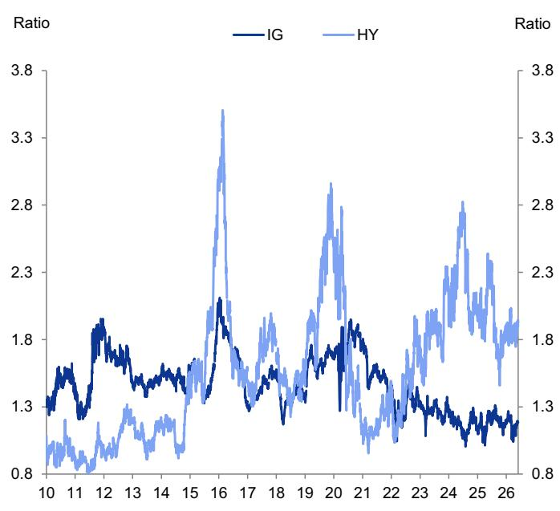

line

| Year | IG    | HY    |
|------|-------|-------|
| 10   | 1.3   | 1.0   |
| 11   | 1.4   | 0.9   |
| 12   | 1.5   | 1.0   |
| 13   | 1.4   | 1.1   |
| 14   | 1.3   | 1.2   |
| 15   | 1.4   | 1.3   |
| 16   | 1.5   | 3.4   |
| 17   | 1.3   | 1.4   |
| 18   | 1.4   | 1.5   |
| 19   | 1.5   | 2.0   |
| 20   | 1.6   | 2.8   |
| 21   | 1.5   | 2.0   |
| 22   | 1.4   | 1.8   |
| 23   | 1.3   | 2.0   |
| 24   | 1.2   | 2.8   |
| 25   | 1.1   | 2.6   |
| 26   | 1.0   | 2.0   |

Source: iBoxx, GS Global Investment Research

Exhibit 28: EUR spread dispersion   
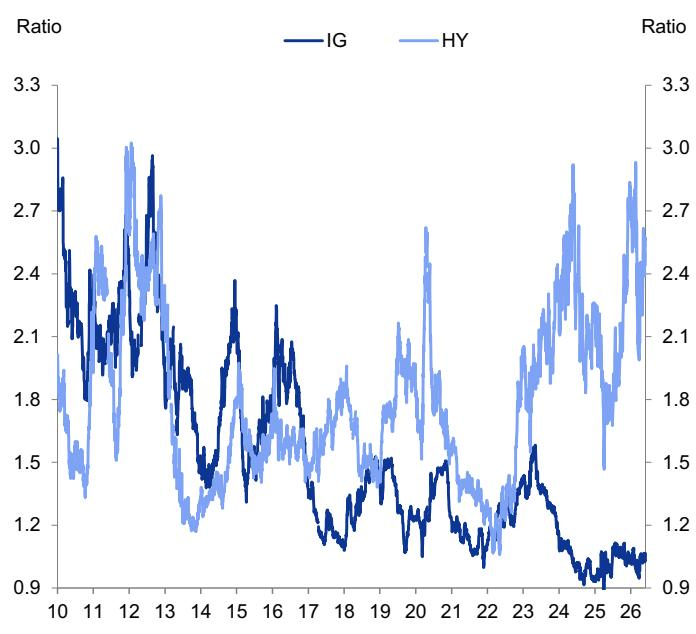

line

| Index | IG    | HY    |
|-------|-------|-------|
| 10    | 3.0   | 1.8   |
| 11    | 2.4   | 1.5   |
| 12    | 2.7   | 2.0   |
| 13    | 2.9   | 1.7   |
| 14    | 2.1   | 1.3   |
| 15    | 2.4   | 1.6   |
| 16    | 2.3   | 1.8   |
| 17    | 1.8   | 1.5   |
| 18    | 1.5   | 1.7   |
| 19    | 1.6   | 1.9   |
| 20    | 1.4   | 2.6   |
| 21    | 1.5   | 2.0   |
| 22    | 1.3   | 1.8   |
| 23    | 1.5   | 2.1   |
| 24    | 1.2   | 2.7   |
| 25    | 0.9   | 2.9   |
| 26    | 0.9   | 2.8   |

Source: iBoxx, GS Global Investment Research

Exhibit 29: USD return dispersion   
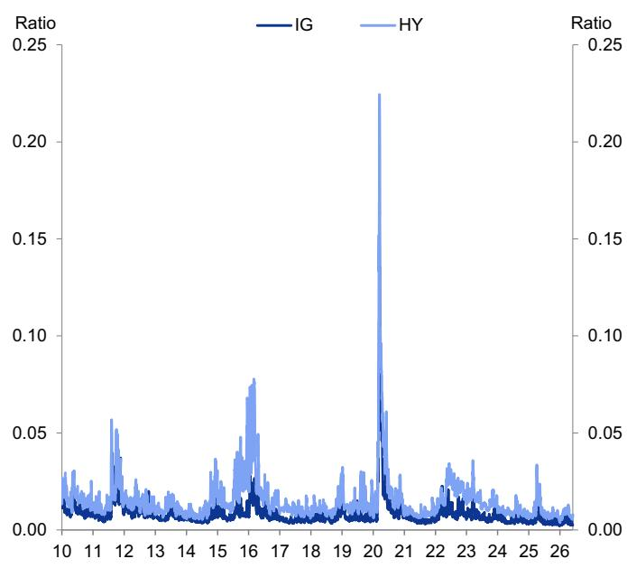

line

| X  | IG    | HY    |
|----|-------|-------|
| 10 | 0.01  | 0.03  |
| 11 | 0.01  | 0.05  |
| 12 | 0.01  | 0.07  |
| 13 | 0.01  | 0.04  |
| 14 | 0.01  | 0.03  |
| 15 | 0.01  | 0.05  |
| 16 | 0.01  | 0.08  |
| 17 | 0.01  | 0.04  |
| 18 | 0.01  | 0.03  |
| 19 | 0.01  | 0.04  |
| 20 | 0.01  | 0.23  |
| 21 | 0.01  | 0.06  |
| 22 | 0.01  | 0.04  |
| 23 | 0.01  | 0.03  |
| 24 | 0.01  | 0.04  |
| 25 | 0.01  | 0.03  |
| 26 | 0.01  | 0.02  |

Source: iBoxx, GS Global Investment Research

Exhibit 30: EUR return dispersion   
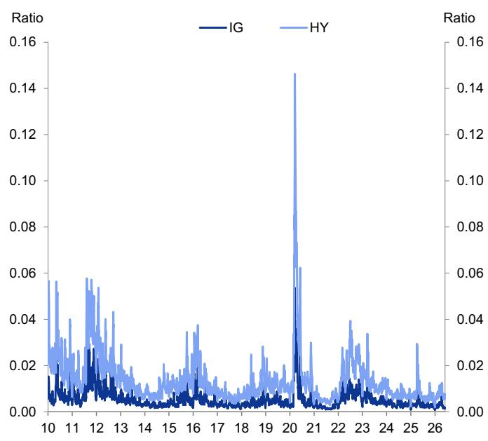

line

| X  | IG    | HY    |
|----|-------|-------|
| 10 | 0.01  | 0.06  |
| 11 | 0.01  | 0.04  |
| 12 | 0.02  | 0.05  |
| 13 | 0.01  | 0.03  |
| 14 | 0.01  | 0.02  |
| 15 | 0.01  | 0.02  |
| 16 | 0.01  | 0.03  |
| 17 | 0.01  | 0.02  |
| 18 | 0.01  | 0.02  |
| 19 | 0.01  | 0.03  |
| 20 | 0.01  | 0.15  |
| 21 | 0.01  | 0.06  |
| 22 | 0.01  | 0.04  |
| 23 | 0.01  | 0.03  |
| 24 | 0.01  | 0.02  |
| 25 | 0.01  | 0.03  |
| 26 | 0.01  | 0.02  |

Source: iBoxx, GS Global Investment Research

# Relative value dashboard: Excess spreads in the USD and EUR markets

Exhibit 31: USD/EUR IG and HY spread differential   
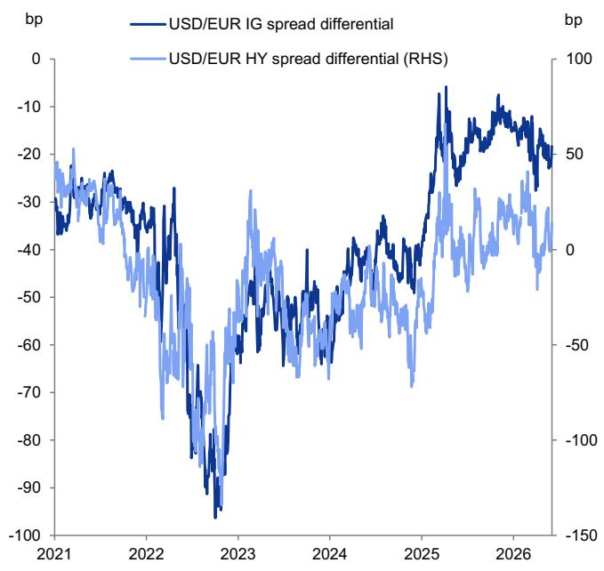

line

| Year | USD/EUR IG spread differential | USD/EUR HY spread differential (RHS) |
|------|--------------------------------|-------------------------------------|
| 2021 | -30                            | -20                                 |
| 2022 | -40                            | -30                                 |
| 2023 | -90                            | -80                                 |
| 2024 | -50                            | -40                                 |
| 2025 | -10                            | -5                                  |
| 2026 | -20                            | -10                                 |

Source: iBoxx, GS Global Investment Research

Exhibit 32: CDX IG/iTraxx Main and CDX HY/iTraxx Xover spread differential   
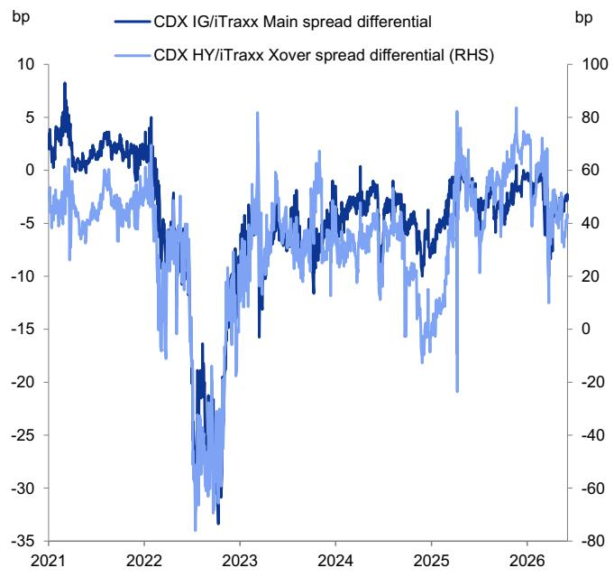

line

| Year | CDX IG/iTraxx Main spread differential | CDX HY/iTraxx Xover spread differential (RHS) |
|------|----------------------------------------|-----------------------------------------------|
| 2021 | ~8                                     | ~-5                                           |
| 2022 | ~-5                                    | ~-10                                          |
| 2023 | ~-35                                   | ~-30                                          |
| 2024 | ~-5                                    | ~-10                                          |
| 2025 | ~-10                                   | ~-20                                          |
| 2026 | ~-5                                    | ~-10                                          |

Source: Bloomberg, GS Global Investment Research

Exhibit 33: IG OAS/Agency MBS spread differential   
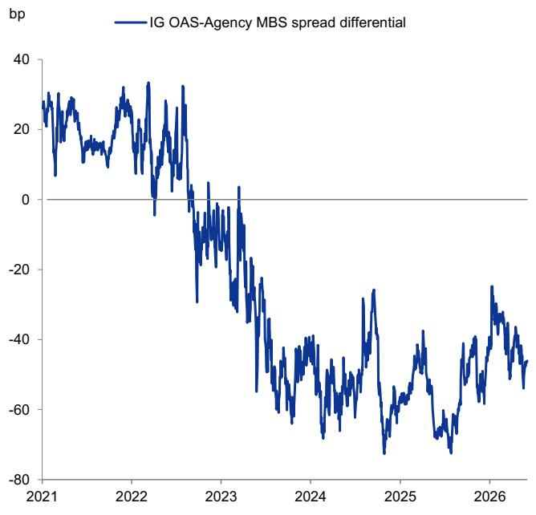

line

| Year | IG OAS-Agency MBS spread differential (bp) |
| ---- | ------------------------------------------ |
| 2021 | ~30                                        |
| 2022 | ~30                                        |
| 2023 | ~-20                                       |
| 2024 | ~-40                                       |
| 2025 | ~-60                                       |
| 2026 | ~-40                                       |

Source: Bloomberg, GS Global Investment Research

Exhibit 34: Leveraged loans/HY spread differential   
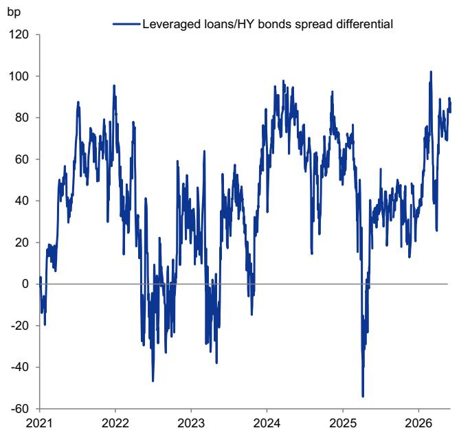

line

| Year | Leveraged loans/HY bonds spread differential (bp) |
| ---- | ----------------------------------------------- |
| 2021 | -20                                             |
| 2022 | 95                                              |
| 2023 | -40                                             |
| 2024 | 85                                              |
| 2025 | -50                                             |
| 2026 | 100                                             |

Source: Bloomberg, Morningstar LCD, GS Global Investment Research

# Performance dashboard: Biggest movers in the USD bond market

Exhibit 35: Top and bottom 20 performers in the USD IG market 

<table><tr><td>Issuer</td><td>Sector</td><td>Security</td><td>Amount outstanding ($mn)</td><td>Ratings (Moody&#x27;s/S&amp;P/Fitch)</td><td>1-week price return (%)</td><td>1-week price change (pts)</td><td>Current price</td></tr><tr><td colspan="8">Top 20 performers</td></tr><tr><td>Flowers Foods Inc</td><td>Food</td><td>FLO 6.2 03/15/55</td><td>300</td><td>Baa3/BBB-/BBB-</td><td>2.6%</td><td>2.2</td><td>85.08</td></tr><tr><td>Concentrix Corp</td><td>Software</td><td>CNXC 6.85 08/02/33</td><td>550</td><td>Baa3/BBB-/BBB</td><td>1.9%</td><td>1.8</td><td>91.59</td></tr><tr><td>Santander Uk Group Hldgs</td><td>Banks</td><td>SANUK 5.136 09/22/36</td><td>1,000</td><td>Baa1/BBB/A</td><td>1.7%</td><td>1.6</td><td>97.15</td></tr><tr><td>Phillips Edison Grocery</td><td>REITS</td><td>PECO 2 5/8 11/15/31</td><td>350</td><td>Baa2/BBB/--</td><td>1.6%</td><td>1.4</td><td>87.36</td></tr><tr><td>Salesforce Inc</td><td>Software</td><td>CRM 6.7 03/15/66</td><td>1,000</td><td>A2/A+/-</td><td>1.5%</td><td>1.5</td><td>103.18</td></tr><tr><td>American Honda Finance</td><td>Auto Manufacturers</td><td>HNDA 5.1 01/08/36</td><td>500</td><td>A3/BBB+/A-</td><td>1.4%</td><td>1.4</td><td>98.59</td></tr><tr><td>Nvidia Corp</td><td>Semiconductors</td><td>NVDA 2.85 04/01/30</td><td>1,500</td><td>Aa1/AA-/-</td><td>1.4%</td><td>1.3</td><td>94.92</td></tr><tr><td>Ford Motor Company</td><td>Auto Manufacturers</td><td>F 6.1 08/19/32</td><td>1,750</td><td>Ba1/BBB-/BBB-</td><td>1.3%</td><td>1.4</td><td>102.57</td></tr><tr><td>Vale Overseas Limited</td><td>Iron/Steel</td><td>VALEBZ 3 3/4 07/08/30</td><td>1,500</td><td>--/--/--</td><td>1.3%</td><td>1.3</td><td>95.69</td></tr><tr><td>Humana Inc</td><td>Healthcare-Services</td><td>HUM 4.8 03/15/47</td><td>400</td><td>Baa2/BBB/BBB-</td><td>1.3%</td><td>1.1</td><td>82.96</td></tr><tr><td>Paypal Holdings Inc</td><td>Commercial Services</td><td>PYPL 5.15 06/01/34</td><td>850</td><td>A3/A-/A-</td><td>1.2%</td><td>1.2</td><td>99.64</td></tr><tr><td>Dick&#x27;S Sporting Goods</td><td>Retail</td><td>DKS 4.1 01/15/52</td><td>750</td><td>Baa2/BBB/--</td><td>1.2%</td><td>0.9</td><td>72.37</td></tr><tr><td>Hp Enterprise Co</td><td>Computers</td><td>HPE 5.6 10/15/54</td><td>1,500</td><td>Baa2/BBB/BBB+</td><td>1.1%</td><td>1.1</td><td>92.60</td></tr><tr><td>Helmerich &amp; Payne Inc</td><td>Oil&amp;Gas</td><td>HP 5 1/2 12/01/34</td><td>549</td><td>Baa2/BBB/--</td><td>1.1%</td><td>1.1</td><td>98.86</td></tr><tr><td>Dentsply Sirona Inc</td><td>Healthcare-Products</td><td>XRAY 3 1/4 06/01/30</td><td>750</td><td>Baa2/BBB-/-</td><td>1.1%</td><td>1.0</td><td>92.60</td></tr><tr><td>JPM Chase &amp; Co</td><td>Banks</td><td>JPM 4 1/4 10/01/27</td><td>1,500</td><td>A2/A-/A</td><td>1.1%</td><td>1.1</td><td>99.75</td></tr><tr><td>Charter Comm Opt Llc/Cap</td><td>Media</td><td>CHTR 5 1/8 07/01/49</td><td>1,250</td><td>Ba1/BBB-/BBB-</td><td>1.1%</td><td>0.8</td><td>76.89</td></tr><tr><td>Johnson &amp; Johnson</td><td>Pharmaceuticals</td><td>JNJ 3 5/8 03/03/37</td><td>1,500</td><td>Aaa/AAA/--</td><td>1.0%</td><td>0.9</td><td>89.58</td></tr><tr><td>Block Financial Llc</td><td>Commercial Services</td><td>HRB 5 3/8 09/15/32</td><td>350</td><td>Baa3/BBB/--</td><td>1.0%</td><td>1.0</td><td>98.52</td></tr><tr><td>Comcast Corp</td><td>Media</td><td>CMCSA 4.049 11/01/52</td><td>1,006</td><td>A3/A-/A-</td><td>1.0%</td><td>0.7</td><td>72.25</td></tr><tr><td colspan="8">Bottom 20 performers</td></tr><tr><td>Ibm Corp</td><td>Computers</td><td>IBM 5.1 02/06/53</td><td>650</td><td>A3/A-/A-</td><td>-3.5%</td><td>-3.2</td><td>92.40</td></tr><tr><td>Kilroy Realty Lp</td><td>REITS</td><td>KRC 2.65 11/15/33</td><td>450</td><td>Baa3/BBB-/BBB-</td><td>-3.1%</td><td>-2.5</td><td>83.06</td></tr><tr><td>Ford Motor Company</td><td>Auto Manufacturers</td><td>F 5.291 12/08/46</td><td>1,300</td><td>Ba1/BBB-/BBB-</td><td>-3.1%</td><td>-2.6</td><td>84.03</td></tr><tr><td>Booz Allen Hamilton Inc</td><td>Computers</td><td>BAH 5.95 08/04/33</td><td>650</td><td>Baa3/BBB-/-</td><td>-2.7%</td><td>-2.8</td><td>105.35</td></tr><tr><td>Fiserv Inc</td><td>Software</td><td>FISV 5 5/8 08/21/33</td><td>1,300</td><td>Baa2/BBB/--</td><td>-2.5%</td><td>-2.6</td><td>103.60</td></tr><tr><td>Flowers Foods Inc</td><td>Food</td><td>FLO 2.4 03/15/31</td><td>500</td><td>Baa3/BBB-/BBB-</td><td>-2.5%</td><td>-2.2</td><td>88.45</td></tr><tr><td>Reinsurance Grp Of Amer</td><td>Insurance</td><td>RGA 5 3/4 09/15/34</td><td>650</td><td>Baa1/A/BBB+</td><td>-2.4%</td><td>-2.5</td><td>104.82</td></tr><tr><td>At&amp;T Inc</td><td>Telecommunications</td><td>T 4.85 03/01/39</td><td>956</td><td>Baa2/BBB/BBB+</td><td>-2.4%</td><td>-2.3</td><td>95.21</td></tr><tr><td>Gartner Inc</td><td>Computers</td><td>IT 4.95 03/20/31</td><td>350</td><td>Baa3/BBB-/BBB</td><td>-2.4%</td><td>-2.4</td><td>99.76</td></tr><tr><td>Brookfield Finance Inc</td><td>Private Equity</td><td>BNCN 5.675 01/15/35</td><td>450</td><td>A3/A-/A-</td><td>-2.3%</td><td>-2.4</td><td>103.78</td></tr><tr><td>Johnson &amp; Johnson</td><td>Pharmaceuticals</td><td>JNJ 4.95 06/01/34</td><td>850</td><td>Aaa/AAA/--</td><td>-2.3%</td><td>-2.4</td><td>105.17</td></tr><tr><td>Kemper Corp</td><td>Insurance</td><td>KMPR 2.4 09/30/30</td><td>400</td><td>Baa3/BBB-/BBB-</td><td>-2.3%</td><td>-2.0</td><td>89.41</td></tr><tr><td>Altria Group Inc</td><td>Agriculture</td><td>MO 5 1/4 08/06/35</td><td>500</td><td>A3/BBB+/BBB+</td><td>-2.1%</td><td>-2.2</td><td>101.97</td></tr><tr><td>Nextera Energy Capital</td><td>Electric</td><td>NEE 5 1/4 02/28/53</td><td>1,150</td><td>Baa1/BBB+/A-</td><td>-2.0%</td><td>-1.8</td><td>91.08</td></tr><tr><td>RJ Financial</td><td>Diversified Finan Serv</td><td>RJF 4.9 09/11/35</td><td>650</td><td>A3/A-/A-</td><td>-2.0%</td><td>-2.0</td><td>99.14</td></tr><tr><td>Cigna Group/The</td><td>Healthcare-Services</td><td>CI 4.8 08/15/38</td><td>2,195</td><td>Baa1/A-/BBB+</td><td>-2.0%</td><td>-1.9</td><td>96.36</td></tr><tr><td>Sempra</td><td>Electric</td><td>SRE 6 3/8 04/01/56</td><td>800</td><td>Baa3/BBB-/BBB-</td><td>-2.0%</td><td>-2.0</td><td>102.68</td></tr><tr><td>Eli Lilly &amp; Co</td><td>Pharmaceuticals</td><td>LLY 4.9 10/15/35</td><td>1,250</td><td>Aa3/AA-/-</td><td>-1.9%</td><td>-2.0</td><td>101.55</td></tr><tr><td>At&amp;T Inc</td><td>Telecommunications</td><td>T 5.55 08/15/41</td><td>541</td><td>Baa2/BBB/BBB+</td><td>-1.9%</td><td>-1.9</td><td>98.05</td></tr><tr><td>General Motors Co</td><td>Auto Manufacturers</td><td>GM 5.2 04/01/45</td><td>1,250</td><td>Baa2/BBB/BBB</td><td>-1.9%</td><td>-1.7</td><td>88.98</td></tr></table>

Note: Only Bloomberg index-eligible bonds.   
Source: Bloomberg, TRACE, data compiled by GS Global Investment Research

Exhibit 36: Top and bottom 20 performers in the USD HY market 

<table><tr><td>Issuer</td><td>Sector</td><td>Security</td><td>Amount outstanding ($mn)</td><td>Ratings (Moody&#x27;s/S&amp;P/Fitch)</td><td>1-week price return (%)</td><td>1-week price change (pts)</td><td>Current price</td></tr><tr><td colspan="8">Top 20 performers</td></tr><tr><td>Csc Holdings Llc</td><td>Media</td><td>CSCHLD 5 11/15/31</td><td>500</td><td>Ca/CCC/--</td><td>12.8%</td><td>3.0</td><td>23.50</td></tr><tr><td>Csc Holdings Llc</td><td>Media</td><td>CSCHLD 3 3/8 02/15/31</td><td>1,000</td><td>Caa2/CCC+/-</td><td>5.0%</td><td>2.8</td><td>55.50</td></tr><tr><td>Xerox Corporation</td><td>Office/Business Equip</td><td>XRX 13 1/2 04/15/31</td><td>500</td><td>Caa1/CCC/-</td><td>4.4%</td><td>2.9</td><td>67.00</td></tr><tr><td>Xerox Corporation</td><td>Office/Business Equip</td><td>XRX 4.8 03/01/35</td><td>250</td><td>Ca/CCC/-</td><td>4.1%</td><td>1.5</td><td>36.03</td></tr><tr><td>Csc Holdings Llc</td><td>Media</td><td>CSCHLD 4 1/2 11/15/31</td><td>1,500</td><td>Caa2/CCC+/-</td><td>4.0%</td><td>2.3</td><td>56.75</td></tr><tr><td>Csc Holdings Llc</td><td>Media</td><td>CSCHLD 4 1/8 12/01/30</td><td>1,100</td><td>Caa2/CCC+/-</td><td>3.9%</td><td>2.3</td><td>57.00</td></tr><tr><td>Ziprecruiter Inc</td><td>Internet</td><td>ZIP 5 01/15/30</td><td>550</td><td>B3/B/B</td><td>3.7%</td><td>2.5</td><td>68.72</td></tr><tr><td>Taylor Morrison Comm</td><td>Home Builders</td><td>TMHC 5 3/4 11/15/32</td><td>525</td><td>Ba1/BB+/-</td><td>3.1%</td><td>3.1</td><td>100.48</td></tr><tr><td>Csc Holdings Llc</td><td>Media</td><td>CSCHLD 6 1/2 02/01/29</td><td>1,750</td><td>Caa2/CCC+/-</td><td>2.5%</td><td>1.5</td><td>59.00</td></tr><tr><td>Cnt Prnt/Cdk Glo li/Fin</td><td>Software</td><td>CDK 8 06/15/29</td><td>755</td><td>B3/B-/-</td><td>2.3%</td><td>1.3</td><td>55.00</td></tr><tr><td>Cleveland-Cliffs Inc</td><td>Iron/Steel</td><td>CLF 6 1/4 10/01/40</td><td>235</td><td>B3/B-/B-</td><td>1.8%</td><td>1.5</td><td>81.90</td></tr><tr><td>Iheartcommunications Inc</td><td>Media</td><td>IHRT 10 7/8 05/01/30</td><td>675</td><td>Caa3/CCC-/-</td><td>1.8%</td><td>1.5</td><td>85.00</td></tr><tr><td>Paramount Global</td><td>Media</td><td>PARA 5.85 09/01/43</td><td>1,250</td><td>Baa3/BB+/BB+</td><td>1.7%</td><td>1.3</td><td>73.75</td></tr><tr><td>Taylor Morrison Comm</td><td>Home Builders</td><td>TMHC 5 1/8 08/01/30</td><td>500</td><td>Ba1/BB+/-</td><td>1.6%</td><td>1.6</td><td>99.13</td></tr><tr><td>Sabre Glbl Inc</td><td>Leisure Time</td><td>SABHLD 10 3/4 03/15/30</td><td>470</td><td>B3/B-/-</td><td>1.3%</td><td>1.2</td><td>89.05</td></tr><tr><td>Virtusa Corp</td><td>Computers</td><td>VRTU 7 1/8 12/15/28</td><td>350</td><td>Caa1/B-/-</td><td>1.2%</td><td>1.0</td><td>83.27</td></tr><tr><td>Paramount Global</td><td>Media</td><td>PARA 4 3/8 03/15/43</td><td>1,446</td><td>Baa3/BB+/BB+</td><td>1.2%</td><td>0.8</td><td>63.75</td></tr><tr><td>Amc Entertainment Hldgs</td><td>Entertainment</td><td>AMC 7 1/2 02/15/29</td><td>360</td><td>Caa3/CCC+/-</td><td>1.1%</td><td>1.0</td><td>87.25</td></tr><tr><td>Long Ridge Energy Llc</td><td>Electric</td><td>LONRID 8 3/4 02/15/32</td><td>600</td><td>B1/B/-</td><td>1.1%</td><td>1.1</td><td>103.75</td></tr><tr><td>Innophos Holdings Inc</td><td>Chemicals</td><td>IPHS 11 1/2 06/15/29</td><td>461</td><td>Caa1/B-/-</td><td>1.0%</td><td>1.0</td><td>94.00</td></tr><tr><td colspan="8">Bottom 20 performers</td></tr><tr><td>Cntrl Parent/Cdk Glb Inc</td><td>Software</td><td>CDK 7 1/4 06/15/29</td><td>750</td><td>B3/B-/-</td><td>-27.0%</td><td>-18.8</td><td>69.50</td></tr><tr><td>Csc Holdings Llc</td><td>Media</td><td>CSCHLD 7 1/2 04/01/28</td><td>1,046</td><td>Ca/CCC-/-</td><td>-10.3%</td><td>-3.5</td><td>34.00</td></tr><tr><td>Jetblue Airways/Loyalty</td><td>Airlines</td><td>JBLU 9 7/8 09/20/31</td><td>2,000</td><td>Caa1/B+/B</td><td>-5.4%</td><td>-5.0</td><td>92.13</td></tr><tr><td>Whirlpool Corp</td><td>Home Furnishings</td><td>WHR 4 1/2 06/01/46</td><td>500</td><td>B2/B+/BB-</td><td>-5.0%</td><td>-3.2</td><td>63.69</td></tr><tr><td>Whirlpool Corp</td><td>Home Furnishings</td><td>WHR 4.6 05/15/50</td><td>500</td><td>B2/B+/BB-</td><td>-4.6%</td><td>-2.9</td><td>63.19</td></tr><tr><td>Lcpr Sr Secured Fin Dac</td><td>Media</td><td>LILAPR 6 3/4 10/15/27</td><td>1,161</td><td>Caa3/CCC+/CCC+</td><td>-3.9%</td><td>-2.5</td><td>64.49</td></tr><tr><td>Embeca Corp</td><td>Healthcare-Products</td><td>EMBC 5 02/15/30</td><td>500</td><td>B3/B/-</td><td>-3.1%</td><td>-2.4</td><td>77.50</td></tr><tr><td>Embarq Llc</td><td>Telecommunications</td><td>EMBARQ 7.995 06/01/36</td><td>1,215</td><td>Ca/CCC-/-</td><td>-3.0%</td><td>-0.8</td><td>27.00</td></tr><tr><td>Goodyear Tire &amp; Rubber</td><td>Auto Parts&amp;Equipment</td><td>GT 5 5/8 04/30/33</td><td>450</td><td>B2/B+/BB-</td><td>-3.0%</td><td>-2.6</td><td>87.13</td></tr><tr><td>Csc Holdings Llc</td><td>Media</td><td>CSCHLD 11 3/4 01/31/29</td><td>2,050</td><td>Caa2/CCC+/-</td><td>-2.9%</td><td>-1.9</td><td>64.00</td></tr><tr><td>Csc Holdings Llc</td><td>Media</td><td>CSCHLD 11 1/4 05/15/28</td><td>1,000</td><td>Caa2/CCC+/-</td><td>-2.6%</td><td>-1.8</td><td>66.63</td></tr><tr><td>Cobra Acquisitionco Llc</td><td>Diversified Finan Serv</td><td>EXETFI 6 3/8 11/01/29</td><td>400</td><td>B3/CCC/B-</td><td>-2.6%</td><td>-2.2</td><td>86.50</td></tr><tr><td>Whirlpool Corp</td><td>Home Furnishings</td><td>WHR 5 3/4 03/01/34</td><td>300</td><td>B2/B+/BB-</td><td>-2.5%</td><td>-2.1</td><td>83.61</td></tr><tr><td>Whirlpool Corp</td><td>Home Furnishings</td><td>WHR 6 1/2 06/15/33</td><td>600</td><td>B2/B+/BB-</td><td>-2.5%</td><td>-2.3</td><td>90.75</td></tr><tr><td>Whirlpool Corp</td><td>Home Furnishings</td><td>WHR 4.7 05/14/32</td><td>300</td><td>B2/B+/BB-</td><td>-2.4%</td><td>-2.0</td><td>82.50</td></tr><tr><td>Chs/Community Health Sys</td><td>Healthcare-Services</td><td>CYH 6 1/8 04/01/30</td><td>1,227</td><td>Caa3/CCC-/CCC-</td><td>-2.3%</td><td>-2.1</td><td>91.13</td></tr><tr><td>Navient Corp</td><td>Diversified Finan Serv</td><td>NAVI 9 3/8 10/15/31</td><td>500</td><td>Ba3/BB-/BB-</td><td>-2.2%</td><td>-2.2</td><td>101.55</td></tr><tr><td>Kingpin Intermediate Ho</td><td>Leisure Time</td><td>LUCK 7 1/4 10/15/32</td><td>500</td><td>B3/B/-</td><td>-2.1%</td><td>-1.9</td><td>87.25</td></tr><tr><td>Owens-Brockway</td><td>Packaging&amp;Containers</td><td>OI 7 1/4 05/15/31</td><td>690</td><td>B3/B+/-</td><td>-2.1%</td><td>-2.1</td><td>98.43</td></tr><tr><td>Whirlpool Corp</td><td>Home Furnishings</td><td>WHR 5 1/2 03/01/33</td><td>300</td><td>B2/B+/BB-</td><td>-2.1%</td><td>-1.8</td><td>83.75</td></tr></table>

Note: Only Bloomberg index-eligible bonds.   
Source: Bloomberg, TRACE, data compiled by GS Global Investment Research

# Valuation dashboard: Percentile ranks for spreads and yields

Exhibit 37: Percentile ranks for spreads across markets (2000-current)   
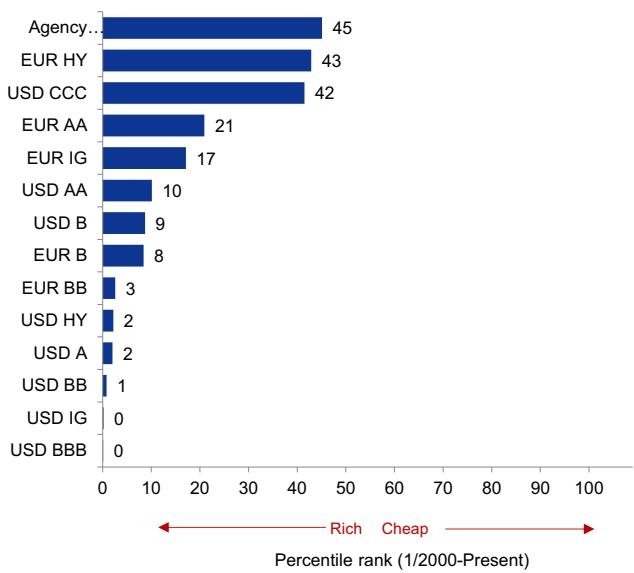

bar

| Currency Pair | Percentile Rank (1/2000-Present) |
|---|---|
| Agency... | 45 |
| EUR HY | 43 |
| USD CCC | 42 |
| EUR AA | 21 |
| EUR IG | 17 |
| USD AA | 10 |
| USD B | 9 |
| EUR B | 8 |
| EUR BB | 3 |
| USD HY | 2 |
| USD A | 2 |
| USD BB | 1 |
| USD IG | 0 |
| USD BBB | 0 |

Source: Bloomberg, GS Global Investment Research

Exhibit 38: Percentile ranks for spreads across markets (2010-current)   
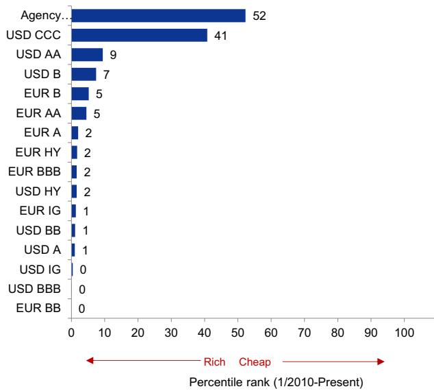

bar

| Currency Pair | Percentile Rank (1/2010-Present) |
|---|---|
| Agency... | 52 |
| USD CCC | 41 |
| USD AA | 9 |
| USD B | 7 |
| EUR B | 5 |
| EUR AA | 5 |
| EUR A | 2 |
| EUR HY | 2 |
| EUR BBB | 2 |
| USD HY | 2 |
| EUR IG | 1 |
| USD BB | 1 |
| USD A | 1 |
| USD IG | 0 |
| USD BBB | 0 |
| EUR BB | 0 |

Source: Bloomberg, GS Global Investment Research

Exhibit 39: Percentile ranks for yields across markets (2000-current)   
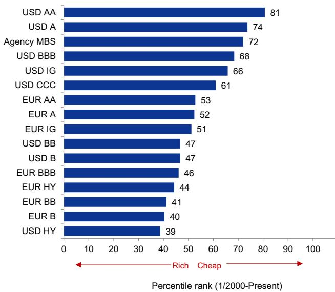

bar

| Currency Pair | Percentile Rank (1/2000-Present) |
|---|---|
| USD AA | 81 |
| USD A | 74 |
| Agency MBS | 72 |
| USD BBB | 68 |
| USD IG | 66 |
| USD CCC | 61 |
| EUR AA | 53 |
| EUR A | 52 |
| EUR IG | 51 |
| USD BB | 47 |
| USD B | 47 |
| EUR BBB | 46 |
| EUR HY | 44 |
| EUR BB | 41 |
| EUR B | 40 |
| USD HY | 39 |
Rich Cheap indicated between USD AA and USD BB.

Source: Bloomberg, GS Global Investment Research

Exhibit 40: Percentile ranks for yields across markets (2010-current)   
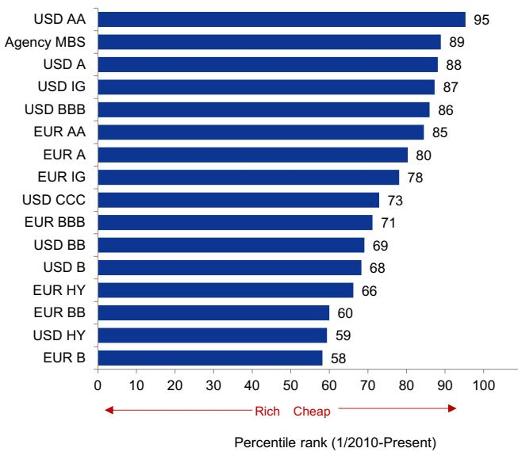

bar

| Currency Pair | Percentile Rank (1/2010-Present) |
|---|---|
| USD AA | 95 |
| Agency MBS | 89 |
| USD A | 88 |
| USD IG | 87 |
| USD BBB | 86 |
| EUR AA | 85 |
| EUR A | 80 |
| EUR IG | 78 |
| USD CCC | 73 |
| EUR BBB | 71 |
| USD BB | 69 |
| USD B | 68 |
| EUR HY | 66 |
| EUR BB | 60 |
| USD HY | 59 |
| EUR B | 58 |
Rich Cheap

Source: Bloomberg, GS Global Investment Research

# Valuation dashboard: Sizing the carry in USD and EUR fixed income markets

Exhibit 41: Average yield vs. total market value outstanding across the USD fixed income complex   
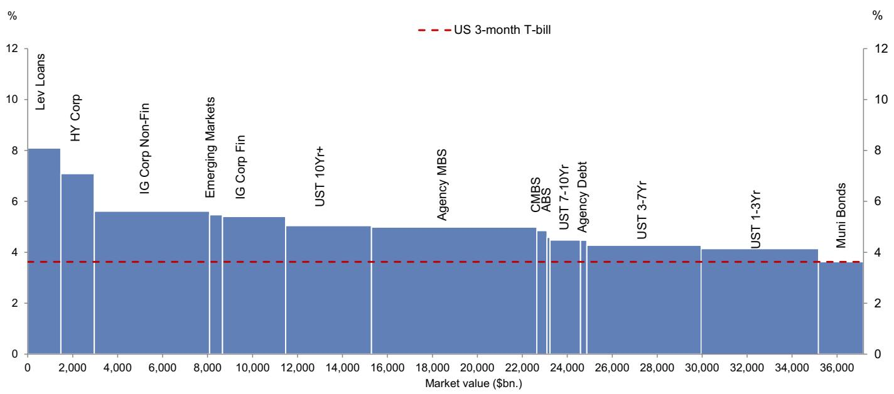

bar

| Category | Market value ($bn.) |
| :--- | :--- |
| Lev Loans | 8.1 |
| HY Corp | 7.1 |
| IG Corp Non-Fin | 5.6 |
| Emerging Markets | 5.5 |
| IG Corp Fin | 5.4 |
| UST 10Yr+ | 5.0 |
| Agency MBS | 4.9 |
| CMBS ABS | 4.8 |
| UST 7-10Yr | 4.5 |
| Agency Debt | 4.4 |
| UST 3-7Yr | 4.2 |
| UST 1-3Yr | 4.1 |
| Muni Bonds | 3.7 |

Note: We use the iBoxx indices for the IG corporate credit and US Treasury markets, the Bloomberg indices for the HY, MBS, CMBS and ABS markets, and the Morningstar LSTA index for the leveraged loan market.   
Source: iBoxx, Bloomberg, Pitchbook LCD, GS Global Investment Research

Exhibit 42: Average yield vs. total market value outstanding for the EUR fixed income markets   
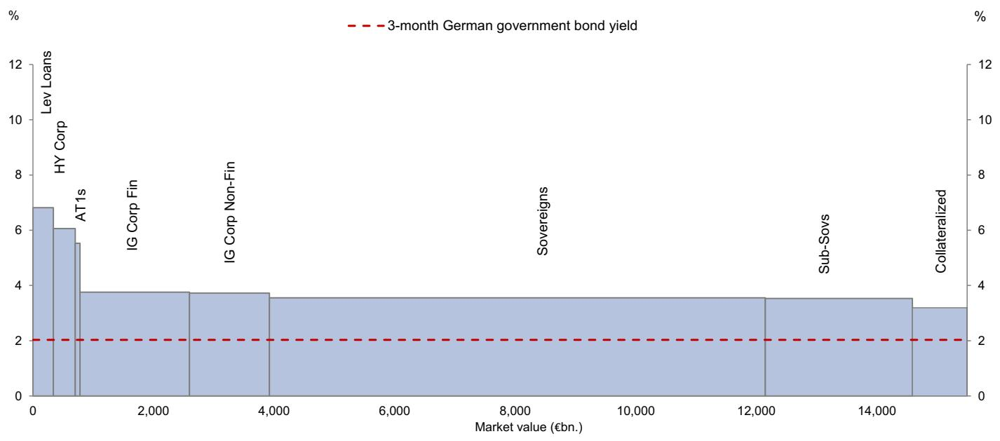

bar

| Bond Type         | Market Value (€bn.) |
| ----------------- | ------------------- |
| Lev Loans         | 7                   |
| HY Corp           | 6                   |
| AT1s              | 5.5                 |
| IG Corp Fin       | 3.8                 |
| IG Corp Non-Fin   | 3.8                 |
| Sovereigns        | 3.7                 |
| Sub-Sovs          | 3.6                 |
| Collateralized    | 3.3                 |

Source: iBoxx, GS Global Investment Research

# Valuation dashboard: Macro index volatility

Note: Skew is calculated using difference in 3m implied volatility between 25-delta payers and receivers, divided by 3m ATM implied volatility.

Exhibit 43: CDX IG and iTraxx Main vol 3m ATM implied volatility   
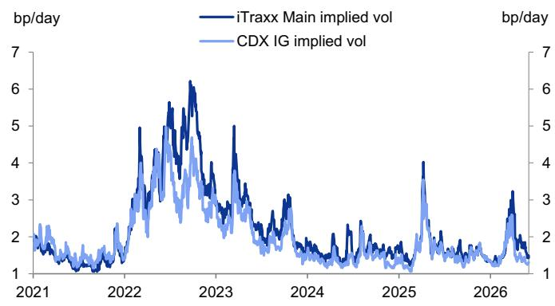

line

| Year | iTraxx Main implied vol | CDX IG implied vol |
|------|------------------------|--------------------|
| 2021 | ~1.5                   | ~1.8               |
| 2022 | ~3.0                   | ~2.5               |
| 2023 | ~6.0                   | ~4.5               |
| 2024 | ~2.0                   | ~1.8               |
| 2025 | ~4.0                   | ~3.5               |
| 2026 | ~1.5                   | ~1.8               |

Source: GS, GS Global Investment Research

Exhibit 44: CDX HY and iTraxx Xover vol 3m ATM implied volatility   
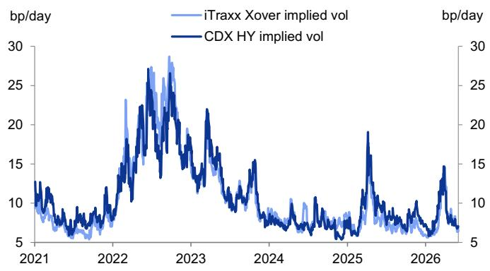

line

| Year | iTraxx Xover implied vol (bp/day) | CDX HY implied vol (bp/day) |
|------|-----------------------------------|-----------------------------|
| 2021 | ~8                                | ~10                         |
| 2022 | ~15                               | ~18                         |
| 2023 | ~28                               | ~25                         |
| 2024 | ~10                               | ~15                         |
| 2025 | ~8                                | ~10                         |
| 2026 | ~7                                | ~15                         |

Source: GS, GS Global Investment Research

Exhibit 45: CDX IG and iTraxx Main skew   
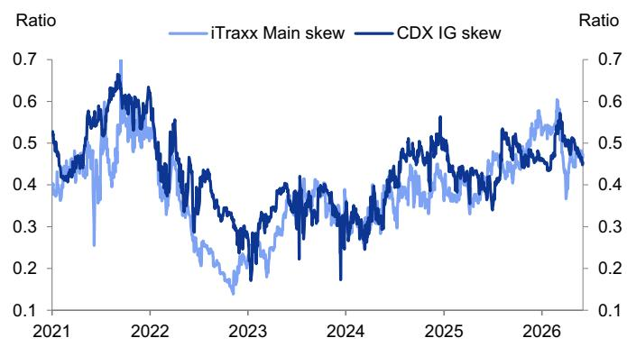

line

| Year | iTraxx Main skew | CDX IG skew |
|------|------------------|-------------|
| 2021 | ~0.4             | ~0.5        |
| 2022 | ~0.6             | ~0.6        |
| 2023 | ~0.1             | ~0.3        |
| 2024 | ~0.4             | ~0.3        |
| 2025 | ~0.5             | ~0.5        |
| 2026 | ~0.6             | ~0.5        |

Source: GS, GS Global Investment Research

Exhibit 46: CDX HY and iTraxx Xover skew   
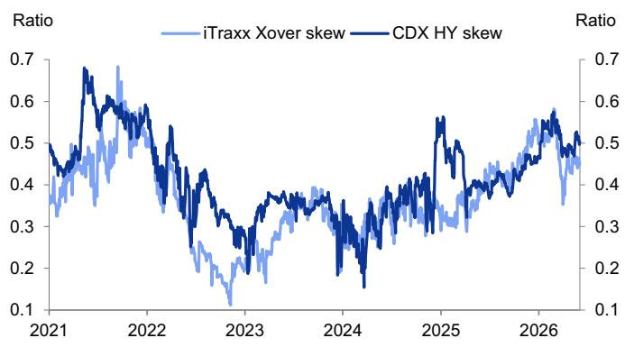

line

| Year | iTraxx Xover skew | CDX HY skew |
|------|-------------------|-------------|
| 2021 | ~0.45             | ~0.5        |
| 2022 | ~0.35             | ~0.55       |
| 2023 | ~0.1              | ~0.3        |
| 2024 | ~0.3              | ~0.4        |
| 2025 | ~0.4              | ~0.55       |
| 2026 | ~0.5              | ~0.55       |

Source: GS, GS Global Investment Research

Exhibit 47: CDX IG and iTraxx Main ATM implied volatility term structure   
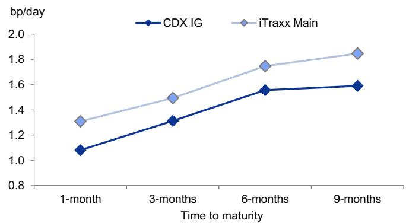

line

| Time to maturity | CDX IG | iTraxx Main |
| ---------------- | ------ | ----------- |
| 1-month          | 1.08   | 1.32        |
| 3-months         | 1.32   | 1.48        |
| 6-months         | 1.56   | 1.76        |
| 9-months         | 1.58   | 1.86        |

Source: GS, GS Global Investment Research

Exhibit 48: CDX HY and iTraxx Xover ATM implied volatility term structure   
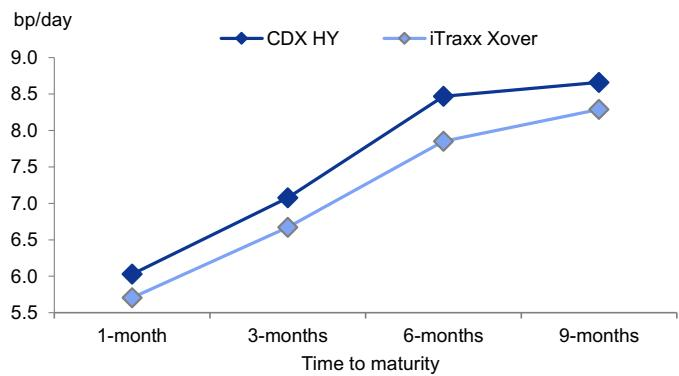

line

| Time to maturity | CDX HY | iTraxx Xover |
| ---------------- | ------ | ------------ |
| 1-month          | 6.0    | 5.7          |
| 3-months         | 7.1    | 6.7          |
| 6-months         | 8.5    | 7.9          |
| 9-months         | 8.7    | 8.3          |

Source: GS, GS Global Investment Research

# Valuation dashboard: CLOs

Exhibit 49: CLO spread percentile ranks 

<table><tr><td rowspan="2">USD</td><td rowspan="2">Current spread (bp)</td><td colspan="3">Percentile rank</td></tr><tr><td>3-year</td><td>5-year</td><td>10-year</td></tr><tr><td>AAA</td><td>106</td><td>14%</td><td>8%</td><td>4%</td></tr><tr><td>AA</td><td>143</td><td>3%</td><td>2%</td><td>1%</td></tr><tr><td>A</td><td>163</td><td>0%</td><td>0%</td><td>0%</td></tr><tr><td>BBB</td><td>283</td><td>32%</td><td>20%</td><td>14%</td></tr><tr><td>BB</td><td>758</td><td>62%</td><td>57%</td><td>64%</td></tr></table>

Source: Bloomberg, GS Global Investment Research

# Exhibit 51: CLO new issue arbitrage spread

New issue CLO arbitrage spread, i.e., the difference between new issue loan spreads and new issue CLO spreads (across the capital stack)

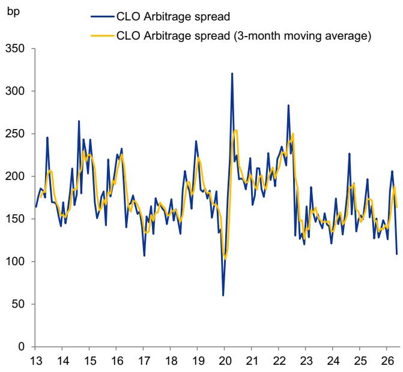

line

| Year | CLO Arbitrage spread | CLO Arbitrage spread (3-month moving average) |
|------|----------------------|-----------------------------------------------|
| 13   | ~180                 | ~175                                          |
| 14   | ~240                 | ~200                                          |
| 15   | ~260                 | ~220                                          |
| 16   | ~230                 | ~225                                          |
| 17   | ~170                 | ~160                                          |
| 18   | ~180                 | ~170                                          |
| 19   | ~240                 | ~210                                          |
| 20   | ~60                  | ~100                                          |
| 21   | ~220                 | ~250                                          |
| 22   | ~280                 | ~240                                          |
| 23   | ~180                 | ~160                                          |
| 24   | ~150                 | ~140                                          |
| 25   | ~230                 | ~190                                          |
| 26   | ~110                 | ~170                                          |

Source: Pitchbook LCD, GS Global Investment Research

Exhibit 50: CLO equity vs. CLO BB yield   
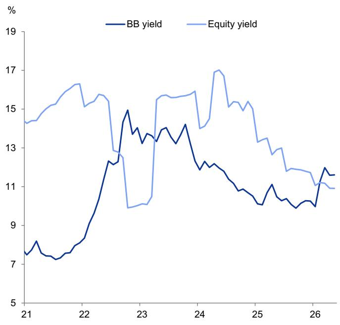

line

| Year | BB yield | Equity yield |
|------|----------|--------------|
| 21   | 7.5      | 14.5         |
| 22   | 8.5      | 15.5         |
| 23   | 13.0     | 9.5          |
| 24   | 12.0     | 17.0         |
| 25   | 10.5     | 13.0         |
| 26   | 11.5     | 11.0         |

Source: Intex, Bloomberg, GS Global Investment Research

# Exhibit 52: CLO vs. USD IG spread differential

CLO by rating and USD IG bond by rating spread differential

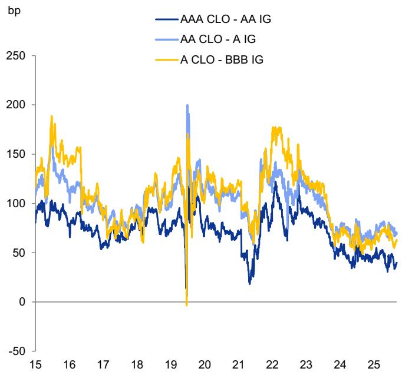

line

| Year | AAA CLO - AA IG | AA CLO - A IG | A CLO - BBB IG |
|------|-----------------|---------------|----------------|
| 15   | ~100            | ~130          | ~140           |
| 16   | ~90             | ~120          | ~180           |
| 17   | ~70             | ~90           | ~150           |
| 18   | ~80             | ~100          | ~130           |
| 19   | ~90             | ~140          | ~150           |
| 20   | ~100            | ~140          | ~170           |
| 21   | ~20             | ~80           | ~120           |
| 22   | ~120            | ~130          | ~180           |
| 23   | ~90             | ~120          | ~160           |
| 24   | ~60             | ~80           | ~100           |
| 25   | ~40             | ~70           | ~60            |

Source: Bloomberg, GS Global Investment Research

# USD IG and HY Sentiment indicators

Exhibit 53: IG Weekly sentiment indicator   
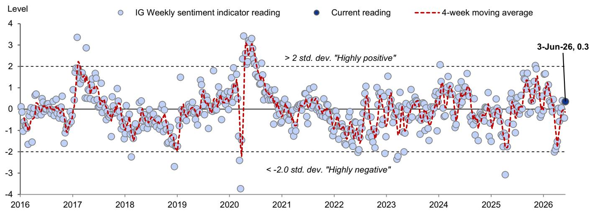

scatter

| Date       | IG Weekly sentiment indicator reading | Current reading |
| ---------- | -------------------------------------- | --------------- |
| 3-Jun-26   | 0.3                                    | 0.3             |

Source: See table below.

Exhibit 54: HY Weekly sentiment indicator   
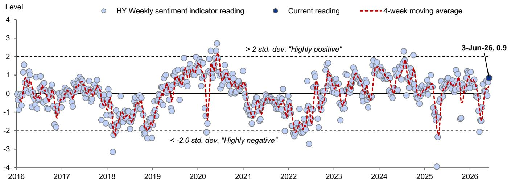

line

| Date       | HY Weekly sentiment indicator reading | Current reading | 4-week moving average |
| ---------- | ------------------------------------- | --------------- | --------------------- |
| 3-Jun-26   | 0.9                                   | 0.9             | 0.9                   |

Source: See table below.

Exhibit 55: Variables included in the USD IG and HY weekly sentiment indicators 

<table><tr><td>Measure</td><td>Frequency</td><td>Data Source</td></tr><tr><td>Synthetic index Positioning</td><td>Weekly</td><td>DTCC</td></tr><tr><td>Net Dealer Positioning</td><td>Weekly</td><td>FRBNY</td></tr><tr><td>Net Dealer Lift</td><td>Weekly</td><td>TRACE</td></tr><tr><td>Active US Credit Fund flows</td><td>Weekly</td><td>EPFR</td></tr><tr><td>Passive US Credit Fund flows</td><td>Weekly</td><td>EPFR</td></tr><tr><td>US Money Market Fund flows</td><td>Weekly</td><td>EPFR</td></tr><tr><td>Short interest on the largest credit ETFs</td><td>Semimonthly</td><td>GS FICC &amp; Equities</td></tr><tr><td>Credit Mutual Fund cash positions</td><td>Monthly</td><td>ICI</td></tr></table>

Source: GS Global Investment Research

# Microstructure dashboard: Top 20 most traded capital structures in the USD IG and HY markets

Exhibit 56: Top 20 most liquid issuers by weekly turnover in the USD IG market 

<table><tr><td>Ticker</td><td>Issuer</td><td>Notional bonds outstanding ($bn)</td><td>Notional volume traded on the week ($mn)</td><td>Weekly turnover ratio (Wed. to Wed. %)</td><td>Median rating</td><td>Average age of bonds outstanding (Years)</td><td>Average duration of bonds outstanding (Years)</td></tr><tr><td>NOW</td><td>ServiceNow Inc</td><td>5.5</td><td>187.8</td><td>3.4</td><td>A</td><td>1.6</td><td>6.2</td></tr><tr><td>CPB</td><td>The Campbell&#x27;s Company</td><td>5.7</td><td>152.0</td><td>2.7</td><td>BBB-</td><td>4.5</td><td>6.3</td></tr><tr><td>CRM</td><td>Salesforce Inc</td><td>33.5</td><td>847.1</td><td>2.5</td><td>A</td><td>1.6</td><td>7.3</td></tr><tr><td>ECL</td><td>Ecolab Inc</td><td>11.0</td><td>215.4</td><td>2.0</td><td>A-</td><td>2.5</td><td>6.8</td></tr><tr><td>META</td><td>Meta Platforms Inc</td><td>84.0</td><td>1603.6</td><td>1.9</td><td>AA-</td><td>1.2</td><td>9.9</td></tr><tr><td>BCRED</td><td>Blackstone Private Credit Fund</td><td>6.6</td><td>125.3</td><td>1.9</td><td>BBB-</td><td>1.3</td><td>4.0</td></tr><tr><td>EXPE</td><td>Expedia Group Inc</td><td>5.5</td><td>103.4</td><td>1.9</td><td>BBB</td><td>4.3</td><td>4.3</td></tr><tr><td>CAG</td><td>Conagra Brands Inc</td><td>5.3</td><td>94.2</td><td>1.8</td><td>BBB-</td><td>6.0</td><td>5.9</td></tr><tr><td>GOOGL</td><td>Alphabet Inc</td><td>51.0</td><td>895.8</td><td>1.8</td><td>AA</td><td>1.4</td><td>10.0</td></tr><tr><td>ORCL</td><td>Oracle Corp</td><td>117.2</td><td>1950.0</td><td>1.7</td><td>BBB</td><td>4.2</td><td>8.9</td></tr><tr><td>BHI</td><td>Baker Hughes Holdings LLC / Baker Hughes Co-Obligor Inc</td><td>11.4</td><td>177.9</td><td>1.6</td><td>A-</td><td>4.3</td><td>8.0</td></tr><tr><td>HPE</td><td>Hewlett Packard Enterprise Co</td><td>14.9</td><td>228.6</td><td>1.5</td><td>BBB</td><td>2.6</td><td>5.6</td></tr><tr><td>PYPL</td><td>PayPal Holdings Inc</td><td>10.0</td><td>148.6</td><td>1.5</td><td>A-</td><td>3.7</td><td>7.0</td></tr><tr><td>UBER</td><td>Uber Technologies Inc</td><td>7.8</td><td>112.9</td><td>1.5</td><td>BBB+</td><td>2.0</td><td>6.5</td></tr><tr><td>HUM</td><td>Humana Inc</td><td>12.4</td><td>176.3</td><td>1.4</td><td>BBB</td><td>3.5</td><td>7.6</td></tr><tr><td>AMZN</td><td>Amazon.com Inc</td><td>97.5</td><td>1387.1</td><td>1.4</td><td>AA-</td><td>3.1</td><td>8.9</td></tr><tr><td>DVN</td><td>Devon Energy Corp</td><td>6.2</td><td>86.4</td><td>1.4</td><td>BBB+</td><td>9.6</td><td>9.1</td></tr><tr><td>SUZANO</td><td>Suzano Austria GmbH</td><td>7.8</td><td>102.5</td><td>1.3</td><td>BBB-</td><td>5.9</td><td>5.2</td></tr><tr><td>FANG</td><td>Diamondback Energy Inc</td><td>9.3</td><td>119.9</td><td>1.3</td><td>BBB</td><td>3.0</td><td>8.3</td></tr><tr><td>ARCC</td><td>Ares Capital Corp</td><td>8.3</td><td>106.4</td><td>1.3</td><td>BBB</td><td>2.3</td><td>3.3</td></tr></table>

Source: TRACE, iBoxx, data compiled by GS Global Investment Research

Exhibit 57: Top 20 most liquid issuers by weekly turnover in the USD HY market 

<table><tr><td>Ticker</td><td>Issuer</td><td>Notional bonds outstanding ($bn)</td><td>Notional volume traded on the week ($mn)</td><td>Weekly turnover ratio (Wed. to Wed. %)</td><td>Median rating</td><td>Average age of bonds outstanding (Years)</td><td>Average duration of bonds outstanding (Years)</td></tr><tr><td>JBLU</td><td>JetBlue Airways Corp / JetBlue Loyalty LP</td><td>2.0</td><td>86.3</td><td>4.3</td><td>B</td><td>1.8</td><td>4.0</td></tr><tr><td>IHRT</td><td>iHeartCommunications Inc</td><td>2.1</td><td>62.9</td><td>3.1</td><td>CCC+</td><td>1.4</td><td>3.1</td></tr><tr><td>GT</td><td>The Goodyear Tire &amp; Rubber Company</td><td>3.0</td><td>88.0</td><td>3.0</td><td>B+</td><td>3.9</td><td>4.0</td></tr><tr><td>FSK</td><td>FS KKR Capital Corp</td><td>2.9</td><td>68.0</td><td>2.4</td><td>BB+</td><td>2.5</td><td>2.9</td></tr><tr><td>MGM</td><td>MGM Resorts International</td><td>2.4</td><td>54.5</td><td>2.3</td><td>BB-</td><td>3.1</td><td>2.3</td></tr><tr><td>CRWV</td><td>CoreWeave Inc</td><td>6.5</td><td>147.9</td><td>2.3</td><td>B+</td><td>0.6</td><td>3.2</td></tr><tr><td>PFORGE</td><td>APLD ComputeCo 2 LLC</td><td>2.2</td><td>48.1</td><td>2.2</td><td>BB-</td><td>0.2</td><td>2.9</td></tr><tr><td>CZR</td><td>Caesars Entertainment Inc</td><td>5.8</td><td>109.1</td><td>1.9</td><td>BB-</td><td>3.0</td><td>3.4</td></tr><tr><td>XRX</td><td>Xerox Holdings Corp</td><td>2.0</td><td>36.2</td><td>1.8</td><td>CCC-</td><td>2.9</td><td>2.8</td></tr><tr><td>GTN</td><td>Gray Media Inc</td><td>4.8</td><td>84.4</td><td>1.8</td><td>CCC</td><td>2.9</td><td>3.6</td></tr><tr><td>RRD</td><td>RR Donnelley &amp; Sons Co</td><td>2.4</td><td>40.4</td><td>1.7</td><td>B-</td><td>1.1</td><td>2.7</td></tr><tr><td>FRTITA</td><td>Fertitta Entertainment LLC / Fertitta Entertainment Finance Co</td><td>2.3</td><td>34.8</td><td>1.5</td><td>CCC</td><td>4.3</td><td>2.9</td></tr><tr><td>MIK</td><td>Michaels Cos Inc/The</td><td>2.8</td><td>41.3</td><td>1.5</td><td>B-</td><td>0.2</td><td>5.2</td></tr><tr><td>CAR</td><td>Avis Budget Car Rental LLC / Avis Budget Finance Inc</td><td>3.2</td><td>47.9</td><td>1.5</td><td>B</td><td>3.0</td><td>2.4</td></tr><tr><td>NCX</td><td>NOVA Chemicals Corp</td><td>2.7</td><td>40.0</td><td>1.5</td><td>BB-</td><td>5.4</td><td>1.4</td></tr><tr><td>SABHLD</td><td>Sabre GLBL Inc</td><td>3.2</td><td>47.5</td><td>1.5</td><td>B-</td><td>0.8</td><td>2.7</td></tr><tr><td>VSTJET</td><td>VistaJet Malta Finance PLC / Vista Management Holding Inc</td><td>2.0</td><td>29.4</td><td>1.5</td><td>B-</td><td>2.9</td><td>3.0</td></tr><tr><td>SNAP</td><td>Snap Inc</td><td>2.1</td><td>29.2</td><td>1.4</td><td>BB-</td><td>1.2</td><td>5.6</td></tr><tr><td>UAL</td><td>United Airlines Holdings Inc</td><td>2.0</td><td>28.5</td><td>1.4</td><td>BB+</td><td>0.3</td><td>3.4</td></tr><tr><td>PARA</td><td>Paramount Global</td><td>3.7</td><td>52.8</td><td>1.4</td><td>BB+</td><td>6.8</td><td>3.6</td></tr></table>

Source: TRACE, iBoxx, data compiled by GS Global Investment Research

# Microstructure dashboard: Liquidity conditions in the USD secondary bond market

Exhibit 58: Seasonally adjusted daily average turnover (trading volume/amount outstanding)   
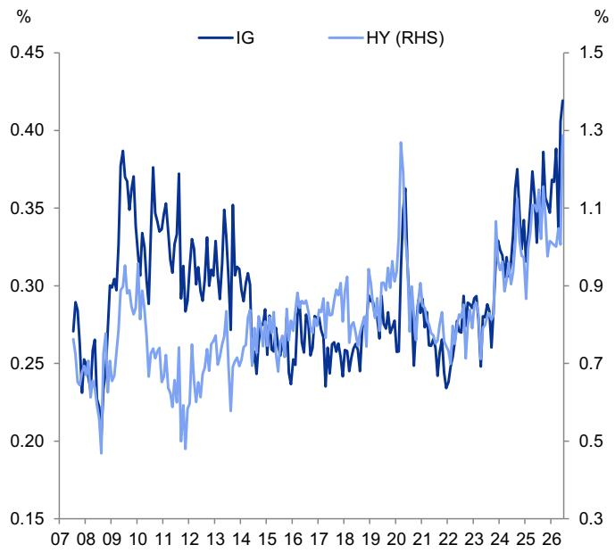

line

| Year | IG    | HY (RHS) |
|------|-------|----------|
| 07   | 0.28  | 0.7      |
| 08   | 0.25  | 0.5      |
| 09   | 0.38  | 0.9      |
| 10   | 0.35  | 0.8      |
| 11   | 0.37  | 0.7      |
| 12   | 0.30  | 0.6      |
| 13   | 0.35  | 0.7      |
| 14   | 0.32  | 0.8      |
| 15   | 0.28  | 0.9      |
| 16   | 0.26  | 0.8      |
| 17   | 0.27  | 0.9      |
| 18   | 0.29  | 1.0      |
| 19   | 0.30  | 1.1      |
| 20   | 0.36  | 1.3      |
| 21   | 0.28  | 1.1      |
| 22   | 0.25  | 1.0      |
| 23   | 0.29  | 1.1      |
| 24   | 0.35  | 1.2      |
| 25   | 0.38  | 1.3      |
| 26   | 0.42  | 1.4      |

Source: TRACE, Bloomberg, GS Global Investment Research

Exhibit 59: Primary dealer net positioning in USD corporate bonds   
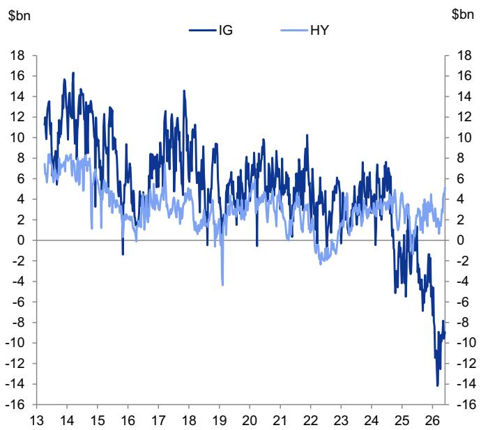

line

| Year | IG ($bn) | HY ($bn) |
|------|----------|----------|
| 13   | ~12      | ~7       |
| 14   | ~16      | ~8       |
| 15   | ~14      | ~6       |
| 16   | ~10      | ~4       |
| 17   | ~12      | ~3       |
| 18   | ~15      | ~2       |
| 19   | ~9       | ~-5      |
| 20   | ~8       | ~2       |
| 21   | ~10      | ~3       |
| 22   | ~10      | ~2       |
| 23   | ~6       | ~1       |
| 24   | ~7       | ~3       |
| 25   | ~-5      | ~4       |
| 26   | ~-14     | ~-8      |

Source: FRBNY, GS Global Investment Research

Exhibit 60: Average IG bid-ask spread   
5-day moving average   
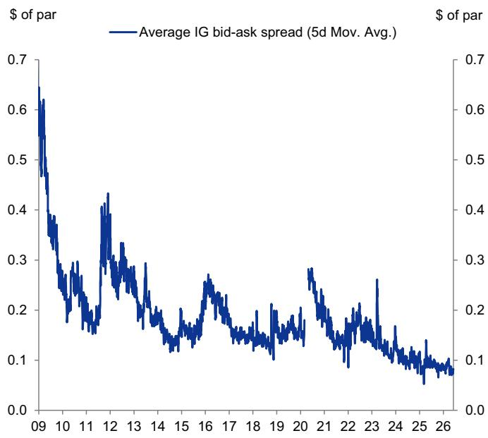

line

| Year | Average IG bid-ask spread ($ of par) |
| ---- | ------------------------------------ |
| 09   | 0.65                                 |
| 10   | 0.35                                 |
| 11   | 0.25                                 |
| 12   | 0.40                                 |
| 13   | 0.30                                 |
| 14   | 0.20                                 |
| 15   | 0.15                                 |
| 16   | 0.25                                 |
| 17   | 0.20                                 |
| 18   | 0.15                                 |
| 19   | 0.18                                 |
| 20   | 0.28                                 |
| 21   | 0.20                                 |
| 22   | 0.15                                 |
| 23   | 0.25                                 |
| 24   | 0.15                                 |
| 25   | 0.10                                 |
| 26   | 0.08                                 |

Note: March and April 2020 are omitted.

Exhibit 61: Amihud IG illiquidity measure   
5-day moving average   
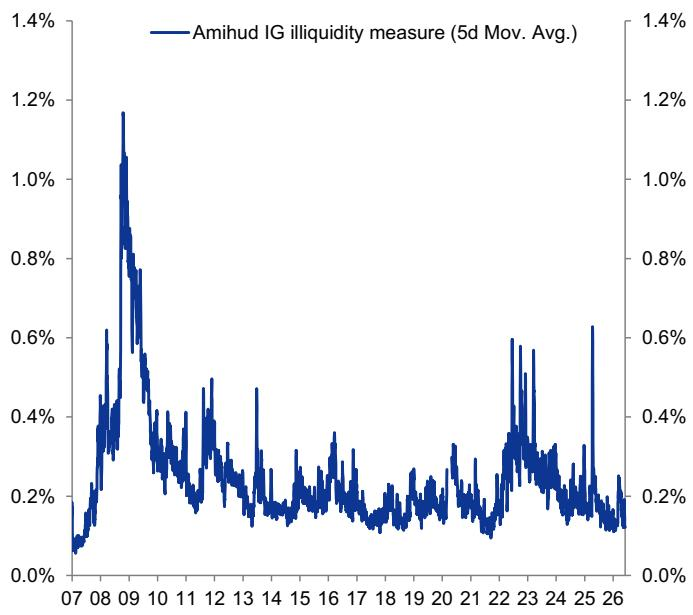

line

| Year | Amihud IG illiquidity measure (5d Mov. Avg.) |
| ---- | --------------------------------------------- |
| 07   | ~0.1%                                         |
| 08   | ~0.6%                                         |
| 09   | ~1.2%                                         |
| 10   | ~0.4%                                         |
| 11   | ~0.3%                                         |
| 12   | ~0.5%                                         |
| 13   | ~0.3%                                         |
| 14   | ~0.2%                                         |
| 15   | ~0.3%                                         |
| 16   | ~0.4%                                         |
| 17   | ~0.2%                                         |
| 18   | ~0.2%                                         |
| 19   | ~0.3%                                         |
| 20   | ~0.2%                                         |
| 21   | ~0.3%                                         |
| 22   | ~0.6%                                         |
| 23   | ~0.5%                                         |
| 24   | ~0.3%                                         |
| 25   | ~0.6%                                         |
| 26   | ~0.2%                                         |

Note: March and April 2020 are omitted.   
Source: Trace, Bloomberg, GS Global Investment Research   
Source: TRACE, Bloomberg, GS Global Investment Research

# Flow dashboard: Mutual fund and ETF AUM

Exhibit 62: AUM in USD IG-focused Mutual Funds and ETFs   
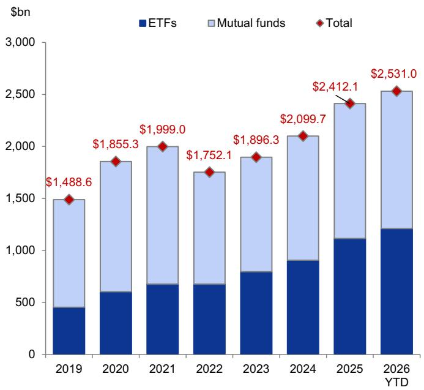

bar_stacked

| Year | ETFs ($bn) | Mutual funds ($bn) | Total ($bn) |
| :--- | :--- | :--- | :--- |
| 2019 | 450 | 850 | 1,488.6 |
| 2020 | 580 | 1070 | 1,855.3 |
| 2021 | 660 | 1130 | 1,999.0 |
| 2022 | 660 | 870 | 1,752.1 |
| 2023 | 770 | 930 | 1,896.3 |
| 2024 | 890 | 1040 | 2,099.7 |
| 2025 | 1110 | 1150 | 2,412.1 |
| 2026 YTD | 1200 | 1230 | 2,531.0 |

Source: EPFR, GS Global Investment Research

Exhibit 63: AUM in USD HY-focused Mutual Funds and ETFs   
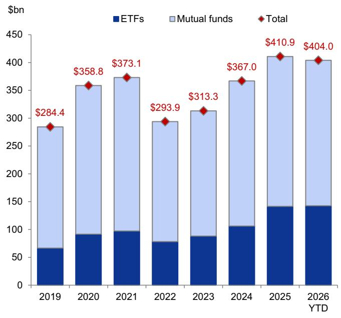

bar_stacked

| Year | ETFs ($bn) | Mutual funds ($bn) | Total ($bn) |
| :--- | :--- | :--- | :--- |
| 2019 | 65.0 | 200.0 | 284.4 |
| 2020 | 90.0 | 230.0 | 358.8 |
| 2021 | 95.0 | 240.0 | 373.1 |
| 2022 | 75.0 | 190.0 | 293.9 |
| 2023 | 85.0 | 210.0 | 313.3 |
| 2024 | 105.0 | 235.0 | 367.0 |
| 2025 | 140.0 | 285.0 | 410.9 |
| 2026 YTD | 140.0 | 275.0 | 404.0 |

Source: EPFR, GS Global Investment Research

Exhibit 64: AUM in EUR IG-focused Mutual Funds and ETFs   
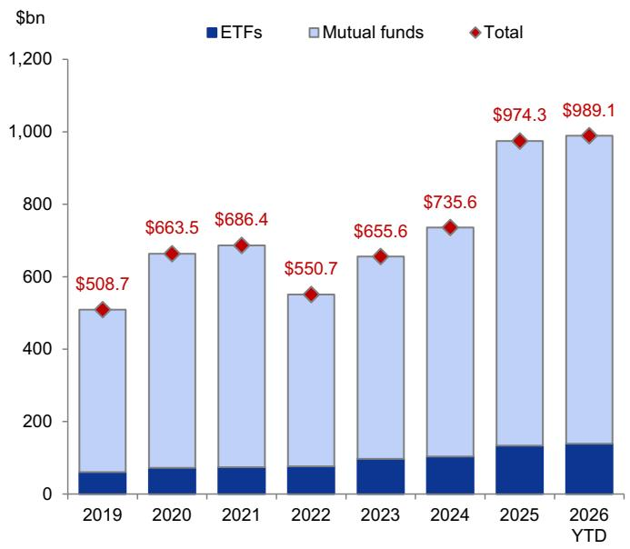

bar_stacked

| Year | ETFs ($bn) | Mutual funds ($bn) | Total ($bn) |
| :--- | :--- | :--- | :--- |
| 2019 | 60.0 | 480.0 | 508.7 |
| 2020 | 70.0 | 580.0 | 663.5 |
| 2021 | 75.0 | 610.0 | 686.4 |
| 2022 | 75.0 | 550.0 | 550.7 |
| 2023 | 95.0 | 580.0 | 655.6 |
| 2024 | 105.0 | 680.0 | 735.6 |
| 2025 | 135.0 | 880.0 | 974.3 |
| 2026 YTD | 140.0 | 910.0 | 989.1 |

Source: EPFR, GS Global Investment Research

Exhibit 65: AUM in EUR HY-focused Mutual Funds and ETFs   
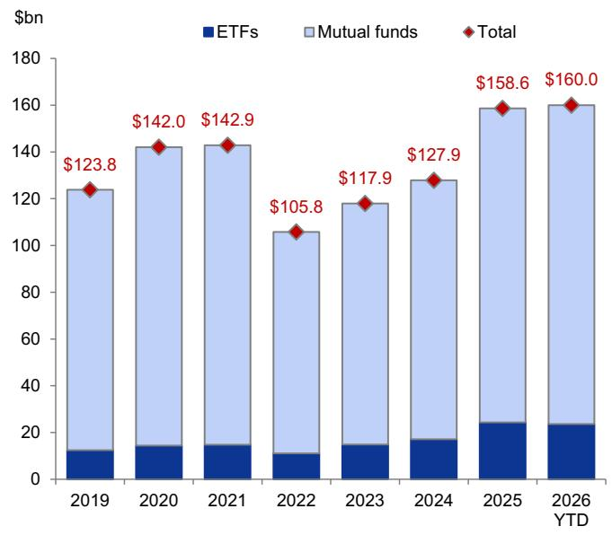

bar

| Year   | ETFs  | Mutual funds | Total  |
| ------ | ----- | ------------ | ------ |
| 2019   | 12.0  | 84.0         | $123.8 |
| 2020   | 14.0  | 97.0         | $142.0 |
| 2021   | 14.0  | 97.0         | $142.9 |
| 2022   | 10.0  | 77.0         | $105.8 |
| 2023   | 15.0  | 85.0         | $117.9 |
| 2024   | 17.0  | 93.0         | $127.9 |
| 2025   | 24.0  | 113.0        | $158.6 |
| 2026 YTD| 23.0  | 115.0        | $160.0 |

Source: EPFR, GS Global Investment Research

# Flow dashboard: Mutual fund and ETF flows

Exhibit 66: Weekly mutual fund flows into US fixed income and equity markets   
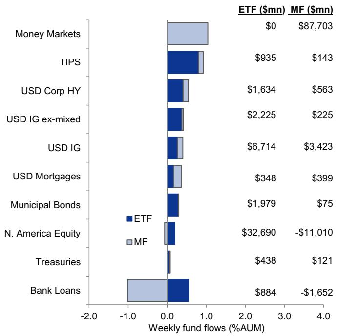

bar

| Category | ETF ($mn) | MF ($mn) |
| :--- | :--- | :--- |
| Money Markets | 0 | 87,703 |
| TIPS | 935 | 143 |
| USD Corp HY | 1,634 | 563 |
| USD IG ex-mixed | 2,225 | 225 |
| USD IG | 6,714 | 3,423 |
| USD Mortgages | 348 | 399 |
| Municipal Bonds | 1,979 | 75 |
| N. America Equity | 32,690 | -11,010 |
| Treasuries | 438 | 121 |
| Bank Loans | 884 | -1,652 |

Source: EPFR, GS Global Investment Research

Exhibit 67: Weekly mutual fund flows into European fixed income and equity markets   
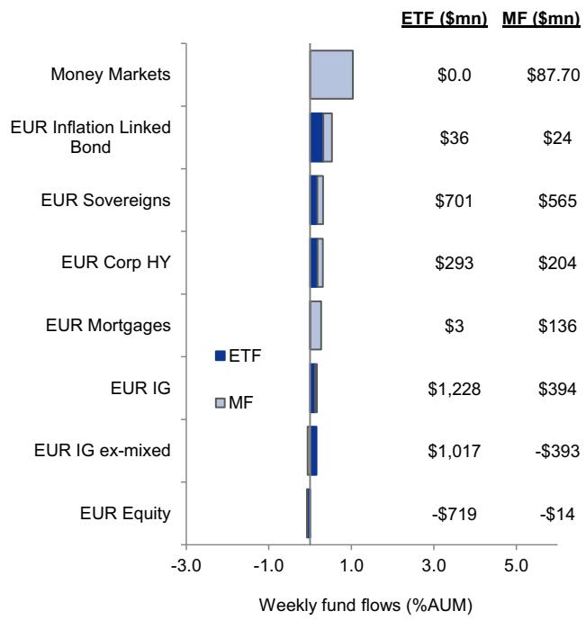

bar

| Category | ETF ($mn) | MF ($mn) |
| :--- | :--- | :--- |
| Money Markets | 0.0 | 87.70 |
| EUR Inflation Linked Bond | 36 | 24 |
| EUR Sovereigns | 701 | 565 |
| EUR Corp HY | 293 | 204 |
| EUR Mortgages | 3 | 136 |
| EUR IG | 1,228 | 394 |
| EUR IG ex-mixed | 1,017 | -393 |
| EUR Equity | -719 | -14 |

Source: EPFR, GS Global Investment Research

Exhibit 68: Year-to-date cumulative flows as a percentage of beginning of the year AUM for US credit funds   
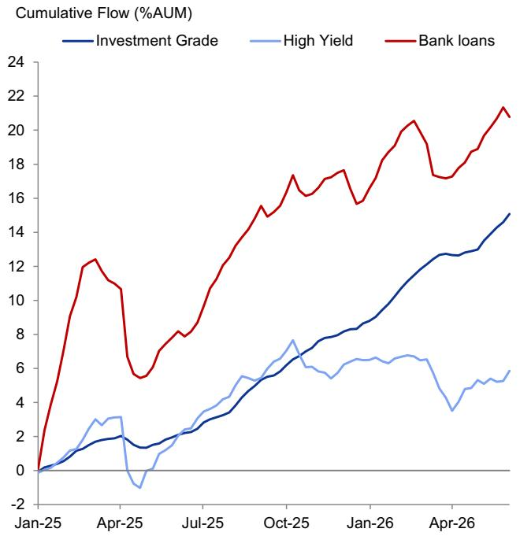

line

| Date   | Investment Grade | High Yield | Bank loans |
|--------|------------------|----------|------------|
| Jan-25 | 0.0              | 0.0      | 0.0        |
| Apr-25 | 2.0              | -1.0     | 12.0       |
| Jul-25 | 3.0              | 4.0      | 8.0        |
| Oct-25 | 6.0              | 7.0      | 17.0       |
| Jan-26 | 9.0              | 6.0      | 18.0       |
| Apr-26 | 13.0             | 5.0      | 21.0       |

Source: EPFR, GS Global Investment Research

Exhibit 69: Year-to-date cumulative flows as a percentage of beginning of the year AUM for European credit funds   
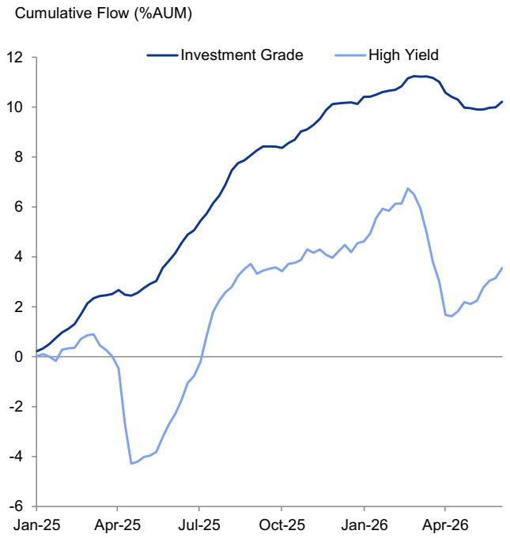

line

| Date   | Investment Grade | High Yield |
|--------|------------------|----------|
| Jan-25 | 0.0              | 0.0      |
| Apr-25 | 2.5              | -4.5     |
| Jul-25 | 5.0              | -1.0     |
| Oct-25 | 8.0              | 3.5      |
| Jan-26 | 10.0             | 4.5      |
| Apr-26 | 11.0             | 1.5      |
| Jul-26 | 10.5             | 3.0      |

Source: EPFR, GS Global Investment Research

# Flow dashboard: Upcoming coupon and principal payments

Exhibit 70: Our estimates of upcoming coupon and principal payments in the USD IG market   
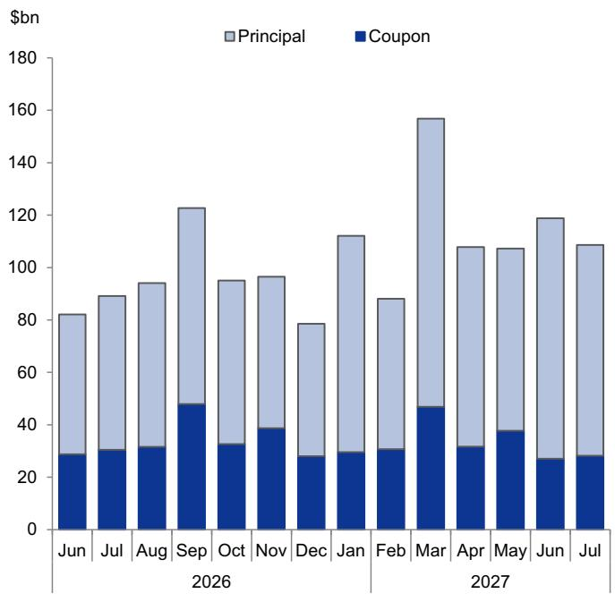

bar_stacked

| Month | 2026 ($bn) | 2027 ($bn) |
| :--- | :--- | :--- |
| Jun | 82 | 88 |
| Jul | 89 | 31 |
| Aug | 94 | 32 |
| Sep | 123 | 46 |
| Oct | 95 | 33 |
| Nov | 96 | 39 |
| Dec | 79 | 28 |
| Jan | 112 | 29 |
| Feb | 88 | 31 |
| Mar | 156 | 46 |
| Apr | 107 | 32 |
| May | 107 | 38 |
| Jun | 119 | 27 |
| Jul | 108 | 28 |

Source: Bloomberg, GS Global Investment Research

Exhibit 71: Our estimates of upcoming coupon and principal payments in the USD HY market   
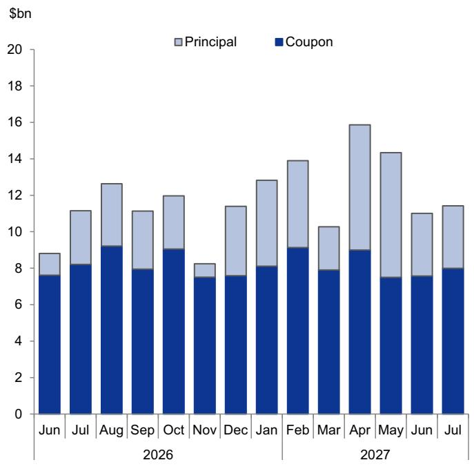

bar_stacked

| Month | Period | Principal ($bn) | Coupon ($bn) |
|-------|--------|-----------------|--------------|
| Jun   | 2026   | 1.5             | 7.5          |
| Jul   | 2026   | 3.0             | 8.0          |
| Aug   | 2026   | 4.0             | 9.0          |
| Sep   | 2026   | 4.0             | 7.5          |
| Oct   | 2026   | 4.0             | 8.5          |
| Nov   | 2026   | 1.0             | 7.0          |
| Dec   | 2026   | 5.0             | 7.0          |
| Jan   | 2027   | 6.0             | 8.0          |
| Feb   | 2027   | 6.0             | 9.0          |
| Mar   | 2027   | 3.0             | 7.5          |
| Apr   | 2027   | 9.0             | 8.5          |
| May   | 2027   | 9.0             | 7.0          |
| Jun   | 2027   | 5.0             | 7.0          |
| Jul   | 2027   | 4.5             | 7.5          |

Source: Bloomberg, GS Global Investment Research

Exhibit 72: Our estimates of upcoming coupon and principal payments in the EUR IG market   
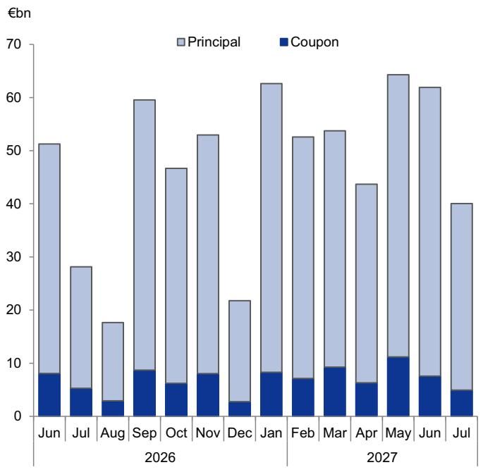

bar_stacked

| Month | 2026 (€bn) | 2027 (€bn) |
| :--- | :--- | :--- |
| Jun | 51 | 52 |
| Jul | 28 | 9 |
| Aug | 17 | 6 |
| Sep | 59 | 11 |
| Oct | 46 | 7 |
| Nov | 53 | 8 |
| Dec | 21 | 3 |
| Jan | 62 | 8 |
| Feb | 52 | 7 |
| Mar | 54 | 9 |
| Apr | 44 | 6 |
| May | 64 | 11 |
| Jun | 61 | 7 |
| Jul | 40 | 5 |

Source: Bloomberg, GS Global Investment Research

Exhibit 73: Our estimates of upcoming coupon and principal payments in the EUR HY market   
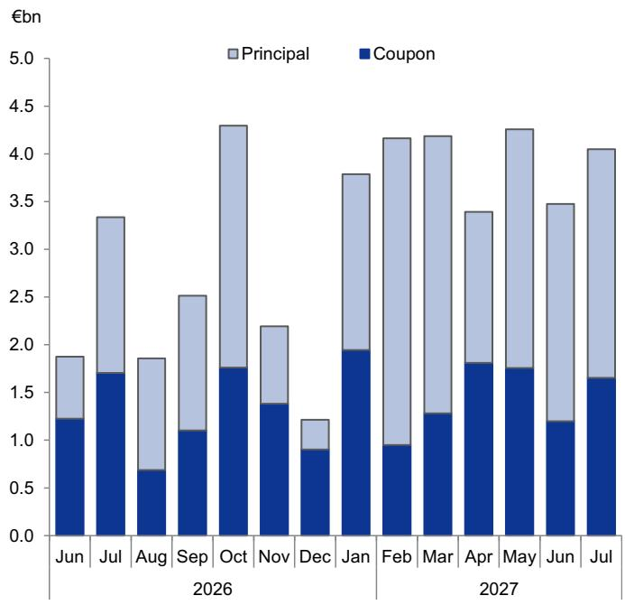

bar_stacked

| Month | 2026 - Principal | 2026 - Coupon | 2027 - Principal | 2027 - Coupon |
|-------|------------------|---------------|------------------|---------------|
| Jun   | 1.9              | 1.2           | -                | -             |
| Jul   | 3.4              | 1.7           | -                | -             |
| Aug   | 1.9              | 0.7           | -                | -             |
| Sep   | 2.5              | 1.1           | -                | -             |
| Oct   | 4.3              | 1.8           | -                | -             |
| Nov   | 2.2              | 1.4           | -                | -             |
| Dec   | 1.2              | 0.9           | -                | -             |
| Jan   | 3.8              | 1.9           | -                | -             |
| Feb   | -                | -             | 4.2              | 0.9           |
| Mar   | -                | -             | 4.2              | 1.3           |
| Apr   | -                | -             | 3.4              | 1.8           |
| May   | -                | -             | 4.3              | 1.8           |
| Jun   | -                | -             | 3.5              | 1.2           |
| Jul   | -                | -             | 4.1              | 1.7           |

Source: Bloomberg, GS Global Investment Research

# Flow dashboard: Positioning in macro indices

Exhibit 74: Net notional positioning in the CDX IG 5-year on-the-run contract   
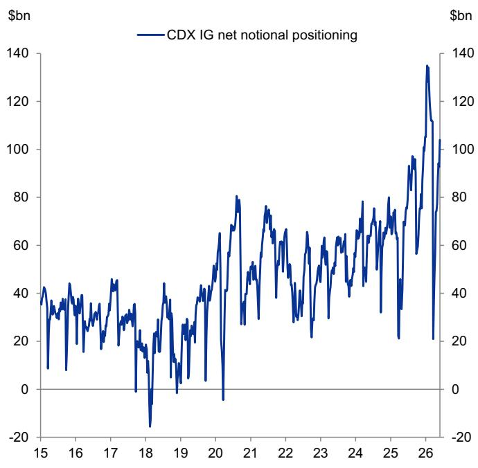

line

| Year | CDX IG net notional positioning ($bn) |
|------|----------------------------------------|
| 15   | ~40                                    |
| 16   | ~35                                    |
| 17   | ~45                                    |
| 18   | ~-15                                   |
| 19   | ~25                                    |
| 20   | ~60                                    |
| 21   | ~80                                    |
| 22   | ~65                                    |
| 23   | ~50                                    |
| 24   | ~70                                    |
| 25   | ~90                                    |
| 26   | ~135                                   |

Source: DTCC, GS Global Investment Research

Exhibit 75: Net notional positioning in the CDX HY 5-year on-the-run contract   
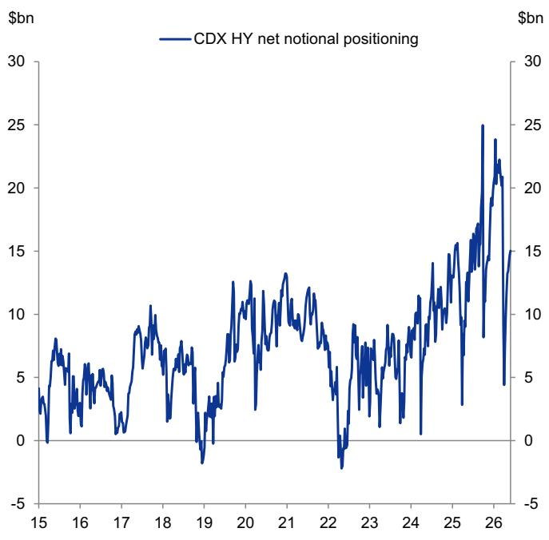

line

| Year | CDX HY net notional positioning ($bn) |
|------|----------------------------------------|
| 15   | ~3                                     |
| 16   | ~8                                     |
| 17   | ~9                                     |
| 18   | ~7                                     |
| 19   | ~3                                     |
| 20   | ~12                                    |
| 21   | ~13                                    |
| 22   | ~-2                                    |
| 23   | ~8                                     |
| 24   | ~10                                    |
| 25   | ~15                                    |
| 26   | ~25                                    |

Source: DTCC, GS Global Investment Research

Exhibit 76: Net notional positioning in the iTraxx Main 5-year on-the-run contract   
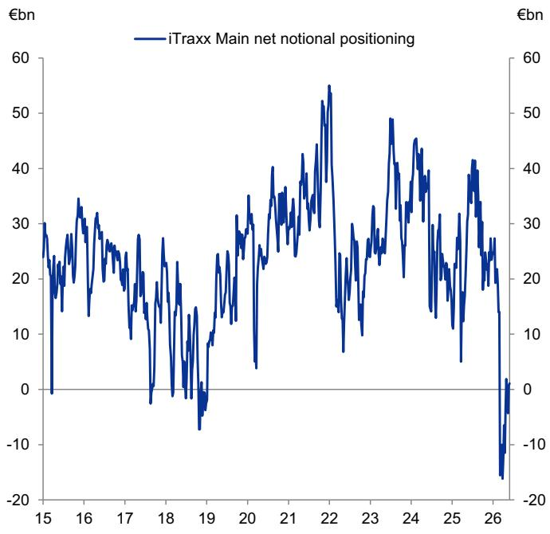

line

| Year | iTraxx Main net notional positioning (€bn) |
| ---- | ------------------------------------------ |
| 15   | 30                                         |
| 16   | 35                                         |
| 17   | 25                                         |
| 18   | 20                                         |
| 19   | -5                                         |
| 20   | 30                                         |
| 21   | 40                                         |
| 22   | 55                                         |
| 23   | 30                                         |
| 24   | 45                                         |
| 25   | 30                                         |
| 26   | -15                                        |

Source: DTCC, GS Global Investment Research

Exhibit 77: Net notional positioning in iTraxx over 5-year on-the-run contract   
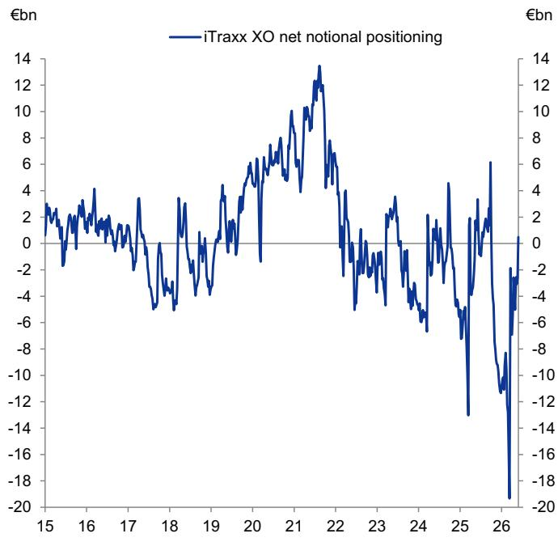

line

| Year | iTraxx XO net notional positioning (€bn) |
| ---- | ---------------------------------------- |
| 15   | ~2.5                                     |
| 16   | ~3.0                                     |
| 17   | ~2.0                                     |
| 18   | ~-4.0                                    |
| 19   | ~4.0                                     |
| 20   | ~6.0                                     |
| 21   | ~10.0                                    |
| 22   | ~13.0                                    |
| 23   | ~-2.0                                    |
| 24   | ~-6.0                                    |
| 25   | ~-12.0                                   |
| 26   | ~-18.0                                   |

Source: DTCC, GS Global Investment Research

# Flow dashboard: ECB QT

Exhibit 78: Ownership share of the ECB in the EUR IG market   
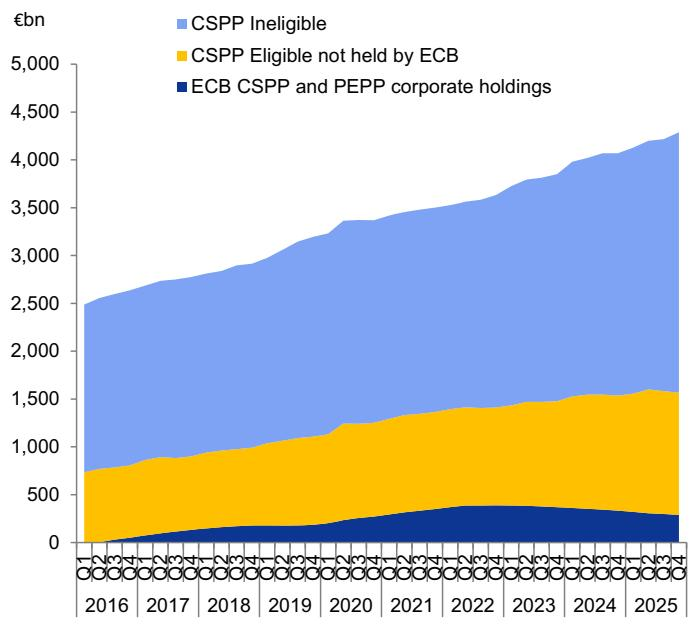

bar_stacked

| Year | CSPP Ineligible (€bn) | CSPP Eligible not held by ECB (€bn) | ECB CSPP and PEPP corporate holdings (€bn) |
|------|------------------------|-------------------------------------|---------------------------------------------|
| 2016 | ~2,500                 | ~700                                | ~0                                          |
| 2017 | ~2,600                 | ~750                                | ~100                                        |
| 2018 | ~2,700                 | ~800                                | ~150                                        |
| 2019 | ~2,900                 | ~850                                | ~150                                        |
| 2020 | ~3,100                 | ~900                                | ~200                                        |
| 2021 | ~3,200                 | ~950                                | ~250                                        |
| 2022 | ~3,300                 | ~1,000                              | ~300                                        |
| 2023 | ~3,400                 | ~1,050                              | ~350                                        |
| 2024 | ~3,500                 | ~1,100                              | ~350                                        |
| 2025 | ~3,600                 | ~1,150                              | ~350                                        |

Source: ECB, Bloomberg, GS Global Investment Research

Exhibit 79: Run-off projections for the ECB corporate bond holdings   

line

| Year | CSPP + PEPP corporate holdings (€bn) | GS projected runoff (€bn) |
|------|----------------------------------------|---------------------------|
| 16   | 0                                      | -                         |
| 17   | 50                                     | -                         |
| 18   | 100                                    | -                         |
| 19   | 175                                    | -                         |
| 20   | 175                                    | -                         |
| 21   | 250                                    | -                         |
| 22   | 350                                    | -                         |
| 23   | 390                                    | -                         |
| 24   | 375                                    | -                         |
| 25   | 350                                    | -                         |
| 26   | 300                                    | -                         |
| 27   | 250                                    | -                         |
| 28   | -                                      | -                         |
| 29   | -                                      | -                         |
| 30   | -                                      | -                         |

Source: ECB, Bloomberg, GS Global Investment Research

Exhibit 80: CSPP monthly run-off pace   
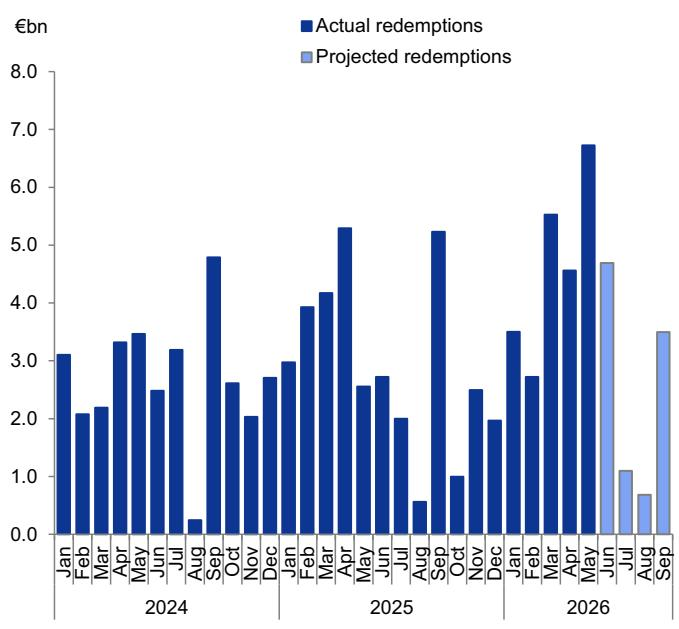

bar

| Month | Actual redemptions (€bn) | Projected redemptions (€bn) |
|---|---|---|
| Jan | 3.1 | |
| Feb | 2.1 | |
| Mar | 2.2 | |
| Apr | 3.3 | |
| May | 3.5 | |
| Jun | 2.5 | |
| Jul | 3.2 | |
| Aug | 0.2 | |
| Sep | 4.8 | |
| Oct | 2.6 | |
| Nov | 2.0 | |
| Dec | 2.7 | |
| Jan | 3.0 | |
| Feb | 3.9 | |
| Mar | 4.2 | |
| Apr | 5.3 | |
| May | 2.5 | |
| Jun | 2.7 | |
| Jul | 2.0 | |
| Aug | 0.5 | |
| Sep | 5.2 | |
| Oct | 1.0 | |
| Nov | 2.5 | |
| Dec | 2.0 | |
| Jan | 3.5 | |
| Feb | 2.7 | |
| Mar | 5.5 | |
| Apr | 4.5 | |
| May | 6.7 | |
| Jun | 4.7 | |
| Jul | 1.1 | |
| Aug | 0.6 | |
| Sep | 3.5 | |

Source: ECB, GS Global Investment Research

Exhibit 81: Performance of CSPP-eligible bonds vs. non-eligible bonds   
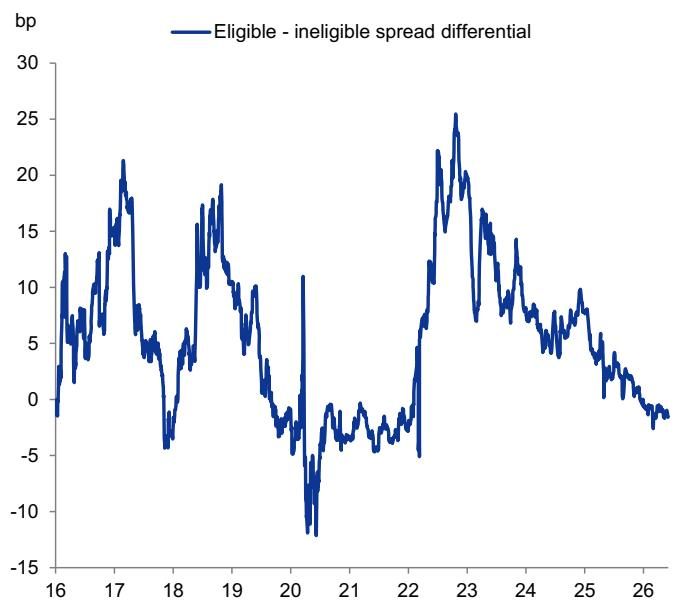

line

| Year | Eligible - ineligible spread differential (bp) |
| ---- | --------------------------------------------- |
| 16   | -1.0                                          |
| 17   | 21.0                                          |
| 18   | -4.0                                          |
| 19   | 19.0                                          |
| 20   | -12.0                                         |
| 21   | -3.0                                          |
| 22   | 25.0                                          |
| 23   | 10.0                                          |
| 24   | 8.0                                           |
| 25   | 10.0                                          |
| 26   | -2.0                                          |

Source: iBoxx, GS Global Investment Research

# Foreign demand and hedging cost

Exhibit 82: Net purchases of USD corporate bonds by foreign investors   

bar

| Year | Year-to-date | Rest-of-year | Total |
|------|--------------|--------------|-------|
| 12   | -            | -            | -$23  |
| 13   | -            | -            | $9    |
| 14   | -            | -            | $23   |
| 15   | -            | -            | $135  |
| 16   | -            | -            | $125  |
| 17   | -            | -            | $132  |
| 18   | -            | -            | $57   |
| 19   | -            | -            | $16   |
| 20   | -$145        | -            | -$145 |
| 21   | -            | -            | $147  |
| 22   | -            | -            | $164  |
| 23   | -            | -            | $289  |
| 24   | -            | -            | $298  |
| 25   | -            | -            | $382  |
| 26   | -            | -            | -     |

Note: As of March 2026.   
Source: Department of Treasury, GS Global Investment Research

Exhibit 83: Cumulative net foreign purchases of USD and EUR bonds by Japanese investors   

line

| Year | Cumulative net purchases of USD bonds (USD bn) | Cumulative net purchases of EUR bonds (EUR bn) |
|------|--------------------------------------------------|--------------------------------------------------|
| 2017 | -50                                              | -100                                             |
| 2018 | -100                                             | 0                                                |
| 2019 | 0                                                | 100                                              |
| 2020 | 150                                              | 300                                              |
| 2021 | 250                                              | 120                                              |
| 2022 | 200                                              | 100                                              |
| 2023 | 150                                              | 80                                               |
| 2024 | 300                                              | 60                                               |
| 2025 | 400                                              | 40                                               |
| 2026 | 450                                              | 30                                               |

Note: As of March 2026.   
Source: Bank of Japan, Haver Analytics, GS Global Investment Research

Exhibit 84: Annualized 3-month rolling cost of USD hedging against EUR, GBP and JPY   
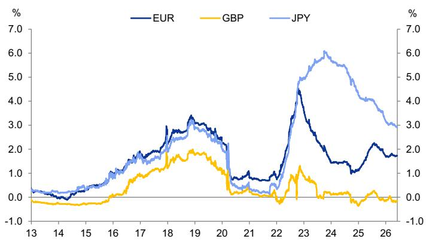

line

| Year | EUR  | GBP  | JPY  |
|------|------|------|------|
| 13   | 0.0  | -0.1 | 0.0  |
| 14   | 0.0  | -0.1 | 0.0  |
| 15   | 0.0  | -0.1 | 0.0  |
| 16   | 0.0  | -0.1 | 0.0  |
| 17   | 0.0  | 0.0  | 0.0  |
| 18   | 2.0  | 1.0  | 1.5  |
| 19   | 3.0  | 1.5  | 2.5  |
| 20   | 2.0  | 0.5  | 1.0  |
| 21   | 1.0  | 0.0  | 0.5  |
| 22   | 1.5  | -0.5 | 1.0  |
| 23   | 4.5  | 1.5  | 5.0  |
| 24   | 2.0  | 0.5  | 6.0  |
| 25   | 1.5  | -0.5 | 4.5  |
| 26   | 2.0  | -0.5 | 3.0  |

Source: GS FICC and Equities, GS Global Investment Research

# Primary market dashboard: USD gross issuance

# Exhibit 85: USD IG gross issuance

Historical investment grade issuance: Same period year to date vs. rest of the year

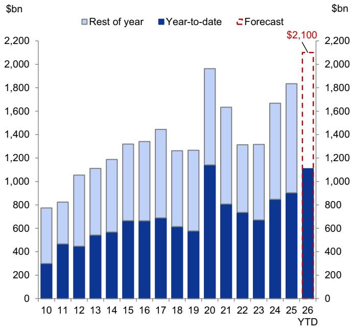

bar

| Year | Rest of year ($bn) | Year-to-date ($bn) | Forecast ($bn) |
|------|---------------------|---------------------|----------------|
| 10   | 500                 | 300                 | -              |
| 11   | 550                 | 450                 | -              |
| 12   | 700                 | 450                 | -              |
| 13   | 800                 | 550                 | -              |
| 14   | 900                 | 550                 | -              |
| 15   | 1000                | 650                 | -              |
| 16   | 1050                | 650                 | -              |
| 17   | 1100                | 650                 | -              |
| 18   | 1150                | 600                 | -              |
| 19   | 1200                | 550                 | -              |
| 20   | 1300                | 800                 | -              |
| 21   | 1250                | 750                 | -              |
| 22   | 1200                | 700                 | -              |
| 23   | 1250                | 650                 | -              |
| 24   | 1300                | 850                 | -              |
| 25   | 1400                | 900                 | -              |
| 26   | -                   | 1100                | $2,100         |

Source: Dealogic, GS Global Investment Research

# Exhibit 86: USD HY gross issuance

Historical USD high yield issuance: Same period year to date vs. rest of the year

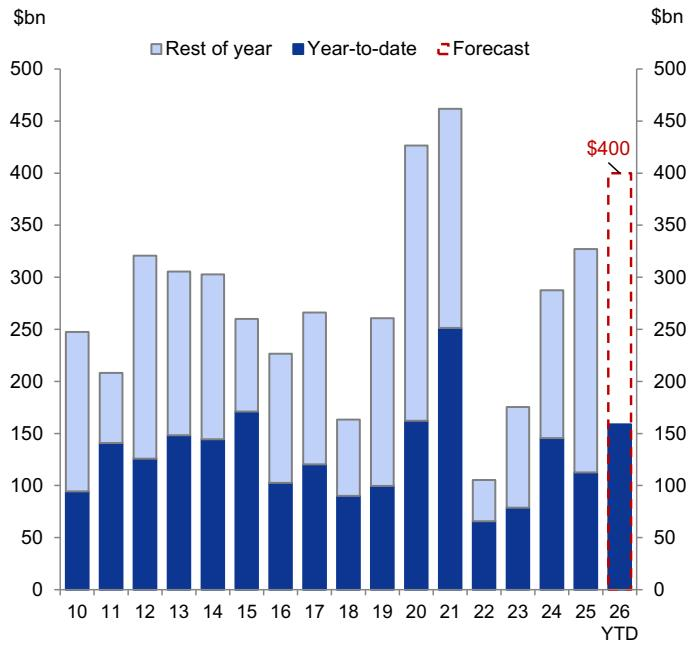

bar

| Year | Rest of year ($bn) | Year-to-date ($bn) | Forecast ($bn) |
|------|---------------------|---------------------|----------------|
| 10   | 250                 | 90                  | -              |
| 11   | 210                 | 140                 | -              |
| 12   | 320                 | 125                 | -              |
| 13   | 305                 | 145                 | -              |
| 14   | 305                 | 145                 | -              |
| 15   | 260                 | 170                 | -              |
| 16   | 225                 | 100                 | -              |
| 17   | 265                 | 120                 | -              |
| 18   | 160                 | 90                  | -              |
| 19   | 260                 | 100                 | -              |
| 20   | 425                 | 160                 | -              |
| 21   | 460                 | 250                 | -              |
| 22   | 105                 | 65                  | -              |
| 23   | 175                 | 75                  | -              |
| 24   | 290                 | 145                 | -              |
| 25   | 330                 | 110                 | -              |
| 26   | -                   | -                   | $400           |

Source: Dealogic, GS Global Investment Research

Exhibit 87: USD institutional leveraged loan gross issuance
Historical leveraged loan issuance: Same period year to date vs. rest of the year   
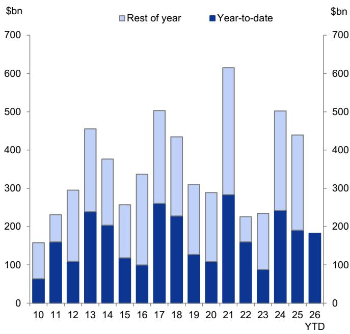

bar_stacked

| Year | Rest of year ($bn) | Year-to-date ($bn) |
| :--- | :--- | :--- |
| 10 | 150 | 60 |
| 11 | 170 | 150 |
| 12 | 290 | 110 |
| 13 | 380 | 240 |
| 14 | 380 | 200 |
| 15 | 255 | 115 |
| 16 | 335 | 100 |
| 17 | 495 | 260 |
| 18 | 430 | 225 |
| 19 | 310 | 125 |
| 20 | 290 | 105 |
| 21 | 615 | 285 |
| 22 | 220 | 155 |
| 23 | 235 | 85 |
| 24 | 495 | 240 |
| 25 | 435 | 190 |
| 26 | - | 180 |

Source: Pitchbook LCD, GS Global Investment Research

# Exhibit 88: USD CLO creation

Historical USD CLO creation: Same period year to date vs. rest of the year

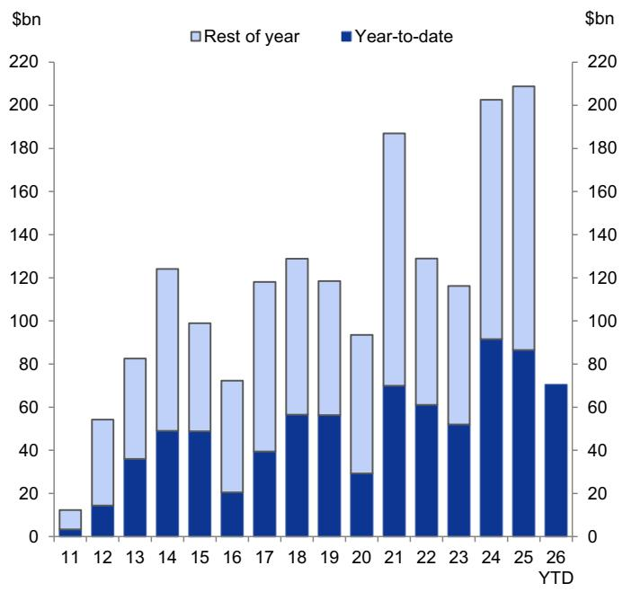

bar_stacked

| Year | Rest of year ($bn) | Year-to-date ($bn) |
| :--- | :--- | :--- |
| 11 | 10 | 5 |
| 12 | 45 | 15 |
| 13 | 55 | 35 |
| 14 | 85 | 48 |
| 15 | 65 | 48 |
| 16 | 50 | 20 |
| 17 | 90 | 40 |
| 18 | 85 | 55 |
| 19 | 70 | 55 |
| 20 | 75 | 28 |
| 21 | 110 | 70 |
| 22 | 75 | 60 |
| 23 | 75 | 50 |
| 24 | 100 | 90 |
| 25 | 110 | 85 |
| 26 | 0 | 70 |

Source: Pitchbook LCD, GS Global Investment Research

# Primary market dashboard: EUR gross issuance

# Exhibit 89: EUR IG gross issuance

Historical EUR investment grade issuance: Same period year to date vs. rest of the year

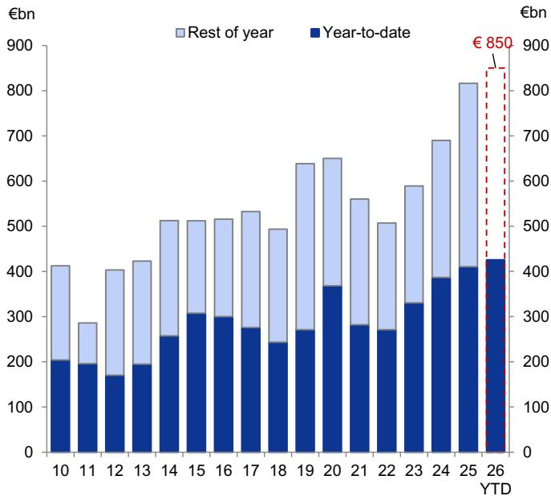

bar_stacked

| Year | Rest of year (€bn) | Year-to-date (€bn) |
|------|---------------------|---------------------|
| 10   | 300                 | 200                 |
| 11   | 150                 | 190                 |
| 12   | 350                 | 170                 |
| 13   | 350                 | 190                 |
| 14   | 350                 | 250                 |
| 15   | 350                 | 300                 |
| 16   | 350                 | 300                 |
| 17   | 350                 | 270                 |
| 18   | 350                 | 240                 |
| 19   | 450                 | 270                 |
| 20   | 450                 | 370                 |
| 21   | 350                 | 280                 |
| 22   | 350                 | 270                 |
| 23   | 350                 | 320                 |
| 24   | 450                 | 380                 |
| 25   | 450                 | 410                 |
| 26   | 450                 | 420                 |

Source: Dealogic, GS Global Investment Research

# Exhibit 91: EUR Leveraged loan gross issuance

Historical EUR leveraged loan issuance: Same period year to date vs. rest of the year

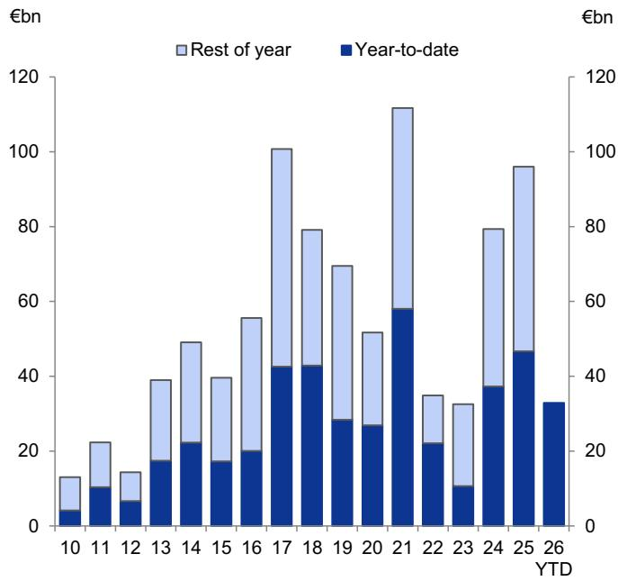

bar_stacked

| Year | Rest of year (€bn) | Year-to-date (€bn) |
| :--- | :--- | :--- |
| 10 | 12 | 4 |
| 11 | 18 | 10 |
| 12 | 13 | 7 |
| 13 | 25 | 17 |
| 14 | 32 | 22 |
| 15 | 30 | 17 |
| 16 | 45 | 20 |
| 17 | 70 | 42 |
| 18 | 50 | 43 |
| 19 | 60 | 28 |
| 20 | 35 | 27 |
| 21 | 65 | 58 |
| 22 | 20 | 22 |
| 23 | 30 | 10 |
| 24 | 50 | 37 |
| 25 | 55 | 46 |
| 26 | - | 33 |

Source: Pitchbook LCD, GS Global Investment Research

# Exhibit 90: EUR HY gross issuance

Historical EUR high yield issuance: Same period year to date vs. rest of the year

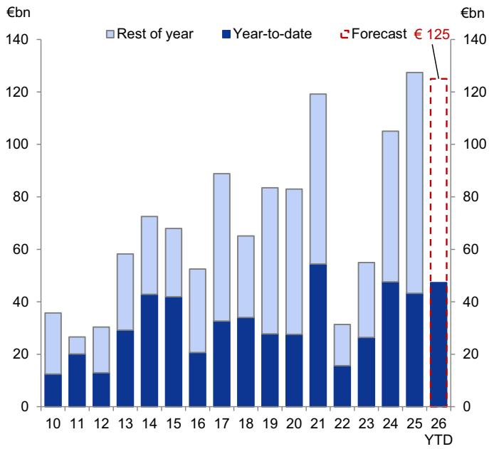

bar_stacked

| Year | Rest of year (€bn) | Year-to-date (€bn) | Forecast (€bn) |
| :--- | :--- | :--- | :--- |
| 10 | 36 | 12 | - |
| 11 | 26 | 20 | - |
| 12 | 30 | 13 | - |
| 13 | 58 | 29 | - |
| 14 | 73 | 43 | - |
| 15 | 68 | 42 | - |
| 16 | 53 | 20 | - |
| 17 | 89 | 33 | - |
| 18 | 65 | 34 | - |
| 19 | 84 | 27 | - |
| 20 | 83 | 27 | - |
| 21 | 120 | 54 | - |
| 22 | 31 | 15 | - |
| 23 | 55 | 25 | - |
| 24 | 105 | 47 | - |
| 25 | 128 | 43 | €125 |
| YTD | - | - | - |
Forecast: €125

Source: Dealogic, GS Global Investment Research

# Exhibit 92: EUR CLO creation

Historical EUR CLO creation broken: Same period year to date vs. rest of the year

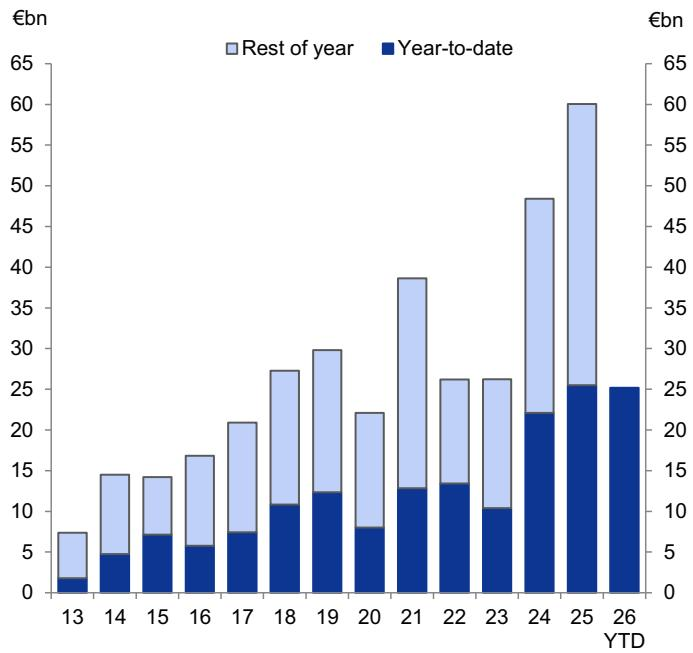

bar_stacked

| Year | Rest of year (€bn) | Year-to-date (€bn) |
| :--- | :--- | :--- |
| 13 | 5 | 2 |
| 14 | 10 | 5 |
| 15 | 8 | 7 |
| 16 | 12 | 6 |
| 17 | 15 | 7 |
| 18 | 20 | 10 |
| 19 | 22 | 12 |
| 20 | 18 | 8 |
| 21 | 30 | 12 |
| 22 | 15 | 13 |
| 23 | 20 | 10 |
| 24 | 30 | 22 |
| 25 | 35 | 25 |
| 26 | - | 25 |

Source: Pitchbook LCD, GS Global Investment Research

# Primary market dashboard: Use of proceeds

Exhibit 93: Annual USD IG issuance volumes by use of proceeds   
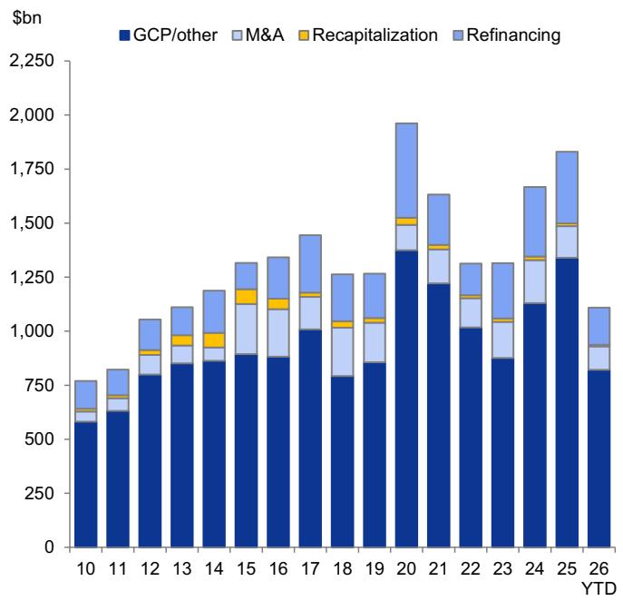

bar_stacked

| Year | GCP/other ($bn) | M&A ($bn) | Recapitalization ($bn) | Refinancing ($bn) |
| :--- | :--- | :--- | :--- | :--- |
| 10 | 570 | 40 | 30 | 180 |
| 11 | 620 | 50 | 30 | 190 |
| 12 | 780 | 100 | 40 | 200 |
| 13 | 840 | 80 | 60 | 210 |
| 14 | 860 | 60 | 80 | 230 |
| 15 | 890 | 250 | 100 | 240 |
| 16 | 880 | 250 | 80 | 250 |
| 17 | 1000 | 150 | 40 | 320 |
| 18 | 780 | 250 | 60 | 320 |
| 19 | 860 | 250 | 40 | 320 |
| 20 | 1380 | 150 | 60 | 450 |
| 21 | 1230 | 200 | 60 | 390 |
| 22 | 1010 | 150 | 40 | 250 |
| 23 | 870 | 250 | 40 | 330 |
| 24 | 1130 | 250 | 40 | 390 |
| 25 | 1340 | 150 | 60 | 390 |
| 26 | 810 | 150 | 40 | 250 |

Source: Dealogic, GS Global Investment Research

Exhibit 94: USD HY issuance volumes by use of proceeds   
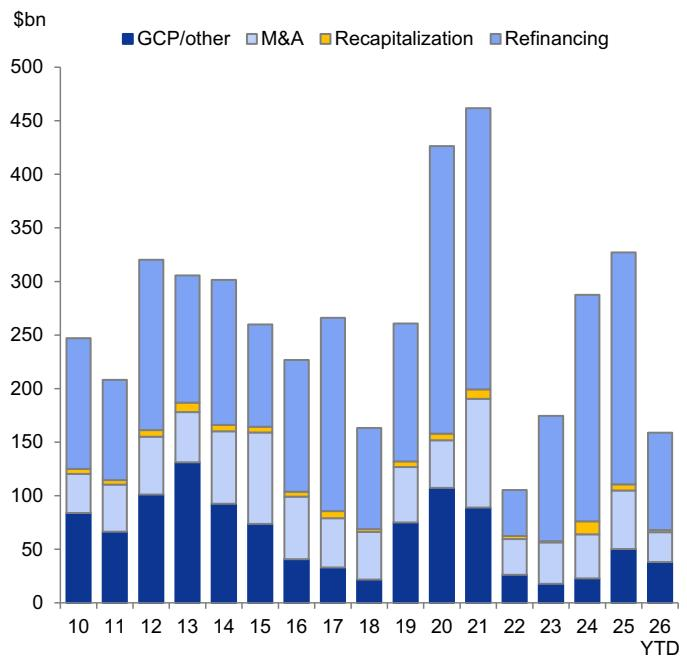  
Source: Dealogic, GS Global Investment Research

Exhibit 95: EUR IG issuance volumes by use of proceeds   
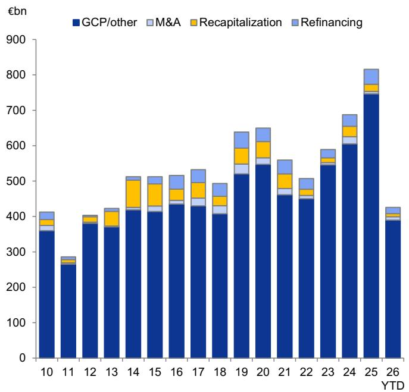

bar_stacked

| Year | GCP/other (€bn) | M&A (€bn) | Recapitalization (€bn) | Refinancing (€bn) |
| :--- | :--- | :--- | :--- | :--- |
| 10 | 355 | 0 | 40 | 30 |
| 11 | 255 | 10 | 10 | 0 |
| 12 | 375 | 0 | 20 | 0 |
| 13 | 365 | 0 | 60 | 10 |
| 14 | 415 | 20 | 100 | 10 |
| 15 | 415 | 20 | 80 | 20 |
| 16 | 435 | 20 | 50 | 40 |
| 17 | 425 | 20 | 60 | 40 |
| 18 | 405 | 20 | 40 | 50 |
| 19 | 515 | 40 | 80 | 60 |
| 20 | 545 | 20 | 70 | 60 |
| 21 | 455 | 10 | 60 | 60 |
| 22 | 445 | 0 | 20 | 40 |
| 23 | 545 | 0 | 20 | 30 |
| 24 | 605 | 30 | 60 | 40 |
| 25 | 745 | 10 | 30 | 30 |
| 26 | 385 | 0 | 10 | 20 |

Source: Dealogic, GS Global Investment Research

Exhibit 96: EUR HY issuance volumes by use of proceeds   
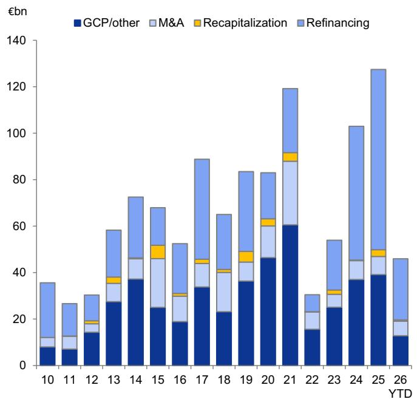

bar_stacked

| Year | GCP/other (€bn) | M&A (€bn) | Recapitalization (€bn) | Refinancing (€bn) |
| :--- | :--- | :--- | :--- | :--- |
| 10 | 8 | 5 | 0 | 34 |
| 11 | 7 | 7 | 0 | 26 |
| 12 | 14 | 3 | 2 | 19 |
| 13 | 27 | 10 | 5 | 28 |
| 14 | 37 | 10 | 0 | 33 |
| 15 | 25 | 25 | 8 | 22 |
| 16 | 19 | 13 | 5 | 33 |
| 17 | 33 | 12 | 4 | 54 |
| 18 | 23 | 25 | 2 | 37 |
| 19 | 36 | 10 | 7 | 40 |
| 20 | 46 | 15 | 5 | 29 |
| 21 | 60 | 28 | 6 | 34 |
| 22 | 16 | 10 | 0 | 14 |
| 23 | 25 | 6 | 3 | 29 |
| 24 | 37 | 8 | 0 | 58 |
| 25 | 39 | 8 | 5 | 74 |
| 26 | 13 | 7 | 0 | 39 |

Source: Dealogic, GS Global Investment Research

# Primary market dashboard: Net issuance

Note: Decomposition of the change in par value outstanding into net ratings migration vs. "organic" net issuance (gross issuance minus redemptions/matured bonds)

Exhibit 97: Annual USD IG net issuance   
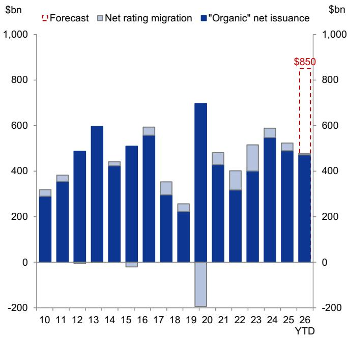

bar

| Year | Organic | Net rating migration | Forecast |
|------|---------|----------------------|----------|
| 10   | 300     | 50                   |          |
| 11   | 350     | 50                   |          |
| 12   | 480     | 0                    |          |
| 13   | 600     | 0                    |          |
| 14   | 420     | 20                   |          |
| 15   | 500     | -20                  |          |
| 16   | 550     | 50                   |          |
| 17   | 300     | 50                   |          |
| 18   | 220     | 50                   |          |
| 19   | 700     | -150                 |          |
| 20   | 420     | 50                   |          |
| 21   | 320     | 50                   |          |
| 22   | 400     | 50                   |          |
| 23   | 400     | 100                  |          |
| 24   | 550     | 50                   |          |
| 25   | 480     | 50                   |          |
| 26   | 480     | 0                    | $850     |

Source: Bloomberg, GS Global Investment Research

Exhibit 98: Annual USD HY net issuance   
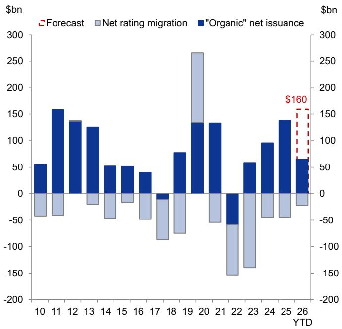

bar

| YTD | Forecast | Net rating migration | "Organic" net issuance |
| --- | --- | --- | --- |
| 10 | - | -40 | 55 |
| 11 | - | -45 | 160 |
| 12 | - | - | 135 |
| 13 | - | -25 | 125 |
| 14 | - | -45 | 50 |
| 15 | - | -20 | 50 |
| 16 | - | -45 | 40 |
| 17 | - | -80 | -10 |
| 18 | - | -70 | 75 |
| 19 | - | 270 | 130 |
| 20 | - | 20 | 130 |
| 21 | - | -50 | 0 |
| 22 | - | -150 | -50 |
| 23 | - | -130 | 55 |
| 24 | - | -40 | 95 |
| 25 | - | -40 | 135 |
| 26 | $160 | -20 | 65 |

Source: Bloomberg, GS Global Investment Research

Exhibit 99: Annual EUR IG net issuance   
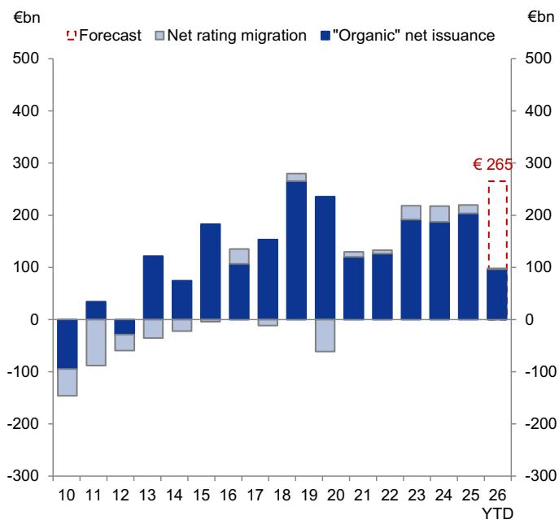

bar

| YTD | Forecast (€bn) | Net rating migration (€bn) | "Organic" net issuance (€bn) |
|-----|-----------------|----------------------------|------------------------------|
| 10  | -               | -150                       | -100                         |
| 11  | -               | -80                        | 30                           |
| 12  | -               | -50                        | -20                          |
| 13  | -               | -30                        | 120                          |
| 14  | -               | -20                        | 70                           |
| 15  | -               | -10                        | 180                          |
| 16  | -               | 50                         | 100                          |
| 17  | -               | -10                        | 150                          |
| 18  | -               | -20                        | 270                          |
| 19  | -               | -50                        | 230                          |
| 20  | -               | -60                        | 120                          |
| 21  | -               | -10                        | 120                          |
| 22  | -               | -10                        | 130                          |
| 23  | -               | 50                         | 190                          |
| 24  | -               | 50                         | 180                          |
| 25  | -               | 50                         | 200                          |
| 26  | 265             | -                          | 90                           |

Source: Bloomberg, GS Global Investment Research

Exhibit 100: Annual EUR HY net issuance   
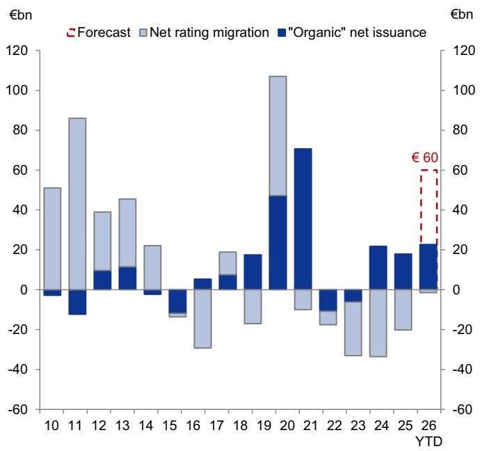

bar

| YTD | Forecast (€bn) | Net rating migration (€bn) | "Organic" net issuance (€bn) |
|-----|----------------|----------------------------|------------------------------|
| 10  |                |                            |                              |
| 11  |                |                            |                              |
| 12  |                |                            |                              |
| 13  |                |                            |                              |
| 14  |                |                            |                              |
| 15  |                |                            |                              |
| 16  |                |                            |                              |
| 17  |                |                            |                              |
| 18  |                |                            |                              |
| 19  |                |                            |                              |
| 20  |                |                            |                              |
| 21  |                |                            |                              |
| 22  |                |                            |                              |
| 23  |                |                            |                              |
| 24  |                |                            |                              |
| 25  |                |                            |                              |
| 26  | €60            |                            |                              |

Source: Bloomberg, GS Global Investment Research

# Primary market dashboard: AI-related issuance for the USD and EUR markets

Exhibit 101: USD AI-related Gross Issuance   
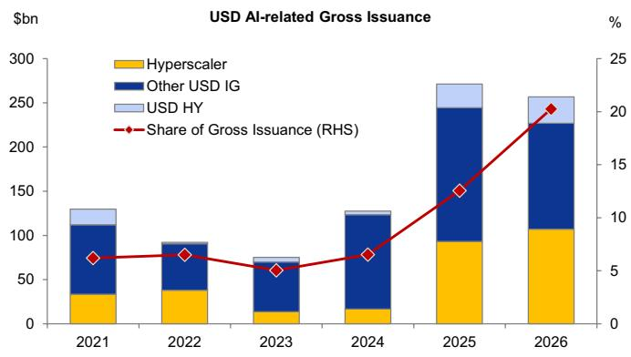

bar_line

USD AI-related Gross Issuance
| Year | Hyperscaler ($bn) | Other USD IG ($bn) | USD HY ($bn) | Share of Gross Issuance (%) |
| :--- | :--- | :--- | :--- | :--- |
| 2021 | 35 | 70 | 25 | 6 |
| 2022 | 38 | 45 | 10 | 6 |
| 2023 | 15 | 50 | 10 | 5 |
| 2024 | 18 | 85 | 10 | 7 |
| 2025 | 95 | 130 | 30 | 13 |
| 2026 | 110 | 120 | 30 | 21 |

Source: Dealogic, GS Global Investment Research

Exhibit 102: EUR AI-related Gross Issuance   
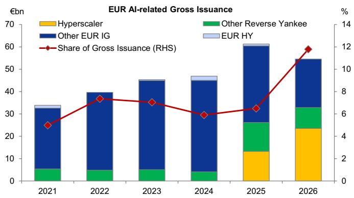

bar_line

EUR AI-related Gross Issuance
| Year | Hyperscaler (€bn) | Other Reverse Yankee (€bn) | EUR IG (€bn) | EUR HY (%) | Share of Gross Issuance (RHS) (%) |
| :--- | :--- | :--- | :--- | :--- | :--- |
| 2021 | 5 | 5 | 30 | 1 | 5 |
| 2022 | 5 | 5 | 38 | 1 | 7 |
| 2023 | 5 | 5 | 44 | 1 | 6.5 |
| 2024 | 0 | 4 | 44 | 1 | 5.5 |
| 2025 | 13 | 17 | 49 | 1 | 6 |
| 2026 | 23 | 13 | 31 | 1 | 11.5 |

Source: Dealogic, GS Global Investment Research

Exhibit 103: USD AI-related net issuance   
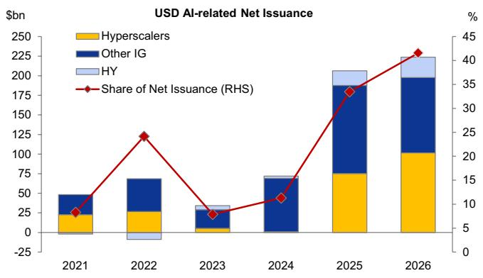

bar_line

USD AI-related Net Issuance
| Year | Hyperscalers ($bn) | Other IG ($bn) | HY ($bn) | Share of Net Issuance (%) |
| :--- | :--- | :--- | :--- | :--- |
| 2021 | 20 | 30 | 5 | 8 |
| 2022 | 25 | 45 | -15 | 23 |
| 2023 | 5 | 15 | 10 | 6 |
| 2024 | 0 | 60 | 10 | 11 |
| 2025 | 75 | 95 | 20 | 33 |
| 2026 | 100 | 85 | 20 | 43 |

Source: Dealogic, GS Global Investment Research

Exhibit 104: EUR AI-related net issuance   
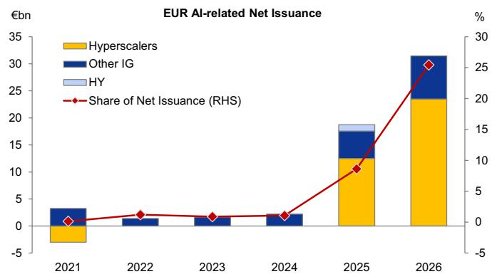

bar_line

EUR AI-related Net Issuance
| Year | Hyperscalers (€bn) | Other IG (€bn) | HY (€bn) | Share of Net Issuance (%) |
| :--- | :--- | :--- | :--- | :--- |
| 2021 | -3.5 | 2.5 | -1.5 | 1.0 |
| 2022 | 0.0 | 1.0 | -0.5 | 1.5 |
| 2023 | 0.0 | 1.0 | -0.5 | 1.0 |
| 2024 | 0.0 | 1.5 | -0.5 | 1.5 |
| 2025 | 12.5 | 4.5 | 1.5 | 9.5 |
| 2026 | 23.5 | 7.5 | 1.5 | 25.5 |

Source: Dealogic, GS Global Investment Research

Exhibit 105: Hyperscaler debt issuance across currencies (in USD-equivalent)   
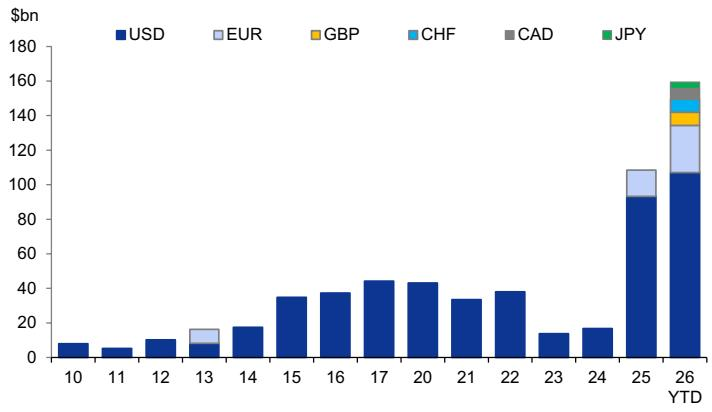

bar_stacked

| Year | USD ($bn) | EUR ($bn) | GBP ($bn) | CHF ($bn) | CAD ($bn) | JPY ($bn) |
| :--- | :--- | :--- | :--- | :--- | :--- | :--- |
| 10 | 8 | 0 | 0 | 0 | 0 | 0 |
| 11 | 5 | 0 | 0 | 0 | 0 | 0 |
| 12 | 10 | 0 | 0 | 0 | 0 | 0 |
| 13 | 8 | 7 | 0 | 0 | 0 | 0 |
| 14 | 18 | 0 | 0 | 0 | 0 | 0 |
| 15 | 35 | 0 | 0 | 0 | 0 | 0 |
| 16 | 38 | 0 | 0 | 0 | 0 | 0 |
| 17 | 44 | 0 | 0 | 0 | 0 | 0 |
| 20 | 43 | 0 | 0 | 0 | 0 | 0 |
| 21 | 33 | 0 | 0 | 0 | 0 | 0 |
| 22 | 39 | 0 | 0 | 0 | 0 | 0 |
| 23 | 13 | 0 | 0 | 0 | 0 | 0 |
| 24 | 17 | 0 | 0 | 0 | 0 | 0 |
| 25 | 92 | 12 | 0 | 0 | 0 | 3 |
| 26 | 105 | 25 | 8 | 5 | 3 | 4 |

Note: Captures debt issued by the following companies: Alphabet (Google), Amazon, Microsoft, Meta, and Oracle.   
Source: Dealogic, GS Global Investment Research

# M&A volume

Exhibit 106: Annual US M&A deal volume   
Includes strategic and sponsored deals   
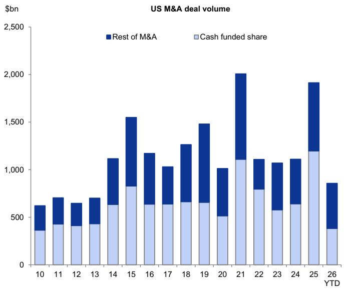

bar_stacked

US M&A deal volume
| Year | Cash funded share ($bn) | Rest of M&A ($bn) |
| :--- | :--- | :--- |
| 10 | 350 | 400 |
| 11 | 420 | 480 |
| 12 | 400 | 450 |
| 13 | 430 | 470 |
| 14 | 620 | 680 |
| 15 | 820 | 980 |
| 16 | 630 | 850 |
| 17 | 630 | 720 |
| 18 | 650 | 950 |
| 19 | 650 | 1050 |
| 20 | 500 | 820 |
| 21 | 1100 | 1150 |
| 22 | 780 | 550 |
| 23 | 570 | 750 |
| 24 | 630 | 780 |
| 25 | 1180 | 980 |
| 26 YTD | 370 | 720 |

Source: Dealogic, GS Global Investment Research

Exhibit 107: Annual European M&A deal volume   
Includes strategic and sponsored deals   
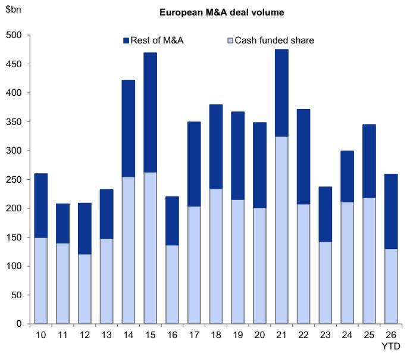

bar_stacked

European M&A deal volume
| Year | Cash funded share ($bn) | Rest of M&A ($bn) |
| :--- | :--- | :--- |
| 10 | 148 | 135 |
| 11 | 139 | 117 |
| 12 | 118 | 128 |
| 13 | 145 | 132 |
| 14 | 254 | 209 |
| 15 | 262 | 230 |
| 16 | 134 | 123 |
| 17 | 202 | 220 |
| 18 | 234 | 209 |
| 19 | 213 | 220 |
| 20 | 200 | 215 |
| 21 | 323 | 248 |
| 22 | 206 | 220 |
| 23 | 141 | 140 |
| 24 | 210 | 145 |
| 25 | 218 | 160 |
| 26 | 128 | 175 |
YTD (Last Year) - Total Deal Volume ($bn)

Source: Pitchbook LCD, GS Global Investment Research

Exhibit 108: Year-to-date US M&A volume by sector   
Includes strategic and sponsored deals   
US year-to-date M&A volume by industry (\$bn)   
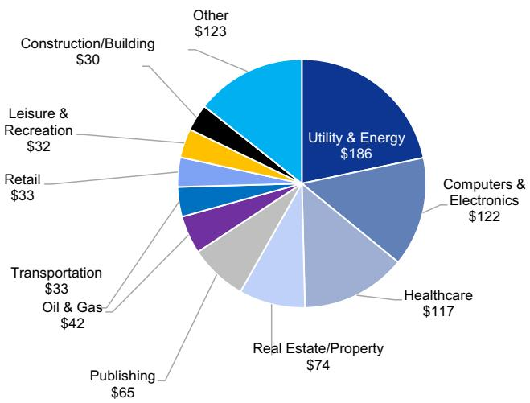

pie

| Category | Value ($) |
|---|---|
| Utility & Energy | 186 |
| Computers & Electronics | 122 |
| Healthcare | 117 |
| Real Estate/Property | 74 |
| Publishing | 65 |
| Oil & Gas | 42 |
| Transportation | 33 |
| Retail | 33 |
| Leisure & Recreation | 32 |
| Construction/Building | 30 |
| Other | 123 |

Source: Dealogic, GS Global Investment Research

Exhibit 109: Year-to-date European M&A volume by sector   
Includes strategic and sponsored deals   
European year-to-date M&A volume by industry (\$bn)   
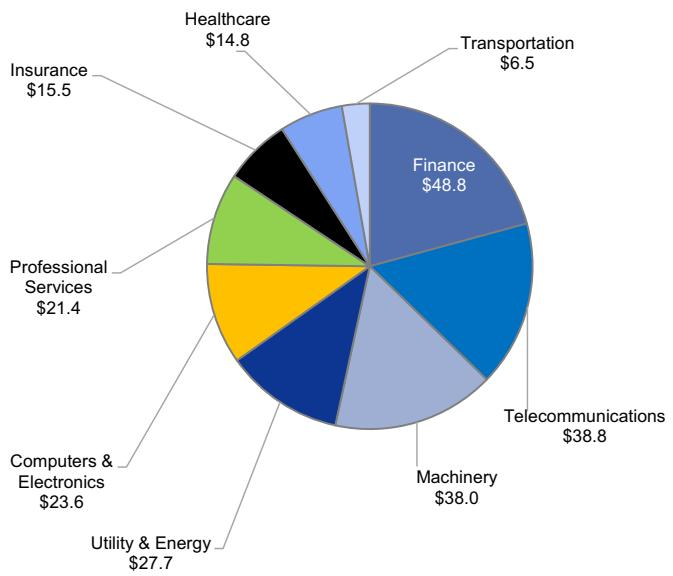

pie

| Category | Value ($) |
|---|---|
| Finance | 48.8 |
| Telecommunications | 38.8 |
| Machinery | 38.0 |
| Utility & Energy | 27.7 |
| Computers & Electronics | 23.6 |
| Professional Services | 21.4 |
| Insurance | 15.5 |
| Healthcare | 14.8 |
| Transportation | 6.5 |

Source: Dealogic, GS Global Investment Research

# M&A volume (Strategic deals only)

Exhibit 110: Annual US strategic M&A volumes   
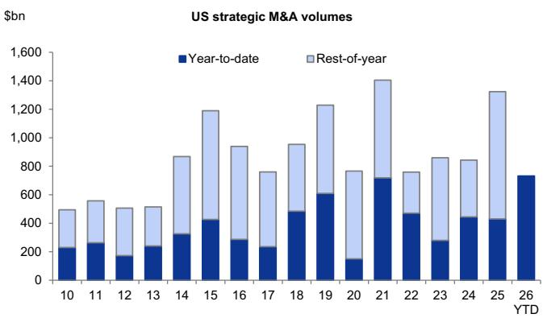

bar_stacked

US strategic M&A volumes
| Year | Year-to-date ($bn) | Rest-of-year ($bn) |
| :--- | :--- | :--- |
| 10 | 230 | 270 |
| 11 | 260 | 300 |
| 12 | 180 | 400 |
| 13 | 250 | 350 |
| 14 | 330 | 550 |
| 15 | 420 | 700 |
| 16 | 290 | 680 |
| 17 | 240 | 550 |
| 18 | 490 | 450 |
| 19 | 610 | 550 |
| 20 | 160 | 720 |
| 21 | 720 | 680 |
| 22 | 470 | 330 |
| 23 | 280 | 630 |
| 24 | 440 | 410 |
| 25 | 420 | 950 |
| YTD | 740 | - |
The chart displays stacked bars for each year from year 10 to year 26. The total stacked height is based on the sum of year-to-date and rest-of-year values in $bn. The year-to-date values are labeled above each bar.

Source: Dealogic, GS Global Investment Research

Exhibit 111: Annual European strategic M&A volumes   
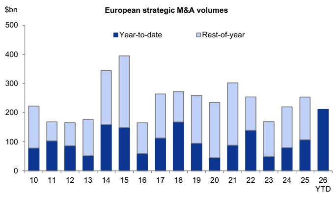

bar_stacked

European strategic M&A volumes
| Year | Year-to-date ($bn) | Rest-of-year ($bn) |
| :--- | :--- | :--- |
| 10 | 78 | 154 |
| 11 | 103 | 60 |
| 12 | 86 | 70 |
| 13 | 50 | 139 |
| 14 | 158 | 184 |
| 15 | 149 | 220 |
| 16 | 60 | 109 |
| 17 | 112 | 143 |
| 18 | 165 | 87 |
| 19 | 96 | 153 |
| 20 | 45 | 209 |
| 21 | 89 | 184 |
| 22 | 138 | 90 |
| 23 | 48 | 127 |
| 24 | 80 | 139 |
| 25 | 107 | 149 |
| YTD | 212 | - |
The chart displays the total volume for each year from year 10 to year 26. The 'Year-to-date' values are not explicitly labeled on the bars, so they are estimated based on the legend. The 'Rest-of-year' values are also estimated based on the legend but not explicitly labeled on the bars.

Source: Dealogic, GS Global Investment Research

Exhibit 112: Annual US strategic M&A deal count   
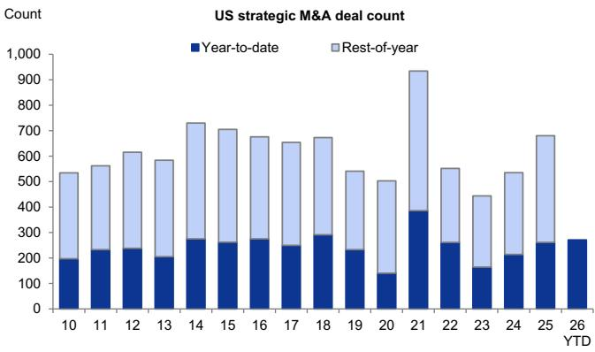

bar_stacked

US strategic M&A deal count
| Year | Year-to-date | Rest-of-year |
| :--- | :--- | :--- |
| 10 | 200 | 350 |
| 11 | 230 | 400 |
| 12 | 240 | 420 |
| 13 | 210 | 430 |
| 14 | 280 | 560 |
| 15 | 270 | 510 |
| 16 | 280 | 490 |
| 17 | 250 | 480 |
| 18 | 290 | 450 |
| 19 | 230 | 380 |
| 20 | 140 | 460 |
| 21 | 380 | 650 |
| 22 | 260 | 370 |
| 23 | 160 | 430 |
| 24 | 210 | 350 |
| 25 | 260 | 490 |
| YTD | 280 | 0 |
The chart displays a stacked bar chart representing the total number of strategic M&A deals per year (M&A) from year-to-date to rest-of-year. The data is already in English. The last row is a duplicate of the first row to complete the full year-by-year total. There is no additional data series or categories present.

Source: Dealogic, GS Global Investment Research

Exhibit 113: Annual European strategic M&A deal count   
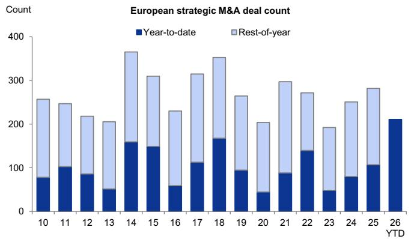

bar_stacked

European strategic M&A deal count
| Year | Year-to-date | Rest-of-year |
| :--- | :--- | :--- |
| 10 | 78 | 235 |
| 11 | 103 | 149 |
| 12 | 87 | 142 |
| 13 | 50 | 153 |
| 14 | 160 | 209 |
| 15 | 149 | 173 |
| 16 | 59 | 160 |
| 17 | 113 | 209 |
| 18 | 166 | 174 |
| 19 | 95 | 170 |
| 20 | 45 | 158 |
| 21 | 89 | 203 |
| 22 | 139 | 146 |
| 23 | 48 | 153 |
| 24 | 80 | 173 |
| 25 | 107 | 184 |
| YTD | 212 | - |

Source: Pitchbook LCD, GS Global Investment Research

Exhibit 114: Annual US strategic M&A deal size   
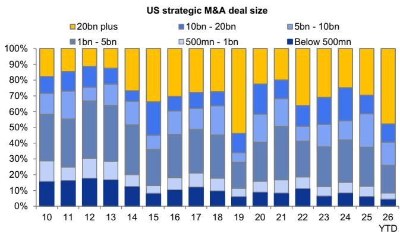

bar_stacked

| Year | Below 500mn | 500mn - 1bn | 1bn - 5bn | 10bn - 20bn | 20bn plus |
|------|-------------|-------------|-----------|-------------|-----------|
| 10   | 15%         | 15%         | 30%       | 15%         | 20%       |
| 11   | 15%         | 15%         | 30%       | 20%         | 20%       |
| 12   | 15%         | 15%         | 30%       | 20%         | 20%       |
| 13   | 15%         | 15%         | 30%       | 20%         | 20%       |
| 14   | 15%         | 15%         | 30%       | 20%         | 20%       |
| 15   | 15%         | 15%         | 30%       | 20%         | 20%       |
| 16   | 15%         | 15%         | 30%       | 20%         | 20%       |
| 17   | 15%         | 15%         | 30%       | 20%         | 20%       |
| 18   | 15%         | 15%         | 30%       | 20%         | 20%       |
| 19   | 15%         | 15%         | 30%       | 20%         | 20%       |
| 20   | 15%         | 15%         | 30%       | 20%         | 20%       |
| 21   | 15%         | 15%         | 30%       | 20%         | 20%       |
| 22   | 15%         | 15%         | 30%       | 20%         | 20%       |
| 23   | 15%         | 15%         | 30%       | 20%         | 20%       |
| 24   | 15%         | 15%         | 30%       | 20%         | 20%       |
| 25   | 15%         | 15%         | 30%       | 20%         | 20%       |
| 26   | 15%         | 15%         | 30%       | 20%         | 20%       |

Source: Dealogic, GS Global Investment Research

Exhibit 115: Annual European strategic M&A deal size   
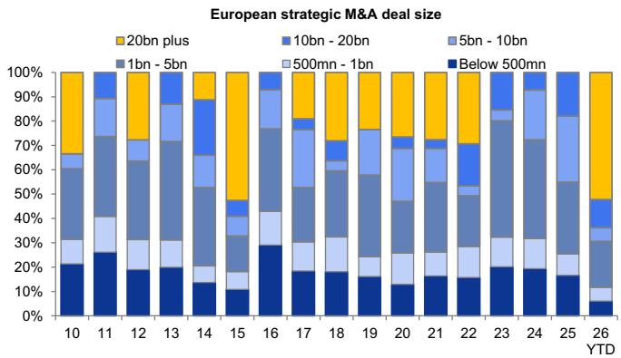

bar_stacked

| Year | Below 500mn | 500mn - 1bn | 1bn - 5bn | 5bn - 10bn | 10bn - 20bn | 20bn plus |
|------|-------------|-------------|-----------|------------|-------------|-----------|
| 10   | 20%         | 10%         | 20%       | 10%        | 20%         | 40%       |
| 11   | 25%         | 15%         | 30%       | 15%        | 25%         | 35%       |
| 12   | 20%         | 15%         | 35%       | 15%        | 30%         | 35%       |
| 13   | 20%         | 15%         | 40%       | 15%        | 35%         | 30%       |
| 14   | 15%         | 15%         | 35%       | 15%        | 40%         | 25%       |
| 15   | 10%         | 15%         | 30%       | 15%        | 45%         | 60%       |
| 16   | 25%         | 15%         | 30%       | 15%        | 45%         | 40%       |
| 17   | 20%         | 15%         | 35%       | 15%        | 40%         | 35%       |
| 18   | 20%         | 15%         | 35%       | 15%        | 40%         | 35%       |
| 19   | 20%         | 15%         | 35%       | 15%        | 40%         | 35%       |
| 20   | 20%         | 15%         | 35%       | 15%        | 40%         | 35%       |
| 21   | 20%         | 15%         | 35%       | 15%        | 40%         | 35%       |
| 22   | 20%         | 15%         | 35%       | 15%        | 40%         | 35%       |
| 23   | 20%         | 15%         | 40%       | 15%        | 35%         | 30%       |
| 24   | 20%         | 15%         | 40%       | 15%        | 35%         | 30%       |
| 25   | 20%         | 15%         | 40%       | 15%        | 35%         | 30%       |
| 26   | 20%         | 15%         | 35%       | 15%        | 30%         | 40%       |

Source: Dealogic, GS Global Investment Research

# Primary market dashboard: CLO creation and refinancing

Exhibit 116: Annual USD Broadly syndicated loan CLO creation   
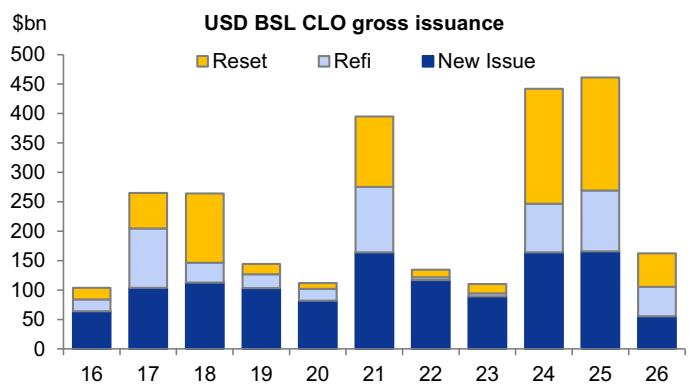

bar_stacked

| Week | New Issue ($bn) | Refi ($bn) | Reset ($bn) |
|------|-----------------|------------|-------------|
| 16   | 60              | 20         | 20          |
| 17   | 100             | 100        | 80          |
| 18   | 110             | 30         | 150         |
| 19   | 100             | 30         | 20          |
| 20   | 80              | 20         | 20          |
| 21   | 160             | 120        | 120         |
| 22   | 120             | 10         | 20          |
| 23   | 80              | 10         | 20          |
| 24   | 160             | 80         | 200         |
| 25   | 160             | 100        | 180         |
| 26   | 50              | 50         | 80          |

Source: Pitchbook LCD, GS Global Investment Research

Exhibit 117: Annual USD Middle market CLO creation   
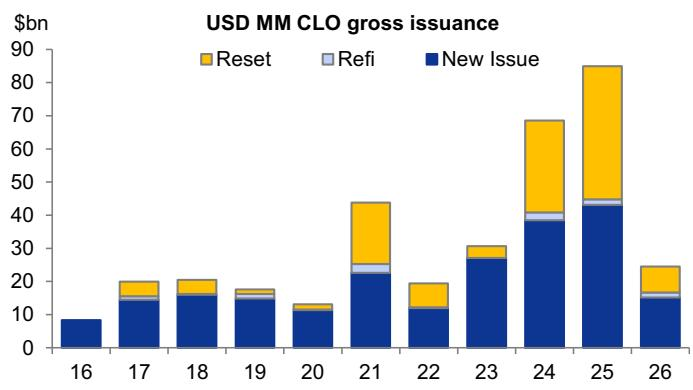

bar_stacked

| Year | Reset | Refi | New Issue |
|------|-------|------|-----------|
| 16   | 0     | 0    | 8         |
| 17   | 5     | 0    | 14        |
| 18   | 5     | 0    | 16        |
| 19   | 0     | 3    | 14        |
| 20   | 2     | 0    | 10        |
| 21   | 20    | 3    | 22        |
| 22   | 5     | 0    | 12        |
| 23   | 3     | 0    | 26        |
| 24   | 30    | 2    | 38        |
| 25   | 40    | 2    | 42        |
| 26   | 5     | 0    | 14        |

Source: Pitchbook LCD, GS Global Investment Research

Exhibit 118: Annual USD leveraged loan net issuance   
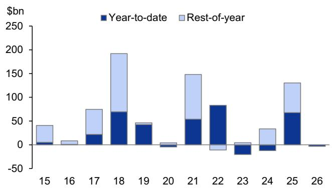

bar_stacked

| Year | Year-to-date ($bn) | Rest-of-year ($bn) |
| :--- | :--- | :--- |
| 15 | 5 | 40 |
| 16 | 0 | 8 |
| 17 | 20 | 50 |
| 18 | 70 | 110 |
| 19 | 45 | 3 |
| 20 | -5 | 5 |
| 21 | 50 | 80 |
| 22 | 80 | -10 |
| 23 | -20 | 5 |
| 24 | -10 | 30 |
| 25 | 65 | 60 |
| 26 | -5 | 0 |

Source: Pitchbook LCD, GS Global Investment Research   
Upcoming notional above prevailing WACD

Exhibit 119: USD CLO refinance monitor

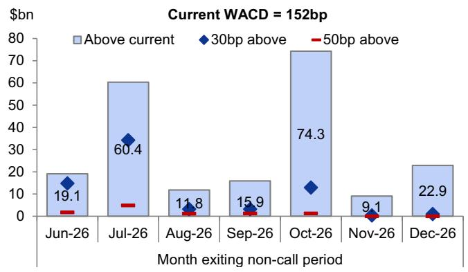

bar

| Month exiting non-call period | Above current | 30bp above | 50bp above |
| ----------------------------- | ------------- | ---------- | ---------- |
| Jun-26                        | 19.1          | 19.1       | 19.1       |
| Jul-26                        | 60.4          | 60.4       | 60.4       |
| Aug-26                        | 11.8          | 11.8       | 11.8       |
| Sep-26                        | 15.9          | 15.9       | 15.9       |
| Oct-26                        | 74.3          | 74.3       | 74.3       |
| Nov-26                        | 9.1           | 9.1        | 9.1        |
| Dec-26                        | 22.9          | 22.9       | 22.9       |

Source: Pitchbook LCD, GS Global Investment Research   
Notional above prevailing WACD by origination quarter

Exhibit 120: USD CLO refinance monitor

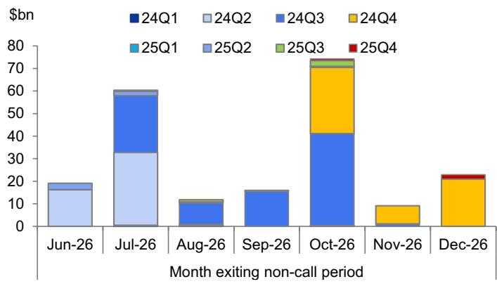

bar_stacked

| Month | 24Q1 ($bn) | 24Q2 ($bn) | 24Q3 ($bn) | 24Q4 ($bn) | 25Q1 ($bn) | 25Q2 ($bn) | 25Q3 ($bn) | 25Q4 ($bn) |
|---|---|---|---|---|---|---|---|---|
| Jun-26 | 0 | 0 | 10 | 0 | 0 | 0 | 0 | 0 |
| Jul-26 | 0 | 30 | 5 | 0 | 0 | 0 | 0 | 0 |
| Aug-26 | 0 | 0 | 0 | 0 | 0 | 0 | 5 | 0 |
| Sep-26 | 0 | 0 | 0 | 0 | 0 | 0 | 0 | 0 |
| Oct-26 | 40 | 0 | 35 | 35 | 0 | 0 | 5 | 0 |
| Nov-26 | 0 | 0 | 0 | 10 | 0 | 0 | 0 | 0 |
| Dec-26 | 0 | 0 | 0 | 25 | 0 | 0 | 0 | 5 |

Source: Pitchbook LCD, GS Global Investment Research

# Primary market dashboard: Maturity walls

Exhibit 121: USD IG bond market maturity wall   
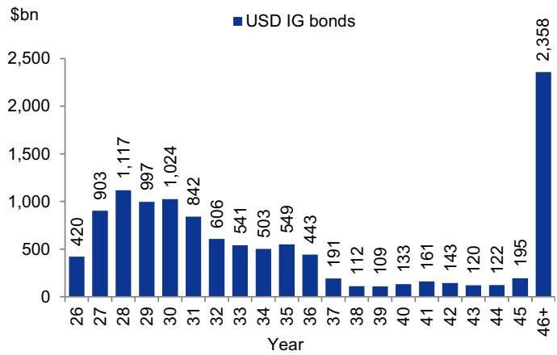

bar

| Year | USD IG bonds ($bn) |
| :--- | :--- |
| 26 | 420 |
| 27 | 903 |
| 28 | 1,117 |
| 29 | 997 |
| 30 | 1,024 |
| 31 | 842 |
| 32 | 606 |
| 33 | 541 |
| 34 | 503 |
| 35 | 549 |
| 36 | 443 |
| 37 | 191 |
| 38 | 112 |
| 39 | 109 |
| 40 | 133 |
| 41 | 161 |
| 42 | 143 |
| 43 | 120 |
| 44 | 122 |
| 45 | 195 |
| 46+ | 2,358 |

Source: Bloomberg, GS Global Investment Research

Exhibit 122: EUR IG bond market maturity wall   
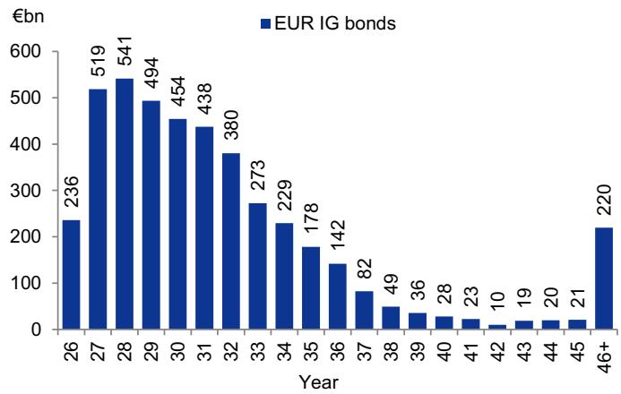

bar

| Year | EUR IG bonds (€bn) |
| :--- | :--- |
| 26 | 236 |
| 27 | 519 |
| 28 | 541 |
| 29 | 494 |
| 30 | 454 |
| 31 | 438 |
| 32 | 380 |
| 33 | 273 |
| 34 | 229 |
| 35 | 178 |
| 36 | 142 |
| 37 | 82 |
| 38 | 49 |
| 39 | 36 |
| 40 | 28 |
| 41 | 23 |
| 42 | 10 |
| 43 | 19 |
| 44 | 20 |
| 45 | 21 |
| 46+ | 220 |

Source: Bloomberg, GS Global Investment Research

Exhibit 123: USD HY bond market maturity wall   
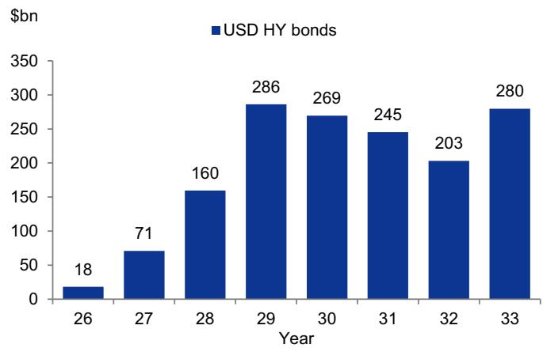

bar

USD HY bonds
| Year | USD HY bonds ($bn) |
| :--- | :--- |
| 26 | 18 |
| 27 | 71 |
| 28 | 160 |
| 29 | 286 |
| 30 | 269 |
| 31 | 245 |
| 32 | 203 |
| 33 | 280 |

Source: Bloomberg, GS Global Investment Research

Exhibit 124: EUR HY bond market maturity wall   
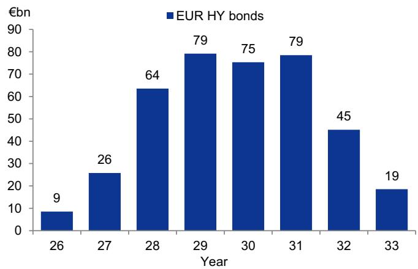

bar

EUR HY bonds
| Year | EUR HY bonds (€bn) |
| :--- | :--- |
| 26 | 9 |
| 27 | 26 |
| 28 | 64 |
| 29 | 79 |
| 30 | 75 |
| 31 | 79 |
| 32 | 45 |
| 33 | 19 |

Source: Bloomberg, GS Global Investment Research

Exhibit 125: USD leveraged loan market maturity wall   

bar

| Year | USD leveraged loans ($bn) |
| :--- | :--- |
| 26 | 1 |
| 27 | 32 |
| 28 | 222 |
| 29 | 187 |
| 30 | 216 |
| 31 | 440 |
| 32 | 344 |

Source: Pitchbook LCD, GS Global Investment Research

Exhibit 126: EUR leveraged loan market maturity wall   
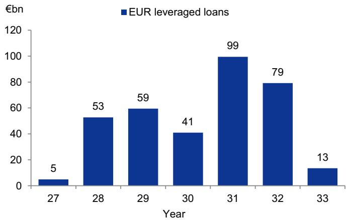

bar

EUR leveraged loans
| Year | EUR leveraged loans (€bn) |
| :--- | :--- |
| 27 | 5 |
| 28 | 53 |
| 29 | 59 |
| 30 | 41 |
| 31 | 99 |
| 32 | 79 |
| 33 | 13 |

Source: Pitchbook LCD, GS Global Investment Research

# Fundamental dashboard: Credit metrics for US non-financial corporations

Exhibit 127: Net debt to EBITDA ratios for the median US IG and HY-rated non-financial corporations   
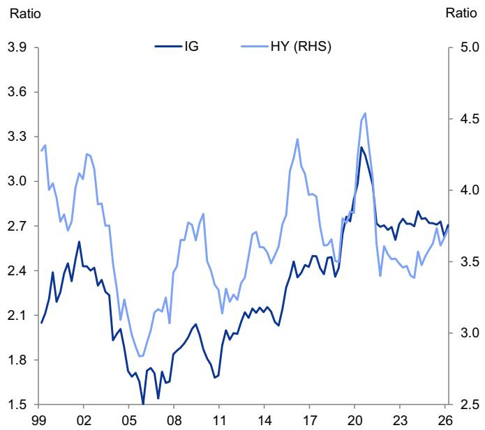

line

| Year | IG   | HY (RHS) |
|------|------|----------|
| 99   | 2.1  | 3.3      |
| 02   | 2.4  | 3.1      |
| 05   | 1.8  | 2.8      |
| 08   | 1.9  | 2.7      |
| 11   | 2.0  | 2.6      |
| 14   | 2.1  | 2.8      |
| 17   | 2.4  | 3.3      |
| 20   | 2.7  | 3.5      |
| 23   | 2.7  | 3.4      |
| 26   | 2.7  | 3.6      |

Source: FactSet, GS Global Investment Research

Exhibit 128: Interest coverage ratios for the median US IG and HY-rated non-financial corporations   
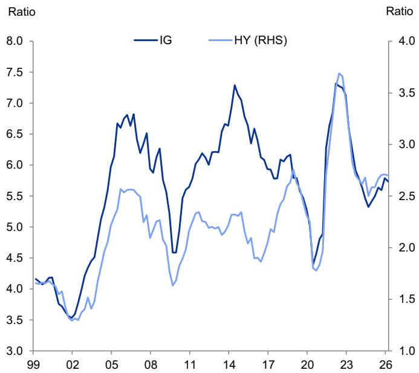

line

| Year | IG   | HY (RHS) |
|------|------|----------|
| 99   | 4.1  | 4.0      |
| 02   | 3.5  | 3.4      |
| 05   | 6.8  | 5.6      |
| 08   | 6.2  | 5.0      |
| 11   | 5.5  | 5.2      |
| 14   | 7.3  | 5.3      |
| 17   | 6.0  | 4.8      |
| 20   | 5.8  | 4.5      |
| 23   | 7.5  | 3.8      |
| 26   | 5.7  | 2.8      |

Source: FactSet, GS Global Investment Research

Exhibit 129: Net margins for the median US IG and HY-rated non-financial corporations   
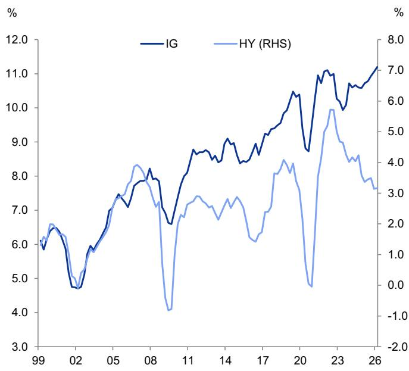

line

| Year | IG   | HY (RHS) |
|------|------|----------|
| 99   | 6.0  | 6.5      |
| 02   | 4.8  | 4.5      |
| 05   | 7.5  | 7.8      |
| 08   | 8.0  | 7.0      |
| 11   | 8.5  | 7.5      |
| 14   | 9.0  | 7.0      |
| 17   | 9.5  | 6.5      |
| 20   | 10.5 | 8.0      |
| 23   | 11.0 | 10.0     |
| 26   | 11.5 | 7.5      |

Source: FactSet, GS Global Investment Research

Exhibit 130: Cash to total assets ratios for the median US IG and HY-rated corporations   
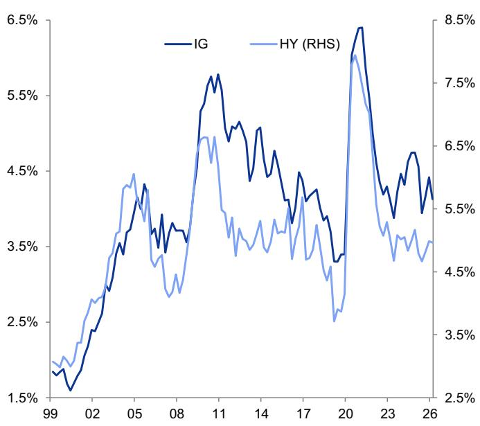

line

| Year | IG    | HY (RHS) |
|------|-------|----------|
| 99   | 1.5%  | 2.5%     |
| 02   | 2.5%  | 3.5%     |
| 05   | 4.5%  | 5.5%     |
| 08   | 3.5%  | 4.5%     |
| 11   | 6.5%  | 7.5%     |
| 14   | 5.5%  | 6.5%     |
| 17   | 4.5%  | 5.5%     |
| 20   | 3.5%  | 4.5%     |
| 23   | 6.5%  | 7.5%     |
| 26   | 4.5%  | 5.5%     |

Source: FactSet, GS Global Investment Research

# Fundamental dashboard: Credit metrics for European non-financial corporations

Exhibit 131: Net debt to EBITDA ratios for the median European IG and HY-rated non-financial corporations   
We include firms domiciled in the Euro area, UK, Switzerland, Sweden, Denmark and Norway   
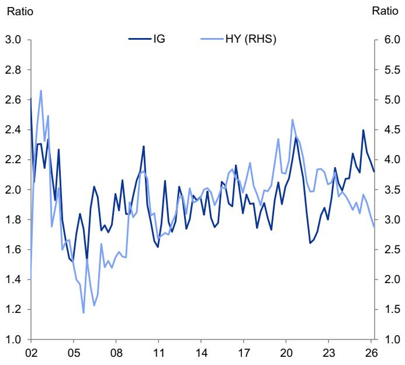

line

| Time | IG   | HY (RHS) |
|------|------|----------|
| 02   | 2.6  | 5.5      |
| 05   | 1.8  | 1.5      |
| 08   | 2.0  | 2.5      |
| 11   | 2.3  | 3.0      |
| 14   | 1.9  | 3.5      |
| 17   | 2.1  | 4.0      |
| 20   | 2.4  | 4.5      |
| 23   | 2.2  | 3.5      |
| 26   | 2.4  | 3.0      |

Source: FactSet, GS Global Investment Research

Exhibit 132: Interest coverage ratios for the median European IG and HY-rated non-financial corporations   
We include firms domiciled in the Euro area, UK, Switzerland, Sweden, Denmark and Norway   
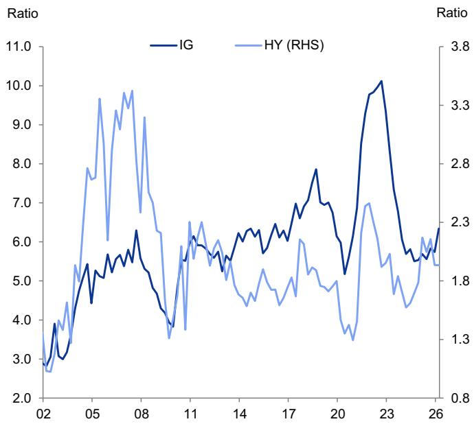

line

| Year | IG   | HY (RHS) |
|------|------|----------|
| 02   | 3.0  | 1.3      |
| 05   | 5.0  | 3.8      |
| 08   | 6.0  | 2.8      |
| 11   | 5.5  | 1.8      |
| 14   | 6.0  | 2.0      |
| 17   | 6.5  | 1.5      |
| 20   | 5.0  | 1.3      |
| 23   | 10.0 | 2.3      |
| 26   | 6.0  | 1.8      |

Source: FactSet, GS Global Investment Research

Exhibit 133: Net margins for the median European IG and HY-rated non-financial corporations   
We include firms domiciled in the Euro area, UK, Switzerland, Sweden, Denmark and Norway   
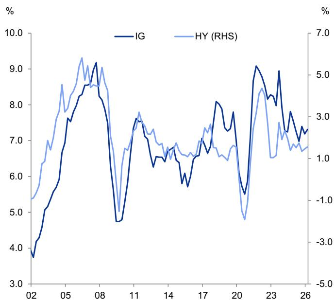

line

| Year | IG    | HY (RHS) |
|------|-------|----------|
| 02   | 3.8%  | 5.4%     |
| 05   | 7.5%  | 8.5%     |
| 08   | 9.2%  | 9.0%     |
| 11   | 7.8%  | 7.5%     |
| 14   | 6.5%  | 6.8%     |
| 17   | 7.0%  | 7.2%     |
| 20   | 5.5%  | 4.8%     |
| 23   | 9.0%  | 8.5%     |
| 26   | 7.2%  | 6.8%     |

Source: FactSet, GS Global Investment Research

Exhibit 134: Cash to total assets ratios for the median European IG and HY-rated non-financial corporations   
We include firms domiciled in the Euro area, UK, Switzerland, Sweden, Denmark and Norway   
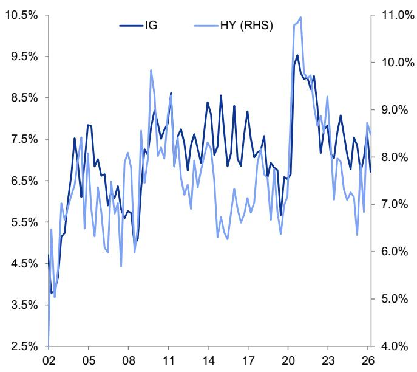

line

| Period | IG    | HY (RHS) |
|--------|-------|----------|
| 02     | 3.5%  | 5.0%     |
| 05     | 7.5%  | 6.5%     |
| 08     | 5.5%  | 6.0%     |
| 11     | 8.5%  | 9.0%     |
| 14     | 7.5%  | 7.0%     |
| 17     | 8.0%  | 7.5%     |
| 20     | 9.5%  | 10.0%    |
| 23     | 8.0%  | 8.5%     |
| 26     | 7.0%  | 8.0%     |

Source: FactSet, GS Global Investment Research

# Default and ratings migration dashboard: Default trends

# Exhibit 135: Default rates for US HY bond and leveraged loan issuers

12-month trailing issuer-weighted default rate in the US HY bond and leveraged loan markets

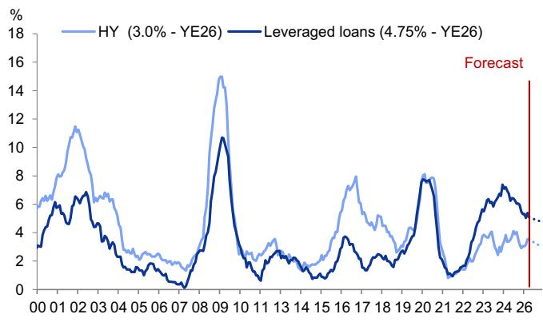

line

| Year | HY (3.0% - YE26) | Leveraged loans (4.75% - YE26) |
|------|------------------|-------------------------------|
| 00   | ~6               | ~3                            |
| 01   | ~8               | ~5                            |
| 02   | ~11              | ~6                            |
| 03   | ~7               | ~4                            |
| 04   | ~5               | ~3                            |
| 05   | ~3               | ~2                            |
| 06   | ~2               | ~1                            |
| 07   | ~1               | ~0.5                          |
| 08   | ~3               | ~1                            |
| 09   | ~15              | ~11                           |
| 10   | ~2               | ~0.5                          |
| 11   | ~3               | ~1                            |
| 12   | ~4               | ~2                            |
| 13   | ~5               | ~3                            |
| 14   | ~6               | ~4                            |
| 15   | ~7               | ~5                            |
| 16   | ~8               | ~6                            |
| 17   | ~7               | ~5                            |
| 18   | ~6               | ~4                            |
| 19   | ~5               | ~3                            |
| 20   | ~8               | ~7                            |
| 21   | ~7               | ~5                            |
| 22   | ~6               | ~4                            |
| 23   | ~5               | ~3                            |
| 24   | ~4               | ~2                            |
| 25   | ~3               | ~1                            |
| 26   | ~2               | ~0.5                          |

Source: Moody's, GS Global Investment Research

# Exhibit 137: High frequency default rates for US HY bond and leveraged loan issuers

3-month trailing issuer-weighted default rate in the US HY bond and leveraged loan markets

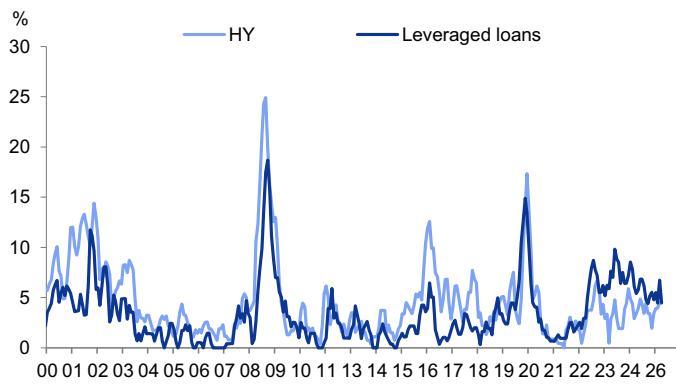

line

| Date | HY  | Leveraged loans |
|------|-----|-----------------|
| 00   | ~10 | ~5              |
| 01   | ~12 | ~7              |
| 02   | ~14 | ~8              |
| 03   | ~8  | ~4              |
| 04   | ~6  | ~3              |
| 05   | ~4  | ~2              |
| 06   | ~3  | ~1              |
| 07   | ~2  | ~1              |
| 08   | ~5  | ~3              |
| 09   | ~25 | ~18             |
| 10   | ~3  | ~2              |
| 11   | ~4  | ~3              |
| 12   | ~5  | ~4              |
| 13   | ~6  | ~5              |
| 14   | ~7  | ~6              |
| 15   | ~8  | ~7              |
| 16   | ~12 | ~6              |
| 17   | ~7  | ~5              |
| 18   | ~6  | ~4              |
| 19   | ~8  | ~5              |
| 20   | ~17 | ~15             |
| 21   | ~6  | ~4              |
| 22   | ~5  | ~3              |
| 23   | ~7  | ~6              |
| 24   | ~8  | ~7              |
| 25   | ~6  | ~5              |
| 26   | ~5  | ~4              |

Source: Moody's, GS Global Investment Research

Exhibit 139: Annual par value amounts of defaulted USD HY bonds and leveraged loans   
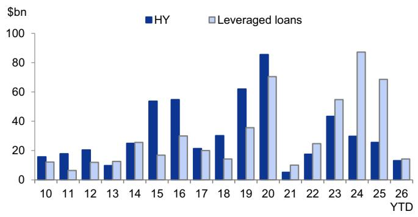

bar

| Year | HY ($bn) | Leveraged loans ($bn) |
| :--- | :--- | :--- |
| 10 | 16 | 12 |
| 11 | 18 | 6 |
| 12 | 21 | 12 |
| 13 | 10 | 12 |
| 14 | 25 | 25 |
| 15 | 54 | 17 |
| 16 | 55 | 30 |
| 17 | 22 | 20 |
| 18 | 30 | 14 |
| 19 | 62 | 36 |
| 20 | 85 | 70 |
| 21 | 5 | 10 |
| 22 | 18 | 24 |
| 23 | 43 | 55 |
| 24 | 30 | 87 |
| 25 | 25 | 68 |
| 26 | 13 | 14 |

Source: Moody's, GS Global Investment Research

# Exhibit 136: Default rates for European bond and leveraged loan issuers

12-month trailing issuer-weighted default rate in the European HY bond and leveraged loan markets

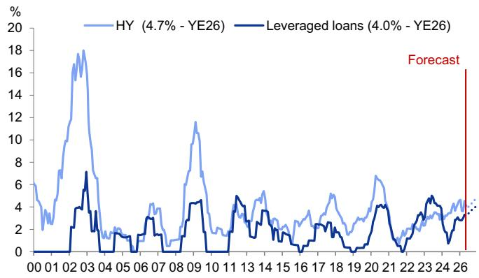

line

| Year | HY (4.7% - YE26) | Leveraged loans (4.0% - YE26) |
|------|------------------|-------------------------------|
| 00   | ~6               | ~0                            |
| 01   | ~8               | ~0                            |
| 02   | ~18              | ~4                            |
| 03   | ~18              | ~7                            |
| 04   | ~2               | ~2                            |
| 05   | ~4               | ~2                            |
| 06   | ~4               | ~2                            |
| 07   | ~4               | ~2                            |
| 08   | ~4               | ~2                            |
| 09   | ~12              | ~4                            |
| 10   | ~2               | ~2                            |
| 11   | ~4               | ~4                            |
| 12   | ~4               | ~4                            |
| 13   | ~4               | ~4                            |
| 14   | ~4               | ~4                            |
| 15   | ~4               | ~4                            |
| 16   | ~4               | ~4                            |
| 17   | ~4               | ~4                            |
| 18   | ~4               | ~4                            |
| 19   | ~4               | ~4                            |
| 20   | ~6               | ~4                            |
| 21   | ~6               | ~4                            |
| 22   | ~4               | ~2                            |
| 23   | ~4               | ~4                            |
| 24   | ~4               | ~4                            |
| 25   | ~4               | ~4                            |
| 26   | ~4               | ~4                            |

Source: Moody's, GS Global Investment Research

# Exhibit 138: High frequency default rates for European HY bond and leveraged loan issuers

3-month trailing issuer-weighted default rate in the European HY bond and leveraged loan markets

line

| Date | HY  | Leveraged loans |
|------|-----|-----------------|
| 00   | 7   | 0               |
| 01   | 10  | 0               |
| 02   | 29  | 14              |
| 03   | 21  | 15              |
| 04   | 2   | 0               |
| 05   | 8   | 6               |
| 06   | 7   | 6               |
| 07   | 8   | 6               |
| 08   | 17  | 12              |
| 09   | 16  | 13              |
| 10   | 5   | 5               |
| 11   | 6   | 11              |
| 12   | 5   | 5               |
| 13   | 9   | 5               |
| 14   | 6   | 5               |
| 15   | 8   | 5               |
| 16   | 7   | 5               |
| 17   | 6   | 5               |
| 18   | 5   | 5               |
| 19   | 4   | 5               |
| 20   | 11  | 8               |
| 21   | 7   | 5               |
| 22   | 5   | 5               |
| 23   | 6   | 10              |
| 24   | 7   | 5               |
| 25   | 6   | 5               |
| 26   | 7   | 5               |

Source: Moody's, GS Global Investment Research

Exhibit 140: Par value amounts of defaulted EUR HY bonds and leveraged loans   
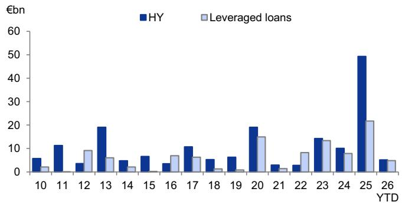

bar

| Year | HY (€bn) | Leveraged loans (€bn) |
| :--- | :--- | :--- |
| 10 | 5.5 | 2.5 |
| 11 | 11.5 | 0.0 |
| 12 | 3.5 | 9.0 |
| 13 | 19.5 | 5.5 |
| 14 | 4.5 | 2.0 |
| 15 | 6.5 | 0.5 |
| 16 | 3.5 | 7.0 |
| 17 | 11.0 | 6.0 |
| 18 | 5.0 | 1.5 |
| 19 | 6.0 | 1.0 |
| 20 | 19.0 | 15.0 |
| 21 | 3.0 | 1.0 |
| 22 | 2.5 | 8.0 |
| 23 | 14.5 | 13.0 |
| 24 | 10.5 | 7.5 |
| 25 | 49.5 | 22.0 |
| 26 | 5.0 | 4.5 |

Source: Moody's, GS Global Investment Research

Exhibit 141: Top 5 largest defaults in the USD HY bond and leveraged loan markets in the past 12 months 

<table><tr><td></td><td>Default date</td><td>Issuer</td><td>Industry</td><td>Default type</td><td>Notional amount ($bn)</td></tr><tr><td rowspan="5">HY</td><td>1/29/2026</td><td>LABL, Inc.</td><td>Containers, Packaging, &amp; Glass</td><td>Prepackaged Chapter 11</td><td>2.9</td></tr><tr><td>11/20/2025</td><td>New Fortress Energy Inc.</td><td>Energy: Oil &amp; Gas</td><td>Missed interest payment</td><td>2.7</td></tr><tr><td>1/14/2026</td><td>Saks Global Enterprises LLC</td><td>Retail</td><td>Chapter 11</td><td>2.7</td></tr><tr><td>4/16/2026</td><td>QVC, Inc.</td><td>Retail</td><td>Prepackaged Chapter 11</td><td>2.7</td></tr><tr><td>8/8/2025</td><td>Saks Global Enterprises LLC</td><td>Retail</td><td>Distressed exchange</td><td>2.1</td></tr><tr><td rowspan="5">Loans</td><td>9/28/2025</td><td>First Brands Group, LLC</td><td>Automotive</td><td>Chapter 11</td><td>4.7</td></tr><tr><td>6/30/2025</td><td>Radiate HoldCo, LLC</td><td>Telecommunications</td><td>Distressed exchange</td><td>3.8</td></tr><tr><td>5/30/2025</td><td>Quest Identity Intermediate Limited</td><td>High Tech Industries</td><td>Distressed exchange</td><td>3.2</td></tr><tr><td>5/2/2025</td><td>Ivanti Software, Inc.</td><td>High Tech Industries</td><td>Distressed exchange</td><td>2.8</td></tr><tr><td>2/17/2026</td><td>Vibrantz Technologies Inc.</td><td>Chemicals, Plastics, &amp; Rubber</td><td>Distressed exchange</td><td>2.6</td></tr></table>

Source: Moody's, data compiled by GS Global Investment Research

Exhibit 142: Top 5 largest defaults in the EUR HY bond and leveraged loan markets in the past 12 months 

<table><tr><td></td><td>Default date</td><td>Issuer</td><td>Industry</td><td>Default type</td><td>Notional amount (€bn)</td></tr><tr><td rowspan="5">HY</td><td>6/10/2025</td><td>Altice France SAS</td><td>Telecommunications</td><td>Suspension of payments</td><td>6.0</td></tr><tr><td>6/16/2025</td><td>Altice France Holding S.A.</td><td>Telecommunications</td><td>Missed interest payment</td><td>2.1</td></tr><tr><td>2/19/2026</td><td>Garfunkelux Holdco 3 S.A.</td><td>Finance</td><td>Distressed exchange</td><td>1.7</td></tr><tr><td>6/25/2025</td><td>Garfunkelux Holdco 3 S.A.</td><td>Finance</td><td>Distressed exchange</td><td>1.7</td></tr><tr><td>11/12/2025</td><td>Ardagh Group S.A.</td><td>Containers, Packaging, &amp; Glass</td><td>Distressed exchange</td><td>1.4</td></tr><tr><td rowspan="5">Loans</td><td>6/10/2025</td><td>Altice France SAS</td><td>Telecommunications</td><td>Suspension of payments</td><td>3.5</td></tr><tr><td>6/3/2025</td><td>Colisee Group</td><td>Healthcare &amp; Pharmaceuticals</td><td>Missed interest payment</td><td>1.3</td></tr><tr><td>4/30/2026</td><td>Poseidon BidCo S.A.S</td><td>High Tech Industries</td><td>Missed interest payment</td><td>1.3</td></tr><tr><td>1/29/2026</td><td>Eos Finco S.a.r.l.</td><td>Wholesale</td><td>Distressed exchange</td><td>1.3</td></tr><tr><td>5/9/2025</td><td>Eos Finco S.a.r.l.</td><td>Wholesale</td><td>Distressed exchange</td><td>1.0</td></tr></table>

Source: Moody's, data compiled by GS Global Investment Research

Exhibit 143: Industry default count in the US   
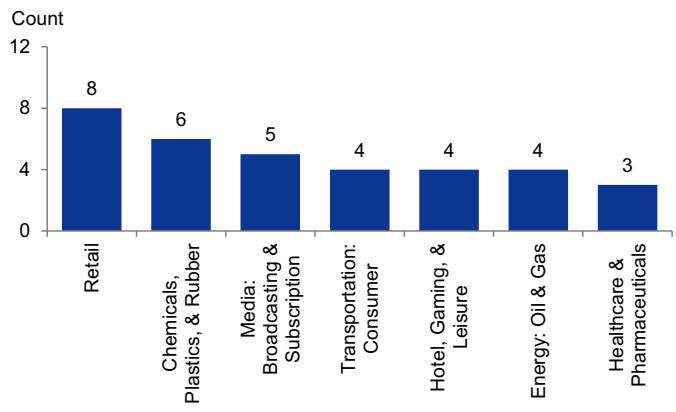

bar

| Category | Count |
| :--- | :--- |
| Retail | 8 |
| Chemicals, Plastics, & Rubber | 6 |
| Media: Broadcasting & Subscription | 5 |
| Transportation: Consumer | 4 |
| Hotel, Gaming, & Leisure | 4 |
| Energy: Oil & Gas | 4 |
| Healthcare & Pharmaceuticals | 3 |

Source: Moody's, GS Global Investment Research

Exhibit 144: Industry default count in Europe   

bar

| Category | Count |
| :--- | :--- |
| Capital Industries | 11 |
| Consumer Industries | 4 |
| Technology | 3 |
| Nonbank Finance | 3 |
| Retail & Distribution | 2 |

Source: Moody's, GS Global Investment Research

Exhibit 145: Composition of defaults in the USD HY bond market by type   

bar_stacked

| YTD | Missed payment | Bankruptcy | Prepackaged Chapter 11 | Distressed exchange | Other |
| --- | --- | --- | --- | --- | --- |
| 10 | 12 | 10 | 8 | 25 | 0 |
| 11 | 6 | 14 | 7 | 15 | 0 |
| 12 | 7 | 9 | 4 | 18 | 0 |
| 13 | 6 | 8 | 3 | 4 | 0 |
| 14 | 4 | 10 | 3 | 12 | 0 |
| 15 | 8 | 15 | 9 | 30 | 0 |
| 16 | 20 | 18 | 15 | 45 | 0 |
| 17 | 8 | 16 | 6 | 25 | 0 |
| 18 | 7 | 14 | 7 | 20 | 0 |
| 19 | 15 | 16 | 6 | 22 | 0 |
| 20 | 13 | 25 | 12 | 35 | 0 |
| 21 | 4 | 3 | 2 | 5 | 0 |
| 22 | 3 | 6 | 3 | 10 | 0 |
| 23 | 5 | 9 | 5 | 30 | 2 |
| 24 | 5 | 4 | 3 | 35 | 0 |
| 25 | 6 | 4 | 4 | 30 | 0 |
| 26 | 3 | 6 | 3 | 5 | 0 |

Source: Moody's, GS Global Investment Research

Exhibit 146: Composition of defaults in the EUR HY bond market by type   

bar_stacked

| Year | Missed payment | Bankruptcy | Prepackaged Chapter 11 | Distressed exchange | Other |
|---|---|---|---|---|---|
| 10 | 3 | 1 | 0 | 3 | 1 |
| 11 | 4 | 0 | 0 | 9 | 0 |
| 12 | 2 | 3 | 2 | 10 | 1 |
| 13 | 7 | 3 | 0 | 18 | 1 |
| 14 | 2 | 3 | 0 | 4 | 0 |
| 15 | 2 | 2 | 0 | 10 | 4 |
| 16 | 6 | 2 | 0 | 9 | 1 |
| 17 | 5 | 8 | 0 | 10 | 0 |
| 18 | 7 | 3 | 0 | 6 | 0 |
| 19 | 12 | 4 | 1 | 5 | 0 |
| 20 | 17 | 6 | 1 | 20 | 1 |
| 21 | 3 | 0 | 0 | 8 | 0 |
| 22 | 23 | 3 | 1 | 18 | 0 |
| 23 | 8 | 3 | 1 | 9 | 2 |
| 24 | 6 | 3 | 1 | 13 | 0 |
| 25 | 3 | 1 | 1 | 23 | 0 |
| 26 | 3 | 0 | 0 | 7 | 0 |

Source: Moody's, GS Global Investment Research

Exhibit 147: Annual average recovery rates by seniority for US issuers   

bar

| YTD | Senior secured (%) | Senior unsecured (%) | Subordinated (%) |
|---|---|---|---|
| 10 | 75 | 52 | 30 |
| 11 | 86 | 60 | 54 |
| 12 | 80 | 51 | 35 |
| 13 | - | 29 | 19 |
| 14 | - | 40 | - |
| 15 | 30 | 23 | 20 |
| 16 | 40 | 30 | 56 |
| 17 | - | 65 | 50 |
| 18 | 44 | 52 | - |
| 19 | - | 54 | - |
| 20 | 76 | 26 | 22 |
| 21 | - | 45 | - |
| 22 | 74 | 51 | - |
| 23 | 62 | 41 | 2 |
| 24 | 72 | 48 | - |
| 25 | 48 | 45 | - |
| 26 | 17 | 16 | - |

Source: Moody's, GS Global Investment Research

Exhibit 148: Annual average recovery rates by seniority for European issuers   

bar

| YTD | Senior secured (%) | Senior unsecured (%) | Subordinated (%) |
|---|---|---|---|
| 10 | 30 | 0 | 51 |
| 11 | 26 | 0 | 32 |
| 12 | 0 | 0 | 51 |
| 13 | 0 | 26 | 23 |
| 14 | 0 | 24 | 0 |
| 15 | 0 | 43 | 51 |
| 16 | 0 | 24 | 0 |
| 17 | 0 | 34 | 50 |
| 18 | 0 | 32 | 0 |
| 19 | 0 | 22 | 0 |
| 20 | 0 | 18 | 0 |
| 21 | 0 | 76 | 0 |
| 22 | 72 | 12 | 0 |
| 23 | 45 | 15 | 0 |
| 24 | 56 | 55 | 0 |
| 25 | 83 | 36 | 0 |
YTD

Source: Moody's, GS Global Investment Research

# Default and ratings migration dashboard: Upgrades and downgrades

Exhibit 149: Fallen angels vs. rising stars in the USD market   
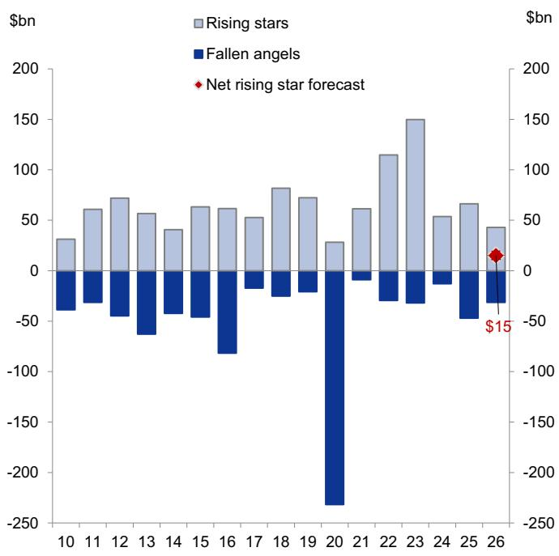

bar

| Year | Rising stars ($bn) | Fallen angels ($bn) | Net rising star forecast ($bn) |
|------|---------------------|----------------------|---------------------------------|
| 10   | ~30                 | ~-40                 | -                               |
| 11   | ~60                 | ~-30                 | -                               |
| 12   | ~70                 | ~-40                 | -                               |
| 13   | ~55                 | ~-60                 | -                               |
| 14   | ~40                 | ~-40                 | -                               |
| 15   | ~65                 | ~-40                 | -                               |
| 16   | ~60                 | ~-80                 | -                               |
| 17   | ~50                 | ~-20                 | -                               |
| 18   | ~80                 | ~-20                 | -                               |
| 19   | ~75                 | ~-20                 | -                               |
| 20   | ~30                 | ~-230                | -                               |
| 21   | ~60                 | ~-10                 | -                               |
| 22   | ~115                | ~-30                 | -                               |
| 23   | ~150                | ~-30                 | -                               |
| 24   | ~55                 | ~-10                 | -                               |
| 25   | ~65                 | ~-40                 | -                               |
| 26   | ~45                 | ~-30                 | $15                             |

Source: Bloomberg, GS Global Investment Research

Exhibit 150: Fallen angels vs. rising stars in the EUR market   
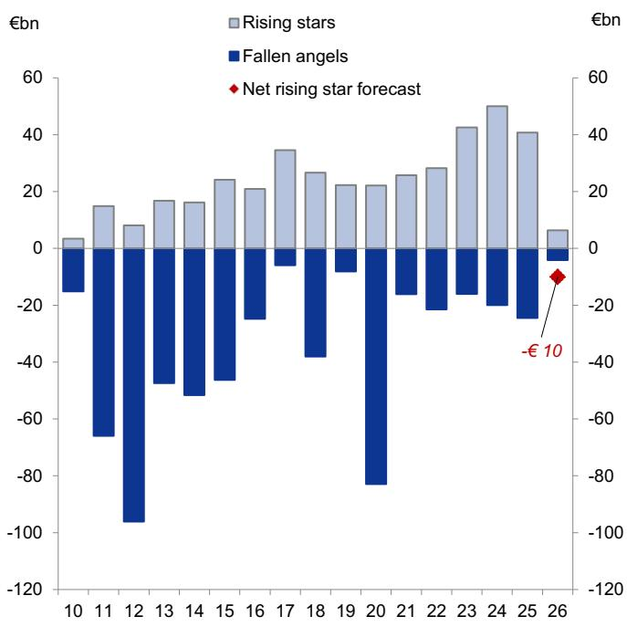

bar

| Year | Rising stars (€bn) | Fallen angels (€bn) | Net rising star forecast (€bn) |
|------|---------------------|----------------------|---------------------------------|
| 10   | 3                   | -15                  | -                               |
| 11   | 15                  | -70                  | -                               |
| 12   | 8                   | -95                  | -                               |
| 13   | 17                  | -45                  | -                               |
| 14   | 16                  | -50                  | -                               |
| 15   | 24                  | -45                  | -                               |
| 16   | 20                  | -25                  | -                               |
| 17   | 35                  | -5                   | -                               |
| 18   | 27                  | -40                  | -                               |
| 19   | 22                  | -10                  | -                               |
| 20   | 22                  | -85                  | -                               |
| 21   | 25                  | -15                  | -                               |
| 22   | 28                  | -20                  | -                               |
| 23   | 42                  | -15                  | -                               |
| 24   | 50                  | -20                  | -                               |
| 25   | 40                  | -25                  | -                               |
| 26   | 6                   | -5                   | -10                             |

Source: Bloomberg, GS Global Investment Research

Exhibit 151: BB-rated bonds on upgrade watch (upgrade candidates) vs. BBB-rated bonds on downgrade watch (downgrade candidates) in the USD market   
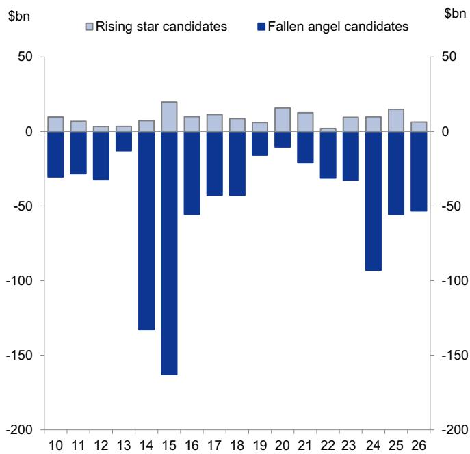

bar

| Year | Rising star candidates ($bn) | Fallen angel candidates ($bn) |
|------|-------------------------------|--------------------------------|
| 10   | 10                            | -30                            |
| 11   | 5                             | -35                            |
| 12   | 0                             | -40                            |
| 13   | 5                             | -20                            |
| 14   | 5                             | -130                           |
| 15   | 20                            | -170                           |
| 16   | 10                            | -55                            |
| 17   | 10                            | -45                            |
| 18   | 5                             | -40                            |
| 19   | 5                             | -20                            |
| 20   | 15                            | -10                            |
| 21   | 10                            | -30                            |
| 22   | 0                             | -40                            |
| 23   | 5                             | -35                            |
| 24   | 5                             | -90                            |
| 25   | 15                            | -55                            |
| 26   | 5                             | -50                            |

Source: Bloomberg, GS Global Investment Research

Exhibit 152: BB-rated bonds on upgrade watch (upgrade candidates) vs. BBB-rated bonds on downgrade watch (downgrade candidates) in the EUR market   

bar

| Year | Rising star candidates (€bn) | Fallen angel candidates (€bn) |
|------|-------------------------------|--------------------------------|
| 10   | 2                             | -18                            |
| 11   | 2                             | -25                            |
| 12   | 0                             | -55                            |
| 13   | 4                             | -10                            |
| 14   | 8                             | -45                            |
| 15   | 1                             | -22                            |
| 16   | 5                             | -20                            |
| 17   | 7                             | -28                            |
| 18   | 0                             | -20                            |
| 19   | 24                            | -20                            |
| 20   | 9                             | -8                             |
| 21   | 10                            | -5                             |
| 22   | 1                             | -7                             |
| 23   | 2                             | -15                            |
| 24   | 5                             | -8                             |
| 25   | 5                             | -9                             |
| 26   | 3                             | -6                             |

Source: Bloomberg, GS Global Investment Research

Exhibit 153: BB-rated bonds on outlook positive vs. BBB-rated bonds on outlook negative in the USD market   
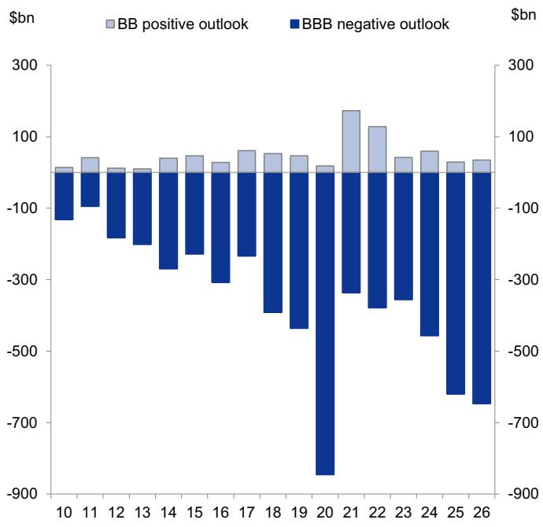

bar

| Week | BB positive outlook ($bn) | BBB negative outlook ($bn) |
|------|-----------------------------|-----------------------------|
| 10   | ~-50                        | ~-100                       |
| 11   | ~-50                        | ~-100                       |
| 12   | ~-50                        | ~-150                       |
| 13   | ~-50                        | ~-150                       |
| 14   | ~-50                        | ~-250                       |
| 15   | ~-50                        | ~-250                       |
| 16   | ~-50                        | ~-300                       |
| 17   | ~-50                        | ~-250                       |
| 18   | ~-50                        | ~-350                       |
| 19   | ~-50                        | ~-450                       |
| 20   | ~-50                        | ~-850                       |
| 21   | ~150                        | ~-300                       |
| 22   | ~100                        | ~-350                       |
| 23   | ~50                         | ~-350                       |
| 24   | ~50                         | ~-450                       |
| 25   | ~50                         | ~-650                       |
| 26   | ~50                         | ~-700                       |

Source: Moody's, GS Global Investment Research

Exhibit 155: Top 10 USD fallen angel issuers in the last 12 months 

<table><tr><td>Company</td><td>Notional downgraded ($bn)</td></tr><tr><td>Centene Corp</td><td>14.7</td></tr><tr><td>Paramount Global</td><td>13.0</td></tr><tr><td>Fs Kkr Capital Corp</td><td>3.8</td></tr><tr><td>Fmc Corp</td><td>2.5</td></tr><tr><td>Huntsman International L</td><td>1.5</td></tr><tr><td>Banco Santander Mexico</td><td>1.3</td></tr><tr><td>Pacificorp</td><td>0.9</td></tr><tr><td>Blackrock Tcp Cap Corp</td><td>0.7</td></tr><tr><td>Horizon Mutual Holdings</td><td>0.6</td></tr><tr><td>Ses Americom Inc</td><td>0.5</td></tr></table>

Source: Bloomberg, data compiled by GS Global Investment Research

Exhibit 157: Top 10 EUR Fallen angel issues 

<table><tr><td>Company</td><td>Notional downgraded (€bn)</td></tr><tr><td>Ses Sa</td><td>3.4</td></tr><tr><td>Lanxess Ag</td><td>2.2</td></tr><tr><td>Worldline Sa/France</td><td>2.2</td></tr><tr><td>Citycon Treasury Bv</td><td>1.7</td></tr><tr><td>Verallia Sa</td><td>1.6</td></tr><tr><td>Mediobanca Di Cred Fin</td><td>1.5</td></tr><tr><td>Unibail-Rodamco-Westfld</td><td>1.1</td></tr><tr><td>Adecco Int Financial Svs</td><td>0.5</td></tr><tr><td>Illimity Bank Spa</td><td>0.3</td></tr><tr><td>Solaben Luxembourg</td><td>0.1</td></tr></table>

Source: Bloomberg, data compiled by GS Global Investment Research

Exhibit 154: BB-rated bonds on outlook positive vs. BBB-rated bonds on outlook negative in the EUR market   
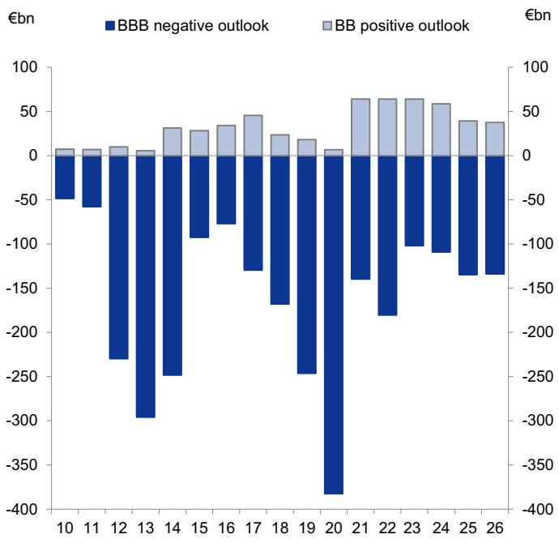

bar

| Year | BBB negative outlook (€bn) | BB positive outlook (€bn) |
|------|-----------------------------|----------------------------|
| 10   | -50                         | 5                          |
| 11   | -75                         | 5                          |
| 12   | -225                        | 10                         |
| 13   | -300                        | 5                          |
| 14   | -250                        | 25                         |
| 15   | -100                        | 25                         |
| 16   | -80                         | 30                         |
| 17   | -125                        | 40                         |
| 18   | -175                        | 20                         |
| 19   | -250                        | 15                         |
| 20   | -380                        | 5                          |
| 21   | -150                        | 60                         |
| 22   | -180                        | 60                         |
| 23   | -100                        | 60                         |
| 24   | -125                        | 50                         |
| 25   | -150                        | 35                         |
| 26   | -175                        | 30                         |

Source: Moody's, GS Global Investment Research

Exhibit 156: Top 10 USD rising star issuers in the last 12 months 

<table><tr><td>Company</td><td>Notional upgraded ($bn)</td></tr><tr><td>Vistra Operations Co Llc</td><td>6.3</td></tr><tr><td>Medline Borrower Lp</td><td>4.5</td></tr><tr><td>Office Cherifien Des Pho</td><td>4.1</td></tr><tr><td>1011778 Bc / New Red Fin</td><td>4.0</td></tr><tr><td>Permian Resourc Optg Llc</td><td>3.6</td></tr><tr><td>Unicredit Spa</td><td>3.5</td></tr><tr><td>Frontier Communications</td><td>2.8</td></tr><tr><td>Frontier Communications</td><td>2.8</td></tr><tr><td>Constellation En Gen Llc</td><td>2.3</td></tr><tr><td>Kioxia Holdings Corp</td><td>2.2</td></tr></table>

Source: Bloomberg, data compiled by GS Global Investment Research

Exhibit 158: Top 10 EUR rising star issuers in the last 12 months 

<table><tr><td>Company</td><td>Notional upgraded (€bn)</td></tr><tr><td>Banca Monte Dei Paschi S</td><td>3.0</td></tr><tr><td>Terna Rete Elettrica</td><td>1.9</td></tr><tr><td>Aib Group Plc</td><td>1.7</td></tr><tr><td>Asr Nederland Nv</td><td>1.5</td></tr><tr><td>Unipol Assicurazioni Spa</td><td>1.3</td></tr><tr><td>Intesa Sanpaolo Assicura</td><td>1.1</td></tr><tr><td>Bper Banca</td><td>1.0</td></tr><tr><td>Piraeus Bank Sa</td><td>1.0</td></tr><tr><td>Czechoslovak Group</td><td>1.0</td></tr><tr><td>Abanca Corp Bancaria Sa</td><td>1.0</td></tr></table>

Source: Bloomberg, data compiled by GS Global Investment Research

# Disclosure Appendix

# Reg AC

We, Amanda Lynam, CPA, Spencer Rogers, CFA, Sara Grut and Shamshad Ali, hereby certify that all of the views expressed in this report accurately reflect our personal views, which have not been influenced by considerations of the firm's business or client relationships.

Unless otherwise stated, the individuals listed on the cover page of this report are analysts in GS' Global Investment Research division.

Contributing Authors: Amanda Lynam, CPA GS & Co. LLC, Spencer Rogers, CFA GS & Co. LLC, Sara Grut GS International, Shamshad Ali GS & Co. LLC.

Unless otherwise stated, the individuals listed in the Contributing Authors disclosure of this report are analysts in GS' Global Investment Research division.

# Disclosures

# Regulatory disclosures

# Disclosures required by United States laws and regulations

See company-specific regulatory disclosures above for any of the following disclosures required as to companies referred to in this report: manager or co-manager in a pending transaction; 1% or other ownership; compensation for certain services; types of client relationships; managed/co-managed public offerings in prior periods; directorships; for equity securities, market making and/or specialist role. GS trades or may trade as a principal in debt securities (or in related derivatives) of issuers discussed in this report.

The following are additional required disclosures: Ownership and material conflicts of interest: GS policy prohibits its analysts, professionals reporting to analysts and members of their households from owning securities of any company in the analyst's area of coverage. Analyst compensation: Analysts are paid in part based on the profitability of GS, which includes investment banking revenues. Analyst as officer or director: GS policy generally prohibits its analysts, persons reporting to analysts or members of their households from serving as an officer, director or advisor of any company in the analyst's area of coverage. Non-U.S. Analysts: Non-U.S. analysts may not be associated persons of GS & Co. LLC and therefore may not be subject to FINRA Rule 2241 or FINRA Rule 2242 restrictions on communications with a subject company, public appearances and trading in securities covered by the analysts.

# Additional disclosures required under the laws and regulations of jurisdictions other than the United States

The following disclosures are those required by the jurisdiction indicated, except to the extent already made above pursuant to United States laws and regulations. Australia: GS Australia Pty Ltd and its affiliates are not authorised deposit-taking institutions (as that term is defined in the Banking Act 1959 (Cth)) in Australia and do not provide banking services, nor carry on a banking business, in Australia. This research, and any access to it, is intended only for “wholesale clients” within the meaning of the Australian Corporations Act, unless otherwise agreed by GS. In producing research reports, members of Global Investment Research of GS Australia may attend site visits and other meetings hosted by the companies and other entities which are the subject of its research reports. In some instances the costs of such site visits or meetings may be met in part or in whole by the issuers concerned if GS Australia considers it is appropriate and reasonable in the specific circumstances relating to the site visit or meeting. To the extent that the contents of this document contains any financial product advice, it is general advice only and has been prepared by GS without taking into account a client’s objectives, financial situation or needs. A client should, before acting on any such advice, consider the appropriateness of the advice having regard to the client’s own objectives, financial situation and needs. A copy of certain GS Australia and New Zealand disclosure of interests and a copy of GS’ Australian Sell-Side Research Independence Policy Statement are available at: https://www.goldmansachs.com/disclosures/australia-new-zealand/index.html. Brazil: Disclosure information in relation to CVM Resolution n. 20 is available at https://www.gs.com/worldwide/brazil/area/gir/index.html. Where applicable, the Brazil-registered analyst primarily responsible for the content of this research report, as defined in Article 20 of CVM Resolution n. 20, is the first author named at the beginning of this report, unless indicated otherwise at the end of the text. Canada: This information is being provided to you for information purposes only and is not, and under no circumstances should be construed as, an advertisement, offering or solicitation by GS & Co. LLC for purchasers of securities in Canada to trade in any Canadian security. GS & Co. LLC is not registered as a dealer in any jurisdiction in Canada under applicable Canadian securities laws and generally is not permitted to trade in Canadian securities and may be prohibited from selling certain securities and products in certain jurisdictions in Canada. If you wish to trade in any Canadian securities or other products in Canada please contact GS Canada Inc., an affiliate of The GS Group Inc., or another registered Canadian dealer. Hong Kong: Further information on the securities of covered companies referred to in this research may be obtained on request from GS (Asia) L.L.C. India: Further information on the subject company or companies referred to in this research may be obtained from GS (India) Securities Private Limited, Research Analyst - SEBI Registration Number INH000001493, 10th Floor, Ascent-Worli, Sudam Kalu Ahire Marg, Worli, Mumbai-400 025, India, Corporate Identity Number U74140MH2006FTC160634, Phone +91 22 6616 9000, Fax +91 22 6616 9001. GS may beneficially own 1% or more of the securities (as such term is defined in clause 2 (h) the Indian Securities Contracts (Regulation) Act, 1956) of the subject company or companies referred to in this research report. Investment in securities market are subject to market risks. Read all the related documents carefully before investing. Registration granted by SEBI and certification from NISM in no way guarantee performance of the intermediary or provide any assurance of returns to investors. GS (India) Securities Private Limited compliance officer and investor grievance contact details can be found at: https://www.goldmansachs.com/worldwide/india/documents/Grievance-Redressal-and-Escalation-Matrix.pdf, and a copy of the annual audit compliance report can be found at this link: https://publishing.gs.com/content/site/india-annual-compliance-report.html. Japan: See below. Korea: This research, and any access to it, is intended only for “professional investors” within the meaning of the Financial Services and Capital Markets Act, unless otherwise agreed by GS. Further information on the subject company or companies referred to in this research may be obtained from GS (Asia) L.L.C., Seoul Branch. New Zealand: GS New Zealand Limited and its affiliates are neither “registered banks” nor “deposit takers” (as defined in the Reserve Bank of New Zealand Act 1989) in New Zealand. This research, and any access to it, is intended for “wholesale clients” (as defined in the Financial Advisers Act 2008) unless otherwise agreed by GS. A copy of certain GS Australia and New Zealand disclosure of interests is available at: https://www.goldmansachs.com/disclosures/australia-new-zealand/index.html. Russia: Research reports distributed in the Russian Federation are not advertising as defined in the Russian legislation, but are information and analysis not having product promotion as their main purpose and do not provide appraisal within the meaning of the Russian legislation on appraisal activity. Research reports do not constitute a personalized investment recommendation as defined in Russian laws and regulations, are not addressed to a specific client, and are prepared without analyzing the financial circumstances, investment profiles or risk profiles of clients. GS assumes no responsibility for any investment decisions that may be taken by a client or any other person based on this research report. Singapore: GS (Singapore) Pte. (Company Number: 198602165W), which is regulated by the Monetary Authority of Singapore, accepts legal responsibility for this research, and should be contacted with respect to any matters arising from, or in connection with, this research. Taiwan: This material is for reference only and must not be reprinted without permission. Investors should carefully consider their own investment risk. Investment results are the responsibility of the individual investor. United Kingdom: Persons who would be categorized as retail clients in the United Kingdom, as such term is

defined in the rules of the Financial Conduct Authority, should read this research in conjunction with prior GS on the covered companies referred to herein and should refer to the risk warnings that have been sent to them by GS International. A copy of these risks warnings, and a glossary of certain financial terms used in this report, are available from GS International on request.

European Union and United Kingdom: Disclosure information in relation to Article 6 (2) of the European Commission Delegated Regulation (EU) (2016/958) supplementing Regulation (EU) No 596/2014 of the European Parliament and of the Council (including as that Delegated Regulation is implemented into United Kingdom domestic law and regulation following the United Kingdom's departure from the European Union and the European Economic Area) with regard to regulatory technical standards for the technical arrangements for objective presentation of investment recommendations or other information recommending or suggesting an investment strategy and for disclosure of particular interests or indications of conflicts of interest is available at https://www.gs.com/disclosures/europeanpolicy.html which states the European Policy for Managing Conflicts of Interest in Connection with Investment Research.

Japan: GS Japan Co., Ltd. is a Financial Instrument Dealer registered with the Kanto Financial Bureau under registration number Kinsho 69, and a member of Japan Securities Dealers Association, Financial Futures Association of Japan Type II Financial Instruments Firms Association, and Investment Management Association of Japan. Sales and purchase of equities are subject to commission pre-determined with clients plus consumption tax. See company-specific disclosures as to any applicable disclosures required by Japanese stock exchanges, the Japanese Securities Dealers Association or the Japanese Securities Finance Company.

# Global product; distributing entities

GS Global Investment Research produces and distributes research products for clients of GS on a global basis. Analysts based in GS offices around the world produce research on industries and companies, and research on macroeconomics, currencies, commodities and portfolio strategy. This research is disseminated in Australia by GS Australia Pty Ltd (ABN 21 006 797 897); in Brazil by GS do Brasil Corretora de Títulos e Valores Mobiliários S.A.; Public Communication Channel GS Brazil: 0800 727 5764 and / or contatogoldmanbrasil@gs.com. Available Weekdays (except holidays), from 9am to 6pm. Canal de Comunicação com o Público GS Brasil: 0800 727 5764 e/ou contatogoldmanbrasil@gs.com. Horário de funcionamento: segunda-feira à sexta-feira (exceto feriados), das 9h às 18h; in Canada by GS & Co. LLC; in Hong Kong by GS (Asia) L.L.C.; in India by GS (India) Securities Private Ltd.; in Japan by GS Japan Co., Ltd.; in the Republic of Korea by GS (Asia) L.L.C., Seoul Branch; in New Zealand by GS New Zealand Limited; in Russia by OOO GS; in Singapore by GS (Singapore) Pte. (Company Number: 198602165W); and in the United States of America by GS & Co. LLC. GS International has approved this research in connection with its distribution in the United Kingdom.

GS International (“GSI”), authorised by the Prudential Regulation Authority (“PRA”) and regulated by the Financial Conduct Authority (“FCA”) and the PRA, has approved this research in connection with its distribution in the United Kingdom.

European Economic Area: GS Bank Europe SE (“GSBE”) is a credit institution incorporated in Germany and, within the Single Supervisory Mechanism, subject to direct prudential supervision by the European Central Bank and in other respects supervised by German Federal Financial Supervisory Authority (Bundesanstalt für Finanzdienstleistungsaufsicht, BaFin) and Deutsche Bundesbank and disseminates research within the European Economic Area.

# General disclosures

This research is for our clients only. Other than disclosures relating to GS, this research is based on current public information that we consider reliable, but we do not represent it is accurate or complete, and it should not be relied on as such. The information, opinions, estimates and forecasts contained herein are as of the date hereof and are subject to change without prior notification. We seek to update our research as appropriate, but various regulations may prevent us from doing so. Other than certain industry reports published on a periodic basis, the large majority of reports are published at irregular intervals as appropriate in the analyst's judgment.

GS conducts a global full-service, integrated investment banking, investment management, and brokerage business. We have investment banking and other business relationships with a substantial percentage of the companies covered by Global Investment Research. GS & Co. LLC, the United States broker dealer, is a member of SIPC (https://www.sipc.org).

Our salespeople, traders, and other professionals may provide oral or written market commentary or trading strategies to our clients and principal trading desks that reflect opinions that are contrary to the opinions expressed in this research. Our asset management area, principal trading desks and investing businesses may make investment decisions that are inconsistent with the recommendations or views expressed in this research.

We and our affiliates, officers, directors, and employees will from time to time have long or short positions in, act as principal in, and buy or sell, the securities or derivatives, if any, referred to in this research, unless otherwise prohibited by regulation or GS policy.

The views attributed to third party presenters at GS arranged conferences, including individuals from other parts of GS, do not necessarily reflect those of Global Investment Research and are not an official view of GS.

Any third party referenced herein, including any salespeople, traders and other professionals or members of their household, may have positions in the products mentioned that are inconsistent with the views expressed by analysts named in this report.

This research is focused on investment themes across markets, industries and sectors. It does not attempt to distinguish between the prospects or performance of, or provide analysis of, individual companies within any industry or sector we describe.

Any trading recommendation in this research relating to an equity or credit security or securities within an industry or sector is reflective of the investment theme being discussed and is not a recommendation of any such security in isolation.

This research is not an offer to sell or the solicitation of an offer to buy any security in any jurisdiction where such an offer or solicitation would be illegal. It does not constitute a personal recommendation or take into account the particular investment objectives, financial situations, or needs of individual clients. Clients should consider whether any advice or recommendation in this research is suitable for their particular circumstances and, if appropriate, seek professional advice, including tax advice. The price and value of investments referred to in this research and the income from them may fluctuate. Past performance is not a guide to future performance, future returns are not guaranteed, and a loss of original capital may occur. Fluctuations in exchange rates could have adverse effects on the value or price of, or income derived from, certain investments.

Certain transactions, including those involving futures, options, and other derivatives, give rise to substantial risk and are not suitable for all investors. Investors should review current options and futures disclosure documents which are available from GS sales representatives or at https://www.theocc.com/about/publications/character-risks.jsp and https://www.goldmansachs.com/disclosures/cftc\_fcm\_disclosures. Transaction costs may be significant in option strategies calling for multiple purchase and sales of options such as spreads. Supporting documentation will be supplied upon request.

Differing Levels of Service provided by Global Investment Research: The level and types of services provided to you by GS Global Investment Research may vary as compared to that provided to internal and other external clients of GS, depending on various factors including your individual preferences as to the frequency and manner of receiving communication, your risk profile and investment focus and perspective (e.g., marketwide, sector specific, long term, short term), the size and scope of your overall client relationship with GS, and legal and regulatory constraints. As an example, certain clients may request to receive notifications when research on specific securities is published, and certain clients may request that specific data underlying analysts' fundamental analysis available on our internal client websites be delivered to them electronically through data feeds or otherwise. No change to an analyst's fundamental research views (e.g., ratings, price targets, or material changes to earnings estimates for equity securities), will be communicated to any client prior to inclusion of such information in a research report broadly disseminated through electronic publication to our internal client websites or through other means, as necessary, to all clients who are entitled to receive such reports.

All research reports are disseminated and available to all clients simultaneously through electronic publication to our internal client websites. Not all research content is redistributed to our clients or available to third-party aggregators, nor is GS responsible for the redistribution of our research by third party aggregators. For research, models or other data related to one or more securities, markets or asset classes (including related services) that may be available to you, please contact your GS representative or go to https://research.gs.com.

Disclosure information is also available at https://www.gs.com/research/hedge.html or from Research Compliance, 200 West Street, New York, NY 10282.

# © 2026 GS.

You are permitted to store, display, analyze, modify, reformat, and print the information made available to you via this service only for your own use. You may not resell or reverse engineer this information to calculate or develop any index for disclosure and/or marketing or create any other derivative works or commercial product(s), data or offering(s) without the express written consent of GS. You are not permitted to publish, transmit, or otherwise reproduce this information, in whole or in part, in any format to any third party without the express written consent of GS. This foregoing restriction includes, without limitation, using, extracting, downloading or retrieving this information, in whole or in part, to train or finetune a machine learning or artificial intelligence system, or to provide or reproduce this information, in whole or in part, as a prompt or input to any such system.