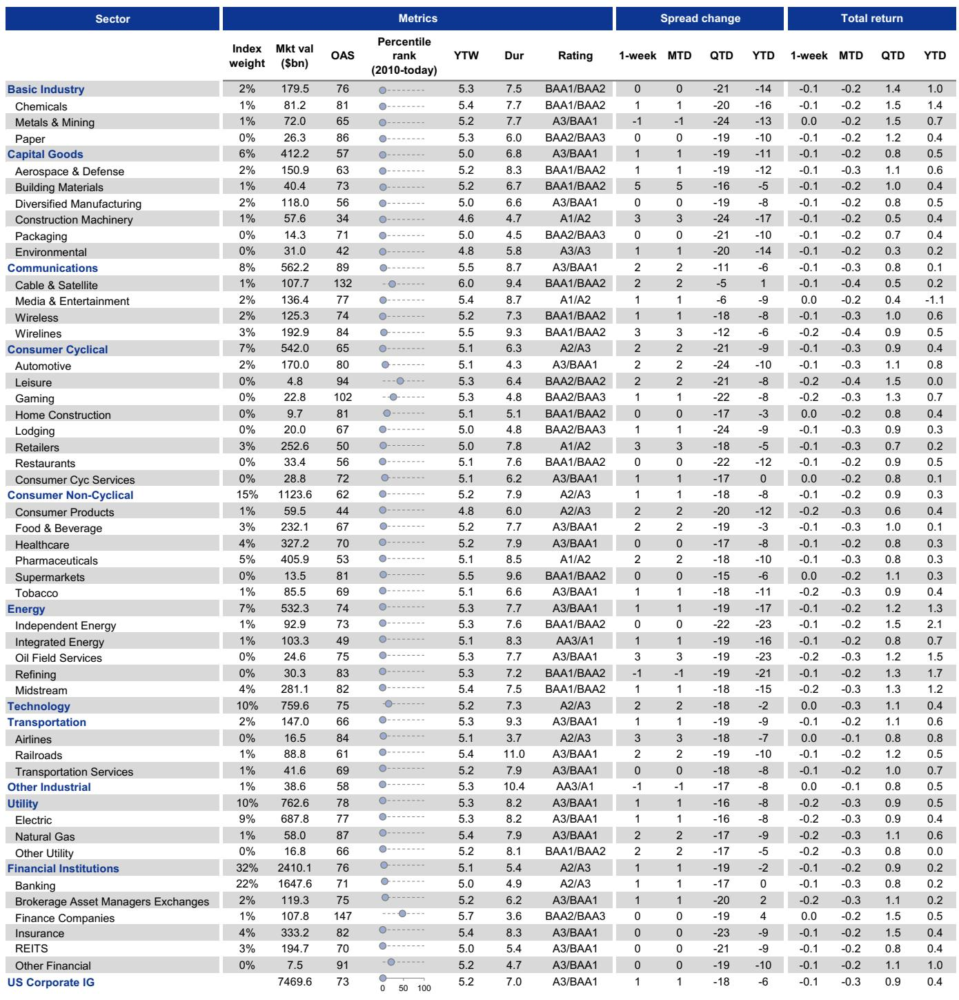
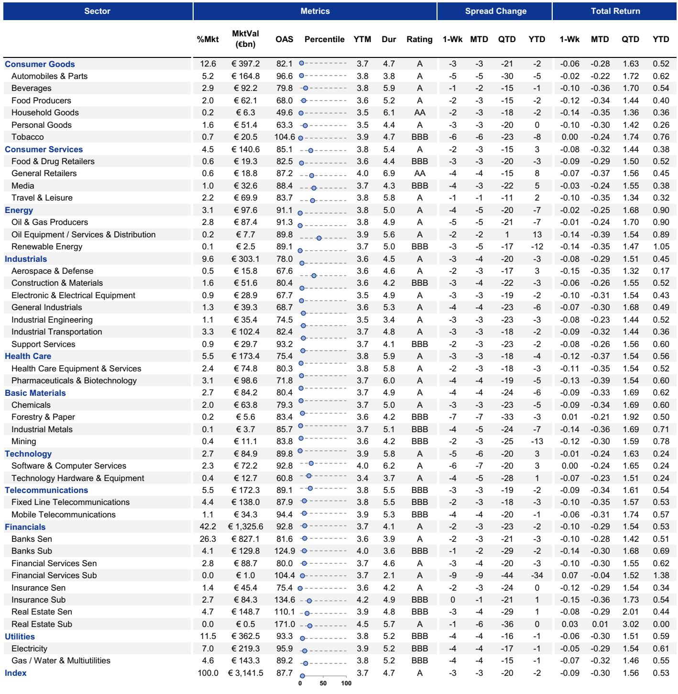
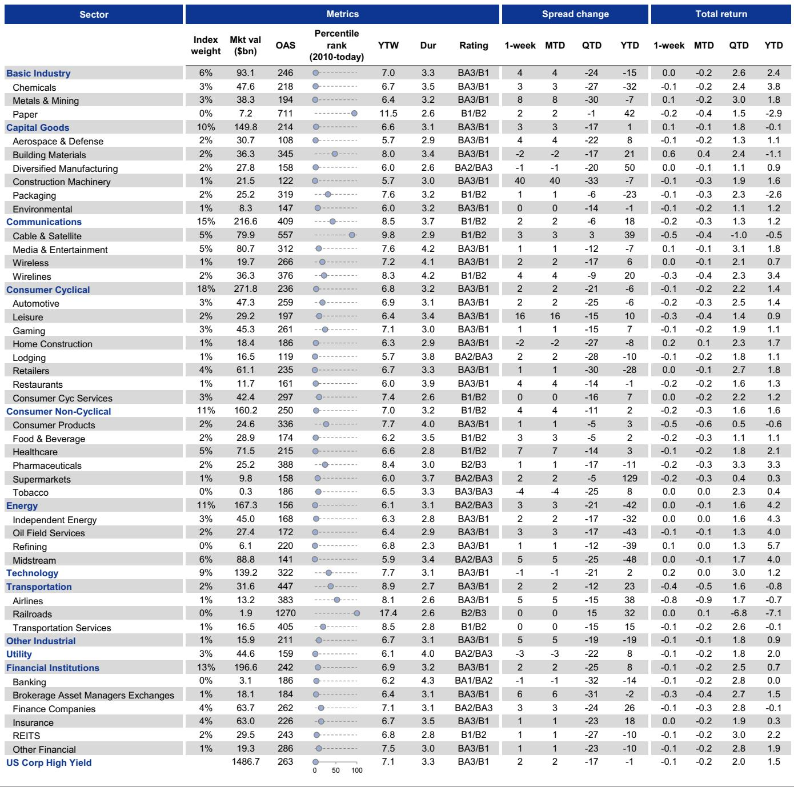

# Hybrid Debt Is No Longer a Niche Instrument: It Is a Structural Solution for Yield-Starved Investors

The hybrid debt market has crossed a critical threshold. What began as a tactical response to a Moody's methodology change in early 2024 has evolved into a structural shift in how investment-grade corporations finance themselves and how yield-seeking investors access spread. The numbers are unambiguous: the outstanding notional of USD hybrid debt has doubled since early 2024, while the EUR market is on pace to set an annual record for gross supply. Yet despite this avalanche of new issuance, hybrid spreads have compressed against both BBBs and BBs in the USD market, and held range-bound in the EUR market. This is not a story of supply overwhelming demand. It is a story of a market finding its equilibrium.

For the institutional investor managing a core IG portfolio, the question is no longer whether to consider hybrids. It is how to evaluate them systematically. The 61 basis points of additional spread that USD hybrids offer over BBBs, and the 53 basis points in the EUR market, are not arbitrary premiums. They compensate for structural subordination, issuer-friendly call features, and the deferred coupon mechanism. But whether that compensation is adequate depends entirely on the issuer's capital management strategy and the sector's resilience to macro headwinds. This report provides the analytical framework to make that determination.

The timing matters. With IG spreads at historically tight levels, the incremental carry from hybrids is becoming one of the few remaining sources of relative value for bond investors who cannot migrate down the rating spectrum. But the window for indiscriminate allocation is closing. As the market matures and sector concentrations become more pronounced, the distinction between a well-structured hybrid from a high-quality utility and a poorly positioned one from a cyclical issuer will widen. The next twelve months will separate the investors who treat hybrids as a tactical pickup from those who build them into a strategic allocation.

## The Supply Surge Reflects a Rational Issuer Calculus, Not a Desperate Search for Financing

The acceleration in hybrid issuance is not a sign of market distress or a last-resort funding channel. It is a deliberate capital structure optimization by issuers who understand that hybrid debt offers a unique combination of benefits unavailable from either senior debt or equity. Two drivers explain why capital-intensive industries--particularly utilities, which have accounted for 50% of USD hybrid supply and 40% of EUR hybrid supply since 2024--have been the most active.

First, the partial equity credit from rating agencies is a powerful incentive. For a utility with a large debt capital structure and limited headroom within its target rating band, issuing hybrid debt allows the company to maintain or improve its credit profile without diluting shareholders. This is not a theoretical benefit. The Moody's methodology change in early 2024 effectively increased the equity credit assigned to certain hybrid structures, making them more attractive relative to both senior debt and preferred stock. The market response has been immediate and sustained.

Second, the tax deductibility of hybrid interest payments creates a genuine cost-of-capital advantage over preferred equity. For a profitable corporate taxpayer, the after-tax cost of hybrid debt can be lower than the after-tax cost of common or preferred equity, even when the hybrid coupon is higher than a senior unsecured bond. This tax shield is not a minor consideration. In a rising-rate environment where every basis point of financing cost matters, the ability to achieve partial equity treatment with tax-deductible interest is a structural advantage that senior debt cannot replicate.

The implication for investors is clear: the supply pipeline is not going to dry up. As long as rating agencies continue to recognize the equity-like characteristics of hybrid debt, and as long as tax regimes remain favorable, issuers will have a rational incentive to use hybrids. This means the market will continue to grow, and the composition of that growth will be driven by sector-specific capital needs rather than by opportunistic timing.

## The USD and EUR Hybrid Markets Are at Different Stages of Maturity, Requiring Different Investment Approaches

The temptation to treat USD and EUR hybrids as interchangeable is understandable but analytically lazy. The data reveals two markets that have diverged in structure, performance, and investor behavior. Understanding these differences is essential for constructing a portfolio that captures the premium without taking unintended risk.

The USD hybrid market is still in its growth phase. With $140 billion of notional outstanding as of mid-2026, it has nearly doubled since early 2024 and now contains 172 bonds. The spread ratio against BBBs has compressed from roughly 1.8x to 1.6x over that period, indicating that hybrids have outperformed as the market has scaled. This is the signature of a market that is absorbing supply efficiently, with demand from yield-oriented IG investors more than matching the flow of new issuance. The 61 basis point pickup over BBBs is moderately attractive in a tight spread environment, and there is reason to believe further compression is possible as the market deepens.

The EUR hybrid market tells a different story. It is more mature, having experienced its most significant growth phase prior to mid-2022. The current notional of 226 billion euros is only 2% above the June 2022 peak. The spread ratio against BBBs has been range-bound for several years, reflecting the fact that the market has already priced in the structural premium. The 53 basis point pickup over BBBs is less compelling on a relative basis, but the absolute carry can still be attractive for investors who are willing to be selective.

The key distinction is sector concentration. The USD hybrid market is heavily skewed toward utilities (35%) and insurance (32%), with energy and telecoms making up most of the remainder. This concentration means that the performance of the USD hybrid index is largely a story about the credit quality of regulated utilities and well-capitalized insurers. The EUR market has more diversification, with utilities at 28%, insurance at 26%, and meaningful weights in energy, telecoms, and automotive. This diversification reduces single-sector risk but also means that the EUR hybrid index is more exposed to cyclical industries.

For an investor, this implies that a one-size-fits-all approach to hybrid investing is suboptimal. In the USD market, the growth trajectory and sector composition argue for a more constructive stance, particularly for investors who are comfortable with utility and insurance sector risk. In the EUR market, the more mature stage and broader sector exposure require a more selective approach, with a focus on higher-quality issuers in economically resilient sectors.

## Relative Value Analysis Must Account for Index Composition and Sector Biases

Comparing hybrid spreads to BBB or BB indices is a useful starting point, but it is not a sufficient analysis. The hybrid indices are not directly comparable to broad corporate bond indices for three reasons that every investor should understand.

First, the hybrid indices blend investment-grade and high-yield ratings. In both the USD and EUR markets, hybrids span the rating spectrum from A to BB, with the largest concentrations in BBB- and BB. This means that a simple comparison of hybrid OAS to BBB OAS is not comparing like with like. The hybrid index includes bonds that would be classified as high-yield if they were senior unsecured, and the spread premium partially reflects this rating heterogeneity.

Second, the sector weights in hybrid indices are dramatically different from those in broad corporate indices. In the USD market, utilities account for 35% of the hybrid index but only 12% of the BBB index. Insurance accounts for 32% of the hybrid index but only 4% of the BBB index. This means that the relative value of hybrids is heavily influenced by the performance of two sectors. If utilities and insurance are performing well, hybrids will look attractive. If they face sector-specific headwinds, the relative value picture will deteriorate regardless of the aggregate spread.

Third, the number of bonds in the hybrid indices is small relative to the broader market. With 172 bonds in the USD hybrid index and roughly 300 in the EUR hybrid index, individual issuer events can have an outsized impact on index-level metrics. This is not a problem for investors who do their own credit work, but it is a risk for those who rely on index-level analysis as a shortcut.

The practical implication is that investors should not treat the 61bp or 53bp pickup as a guaranteed premium. They should decompose it into its components: the rating premium, the sector premium, and the structural subordination premium. Only then can they assess whether the compensation is adequate for the risks they are taking.

## The Report Leaves Unanswered Questions About the Next Phase of Market Evolution

No analysis is complete, and this report raises as many questions as it answers. Three areas deserve particular attention from investors who want to stay ahead of the curve.

First, what happens when the next credit cycle turns? Hybrid bonds have performed well in a benign macro environment where defaults have been low and spreads have been compressing. But hybrids are structurally subordinated and have deferred coupon features that can be triggered. In a downturn, the spread premium could widen significantly, and the liquidity of hybrid bonds could deteriorate faster than senior debt. The report does not model this scenario, and investors should stress-test their hybrid allocations against a recessionary outcome.

Second, how will the regulatory landscape evolve? The current issuance wave was triggered by a Moody's methodology change, but rating agencies are not static. Future changes to equity credit treatment, or changes to tax treatment of hybrid interest, could alter the issuer calculus and the investor value proposition. The report acknowledges the Moody's change as a catalyst but does not explore the regulatory tail risk.

Third, will the investor base broaden beyond traditional IG buyers? The current demand is largely coming from yield-oriented IG investors who see hybrids as a way to add spread without moving to high-yield. But as the market grows, it will need to attract a wider range of buyers, including crossover investors, insurance companies with different regulatory treatments, and possibly retail investors through ETFs. The report does not address whether the market is on a path to achieving that breadth.

These are not criticisms of the analysis. They are the natural next questions that any serious investor should ask before committing capital. The report provides an excellent foundation, but it is not the final word.

## A Decision Framework for Allocating to Hybrid Debt

For investors who want to translate the report's insights into actionable portfolio decisions, the following framework can serve as a starting point. It is not a substitute for detailed credit analysis, but it provides a structured way to think about hybrid allocation.

First, determine your spread target. If you are looking for incremental yield in a tight spread environment, hybrids are one of the few remaining options that offer a meaningful pickup over BBBs without moving to high-yield. But if you are already at your risk budget, the 61bp or 53bp pickup may not be worth the structural subordination.

Second, assess your sector exposure. The hybrid market is heavily concentrated in utilities and insurance. If your portfolio already has significant exposure to these sectors through other instruments, adding hybrids could create unintended concentration risk. If you are underweight these sectors, hybrids can be an efficient way to add exposure.

Third, evaluate the issuer's capital management strategy. Not all hybrids are created equal. Some issuers use hybrids as a permanent part of their capital structure, with a clear plan for refinancing at the call date. Others may use hybrids opportunistically, with less commitment to maintaining the structure. The report emphasizes that understanding issuer-specific capital management priorities is essential, and this is where the analytical work pays off.

Fourth, decide on regional allocation. The USD market offers more growth potential and a higher spread pickup, but with greater sector concentration. The EUR market is more mature and diversified, but with less room for spread compression. A balanced approach that allocates to both regions based on relative value and sector preference is likely to be more resilient than a single-region bet.

Finally, monitor the call risk. Hybrid bonds have issuer-friendly call features, and the timing of calls can affect total return. Investors should be aware of the call schedule for each bond they own and have a view on whether the issuer is likely to call or extend.

## Join the Community to Read the Full Report and Review the Original Charts

The analysis presented here is drawn from a comprehensive research report that includes detailed charts on supply trends, index composition, rating distributions, and relative value metrics. These charts are essential for understanding the nuances of the hybrid market and for making informed investment decisions. The full report also contains additional data on sector-level performance and issuer-specific case studies that could not be included in this summary.

For investors who want to go deeper, the original report provides the analytical backbone that supports the arguments made here. It includes the exhibits referenced throughout this article, as well as the detailed footnotes and methodological explanations that allow readers to verify the conclusions for themselves. Join the community to read the full report and review the original charts.

*This article is for learning and discussion only and does not constitute investment advice.*

Personal reading notes and learning share only. Not investment advice.

