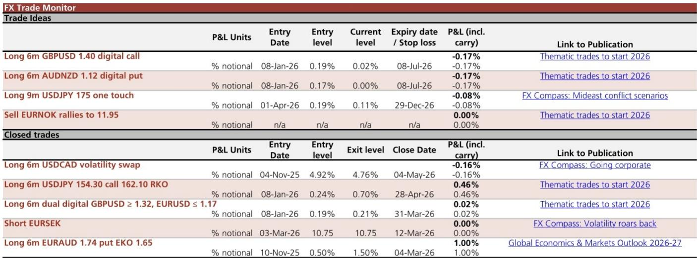
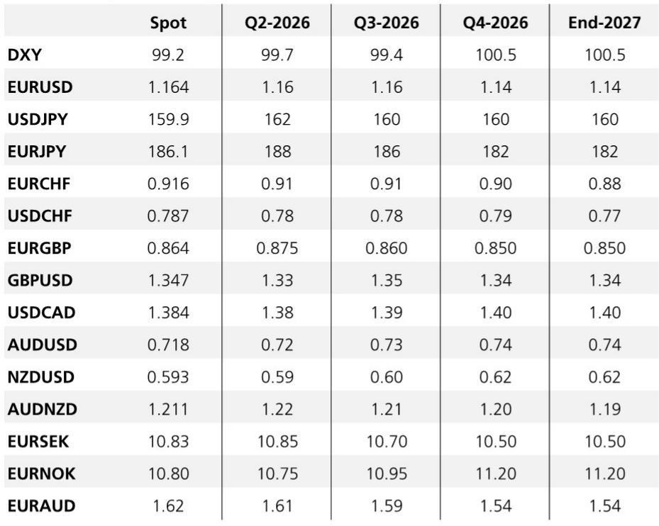
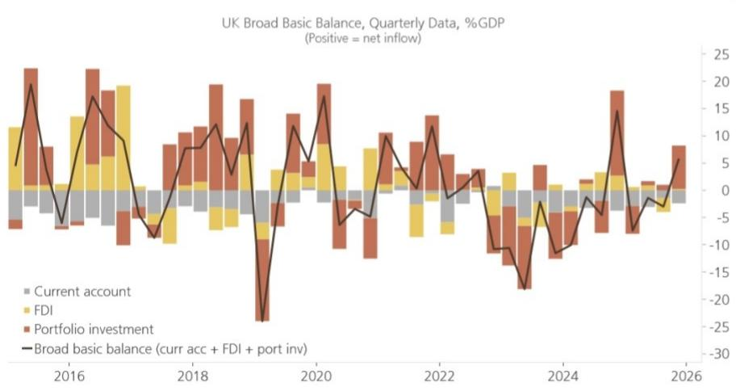

# The Dollar's Dominance Is Not Yet Priced In: Why Low Volatility Masks an Asymmetric Risk of Further USD Strength

The most dangerous consensus in foreign exchange markets today is the belief that low implied volatility reflects genuine stability. It does not. A global investment bank report reveals that FX markets are caught in a paradoxical state: geopolitical tensions are acute, yet volatility measures continue to grind lower. This divergence is not a sign of resolution. It is a sign that markets have selectively priced in only the most favorable outcomes while discounting the tail risks that would shatter the current calm.

The controlling insight is this: the US dollar remains structurally supported by carry advantages, high real rates, and the AI-driven capital inflow narrative, but the market's complacency about low volatility creates a setup where the next major move is likely to be a violent repricing higher in the dollar, not a breakdown of its strength. The World Cup effect—a historical pattern of reduced FX volatility during the tournament—may provide a temporary cover for this dynamic, but it does not eliminate the underlying asymmetries. Investors who mistake seasonal calm for structural resolution risk being caught flat-footed when the dollar resumes its ascent.

Three specific risk factors threaten the low-vol equilibrium: the Bank of Japan's ambiguous policy trajectory, the asymmetric tail risk from US-Iran negotiations, and the high bar for US data to shift Federal Reserve expectations. Each of these factors individually supports a dollar-positive outcome. Collectively, they create a powerful convergence that the market is not adequately hedging.

## The Bank of Japan's Ambiguity Is a Green Light for Yen Weakness, Not a Neutral Signal

The most consequential single policy event for G10 FX this week is Bank of Japan Governor Ueda's speech, the last scheduled communication before the 16 June rate decision. The market is pricing 19 basis points of hikes for that meeting, which implies a reasonably hawkish expectation. But the underlying data tells a different story, and the gap between market pricing and economic reality is where the risk lies.

Japan's underlying inflation measures have been trending decisively lower. "Core core" CPI printed 1.9% year-on-year in April and 1.6% in May, down from 2.4% and 1.9% respectively in the prior readings. The median underlying inflation gauge now sits well below 1.0% year-on-year. This is not an inflation problem that demands urgent tightening. It is an inflation environment that gives the BoJ ample room to delay, equivocate, or deliver a smaller hike than expected.

The implications for USDJPY are direct and powerful. As long as the BoJ's tightening intentions remain clouded by ambiguity, the yen loses its primary source of rate support relative to G10 peers. The carry advantage of the dollar becomes the dominant driver, and USDJPY becomes a buy-on-dips story. The report explicitly notes that a forceful reaffirmation and extension of BoJ hiking intentions would be needed to break this yen-negative dynamic. Without that, a test above 160 is likely.

What makes this particularly dangerous for yen bulls is the asymmetry in options pricing. Near-term risk reversal skews remain bid for puts within this year's range, suggesting that while the market is not aggressively betting against the yen, it is also not positioning for a sharp rally. The complacency is subtle but real. If Ueda delivers anything less than a hawkish surprise, the path of least resistance is higher USDJPY, and any intervention-driven pullback will attract carry-focused dip buyers operating in a low-vol environment.

The strategic question for investors is whether they are prepared for a scenario where BoJ policy expectations remain stagnant while the rest of the G10 reprices higher. The report shows that BoJ pricing has changed the least among all G10 central banks since the start of the US-Iran conflict. This is not a neutral outcome. It is a structural headwind for the yen that will persist until the data forces a change in BoJ behavior.

## The US-Iran Negotiation Risk Is Asymmetric Toward Escalation, Not Resolution

Markets have become conditioned to expect a market-friendly resolution to the US-Iran talks. President Trump's rhetoric and actions have consistently supported this narrative, and each round of negotiations has been accompanied by a temporary easing of geopolitical risk premiums. But this conditioning has created a one-sided positioning dynamic that is itself a source of vulnerability.

The report identifies the key asymmetry: given how embedded the resolution expectation has become, the bigger risk is now a breakdown in talks. This is not the baseline scenario, but it is the scenario that would deliver the largest shock to the current volatility regime. A lasting breakdown that leads to renewed military activity would push energy prices sharply higher, and the dollar would test the upper end of its Q2 ranges—EURUSD 1.1450, AUDUSD 0.70, USDJPY 162.

The mechanism is straightforward. The dollar's safe-haven status, combined with its carry advantage and the tailwind of high real rates, makes it the primary beneficiary of geopolitical stress. The market has been treating the current state of negotiations as a reason to sell volatility. But volatility is not gone. It is merely deferred. The seesaw price action of recent days, where G10 gains against the dollar were reversed on the back of Iran's threat to break off talks, demonstrates that the underlying tension remains acute.

For portfolio construction, the implication is uncomfortable but necessary to confront. The current low-vol environment is not a signal that tail risk has diminished. It is a signal that the market has crowded into a single narrative. When that narrative is disrupted, the re-pricing will be abrupt. The dollar is the most likely beneficiary of that disruption, and the current level of implied volatility does not reflect this probability.

## US Employment Data Must Deliver a Large Surprise to Challenge the Current Fed Pricing

The May US employment report is the third pillar of the current low-vol equilibrium. The market is looking for an 85,000 NFP print with 0.3% month-on-month average earnings growth and a 4.3% unemployment rate. This is a soft enough number to keep the current pricing for Fed hikes intact—approximately 18 basis points by year-end and 25 basis points by March 2027.

The report makes a critical observation: it would take a very large and clear data surprise in either direction to meaningfully challenge this priced-in outlook. This is not a statement about the data itself. It is a statement about the market's current state of conviction. The bar for volatility to rebound on US data alone is high.

Two factors reinforce this high bar. First, recent comments from Fed officials, including Cleveland Fed President Hammack and Kansas City Fed President Schmid, have leaned hawkish. This creates a baseline expectation that the committee is not inclined to ease. Second, the first FOMC meeting chaired by Chair Warsh is two weeks away, and markets are acutely aware that key elements of the current Fed framework, such as forward guidance, could change under new leadership. This uncertainty discourages aggressive positioning in either direction.

The strategic implication is that the dollar's rate support is resilient in the near term. A number in line with consensus will do nothing to undermine the current pricing. A strong number will reinforce it. Only a clear negative surprise would force a reassessment, and even then, the shift would need to be large enough to overcome the hawkish lean of recent Fed commentary.

For investors, the question is whether they are willing to bet against this resilience. The data does not yet provide a compelling reason to do so.

## What the Report Does Not Fully Answer: The Interaction Between Low Volatility and Positioning

The report provides a rigorous analysis of the three risk factors that could disrupt the current FX regime, but it leaves one critical question partially unanswered: how does the current level of implied volatility interact with the positioning that has built up around it?

Low volatility environments tend to encourage leverage. When options are cheap, hedges become more accessible, but they also become less attractive to sell. The market may be systematically under-hedged precisely because the cost of protection is low and the dominant narrative is benign. If that is the case, a volatility shock would be amplified by the need to re-hedge, creating a feedback loop that the report's scenario analysis does not fully capture.

Additionally, the report notes that the World Cup has historically coincided with lower realized FX volatility. But this is a seasonal pattern, not a structural one. The question is whether the current geopolitical and policy backdrop is sufficiently different from prior World Cup periods to override the historical pattern. The report acknowledges this tension but does not resolve it.

Investors should consider whether the combination of compressed volatility, one-sided positioning, and unresolved geopolitical risk creates a fragility that the standard scenario framework cannot fully address.

## A Decision Framework for Navigating the Current FX Regime

For investors seeking to translate this analysis into actionable positioning, a three-step decision framework can help clarify the trade-offs.

First, assess the direction of the dominant carry. The dollar sits near the top of the G10 carry rankings, and the low-vol environment amplifies the attractiveness of carry trades. Any positioning should start from the recognition that the dollar has a structural advantage that will persist until either volatility rises significantly or the carry differential narrows.

Second, evaluate the three risk factors in terms of probability and impact. The BoJ ambiguity is the highest-probability risk, with a clear directional implication for USDJPY. The US-Iran negotiation breakdown is lower probability but higher impact, with broad dollar-positive consequences. The US employment data is the most binary in the near term, but the high bar for a surprise means that in-line data is effectively dollar-supportive.

Third, determine whether the current options pricing adequately reflects these risks. The report's analysis of USDJPY risk reversals suggests that near-term protection is not excessively cheap, but longer-dated protection may offer better value. For other currency pairs, the low level of implied volatility means that tail-risk hedges are more accessible than they have been in years, but they are also more likely to expire worthless if the benign narrative persists.

The framework does not prescribe a single trade. It provides a structure for evaluating whether the current market pricing is consistent with the range of plausible outcomes. In the current environment, the weight of evidence suggests that the dollar's upside is underappreciated.

## The Unresolved Questions That Make the Full Report Essential

The analysis presented here is necessarily incomplete. The full report contains detailed charts on Japan's underlying inflation trajectory, the evolution of central bank pricing across G10, the dynamics of USDJPY risk reversal skews, the correlation between Brent crude and the dollar index, and the composition of UK balance of payments flows that underpin GBP resilience.

Each of these charts tells a part of the story that cannot be fully captured in a summary. The inflation chart reveals the steady erosion of the BoJ's tightening case. The central bank pricing chart shows how isolated the BoJ is in the G10 repricing. The risk reversal chart quantifies the market's current hedging posture. The oil correlation chart demonstrates how deeply geopolitics is embedded in FX dynamics. The UK balance of payments chart explains why GBP has remained resilient despite political noise.

These are not decorative elements. They are the analytical foundation on which the strategic argument rests. Without them, the argument is incomplete.

Join the community to read the full report and review the original charts.

*This article is for learning and discussion only and does not constitute investment advice.*

Personal reading notes and learning share only. Not investment advice.

