# Hidden worries

# What does the May global PMI data tell us?

- The global composite PMI remained unchanged in May, with both manufacturing and service sector expansion...   
- ...but longer delivery times and frontloading continue to inflate the headline manufacturing index...   
- ...as businesses expect increased price pressures and supply chain problems to persist for now

The global composite PMI in May recorded another month of expansion, at 51.8 – the same as in April. Both manufacturing and services stayed in expansionary territory. Still, the underlying picture isn't especially encouraging.

The global manufacturing PMI came in at 52.6 in May, unchanged from April. The headline is still propped up by longer suppliers' delivery times and frontloading. Firms expect Middle East tensions to disrupt supply chains, pushing prices higher. In the US, both the S&P and ISM manufacturing PMIs showed solid gains in production and rising new orders, largely tied to inventory buildups to hedge against potential shipment delays and cost spikes in coming months. The eurozone, by contrast, is already showing signs of slowing as cost pressures weigh on demand.

The services sector tells a similar story. Higher costs appear to be dampening demand, particularly in the eurozone and the UK. In the US, new orders rose, but firms reduced employment on both measures. Mainland China and India saw activity accelerate on stronger new orders, though price pressures are still a concern.

We don't think the current PMI strength is likely to last, given the challenges of higher inflation. If cost pressures worsen further, demand destruction could follow. In this environment, it's worth leaning more on components like employment, output, and new orders rather than the headline indices.

1. Snapshot of manufacturing and services PMIs 

<table><tr><td rowspan="2"></td><td colspan="3">Manufacturing PMIs</td><td colspan="3">Services PMIs</td></tr><tr><td>Mar 26</td><td>Apr 26</td><td>May 26</td><td>Mar 26</td><td>Apr 26</td><td>May 26</td></tr><tr><td>World</td><td>51.3</td><td>52.6</td><td>52.6</td><td>50.8</td><td>51.2</td><td>51.3</td></tr><tr><td>US</td><td>52.3</td><td>54.5</td><td>55.1</td><td>49.8</td><td>51.0</td><td>50.7</td></tr><tr><td>US ISM</td><td>52.7</td><td>52.7</td><td>54.0</td><td>54.0</td><td>53.6</td><td>54.5</td></tr><tr><td>Mainland China*</td><td>50.8</td><td>52.2</td><td>51.8</td><td>52.1</td><td>52.6</td><td>54.4</td></tr><tr><td>Mainland China NBS</td><td>50.4</td><td>50.3</td><td>50.0</td><td>50.1</td><td>49.4</td><td>50.1</td></tr><tr><td>Eurozone</td><td>51.6</td><td>52.2</td><td>51.6</td><td>50.2</td><td>47.6</td><td>47.7</td></tr><tr><td>Japan</td><td>51.6</td><td>55.1</td><td>54.5</td><td>53.4</td><td>51.0</td><td>50.0</td></tr><tr><td>UK</td><td>51.0</td><td>53.7</td><td>53.9</td><td>50.5</td><td>52.7</td><td>49.3</td></tr><tr><td>India</td><td>53.9</td><td>54.7</td><td>55.0</td><td>57.5</td><td>58.8</td><td>59.8</td></tr><tr><td>Brazil</td><td>49.0</td><td>52.6</td><td>49.1</td><td>50.1</td><td>52.3</td><td>50.4</td></tr><tr><td rowspan="2">Heatmap Key</td><td colspan="3">Below 50 and rising</td><td colspan="3">Above 50 and rising</td></tr><tr><td colspan="3">Below 50 and falling</td><td colspan="3">Above 50 and falling</td></tr></table>

Source: S&P Global, HSBC. \*Refers to RatingDog Mainland China PMI. Due to a later-than-usual release date, May readings for Greece, Indonesia, Ireland, Malaysia, Pakistan, Romania, and Thailand were not available to include in the global calculations.

# Economics Global

# Maitreyi Das

Global Economist

HSBC Securities and Capital Markets (India) Private Limited

maitreyi.das@hsbc.co.in

+91 80 6737 3155

# Bethan Ellis

Global Economist

HSBC Bank plc

bethan.ellis@hsbc.com

+44 20 7991 6714

# Disclosures & Disclaimer

This report must be read with the disclosures and the analyst certifications in the Disclosure appendix, and with the Disclaimer, which forms part of it.

Issuer of report: HSBC Securities and Capital Markets (India) Private Limited

View HSBC Global Investment Research at:

https://www.research.hsbc.com

# Three key takeaways from this month's data

# 1. Intensifying supply shocks and price pressures are a global theme now

The May PMI releases point to another month of “distorted” growth – headline resilience masking longer delivery times. Quantities of purchases accelerated for a second consecutive month, consistent with firms frontloading inputs amid heightened supply risks linked to the Middle East conflict.

Input costs intensified further in May, with global manufacturing input costs rising at the fastest pace since June 2022. The US recorded the sharpest increase in nearly four years, with respondents pointing to higher costs for petroleum products, steel, and freight. France, Germany, Japan, the UK, and the Philippines also saw faster input price inflation. Yet pass through remains incomplete in many economies, implying renewed margin squeeze rather than a clean shift higher in final-goods pricing. Consequently, orders are being placed to get ahead of increases in output prices. Beyond the Middle East conflict, US tariffs could be another factor in this frontloading. There has been some evidence of US importers bringing forward orders to get ahead of expected increases in tariffs later this year, particularly from Asia.

In the US, both the S&P Global and ISM surveys noted comments pointing to accelerated stockpiling, helping to lift new orders and production to multiyear highs. Japan, India, Korea, and Vietnam also recorded sharp increases in purchasing volumes, reflecting concerns over both supply bottlenecks and rising prices.

# 2. Regional divergence: US strength vs a fragile eurozone

The US manufacturing upswing looks increasingly entrenched, with production rising to its highest level since April 2022. By contrast, the eurozone is losing momentum. The region's two largest economies – Germany and France – both slowed, with respondents noting that Middle East-related disruptions are weighing on demand via higher costs, and new orders remain muted.

The eurozone headline PMI remained above 50, but the composition warrants caution. Part of the support comes from longer delivery times, which can mechanically lift the index (the logic is that, in a normal situation, longer delivery times indicate higher demand). Removing delivery times from the index would place eurozone manufacturing in contraction. A similar distortion can be seen in the world index, but to a lesser extent.

Elsewhere, in Asia, manufacturing activity improved in economies including India, Korea, and Japan, while they expanded at a slower pace in mainland China. However, the positive impulse appears more risk- than demand-led: a meaningful share of the pickup is consistent with precautionary buying ahead of potential supply chain disruption.

# 3. Services PMI: Higher costs have started to impact demand

The global services sector continued to expand in May, with the global services PMI at 51.3. New orders expanded, with panellists citing clients frontloading purchases. But employment declined, signalling subdued underlying demand and higher cost pressures. Ultimately, higher price pressures in many economies will weigh on service activity.

The sector is also showing a familiar split. Asia and the US are holding up better than the eurozone and the UK. Stronger new orders – especially in India and mainland China – have driven a faster pace of activity. In the US, the ISM services accelerated, while the S&P index ticked down but stayed in expansionary territory, both supported by new orders. However, employment fell sharply, reflecting some pessimism in the data. In Europe, meanwhile, higher cost pressures have started to curb demand. In the UK, respondents pointed to subdued consumer spending in travel, tourism, and leisure.

A swift de-escalation in the Middle East would ease supply chain constraints and take some heat out of prices, which would help demand. Nonetheless, the conflict has already run for more than three months, and even if the Strait of Hormuz were to reopen, normalisation in PMIs would take time.

See over the page for all the key PMI charts from the latest releases.

# Manufacturing PMIs

2. The global manufacturing PMI came in at 52.6 in May, unchanged from April...   
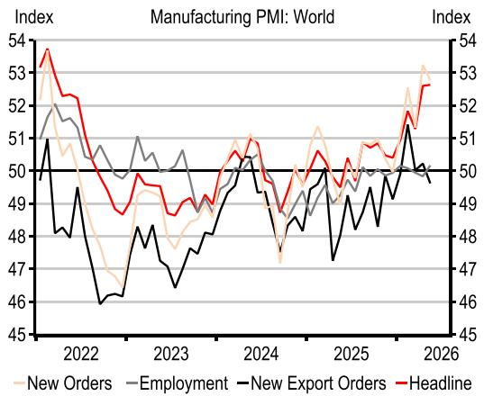

line

| Year | New Orders | Employment | New Export Orders | Headline |
|------|------------|------------|-------------------|----------|
| 2022 | 51         | 50         | 50                | 54       |
| 2023 | 48         | 50         | 47                | 49       |
| 2024 | 51         | 50         | 50                | 51       |
| 2025 | 50         | 50         | 49                | 51       |
| 2026 | 53         | 50         | 50                | 53       |

Source: S&P Global, Macrobond. Note: due to a later-than-usual release date, May readings for Greece, Indonesia, Ireland, Malaysia, Pakistan, Romania, and Thailand were not available to include in the global calculations.

4. Manufacturing activity in the US expanded on both measures...   
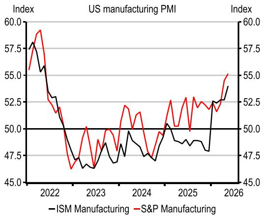

line

| Year | ISM Manufacturing | S&P Manufacturing |
|------|-------------------|-------------------|
| 2022 | 57.5              | 59.0              |
| 2023 | 47.5              | 47.0              |
| 2024 | 50.0              | 52.5              |
| 2025 | 48.0              | 53.0              |
| 2026 | 54.0              | 55.0              |

Source: S&P Global, Macrobond.

6. Some of the strength in new orders could reflect frontloading...   
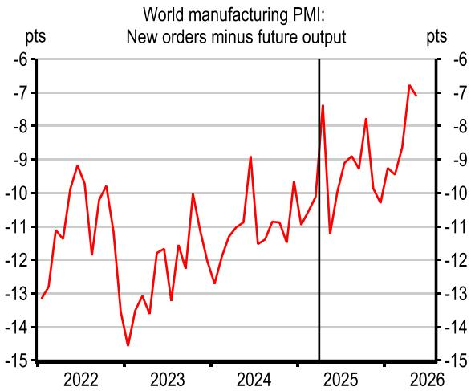

line

| Year | Value (pts) |
|------|-------------|
| 2022 | -13         |
| 2023 | -14         |
| 2024 | -9          |
| 2025 | -7          |
| 2026 | -7          |

Source: S&P Global, Macrobond. Note: The vertical line reflects the Liberation Day tariff disruption

3. ...although partly due to stockpiling and longer delivery times   
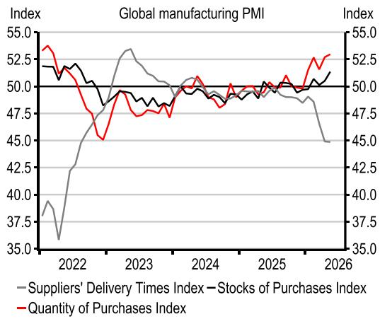

line

| Year | Suppliers' Delivery Times Index | Stocks of Purchases Index | Quantity of Purchases Index |
|------|----------------------------------|---------------------------|-----------------------------|
| 2022 | 38.0                             | 51.0                      | 53.0                        |
| 2023 | 49.0                             | 50.0                      | 47.0                        |
| 2024 | 49.5                             | 50.5                      | 49.0                        |
| 2025 | 49.0                             | 50.0                      | 51.0                        |
| 2026 | 45.0                             | 51.0                      | 53.0                        |

Source: S&P Global, Macrobond. Note: due to a later-than-usual release date, May readings for Greece, Indonesia, Ireland, Malaysia, Pakistan, Romania, and Thailand were not available to include in the global calculations.

5. ...but price pressure remains elevated   
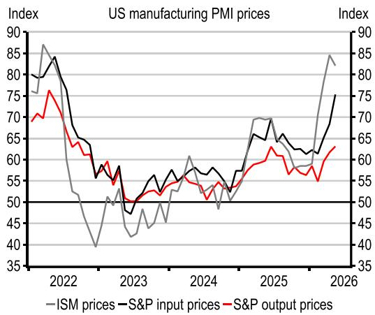

line

| Year | ISM prices | S&P input prices | S&P output prices |
|------|------------|------------------|-------------------|
| 2022 | 85         | 80               | 75                |
| 2023 | 40         | 55               | 50                |
| 2024 | 60         | 65               | 60                |
| 2025 | 70         | 75               | 65                |
| 2026 | 85         | 80               | 70                |

Source: S&P Global, Macrobond

7. ...as stocks of purchases increased, indicating inventory buildup   
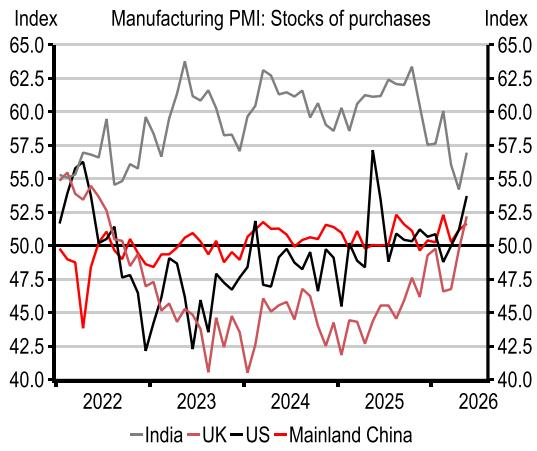

line

| Year | India | UK  | US  | Mainland China |
|------|-------|-----|-----|----------------|
| 2022 | 57.5  | 55.0| 57.5| 50.0           |
| 2023 | 62.5  | 45.0| 47.5| 50.0           |
| 2024 | 60.0  | 47.5| 50.0| 50.0           |
| 2025 | 62.5  | 45.0| 57.5| 50.0           |
| 2026 | 57.5  | 52.5| 50.0| 50.0           |

Source: Rating Dog, S&P, Macrobond

8. Manufacturing activity slowed in France and Germany   
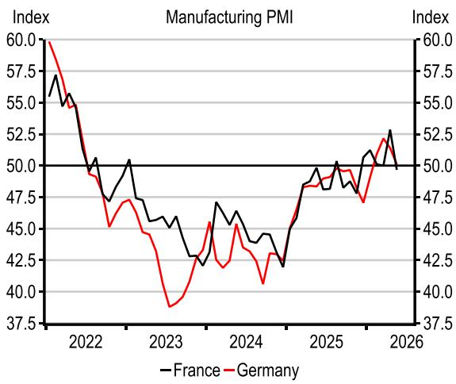

line

| Year | France | Germany |
|------|--------|---------|
| 2022 | 55.0   | 55.0    |
| 2023 | 48.0   | 40.0    |
| 2024 | 45.0   | 45.0    |
| 2025 | 50.0   | 50.0    |
| 2026 | 52.5   | 52.5    |

Source: S&P Global, Macrobond.

9. PMIs in the Middle East recovered to some extent in May   
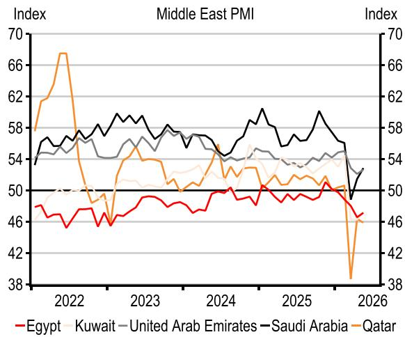

line

| Year | Egypt | Kuwait | United Arab Emirates | Saudi Arabia | Qatar |
|------|-------|--------|----------------------|--------------|-------|
| 2022 | 46    | 54     | 58                   | 58           | 66    |
| 2023 | 49    | 56     | 58                   | 58           | 54    |
| 2024 | 50    | 54     | 58                   | 58           | 54    |
| 2025 | 50    | 54     | 58                   | 58           | 54    |
| 2026 | 46    | 54     | 58                   | 58           | 38    |

Source: S&P Global, Macrobond. Note: Whole economy PMI

10. Employment data suggest a cautious outlook for the manufacturing sector   
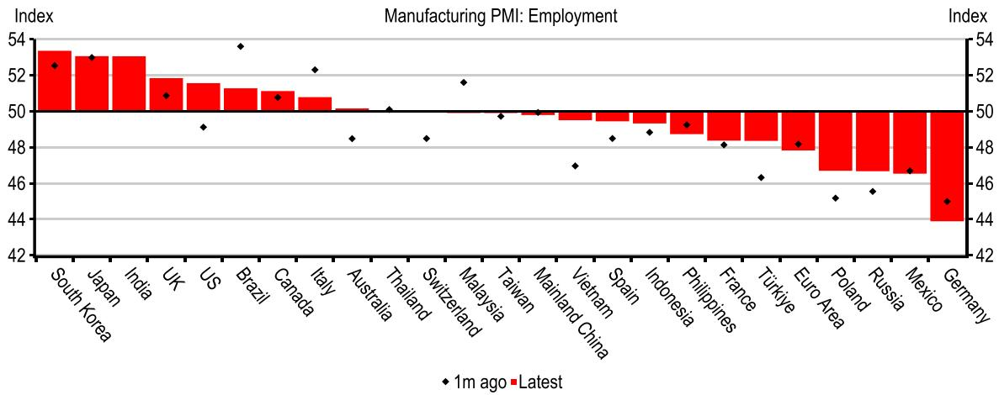

bar

| Country/Region       | 1m ago | Latest |
|----------------------|--------|--------|
| South Korea          |        | 53.5   |
| Japan                |        | 53.0   |
| India                |        | 53.0   |
| UK                   |        | 51.5   |
| US                   |        | 51.0   |
| Brazil               |        | 53.5   |
| Canada               |        | 51.0   |
| Italy                |        | 52.0   |
| Australia            |        | 49.0   |
| Thailand             |        | 50.0   |
| Switzerland          |        | 49.0   |
| Malaysia             |        | 51.5   |
| Taiwan               |        | 50.0   |
| Mainland China       |        | 50.0   |
| Vietnam              |        | 49.5   |
| Spain                |        | 49.0   |
| Indonesia            |        | 49.5   |
| Philippines          |        | 49.0   |
| France               |        | 48.5   |
| Türkiye              |        | 48.0   |
| Euro Area            |        | 47.5   |
| Poland               |        | 46.0   |
| Russia               |        | 46.5   |
| Mexico               |        | 47.0   |
| Germany              |        | 44.5   |

Source: S&P Global, Macrobond

11. Longer supplier delivery times boost the headline data due to methodological quirks   
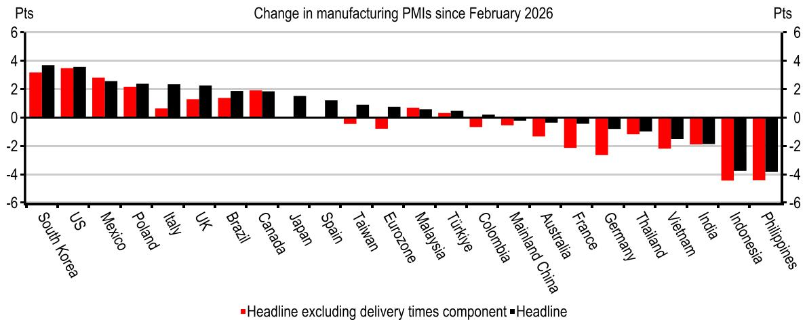

bar

| Country/Region       | Headline excluding delivery times component | Change |
|----------------------|---------------------------------------------|--------|
| South Korea          | 3.0                                         | 4.0    |
| US                   | 3.5                                         | 4.0    |
| Mexico               | 2.8                                         | 3.0    |
| Poland               | 2.0                                         | 2.5    |
| Italy                | 0.5                                         | 2.5    |
| UK                   | 1.2                                         | 2.5    |
| Brazil               | 1.0                                         | 2.0    |
| Canada               | 1.8                                         | 2.0    |
| Japan                | 1.5                                         | 1.5    |
| Spain                | 0.0                                         | 1.0    |
| Taiwan               | -0.5                                        | 0.5    |
| Eurozone             | -1.0                                        | 0.5    |
| Malaysia             | 0.5                                         | 0.5    |
| Türkiye              | 0.0                                         | 0.5    |
| Colombia             | -0.5                                        | 0.0    |
| Mainland China       | -1.0                                        | -0.5   |
| Australia            | -1.5                                        | -1.0   |
| France               | -2.0                                        | -1.5   |
| Germany              | -3.0                                        | -2.0   |
| Thailand             | -1.5                                        | -1.0   |
| Vietnam              | -2.0                                        | -1.5   |
| India                | -2.5                                        | -2.0   |
| Indonesia            | -4.5                                        | -3.5   |
| Philippines          | -4.5                                        | -4.0   |

Source: S&P Global, Macrobond, HSBC calculations

# Other key trends in the manufacturing sector

12. Delivery times suggest that supply chain issues may become more challenging in upcoming months   

bar

| Country       | Index |
| ------------- | ----- |
| Taiwan        | 37    |
| UK            | 34    |
| Spain         | 39    |
| Japan         | 37    |
| Germany       | 38    |
| Eurozone      | 38    |
| Australia     | 34    |
| France        | 39    |
| Italy         | 39    |
| US            | 42    |
| South Korea   | 42    |
| Mexico        | 46    |
| Brazil        | 42    |
| Canada        | 46    |
| Colombia      | 46    |
| Poland        | 46    |
| Philippines   | 47    |
| Türkiye       | 45    |
| Indonesia     | 47    |
| Malaysia      | 46    |
| Russia        | 49    |
| Thailand      | 49    |
| Mainland China| 50    |
| India         | 54    |

Source: S&P Global, Macrobond

13. Manufacturing input costs remain elevated in most economies, led by higher energy and other commodity prices   
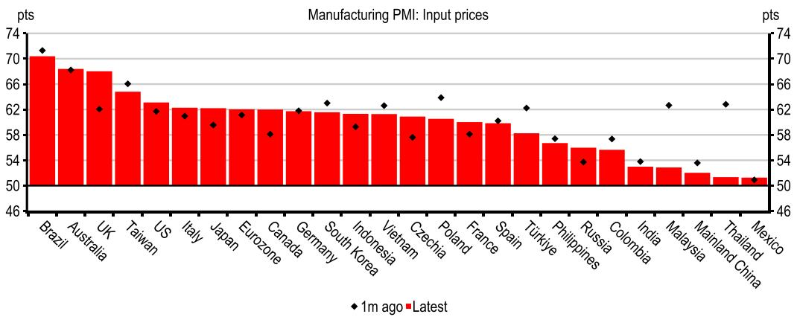

bar

| Country       | Value |
| ------------- | ----- |
| Brazil        | 70.5  |
| Australia     | 68.5  |
| UK            | 68.0  |
| Taiwan        | 65.0  |
| US            | 63.0  |
| Italy         | 62.0  |
| Japan         | 62.0  |
| Eurozone      | 62.0  |
| Canada        | 62.0  |
| Germany       | 62.0  |
| South Korea   | 62.0  |
| Indonesia     | 62.0  |
| Vietnam       | 62.0  |
| Czechia       | 62.0  |
| Poland        | 62.0  |
| France        | 62.0  |
| Spain         | 62.0  |
| Türkiye       | 62.0  |
| Philippines   | 62.0  |
| Russia        | 62.0  |
| Colombia      | 62.0  |
| India         | 62.0  |
| Malaysia      | 62.0  |
| Mainland China| 62.0  |
| Thailand      | 62.0  |
| Mexico        | 62.0  |

Source: S&P Global, Macrobond.

14. Input and output costs rose in developed markets...   
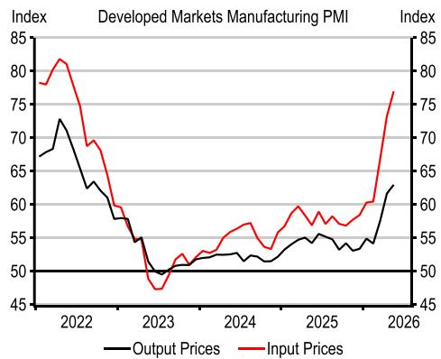

line

| Year | Output Prices | Input Prices |
|------|---------------|--------------|
| 2022 | 73            | 81           |
| 2023 | 50            | 48           |
| 2024 | 53            | 57           |
| 2025 | 55            | 60           |
| 2026 | 63            | 77           |

Source: S&P Global, Macrobond

15. ...but increases slowed slightly in emerging markets   
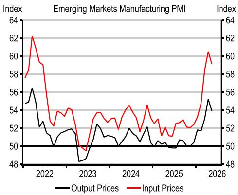

line

| Year | Output Prices | Input Prices |
|------|---------------|--------------|
| 2022 | 56            | 62           |
| 2023 | 48            | 50           |
| 2024 | 52            | 54           |
| 2025 | 50            | 52           |
| 2026 | 55            | 60           |

Source: S&P Global, Macrobond

# Services PMIs

16. The global services PMI expanded marginally in May...   
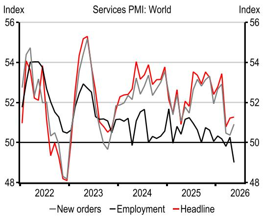

line

| Year | New orders | Employment | Headline |
|------|------------|------------|----------|
| 2022 | 54.5       | 54.0       | 51.0     |
| 2023 | 55.0       | 53.0       | 55.5     |
| 2024 | 53.0       | 51.5       | 54.0     |
| 2025 | 52.0       | 51.0       | 53.5     |
| 2026 | 51.0       | 49.0       | 51.5     |

Source: S&P Global, Macrobond

17. ...with India still strong   
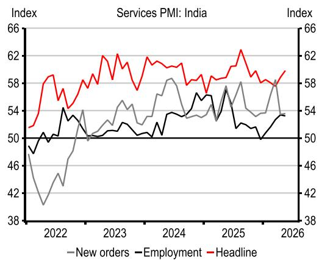

line

| Year | New orders | Employment | Headline |
|------|------------|------------|----------|
| 2022 | 48         | 50         | 58       |
| 2023 | 54         | 52         | 62       |
| 2024 | 58         | 54         | 60       |
| 2025 | 54         | 50         | 64       |
| 2026 | 54         | 54         | 58       |

Source: S&P Global, Macrobond. Note: Latest data point is flash estimate

18. The US services PMIs diverged in May, with ISM rising, a payback from April   
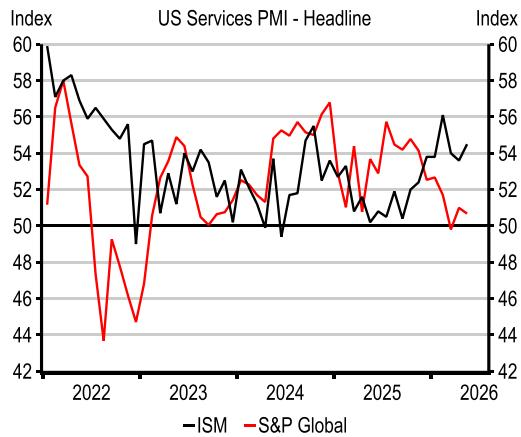

line

| Year | ISM  | S&P Global |
|------|------|------------|
| 2022 | 58   | 58         |
| 2023 | 54   | 54         |
| 2024 | 56   | 56         |
| 2025 | 54   | 54         |
| 2026 | 54   | 54         |

Source: S&P Global, Macrobond

19. The eurozone services PMI slowed, led by Germany and France   
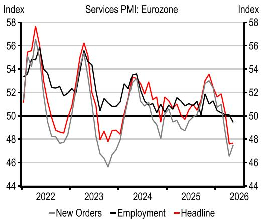

line

| Year | New Orders | Employment | Headline |
|------|------------|------------|----------|
| 2022 | 57         | 56         | 58       |
| 2023 | 48         | 55         | 56       |
| 2024 | 53         | 54         | 53       |
| 2025 | 51         | 51         | 51       |
| 2026 | 47         | 50         | 49       |

Source: S&P Global, Macrobond

20. The UK services sector also deteriorated in May, as price pressures remain intense...   
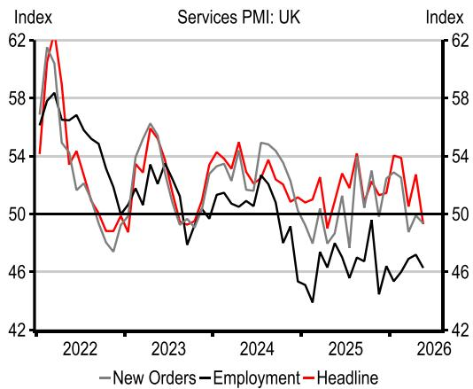

line

| Year | New Orders | Employment | Headline |
|------|------------|------------|----------|
| 2022 | 58         | 58         | 62       |
| 2023 | 50         | 50         | 54       |
| 2024 | 54         | 52         | 54       |
| 2025 | 46         | 46         | 54       |
| 2026 | 46         | 46         | 54       |

Source: S&P Global, Macrobond

21. ...and mainland China saw steady growth, but still subdued employment   
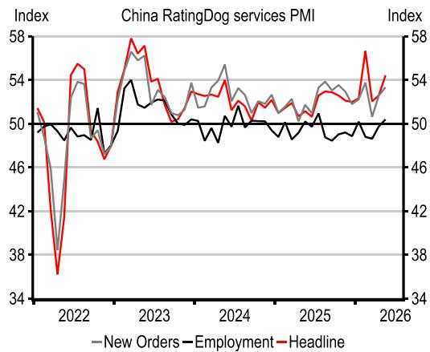

line

| Year | New Orders | Employment | Headline |
|------|------------|------------|----------|
| 2022 | 50         | 50         | 50       |
| 2023 | 54         | 54         | 58       |
| 2024 | 54         | 50         | 54       |
| 2025 | 54         | 50         | 54       |
| 2026 | 54         | 50         | 54       |

Source: RatingDog, Macrobond

22. Both services input costs and output costs rose further in May...   
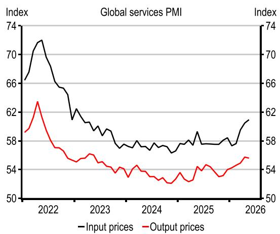

line

| Year | Input prices | Output prices |
|------|--------------|---------------|
| 2022 | 71           | 63            |
| 2023 | 59           | 55            |
| 2024 | 58           | 54            |
| 2025 | 58           | 54            |
| 2026 | 61           | 56            |

Source: S&P Global, Macrobond

23. ...with input costs notably elevated in the UK...   
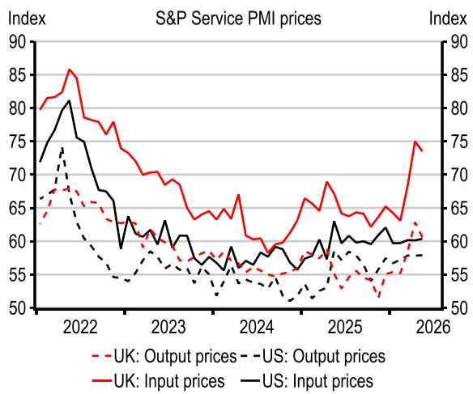

line

| Year | UK: Output prices | US: Output prices | UK: Input prices | US: Input prices |
|------|-------------------|-------------------|------------------|------------------|
| 2022 | 65                | 75                | 85               | 80               |
| 2023 | 58                | 55                | 70               | 65               |
| 2024 | 55                | 50                | 60               | 60               |
| 2025 | 58                | 55                | 65               | 60               |
| 2026 | 60                | 58                | 75               | 60               |

Source: S&P Global, Macrobond

24. ...and are high across most global economies...   
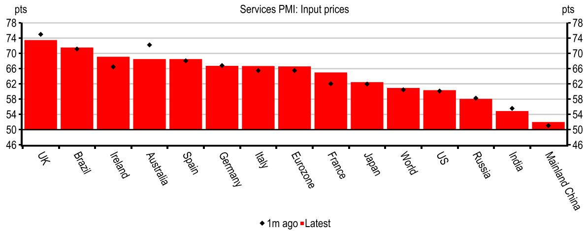

bar

| Country/Region | Value (pts) |
| -------------- | ----------- |
| UK             | 74          |
| Brazil         | 71          |
| Ireland        | 69          |
| Australia      | 69          |
| Spain          | 69          |
| Germany        | 66          |
| Italy          | 66          |
| Eurozone       | 66          |
| France         | 62          |
| Japan          | 62          |
| World          | 61          |
| US             | 61          |
| Russia         | 58          |
| India          | 55          |
| Mainland China | 52          |

Source: S&P Global, Macrobond

25. ...with firms in the US, the UK, France, and Germany reporting cuts to employment   
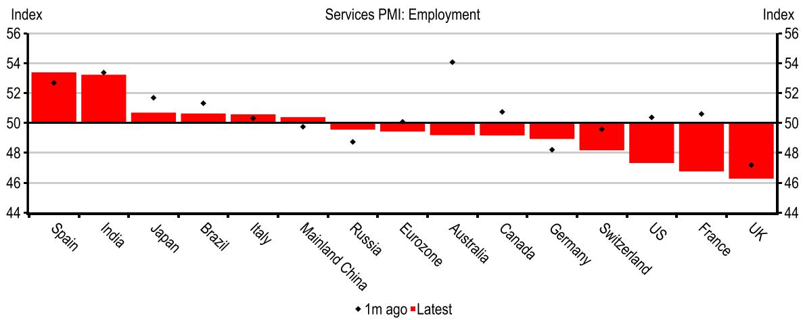

bar

| Country       | Index |
| ------------- | ----- |
| Spain         | 53    |
| India         | 53    |
| Japan         | 52    |
| Brazil        | 52    |
| Italy         | 52    |
| Mainland China| 50    |
| Russia        | 49    |
| Eurozone      | 50    |
| Australia     | 54    |
| Canada        | 51    |
| Germany       | 48    |
| Switzerland   | 49    |
| US            | 50    |
| France        | 51    |
| UK            | 47    |

Source: S&P Global, Macrobond

# 26. Detailed breakdown of manufacturing and services PMIs

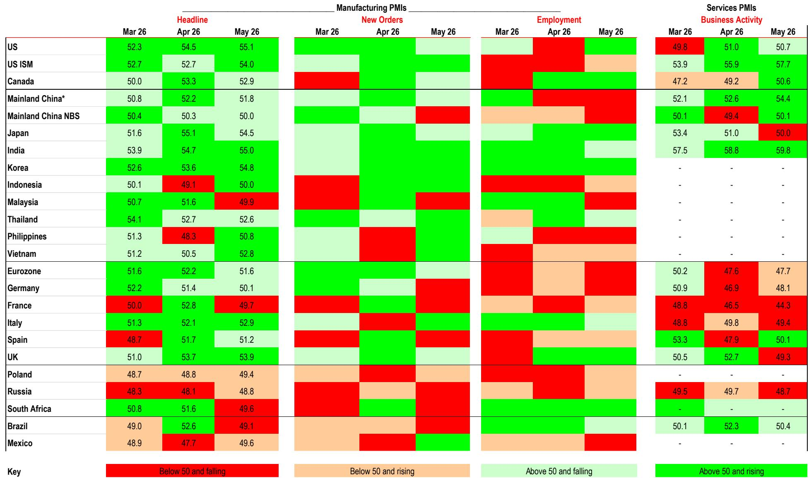

heatmap

Manufacturing PMIs
| Country | Mar 26<fcel>Headline Apr 26<fcel>May 26<fcel>Manufacturing PMIs New Orders Mar 26<fcel>Apr 26<fcel>May 26<fcel>Mar 26<fcel>Employment Apr 26<fcel>May 26<fcel>Services PMIs Business Activity Mar 26<fcel>Apr 26<fcel>May 26<nl>
<fcel>US<fcel>52.3<fcel>54.5<fcel>55.1<ecel><ecel><ecel><ecel><ecel><ecel><fcel>49.8<fcel>51.0<fcel>50.7<nl>
<fcel>US ISM<fcel>52.7<fcel>52.7<fcel>54.0<ecel><ecel><ecel><ecel><ecel><ecel><fcel>53.9<fcel>55.9<fcel>57.7<nl>
<fcel>Canada<fcel>50.0<fcel>53.3<fcel>52.9<ecel><ecel><ecel><ecel><ecel><ecel><fcel>47.2<fcel>49.2<fcel>50.6<nl>
<fcel>Mainland China*<fcel>50.8<fcel>52.2<fcel>51.8<ecel><ecel><ecel><ecel><ecel><ecel><fcel>52.1<fcel>52.6<fcel>54.4<nl>
<fcel>Mainland China NBS<fcel>50.4<fcel>50.3<fcel>50.0<ecel><ecel><ecel><ecel><ecel><ecel><fcel>50.1<fcel>49.4<fcel>50.1<nl>
<fcel>Japan<fcel>51.6<fcel>55.1<fcel>54.5<ecel><ecel><ecel><ecel><ecel><ecel><fcel>53.4<fcel>51.0<fcel>50.0<nl>
<fcel>India<fcel>53.9<fcel>54.7<fcel>55.0<ecel><ecel><ecel><ecel><ecel><ecel><fcel>57.5<fcel>58.8<fcel>59.8<nl>
<fcel>Korea<fcel>52.6<fcel>53.6<fcel>54.8<ecel><ecel><ecel><ecel><ecel><ecel><fcel>-<fcel>-<fcel>-<nl>
<fcel>Indonesia<fcel>50.1<fcel>49.1<fcel>50.0<ecel><ecel><ecel><ecel><ecel><ecel><fcel>-<fcel>-<fcel>-<nl>
<fcel>Malaysia<fcel>50.7<fcel>51.6<fcel>49.9<ecel><ecel><ecel><ecel><ecel><ecel><fcel>-<fcel>-<fcel>-<nl>
<fcel>Thailand<fcel>54.1<fcel>52.7<fcel>52.6<ecel><ecel><ecel><ecel><ecel><ecel><fcel>-<fcel>-<fcel>-<nl>
<fcel>Philippines<fcel>51.3<fcel>48.3<fcel>50.8<ecel><ecel><ecel><ecel><ecel><ecel><fcel>-<fcel>-<fcel>-<nl>
<fcel>Vietnam<fcel>51.2<fcel>50.5<fcel>52.8<ecel><ecel><ecel><ecel><ecel><ecel><fcel>-<fcel>-<fcel>-<nl>
<fcel>Eurozone<fcel>51.6<fcel>52.2<fcel>51.6<ecel><ecel><ecel><ecel><ecel><ecel><fcel>50.2<fcel>47.6<fcel>47.7<nl>
<fcel>Germany<fcel>52.2<fcel>51.4<fcel>50.1<ecel><ecel><ecel><ecel><ecel><ecel><fcel>50.9<fcel>46.9<fcel>48.1<nl>
<fcel>France<fcel>50.0<fcel>52.8<fcel>49.7<ecel><ecel><ecel><ecel><ecel><ecel><fcel>48.8<fcel>46.5<fcel>44.3<nl>
<fcel>Italy<fcel>51.3<fcel>52.1<fcel>52.9<ecel><ecel><ecel><ecel><ecel><ecel><fcel>48.8<fcel>49.8<fcel>49.4<nl>
<fcel>Spain<fcel>48.7<fcel>51.7<fcel>51.2<ecel><ecel><ecel><ecel><ecel><ecel><fcel>53.3<fcel>47.9<fcel>50.1<nl>
<fcel>UK<fcel>51.0<fcel>53.7<fcel>53.9<ecel><ecel><ecel><ecel><ecel><ecel><fcel>50.5<fcel>52.7<fcel>49.3<nl>
<fcel>Poland<fcel>48.7<fcel>48.8<fcel>49.4<ecel><ecel><ecel><ecel><ecel><ecel><fcel>-<fcel>-<fcel>-<nl>
<fcel>Russia<fcel>48.3<fcel>48.1<fcel>48.8<ecel><ecel><ecel><ecel><ecel><ecel><fcel>49.5<fcel>49.7<fcel>48.7<nl>
<fcel>South Africa<fcel>50.8<fcel>51.6<fcel>49.6<ecel><ecel><ecel><ecel><ecel><ecel><fcel>-<fcel>-<fcel>-<nl>
<fcel>Brazil<fcel>49.0<fcel>52.6<fcel>49.1<ecel><ecel><ecel><ecel><ecel><ecel><fcel>50.1<fcel>52.3<fcel>50.4<nl>
<fcel>Mexico<fcel>48.9<fcel>47.7<fcel>49.6<ecel><ecel><ecel><ecel><ecel><ecel><fcel>-<fcel>-<fcel>-<nl>

Source: S&P Global, HSBC. \*Refers to RatingDog Mainland China PMI Note: Due to a later-than-usual release date, May readings for Greece, Indonesia, Ireland, Malaysia, Pakistan, Romania, and Thailand were not available to include in the global calculations.

# Disclosure appendix

# Analyst Certification

The following analyst(s), economist(s), or strategist(s) who is(are) primarily responsible for this report, including any analyst(s) whose name(s) appear(s) as author of an individual section or sections of the report and any analyst(s) named as the covering analyst(s) of a subsidiary company in a sum-of-the-parts valuation certifies(y) that the opinion(s) on the subject security(ies) or issuer(s), any views or forecasts expressed in the section(s) of which such individual(s) is(are) named as author(s), and any other views or forecasts expressed herein, including any views expressed on the back page of the research report, accurately reflect their personal view(s) and that no part of their compensation was, is or will be directly or indirectly related to the specific recommendation(s) or views contained in this research report: Maitreyi Das and Bethan Ellis

# Important disclosures

This document has been prepared and is being distributed by the Research Department of HSBC and is intended solely for the clients of HSBC and is not for publication to other persons, whether through the press or by other means.

This document is for information purposes only and it should not be regarded as an offer to sell or as a solicitation of an offer to buy the securities or other investment products mentioned in it and/or to participate in any trading strategy. Advice in this document is general and should not be construed as personal advice, given it has been prepared without taking account of the objectives, financial situation or needs of any particular investor. Accordingly, investors should, before acting on the advice, consider the appropriateness of the advice, having regard to their objectives, financial situation and needs. If necessary, seek professional investment and tax advice.

Certain investment products mentioned in this document may not be eligible for sale in some states or countries, and they may not be suitable for all types of investors. Investors should consult with their HSBC representative regarding the suitability of the investment products mentioned in this document and take into account their specific investment objectives, financial situation or particular needs before making a commitment to purchase investment products.

The value of and the income produced by the investment products mentioned in this document may fluctuate, so that an investor may get back less than originally invested. Certain high-volatility investments can be subject to sudden and large falls in value that could equal or exceed the amount invested. Value and income from investment products may be adversely affected by exchange rates, interest rates, or other factors. Past performance of a particular investment product is not indicative of future results.

HSBC and its affiliates will from time to time sell to and buy from customers the securities/instruments, both equity and debt (including derivatives) of companies covered in HSBC on a principal or agency basis or act as a market maker or liquidity provider in the securities/instruments mentioned in this report.

Analysts, economists, and strategists are paid in part by reference to the profitability of HSBC which includes investment banking, sales & trading, and principal trading revenues.

Whether, or in what time frame, an update of this analysis will be published is not determined in advance.

For disclosures in respect of any company mentioned in this report, please see the most recently published report on that company available at www.hsbcnet.com/research. HSBC Private Bank clients should contact their Relationship Manager for queries regarding other research reports. In order to find out more about the proprietary models used to produce this report, please contact the authoring analyst.

# Additional disclosures

1 This report is dated as at 04 June 2026.   
2 All market data included in this report are dated as at close 03 June 2026, unless a different date and/or a specific time of day is indicated in the report.   
3 HSBC has procedures in place to identify and manage any potential conflicts of interest that arise in connection with its Research business. HSBC's analysts and its other staff who are involved in the preparation and dissemination of Research operate and have a management reporting line independent of HSBC's Investment Banking business. Information Barrier procedures are in place between the Investment Banking, Principal Trading, and Research businesses to ensure that any confidential and/or price sensitive information is handled in an appropriate manner.   
4 You are not permitted to use, for reference, any data in this document for the purpose of (i) determining the interest payable, or other sums due, under loan agreements or under other financial contracts or instruments, (ii) determining the price at which a financial instrument may be bought or sold or traded or redeemed, or the value of a financial instrument, and/or (iii) measuring the performance of a financial instrument or of an investment fund.

# Disclaimer

Legal entities as at 13 May 2026:

HSBC Bank plc; HSBC Continental Europe; HSBC Continental Europe SA, Germany; HSBC Bank Middle East Limited, DIFC; HSBC Bank Middle East Limited, Dubai branch; HSBC Yatirim Menkul Degerler AS, Istanbul; The Hongkong and Shanghai Banking Corporation Limited, Hong Kong; The Hongkong and Shanghai Banking Corporation Limited, Singapore Branch; The Hongkong and Shanghai Banking Corporation Limited, Seoul Securities Branch; The Hongkong and Shanghai Banking Corporation Limited, Seoul Branch; HSBC Qianhai Securities Limited; HSBC Securities (Taiwan) Corporation Limited; HSBC Securities and Capital Markets (India) Private Limited, Mumbai; HSBC Bank Australia Limited; HSBC Securities (USA) Inc., New York; HSBC México, SA, Institución de Banca Múltiple, Grupo Financiero HSBC; Banco HSBC SA

Issuer of report

HSBC Securities and Capital Markets (India)
Private Limited

Registered Office

52/60 Mahatma Gandhi Road

Fort, Mumbai 400 001, India

Telephone: +91 22 2267 4921

Fax: +91 22 2263 1983

Website: www.research.hsbc.com

SEBI Reg. No. INH000001287

CIN: U67120MH1994PTC081575

This document has been issued by HSBC Securities and Capital Markets (India) Private Limited ("HSBC") for the information of its customers only. HSBC Securities and Capital Markets (India) Private Limited is registered as "Research Analyst" (Reg. No. INH000001287), Merchant Banker (Reg. No. INM000010353) and Stock Broker (Uniform Reg. No. INZ000234533) and regulated by the Securities and Exchange Board of India. If it is received by a customer of an affiliate of HSBC, its provision to the recipient is subject to the terms of business in place between the recipient and such affiliate. This document is not and should not be construed as an offer to sell or the solicitation of an offer to purchase or subscribe for any investment. HSBC has based this document on information obtained from sources it believes to be reliable but which it has not independently verified; HSBC makes no guarantee, representation or warranty and accepts no responsibility or liability as to its accuracy or completeness. Expressions of opinion are those of the Research Division of HSBC only and are subject to change without notice. From time to time research analysts conduct site visits of covered issuers. HSBC policies prohibit research analysts from accepting payment or reimbursement for travel expenses from the issuer for such visits. HSBC and its affiliates and/or their officers, directors and employees may have positions in any securities mentioned in this document (or in any related investment) and may from time to time add to or dispose of any such securities (or investment). HSBC and its affiliates may act as market maker or have assumed an underwriting commitment in the securities of companies discussed in this document (or in related investments), may sell them to or buy them from customers on a principal basis and may also perform or seek to perform investment banking or underwriting services for or relating to those companies and may also be represented in the supervisory board or any other committee of those companies. Details of Associates may be obtained from or for any Grievances on the report published by HSBC Securities and Capital Markets (India) Private Limited may be reported to Compliance Officer: Neha Malviya, Email: neha.malviya@hsbc.co.in, Contact: +91 22 4089 1536. The information and opinions contained within the research reports are based upon publicly available information and rates of taxation applicable at the time of publication which are subject to change from time to time. Past performance is not necessarily a guide to future performance. The value of any investment or income may go down as well as up and you may not get back the full amount invested. Where an investment is denominated in a currency other than the local currency of the recipient of the research report, changes in the exchange rates may have an adverse effect on the value, price or income of that investment. In case of investments for which there is no recognised market it may be difficult for investors to sell their investments or to obtain reliable information about its value or the extent of the risk to which it is exposed. Registration granted by SEBI and certification from NISM in no way guarantee performance of the intermediary or provide any assurance of returns to investors. Investments in securities markets are subject to market risks. Read all the related documents carefully before investing. The document is intended to be distributed in its entirety. Unless governing law permits otherwise, you must contact a HSBC Group member in your home jurisdiction if you wish to use HSBC Group services in effecting a transaction in any investment mentioned in this document.

In the UK, this publication is distributed by HSBC Bank plc for the information of its Clients (as defined in the Rules of FCA) and those of its affiliates only. Nothing herein excludes or restricts any duty or liability to a customer which HSBC Bank plc has under the Financial Services and Markets Act 2000 or under the Rules of FCA and PRA. A recipient who chooses to deal with any person who is not a representative of HSBC Bank plc in the UK will not enjoy the protections afforded by the UK regulatory regime. HSBC Bank plc is regulated by the Financial Conduct Authority and the Prudential Regulation Authority. In the European Economic Area, this publication has been distributed by HSBC Continental Europe or by such other HSBC affiliate from which the recipient receives relevant services.

In Japan, this publication has been distributed by HSBC Securities (Japan) Co., Ltd.. In Hong Kong, this document has been distributed by The Hongkong and Shanghai Banking Corporation Limited in the conduct of its Hong Kong regulated business for the information of its institutional and professional customers; it is not intended for and should not be distributed to retail customers in Hong Kong, unless permitted otherwise. The Hongkong and Shanghai Banking Corporation Limited makes no representations that the products or services mentioned in this document are available to persons in Hong Kong or are necessarily suitable for any particular person or appropriate in accordance with local law. All inquiries by such recipients must be directed to The Hongkong and Shanghai Banking Corporation Limited. In Korea, this publication is distributed by either The Hongkong and Shanghai Banking Corporation Limited, Seoul Securities Branch ("HBAP SLS") or The Hongkong and Shanghai Banking Corporation Limited, Seoul Branch ("HBAP SEL") for the general information of professional investors specified in Article 9 of the Financial Investment Services and Capital Markets Act ("FSCMA"). This publication is not a prospectus as defined in the FSCMA. It may not be further distributed in whole or in part for any purpose. Both HBAP SLS and HBAP SEL are regulated by the Financial Services Commission and the Financial Supervisory Service of Korea. In Singapore, this publication is distributed by The Hongkong and Shanghai Banking Corporation Limited, Singapore Branch for the general information of institutional investors or other persons specified in Sections 274 and 304 of the Securities and Futures Act 2001 of Singapore ("SFA") and accredited investors and other persons in accordance with the conditions specified in Sections 275 and 305 of the SFA. Only Economics or Currencies reports are intended for distribution to a person who is not an Accredited Investor, Expert Investor or Institutional Investor as defined in SFA. The Hongkong and Shanghai Banking Corporation Limited, Singapore Branch accepts legal responsibility for the contents of reports. This publication is not a prospectus as defined in the SFA. It may not be further distributed in whole or in part for any purpose. The Hongkong and Shanghai Banking Corporation Limited Singapore Branch is regulated by the Monetary Authority of Singapore. Recipients in Singapore should contact a "Hongkong and Shanghai Banking Corporation Limited, Singapore Branch" representative in respect of any matters arising from, or in connection with this report. Please refer to The Hongkong and Shanghai Banking Corporation Limited Singapore Branch's website at www.business.hsbc.com.sg for contact details. In Australia, this publication has been distributed by The Hongkong and Shanghai Banking Corporation Limited (ABN 65 117 925 970, AFSL 301737) for the general information of its "wholesale" customers (as defined in the Corporations Act 2001). Where distributed to retail customers, this research is distributed by HSBC Bank Australia Limited (ABN 48 006 434 162, AFSL No. 232595). These respective entities make no representations that the products or services mentioned in this document are available to persons in Australia or are necessarily suitable for any particular person or appropriate in accordance with local law. No consideration has been given to the particular investment objectives, financial situation or particular needs of any recipient.

HSBC Securities (USA) Inc. accepts responsibility for the content of this research report prepared by its non-US foreign affiliate. The information contained herein is under no circumstances to be construed as investment advice and is not tailored to the needs of the recipient. All US persons receiving and/or accessing this report and wishing to effect transactions in any security discussed herein should do so with HSBC Securities (USA) Inc. in the United States and not with its non-US foreign affiliate, the issuer of this report. HSBC México, S.A., Institución de Banca Múltiple, Grupo Financiero HSBC is authorized and regulated by Secretaría de Hacienda y Crédito Público and Comisión Nacional Bancaria y de Valores (CNBV). In Brazil, this document has been distributed by Banco HSBC SA ("HSBC Brazil"), and/or its affiliates. As required by Resolution No. 20/2021 of the Securities and Exchange Commission of Brazil (Comissão de Valores Mobiliários), potential conflicts of interest concerning (i) HSBC Brazil and/or its affiliates; and (ii) the analyst(s) responsible for authoring this report are stated on the chart above labelled "HSBC & Analyst Disclosures".

If you are a customer of HSBC International Wealth & Premier Banking ("IWPB"), including HSBC Private Bank, you are eligible to receive this publication only if: (i) you have been approved to receive relevant research publications by an applicable HSBC legal entity; (ii) you have agreed to the applicable HSBC entity's terms and conditions and/or customer declaration for accessing research; and (iii) you have agreed to the terms and conditions of any other internet banking, online banking, mobile banking and/or investment services offered by that HSBC entity, through which you will access research publications (collectively with (ii), the "Terms"). If you do not meet the above eligibility requirements, please disregard this publication and, if you are a IWPB customer, please notify your Relationship Manager or call the relevant customer hotline. Distribution of this publication is the sole responsibility of the HSBC entity with whom you have agreed the Terms. Receipt of research publications is strictly subject to the Terms and any other conditions or disclaimers applicable to the provision of the publications that may be advised by IWPB. © Copyright 2026, HSBC Securities and Capital Markets (India) Private Limited, ALL RIGHTS RESERVED. No part of this publication may be reproduced, stored in a retrieval system, or transmitted, on any form or by any means, electronic, mechanical, photocopying, recording, or otherwise, without the prior written permission of HSBC Securities and Capital Markets (India) Private Limited.

# Global Economics Research Team

# Global

Global Chief Economist

Janet Henry +44 20 7991 6711

janet.henry@hsbcib.com

Global Economist

James Pomeroy +44 20 7991 6714

james.pomeroy@hsbc.com

Global Economist

Bethan Ellis +44 20 7991 6714

bethan.ellis@hsbc.com

Trade Economist

Shanella Rajanayagam +44 20 3268 4118

shanella.l.rajanayagam@hsbc.com

# Europe

Chief European Economist

Simon Wells +44 20 7991 6718

simon.wells@hsbcib.com

Senior Economist

Chris Hare +44 20 7991 2995

chris.hare@hsbc.com

# United Kingdom

Senior Economist, UK

Elizabeth Martins +44 20 7991 2170

liz.martins@hsbc.com

UK Economist

Emma Wilks + 44 20 3268 5948

emma.wilks@hsbc.com

# Germany

Stefan Schilbe +49 211 910 3137

stefan.schilbe@hsbc.de

Anja Sabine Heimann +44 738 724 7457

anja.sabine.heimann@hsbc.com

# France

Chantana Sam +33 1 4070 7795

chantana.sam@hsbc.fr

# North America

# US

Ryan Wang +1 212 525 3181

ryan.wang@us.hsbc.com

# Asia Pacific

Co-Head of Global Research, Asia-Pacific

and Co-Head of Asian Economics Research

Frederic Neumann +852 2822 4556

fredericneumann@hsbc.com.hk

Chief Economist, Australia, New Zealand and

Global Commodities

Paul Bloxham +612 9255 2635

paulbloxham@hsbc.com.au

Chief Economist, India and Indonesia

Pranjul Bhandari +65 6658 4976

pranjul.bhandari@hsbc.com.sg

Jamie Culling +612 9006 5042

jamie.culling@hsbc.com.au

Jing Liu +852 3941 0063

jing.econ.liu@hsbc.com.hk

Ines Lam +852 2288 7131

ines.y.k.lam@hsbc.com.hk

Yun Liu + 852 2822 4297

yun.liu@hsbc.com.hk

Aayushi Chaudhary +91 22 2268 5543

aayushi.b.chaudhary@hsbc.co.in

Maitreyi Das +91 80 6737 3155

maitreyi.das@hsbc.co.in

Erin Xin +852 2996 6975

erin.y.xin@hsbc.com.hk

Aris Dacanay +852 3945 1247

aris.dacanay@hsbc.com.hk

Jin Choi +852 2996 6597

jin.h.j.choi@hsbc.com.hk

Akiko Kitamura +852 2996 6676

akiko.kitamura@hsbc.com.hk

Justin Feng +852 2288 7108

justin.feng@hsbc.com.hk

Taylor Wang +852 2288 8650

taylor.t.l.wang@hsbc.com.hk

Priya Mehrishi +91 97 3916 9567

priya.mehrishi@hsbc.co.in

# CEEMEA

Chief Economist, CEEMEA

Simon Williams +971 50 9143382

simon.williams@hsbc.com

Senior Economist, Central & Eastern

Europe

Agata Urbanska-Giner +44 20 7992 2774

agata.urbanska@hsbcib.com

Senior Economist, CEEMEA

Melis Metiner +44 20 3359 2636

melismetiner@hsbcib.com

Senior Economist, South Africa

Hugo Pienaar +44 20 7718 9563

hugo.pienaar@hsbc.com

# Latin America

Chief Economist, Mexico

Jose Carlos Sanchez +52 55 5721 5623

jose.c.sanchez@hsbc.com.mx

Allison Buck +1 212 525 4119

allison.buck@us.hsbc.com

Head of Brazil Economics Research

Daniel Lavarda +55 11 2802 2640

daniel.lavarda@hsbc.com