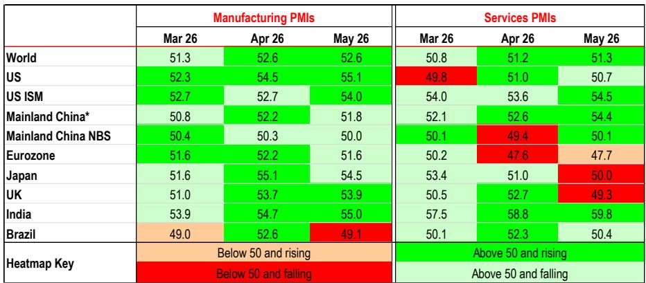
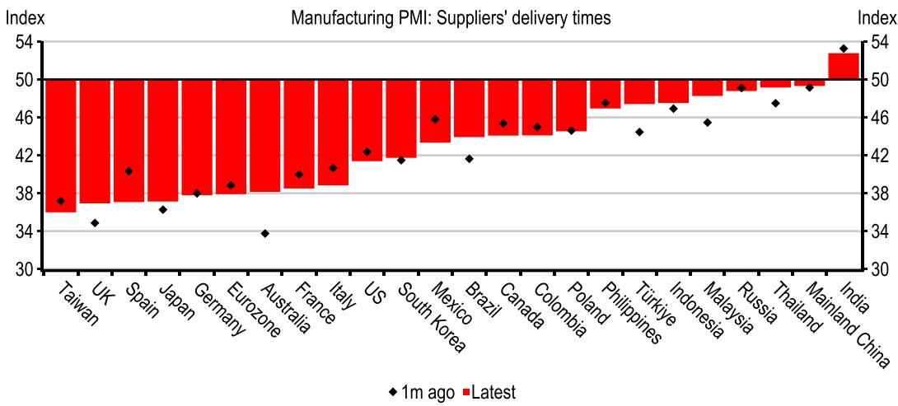

# The Global PMI Headline Is Misleading: Beneath the Surface, Supply Distortions and Cost Pressures Are Building a Fragile Recovery

The global composite PMI held steady at 51.8 in May, marking another month of expansion across both manufacturing and services. At first glance, this looks like reassurance: the global economy is growing, and the recovery is broad-based. But the headline number is concealing a more troubling story. The resilience we are seeing is not being driven by genuine demand strength. It is being propped up by two forces that are inherently unsustainable: longer supplier delivery times, which mechanically inflate the manufacturing index, and precautionary frontloading of orders as businesses brace for supply chain disruptions and rising costs.

This distinction matters more than most investors realize. A PMI reading that is artificially lifted by delivery-time distortions and inventory buildups does not signal the same economic health as one driven by organic new orders and robust employment. In fact, the current data pattern closely resembles the early stages of a cycle in which cost pressures eventually destroy demand. The global economy is not as strong as the headline suggests, and the composition of the numbers reveals vulnerabilities that could crystallize in the second half of the year.

The May data carries three critical implications for investors. First, the global inflation impulse is reaccelerating, with manufacturing input costs rising at the fastest pace since mid-2022. Second, the regional divergence is widening: the US appears to be strengthening, but much of that strength is tied to stockpiling, while the eurozone is already showing signs of demand erosion. Third, the services sector, long considered a buffer against manufacturing weakness, is now displaying its own fragility as higher costs begin to curb consumer spending. The PMI headline is a lagging signal of stress, not a leading indicator of strength.

## The Manufacturing Index Is Being Artificially Inflated by Delivery Time Distortions and Frontloading, Not by Genuine Demand

The global manufacturing PMI came in at 52.6 in May, unchanged from April and comfortably in expansionary territory. But this stability is deceptive. A significant portion of the index's strength comes from the suppliers' delivery times component, which, due to the PMI's construction methodology, rises when delivery times lengthen. In normal circumstances, longer delivery times signal strong demand that is straining capacity. In the current environment, they signal something else entirely: disruptions linked to Middle East tensions, rerouting of shipping, and anticipatory behavior by firms that expect conditions to worsen.

The data confirms this interpretation. The quantities of purchases index accelerated for a second consecutive month, consistent with firms frontloading inputs to hedge against potential shortages and price spikes. Stocks of purchases also rose. This is not demand-led growth; it is risk-management behavior. Companies are buying now because they fear that waiting will cost them more, both in terms of availability and price. The result is a temporary boost to production and new orders that looks healthy in the aggregate but is ultimately borrowing from future demand.

The distortion is not uniform across regions, but it is widespread enough to affect the global reading. In the United States, both the S&P Global and ISM manufacturing surveys showed solid gains in production and new orders, with respondents explicitly citing accelerated stockpiling as a driver. In Japan, India, Korea, and Vietnam, purchasing volumes also rose sharply, reflecting similar concerns over supply bottlenecks and rising input costs. The common thread is not a synchronized demand recovery; it is a synchronized response to a perceived supply shock.

The analytical danger is that investors and policymakers may interpret the headline PMI as evidence of economic momentum and adjust their portfolios or policy stances accordingly. That would be a mistake. When the headline is stripped of the delivery time component, the adjusted reading for several major economies falls significantly, and in the case of the eurozone, it would indicate contraction. The global economy is not as strong as the number suggests, and the risk of a downward correction when the frontloading cycle ends is material.

## Input Cost Inflation Is Reaccelerating Globally, and Incomplete Pass-Through Means Margins Are Being Squeezed, Not Demand Sustained

The May PMI data reveals a sharp and broad-based acceleration in manufacturing input costs. The global index for input prices rose to its highest level since June 2022, with the United States recording the sharpest increase in nearly four years. Respondents pointed to higher costs for petroleum products, steel, and freight. Similar trends were observed in France, Germany, Japan, the United Kingdom, and the Philippines. This is not a localized phenomenon; it is a global cost shock that is being transmitted through trade and supply chains.

The critical question is whether these cost increases are being passed through to final prices. The evidence suggests that pass-through remains incomplete in many economies. Output prices are rising, but not at the same pace as input costs. This implies a renewed margin squeeze for manufacturers, not a clean shift higher in final-goods pricing that would indicate strong pricing power. Companies are absorbing part of the cost increase, which will pressure profitability in the coming quarters.

For investors, this creates a two-sided risk. On the one hand, if cost pressures persist and companies eventually pass them through, final-goods inflation could reaccelerate, complicating central bank policy and potentially delaying rate cuts. On the other hand, if companies cannot pass through costs, margins will compress, and the eventual adjustment may come through reduced production and employment. The PMI employment data already hints at this outcome: despite the headline strength, manufacturing employment across several major economies remains subdued, and in some cases, is declining.

The frontloading dynamic adds another layer of complexity. Companies are placing orders now to get ahead of expected increases in output prices. This creates a temporary surge in demand that masks the underlying weakness. But once the frontloading is complete, and if cost pressures do not abate, the resulting demand vacuum could be sharp. The May data does not tell us when this tipping point will arrive, but it does tell us that the conditions for it are already in place.

## Regional Divergence Is Widening: US Strength Is Stockpile-Driven, While the Eurozone Is Already Losing Momentum

The May PMI data reinforces a pattern that has been emerging for several months: the US economy appears to be strengthening, while the eurozone is faltering. But the nature of that strength in the US warrants scrutiny. The ISM manufacturing index rose to 54.0, and the S&P Global index reached 55.1, both signaling robust expansion. Production rose to its highest level since April 2022. Yet much of this activity is tied to inventory buildup and frontloading, not to a sustainable increase in final demand.

Comments from survey respondents in the US pointed to accelerated stockpiling, particularly in anticipation of potential tariff increases later this year. There is evidence that US importers are bringing forward orders from Asia to get ahead of expected cost increases. This is a rational response to policy uncertainty, but it creates a distortion in the data. The US manufacturing sector is experiencing a sugar high, not a structural recovery.

In contrast, the eurozone is already showing signs of demand erosion. The region's headline manufacturing PMI remained above 50, but the composition is fragile. Germany and France, the two largest economies, both slowed. Respondents noted that Middle East-related disruptions are weighing on demand via higher costs, and new orders remain muted. When the delivery times component is removed from the eurozone index, the adjusted reading falls into contraction territory. The region's manufacturing sector is being held above water by a methodological artifact.

The implications for asset allocation are significant. Investors who rely on headline PMI data to gauge regional momentum may be overestimating the resilience of the US economy and underestimating the fragility of the eurozone. The US data is likely to soften once the frontloading cycle runs its course, while the eurozone may need more policy support than is currently anticipated. The divergence is real, but it is not as wide as the headline numbers suggest, and the direction of travel for both regions is toward slower growth.

## Services Sector Fragility Is Emerging as Higher Costs Begin to Curb Consumer Spending and Employment

The global services PMI remained in expansionary territory at 51.3 in May, but the underlying details are less reassuring. New orders expanded, partly due to clients frontloading purchases, but employment declined. This is a concerning combination. Rising activity accompanied by falling employment suggests that businesses are not confident enough in the sustainability of demand to add workers. They are meeting current orders with existing capacity, but they are not investing in future growth.

The regional pattern in services mirrors the manufacturing divergence. Asia and the US are holding up better than the eurozone and the United Kingdom. In India and mainland China, stronger new orders drove a faster pace of activity. In the US, the ISM services index accelerated to 54.5, supported by new orders, but the S&P Global index ticked down slightly, and employment fell sharply. The employment decline in the US services sector is particularly noteworthy, as it suggests that even in the relatively resilient American economy, businesses are cautious.

In Europe, the picture is more clearly negative. Higher cost pressures have started to curb demand in the services sector. In the United Kingdom, respondents pointed to subdued consumer spending in travel, tourism, and leisure. The eurozone services PMI remained in contraction territory at 47.7. This is not a temporary soft patch; it reflects a structural headwind from elevated costs that are eroding real household incomes.

The services sector has been a key source of resilience in the post-pandemic recovery, absorbing employment and supporting growth when manufacturing was weak. If services now begin to weaken, the global economy loses its main shock absorber. The May data suggests that this process is already underway, and it is likely to intensify if cost pressures persist. Investors should watch services employment and new orders closely in the coming months, as they will be leading indicators of whether demand destruction is spreading beyond manufacturing.

## What the Report Does Not Fully Answer: The Duration of the Frontloading Cycle and the Threshold for Demand Destruction

The May PMI data raises a question that the report cannot fully resolve: how long can the frontloading cycle sustain the headline numbers before demand destruction sets in? The report documents the phenomenon clearly—businesses are stockpiling inputs and bringing forward orders to hedge against supply disruptions and price increases. But it does not provide a framework for estimating when this behavior will peak or reverse.

The answer depends on several factors that are inherently uncertain. First, the trajectory of Middle East tensions and their impact on shipping routes and energy prices. A swift de-escalation would ease supply chain constraints and reduce the incentive for frontloading. But the conflict has already run for more than three months, and even if conditions improve, normalization in supply chains and PMIs would take time. Second, the scale and timing of US tariff increases. If tariffs are implemented as expected later this year, the frontloading impulse could persist for several more months. But once tariffs are in place, the demand boost from preemptive ordering will dissipate, and the negative impact of higher costs on end-demand will become more visible.

The report also leaves open the question of what level of cost pressure triggers meaningful demand destruction. Input costs are rising at the fastest pace in years, but the pass-through to final prices is incomplete. At some point, companies will have to raise prices or absorb the margin compression. If they raise prices, consumer demand may weaken. If they absorb costs, profitability will suffer, and investment and employment will adjust. The May data does not tell us which path the economy will take, but it does tell us that the current configuration is unstable.

For investors, these open questions are not a reason to ignore the data. They are a reason to build scenarios. The base case should be that the frontloading cycle continues for another one to two quarters, supporting headline PMI readings, but that the underlying fragility will become more apparent in the second half of the year. The risk case is that cost pressures accelerate further, triggering an earlier and sharper demand correction. The opportunity case is that supply chains normalize faster than expected, allowing the economy to transition to genuine demand-led growth. Each scenario has different implications for asset allocation, and the May data provides the evidence to calibrate probabilities.

## A Decision Framework for Investors: How to Read PMI Data When the Headline Is Distorted

The May PMI data reinforces a lesson that every investor should internalize: in an environment of supply shocks and policy uncertainty, the headline index is not a reliable signal. To make informed decisions, investors need to decompose the PMI into its components and focus on the parts that reveal genuine demand conditions rather than temporary distortions.

The first step is to isolate the delivery times component. When delivery times lengthen due to disruptions rather than demand, they inflate the headline index. Investors should calculate or request an adjusted PMI that excludes this component. If the adjusted reading is significantly lower than the headline, the economy is weaker than it appears. The report provides evidence that this adjustment matters: for the eurozone, the headline remains above 50, but the adjusted reading falls into contraction.

The second step is to focus on employment and new orders, not the headline. Employment is a lagging indicator, but it is also a reflection of business confidence. If employment is falling while production is rising, as we see in several economies in May, it suggests that businesses do not believe the current activity level is sustainable. New orders are a leading indicator, but they need to be assessed for signs of frontloading. If new orders are rising while export orders are flat or falling, the strength may be domestic and precautionary rather than export-led and demand-driven.

The third step is to track input costs and output prices separately. The gap between them is a measure of margin pressure. When input costs rise faster than output prices, margins are being squeezed, and the adjustment will eventually come through lower production or higher final prices. Investors should monitor this gap as a leading indicator of earnings risk in manufacturing and related sectors.

The fourth step is to compare manufacturing and services. If both are weakening, the economy is in a synchronized slowdown. If one is weakening and the other is holding up, the economy may be in a rotation rather than a downturn. In May, both sectors are showing signs of fragility, but the weakness is more pronounced in services in Europe and more disguised by frontloading in US manufacturing. The combination is not reassuring.

Finally, investors should pay attention to regional divergence. The US and Asia are showing more resilience than Europe, but the nature of that resilience matters. In the US, it is tied to stockpiling and tariff anticipation. In Asia, it is tied to precautionary buying and strong domestic demand in India and China. The European weakness is more structural, reflecting higher energy costs and weaker consumer confidence. A diversified portfolio should reflect these differences, but with the recognition that the US strength may prove temporary.

## Join the Community to Read the Full Report and Review the Original Charts

The May PMI data offers a window into an economy that is growing, but not in the way the headline suggests. The distortions from delivery times, frontloading, and cost pressures are significant, and they will not persist indefinitely. Understanding how to read through these distortions is essential for making informed investment decisions in the current environment. The full report contains detailed charts on manufacturing and services PMIs across major economies, input cost and output price trends, delivery time adjustments, and employment data that provide the granularity needed to assess regional and sectoral risks. Join the community to read the full report and review the original charts.

*This article is for learning and discussion only and does not constitute investment advice.*

Personal reading notes and learning share only. Not investment advice.

