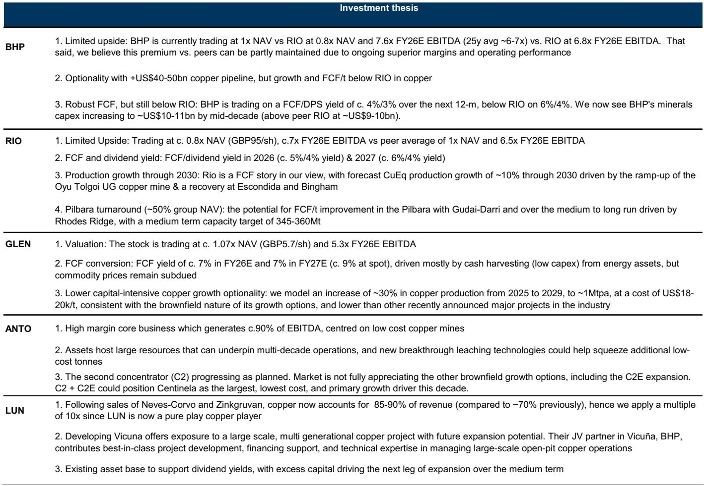
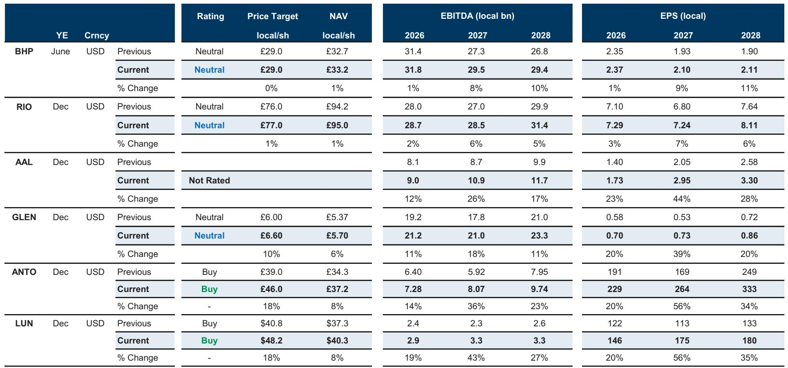
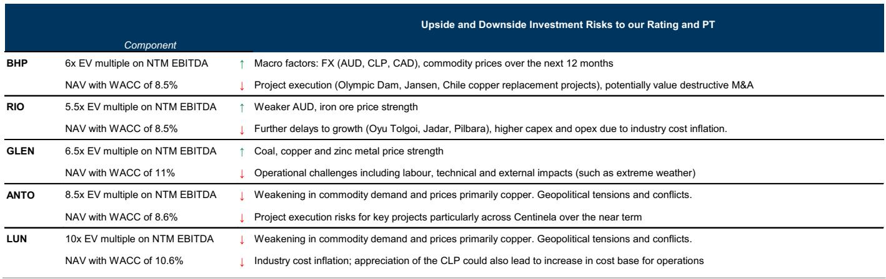

# Copper's New Geography: Why the Next Price Surge Will Be Driven by Ex-US Scarcity, Not Global Demand

The copper market is undergoing a structural transformation that most investors have not yet priced in. The conventional narrative holds that copper prices are determined by the balance of global industrial demand and mine supply, with China as the dominant marginal consumer. That framework is becoming obsolete. A global investment bank's latest analysis reveals that the most powerful force shaping copper prices over the next 18 months is not demand growth, but rather a deliberate, policy-driven re-routing of physical copper flows into the United States, creating an unprecedented scarcity outside America. This is not a cyclical uptick. It is a tectonic shift in how the copper market operates, and it demands a fundamental reassessment of how investors should position themselves.

The core thesis is deceptively simple yet strategically profound. The ex-US copper market is heading toward material deficits of roughly 640,000 tonnes in 2026 and 170,000 tonnes in 2027. These deficits are not the result of surging consumption. They are being engineered by two converging forces: a significant downward revision to global mine supply expectations, and the gravitational pull of US import demand ahead of anticipated tariff implementation. The London Metal Exchange price, which remains the global benchmark, is set in this tightening ex-US market. As the rest of the world becomes structurally short copper, the LME price must rise to ration increasingly scarce supply.

The implications for equity investors are equally profound. The report identifies a clear preference for pure-play copper names that offer leveraged exposure to this tightening dynamic, specifically Lundin Mining and Antofagasta, both rated Buy. These companies possess operational leverage, growth catalysts, and valuation discounts that make them asymmetric bets on the emerging scarcity regime. But the strategic insight goes deeper than stock picking. It raises fundamental questions about portfolio construction, commodity exposure, and the role of geopolitical risk in resource investing that every serious institutional investor must now confront.

## The Mine Supply Story Is Worse Than the Market Believes, and Scrap Cannot Fill the Gap

The most consequential finding in the report is the downward revision to global mine supply, which has been reduced by approximately 350,000 tonnes, or roughly 1.5 percent of global mine supply, for both 2026 and 2027. This is not a minor adjustment. It represents a structural impairment to the industry's ability to deliver new copper into a market that is already finely balanced. The primary drivers are slower-than-expected recoveries at two of the world's largest copper operations: Grasberg in Indonesia and Kamoa-Kakula in the Democratic Republic of Congo. Full recovery at these assets is now not expected until 2028.

The market has a tendency to assume that supply shortfalls are temporary and that secondary sources will compensate. That assumption is dangerous here. The report explicitly notes that scrap supply is not offsetting refined tightness, primarily due to weaker domestic availability in China. This is a critical insight. China has historically been the world's largest consumer of copper scrap, and any disruption to its domestic scrap collection and processing chain has global repercussions. The combination of reduced primary mine supply and constrained secondary supply creates a double bind for the ex-US market. There are simply fewer sources of copper available to meet demand, and the traditional buffers that have absorbed shocks in prior cycles are no longer functioning.

The so-what for investors is clear. The supply-side narrative has been one of the most persistent bullish arguments for copper over the past decade, yet it has repeatedly been undermined by project delays, cost overruns, and operational disruptions. This time, the downgrade is concentrated in assets that are genuinely irreplaceable in the near term. Grasberg and Kamoa-Kakula are not marginal producers. They are cornerstone operations that collectively represent a meaningful share of global output. Their delayed recovery is not a temporary hiccup. It is a structural reduction in the industry's capacity to deliver copper into a market that is about to face a demand-side shock from US tariff policy.

## US Tariff Policy Is Reshaping Global Copper Flows, and the Market Has Not Priced the Full Effect

The most powerful near-term catalyst for copper prices is not a mine shutdown or a Chinese stimulus package. It is the expected outcome of US tariff policy, which the report identifies as imminent within the current month. The mechanism is straightforward but its effects are far-reaching. If the United States introduces a tariff on copper imports in January 2027, the rational response for traders and consumers is to pull forward imports into the second half of 2026, before the tariff takes effect. This front-loading of US demand will drain copper from the ex-US system, exacerbating the existing deficit and pushing LME prices potentially above $14,000 per tonne in the second half of 2026.

The numbers are striking. US inventories are expected to build by approximately 900,000 tonnes in 2026, up from a previous estimate of 550,000 tonnes, reaching around 1.8 million tonnes by year end. To put that in perspective, US inventories stood at roughly 100,000 tonnes at the beginning of 2025. The scale of this inventory build is unprecedented and represents a massive withdrawal of physical copper from the global trading system. The ex-US market, which is where the LME price is determined, will bear the full weight of this withdrawal.

The report's scenario analysis is instructive. Under a tariff introduction scenario, prices could surge above $14,000 per tonne before easing in 2027 as trade flows normalize. If no news is announced on tariffs, prices could remain supported around current levels, given the underlying ex-US tightness and positioning. But the truly revealing scenario is the third one: a definitive "no tariff" outcome. In that case, the ex-US deficit would be substantially reduced, and the market could flip back into surplus in 2027, weighing on prices toward approximately $12,800 per tonne, which the report identifies as the fundamental fair value for copper.

This asymmetry is crucial. The downside risk to copper prices from a benign tariff outcome is limited to about $12,800 per tonne, while the upside from a tariff-driven tightening could push prices significantly higher. The risk-reward profile for copper exposure is therefore skewed to the upside, provided the investor is positioned in the right names and understands the timeline.

## Pure-Play Copper Exposure Is the Most Efficient Way to Capture This Thesis, and Two Names Stand Out

The report's stock-level analysis reinforces the strategic argument for concentrated copper exposure. Among the names covered, Lundin Mining and Antofagasta are the clear preferences, both rated Buy. The rationale for each is distinct but complementary, and together they illustrate the spectrum of opportunities available to investors who want to act on the ex-US tightness thesis.

Lundin Mining offers what the report describes as relative valuation appeal, trading at approximately 1 times price-to-net asset value, compared to peers at 1.5 to 2 times. This discount is striking for a company that has transformed itself into one of the purest copper plays in the sector, with copper revenue now representing 85 percent of total revenue, up from roughly 70 percent following the divestment of its zinc assets. The company has demonstrated strong operational performance through continued production and cost discipline, and it has a clear growth catalyst ahead in the form of the Vicuna project, which is expected to receive regulatory approval and a final investment decision in late 2026.

The strategic logic for owning Lundin Mining is straightforward. It offers leveraged exposure to the copper price without the conglomerate discount that weighs on diversified miners. Its valuation discount to NAV suggests that the market is not fully pricing in the value of its growth pipeline or the structural improvement in its earnings quality. If the copper price thesis plays out as the report suggests, Lundin Mining is likely to re-rate significantly as earnings momentum accelerates and the market recognizes its scarcity value as a pure-play copper producer.

Antofagasta presents a different but equally compelling case. The report emphasizes its copper-gold leverage and scarcity premium, noting that it stands out as one of the few scalable, pure European copper-gold equities. This scarcity is important because it positions Antofagasta to capture the copper equity premium as investors seek targeted exposure to the commodity. The company has proven execution and credible medium-term growth targets, anchored by its Centinela and Pelambres operations, which together account for roughly 80 percent of current output and are expected to drive approximately 95 percent of production growth this decade.

The key catalyst for Antofagasta is the Centinela expansion, specifically the second concentrator, which is progressing as planned. The report argues that the market is not fully appreciating the other brownfield growth options, including the C2E expansion. The combined C2 and C2E expansions could position Centinela as the largest, lowest-cost, and primary growth driver for the company this decade. This is a classic case of optionality that the market is undervaluing, and it creates a favorable entry point for investors who believe the copper price thesis has further to run.

## What the Report Does Not Fully Answer: The China Demand Puzzle and the Durability of the Scarcity Premium

For all its analytical rigor, the report leaves several meaningful questions unanswered, and these gaps are precisely where the most interesting strategic debates will unfold. The most significant unresolved question concerns the trajectory of Chinese copper demand. The report's analysis is focused on supply constraints and trade flow distortions, but it does not provide a detailed assessment of how Chinese demand might evolve over the forecast period. This is a critical omission because China remains the world's largest copper consumer, and any unexpected weakness or strength in Chinese demand could materially alter the ex-US balance.

The second unresolved question is the durability of the scarcity premium once the tariff-driven trade flows normalize. The report suggests that prices could ease in 2027 as flows normalize, but it does not fully explore what happens to the ex-US deficit in 2028 and beyond. If mine supply recovers as expected at Grasberg and Kamoa-Kakula, and if US inventories are eventually drawn down, the market could revert to surplus conditions more quickly than the current forecasts imply. Investors need to understand whether the scarcity premium is a cyclical phenomenon driven by policy, or a structural feature of the market driven by long-term underinvestment in mine supply.

The third question is about the behavior of the diversified miners. The report covers names like BHP, Rio Tinto, and Glencore, but it rates them Neutral or Not Rated, suggesting that the analysts see limited upside from current levels. This raises an important portfolio construction question. If the copper thesis is as compelling as the report suggests, why are the diversified miners not more attractive? The answer likely lies in their exposure to other commodities, their higher valuation multiples, and their larger capital expenditure requirements. But for investors who want copper exposure without the single-stock risk of a pure play, the diversified miners may still offer a viable, if less efficient, alternative.

## A Decision Framework for Investors: How to Position for the Ex-US Tightness Regime

The report's insights can be translated into a practical decision framework for institutional investors. The framework has three dimensions: timing, instrument selection, and risk management.

On timing, the critical inflection point is the tariff announcement expected within the current month. Investors should be positioned before this announcement, not after. The asymmetry of outcomes favors being long copper exposure, because the downside from a benign outcome is limited to fair value, while the upside from a tariff-driven tightening is substantial. The second half of 2026 is the period of maximum tension, when US imports are likely to peak and the ex-US deficit is widest. Investors should plan to hold positions through this period and reassess as 2027 approaches.

On instrument selection, the report's analysis supports a preference for pure-play copper equities over diversified miners or commodity futures. The leverage to the copper price is higher, the valuation discounts are more attractive, and the growth catalysts are more clearly defined. Lundin Mining and Antofagasta are the most direct ways to express this view, but investors should also consider the broader universe of copper-exposed equities to ensure adequate diversification.

On risk management, the most important consideration is the tariff outcome. A definitive "no tariff" decision would undermine the thesis and require a reassessment of positions. Investors should establish clear exit criteria based on the tariff announcement and be prepared to reduce exposure if the benign scenario materializes. Conversely, if tariffs are introduced, the thesis strengthens, and investors should consider adding to positions, particularly if the initial market reaction is muted.

## The Full Picture Requires Deeper Analysis

The analysis presented here captures the core strategic argument of the report, but it is necessarily a synthesis. The full report contains detailed financial models, valuation methodologies, sensitivity analyses, and risk assessments that are essential for any investor considering a position in copper equities. The original charts and exhibits provide a level of granularity that cannot be replicated in summary form.

Join the community to read the full report and review the original charts.

*This article is for learning and discussion only and does not constitute investment advice.*

Personal reading notes and learning share only. Not investment advice.

