# Investor Presentation | Asia Pacific

# Asia Summer School: Asia/EM Equity Strategy – Integrating Near-Term Views and Longer-Term Themes

We outline key trends across earnings, valuations, positioning and market thematics, helping investors take stock of an extraordinary 1H 2026 and look ahead to potential opportunities in 2H and beyond

MS ASIA (SINGAPORE) PTE.+

# Jonathan F Garner

Equity Strategist

Jonathan.Garner@morganstanley.com +65 6834-8172

# Daniel K Blake

Equity Strategist

Daniel.Blake@morganstanley.com +65 6834-6597

# Kristal Ji

Equity Strategist

Kristal.Ji@morganstanley.com +65 6834-6949

MS ASIA LIMITED+

# Laura Wang

Equity Strategist

Laura.Wang@morganstanley.com +852 2848-6853

MS MUFG SECURITIES CO., LTD.+

# Sho Nakazawa

Equity Strategist

Sho.Nakazawa@morganstanleymufg.com +81 3 6836-8926

Asia Summer School 2026

MS does and seeks to do business with companies covered in MS. As a result, investors should be aware that the firm may have a conflict of interest that could affect the objectivity of MS. Investors should consider MS as only a single factor in making their investment decision.

# For analyst certification and other important disclosures, refer to the Disclosure Section, located at the end of this report.

+= Analysts employed by non-U.S. affiliates are not registered with FINRA, may not be associated persons of the member and may not be subject to FINRA restrictions on communications with a subject company, public appearances and trading securities held by a research analyst account.

# Asia Summer School 2026

# MS

# Higher Targets at Mid-Year – Still Seeking a Robust Approach for an Uncertain World

• We view the current environment as exceptionally uncertain due to the combined effect of the global energy shock and impact of AI capex and disruption. We continue to set unusually wide bear to bull target price spreads.   
- Our Focus Lists are geared to core MS research themes and are centered on a preference for Goods over Services and concentrated in Energy, Materials, Industrials and Semis / Memory. We are negative on Autos, Consumer & IT services including E-commerce, and downstream industries impacted by higher commodity prices.   
- Japan has broader estimate revisions than EM with multiple sectors/stocks exposed to core MS themes and leveraged to PM Takaichi's agenda. We would invest on an unhedged basis anticipating moderate Yen strength.   
• We are constructive on North Asia versus South Asia & Australia, prefer Brazil versus the rest of Latin America, and prefer Greece, Hungary & Saudi Arabia versus the rest of EEMEA.   
- In general, we view the rally in EM as cyclical rather than the start of a new secular bull market. Multipolar World trends are also seeing dispersion in country development strategies.   
- China remains in deflation with weak aggregate earnings revisions due to continued deflationary forces and AI disruption. We prefer A-shares to H-shares and emphasize capex over consumption.

# MS

# Asia's Competitive Reinvention – MS's Core Themes Are Driving Transformation and Thematic Opportunity

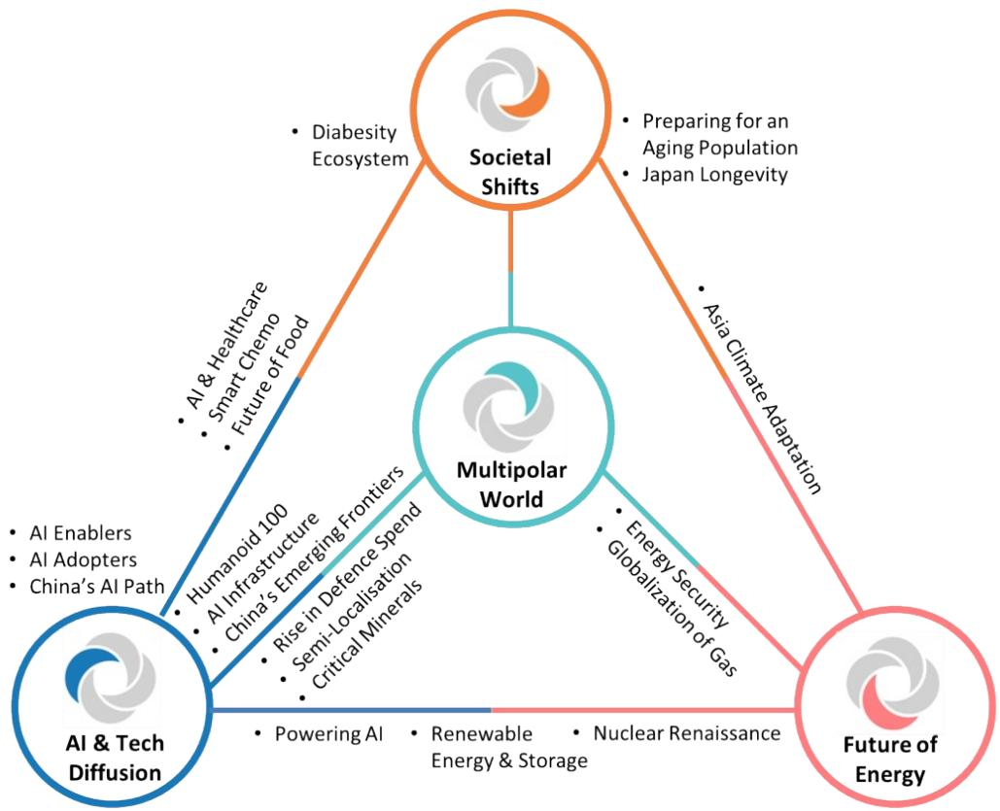

flowchart

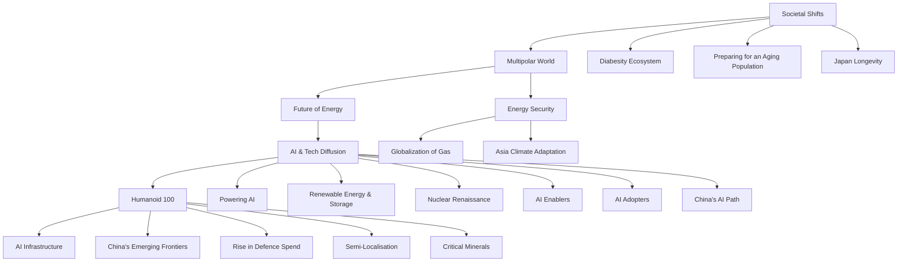
```mermaid
graph TD
    A["Societal Shifts"] --> B["Multipolar World"]
    B --> C["Future of Energy"]
    C --> D["AI & Tech Diffusion"]
    D --> E["Humanoid 100"]
    E --> F["AI Infrastructure"]
    E --> G["China's Emerging Frontiers"]
    E --> H["Rise in Defence Spend"]
    E --> I["Semi-Localisation"]
    E --> J["Critical Minerals"]
    B --> K["Energy Security"]
    K --> L["Globalization of Gas"]
    K --> M["Asia Climate Adaptation"]
    D --> N["Powering AI"]
    D --> O["Renewable Energy & Storage"]
    D --> P["Nuclear Renaissance"]
    A --> Q["Diabesity Ecosystem"]
    A --> R["Preparing for an Aging Population"]
    A --> S["Japan Longevity"]
    D --> T["AI Enablers"]
    D --> U["AI Adopters"]
    D --> V["China's AI Path"]
```

# Asia's Capital Market and Governance Reforms

• Japan ROE & Productivity Journey

• China Anti-Involution Initiative

• New India and IndiaStack

• Korea Reform Renaissance

• Singapore Capital Market Reforms

• Asia Financial Acceleration

# MS

Global Equities Industry Group Performance Year to Date – Major Dispersion in Performance Between Goods & Services Producing Firms   
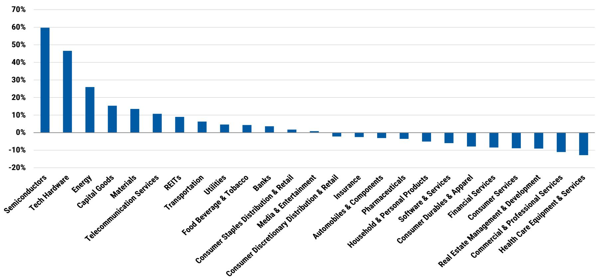

bar

| Industry | Value (%) |
| :--- | :--- |
| Semiconductors | 60 |
| Tech Hardware | 47 |
| Energy | 26 |
| Capital Goods | 15 |
| Materials | 13 |
| Telecommunication Services | 11 |
| REITs | 9 |
| Transportation | 6 |
| Utilities | 4 |
| Food Beverage & Tobacco | 4 |
| Banks | 3 |
| Consumer Staples Distribution & Retail | 1.5 |
| Media & Entertainment | 0.5 |
| Consumer Discretionary Distribution & Retail | -1.5 |
| Insurance | -2 |
| Automobiles & Components | -2.5 |
| Pharmaceuticals | -3 |
| Household & Personal Products | -4 |
| Software & Services | -5 |
| Consumer Durables & Apparel | -7 |
| Financial Services | -8 |
| Consumer Services | -9 |
| Real Estate Management & Development | -9 |
| Commercial & Professional Services | -10 |
| Health Care Equipment & Services | -14 |

Source: Bloomberg, MS. Note: Data as of Jun 2, 2026. \*Universe is MSCI All Country World index.

# MSCI Index Breakdown by Economic Exposure – Thematic Forces Driving Major Shifts

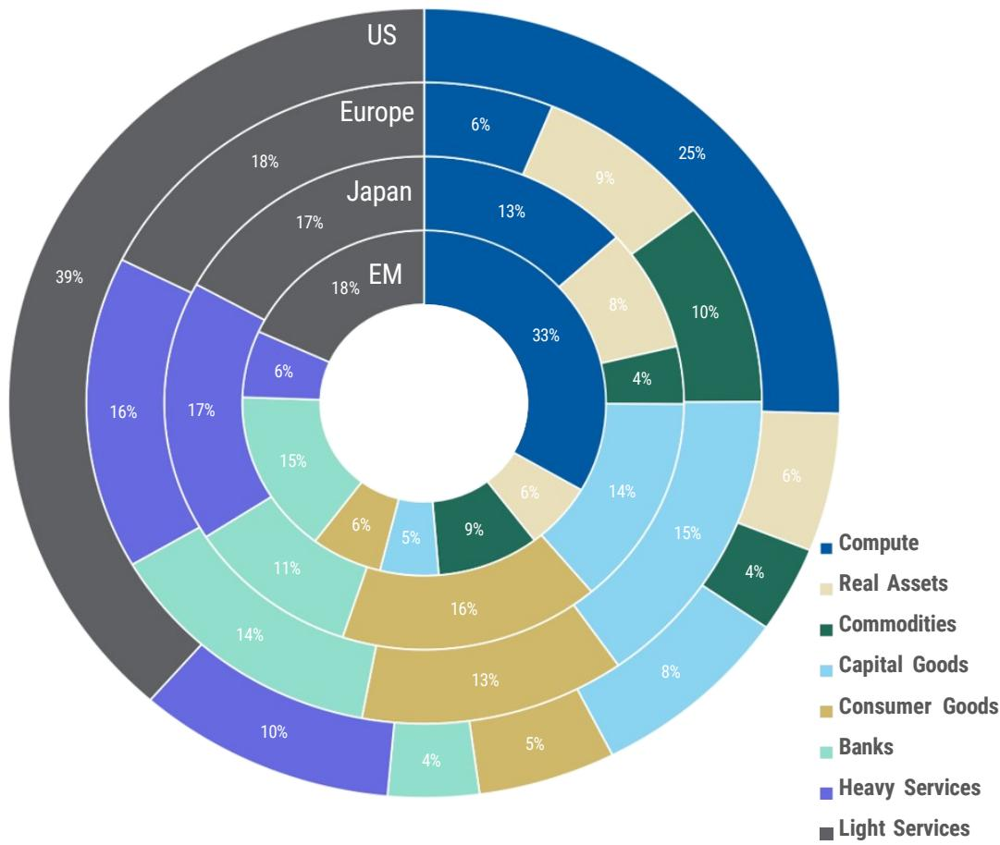

pie

| Region | Segment 1 (%) | Segment 2 (%) | Segment 3 (%) | Segment 4 (%) | Segment 5 (%) | Segment 6 (%) | Segment 7 (%) | Segment 8 (%) | Segment 9 (%) | Segment 10 (%) |
| :--- | :--- | :--- | :--- | :--- | :--- | :--- | :--- | :--- | :--- | :--- |
| US | 6 | 25 | 13 | 9 | 4 | 4 | 5 | 6 | 16 | 17 |
| Europe | 25 | 18 | 17 | 10 | 8 | 6 | 9 | 10 | 14 | 15 |
| Japan | 13 | 17 | 17 | 10 | 8 | 6 | 9 | 10 | 13 | 14 |
| EM | 33 | 18 | 18 | 10 | 8 | 6 | 9 | 10 | 14 | 15 |
The chart displays the proportional distribution of these categories within a ring divided into three parts (top, middle, bottom). The legend identifies each segment by color and represents the category (Compute, Real Assets, Commodities, Capital Goods, Consumer Goods, Banks, Heavy Services, Light Services). The values in parentheses are explicitly labeled on the segments.

Source: Factset, MS Data as of April 2026.

Thematic forces are driving major shifts across the underlying economic exposure of companies, driving index shifts.

Our Economic Exposure breakdown highlights the following relative concentrations:

<table><tr><td>Region</td><td>Skewed to</td><td>Less Exposed to</td></tr><tr><td>US</td><td>Compute, Light Services</td><td>Banks</td></tr><tr><td>Europe</td><td>Commodities, Cap Goods, Heavy Services</td><td>Compute</td></tr><tr><td>Japan</td><td>Cap Goods, Heavy Services, Consumer Gds</td><td>-</td></tr><tr><td>EM</td><td>Compute, Commodities</td><td>Capital Goods, Light Services</td></tr></table>

# MS

Thematics Driving MSCI EM Shifts in Index Weight – Taiwan & Korea > China & India   
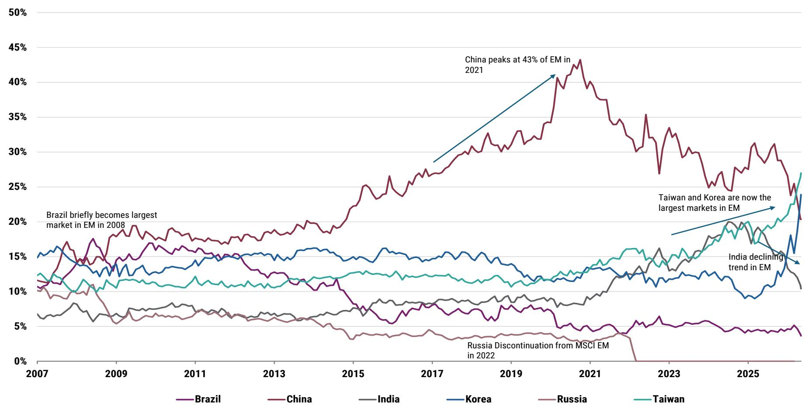  
Source: Factset, MS Data as of June 3, 2026.

# MS

Top 5 industry groups' contribution to MSCI EM index weight historically – Heavily skewed to Semis/Tech Hardware and Financials   
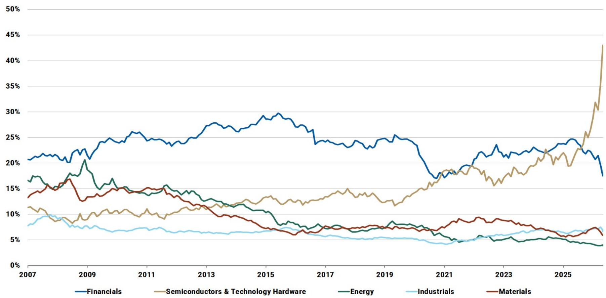

line

| Year | Financials | Semiconductors & Technology Hardware | Energy | Industrials | Materials |
|------|------------|-------------------------------------|--------|-------------|---------|
| 2007 | 21%        | 11%                                 | 17%    | 8%          | 13%     |
| 2009 | 24%        | 10%                                 | 20%    | 7%          | 16%     |
| 2011 | 26%        | 11%                                 | 15%    | 7%          | 15%     |
| 2013 | 28%        | 12%                                 | 13%    | 6%          | 12%     |
| 2015 | 30%        | 13%                                 | 10%    | 6%          | 8%      |
| 2017 | 24%        | 14%                                 | 8%     | 5%          | 7%      |
| 2019 | 25%        | 15%                                 | 8%     | 5%          | 7%      |
| 2021 | 18%        | 18%                                 | 5%     | 4%          | 8%      |
| 2023 | 23%        | 20%                                 | 5%     | 6%          | 9%      |
| 2025 | 24%        | 25%                                 | 4%     | 7%          | 6%      |
| 2027 | 18%        | 43%                                 | 4%     | 7%          | 7%      |

Source: Factset, MS Data as of 2 June, 2026.

# MS

Consensus 12-month Forward P/E by Region   
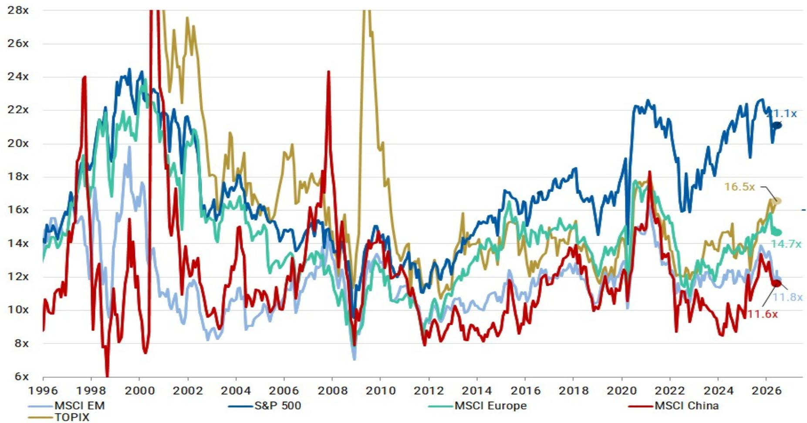

line

| Year | MSCI EM | S&P 500 | MSCI Europe | TOPIX |
|------|---------|---------|-------------|-------|
| 2026 | 11.8x   | 16.5x   | 14.7x       | 11.6x |

Source: IBES, MSCI, FactSet, MS. Note: Data as of May 29, 2026.

# MS

# Consensus EPS Forecast History— Japan Has Delivered Consistent Upgrades; MSCI EM Has Seen Significant Upgrades, Driven by Korea & Taiwan

MSCI EM   
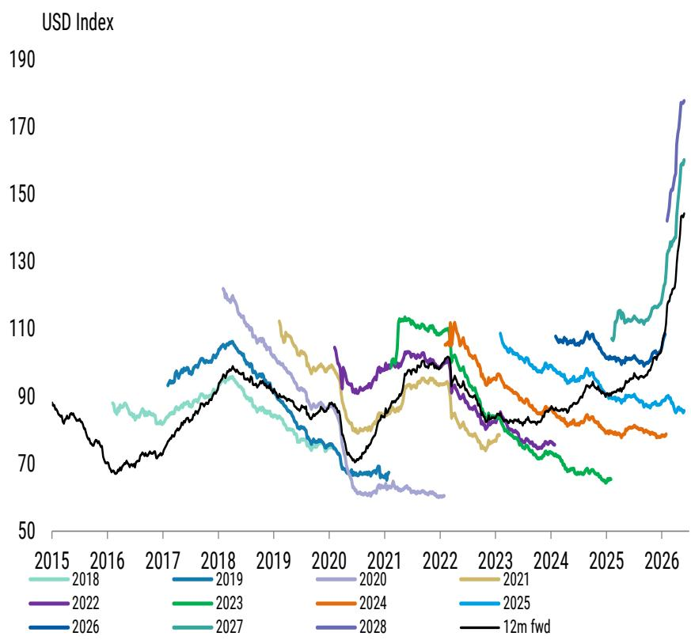

TOPIX   
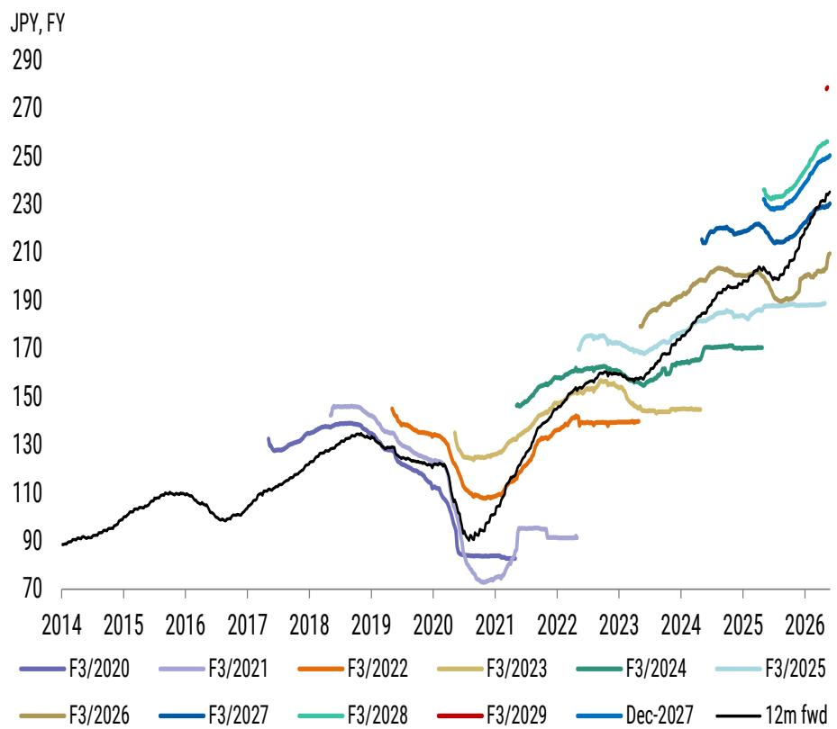

line

| Year | F3/2020 | F3/2021 | F3/2022 | F3/2023 | F3/2024 | F3/2025 | F3/2026 | F3/2027 | F3/2028 | F3/2029 | Dec-2027 | 12m fwd |
|------|---------|---------|---------|---------|---------|---------|---------|---------|---------|---------|----------|---------|
| 2014 |         |         |         |         |         |         |         |         |         |         |          | 90      |
| 2015 |         |         |         |         |         |         |         |         |         |         |          | 100     |
| 2016 |         |         |         |         |         |         |         |         |         |         |          | 110     |
| 2017 |         |         |         |         |         |         |         |         |         |         |          | 105     |
| 2018 | 130     | 145     | 140     | 135     | 130     | 135     | 130     | 135     | 135     | 135     |          | 125     |
| 2019 | 135     | 140     | 145     | 140     | 135     | 140     | 135     | 140     | 140     | 140     |          | 130     |
| 2020 | 110     | 115     | 115     | 115     | 115     | 120     | 115     | 120     | 120     | 120     |          | 115     |
| 2021 | 85      | 75      | 105     | 135     | 145     | 155     | 145     | 155     | 155     | 155     |          | 90      |
| 2022 |         |         |         |         |         |         |         |         |         |         |          | 140     |
| 2023 |         |         |         |         |         |         |         |         |         |         |          | 160     |
| 2024 |         |         |         |         |         |         |         |         |         |         |          | 170     |
| 2025 |         |         |         |         |         |         |         |         |         |         |          | 185     |
| 2026*|         |         |         |         |         |         |         |         |         |       275    |          |        |
| Final Point (JPY, FY) - F3/2026 - Dec-2027 - F3/2028 - F3/2029 - F3/2026 - F3/2027 - F3/2028 - F3/2029 - F3/2026 - F3/2027 - F3/2028 - F3/2029 - F3/2026 - F3/2027 - F3/2028 - F3/2029 - F3/2026 - F3/2028 - F3/2027 - F3/2028 - F3/2029 - F3/2026 - F3/2027 - F3/2028 - F3/2029 - F3/2026 - F3/2027 - F3/2028 - F3/2029 - F3/2026 - F3 /            |
| Final Point (JPY, FY) - F3/2026 - Dec-2027 - F3/2027 - F3/2028 - F3/2029 - F3/2026 - F3/2027 - F3/2028 - F3/2029 - F3/2026 - F3/2027 - F3/2028 - F3/2029 - F3/2026 - F3f            |

Source: IBES consensus, Datastream, MS. Note: Weekly data as of May 28, 2026.

# MS

Earnings Revision Breadth Positive for Japan and EM, Slipping for China   
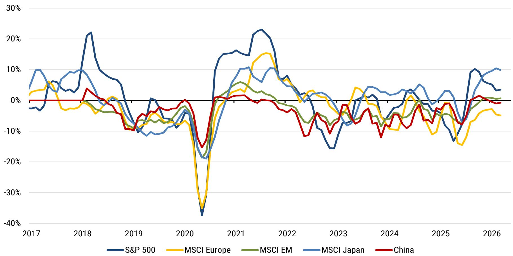

line

| Year | S&P 500 | MSCI Europe | MSCI EM | MSCI Japan | China |
|------|---------|-------------|---------|------------|-------|
| 2017 | -2%     | 2%          | 1%      | 10%        | 0%    |
| 2018 | 22%     | -5%         | -2%     | 9%         | 3%    |
| 2019 | -10%    | -8%         | -7%     | -12%       | -10%  |
| 2020 | -5%     | -15%        | -18%    | -18%       | -15%  |
| 2021 | 15%     | 15%         | 5%      | 10%        | 1%    |
| 2022 | 7%      | 7%          | -5%     | 5%         | -5%   |
| 2023 | -15%    | -5%         | -10%    | -10%       | -10%  |
| 2024 | -5%     | -10%        | -5%     | -5%        | -15%  |
| 2025 | -10%    | -15%        | -5%     | -5%        | -5%   |
| 2026 | 3%      | -5%         | 0%      | 10%        | -2%   |

Source: FactSet, IBES consensus, MS. Monthly data as of May 2026. Note: Earnings revision breadth is calculated using the 3-month moving average of upgrades less downgrades divided by the total universe of forward earnings estimates.

Asia and EM Market Estimate Revisions Breadth (3mma) and Consensus EPS Growth 

<table><tr><td rowspan="2"></td><td colspan="17">MSCI Asia/EM Market Breakdown 12mf 3MMA Earnings Revisions Breadth</td><td colspan="3">EPS Growth</td></tr><tr><td>Jan-25</td><td>Feb-25</td><td>Mar-25</td><td>Apr-25</td><td>May-25</td><td>Jun-25</td><td>Jul-25</td><td>Aug-25</td><td>Sep-25</td><td>Oct-25</td><td>Nov-25</td><td>Dec-25</td><td>Jan-26</td><td>Feb-26</td><td>Mar-26</td><td>Apr-26</td><td>May-26</td><td>CY2026E</td><td>CY2027E</td><td>CY2028E</td></tr><tr><td>MSCI Japan</td><td>1.2%</td><td>3.1%</td><td>3.1%</td><td>1.1%</td><td>-4.0%</td><td>-7.1%</td><td>-6.0%</td><td>-1.6%</td><td>3.3%</td><td>5.7%</td><td>8.2%</td><td>9.0%</td><td>9.6%</td><td>10.4%</td><td>9.9%</td><td>8.4%</td><td>5.5%</td><td>9.9%</td><td>11.7%</td><td>11.0%</td></tr><tr><td>MSCI EM</td><td>-5.1%</td><td>-4.3%</td><td>-4.6%</td><td>-6.0%</td><td>-6.9%</td><td>-7.4%</td><td>-5.6%</td><td>-2.8%</td><td>-1.8%</td><td>-0.6%</td><td>0.7%</td><td>0.9%</td><td>0.8%</td><td>0.5%</td><td>0.7%</td><td>-1.3%</td><td>-1.8%</td><td>56.2%</td><td>19.7%</td><td>10.9%</td></tr><tr><td>MSCI APxJ</td><td>-4.9%</td><td>-4.3%</td><td>-4.5%</td><td>-6.3%</td><td>-7.3%</td><td>-8.1%</td><td>-6.0%</td><td>-3.2%</td><td>-2.0%</td><td>-0.8%</td><td>0.6%</td><td>0.7%</td><td>0.6%</td><td>0.5%</td><td>1.0%</td><td>-0.9%</td><td>-1.6%</td><td>56.5%</td><td>20.1%</td><td>11.0%</td></tr><tr><td>Australia</td><td>-0.2%</td><td>0.1%</td><td>-2.5%</td><td>-5.8%</td><td>-8.4%</td><td>-10.3%</td><td>-10.3%</td><td>-8.2%</td><td>-6.7%</td><td>-1.1%</td><td>-0.3%</td><td>1.6%</td><td>-2.3%</td><td>1.6%</td><td>2.4%</td><td>3.6%</td><td>-4.6%</td><td>-1.1%</td><td>9.5%</td><td>6.5%</td></tr><tr><td>China</td><td>-3.0%</td><td>-1.1%</td><td>-1.0%</td><td>-3.5%</td><td>-7.2%</td><td>-7.8%</td><td>-5.1%</td><td>0.1%</td><td>0.8%</td><td>1.6%</td><td>0.7%</td><td>0.1%</td><td>-0.5%</td><td>-1.0%</td><td>-0.8%</td><td>-3.7%</td><td>-4.8%</td><td>13.6%</td><td>15.0%</td><td>13.7%</td></tr><tr><td>Hong Kong</td><td>0.8%</td><td>-4.2%</td><td>-4.7%</td><td>-5.5%</td><td>-4.6%</td><td>-1.6%</td><td>3.1%</td><td>3.5%</td><td>3.8%</td><td>1.0%</td><td>5.5%</td><td>1.0%</td><td>3.7%</td><td>1.2%</td><td>4.3%</td><td>2.2%</td><td>1.4%</td><td>16.4%</td><td>5.3%</td><td>8.4%</td></tr><tr><td>India</td><td>-11.2%</td><td>-12.1%</td><td>-11.8%</td><td>-13.3%</td><td>-8.8%</td><td>-10.6%</td><td>-7.8%</td><td>-8.2%</td><td>-6.1%</td><td>-5.2%</td><td>-1.7%</td><td>-1.5%</td><td>-0.7%</td><td>-1.1%</td><td>-1.5%</td><td>-3.9%</td><td>-6.0%</td><td>12.8%</td><td>17.1%</td><td>14.0%</td></tr><tr><td>Indonesia</td><td>-3.2%</td><td>-11.1%</td><td>-15.0%</td><td>-16.1%</td><td>-16.6%</td><td>-12.6%</td><td>-12.9%</td><td>-8.8%</td><td>-11.5%</td><td>-12.0%</td><td>-6.5%</td><td>-3.8%</td><td>-2.4%</td><td>-2.5%</td><td>-1.0%</td><td>-1.9%</td><td>-7.5%</td><td>0.1%</td><td>9.5%</td><td>9.7%</td></tr><tr><td>Korea</td><td>-7.9%</td><td>-7.6%</td><td>-7.5%</td><td>-5.9%</td><td>-2.8%</td><td>-2.2%</td><td>-1.5%</td><td>0.0%</td><td>0.1%</td><td>1.9%</td><td>5.4%</td><td>6.1%</td><td>5.6%</td><td>5.1%</td><td>6.2%</td><td>6.0%</td><td>7.3%</td><td>270.4%</td><td>27.5%</td><td>5.4%</td></tr><tr><td>Malaysia</td><td>-1.6%</td><td>-2.2%</td><td>-2.5%</td><td>-4.2%</td><td>-4.6%</td><td>-11.8%</td><td>-11.0%</td><td>-9.7%</td><td>-2.6%</td><td>-2.0%</td><td>0.3%</td><td>2.4%</td><td>2.1%</td><td>-0.4%</td><td>-0.8%</td><td>-0.2%</td><td>0.6%</td><td>10.1%</td><td>6.2%</td><td>6.7%</td></tr><tr><td>Singapore</td><td>6.5%</td><td>4.6%</td><td>9.4%</td><td>5.7%</td><td>-0.4%</td><td>-4.9%</td><td>-2.1%</td><td>-1.2%</td><td>0.1%</td><td>-1.7%</td><td>-2.6%</td><td>-4.2%</td><td>-3.8%</td><td>-0.1%</td><td>-2.0%</td><td>-1.7%</td><td>-1.4%</td><td>7.6%</td><td>10.7%</td><td>9.7%</td></tr><tr><td>Taiwan</td><td>-3.5%</td><td>1.6%</td><td>-3.7%</td><td>-6.0%</td><td>-10.2%</td><td>-8.4%</td><td>-8.3%</td><td>-6.6%</td><td>-5.0%</td><td>-1.5%</td><td>2.2%</td><td>4.7%</td><td>5.6%</td><td>8.9%</td><td>13.0%</td><td>14.1%</td><td>21.9%</td><td>39.3%</td><td>26.7%</td><td>23.2%</td></tr><tr><td>Thailand</td><td>-6.3%</td><td>-6.2%</td><td>-4.6%</td><td>-3.8%</td><td>-9.2%</td><td>-11.0%</td><td>-12.6%</td><td>-6.9%</td><td>-5.3%</td><td>-2.9%</td><td>-1.7%</td><td>0.0%</td><td>1.5%</td><td>-0.2%</td><td>-0.2%</td><td>-3.3%</td><td>2.0%</td><td>9.0%</td><td>7.3%</td><td>7.5%</td></tr><tr><td>MSCI EM EMEA</td><td>-2.0%</td><td>-0.8%</td><td>-0.4%</td><td>-0.4%</td><td>-1.1%</td><td>0.8%</td><td>0.4%</td><td>2.1%</td><td>0.5%</td><td>2.4%</td><td>2.1%</td><td>3.1%</td><td>1.6%</td><td>1.9%</td><td>0.1%</td><td>-2.0%</td><td>-4.4%</td><td>22.1%</td><td>12.8%</td><td>6.3%</td></tr><tr><td>Czech Republic</td><td>-1.0%</td><td>3.9%</td><td>6.0%</td><td>4.7%</td><td>6.2%</td><td>11.0%</td><td>11.0%</td><td>8.3%</td><td>1.9%</td><td>9.3%</td><td>11.1%</td><td>7.3%</td><td>-0.1%</td><td>-3.9%</td><td>-0.2%</td><td>-2.0%</td><td>-7.8%</td><td>7.4%</td><td>-2.1%</td><td>-0.9%</td></tr><tr><td>Egypt</td><td>0.0%</td><td>5.6%</td><td>-2.8%</td><td>0.9%</td><td>0.0%</td><td>6.7%</td><td>3.0%</td><td>6.7%</td><td>0.0%</td><td>3.3%</td><td>3.3%</td><td>5.9%</td><td>2.6%</td><td>8.6%</td><td>9.1%</td><td>9.1%</td><td>10.4%</td><td>2.9%</td><td>11.8%</td><td>11.2%</td></tr><tr><td>Greece</td><td>1.1%</td><td>3.2%</td><td>4.5%</td><td>5.1%</td><td>6.9%</td><td>7.0%</td><td>6.9%</td><td>11.6%</td><td>13.8%</td><td>14.0%</td><td>12.2%</td><td>9.0%</td><td>7.1%</td><td>-0.8%</td><td>-6.0%</td><td>-7.3%</td><td>-3.8%</td><td>12.5%</td><td>11.9%</td><td>10.3%</td></tr><tr><td>Hungary</td><td>7.6%</td><td>8.8%</td><td>7.3%</td><td>4.7%</td><td>14.1%</td><td>12.1%</td><td>12.1%</td><td>3.0%</td><td>6.1%</td><td>10.1%</td><td>12.4%</td><td>9.2%</td><td>3.6%</td><td>5.8%</td><td>-0.9%</td><td>2.3%</td><td>-3.7%</td><td>7.5%</td><td>10.4%</td><td>8.8%</td></tr><tr><td>Poland</td><td>-0.3%</td><td>0.6%</td><td>4.5%</td><td>9.9%</td><td>8.9%</td><td>5.7%</td><td>-0.2%</td><td>0.5%</td><td>-3.2%</td><td>-3.1%</td><td>-6.1%</td><td>-1.6%</td><td>0.6%</td><td>2.5%</td><td>1.9%</td><td>2.1%</td><td>2.4%</td><td>29.9%</td><td>7.9%</td><td>3.0%</td></tr><tr><td>Qatar</td><td>-0.1%</td><td>-5.3%</td><td>-9.5%</td><td>-9.7%</td><td>-6.9%</td><td>-6.2%</td><td>-1.8%</td><td>-0.1%</td><td>-0.1%</td><td>0.0%</td><td>4.2%</td><td>3.4%</td><td>0.4%</td><td>-4.6%</td><td>-7.8%</td><td>-13.8%</td><td>-17.4%</td><td>0.7%</td><td>12.2%</td><td>8.9%</td></tr><tr><td>Saudi Arabia</td><td>-4.1%</td><td>-4.0%</td><td>-3.2%</td><td>-7.4%</td><td>-10.0%</td><td>-9.3%</td><td>-5.5%</td><td>-5.3%</td><td>-7.0%</td><td>-4.3%</td><td>-2.9%</td><td>-0.8%</td><td>-2.2%</td><td>-0.4%</td><td>-2.4%</td><td>-2.8%</td><td>-4.3%</td><td>13.9%</td><td>8.3%</td><td>7.0%</td></tr><tr><td>South Africa</td><td>-4.4%</td><td>-2.5%</td><td>-3.7%</td><td>0.8%</td><td>-0.9%</td><td>6.7%</td><td>0.0%</td><td>1.4%</td><td>0.1%</td><td>6.0%</td><td>7.2%</td><td>8.0%</td><td>4.3%</td><td>6.5%</td><td>5.2%</td><td>1.8%</td><td>-2.4%</td><td>52.3%</td><td>13.5%</td><td>1.8%</td></tr><tr><td>Turkey</td><td>-9.8%</td><td>-8.4%</td><td>-7.9%</td><td>-11.0%</td><td>-7.9%</td><td>-6.5%</td><td>-5.1%</td><td>-2.9%</td><td>-1.8%</td><td>-3.9%</td><td>-8.2%</td><td>-10.6%</td><td>-10.6%</td><td>-10.7%</td><td>-8.8%</td><td>-9.9%</td><td>-4.5%</td><td>17.3%</td><td>38.5%</td><td>20.0%</td></tr><tr><td>United Arab Emirates</td><td>6.7%</td><td>8.4%</td><td>7.6%</td><td>6.2%</td><td>4.0%</td><td>6.2%</td><td>9.7%</td><td>16.0%</td><td>13.0%</td><td>11.2%</td><td>7.9%</td><td>8.9%</td><td>8.6%</td><td>7.4%</td><td>4.0%</td><td>-1.5%</td><td>-9.7%</td><td>-0.7%</td><td>12.6%</td><td>9.6%</td></tr><tr><td>MSCI LatAM</td><td>-3.2%</td><td>-4.6%</td><td>-6.3%</td><td>-6.0%</td><td>-6.4%</td><td>-4.7%</td><td>-4.7%</td><td>-4.7%</td><td>-4.7%</td><td>-3.6%</td><td>-0.7%</td><td>0.8%</td><td>1.1%</td><td>-0.2%</td><td>-1.2%</td><td>-1.6%</td><td>-2.8%</td><td>28.2%</td><td>6.0%</td><td>6.6%</td></tr><tr><td>Brazil</td><td>-7.1%</td><td>-9.3%</td><td>-11.4%</td><td>-10.1%</td><td>-10.0%</td><td>-7.5%</td><td>-6.2%</td><td>-4.3%</td><td>-3.3%</td><td>-1.7%</td><td>2.0%</td><td>4.6%</td><td>4.3%</td><td>1.9%</td><td>0.0%</td><td>0.5%</td><td>-1.2%</td><td>34.7%</td><td>5.5%</td><td>5.6%</td></tr><tr><td>Chile</td><td>2.7%</td><td>7.7%</td><td>8.4%</td><td>7.2%</td><td>2.0%</td><td>6.3%</td><td>4.3%</td><td>3.1%</td><td>-0.2%</td><td>1.3%</td><td>6.3%</td><td>5.7%</td><td>5.3%</td><td>-0.4%</td><td>-0.5%</td><td>1.0%</td><td>3.5%</td><td>-0.8%</td><td>7.9%</td><td>-4.8%</td></tr><tr><td>Colombia</td><td>4.8%</td><td>14.3%</td><td>14.3%</td><td>7.6%</td><td>-1.1%</td><td>-1.1%</td><td>11.1%</td><td>5.6%</td><td>5.6%</td><td>0.0%</td><td>0.0%</td><td>11.1%</td><td>19.4%</td><td>19.4%</td><td>13.1%</td><td>4.8%</td><td>4.8%</td><td>68.8%</td><td>10.5%</td><td>NA</td></tr><tr><td>Mexico</td><td>-1.6%</td><td>-3.4%</td><td>-5.8%</td><td>-5.8%</td><td>-5.8%</td><td>-6.5%</td><td>-8.3%</td><td>-10.9%</td><td>-11.2%</td><td>-12.3%</td><td>-11.9%</td><td>-12.5%</td><td>-10.5%</td><td>-9.2%</td><td>-8.5%</td><td>-11.0%</td><td>-11.3%</td><td>15.1%</td><td>7.3%</td><td>9.3%</td></tr><tr><td>Peru</td><td>24.7%</td><td>7.6%</td><td>3.6%</td><td>-2.6%</td><td>3.6%</td><td>5.7%</td><td>5.7%</td><td>6.9%</td><td>10.9%</td><td>20.5%</td><td>26.4%</td><td>32.1%</td><td>27.7%</td><td>32.5%</td><td>28.3%</td><td>24.4%</td><td>11.5%</td><td>23.5%</td><td>3.8%</td><td>4.6%</td></tr><tr><td>S&amp;P 500</td><td>-4.2%</td><td>-8.1%</td><td>-9.6%</td><td>-13.2%</td><td>-10.8%</td><td>-7.7%</td><td>-0.3%</td><td>9.1%</td><td>10.2%</td><td>9.3%</td><td>6.3%</td><td>5.6%</td><td>5.2%</td><td>3.2%</td><td>3.5%</td><td>2.9%</td><td>9.5%</td><td>24.0%</td><td>17.3%</td><td>14.0%</td></tr><tr><td>MSCI Europe</td><td>-5.1%</td><td>-0.7%</td><td>-0.8%</td><td>-7.6%</td><td>-13.9%</td><td>-14.5%</td><td>-11.9%</td><td>-7.0%</td><td>-6.4%</td><td>-4.2%</td><td>-3.3%</td><td>-3.0%</td><td>-2.8%</td><td>-4.6%</td><td>-4.9%</td><td>-3.9%</td><td>-0.9%</td><td>17.1%</td><td>10.4%</td><td>10.1%</td></tr></table>

Source: FactSet, IBES consensus, MS. Note: Monthly data as of May 2026. Earnings revision breadth is calculated using the 3-month moving average of upgrades less downgrades divided by the total universe of forward earnings estimates.

# MS

Asia and EM Industry Estimate Revisions Breadth (3mma) and Consensus EPS Growth 

<table><tr><td rowspan="2"></td><td colspan="17">MSCI EM Industry Group 12mf 3MMA Earnings Revisions Breadth Breakdown</td><td colspan="3">Consensus EPS Growth</td></tr><tr><td>Jan-25</td><td>Feb-25</td><td>Mar-25</td><td>Apr-25</td><td>May-25</td><td>Jun-25</td><td>Jul-25</td><td>Aug-25</td><td>Sep-25</td><td>Oct-25</td><td>Nov-25</td><td>Dec-25</td><td>Jan-26</td><td>Feb-26</td><td>Mar-26</td><td>Apr-26</td><td>May-26</td><td>CY2026E</td><td>CY2027E</td><td>CY2028E</td></tr><tr><td>MSCI EM</td><td>-5.1%</td><td>-4.3%</td><td>-4.6%</td><td>-6.0%</td><td>-6.9%</td><td>-7.4%</td><td>-5.6%</td><td>-2.8%</td><td>-1.8%</td><td>-0.6%</td><td>0.7%</td><td>0.9%</td><td>0.8%</td><td>0.5%</td><td>0.7%</td><td>-1.3%</td><td>-1.8%</td><td>56.2%</td><td>19.7%</td><td>10.9%</td></tr><tr><td>Banks</td><td>-1.0%</td><td>-2.5%</td><td>-2.4%</td><td>-3.0%</td><td>-4.5%</td><td>-5.2%</td><td>-3.8%</td><td>-1.3%</td><td>-1.9%</td><td>-2.4%</td><td>-0.2%</td><td>1.3%</td><td>2.1%</td><td>2.2%</td><td>2.8%</td><td>0.9%</td><td>-0.8%</td><td>8.0%</td><td>9.8%</td><td>9.5%</td></tr><tr><td>Diversified Financials</td><td>3.0%</td><td>-0.1%</td><td>-0.8%</td><td>-1.0%</td><td>-0.9%</td><td>1.2%</td><td>1.7%</td><td>5.2%</td><td>8.0%</td><td>8.5%</td><td>11.3%</td><td>6.6%</td><td>6.7%</td><td>3.4%</td><td>4.6%</td><td>2.2%</td><td>1.6%</td><td>15.2%</td><td>11.9%</td><td>13.7%</td></tr><tr><td>Insurance</td><td>8.0%</td><td>3.7%</td><td>-2.1%</td><td>-4.2%</td><td>-5.8%</td><td>-2.7%</td><td>-0.4%</td><td>4.3%</td><td>7.1%</td><td>9.0%</td><td>11.6%</td><td>9.1%</td><td>10.1%</td><td>4.5%</td><td>3.2%</td><td>-3.8%</td><td>-4.1%</td><td>-2.3%</td><td>7.4%</td><td>5.0%</td></tr><tr><td>Real Estate</td><td>8.1%</td><td>8.1%</td><td>2.6%</td><td>8.3%</td><td>10.7%</td><td>10.7%</td><td>2.4%</td><td>9.5%</td><td>-0.3%</td><td>-4.2%</td><td>-15.7%</td><td>-5.9%</td><td>-7.8%</td><td>-5.9%</td><td>-8.3%</td><td>2.7%</td><td>-2.8%</td><td>-39.6%</td><td>11.0%</td><td>7.4%</td></tr><tr><td>Energy</td><td>-12.2%</td><td>-6.8%</td><td>-7.0%</td><td>-10.6%</td><td>-14.2%</td><td>-15.6%</td><td>-10.0%</td><td>-4.7%</td><td>-2.2%</td><td>-0.9%</td><td>2.9%</td><td>4.0%</td><td>3.4%</td><td>0.8%</td><td>4.1%</td><td>8.8%</td><td>10.3%</td><td>31.6%</td><td>-2.7%</td><td>-0.5%</td></tr><tr><td>Materials</td><td>-11.9%</td><td>-10.4%</td><td>-10.2%</td><td>-9.2%</td><td>-6.5%</td><td>-6.4%</td><td>-4.9%</td><td>-1.4%</td><td>1.2%</td><td>2.4%</td><td>3.5%</td><td>3.0%</td><td>3.2%</td><td>3.1%</td><td>3.7%</td><td>3.9%</td><td>3.8%</td><td>101.0%</td><td>10.2%</td><td>3.1%</td></tr><tr><td>Capital Goods</td><td>-7.0%</td><td>-5.1%</td><td>-4.3%</td><td>-6.7%</td><td>-6.0%</td><td>-7.1%</td><td>-3.3%</td><td>-1.9%</td><td>0.0%</td><td>-0.4%</td><td>3.5%</td><td>3.1%</td><td>3.1%</td><td>0.6%</td><td>0.7%</td><td>-1.4%</td><td>-2.3%</td><td>61.0%</td><td>22.0%</td><td>11.0%</td></tr><tr><td>Commercial &amp; Prof. Services</td><td>-13.6%</td><td>-3.0%</td><td>0.1%</td><td>-9.7%</td><td>-16.5%</td><td>-24.4%</td><td>-14.7%</td><td>-6.3%</td><td>10.0%</td><td>13.6%</td><td>15.9%</td><td>4.6%</td><td>1.1%</td><td>2.5%</td><td>-2.2%</td><td>0.3%</td><td>-0.7%</td><td>12.1%</td><td>15.3%</td><td>12.5%</td></tr><tr><td>Transportation</td><td>-2.2%</td><td>-1.8%</td><td>-4.6%</td><td>-5.6%</td><td>-6.1%</td><td>-5.2%</td><td>-3.9%</td><td>-1.4%</td><td>-2.7%</td><td>-4.3%</td><td>-6.0%</td><td>-3.9%</td><td>-3.2%</td><td>-1.1%</td><td>0.1%</td><td>-2.6%</td><td>-6.7%</td><td>-5.1%</td><td>13.8%</td><td>8.3%</td></tr><tr><td>Utilities</td><td>-5.5%</td><td>-9.4%</td><td>-9.2%</td><td>-11.7%</td><td>-9.7%</td><td>-10.7%</td><td>-7.1%</td><td>-3.8%</td><td>-5.9%</td><td>-4.2%</td><td>-5.0%</td><td>-2.5%</td><td>-3.6%</td><td>-6.3%</td><td>-5.9%</td><td>-8.4%</td><td>-8.1%</td><td>11.9%</td><td>12.7%</td><td>4.7%</td></tr><tr><td>Automobiles &amp; Components</td><td>0.1%</td><td>-1.9%</td><td>-2.5%</td><td>-3.0%</td><td>-6.7%</td><td>-8.0%</td><td>-8.8%</td><td>-5.1%</td><td>-2.5%</td><td>0.9%</td><td>3.6%</td><td>1.9%</td><td>0.7%</td><td>-2.3%</td><td>-4.0%</td><td>-10.6%</td><td>-15.4%</td><td>23.5%</td><td>22.3%</td><td>15.9%</td></tr><tr><td>Consumer Durables &amp; Apparel</td><td>-4.9%</td><td>-3.3%</td><td>-5.4%</td><td>-7.5%</td><td>-7.0%</td><td>-7.7%</td><td>-6.9%</td><td>-7.0%</td><td>-4.1%</td><td>-1.1%</td><td>-1.6%</td><td>-2.3%</td><td>-2.7%</td><td>-2.5%</td><td>-3.4%</td><td>-3.9%</td><td>-4.7%</td><td>20.8%</td><td>12.5%</td><td>10.4%</td></tr><tr><td>Consumer Services</td><td>4.6%</td><td>0.8%</td><td>-5.8%</td><td>-9.0%</td><td>-12.8%</td><td>-15.2%</td><td>-13.6%</td><td>-11.8%</td><td>-10.6%</td><td>-9.2%</td><td>-6.8%</td><td>-5.4%</td><td>-6.1%</td><td>-4.4%</td><td>-2.3%</td><td>-7.6%</td><td>-6.8%</td><td>11.6%</td><td>84.9%</td><td>29.1%</td></tr><tr><td>Food &amp; Staples Retailing</td><td>-9.5%</td><td>-5.4%</td><td>-7.9%</td><td>-7.3%</td><td>-12.0%</td><td>-10.8%</td><td>-13.7%</td><td>-12.4%</td><td>-9.7%</td><td>-6.8%</td><td>-6.5%</td><td>-6.1%</td><td>-4.6%</td><td>-6.9%</td><td>-11.3%</td><td>-12.0%</td><td>-9.5%</td><td>15.4%</td><td>12.5%</td><td>16.6%</td></tr><tr><td>Food Beverage &amp; Tobacco</td><td>-9.8%</td><td>-5.3%</td><td>-5.1%</td><td>-4.2%</td><td>-3.4%</td><td>-4.1%</td><td>-5.8%</td><td>-6.3%</td><td>-8.5%</td><td>-7.7%</td><td>-9.6%</td><td>-7.3%</td><td>-7.5%</td><td>-3.4%</td><td>-3.6%</td><td>-5.7%</td><td>-7.0%</td><td>11.6%</td><td>11.8%</td><td>10.8%</td></tr><tr><td>Household &amp; Personal Products</td><td>-24.6%</td><td>-23.9%</td><td>-21.2%</td><td>-23.0%</td><td>-12.0%</td><td>-15.1%</td><td>-11.6%</td><td>-14.3%</td><td>-12.5%</td><td>-13.7%</td><td>-16.5%</td><td>-15.1%</td><td>-13.0%</td><td>-6.7%</td><td>-4.9%</td><td>-8.5%</td><td>-5.2%</td><td>1.2%</td><td>12.1%</td><td>11.4%</td></tr><tr><td>Retailing</td><td>-4.7%</td><td>-4.6%</td><td>-1.7%</td><td>-4.2%</td><td>-3.5%</td><td>-8.2%</td><td>-8.4%</td><td>-8.1%</td><td>-1.5%</td><td>1.2%</td><td>3.2%</td><td>0.6%</td><td>-1.7%</td><td>-2.8%</td><td>-2.7%</td><td>-7.0%</td><td>-8.3%</td><td>33.6%</td><td>27.4%</td><td>20.9%</td></tr><tr><td>Health Care Equip. &amp; Services</td><td>-14.1%</td><td>-7.3%</td><td>-7.7%</td><td>-11.0%</td><td>-16.2%</td><td>-15.1%</td><td>-11.7%</td><td>-4.0%</td><td>-10.2%</td><td>-9.1%</td><td>-15.7%</td><td>-8.1%</td><td>-9.4%</td><td>-4.7%</td><td>-7.1%</td><td>-11.1%</td><td>-14.7%</td><td>11.5%</td><td>14.4%</td><td>10.5%</td></tr><tr><td>Pharma, Biotech &amp; Life Sciences</td><td>-2.7%</td><td>-2.9%</td><td>-0.7%</td><td>-2.4%</td><td>-0.7%</td><td>-4.0%</td><td>-3.6%</td><td>-2.6%</td><td>1.1%</td><td>1.4%</td><td>0.2%</td><td>-1.3%</td><td>-1.6%</td><td>-0.3%</td><td>-0.3%</td><td>-1.2%</td><td>-2.1%</td><td>14.2%</td><td>23.0%</td><td>25.1%</td></tr><tr><td>Media &amp; Entertainment</td><td>0.2%</td><td>0.7%</td><td>3.7%</td><td>2.7%</td><td>2.1%</td><td>2.3%</td><td>2.7%</td><td>5.8%</td><td>5.3%</td><td>6.3%</td><td>3.7%</td><td>-0.2%</td><td>-1.2%</td><td>-2.3%</td><td>-5.6%</td><td>-11.1%</td><td>-12.5%</td><td>8.5%</td><td>12.5%</td><td>10.2%</td></tr><tr><td>Semis &amp; Semi Equipment</td><td>-7.0%</td><td>-4.1%</td><td>-4.7%</td><td>-4.1%</td><td>-10.8%</td><td>-11.6%</td><td>-11.7%</td><td>-7.7%</td><td>-7.6%</td><td>-3.7%</td><td>2.1%</td><td>5.4%</td><td>4.9%</td><td>6.4%</td><td>7.7%</td><td>5.8%</td><td>7.5%</td><td>131.7%</td><td>30.6%</td><td>16.1%</td></tr><tr><td>Software &amp; Services</td><td>-5.2%</td><td>-4.4%</td><td>-5.5%</td><td>-14.8%</td><td>-24.7%</td><td>-23.6%</td><td>-12.8%</td><td>-2.9%</td><td>-4.1%</td><td>1.8%</td><td>2.6%</td><td>4.8%</td><td>8.0%</td><td>12.7%</td><td>9.9%</td><td>7.6%</td><td>0.7%</td><td>16.9%</td><td>12.4%</td><td>12.1%</td></tr><tr><td>Tech. Hardware &amp; Equipment</td><td>-5.6%</td><td>-2.7%</td><td>-3.9%</td><td>-5.5%</td><td>-7.6%</td><td>-6.4%</td><td>-3.1%</td><td>1.7%</td><td>4.7%</td><td>6.8%</td><td>8.6%</td><td>7.4%</td><td>5.9%</td><td>5.7%</td><td>8.5%</td><td>9.3%</td><td>14.4%</td><td>278.8%</td><td>29.0%</td><td>5.1%</td></tr><tr><td>Telecommunication Services</td><td>2.3%</td><td>1.0%</td><td>2.0%</td><td>1.7%</td><td>1.0%</td><td>-0.5%</td><td>-0.5%</td><td>-1.3%</td><td>-1.1%</td><td>-2.3%</td><td>1.2%</td><td>2.1%</td><td>2.2%</td><td>-1.6%</td><td>-2.3%</td><td>-4.1%</td><td>-4.1%</td><td>18.7%</td><td>16.7%</td><td>13.3%</td></tr></table>

Source: FactSet, IBES consensus, MS. Note: Monthly data as of May 2026. Earnings revision breadth is calculated using the 3-month moving average of upgrades less downgrades divided by the total universe of forward earnings estimates.

# MS

Valuation vs. Profitability – Korea Has Re-rated the Most in P/B Terms   
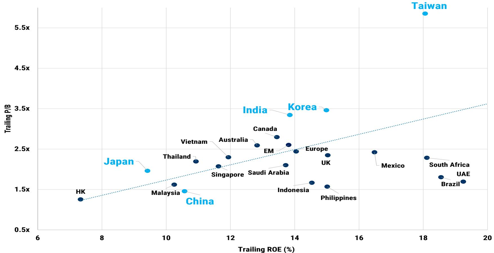

scatter

| Country       | Trailing ROE (%) | Trailing P/B |
| ------------- | ---------------- | ------------ |
| Taiwan        | 18.0             | 5.7x         |
| South Africa  | 18.0             | 2.4x         |
| UAE           | 18.5             | 1.6x         |
| Brazil        | 19.0             | 1.6x         |
| Mexico        | 16.5             | 2.4x         |
| Philippines   | 15.0             | 1.5x         |
| Indonesia     | 14.5             | 1.6x         |
| UK            | 15.0             | 2.4x         |
| Europe        | 14.0             | 2.5x         |
| Saudi Arabia  | 13.5             | 2.3x         |
| EM            | 13.5             | 2.6x         |
| Canada        | 13.0             | 2.7x         |
| Australia     | 12.0             | 2.4x         |
| Vietnam       | 11.5             | 2.3x         |
| Thailand      | 10.5             | 2.3x         |
| Japan         | 9.5              | 2.0x         |
| India         | 13.5             | 3.4x         |
| Korea         | 14.0             | 3.5x         |
| China         | 10.5             | 1.5x         |
| Singapore     | 11.5             | 2.2x         |
| Malaysia      | 10.0             | 1.6x         |
| HK            | 7.5              | 1.4x         |

Source: FactSet, MSCI, RIMES, MS. Note: Data as of Jun 1, 2026. Numbers are based on MSCI indices for each economy.

# MS

Asia EM Market Valuation Dashboard 

<table><tr><td></td><td>MSCI Indices</td><td>Japan</td><td>China</td><td>Hong Kong</td><td>Taiwan</td><td>Korea</td><td>India</td><td>Australia</td><td>Singapore</td><td>Malaysia</td><td>Thailand</td><td>Indonesia</td><td>Philippines</td><td>Brazil</td><td>Mexico</td><td>South Africa</td><td>Saudi Arabia</td><td>UAE</td><td>MSCI EM</td><td>MSCI APxJ</td><td>USA</td><td>Europe</td></tr><tr><td>MS Rating</td><td>vs Asia/EM</td><td>OW</td><td>EW</td><td>EW</td><td>EW</td><td>EW</td><td>EW</td><td>EW</td><td>OW</td><td>EW</td><td>EW</td><td>UW</td><td>UW</td><td>OW</td><td>EW</td><td>EW</td><td>OW</td><td>EW</td><td>EW</td><td>-</td><td>-</td><td>-</td></tr><tr><td>Index Weight</td><td>% of APAC-EM</td><td>25.1%</td><td>13.0%</td><td>2.2%</td><td>16.8%</td><td>14.7%</td><td>6.9%</td><td>7.0%</td><td>1.8%</td><td>0.6%</td><td>0.6%</td><td>0.4%</td><td>0.2%</td><td>2.5%</td><td>1.1%</td><td>1.9%</td><td>1.5%</td><td>0.7%</td><td>12.1%(ACWI)</td><td>12.2%(ACWI)</td><td>63.6%(ACWI)</td><td>13.8%(ACWI)</td></tr><tr><td rowspan="3">Earnings Revisions &amp; Growth</td><td>CY2 EPS Rev Breadth (3ma)</td><td>18%</td><td>-7%</td><td>-6%</td><td>51%</td><td>20%</td><td>-9%</td><td>-7%</td><td>1%</td><td>1%</td><td>5%</td><td>-17%</td><td>-12%</td><td>-3%</td><td>-17%</td><td>-6%</td><td>-4%</td><td>-14%</td><td>-1%</td><td>-1%</td><td>18%</td><td>0%</td></tr><tr><td>3m Δ of 12mf EPS</td><td>3%</td><td>0%</td><td>0%</td><td>12%</td><td>56%</td><td>1%</td><td>2%</td><td>1%</td><td>2%</td><td>5%</td><td>-4%</td><td>-1%</td><td>9%</td><td>1%</td><td>3%</td><td>3%</td><td>-1%</td><td>18%</td><td>18%</td><td>7%</td><td>6%</td></tr><tr><td>12mf EPS growth</td><td>9%</td><td>15%</td><td>11%</td><td>32%</td><td>92%</td><td>15%</td><td>9%</td><td>9%</td><td>9%</td><td>8%</td><td>4%</td><td>5%</td><td>21%</td><td>11%</td><td>29%</td><td>12%</td><td>5%</td><td>36%</td><td>37%</td><td>20%</td><td>14%</td></tr><tr><td rowspan="2">ROE</td><td>Level</td><td>9.4%</td><td>10.6%</td><td>7.3%</td><td>18.1%</td><td>15.0%</td><td>13.9%</td><td>12.8%</td><td>11.6%</td><td>10.2%</td><td>10.9%</td><td>14.5%</td><td>15.0%</td><td>18.6%</td><td>16.5%</td><td>18.1%</td><td>13.7%</td><td>19.2%</td><td>13.8%</td><td>12.6%</td><td>20.7%</td><td>14.0%</td></tr><tr><td>10yr %ile</td><td>61%</td><td>23%</td><td>57%</td><td>89%</td><td>99%</td><td>42%</td><td>69%</td><td>85%</td><td>89%</td><td>61%</td><td>47%</td><td>99%</td><td>69%</td><td>99%</td><td>93%</td><td>90%</td><td>99%</td><td>99%</td><td>99%</td><td>99%</td><td>98%</td></tr><tr><td rowspan="2">12mf PE</td><td>Level</td><td>17.5x</td><td>10.9x</td><td>14.6x</td><td>22.7x</td><td>8.5x</td><td>20.3x</td><td>17.8x</td><td>15.9x</td><td>14.2x</td><td>18.2x</td><td>9.0x</td><td>9.5x</td><td>8.2x</td><td>12.9x</td><td>8.6x</td><td>13.8x</td><td>8.7x</td><td>12.2x</td><td>13.3x</td><td>21.8x</td><td>14.8x</td></tr><tr><td>10yr %ile</td><td>93%</td><td>35%</td><td>54%</td><td>99%</td><td>16%</td><td>48%</td><td>74%</td><td>93%</td><td>42%</td><td>87%</td><td>1%</td><td>2%</td><td>40%</td><td>42%</td><td>6%</td><td>1%</td><td>9%</td><td>59%</td><td>47%</td><td>74%</td><td>66%</td></tr><tr><td rowspan="2">P/Book</td><td>Level</td><td>2.0x</td><td>1.4x</td><td>1.3x</td><td>5.8x</td><td>3.3x</td><td>3.4x</td><td>2.6x</td><td>2.1x</td><td>1.6x</td><td>2.2x</td><td>1.7x</td><td>1.5x</td><td>1.8x</td><td>2.4x</td><td>2.4x</td><td>2.1x</td><td>1.7x</td><td>2.6x</td><td>2.6x</td><td>5.9x</td><td>2.5x</td></tr><tr><td>10yr %ile</td><td>98%</td><td>27%</td><td>61%</td><td>99%</td><td>99%</td><td>50%</td><td>97%</td><td>96%</td><td>58%</td><td>88%</td><td>1%</td><td>2%</td><td>61%</td><td>82%</td><td>82%</td><td>46%</td><td>79%</td><td>99%</td><td>99%</td><td>99%</td><td>98%</td></tr><tr><td rowspan="2">P/Sales</td><td>Level</td><td>1.6x</td><td>1.4x</td><td>2.7x</td><td>3.6x</td><td>3.0x</td><td>2.4x</td><td>2.4x</td><td>2.9x</td><td>2.1x</td><td>1.4x</td><td>1.7x</td><td>1.8x</td><td>1.1x</td><td>1.2x</td><td>1.8x</td><td>3.1x</td><td>2.3x</td><td>2.2x</td><td>2.4x</td><td>3.7x</td><td>1.7x</td></tr><tr><td>10yr %ile</td><td>98%</td><td>58%</td><td>56%</td><td>99%</td><td>99%</td><td>64%</td><td>78%</td><td>93%</td><td>38%</td><td>86%</td><td>1%</td><td>6%</td><td>41%</td><td>69%</td><td>55%</td><td>24%</td><td>13%</td><td>99%</td><td>99%</td><td>99%</td><td>99%</td></tr><tr><td rowspan="2">Div Yield</td><td>Level</td><td>1.8%</td><td>2.3%</td><td>3.5%</td><td>1.4%</td><td>0.7%</td><td>1.2%</td><td>3.4%</td><td>3.4%</td><td>4.0%</td><td>3.1%</td><td>6.9%</td><td>3.6%</td><td>5.8%</td><td>3.8%</td><td>3.4%</td><td>3.7%</td><td>5.1%</td><td>1.9%</td><td>1.8%</td><td>1.1%</td><td>2.9%</td></tr><tr><td>10yr %ile</td><td>2%</td><td>68%</td><td>69%</td><td>1%</td><td>1%</td><td>42%</td><td>15%</td><td>17%</td><td>73%</td><td>73%</td><td>99%</td><td>99%</td><td>57%</td><td>83%</td><td>73%</td><td>72%</td><td>77%</td><td>6%</td><td>1%</td><td>1%</td><td>21%</td></tr><tr><td rowspan="2">Technicals</td><td>30 day RSI</td><td>59</td><td>36</td><td>45</td><td>72</td><td>76</td><td>47</td><td>42</td><td>53</td><td>50</td><td>61</td><td>15</td><td>40</td><td>22</td><td>49</td><td>42</td><td>28</td><td>39</td><td>67</td><td>67</td><td>72</td><td>53</td></tr><tr><td>50/200d MA</td><td>8%</td><td>-6%</td><td>5%</td><td>25%</td><td>43%</td><td>-4%</td><td>0%</td><td>0%</td><td>3%</td><td>13%</td><td>-16%</td><td>-1%</td><td>9%</td><td>6%</td><td>2%</td><td>2%</td><td>-5%</td><td>10%</td><td>10%</td><td>3%</td><td>3%</td></tr><tr><td>Rel. Pos.</td><td>vs MSCI EM</td><td>NA</td><td>-0.3%</td><td>0.1%</td><td>-1.2%</td><td>1.0%</td><td>-1.2%</td><td>-1.0%</td><td>-0.1%</td><td>-0.4%</td><td>0.1%</td><td>0.3%</td><td>0.0%</td><td>2.3%</td><td>0.7%</td><td>-0.4%</td><td>-1.0%</td><td>NA</td><td>NA</td><td>NA</td><td>NA</td><td>NA</td></tr><tr><td rowspan="3">Perf.</td><td>Since Feb 28</td><td>0%</td><td>-8%</td><td>-6%</td><td>28%</td><td>39%</td><td>-8%</td><td>-4%</td><td>-1%</td><td>-3%</td><td>-3%</td><td>-34%</td><td>-18%</td><td>-8%</td><td>-4%</td><td>-16%</td><td>2%</td><td>-15%</td><td>9%</td><td>9%</td><td>10%</td><td>-2%</td></tr><tr><td>3m</td><td>0%</td><td>-8%</td><td>-6%</td><td>28%</td><td>39%</td><td>-8%</td><td>-4%</td><td>-1%</td><td>-3%</td><td>-3%</td><td>-34%</td><td>-18%</td><td>-8%</td><td>-4%</td><td>-16%</td><td>2%</td><td>-15%</td><td>9%</td><td>9%</td><td>10%</td><td>-2%</td></tr><tr><td>YTD</td><td>15%</td><td>-9%</td><td>6%</td><td>60%</td><td>117%</td><td>-11%</td><td>10%</td><td>4%</td><td>3%</td><td>24%</td><td>-38%</td><td>-8%</td><td>12%</td><td>13%</td><td>0%</td><td>6%</td><td>-6%</td><td>25%</td><td>25%</td><td>11%</td><td>5%</td></tr></table>

Source: FactSet, MS. Note: Data as of May 29, 2026.

# MS

EM Macro, Fiscal, External & Structural Features – Considerable Heterogeneity Across Multiple Dimensions Argues Against the Concept of EM Convergence 

<table><tr><td></td><td colspan="3">Macro Indicators</td><td colspan="4">Fiscal Indicators</td><td colspan="3">External Indicators</td><td colspan="2">Structural Features</td></tr><tr><td>Market</td><td>GDP per capita, 2025</td><td>GDP vol, 10y</td><td>CPI vol, 10y</td><td>Govt. debt, 2025</td><td>Govt. ext debt, 2025</td><td>Fiscal balance, 2025</td><td>Interest/revenues, 2025</td><td>CAB+FDI, 2025</td><td>Liquidity ratio, 2025</td><td>Reserves / CXP 2025</td><td>Corrupt. Percept. Index</td><td>V-Dem Democracy Score</td></tr><tr><td>Brazil</td><td>10,386</td><td>2.1</td><td>2.4</td><td>79</td><td>9</td><td>-8.0</td><td>20.0</td><td>-1.0</td><td>123</td><td>8.3</td><td>35</td><td>0.8</td></tr><tr><td>Chile</td><td>17,953</td><td>4.2</td><td>2.9</td><td>42</td><td>16</td><td>-2.4</td><td>5.1</td><td>-0.7</td><td>78</td><td>4.1</td><td>63</td><td>0.8</td></tr><tr><td>China</td><td>13,852</td><td>1.9</td><td>1.0</td><td>69</td><td>3</td><td>-8.4</td><td>5.2</td><td>2.8</td><td>211</td><td>11.9</td><td>43</td><td>0.1</td></tr><tr><td>Colombia</td><td>8,554</td><td>4.6</td><td>3.1</td><td>59</td><td>24</td><td>-5.5</td><td>12.9</td><td>-0.2</td><td>102</td><td>7.0</td><td>37</td><td>0.7</td></tr><tr><td>Egypt</td><td>3,227</td><td>1.2</td><td>9.6</td><td>81</td><td>38</td><td>-6.6</td><td>62.6</td><td>-1.0</td><td>98</td><td>4.5</td><td>30</td><td>0.2</td></tr><tr><td>Hungary</td><td>25,284</td><td>3.5</td><td>5.6</td><td>74</td><td>35</td><td>-5.0</td><td>10.7</td><td>-1.9</td><td>131</td><td>3.4</td><td>40</td><td>0.5</td></tr><tr><td>India</td><td>2,843</td><td>4.4</td><td>1.3</td><td>81</td><td>4</td><td>-7.3</td><td>23.4</td><td>-0.7</td><td>218</td><td>7.4</td><td>39</td><td>0.5</td></tr><tr><td>Indonesia</td><td>5,002</td><td>2.2</td><td>0.9</td><td>41</td><td>17</td><td>-2.8</td><td>17.1</td><td>0.6</td><td>106</td><td>5.1</td><td>34</td><td>0.6</td></tr><tr><td>Mexico</td><td>14,263</td><td>3.8</td><td>1.5</td><td>53</td><td>13</td><td>-4.7</td><td>17.4</td><td>1.7</td><td>140</td><td>3.8</td><td>27</td><td>0.6</td></tr><tr><td>Peru</td><td>9,514</td><td>5.9</td><td>2.2</td><td>30</td><td>22</td><td>-2.3</td><td>8.6</td><td>5.2</td><td>259</td><td>10.6</td><td>30</td><td>0.7</td></tr><tr><td>Philippines</td><td>4,275</td><td>5.0</td><td>1.7</td><td>55</td><td>18</td><td>-4.2</td><td>12.8</td><td>-1.4</td><td>261</td><td>7.1</td><td>32</td><td>0.5</td></tr><tr><td>Poland</td><td>28,559</td><td>2.7</td><td>4.3</td><td>59</td><td>17</td><td>-7.1</td><td>6.6</td><td>1.0</td><td>159</td><td>5.6</td><td>53</td><td>0.7</td></tr><tr><td>Qatar</td><td>67,930</td><td>2.4</td><td>2.2</td><td>48</td><td>18</td><td>2.6</td><td>5.7</td><td>12.8</td><td>64</td><td>6.1</td><td>58</td><td>0.1</td></tr><tr><td>Saudi Arabia</td><td>35,188</td><td>4.2</td><td>1.8</td><td>31</td><td>17</td><td>-5.1</td><td>4.9</td><td>-2.8</td><td>200</td><td>12.8</td><td>57</td><td>0.0</td></tr><tr><td>South Africa</td><td>6,764</td><td>2.8</td><td>1.3</td><td>79</td><td>20</td><td>-4.8</td><td>19.3</td><td>0.0</td><td>100</td><td>5.6</td><td>41</td><td>0.7</td></tr></table>

Source: Fitch, OECD, V-Dem Democracy Score - see https://www.v-dem.net/), Corruption Perception Index - see https://www.transparency.org/, MS forecasts

# MS

EM vs. DM Equity Relative Performance vs. DXY – A Stronger Dollar Would Generate a Headwind to EM Performance Relative to DM   
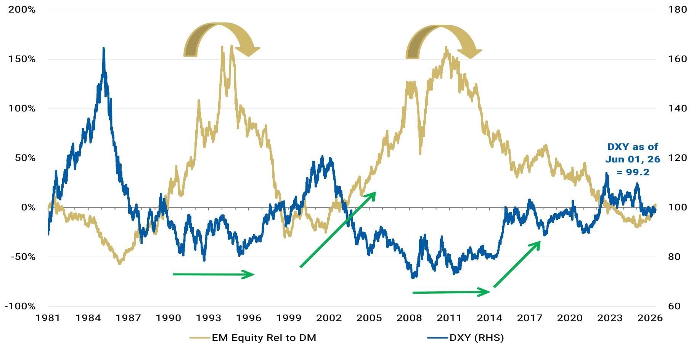

line

| Year | EM Equity Rel to DM | DXY (RHS) |
|------|---------------------|---------|
| 2026 | 99.2                |         |

Source: Datastream, FactSet, MS forecasts. Note: Data as of Jun 1, 2026.

# MS

MS APxJ and GEM Focus Lists – Cumulative Total Returns Since Inception   
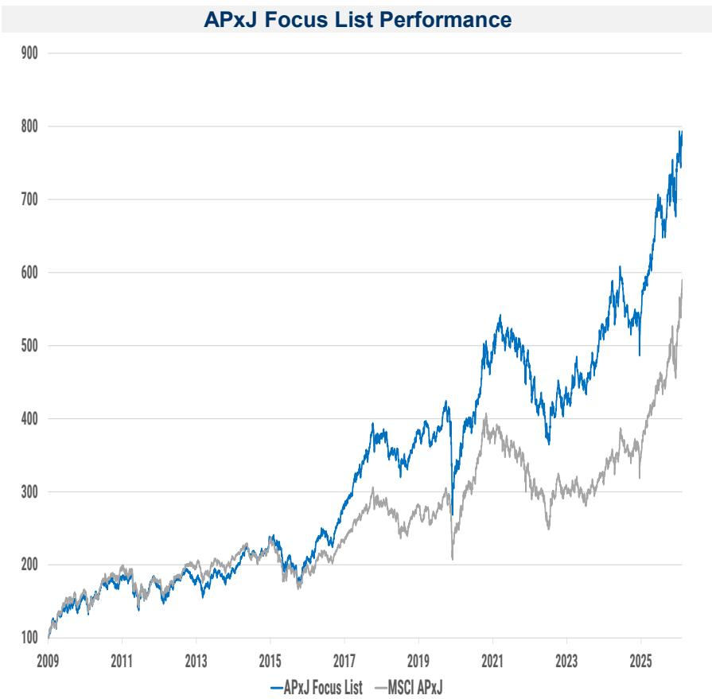

line

| Year | APxJ Focus List | MSCI APxJ |
|------|-----------------|-----------|
| 2009 | ~100            | ~100      |
| 2010 | ~150            | ~140      |
| 2011 | ~180            | ~170      |
| 2012 | ~160            | ~150      |
| 2013 | ~190            | ~180      |
| 2014 | ~210            | ~200      |
| 2015 | ~230            | ~220      |
| 2016 | ~250            | ~240      |
| 2017 | ~300            | ~280      |
| 2018 | ~350            | ~320      |
| 2019 | ~400            | ~350      |
| 2020 | ~450            | ~380      |
| 2021 | ~550            | ~400      |
| 2022 | ~450            | ~350      |
| 2023 | ~500            | ~380      |
| 2024 | ~600            | ~450      |
| 2025 | ~750            | ~550      |
| 2026 | ~800            | ~600      |

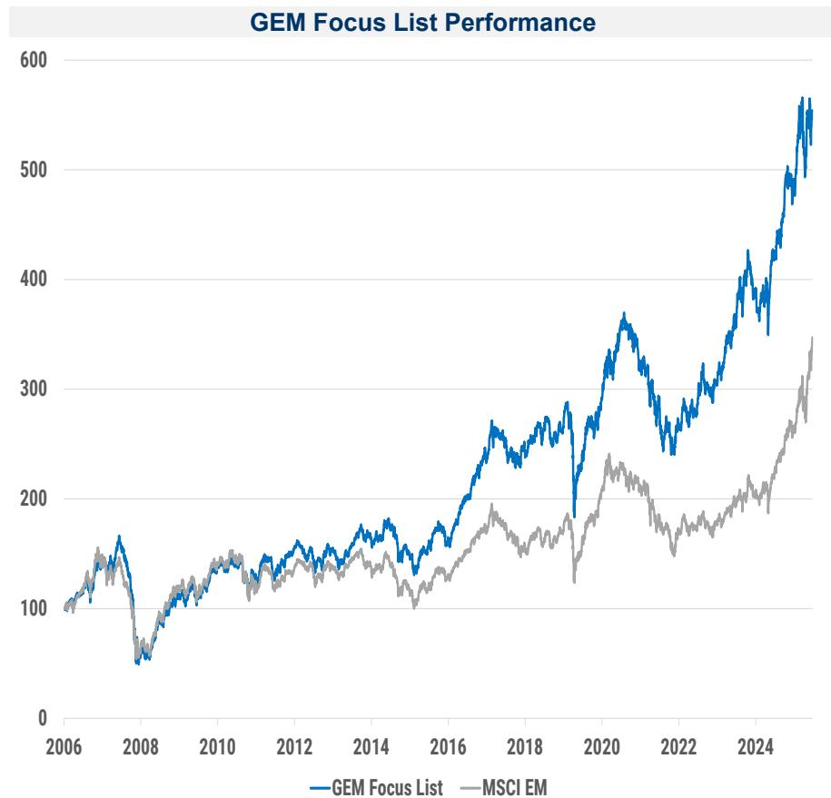

line

| Year | GEM Focus List | MSCI EM |
|------|----------------|---------|
| 2006 | ~100           | ~100    |
| 2008 | ~50            | ~50     |
| 2010 | ~150           | ~140    |
| 2012 | ~160           | ~130    |
| 2014 | ~170           | ~140    |
| 2016 | ~180           | ~150    |
| 2018 | ~250           | ~180    |
| 2020 | ~350           | ~230    |
| 2022 | ~280           | ~190    |
| 2024 | ~450           | ~280    |
| 2025 | ~570           | ~340    |

Source: Bloomberg, MSCI, MS. Note: MS APxJ Focus List delivered a Sharpe Ratio of 2.09 in the last 12 months, with a CAGR of 12.9% since its inception on May 23, 2009; MS GEM Focus List delivered a Sharpe Ratio of 1.89 in the last 12 months, with a CAGR of 9.2% since its inception on December 11, 2006. Data as of Jun 2, 2026; Past performance is no guarantee of future results.

# MS

Global Equity Funds Positioning – Structural Allocation to Japan; Recent Surge in Interest in EM   
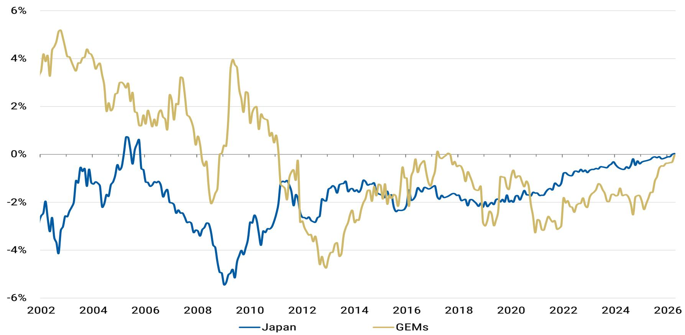

line

| Year | Japan | GEMs |
|------|-------|------|
| 2002 | -2.5% | 4.0% |
| 2003 | -4.0% | 5.0% |
| 2004 | -1.0% | 3.5% |
| 2005 | 0.5% | 2.0% |
| 2006 | -1.5% | 1.5% |
| 2007 | -2.5% | 3.0% |
| 2008 | -3.0% | 1.0% |
| 2009 | -5.0% | -2.0% |
| 2010 | -3.5% | 4.0% |
| 2011 | -1.5% | 1.5% |
| 2012 | -2.5% | -1.0% |
| 2013 | -3.0% | -4.5% |
| 2014 | -1.5% | -2.5% |
| 2015 | -1.0% | -1.5% |
| 2016 | -2.0% | -1.0% |
| 2017 | -1.5% | 0.0% |
| 2018 | -2.0% | -1.0% |
| 2019 | -2.5% | -3.0% |
| 2020 | -2.0% | -1.5% |
| 2021 | -1.5% | -3.5% |
| 2022 | -1.0% | -2.5% |
| 2023 | -0.5% | -1.5% |
| 2024 | 0.0% | -2.0% |
| 2025 | 0.5% | -1.5% |
| 2026 | 1.0% | 0.0% |

Source: EPFR Global, Country Allocation Database, MS. Note: Fund Weights as of April end 2026. Global long-only funds sample benchmarked to MSCI World, MSCI ACWI ex-USA and MSCI EAFE.

# MS

Active Fund Positions in EM Equities by Market and Changes QTD 

<table><tr><td rowspan="2">Market</td><td colspan="4">International &amp; US Funds</td><td colspan="3">International Funds - UCITS</td><td colspan="3">US Funds</td></tr><tr><td>Portfolio Composite Weight</td><td>MSCI EM Index Weight</td><td>Active Weight</td><td>Active Weight Change QTD</td><td>Portfolio Composite Weight</td><td>Active Weight</td><td>Active Weight Change QTD</td><td>Portfolio Composite Weight</td><td>Active Weight</td><td>Active Weight Change QTD</td></tr><tr><td>Brazil</td><td>8.6%</td><td>4.7%</td><td>4.0%</td><td>-0.5%</td><td>7.4%</td><td>2.8%</td><td>-0.6%</td><td>9.1%</td><td>4.4%</td><td>-0.4%</td></tr><tr><td>Mexico</td><td>2.8%</td><td>1.9%</td><td>1.0%</td><td>-0.2%</td><td>2.5%</td><td>0.6%</td><td>-0.2%</td><td>3.0%</td><td>1.1%</td><td>-0.2%</td></tr><tr><td>Hungary</td><td>1.0%</td><td>0.4%</td><td>0.7%</td><td>0.0%</td><td>1.1%</td><td>0.8%</td><td>0.1%</td><td>1.0%</td><td>0.6%</td><td>0.0%</td></tr><tr><td>Korea</td><td>19.3%</td><td>18.7%</td><td>0.6%</td><td>0.1%</td><td>20.4%</td><td>1.7%</td><td>0.1%</td><td>18.9%</td><td>0.2%</td><td>0.0%</td></tr><tr><td>Peru</td><td>0.9%</td><td>0.4%</td><td>0.5%</td><td>-0.1%</td><td>0.8%</td><td>0.4%</td><td>-0.1%</td><td>0.9%</td><td>0.5%</td><td>-0.1%</td></tr><tr><td>Turkey</td><td>0.9%</td><td>0.5%</td><td>0.5%</td><td>0.0%</td><td>0.8%</td><td>0.3%</td><td>0.0%</td><td>1.0%</td><td>0.6%</td><td>0.0%</td></tr><tr><td>United Arab Emirates</td><td>1.6%</td><td>1.2%</td><td>0.4%</td><td>-0.1%</td><td>1.3%</td><td>0.1%</td><td>0.0%</td><td>1.8%</td><td>0.6%</td><td>-0.1%</td></tr><tr><td>Greece</td><td>0.9%</td><td>0.5%</td><td>0.4%</td><td>-0.1%</td><td>0.8%</td><td>0.4%</td><td>0.0%</td><td>0.9%</td><td>0.4%</td><td>-0.1%</td></tr><tr><td>Indonesia</td><td>1.1%</td><td>0.7%</td><td>0.4%</td><td>-0.1%</td><td>1.1%</td><td>0.3%</td><td>-0.1%</td><td>1.1%</td><td>0.4%</td><td>-0.2%</td></tr><tr><td>Philippines</td><td>0.6%</td><td>0.3%</td><td>0.3%</td><td>-0.1%</td><td>0.4%</td><td>0.1%</td><td>0.0%</td><td>0.7%</td><td>0.4%</td><td>-0.1%</td></tr><tr><td>Thailand</td><td>1.0%</td><td>1.0%</td><td>0.0%</td><td>-0.1%</td><td>1.0%</td><td>0.0%</td><td>-0.1%</td><td>1.0%</td><td>0.0%</td><td>-0.1%</td></tr><tr><td>Egypt</td><td>0.1%</td><td>0.1%</td><td>0.0%</td><td>0.0%</td><td>0.0%</td><td>0.0%</td><td>0.0%</td><td>0.1%</td><td>0.0%</td><td>0.0%</td></tr><tr><td>Czech Republic</td><td>0.0%</td><td>0.1%</td><td>-0.1%</td><td>0.0%</td><td>0.1%</td><td>0.0%</td><td>0.0%</td><td>0.0%</td><td>-0.1%</td><td>0.0%</td></tr><tr><td>Colombia</td><td>0.0%</td><td>0.1%</td><td>-0.1%</td><td>0.0%</td><td>0.1%</td><td>-0.1%</td><td>0.0%</td><td>0.0%</td><td>-0.1%</td><td>0.0%</td></tr><tr><td>South Africa</td><td>3.1%</td><td>3.3%</td><td>-0.2%</td><td>0.0%</td><td>3.3%</td><td>0.1%</td><td>0.0%</td><td>3.0%</td><td>-0.3%</td><td>0.0%</td></tr><tr><td>Poland</td><td>0.8%</td><td>1.1%</td><td>-0.3%</td><td>0.0%</td><td>1.3%</td><td>0.2%</td><td>0.0%</td><td>0.6%</td><td>-0.4%</td><td>0.0%</td></tr><tr><td>Chile</td><td>0.2%</td><td>0.5%</td><td>-0.3%</td><td>0.0%</td><td>0.4%</td><td>-0.1%</td><td>0.0%</td><td>0.2%</td><td>-0.3%</td><td>0.0%</td></tr><tr><td>India</td><td>11.6%</td><td>11.9%</td><td>-0.4%</td><td>-0.2%</td><td>10.2%</td><td>-1.8%</td><td>-0.2%</td><td>12.1%</td><td>0.2%</td><td>-0.1%</td></tr><tr><td>Qatar</td><td>0.1%</td><td>0.5%</td><td>-0.4%</td><td>0.1%</td><td>0.1%</td><td>-0.4%</td><td>0.0%</td><td>0.1%</td><td>-0.4%</td><td>0.1%</td></tr><tr><td>Kuwait</td><td>0.1%</td><td>0.6%</td><td>-0.5%</td><td>0.1%</td><td>0.1%</td><td>-0.5%</td><td>0.0%</td><td>0.1%</td><td>-0.5%</td><td>0.1%</td></tr><tr><td>Malaysia</td><td>0.3%</td><td>1.1%</td><td>-0.8%</td><td>0.1%</td><td>0.6%</td><td>-0.5%</td><td>0.0%</td><td>0.2%</td><td>-0.9%</td><td>0.1%</td></tr><tr><td>Saudi Arabia</td><td>1.4%</td><td>2.6%</td><td>-1.2%</td><td>0.1%</td><td>1.1%</td><td>-1.6%</td><td>0.2%</td><td>1.5%</td><td>-1.1%</td><td>0.1%</td></tr><tr><td>Taiwan</td><td>23.2%</td><td>24.8%</td><td>-1.7%</td><td>0.4%</td><td>24.0%</td><td>-0.8%</td><td>0.3%</td><td>22.8%</td><td>-2.0%</td><td>0.4%</td></tr><tr><td>China</td><td>20.3%</td><td>23.0%</td><td>-2.7%</td><td>0.5%</td><td>21.2%</td><td>-1.8%</td><td>0.5%</td><td>20.0%</td><td>-3.0%</td><td>0.5%</td></tr></table>

Source: FactSet, Morningstar, MS. Note: Data as of April 30, 2026. Please contact us if you would like to receive the full table. For more details see Asia EM Equity Strategy: Flows & Positioning Guide (6 May 2026).

# MS

Active Fund Positions in EM Equities by GICS Industry Group and Changes QTD 

<table><tr><td rowspan="2">GICS Industry Group</td><td colspan="4">International &amp; US Funds</td><td colspan="3">International Funds - UCITS</td><td colspan="3">US Funds</td></tr><tr><td>Portfolio Composite Weight</td><td>MSCI EM Index Weight</td><td>Active Weight</td><td>Active Weight Change QTD</td><td>Portfolio Composite Weight</td><td>Active Weight</td><td>Active Weight Change QTD</td><td>Portfolio Composite Weight</td><td>Active Weight</td><td>Active Weight Change QTD</td></tr><tr><td>Capital Goods</td><td>8.2%</td><td>6.0%</td><td>2.1%</td><td>0.1%</td><td>7.8%</td><td>1.7%</td><td>-0.3%</td><td>8.3%</td><td>2.3%</td><td>0.2%</td></tr><tr><td>Semiconductors &amp; Semiconductor Equipment</td><td>23.0%</td><td>21.6%</td><td>1.4%</td><td>0.3%</td><td>20.6%</td><td>-1.0%</td><td>-0.1%</td><td>23.9%</td><td>2.3%</td><td>0.4%</td></tr><tr><td>Financial Services</td><td>2.9%</td><td>2.5%</td><td>0.5%</td><td>-0.1%</td><td>3.1%</td><td>0.7%</td><td>0.0%</td><td>2.9%</td><td>0.4%</td><td>-0.2%</td></tr><tr><td>Consumer Durables &amp; Apparel</td><td>1.2%</td><td>0.7%</td><td>0.4%</td><td>-0.1%</td><td>1.4%</td><td>0.6%</td><td>0.0%</td><td>1.1%</td><td>0.4%</td><td>-0.1%</td></tr><tr><td>Food Beverage &amp; Tobacco</td><td>2.4%</td><td>2.0%</td><td>0.4%</td><td>0.0%</td><td>1.7%</td><td>-0.3%</td><td>0.1%</td><td>2.7%</td><td>0.7%</td><td>0.0%</td></tr><tr><td>Consumer Staples Distribution &amp; Retail</td><td>1.0%</td><td>0.8%</td><td>0.3%</td><td>-0.1%</td><td>1.1%</td><td>0.3%</td><td>-0.1%</td><td>1.0%</td><td>0.2%</td><td>-0.1%</td></tr><tr><td>Transportation</td><td>1.7%</td><td>1.4%</td><td>0.3%</td><td>-0.1%</td><td>1.3%</td><td>-0.1%</td><td>0.0%</td><td>1.8%</td><td>0.4%</td><td>-0.1%</td></tr><tr><td>Media &amp; Entertainment</td><td>4.9%</td><td>4.7%</td><td>0.2%</td><td>-0.1%</td><td>4.5%</td><td>-0.2%</td><td>0.0%</td><td>5.0%</td><td>0.3%</td><td>-0.1%</td></tr><tr><td>Health Care Equipment &amp; Services</td><td>0.7%</td><td>0.6%</td><td>0.2%</td><td>0.0%</td><td>0.6%</td><td>0.1%</td><td>0.0%</td><td>0.7%</td><td>0.2%</td><td>0.0%</td></tr><tr><td>Telecommunication Services</td><td>2.4%</td><td>2.2%</td><td>0.1%</td><td>-0.1%</td><td>2.1%</td><td>-0.1%</td><td>-0.1%</td><td>2.5%</td><td>0.2%</td><td>-0.1%</td></tr><tr><td>Commercial &amp; Professional Services</td><td>0.1%</td><td>0.0%</td><td>0.1%</td><td>0.0%</td><td>0.1%</td><td>0.1%</td><td>0.0%</td><td>0.1%</td><td>0.1%</td><td>0.0%</td></tr><tr><td>Equity Real Estate Investment Trusts (REITs)</td><td>0.1%</td><td>0.1%</td><td>0.0%</td><td>0.0%</td><td>0.1%</td><td>0.0%</td><td>0.0%</td><td>0.1%</td><td>0.0%</td><td>0.0%</td></tr><tr><td>Energy</td><td>3.9%</td><td>4.0%</td><td>0.0%</td><td>0.0%</td><td>2.7%</td><td>-1.3%</td><td>0.0%</td><td>4.4%</td><td>0.5%</td><td>0.0%</td></tr><tr><td>Real Estate Management &amp; Development</td><td>1.0%</td><td>1.0%</td><td>0.0%</td><td>0.0%</td><td>1.2%</td><td>0.2%</td><td>0.1%</td><td>0.9%</td><td>0.1%</td><td>0.0%</td></tr><tr><td>Insurance</td><td>2.5%</td><td>2.5%</td><td>0.0%</td><td>0.0%</td><td>2.6%</td><td>0.1%</td><td>-0.1%</td><td>2.4%</td><td>0.1%</td><td>0.0%</td></tr><tr><td>Banks</td><td>14.6%</td><td>14.7%</td><td>-0.1%</td><td>-0.1%</td><td>15.1%</td><td>0.4%</td><td>-0.4%</td><td>14.4%</td><td>0.2%</td><td>0.0%</td></tr><tr><td>Utilities</td><td>2.1%</td><td>2.2%</td><td>0.1%</td><td>0.1%</td><td>1.4%</td><td>-0.9%</td><td>0.1%</td><td>2.4%</td><td>0.2%</td><td>0.2%</td></tr><tr><td>Household &amp; Personal Products</td><td>0.3%</td><td>0.4%</td><td>0.1%</td><td>0.0%</td><td>0.3%</td><td>-0.1%</td><td>0.0%</td><td>0.3%</td><td>0.1%</td><td>0.0%</td></tr><tr><td>Pharmaceuticals Biotechnology &amp; Life Sciences</td><td>2.0%</td><td>2.2%</td><td>-0.2%</td><td>0.0%</td><td>1.9%</td><td>-0.3%</td><td>0.0%</td><td>2.0%</td><td>0.2%</td><td>0.0%</td></tr><tr><td>Consumer Services</td><td>1.0%</td><td>1.4%</td><td>-0.4%</td><td>-0.1%</td><td>1.1%</td><td>-0.2%</td><td>0.0%</td><td>1.0%</td><td>0.4%</td><td>-0.1%</td></tr><tr><td>Automobiles &amp; Components</td><td>2.4%</td><td>2.9%</td><td>-0.6%</td><td>0.0%</td><td>3.2%</td><td>0.2%</td><td>0.0%</td><td>2.1%</td><td>0.9%</td><td>0.0%</td></tr><tr><td>Consumer Discretionary Distribution &amp; Retail</td><td>3.7%</td><td>4.4%</td><td>-0.6%</td><td>0.0%</td><td>4.4%</td><td>0.0%</td><td>-0.1%</td><td>3.5%</td><td>0.9%</td><td>0.0%</td></tr><tr><td>Software &amp; Services</td><td>0.6%</td><td>1.3%</td><td>-0.6%</td><td>0.1%</td><td>0.8%</td><td>-0.5%</td><td>0.1%</td><td>0.6%</td><td>0.7%</td><td>0.1%</td></tr><tr><td>Technology Hardware &amp; Equipment</td><td>12.7%</td><td>13.9%</td><td>-1.2%</td><td>0.0%</td><td>16.5%</td><td>2.7%</td><td>0.8%</td><td>11.2%</td><td>2.7%</td><td>-0.3%</td></tr><tr><td>Materials</td><td>4.6%</td><td>6.5%</td><td>-1.9%</td><td>0.1%</td><td>4.4%</td><td>-2.2%</td><td>0.1%</td><td>4.7%</td><td>1.8%</td><td>0.1%</td></tr></table>

Source: FactSet, Morningstar, MS. Note: Data as of April 30, 2026. Please contact us if you would like to receive the full table. For more details see Asia EM Equity   
Strategy: Flows & Positioning Guide (6 May 2026).

# MS

# Capital Intensity — Hyperscaler Capex Spending Poised to Overtake Dot-Com Peak, Based on MSe, Particularly Factoring in Widespread Lease Utilisation

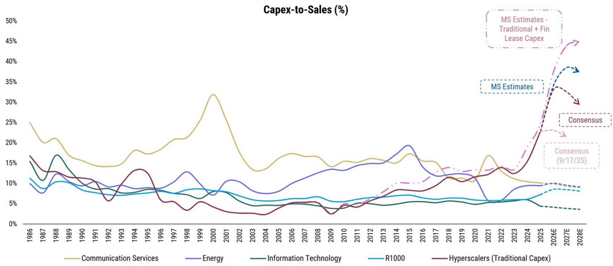

line

| Year | Communication Services | Energy | Information Technology | R1000 | Hyperscalers (Traditional Capex) |
|------|------------------------|--------|------------------------|-------|----------------------------------|
| 1986 | ~25%                   | ~10%   | ~15%                   | ~11%  | ~17%                             |
| 1987 | ~20%                   | ~8%    | ~12%                   | ~9%   | ~13%                             |
| 1988 | ~21%                   | ~12%   | ~17%                   | ~10%  | ~13%                             |
| 1989 | ~18%                   | ~10%   | ~14%                   | ~9%   | ~12%                             |
| 1990 | ~16%                   | ~9%    | ~12%                   | ~8%   | ~11%                             |
| 1991 | ~15%                   | ~8%    | ~10%                   | ~7%   | ~10%                             |
| 1992 | ~14%                   | ~7%    | ~8%                    | ~6%   | ~6%                              |
| 1993 | ~15%                   | ~8%    | ~9%                    | ~7%   | ~10%                             |
| 1994 | ~18%                   | ~9%    | ~8%                    | ~7%   | ~13%                             |
| 1995 | ~17%                   | ~8%    | ~9%                    | ~7%   | ~12%                             |
| 1996 | ~18%                   | ~9%    | ~8%                    | ~7%   | ~5%                              |
| 1997 | ~20%                   | ~10%   | ~8%                    | ~7%   | ~4%                              |
| 1998 | ~22%                   | ~13%   | ~7%                    | ~8%   | ~3%                              |
| 1999 | ~25%                   | ~10%   | ~6%                    | ~8%   | ~5%                              |
| 2000 | ~32%                   | ~7%    | ~6%                    | ~8%   | ~4%                              |
| 2001 | ~25%                   | ~10%   | ~7%                    | ~7%   | ~3%                              |
| 2002 | ~20%                   | ~10%   | ~6%                    | ~6%   | ~3%                              |
| 2003 | ~13%                   | ~8%    | ~5%                    | ~5%   | ~2%                              |
| 2004 | ~14%                   | ~7%    | ~4%                    | ~5%   | ~2%                              |
| 2005 | ~16%                   | ~8%    | ~4%                    | ~5%   | ~3%                              |
| 2006 | ~17%                   | ~9%    | ~4%                    | ~5%   | ~4%                              |
| 2007 | ~16%                   | ~10%   | ~4%                    | ~5%   | ~4%                              |
| 2008 | ~16%                   | ~12%   | ~4%                    | ~5%   | ~4%                              |
| 2009 | ~14%                   | ~13%   | ~3%                    | ~5%   | ~3%                              |
| 2010 | ~15%                   | ~13%   | ~3%                    | ~5%   | ~4%                              |
| 2011 | ~15%                   | ~14%   | ~4%                    | ~5%   | ~4%                              |
| 2012 | ~16%                   | ~14%   | ~4%                    | ~5%   | ~5%                              |
| 2013 | ~15%                   | ~14%   | ~4%                    | ~5%   | ~6%                              |
| 2014 | ~16%                   | ~15%   | ~4%                    | ~5%   | ~7%                              |
| 2015 | ~17%                   | ~19%   | ~4%                    | ~5%   | ~8%                              |
| 2016 | ~16%                   | ~15%   | ~4%                    | ~5%   | ~7.5%                            |
| 2017 | ~15%                   | ~13%   | ~4.5%                  | ~5.5% | ~8.5%                            |
| 2018 | ~14%                   | ~12.5% | ~4.5%                  | ~5.5% | ~9.5%                            |
| 2019 | ~13.5%                 | ~12.5% | ~4.5%                  | ~5.5% | ~10.5%                           |
| 2020 | ~13.5%                 | ~12.5% | ~4.5%                  | ~5.5% | ~11.5%                           |
| 2021E|~17.5%E                |~9.5%E                 |~4.5%E                 |~6.5%E|~23.5%E                         |
| 2026E|~10.5%E                |~9.5%E                 |~3.5%E                 |~8.5%E|~38.5%E                         |
| 2027E|~10.5%E                |~9.5%E                 |~3.5%E                 |~8.5%E|~38.5%E                         |
| 2028E|~10.5%E                |~9.5%E                 |~3.5%E                 |~8.5%E|~38.5%E

Source: The hyperscalers group includes AMZN, GOOGL, META, MSFT, & ORCL and are excluded from the other sector groups. Only MSFT and ORCL finance lease estimates are included. R1000 excludes Real Estate and Financials. Source: MS Estimates and FactSet

# MS

12-Month Trailing P/B – DRAM vs DRAM Contract Price YoY (RHS) – Contract Prices Have Surged, But Valuations Tend to Peak Before Fundamentals   
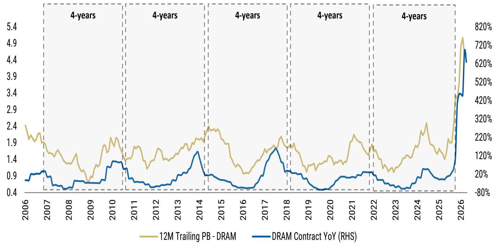

line

| Year | 12M Trailing PB - DRAM | DRAM Contract YoY (RHS) |
|------|------------------------|--------------------------|
| 2006 | ~2.4                   | ~0.9                     |
| 2007 | ~1.9                   | ~0.9                     |
| 2008 | ~1.3                   | ~0.4                     |
| 2009 | ~0.8                   | ~0.5                     |
| 2010 | ~1.3                   | ~1.0                     |
| 2011 | ~1.4                   | ~0.7                     |
| 2012 | ~1.3                   | ~0.5                     |
| 2013 | ~1.5                   | ~0.8                     |
| 2014 | ~1.9                   | ~1.5                     |
| 2015 | ~2.4                   | ~0.9                     |
| 2016 | ~1.3                   | ~0.4                     |
| 2017 | ~1.8                   | ~1.5                     |
| 2018 | ~1.9                   | ~0.9                     |
| 2019 | ~1.3                   | ~0.4                     |
| 2020 | ~1.4                   | ~0.3                     |
| 2021 | ~1.9                   | ~0.9                     |
| 2022 | ~1.8                   | ~0.9                     |
| 2023 | ~1.3                   | ~0.5                     |
| 2024 | ~1.8                   | ~0.9                     |
| 2025 | ~1.4                   | ~0.7                     |
| 2026 | ~4.9                   | ~720%                    |

Source: DRAMxChange, TrendForce, MS Asia Technology Research, Data as of April 30, 2026.

# MS

EM Sector Valuation Dashboard 

<table><tr><td></td><td>MSCI EM Sectors &amp; Industry Groups</td><td>Automobiles &amp; Components</td><td>Cons. Discret. Retailing</td><td>Durables &amp; Apparel</td><td>Consumer Staples</td><td>Consumer Services</td><td>Telecoms</td><td>Media &amp; Entertainment</td><td>Software &amp; Services</td><td>Semiconductors &amp; Equipment</td><td>Tech Hardware &amp; Equipment</td><td>Financials</td><td>Real Estate</td><td>Health Care</td><td>Utilities</td><td>Energy</td><td>Materials</td><td>Industrials</td></tr><tr><td>MS Rating</td><td></td><td>UW</td><td>EW</td><td>UW</td><td>UW</td><td>UW</td><td>EW</td><td>EW</td><td>UW</td><td>EW</td><td>OW</td><td>EW</td><td>EW</td><td>EW</td><td>EW</td><td>OW</td><td>OW</td><td>OW</td></tr><tr><td>Index Weight</td><td>% of MSCI EM</td><td>2.8%</td><td>3.6%</td><td>0.8%</td><td>2.7%</td><td>1.1%</td><td>2.0%</td><td>4.0%</td><td>1.1%</td><td>25.7%</td><td>17.6%</td><td>17.5%</td><td>1.0%</td><td>2.3%</td><td>1.9%</td><td>3.3%</td><td>5.8%</td><td>6.8%</td></tr><tr><td rowspan="3">Earnings Revisions &amp; Growth</td><td>CY2 EPS Revision Breadth (3ma)</td><td>-18%</td><td>-13%</td><td>4%</td><td>-10%</td><td>-19%</td><td>-9%</td><td>-21%</td><td>-16%</td><td>30%</td><td>43%</td><td>-1%</td><td>-9%</td><td>-12%</td><td>-15%</td><td>14%</td><td>13%</td><td>-3%</td></tr><tr><td>3m Δ of 12mf EPS</td><td>-2%</td><td>-5%</td><td>-1%</td><td>-1%</td><td>-5%</td><td>1%</td><td>-1%</td><td>-10%</td><td>19%</td><td>54%</td><td>1%</td><td>0%</td><td>1%</td><td>-1%</td><td>22%</td><td>9%</td><td>9%</td></tr><tr><td>12mf EPS growth</td><td>25%</td><td>26%</td><td>18%</td><td>13%</td><td>43%</td><td>18%</td><td>10%</td><td>16%</td><td>62%</td><td>101%</td><td>8%</td><td>6%</td><td>15%</td><td>14%</td><td>14%</td><td>102%</td><td>27%</td></tr><tr><td rowspan="2">ROE</td><td>Level</td><td>8.7%</td><td>10.6%</td><td>14.5%</td><td>15.9%</td><td>4.9%</td><td>14.9%</td><td>15.1%</td><td>15.0%</td><td>32.4%</td><td>15.7%</td><td>12.4%</td><td>8.9%</td><td>11.0%</td><td>11.2%</td><td>12.6%</td><td>11.1%</td><td>13.6%</td></tr><tr><td>10yr %&#x27;ile</td><td>54%</td><td>45%</td><td>58%</td><td>94%</td><td>31%</td><td>96%</td><td>90%</td><td>2%</td><td>98%</td><td>88%</td><td>88%</td><td>34%</td><td>64%</td><td>89%</td><td>65%</td><td>62%</td><td>88%</td></tr><tr><td rowspan="2">12mf PE</td><td>Level</td><td>15.7x</td><td>12.0x</td><td>16.9x</td><td>17.8x</td><td>19.2x</td><td>16.0x</td><td>12.6x</td><td>21.5x</td><td>15.3x</td><td>11.1x</td><td>9.0x</td><td>10.2x</td><td>25.4x</td><td>12.0x</td><td>9.0x</td><td>11.2x</td><td>16.1x</td></tr><tr><td>10yr %&#x27;ile</td><td>79%</td><td>22%</td><td>69%</td><td>2%</td><td>23%</td><td>69%</td><td>2%</td><td>20%</td><td>49%</td><td>35%</td><td>69%</td><td>72%</td><td>30%</td><td>76%</td><td>69%</td><td>44%</td><td>95%</td></tr><tr><td rowspan="2">P/Book</td><td>Level</td><td>2.0x</td><td>1.8x</td><td>2.8x</td><td>3.4x</td><td>2.2x</td><td>2.9x</td><td>2.4x</td><td>4.2x</td><td>10.0x</td><td>4.6x</td><td>1.2x</td><td>1.1x</td><td>3.8x</td><td>1.5x</td><td>1.4x</td><td>2.1x</td><td>2.7x</td></tr><tr><td>10yr %&#x27;ile</td><td>94%</td><td>3%</td><td>50%</td><td>11%</td><td>16%</td><td>88%</td><td>3%</td><td>4%</td><td>98%</td><td>98%</td><td>74%</td><td>49%</td><td>55%</td><td>91%</td><td>95%</td><td>93%</td><td>98%</td></tr><tr><td rowspan="2">P/Sales</td><td>Level</td><td>1.0x</td><td>1.1x</td><td>1.2x</td><td>1.1x</td><td>1.8x</td><td>2.3x</td><td>4.0x</td><td>3.0x</td><td>12.8x</td><td>2.5x</td><td>1.7x</td><td>1.7x</td><td>3.3x</td><td>1.3x</td><td>0.9x</td><td>1.7x</td><td>1.8x</td></tr><tr><td>10yr %&#x27;ile</td><td>83%</td><td>18%</td><td>78%</td><td>3%</td><td>2%</td><td>93%</td><td>18%</td><td>4%</td><td>99%</td><td>99%</td><td>93%</td><td>76%</td><td>79%</td><td>88%</td><td>90%</td><td>96%</td><td>99%</td></tr><tr><td rowspan="2">Div Yield</td><td>Level</td><td>1.5%</td><td>1.2%</td><td>2.4%</td><td>3.2%</td><td>1.2%</td><td>3.3%</td><td>1.2%</td><td>3.1%</td><td>0.8%</td><td>0.8%</td><td>3.9%</td><td>3.9%</td><td>1.1%</td><td>3.4%</td><td>4.1%</td><td>2.6%</td><td>1.6%</td></tr><tr><td>10yr %&#x27;ile</td><td>21%</td><td>70%</td><td>80%</td><td>98%</td><td>85%</td><td>41%</td><td>98%</td><td>98%</td><td>1%</td><td>1%</td><td>64%</td><td>50%</td><td>81%</td><td>61%</td><td>41%</td><td>15%</td><td>9%</td></tr><tr><td rowspan="2">Technicals</td><td>30 day RSI</td><td>53</td><td>38</td><td>67</td><td>28</td><td>31</td><td>47</td><td>36</td><td>42</td><td>81</td><td>79</td><td>34</td><td>46</td><td>31</td><td>28</td><td>43</td><td>35</td><td>58</td></tr><tr><td>50dma / 200 dma</td><td>5%</td><td>-11%</td><td>0%</td><td>-2%</td><td>-11%</td><td>2%</td><td>-16%</td><td>-14%</td><td>34%</td><td>39%</td><td>2%</td><td>-5%</td><td>-3%</td><td>4%</td><td>9%</td><td>7%</td><td>13%</td></tr><tr><td rowspan="3">Perf.</td><td>1m</td><td>7%</td><td>-4%</td><td>16%</td><td>-4%</td><td>-8%</td><td>0%</td><td>-3%</td><td>3%</td><td>29%</td><td>40%</td><td>-1%</td><td>1%</td><td>-4%</td><td>-5%</td><td>-7%</td><td>-2%</td><td>1%</td></tr><tr><td>3m</td><td>-4%</td><td>-12%</td><td>8%</td><td>-8%</td><td>-11%</td><td>-4%</td><td>-14%</td><td>-9%</td><td>42%</td><td>54%</td><td>-7%</td><td>-11%</td><td>-10%</td><td>-3%</td><td>0%</td><td>-14%</td><td>3%</td></tr><tr><td>YTD</td><td>10%</td><td>-14%</td><td>15%</td><td>-4%</td><td>-22%</td><td>2%</td><td>-24%</td><td>-23%</td><td>91%</td><td>121%</td><td>-1%</td><td>-3%</td><td>-4%</td><td>6%</td><td>9%</td><td>4%</td><td>22%</td></tr></table>

Source: Factset, MS, Data as of Jun 1, 2026

# MS

Asia's Import Dependence on Middle East (as % of Domestic Consumption) 

<table><tr><td>Economy</td><td>Crude Oil*</td><td>Petroleum Products</td><td>Natural Gas</td><td>Propane</td><td>Fertilizers</td></tr><tr><td>China</td><td>43%</td><td>4%</td><td>6%</td><td>13%</td><td>1%</td></tr><tr><td>India</td><td>42%</td><td>13%</td><td>31%</td><td>32%</td><td>9%</td></tr><tr><td>Japan</td><td>93%</td><td>8%</td><td>11%</td><td>3%</td><td>11%</td></tr><tr><td>South Korea</td><td>67%</td><td>3%</td><td>30%</td><td>11%</td><td>19%</td></tr><tr><td>Taiwan</td><td>36%</td><td>10%</td><td>28%</td><td>6%</td><td>19%</td></tr><tr><td>Thailand</td><td>55%</td><td>9%</td><td>8%</td><td>15%</td><td>12%</td></tr><tr><td>Indonesia</td><td>NA</td><td>17%</td><td>Net Exporter</td><td>31%</td><td>6%</td></tr><tr><td>Malaysia</td><td>NA</td><td>18%</td><td>Net Exporter</td><td>7%</td><td>13%</td></tr><tr><td>Philippines</td><td>34%</td><td>34%</td><td>40%</td><td>14%</td><td>24%</td></tr><tr><td>Singapore</td><td>58%</td><td>21%</td><td>16%</td><td>NA</td><td>NA</td></tr><tr><td>Australia</td><td>4%</td><td>2%</td><td>Net Exporter</td><td>NA</td><td>37%</td></tr><tr><td>Asia Average Exposure</td><td>48%</td><td>13%</td><td>21%</td><td>15%</td><td>15%</td></tr></table>

Source: Ministry of Energy, EPPO Thailand, ESDM, PPAC, Customs, IEA, Statistical Review of World Energy, Bloomberg, Refinitiv, Argus, Reuters, MS estimates  
Note: \*Crude oil imports from Middle East as a percentage of refining throughput

# MS

Energy Security & AI: The US\$9trn Value Creation Opportunity in Asia   
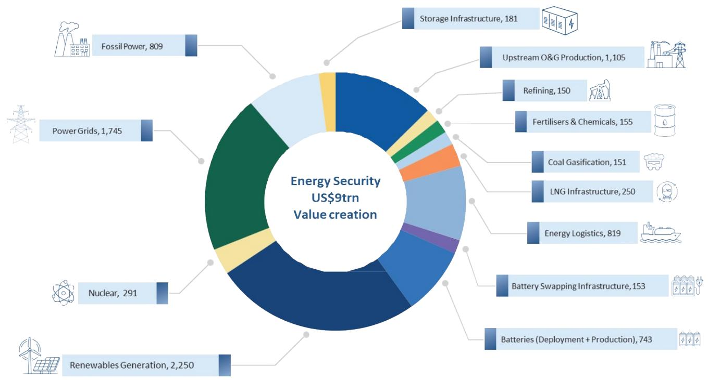

donut

Energy Security US$9trn Value creation
| Category | Value (US$9trn) |
| :--- | :--- |
| Fossil Power | 809 |
| Power Grids | 1,745 |
| Nuclear | 291 |
| Renewables Generation | 2,250 |
| Storage Infrastructure | 181 |
| Upstream O&G Production | 1,105 |
| Refining | 150 |
| Fertilisers & Chemicals | 155 |
| Coal Gasification | 151 |
| LNG Infrastructure | 250 |
| Energy Logistics | 819 |
| Battery Swapping Infrastructure | 153 |
| Batteries (Deployment + Production) | 743 |

We see a nearly 1.6x torque to the value creation as US\$5trn+ in investments across the region to ensure security of tech, AI, food, and energy supply chains, unlocking US\$9trn in value.

Source: MS estimates.

Powering AI: Asia vs US vs Europe Data Center Power Demand   
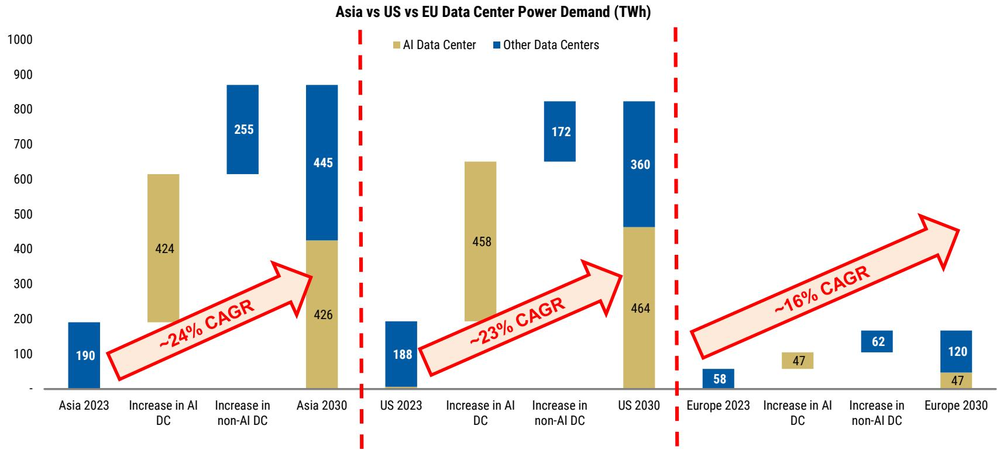

bar_stacked

Asia vs US vs EU Data Center Power Demand (TWh)
| Region | Year | AI Data Center (TWh) | Other Data Centers (TWh) | Total Power Demand (TWh) |
| :--- | :--- | :--- | :--- | :--- |
| Asia 2023 | Asia 2023 | 190 | 424 | 615 |
| Asia 2023 | Increase in AI DC | 190 | 445 | 785 |
| Asia 2023 | Increase in non-AI DC | 190 | 625 | 875 |
| Asia 2030 | Asia 2030 | 426 | 445 | 875 |
| US 2023 | US 2023 | 188 | 188 | 200 |
| US 2023 | Increase in AI DC | 188 | 458 | 655 |
| US 2023 | Increase in non-AI DC | 188 | 172 | 825 |
| US 2030 | US 2030 | 464 | 360 | 825 |
| Europe 2023 | Europe 2023 | 58 | 47 | 10 |
| Europe 2023 | Increase in AI DC | 58 | 62 | 16 |
| Europe 2030 | Europe 2030 | 47 | 120 | 176 |
~24% CAGR for Asia: >US; ~23% CAGR for US; ~16% CAGR for Europe: >Europe.

We estimate Asia's DC power demand CAGR to be \~24% over 2023-30, exceeding that of the US and Europe, driven by faster AI inference demand and more investments committed to the region   
Source: MS estimates.

# MS

# Global Thematic Equity Exposure – Assessing Relative Breadth Across Regions/Markets

Thematic Exposure by Region – North America has significant exposure to AI & Tech Diffusion   
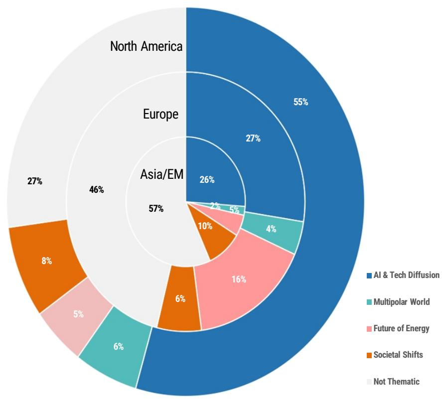

pie

| Region | Category | Percentage (%) |
| :--- | :--- | :--- |
| North America | AI & Tech Diffusion | 55 |
| North America | Multipolar World | 27 |
| North America | Future of Energy | 16 |
| North America | Societal Shifts | 8 |
| North America | Not Thematic | 27 |
| Europe | AI & Tech Diffusion | 26 |
| Europe | Multipolar World | 4 |
| Europe | Future of Energy | 5 |
| Europe | Societal Shifts | 10 |
| Europe | Not Thematic | 46 |
Asia/EM | AI & Tech Diffusion | 2 |
| Asia/EM | Future of Energy | 5 |
| Asia/EM | Societal Shifts | 6 |
| Asia/EM | Not Thematic | 57 |

Source: MS. Note: Stocks mapped to multiple themes have a pro-rated share assigned to each

Thematic Exposure in Asia Pacific – Japan, Taiwan and Korea have the highest concentration of opportunity   
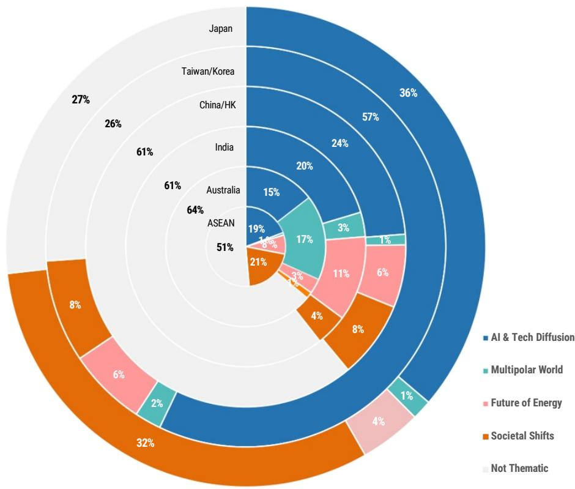

bar_stacked

| Region         | AI & Tech Diffusion | Multipolar World | Future of Energy | Societal Shifts | Not Thematic |
| -------------- | ------------------- | ---------------- | ---------------- | --------------- | ------------ |
| Japan          | 36%                 | 1%               | 4%               | 8%              | 27%          |
| Taiwan/Korea   | 57%                 | 1%               | 6%               | 8%              | 26%          |
| China/HK       | 24%                 | 3%               | 6%               | 4%              | 61%          |
| India          | 20%                 | 17%              | 11%              | 4%              | 61%          |
| Australia      | 15%                 | 19%              | 8%               | 21%             | 51%          |
| ASEAN          | 19%                 | 1%               | 3%               | 8%              | 64%          |

Source: MS; Note stocks mapped to multiple themes have a pro-rated share assigned to each. We include Corporate Reform sub-themes in Asia/EM

# MS

Ranking MS's Sub-themes by Growth, Valuation and Reward/Risk 

<table><tr><td>Theme</td><td>Sub- Theme</td><td>Avg Rank</td><td>Sales Growth CAGR</td><td>EPS Growth CAGR</td><td>P/E vs Themes</td><td>P/Sales vs Themes</td><td>EV/EBITDA vs Themes</td><td>P/E vs History</td><td>P/Sales vs History</td><td>EV/EBITDA vs History</td><td>Upside to Base TP</td><td>Upside to Bull TP</td><td>Bull-Bear Skew</td></tr><tr><td>AI/TD</td><td>China&#x27;s AI Path</td><td>1</td><td>6</td><td>4</td><td>22</td><td>16</td><td>21</td><td>7</td><td>4</td><td>3</td><td>6</td><td>4</td><td>5</td></tr><tr><td>Societal Shifts</td><td>AI &amp; Healthcare</td><td>1</td><td>16</td><td>17</td><td>17</td><td>14</td><td>17</td><td>2</td><td>2</td><td>5</td><td>4</td><td>2</td><td>2</td></tr><tr><td>AI/TD</td><td>Asian AI Adoption Leaders</td><td>3</td><td>10</td><td>9</td><td>24</td><td>19</td><td>27</td><td>4</td><td>3</td><td>7</td><td>2</td><td>3</td><td>4</td></tr><tr><td>Societal Shifts</td><td>Diabesity Ecosystem</td><td>4</td><td>25</td><td>23</td><td>11</td><td>13</td><td>20</td><td>1</td><td>1</td><td>2</td><td>17</td><td>13</td><td>11</td></tr><tr><td>Societal Shifts</td><td>Japan Longevity</td><td>5</td><td>32</td><td>29</td><td>18</td><td>11</td><td>15</td><td>3</td><td>10</td><td>1</td><td>10</td><td>8</td><td>6</td></tr><tr><td>AI/TD</td><td>AI Adopters</td><td>6</td><td>20</td><td>14</td><td>15</td><td>21</td><td>13</td><td>5</td><td>8</td><td>6</td><td>16</td><td>17</td><td>13</td></tr><tr><td>Societal Shifts</td><td>China&#x27;s SOE Reform</td><td>7</td><td>33</td><td>33</td><td>1</td><td>7</td><td>3</td><td>17</td><td>22</td><td>16</td><td>5</td><td>5</td><td>8</td></tr><tr><td>AI/TD</td><td>Asia&#x27;s Technology Advances</td><td>8</td><td>5</td><td>5</td><td>30</td><td>28</td><td>29</td><td>10</td><td>9</td><td>13</td><td>7</td><td>7</td><td>9</td></tr><tr><td>Societal Shifts</td><td>Smart Chemo</td><td>9</td><td>23</td><td>22</td><td>11</td><td>34</td><td>16</td><td>14</td><td>14</td><td>11</td><td>3</td><td>12</td><td>7</td></tr><tr><td>FoE</td><td>Globalization of Natural Gas</td><td>10</td><td>34</td><td>35</td><td>4</td><td>9</td><td>2</td><td>12</td><td>21</td><td>10</td><td>15</td><td>22</td><td>17</td></tr><tr><td>Societal Shifts</td><td>Preparing for an Aging Population</td><td>11</td><td>22</td><td>16</td><td>5</td><td>29</td><td>32</td><td>13</td><td>11</td><td>14</td><td>20</td><td>10</td><td>12</td></tr><tr><td>Societal Shifts</td><td>Japan&#x27;s Corporate Reform</td><td>12</td><td>31</td><td>27</td><td>7</td><td>4</td><td>8</td><td>21</td><td>18</td><td>9</td><td>21</td><td>26</td><td>15</td></tr><tr><td>Societal Shifts</td><td>Future of Food and Beverages</td><td>13</td><td>30</td><td>26</td><td>20</td><td>18</td><td>13</td><td>8</td><td>12</td><td>8</td><td>23</td><td>18</td><td>18</td></tr><tr><td>FoE</td><td>Asia&#x27;s Climate Adaptation</td><td>14</td><td>19</td><td>18</td><td>14</td><td>5</td><td>11</td><td>15</td><td>27</td><td>35</td><td>11</td><td>20</td><td>21</td></tr><tr><td>AI/TD</td><td>China&#x27;s Emerging Frontiers</td><td>15</td><td>2</td><td>2</td><td>35</td><td>35</td><td>35</td><td>25</td><td>6</td><td>15</td><td>19</td><td>9</td><td>27</td></tr><tr><td>MPW</td><td>The Rise in Defense Spending</td><td>16</td><td>12</td><td>12</td><td>31</td><td>20</td><td>30</td><td>33</td><td>27</td><td>25</td><td>12</td><td>6</td><td>3</td></tr><tr><td>Societal Shifts</td><td>Korea Reform Renaissance</td><td>17</td><td>28</td><td>30</td><td>2</td><td>3</td><td>1</td><td>20</td><td>33</td><td>12</td><td>18</td><td>36</td><td>31</td></tr><tr><td>AI/TD</td><td>AI &amp; Tech Diffusion - Asia Pacific</td><td>18</td><td>9</td><td>10</td><td>25</td><td>23</td><td>23</td><td>22</td><td>20</td><td>19</td><td>24</td><td>21</td><td>19</td></tr><tr><td>FoE</td><td>Energy Security</td><td>19</td><td>36</td><td>36</td><td>3</td><td>12</td><td>5</td><td>11</td><td>24</td><td>18</td><td>22</td><td>27</td><td>24</td></tr><tr><td>AI/TD</td><td>AI Enablers</td><td>20</td><td>11</td><td>11</td><td>27</td><td>26</td><td>25</td><td>19</td><td>16</td><td>21</td><td>25</td><td>25</td><td>28</td></tr><tr><td>FoE</td><td>Europe&#x27;s Low Decarb Diet</td><td>21</td><td>35</td><td>34</td><td>6</td><td>2</td><td>4</td><td>24</td><td>17</td><td>23</td><td>30</td><td>32</td><td>30</td></tr><tr><td>MPW</td><td>Critical Minerals</td><td>22</td><td>15</td><td>13</td><td>26</td><td>27</td><td>7</td><td>29</td><td>24</td><td>23</td><td>33</td><td>16</td><td>32</td></tr><tr><td>Societal Shifts</td><td>Asia&#x27;s Financial Acceleration</td><td>23</td><td>24</td><td>32</td><td>8</td><td>32</td><td>26</td><td>28</td><td>24</td><td>20</td><td>14</td><td>29</td><td>16</td></tr><tr><td>FoE</td><td>Clean Energy &amp; Storage</td><td>24</td><td>18</td><td>15</td><td>21</td><td>15</td><td>22</td><td>23</td><td>13</td><td>26</td><td>36</td><td>31</td><td>35</td></tr><tr><td>MPW</td><td>Semiconductor Localisation</td><td>25</td><td>1</td><td>1</td><td>36</td><td>36</td><td>36</td><td>26</td><td>30</td><td>32</td><td>27</td><td>15</td><td>19</td></tr><tr><td>FoE</td><td>Future of Energy - Asia Pacific</td><td>26</td><td>26</td><td>24</td><td>16</td><td>10</td><td>10</td><td>32</td><td>33</td><td>35</td><td>31</td><td>23</td><td>22</td></tr><tr><td>AI/TD</td><td>Humanoid 100</td><td>27</td><td>7</td><td>7</td><td>32</td><td>30</td><td>31</td><td>27</td><td>15</td><td>22</td><td>32</td><td>30</td><td>34</td></tr><tr><td>MPW</td><td>Multipolar World - Asia Pacific</td><td>28</td><td>3</td><td>3</td><td>34</td><td>31</td><td>34</td><td>31</td><td>31</td><td>27</td><td>33</td><td>19</td><td>25</td></tr><tr><td>FoE</td><td>Power Grid Growth &amp; Evolution</td><td>29</td><td>8</td><td>8</td><td>33</td><td>24</td><td>33</td><td>35</td><td>32</td><td>34</td><td>26</td><td>24</td><td>23</td></tr><tr><td>FoE</td><td>Nuclear Renaissance</td><td>30</td><td>27</td><td>31</td><td>19</td><td>17</td><td>18</td><td>30</td><td>35</td><td>33</td><td>29</td><td>33</td><td>29</td></tr><tr><td>FoE</td><td>Powering AI</td><td>31</td><td>21</td><td>21</td><td>28</td><td>25</td><td>24</td><td>34</td><td>27</td><td>30</td><td>28</td><td>34</td><td>33</td></tr><tr><td>AI/TD</td><td>AI infrastructure</td><td>32</td><td>4</td><td>6</td><td>29</td><td>33</td><td>28</td><td>36</td><td>35</td><td>29</td><td>35</td><td>35</td><td>36</td></tr></table>

Source: FactSet, MS. Note: Data as of May 6, 2026.

# MS

# Asia's Competitive Reinvention and Reform Beneficiaries

Total payout ratio trends (dividends + net buybacks) - Japan has more than doubled since Abenomics; EM continues to lag at 37% given high investment   
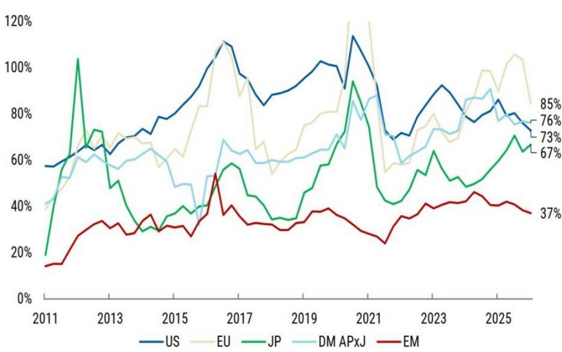

line

| Year | US   | EU   | JP   | DM APxJ | EM   |
|------|------|------|------|---------|------|
| 2025 | 85%  | 76%  | 67%  | 73%     | 37%  |

Source: Bloomberg, MS. Quarterly data as at September end, 2025.

Corporate reform opportunities have been outperforming across Asia, even in a strong market   
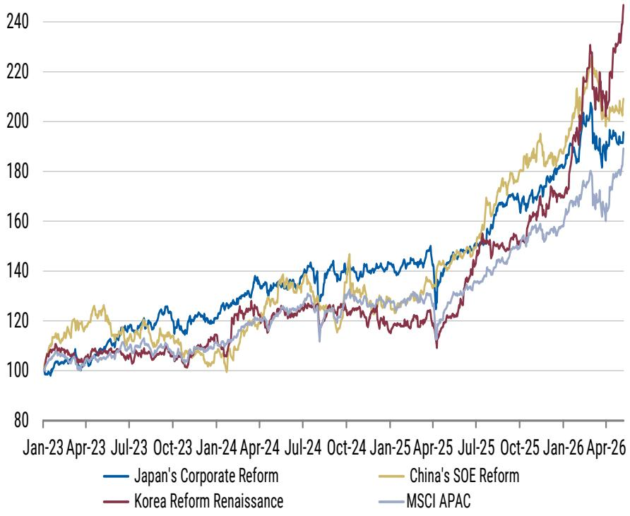

line

| Date     | Japan's Corporate Reform | China's SOE Reform | Korea Reform Renaissance | MSCI APAC |
|----------|---------------------------|--------------------|-------------------------|-----------|
| Jan-23   | ~100                      | ~110               | ~105                    | ~100      |
| Apr-23   | ~105                      | ~115               | ~108                    | ~102      |
| Jul-23   | ~115                      | ~120               | ~110                    | ~105      |
| Oct-23   | ~120                      | ~125               | ~115                    | ~108      |
| Jan-24   | ~125                      | ~130               | ~120                    | ~110      |
| Apr-24   | ~130                      | ~135               | ~125                    | ~115      |
| Jul-24   | ~135                      | ~140               | ~130                    | ~120      |
| Oct-24   | ~140                      | ~145               | ~135                    | ~125      |
| Jan-25   | ~145                      | ~150               | ~140                    | ~130      |
| Apr-25   | ~150                      | ~155               | ~145                    | ~135      |
| Jul-25   | ~160                      | ~165               | ~155                    | ~145      |
| Oct-25   | ~170                      | ~175               | ~165                    | ~155      |
| Jan-26   | ~180                      | ~185               | ~175                    | ~165      |
| Apr-26   | ~190                      | ~200               | ~185                    | ~175      |

Source: FactSet, MS; Data as of May 7, 2026.

# China — Imported Inflation, Not Sustained Reflation

GDP deflator steps out of deflation, but not out of the woods   
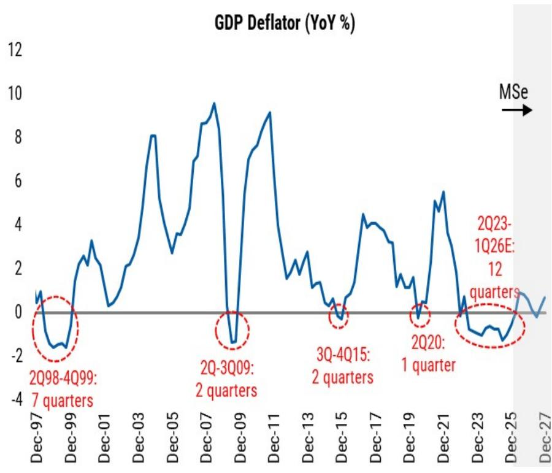

line

| Period         | Year       | GDP Deflator (YoY %) |
| -------------- | ---------- | --------------------- |
| 2Q98-4Q99      | 7 quarters | -2                    |
| 2Q-3Q09        | 2 quarters | -2                    |
| 3Q-4Q15        | 2 quarters | -1                    |
| 2Q20           | 1 quarter  | -1                    |
| 2Q23-1Q26E     | 1Q26E      | 1                     |

Source: CEIC, MS.

Labor Market remained subdued, led by the service sector   
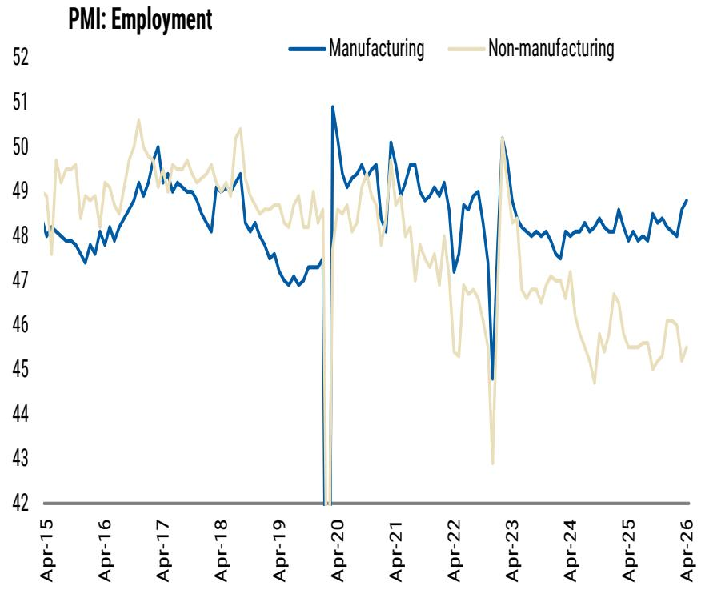

line

| Date   | Manufacturing | Non-manufacturing |
|--------|---------------|-------------------|
| Apr-15 | 48.0          | 49.0              |
| Apr-16 | 47.5          | 48.5              |
| Apr-17 | 49.5          | 50.5              |
| Apr-18 | 48.5          | 49.0              |
| Apr-19 | 47.0          | 48.0              |
| Apr-20 | 51.0          | 48.5              |
| Apr-21 | 49.0          | 48.0              |
| Apr-22 | 47.5          | 46.0              |
| Apr-23 | 44.5          | 43.0              |
| Apr-24 | 48.0          | 46.5              |
| Apr-25 | 48.5          | 45.5              |
| Apr-26 | 49.0          | 45.0              |

# China – Reflation Midway: “5R” Reflation Strategy

# Progress by End-2025

Reflation (20-25%)

Rebalancing (25-30%)

Restructuring (60-80%)

Reform (25%)

Rekindle (60-70%)

# Policy Measures

• 1.1ppt of GDP widening in the augmented fiscal deficit in 2025   
- PBoC cut policy rate by 10bp and RRR by 50bp in 2025.

- Consumption support: consumer goods trade-in; wage hike for civil servants.   
- Social welfare: national fertility subsidies; free preschool education.   
- Anti-involution: current measures mainly center around capacity consolidation and verbal guidance.

- A 5-year Rmb10trn local government debt swap program.   
- Wider government bond usage for land and housing inventory buyback.   
- Rmb300bn in PBoC relending for converting housing inventory to social housing.   
- Start of equity market reforms with “Nine-Point Guideline” to promote investment returns.

• President Xi held a symposium with private firms, with Jack Ma included.   
- New swap and relending facilities to support stock market.

# Best Scenario

- A consumption-focused Rmb10trn fiscal package over the next two years.   
- More meaningful monetary easing measures to lower elevated real interest rates.   
- Meaningful rise in social welfare spending to unleash elevated household savings for consumption.   
- Launch of “Structural Reform 2.0” to reform supply-centric incentives and curb inefficient manufacturing capacity.   
- Rmb3-4trn central government/quasi-fiscal funding to help digest housing inventory.   
- A comprehensive LGFV debt resolution plan to evenly share the burden among central government, local governments, PBoC and banks.   
• SOE reforms to improve public sector productivity.   
- Fiscal and tax reforms revamp local government incentives and improve the efficiency of resource allocation.   
- Clearer signals to end the regulatory reset since 2021.   
• More efforts to invigorate the capital markets.   
• Further service sector opening up.

# MS

MSCI China ROE May Have Troughed Given Bottom-up Progress   
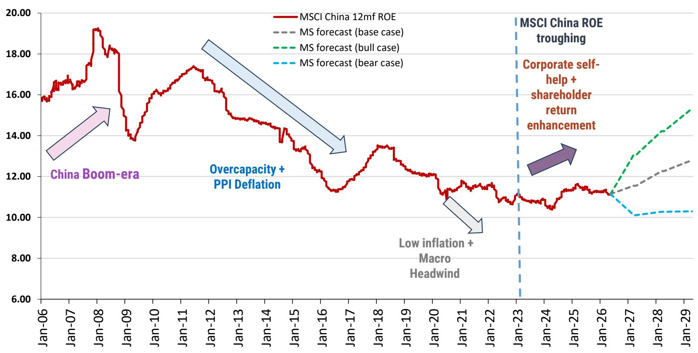

line

| Date    | MSCI China 12mf ROE | MS forecast (base case) | MS forecast (bull case) | MS forecast (bear case) |
|---------|---------------------|--------------------------|--------------------------|--------------------------|
| Jan-06  | ~15.8               | -                        | -                        | -                        |
| Jan-07  | ~16.5               | -                        | -                        | -                        |
| Jan-08  | ~19.0               | -                        | -                        | -                        |
| Jan-09  | ~14.0               | -                        | -                        | -                        |
| Jan-10  | ~16.0               | -                        | -                        | -                        |
| Jan-11  | ~17.0               | -                        | -                        | -                        |
| Jan-12  | ~17.5               | -                        | -                        | -                        |
| Jan-13  | ~15.0               | -                        | -                        | -                        |
| Jan-14  | ~14.5               | -                        | -                        | -                        |
| Jan-15  | ~13.5               | -                        | -                        | -                        |
| Jan-16  | ~12.0               | -                        | -                        | -                        |
| Jan-17  | ~11.5               | -                        | -                        | -                        |
| Jan-18  | ~13.5               | -                        | -                        | -                        |
| Jan-19  | ~12.5               | -                        | -                        | -                        |
| Jan-20  | ~11.5               | -                        | -                        | -                        |
| Jan-21  | ~11.0               | ~9.5                     | -                        | -                        |
| Jan-22  | ~11.5               | ~10.5                    | -                        | -                        |
| Jan-23  | ~10.5               | ~11.0                    | -                        | -                        |
| Jan-24  | ~10.5               | ~11.5                    | -                        | -                        |
| Jan-25  | ~11.0               | ~12.0                    | -                        | -                        |
| Jan-26  | ~11.0               | ~12.5                    | -                        | -                        |
| Jan-27  | ~10.5               | ~13.0                    | ~13.5                    | ~10.0                    |
| Jan-28  | ~10.5               | ~13.5                    | ~14.0                    | ~10.0                    |
| Jan-29  | ~10.5               | ~14.0                    | ~14.5                    | ~10.0                    |

Source: Bloomberg, MS. Note: Historical data are weekly as of May 8, 2026.

# Japan — A Momentous Shift to Sustained Nominal Growth

Japan's Nominal GDP (trn yen) and TOPIX   
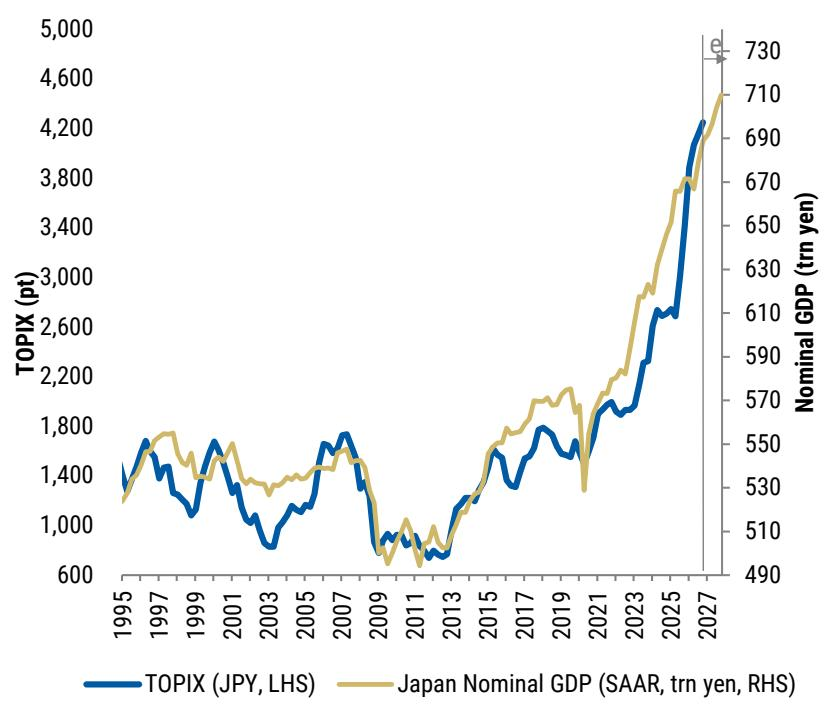

line

| Year | TOPIX (JPY, LHS) | Japan Nominal GDP (SAAR, trn yen, RHS) |
|------|------------------|----------------------------------------|
| 1995 | ~1,300           | ~530                                   |
| 1997 | ~1,600           | ~550                                   |
| 1999 | ~1,400           | ~540                                   |
| 2001 | ~1,700           | ~560                                   |
| 2003 | ~1,000           | ~530                                   |
| 2005 | ~1,400           | ~550                                   |
| 2007 | ~1,800           | ~570                                   |
| 2009 | ~900             | ~490                                   |
| 2011 | ~800             | ~510                                   |
| 2013 | ~1,000           | ~530                                   |
| 2015 | ~1,400           | ~560                                   |
| 2017 | ~1,800           | ~580                                   |
| 2019 | ~1,600           | ~600                                   |
| 2021 | ~2,200           | ~630                                   |
| 2023 | ~2,800           | ~660                                   |
| 2025 | ~3,600           | ~690                                   |
| 2027 | ~4,600           | ~730                                   |

Source: FAME, MS Japan Economics Research. Note: Nominal GDP from 4Q2025 and beyond shows our forecast.

Real Capex and Our Forecasts (2015 chain price, trn yen) – Capex Trend has Shifted up Even on an Inflation-adjusted Basis   
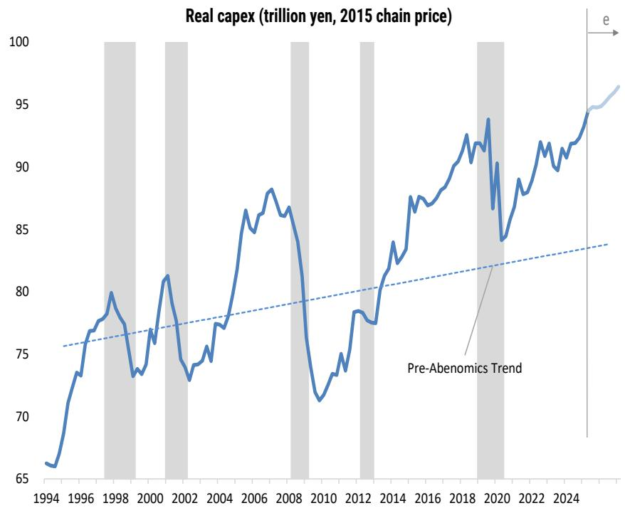

line

| Year | Real capex (trillion yen, 2015 chain price) |
|------|---------------------------------------------|
| 1994 | ~66                                         |
| 1996 | ~78                                         |
| 1998 | ~80                                         |
| 2000 | ~73                                         |
| 2002 | ~75                                         |
| 2004 | ~77                                         |
| 2006 | ~87                                         |
| 2008 | ~86                                         |
| 2010 | ~71                                         |
| 2012 | ~78                                         |
| 2014 | ~83                                         |
| 2016 | ~88                                         |
| 2018 | ~92                                         |
| 2020 | ~94                                         |
| 2022 | ~91                                         |
| 2024 | ~95                                         |

e=MS estimates. Shaded bars indicate recession periods. Source: Cabinet Office, MS Japan Economics Research.

# Japan — Reform and Reflation Remain Supportive, with Underappreciated Fiscal Space

Total Share Buybacks Executed in Japan   
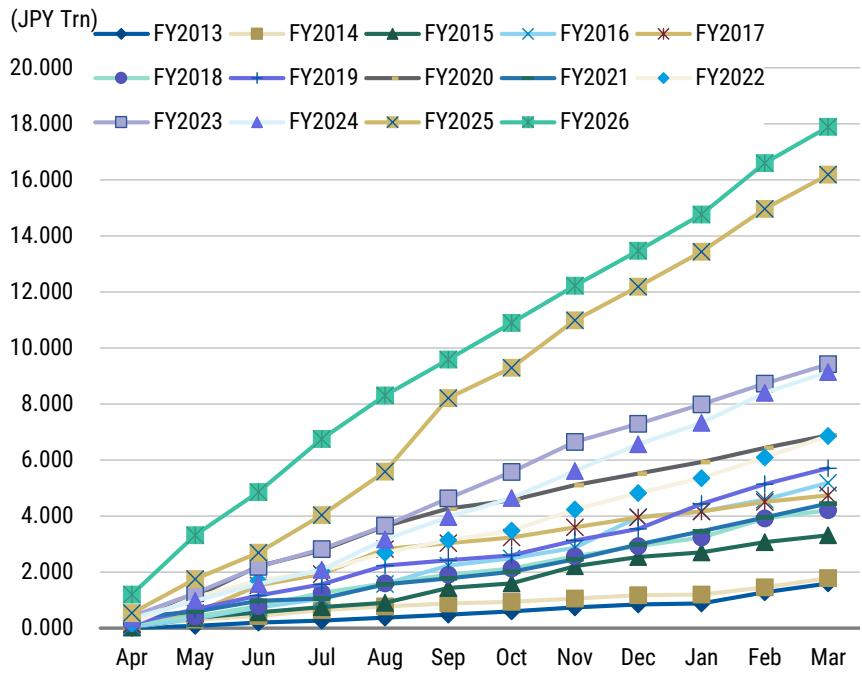  
Note: The universe consists of former TSE1 and current Prime Market firms. The table shows the total amount of share buybacks executed, and the dates are based on official authorized dates. The market data is as of May,8 2026. Please note that the figures for November are still preliminary.   
Source: Bloomberg, FactSet, QUICK Workstation, INDB, MS

General government gross/net debt (% of GDP)   
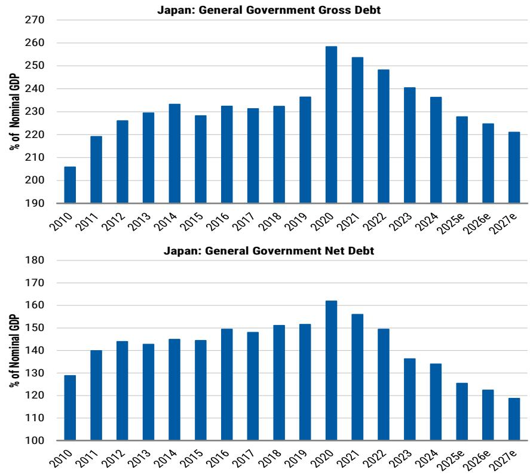

bar

Japan: General Government Gross Debt
| Year | % of Nominal GDP |
| :--- | :--- |
| 2010 | 206 |
| 2011 | 219 |
| 2012 | 226 |
| 2013 | 229 |
| 2014 | 233 |
| 2015 | 228 |
| 2016 | 232 |
| 2017 | 231 |
| 2018 | 232 |
| 2019 | 236 |
| 2020 | 258 |
| 2021 | 253 |
| 2022 | 248 |
| 2023 | 240 |
| 2024 | 236 |
| 2025e | 228 |
| 2026e | 225 |
| 2027e | 221 |

| Japan: General Government Net Debt (%) | % of Nominal GDP |
|---|---|
| 2010 | 129 |
| 2011 | 140 |
| 2012 | 144 |
| 2013 | 143 |
| 2014 | 145 |
| 2015 | 144 |
| 2016 | 149 |
| 2017 | 148 |
| 2018 | 151 |
| 2019 | 151 |
| 2020 | 162 |
| 2021 | 156 |
| 2022 | 149 |
| 2023 | 136 |
| 2024 | 134 |
| 2025e | 125 |
| 2026e | 123 |
| 2027e | 119 |

e= MS estimates.   
Source: IMF, MS Japan Economics Research.

# MS

Japan — PM Takaichi's 17 Strategic Domains Converge into a Set of Concepts   
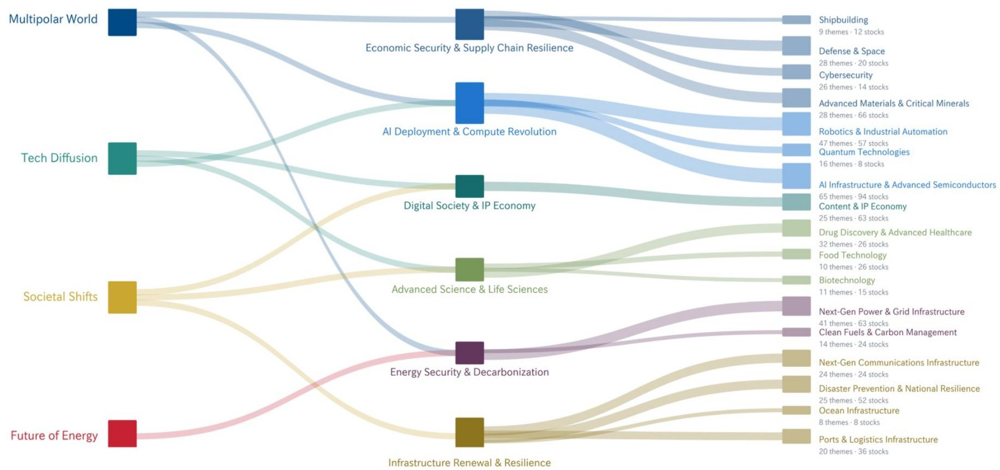  
Note: MS's four Big Themes are defined as the top-level investment concepts (L0). L1 comprises six investment narratives derived from L0. L2 is defined as the 17 strategic domains under the Takaichi administration (Defense and Space" are consolidated into single category. "Energy security and GX" are split into "Next-Gen Power & Grid Infra" and "Clean Fuels & Carbon Management," with fusion energy included in the former. Robotics is treated as a standalone theme.). L3 contains L4, the stock-selection categories. The universe is Prime-listed companies plus Astroscale.   
Source: MS

# Disclosure Section

The information and opinions in MS were prepared or are disseminated by MS Asia Limited (which accepts the responsibility for its contents) and/or MS Asia (Singapore) Pte. (Registration number 199206298Z) and/or MS Asia (Singapore) Securities Pte Ltd (Registration number 200008434H), regulated by the Monetary Authority of Singapore (which accepts legal responsibility for its contents and should be contacted with respect to any matters arising from, or in connection with, MS), and/or MS Taiwan Limited and/or MS & Co International plc, Seoul Branch, and/or MS Australia Limited (A.B.N. 67 003 734 576, holder of Australian financial services license No. 233742, which accepts responsibility for its contents), and/or MS Wealth Management Australia Pty Ltd (A.B.N. 19 009 145 555, holder of Australian financial services license No. 240813, which accepts responsibility for its contents), and/or MS India Company Private Limited having Corporate Identification No (CIN) U22990MH1998PTC115305, regulated by the Securities and Exchange Board of India ("SEBI") and holder of licenses as a Research Analyst (SEBI Registration No. INH000001105); Stock Broker (SEBI Stock Broker Registration No. INZ000244438), Merchant Banker (SEBI Registration No. INM000011203), and depository participant with National Securities Depository Limited (SEBI Registration No. IN-DP-NSDL-567-2021) having registered office at Altimus, Level 39 & 40, Pandurang Budhkar Marg, Worli, Mumbai 400018, India; Telephone no. +91-22-61181000; Compliance Officer Details: Mr. Tejarshi Hardas, Tel. No.: +91-22-61181000 or Email: tejarshi.hardas@morganstanley.com; Grievance officer details: Mr. Tejarshi Hardas, Tel. No.: +91-22-61181000 or Email: msic-compliance@morganstanley.com which accepts the responsibility for its contents and should be contacted with respect to any matters arising from, or in connection with, MS, and their affiliates (collectively, "MS"). MS India Company Private Limited (MSICPL) may use AI tools in providing research services. All recommendations contained herein are made by the duly qualified research analysts.

For important disclosures, stock price charts and equity rating histories regarding companies that are the subject of this report, please see the MS Disclosure Website at www.morganstanley.com/eqr/disclosures/webapp/generalresearch, or contact your investment representative or MS at 1585 Broadway, (Attention: Research Management), New York, NY, 10036 USA.

For valuation methodology and risks associated with any recommendation, rating or price target referenced in this research report, please contact the Client Support Team as follows: US/Canada +1800 303-2495; Hong Kong +852 2848-5999; Latin America +1718 754-5444 (U.S.); London +44 (0)20-7425-8169; Singapore +65 6834-6860; Sydney +61(0)2-9770-1505; Tokyo +81(0)3-6836-9000. Alternatively you may contact your investment representative or MS at 1585 Broadway, (Attention: Research Management), New York, NY 10036 USA.

# Analyst Certification

The following analysts hereby certify that their views about the companies and their securities discussed in this report are accurately expressed and that they have not received and will not receive direct or indirect compensation in exchange for expressing specific recommendations or views in this report: Daniel K Blake; Jonathan F Garner; Kristal Ji; Sho Nakazawa; Laura Wang.

# Global Research Conflict Management Policy

MS has been published in accordance with our conflict management policy, which is available at www.morganstanley.com/institutional/research/conflictpolicies. A Portuguese version of the policy can be found at www.morganstanley.com.br

# Important Regulatory Disclosures on Subject Companies

The equity research analysts or strategists principally responsible for the preparation of MS have received compensation based upon various factors, including quality of research, investor client feedback, stock picking, competitive factors, firm revenues and overall investment banking revenues. Equity Research analysts' or strategists' compensation is not linked to investment banking or capital markets transactions performed by MS or the profitability or revenues of particular trading desks.

MS and its affiliates do business that relates to companies/instruments covered in MS, including market making, providing liquidity, fund management, commercial banking, extension of credit, investment services and investment banking. MS sells to and buys from customers the securities/instruments of companies covered in MS on a principal basis. MS may have a position in the debt of the Company or instruments discussed in this report. MS trades or may trade as principal in the debt securities (or in related derivatives) that are the subject of the debt research report.

Certain disclosures listed above are also for compliance with applicable regulations in non-US jurisdictions.

# STOCK RATINGS

MS uses a relative rating system using terms such as Overweight, Equal-weight, Not-Rated or Underweight (see definitions below). MS does not assign ratings of Buy, Hold or Sell to the stocks we cover. Overweight, Equal-weight, Not-Rated and Underweight are not the equivalent of buy, hold and sell. Investors should carefully read the definitions of all ratings used in MS. In addition, since MS contains more complete information concerning the analyst's views, investors should carefully read MS, in its entirety, and not infer the contents from the rating alone. In any case, ratings (or research) should not be used or relied upon as investment advice. An investor's decision to buy or sell a stock should depend on individual circumstances (such as the investor's existing holdings) and other considerations.

# Global Stock Ratings Distribution

(as of May 31, 2026)

The Stock Ratings described below apply to MS's Fundamental Equity Research and do not apply to Debt Research produced by the Firm.

For disclosure purposes only (in accordance with FINRA requirements), we include the category headings of Buy, Hold, and Sell alongside our ratings of Overweight, Equal-weight, Not-Rated and Underweight. MS does not assign ratings of Buy, Hold or Sell to the stocks we cover. Overweight, Equal-weight, Not-Rated and Underweight are not the equivalent of buy, hold, and sell but represent recommended relative weightings (see definitions below). To satisfy regulatory requirements, we correspond

Overweight, our most positive stock rating, with a buy recommendation; we correspond Equal-weight and Not-Rated to hold and Underweight to sell recommendations, respectively.

<table><tr><td></td><td colspan="2">Coverage Universe</td><td colspan="3">Investment Banking Clients (IBC)</td><td colspan="2">Other Material Investment Services Clients (MISC)</td></tr><tr><td>Stock Rating Category</td><td>Count</td><td>% of Total</td><td>Count</td><td>% of Total IBC</td><td>% of Rating Category</td><td>Count</td><td>% of Total Other MISC</td></tr><tr><td>Overweight/Buy</td><td>1542</td><td>42%</td><td>465</td><td>51%</td><td>30%</td><td>707</td><td>43%</td></tr><tr><td>Equal-weight/Hold</td><td>1571</td><td>43%</td><td>369</td><td>40%</td><td>23%</td><td>723</td><td>44%</td></tr><tr><td>Not-Rated/Hold</td><td>3</td><td>0%</td><td>0</td><td>0%</td><td>0%</td><td>1</td><td>0%</td></tr><tr><td>Underweight/Sell</td><td>551</td><td>15%</td><td>86</td><td>9%</td><td>16%</td><td>201</td><td>12%</td></tr><tr><td>Total</td><td>3,667</td><td></td><td>920</td><td></td><td></td><td>1632</td><td></td></tr></table>

Data include common stock and ADRs currently assigned ratings. Investment Banking Clients are companies from whom MS received investment banking compensation in the last 12 months. Due to rounding off of decimals, the percentages provided in the "% of total" column may not add up to exactly 100 percent.

# Analyst Stock Ratings

Overweight (O). The stock's total return is expected to exceed the average total return of the analyst's industry (or industry team's) coverage universe, on a risk-adjusted basis, over the next 12-18 months.

Equal-weight (E). The stock's total return is expected to be in line with the average total return of the analyst's industry (or industry team's) coverage universe, on a risk-adjusted basis, over the next 12-18 months.

Not-Rated (NR). Currently the analyst does not have adequate conviction about the stock's total return relative to the average total return of the analyst's industry (or industry team's) coverage universe, on a risk-adjusted basis, over the next 12-18 months.

Underweight (U). The stock's total return is expected to be below the average total return of the analyst's industry (or industry team's) coverage universe, on a risk-adjusted basis, over the next 12-18 months.

Unless otherwise specified, the time frame for price targets included in MS is 12 to 18 months.

# Analyst Industry Views

Attractive (A): The analyst expects the performance of his or her industry coverage universe over the next 12-18 months to be attractive vs. the relevant broad market benchmark, as indicated below.

In-Line (I): The analyst expects the performance of his or her industry coverage universe over the next 12-18 months to be in line with the relevant broad market benchmark, as indicated below.

Cautious (C): The analyst views the performance of his or her industry coverage universe over the next 12-18 months with caution vs. the relevant broad market benchmark, as indicated below.

Benchmarks for each region are as follows: North America - S&P 500; Latin America - relevant MSCI country index or MSCI Latin America Index; Europe - MSCI Europe; Japan - TOPIX; Asia - relevant MSCI country index or MSCI sub-regional index or MSCI AC Asia Pacific ex Japan Index.

# Important Disclosures for MS Smith Barney LLC Customers

Important disclosures regarding any material conflict of interest that can reasonably be expected to have influenced MS Smith Barney LLC's choice of a third-party research provider or the subject company of a third-party research report, are available on the MS Wealth Management disclosure website at www.morganstanley.com/online/researchdisclosures. For MS specific disclosures, you may refer to https://www.morganstanley.com/eqr/disclosures/webapp/generalresearch.

Each MS report is reviewed and approved on behalf of MS Smith Barney LLC. This review and approval is conducted by the same person who reviews the research report on behalf of MS. This could create a conflict of interest.

# Other Important Disclosures

MS policy is to update research reports as and when the Research Analyst and Research Management deem appropriate, based on developments with the issuer, the sector, or the market that may have a material impact on the research views or opinions stated therein. In addition, certain Research publications are intended to be updated on a regular periodic basis (weekly/monthly/quarterly/annual) and will ordinarily be updated with that frequency, unless the Research Analyst and Research Management determine that a different publication schedule is appropriate based on current conditions.

MS is not acting as a municipal advisor and the opinions or views contained herein are not intended to be, and do not constitute, advice within the meaning of Section 975 of the Dodd-Frank Wall Street Reform and Consumer Protection Act. MS produces an equity research product called a "Tactical Idea." Views contained in a "Tactical Idea" on a particular stock may be contrary to the recommendations or views expressed in research on the same stock. This may be the result of differing time horizons, methodologies, market events, or other factors. For all research available on a particular stock, please contact your sales representative or go to Matrix at http://www.morganstanley.com/matrix.

MS is provided to our clients through our proprietary research portal on Matrix and also distributed electronically by MS to clients. Certain, but not all, MS products are also made available to clients through third-party vendors or redistributed to clients through alternate electronic means as a convenience. For access to all available MS, please contact your sales representative or go to Matrix at http://www.morganstanley.com/matrix.Any access and/or use of MS is subject to MS's Terms of Use (http://www.morganstanley.com/terms.html). By accessing and/or using MS, you are indicating that you have read and agree to be bound by our Terms of Use (http://www.morganstanley.com/terms.html). In addition you consent to MS processing your personal data and using cookies in accordance with our Privacy Policy and our Global Cookies Policy (http://www.morganstanley.com/privacy\_pledge.html), including for the purposes of setting your preferences and to collect readership data so that we can deliver better and more personalized service and products to you. To find out more information about how MS processes personal data, how we use cookies and how to reject cookies see our Privacy Policy and our Global Cookies Policy (http://www.morganstanley.com/privacy\_pledge.html). Please use the provided link to review the Terms and Conditions and Most Important Terms and Conditions for MS India Company Private Limited (https://www.morganstanley.com/assets/pdfs/about-us-global-offices/india/Terms\_and\_conditions.pdf) and the following link to review the audit report (https://ny.matrix.ms.com/eqr/research/webapp/researchdocs/MSICPL\_Morgan\_Stanley\_Research\_Audit\_Report.pdf).

If you do not agree to our Terms of Use and/or if you do not wish to provide your consent to MS processing your personal data or using cookies please do not access our research.

MS does not provide individually tailored investment advice. MS has been prepared without regard to the circumstances and objectives of those who receive it. MS recommends that investors independently evaluate particular investments and strategies, and encourages investors to seek the advice of a financial adviser. The appropriateness of an investment or strategy will depend on an investor's circumstances and objectives. The securities, instruments, or strategies discussed in MS may not be suitable for all investors, and certain investors may not be eligible to purchase or participate in some or all of them. MS is not an offer to buy or sell or the solicitation of an offer to buy or sell any security/instrument or to participate in any particular trading strategy. The value of and income from your investments may vary because of changes in interest rates, foreign exchange rates, default rates, prepayment rates, securities/instruments prices, market indexes, operational or financial conditions of companies or other factors. There may be time limitations on the exercise of options or other rights in securities/instruments transactions. Past performance is not necessarily a guide to future performance. Estimates of future performance are based on assumptions that may not be realized. If provided, and unless otherwise stated, the closing price on the cover page is that of the primary exchange for the subject company's securities/instruments.

The fixed income research analysts, strategists or economists principally responsible for the preparation of MS have received compensation based upon various factors, including quality, accuracy and value of research, firm profitability or revenues (which include fixed income trading and capital markets profitability or revenues), client feedback and competitive factors. Fixed Income Research analysts', strategists' or economists' compensation is not linked to investment banking or capital markets transactions performed by MS or the profitability or revenues of particular trading desks.

The "Important Regulatory Disclosures on Subject Companies" section in MS lists all companies mentioned where MS owns 1% or more of a class of common equity securities of the companies. For all other companies mentioned in MS, MS may have an investment of less than 1% in securities/instruments or derivatives of securities/instruments of companies and may trade them in ways different from those discussed in MS. Employees of MS not involved in the preparation of MS may have investments in securities/instruments or derivatives of securities/instruments of companies mentioned and may trade them in ways different from those discussed in MS. Derivatives may be issued by MS or associated persons.

With the exception of information regarding MS, MS is based on public information. MS makes every effort to use reliable, comprehensive information, but we make no representation that it is accurate or complete. We have no obligation to tell you when opinions or information in MS change apart from when we intend to discontinue equity research coverage of a subject company. Facts and views presented in MS have not been reviewed by, and may not reflect information known to, professionals in other MS business areas, including investment banking personnel.

MS personnel may participate in company events such as site visits and are generally prohibited from accepting payment by the company of associated expenses unless pre-approved by authorized members of Research management. MS may make investment decisions that are inconsistent with the recommendations or views in this report.

To our readers based in Taiwan or trading in Taiwan securities/instruments: Information on securities/instruments that trade in Taiwan is distributed by MS Taiwan Limited ("MSTL"). Such information is for your reference only. The reader should independently evaluate the investment risks and is solely responsible for their investment decisions. MS may not be distributed to the public media or quoted or used by the public media without the express written consent of MS. Any non-customer reader within the scope of Article 7-1 of the Taiwan Stock Exchange Recommendation Regulations accessing and/or receiving MS is not permitted to provide MS to any third party (including but not limited to related parties, affiliated companies and any other third parties) or engage in any activities regarding MS which may create or give the appearance of creating a conflict of interest. Information on securities/instruments that do not trade in Taiwan is for informational purposes only and is not to be construed as a recommendation or a solicitation to trade in such securities/instruments. MSTL may not execute transactions for clients in these securities/instruments.

Certain information in MS was sourced by employees of the Shanghai Representative Office of MS Asia Limited for the use of MS Asia Limited.

MS is not incorporated under PRC law and the research in relation to this report is conducted outside the PRC. MS does not constitute an offer to sell or the solicitation of an offer to buy any securities in the PRC. PRC investors shall have the relevant qualifications to invest in such securities and shall be responsible for obtaining all relevant approvals, licenses, verifications and/or registrations from the relevant governmental authorities themselves. Neither this report nor any part of it is intended as, or shall constitute, provision of any consultancy or advisory service of securities investment as defined under PRC law. Such information is provided for your reference only.

MS is disseminated in Brazil by MS C.T.V.M. S.A. located at Av. Brigadeiro Faria Lima, 3600, 6th floor, São Paulo - SP, Brazil; and is regulated by the Comissão de Valores Mobiliários; in Mexico by MS México, Casa de Bolsa, S.A. de C.V which is regulated by Comision Nacional Bancaria y de Valores. Paseo de los Tamarindos 90, Torre 1, Col. Bosques de las Lomas Floor 29, 05120 Mexico City; in Japan by MS MUFG Securities Co., Ltd. and, for Commodities related research reports only, MS Capital Group Japan Co., Ltd; in Hong Kong by MS Asia Limited (which accepts responsibility for its contents) and by MS Bank Asia Limited; in Singapore by MS Asia (Singapore) Pte. (Registration number 199206298Z) and/or MS Asia (Singapore) Securities Pte Ltd (Registration number 200008434H), regulated by the Monetary Authority of Singapore (which accepts legal responsibility for its contents and should be contacted with respect to any matters arising from, or in connection with, MS) and by MS Bank Asia Limited, Singapore Branch (Registration number T14FC0118); in Australia to "wholesale clients" within the meaning of the Australian Corporations Act by MS Australia Limited A.B.N. 67 003 734 576, holder of Australian financial services license No. 23374-2, which accepts responsibility for its contents; in Australia to "wholesale clients" and "retail clients" within the meaning of the Australian Corporations Act by MS Wealth Management Australia Pty Ltd (A.B.N. 19 009 145 555, holder of Australian financial services license No. 240813, which accepts responsibility for its contents; in Korea by MS & Co International plc, Seoul Branch; in India by MS India Company Private Limited having Corporate Identification No (CIN) U22990MH1998PTC115305, regulated by the Securities and Exchange Board of India ("SEBI") and holder of licenses as a Research Analyst (SEBI Registration No. INH000001105); Stock Broker (SEBI Stock Broker Registration No. INZ000244438), Merchant Banker (SEBI Registration No. INM000011203), and depository participant with National Securities Depository Limited (SEBI Registration No. IN-DP-NSDL-567-2021) having registered office at Altimus, Level 39 & 40, Pandurang Budhkar Marg, Worli, Mumbai 400018, India; Telephone no. +91-22-61181000; Compliance Officer Details: Mr. Tejarshi Hardas, Tel. No.: +91-22-61181000 or Email: tejarshi.hardas@morganstanley.com; Grievance officer details: Mr. Tejarshi Hardas, Tel. No.: +91-22-61181000 or Email: msic-compliance@morganstanley.com. MS India Company Private Limited (MSICPL) may use AI tools in providing research services. All recommendations contained herein are made by the duly qualified research analysts; in Canada by MS Canada Limited; in Germany and the European Economic Area where required by MS Europe S.E., authorised and regulated by Bundesanstalt fuer Finanzdienstleistungsaufsicht (BaFin) under the reference number 149169; in the US by MS & Co. LLC, which accepts responsibility for its contents. MS & Co. International plc, authorized by the Prudential Regulation Authority and regulated by the Financial Conduct Authority and the Prudential Regulation Authority, disseminates in the UK research that it has prepared, and research which has been prepared by any of its affiliates, only to persons who (i) are investment professionals falling within Article 19(5) of the Financial Services and Markets Act 2000 (Financial Promotion) Order 2005 (as amended, the "Order"); (ii) are persons who are high net worth entities falling within Article 49(2)(a) to (d) of the Order; or (iii) are persons to whom an invitation or inducement to engage in investment activity (within the meaning of section 21 of the Financial Services and Markets Act 2000, as amended) may otherwise lawfully be communicated or caused to be communicated. RMB MS Proprietary Limited is a member of the JSE Limited and A2X (Pty) Ltd. RMB MS Proprietary Limited is a joint venture owned equally by MS International Holdings Inc. and RMB Investment Advisory (Proprietary) Limited, which is wholly owned by FirstRand Limited. The information in MS is being disseminated by MS Saudi Arabia, regulated by the Capital Market Authority in the Kingdom of Saudi Arabia, and is directed at Sophisticated investors only.

The information in MS is being communicated by MS & Co. International plc (DIFC Branch), regulated by the Dubai Financial Services Authority (the DFSA) or by MS & Co. International plc (ADGM Branch), regulated by the Financial Services Regulatory Authority Abu Dhabi (the FSRA), and is directed at Professional Clients only, as defined by the DFSA or the FSRA, respectively. The financial products or financial services to which this research relates will only be made available to a customer who we are satisfied meets the regulatory criteria of a Professional Client. A distribution of the different MS Research ratings or recommendations, in percentage terms for Investments in each sector covered, is available upon request from your sales representative.

The information in MS is being communicated by MS & Co. International plc (QFC Branch), regulated by the Qatar Financial Centre Regulatory Authority (the QFCRA), and is directed at business customers and market counterparties only and is not intended for Retail Customers as defined by the QFCRA.

As required by the Capital Markets Board of Turkey, investment information, comments and recommendations stated here, are not within the scope of investment advisory activity. Investment advisory service is provided exclusively to persons based on their risk and income preferences by the authorized firms. Comments and recommendations stated here are general in nature. These opinions may not fit to your financial status, risk and return preferences. For this reason, to make an investment decision by relying solely to this information stated here may not bring about outcomes that fit your expectations.

The trademarks and service marks contained in MS are the property of their respective owners. Third-party data providers make no warranties or representations relating to the accuracy, completeness, or timeliness of the data they provide and shall not have liability for any damages relating to such data. The Global Industry Classification Standard (GICS) was developed by and is the exclusive property of MSCI and S&P.

MS, or any portion thereof may not be reprinted, sold or redistributed without the written consent of MS.

Indicators and trackers referenced in MS may not be used as, or treated as, a benchmark under Regulation EU 2016/1011, or any other similar framework.

The issuers and/or fixed income products recommended or discussed in certain fixed income research reports may not be continuously followed. Accordingly, investors should regard those fixed income research reports as providing stand-alone analysis and should not expect continuing analysis or additional reports relating to such issuers and/or individual fixed income products.

MS may hold, from time to time, material financial and commercial interests regarding the company subject to the Research report.

Registration granted by SEBI and certification from the National Institute of Securities Markets (NISM) in no way guarantee performance of the intermediary or provide any assurance of returns to investors. Investment in securities market are subject to market risks. Read all the related documents carefully before investing.

© 2026 MS