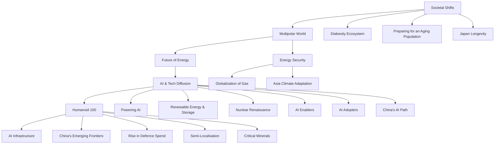

你是闲鱼资料类商品文案编辑，擅长把一份投研/行业/公司研报改写成适合闲鱼发布的商品说明。

【目标】
- 基于下面研报解析内容，生成一份可以复制到闲鱼商品详情里的中文文案。
- 风格参考用户提供的闲鱼对标笔记：标题直给、信息密度高、用途明确、适合人群明确、交付方式清楚。
- 语言要自然，像真实卖家发布，不要像公众号文章、小红书笔记或 AI 摘要。
- 不要使用太夸张的营销词，不要承诺收益，不要说“稳赚”“内幕”“必涨”。
- 可以适度口语化，但不要低俗。

【必须输出结构】
1. `闲鱼标题：` 一行，控制在 30 字以内，适合商品标题。
2. `商品描述：` 正文，适合直接粘贴到闲鱼详情页。
3. `Hashtag：` 一行，给 6-10 个平台可用标签，用 `#` 开头，空格分隔。

【严禁输出】
- 不要输出 `建议价格：`。
- 不要输出 `搜索关键词：`。
- 不要输出“搜索词”“关键词”“搜索关键词”等栏目。
- 不要给具体价格区间、成交承诺或价格建议。

【商品描述写法】
- 第一段：直接说明这是什么报告，页数/语言/主题/公司或行业。如果页数、日期、语言不确定，就不要编。
- 第二段：说明适合谁，比如投研、券商面试、PE/VC、行业研究、学习参考、写报告等。
- 第三段：用 3-5 个亮点 bullet，风格参考：
  ✅ 三大情景框架：DCF、P/ARR、EV/Sales
  ✅ 关键变量分析
  ✅ 估值逻辑、假设、终值占比等核心内容覆盖
  ✅ 适合准备 AI 相关面试、研究 AI 估值的同学
- 第四段：交付说明，参考：`资料为电子版 PDF，拍下后 24 小时内发网盘链接或邮箱。`
- 第五段：虚拟商品说明，参考：`电子类资料一经发货不退不换，有问题可以提前咨询。`
- 可以补一句：`需要其他报告也可以私聊，支持一站式咨询。`

【Hashtag 写法】
- 只输出平台相对安全、偏学习和资料属性的标签。
- 推荐从这些里选择：`#学习资料` `#研究笔记` `#学习笔记` `#行业研究` `#研报资料` `#资料整理` `#报告学习` `#案例研究`。
- 不要输出 `#财经` `#投资` `#股票` `#基金` `#理财` `#暴富` `#内幕` 等敏感标签。

【平台发布合规要求】
- 不要出现“投资建议”“买入”“卖出”“强烈推荐”“稳赚”“保本”“必涨”“抄底”“上车”“内幕”“翻倍”等金融操作或收益承诺表达。
- “投资”相关词尽量改成“投研”“研究”“观察”“学习参考”；如果必须保留，也要保持中性。
- 不要出现“独家”“原版”“内部”“无水印”“全网最低”“最全”“最强”“必看”等高风险或极限词。
- 不要写“关注”“点赞”“求关注”“评论区留言”等直接互动诱导。
- 不要承诺资料一定可用于获利、就业、通过面试或获得收益。

【合规与避坑】
- 默认避免出现具体投行品牌名，比如“GS”“GS”“MS”，统一写作“投行研报”或“投行研报”。
- 不要承诺研究或交易结果。
- 不要伪造页数、日期、作者、公司覆盖范围。研报未给出时就不写。
- 不要输出解释说明，只输出闲鱼文案本身。

【研报解析内容】
"""
# Investor Presentation | Asia Pacific

# Asia Summer School: Asia/EM Equity Strategy – Integrating Near-Term Views and Longer-Term Themes

We outline key trends across earnings, valuations, positioning and market thematics, helping investors take stock of an extraordinary 1H 2026 and look ahead to potential opportunities in 2H and beyond

MS ASIA (SINGAPORE) PTE.+

# Jonathan F Garner

Equity Strategist

Jonathan.Garner@morganstanley.com +65 6834-8172

# Daniel K Blake

Equity Strategist

Daniel.Blake@morganstanley.com +65 6834-6597

# Kristal Ji

Equity Strategist

Kristal.Ji@morganstanley.com +65 6834-6949

MS ASIA LIMITED+

# Laura Wang

Equity Strategist

Laura.Wang@morganstanley.com +852 2848-6853

MS MUFG SECURITIES CO., LTD.+

# Sho Nakazawa

Equity Strategist

Sho.Nakazawa@morganstanleymufg.com +81 3 6836-8926

Asia Summer School 2026

MS does and seeks to do business with companies covered in MS. As a result, investors should be aware that the firm may have a conflict of interest that could affect the objectivity of MS. Investors should consider MS as only a single factor in making their investment decision.

# For analyst certification and other important disclosures, refer to the Disclosure Section, located at the end of this report.

+= Analysts employed by non-U.S. affiliates are not registered with FINRA, may not be associated persons of the member and may not be subject to FINRA restrictions on communications with a subject company, public appearances and trading securities held by a research analyst account.

# Asia Summer School 2026

# MS

# Higher Targets at Mid-Year – Still Seeking a Robust Approach for an Uncertain World

• We view the current environment as exceptionally uncertain due to the combined effect of the global energy shock and impact of AI capex and disruption. We continue to set unusually wide bear to bull target price spreads.   
- Our Focus Lists are geared to core MS research themes and are centered on a preference for Goods over Services and concentrated in Energy, Materials, Industrials and Semis / Memory. We are negative on Autos, Consumer & IT services including E-commerce, and downstream industries impacted by higher commodity prices.   
- Japan has broader estimate revisions than EM with multiple sectors/stocks exposed to core MS themes and leveraged to PM Takaichi's agenda. We would invest on an unhedged basis anticipating moderate Yen strength.   
• We are constructive on North Asia versus South Asia & Australia, prefer Brazil versus the rest of Latin America, and prefer Greece, Hungary & Saudi Arabia versus the rest of EEMEA.   
- In general, we view the rally in EM as cyclical rather than the start of a new secular bull market. Multipolar World trends are also seeing dispersion in country development strategies.   
- China remains in deflation with weak aggregate earnings revisions due to continued deflationary forces and AI disruption. We prefer A-shares to H-shares and emphasize capex over consumption.

# MS

# Asia's Competitive Reinvention – MS's Core Themes Are Driving Transformation and Thematic Opportunity

flowchart

# Asia's Capital Market and Governance Reforms

• Japan ROE & Productivity Journey

• China Anti-Involution Initiative

• New India and IndiaStack

• Korea Reform Renaissance

• Singapore Capital Market Reforms

• Asia Financial Acceleration

# MS

Global Equities Industry Group Performance Year to Date – Major Dispersion in Performance Between Goods & Services Producing Firms   

bar

| Industry | Value (%) |
| :--- | :--- |
| Semiconductors | 60 |
| Tech Hardware | 47 |
| Energy | 26 |
| Capital Goods | 15 |
| Materials | 13 |
| Telecommunication Services | 11 |
| REITs | 9 |
| Transportation | 6 |
| Utilities | 4 |
| Food Beverage & Tobacco | 4 |
| Banks | 3 |
| Consumer Staples Distribution & Retail | 1.5 |
| Media & Entertainment | 0.5 |
| Consumer Discretionary Distribution & Retail | -1.5 |
| Insurance | -2 |
| Automobiles & Components | -2.5 |
| Pharmaceuticals | -3 |
| Household & Personal Products | -4 |
| Software & Services | -5 |
| Consumer Durables & Apparel | -7 |
| Financial Services | -8 |
| Consumer Services | -9 |
| Real Estate Management & Development | -9 |
| Commercial & Professional Services | -10 |
| Health Care Equipment & Services | -14 |

Source: Bloomberg, MS. Note: Data as of Jun 2, 2026. \*Universe is MSCI All Country World index.

# MSCI Index Breakdown by Economic Exposure – Thematic Forces Driving Major Shifts

pie

| Region | Segment 1 (%) | Segment 2 (%) | Segment 3 (%) | Segment 4 (%) | Segment 5 (%) | Segment 6 (%) | Segment 7 (%) | Segment 8 (%) | Segment 9 (%) | Segment 10 (%) |
| :--- | :--- | :--- | :--- | :--- | :--- | :--- | :--- | :--- | :--- | :--- |
| US | 6 | 25 | 13 | 9 | 4 | 4 | 5 | 6 | 16 | 17 |
| Europe | 25 | 18 | 17 | 10 | 8 | 6 | 9 | 10 | 14 | 15 |
| Japan | 13 | 17 | 17 | 10 | 8 | 6 | 9 | 10 | 13 | 14 |
| EM | 33 | 18 | 18 | 10 | 8 | 6 | 9 | 10 | 14 | 15 |
The chart displays the proportional distribution of these categories within a ring divided into three parts (top, middle, bottom). The legend identifies each segment by color and represents the category (Compute, Real Assets, Commodities, Capital Goods, Consumer Goods, Banks, Heavy Services, Light Services). The values in parentheses are explicitly labeled on the segments.

Source: Factset, MS Data as of April 2026.

Thematic forces are driving major shifts across the underlying economic exposure of companies, driving index shifts.

Our Economic Exposure breakdown highlights the following relative concentrations:

<table><tr><td>Region</td><td>Skewed to</td><td>Less Exposed to</td></tr><tr><td>US</td><td>Compute, Light Services</td><td>Banks</td></tr><tr><td>Europe</td><td>Commodities, Cap Goods, Heavy Services</td><td>Compute</td></tr><tr><td>Japan</td><td>Cap Goods, Heavy Services, Consumer Gds</td><td>-</td></tr><tr><td>EM</td><td>Compute, Commodities</td><td>Capital Goods, Light Services</td></tr></table>

# MS

Thematics Driving MSCI EM Shifts in Index Weight – Taiwan & Korea > China & India   
  
Source: Factset, MS Data as of June 3, 2026.

# MS

Top 5 industry groups' contribution to MSCI EM index weight historically – Heavily skewed to Semis/Tech Hardware and Financials   

line

| Year | Financials | Semiconductors & Technology Hardware | Energy | Industrials | Materials |
|------|------------|-------------------------------------|--------|-------------|---------|
| 2007 | 21%        | 11%                                 | 17%    | 8%          | 13%     |
| 2009 | 24%        | 10%                                 | 20%    | 7%          | 16%     |
| 2011 | 26%        | 11%                                 | 15%    | 7%          | 15%     |
| 2013 | 28%        | 12%                                 | 13%    | 6%          | 12%     |
| 2015 | 30%        | 13%                                 | 10%    | 6%          | 8%      |
| 2017 | 24%        | 14%                                 | 8%     | 5%          | 7%      |
| 2019 | 25%        | 15%                                 | 8%     | 5%          | 7%      |
| 2021 | 18%        | 18%                                 | 5%     | 4%          | 8%      |
| 2023 | 23%        | 20%                                 | 5%     | 6%          | 9%      |
| 2025 | 24%        | 25%                                 | 4%     | 7%          | 6%      |
| 2027 | 18%        | 43%                                 | 4%     | 7%          | 7%      |

Source: Factset, MS Data as of 2 June, 2026.

# MS

Consensus 12-month Forward P/E by Region   

line

| Year | MSCI EM | S&P 500 | MSCI Europe | TOPIX |
|------|---------|---------|-------------|-------|
| 2026 | 11.8x   | 16.5x   | 14.7x       | 11.6x |

Source: IBES, MSCI, FactSet, MS. Note: Data as of May 29, 2026.

# MS

# Consensus EPS Forecast History— Japan Has Delivered Consistent Upgrades; MSCI EM Has Seen Significant Upgrades, Driven by Korea & Taiwan

MSCI EM   

TOPIX   

line

| Year | F3/2020 | F3/2021 | F3/2022 | F3/2023 | F3/2024 | F3/2025 | F3/2026 | F3/2027 | F3/2028 | F3/2029 | Dec-2027 | 12m fwd |
|------|---------|---------|---------|---------|---------|---------|---------|---------|---------|---------|----------|---------|
| 2014 |         |         |         |         |         |         |         |         |         |         |          | 90      |
| 2015 |         |         |         |         |         |         |         |         |         |         |          | 100     |
| 2016 |         |         |         |         |         |         |         |         |         |         |          | 110     |
| 2017 |         |         |         |         |         |         |         |         |         |         |          | 105     |
| 2018 | 130     | 145     | 140     | 135     | 130     | 135     | 130     | 135     | 135     | 135     |          | 125     |
| 2019 | 135     | 140     | 145     | 140     | 135     | 140     | 135     | 140     | 140     | 140     |          | 130     |
| 2020 | 110     | 115     | 115     | 115     | 115     | 120     | 115     | 120     | 120     | 120     |          | 115     |
| 2021 | 85      | 75      | 105     | 135     | 145     | 155     | 145     | 155     | 155     | 155     |          | 90      |
| 2022 |         |         |         |         |         |         |         |         |         |         |          | 140     |
| 2023 |         |         |         |         |         |         |         |         |         |         |          | 160     |
| 2024 |         |         |         |         |         |         |         |         |         |         |          | 170     |
| 2025 |         |         |         |         |         |         |         |         |         |         |          | 185     |
| 2026*|         |         |         |         |         |         |         |         |         |       275    |          |        |
| Final Point (JPY, FY) - F3/2026 - Dec-2027 - F3/2028 - F3/2029 - F3/2026 - F3/2027 - F3/2028 - F3/2029 - F3/2026 - F3/2027 - F3/2028 - F3/2029 - F3/2026 - F3/2027 - F3/2028 - F3/2029 - F3/2026 - F3/2028 - F3/2027 - F3/2028 - F3/2029 - F3/2026 - F3/2027 - F3/2028 - F3/2029 - F3/2026 - F3/2027 - F3/2028 - F3/2029 - F3/2026 - F3 /            |
| Final Point (JPY, FY) - F3/2026 - Dec-2027 - F3/2027 - F3/2028 - F3/2029 - F3/2026 - F3/2027 - F3/2028 - F3/2029 - F3/2026 - F3/2027 - F3/2028 - F3/2029 - F3/2026 - F3f            |

Source: IBES consensus, Datastream, MS. Note: Weekly data as of May 28, 2026.

# MS

Earnings Revision Breadth Positive for Japan and EM, Slipping for China   

line

| Year | S&P 500 | MSCI Europe | MSCI EM | MSCI Japan | China |
|------|---------|-------------|---------|------------|-------|
| 2017 | -2%     | 2%          | 1%      | 10%        | 0%    |
| 2018 | 22%     | -5%         | -2%     | 9%         | 3%    |
| 2019 | -10%    | -8%         | -7%     | -12%       | -10%  |
| 2020 | -5%     | -15%        | -18%    | -18%       | -15%  |
| 2021 | 15%     | 15%         | 5%      | 10%        | 1%    |
| 2022 | 7%      | 7%          | -5%     | 5%         | -5%   |
| 2023 | -15%    | -5%         | -10%    | -10%       | -10%  |
| 2024 | -5%     | -10%        | -5%     | -5%        | -15%  |
| 2025 | -10%    | -15%        | -5%     | -5%        | -5%   |
| 2026 | 3%      | -5%         | 0%      | 10%        | -2%   |

Source: FactSet, IBES consensus, MS. Monthly data as of May 2026. Note: Earnings revision breadth is calculated using the 3-month moving average of upgrades less downgrades divided by the total universe of forward earnings estimates.

Asia and EM Market Estimate Revisions Breadth (3mma) and Consensus EPS Growth 

<table><tr><td rowspan="2"></td><td colspan="17">MSCI Asia/EM Market Breakdown 12mf 3MMA Earnings Revisions Breadth</td><td colspan="3">EPS Growth</td></tr><tr><td>Jan-25</td><td>Feb-25</td><td>Mar-25</td><td>Apr-25</td><td>May-25</td><td>Jun-25</td><td>Jul-25</td><td>Aug-25</td><td>Sep-25</td><td>Oct-25</td><td>Nov-25</td><td>Dec-25</td><td>Jan-26</td><td>Feb-26</td><td>Mar-26</td><td>Apr-26</td><td>May-26</td><td>CY2026E</td><td>CY2027E</td><td>CY2028E</td></tr><tr><td>MSCI Japan</td><td>1.2%</td><td>3.1%</td><td>3.1%</td><td>1.1%</td><td>-4.0%</td><td>-7.1%</td><td>-6.0%</td><td>-1.6%</td><td>3.3%</td><td>5.7%</td><td>8.2%</td><td>9.0%</td><td>9.6%</td><td>10.4%</td><td>9.9%</td><td>8.4%</td><td>5.5%</td><td>9.9%</td><td>11.7%</td><td>11.0%</td></tr><tr><td>MSCI EM</td><td>-5.1%</td><td>-4.3%</td><td>-4.6%</td><td>-6.0%</td><td>-6.9%</td><td>-7.4%</td><td>-5.6%</td><td>-2.8%</td><td>-1.8%</td><td>-0.6%</td><td>0.7%</td><td>0.9%</td><td>0.8%</td><td>0.5%</td><td>0.7%</td><td>-1.3%</td><td>-1.8%</td><td>56.2%</td><td>19.7%</td><td>10.9%</td></tr><tr><td>MSCI APxJ</td><td>-4.9%</td><td>-4.3%</td><td>-4.5%</td><td>-6.3%</td><td>-7.3%</td><td>-8.1%</td><td>-6.0%</td><td>-3.2%</td><td>-2.0%</td><td>-0.8%</td><td>0.6%</td><td>0.7%</td><td>0.6%</td><td>0.5%</td><td>1.0%</td><td>-0.9%</td><td>-1.6%</td><td>56.5%</td><td>20.1%</td><td>11.0%</td></tr><tr><td>Australia</td><td>-0.2%</td><td>0.1%</td><td>-2.5%</td><td>-5.8%</td><td>-8.4%</td><td>-10.3%</td><td>-10.3%</td><td>-8.2%</td><td>-6.7%</td><td>-1.1%</td><td>-0.3%</td><td>1.6%</td><td>-2.3%</td><td>1.6%</td><td>2.4%</td><td>3.6%</td><td>-4.6%</td><td>-1.1%</td><td>9.5%</td><td>6.5%</td></tr><tr><td>China</td><td>-3.0%</td><td>-1.1%</td><td>-1.0%</td><td>-3.5%</td><td>-7.2%</td><td>-7.8%</td><td>-5.1%</td><td>0.1%</td><td>0.8%</td><td>1.6%</td><td>0.7%</td><td>0.1%</td><td>-0.5%</td><td>-1.0%</td><td>-0.8%</td><td>-3.7%</td><td>-4.8%</td><td>13.6%</td><td>15.0%</td><td>13.7%</td></tr><tr><td>Hong Kong</td><td>0.8%</td><td>-4.2%</td><td>-4.7%</td><td>-5.5%</td><td>-4.6%</td><td>-1.6%</td><td>3.1%</td><td>3.5%</td><td>3.8%</td><td>1.0%</td><td>5.5%</td><td>1.0%</td><td>3.7%</td><td>1.2%</td><td>4.3%</td><td>2.2%</td><td>1.4%</td><td>16.4%</td><td>5.3%</td><td>8.4%</td></tr><tr><t

[中间内容因长度限制已省略]

ed herein are made by the duly qualified research analysts; in Canada by MS Canada Limited; in Germany and the European Economic Area where required by MS Europe S.E., authorised and regulated by Bundesanstalt fuer Finanzdienstleistungsaufsicht (BaFin) under the reference number 149169; in the US by MS & Co. LLC, which accepts responsibility for its contents. MS & Co. International plc, authorized by the Prudential Regulation Authority and regulated by the Financial Conduct Authority and the Prudential Regulation Authority, disseminates in the UK research that it has prepared, and research which has been prepared by any of its affiliates, only to persons who (i) are investment professionals falling within Article 19(5) of the Financial Services and Markets Act 2000 (Financial Promotion) Order 2005 (as amended, the "Order"); (ii) are persons who are high net worth entities falling within Article 49(2)(a) to (d) of the Order; or (iii) are persons to whom an invitation or inducement to engage in investment activity (within the meaning of section 21 of the Financial Services and Markets Act 2000, as amended) may otherwise lawfully be communicated or caused to be communicated. RMB MS Proprietary Limited is a member of the JSE Limited and A2X (Pty) Ltd. RMB MS Proprietary Limited is a joint venture owned equally by MS International Holdings Inc. and RMB Investment Advisory (Proprietary) Limited, which is wholly owned by FirstRand Limited. The information in MS is being disseminated by MS Saudi Arabia, regulated by the Capital Market Authority in the Kingdom of Saudi Arabia, and is directed at Sophisticated investors only.

The information in MS is being communicated by MS & Co. International plc (DIFC Branch), regulated by the Dubai Financial Services Authority (the DFSA) or by MS & Co. International plc (ADGM Branch), regulated by the Financial Services Regulatory Authority Abu Dhabi (the FSRA), and is directed at Professional Clients only, as defined by the DFSA or the FSRA, respectively. The financial products or financial services to which this research relates will only be made available to a customer who we are satisfied meets the regulatory criteria of a Professional Client. A distribution of the different MS Research ratings or recommendations, in percentage terms for Investments in each sector covered, is available upon request from your sales representative.

The information in MS is being communicated by MS & Co. International plc (QFC Branch), regulated by the Qatar Financial Centre Regulatory Authority (the QFCRA), and is directed at business customers and market counterparties only and is not intended for Retail Customers as defined by the QFCRA.

As required by the Capital Markets Board of Turkey, investment information, comments and recommendations stated here, are not within the scope of investment advisory activity. Investment advisory service is provided exclusively to persons based on their risk and income preferences by the authorized firms. Comments and recommendations stated here are general in nature. These opinions may not fit to your financial status, risk and return preferences. For this reason, to make an investment decision by relying solely to this information stated here may not bring about outcomes that fit your expectations.

The trademarks and service marks contained in MS are the property of their respective owners. Third-party data providers make no warranties or representations relating to the accuracy, completeness, or timeliness of the data they provide and shall not have liability for any damages relating to such data. The Global Industry Classification Standard (GICS) was developed by and is the exclusive property of MSCI and S&P.

MS, or any portion thereof may not be reprinted, sold or redistributed without the written consent of MS.

Indicators and trackers referenced in MS may not be used as, or treated as, a benchmark under Regulation EU 2016/1011, or any other similar framework.

The issuers and/or fixed income products recommended or discussed in certain fixed income research reports may not be continuously followed. Accordingly, investors should regard those fixed income research reports as providing stand-alone analysis and should not expect continuing analysis or additional reports relating to such issuers and/or individual fixed income products.

MS may hold, from time to time, material financial and commercial interests regarding the company subject to the Research report.

Registration granted by SEBI and certification from the National Institute of Securities Markets (NISM) in no way guarantee performance of the intermediary or provide any assurance of returns to investors. Investment in securities market are subject to market risks. Read all the related documents carefully before investing.

© 2026 MS
"""
