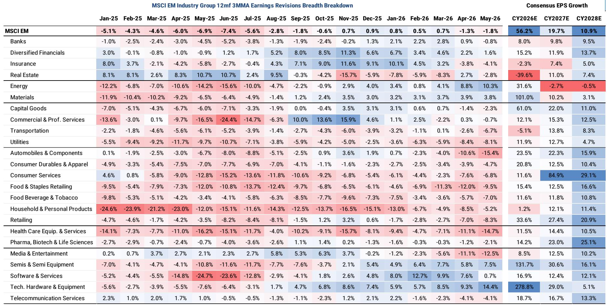
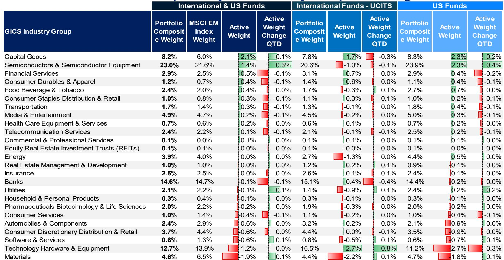

# Asia's Market Leadership Has Shifted from Consumption to Commodities and Compute — Investors Must Rebuild Their Frameworks

The first half of 2026 has delivered an extraordinary dispersion in global equity returns. Semiconductors have surged 60 percent. Consumer services have fallen by 9 percent. Technology hardware, energy, and capital goods have all posted double-digit gains, while software, automobiles, and consumer durables have declined. This is not a normal cyclical rotation. It is a structural reordering of which economic activities command premium valuations, and it demands that investors fundamentally rethink how they allocate capital across Asia and emerging markets.

The central argument of the mid-year strategy review from a leading global investment bank is that the current environment is exceptionally uncertain — not merely because of macro volatility, but because the combination of the global energy shock and the disruptive force of artificial intelligence investment is reshaping the earnings power of entire sectors. The bank has set unusually wide bear-to-bull target price spreads, a signal that conviction must be balanced with humility. Yet within this uncertainty, a clear strategic logic emerges: the market is rewarding goods-producing firms over services-producing firms, and within goods, the premiums are concentrated in energy, materials, industrials, and semiconductors.

For serious investors, the key question is not whether to be bullish or bearish on Asia. It is whether their portfolio framework is still fit for purpose in a world where the old dividing lines between developed and emerging markets, between growth and value, and between cyclical and secular are breaking down. This article synthesizes the report's core insights, extends their logic into actionable implications, and identifies the analytical gaps that the most engaged readers will want to explore further.

## The Great Dispersion Between Goods and Services Is Not a Trade — It Is a Structural Repricing of Economic Exposure

The most striking data point in the report is the year-to-date performance of global equity industry groups. The gap between the best and worst performing sectors exceeds 80 percentage points. Semiconductors and tech hardware sit at the top, followed by energy and capital goods. At the bottom are consumer services, health care equipment, commercial services, and real estate management. This pattern is not random. It reflects a fundamental shift in which parts of the economy are benefiting from the convergence of three powerful forces: the energy shock, the AI capex cycle, and the multipolar world order.

The report's analysis of MSCI index breakdowns by economic exposure makes this explicit. The US market is heavily skewed toward compute and light services. Europe is concentrated in commodities, capital goods, and heavy services. Japan leans into capital goods, heavy services, and consumer goods. Emerging markets are bifurcated between compute and commodities, with a notable underweight in capital goods and light services. This means that the thematic tailwinds are not evenly distributed. A portfolio that is overweight US tech and underweight Asian semiconductors is effectively betting against the very forces that are driving global earnings revisions.

The so-what is straightforward but uncomfortable: investors who continue to treat the goods-versus-services dispersion as a short-term tactical trade risk missing a multiyear repricing. The bank's thematic framework — spanning multipolar world, future of energy, AI and tech diffusion, and societal shifts — suggests that the structural winners are those aligned with physical investment, energy security, and compute infrastructure. The losers are those dependent on discretionary consumption, light services, and downstream industries exposed to rising commodity input costs.

## Japan and Taiwan Are the Structural Winners in Asia's Earnings Revision Cycle — China and India Face Divergent Headwinds

The report provides a granular breakdown of earnings revision breadth across Asian markets, and the divergence is stark. Japan has delivered consistent and broad-based upgrades, with positive revision breadth for over a year. Taiwan has seen a dramatic acceleration, with its revision breadth surging from negative territory in mid-2025 to over 20 percent by May 2026. Korea has also experienced a strong recovery, driven by its heavy exposure to semiconductors and memory.

China, by contrast, remains in deflationary territory. Its earnings revision breadth has slipped back into negative figures in recent months, and the bank explicitly notes that aggregate earnings revisions remain weak due to continued deflationary forces and AI disruption. India's revision breadth, while improving from deeply negative levels in 2025, has turned down again in the most recent data. The pattern is clear: markets with direct exposure to the global capex cycle — Japan's industrial base, Taiwan's semiconductor ecosystem, Korea's memory and hardware supply chain — are seeing earnings momentum that markets with domestic consumption-driven models cannot match.

This has profound implications for country allocation. The report states a preference for North Asia over South Asia and Australia. It also prefers Brazil over the rest of Latin America, and Greece, Hungary, and Saudi Arabia over other EEMEA markets. The unifying logic is that these markets offer greater exposure to the goods-producing, commodity-intensive, and compute-driven themes that are driving global earnings. The bank's focus lists are geared toward these core themes, with a specific emphasis on energy, materials, industrials, and semiconductors.

The strategic question this raises is whether India and China can reposition their economies to capture more of the global capex cycle, or whether their current structural headwinds will persist. China's emphasis on A-shares over H-shares and its focus on capex over consumption suggests that even within a challenging macro environment, there are pockets of opportunity aligned with the broader thematic shift. But the deflationary drag remains a powerful counterweight.

## The Multipolar World Thesis Is Reshaping Country Development Strategies — But the Rally in EM Remains Cyclical, Not Secular

One of the most provocative claims in the report is that the rally in emerging markets is cyclical rather than the start of a new secular bull market. This is a critical distinction. A cyclical rally is driven by improving fundamentals, valuations, and earnings momentum within an existing structural framework. A secular bull market requires a fundamental shift in the growth trajectory, the return on capital, and the risk premium that investors assign to a region.

The bank's multipolar world theme is indeed driving dispersion in country development strategies. Japan is leveraging its industrial base and the policy agenda of Prime Minister Takaichi. China is pursuing its "anti-involution" initiative to reduce excessive competition and improve corporate profitability. India is building out its digital infrastructure through IndiaStack. Korea is pursuing its "Reform Renaissance" to improve governance and returns. Singapore is implementing capital market reforms. These are real and important developments. But they are happening within a global environment where the primary drivers of returns are the energy shock and the AI capex cycle — forces that are largely exogenous to the policy choices of individual Asian governments.

This creates a tension. If the EM rally is cyclical, then it is vulnerable to a reversal if global interest rates remain higher for longer, if the energy shock subsides, or if the AI capex cycle peaks. The report's unusually wide bear-to-bull spreads are a direct acknowledgment of this vulnerability. The bull case is that the thematic tailwinds continue to strengthen, driving further earnings upgrades and multiple expansion. The bear case is that the current environment is exceptionally uncertain and that the structural headwinds facing services-oriented economies will eventually drag down the entire region.

The report does not fully resolve this tension. It provides a framework for navigating it — prefer goods over services, prefer North Asia over South Asia, prefer compute and commodities over consumption — but it leaves open the question of what would trigger a regime change from cyclical to secular. This is the analytical gap that the most sophisticated readers will want to explore.

## What the Report Does Not Fully Answer: The Sustainability of the Goods Premium and the Risk of a Rotation Back to Services

For all its analytical rigor, the report leaves several meaningful open questions. The first is whether the goods premium is sustainable. The current dispersion between goods and services is historically extreme. If the energy shock moderates and the AI capex cycle matures, the relative earnings momentum could reverse. The report acknowledges this implicitly by setting wide target price spreads, but it does not provide a clear framework for identifying the inflection point.

The second open question is the role of interest rates. The report focuses on earnings, valuations, and thematic positioning, but it does not deeply explore how the interest rate environment interacts with the goods-versus-services dispersion. If rates remain elevated, the discount rate applied to long-duration assets — including many services and tech companies — will remain high, potentially reinforcing the preference for shorter-duration, cash-flow-generative goods producers. If rates fall, the calculus changes.

The third question is the sustainability of Japan's earnings momentum. Japan has been the standout performer in Asia, with consistent earnings upgrades and broad-based revision breadth. But Japan is also highly sensitive to global trade, currency movements, and the policy agenda of a relatively new prime minister. The report recommends investing on an unhedged basis, anticipating moderate yen strength, but this introduces a currency risk that could overwhelm the equity return.

These gaps are not weaknesses in the report. They are the natural boundaries of any rigorous analysis. The report provides a framework for thinking about the current environment, but it does not pretend to have perfect foresight. For readers who want to go deeper, the full report contains the detailed charts, data series, and thematic definitions that would allow them to stress-test the assumptions and build their own scenarios.

## A Decision Framework for Navigating the Second Half of 2026

For investors seeking to translate the report's analysis into a practical decision framework, three questions should guide portfolio construction.

First, what is your exposure to goods-producing versus services-producing firms? The report's data shows that this single dimension explains more of the cross-sectional variation in returns than region, market cap, or valuation. If your portfolio is overweight consumer services, software, e-commerce, or autos, you are structurally underweight the themes that are driving global earnings. The bias should be toward energy, materials, industrials, and semiconductors — and within semiconductors, toward memory and hardware rather than fabless design or software.

Second, are you positioned for a cyclical or a secular EM rally? If you believe the rally is cyclical, your time horizon should be shorter, your position sizing should be more cautious, and your stop-losses should be tighter. If you believe the rally is secular, you can afford to be more patient and to accept drawdowns as opportunities to add to positions. The report leans toward the cyclical view, but it does not close the door on the secular case. The key variable to watch is whether earnings revisions breadth broadens beyond the current narrow set of winning sectors.

Third, are you accounting for the dispersion within countries? The report's country-level analysis is useful, but the real alpha is likely to come from stock selection within countries. Japan has broad-based revision breadth, but not all Japanese companies benefit from the goods premium. China is in deflation, but its capex-oriented and AI-exposed names may outperform. India's revision breadth is softening, but its digital infrastructure and financial inclusion stories may be secular. The framework should be applied at the stock level, not just the country level.

## Join the Community to Read the Full Report and Review the Original Charts

The analysis above synthesizes the key arguments from a major mid-year strategy review on Asia and emerging markets. But the full report contains far more detail: the complete earnings revision breadth data for every market, the historical decomposition of MSCI EM index weights, the thematic mapping of MS's core research themes, and the specific focus list recommendations. For investors who want to build their own scenarios and stress-test the assumptions, the original charts and data tables are essential.

Join the community to read the full report and review the original charts. The most valuable insights often emerge not from the conclusions, but from the data that supports them — and the questions that the data leaves unanswered.

*This article is for learning and discussion only and does not constitute investment advice.*

Personal reading notes and learning share only. Not investment advice.

