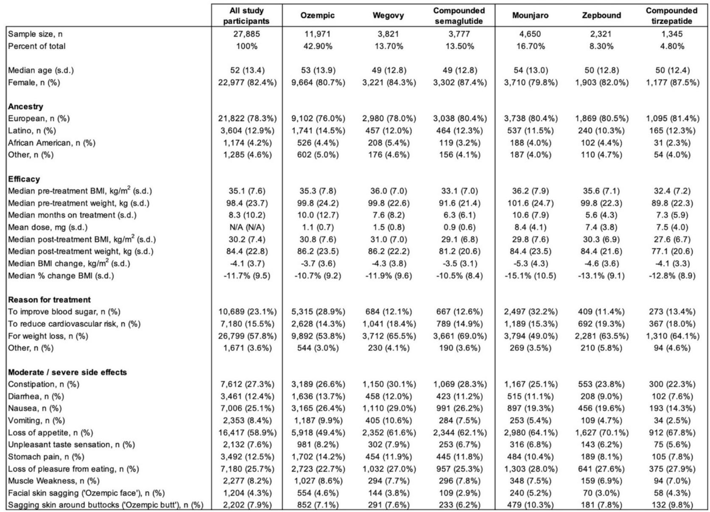
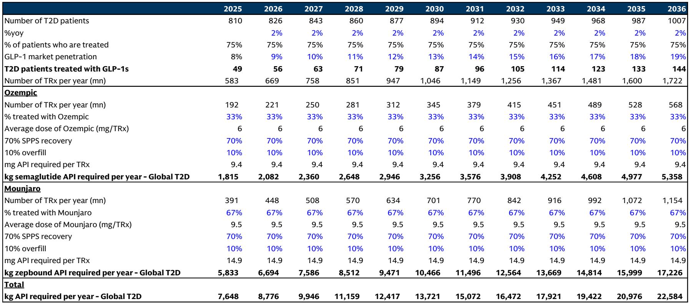
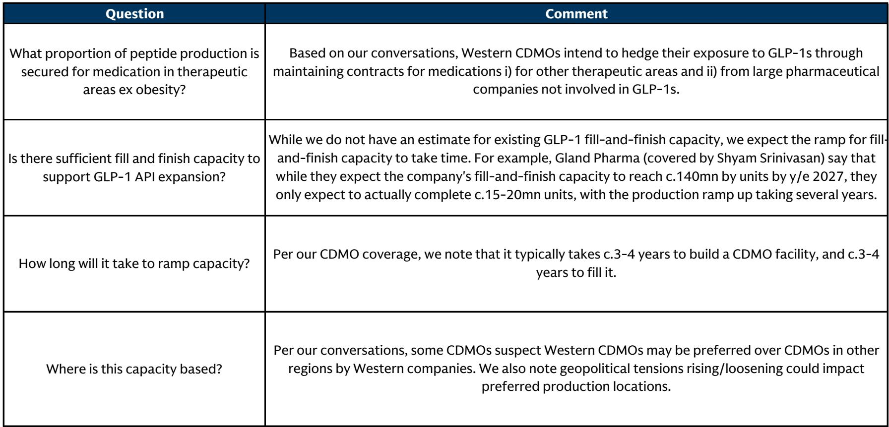

# The Obesity Drug Race Will Be Won in the Manufacturing Plant, Not the Pharmacy

The global market for anti-obesity medications (AOMs) is on track to exceed $100 billion within the decade, yet the most consequential strategic question is not about demand. It is about supply. Specifically, it is about who can produce the active pharmaceutical ingredients (API) for these peptide-based drugs at scale, at low cost, and with reliable quality. The prevailing narrative has focused on patent expirations and the arrival of generic competition. A deeper analysis of manufacturing capacity reveals a more nuanced and strategically critical picture: the speed, depth, and profitability of generic erosion in the obesity market will be determined not by court rulings but by the availability and economics of peptide API production. The winners will be those who control the manufacturing bottleneck, and the losers will be those who assume that generic entry automatically means price collapse.

This argument matters now because the industry is approaching a pivotal inflection point. Patent expirations for semaglutide, the active ingredient in Novo Nordisk’s Wegovy and Ozempic, are scheduled for 2031 and 2032. Yet the manufacturing infrastructure being built today will determine the competitive landscape for the next decade. Capacity decisions made in 2025 and 2026 will lock in cost structures and supply chains that will either enable or constrain generic competition. Investors and strategists who focus only on demand forecasts are missing the more important variable: the physical reality of how these complex molecules are made.

The central insight from examining global peptide API capacity is that Novo Nordisk’s fermentation-based manufacturing approach gives it a structural cost advantage that generic producers using synthetic methods will struggle to overcome. However, this advantage is not absolute. The rapid expansion of synthetic peptide capacity in China, particularly among CDMOs and dedicated API manufacturers, introduces a significant variable. The outcome depends on whether this capacity is deployed for branded partnerships, generic supply, or both. The market is not heading toward a simple binary of branded dominance versus generic disruption. It is heading toward a multi-dimensional contest where manufacturing economics, regulatory pathways, and the consumerized nature of the obesity market all interact in ways that are not yet fully priced in.

This article synthesizes findings from a detailed global investment bank report on AOM peptide manufacturing capacity and extends the logic to strategic implications for investors, pharmaceutical executives, and policymakers. The analysis covers demand projections, capacity estimates, cost comparisons, and the key uncertainties that will determine how this market evolves.

## The Obesity Market Will Require More Than 100,000 Kilograms of Peptide API Annually by 2035, and Current Capacity Is Not Yet Fully Committed

The report models a global patient base for AOMs that expands dramatically over the next decade. In the United States alone, the number of patients on GLP-1 therapy is projected to rise from approximately 2.8 million in 2025 to over 16 million by 2030, with a split of roughly 45 percent on injectables, 45 percent on daily oral therapies, and 10 percent on injectable amylin-based therapies. By 2035, the total US patient count exceeds 25 million. The shift toward oral formulations is particularly important because oral doses require significantly more API per patient per year than injectables. A patient on a daily oral semaglutide pill consumes approximately 5.5 grams of API annually, compared to roughly 88 milligrams for a weekly injectable. This difference drives the total API demand sharply upward as oral formulations gain share.

The report estimates that global peptide API demand for AOMs will reach approximately 79,000 kilograms by 2030 and approximately 118,000 kilograms by 2035. This is a massive industrial requirement for a class of molecules that are complex to manufacture. Peptide synthesis is not like small-molecule tablet production. It requires either fermentation-based biological production or solid-phase peptide synthesis (SPPS), both of which involve multiple steps, purification challenges, and yield losses. The report assumes an average SPPS recovery rate of 70 percent, meaning that for every kilogram of final product, approximately 1.4 kilograms of crude API must be synthesized. This inefficiency compounds the capacity requirement.

The critical strategic implication is that the supply chain for peptide API is not yet fully built out to meet this demand. Current announced capacity expansions, particularly from Chinese CDMOs such as Wuxi AppTec and Asymchem, are substantial but not yet proven at scale for generic-grade material. The report estimates that combined SPPS peptide API capacity from these two companies will grow from approximately 75,000 kilograms in 2025 to approximately 245,000 kilograms by 2034. However, this capacity is currently oriented toward branded products and long-term strategic partnerships. Whether it can or will be redirected toward generic supply after patent expiry is an open question with enormous consequences for pricing.

## Novo Nordisk’s Fermentation Advantage Creates a Cost Moat That Generic Producers Will Find Difficult to Breach

The most striking finding in the report is the cost comparison between Novo Nordisk’s fermentation-based production of semaglutide and the SPPS-based production that generic manufacturers would use. The report estimates that Novo Nordisk can produce semaglutide at a cost of approximately $3.50 per pen in its base case, with a range of $2.00 to $4.80 depending on scale and efficiency assumptions. Generic producers using SPPS face a base case cost of approximately $9.50 per pen, with a range of $4.00 to $18.00. For the oral pill formulation, the advantage is even more pronounced. Novo Nordisk’s estimated cost per pill is approximately $0.20, while generic producers face approximately $0.80 per pill. This represents a 75 percent cost advantage for the branded manufacturer on the oral formulation.

This cost differential is not marginal. It is structural. Fermentation is a biological process that benefits from economies of scale, process optimization, and decades of operational experience. Novo Nordisk has been refining its fermentation capabilities for semaglutide and related peptides for years. The upfront capital expenditure for fermentation capacity is high, but once built, the variable cost per unit is low. SPPS, by contrast, has lower upfront costs but higher variable costs, particularly for longer peptides like semaglutide, which is 31 amino acids in length. The purification steps in SPPS become more difficult and less efficient as peptide length increases, driving up costs.

The strategic implication is that Novo Nordisk does not need to rely solely on patent protection to defend its market position. Even after patents expire, the company can compete on price while maintaining attractive margins. Generic entrants will face a choice: price at a level that undercuts Novo Nordisk but yields razor-thin or negative margins, or price at a level that preserves some profitability but leaves Novo Nordisk as the lower-cost option. Neither outcome is favorable for generic manufacturers. The report’s analysis suggests that Novo Nordisk could maintain or even increase volume after patent expiry while still generating positive returns, especially if the oral formulation gains significant market share.

However, this cost advantage is not invulnerable. The report notes that if Chinese CDMO players were to branch into generic supply, the additional capacity could drive a race to the bottom on pricing. The key variable is not just total capacity but the willingness of these manufacturers to accept low margins in exchange for volume. Given the scale of capacity under construction in China, this is a risk that cannot be dismissed.

## The Chinese CDMO Expansion Creates Both Opportunity and Uncertainty, and the Market Has Not Yet Priced the Tail Risks

The report’s capacity data shows that Chinese peptide API manufacturers, including both dedicated API suppliers and CDMOs, are expanding SPPS capacity at a pace that far exceeds demand from the branded market alone. By 2030, Wuxi AppTec and Asymchem alone are projected to have approximately 185,000 kilograms of SPPS peptide API capacity, while other Chinese manufacturers add another approximately 45,000 kilograms. Total Chinese capacity of approximately 230,000 kilograms by 2030 far exceeds the report’s estimate of global AOM API demand of approximately 79,000 kilograms. Even accounting for non-AOM peptide demand and the capacity needed for clinical trials and pipeline products, there is a significant surplus.

This surplus creates two possible futures. In the optimistic scenario for branded manufacturers, Chinese CDMO capacity is fully absorbed by branded partnerships, pipeline products, and non-GLP-1 peptides. The capacity is built but not available for generic supply at scale. In the pessimistic scenario, the surplus capacity drives Chinese manufacturers to seek additional revenue streams by supplying generic API to global markets after patent expiry. This would flood the market with low-cost semaglutide API, compressing margins for all players, including Novo Nordisk.

The report does not resolve this uncertainty. It highlights that Chinese API suppliers appear to have increased capacity well in advance of semaglutide patent expiry. Exhibit 5 in the report shows that Chinese peptide API manufacturers had approximately 21,000 kilograms of SPPS capacity in 2025, rising to 40,000 kilograms by 2026, and remaining at that level through the early 2030s. This capacity is available years before generic demand materializes. The question is whether it is being built for speculative generic supply or for other purposes.

The market has not yet priced the tail risk of a Chinese-driven generic price war. Investors in Novo Nordisk and Eli Lilly have focused on demand growth and pipeline progress. The manufacturing capacity overhang in China is a known unknown that could fundamentally alter the competitive dynamics of the post-patent market. The report’s analysis suggests that this is the single most important variable to monitor over the next three to five years.

## The Generic Erosion Timeline for Semaglutide and Tirzepatide Will Diverge Significantly Due to Manufacturing Complexity

The report’s analysis reveals an important asymmetry between the two leading AOM molecules. Semaglutide, produced by Novo Nordisk, faces patent expiry in 2031 and 2032. Tirzepatide, produced by Eli Lilly, has a composition of matter patent that extends to 2036. This 4- to 5-year difference in patent expiry is well understood. What is less well understood is that the manufacturing barriers to generic entry are also different for these two molecules.

Semaglutide is produced by Novo Nordisk via fermentation. Generic manufacturers will need to use SPPS, which is more costly and more difficult to scale for a 31-amino-acid peptide. The report’s cost analysis shows that generic semaglutide via SPPS is significantly more expensive than Novo Nordisk’s fermentation-based product. This means that even after patent expiry, generic semaglutide may not achieve the rapid price erosion seen in other therapeutic categories. The economics of generic entry for semaglutide are marginal, especially if Novo Nordisk chooses to compete aggressively on price.

Tirzepatide, by contrast, is already produced via SPPS by Eli Lilly. This means that generic manufacturers can use the same manufacturing technology, potentially achieving similar cost structures. However, the report notes that tirzepatide is considered less financially attractive to compound than semaglutide, based on KOL diligence. This suggests that the manufacturing barriers for tirzepatide are not about technology but about complexity and yield. The report’s analysis makes the authors incrementally more positive on the erosion trajectory for tirzepatide post-2036, meaning that the longer patent life and manufacturing challenges may combine to protect Eli Lilly’s position for longer than the market expects.

The strategic implication is that generic erosion in the AOM market will not be uniform. Semaglutide faces earlier patent expiry but stronger manufacturing defenses. Tirzepatide faces later patent expiry but potentially weaker manufacturing defenses. The net effect is that both branded manufacturers may retain significant market share and pricing power for longer than historical analogies would suggest. Investors should be cautious about assuming that generic entry will follow the pattern seen in small-molecule drugs.

## The Report Leaves Unanswered Questions About the Role of Oral Formulations and the Impact of Price Elasticity on API Demand

While the report provides a detailed framework for analyzing manufacturing capacity, it does not fully resolve several critical questions. The most important of these concerns the demand trajectory for oral formulations. The report’s base case assumes that oral GLP-1s capture approximately 45 percent of the US patient market by 2030, rising to approximately 47 percent by 2035. However, this assumption is highly sensitive to patient adherence, prescriber behavior, and pricing. Oral formulations require significantly more API per patient, meaning that any upside surprise in oral adoption would dramatically increase total API demand. Conversely, if oral adoption is slower than expected, total API demand could be significantly lower.

The report also does not fully address the impact of price elasticity on demand. The obesity market is partially consumerized, meaning that patients may pay out of pocket or respond to price changes differently than in traditional prescription drug markets. If lower prices from generic competition drive increased patient uptake, total API demand could rise faster than the report’s base case. This would tighten the supply-demand balance and potentially offset some of the downward pressure on pricing. The report acknowledges this dynamic but does not model it in detail.

Another open question is the role of next-generation obesity medications. Eli Lilly is developing eloralintide and retatrutide, which could launch before the end of this decade. Novo Nordisk is developing zenagamatide and CagriSema. These new molecules will have their own manufacturing requirements and cost structures. They could shift the competitive landscape in ways that are difficult to predict. The report’s capacity analysis is based on current and announced products, but the pipeline is evolving rapidly.

Finally, the report does not address the regulatory and geopolitical risks associated with Chinese API supply. Dependence on Chinese manufacturing for critical drug ingredients is a growing concern for regulators in the US and Europe. Trade policy, export controls, or quality issues could disrupt supply from China, creating opportunities for alternative manufacturing sources but also introducing volatility. The report’s analysis is based on current capacity data and does not model these political risks.

## A Decision Framework for Investors and Strategists in the Obesity Drug Manufacturing Debate

The report’s analysis can be distilled into a decision framework that helps investors and strategists evaluate the key variables. The framework has three dimensions: manufacturing technology, capacity utilization, and market structure.

The first dimension is manufacturing technology. The choice between fermentation and SPPS determines the cost structure and scalability of each player. Novo Nordisk has a structural advantage in fermentation for semaglutide. Eli Lilly uses SPPS for tirzepatide, which is more accessible to generic manufacturers but also more complex. Investors should assess each company’s technology position and the extent to which it is protected by process patents and know-how.

The second dimension is capacity utilization. The surplus of SPPS capacity in China creates the potential for a supply-driven price decline. However, this capacity is not yet committed to generic supply. Investors should monitor CDMO announcements, partnership agreements, and capacity allocation decisions. If Chinese CDMOs begin to announce generic API supply agreements, that would be a bearish signal for branded margins. If capacity remains focused on branded partnerships, the pricing environment will be more benign.

The third dimension is market structure. The obesity market is not a typical prescription drug market. It is consumerized, with significant out-of-pocket spending, direct-to-consumer advertising, and patient loyalty to brands. This structure may slow the rate of generic substitution, even after patents expire. Investors should track patient adherence data, prescription trends, and payer coverage decisions to gauge the speed of generic uptake.

The key questions to ask are: How fast will oral formulations grow? Will Chinese CDMOs supply generic API? How will next-generation molecules affect the competitive landscape? And what is the regulatory risk to Chinese supply? The answers to these questions will determine whether the obesity drug market follows the historical pattern of rapid generic erosion or whether it defies expectations and remains a high-margin category for branded manufacturers.

## The Full Report Contains the Charts and Data That Make This Analysis Actionable

The analysis presented here is based on a detailed global investment bank report that includes six key charts, patient and API demand projections through 2036, capacity estimates for major CDMOs and Chinese manufacturers, and cost comparisons between fermentation and SPPS production. The full report provides the granular data that allows investors to stress-test assumptions and build their own scenarios.

The charts are essential for understanding the magnitude of the capacity surplus in China, the trajectory of API demand, and the cost advantage of fermentation-based production. Without this data, the strategic implications remain abstract. With the data, they become concrete and actionable.

Join the community to read the full report and review the original charts.

*This article is for learning and discussion only and does not constitute investment advice.*

Personal reading notes and learning share only. Not investment advice.

