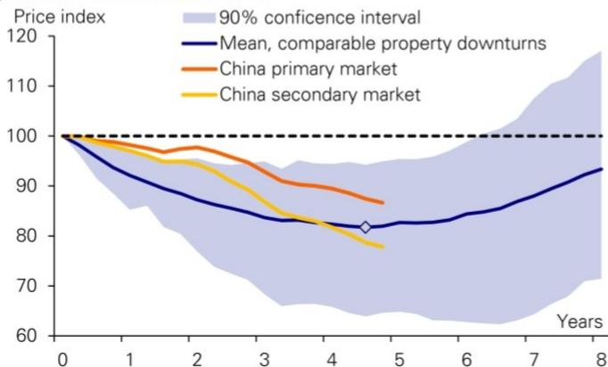
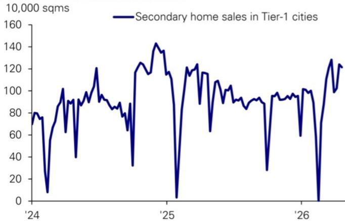
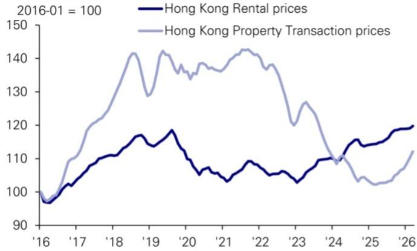
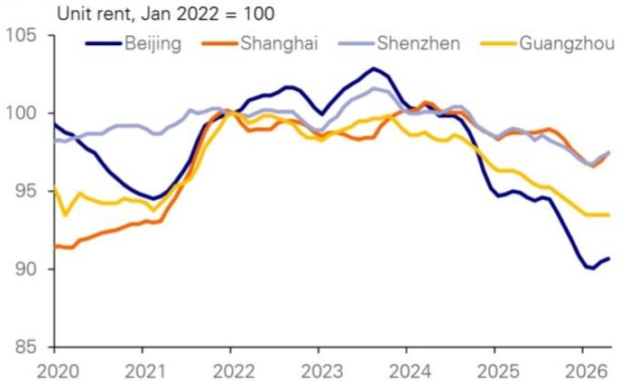

# Economics

# China Macro

# Property Bottom in Sight

China's property downturn appears to be entering its late stage, with several indicators suggesting that a durable bottom may be approaching, rather than another brief policy-driven rebound. The correction has now lasted about as long, and become about as deep, as typical housing downturns in other economies.   
What makes the current rebound different, in our view, is that it is not primarily being driven by broad macro stimulus. Instead, it reflects improving underlying market dynamics: in key cities, transaction volumes are rising while secondary listings are falling. What we have yet to observe is steady improvement in rents, which could happen this year in large cities.   
Looking ahead, we expect recovery in China's property sector to be gradual, led by top-tier and economically competitive cities rather than being broad-based nationwide. If the property sector does stabilize over the next 1-2 years, it could help China move from the current narrow, K-shaped recovery toward a broader macro expansion by improving household confidence, local government finances, and demand in more traditional parts of the economy.

# Where are we in China's property downturn? Three aspects

Over the past few months, China's housing market has shown tentative signs of stabilization — particularly in the secondary market across Tier-1 and select Tier-2 cities. Shanghai has led the way: transaction volumes have risen markedly, and prices in certain segments have stopped falling, even ticking higher. The question is whether this rebound marks the beginning of the end of China's property downturn, or merely another false dawn.

We approach this question along three dimensions. First, we benchmark China's downturn against international experience — has it run far enough and long enough? Second, we compare the current recovery with the two prior false starts (early 2023 and late 2024) to identify what is different this time. Third, we draw on Hong Kong's recent property recovery to extract lessons for mainland China, particularly its core cities.

# 1. The downturn has run its course

Our earlier work suggests that, across major economies, the median housing downturn — from peak to trough — lasts roughly five years, with a typical range of four to seven. The median peak-to-trough price decline is around 20%.

China's current downcycle, which began when prices peaked in H1 2021, has just exceeded the five-year mark. On duration alone, it is approaching the global median. On the depth of the correction, official statistics point to a cumulative price decline of roughly $14\%$ for new homes and $22\%$ for secondary homes, while anecdotal measures place the fall closer to $30\%$ in many cities. By either metric, China's downturn has become broadly comparable to international precedents.

China is not Japan. Some observers instinctively reach for the Japan analogy — a housing downturn that stretched across a decade and a half. We think this is the wrong reference point. Japan's "lost decades" began when its global

Date 3 June 2026

Yi Xiong, Ph.D.  
Chief Economist  
+852-2203-6139

Deyun Ou
Economist
+852-2203-6166

competitiveness had peaked and was being steadily eroded by latecomer economies. The past five years in China tell the opposite story: rising competitiveness and expanding global market share. This is the most fundamental difference between the two economies at the onset of their respective housing downturns. We therefore anchor our analysis to the broader international experience, not to Japan as a base case.

Figure 1: China's property downturn is comparable with those in other countries   

line

| Years | Mean, comparable property downturns | China primary market | China secondary market |
|-------|-------------------------------------|----------------------|------------------------|
| 0     | 100                                 | 100                  | 100                    |
| 1     | ~95                                 | ~98                  | ~97                    |
| 2     | ~90                                 | ~96                  | ~94                    |
| 3     | ~85                                 | ~92                  | ~88                    |
| 4     | ~82                                 | ~88                  | ~82                    |
| 5     | ~81                                 | ~85                  | ~78                    |
| 6     | ~82                                 | ~86                  | ~79                    |
| 7     | ~85                                 | ~88                  | ~80                    |
| 8     | ~90                                 | ~92                  | ~82                    |

Source: DB, BIS. Based 40 prolonged (3 years or longer) property downturns in different countries since 1980.

Figure 2: Various property sector indicators are showing early signs of bottoming   

line

| Year | Property investment | Housing new starts | Value of property sales |
| ---- | ------------------- | ------------------ | ----------------------- |
| '17  | ~85                 | ~80                | ~85                     |
| '18  | ~90                 | ~85                | ~90                     |
| '19  | ~95                 | ~90                | ~95                     |
| '20  | ~100                | ~105               | ~50                     |
| '21  | ~115                | ~110               | ~130                    |
| '22  | ~110                | ~90                | ~105                    |
| '23  | ~100                | ~60                | ~90                     |
| '24  | ~90                 | ~40                | ~70                     |
| '25  | ~80                 | ~30                | ~60                     |
| '26  | ~60                 | ~20                | ~50                     |

Source: DB, NBS

# 2. This time is different from previous short-lived rebounds

In both early 2023 (post-reopening) and late 2024 to early 2025, the Chinese property market saw short-lived rebounds in transaction volumes and prices, only for both to fade within a few months. Are we witnessing another false signal? We think the current recovery departs from those episodes in two important ways:

1. A different driver. The two prior rebounds were predominantly policy-driven. By that, we do not mean only property-sector policies such as cuts to down-payment requirements and mortgage rates, as well as the removal of purchase restrictions; more importantly, the 2023 rebound happened after China's post-COVID reopening, and the late-2024 rebound happened after a comprehensive stimulus package. These policies unleashed a burst of one-off demand, but once the policy impulse faded, prices resumed their decline. This time, however, although some property policy adjustments are present, we did not see any significant change in broader macroeconomic policy.

2. A different feedback loop. In both previous rebounds, a familiar pattern played out: as soon as transaction volumes picked up, the supply of second-hand listings surged, quickly tipping the supply-demand balance back and suppressing the nascent recovery. This time, in Tier-1 cities, the opposite is happening — secondary-market transaction volumes are rising even as the stock of listings is falling. The negative feedback loop that killed the earlier recoveries has, at least so far, not materialized.

This latter point is particularly important. In the five to ten years preceding the downturn, China's housing market saw enormous transaction volumes, a substantial share of which reflected households using property as a savings and investment vehicle. Once the cycle turned, household portfolio preferences shifted sharply: owners of investment properties rushed to offload their holdings. This means the current downturn has been not just a process of absorbing new-home inventory but also, and perhaps more importantly, of digesting the overhang of second-hand stock. The sustained decline in secondary-market listings across Tier-1 cities may signal that this inventory digestion is approaching its end.

Figure 3: As secondary transactions in Tier 1 cities picked up in recent months...   

line

| Year | Secondary home sales in Tier-1 cities (sqms) |
| ---- | ------------------------------------------ |
| '24  | 80                                         |
| '25  | 140                                        |
| '26  | 120                                        |

Source: DB, CREIS

Figure 4: ...Secondary listings in have fallen, marking a key difference with previous short-lived rebounds   

bar_line

| Year | Units (Thousand) | Area (Million sqms) |
|------|------------------|---------------------|
| '22  | 400              | 50                  |
| '23  | 700              | 75                  |
| '24  | 850              | 90                  |
| '25  | 850              | 95                  |
| '26  | 750              | 85                  |

Source: DB, CREIS

# 3. Population and rents, not policy and rates

Hong Kong's property recovery can serve as a useful reference point for assessing mainland China's housing sector. Hong Kong's property market bottomed in Q2 2025 and has since staged a robust recovery: prices are up roughly $10\%$ from the trough, transaction volumes are buoyant, and new-home sales have been strong enough to create pockets of undersupply.

Policy easing and interest rates are not the main driver. We found the prevailing narrative—that it was driven by the Hong Kong government's full withdrawal of all restrictive property measures and the decline in U.S. dollar interest rates—to be incomplete. The Hong Kong government removed all restrictions in February 2024, but the price trough and the rebound in transactions did not arrive until July 2025—a full 18 months later. On interest rates, note that Hong Kong's mortgage market operates with an effective rate cap that kept mortgage rates around $3.5\%$ when the Fed policy rate was elevated. The decline in U.S. rates did not, in practice, materially reduce the mortgage burden for Hong Kong households.

So what drove Hong Kong's recovery? We think two factors were decisive: first, the improvement in Hong Kong's own economic environment. Talent-attraction policies brought population growth back into positive territory. The equity market, which had been in decline for several years, found a floor in 2024. The rally that followed restored investor confidence, brought companies back to Hong Kong for IPOs and refinancing, and lifted the broader economy. Second, rents recovered before property prices. The most fundamental channel through which population inflows and economic recovery affect the property market is the rental market. Hong Kong rents stopped falling in early 2023 after declining for more than three years. By 2025, rents had almost fully recovered to 2018–19 levels. The steady increase in rents gives homebuyers confidence in future rental yields.

2025 marked a turning point in China's economy; 2026 could mark the turning point for rents, at least in top-tier cities. Latest data suggest rents have stabilized and started to rebound in the four Tier 1 cities—the cities in China that continue to attract population inflows.

Figure 5: Steady rise in rents is a key driver for Hong Kong's eventual housing recovery   

line

| Year | Hong Kong Rental prices | Hong Kong Property Transaction prices |
|------|--------------------------|----------------------------------------|
| '16  | 98                       | 99                                     |
| '17  | 105                      | 110                                    |
| '18  | 110                      | 130                                    |
| '19  | 115                      | 140                                    |
| '20  | 118                      | 135                                    |
| '21  | 105                      | 140                                    |
| '22  | 108                      | 142                                    |
| '23  | 105                      | 130                                    |
| '24  | 110                      | 115                                    |
| '25  | 115                      | 105                                    |
| '26  | 120                      | 110                                    |

Source: DB, Haver Analytics

Figure 6: China's Tier 1 cities could see rents bottom and recovery in 2026   

line

| Year | Beijing | Shanghai | Shenzhen | Guangzhou |
|------|---------|----------|----------|-----------|
| 2020 | 99.5    | 91.5     | 98.5     | 94.5      |
| 2021 | 94.5    | 93.0     | 99.0     | 94.0      |
| 2022 | 100.5   | 99.5     | 100.0    | 100.0     |
| 2023 | 101.5   | 99.0     | 100.5    | 99.5      |
| 2024 | 102.5   | 100.5    | 101.0    | 100.0     |
| 2025 | 95.0    | 98.5     | 99.0     | 97.0      |
| 2026 | 90.5    | 97.5     | 97.0     | 93.5      |

Source: DB, CREIS

# What to Expect Going Forward

Drawing these three threads together, we reach the following conclusions about China's property market.

# 1. The bottom is on the horizon: watch secondary listings and rents

First, the property downturn is likely not far from its end. Both the depth of the correction and its duration are now within the range of international comparables. Even if the exact trough still needs to be confirmed, a turn within the next one to two years (before end-2027) appears probable.

While it is difficult to predict the exact turning point, two leading indicators deserve close attention. We suggest monitoring two variables to assess whether the recovery is sustainable:

1. Secondary market listings. If transaction volumes continue to expand while the stock of secondary-market listings continues to shrink, it would indicate that supply and demand are rebalancing and that the market has finally absorbed the excess housing supply built up during the boom years. This will be a necessary condition for sustained price increases in the future.   
2. Residential rental trends in major cities. A steady increase in rents will be a key signal for an eventual housing market rebound. To be clear, we disagree with the popular view that rental yield needs to exceed mortgage rates before housing prices can recover. In fact, a high rental yield should be considered a negative signal, as it would imply that the market expects rents and property prices to keep falling in the coming years. This can be easily understood through an analogy with equities: for stock (property) prices to rise, the key is to observe steady growth in earnings (rents), which would then justify a higher price-to-earnings ratio (a lower rental yield). A low P/E ratio (high rental yield) by itself is never a good justification for future price performance.

# 2. Property sector recovery will likely lag broader economic recovery

We expect property recovery to lag the broader economic recovery. Over the past decade or so, amidst high economic growth, accelerated urbanization, and increasingly stringent restrictive policies, the real estate sector once served as a counter-cyclical tool, leading economic recoveries. Considering the shift in both economic development stages and policy intentions, the real estate industry can no longer function as a counter-cyclical stabilizer; instead, it has progressively become an amplifier of economic trends. Should the real estate sector experience another resurgence within the next year or two, this recovery ought to be viewed as a consequence of broader economic recovery, rather than its cause.

The eventual recovery will likely be region-specific rather than broad-based. A city's economic performance and population dynamics will become the decisive factors for its property market. Recovery will emerge first in select Tier-1 cities and economically vibrant Tier-2 cities. Conversely, many cities and regions experiencing sustained population outflows and lacking competitive economic structures may not see a property market recovery for a considerable period.

# 3. Growth transmission will likely be gradual, but key for a broad-based recovery

The transmission will be slow and gradual, and its contribution to GDP growth will turn positive only gradually. The recovery will start in select cities and take time to become a national phenomenon. It will also take time to transmit from the secondary market to the primary market and new housing investment, considering that most privately owned developers have either exited the market or lost the capacity to expand rapidly during the next housing recovery. The remaining large players, mostly state-owned developers, tend to move cautiously in response to a recovery.

Even as Tier-1 secondary-market volumes have picked up this year, new home sales in those same cities have yet to stop contracting. Nationwide land-sale revenue remains deeply negative year-on-year, and the drag on local government finances persists. The diffusion — from a few cities to many, from second-hand to new homes, and from sales to investment — is likely to be slow.

Property recovery will be the bridge from China's K-shaped to a broad-based recovery. China's economy today exhibits a K-shaped pattern. On one side, new-economy sectors — AI, renewables, electric vehicles, energy storage — are experiencing surging activity, strong external demand, rising prices, and improving corporate earnings. This is the upward leg of the K-shaped recovery. On the other side, traditional sectors — infrastructure investment, household consumption — are growing at a subdued pace, constraining the breadth of the macro recovery.

Critically, the “new economy” is growing larger but still narrow-based. Most of the Chinese labor force is still employed by the “old economy”; government revenue is also more closely linked to the traditional sectors, most notably land sales; and Chinese households’ investment in housing far exceeds their investment in those high-tech stocks.

If the property market can find a floor and shift from being a drag on the economy to being a contributor to the recovery, we could see China transition from an uneven K-shaped recovery to a more balanced, broad-based expansion. That would represent a critical turning point — not just for the property sector, but for the entire economy and, most importantly, for consumer confidence.

# Appendix 1

# Analyst Certification

The views expressed in this report accurately reflect the personal views of the undersigned lead analyst(s). In addition, the undersigned lead analyst(s) has not and will not receive any compensation for providing a specific recommendation or view in this report. Deyun Ou, Yi Xiong, Ph.D..

# Important Disclosures

Prices are current as of the end of the previous trading session unless otherwise indicated and are sourced from local exchanges via Reuters, Bloomberg and other vendors. Other information is sourced from DB, subject companies, and other sources. For further information regarding disclosures relevant to DB, please visit our global disclosure look-up page on our website at https://research.db.com/Research/Disclosures/FICCDisclosures. Aside from within this report, important risk and conflict disclosures can also be found at https://research.db.com/Research/Disclosures/Disclaimer. Investors are strongly encouraged to review this information before investing.

# Additional Information

The information and opinions in this report were prepared by DB AG or one of its affiliates (collectively 'DB'). Though the information herein is believed to be reliable and has been obtained from public sources believed to be reliable, DB makes no representation as to its accuracy or completeness. Hyperlinks to third-party websites in this report are provided for reader convenience only. DB neither endorses the content nor is responsible for the accuracy or security controls of those websites.

If you use the services of DB in connection with a purchase or sale of a security that is discussed in this report, or is included or discussed in another communication (oral or written) from a DB analyst, DB may act as principal for its own account or as agent for another person.

DB may consider this report in deciding to trade as principal. It may also engage in transactions, for its own account or with customers, in a manner inconsistent with the views taken in this research report. Others within DB, including strategists, sales staff and other analysts, may take views that are inconsistent with those taken in this research report. DB issues a variety of research products, including fundamental analysis, equity-linked analysis, quantitative analysis and trade ideas. Recommendations contained in one type of communication may differ from recommendations contained in others, whether as a result of differing time horizons, methodologies, perspectives or otherwise. DB and/or its affiliates may also be holding debt or equity securities of the issuers it writes on. Analysts are paid in part based on the profitability of DB AG and its affiliates, which includes investment banking, trading and principal trading revenues.

Opinions, estimates and projections constitute the current judgment of the author as of the date of this report. They do not necessarily reflect the opinions of DB and are subject to change without notice. DB provides liquidity for buyers and sellers of securities issued by the companies it covers. DB analysts sometimes have shorter-term trade ideas that may be inconsistent with DB's existing longer-term ratings. Some trade ideas for equities are listed as Catalyst Calls on the Research Website (https://research.db.com/Research/), and can be found on the general coverage list and also on the covered company's page. A Catalyst Call represents a high-conviction belief by an analyst that a stock will outperform or underperform the market and/or a specified sector over a time frame of no less than two weeks and no more than three months. In addition to Catalyst Calls, analysts may occasionally discuss with our clients, and with DB salespersons and traders, trading strategies or ideas that reference catalysts or events that may have a near-term or medium-term impact on the market price of the securities discussed in this report, which impact may be directionally counter to the analysts' current 12-month view of total return or investment return as described herein. DB has no obligation to update, modify or amend this report or to otherwise notify a recipient thereof if an opinion, forecast or estimate changes or becomes inaccurate. Coverage and the frequency of changes in market conditions and in both general and company-specific economic prospects make it difficult to update research at defined intervals. Updates are at the sole discretion of the coverage analyst or of the Research Department Management, and the majority of reports are published at irregular intervals. This report is provided for informational purposes only and does not take into account the particular investment objectives, financial situations, or needs of individual clients. It is not an offer or a solicitation of an offer to buy or sell any financial instruments or to participate in any particular trading strategy. Target prices are inherently imprecise and a product of the analyst's judgment. The financial instruments discussed in this report may not be suitable for all investors, and investors must make their own informed investment decisions. Prices and availability of financial instruments are subject to change without notice, and investment transactions can lead to losses as a result of price fluctuations and other factors. If a financial instrument is denominated in a currency other than an investor's currency, a change in exchange rates may adversely affect the investment. Past performance is not necessarily indicative of future results. Performance calculations exclude transaction costs, unless otherwise indicated. Unless otherwise indicated, prices are current as of the end of the previous trading session and are sourced from local exchanges via Reuters, Bloomberg and other vendors. Data is also sourced from DB, subject companies, and other parties. Artificial intelligence tools may be used in the preparation of this material, including but not limited to assist in fact-finding, data analysis, pattern recognition, content drafting and editorial corrections pertaining to research material.

The DB Department is independent of other business divisions of the Bank. Details regarding our organizational arrangements and information barriers we have to prevent and avoid conflicts of interest with respect to our research are available on our website (https://research.db.com/Research/) under Disclaimer.

Macroeconomic fluctuations often account for most of the risks associated with exposures to instruments that promise to pay fixed or variable interest rates. For an investor who is long fixed-rate instruments (thus receiving these cash flows), increases in interest rates naturally lift the discount factors applied to the expected cash flows and thus cause a loss. The longer the maturity of a certain cash flow and the higher the move in the discount factor, the higher will be the loss.

Upside surprises in inflation, fiscal funding needs, and FX depreciation rates are among the most common adverse macroeconomic shocks to receivers. But counterparty exposure, issuer creditworthiness, client segmentation, regulation (including changes in assets holding limits for different types of investors), changes in tax policies, currency convertibility (which may constrain currency conversion, repatriation of profits and/or liquidation of positions), and settlement issues related to local clearing houses are also important risk factors. The sensitivity of fixed-income instruments to macroeconomic shocks may be mitigated by indexing the contracted cash flows to inflation, to FX depreciation, or to specified interest rates - these are common in emerging markets. The index fixings may - by construction - lag or mismeasure the actual move in the underlying variables they are intended to track. The choice of the proper fixing (or metric) is particularly important in swaps markets, where floating coupon rates (i.e., coupons indexed to a typically short-dated interest rate reference index) are exchanged for fixed coupons. Funding in a currency that differs from the currency in which coupons are denominated carries FX risk. Options on swaps (swaptions) the risks typical to options in addition to the risks related to rates movements.

Derivative transactions involve numerous risks including market, counterparty default and illiquidity risk. The appropriateness of these products for use by investors depends on the investors' own circumstances, including their tax position, their regulatory environment and the nature of their other assets and liabilities; as such, investors should take expert legal and financial advice before entering into any transaction similar to or inspired by the contents of this publication. The risk of loss in futures trading and options, foreign or domestic, can be substantial. As a result of the high degree of leverage obtainable in futures and options trading, losses may be incurred that are greater than the amount of funds initially deposited - up to theoretically unlimited losses. Trading in options involves risk and is not suitable for all investors. Prior to buying or selling an option, investors must review the 'Characteristics and Risks of Standardized Options", at https://www.theocc.com/company-information/documents-and-archives/options-disclosure-document. If you are unable to access the website, please contact your DB representative for a copy of this important document.

Participants in foreign exchange transactions may incur risks arising from several factors, including the following: (i) exchange rates can be volatile and are subject to large fluctuations; (ii) the value of currencies may be affected by numerous market factors, including world and national economic, political and regulatory events, events in equity and debt markets and changes in interest rates; and (iii) currencies may be subject to devaluation or government-imposed exchange controls, which could affect the value of the currency. Investors in securities such as ADRs, whose values are affected by the currency of an underlying security, effectively assume currency risk.

Unless governing law provides otherwise, all transactions should be executed through the DB entity in the investor's home jurisdiction. Aside from within this report, important conflict disclosures can also be found at https://research.db.com/Research/ on each company's research page or under the 'Disclosures' tab. Investors are strongly encouraged to review this information before investing.

DB (which includes DB AG, its branches and affiliated companies) is not acting as a financial adviser, consultant or fiduciary to you or any of your agents (collectively, "You" or "Your") with respect to any information provided in this report. DB does not provide investment, legal, tax or accounting advice, DB is not acting as your impartial adviser, and does not express any opinion or recommendation whatsoever as to any strategies, products or any other information presented in the materials. Information contained herein is being provided solely on the basis that the recipient will make an independent assessment of the merits of any investment decision, and it does not constitute a recommendation of, or express an opinion on, any product or service or any trading strategy.

The information presented is general in nature and is not directed to retirement accounts or any specific person or account type, and is therefore provided to You on the express basis that it is not advice, and You may not rely upon it in making Your decision. The information we provide is being directed only to persons we believe to be financially sophisticated, who are capable of evaluating investment risks independently, both in general and with regard to particular transactions and investment strategies, and who understand that DB has financial interests in the offering of its products and services. If this is not the case, or if You are an IRA or other retail investor receiving this directly from us, we ask that you inform us immediately.

In July 2018, DB revised its rating system for short term ideas whereby the branding has been changed to Catalyst Calls ("CC") from SOLAR ideas; the rating categories for Catalyst Calls originated in the Americas region have been made consistent with the categories used by Analysts globally; and the effective time period for CCs has been reduced from a maximum of 180 days to 90 days.

United States: Approved and/or distributed by DB Securities Incorporated, a member of FINRA and SIPC. Analysts located outside of the United States are employed by non-US affiliates and are not registered/qualified as research analysts with FINRA.

European Economic Area (exc. United Kingdom): Approved and/or distributed by DB AG, a joint stock corporation with limited liability incorporated in the Federal Republic of Germany with its principal office in Frankfurt am Main. DB AG is authorized under German Banking Law and is subject to supervision by the European Central Bank and by BaFin, Germany's Federal Financial Supervisory Authority.

United Kingdom: Approved and/or distributed by DB AG acting through its London Branch at 21 Moorfields, London EC2Y 9DB. DB AG in the United Kingdom is authorised by the Prudential Regulation Authority and is subject to limited regulation by the Prudential Regulation Authority and Financial Conduct Authority. Details about the extent of our authorisation and regulation are available on request.

Hong Kong SAR: Distributed by DB AG, Hong Kong Branch, except for any research content relating to futures contracts within the meaning of the Hong Kong Securities and Futures Ordinance Cap. 571. Research reports on such futures contracts are not intended for access by persons who are located, incorporated, constituted or resident in Hong Kong. The author(s) of a research report may not be licensed to carry on regulated activities in Hong Kong, and if not licensed, do not hold themselves out as being able to do so. The provisions set out above in the 'Additional Information' section shall apply to the fullest extent permissible by local laws and regulations, including without limitation the Code of Conduct for Persons Licensed or Registered with the Securities and Futures Commission. This report is intended for distribution only to 'professional investors' as defined in Part 1 of Schedule of the SFO. This document must not be acted or relied on by persons who are not professional investors. Any investment or investment activity to which this document relates is only available to professional investors and will be engaged only with professional investors.

India: Prepared by Deutsche Equities India Private Limited (DEIPL) having CIN: U65990MH2002PTC137431 and registered office at 14th Floor, The Capital, C-70, G Block, Bandra Kurla Complex, Mumbai (India) 400051. Tel: +91 22 7180 4444. It is registered by the Securities and Exchange Board of India (SEBI) as a Stock broker bearing registration no.: INZ000252437; Merchant Banker bearing SEBI Registration no.: INM000010833 and Research Analyst bearing SEBI Registration no.: INH000001741. DEIPL's Compliance / Grievance officer is Ms. Rashmi Poddar (Tel: +91 22 7180 4929 email ID: complaints.deipl@db.com). Registration granted by SEBI and certification from NISM in no way guarantee performance of DEIPL or provide any assurance of returns to investors. Investment in securities market are subject to market risks. Read all the related documents carefully before investing. DEIPL may have received administrative warnings from the SEBI for breaches of Indian regulations. DB and/or its affiliate(s) may have debt holdings or positions in the subject company. With regard to information on associates, please refer to the "Shareholdings" section in the Annual Report at: https://www.db.com/ir/en/annual-reports.htm. For latest India research audit report, refer https://country.db.com/india/deutsche-equities-india/index?language\_id=1.

Japan: Approved and/or distributed by Deutsche Securities Inc.(DSI). Registration number - Registered as a financial instruments dealer by the Head of the Kanto Local Finance Bureau (Kinsho) No. 117. Member of associations: JSDA, Type II Financial Instruments Firms Association and The Financial Futures Association of Japan. Commissions and risks involved in stock transactions - for stock transactions, we charge stock commissions and consumption tax by multiplying the transaction amount by the commission rate agreed with each customer. Stock transactions can lead to losses as a result of share price fluctuations and other factors. Transactions in foreign stocks can lead to additional losses stemming from foreign exchange fluctuations. We may also charge commissions and fees for certain categories of investment advice, products and services. Recommended investment strategies, products and services carry the risk of losses to principal and other losses as a result of changes in market and/or economic trends, and/or fluctuations in market value. Before deciding on the purchase of financial products and/or services, customers should carefully read the relevant disclosures, prospectuses and other documentation. 'Moody's', 'Standard Poor's', and 'Fitch' mentioned in this report are not registered credit rating agencies in Japan unless Japan or 'Nippon' is specifically designated in the name of the entity. Reports on Japanese listed companies not written by analysts of DSI are written by DB Group's analysts with the coverage companies specified by DSI. Some of the foreign securities stated on this report are not disclosed according to the Financial Instruments and Exchange Law of Japan. Target prices set by DB's equity analysts are based on a 12-month forecast period.

Korea: Distributed by Deutsche Securities Korea Co.

South Africa: DB AG Johannesburg is incorporated in the Federal Republic of Germany (Branch Register Number in South Africa: 1998/003298/10).

Singapore: This report is issued by DB AG, Singapore Branch (One Raffles Quay #18-00 South Tower Singapore 048583, 65 6423 8001), which may be contacted in respect of any matters arising from, or in connection with, this report. Where this report is issued or promulgated by DB in Singapore to a person who is not an accredited investor, expert investor or institutional investor (as defined in the applicable Singapore laws and regulations), they accept legal responsibility to such person for its contents.

Taiwan: Information on securities/investments that trade in Taiwan is for your reference only. Readers should independently evaluate investment risks and are solely responsible for their investment decisions. DB may not be distributed to the Taiwan public media or quoted or used by the Taiwan public media without written consent. Information on securities/instruments that do not trade in Taiwan is for informational purposes only and is not to be construed as a recommendation to trade in such securities/instruments.

Qatar: DB AG in the Qatar Financial Centre (registered no. 00032) is regulated by the Qatar Financial Centre Regulatory Authority. DB AG - QFC Branch may undertake only the financial services activities that fall within the scope of its existing QFCRA license. Its principal place of business in the QFC: Qatar Financial Centre, Tower, West Bay, Level 5, PO Box 14928, Doha, Qatar. This information has been distributed by DB AG. Related financial products or services are only available only to Business Customers, as defined by the Qatar Financial Centre Regulatory Authority.

Russia: The information, interpretation and opinions submitted herein are not in the context of, and do not constitute, any appraisal or evaluation activity requiring a license in the Russian Federation.

Kingdom of Saudi Arabia: Deutsche Securities Saudi Arabia (DSSA) is a closed joint stock company authorized by the Capital Market Authority of the Kingdom of Saudi Arabia with a license number (No. 37-07073) to conduct the following business activities: Dealing, Arranging, Advising, and Custody activities. DSSA registered office is Faisaliah Tower, 17th Floor, King Fahad Road - Al Olaya District Riyadh, Kingdom of Saudi Arabia P.O. Box 301806.

United Arab Emirates: DB AG in the Dubai International Financial Centre (registered no. 00045) is regulated by the Dubai Financial Services Authority. DB AG - DIFC Branch may only undertake the financial services activities that fall within the scope of its existing DFSA license. Principal place of business in the DIFC: Dubai International Financial Centre, The Gate Village, Building 5, PO Box 504902, Dubai, U.A.E. This information has been distributed by DB AG. Related financial products or services are available only to Professional Clients, as defined by the Dubai Financial Services Authority.

Australia and New Zealand: This research is intended only for 'wholesale clients' within the meaning of the Australian Corporations Act and New Zealand Financial Advisors Act, respectively. Please refer to Australia-specific research disclosures and related information at https://www.dbresearch.com/PROD/RPS\_EN-

PROD/PROD0000000000521304.xhtml . Where research refers to any particular financial product recipients of the research should consider any product disclosure statement, prospectus or other applicable disclosure document before making any decision about whether to acquire the product. In preparing this report, the primary analyst or an individual who assisted in the preparation of this report has likely been in contact with the company that is the subject of this research for confirmation/clarification of data, facts, statements, permission to use company-sourced material in the report, and/or site-visit attendance. Without prior approval from Research Management, analysts may not accept from current or potential Banking clients the costs of travel, accommodations, or other expenses incurred by analysts attending site visits, conferences, social events, and the like. Similarly, without prior approval from Research Management and Anti-Bribery and Corruption ("ABC") team, analysts may not accept perks or other items of value for their personal use from issuers they cover.

Additional information relative to securities, other financial products or issuers discussed in this report is available upon request. This report may not be reproduced, distributed or published without DB's prior written consent.

Backtested, hypothetical or simulated performance results have inherent limitations. Unlike an actual performance record based on trading actual client portfolios, simulated results are achieved by means of the retroactive application of a backtested model itself designed with the benefit of hindsight. Taking into account historical events the backtesting of performance also differs from actual account performance because an actual investment strategy may be adjusted any time, for any reason, including a response to material, economic or market factors. The backtested performance includes hypothetical results that do not reflect the reinvestment of dividends and other earnings or the deduction of advisory fees, brokerage or other commissions, and any other expenses that a client would have paid or actually paid. No representation is made that any trading strategy or account will or is likely to achieve profits or losses similar to those shown. Alternative modeling techniques or assumptions might produce significantly different results and prove to be

more appropriate. Past hypothetical backtest results are neither an indicator nor guarantee of future returns. Actual results will vary, perhaps materially, from the analysis.

The method for computing individual E,S,G and composite ESG scores set forth herein is a novel method developed by the Research department within DB AG, computed using a systematic approach without human intervention. Different data providers, market sectors and geographies approach ESG analysis and incorporate the findings in a variety of ways. As such, the ESG scores referred to herein may differ from equivalent ratings developed and implemented by other ESG data providers in the market and may also differ from equivalent ratings developed and implemented by other divisions within the DB Group. Such ESG scores also differ from other ratings and rankings that have historically been applied in research reports published by DB AG. Further, such ESG scores do not represent a formal or official view of DB AG.

It should be noted that the decision to incorporate ESG factors into any investment strategy may inhibit the ability to participate in certain investment opportunities that otherwise would be consistent with your investment objective and other principal investment strategies. The returns on a portfolio consisting primarily of sustainable investments may be lower or higher than portfolios where ESG factors, exclusions, or other sustainability issues are not considered, and the investment opportunities available to such portfolios may differ. Companies may not necessarily meet high performance standards on all aspects of ESG or sustainable investing issues; there is also no guarantee that any company will meet expectations in connection with corporate responsibility, sustainability, and/or impact performance.

Copyright © 2026 DB AG

# David Folkerts-Landau

Group Chief Economist and Global Head of Research

Pam Finelli  
Global Chief Operating Officer Research

Gerry Gallagher Head of European Company Research

Sameer Goel Global Head of EM & APAC Research

Steve Pollard  
Global Head of Company Research and Sales

Matthew Barnard
Head of Americas
Company Research

Francis Yared
Global Head of Rates
Research

Jim Reid Global Head of Macro and Thematic Research

Peter Milliken
Head of APAC Company
Research

George Saravelos
Global Head of FX
Research

Tim Rokossa
Head of Germany
Research

Debbie Jones Global Head of Sustainability and Data Innovation, Research

Peter Hooper
Vice-Chair of Research

International Production Locations 

<table><tr><td>DB AGDB PlaceLevel 16Corner of Hunter &amp; Phillip StreetsSydney, NSW 2000AustraliaTel: (61) 2 8258 1234</td><td>DB AGEquity ResearchMainzer Landstrasse 11-1760329 Frankfurt am MainGermanyTel: (49) 69 910 00</td><td>DB AGFiliale HongkongInternational Commerce Centre1 Austin Road West,Kowloon,Hong KongTel: (852) 2203 8888</td><td>Deutsche Securities Inc.1-3-1 AzabudaiAzabudai Hills Mori JPTowerMinato-ku, Tokyo 106-0041JapanTel: (81) 3 6730 1000</td></tr><tr><td>DB AG21 MoorfieldsLondon EC2Y 9DBUnited KingdomTel: (44) 20 7545 8000</td><td>DB Securities Inc.The DB Center1 Columbus CircleNew York, NY 10019Tel: (1) 212 250 2500</td><td>DB AGFiliale SingapurOne Raffles Quay, South TowerSingapore 048583Tel: (65) 6423 8001</td><td></td></tr></table>