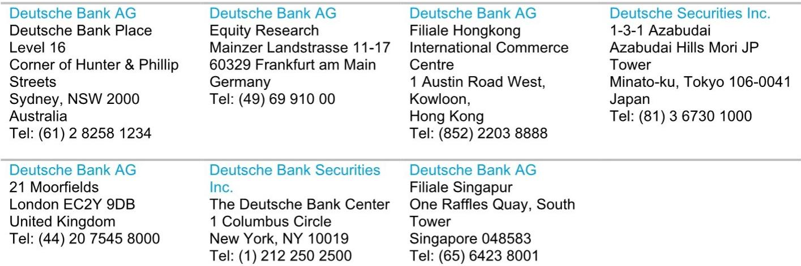
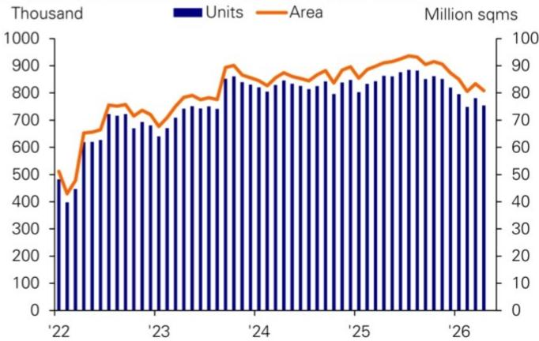
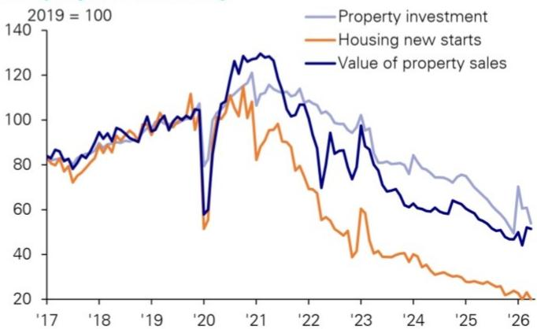

# China's Property Downturn Is Approaching Its End, But the Recovery Will Look Nothing Like the Past

The conventional narrative that China's housing market is trapped in an endless decline is increasingly at odds with the data. After five years of correction, multiple indicators now suggest that a durable bottom is forming—not because of another wave of stimulus, but because the market is finally digesting the excesses of the boom years. This is not a prediction of an imminent boom. It is an argument that the structural dynamics of the downturn have shifted, and that investors who wait for a confirmed recovery before positioning will miss the early signals. The real question is not whether a bottom will arrive, but what kind of recovery will follow.

Three features distinguish this moment from the false dawns of early 2023 and late 2024. First, the current stabilization is not being driven by broad macroeconomic stimulus or a sudden policy pivot. Second, the feedback loop that killed previous rebounds—a surge in second-hand listings overwhelming nascent demand—has broken in major cities. Third, the downturn has now run long enough and deep enough to be comparable to international precedents. These are not guarantees of a recovery, but they are compelling reasons to take the current signals seriously.

The stakes extend far beyond the property sector itself. China's economy today is deeply K-shaped: new-economy sectors are thriving while traditional sectors struggle. A stabilization in housing would directly address the weakest leg of this recovery by improving household confidence, easing local government fiscal constraints, and restoring demand in conventional industries. The property sector has shifted from being a counter-cyclical driver of growth to becoming an amplifier of broader economic trends. If it stabilizes, the transmission to the wider economy could begin to close the gap between China's vibrant export-oriented sectors and its sluggish domestic economy.

## The Downturn Has Run Its Course by Every Relevant Benchmark

The first reason to take the current stabilization seriously is that China's housing correction now falls squarely within the range of typical international downturns. Across major economies, the median housing downturn from peak to trough lasts approximately five years, with a typical range of four to seven years. The median peak-to-trough price decline is around 20 percent. China's current cycle, which began when prices peaked in the first half of 2021, has now exceeded the five-year mark. On duration alone, it is approaching the global median.

On depth, the numbers are even more striking. Official statistics show cumulative price declines of roughly 14 percent for new homes and 22 percent for secondary homes. But anecdotal measures place the actual fall closer to 30 percent in many cities. By either metric, China's downturn is now broadly comparable to the worst housing corrections in other major economies over the past four decades. This matters because it removes the most common argument for continued pessimism: that the correction still has further to run simply because it has been painful.

The instinctive comparison to Japan's lost decades is misleading. Japan's housing collapse began when its global competitiveness had peaked and was being steadily eroded by rising neighbors. The past five years in China tell the opposite story: rising export competitiveness, expanding global market share, and a technology sector that is increasingly dominant. This is the most fundamental structural difference between the two economies at the onset of their respective housing downturns. Anchoring the analysis to the broader international experience rather than the Japan exception leads to a far more constructive baseline view.

## This Recovery Is Structurally Different from Previous False Starts

The two prior rebounds—in early 2023 following China's post-COVID reopening, and in late 2024 after a comprehensive stimulus package—both collapsed within months. In each case, a familiar pattern played out: as soon as transaction volumes picked up, the supply of second-hand listings surged, quickly tipping the supply-demand balance back and suppressing the nascent recovery. This negative feedback loop was the mechanism that killed every previous attempt at stabilization.

This time, the pattern has broken. In Tier-1 cities, secondary-market transaction volumes are rising even as the stock of listings is falling. This is not a marginal improvement; it represents a fundamental shift in market dynamics. The reason is structural. In the five to ten years preceding the downturn, China's housing market saw enormous transaction volumes, a substantial share of which reflected households using property as a savings and investment vehicle. Once the cycle turned, owners of investment properties rushed to offload their holdings. The downturn has therefore been not just a process of absorbing new-home inventory but also, and perhaps more importantly, of digesting the overhang of second-hand stock.

The sustained decline in secondary-market listings across Tier-1 cities may signal that this inventory digestion is approaching its end. When the supply of second-hand homes was rising faster than demand, no policy stimulus could create a sustainable recovery. Now that listings are shrinking while transactions grow, the market is finally rebalancing through its own mechanisms. This is the most important difference between the current environment and the false starts of the past two years.

## Watch Rents, Not Mortgage Rates, for the Real Signal

Hong Kong's property recovery offers a powerful lesson in what actually drives a housing market turnaround. The prevailing narrative attributes Hong Kong's rebound to the government's full withdrawal of restrictive property measures and the decline in U.S. dollar interest rates. But the timing does not support this story. Hong Kong removed all restrictions in February 2024, yet the price trough and the rebound in transactions did not arrive until July 2025—a full 18 months later. On interest rates, Hong Kong's mortgage market operates with an effective rate cap that kept mortgage rates around 3.5 percent even when the Fed policy rate was elevated. The decline in U.S. rates did not materially reduce the mortgage burden for Hong Kong households.

What actually drove Hong Kong's recovery? Two factors stand out. First, the improvement in Hong Kong's own economic environment: talent-attraction policies brought population growth back into positive territory, and the equity market found a floor in 2024, restoring investor confidence and bringing companies back for IPOs and refinancing. Second, and more importantly, rents recovered before property prices. Hong Kong rents stopped falling in early 2023 after declining for more than three years. By 2025, rents had almost fully recovered to 2018-2019 levels. The steady increase in rents gave homebuyers confidence in future rental yields, which is the most fundamental channel through which economic recovery affects the property market.

This framework directly applies to mainland China. The popular view holds that rental yield needs to exceed mortgage rates before housing prices can recover. This is precisely backwards. A high rental yield should be considered a negative signal, as it implies that the market expects rents and property prices to keep falling. For stock prices to rise, the key is to observe steady growth in earnings, which would then justify a higher price-to-earnings ratio. The same logic applies to housing: for property prices to rise, the key is steady growth in rents, which justifies a lower rental yield. A low rental yield by itself is never a good justification for future price performance.

The latest data suggest rents have stabilized and started to rebound in the four Tier-1 cities—the cities in China that continue to attract population inflows. If 2025 marked a turning point in China's broader economy, 2026 could mark the turning point for rents in these cities. This would be the most important leading indicator for a sustainable housing recovery.

## The Recovery Will Be Narrow, Gradual, and Lag the Broader Economy

The most important strategic implication is that the property recovery will likely lag the broader economic recovery, not lead it. Over the past decade, amid high economic growth, accelerated urbanization, and increasingly stringent restrictive policies, real estate once served as a counter-cyclical tool. That era is over. The real estate industry can no longer function as a counter-cyclical stabilizer; it has progressively become an amplifier of economic trends. Should the sector experience a resurgence in the next year or two, this recovery ought to be viewed as a consequence of broader economic recovery, rather than its cause.

This has direct implications for how investors should think about timing. The recovery will start in select cities and take time to become a national phenomenon. It will also take time to transmit from the secondary market to the primary market and new housing investment. Most privately owned developers have either exited the market or lost the capacity to expand rapidly during the next housing recovery. The remaining large players, mostly state-owned developers, tend to move cautiously. Even as Tier-1 secondary-market volumes have picked up, new home sales in those same cities have yet to stop contracting. Nationwide land-sale revenue remains deeply negative year-on-year.

The diffusion from a few cities to many, from second-hand to new homes, and from sales to investment is likely to be slow. But this gradual transmission is precisely why the property recovery matters for China's broader macro outlook. China's economy today exhibits a K-shaped pattern: new-economy sectors are experiencing surging activity, while traditional sectors grow at a subdued pace. Critically, the new economy is growing larger but remains narrow-based. Most of the Chinese labor force is still employed in traditional sectors. A property recovery would be the bridge that connects the vibrant export-oriented economy to the sluggish domestic economy, improving household confidence, local government finances, and demand in more traditional parts of the economy.

## What the Report Does Not Fully Answer

The analysis leaves several critical questions unresolved. First, the transmission mechanism from Tier-1 cities to lower-tier cities remains unclear. If population and economic dynamism are the decisive factors, then many cities experiencing sustained outflows may not see a property recovery for a considerable period. But the report does not establish a threshold for how much economic divergence the system can tolerate before it creates broader financial stability risks.

Second, the role of developer balance sheets is under-explored. The report notes that most privately owned developers have exited or lost capacity, and that state-owned developers move cautiously. But it does not fully address what happens to the massive inventory of unfinished projects or the contingent liabilities on local government balance sheets. A recovery in transaction volumes does not automatically resolve these structural overhangs.

Third, the relationship between rental recovery and price recovery is established for Hong Kong, but the report does not fully account for the differences in market structure between Hong Kong and mainland China. Hong Kong's market is smaller, more transparent, and more tightly linked to global capital flows. The same dynamics may play out differently in a market where local government policies, household leverage, and developer solvency are all more complex variables.

## A Decision Framework for Investors

For readers trying to translate this analysis into actionable positioning, three sequential questions should guide the assessment. First, are secondary-market listings continuing to decline while transaction volumes rise in Tier-1 cities? This is the most immediate and observable signal. If the negative feedback loop reasserts itself—listings rising with transactions—the current stabilization will prove to be another false dawn.

Second, are rents in Tier-1 cities showing sustained month-over-month increases? This is the leading indicator that will confirm whether the economic recovery is translating into genuine housing demand. A stabilization in rents is necessary but not sufficient; a sustained uptrend would be the strongest signal that the market has turned.

Third, is the recovery beginning to diffuse beyond Tier-1 cities to economically vibrant Tier-2 cities? The recovery will be region-specific, but it must broaden to have macro significance. If the recovery remains confined to four cities, its impact on household confidence, local government finances, and traditional-sector demand will be limited.

These three questions form a sequential decision framework. The first condition is already being met in several Tier-1 cities. The second condition may be met in 2026. The third condition will determine whether this is a localized stabilization or the beginning of a broader macro transition.

Join the community to read the full report and review the original charts.

*This article is for learning and discussion only and does not constitute investment advice.*

Personal reading notes and learning share only. Not investment advice.

