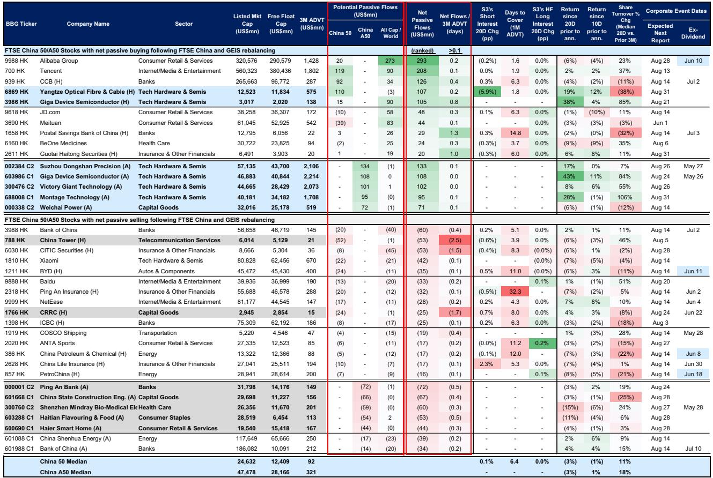
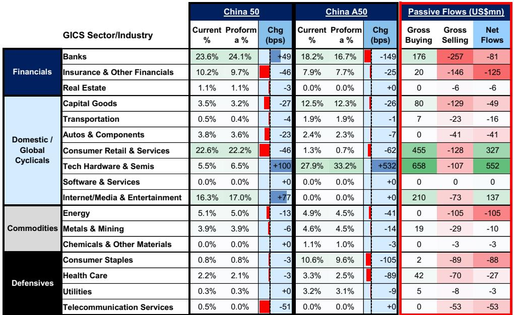
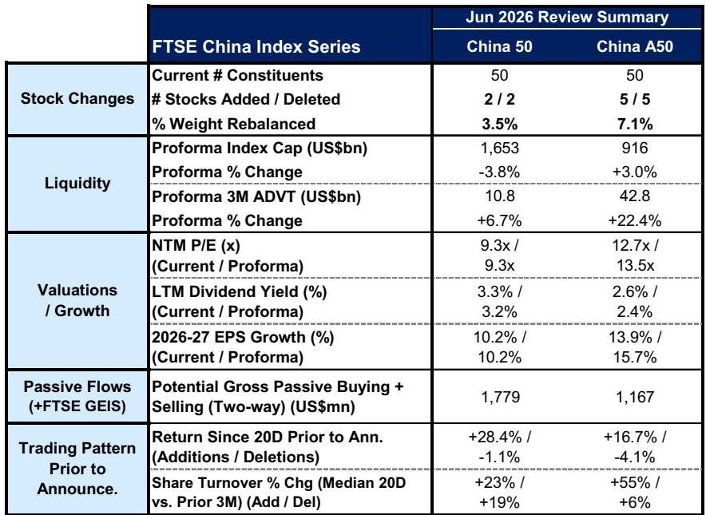

# 富时中国指数调整：市场真正低估的不是需求，而是供给侧的再定价

6月3日收盘后，富时罗素公布了其中国指数系列的季度调整结果。这不是一次普通的调仓。表面上看，这是成分股的例行更替——中国50调入两只、调出两只，中国A50调入五只、调出五只。但真正值得关注的，不是哪些股票进了、哪些股票出了，而是这轮调整所折射出的、中国资本市场正在发生的结构性变化。

某外资投行的最新研报对此进行了量化拆解。其核心判断是：这轮调整的本质，是市场正在对“中国资产”进行一轮供给侧再定价。被调入的标的，不是简单的“好公司”，而是代表了当前全球资本对中国经济新增长极的集体押注——半导体、科技硬件、消费零售。而被调出的，则是传统金融、能源和部分周期蓝筹。

这不仅仅是指数跟踪基金的被动调仓问题。它揭示了一个更深刻的趋势：中国指数正在经历一场“基因重组”。对于持有中国资产的投资者而言，理解这轮调整的底层逻辑，比追逐调仓窗口期的交易机会重要得多。

## 1. 科技硬件与半导体成为最大赢家，净流入预计超过5.5亿美元

根据研报测算，在此次调仓中，科技硬件与半导体板块是最大的净受益者，预计将吸引约5.52亿美元的被动资金净流入。这一数字远超其他任何板块。紧随其后的是消费零售（约3.27亿美元）和互联网/传媒（约1.37亿美元）。

这些数字意味着什么？它们不是简单的资金流向统计，而是全球指数编制规则对中国产业结构变迁的一次“官方确认”。当一个5G光缆制造商（长飞光纤）和一家半导体设计公司（兆易创新）同时进入中国50指数，而中国铁塔和中国中车被调出时，市场的信号非常明确：资本正在从“基建驱动”转向“技术驱动”。

更为重要的是，这一趋势并非孤例。中国A50指数中，东山精密、兆易创新（A股）、胜宏科技、澜起科技、潍柴动力等五只股票调入，而平安银行、中国建筑、迈瑞医疗、海天味业、海尔智家等五只被调出。调入名单中，四只属于科技硬件与半导体。这已经不是简单的行业轮动，而是一次指数层面的“换血”。

## 2. 被调出的不是差公司，而是指数不再需要它们代表中国

值得反复强调的是，被调出的公司并非基本面恶化。中国建筑、海天味业、海尔智家，这些公司至今仍是各自领域的龙头。但指数编制不是“优秀企业排行榜”，而是“经济结构映射器”。

当中国A50指数调出迈瑞医疗和海天味业，同时调入半导体和精密制造公司时，它传递的信息是：全球投资者希望从中国指数中获得的“代表性”，已经从传统消费和医疗，转向了硬科技和先进制造。这不是对消费或医疗行业的否定，而是对中国经济未来增长动力的重新定义。

研报数据也印证了这一点。调仓后，中国A50指数的远期市盈率从12.7倍上升至13.5倍，EPS增长率（2026-27年复合年增长率）从13.9%提升至15.7%。这意味着新调入的标的整体上具有更高的成长性溢价。指数不再是“价值洼地”的代表，而是开始向“增长溢价”倾斜。

对于长期持有中国资产的机构投资者而言，这一变化的影响是深远的。传统的“买指数就是买中国”的框架，需要被重新审视——你买的是哪个中国？是基建和银行驱动的旧中国，还是半导体和消费科技驱动的新中国？

## 3. 保险、金融与能源板块面临结构性资金流出，但风险可能被高估

与科技板块的强势流入形成对比，保险与其他金融服务板块预计净流出约1.25亿美元，能源板块净流出约1.05亿美元。从个股层面看，中国银行、中国铁塔、CITIC、小米、比亚迪等均面临显著的被动卖出压力。

但这里需要保持克制解读。被动资金的流出，更多是权重调整的结果，而非主动抛售。中国50指数中，保险板块的权重仅从10.2%降至9.7%，能源从5.1%降至5.0%，调整幅度并不剧烈。真正值得警惕的，不是调仓当周的流出，而是这些板块在指数中权重持续下降的长期趋势。

研报显示，中国50指数调仓后的整体估值和盈利增长预期几乎没有变化——远期市盈率仍为9.3倍，EPS增长率仍为10.2%。这说明被调入的科技股与被调出的传统股之间，在估值和增长上形成了对冲。指数本身没有变得更贵，但内部结构已经完全不同。

对于持有金融和能源股的投资者，一个需要认真思考的问题是：如果指数本身都在“去金融化”和“去能源化”，那么这些板块是否还能被当作中国长期增长的代表性持仓？

## 4. 报告尚未完全回答的关键问题：被动调仓后的主动资金会如何选择？

研报对被动资金流量的测算非常详尽，但有一个关键问题尚未完全展开：被动调仓完成后，主动资金会跟随还是反向操作？

历史数据显示，富时中国50指数的调入标的在公告前20个交易日平均上涨28.4%，调出标的下跌1.1%；中国A50的调入标的同时期上涨16.7%，调出标的下跌4.1%。这意味着市场已经提前定价了调仓预期。而研报也指出，公告后的历史表现往往波动且温和偏弱，A50的调入标的甚至存在公告后回调、生效日前后再恢复的规律。

这引出了一个尚未被充分讨论的假设：被动资金是确定的，但主动资金的二次定价才是决定中期走势的关键。如果主动基金经理认为调入标的的估值已经反映了调仓溢价，他们可能会在被动买入窗口期卖出；反之，如果他们认为调仓逻辑本身具有长期说服力，则可能继续加仓。

报告提供了数据，但没有给出结论。这一判断的验证，需要观察6月18日生效日之后2-4周的板块资金流向。这恰好是研报阅读者可以自行跟踪并验证的关键窗口。

## 5. 投资者的观察框架：用三个维度重新审视中国资产的配置逻辑

基于这份研报的逻辑，我们建议读者在评估中国资产时，建立以下三个观察维度：

第一，指数权重变化的方向比幅度更重要。不要只看调仓当天的资金流大小，而要关注哪些板块的权重在趋势性上升、哪些在下降。科技硬件在中国A50中的权重从27.9%跃升至33.2%，这不是一次调仓的结果，而是一个趋势的延续。

第二，区分“被动流入”和“主动定价”。被动资金是确定的，但它在总交易量中的占比有限。真正的价格发现来自主动资金。如果调入标的在生效日后持续获得主动买盘，说明市场认可调仓逻辑；如果迅速回落，说明只是套利资金在运作。

第三，关注指数估值结构的变化，而非整体水平。中国50的9.3倍市盈率没有变化，但这掩盖了内部结构的剧烈分化。一个看似便宜的指数，可能正在变得结构性地昂贵——如果高估值板块的权重在持续上升。同样，一个看似昂贵的指数，如果是由高增长板块驱动的，其溢价可能是合理的。

## 6. 调仓窗口期的交易机会有限，但结构变化的启示值得深挖

研报中列举了多只个股的净被动资金流与日均成交额的比值。例如，长飞光纤的净流入与3个月日均成交额之比为0.2天，兆易创新（H股）为0.8天，东山精密为0.1天。这意味着即使是被动资金量最大的个股，其流入也只需不到一天的成交量即可消化。

这一数据说明，调仓窗口期的交易机会是有限的、短期的。真正有价值的，不是预测哪只股票会在生效日上涨，而是理解这些调入标的所代表的产业方向，并据此调整自己的长期持仓结构。

对于那些被调出但基本面仍然扎实的标的，如迈瑞医疗、海天味业，调仓带来的卖出压力可能创造暂时的价格错位。研报没有直接给出这一判断，但从历史经验看，被动卖出后、主动价值投资者重新入场，是这类标的常见的走势模式。这需要投资者自行判断是否值得逆向操作。

---

这份研报提供了详尽的资金流测算和板块影响分析，但正如上文所述，它留下了一个关键的未解问题：被动资金退潮后，主动资金会如何重新定价这些调整？是继续加码科技硬件，还是转向被低估的传统板块？这些问题的答案，可能决定了未来一个季度中国资产的表现方向。

如果你对这些未解问题感兴趣，欢迎来我们的星球微信群继续讨论。我们会持续跟踪6月18日生效日后的资金流向和板块表现，并在群内分享更细致的解读和二阶影响分析。

Personal reading notes and learning share only. Not investment advice.

