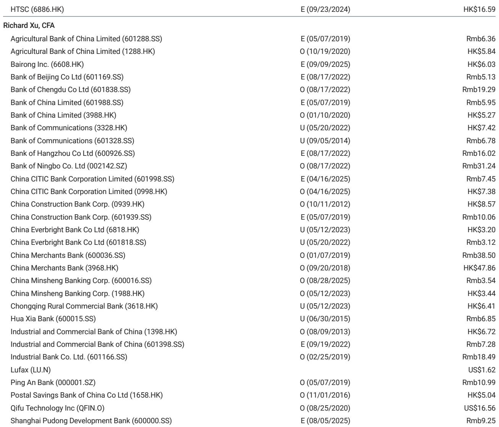
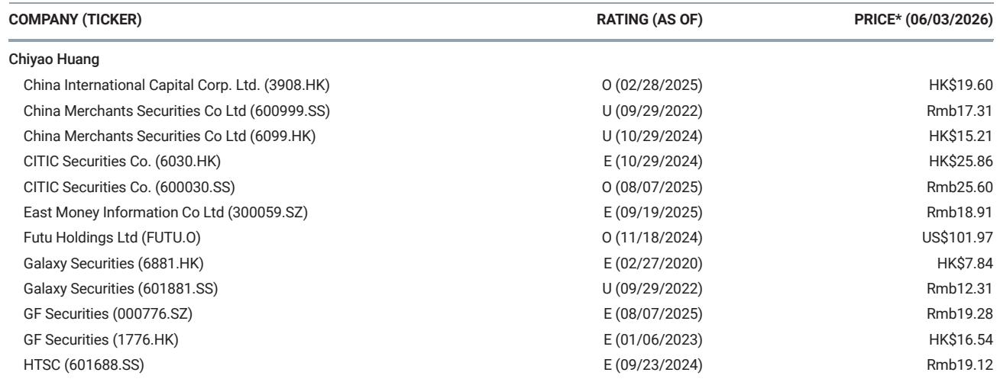
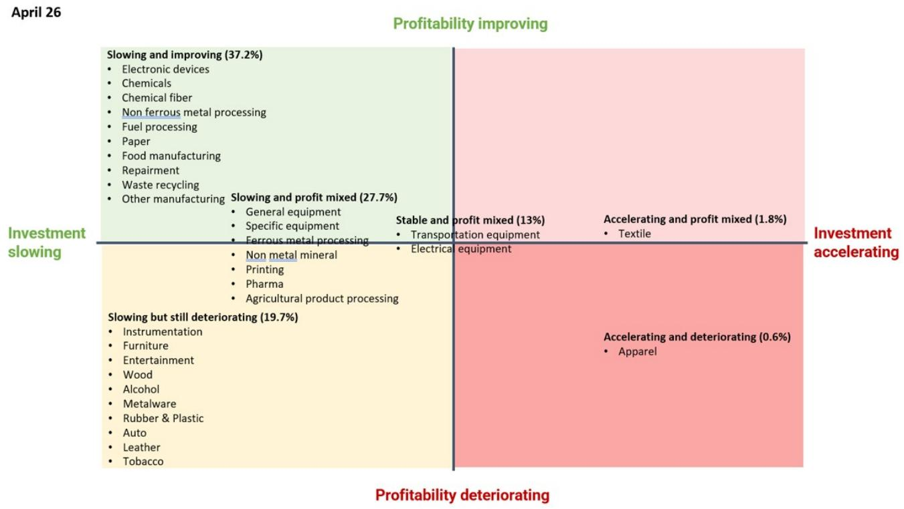

# 市场真正低估的不是需求，而是制造业供给侧风险的持续消化

当市场目光仍聚焦于宏观数据的月度波动时，一份关于中国制造业财务健康状况的深度追踪报告揭示了一个被低估的结构性变化：制造业利润增长正在加速，而产能过剩风险则在持续收敛。这并非简单的周期性反弹，而是一场供给侧自我修复的进程，其影响将远超短期宏观读数所能捕捉的范围。

2026年4月的数据显示，制造业利润同比增速进一步攀升至20.4%，单月增速高达19.3%。与此同时，制造业固定资产投资增速却从3月的4.1%骤降至1.2%。利润在扩张，投资在收缩——这种背离释放了一个关键信号：企业正在用利润修复资产负债表，而非盲目扩产。对于银行信贷资产质量和产业竞争格局而言，这可能是过去两年里最值得关注的边际变化。

某外资投行在最新发布的研报中，重新梳理了31个制造业子行业的利润与投资趋势，发现37.2%的行业（按负债规模计）盈利能力正在改善，且这一改善已不再局限于上游资源品领域，而是扩散至电子设备等下游行业。更值得注意的是，84.5%的制造业子行业固定资产投资增速正在放缓。这种“利润改善+投资减速”的组合，意味着困扰中国制造业多年的产能过剩问题，正在经历一轮实质性的出清。

## 1. 利润改善的广度正在超越市场预期，下游行业开始接力

市场此前普遍认为，制造业利润修复主要依赖上游原材料价格上涨。但研报的行业分类分析显示，这一判断已经过时。在重新划分的31个子行业中，利润趋势改善的行业占比按负债计算达到37.2%，且改善范围已从化学制品、有色金属加工等上游行业，扩展至电子设备制造等下游领域。

这意味着利润修复的驱动力正在切换。PPI的持续回升固然提供了价格支撑——4月PPI环比上涨1.7%，同比上涨2.8%——但更重要的因素在于企业自身的成本控制能力。整体制造业毛利率同比改善6个基点，这在宏观增速放缓的背景下尤为难得。对于投资者而言，需要重新审视的一个问题是：下游企业的利润改善是否可持续？如果答案是肯定的，那么制造业整体信用风险的下降将具有更广泛的行业基础。

## 2. 投资减速是主动去产能的结果，而非需求崩塌的信号

制造业固定资产投资增速从4.1%骤降至1.2%，容易被市场解读为企业家信心不足。但研报提供了一个更细致的观察框架：84.5%的制造业子行业（按负债计）固定资产投资增速正在放缓。这不是某个行业的个别现象，而是覆盖绝大多数制造业领域的系统行为。

关键在于，这种减速发生在利润高速增长的背景下。企业有钱却不扩产，只有两种可能：要么对未来需求极度悲观，要么在政策引导下主动控制产能。从“反内卷”成为2026年政策关键词来看，后者的权重明显更高。研报明确指出，产能过剩的缓解仍在持续进行中。这意味着，当前的投资减速并非需求崩塌的先行指标，而是供给侧结构性调整的延续。对于银行信贷而言，这意味着存量制造业贷款的风险正在被逐步消化，而非积累。

## 3. 信贷增长理性克制，银行资产质量获得结构性支撑

研报中一个容易被忽略的细节是：工业企业负债增速为5.9%，仅略高于上月的5.5%，且没有出现监管推动贷款规模增长的压力。这种“理性信贷”格局，恰恰是银行资产质量改善的前提。

在以往的经济周期中，利润改善往往伴随着信贷扩张，企业杠杆率随之上升，最终在下一轮下行周期中暴露风险。但当前的情况不同：企业在用利润修复资产负债表，而非加杠杆扩张。这使得银行的制造业贷款组合面临的风险结构正在发生根本性变化——不是简单的“坏账率下降”，而是“新增风险敞口被有效控制”。

研报的判断是，制造业健康的利润增长将有助于银行消化工业风险。但这里仍有一个需要验证的关键问题：利润改善向银行资产质量的传导需要多长时间？不同区域、不同规模的银行，其制造业贷款敞口结构差异巨大，这一轮供给侧改善的红利能否被均匀分享，仍有待进一步观察。

## 4. 一个未被完全回答的问题：PPI向利润的传导存在时滞，哪些行业会滞后受益？

研报坦承，PPI的回升转化为各行业利润率的改善需要时间。这是一个非常务实的判断。从历史经验看，上游价格回升向下游利润传导存在明显的时滞，且不同行业的传导速度差异显著。

当前利润改善最明显的是上游和部分中游行业，但下游行业的利润修复是否可持续，取决于PPI能否稳定在目前水平，以及终端需求能否承接价格传导。如果PPI在二季度出现回落，那么当前利润改善的广度可能会收窄。反之，如果PPI持续温和上涨，利润修复将向更多下游行业扩散。

这一判断对投资者的意义在于：不能简单地将当前利润数据线性外推。需要区分哪些行业的利润改善是价格驱动的短期现象，哪些是成本控制和结构优化带来的可持续改善。研报提供的数据框架——利润增速、投资增速、产能利用率三者的组合——恰好是进行这种区分的有效工具。

## 5. 构建观察框架：用“利润-投资-负债”三角模型判断行业拐点

基于研报的分析方法，可以提炼出一个实用的行业风险观察框架：将制造业子行业按三个维度进行分类——利润趋势（改善/稳定/恶化）、投资趋势（加速/减速）、负债增速（扩张/收缩）。

最健康的组合是“利润改善+投资减速+负债稳定”，这意味着企业正在创造价值而非消耗资本。最危险的组合是“利润恶化+投资加速+负债扩张”，这往往是产能过剩恶化的前兆。当前，84.5%的行业处于投资减速区间，其中利润改善的行业占比最高，这是过去两年里最有利的组合结构。

投资者可以对照这一框架，重新审视自己关注的行业和公司。如果一家企业所在的行业处于“利润改善+投资减速”区间，那么其资产质量的改善可能刚刚开始。反之，如果行业仍处于投资加速阶段，即便当前利润数据不错，也需要警惕未来的产能过剩风险。

## 6. 报告尚未完全展开的关键问题：利润改善能否抵御外部需求冲击

研报的分析主要基于国内供给侧视角，但2026年全球贸易环境的不确定性正在上升。制造业利润增长的一个重要支撑是出口——4月出口同比增长14.5%。如果外部需求出现显著下滑，出口依赖型行业的利润改善能否持续？

这是一个报告没有完全回答的问题。研报强调了PPI回升和成本控制对利润的支撑，但并未深入分析出口放缓情景下的压力测试。对于银行信贷而言，出口型制造业企业的风险敞口需要单独评估，不能简单套用整体制造业的改善趋势。

这一未解问题，恰恰是深入阅读完整报告、与分析师进一步讨论的价值所在。完整的研报包含了更详细的行业分类数据、历史对比以及敏感性分析，这些内容对于判断利润改善的可持续性至关重要。

---

这篇研报的核心价值，不在于它给出了一个乐观的结论，而在于它提供了一套可以持续追踪的分析框架。对于关注中国制造业和银行资产质量的读者而言，真正重要的不是4月利润增速是20%还是15%，而是利润改善的逻辑是否在持续强化，投资减速是否在更多行业扩散，以及这些变化最终能否转化为银行资产质量的系统性改善。

这些问题，需要更完整的数据、更细致的行业拆解、以及持续的跟踪讨论。欢迎来星球微信群里继续讨论，我们会在群内分享完整研报的详细拆解，并围绕上述未解问题展开专题讨论。

Personal reading notes and learning share only. Not investment advice.

