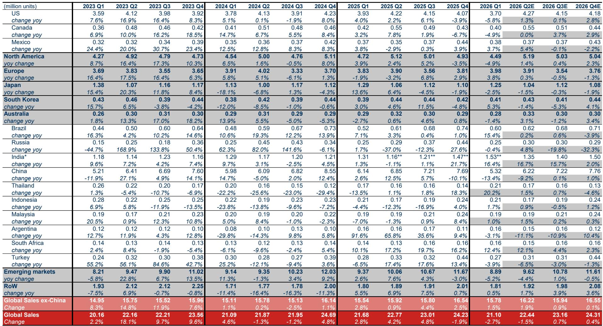
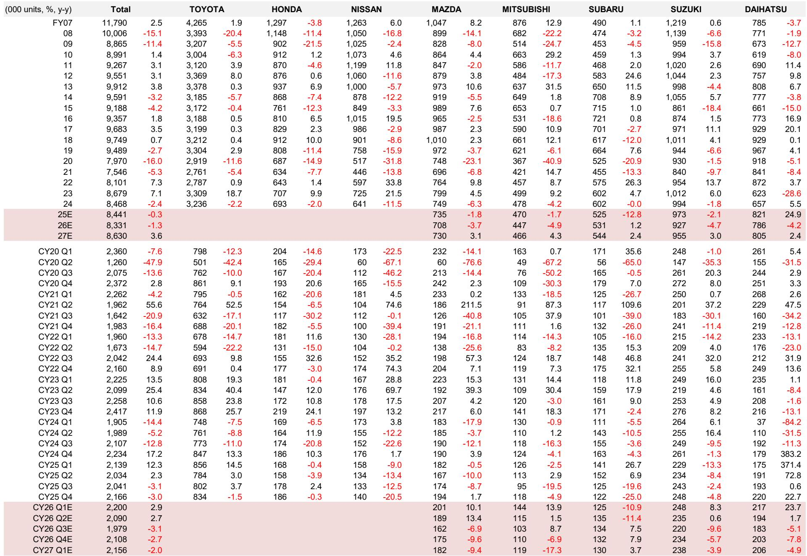
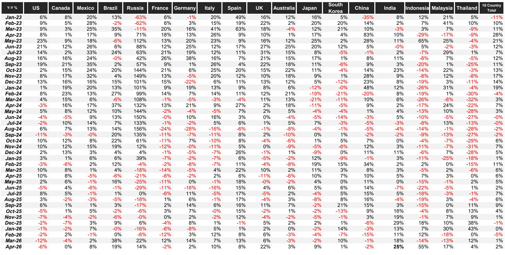

# 全球汽车市场真正的拐点不在需求，而在中国出口引发的供给再定价

全球汽车市场正在经历一个被多数投资者低估的结构性转变。某外资投行最新发布的全球汽车月度报告，在表面温和的2%同比增速之下，揭示了一个更深层的判断：全球汽车销量增长的真正风险并非来自需求端的周期性波动，而是来自中国供给外溢对全球贸易与竞争格局的永久性重塑。

这份报告最值得关注的结论是：全球汽车市场2026年将转为负增长，而最大的变数并非美国关税或欧洲衰退，而是中国国内需求疲软后，出口成为唯一出路，从而引发新一轮贸易摩擦的循环。

这不是一个短期的库存周期波动，而是一个供给侧的再定价过程。理解这一点，比跟踪月度销量数据重要得多。

## 1. 全球销量增速正在见顶，但结构性分化比总量更重要

4月全球18国汽车销量同比增长2%。如果剔除中国和俄罗斯，增速为5%。这一数据本身并不令人担忧，但深入拆解后，表象之下的分化值得高度关注。

印度以25%的同比增速领跑全球，成为少数几个仍在高速增长的市场。而美国市场却同比下滑6%，原因在于2025年消费者因关税预期提前购车，形成了高基数效应。美国市场的疲软并非需求崩溃，而是需求前置后的正常回调。但问题的关键在于，这种回调是否会演变为持续的下行趋势。

某外资投行已将2026年全球汽车销量预测从六个月前的增长2%下调至下降1%。这一调整的核心驱动力是：中国需求的下滑幅度远超预期，而其他市场的增长无法完全对冲。

这意味着，全球汽车市场正在从一个“总量增长”的逻辑，转向一个“结构性分化”的逻辑。投资者不应再简单跟踪全球总销量，而应关注各个市场的需求结构、政策周期和竞争格局的差异。

## 2. 中国市场的疲软不是短期现象，而是政策退坡后的需求再平衡

中国汽车市场是这份报告下调预测的核心原因。某外资投行将2026年中国新车销量预测下调了223万辆，2027年下调了204万辆。这一调整幅度是近年来最大的一次。

直接原因是：新能源车免税政策到期，以及以旧换新补贴门槛提高。但更深层次的问题是，中国国内乘用车需求的潜在趋势已经明显走弱。根据乘用车注册数据，2026年前四个月的年化销量仅为1733万辆，远低于2025年同期的2110万辆和2025年全年的2359万辆。

这意味着，即使下半年出现季节性复苏，也很难将中国汽车销售重新拉回增长轨道。消费者对新技术车型的反应存在不确定性，但更根本的问题是，补贴退坡后，国内需求的真实水平被暴露出来。

对于投资者而言，这传递了一个重要信号：中国汽车市场的增长故事正在从“国内需求驱动”转向“出口驱动”。而出口驱动的增长，将带来截然不同的风险特征。

## 3. 中国出口的加速增长，正在制造一个自我强化的贸易摩擦循环

在国内需求疲软的背景下，中国汽车出口成为唯一的增长引擎。某外资投行中国汽车团队已将2026年中国汽车出口预测上调至737万辆，较此前预测高出19%；2027年上调至810万辆，高出24%。

这一预测上调的背后，是中国车企在全球市场加速扩张的明确信号。无论是本土品牌还是合资企业，都在将更多产能转向海外市场。出口增长有助于维持生产开工、支撑就业和地方财政收入，但代价是贸易摩擦风险的显著上升。

报告给出了一个关键数据：2025年，中国制造的汽车出口至墨西哥、欧洲、澳大利亚、巴西、俄罗斯、泰国、印尼、马来西亚、南非和土耳其等市场，占中国总汽车出口的约47%。这些出口占这些市场总销量（2548万辆）的约15%。

简单推算后，如果中国出口继续加速，到2026年，中国制造汽车在这些市场的份额将从15%升至18%，到2027年升至22%。

除了澳大利亚——该国已不再有本土大规模汽车制造业——其他市场很难在不冲击本土汽车就业的情况下，吸收如此大幅度的中国进口增长。因此，报告认为，近期的贸易紧张并非过去时，而将成为全球汽车市场的常态。

这是一个典型的“自我强化”循环：国内需求越弱，出口压力越大；出口越大，贸易摩擦越激烈；贸易摩擦反过来又影响全球供应链布局和成本结构。

## 4. 印度成为全球唯一的增长亮点，但其规模不足以改变全局

在所有主要市场中，印度是唯一一个被上调预测的市场。某外资投行将2026年印度销量预测上调了47万辆，2027年上调了49万辆。4月印度销量同比增长25%，剔除商用车后增速更高。

印度的增长故事有其独立性：人均汽车保有量低、经济增速快、政策支持力度大。但问题在于，印度的增量相对于中国的减量而言，仍然太小。中国2026年下调的223万辆，几乎是印度上调量（47万辆）的五倍。

这意味着，印度虽然是一个重要的结构性机会，但在全球总量层面，它无法对冲中国需求下滑带来的拖累。投资者在关注印度市场的同时，不应高估其对全球汽车股定价的影响。

## 5. 报告尚未完全回答的关键问题：关税传导的微观机制与库存周期的二阶效应

这份报告在宏观层面提供了清晰的判断，但有几个关键问题尚未完全展开，这也是我们建议读者进一步深读完整报告的原因。

第一个未解问题是：关税成本如何在供应链中传导？报告指出贸易摩擦可能重现，但没有详细分析关税成本是由车企承担、转嫁给消费者，还是通过供应链重新配置来消化。不同的传导路径，对车企利润率、定价能力和竞争格局的影响完全不同。

第二个未解问题是：库存周期的二阶效应。美国市场2025年因关税预期提前购车，导致2026年需求前置后的回调。但这一回调的深度和持续时间，取决于经销商库存水平、生产计划调整和消费者信心变化。报告没有提供足够的数据来量化这一二阶效应。

第三个未解问题是：中国车企的海外产能布局如何影响出口数据？如果中国车企在海外建厂，出口数据中的“中国制造”份额可能会下降，但中国企业的全球竞争力反而增强。报告提到了出口增长，但没有区分“中国制造出口”和“中国品牌海外生产”的差异。

这些问题，正是我们建议读者加入社群、获取完整报告并继续讨论的原因。完整的研报包含了更详细的图表、分市场数据、以及方法论假设，能够帮助投资者建立更完整的分析框架。

对于产业决策者和投资者而言，这份报告的核心启示是：不要再用“全球销量增速”来评估汽车行业的投资价值。真正重要的变量是——中国出口的溢出效应如何重新定价全球汽车股的估值。那些能够在中国以外市场建立竞争力、同时避免贸易摩擦冲击的企业，将获得结构性溢价；而那些过度依赖中国国内需求或出口单一市场的企业，将面临持续的压力。

这轮变化真正考验的，不是企业能否卖更多的车，而是企业能否在全球供给再定价的过程中，把规模转化为议价权。

Personal reading notes and learning share only. Not investment advice.

