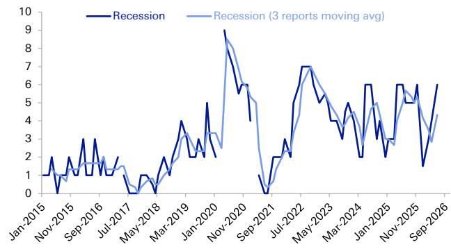
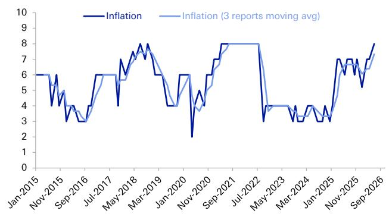

# The Fed’s Next Move May Be a Hike, Not a Cut: Why the May Beige Book Signals a Regime Change in Inflation Risks

The prevailing market narrative has long assumed that the Federal Reserve’s next policy move, when it comes, will be a rate cut. That assumption is becoming dangerously outdated. The May 2026 Beige Book, analyzed through proprietary quantitative sentiment tools, reveals a macroeconomic landscape that is fundamentally different from what most investors are pricing in. Growth remains resilient, the labor market is stable, but inflation sentiment has surged to its highest level since mid-2022. This is not a temporary blip. It is a structural shift driven by two powerful, intertwined forces: the Middle East conflict and an unprecedented wave of AI-driven investment demand.

The implication is uncomfortable but increasingly unavoidable. The risk of the next Fed rate move being a hike is real and rising. This analysis, drawn from a global investment bank report, dissects the Beige Book data to explain why the inflation genie may be escaping the bottle again, and what that means for portfolio strategy. The central argument is this: the combination of supply-side energy shocks and demand-side investment booms is creating a self-reinforcing inflationary cycle that the Fed cannot ignore indefinitely.

Most market participants are still anchored to the idea that inflation is a solved problem, a vestige of the post-pandemic era. The Beige Book data tells a different story. The inflation sentiment score has climbed to 8 out of 10, a level not seen since the peak of the COVID-19 inflation shock. The language used by Fed districts has escalated from characterizing price growth as "mostly moderate" in April to "moderate to strong" in May. This is not a subtle change in nuance; it is a clear signal that price pressures are intensifying across the board.

The strategic question for investors is no longer about when the Fed will cut. It is about whether the Fed will be forced to hike, and how to position for that outcome. This article will unpack the key drivers behind this shift, examine the fault lines in the data, and provide a decision framework for navigating the emerging regime.

## The Inflation Score Jumped to an Eight, Marking the Highest Reading Since Mid-2022 and Signaling That Price Pressures Are No Longer Transitory

The most striking data point from the May Beige Book analysis is the inflation sentiment score. It rose from 7 to 8, a single-point move that carries outsized significance. To put this in context, the score has only reached this level during the most acute phase of the pandemic-era inflation crisis. The report’s language upgrade from "mostly moderate" to "moderate to strong" is not just semantics; it reflects a broad-based intensification of price pressures reported across multiple Federal Reserve districts.

The primary driver identified in the Beige Book is the Middle East conflict, which has generated sustained energy-related cost increases. These are not confined to the oil patch. The report details how energy costs are cascading through the economy, affecting freight, shipping, and a wide range of raw materials. This is a textbook supply-side shock, and it is being amplified by a demand-side factor that is unique to this cycle: the AI investment boom.

The report specifically highlights that the surge in AI-driven investment demand is fueling strong activity growth in the manufacturing sector, particularly in areas related to defense and data centers. This is creating a powerful dual dynamic. On the supply side, energy shocks are pushing up costs. On the demand side, massive capital expenditure on AI infrastructure is pulling up resource utilization and wages. When supply shocks and demand booms occur simultaneously, the resulting inflation is more persistent and harder to extinguish.

The "so what" for investors is clear. The market has been conditioned to view any inflation uptick as transitory, a hangover from supply chain disruptions. This time, the combination of geopolitics and technology investment suggests a more structural problem. The Fed’s "on hold indefinitely" baseline may be wishful thinking. The data is pointing toward a scenario where rate hikes become necessary to bring inflation back onto a sustainable path toward 2%.

## The Labor Market Is Stable but Wage Pressures Are Building, Creating a Second Channel for Inflation to Become Entrenched

The labor market sentiment score remained at a neutral 5, which on the surface appears benign. The unemployment rate is low at 4.3%, and payroll gains have been consistent. However, the qualitative details within the Beige Book are more concerning than the aggregate score suggests. The report emphasizes robust hiring within the manufacturing sector, driven by defense-related activities and the insatiable demand for data centers. This is not a broad-based labor market boom; it is a highly concentrated one.

The critical insight here is the growing frequency of upward wage adjustments. The report notes that these adjustments are a direct response to high oil prices and the rising cost of living. This is the classic wage-price spiral mechanism. Workers are demanding higher pay to keep up with inflation, and employers in the hot manufacturing and tech-adjacent sectors are granting those increases to retain talent. This creates a second, independent channel for inflation to become entrenched.

If wage inflation becomes generalized, it will be far more difficult for the Fed to manage. Energy shocks can fade if geopolitical tensions ease. But wage-driven inflation is sticky. It becomes embedded in expectations and pricing behavior. The Beige Book is flagging exactly this risk. The report points to "the risk of wage inflation, which could make the inflationary impact of energy shocks more persistent."

For investors, this means that the inflation problem is not just about oil prices. It is about the structural tightness in specific labor markets that are being supercharged by AI investment. The Fed cannot solve this with a single rate cut. It may require a series of hikes to cool down the labor market in these key sectors. The neutral sentiment score may be masking a more volatile underlying dynamic.

## Growth Remains Resilient but Consumer Spending Is Fracturing, Revealing a Two-Track Economy That Complicates Fed Decision-Making

The growth sentiment score edged down slightly to 5, which is essentially neutral. The number of districts reporting moderate growth actually increased from 8 to 10, suggesting a broadening of economic expansion. Manufacturing activity is showing modest to strong growth. On the surface, this looks like a healthy economy that can withstand higher rates.

However, the Beige Book reveals a critical fault line. The report extensively discusses a divergence in consumer spending. Middle- and lower-income households are experiencing increased financial strains due to growing affordability pressures. At the same time, energy price spikes are negatively impacting agricultural conditions. The economy is splitting into two tracks: one driven by investment and manufacturing, and another weighed down by cost-of-living pressures.

This divergence creates a nightmare scenario for the Fed. If it raises rates to combat inflation, it risks crushing the already fragile consumer sector. If it holds rates steady, it risks allowing inflation to become embedded through the investment-driven sectors. The Beige Book’s recession sentiment score rose from 4 to 6, reflecting this growing unease. Yet, the bank’s own recession probability model remains at a historically low level near 10%. This gap between sentiment and model-based probability is a warning signal. It suggests that the market may be underestimating the risk of a policy error.

The "so what" is that the traditional recession playbook may not apply. A recession triggered by a Fed hike to combat investment-driven inflation would look very different from a recession caused by a financial crisis or a demand collapse. Growth in the AI and manufacturing sectors could remain robust even as the broader consumer economy weakens. This is a complex environment for asset allocation, where sector-level bets may matter more than macro-level directional calls.

## What the Beige Book Does Not Fully Answer: The Persistence of the AI Investment Cycle and Its Interaction with Energy Shocks

The Beige Book analysis provides a powerful snapshot of the current state of the economy, but it leaves several critical questions unanswered. The most important of these is the persistence of the AI investment cycle. The report notes that AI-driven demand is boosting manufacturing and data center construction, but it does not provide a clear view of the duration of this cycle. Is this a multi-year structural shift, or a one-time capex surge that will fade as infrastructure is built out?

The answer to this question is crucial for assessing the inflation outlook. If AI investment is a sustained, multi-year phenomenon, then the demand-side pressure on wages and resources will persist. If it is a shorter cycle, the inflation risk may be more manageable. The Beige Book, by its nature, is a backward-looking qualitative survey. It captures current conditions but offers limited forward guidance on the trajectory of these investment flows.

A second unanswered question is the potential for a de-escalation in the Middle East conflict and its impact on energy prices. The current inflation spike is heavily driven by energy costs. A geopolitical resolution could remove this pressure relatively quickly. However, the report also highlights that the inflationary impact of energy shocks is becoming more persistent due to wage adjustments. Even if oil prices fall, the wage gains that were granted in response may not be reversed. The economy could be left with a higher inflation floor.

Finally, the Beige Book does not fully address the transmission mechanism from inflation sentiment to actual Fed policy. The sentiment scores are powerful indicators, but they are not deterministic. The Fed has its own models and frameworks. The report notes that the Beige Book data points to "rising risks of rate hikes being necessary," but it does not specify the threshold at which the Fed would act. This leaves a critical gap for investors. Understanding when the Fed might shift from "on hold" to "hike mode" requires a deeper dive into the Fed’s reaction function and the specific data triggers it is monitoring.

## A Decision Framework for Investors: How to Monitor the Three Signals That Will Determine the Fed’s Next Move

Given the complexity of the current environment, a simple directional bet on rates is insufficient. Investors need a structured framework to monitor the key signals that will determine the Fed’s path. Based on the Beige Book analysis, three indicators are paramount.

First, track the wage data in manufacturing and tech-adjacent sectors. The Beige Book flagged upward wage adjustments as a key risk. If average hourly earnings in these sectors continue to accelerate, it will confirm that the wage-price spiral is gaining traction. This is a leading indicator that the Fed cannot ignore. Second, monitor the persistence of energy cost pass-through. The Beige Book noted that energy costs are affecting freight, shipping, and materials. If these cost increases are being passed through to core CPI and PCE inflation, the supply-side shock is becoming embedded. Third, watch for any change in the Fed’s language regarding the AI investment cycle. If Fed officials begin to explicitly cite AI-driven demand as an inflation risk, it will signal a shift in their thinking.

The framework also requires a clear understanding of the two-track economy. Investors should differentiate between sectors that are benefiting from the investment boom and those that are vulnerable to consumer weakness. A Fed hike would likely exacerbate this divergence. Positions should be tilted toward sectors with pricing power and exposure to capital expenditure, while avoiding sectors that are dependent on discretionary consumer spending.

The most important takeaway from this framework is that the risk of a Fed hike is asymmetric. The market is pricing in a low probability of a rate increase. The Beige Book data suggests that the probability is significantly higher. Positioning for this tail risk does not require a full-scale bearish stance, but it does require hedging. Investors should consider reducing duration exposure, increasing allocation to commodities that benefit from supply constraints, and maintaining a bias toward quality assets with strong balance sheets.

## Join the Community to Read the Full Report and Review the Original Charts

The analysis presented here is based on a sophisticated quantitative framework that transforms the qualitative text of the Beige Book into actionable sentiment scores. The original report includes detailed charts showing the historical trajectory of these scores across labor markets, inflation, growth, and recession probabilities. These visualizations reveal patterns that are impossible to capture in a text summary alone. They show, for example, how the current inflation sentiment score compares to every major inflation episode of the past decade, and how the gap between recession sentiment and model-based probabilities has widened to a level that historically preceded significant market dislocations.

Understanding these dynamics is essential for making informed investment decisions in the current environment. The full report provides the data, the methodology, and the detailed analysis that underpin the conclusions in this article. It also includes the proprietary LLM tools used to extract and quantify sentiment from the Fed’s language. For serious investors who want to stay ahead of the curve, this is not optional reading; it is required reading.

Join the community to read the full report and review the original charts.

*This article is for learning and discussion only and does not constitute investment advice.*

Personal reading notes and learning share only. Not investment advice.

