# China Macro Tracker

# Home sweet home

# Economics China

- Urban renewal and permanent residence-based public services should help expand consumption and investment   
- New ODI regulations clarify compliant overseas expansion while reinforcing national security guardrails   
- Industrial profits accelerated, with improvements concentrated in upstream petrol-chemical and AI-related industries

# Urban renewal and permanent residence-based welfare coverage to lift demand

China is emphasising structural reforms to boost consumption and investment. Shortly after recent plans to increase social safety net coverage based on one's permanent residence as opposed to household registration (we wrote more extensively on this in China's Urbanisation 2.0, 29 May 2026), the State Council also provided its 5-year road map for urban renewal on 28 May. These two policies go hand in hand and will be conducive to lifting both consumption and investment in the medium and longer-term.

Considering that the property sector's recent revival is concentrated primarily in the largest cities (e.g. tier-1, see charts 8 and 10), this broader focus on expanding urban infrastructure and high-quality housing development across a multitude of regions and city clusters should be helpful in stabilising the overall property sector as well.

In the plan, the NDRC estimates that urban renewal during the 15 $^{th}$ FYP (Five Year Plan) period could mobilise at least RMB15trn of investment, including around RMB5trn from underground pipeline network upgrades alone (NDRC, 7 April). Beyond investment, urban renewal is expected to reinforce broader policy priorities such as boosting consumption and “investing in people”. The plan calls for upgrading consumption-related infrastructure, revitalising idle housing stock and underutilised land, and prioritising the closing of public service gaps, particularly in elderly care and childcare.

On funding, the plan highlights a multi-channel approach, including central budget investment, local government special bonds (eligible projects may use proceeds as equity capital), new policy financial instruments and market-based financing, while explicitly prohibiting the creation of new implicit local government debt.

Local government special bonds for urban renewal are expected to increase during the 15 $^{th}$ FYP period. In Q1 2026, issuance of urban renewal-related special-purpose bonds reached RMB120bn, up 7% y-o-y (Xinhua, 16 April). Recent policies have also reiterated support for affordable housing; however even though special bonds have been permitted for land reserves and for purchasing commercial housing used for affordable housing, progress has been limited so far. Ultimately, the scale-up of social housing supply will hinge on stronger direct central funding and coordination.

# Erin Xin

Senior Economist, Greater China

The Hongkong and Shanghai Banking Corporation Limited erin.y.xin@hsbc.com.hk

+852 2996 6975

# Jing Liu

Chief Economist, Greater China

The Hongkong and Shanghai Banking Corporation Limited
jing.econ.liu@hsbc.com.hk

+852 3941 0063

# Heidi Li

Associate

Guangzhou

HSBC Funding the Future Survey

Sentiment, AI and Private Credit

Click to view

# Disclosures & Disclaimer

This report must be read with the disclosures and the analyst certifications in the Disclosure appendix, and with the Disclaimer, which forms part of it.

Issuer of report: The Hongkong and Shanghai Banking Corporation Limited

View HSBC Global Investment Research at:

https://www.research.hsbc.com

# Trade and ODI: Lowering of some US-China tariffs; China's ODI regulations clarified

Implementation of the deals from the May China-US presidential summit is now underway. The US plans to launch a public consultation covering at least USD30bn of non-strategic Chinese goods to identify items that could qualify for tariff reductions or removals (Reuters, 26 May). We expect the public comment notice to give further guidance around goods under consideration, which are likely to be in labour-intensive consumer goods. While the timing remains uncertain, the implementation of tariff reductions could be as soon as a few months, assuming a relatively short comment period (e.g. 30 days), followed by review and implementation.

With the Board of Investment and Board of Trade being set up, smoother communication could also create room for a rebound in China-US investment cooperation in non-critical strategic areas, although the pace could remain constrained by US investment screening and corporate compliance costs.

Relatedly, China's ODI rules were updated on 1 June (State Council, 1 June). The new Outbound Investment rules, effective from 1 July, provide clarification on what constitutes compliant overseas expansion, while reinforcing national security guardrails. We do not view it as necessarily contrary to China's stated goals of further two-way opening up but rather aims to provide clarity around encouraged and prohibited actions which may impact national security. Non-sensitive channels are likely to still receive the greenlight to promote further ODI expansion as part of the China going global theme and BRI theme.

The regulation strengthens the outbound investment security review regime and tightens controls over the export of technology, data and services, particularly relevant for sensitive sectors such as AI. It also codifies a formal toolkit for responding to discriminatory measures, including investment barrier investigations, countermeasures, and restrictions on transactions and entry, aligning with the countermeasure framework embedded in the April supply-chain security rules (see China macro tracker, 9 April 2026). A more institutionalised set of countermeasures may also help China manage external frictions, in light of the recent trade tensions with the EU.

# Industrial profits concentrated in upstream petrol-chemical and AI-related industries

Industrial profits rose $25\%$ y-o-y in April, accelerating from Q1's $15.5\%$ growth. Improvements on the pricing side have helped drive up profitability (chart 2), but most of the outperformance remains concentrated in certain upstream energy related industries (e.g. petrol, chemicals) and those related to the AI push (e.g. non-ferrous metals, computer and electronics) (chart 3).

By sector, higher energy prices amidst the Middle East conflict have lifted profits in petroleum processing and chemical products. However, there are signs that supply chain disruptions are starting to impact related production (chart 16, 18). While China may have relative resilience in petrol-chemical related production (see China macro tracker, 1 April 2026), prolonged closure of the Strait of Hormuz still poses risks.

Meanwhile, policy-led industrial upgrading and AI-related investment demand continue to support momentum in high-end manufacturing. The profit margin of computer and electronics expanded further, while the profit margins across other and downstream industries were still relatively subdued.

Looking ahead, measures aimed at curbing involutionary competition and improving pricing discipline could help ease price pressures in some sectors. However, it remains to be seen how much recent price improvements in upstream sectors will translate to downstream sectors, though without improvement in underlying demand, it is more likely to lead to an erosion of profit margins rather than improved profitability. Thus, a more sustainable and broad-based profit recovery will still depend on a further strengthening of domestic demand, such as additional consumption support and related investment demand driven by new urbanisation.

Table 1. Key Indicators for Urban Renewal during the ${15}^{\text{th }}$ FYP Period 

<table><tr><td>No.</td><td>Indicator</td><td>2025</td><td>2030</td></tr><tr><td>1</td><td>Renovation volume of dilapidated urban housing (10,000 units/rooms)</td><td>[25]</td><td>[50]</td></tr><tr><td>2</td><td>Number of newly launched renovation projects for old urban residential communities (10,000 communities)</td><td>[24]</td><td>[11.5]</td></tr><tr><td>3</td><td>Number of upgraded old neighbourhoods/blocks (projects)</td><td>[900]</td><td>[1500]</td></tr><tr><td>4</td><td>Number of renovated urban villages (projects)</td><td>[4100]</td><td>[4000]</td></tr><tr><td>5</td><td>Number of restored historic buildings (10,000 sites)</td><td>[1]</td><td>[1.5]</td></tr><tr><td>6</td><td>Area of newly built and expanded sports venues (10,000 hectares)</td><td>[12.7]</td><td>[12.8]</td></tr><tr><td>7</td><td>Area of upgraded/renovated urban park green space (10,000 hectares)</td><td>—</td><td>[2]</td></tr><tr><td>8</td><td>Length of renovated urban underground pipeline networks (10,000 km)</td><td>[25]</td><td>[36.5]</td></tr><tr><td>9</td><td>Number of renovated existing emergency shelters (10,000 sites)</td><td>—</td><td>[5]</td></tr><tr><td>10</td><td>Digitalisation rate of basic urban housing information (%)</td><td>—</td><td>&gt;95</td></tr></table>

Source: Gov.cn, HSBC; Note: Figures in [ ] are cumulative totals over five years.

# Charts of the week

1. China's ODI has room to grow   
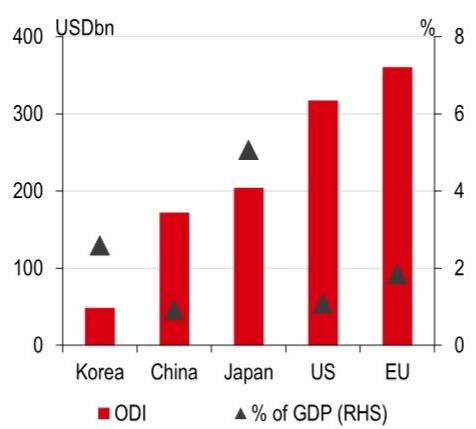

bar_line

| Region | ODI (USDbn) | % of GDP (%) |
| :--- | :--- | :--- |
| Korea | 50 | 2.5 |
| China | 170 | 1.0 |
| Japan | 200 | 4.5 |
| US | 315 | 1.0 |
| EU | 360 | 1.8 |

Source: Wind, HSBC

2. A lift in PPI in upstream sectors has helped industrial profits   
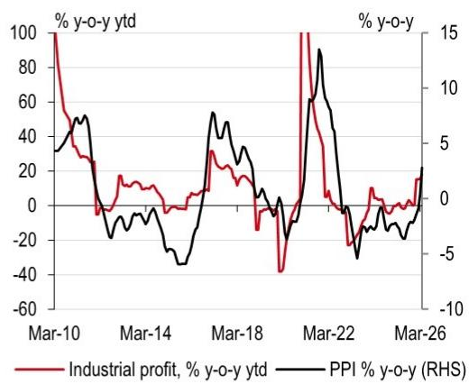

line

| Date   | Industrial profit, % y-o-y ytd | PPI % y-o-y (RHS) |
|--------|--------------------------------|-------------------|
| Mar-10 | 100                            | 30                |
| Mar-14 | 20                             | -20               |
| Mar-18 | 30                             | 50                |
| Mar-22 | 100                            | 15                |
| Mar-26 | 20                             | 0                 |

Source: Wind, HSBC

3. Profits in upstream petrol-chemical industries and AI-related areas improved   
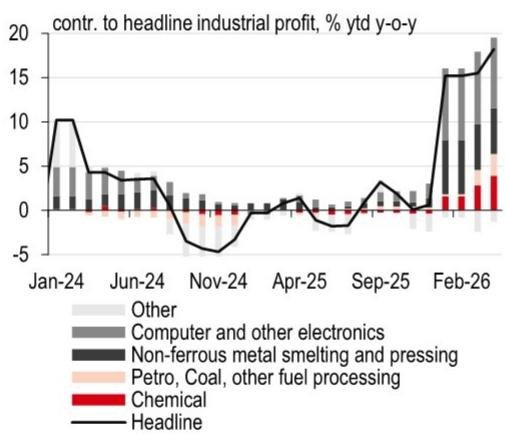

bar_line

contr. to headline industrial profit, % ytd y-o-y
| Month | Chemical (%) | Other (%) | Computer and other electronics (%) | Non-ferrous metal smelting and pressing (%) | Petro, Coal, other fuel processing (%) | Headline (%) |
|---|---|---|---|---|---|---|
| Jan-24 | 10.5 | 5.0 | 5.0 | 0.0 | 0.0 | 0.0 |
| Jun-24 | 3.5 | 3.5 | 3.5 | 0.0 | 0.0 | 0.0 |
| Nov-24 | -4.5 | -1.5 | -1.5 | 0.0 | 0.0 | 0.0 |
| Apr-25 | 0.5 | 1.5 | 1.5 | 0.0 | 0.0 | 0.0 |
| Sep-25 | 3.5 | 1.5 | 1.5 | 0.0 | 0.0 | 0.0 |
| Feb-26 | 18.5 | 17.5 | 17.5 | 5.0 | 3.5 | 19.5 |
The chart displays a stacked bar chart with a line overlay showing the contribution of each category to the total annual profit over time.

Source: Wind, HSBC

4. AI investment boosted profit margins in related industries   
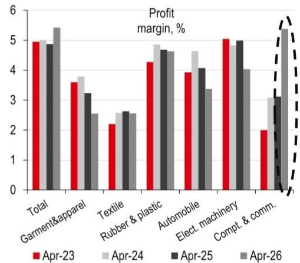

bar

Profit margin, % 
| Category | Apr-23 (%) | Apr-24 (%) | Apr-25 (%) | Apr-26 (%) |
| :--- | :---: | :---: | :---: | :---: |
| Total | 5.0 | 4.9 | 4.8 | 5.4 |
| Garment&apparel | 3.6 | 3.8 | 3.2 | 2.5 |
| Textile | 2.2 | 2.6 | 2.6 | 2.5 |
| Rubber & plastic | 4.3 | 4.8 | 4.7 | 4.6 |
| Automobile | 3.9 | 4.6 | 4.1 | 3.3 |
| Elect. machinery | 5.1 | 4.8 | 5.0 | 4.0 |
| Compt. & comm. | 2.0 | 2.0 | 3.1 | 5.4 |

Source: Wind, HSBC

# Economic activity

5. LGSB issuance can support a lift in FAI, but issuance pace has moderated   
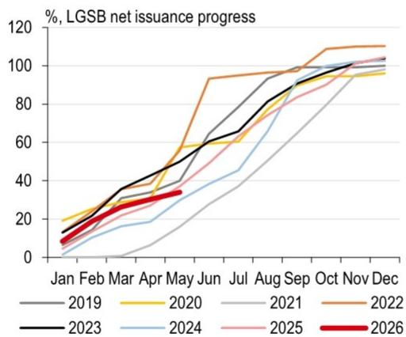

line

| Month | 2019 | 2020 | 2021 | 2022 | 2023 | 2024 | 2025 | 2026 |
|-------|------|------|------|------|------|------|------|------|
| Jan   | 10   | 15   | 10   | 15   | 10   | 5    | 5    | 5    |
| Feb   | 15   | 20   | 15   | 20   | 15   | 10   | 10   | 10   |
| Mar   | 20   | 25   | 20   | 25   | 20   | 15   | 15   | 15   |
| Apr   | 30   | 35   | 30   | 35   | 30   | 25   | 25   | 25   |
| May   | 40   | 45   | 40   | 45   | 40   | 35   | 35   | 35   |
| Jun   | 50   | 55   | 50   | 55   | 50   | 45   | 45   | 45   |
| Jul   | 60   | 65   | 60   | 65   | 60   | 55   | 55   | 55   |
| Aug   | 70   | 75   | 70   | 75   | 70   | 65   | 65   | 65   |
| Sep   | 80   | 85   | 80   | 85   | 80   | 75   | 75   | 75   |
| Oct   | 90   | 95   | 90   | 95   | 90   | 85   | 85   | 85   |
| Nov   | 100  | 100  | 100  | 105  | 100  | 95   | 95   | 95   |
| Dec   | 105  | 105  | 105  | 110  | 105  | 100  | 100  | 100  |

Source: Wind, HSBC; Note: Data as of 31 May.

6. Cross-city travel remained above historical levels   
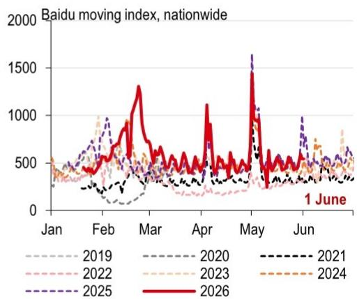

line

| Month | 2019 | 2020 | 2021 | 2022 | 2023 | 2024 | 2025 | 2026 |
|-------|------|------|------|------|------|------|------|------|
| Jan   | ~300 | ~400 | ~350 | ~450 | ~500 | ~450 | ~550 | ~400 |
| Feb   | ~400 | ~500 | ~450 | ~600 | ~700 | ~650 | ~800 | ~600 |
| Mar   | ~350 | ~450 | ~400 | ~550 | ~650 | ~600 | ~900 | ~1300 |
| Apr   | ~300 | ~400 | ~350 | ~500 | ~600 | ~550 | ~800 | ~1100 |
| May   | ~400 | ~500 | ~450 | ~650 | ~800 | ~750 | ~1600 | ~1700 |
| Jun   | ~350 | ~450 | ~400 | ~550 | ~700 | ~650 | ~950 | ~650 |
1 June |

Source: Baidu Index, HSBC

7. The number of domestic flights edged down   
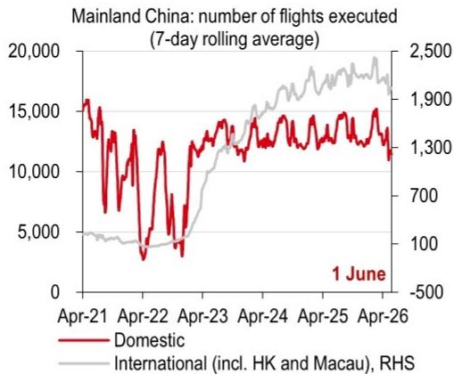

line

| Date   | Domestic | International (incl. HK and Macau), RHS |
|--------|----------|----------------------------------------|
| 1 June | 1300     | 1900                                   |

Source: Wind, HSBC

8. Car sales edged down in May   
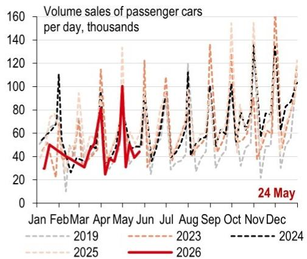

line

| Month | 2019 | 2023 | 2024 | 2025 | 2026 |
|-------|------|------|------|------|------|
| Jan   | 50   | 50   | 50   | 50   | 50   |
| Feb   | 40   | 40   | 40   | 40   | 40   |
| Mar   | 30   | 30   | 30   | 30   | 30   |
| Apr   | 80   | 80   | 80   | 80   | 80   |
| May   | 100  | 100  | 100  | 100  | 100  |
| Jun   | 60   | 60   | 60   | 60   | 60   |
| Jul   | 40   | 40   | 40   | 40   | 40   |
| Aug   | 50   | 50   | 50   | 50   | 50   |
| Sep   | 70   | 70   | 70   | 70   | 70   |
| Oct   | 60   | 60   | 60   | 60   | 60   |
| Nov   | 80   | 80   | 80   | 80   | 80   |
| Dec   | 120  | 120  | 120  | 120  | 120  |

Source: Wind, HSBC

9. National box office revenues edged down   
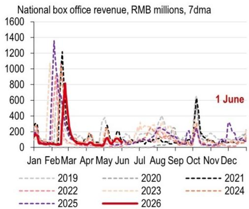

line

| Month | 2019 | 2020 | 2021 | 2022 | 2023 | 2024 | 2025 | 2026 |
|-------|------|------|------|------|------|------|------|------|
| Jan   | ~100 | ~100 | ~100 | ~100 | ~100 | ~100 | ~100 | ~100 |
| Feb   | ~1300| ~1200| ~1200| ~1100| ~1100| ~1100| ~1300| ~800 |
| Mar   | ~800 | ~800 | ~800 | ~800 | ~800 | ~800 | ~800 | ~800 |
| Apr   | ~200 | ~200 | ~200 | ~200 | ~200 | ~200 | ~200 | ~200 |
| May   | ~300 | ~300 | ~300 | ~300 | ~300 | ~300 | ~300 | ~300 |
| Jun   | ~100 | ~100 | ~100 | ~100 | ~100 | ~100 | ~100 | ~100 |
| Jul   | ~200 | ~200 | ~200 | ~200 | ~200 | ~200 | ~200 | ~200 |
| Aug   | ~400 | ~400 | ~400 | ~400 | ~400 | ~400 | ~400 | ~400 |
| Sep   | ~300 | ~300 | ~300 | ~300 | ~300 | ~300 | ~300 | ~300 |
| Oct   | ~650 | ~650 | ~650 | ~650 | ~650 | ~650 | ~650 | ~650 |
| Nov   | ~150 | ~150 | ~150 | ~150 | ~150 | ~150 | ~150 | ~150 |
| Dec   | ~150 | ~150 | ~150 | ~150 | ~150 | ~150 | ~150 | ~150 |

Source: Wind, HSBC

10. Housing prices in tier-1 cities edged up   
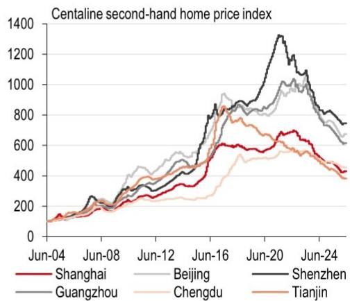

line

Centraline second-hand home price index
| Date | Shanghai | Beijing | Shenzhen | Guangzhou | Chengdu | Tianjin |
|---|---|---|---|---|---|---|
| Jun-04 | 100 | 100 | 100 | 100 | 100 | 100 |
| Jun-08 | 200 | 250 | 250 | 200 | 150 | 200 |
| Jun-12 | 300 | 400 | 400 | 350 | 250 | 350 |
| Jun-16 | 600 | 700 | 800 | 750 | 500 | 650 |
| Jun-20 | 700 | 900 | 1350 | 950 | 650 | 850 |
| Jun-24 | 450 | 650 | 750 | 650 | 450 | 700 |

Source: Bloomberg, HSBC; Note: as of 31 May

11. New home sales edged up seasonally   
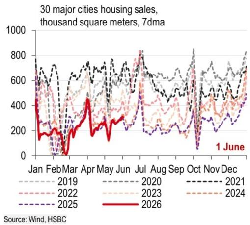

line

| Month | 2019 | 2020 | 2021 | 2022 | 2023 | 2024 | 2025 | 2026 |
|-------|------|------|------|------|------|------|------|------|
| Jan   | ~600 | ~700 | ~750 | ~650 | ~600 | ~550 | ~500 | ~450 |
| Feb   | ~550 | ~650 | ~700 | ~600 | ~550 | ~500 | ~450 | ~400 |
| Mar   | ~500 | ~600 | ~650 | ~550 | ~500 | ~450 | ~400 | ~350 |
| Apr   | ~450 | ~550 | ~600 | ~500 | ~450 | ~400 | ~350 | ~300 |
| May   | ~400 | ~500 | ~550 | ~450 | ~400 | ~350 | ~300 | ~250 |
| Jun   | ~350 | ~450 | ~500 | ~400 | ~350 | ~300 | ~250 | ~200 |
| Jul   | ~300 | ~400 | ~450 | ~350 | ~300 | ~250 | ~200 | ~150 |
| Aug   | ~250 | ~350 | ~400 | ~300 | ~250 | ~200 | ~150 | ~100 |
| Sep   | ~200 | ~300 | ~350 | ~250 | ~200 | ~150 | ~100 | ~50  |
| Oct   | ~150 | ~250 | ~300 | ~200 | ~150 | ~100 | ~50  | ~25  |
| Nov   | ~100 | ~200 | ~250 | ~150 | ~100 | ~50  | ~25  | ~10  |
| Dec   | ~50  | ~150 | ~200 | ~100 | ~50  | ~25  | ~10  | ~5   |
| Jan   | ~25  | ~100 | ~150 | ~5   | 25   | 10   | 5    | 2.5  |
| Feb   | ~15  | ~5   | ~10  | 1.25 | 1.25 | 1.25 | 1.25 | 1.25 |
| Mar   | ~1   | 1.25 | 1.75 | 1.75 | 1.75 | 1.75 | 1.75 | 1.75 |
| Apr   | ~1.25| 1.75 | 2.25 | 2.25 | 2.25 | 2.25 | 2.25 | 2.25 |
| May   | ~1.75| 2.25 | 2.75 | 2.75 | 2.75 | 2.75 | 2.75 | 2.75 |
| Jun   | ~2   | 2.75 | 3.25 | 3.25 | 3.25 | 3.25 | 3.25 | 3.25 |
| Jul   | ~1.75| 3.25 | 3.75 | 3.75 | 3.75 | 3.75 | 3.75 | 3.75 |
| Aug   | ~1.75| 3.75 | 4.25 | 4.25 | 4.25 | 4.25 | 4.25 | 4.25 |
| Sep   | ~1.75| 4    | 4.75 | 4.75 | 4.75 | 4.75 | 4.75 | 4.75 |
| Oct   | ~1    | 1.75 | 3    | 1.75 | 1.75 | 1.75 | 1.75 | 1.75 |
| Nov   | ~1    | 1     | 1    | 1    | 1    | 1    | 1    | 1    |
| Dec   | ~1    | 1     | 1    | 1    | 1    | 1    | 1    | 1    |
Source: Wind, HSBC

12. New home sales in Tier-1 cities were above last year's levels   
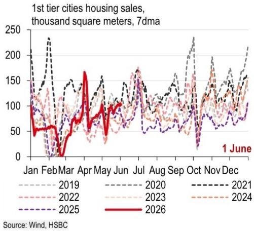

line

| Month | 1st tier cities housing sales, thousand square meters, 7dma (2019) | 1st tier cities housing sales, thousand square meters, 7dma (2020) | 1st tier cities housing sales, thousand square meters, 7dma (2021) | 1st tier cities housing sales, thousand square meters, 7dma (2022) | 1st tier cities housing sales, thousand square meters, 7dma (2023) | 1st tier cities housing sales, thousand square meters, 7dma (2024) | 1st tier cities housing sales, thousand square meters, 7dma (2025) | 1st tier cities housing sales, thousand square meters, 7dma (2026) |
|-------|----------------------------------------------------------------------------------|----------------------------------------------------------------------------------|----------------------------------------------------------------------------------|----------------------------------------------------------------------------------|----------------------------------------------------------------------------------|----------------------------------------------------------------------------------|----------------------------------------------------------------------------------|----------------------------------------------------------------------------------|
| Jan   | ~100                                                                             | ~100                                                                             | ~100                                                                             | ~100                                                                             | ~100                                                                             | ~100                                                                             | ~100                                                                             | ~100                                                                             |
| Feb   | ~150                                                                             | ~150                                                                             | ~250                                                                             | ~150                                                                             | ~150                                                                             | ~150                                                                             | ~50                                                                              | ~50                                                                              |
| Mar   | ~100                                                                             | ~100                                                                             | ~100                                                                             | ~100                                                                             | ~100                                                                             | ~100                                                                             | ~50                                                                              | ~50                                                                              |
| Apr   | ~150                                                                             | ~150                                                                             | ~150                                                                             | ~150                                                                             | ~150                                                                             | ~150                                                                             | ~50                                                                              | ~50                                                                              |
| May   | ~100                                                                             | ~100                                                                             | ~100                                                                             | ~100                                                                             | ~100                                                                             | ~100                                                                             | ~50                                                                              | ~50                                                                              |
| Jun   | ~150                                                                             | ~150                                                                             | ~150                                                                             | ~150                                                                             | ~150                                                                             | ~150                                                                             | ~50                                                                              | ~50                                                                              |
| Jul   | ~100                                                                             | ~100                                                                             | ~100                                                                             | ~100                                                                             | ~100                                                                             | ~100                                                                             | ~50                                                                              | ~50                                                                              |
| Aug   | ~150                                                                             | ~150                                                                             | ~150                                                                             | ~150                                                                             | ~150                                                                             | ~150                                                                             | ~50                                                                              | ~50                                                                              |
| Sep   | ~100                                                                             | ~100                                                                             | ~100                                                                             | ~100                                                                             | ~100                                                                             | ~100                                                                             | ~50                                                                              | ~50                                                                              |
| Oct   | ~250                                                                             | ~250                                                                             | ~250                                                                             | ~250                                                                             | ~250                                                                             | ~250                                                                             | ~250                                                                             | ~250                                                                             |
| Nov   | ~150                                                                             | ~150                                                                             | ~150                                                                             | ~150                                                                             | ~150                                                                             | ~150                                                                             | ~150                                                                             | ~150                                                                             |
| Dec   | ~250                                                                             | ~250                                                                             | ~250                                                                             | ~250                                                                             | ~250                                                                             | ~250                                                                             | ~250                                                                             | ~250                                                                             |
Source: Wind, HSBC

13. Second-hand home sales in 18 major cities remained above historical levels   

line

| Month | 2019 | 2020 | 2021 | 2022 | 2023 | 2024 | 2025 | 2026 |
|-------|------|------|------|------|------|------|------|------|
| Jan   | ~350 | ~300 | ~250 | ~350 | ~300 | ~350 | ~350 | ~350 |
| Feb   | ~300 | ~250 | ~200 | ~300 | ~250 | ~300 | ~300 | ~300 |
| Mar   | ~400 | ~350 | ~300 | ~400 | ~350 | ~400 | ~400 | ~400 |
| Apr   | ~450 | ~400 | ~350 | ~450 | ~400 | ~450 | ~450 | ~450 |
| May   | ~400 | ~350 | ~300 | ~400 | ~350 | ~400 | ~400 | ~450 |
| Jun   | ~350 | ~300 | ~250 | ~350 | ~300 | ~350 | ~350 | ~450 |
| Jul   | ~350 | ~300 | ~250 | ~350 | ~300 | ~350 | ~350 | ~450 |
| Aug   | ~350 | ~300 | ~250 | ~350 | ~300 | ~350 | ~350 | ~450 |
| Sep   | ~350 | ~300 | ~250 | ~350 | ~300 | ~350 | ~350 | ~450 |
| Oct   | ~350 | ~300 | ~250 | ~350 | ~300 | ~350 | ~350 | ~450 |
| Nov   | ~350 | ~300 | ~250 | ~350 | ~300 | ~350 | ~350 | ~450 |
| Dec   | ~350 | ~300 | ~250 | ~350 | ~300 | ~350 | ~350 | ~450 |
Source: Wind, HSBC

14. Transactions in second-hand homes in Tier-1 & 2 cities remained higher y-o-y   
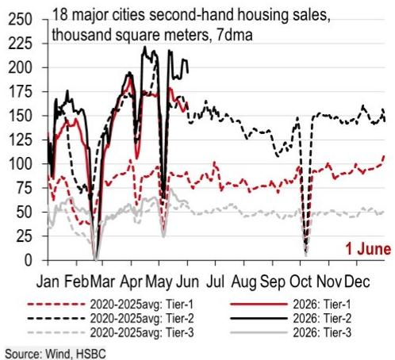

line

| Month | 2020-2025avg: Tier-1 | 2020-2025avg: Tier-2 | 2020-2025avg: Tier-3 | 2026: Tier-1 | 2026: Tier-2 | 2026: Tier-3 |
|-------|----------------------|----------------------|----------------------|-------------|-------------|-------------|
| Jan   | ~75                  | ~150                 | ~50                  | ~100        | ~175        | ~75         |
| Feb   | ~50                  | ~100                 | ~25                  | ~75         | ~150        | ~50         |
| Mar   | ~75                  | ~175                 | ~50                  | ~100        | ~200        | ~75         |
| Apr   | ~100                 | ~200                 | ~75                  | ~150        | ~225        | ~100        |
| May   | ~125                 | ~225                 | ~100                 | ~200        | ~250        | ~125        |
| Jun   | ~150                 | ~250                 | ~125                 | ~250        | ~300        | ~150        |
| Jul   | ~175                 | ~275                 | ~150                 | ~300        | ~350        | ~175        |
| Aug   | ~200                 | ~300                 | ~175                 | ~350        | ~400        | ~200        |
| Sep   | ~225                 | ~325                 | ~200                 | ~400        | ~450        | ~225        |
| Oct   | ~250                 | ~350                 | ~225                 | ~450        | ~500        | ~250        |
| Nov   | ~275                 | ~375                 | ~250                 | ~500        | ~550        | ~275        |
| Dec   | ~300                 | ~400                 | ~275                 | ~550        | ~600        | ~300        |

15. Land sales edged down   
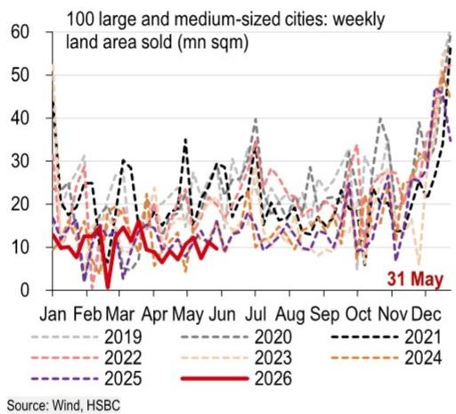

line

| Month | 2019 | 2020 | 2021 | 2022 | 2023 | 2024 | 2025 | 2026 |
|-------|------|------|------|------|------|------|------|------|
| Jan   | ~15  | ~18  | ~20  | ~17  | ~16  | ~15  | ~14  | ~13  |
| Feb   | ~18  | ~20  | ~22  | ~19  | ~18  | ~17  | ~16  | ~15  |
| Mar   | ~20  | ~22  | ~25  | ~21  | ~20  | ~19  | ~18  | ~17  |
| Apr   | ~15  | ~18  | ~20  | ~17  | ~16  | ~15  | ~14  | ~13  |
| May   | ~18  | ~20  | ~22  | ~19  | ~18  | ~17  | ~16  | ~15  |
| Jun   | ~20  | ~22  | ~25  | ~21  | ~20  | ~19  | ~18  | ~17  |
| Jul   | ~25  | ~30  | ~35  | ~30  | ~28  | ~27  | ~26  | ~25  |
| Aug   | ~20  | ~25  | ~30  | ~25  | ~23  | ~22  | ~21  | ~20  |
| Sep   | ~18  | ~20  | ~25  | ~20  | ~18  | ~17  | ~16  | ~15  |
| Oct   | ~25  | ~30  | ~35  | ~30  | ~28  | ~27  | ~26  | ~25  |
| Nov   | ~30  | ~35  | ~40  | ~35  | ~33  | ~32  | ~31  | ~30  |
| Dec   | ~40  | ~45  | ~50  | ~45  | ~43  | ~42  | ~41  | ~40  |
| Jan   | ~50  | ~55  | ~60  | ~55  | ~53  | ~52  | ~51  | ~50  |
| Feb   | ~45  | ~50  | ~55  | ~50  | ~48  | ~47  | ~46  | ~45  |
| Mar   | ~40  | ~45  | ~50  | ~45  | ~43  | ~42  | ~41  | ~40  |
| Apr   | ~35  | ~40  | ~45  | ~40  | ~38  | ~37  | ~36  | ~35  |
| May   | ~30  | ~35  | ~40  | ~35  | ~33  | ~32  | ~31  | ~30  |
| Jun   | ~25  | ~30  | ~35  | ~30  | ~28  | ~27  | ~26  | ~25  |
| Jul   | ~30  | ~35  | ~40  | ~35  | ~33  | ~32  | ~31  | ~30  |
| Aug   | ~35  | ~40  | ~45  | ~40  | ~38  | ~37  | ~36  | ~35  |
| Sep   | ~40  | ~45  | ~50  | ~45  | ~43  | ~42  | ~41  | ~40  |
| Oct   | ~45  | ~50  | ~55  | ~50  | ~48  | ~47  | ~46  | ~45  |
| Nov   | ~50  | ~55  | ~60  | ~55  | ~53  | ~52  | ~51  | ~50  |
| Dec   | ~60  | ~65  | ~70  | ~65  | ~63  | ~62  | ~61  | -    |
Source: Wind, HSBC

16. Planned construction area of land sold edged down   
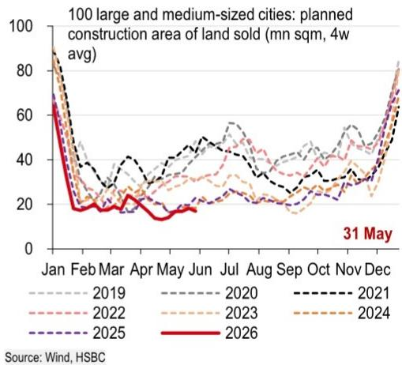

17. The semi-steel tyre operating rate edged down   
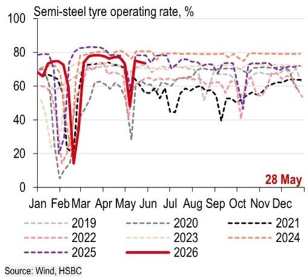

18. The production rate in the chemical sector moved lower   
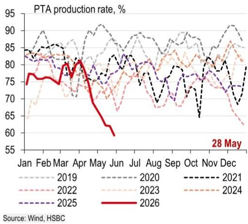

line

| Month | 2019 | 2020 | 2021 | 2022 | 2023 | 2024 | 2025 | 2026 |
|-------|------|------|------|------|------|------|------|------|
| Jan   | 85   | 85   | 85   | 85   | 85   | 85   | 85   | 78   |
| Feb   | 88   | 87   | 87   | 86   | 86   | 86   | 86   | 77   |
| Mar   | 86   | 86   | 86   | 85   | 85   | 85   | 85   | 76   |
| Apr   | 84   | 84   | 84   | 83   | 83   | 83   | 83   | 75   |
| May   | 82   | 82   | 82   | 81   | 81   | 81   | 81   | 74   |
| Jun   | 80   | 80   | 80   | 79   | 79   | 79   | 79   | 73   |
| Jul   | 82   | 82   | 82   | 80   | 80   | 80   | 80   | 74   |
| Aug   | 84   | 84   | 84   | 82   | 82   | 82   | 82   | 75   |
| Sep   | 86   | 86   | 86   | 84   | 84   | 84   | 84   | 76   |
| Oct   | 88   | 88   | 88   | 86   | 86   | 86   | 86   | 77   |
| Nov   | 90   | 90   | 90   | 88   | 88   | 88   | 88   | 78   |
| Dec   | 92   | 92   | 92   | 90   | 90   | 90   | 90   | 79   |
| Jan* (May) | -    | -    | -    | -    | -    | -    | -    | -    |
Source: Wind, HSBC

19. The blast furnace operating rate remained above historical levels   
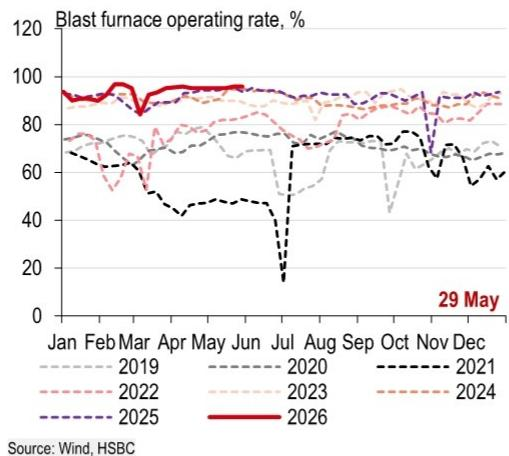

20. The petroleum asphalt operating rate picked edged up   
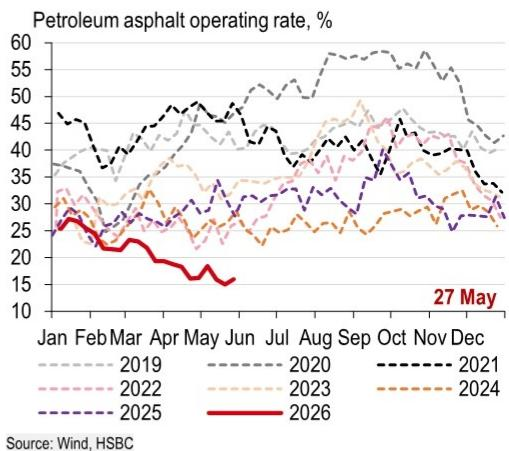

line

| Month | 2019 | 2020 | 2021 | 2022 | 2023 | 2024 | 2025 | 2026 |
|-------|------|------|------|------|------|------|------|------|
| Jan   | 35   | 45   | 45   | 30   | 30   | 30   | 30   | 25   |
| Feb   | 30   | 40   | 40   | 25   | 25   | 25   | 25   | 20   |
| Mar   | 35   | 45   | 45   | 25   | 25   | 25   | 25   | 15   |
| Apr   | 40   | 50   | 50   | 30   | 30   | 30   | 30   | 15   |
| May   | 45   | 55   | 55   | 35   | 35   | 35   | 35   | 15   |
| Jun   | 40   | 50   | 50   | 30   | 30   | 30   | 30   | 15   |
| Jul   | 45   | 55   | 55   | 35   | 35   | 35   | 35   | 15   |
| Aug   | 50   | 60   | 60   | 40   | 40   | 40   | 40   | 15   |
| Sep   | 55   | 65   | 65   | 45   | 45   | 45   | 45   | 15   |
| Oct   | 50   | 60   | 60   | 40   | 40   | 40   | 40   | 15   |
| Nov   | 45   | 55   | 55   | 35   | 35   | 35   | 35   | 15   |
| Dec   | 40   | 50   | 50   | 30   | 30   | 30   | 30   | 15   |
| Jan* (Dec) | ~35 | ~45 | ~45 | ~25  | ~25  | ~25  | ~25  | ~25  |
Source: Wind, HSBC

21. The cement shipping rate steadied   
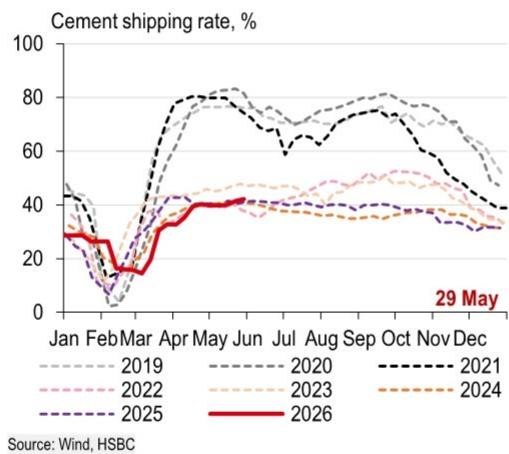

line

| Month | 2019 | 2020 | 2021 | 2022 | 2023 | 2024 | 2025 | 2026 |
|-------|------|------|------|------|------|------|------|------|
| Jan   | ~45  | ~45  | ~45  | ~45  | ~45  | ~45  | ~45  | ~45  |
| Feb   | ~10  | ~10  | ~10  | ~10  | ~10  | ~10  | ~10  | ~10  |
| Mar   | ~20  | ~20  | ~20  | ~20  | ~20  | ~20  | ~20  | ~20  |
| Apr   | ~40  | ~40  | ~40  | ~40  | ~40  | ~40  | ~40  | ~40  |
| May   | ~80  | ~80  | ~80  | ~80  | ~80  | ~80  | ~80  | ~80  |
| Jun   | ~75  | ~75  | ~75  | ~75  | ~75  | ~75  | ~75  | ~75  |
| Jul   | ~70  | ~70  | ~70  | ~70  | ~70  | ~70  | ~70  | ~70  |
| Aug   | ~75  | ~75  | ~75  | ~75  | ~75  | ~75  | ~75  | ~75  |
| Sep   | ~80  | ~80  | ~80  | ~80  | ~80  | ~80  | ~80  | ~80  |
| Oct   | ~75  | ~75  | ~75  | ~75  | ~75  | ~75  | ~75  | ~75  |
| Nov   | ~65  | ~65  | ~65  | ~65  | ~65  | ~65  | ~65  | ~65  |
| Dec   | ~50  | ~50  | ~50  | ~50  | ~50  | ~50  | ~50  | ~50  |
| Jan   | ~30  | ~30  | ~30  | ~30  | ~30  | ~30  | ~30  | ~30  |
| Feb   | ~15  | ~15  | ~15  | ~15  | ~15  | ~15  | ~15  | ~15  |
| Mar   | ~25  | ~25  | ~25  | ~25  | ~25  | ~25  | ~25  | ~25  |
| Apr   | ~40  | ~40  | ~40  | ~40  | ~40  | ~40  | ~40  | ~40  |
| May   | ~60  | ~60  | ~60  | ~60  | ~60  | ~60  | ~60  | ~60  |
| Jun   | ~75  | ~75  | ~75  | ~75  | ~75  | ~75  | ~75  | ~75  |
| Jul   | ~70  | ~70  | ~70  | ~70  | ~70  | ~70  | ~70  | ~70  |
| Aug   | ~65  | ~65  | ~65  | ~65  | ~65  | ~65  | ~65  | ~65  |
| Sep   | ~60  | ~60  | ~60  | ~60  | ~60  | ~60  | ~60  | ~60  |
| Oct   | ~55  | ~55  | ~55  | ~55  | ~55  | ~55  | ~55  | ~55  |
| Nov   | ~45  | ~45  | ~45  | ~45  | ~45  | ~45  | ~45  | ~45  |
| Dec   | ~35  | ~35  | ~35  | ~35  | ~35  | ~35  | ~35  | ~35  |
Source: Wind, HSBC

22. Coal consumption for eight major provinces edged up   
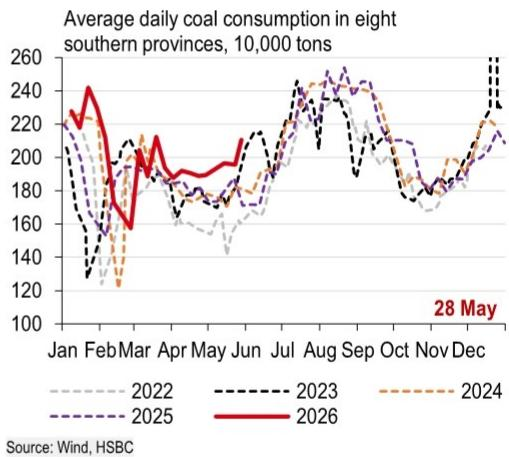

23. The operating rate of polyester filaments eased further   
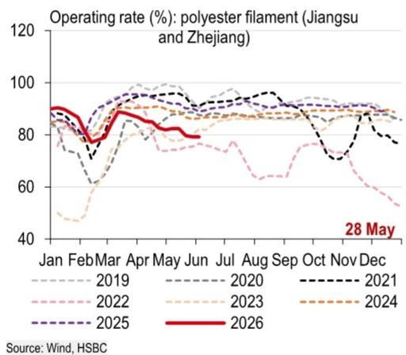

line

| Month | 2019 | 2020 | 2021 | 2022 | 2023 | 2024 | 2025 | 2026 |
|-------|------|------|------|------|------|------|------|------|
| Jan   | 85   | 80   | 85   | 85   | 80   | 85   | 85   | 85   |
| Feb   | 80   | 75   | 70   | 75   | 70   | 75   | 75   | 75   |
| Mar   | 85   | 80   | 75   | 80   | 75   | 80   | 80   | 80   |
| Apr   | 90   | 85   | 80   | 85   | 80   | 85   | 85   | 85   |
| May   | 95   | 90   | 85   | 90   | 85   | 90   | 90   | 90   |
| Jun   | 90   | 85   | 80   | 85   | 80   | 85   | 85   | 85   |
| Jul   | 95   | 90   | 85   | 90   | 85   | 90   | 90   | 90   |
| Aug   | 90   | 85   | 80   | 85   | 80   | 85   | 85   | 85   |
| Sep   | 95   | 90   | 85   | 90   | 85   | 90   | 90   | 90   |
| Oct   | 90   | 85   | 80   | 85   | 80   | 85   | 85   | 85   |
| Nov   | 85   | 80   | 75   | 80   | 75   | 80   | 80   | 80   |
| Dec   | 80   | 75   | 70   | 75   | 70   | 75   | 75   | 75   |
| Jan* (May) | -    | -    | -    | -    | -    | -    | -    | -    |
Source: Wind, HSBC

24. The Baltic Dry Index edged up   
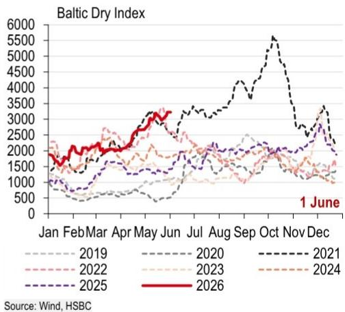

line

| Month | 2019 | 2020 | 2021 | 2022 | 2023 | 2024 | 2025 | 2026 |
|-------|------|------|------|------|------|------|------|------|
| Jan   | ~1000 | ~1500 | ~1500 | ~1500 | ~1500 | ~1500 | ~1500 | ~1500 |
| Feb   | ~750  | ~1000 | ~1500 | ~1500 | ~1500 | ~1500 | ~1500 | ~1500 |
| Mar   | ~750  | ~1000 | ~1500 | ~1500 | ~1500 | ~1500 | ~1500 | ~1500 |
| Apr   | ~750  | ~1000 | ~1500 | ~1500 | ~1500 | ~1500 | ~1500 | ~1500 |
| May   | ~750  | ~1000 | ~1500 | ~1500 | ~1500 | ~1500 | ~1500 | ~1500 |
| Jun   | ~750  | ~1000 | ~1500 | ~1500 | ~1500 | ~1500 | ~1500 | ~1500 |
| Jul   | ~750  | ~1000 | ~1500 | ~1500 | ~1500 | ~1500 | ~1500 | ~1500 |
| Aug   | ~750  | ~1000 | ~1500 | ~1500 | ~1500 | ~1500 | ~1500 | ~1500 |
| Sep   | ~750  | ~1000 | ~1500 | ~1500 | ~1500 | ~1500 | ~1500 | ~1500 |
| Oct   | ~750  | ~1500 | ~6500 | ~1500 | ~1500 | ~1500 | ~2500 | ~2500 |
| Nov   | ~750  | ~1500 | ~3500 | ~1500 | ~1500 | ~1500 | ~2500 | ~2500 |
| Dec   | ~750  | ~1500 | ~3500 | ~1500 | ~1500 | ~1500 | ~2500 | ~2500 |
Source: Wind, HSBC

# Travel and logistics

25. Metro volumes in large cities edged up seasonally   
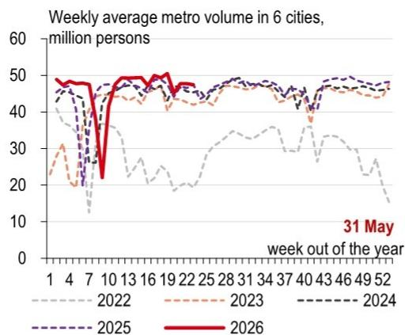  
Source: Wind, HSBC; note: six cities include Beijing, Shanghai, Guangzhou, Shenzhen, Chengdu and Tianjin.

26. Postal delivery volumes edged up   
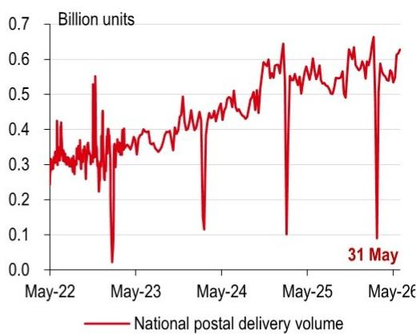

line

| Date     | National postal delivery volume (Billion units) |
| -------- | ----------------------------------------------- |
| 31 May   | 0.1                                             |

Source: Wind, HSBC

27. Container exports from China to the US edged down   
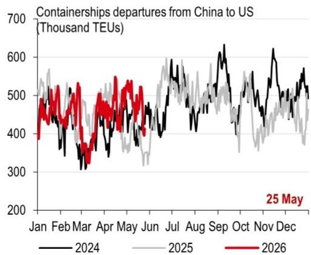

line

| Month | 2024 | 2025 | 2026 |
|-------|------|------|------|
| Jan   | ~450 | ~550 | ~480 |
| Feb   | ~350 | ~500 | ~520 |
| Mar   | ~300 | ~450 | ~480 |
| Apr   | ~350 | ~480 | ~500 |
| May   | ~400 | ~450 | ~520 |
| Jun   | ~450 | ~480 | ~500 |
| Jul   | ~500 | ~520 | ~550 |
| Aug   | ~550 | ~500 | ~580 |
| Sep   | ~600 | ~480 | ~620 |
| Oct   | ~550 | ~450 | ~580 |
| Nov   | ~600 | ~480 | ~620 |
| Dec   | ~550 | ~450 | ~580 |

Source: Bloomberg, HSBC

28. China's major ports' freight throughput edged up   
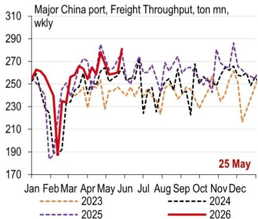

line

| Month | 2023 | 2024 | 2025 | 2026 |
|-------|------|------|------|------|
| Jan   | 255  | 255  | 255  | 260  |
| Feb   | 190  | 190  | 190  | 190  |
| Mar   | 230  | 230  | 230  | 230  |
| Apr   | 250  | 250  | 270  | 270  |
| May   | 240  | 240  | 280  | 280  |
| Jun   | 250  | 250  | 270  | 270  |
| Jul   | 240  | 240  | 270  | 270  |
| Aug   | 230  | 230  | 270  | 270  |
| Sep   | 240  | 240  | 270  | 270  |
| Oct   | 250  | 250  | 270  | 270  |
| Nov   | 260  | 260  | 280  | 280  |
| Dec   | 250  | 250  | 270  | 270  |

Source: CEIC, HSBC; Note: Weekly beginning at Monday

# Inflation and policies

29. Crude oil prices moved up again amid ongoing uncertainty in the Middle East   
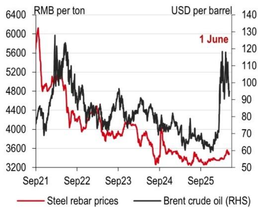

line

| Date   | Steel rebar prices (RMB per ton) | Brent crude oil (RHS) (USD per barrel) |
|--------|-----------------------------------|----------------------------------------|
| 1 June | -                                 | 130                                    |

Source: Wind, HSBC

30. Cement prices and glass prices both edged down   
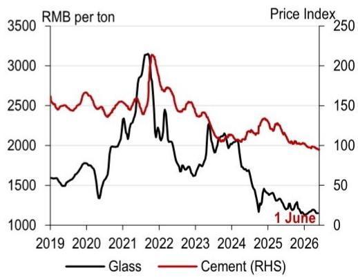

line

| Year | Glass (RMB per ton) | Cement (RHS) (Price Index) |
|------|---------------------|----------------------------|
| 2019 | ~1500               | ~150                       |
| 2020 | ~1700               | ~160                       |
| 2021 | ~2500               | ~180                       |
| 2022 | ~3200               | ~220                       |
| 2023 | ~1800               | ~140                       |
| 2024 | ~2000               | ~130                       |
| 2025 | ~1200               | ~110                       |
| 2026 | ~100                | ~100                       |

Source: Wind, HSBC

31. Agricultural product prices eased seasonally   
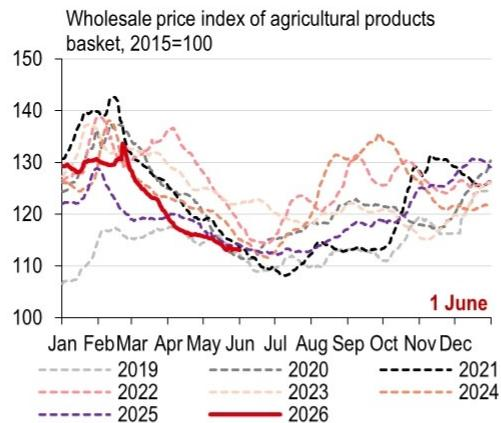

line

| Month | 2019 | 2020 | 2021 | 2022 | 2023 | 2024 | 2025 | 2026 |
|-------|------|------|------|------|------|------|------|------|
| Jan   | 108  | 115  | 138  | 135  | 130  | 132  | 128  | 130  |
| Feb   | 115  | 120  | 140  | 138  | 135  | 137  | 135  | 138  |
| Mar   | 120  | 125  | 145  | 140  | 138  | 140  | 138  | 140  |
| Apr   | 118  | 122  | 142  | 138  | 135  | 137  | 135  | 138  |
| May   | 115  | 120  | 140  | 135  | 132  | 135  | 132  | 135  |
| Jun   | 112  | 118  | 138  | 132  | 130  | 132  | 130  | 132  |
| Jul   | 110  | 115  | 135  | 130  | 128  | 130  | 128  | 130  |
| Aug   | 115  | 120  | 140  | 135  | 132  | 135  | 132  | 135  |
| Sep   | 120  | 125  | 145  | 140  | 138  | 140  | 138  | 140  |
| Oct   | 125  | 130  | 150  | 145  | 142  | 145  | 142  | 145  |
| Nov   | 130  | 135  | 155  | 150  | 148  | 150  | 148  | 150  |
| Dec   | 135  | 140  | 160  | 155  | 152  | 155  | 152  | 155  |
| Jan   |      |      |      |      |      |      |      |      |
| Feb   |      |      |      |      |      |      |      |      |
| Mar   |      |      |      |      |      |      |      |      |
| Apr   |      |      |      |      |      |      |      |      |
| May   |      |      |      |      |      |      |      |      |
| Jun   |      |      |      |      |      |      |      |      |
| Jul   |      |      |      |      |      |      |      |      |
| Aug   |      |      |      |      |      |      |      |      |
| Sep   |      |      |      |      |      |      |      |      |
| Oct   |      |      |      |      |      |      |      |      |
| Nov   |      |      |      |      |      |      |      |      |
| Dec   |      |      |      |      |      |      |      |      |
| Jan   (June) - Jan - Feb - Mar - Apr - May - Jun - Jul - Aug - Sep - Oct - Nov - Dec - Jan - Feb - Mar - Apr - May - Jun - Jul - Aug - Sep - Oct - Nov - Dec - Jan - Feb - Mar - Apr - May - Jun - Jul - Aug - Sep - Oct - Nov - Dec - Jan - Feb - Mar - Apr - May - Jun - Jul - Aug - Sep - Oct - Nov - Dec - Jan - Feb - Mar - Apr - May - Jun - Jul - Aug - Sep - Oct - Nov - Dec - Jan - Mar - Apr - May - Jun - Jul - Aug - Sep - Oct - Nov - Dec - Jan - Feb - Mar - Apr - May - Jun - Jul - Aug - Sep - Oct - Nov - Dec - Jan - Feb - Mar - Apr - May - Jun - Jul - Aug - Sep - Oct - Nov - Dec - Jan - Feb - Mar - Apr - May - Jun - Jul - Aug - Sep - Oct - Nov - Dec - Jan - Feb - Mar - April - May - Jun - Jul - Aug - Sep - Oct - Nov - Dec - Jan - Feb - Mar - April - May - Jun - Jul - Aug - Sep - Oct - Nov - Dec - Jan - Feb - Mar - April - May - Jun - Jul - Aug - Sep - Oct - Nov - Dec - Jan - Feb - Mar<nl>

Source: Wind, HSBC

32. Container shipping costs on China-Southeast Asia route edged up   
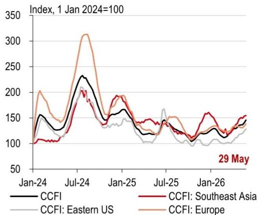

line

| Date    | CCFI | CCFI: Southeast Asia | CCFI: Eastern US | CCFI: Europe |
|---------|------|----------------------|------------------|--------------|
| Jan-24  | 100  | 100                  | 100              | 100          |
| Jul-24  | 230  | 200                  | 210              | 310          |
| Jan-25  | 150  | 180                  | 140              | 160          |
| Jul-25  | 130  | 140                  | 160              | 150          |
| Jan-26  | 140  | 150                  | 130              | 140          |
| 29 May  |      |                      |                  |              |

Source: Wind, HSBC

33. Interbank rates edged down   
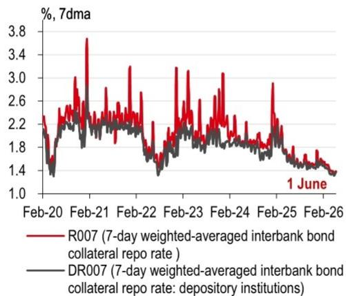

line

| Date    | R007 (7-day weighted-averaged interbank bond collateral repo rate) | DR007 (7-day weighted-averaged interbank bond collateral repo rate: depository institutions) |
|---------|------------------------------------------------------------------|------------------------------------------------------------------------------------|
| Feb-20  | ~2.2                                                             | ~1.4                                                                               |
| Feb-21  | ~3.8                                                             | ~2.2                                                                               |
| Feb-22  | ~2.6                                                             | ~1.8                                                                               |
| Feb-23  | ~3.0                                                             | ~1.9                                                                               |
| Feb-24  | ~3.0                                                             | ~1.8                                                                               |
| Feb-25  | ~2.8                                                             | ~1.6                                                                               |
| Feb-26  | ~1.4                                                             | ~1.3                                                                               |

Source: Wind, HSBC

34. The PBoC made net injections through OMOs last week   
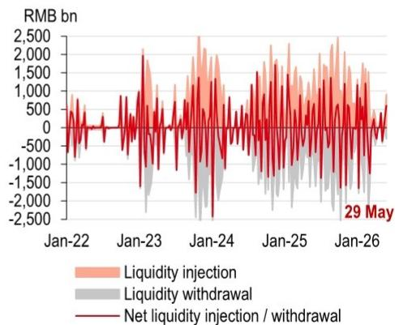

line

| Date    | Liquidity injection | Liquidity withdrawal | Net liquidity injection / withdrawal |
|---------|---------------------|----------------------|----------------------------------------|
| 29 May  | -                   | -                    | -                                      |

Source: Wind, HSBC

# Links to recent reports in the China Macro Tracker series

Structural measures move up the agenda, 27 May 2026
Stable relations, but domestic pressures, 20 May 2026
First Presidential summit of the year arrives, 13 May 2026
Future focused, 6 May 2026
Tougher investment security reviews, 29 April 2026
More reserve policies are in the pipeline, 22 April 2026
Focus on “doing o ’s own thing well”, 15 April 2026
Better coordination of development and security, 9 April 2026
Resilience and stability could pay off, 1 April 2026
Expanding opening-up and FDI, 25 March 2026
A good start, more moves to follow, 18 March 2026
NPC press conferences, global oil volatility, 11 March 2026
China’s Two Sessions in a volatile world, 4 March 2026
US tariff changes, record breaking CNY holiday, 25 February 2026
Boosting investment and innovation, 11 February 2026
Chinese New Year migration begins, China-UK reset, 4 February 2026
A more conservative approach to the GDP target, 28 January 2026
Domestic pressures may prompt more urgency, 21 January 2026
Domestic demand needs an investment lift, 14 January 2026
Starting the new year with policy support, 7 January 2026
Demand-led rebalancing, 17 December 2025
Politburo, Pandas and Provincial Five-Year Plans, 10 December 2025
Last policy meetings for the year approaching, 3 December 2025
Phone a friend, 26 November 2025
Not yet at the finishing line, 19 November 2025
A balanced approach, 12 November 2025
A new tenuous equilibrium, 5 November 2025
Potential trade breakthroughs, 29 October 2025
Deal or no deal, 22 October 2025
On pins and needles, 15 October 2025
New measures before the Golden Week, 1 October 2025
Talking points, 24 September 2025
US-China talks see progress in Madrid, 17 September 2025
Anti-involution to help longer-term development, 10 September 2025
Domestic reforms accelerating, 3 September 2025
Green transition to help the anti-involution campaign, 27 August 2025
More measures to support growth, 20 August 2025
Another 90-day tariff truce, 13 August 2025
A clear pro-growth tone, 6 August 2025

# Disclosure appendix

# Analyst Certification

The following analyst(s), economist(s), or strategist(s) who is(are) primarily responsible for this report, including any analyst(s) whose name(s) appear(s) as author of an individual section or sections of the report and any analyst(s) named as the covering analyst(s) of a subsidiary company in a sum-of-the-parts valuation certifies(y) that the opinion(s) on the subject security(ies) or issuer(s), any views or forecasts expressed in the section(s) of which such individual(s) is(are) named as author(s), and any other views or forecasts expressed herein, including any views expressed on the back page of the research report, accurately reflect their personal view(s) and that no part of their compensation was, is or will be directly or indirectly related to the specific recommendation(s) or views contained in this research report: Erin Xin and Jing Liu

# Important disclosures

This document has been prepared and is being distributed by the Research Department of HSBC and is intended solely for the clients of HSBC and is not for publication to other persons, whether through the press or by other means.

This document is for information purposes only and it should not be regarded as an offer to sell or as a solicitation of an offer to buy the securities or other investment products mentioned in it and/or to participate in any trading strategy. Advice in this document is general and should not be construed as personal advice, given it has been prepared without taking account of the objectives, financial situation or needs of any particular investor. Accordingly, investors should, before acting on the advice, consider the appropriateness of the advice, having regard to their objectives, financial situation and needs. If necessary, seek professional investment and tax advice.

Certain investment products mentioned in this document may not be eligible for sale in some states or countries, and they may not be suitable for all types of investors. Investors should consult with their HSBC representative regarding the suitability of the investment products mentioned in this document and take into account their specific investment objectives, financial situation or particular needs before making a commitment to purchase investment products.

The value of and the income produced by the investment products mentioned in this document may fluctuate, so that an investor may get back less than originally invested. Certain high-volatility investments can be subject to sudden and large falls in value that could equal or exceed the amount invested. Value and income from investment products may be adversely affected by exchange rates, interest rates, or other factors. Past performance of a particular investment product is not indicative of future results.

HSBC and its affiliates will from time to time sell to and buy from customers the securities/instruments, both equity and debt (including derivatives) of companies covered in HSBC on a principal or agency basis or act as a market maker or liquidity provider in the securities/instruments mentioned in this report.

Analysts, economists, and strategists are paid in part by reference to the profitability of HSBC which includes investment banking, sales & trading, and principal trading revenues.

Whether, or in what time frame, an update of this analysis will be published is not determined in advance.

For disclosures in respect of any company mentioned in this report, please see the most recently published report on that company available at www.hsbcnet.com/research. HSBC Private Bank clients should contact their Relationship Manager for queries regarding other research reports. In order to find out more about the proprietary models used to produce this report, please contact the authoring analyst.

# Additional disclosures

1 This report is dated as at 03 June 2026.   
2 All market data included in this report are dated as at close 02 June 2026, unless a different date and/or a specific time of day is indicated in the report.   
3 HSBC has procedures in place to identify and manage any potential conflicts of interest that arise in connection with its Research business. HSBC's analysts and its other staff who are involved in the preparation and dissemination of Research operate and have a management reporting line independent of HSBC's Investment Banking business. Information Barrier procedures are in place between the Investment Banking, Principal Trading, and Research businesses to ensure that any confidential and/or price sensitive information is handled in an appropriate manner.   
4 You are not permitted to use, for reference, any data in this document for the purpose of (i) determining the interest payable, or other sums due, under loan agreements or under other financial contracts or instruments, (ii) determining the price at which a financial instrument may be bought or sold or traded or redeemed, or the value of a financial instrument, and/or (iii) measuring the performance of a financial instrument or of an investment fund.

# Disclaimer

Legal entities as at 13 May 2026:

HSBC Bank plc; HSBC Continental Europe; HSBC Continental Europe SA, Germany; HSBC Bank Middle East Limited, DIFC; HSBC Bank Middle East Limited, Dubai branch; HSBC Yatirim Menkul Degerler AS, Istanbul; The Hongkong and Shanghai Banking Corporation Limited, Hong Kong; The Hongkong and Shanghai Banking Corporation Limited, Singapore Branch; The Hongkong and Shanghai Banking Corporation Limited, Seoul Securities Branch; The Hongkong and Shanghai Banking Corporation Limited, Seoul Branch; HSBC Qianhai Securities Limited; HSBC Securities (Taiwan) Corporation Limited; HSBC Securities and Capital Markets (India) Private Limited, Mumbai; HSBC Bank Australia Limited; HSBC Securities (USA) Inc., New York; HSBC México, SA, Institución de Banca Múltiple, Grupo Financiero HSBC; Banco HSBC SA

Issuer of report

The Hongkong and Shanghai Banking Corporation Limited

Level 16, 1 Queen's Road Central

Hong Kong SAR

Telephone: +852 2843 9111

Fax: +852 2801 4138

Website: www.research.hsbc.com

This document has been issued by The Hongkong and Shanghai Banking Corporation Limited ("HSBC") in the conduct of its Hong Kong regulated business for the information of its institutional and professional investor (as defined by Securities and Future Ordinance (Chapter 571)) customers; it is not intended for and should not be distributed to retail customers in Hong Kong, unless permitted otherwise. The Hongkong and Shanghai Banking Corporation Limited is regulated by the Hong Kong Monetary Authority. All enquires by recipients in Hong Kong must be directed to your HSBC contact in Hong Kong. If it is received by a customer of an affiliate of HSBC, its provision to the recipient is subject to the terms of business in place between the recipient and such affiliate. Any recommendations contained in it are intended for the professional investors to whom it is distributed. This material is not and should not be construed as an offer to sell or the solicitation of an offer to purchase or subscribe for any investment. HSBC has based this document on information obtained from sources it believes to be reliable but which it has not independently verified; HSBC makes no guarantee, representation or warranty and accepts no responsibility or liability as to its accuracy or completeness. Expressions of opinion are those of HSBC only and are subject to change without notice. From time to time research analysts conduct site visits of covered issuers. HSBC policies prohibit research analysts from accepting payment or reimbursement for travel expenses from the issuer for such visits. The decision and responsibility on whether or not to invest must be taken by the reader. HSBC and its affiliates and/or their officers, directors and employees may have positions in any securities mentioned in this document (or in any related investment) and may from time to time add to or dispose of any such securities (or investment). HSBC and its affiliates may act as market maker or have assumed an underwriting commitment in the securities of any companies discussed in this document (or in related investments), may sell them to or buy them from customers on a principal basis and may also perform or seek to perform banking or underwriting services for or relating to those companies. This material may not be further distributed in whole or in part for any purpose. No consideration has been given to the particular investment objectives, financial situation or particular needs of any recipient. The document is intended to be distributed in its entirety. Unless governing law permits otherwise, you must contact a HSBC Group member in your home jurisdiction if you wish to use HSBC Group services in effecting a transaction in any investment mentioned in this document.

In the UK, this publication is distributed by HSBC Bank plc for the information of its Clients (as defined in the Rules of FCA) and those of its affiliates only. Nothing herein excludes or restricts any duty or liability to a customer which HSBC Bank plc has under the Financial Services and Markets Act 2000 or under the Rules of FCA and PRA. A recipient who chooses to deal with any person who is not a representative of HSBC Bank plc in the UK will not enjoy the protections afforded by the UK regulatory regime. HSBC Bank plc is regulated by the Financial Conduct Authority and the Prudential Regulation Authority.

In the European Economic Area, this publication has been distributed by HSBC Continental Europe or by such other HSBC affiliate from which the recipient receives relevant services. In Japan, this publication has been distributed by HSBC Securities (Japan) Co., Ltd.. It may not be further distributed in whole or in part for any purpose. In Korea, this publication is distributed by either The Hongkong and Shanghai Banking Corporation Limited, Seoul Securities Branch ("HBAP SLS") or The Hongkong and Shanghai Banking Corporation Limited, Seoul Branch ("HBAP SEL") for the general information of professional investors specified in Article 9 of the Financial Investment Services and Capital Markets Act ("FSCMA"). This publication is not a prospectus as defined in the FSCMA. It may not be further distributed in whole or in part for any purpose. Both HBAP SLS and HBAP SEL are regulated by the Financial Services Commission and the Financial Supervisory Service of Korea. In Singapore, this publication is distributed by The Hongkong and Shanghai Banking Corporation Limited, Singapore Branch for the general information of institutional investors or other persons specified in Sections 274 and 304 of the Securities and Futures Act 2001 of Singapore ("SFA") and accredited investors and other persons in accordance with the conditions specified in Sections 275 and 305 of the SFA. Only Economics or Currencies reports are intended for distribution to a person who is not an Accredited Investor, Expert Investor or Institutional Investor as defined in SFA. The Hongkong and Shanghai Banking Corporation Limited, Singapore Branch accepts legal responsibility for the contents of reports. This publication is not a prospectus as defined in the SFA. It may not be further distributed in whole or in part for any purpose. The Hongkong and Shanghai Banking Corporation Limited Singapore Branch is regulated by the Monetary Authority of Singapore. Recipients in Singapore should contact a "Hongkong and Shanghai Banking Corporation Limited, Singapore Branch" representative in respect of any matters arising from, or in connection with this report. Please refer to The Hongkong and Shanghai Banking Corporation Limited Singapore Branch's website at www.business.hsbc.com.sg for contact details. In Australia, this publication has been distributed by The Hongkong and Shanghai Banking Corporation Limited (ABN 65 117 925 970, AFSL 301737) for the general information of its "wholesale" customers (as defined in the Corporations Act 2001). Where distributed to retail customers, this research is distributed by HSBC Bank Australia Limited (ABN 48 006 434 162, AFSL No. 232595). These respective entities make no representations that the products or services mentioned in this document are available to persons in Australia or are necessarily suitable for any particular person or appropriate in accordance with local law. No consideration has been given to the particular investment objectives, financial situation or particular needs of any recipient.

HSBC Securities (USA) Inc. accepts responsibility for the content of this research report prepared by its non-US foreign affiliate. The information contained herein is under no circumstances to be construed as investment advice and is not tailored to the needs of the recipient. All US persons receiving and/or accessing this report and intending to effect transactions in any security discussed herein should do so with HSBC Securities (USA) Inc. in the United States and not with its non-US foreign affiliate, the issuer of this report. HSBC México, SA, Institución de Banca Múltiple, Grupo Financiero HSBC is authorized and regulated by Secretaría de Hacienda y Crédito Público and Comisión Nacional Bancaria y de Valores (CNBV). In Brazil, this document has been distributed by Banco HSBC SA ("HSBC Brazil"), and/or its affiliates. As required by Resolution No. 20/2021 of the Securities and Exchange Commission of Brazil (Comissão de Valores Mobiliários), potential conflicts of interest concerning (i) HSBC Brazil and/or its affiliates; and (ii) the analyst(s) responsible for authoring this report are stated on the chart above labelled "HSBC & Analyst Disclosures".

If you are a customer of HSBC International Wealth & Premier Banking ("IWPB"), including HSBC Private Bank, you are eligible to receive this publication only if: (i) you have been approved to receive relevant research publications by an applicable HSBC legal entity; (ii) you have agreed to the applicable HSBC entity's terms and conditions and/or customer declaration for accessing research; and (iii) you have agreed to the terms and conditions of any other internet banking, online banking, mobile banking and/or investment services offered by that HSBC entity, through which you will access research publications (collectively with (ii), the "Terms"). If you do not meet the above eligibility requirements, please disregard this publication and, if you are a IWPB customer, please notify your Relationship Manager or call the relevant customer hotline. Distribution of this publication is the sole responsibility of the HSBC entity with whom you have agreed the Terms. Receipt of research publications is strictly subject to the Terms and any other conditions or disclaimers applicable to the provision of the publications that may be advised by IWPB. © Copyright 2026, The Hongkong and Shanghai Banking Corporation Limited, ALL RIGHTS RESERVED. No part of this publication may be reproduced, stored in a retrieval system, or transmitted, on any form or by any means, electronic, mechanical, photocopying, recording, or otherwise, without the prior written permission of The Hongkong and Shanghai Banking Corporation Limited.

[1280483]

# Global Economics Research Team

# Global

Global Chief Economist  
Janet Henry +44 20 7991 6711  
janet.henry@hsbcib.com

Global Economist  
James Pomeroy +44 20 7991 6714  
james.pomeroy@hsbc.com

Global Economist  
Bethan Ellis +44 20 7991 6714  
bethan.ellis@hsbc.com

Trade Economist
Shanella Rajanayagam +44 20 3268 4118
shanella.l.rajanayagam@hsbc.com

# Europe

Chief European Economist
Simon Wells +44 20 7991 6718
simon.wells@hsbcib.com

Senior Economist
Chris Hare +44 20 7991 2995
chris.hare@hsbc.com

# United Kingdom

Senior Economist, UK
Elizabeth Martins +44 20 7991 2170
liz.martins@hsbc.com

UK Economist Emma Wilks +442032685948 emma.wilks@hsbc.com

# Germany

Stefan Schilbe +49 211 910 3137
stefan.schilbe@hsbc.de

Anja Sabine Heimann +44 738 724 7457
anja.sabine.heimann@hsbc.com

# France

Chantana Sam +33 1 4070 7795
chantana.sam@hsbc.fr

# North America

# US

Ryan Wang +1 212 525 3181
ryan.wang@us.hsbc.com

# Asia Pacific

Co-Head of Global Research, Asia-Pacific and Co-Head of Asian Economics Research  
Frederic Neumann +852 2822 4556  
fredericneumann@hsbc.com.hk

Chief Economist, Australia, New Zealand and Global Commodities  
Paul Bloxham +612 9255 2635  
paulbloxham@hsbc.com.au

Chief Economist, India and Indonesia
Pranjul Bhandari +65 6658 4976
pranjul.bhandari@hsbc.com.sg

Jamie Culling +612 9006 5042
jamie.culling@hsbc.com.au

Jing Liu +852 3941 0063
jing.econ.liu@hsbc.com.hk

Ines Lam +852 2288 7131
ines.y.k.lam@hsbc.com.hk

Yun Liu + 852 2822 4297
yun.liu@hsbc.com.hk

Aayushi Chaudhary +91 22 2268 5543
aayushi.b.chaudhary@hsbc.co.in

Maitreyi Das +91 80 6737 3155
maitreyi.das@hsbc.co.in

Erin Xin +852 2996 6975
erin.y.xin@hsbc.com.hk

Aris Dacanay +852 3945 1247
aris.dacanay@hsbc.com.hk

Jin Choi +852 2996 6597
jin.h.j.choi@hsbc.com.hk

Akiko Kitamura +852 2996 6676
akiko.kitamura@hsbc.com.hk

Justin Feng +852 2288 7108
justin.feng@hsbc.com.hk

Taylor Wang +852 2288 8650
taylor.t.l.wang@hsbc.com.hk

Priya Mehrishi +91 97 3916 9567
priya.mehrishi@hsbc.co.in

# CEEMEA

Chief Economist, CEEMEA Simon Williams +971 50 9143382 simon.williams@hsbc.com

Senior Economist, Central & Eastern Europe

Agata Urbanska-Giner +44 20 7992 2774
agata.urbanska@hsbcib.com

Senior Economist, CEEMEA  
Melis Metiner +44 20 3359 2636  
melismetiner@hsbcib.com

Senior Economist, South Africa
Hugo Pienaar +44 20 7718 9563
hugo.pienaar@hsbc.com

# Latin America

Chief Economist, Mexico
Jose Carlos Sanchez +52 55 5721 5623
jose.c.sanchez@hsbc.com.mx

Allison Buck +1 212 525 4119
allison.buck@us.hsbc.com

Head of Brazil Economics Research  
Daniel Lavarda +55 11 2802 2640  
daniel.lavarda@hsbc.com