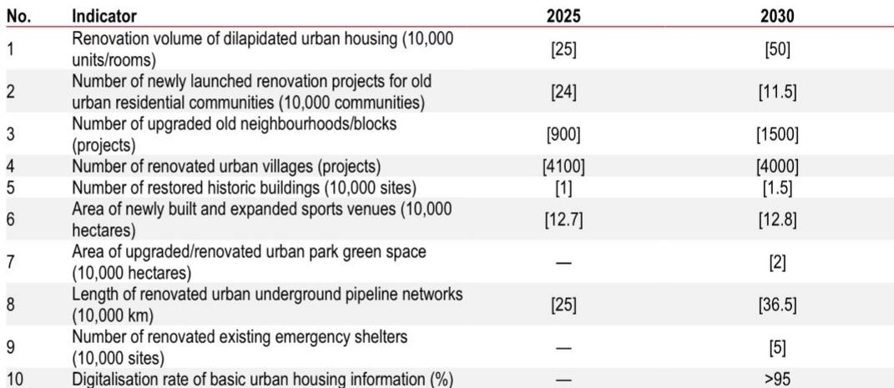
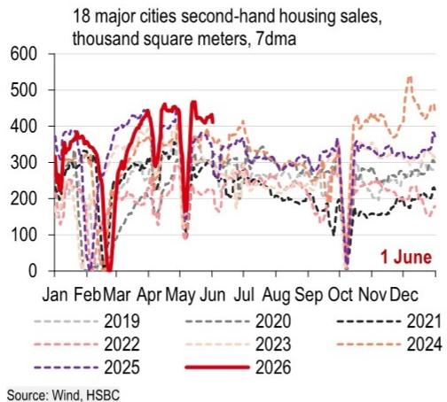

# China’s New Urbanisation Strategy Will Reshape Demand, but Only If Execution Reaches Beyond Tier-1 Cities

China’s economic policy is undergoing a quiet but consequential shift. After years of relying on broad stimulus and property-led growth, the government is now placing its bets on structural reform as the engine for both consumption and investment. The twin policy initiatives rolled out in late May 2026—the expansion of permanent residence-based welfare coverage and the State Council’s five-year urban renewal road map—are not incremental adjustments. They represent a deliberate attempt to rewire the relationship between urbanisation, public services, and domestic demand. For investors, the question is not whether these policies matter. It is whether they can be implemented with enough speed and depth to alter China’s medium-term growth trajectory.

The stakes are high. The property sector’s recent recovery has been narrow, concentrated almost entirely in tier-1 cities. Broader economic activity remains uneven, with industrial profit gains clustered in upstream energy and AI-related sectors while downstream margins stay subdued. The new urbanisation agenda is designed to address precisely this imbalance: by expanding infrastructure investment across a wider set of regions and linking public service access to residency rather than household registration, Beijing hopes to unlock consumption potential that has been structurally suppressed. But as the details of the plan emerge, so do the tensions between ambition and fiscal constraint, between central coordination and local execution, and between short-term stimulus needs and long-term reform goals.

This article examines the strategic logic behind China’s urban renewal push, the implications for investment and consumption, the evolving regulatory framework for outbound investment, and the concentrated nature of the industrial profit recovery. It also identifies the critical open questions that will determine whether this policy package delivers on its promise—or remains another well-intentioned plan that falls short in practice.

## The Urban Renewal and Residency Reform Package Is a Coordinated Attempt to Broaden the Demand Base Beyond Property-Dependent Growth

The most important feature of the current policy cycle is that it is not a single measure but a deliberately linked set of reforms. The expansion of permanent residence-based welfare coverage addresses the consumption side of the equation: when migrants gain access to education, healthcare, and pensions based on where they live rather than where they were born, their propensity to save declines and their willingness to spend increases. The urban renewal plan addresses the investment side: upgrading underground pipeline networks, renovating dilapidated housing, expanding sports venues, and revitalising idle land all require capital expenditure that can absorb excess capacity in construction and materials.

The National Development and Reform Commission estimates that urban renewal during the 15th Five-Year Plan period could mobilise at least RMB15 trillion of investment, with approximately RMB5 trillion allocated to underground pipeline network upgrades alone. These figures are striking, but they should be read with caution. The plan explicitly prohibits the creation of new implicit local government debt, which means the funding must come from central budget allocations, local government special bonds, policy financial instruments, and market-based financing. The first-quarter data show that urban renewal-related special-purpose bond issuance reached RMB120 billion, up only 7% year-on-year. That pace will need to accelerate significantly if the five-year target is to be met.

The logic of linking residency reform to urban renewal is sound. Without the demand-side pull of expanded public services, infrastructure investment risks becoming another round of white elephant projects. Without the supply-side push of upgraded urban infrastructure, the consumption uplift from residency reform will be constrained by overcrowded schools, inadequate healthcare facilities, and poor housing quality. The two policies are mutually reinforcing, and their success depends on simultaneous execution.

Yet the property sector remains the elephant in the room. The report notes that the recent revival in housing is concentrated in tier-1 cities, while broader markets remain weak. Urban renewal can help stabilise the overall property sector by channelling investment into housing renovation and land revitalisation across multiple regions and city clusters. But the scale-up of social housing supply—which would directly address affordability constraints for migrant workers—will require stronger direct central funding and coordination. Special bonds have been permitted for land reserves and for purchasing commercial housing for affordable housing, but progress has been limited. Until that channel opens more fully, the consumption uplift from residency reform will be partial at best.

## The New ODI Rules Clarify Compliant Overseas Expansion While Reinforcing National Security Guardrails, Creating a More Predictable but More Restricted Environment for Chinese Outbound Investment

China’s outbound direct investment has room to grow, as the report’s chart comparing ODI as a share of GDP across major economies makes clear. At roughly 1% of GDP, China’s ODI stock is well below that of Japan, Korea, or the EU. The new Outbound Investment regulations that took effect on 1 July 2026 should be understood in this context. They are not a retreat from globalisation but an attempt to define the boundaries within which Chinese capital can operate internationally without triggering national security concerns at home or abroad.

The regulations strengthen the outbound investment security review regime and tighten controls over the export of technology, data, and services, particularly for sensitive sectors such as AI. They also codify a formal toolkit for responding to discriminatory measures, including investment barrier investigations, countermeasures, and restrictions on transactions and entry. This institutionalisation of countermeasures aligns with the supply-chain security rules issued in April 2026 and suggests that Beijing is building a legal framework for managing external frictions that it expects to persist.

For investors, the key implication is that non-sensitive ODI channels are likely to continue receiving approval, particularly those linked to the Belt and Road Initiative and the broader “China going global” theme. But compliance costs will rise, and companies operating in sensitive sectors—semiconductors, AI, advanced materials—will face more scrutiny. The regulations create a more predictable environment in the sense that the rules are now explicit, but they also narrow the range of permissible activities.

The timing is notable. The US has announced a public consultation covering at least USD30 billion of non-strategic Chinese goods for potential tariff reductions, and the new Board of Investment and Board of Trade could facilitate smoother communication on investment cooperation in non-critical areas. The ODI regulations suggest that China is preparing for a world in which economic competition with the US and the EU is structural rather than cyclical. The rules provide a framework for managing that competition while preserving room for expansion in areas deemed non-sensitive.

## The Industrial Profit Recovery Is Narrowly Concentrated in Energy and AI-Related Sectors, and a Broader Recovery Depends on Domestic Demand Strengthening Further

April’s industrial profit data were impressive on the surface: a 25% year-on-year increase, accelerating from 15.5% in the first quarter. But the composition tells a more concerning story. The outperformance is concentrated in upstream petrol-chemical industries, where higher energy prices driven by the Middle East conflict have lifted margins, and in AI-related sectors such as non-ferrous metals and computer and electronics, where policy-led industrial upgrading and investment demand have boosted profitability.

The profit margin of computer and electronics expanded to 5.4% in April 2026, up from 3.1% a year earlier and well above the total industry average of 5.4%. This is a genuine bright spot, reflecting the tangible impact of AI investment on China’s manufacturing ecosystem. But the profit margins of downstream industries such as automobiles, electrical machinery, and garments have been declining or stagnating. The gap between upstream and downstream profitability is widening, and that is not a sustainable pattern.

The report raises a critical question: will the recent price improvements in upstream sectors translate to downstream sectors? The answer, based on the evidence presented, is likely no—unless underlying domestic demand strengthens. Without stronger consumption, higher input costs will simply erode downstream margins rather than pass through to final prices. The urban renewal and residency reform policies are designed to address this demand deficit, but they will take time to feed through to industrial profitability.

Measures aimed at curbing involutionary competition and improving pricing discipline could help ease price pressures in some sectors. But the report is clear: a more sustainable and broad-based profit recovery will depend on a further strengthening of domestic demand, including additional consumption support and the investment demand driven by new urbanisation. The profit data for April are a reminder that China’s industrial recovery remains dependent on external factors—energy prices and AI investment—rather than on a self-sustaining domestic demand cycle.

## What the Report Does Not Fully Answer: Can Urban Renewal Be Financed Without Reviving Local Government Debt Risks?

The report provides a detailed breakdown of the urban renewal plan’s targets and funding mechanisms, but it leaves several critical questions unresolved. The most important is whether the funding model is credible. The plan calls for RMB15 trillion of investment over five years, with the majority coming from local government special bonds, policy financial instruments, and market-based financing. But local governments are already under significant fiscal strain, and the explicit prohibition on new implicit debt limits their ability to leverage.

The report notes that urban renewal-related special bond issuance reached only RMB120 billion in the first quarter, up 7% year-on-year. To meet the five-year target, issuance would need to increase by an order of magnitude. Where will the demand for these bonds come from? Will the central government provide explicit guarantees or interest subsidies? Will policy banks step in with concessional lending? These questions are not answered, and they are central to the plan’s feasibility.

A second unresolved question concerns the social housing component. The report states that special bonds have been permitted for land reserves and for purchasing commercial housing used for affordable housing, but that progress has been limited. It concludes that the scale-up of social housing supply will hinge on stronger direct central funding and coordination. This is a polite way of saying that the current framework is insufficient. Without a clearer commitment from the central government to fund social housing directly, the urban renewal plan may boost infrastructure investment without addressing the housing affordability constraints that suppress consumption.

A third question is whether the residency reform will be implemented uniformly across provinces. Expanding permanent residence-based welfare coverage requires local governments to take on additional fiscal responsibilities. Wealthier provinces may be able to absorb these costs, but poorer provinces—where the marginal benefit of reform is highest—may struggle. The report does not address the fiscal transfer mechanisms that would be needed to make the reform work nationwide.

These open questions are not criticisms of the report, which is necessarily limited in scope. They are the natural next steps for any investor or analyst trying to assess the probability of successful implementation. The policy direction is clear. The execution is not.

## A Decision Framework for Investors: Three Dimensions to Monitor Over the Next 12 Months

For investors trying to translate this policy analysis into actionable decisions, three dimensions deserve close monitoring.

First, track the pace and composition of local government special bond issuance for urban renewal. If issuance accelerates significantly in the second half of 2026 and the proceeds are directed toward projects that directly support consumption—such as elderly care and childcare facilities, rather than purely infrastructure—that would be a positive signal. If issuance remains tepid or is concentrated in traditional infrastructure, the consumption uplift will be delayed.

Second, watch the profit margin dispersion between upstream and downstream industries. A narrowing of this gap would indicate that demand is strengthening and that price pass-through is working. A further widening would suggest that the industrial recovery remains fragile and dependent on external factors. The computer and electronics sector is the key bellwether: if its profit margin continues to expand while downstream margins contract, the recovery is not broad-based.

Third, monitor the evolution of the US-China tariff consultation and the ODI regulatory framework. The report suggests that tariff reductions on non-strategic Chinese goods could be implemented within months, which would provide a near-term boost to labour-intensive consumer goods exports. But the ODI regulations signal that China is preparing for a more restrictive environment in sensitive sectors. Companies with exposure to both trade and investment flows will need to navigate an increasingly bifurcated landscape.

The urban renewal and residency reform package is the most significant structural policy initiative China has announced in years. It addresses the root causes of weak consumption and uneven investment. But the gap between policy design and implementation is wide, and the funding constraints are real. The next 12 months will reveal whether the government has the fiscal capacity and political will to close that gap.

Join the community to read the full report and review the original charts.

*This article is for learning and discussion only and does not constitute investment advice.*

Personal reading notes and learning share only. Not investment advice.

