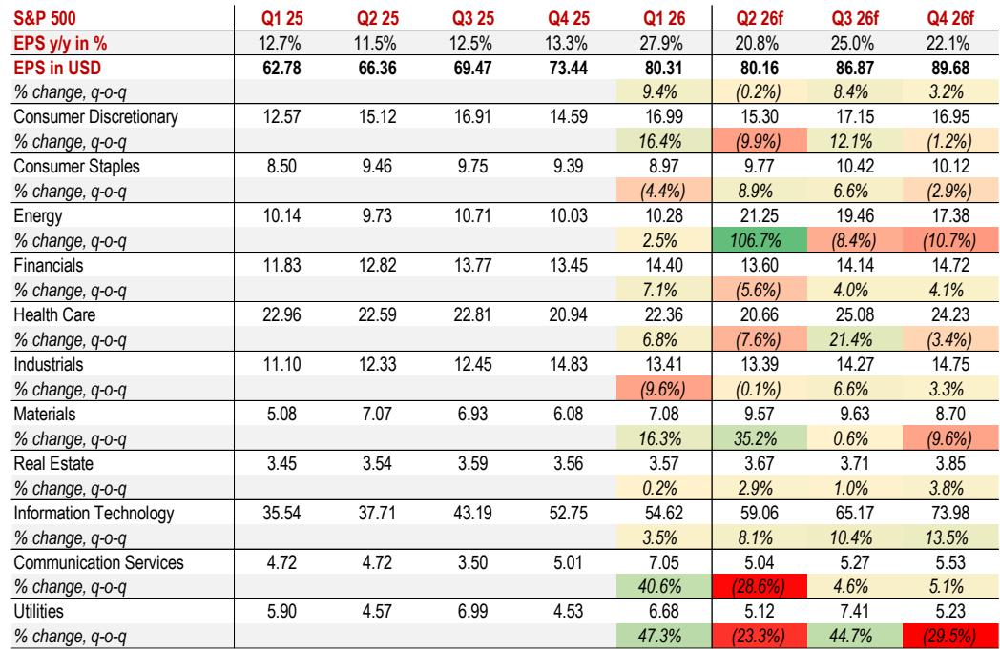
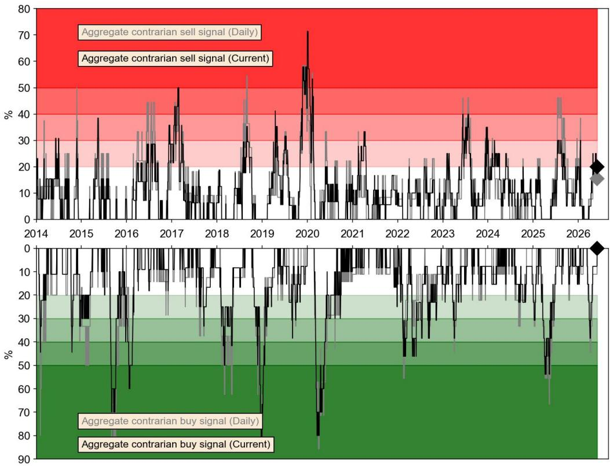
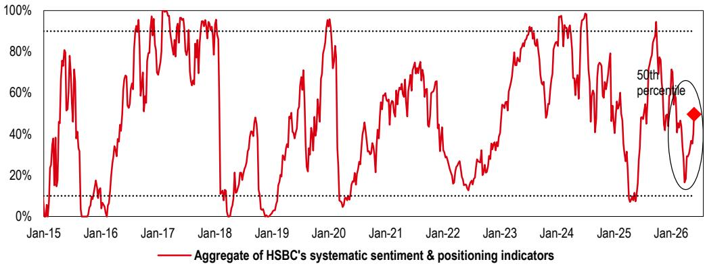

# 市场最该担心的不是利率和地缘，而是“一切看起来太好”的那一天

过去几周，几乎所有与我们对谈的投资者都在问同一个问题：既然你们如此激进地看多风险资产，那什么能让你们转向看空？

这个问题的频率本身就是一个信号。当市场共识从“要不要买”变成“为什么不买”时，真正的风险往往不是那些已经被讨论过无数遍的宏观变量，而是那些被乐观情绪掩盖的结构性脆弱点。

某外资投行最新发布的跨资产策略报告，直接以这个问题为标题，给出了一个相当清晰的排序：哪些风险看起来可怕但实际影响有限，哪些风险目前被低估但可能成为真正的转折点。这份报告的结论值得每一位资产配置决策者认真对待——不是因为它的结论有多惊悚，而是因为它用数据和逻辑拆解了“乐观共识”中最薄弱的环节。

## 1. 盈利预期过高这个担忧，至少在未来一个季度是伪命题

市场对盈利的担忧往往集中在“预期已经太高，失望是大概率”。这个逻辑听起来合理，但需要区分时间维度。

从该报告提供的标普500分季度EPS数据来看，2025年二季度的盈利预期实际上非常温和。Q2的EPS环比增长预期仅为个位数，且与Q1的实际结果相比，基数并不高。换句话说，二季报要“beat”并不难，真正的高门槛在下半年。

更重要的是，即便看下半年，市场对Q3的EPS预期也存在显著的行业分化。信息技术板块的EPS环比增长预期仍然强劲，而消费、工业等板块则相对平淡。这种分化意味着，整体指数的盈利“暴雷”概率并不高——真正需要担心的是某个权重板块的集体miss，而不是全市场的同步下滑。

该报告还给出了两个值得关注的宏观支撑信号：美国经济活动指数在去年底之后重新加速，同时今年的退税金额显著高于去年同期。这两点都指向居民和企业部门的现金流状况并不差，为二季度的消费和企业支出提供了缓冲。

所以，盈利预期过高这个担忧，至少在Q2财报季结束之前，更像是一个“听起来有道理但数据不支持”的叙事。真正的考验要等到下半年，而到那时，如果Q2的beat率继续超预期，市场对H2的担忧很可能自然消散。

## 2. 地缘风险对风险资产的冲击，需要越过一个很高的阈值

地缘政治是另一个被频繁提及的尾部风险。中东局势、关税反复、能源供应链的不确定性，每一个单独拿出来都足以让人不安。

但该报告的逻辑很清晰：地缘风险要真正对风险资产形成广泛压制，需要越过一个很高的阈值。原因有二。

第一，美国政府在关税问题上的反复已经持续了超过13个月，市场已经形成了“会加码、也会撤回”的定价模式。除非出现一次性、不可逆的全面升级，否则风险资产很难为此计入显著的风险溢价。

第二，能源价格近期已经趋于稳定。从中东冲突传导到风险资产的核心路径是油价——油价飙升推高通胀预期，进而压缩央行宽松空间，最终压制估值。但当前全球原油库存虽然处于去化通道，该报告也提示如果当前去化速度持续，到8月可能触及临界低位，但这仍然是一个“假设条件”而非既定事实。只要库存没有真正打破阈值，能源对风险资产的传导就是可控的。

地缘风险对某些特定资产（如原油、部分货币）的影响仍然显著，但对股票和信用市场的广泛冲击，需要看到中东局势升级到“压倒AI和芯片板块乐观情绪”的程度。这个阈值目前还很高。

## 3. 利率已经进入了“危险区”，但这次可能咬不动实体经济

美债长端收益率已经处于该报告定义的“Danger Zone”——即10年期美债收益率水平已经高到历史上会对几乎所有资产类别形成压力的区间。该报告自己的美债周期模型也显示当前处于“最大卖出”状态。

但奇怪的是，股票、信用、甚至新兴市场债券和货币到目前为止都没有被明显吓到。为什么？

答案是：美国经济对利率的敏感度已经大幅下降。该报告提供了两组关键数据：美国非金融企业的净利息支出占利润的比重，以及浮动利率抵押贷款占全部房贷的比例，这两个指标在疫情后都处于历史低位。企业锁定了低利率的长期债务，居民锁定了30年固定利率房贷，利率上升对实体经济的传导效率远低于过去周期。

这意味着，即便利率继续走高，对消费和企业投资的实际抑制效果可能有限。真正需要担心的是利率波动率的结构性上升——如果市场开始定价美联储独立性的丧失，或者财政主导的风险，那么利率波动率中枢上移，才会对权益和信用的估值形成系统性压力。

但就目前而言，利率走高更像是一个“买跌”的窗口，而不是趋势反转的信号。

## 4. 真正的风险藏在“一切看起来都很好”的时刻

如果盈利、地缘、利率都不是主要担忧，那什么才是？

该报告明确指出了两个最核心的担忧：一是情绪和仓位的过度拥挤，二是AI相关支出的放缓或芯片供给的增加。

先说情绪和仓位。该报告自己的短期框架目前尚未发出卖出信号，系统性策略（CTA、风险平价、波动率目标）的仓位也正在趋于中性，而不是极端。但报告特别提到了一个值得警惕的场景：如果中东出现任何积极的消息面变化，可能引发股票和信用市场同步的、广泛性的上涨——而这种“一切都在涨”的状态，恰恰可能触发该报告仓位框架中的正式卖出信号。

这是一个反直觉但非常重要的洞察。市场通常认为坏消息导致下跌，好消息导致上涨。但在当前这个已经高度拥挤、估值不便宜的市场里，反而是“全面乐观”本身可能成为风险。因为当所有资产都在涨，说明市场已经没有对冲需求，所有人的仓位方向高度一致，任何边际上的负面冲击都会引发剧烈的去杠杆。

再看AI和技术板块。这是当前美国股市最核心的驱动力，也是美国家庭财富最重要的支撑。如果AI相关支出放缓，或者芯片供给出现明显增加（比如中国在DDR5市场的追赶，或者效率提升带来的内存价格下降），都可能对整体增长形成下行压力。

但报告也指出，AI支出的显著积压订单使得短期内出现放缓的可能性很低，而芯片供给的增加至少在下一个季度内还不会成为现实问题。所以，这两个风险更多是“需要持续跟踪”而非“立刻行动”的变量。

## 5. 这份报告没有完全回答的关键问题：乐观能持续多久，以及什么会打破它

这份报告的价值在于，它用清晰的逻辑排除了那些“看起来可怕但实际影响有限”的风险，把投资者的注意力集中到了真正需要跟踪的少数变量上。

但它也留下了一些尚未完全回答的问题。

第一，如果情绪和仓位真的进入“全面乐观”状态，触发卖出信号的阈值具体是多少？报告提到了框架，但没有给出具体的数值或条件。这对于希望提前做好预案的投资者来说，是一个需要自行推演的关键缺口。

第二，AI支出的“积压订单”到底能支撑多久？积压是一个存量概念，而支出是一个流量概念。当积压开始消化，新增订单能否跟上，决定了AI板块的增长可持续性。报告没有对这个问题做深入的时间序列分析。

第三，利率“不咬人”的假设是否依赖于通胀的持续回落？如果通胀因为某些结构性因素（如去全球化、绿色转型、劳动力成本刚性）而重新抬头，那么即便企业和居民对利率不敏感，央行被迫加息的预期本身也可能通过估值渠道打压资产价格。这个二阶传导路径，报告没有充分展开。

这些未解问题，恰恰是决定下一步资产配置方向的关键。

## 6. 一个更务实的观察框架：把注意力从“会不会跌”转向“什么会让它跌”

对于资产配置决策者来说，这份报告最大的贡献不是给出了一个具体的看多或看空结论，而是提供了一个更有效的观察框架。

与其每天追问“市场是不是太高了”，不如把精力集中在以下三个维度：

第一，情绪和仓位的极端化程度。不要等到市场已经全面乐观再去反应，而是建立一个自己的“情绪温度计”——比如观察信用利差是否全面收窄、低质量债券是否开始追赶高质量债券、散户资金流入是否加速。这些指标比任何宏观预测都更能告诉你市场的脆弱程度。

第二，AI支出的边际变化信号。不要只看总支出规模，而要关注头部云厂商的资本开支指引是否出现下调、芯片订单的交付周期是否缩短、内存价格是否出现超预期下跌。这些微观信号比宏观预测更早反映趋势变化。

第三，利率波动率的结构性变化。不要只看绝对利率水平，而要关注波动率曲线是否开始定价长期不确定性——比如期限溢价的持续上升，或者政策路径的离散度扩大。如果波动率中枢上移，那才是真正的系统性风险。

这三个维度共同构成了一个比“看多还是看空”更可操作的决策框架。

---

这份报告的逻辑框架和关键数据，远不止我们上面讨论的这些。比如关于新兴市场仓位、美元流动性、以及特定行业盈利拆分的更详细分析，都因为篇幅限制无法一一展开。

如果你对上述三个观察维度中的任何一个感兴趣，或者想看到该报告关于情绪仓位框架、AI支出积压订单、以及利率波动率情景分析的完整图表和数据，欢迎来星球微信群里继续讨论。我们会在群里分享这份报告的原始图表和更细致的解读，也会和大家一起推演那些报告没有完全回答的关键问题。

Personal reading notes and learning share only. Not investment advice.

