# China Equity Strategy | Asia Pacific

# China/HK Flows and Positioning Monthly Tracker – May 2026

# Key Takeaways

US and EU mutual funds turned to outflow in May, the first since May 2025 (ex Mar-26); passive inflows slowed and active fund outflows accelerated.   
National Team ETF selling accelerated, while retail participation strengthened with margin financing at a record high and private fund AUM surging.   
■ Southbound flows slowed significantly, while foreign passive funds tracking CSI 300 continued to see inflows, indicating sustained A-share interest.

# Foreign-domiciled long-only fund flows:

- Chinese equity flows from foreign-domiciled (US and EU) funds reversed to a moderate outflow of US\$0.5bn in May, the first outflow month since May 2025, aside from March 2026, with Middle East conflict. Passive funds inflows slowed to US\$1.1bn (vs. US\$2.5bn in April), while active fund outflows accelerated to US\$1.6bn (vs. US\$1.2bn in April) (Exhibit 2).   
- On a cumulative basis, foreign fund flows reached US\$10bn in 5M26, representing 80% of the full-year 2025 inflow total (Exhibit 4, Exhibit 5).   
- Based on the latest available data (with most funds having disclosed position data up to Apr-26), Global EM funds' China UW remained stable at 1.3ppt. However, EM funds and AxJ funds deepened their underweight positions, with EM funds now at 6.2ppt UW and AxJ funds at 4.0ppt UW (Exhibit 1).   
- More details: Fund Flows in China/HK Equities.

# A-share market liquidity:

- National Team outflows, proxied by CSI 300 ETF flows, accelerated to an estimated US\$21bn in May from US\$8bn in April, less support amid the strong rally in AI and technology stocks ( Exhibit 7).   
- Private fund AUM saw a material increase of Rmb386bn in May, reflecting active high-net-worth individual participation, while margin financing balance rose 7% MoM to another record high (Exhibit 12, Exhibit 19).   
• More details: A-share Liquidity Track.

# Southbound/Northbound flow:

- Southbound flows slowed significantly to US\$1.6bn in May (vs. US\$7.2bn in April). On a cumulative basis, 5M26 southbound inflows reached US\$34bn, representing 20% of the full-year 2025 total (Exhibit 3).   
- Foreign passive fund flows into CSI 300 (a proxy for northbound flow) continued inflows in May, with sustained interest in A-share (Exhibit 19).

MS ASIA LIMITED+

# Chloe Liu

Equity Strategist

Chloe.Liu1@morganstanley.com +852 2848-5497

# Laura Wang

Equity Strategist

Laura.Wang@morganstanley.com +852 2848-6853

# Vicky Wu

Equity Strategist

Vicky.Wu@morganstanley.com +852 3963-3928

MS ASIA (SINGAPORE) PTE.+

# Kristal Ji

Equity Strategist

Kristal.Ji@morganstanley.com +65 6834-6949

# Daniel K Blake

Equity Strategist

Daniel.Blake@morganstanley.com +65 6834-6597

# Asia Summer School 2026

Exhibit 1: Active weights of China/HK equities by regional fund category and manager domicile   
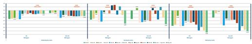

bar

| Category | Series 1 | Series 2 | Series 3 | Series 4 | Series 5 | Series 6 | Series 7 | Series 8 |
|---|---|---|---|---|---|---|---|---|
| Group 1 | 0.0 | 0.0 | 0.0 | 0.0 | 0.0 | 0.0 | 0.0 | 0.0 |
| Group 2 | 0.0 | 0.0 | 0.0 | 0.0 | 0.0 | 0.0 | 0.0 | 0.0 |
| Group 3 | 0.0 | 0.0 | 0.0 | 0.0 | 0.0 | 0.0 | 0.0 | 0.0 |
| Group 4 | 0.0 | 0.0 | 0.0 | 0.0 | 0.0 | 0.0 | 0.0 | 0.0 |
| Group 5 | 0.0 | 0.0 | 0.0 | 0.0 | 0.0 | 0.0 | 0.0 | 0.0 |
| Group 6 | 0.0 | 0.0 | 0.0 | 0.0 | 0.0 | 0.0 | 0.0 | 0.0 |
| Group 7 | 0.0 | 0.0 | 0.0 | 0.0 | 0.0 | 0.0 | 0.0 | 0.0 |
| Group 8 | 0.0 | 0.0 | 0.0 | 0.0 | 0.0 | 0.0 | 0.0 | 0.0 |
| Group 9 | 0.0 | 0.0 | 0.0 | 0.0 | 0.0 | 0.0 | 0.0 | 0.0 |
| Group 10 | 0.0 | 0.0 | 0.0 | 0.0 | 0.0 | 0.0 | 0.0 | 0.0 |
| Group 11 | 1.5 | -1.5 | -1.5 | -1.5 | -1.5 | -1.5 | -1.5 | -1.5 |
| Group 12 | -1.5 | -1.5 | -1.5 | -1.5 | -1.5 | -1.5 | -1.5 | -1.5 |
| Group 13 | -1.5 | -1.5 | -1.5 | -1.5 | -1.5 | -1.5 | -1.5 | -1.5 |
| Group 14 | -1.5 | -1.5 | -1.5 | -1.5 | -1.5 | -1.5 | -1.5 | -1.5 |
| Group 15 | -1.5 | -1.5 | -1.5 | -1.5 | -1.5 | -1.5 | -1.5 | -1.5 |
| Group 16 | -1.5 | -1.5 | -1.5 | -1.5 | -1.5 | -1.5 | -1.5 | -1.5 |
| Group 17 | -1.5 | -1.5 | -1.5 | -1.5 | -1.5 | -1.5 | -1.5 | -1.5 |
| Group 18: Total (n) = (n-Total) / n-Total (n-Total) + (n-Total) / n-Total (n-Total) * (n-Total) * (n-Total) * (n-Total) * (n-Total) * (n-Total) * (n-Total) * (n-Total) * (n-Total) * (n-Total) * (n-Total) * (n-Total) * (n-Total) * (n-Total) * (n-Total) * (n-Total) * (n-Total) * (n-Number) * (n-Number) * (n-Number) * (n-Number) * (n-Number) * (n-Number) * (n-Number) * (n-Number) * (n-Number) * (n-Number) * (n-Number) * (n-Number) * (n-Number) * (n-Number) * (n-Number) * (n-Number) * (n-Number) * (N/A) * (N/A) * (N/A) * (N/A) * (N/A) * (N/A) * (N/A) * (N/A) * (N/A) * (N/A) * (N/A) * (N/A) * (N/A) * (N/A) * (N/A) * (N/A) * (N/A) * (N/A) * (N/A) * (N/A) * (N/NA)* (N/NA)* (N/NA)* (N/NA)* (N/NA)* (N/NA)* (N/NA)* (N/NA)* (N/NA)* (N/NA)* (N/NA)* (N/NA)* (N/NA)* (N/NA)* (N/NA)* (N/NA)* (N/NA)* (N/NA)* (N/NA)* (N/NA)* (N/NA) * (N/NA)* (N/NA)* (N/NA)* (N/NA)* (N/NA)* (N/NA)* (N/NA)* (N/NA)* (N/NA)* (N/NA)* (N/NA)* (N/NA)* (N/NA)* (N/NA)* (N/NA)* (N/NA)* (N/NA)* (N/NA)* (N/NA)* (N/A)* (N/A)* (N/A)* (N/A)* (N/A)* (N/A)* (N/A)* (N/A)* (N/A)* (N/A)* (N/A)* (N/A)* (N/A)* (N/A)* (N/A)* (N/A)* (N/A)* (N/A)* (N/A)* (N/A)* (N/A)* (N/A)* (N/A)* (N/A)* (N/A)* (N/NA)* (N/NA)* (N/NA)* (N/NA)* (N/NA)* (N/NA)* (N/NA)* (N/NA)* (N/NA)* (N/NA)* (N/NA)* (N/NA)* (N/NA)* (N/NA)* (N/NA)* (N/NA)* (N/NA)* (N/NA)* (N/NA)* (N/NA)* (N/NNA)* (N/NNA)* (N/NNA)* (N/NNA)* (N/NNA)* (N/NNA)* (N/NNA)* (N/NNA)* (N/NNA)* (N/NNA)* (N/NNA)* (N/NNA)* (N/NNA)* (N/NNA)* (N/NNA)* (N/NNA)* (N/NNA)* (N/NNA)* (N/NNA)* (N/NNA)* (N/N<fcel>Group 1: Total(n=Total), Group 2: Total(n=Total), Group 3: Total(n=Total), Group 4: Total(n=Total), Group 5: Total(n=Total), Group 6: Total(n=Total), Group 7: Total(n=Total), Group 8: Total(n=Total), Group 9: Total(n=Total), Group 10: Total(n=Total), Group 11: Total(n=Total), Group 12: Total(n=Total), Group 13: Total(n=Total), Group 14: Total(n=Total), Group 15: Total(n=Total), Group 16: Total(n=Total), Group 17: Total(n=Total), Group 18: Total(n=Total), Group 19: Total(n=Total), Group 20: Total(n=Total), Group 21: Total(n=Total), Group 22: Total(n=Total), Group 23: Total(n=Total), Group 24: Total(n=Total), Group 25: Total(n=Total), Group 26: Total(n=Total), Group 27: Total(n=Total), Group 28: Total(n=Total), Group 29: Total(n=Total), Group 30: Total(n=Total), Group 31: Total(n=Total), Group 32: Total(n=Total), Group 33: Total(n=Total), Group 34: Total(n=Total), Group 35: Total(n=Total), Group 36: Total(n=Total), Group 37: Total(n=Total), Group 38: Total(n=Total), Group 39: Total(n=Total), Group N/A* [Table for the Total(n=Total)] = (-2, -2, -2, -2, -2, -2, -2, -2, -2, -2, -2, -2, -2, -2, -2, -2, -2, -2, -2, -2, -2, -2, -2, -2, -2, -2, -2, -2, -2, -2, -2, -2, -2, -2, -3] <p-value > (-p-value)

Source: FactSet, MorningStar, EPFR, MS. Note: Data refreshed as of May 31, 2026, most funds have disclosed position data up to April 30. Fund universe of each category is formed by the largest 30 active mutual funds under MorningStar regional category. Funds under "non-US Managers" are mostly domiciled in Europe. We exclude ESG funds, income funds, and systematic funds. All the covered funds are benchmarking to either MSCI or FTSE standard regional indices of All Country World, Asia ex Japan, or Emerging Markets.

MS does and seeks to do business with companies covered in MS. As a result, investors should be aware that the firm may have a conflict of interest that could affect the objectivity of MS. Investors should consider MS as only a single factor in making their investment decision.

# For analyst certification and other important disclosures, refer to the Disclosure Section, located at the end of this report.

+= Analysts employed by non-U.S. affiliates are not registered with FINRA, may not be associated persons of the member and may not be subject to FINRA restrictions on communications with a subject company, public appearances and trading securities held by a research analyst account.

# Fund Flows in China/HK Equities

# For foreign-domiciled mutual funds

- By sector: Active fund managers added the most active weights in Capital Goods, Tech Hardware and Semiconductors vs. last month, while they trimmed most in Consumer Discretionary Distribution & Retail, Consumer Services and Pharmaceuticals Biotech (Exhibit 23).   
- By company: Montage Technology, Xiaomi and Lenovo were most added, while BABA, Meituan and H World were most trimmed vs. last month (Exhibit 20).   
- Also read: Fund Positions Changes vs. Last Month – Top 50 Mutual Fund Holdings, Funds Positions Changes vs. Last Month – By GICS Industry Group

Exhibit 2: Monthly fund flows in China/HK equities by foreign passive and active funds   
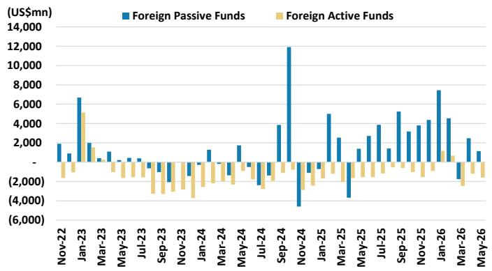

bar

| Month | Foreign Passive Funds (US$mn) | Foreign Active Funds (US$mn) |
|---|---|---|
| Nov-22 | 1800 | -1500 |
| Dec-22 | 1000 | -1800 |
| Jan-23 | 6800 | 5200 |
| Feb-23 | 1900 | -1000 |
| Mar-23 | 1400 | -1200 |
| Apr-23 | 1000 | -1500 |
| May-23 | 800 | -1800 |
| Jun-23 | 700 | -2000 |
| Jul-23 | 600 | -2500 |
| Aug-23 | 500 | -3000 |
| Sep-23 | 400 | -3500 |
| Oct-23 | 300 | -4000 |
| Nov-23 | 200 | -4500 |
| Dec-23 | 150 | -5000 |
| Jan-24 | 1500 | -5500 |
| Feb-24 | 1800 | -6000 |
| Mar-24 | 1500 | -6500 |
| Apr-24 | 1800 | -7000 |
| May-24 | 1500 | -7500 |
| Jun-24 | 1200 | -8000 |
| Jul-24 | 1000 | -8500 |
| Aug-24 | 800 | -9000 |
| Sep-24 | 4000 | -9500 |
| Oct-24 | 12000 | -11000 |
| Nov-24 | -4500 | -13500 |
| Dec-24 | 550 | -1650 |
| Jan-25 | 500 | -1850 |
| Feb-25 | 450 | -2150 |
| Mar-25 | 350 | -2650 |
| Apr-25 | 250 | -335 |
| May-25 | 1800 | -395 |
| Jun-25 | 350 | -495 |
| Jul-25 | 450 | -595 |
| Aug-25 | 350 | -695 |
| Sep-25 | 550 | -795 |
| Oct-25 | 450 | -915 |
| Nov-25 | 450 | -111 |
| Dec-25 | 7850 | -139 |
| Jan-26 | 4850 | -169 |
| Feb-26 | 3850 | -219 |
| Mar-26 | 2850 | -319 |
| Apr-26 | 1850 | -419 |
| May-26 | 1650 | -479 |

Source: EPFR, MS. Note: Data as of May 31, 2026.

Exhibit 4: Cumulative fund flows in China/HK equities by both US- and EU-domiciled active funds   
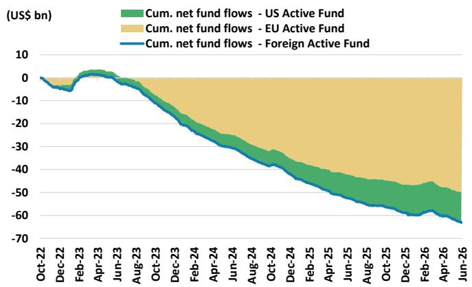

area

| Date    | Cum. net fund flows - US Active Fund | Cum. net fund flows - EU Active Fund | Cum. net fund flows - Foreign Active Fund |
|---------|--------------------------------------|--------------------------------------|-------------------------------------------|
| Oct-22  | 0                                    | 0                                    | 0                                         |
| Dec-22  | -5                                   | -5                                   | -5                                        |
| Feb-23  | 0                                    | 0                                    | 0                                         |
| Apr-23  | 5                                    | 5                                    | 5                                         |
| Jun-23  | 0                                    | 0                                    | 0                                         |
| Aug-23  | -10                                  | -10                                  | -10                                       |
| Oct-23  | -20                                  | -20                                  | -20                                       |
| Dec-23  | -25                                  | -25                                  | -25                                       |
| Feb-24  | -30                                  | -30                                  | -30                                       |
| Apr-24  | -35                                  | -35                                  | -35                                       |
| Jun-24  | -40                                  | -40                                  | -40                                       |
| Aug-24  | -45                                  | -45                                  | -45                                       |
| Oct-24  | -50                                  | -50                                  | -50                                       |
| Dec-24  | -55                                  | -55                                  | -55                                       |
| Feb-25  | -60                                  | -60                                  | -60                                       |
| Apr-25  | -65                                  | -65                                  | -65                                       |
| Jun-25  | -70                                  | -70                                  | -70                                       |
| Aug-25  | -75                                  | -75                                  | -75                                       |
| Oct-25  | -80                                  | -80                                  | -80                                       |
| Dec-25  | -85                                  | -85                                  | -85                                       |
| Feb-26  | -90                                  | -90                                  | -90                                       |
| Apr-26  | -95                                  | -95                                  | -95                                       |
| Jun-26  | -100                                 | -100                                 | -100                                      |

Source: EPFR, MS. Note: Data as of May 31, 2026.

Exhibit 3: Southbound monthly net fund flows   
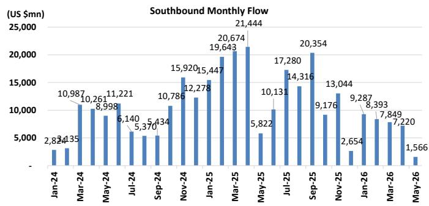

bar

Southbound Monthly Flow
| Month | Value (US $mn) |
|---|---|
| Jan-24 | 2,824 |
| Feb-24 | 3,135 |
| Mar-24 | 10,987 |
| Apr-24 | 10,261 |
| May-24 | 8,998 |
| Jun-24 | 11,221 |
| Jul-24 | 6,140 |
| Aug-24 | 5,370 |
| Sep-24 | 5,434 |
| Oct-24 | 10,786 |
| Nov-24 | 15,920 |
| Dec-24 | 12,278 |
| Jan-25 | 15,447 |
| Feb-25 | 19,643 |
| Mar-25 | 20,674 |
| Apr-25 | 21,444 |
| May-25 | 5,822 |
| Jun-25 | 10,131 |
| Jul-25 | 17,280 |
| Aug-25 | 14,316 |
| Sep-25 | 20,354 |
| Oct-25 | 9,176 |
| Nov-25 | 13,044 |
| Dec-25 | 2,654 |
| Jan-26 | 9,287 |
| Feb-26 | 8,393 |
| Mar-26 | 7,849 |
| Apr-26 | 7,220 |
| May-26 | 1,566 |

Source: CEIC, MS. Note: Data as of May 31, 2026.

Exhibit 5: Cumulative fund flows in China/HK equities by both US- and EU-domiciled passive funds   
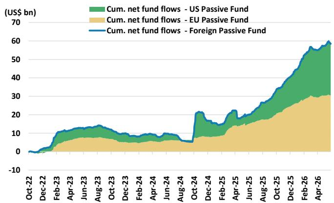  
Source: EPFR, MS. Note: Data as of May 31, 2026.

Exhibit 6: Daily net fund flows in China/HK equities by both US- and EU-domiciled active funds   
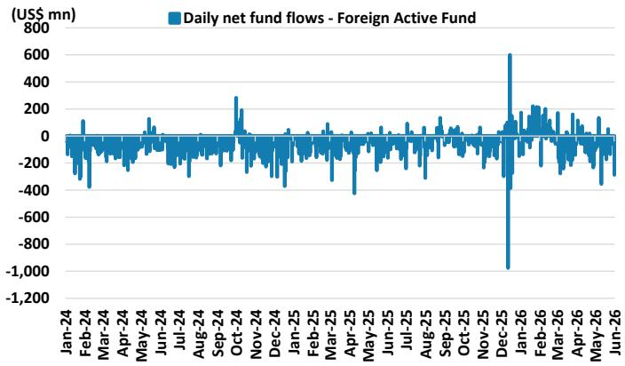

line

| Date    | Daily net fund flows (US$ mn) |
|---------|-------------------------------|
| Jan-24  | ~0                            |
| Feb-24  | ~100                          |
| Mar-24  | ~-300                         |
| Apr-24  | ~-100                         |
| May-24  | ~100                          |
| Jun-24  | ~-100                         |
| Jul-24  | ~-100                         |
| Aug-24  | ~-100                         |
| Sep-24  | ~300                          |
| Oct-24  | ~-100                         |
| Nov-24  | ~-100                         |
| Dec-24  | ~-100                         |
| Jan-25  | ~-100                         |
| Feb-25  | ~-100                         |
| Mar-25  | ~-100                         |
| Apr-25  | ~-400                         |
| May-25  | ~-100                         |
| Jun-25  | ~-100                         |
| Jul-25  | ~-100                         |
| Aug-25  | ~-100                         |
| Sep-25  | ~-100                         |
| Oct-25  | ~-100                         |
| Nov-25  | ~-100                         |
| Dec-25  | ~600                          |
| Jan-26  | ~-1,000                       |
| Feb-26  | ~200                          |
| Mar-26  | ~100                          |
| Apr-26  | ~100                          |
| May-26  | ~100                          |
| Jun-26  | ~100                          |

Source: EPFR, MS. Note: Data as of May 31, 2026.

Exhibit 7 Daily net fund flows in China/HK equities by both US- and EU-domiciled passive funds   
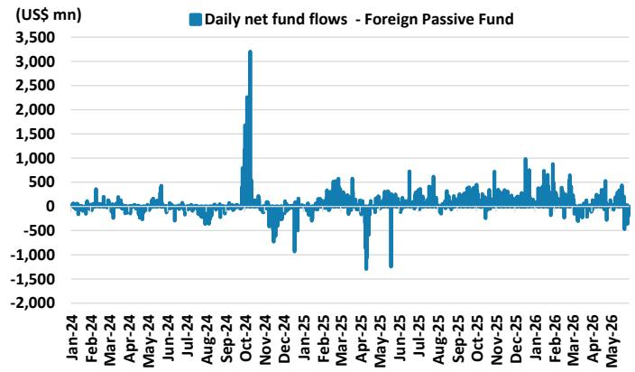

line

| Date    | Daily net fund flows (US$ mn) |
|---------|-------------------------------|
| Jan-24  | ~0                            |
| Feb-24  | ~0                            |
| Mar-24  | ~0                            |
| Apr-24  | ~0                            |
| May-24  | ~0                            |
| Jun-24  | ~0                            |
| Jul-24  | ~0                            |
| Aug-24  | ~0                            |
| Sep-24  | ~0                            |
| Oct-24  | ~3,300                        |
| Nov-24  | ~0                            |
| Dec-24  | ~-1,000                       |
| Jan-25  | ~0                            |
| Feb-25  | ~0                            |
| Mar-25  | ~0                            |
| Apr-25  | ~-1,500                       |
| May-25  | ~-1,500                       |
| Jun-25  | ~0                            |
| Jul-25  | ~0                            |
| Aug-25  | ~0                            |
| Sep-25  | ~0                            |
| Oct-25  | ~0                            |
| Nov-25  | ~0                            |
| Dec-25  | ~1,000                        |
| Jan-26  | ~0                            |
| Feb-26  | ~0                            |
| Mar-26  | ~0                            |
| Apr-26  | ~0                            |
| May-26  | ~0                            |

Source: EPFR, MS. Note: Data as of May 31, 2026.

# A-share Liquidity Track

- National Team ETF selling accelerated in May, led by CSI 300 ETF outflows of US\$21bn, more than doubling from US\$8bn in April. (Exhibit 7).   
- Broader domestic passive outflows also picked up: Across all A-share domestic passive funds (including broad-market index, sector and thematic ETFs), outflows rose to US\$53bn in May from US\$39bn in April ( Exhibit 8 ).   
- Retail participation strengthened in May: New account openings increased slightly, daily average small-order net inflows recovered to Rmb33bn daily (vs. Rmb20bn in April). Margin financing balance rebounded 7% MoM to a another record high of Rmb2.9tn, indicating sustained leveraged retail participation (Exhibit 11, Exhibit 12).   
- Private funds AUM saw a material increase in May: Private equity fund AUM rose by Rmb386bn, reflecting continued active participation from high-net-worth individuals (Exhibit 13). Onshore equity mutual fund AUM declined, likely driven by National Team redemptions, while hybrid mutual funds maintained their steady uptrend (Exhibit 14).   
- Foreign passive inflows into A-shares continued in May: Foreign passive funds tracking CSI 300 recorded further net inflows, extending the first turn to inflows in April since 2026 and signaling sustained foreign investor interest (Exhibit 19).

# National Team ETF selling accelerated in May, led by CSI 300 ETFs; domestic passive outflows also picked up

We use CSI 300 passive ETF flows as a proxy for the National Team's cumulative buying and selling activity. CSI 300 ETF outflows more than doubled to US\$21bn in May (vs. US\$8bn in April), albeit still well below the US\$84bn peak in January. Total outflows across CSI 300, 500, and 1000 ETFs reached US\$27bn in May (vs. US\$14bn in March and US\$110bn in January).

Across all A-share domestic passive funds (including broad-market index ETFs as well as sector and thematic ETFs), outflows also accelerated to US\$53bn in May (vs. US\$39bn in April and US\$108bn in January).

Exhibit 7: China domestic broad-market index ETF flow – ETF selling further accelerated in May   
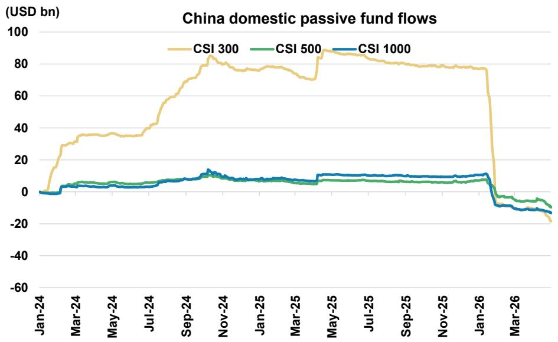

line

| Date   | CSI 300 | CSI 500 | CSI 1000 |
|--------|---------|---------|----------|
| Jan-24 | 0       | 0       | 0        |
| Mar-24 | 30      | 5       | 2        |
| May-24 | 35      | 6       | 3        |
| Jul-24 | 40      | 7       | 4        |
| Sep-24 | 60      | 8       | 5        |
| Nov-24 | 80      | 10      | 12       |
| Jan-25 | 75      | 8       | 8        |
| Mar-25 | 70      | 7       | 7        |
| May-25 | 85      | 8       | 10       |
| Jul-25 | 80      | 7       | 10       |
| Sep-25 | 78      | 7       | 10       |
| Nov-25 | 78      | 7       | 10       |
| Jan-26 | 78      | 7       | 10       |
| Mar-26 | -20     | -10     | -15      |

Source: EPFR, MS. Data as of May 31, 2026.

Exhibit 8: Cumulative fund flows in China/HK equities from Chinese domestic domiciled passive funds   
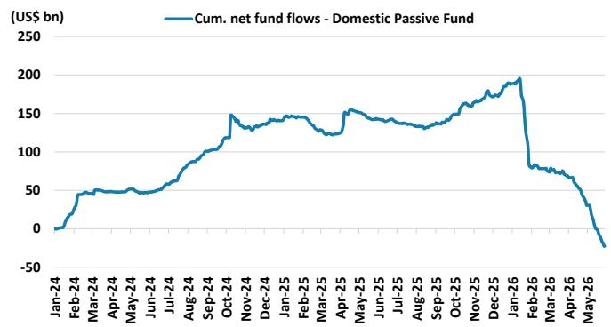

line

| Month    | Cum. net fund flows - Domestic Passive Fund (US$ bn) |
| -------- | ---------------------------------------------------- |
| Jan-24   | 0                                                    |
| Feb-24   | 50                                                   |
| Mar-24   | 50                                                   |
| Apr-24   | 50                                                   |
| May-24   | 50                                                   |
| Jun-24   | 50                                                   |
| Jul-24   | 75                                                   |
| Aug-24   | 100                                                  |
| Sep-24   | 125                                                  |
| Oct-24   | 150                                                  |
| Nov-24   | 150                                                  |
| Dec-24   | 150                                                  |
| Jan-25   | 150                                                  |
| Feb-25   | 150                                                  |
| Mar-25   | 150                                                  |
| Apr-25   | 150                                                  |
| May-25   | 150                                                  |
| Jun-25   | 150                                                  |
| Jul-25   | 150                                                  |
| Aug-25   | 150                                                  |
| Sep-25   | 150                                                  |
| Oct-25   | 175                                                  |
| Nov-25   | 175                                                  |
| Dec-25   | 175                                                  |
| Jan-26   | 200                                                  |
| Feb-26   | 75                                                   |
| Mar-26   | 75                                                   |
| Apr-26   | 50                                                   |
| May-26   | -25                                                  |

Source: EPFR, MS. Note: Data as of May 31, 2026.

Exhibit 9: Daily fund flows in China/HK equities from Chinese domestic domiciled passive funds   
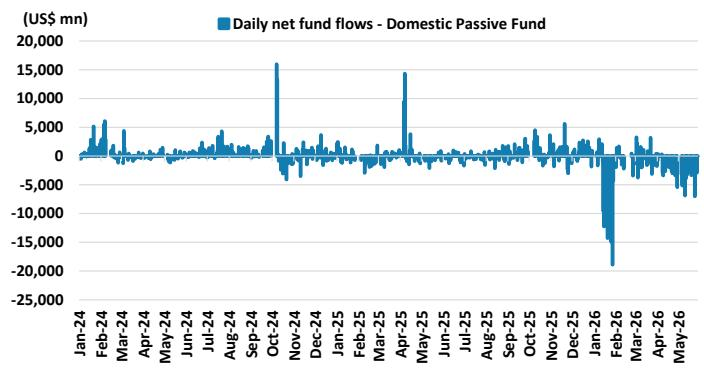

line

| Date    | Daily net fund flows (US$ mn) |
|---------|-------------------------------|
| Jan-24  | ~0                            |
| Feb-24  | ~5,000                        |
| Mar-24  | ~0                            |
| Apr-24  | ~0                            |
| May-24  | ~0                            |
| Jun-24  | ~0                            |
| Jul-24  | ~0                            |
| Aug-24  | ~0                            |
| Sep-24  | ~0                            |
| Oct-24  | ~15,000                       |
| Nov-24  | ~0                            |
| Dec-24  | ~0                            |
| Jan-25  | ~0                            |
| Feb-25  | ~0                            |
| Mar-25  | ~0                            |
| Apr-25  | ~15,000                       |
| May-25  | ~0                            |
| Jun-25  | ~0                            |
| Jul-25  | ~0                            |
| Aug-25  | ~0                            |
| Sep-25  | ~0                            |
| Oct-25  | ~0                            |
| Nov-25  | ~0                            |
| Dec-25  | ~0                            |
| Jan-26  | ~-20,000                      |
| Feb-26  | ~0                            |
| Mar-26  | ~0                            |
| Apr-26  | ~0                            |
| May-26  | ~0                            |

Source: EPFR, MS. Note: Data as of May 31, 2026.

# Retail participation picked up in May: account openings edged higher, small-order inflows strengthened and margin financing hit a new record

- New SSE account opening rose slightly to 2.8mn in May from 2.5mn in April.   
- The daily average net inflow of A-share small orders (under Rmb40,000, a proxy for retail participation) jumped to Rmb33bn in May from Rmb20bn in April, pointing to notably stronger retail engagement.   
- A-share total margin financing balance (a proxy for leveraged retail participation) rose a further 7% MoM to a record high of Rmb2.9tn.

Exhibit 10: SSE registered new accounts – Slight pick-up in May   
SSE registered new account (mn units)   
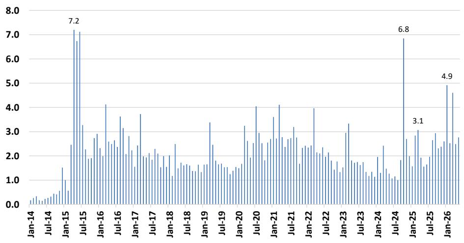

bar

| Date | Value |
|---|---|
| Jan-14 | 0.3 |
| Jul-14 | 0.4 |
| Jan-15 | 1.5 |
| Jul-15 | 7.2 |
| Jan-16 | 2.8 |
| Jul-16 | 4.1 |
| Jan-17 | 2.6 |
| Jul-17 | 3.7 |
| Jan-18 | 2.0 |
| Jul-18 | 2.5 |
| Jan-19 | 1.7 |
| Jul-19 | 3.4 |
| Jan-20 | 1.6 |
| Jul-20 | 3.2 |
| Jan-21 | 4.0 |
| Jul-21 | 2.7 |
| Jan-22 | 3.2 |
| Jul-22 | 4.0 |
| Jan-23 | 3.3 |
| Jul-23 | 1.8 |
| Jan-24 | 2.4 |
| Jul-24 | 6.8 |
| Jan-25 | 3.1 |
| Jul-25 | 2.9 |
| Jan-26 | 4.9 |
| Jul-26 | 2.7 |

Source: CEIC, MS. Data as of May 2026.

Exhibit 11: Daily average of A-share small orders net inflow – Inflows improved significantly in May   
Daily average of total A-share small orders net flow (Rmb bn)   
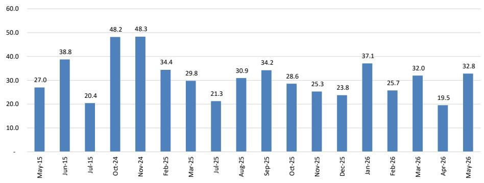

bar

| Month | Value |
|---|---|
| May-15 | 27.0 |
| Jun-15 | 38.8 |
| Jul-15 | 20.4 |
| Oct-24 | 48.2 |
| Nov-24 | 48.3 |
| Feb-25 | 34.4 |
| Mar-25 | 29.8 |
| Jul-25 | 21.3 |
| Aug-25 | 30.9 |
| Sep-25 | 34.2 |
| Oct-25 | 28.6 |
| Nov-25 | 25.3 |
| Dec-25 | 23.8 |
| Jan-26 | 37.1 |
| Feb-26 | 25.7 |
| Mar-26 | 32.0 |
| Apr-26 | 19.5 |
| May-26 | 32.8 |

Note: Small order refers to these below Rmb40,000.
Source: Wind, MS. Data as of May, 2026.

Exhibit 12: A-share total margin financing balance and MoM % – Another historical high in May with 7% m-m increase   
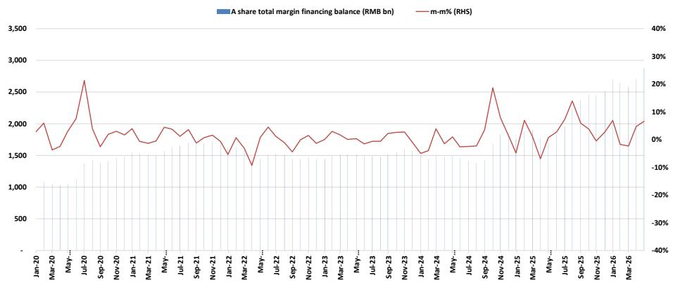

bar_line

| Month    | A share total margin financing balance (RMB bn) | m-m% (RHS) |
|----------|-----------------------------------------------|------------|
| Jan-20   | 1,000                                         | 0%         |
| Mar-20   | 1,500                                         | 5%         |
| May-20   | 1,750                                         | 10%        |
| Jul-20   | 2,750                                         | 20%        |
| Sep-20   | 1,750                                         | -5%        |
| Nov-20   | 1,875                                         | 5%         |
| Jan-21   | 1,750                                         | 0%         |
| Mar-21   | 1,900                                         | 5%         |
| May-21   | 1,875                                         | 5%         |
| Jul-21   | 1,750                                         | 5%         |
| Sep-21   | 1,875                                         | 5%         |
| Nov-21   | 1,750                                         | 5%         |
| Jan-22   | 1,500                                         | -5%        |
| Mar-22   | 1,375                                         | -10%       |
| May-22   | 1,900                                         | 5%         |
| Jul-22   | 1,750                                         | 0%         |
| Sep-22   | 1,875                                         | 5%         |
| Nov-22   | 1,750                                         | 5%         |
| Jan-23   | 1,875                                         | 5%         |
| Mar-23   | 1,750                                         | 5%         |
| May-23   | 1,875                                         | 5%         |
| Jul-23   | 1,750                                         | 5%         |
| Sep-23   | 1,875                                         | 5%         |
| Nov-23   | 1,750                                         | 5%         |
| Jan-24   | 1,500                                         | -5%        |
| Mar-24   | 1,900                                         | 5%         |
| May-24   | 1,750                                         | 0%         |
| Jul-24   | 1,875                                         | 5%         |
| Sep-24   | 2,600                                         | 15%        |
| Nov-24   | 1,875                                         | -5%        |
| Jan-25   | 1,500                                         | -10%       |
| Mar-25   | 1,900                                         | -5%        |
| May-25   | 1,750                                         | -10%       |
| Jul-25   | 2,375                                         | 10%        |
| Sep-25   | 1,875                                         | -5%        |
| Nov-25   | 1,750                                         | -10%       |
| Jan-26   | 1,875                                         | -5%        |
| Mar-26   | 2,875                                         | 5%         |

Source: CEIC, MS. Data as of May 2026.

# Domestic liquidity: High-net-worth individuals continued active participation

- Private fund AUM recorded a strong increase of Rmb386bn in May (vs.   
Rmb108bn in April), indicating sustained active participation from high-net-worth individuals (Exhibit 13).   
- Mutual fund AUM showed some divergence: oNshore equity funds (mostly ETFs) saw a material AUM decline of Rmb299bn in May, likely driven by National Team sell off, while onshore hybrid funds (mostly active funds) continued to record a steady AUM increase of Rmb49bn (Exhibit 14).

Exhibit 13: Onshore private equity funds AUM – Strong AUM increase indicates active HNWI participation in equity market   
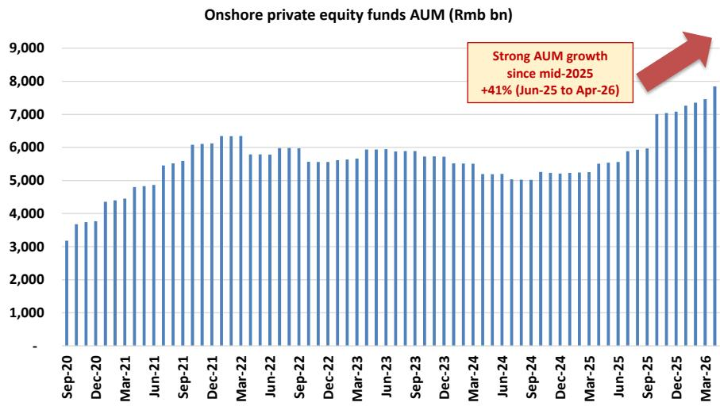

bar

Onshore private equity funds AUM (Rmb bn)
| Date | AUM (Rmb bn) |
|---|---|
| Sep-20 | 3200 |
| Dec-20 | 3700 |
| Mar-21 | 4400 |
| Jun-21 | 4800 |
| Sep-21 | 5500 |
| Dec-21 | 6100 |
| Mar-22 | 6300 |
| Jun-22 | 5800 |
| Sep-22 | 6000 |
| Dec-22 | 5600 |
| Mar-23 | 5900 |
| Jun-23 | 6000 |
| Sep-23 | 5900 |
| Dec-23 | 5700 |
| Mar-24 | 5500 |
| Jun-24 | 5200 |
| Sep-24 | 5100 |
| Dec-24 | 5300 |
| Mar-25 | 5400 |
| Jun-25 | 5600 |
| Sep-25 | 6000 |
| Dec-25 | 7100 |
| Mar-26 | 7800 |
Strong AUM growth since mid-2025 +41% (Jun-25 to Apr-26)

Source: Wind, MS. Data as of April 2026.

Exhibit 14: Onshore mutual funds AUM (equity and hybrid funds)   
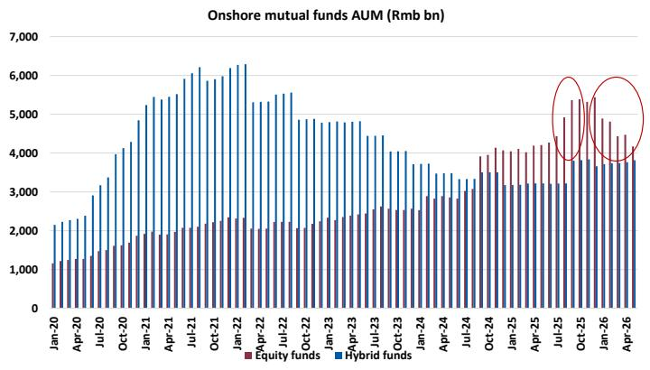

bar

| Month    | Equity funds | Hybrid funds |
| -------- | ------------ | ------------ |
| Jan-20   | 1,200        | 2,100        |
| Apr-20   | 1,300        | 2,300        |
| Jul-20   | 1,400        | 2,500        |
| Oct-20   | 1,600        | 2,800        |
| Jan-21   | 1,800        | 3,100        |
| Apr-21   | 2,000        | 3,400        |
| Jul-21   | 2,200        | 3,700        |
| Oct-21   | 2,400        | 4,000        |
| Jan-22   | 2,600        | 4,300        |
| Apr-22   | 2,800        | 4,600        |
| Jul-22   | 3,000        | 4,900        |
| Oct-22   | 3,200        | 5,200        |
| Jan-23   | 3,400        | 5,500        |
| Apr-23   | 3,600        | 5,800        |
| Jul-23   | 3,800        | 6,100        |
| Oct-23   | 4,000        | 6,400        |
| Jan-24   | 4,200        | 6,700        |
| Apr-24   | 4,400        | 7,000        |
| Jul-24   | 4,600        | 7,300        |
| Oct-24   | 4,800        | 7,600        |
| Jan-25   | 5,000        | 7,900        |
| Apr-25   | 5,200        | 8,200        |
| Jul-25   | 5,400        | 8,500        |
| Oct-25   | 5,600        | 8,800        |
| Jan-26   | 5,800        | 9,100        |
| Apr-26   | 6,000        | 9,400        |

Source: Wind, MS. Data as of May 2026.

Exhibit 15: Onshore mutual funds AUM (bond and money market funds)   
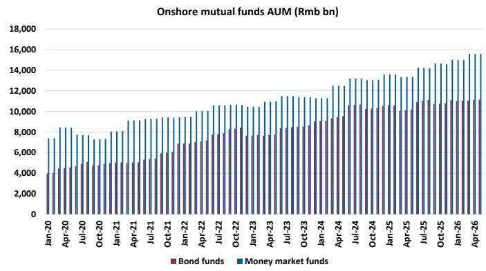

bar

| Month    | Bond funds | Money market funds |
| -------- | ---------- | ------------------ |
| Jan-20   | 4,000      | 7,500              |
| Apr-20   | 4,500      | 8,000              |
| Jul-20   | 5,000      | 8,500              |
| Oct-20   | 5,500      | 9,000              |
| Jan-21   | 6,000      | 9,500              |
| Apr-21   | 6,500      | 10,000             |
| Jul-21   | 7,000      | 10,500             |
| Oct-21   | 7,500      | 11,000             |
| Jan-22   | 8,000      | 11,500             |
| Apr-22   | 8,500      | 12,000             |
| Jul-22   | 9,000      | 12,500             |
| Oct-22   | 9,500      | 13,000             |
| Jan-23   | 10,000     | 13,500             |
| Apr-23   | 10,500     | 14,000             |
| Jul-23   | 11,000     | 14,500             |
| Oct-23   | 11,500     | 15,000             |
| Jan-24   | 12,000     | 15,500             |
| Apr-24   | 12,500     | 16,000             |
| Jul-24   | 13,000     | 16,500             |
| Oct-24   | 13,500     | 17,000             |
| Jan-25   | 14,000     | 17,500             |
| Apr-25   | 14,500     | 18,000             |
| Jul-25   | 15,000     | 18,500             |
| Oct-25   | 15,500     | 19,000             |
| Jan-26   | 16,000     | 19,500             |
| Apr-26   | 16,500     | 20,000             |

Source: Wind, MS. Data as of May 2026.

Exhibit 16: China onshore mutual funds AUM, 2014-YTD2026   
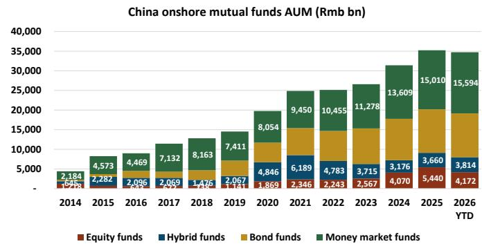

bar_stacked

China onshore mutual funds AUM (Rmb bn)
| Year | Equity funds (Rmb bn) | Hybrid funds (Rmb bn) | Bond funds (Rmb bn) | Money market funds (Rmb bn) |
|---|---|---|---|---|
| 2014 | 1,673 | 2,282 | 2,096 | 2,184 |
| 2015 | 2,031 | 2,282 | 2,096 | 4,573 |
| 2016 | 2,031 | 2,282 | 2,096 | 4,469 |
| 2017 | 2,031 | 2,282 | 2,096 | 7,132 |
| 2018 | 1,476 | 2,067 | 1,476 | 8,163 |
| 2019 | 1,141 | 2,067 | 1,141 | 7,411 |
| 2020 | 1,869 | 4,846 | 4,846 | 8,054 |
| 2021 | 2,346 | 6,189 | 6,189 | 9,450 |
| 2022 | 2,243 | 4,783 | 4,783 | 10,455 |
| 2023 | 2,567 | 3,715 | 3,715 | 11,278 |
| 2024 | 4,070 | 3,176 | 3,176 | 13,609 |
| 2025 | 5,440 | 3,660 | 3,660 | 15,010 |
| YTD | 4,172 | 3,814 | 3,814 | 15,594 |

Source: Wind, MS. Data as of May 2026.

Exhibit 17: China onshore mutual funds AUM net increase, 2014-YTD2026   
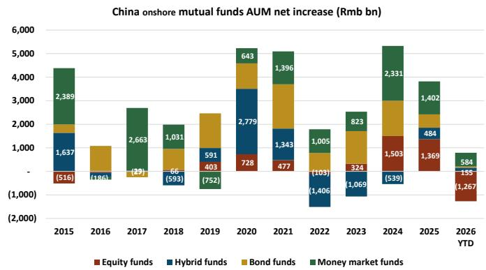

bar_stacked

China onshore mutual funds AUM net increase (Rmb bn)
| Year | Equity funds (Rmb bn) | Hybrid funds (Rmb bn) | Bond funds (Rmb bn) | Money market funds (Rmb bn) |
|---|---|---|---|---|
| 2015 | -516 | 1,637 | -49 | 2,389 |
| 2016 | -186 | -186 | - | - |
| 2017 | -29 | - | - | 2,663 |
| 2018 | -593 | 66 | 66 | 1,031 |
| 2019 | 403 | 591 | - | - |
| 2020 | 728 | 2,779 | - | 643 |
| 2021 | 477 | 1,343 | - | 1,396 |
| 2022 | -1,406 | -103 | - | 1,005 |
| 2023 | 324 | 1,069 | - | 823 |
| 2024 | 539 | -539 | - | 2,331 |
| 2025 | 1,369 | 484 | - | 1,402 |
| YTD | -1,267 | -155 | - | 584 |

Source: Wind, MS. Data as of May 2026.

# Northbound proxy: Foreign passive inflows into A-shares continued in May

The northbound net flow daily data disclosure was terminated as of August 19, 2024. As an alternative, we look at foreign passive funds flow to CSI 300 as it shows a good correlation with northbound net flow historically.

Foreign passive funds tracking CSI 300 continued to record net inflows in May, following the first turn to inflows in April since 2026, signaling renewed foreign investor interest in A-shares.

Exhibit 18: Proxy of northbound net flow – foreign-domiciled passive funds flow to CSI 300   
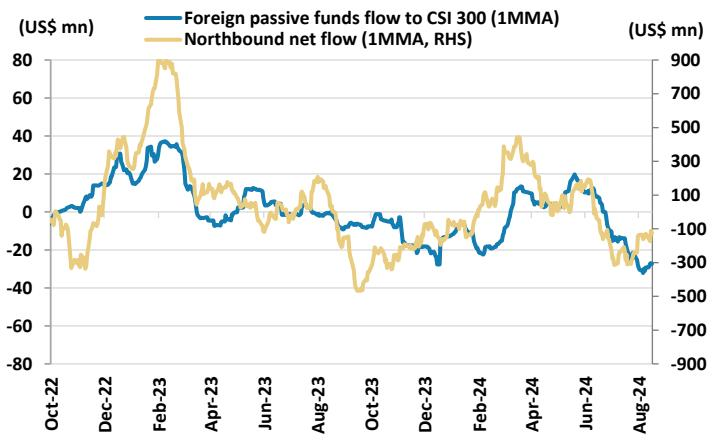

line

| Date   | Foreign passive funds flow to CSI 300 (1MMA) | Northbound net flow (1MMA, RHS) |
|--------|-----------------------------------------------|--------------------------------|
| Oct-22 | ~0                                            | ~0                             |
| Dec-22 | ~20                                           | ~300                           |
| Feb-23 | ~40                                           | ~800                           |
| Apr-23 | ~10                                           | ~100                           |
| Jun-23 | ~15                                           | ~150                           |
| Aug-23 | ~5                                            | ~200                           |
| Oct-23 | ~-10                                          | ~-500                          |
| Dec-23 | ~-20                                          | ~-100                          |
| Feb-24 | ~-10                                          | ~400                           |
| Apr-24 | ~15                                           | ~100                           |
| Jun-24 | ~20                                           | ~150                           |
| Aug-24 | ~-30                                          | ~-100                          |

Source: EPFR, MS. Note: Data as of August 16, 2024.

Exhibit 19: Cumulative fund flows in CSI 300 by foreign-domiciled passive funds   
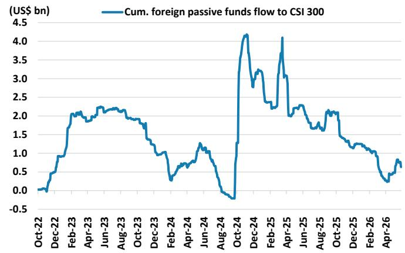

line

| Date    | Cum. foreign passive funds flow to CSI 300 (US$ bn) |
|---------|--------------------------------------------------|
| Oct-22  | 0.0                                              |
| Dec-22  | 1.0                                              |
| Feb-23  | 2.0                                              |
| Apr-23  | 2.1                                              |
| Jun-23  | 2.2                                              |
| Aug-23  | 2.1                                              |
| Oct-23  | 1.8                                              |
| Dec-23  | 1.0                                              |
| Feb-24  | 0.5                                              |
| Apr-24  | 1.0                                              |
| Jun-24  | 1.3                                              |
| Aug-24  | -0.5                                             |
| Oct-24  | 4.0                                              |
| Dec-24  | 3.0                                              |
| Feb-25  | 2.5                                              |
| Apr-25  | 4.0                                              |
| Jun-25  | 2.0                                              |
| Aug-25  | 1.8                                              |
| Oct-25  | 2.0                                              |
| Dec-25  | 1.5                                              |
| Feb-26  | 1.0                                              |
| Apr-26  | 0.5                                              |

Source: EPFR, MS. Note: Data as of May 31, 2026.

# Fund Positions Changes vs. Last Month – Top 50 Mutual Fund Holdings

Exhibit 20: Top 50 China/HK holdings among long-only EM and China active managers vs. last month 

<table><tr><td>Ticker</td><td>Company Name</td><td>GICS Industry Group</td></tr><tr><td>700-HK</td><td>Tencent Holdings</td><td>Media &amp; Entertainment</td></tr><tr><td>9988-HK</td><td>Alibaba Group Holding</td><td>Consumer Discretionary Distribution &amp; Retail</td></tr><tr><td>300750-CN</td><td>Contemporary Amperex Technology</td><td>Capital Goods</td></tr><tr><td>2318-HK</td><td>Ping An Insurance Group</td><td>Insurance</td></tr><tr><td>939-HK</td><td>China Construction Bank</td><td>Banks</td></tr><tr><td>1299-HK</td><td>AIA Group</td><td>Insurance</td></tr><tr><td>9999-HK</td><td>NetEase</td><td>Media &amp; Entertainment</td></tr><tr><td>2899-HK</td><td>Zijin Mining Group</td><td>Materials</td></tr><tr><td>3968-HK</td><td>China Merchants Bank</td><td>Banks</td></tr><tr><td>688008-CN</td><td>Montage Technology</td><td>Semiconductors &amp; Semiconductor Equipment</td></tr><tr><td>PDD-US</td><td>PDD Holdings</td><td>Consumer Discretionary Distribution &amp; Retail</td></tr><tr><td>1211-HK</td><td>BYD</td><td>Automobiles &amp; Components</td></tr><tr><td>000333-CN</td><td>Midea Group</td><td>Consumer Durables &amp; Apparel</td></tr><tr><td>HTHT-US</td><td>H World Group</td><td>Consumer Services</td></tr><tr><td>600519-CN</td><td>Kweichow Moutai</td><td>Food Beverage &amp; Tobacco</td></tr><tr><td>002028-CN</td><td>Sieyuan Electric</td><td>Capital Goods</td></tr><tr><td>300124-CN</td><td>Shenzhen Inovance Technology</td><td>Capital Goods</td></tr><tr><td>2359-HK</td><td>WuXi AppTec</td><td>Pharmaceuticals Biotechnology &amp; Life Sciences</td></tr><tr><td>300308-CN</td><td>Zhongji Innolight</td><td>Technology Hardware &amp; Equipment</td></tr><tr><td>2338-HK</td><td>Weichai Power</td><td>Capital Goods</td></tr><tr><td>2628-HK</td><td>China Life Insurance</td><td>Insurance</td></tr><tr><td>992-HK</td><td>Lenovo Group</td><td>Technology Hardware &amp; Equipment</td></tr><tr><td>9888-HK</td><td>Baidu</td><td>Media &amp; Entertainment</td></tr><tr><td>1398-HK</td><td>Industrial and Commercial Bank of China</td><td>Banks</td></tr><tr><td>002371-CN</td><td>NAURA Technology Group</td><td>Semiconductors &amp; Semiconductor Equipment</td></tr><tr><td>2328-HK</td><td>PICC Property &amp; Casualty</td><td>Insurance</td></tr><tr><td>9961-HK</td><td>Trip.com Group</td><td>Consumer Services</td></tr><tr><td>857-HK</td><td>PetroChina</td><td>Energy</td></tr><tr><td>600660-CN</td><td>Fuyao Glass Industry Grp</td><td>Automobiles &amp; Components</td></tr><tr><td>388-HK</td><td>Hong Kong Exchanges &amp; Clearing</td><td>Financial Services</td></tr><tr><td>YMM-US</td><td>Full Truck Alln</td><td>Transportation</td></tr><tr><td>1810-HK</td><td>Xiaomi</td><td>Technology Hardware &amp; Equipment</td></tr><tr><td>669-HK</td><td>Techtronic Industries</td><td>Capital Goods</td></tr><tr><td>3690-HK</td><td>Meituan</td><td>Consumer Services</td></tr><tr><td>600031-CN</td><td>Sany Heavy Industry</td><td>Capital Goods</td></tr><tr><td>1109-HK</td><td>China Resources Land</td><td>Real Estate Management &amp; Development</td></tr><tr><td>3692-HK</td><td>Hansoh Pharmaceutical Group</td><td>Pharmaceuticals Biotechnology &amp; Life Sciences</td></tr><tr><td>2020-HK</td><td>ANTA Sports Products</td><td>Consumer Durables &amp; Apparel</td></tr><tr><td>688012-CN</td><td>Advanced Micro-Fabrication Equipment</td><td>Semiconductors &amp; Semiconductor Equipment</td></tr><tr><td>600690-CN</td><td>Haier Smart Home</td><td>Consumer Durables &amp; Apparel</td></tr><tr><td>1801-HK</td><td>Innovent Biologics</td><td>Pharmaceuticals Biotechnology &amp; Life Sciences</td></tr><tr><td>6160-HK</td><td>BeOne Medicines</td><td>Pharmaceuticals Biotechnology &amp; Life Sciences</td></tr><tr><td>BZ-US</td><td>Kanzhun</td><td>Commercial &amp; Professional Services</td></tr><tr><td>600276-CN</td><td>Jiangsu Hengrui Pharmaceuticals</td><td>Pharmaceuticals Biotechnology &amp; Life Sciences</td></tr><tr><td>002463-CN</td><td>Wus Printed Circuit</td><td>Technology Hardware &amp; Equipment</td></tr><tr><td>386-HK</td><td>China Petroleum Chemical</td><td>Energy</td></tr><tr><td>2259-HK</td><td>Zijin Gold International</td><td>Materials</td></tr><tr><td>300274-CN</td><td>Sungrow Power Supply</td><td>Capital Goods</td></tr><tr><td>TME-US</td><td>Tencent Music Entertainment</td><td>Media &amp; Entertainment</td></tr><tr><td>291-HK</td><td>China Resources Beer (Holdings)</td><td>Food Beverage &amp; Tobacco</td></tr></table>

<table><tr><td colspan="4">International &amp; US Funds</td><td colspan="3">International Funds - UCITS</td><td colspan="3">US Funds</td></tr><tr><td>Portfolio Composite Weights</td><td>MSCI China Index Weights</td><td>Active Weights</td><td>Active Wgt. Changes vs. last month</td><td>Portfolio Composite Weights</td><td>Active Weights</td><td>Active Wgt. Changes vs. last month</td><td>Portfolio Composite Weights</td><td>Active Weights</td><td>Active Wgt. Changes vs. last month</td></tr><tr><td>13.4%</td><td>14.2%</td><td>-0.7%</td><td>-0.1%</td><td>10.7%</td><td>-3.4%</td><td>0.2%</td><td>16.5%</td><td>2.4%</td><td>-0.4%</td></tr><tr><td>9.1%</td><td>10.3%</td><td>-1.2%</td><td>-0.6%</td><td>8.1%</td><td>-2.1%</td><td>-0.6%</td><td>10.1%</td><td>0.1%</td><td>-0.6%</td></tr><tr><td>4.7%</td><td>0.9%</td><td>3.8%</td><td>0.2%</td><td>4.6%</td><td>3.7%</td><td>0.0%</td><td>4.8%</td><td>3.9%</td><td>0.4%</td></tr><tr><td>3.4%</td><td>2.2%</td><td>1.2%</td><td>0.0%</td><td>3.4%</td><td>1.2%</td><td>0.0%</td><td>3.4%</td><td>1.2%</td><td>0.1%</td></tr><tr><td>3.4%</td><td>4.1%</td><td>-0.7%</td><td>-0.1%</td><td>2.4%</td><td>-1.7%</td><td>-0.1%</td><td>4.4%</td><td>0.3%</td><td>0.0%</td></tr><tr><td>2.9%</td><td>0.0%</td><td>2.9%</td><td>0.1%</td><td>2.5%</td><td>2.5%</td><td>0.1%</td><td>3.4%</td><td>3.4%</td><td>0.1%</td></tr><tr><td>2.0%</td><td>1.5%</td><td>0.5%</td><td>0.3%</td><td>2.3%</td><td>0.8%</td><td>0.2%</td><td>1.7%</td><td>0.2%</td><td>0.3%</td></tr><tr><td>1.8%</td><td>1.2%</td><td>0.6%</td><td>0.0%</td><td>1.4%</td><td>0.1%</td><td>-0.1%</td><td>2.3%</td><td>1.1%</td><td>0.0%</td></tr><tr><td>1.7%</td><td>1.1%</td><td>0.6%</td><td>0.0%</td><td>2.1%</td><td>1.0%</td><td>0.0%</td><td>1.2%</td><td>0.1%</td><td>0.0%</td></tr><tr><td>1.6%</td><td>0.1%</td><td>1.6%</td><td>0.6%</td><td>1.7%</td><td>1.6%</td><td>0.7%</td><td>1.6%</td><td>1.5%</td><td>0.6%</td></tr><tr><td>1.5%</td><td>2.6%</td><td>-1.2%</td><td>0.0%</td><td>1.6%</td><td>-1.0%</td><td>-0.1%</td><td>1.3%</td><td>-1.3%</td><td>0.0%</td></tr><tr><td>1.4%</td><td>2.0%</td><td>0.6%</td><td>0.2%</td><td>0.6%</td><td>-1.3%</td><td>0.1%</td><td>2.2%</td><td>0.3%</td><td>-0.2%</td></tr><tr><td>1.3%</td><td>0.3%</td><td>1.1%</td><td>0.0%</td><td>1.3%</td><td>-1.1%</td><td>0.0%</td><td>1.3%</td><td>1.1%</td><td>0.0%</td></tr><tr><td>1.2%</td><td>0.4%</td><td>0.8%</td><td>-0.2%</td><td>1.0%</td><td>0.6%</td><td>-0.1%</td><td>1.4%</td><td>1.0%</td><td>-0.3%</td></tr><tr><td>1.2%</td><td>0.6%</td><td>0.6%</td><td>0.0%</td><td>1.3%</td><td>0.7%</td><td>0.0%</td><td>1.1%</td><td>0.5%</td><td>0.0%</td></tr><tr><td>1.1%</td><td>0.0%</td><td>1.1%</td><td>0.0%</td><td>0.9%</td><td>0.9%</td><td>0.0%</td><td>1.3%</td><td>1.3%</td><td>0.0%</td></tr><tr><td>1.1%</td><td>0.0%</td><td>1.1%</td><td>0.2%</td><td>0.8%</td><td>0.8%</td><td>0.2%</td><td>1.4%</td><td>1.4%</td><td>0.3%</td></tr><tr><td>1.0%</td><td>0.3%</td><td>0.7%</td><td>-0.1%</td><td>0.6%</td><td>0.3%</td><td>-0.1%</td><td>1.5%</td><td>1.2%</td><td>-0.1%</td></tr><tr><td>0.9%</td><td>0.3%</td><td>0.6%</td><td>0.2%</td><td>1.0%</td><td>0.7%</td><td>0.3%</td><td>0.7%</td><td>0.4%</td><td>0.1%</td></tr><tr><td>0.8%</td><td>0.4%</td><td>0.4%</td><td>0.0%</td><td>0.7%</td><td>0.3%</td><td>0.0%</td><td>1.0%</td><td>0.6%</td><td>0.0%</td></tr><tr><td>0.8%</td><td>1.0%</td><td>-0.3%</td><td>0.0%</td><td>0.4%</td><td>-0.7%</td><td>-0.1%</td><td>1.3%</td><td>0.2%</td><td>0.0%</td></tr><tr><td>0.8%</td><td>0.4%</td><td>0.3%</td><td>0.3%</td><td>0.4%</td><td>0.0%</td><td>0.2%</td><td>1.2%</td><td>0.8%</td><td>0.4%</td></tr><tr><td>0.8%</td><td>1.3%</td><td>-0.5%</td><td>0.0%</td><td>0.7%</td><td>-0.5%</td><td>0.0%</td><td>0.8%</td><td>0.4%</td><td>0.0%</td></tr><tr><td>0.7%</td><td>2.3%</td><td>-1.6%</td><td>0.0%</td><td>1.0%</td><td>-1.3%</td><td>-0.1%</td><td>0.5%</td><td>-1.9%</td><td>0.1%</td></tr><tr><td>0.7%</td><td>0.1%</td><td>0.6%</td><td>0.1%</td><td>0.7%</td><td>0.6%</td><td>0.1%</td><td>0.8%</td><td>0.6%</td><td>0.1%</td></tr><tr><td>0.7%</td><td>0.5%</td><td>0.3%</td><td>0.1%</td><td>0.6%</td><td>0.1%</td><td>0.1%</td><td>0.9%</td><td>0.5%</td><td>0.1%</td></tr><tr><td>0.7%</td><td>1.2%</td><td>-0.5%</td><td>-0.1%</td><td>1.0%</td><td>-0.3%</td><td>-0.2%</td><td>0.4%</td><td>-0.8%</td><td>-0.1%</td></tr><tr><td>0.7%</td><td>1.3%</td><td>-0.6%</td><td>0.0%</td><td>0.7%</td><td>-0.6%</td><td>-0.1%</td><td>0.8%</td><td>-0.5%</td><td>0.1%</td></tr><tr><td>0.7%</td><td>0.2%</td><td>0.5%</td><td>-0.1%</td><td>0.9%</td><td>-0.7%</td><td>-0.1%</td><td>0.4%</td><td>-0.2%</td><td>-0.1%</td></tr><tr><td>0.7%</td><td>0.0%</td><td>0.7%</td><td>0.0%</td><td>0.7%</td><td>-0.7%</td><td>0.0%</td><td>0.6%</td><td>-0.6%</td><td>0.0%</td></tr><tr><td>0.6%</td><td>0.0%</td><td>0.6%</td><td>0.0%</td><td>0.7%</td><td>-0.7%</td><td>0.0%</td><td>0.5%</td><td>-0.5%</td><td>0.0%</td></tr><tr><td>0.6%</td><td>2.4%</td><td>-1.8%</td><td>0.3%</td><td>0.7%</td><td>-1.7%</td><td>0.2%</td><td>0.5%</td><td>-1.8%</td><td>0.4%</td></tr><tr><td>0.6%</td><td>0.0%</td><td>0.6%</td><td>0.0%</td><td>0.5%</td><td>-0.5%</td><td>0.0%</td><td>0.7%</td><td>-0.7%</td><td>0.0%</td></tr><tr><td>0.6%</td><td>2.0%</td><td>-1.4%</td><td>-0.2%</td><td>0.7%</td><td>-1.3%</td><td>0.0%</td><td>0.5%</td><td>-1.5%</td><td>-0.5%</td></tr><tr><td>0.6%</td><td>0.1%</td><td>0.5%</td><td>0.0%</td><td>0.5%</td><td>-0.4%</td><td>0.0%</td><td>0.7%</td><td>-0.6%</td><td>-0.1%</td></tr><tr><td>0.6%</td><td>0.5%</td><td>0.1%</td><td>0.0%</td><td>0.6%</td><td>-0.1%</td><td>0.0%</td><td>0.5%</td><td>-0.0%</td><td>0.0%</td></tr><tr><td>0.6%</td><td>0.3%</td><td>0.3%</td><td>-0.1%</td><td>0.3%</td><td>-0.0%</td><td>-0.1%</td><td>0.9%</td><td>-0.7%</td><td>-0.2%</td></tr><tr><td>0.5%</td><td>0.5%</td><td>0.1%</td><td>0.0%</td><td>0.7%</td><td>-0.2%</td><td>0.0%</td><td>0.3%</td><td>-0.1%</td><td>0.0%</td></tr><tr><td>0.5%</td><td>0.1%</td><td>0.5%</td><td>-0.1%</td><td>0.5%</td><td>-0.4%</td><td>-0.1%</td><td>0.6%</td><td>-0.5%</td><td>-0.1%</td></tr><tr><td>0.5%</td><td>0.3%</td><td>0.2%</td><td>0.0%</td><td>0.5%</td><td>-0.2%</td><td>0.0%</td><td>0.5%</td><td>-0.2%</td><td>0.0%</td></tr><tr><td>0.5%</td><td>0.6%</td><td>-0.1%</td><td>0.0%</td><td>0.5%</td><td>-0.1%</td><td>0.0%</td><td>0.4%</td><td>-0.2%</td><td>0.0%</td></tr><tr><td>0.5%</td><td>0.7%</td><td>-0.2%</td><td>0.1%</td><td>0.3%</td><td>-0.4%</td><td>0.0%</td><td>0.6%</td><td>-0.1%</td><td>0.1%</td></tr><tr><td>0.5%</td><td>0.2%</td><td>0.3%</td><td>0.0%</td><td>0.5%</td><td>-0.3%</td><td>0.0%</td><td>0.4%</td><td>-0.2%</td><td>0.0%</td></tr><tr><td>0.4%</td><td>0.1%</td><td>0.3%</td><td>0.0%</td><td>0.6%</td><td>-0.5%</td><td>0.0%</td><td>0.3%</td><td>-0.2%</td><td>0.0%</td></tr><tr><td>0.4%</td><td>0.1%</td><td>0.4%</td><td>0.1%</td><td>0.5%</td><td>-0.5%</td><td>0.1%</td><td>0.3%</td><td>-0.2%</td><td>0.1%</td></tr><tr><td>0.4%</td><td>0.6%</td><td>-0.1%</td><td>-0.1%</td><td>0.1%</td><td>-0.4%</td><td>0.0%</td><td>0.7%</td><td>-0.2%</td><td>-0.2%</td></tr><tr><td>0.4%</td><td>0.2%</td><td>0.2%</td><td>0.0%</td><td>0.4%</td><td>-0.3%</td><td>-0.1%</td><td>0.4%</td><td>-0.2%</td><td>0.0%</td></tr><tr><td>0.4%</td><td>0.1%</td><td>0.3%</td><td>0.1%</td><td>0.6%</td><td>-0.6%</td><td>-0.2%</td><td>0.1%</td><td>-0.0%</td><td>0.0%</td></tr><tr><td>0.4%</td><td>0.2%</td><td>0.2%</td><td>0.0%</td><td>0.3%</td><td>-0.1%</td><td>0.0%</td><td>0.5%</td><td>-0.3%</td><td>-0.1%</td></tr><tr><td>0.4%</td><td>0.2%</td><td>0.2%</td><td>0.0%</td><td>0.2%</td><td>-0.0%</td><td>0.0%</td><td>0.5%</td><td>-0.3%</td><td>-0.1%</td></tr></table>

Source: MorningStar, FactSet, MS. Note: Data as of May 31, 2026, most funds have disclosed position data up to April 30. Please contact us if you would like to receive the full table. Our fund positioning database methodology is described in section - Methodology of Our Fund Analysis. For important disclosures regarding companies that are the subject of this screen, please see the MS Disclosure Website at www.morganstanley.com/researchdisclosures.

# Fund Positions QTD Changes – Top 50 Mutual Fund Holdings

Exhibit 21: Top 50 China/HK holdings among long-only EM and China active managers vs. last quarter 

<table><tr><td rowspan="2">Ticker</td><td rowspan="2">Company Name</td><td rowspan="2">GICS Industry Group</td><td colspan="4">International &amp; US Funds</td><td colspan="3">International Funds - UCITS</td><td colspan="3">US Funds</td></tr><tr><td>Portfolio Composite Weights</td><td>MSCI China Index Weights</td><td>Active Weights</td><td>Active Wgt. Changes QTD</td><td>Portfolio Composite Weights</td><td>Active Weights</td><td>Active Wgt. Changes QTD</td><td>Portfolio Composite Weights</td><td>Active Weights</td><td>Active Wgt. Changes QTD</td></tr><tr><td>700-HK</td><td>Tencent Holdings</td><td>Media &amp; Entertainment</td><td>13.4%</td><td>14.2%</td><td>-0.7%</td><td>-0.1%</td><td>10.7%</td><td>-3.4%</td><td>0.2%</td><td>16.5%</td><td>2.4%</td><td>-0.4%</td></tr><tr><td>9988-HK</td><td>Alibaba Group Holding</td><td>Consumer Discretionary Distribution &amp; Retail</td><td>9.1%</td><td>10.3%</td><td>-1.2%</td><td>-0.6%</td><td>8.1%</td><td>-2.1%</td><td>-0.6%</td><td>10.1%</td><td>-0.1%</td><td>-0.6%</td></tr><tr><td>300750-CN</td><td>Contemporary Amperex Technology</td><td>Capital Goods</td><td>4.7%</td><td>0.9%</td><td>3.8%</td><td>0.2%</td><td>4.6%</td><td>3.7%</td><td>0.0%</td><td>4.8%</td><td>3.9%</td><td>0.4%</td></tr><tr><td>2318-HK</td><td>Ping An Insurance Group</td><td>Insurance</td><td>3.4%</td><td>2.2%</td><td>1.2%</td><td>0.0%</td><td>3.4%</td><td>1.2%</td><td>0.0%</td><td>3.4%</td><td>1.2%</td><td>0.1%</td></tr><tr><td>939-HK</td><td>China Construction Bank</td><td>Banks</td><td>3.4%</td><td>4.1%</td><td>-0.7%</td><td>-0.1%</td><td>2.4%</td><td>-1.7%</td><td>-0.1%</td><td>4.4%</td><td>0.3%</td><td>0.0%</td></tr><tr><td>1299-HK</td><td>AIA Group</td><td>Insurance</td><td>2.9%</td><td>0.0%</td><td>2.9%</td><td>0.1%</td><td>2.5%</td><td>2.5%</td><td>0.1%</td><td>3.4%</td><td>3.4%</td><td>0.1%</td></tr><tr><td>9999-HK</td><td>NetEase</td><td>Media &amp; Entertainment</td><td>2.0%</td><td>1.5%</td><td>0.5%</td><td>0.3%</td><td>2.3%</td><td>0.8%</td><td>0.2%</td><td>1.7%</td><td>0.2%</td><td>0.3%</td></tr><tr><td>2899-HK</td><td>Zijin Mining Group</td><td>Materials</td><td>1.8%</td><td>1.2%</td><td>0.6%</td><td>0.0%</td><td>1.4%</td><td>0.1%</td><td>-0.1%</td><td>2.3%</td><td>1.1%</td><td>0.0%</td></tr><tr><td>3968-HK</td><td>China Merchants Bank</td><td>Banks</td><td>1.7%</td><td>1.1%</td><td>0.6%</td><td>0.0%</td><td>2.1%</td><td>1.0%</td><td>0.0%</td><td>1.2%</td><td>0.1%</td><td>0.0%</td></tr><tr><td>688008-CN</td><td>Montage Technology</td><td>Semiconductors &amp; Semiconductor Equipment</td><td>1.6%</td><td>0.1%</td><td>1.6%</td><td>0.6%</td><td>1.7%</td><td>1.6%</td><td>0.7%</td><td>1.6%</td><td>1.5%</td><td>0.6%</td></tr><tr><td>PDD-US</td><td>PDD Holdings</td><td>Consumer Discretionary Distribution &amp; Retail</td><td>1.5%</td><td>2.6%</td><td>-1.2%</td><td>0.0%</td><td>1.6%</td><td>-1.0%</td><td>-0.1%</td><td>1.3%</td><td>-1.3%</td><td>0.0%</td></tr><tr><td>1211-HK</td><td>BYD</td><td>Automobiles &amp; Components</td><td>1.4%</td><td>2.0%</td><td>-0.6%</td><td>0.2%</td><td>0.6%</td><td>-1.3%</td><td>0.1%</td><td>2.2%</td><td>0.3%</td><td>0.2%</td></tr><tr><td>000333-CN</td><td>Midea Group</td><td>Consumer Durables &amp; Apparel</td><td>1.3%</td><td>0.3%</td><td>1.1%</td><td>0.0%</td><td>1.3%</td><td>1.1%</td><td>0.0%</td><td>1.3%</td><td>1.1%</td><td>0.0%</td></tr><tr><td>HTHT-US</td><td>H World Group</td><td>Consumer Services</td><td>1.2%</td><td>0.4%</td><td>0.8%</td><td>-0.2%</td><td>1.0%</td><td>0.6%</td><td>-0.1%</td><td>1.4%</td><td>1.0%</td><td>-0.3%</td></tr><tr><td>600519-CN</td><td>Kweichow Moutai</td><td>Food Beverage &amp; Tobacco</td><td>1.2%</td><td>0.6%</td><td>0.6%</td><td>0.0%</td><td>1.3%</td><td>0.7%</td><td>0.0%</td><td>1.1%</td><td>0.5%</td><td>0.0%</td></tr><tr><td>002028-CN</td><td>Sieyuan Electric</td><td>Capital Goods</td><td>1.1%</td><td>0.0%</td><td>1.1%</td><td>0.0%</td><td>0.9%</td><td>0.9%</td><td>0.0%</td><td>1.3%</td><td>1.3%</td><td>0.0%</td></tr><tr><td>300124-CN</td><td>Shenzhen Inovance Technology</td><td>Capital Goods</td><td>1.1%</td><td>0.0%</td><td>1.1%</td><td>0.2%</td><td>0.8%</td><td>0.8%</td><td>0.2%</td><td>1.4%</td><td>1.4%</td><td>0.3%</td></tr><tr><td>2359-HK</td><td>WuXi AppTec</td><td>Pharmaceuticals Biotechnology &amp; Life Sciences</td><td>1.0%</td><td>0.3%</td><td>0.7%</td><td>-0.1%</td><td>0.6%</td><td>0.3%</td><td>-0.1%</td><td>1.5%</td><td>1.2%</td><td>0.1%</td></tr><tr><td>300308-CN</td><td>Zhongji Innolight</td><td>Technology Hardware &amp; Equipment</td><td>0.9%</td><td>0.3%</td><td>0.6%</td><td>0.2%</td><td>1.0%</td><td>0.7%</td><td>0.3%</td><td>0.7%</td><td>0.4%</td><td>0.1%</td></tr><tr><td>2338-HK</td><td>Weichai Power</td><td>Capital Goods</td><td>0.8%</td><td>0.4%</td><td>0.4%</td><td>0.0%</td><td>0.7%</td><td>0.3%</td><td>0.0%</td><td>1.0%</td><td>0.6%</td><td>0.0%</td></tr><tr><td>2628-HK</td><td>China Life Insurance</td><td>Insurance</td><td>0.8%</td><td>1.0%</td><td>-0.3%</td><td>0.0%</td><td>0.4%</td><td>-0.7%</td><td>-0.1%</td><td>1.3%</td><td>0.2%</td><td>0.0%</td></tr><tr><td>992-HK</td><td>Lenovo Group</td><td>Technology Hardware &amp; Equipment</td><td>0.8%</td><td>0.4%</td><td>0.3%</td><td>0.3%</td><td>0.4%</td><td>0.0%</td><td>0.2%</td><td>1.2%</td><td>0.8%</td><td>0.4%</td></tr><tr><td>9888-HK</td><td>Baidu</td><td>Media &amp; Entertainment</td><td>0.8%</td><td>1.3%</td><td>-0.5%</td><td>0.0%</td><td>0.7%</td><td>-0.5%</td><td>0.0%</td><td>0.8%</td><td>-0.4%</td><td>0.0%</td></tr><tr><td>1398-HK</td><td>Industrial and Commercial Bank of China Banks</td><td>Banks</td><td>0.7%</td><td>2.3%</td><td>-1.6%</td><td>0.0%</td><td>1.0%</td><td>-1.3%</td><td>-0.1%</td><td>0.5%</td><td>-1.9%</td><td>0.1%</td></tr><tr><td>002371-CN</td><td>NAURA Technology Group</td><td>Semiconductors &amp; Semiconductor Equipment</td><td>0.7%</td><td>0.1%</td><td>0.6%</td><td>0.1%</td><td>0.7%</td><td>0.6%</td><td>0.1%</td><td>0.8%</td><td>0.6%</td><td>0.1%</td></tr><tr><td>2328-HK</td><td>PICC Property &amp; Casualty</td><td>Insurance</td><td>0.7%</td><td>0.5%</td><td>0.3%</td><td>0.1%</td><td>0.6%</td><td>0.1%</td><td>0.1%</td><td>0.9%</td><td>0.5%</td><td>0.1%</td></tr><tr><td>9961-HK</td><td>Trip.com Group</td><td>Consumer Services</td><td>0.7%</td><td>1.2%</td><td>-0.5%</td><td>-0.1%</td><td>1.0%</td><td>-0.3%</td><td>-0.2%</td><td>0.4%</td><td>-0.8%</td><td>-0.1%</td></tr><tr><td>857-HK</td><td>PetroChina</td><td>Energy</td><td>0.7%</td><td>1.3%</td><td>-0.6%</td><td>0.0%</td><td>0.7%</td><td>-0.6%</td><td>-0.1%</td><td>0.8%</td><td>-0.5%</td><td>0.1%</td></tr><tr><td>600660-CN</td><td>Fuyao Glass Industry Grp</td><td>Automobiles &amp; Components</td><td>0.7%</td><td>0.2%</td><td>0.5%</td><td>-0.1%</td><td>0.9%</td><td>0.7%</td><td>-0.1%</td><td>0.4%</td><td>0.2%</td><td>-0.1%</td></tr><tr><td>388-HK</td><td>Hong Kong Exchanges &amp; Clearing</td><td>Financial Services</td><td>0.7%</td><td>0.0%</td><td>0.7%</td><td>0.0%</td><td>0.7%</td><td>0.7%</td><td>0.0%</td><td>0.6%</td><td>0.6%</td><td>0.0%</td></tr><tr><td>YMM-US</td><td>Full Truck Alln</td><td>Transportation</td><td>0.6%</td><td>0.0%</td><td>0.6%</td><td>0.0%</td><td>0.7%</td><td>0.7%</td><td>0.0%</td><td>0.5%</td><td>0.5%</td><td>0.0%</td></tr><tr><td>1810-HK</td><td>Xiaomi</td><td>Technology Hardware &amp; Equipment</td><td>0.6%</td><td>2.4%</td><td>-1.8%</td><td>0.3%</td><td>0.7%</td><td>-1.7%</td><td>#N/A</td><td>0.5%</td><td>-1.8%</td><td>0.4%</td></tr><tr><td>669-HK</td><td>Techtronic Industries</td><td>Capital Goods</td><td>0.6%</td><td>0.0%</td><td>0.6%</td><td>0.0%</td><td>0.5%</td><td>0.5%</td><td>0.0%</td><td>0.7%</td><td>0.7%</td><td>0.0%</td></tr><tr><td>3690-HK</td><td>Meituan</td><td>Consumer Services</td><td>0.6%</td><td>2.0%</td><td>-1.4%</td><td>-0.2%</td><td>0.7%</td><td>-1.3%</td><td>0.0%</td><td>0.5%</td><td>-1.5%</td><td>-0.5%</td></tr><tr><td>600031-CN</td><td>Sany Heavy Industry</td><td>Capital Goods</td><td>0.6%</td><td>0.1%</td><td>0.5%</td><td>0.0%</td><td>0.5%</td><td>0.4%</td><td>0.0%</td><td>0.7%</td><td>0.6%</td><td>-0.1%</td></tr><tr><td>1109-HK</td><td>China Resources Land</td><td>Real Estate Management &amp; Development</td><td>0.6%</td><td>0.5%</td><td>0.1%</td><td>0.0%</td><td>0.6%</td><td>0.1%</td><td>0.0%</td><td>0.5%</td><td>0.0%</td><td>0.0%</td></tr><tr><td>3692-HK</td><td>Hansoh Pharmaceutical Group</td><td>Pharmaceuticals Biotechnology &amp; Life Sciences</td><td>0.6%</td><td>0.3%</td><td>0.3%</td><td>-0.1%</td><td>0.3%</td><td>0.0%</td><td>-0.1%</td><td>0.9%</td><td>0.7%</td><td>-0.2%</td></tr><tr><td>2020-HK</td><td>ANTA Sports Products</td><td>Consumer Durables &amp; Apparel</td><td>0.5%</td><td>0.5%</td><td>0.1%</td><td>0.0%</td><td>0.7%</td><td>0.2%</td><td>0.0%</td><td>0.3%</td><td>-0.1%</td><td>0.0%</td></tr><tr><td>688012-CN</td><td>Advanced Micro-Fabrication Equipment</td><td>Semiconductors &amp; Semiconductor Equipment</td><td>0.5%</td><td>0.1%</td><td>0.5%</td><td>-0.1%</td><td>0.5%</td><td>0.4%</td><td>-0.1%</td><td>0.6%</td><td>0.5%</td><td>-0.1%</td></tr><tr><td>600690-CN</td><td>Haier Smart Home</td><td>Consumer Durables &amp; Apparel</td><td>0.5%</td><td>0.3%</td><td>0.2%</td><td>0.0%</td><td>0.5%</td><td>0.2%</td><td>0.0%</td><td>0.5%</td><td>0.2%</td><td>0.0%</td></tr><tr><td>1801-HK</td><td>Innovent Biologics</td><td>Pharmaceuticals Biotechnology &amp; Life Sciences</td><td>0.5%</td><td>0.6%</td><td>-0.1%</td><td>0.0%</td><td>0.5%</td><td>-0.1%</td><td>0.0%</td><td>0.4%</td><td>-0.2%</td><td>0.0%</td></tr><tr><td>6160-HK</td><td>BeOne Medicines</td><td>Pharmaceuticals Biotechnology &amp; Life Sciences</td><td>0.5%</td><td>0.7%</td><td>-0.2%</td><td>0.1%</td><td>0.3%</td><td>-0.4%</td><td>0.0%</td><td>0.6%</td><td>-0.1%</td><td>0.1%</td></tr><tr><td>BZ-US</td><td>Kanzhun</td><td>Commercial &amp; Professional Services</td><td>0.5%</td><td>0.2%</td><td>0.3%</td><td>0.0%</td><td>0.5%</td><td>0.3%</td><td>0.0%</td><td>0.4%</td><td>0.2%</td><td>0.0%</td></tr><tr><td>600276-CN</td><td>Jiangsu Hengrui Pharmaceuticals</td><td>Pharmaceuticals Biotechnology &amp; Life Sciences</td><td>0.4%</td><td>0.1%</td><td>0.3%</td><td>0.0%</td><td>0.6%</td><td>0.5%</td><td>0.0%</td><td>0.3%</td><td>0.2%</td><td>0.0%</td></tr><tr><td>002463-CN</td><td>Wus Printed Circuit</td><td>Technology Hardware &amp; Equipment</td><td>0.4%</td><td>0.1%</td><td>0.4%</td><td>0.1%</td><td>0.5%</td><td>0.5%</td><td>0.1%</td><td>0.3%</td><td>0.2%</td><td>0.1%</td></tr><tr><td>386-HK</td><td>China Petroleum Chemical</td><td>Energy</td><td>0.4%</td><td>0.6%</td><td>-0.1%</td><td>-0.1%</td><td>0.1%</td><td>-0.4%</td><td>0.0%</td><td>0.7%</td><td>0.2%</td><td>-0.2%</td></tr><tr><td>2259-HK</td><td>Zijin Gold International</td><td>Materials</td><td>0.4%</td><td>0.2%</td><td>0.2%</td><td>0.0%</td><td>0.4%</td><td>0.3%</td><td>-0.1%</td><td>0.4%</td><td>0.2%</td><td>0.0%</td></tr><tr><td>300274-CN</td><td>Sungrow Power Supply</td><td>Capital Goods</td><td>0.4%</td><td>0.1%</td><td>0.3%</td><td>0.1%</td><td>0.6%</td><td>0.6%</td><td>0.2%</td><td>0.1%</td><td>0.0%</td><td>0.0%</td></tr><tr><td>TME-US</td><td>Tencent Music Entertainment</td><td>Media &amp; Entertainment</td><td>0.4%</td><td>0.2%</td><td>0.2%</td><td>0.0%</td><td>0.3%</td><td>0.1%</td><td>0.0%</td><td>0.5%</td><td>0.3%</td><td>-0.1%</td></tr><tr><td>291-HK</td><td>China Resources Beer (Holdings)</td><td>Food Beverage &amp; Tobacco</td><td>0.4%</td><td>0.2%</td><td>0.2%</td><td>0.0%</td><td>0.2%</td><td>0.0%</td><td>0.0%</td><td>0.5%</td><td>0.3%</td><td>-0.1%</td></tr></table>

Source: MorningStar, FactSet, MS. Note: Data as of May 31, 2026, most funds have disclosed position data up to April 30. Please contact us if you would like to receive the full table. Our fund positioning database methodology is described in section - Methodology of Our Fund Analysis. For important disclosures regarding companies that are the subject of this screen, please see the MS Disclosure Website at www.morganstanley.com/researchdisclosures.

# Fund Positions Changes YTD 2026 – Top 50 Mutual Fund Holdings

Exhibit 22: Top 50 China/HK holdings among long-only EM and China active managers, YTD 

<table><tr><td colspan="3"></td><td colspan="4">International &amp; US Funds</td><td colspan="3">International Funds - UCITS</td><td colspan="3">US Funds</td></tr><tr><td>Ticker</td><td>Company Name</td><td>GICS Industry Group</td><td>Portfolio Composite Weights</td><td>MSCI China Index Weights</td><td>Active Weights</td><td>Active Wgt. Changes YTD</td><td>Portfolio Composite Weights</td><td>Active Weights</td><td>Active Weights Changes YTD</td><td>Portfolio Composite Weights</td><td>Active Weights</td><td>Active Weights Changes YTD</td></tr><tr><td>700-HK</td><td>Tencent Holdings</td><td>Media &amp; Entertainment</td><td>13.4%</td><td>14.2%</td><td>-0.7%</td><td>-0.5%</td><td>10.7%</td><td>-3.4%</td><td>2.1%</td><td>16.5%</td><td>2.4%</td><td>-1.6%</td></tr><tr><td>9988-HK</td><td>Alibaba Group Holding</td><td>Consumer Discretionary Distribution &amp; Retail</td><td>9.1%</td><td>10.3%</td><td>-1.2%</td><td>-1.2%</td><td>8.1%</td><td>-2.1%</td><td>-0.2%</td><td>10.1%</td><td>-0.1%</td><td>-1.1%</td></tr><tr><td>300750-CN</td><td>Contemporary Amperex Technology</td><td>Capital Goods</td><td>4.7%</td><td>0.9%</td><td>3.8%</td><td>1.5%</td><td>4.6%</td><td>3.7%</td><td>1.0%</td><td>4.8%</td><td>3.9%</td><td>1.8%</td></tr><tr><td>2318-HK</td><td>Ping An Insurance Group</td><td>Insurance</td><td>3.4%</td><td>2.2%</td><td>1.2%</td><td>0.0%</td><td>3.4%</td><td>1.2%</td><td>0.0%</td><td>3.4%</td><td>1.2%</td><td>0.0%</td></tr><tr><td>939-HK</td><td>China Construction Bank</td><td>Banks</td><td>3.4%</td><td>4.1%</td><td>-0.7%</td><td>0.1%</td><td>2.4%</td><td>-1.7%</td><td>-0.5%</td><td>4.4%</td><td>0.3%</td><td>0.5%</td></tr><tr><td>1299-HK</td><td>AIA Group</td><td>Insurance</td><td>2.9%</td><td>0.0%</td><td>2.9%</td><td>0.2%</td><td>2.5%</td><td>2.5%</td><td>0.1%</td><td>3.4%</td><td>3.4%</td><td>0.2%</td></tr><tr><td>9999-HK</td><td>NetEase</td><td>Media &amp; Entertainment</td><td>2.0%</td><td>1.5%</td><td>0.5%</td><td>0.4%</td><td>2.3%</td><td>0.8%</td><td>0.5%</td><td>1.7%</td><td>0.2%</td><td>0.5%</td></tr><tr><td>2899-HK</td><td>Zijin Mining Group</td><td>Materials</td><td>1.8%</td><td>1.2%</td><td>0.6%</td><td>0.1%</td><td>1.4%</td><td>0.1%</td><td>-0.4%</td><td>2.3%</td><td>1.1%</td><td>0.4%</td></tr><tr><td>3968-HK</td><td>China Merchants Bank</td><td>Banks</td><td>1.7%</td><td>1.1%</td><td>0.6%</td><td>-0.1%</td><td>2.1%</td><td>1.0%</td><td>0.0%</td><td>1.2%</td><td>0.1%</td><td>-0.2%</td></tr><tr><td>688008-CN</td><td>Montage Technology</td><td>Semiconductors &amp; Semiconductor Equipment</td><td>1.6%</td><td>0.1%</td><td>1.6%</td><td>0.8%</td><td>1.7%</td><td>1.6%</td><td>0.9%</td><td>1.6%</td><td>1.5%</td><td>0.7%</td></tr><tr><td>PDD-US</td><td>PDD Holdings</td><td>Consumer Discretionary Distribution &amp; Retail</td><td>1.5%</td><td>2.6%</td><td>-1.2%</td><td>-0.5%</td><td>1.6%</td><td>-1.0%</td><td>-0.1%</td><td>1.3%</td><td>-1.3%</td><td>-1.0%</td></tr><tr><td>1211-HK</td><td>BYD</td><td>Automobiles &amp; Components</td><td>1.4%</td><td>2.0%</td><td>-0.6%</td><td>0.2%</td><td>0.6%</td><td>-1.3%</td><td>0.0%</td><td>2.2%</td><td>0.3%</td><td>0.6%</td></tr><tr><td>000333-CN</td><td>Midea Group</td><td>Consumer Durables &amp; Apparel</td><td>1.3%</td><td>0.3%</td><td>1.1%</td><td>0.2%</td><td>1.3%</td><td>1.1%</td><td>0.1%</td><td>1.3%</td><td>1.1%</td><td>0.2%</td></tr><tr><td>HTHT-US</td><td>H World Group</td><td>Consumer Services</td><td>1.2%</td><td>0.4%</td><td>0.8%</td><td>0.0%</td><td>1.0%</td><td>0.6%</td><td>-0.2%</td><td>1.4%</td><td>1.0%</td><td>0.0%</td></tr><tr><td>600519-CN</td><td>Kweichow Moutai</td><td>Food Beverage &amp; Tobacco</td><td>1.2%</td><td>0.6%</td><td>0.6%</td><td>0.1%</td><td>1.3%</td><td>0.7%</td><td>0.1%</td><td>1.1%</td><td>0.5%</td><td>0.0%</td></tr><tr><td>002028-CN</td><td>Sieyuan Electric</td><td>Capital Goods</td><td>1.1%</td><td>0.0%</td><td>1.1%</td><td>0.1%</td><td>0.9%</td><td>0.9%</td><td>0.0%</td><td>1.3%</td><td>1.3%</td><td>0.0%</td></tr><tr><td>300124-CN</td><td>Shenzhen Inovance Technology</td><td>Capital Goods</td><td>1.1%</td><td>0.0%</td><td>1.1%</td><td>0.1%</td><td>0.8%</td><td>0.8%</td><td>0.1%</td><td>1.4%</td><td>1.4%</td><td>0.2%</td></tr><tr><td>2359-HK</td><td>WuXi AppTec</td><td>Pharmaceuticals Biotechnology &amp; Life Sciences</td><td>1.0%</td><td>0.3%</td><td>0.7%</td><td>0.3%</td><td>0.6%</td><td>0.3%</td><td>0.1%</td><td>1.5%</td><td>1.2%</td><td>0.5%</td></tr><tr><td>300308-CN</td><td>Zhongji Innolight</td><td>Technology Hardware &amp; Equipment</td><td>0.9%</td><td>0.3%</td><td>0.6%</td><td>0.5%</td><td>1.0%</td><td>0.7%</td><td>0.6%</td><td>0.7%</td><td>0.4%</td><td>0.4%</td></tr><tr><td>2338-HK</td><td>Weichai Power</td><td>Capital Goods</td><td>0.8%</td><td>0.4%</td><td>0.4%</td><td>0.2%</td><td>0.7%</td><td>0.3%</td><td>0.1%</td><td>1.0%</td><td>0.6%</td><td>0.3%</td></tr><tr><td>2628-HK</td><td>China Life Insurance</td><td>Insurance</td><td>0.8%</td><td>1.0%</td><td>-0.3%</td><td>-0.4%</td><td>0.4%</td><td>-0.7%</td><td>-0.1%</td><td>1.3%</td><td>0.2%</td><td>-0.7%</td></tr><tr><td>992-HK</td><td>Lenovo Group</td><td>Technology Hardware &amp; Equipment</td><td>0.8%</td><td>0.4%</td><td>0.3%</td><td>0.4%</td><td>0.4%</td><td>0.0%</td><td>0.1%</td><td>1.2%</td><td>0.8%</td><td>0.8%</td></tr><tr><td>9888-HK</td><td>Baidu</td><td>Media &amp; Entertainment</td><td>0.8%</td><td>1.3%</td><td>-0.5%</td><td>0.2%</td><td>0.7%</td><td>-0.5%</td><td>0.2%</td><td>0.8%</td><td>-0.4%</td><td>0.3%</td></tr><tr><td>1398-HK</td><td colspan="2">Industrial and Commercial Bank of China Banks</td><td>0.7%</td><td>2.3%</td><td>-1.6%</td><td>-0.2%</td><td>1.0%</td><td>-1.3%</td><td>-0.3%</td><td>0.5%</td><td>-1.9%</td><td>-0.2%</td></tr><tr><td>002371-CN</td><td>NAURA Technology Group</td><td>Semiconductors &amp; Semiconductor Equipment</td><td>0.7%</td><td>0.1%</td><td>0.6%</td><td>0.3%</td><td>0.7%</td><td>0.6%</td><td>0.1%</td><td>0.8%</td><td>0.6%</td><td>0.4%</td></tr><tr><td>2328-HK</td><td>PICC Property &amp; Casualty</td><td>Insurance</td><td>0.7%</td><td>0.5%</td><td>0.3%</td><td>0.0%</td><td>0.6%</td><td>0.1%</td><td>-0.1%</td><td>0.9%</td><td>0.5%</td><td>0.1%</td></tr><tr><td>9961-HK</td><td>Trip.com Group</td><td>Consumer Services</td><td>0.7%</td><td>1.2%</td><td>-0.5%</td><td>-0.1%</td><td>1.0%</td><td>-0.3%</td><td>0.1%</td><td>0.4%</td><td>-0.8%</td><td>-0.1%</td></tr><tr><td>857-HK</td><td>PetroChina</td><td>Energy</td><td>0.7%</td><td>1.3%</td><td>-0.6%</td><td>-0.2%</td><td>0.7%</td><td>-0.6%</td><td>-0.3%</td><td>0.8%</td><td>-0.5%</td><td>-0.1%</td></tr><tr><td>600660-CN</td><td>Fuyao Glass Industry Grp</td><td>Automobiles &amp; Components</td><td>0.7%</td><td>0.2%</td><td>0.5%</td><td>-0.1%</td><td>0.9%</td><td>0.7%</td><td>-0.1%</td><td>0.4%</td><td>0.2%</td><td>-0.1%</td></tr><tr><td>388-HK</td><td>Hong Kong Exchanges &amp; Clearing</td><td>Financial Services</td><td>0.7%</td><td>0.0%</td><td>0.7%</td><td>0.0%</td><td>0.7%</td><td>0.7%</td><td>0.0%</td><td>0.6%</td><td>0.6%</td><td>0.0%</td></tr><tr><td>YMM-US</td><td>Full Truck Alln</td><td>Transportation</td><td>0.6%</td><td>0.0%</td><td>0.6%</td><td>-0.2%</td><td>0.7%</td><td>0.7%</td><td>-0.1%</td><td>0.5%</td><td>0.5%</td><td>-0.4%</td></tr><tr><td>1810-HK</td><td>Xiaomi</td><td>Technology Hardware &amp; Equipment</td><td>0.6%</td><td>2.4%</td><td>-1.8%</td><td>0.1%</td><td>0.7%</td><td>-1.7%</td><td>0.2%</td><td>0.5%</td><td>-1.8%</td><td>0.3%</td></tr><tr><td>669-HK</td><td>Techtronic Industries</td><td>Capital Goods</td><td>0.6%</td><td>0.0%</td><td>0.6%</td><td>0.1%</td><td>0.5%</td><td>0.5%</td><td>0.0%</td><td>0.7%</td><td>0.7%</td><td>0.2%</td></tr><tr><td>3690-HK</td><td>Meituan</td><td>Consumer Services</td><td>0.6%</td><td>2.0%</td><td>-1.4%</td><td>-0.6%</td><td>0.7%</td><td>-1.3%</td><td>0.0%</td><td>0.5%</td><td>-1.5%</td><td>-0.8%</td></tr><tr><td>600031-CN</td><td>Sany Heavy Industry</td><td>Capital Goods</td><td>0.6%</td><td>0.1%</td><td>0.5%</td><td>0.2%</td><td>0.5%</td><td>0.4%</td><td>-0.1%</td><td>0.7%</td><td>0.6%</td><td>0.3%</td></tr><tr><td>1109-HK</td><td>China Resources Land</td><td>Real Estate Management &amp; Development</td><td>0.6%</td><td>0.5%</td><td>0.1%</td><td>-0.1%</td><td>0.6%</td><td>0.1%</td><td>-0.1%</td><td>0.5%</td><td>0.0%</td><td>-0.1%</td></tr><tr><td>3692-HK</td><td>Hansoh Pharmaceutical Group</td><td>Pharmaceuticals Biotechnology &amp; Life Sciences</td><td>0.6%</td><td>0.3%</td><td>0.3%</td><td>-0.1%</td><td>0.3%</td><td>0.0%</td><td>-0.1%</td><td>0.9%</td><td>0.7%</td><td>0.0%</td></tr><tr><td>2020-HK</td><td>ANTA Sports Products</td><td>Consumer Durables &amp; Apparel</td><td>0.5%</td><td>0.5%</td><td>0.1%</td><td>0.1%</td><td>0.7%</td><td>0.2%</td><td>-0.2%</td><td>0.3%</td><td>-0.1%</td><td>0.2%</td></tr><tr><td>688012-CN</td><td>Advanced Micro-Fabrication Equipment</td><td>Semiconductors &amp; Semiconductor Equipment</td><td>0.5%</td><td>0.1%</td><td>0.5%</td><td>0.1%</td><td>0.5%</td><td>0.4%</td><td>0.0%</td><td>0.6%</td><td>0.5%</td><td>0.1%</td></tr><tr><td>600690-CN</td><td>Haier Smart Home</td><td>Consumer Durables &amp; Apparel</td><td>0.5%</td><td>0.3%</td><td>0.2%</td><td>0.0%</td><td>0.5%</td><td>0.2%</td><td>-0.1%</td><td>0.5%</td><td>0.2%</td><td>0.1%</td></tr><tr><td>1801-HK</td><td>Innovent Biologics</td><td>Pharmaceuticals Biotechnology &amp; Life Sciences</td><td>0.5%</td><td>0.6%</td><td>-0.1%</td><td>0.0%</td><td>0.5%</td><td>-0.1%</td><td>0.0%</td><td>0.4%</td><td>-0.2%</td><td>0.1%</td></tr><tr><td>6160-HK</td><td>BeOne Medicines</td><td>Pharmaceuticals Biotechnology &amp; Life Sciences</td><td>0.5%</td><td>0.7%</td><td>-0.2%</td><td>0.1%</td><td>0.3%</td><td>-0.4%</td><td>0.1%</td><td>0.6%</td><td>-0.1%</td><td>0.1%</td></tr><tr><td>BZ-US</td><td>Kanzhun</td><td>Commercial &amp; Professional Services</td><td>0.5%</td><td>0.2%</td><td>0.3%</td><td>0.0%</td><td>0.5%</td><td>0.3%</td><td>0.1%</td><td>0.4%</td><td>0.2%</td><td>0.0%</td></tr><tr><td>600276-CN</td><td>Jiangsu Hengrui Pharmaceuticals</td><td>Pharmaceuticals Biotechnology &amp; Life Sciences</td><td>0.4%</td><td>0.1%</td><td>0.3%</td><td>0.0%</td><td>0.6%</td><td>0.5%</td><td>0.0%</td><td>0.3%</td><td>0.2%</td><td>-0.1%</td></tr><tr><td>002463-CN</td><td>Wus Printed Circuit</td><td>Technology Hardware &amp; Equipment</td><td>0.4%</td><td>0.1%</td><td>0.4%</td><td>0.3%</td><td>0.5%</td><td>0.5%</td><td>0.2%</td><td>0.3%</td><td>0.2%</td><td>0.3%</td></tr><tr><td>386-HK</td><td colspan="2">China Petroleum Chemical Energy</td><td>0.4%</td><td>0.6%</td><td>-0.1%</td><td>0.2%</td><td>0.1%</td><td>-0.4%</td><td>0.0%</td><td>0.7%</td><td>0.2%</td><td>0.3%</td></tr><tr><td>2259-HK</td><td colspan="2">Zijin Gold International Materials</td><td>0.4%</td><td>0.2%</td><td>0.2%</td><td>-0.2%</td><td>0.4%</td><td>0.3%</td><td>-0.4%</td><td>0.4%</td><td>0.2%</td><td>0.0%</td></tr><tr><td>300274-CN</td><td colspan="2">Sungrow Power Supply Capital Goods</td><td>0.4%</td><td>0.1%</td><td>0.3%</td><td>0.1%</td><td>0.6%</td><td>0.6%</td><td>0.3%</td><td>0.1%</td><td>0.0%</td><td>-0.1%</td></tr><tr><td>TME-US</td><td colspan="2">Tencent Music Entertainment Media &amp; Entertainment</td><td>0.4%</td><td>0.2%</td><td>0.2%</td><td>-0.3%</td><td>0.3%</td><td>0.1%</td><td>-0.1%</td><td>0.5%</td><td>0.3%</td><td>-0.4%</td></tr><tr><td>291-HK</td><td colspan="2">China Resources Beer (Holdings) Food Beverage &amp; Tobacco</td><td>0.4%</td><td>0.2%</td><td>0.2%</td><td>-0.1%</td><td>0.2%</td><td>0.0%</td><td>-0.1%</td><td>0.5%</td><td>0.3%</td><td>0.0%</td></tr></table>

Source: MorningStar, FactSet, MS. Note: Data as of May 31, 2026, most funds have disclosed position data up to April 30. Please contact us if you would like to receive the full table. Our fund positioning database methodology is described in section - Methodology of Our Fund Analysis. For important disclosures regarding companies that are the subject of this screen, please see the MS Disclosure Website at www.morganstanley.com/researchdisclosures.

# Funds Positions Changes vs. Last Month – By GICS Industry Group

Exhibit 23: Active fund positions in China/HK equities by GICS Industry Group vs. last month 

<table><tr><td rowspan="2">GICS Industry Group</td><td rowspan="2">MSCI China Index Weights</td><td colspan="3">International &amp; US Funds</td><td colspan="3">International Funds - UCITS</td><td colspan="3">US Funds</td></tr><tr><td>Portfolio Composite Weights</td><td>Active Weights</td><td>Active Weights Changes vs. last month</td><td>Portfolio Composite Weights</td><td>Active Weights</td><td>Active Weights Changes vs. last month</td><td>Portfolio Composite Weights</td><td>Active Weights</td><td>Active Weights Changes vs. last month</td></tr><tr><td>Capital Goods</td><td>3.8%</td><td>13.6%</td><td>9.7%</td><td>0.7%</td><td>14.4%</td><td>10.6%</td><td>0.4%</td><td>12.6%</td><td>8.8%</td><td>0.9%</td></tr><tr><td>Insurance</td><td>4.9%</td><td>8.5%</td><td>3.6%</td><td>0.1%</td><td>7.6%</td><td>2.7%</td><td>0.0%</td><td>9.6%</td><td>4.7%</td><td>0.2%</td></tr><tr><td>Semiconductors &amp; Semiconductor Equipment</td><td>2.3%</td><td>4.2%</td><td>1.9%</td><td>0.4%</td><td>4.9%</td><td>2.5%</td><td>0.7%</td><td>3.4%</td><td>1.1%</td><td>0.1%</td></tr><tr><td>Consumer Durables &amp; Apparel</td><td>1.7%</td><td>3.6%</td><td>1.9%</td><td>-0.1%</td><td>4.1%</td><td>2.4%</td><td>-0.1%</td><td>3.1%</td><td>1.4%</td><td>0.0%</td></tr><tr><td>Food Beverage &amp; Tobacco</td><td>2.6%</td><td>3.4%</td><td>0.8%</td><td>-0.1%</td><td>3.5%</td><td>0.9%</td><td>-0.1%</td><td>3.3%</td><td>0.7%</td><td>-0.2%</td></tr><tr><td>Commercial &amp; Professional Services</td><td>0.2%</td><td>0.6%</td><td>0.4%</td><td>0.0%</td><td>0.8%</td><td>0.6%</td><td>0.0%</td><td>0.5%</td><td>0.3%</td><td>0.0%</td></tr><tr><td>Health Care Equipment &amp; Services</td><td>0.4%</td><td>0.7%</td><td>0.3%</td><td>0.0%</td><td>0.7%</td><td>0.4%</td><td>0.0%</td><td>0.6%</td><td>0.3%</td><td>0.0%</td></tr><tr><td>Real Estate Management &amp; Development</td><td>1.5%</td><td>1.7%</td><td>0.1%</td><td>0.0%</td><td>2.1%</td><td>0.6%</td><td>0.0%</td><td>1.2%</td><td>-0.4%</td><td>0.0%</td></tr><tr><td>Transportation</td><td>1.4%</td><td>1.6%</td><td>0.2%</td><td>0.0%</td><td>1.8%</td><td>0.4%</td><td>0.0%</td><td>1.4%</td><td>-0.1%</td><td>-0.1%</td></tr><tr><td>Household &amp; Personal Products</td><td>0.1%</td><td>0.2%</td><td>0.0%</td><td>0.0%</td><td>0.2%</td><td>0.1%</td><td>0.0%</td><td>0.2%</td><td>0.0%</td><td>0.0%</td></tr><tr><td>Materials</td><td>5.6%</td><td>5.6%</td><td>0.0%</td><td>-0.1%</td><td>5.5%</td><td>-0.1%</td><td>-0.3%</td><td>5.7%</td><td>0.1%</td><td>0.1%</td></tr><tr><td>Telecommunication Services</td><td>0.3%</td><td>0.2%</td><td>-0.1%</td><td>-0.1%</td><td>0.3%</td><td>0.0%</td><td>-0.1%</td><td>0.1%</td><td>-0.2%</td><td>0.0%</td></tr><tr><td>Consumer Staples Distribution &amp; Retail</td><td>0.4%</td><td>0.3%</td><td>-0.1%</td><td>0.0%</td><td>0.4%</td><td>0.1%</td><td>0.0%</td><td>0.1%</td><td>-0.3%</td><td>0.0%</td></tr><tr><td>Financial Services</td><td>1.9%</td><td>1.5%</td><td>-0.3%</td><td>-0.3%</td><td>2.0%</td><td>0.1%</td><td>-0.3%</td><td>1.0%</td><td>-0.9%</td><td>-0.3%</td></tr><tr><td>Pharmaceuticals Biotechnology &amp; Life Sciences</td><td>4.6%</td><td>4.4%</td><td>-0.2%</td><td>-0.3%</td><td>4.2%</td><td>-0.4%</td><td>-0.4%</td><td>4.6%</td><td>0.0%</td><td>-0.2%</td></tr><tr><td>Software &amp; Services</td><td>1.1%</td><td>0.2%</td><td>-0.9%</td><td>0.0%</td><td>0.4%</td><td>-0.8%</td><td>0.0%</td><td>0.1%</td><td>-1.0%</td><td>0.0%</td></tr><tr><td>Consumer Services</td><td>4.9%</td><td>3.9%</td><td>-1.0%</td><td>-0.5%</td><td>4.0%</td><td>-0.9%</td><td>-0.1%</td><td>3.7%</td><td>-1.2%</td><td>-1.0%</td></tr><tr><td>Technology Hardware &amp; Equipment</td><td>6.2%</td><td>4.6%</td><td>-1.6%</td><td>0.6%</td><td>5.2%</td><td>-1.0%</td><td>0.7%</td><td>3.8%</td><td>-2.4%</td><td>0.5%</td></tr><tr><td>Utilities</td><td>1.9%</td><td>0.6%</td><td>-1.3%</td><td>0.1%</td><td>0.5%</td><td>-1.4%</td><td>0.1%</td><td>0.7%</td><td>-1.2%</td><td>0.1%</td></tr><tr><td>Automobiles &amp; Components</td><td>4.8%</td><td>3.3%</td><td>-1.5%</td><td>0.1%</td><td>3.3%</td><td>-1.5%</td><td>0.0%</td><td>3.3%</td><td>-1.5%</td><td>0.2%</td></tr><tr><td>Energy</td><td>3.6%</td><td>1.4%</td><td>-2.1%</td><td>-0.2%</td><td>1.2%</td><td>-2.3%</td><td>-0.2%</td><td>1.7%</td><td>-1.9%</td><td>-0.2%</td></tr><tr><td>Media &amp; Entertainment</td><td>18.4%</td><td>17.2%</td><td>-1.1%</td><td>0.1%</td><td>14.7%</td><td>-3.7%</td><td>0.4%</td><td>20.2%</td><td>1.8%</td><td>-0.1%</td></tr><tr><td>Consumer Discretionary Distribution &amp; Retail</td><td>15.0%</td><td>11.5%</td><td>-3.5%</td><td>-0.6%</td><td>10.8%</td><td>-4.2%</td><td>-0.6%</td><td>12.2%</td><td>-2.8%</td><td>-0.6%</td></tr><tr><td>Banks</td><td>12.4%</td><td>7.1%</td><td>-5.3%</td><td>0.1%</td><td>7.0%</td><td>-5.4%</td><td>-0.3%</td><td>7.2%</td><td>-5.2%</td><td>0.6%</td></tr></table>

Source: MorningStar, FactSet, MS. Note: Data as of May 31, 2026, most funds have disclosed position data up to April 30. Please contact us if you would like to receive the full table. Our fund positioning database methodology is described in section - Methodology of Our Fund Analysis.

# Fund Positions QTD Changes – By GICS Industry Group

Exhibit 24: Active fund positions in China/HK equities by GICS Industry Group vs. last quarter 

<table><tr><td rowspan="2">GICS Industry Group</td><td rowspan="2">MSCI China Index Weights</td><td colspan="3">International &amp; US Funds</td><td colspan="3">International Funds - UCITS</td><td colspan="3">US Funds</td></tr><tr><td>Portfolio Composite Weights</td><td>Active Weights</td><td>Active Weights Changes QTD</td><td>Portfolio Composite Weights</td><td>Active Weights</td><td>Active Weights Changes QTD</td><td>Portfolio Composite Weights</td><td>Active Weights</td><td>Active Weights Changes QTD</td></tr><tr><td>Capital Goods</td><td>3.8%</td><td>13.6%</td><td>9.7%</td><td>0.7%</td><td>14.4%</td><td>10.6%</td><td>0.4%</td><td>12.6%</td><td>8.8%</td><td>0.9%</td></tr><tr><td>Insurance</td><td>4.9%</td><td>8.5%</td><td>3.6%</td><td>0.1%</td><td>7.6%</td><td>2.7%</td><td>0.0%</td><td>9.6%</td><td>4.7%</td><td>0.2%</td></tr><tr><td>Semiconductors &amp; Semiconductor Equipment</td><td>2.3%</td><td>4.2%</td><td>1.9%</td><td>0.4%</td><td>4.9%</td><td>2.5%</td><td>0.7%</td><td>3.4%</td><td>1.1%</td><td>0.1%</td></tr><tr><td>Consumer Durables &amp; Apparel</td><td>1.7%</td><td>3.6%</td><td>1.9%</td><td>-0.1%</td><td>4.1%</td><td>2.4%</td><td>-0.1%</td><td>3.1%</td><td>1.4%</td><td>0.0%</td></tr><tr><td>Food Beverage &amp; Tobacco</td><td>2.6%</td><td>3.4%</td><td>0.8%</td><td>-0.1%</td><td>3.5%</td><td>0.9%</td><td>-0.1%</td><td>3.3%</td><td>0.7%</td><td>-0.2%</td></tr><tr><td>Commercial &amp; Professional Services</td><td>0.2%</td><td>0.6%</td><td>0.4%</td><td>0.0%</td><td>0.8%</td><td>0.6%</td><td>0.0%</td><td>0.5%</td><td>0.3%</td><td>0.0%</td></tr><tr><td>Health Care Equipment &amp; Services</td><td>0.4%</td><td>0.7%</td><td>0.3%</td><td>0.0%</td><td>0.7%</td><td>0.4%</td><td>0.0%</td><td>0.6%</td><td>0.3%</td><td>0.0%</td></tr><tr><td>Real Estate Management &amp; Development</td><td>1.5%</td><td>1.7%</td><td>0.1%</td><td>0.0%</td><td>2.1%</td><td>0.6%</td><td>0.0%</td><td>1.2%</td><td>-0.4%</td><td>0.0%</td></tr><tr><td>Transportation</td><td>1.4%</td><td>1.6%</td><td>0.2%</td><td>0.0%</td><td>1.8%</td><td>0.4%</td><td>0.0%</td><td>1.4%</td><td>-0.1%</td><td>-0.1%</td></tr><tr><td>Household &amp; Personal Products</td><td>0.1%</td><td>0.2%</td><td>0.0%</td><td>0.0%</td><td>0.2%</td><td>0.1%</td><td>0.0%</td><td>0.2%</td><td>0.0%</td><td>0.0%</td></tr><tr><td>Materials</td><td>5.6%</td><td>5.6%</td><td>0.0%</td><td>-0.1%</td><td>5.5%</td><td>-0.1%</td><td>-0.3%</td><td>5.7%</td><td>0.1%</td><td>0.1%</td></tr><tr><td>Telecommunication Services</td><td>0.3%</td><td>0.2%</td><td>-0.1%</td><td>-0.1%</td><td>0.3%</td><td>0.0%</td><td>-0.1%</td><td>0.1%</td><td>-0.2%</td><td>0.0%</td></tr><tr><td>Consumer Staples Distribution &amp; Retail</td><td>0.4%</td><td>0.3%</td><td>-0.1%</td><td>0.0%</td><td>0.4%</td><td>0.1%</td><td>0.0%</td><td>0.1%</td><td>-0.3%</td><td>0.0%</td></tr><tr><td>Financial Services</td><td>1.9%</td><td>1.5%</td><td>-0.3%</td><td>-0.3%</td><td>2.0%</td><td>0.1%</td><td>-0.3%</td><td>1.0%</td><td>-0.9%</td><td>-0.3%</td></tr><tr><td>Pharmaceuticals Biotechnology &amp; Life Sciences</td><td>4.6%</td><td>4.4%</td><td>-0.2%</td><td>-0.3%</td><td>4.2%</td><td>-0.4%</td><td>-0.4%</td><td>4.6%</td><td>0.0%</td><td>-0.2%</td></tr><tr><td>Software &amp; Services</td><td>1.1%</td><td>0.2%</td><td>-0.9%</td><td>0.0%</td><td>0.4%</td><td>-0.8%</td><td>-0.1%</td><td>0.1%</td><td>-1.0%</td><td>0.0%</td></tr><tr><td>Consumer Services</td><td>4.9%</td><td>3.9%</td><td>-1.0%</td><td>-0.5%</td><td>4.0%</td><td>-0.9%</td><td>-0.1%</td><td>3.7%</td><td>-1.2%</td><td>-1.0%</td></tr><tr><td>Technology Hardware &amp; Equipment</td><td>6.2%</td><td>4.6%</td><td>-1.6%</td><td>0.6%</td><td>5.2%</td><td>-1.0%</td><td>0.7%</td><td>3.8%</td><td>-2.4%</td><td>0.5%</td></tr><tr><td>Utilities</td><td>1.9%</td><td>0.6%</td><td>-1.3%</td><td>0.1%</td><td>0.5%</td><td>-1.4%</td><td>0.1%</td><td>0.7%</td><td>-1.2%</td><td>0.1%</td></tr><tr><td>Automobiles &amp; Components</td><td>4.8%</td><td>3.3%</td><td>-1.5%</td><td>0.1%</td><td>3.3%</td><td>-1.5%</td><td>0.0%</td><td>3.3%</td><td>-1.5%</td><td>0.2%</td></tr><tr><td>Energy</td><td>3.6%</td><td>1.4%</td><td>-2.1%</td><td>-0.2%</td><td>1.2%</td><td>-2.3%</td><td>-0.2%</td><td>1.7%</td><td>-1.9%</td><td>-0.2%</td></tr><tr><td>Media &amp; Entertainment</td><td>18.4%</td><td>17.2%</td><td>-1.1%</td><td>0.1%</td><td>14.7%</td><td>-3.7%</td><td>0.4%</td><td>20.2%</td><td>1.8%</td><td>-0.1%</td></tr><tr><td>Consumer Discretionary Distribution &amp; Retail</td><td>15.0%</td><td>11.5%</td><td>-3.5%</td><td>-0.6%</td><td>10.8%</td><td>-4.2%</td><td>-0.6%</td><td>12.2%</td><td>-2.8%</td><td>-0.6%</td></tr><tr><td>Banks</td><td>12.4%</td><td>7.1%</td><td>-5.3%</td><td>0.1%</td><td>7.0%</td><td>-5.4%</td><td>-0.3%</td><td>7.2%</td><td>-5.2%</td><td>0.6%</td></tr></table>

Source: MorningStar, FactSet, MS. Note: Data as of May 31, 2026, most funds have disclosed position data up to April 30. Please contact us if you would like to receive the full table. Our fund positioning database methodology is described in section - Methodology of Our Fund Analysis.

Exhibit 25: Latest active weights vs. MSCI China by GICS industry group   
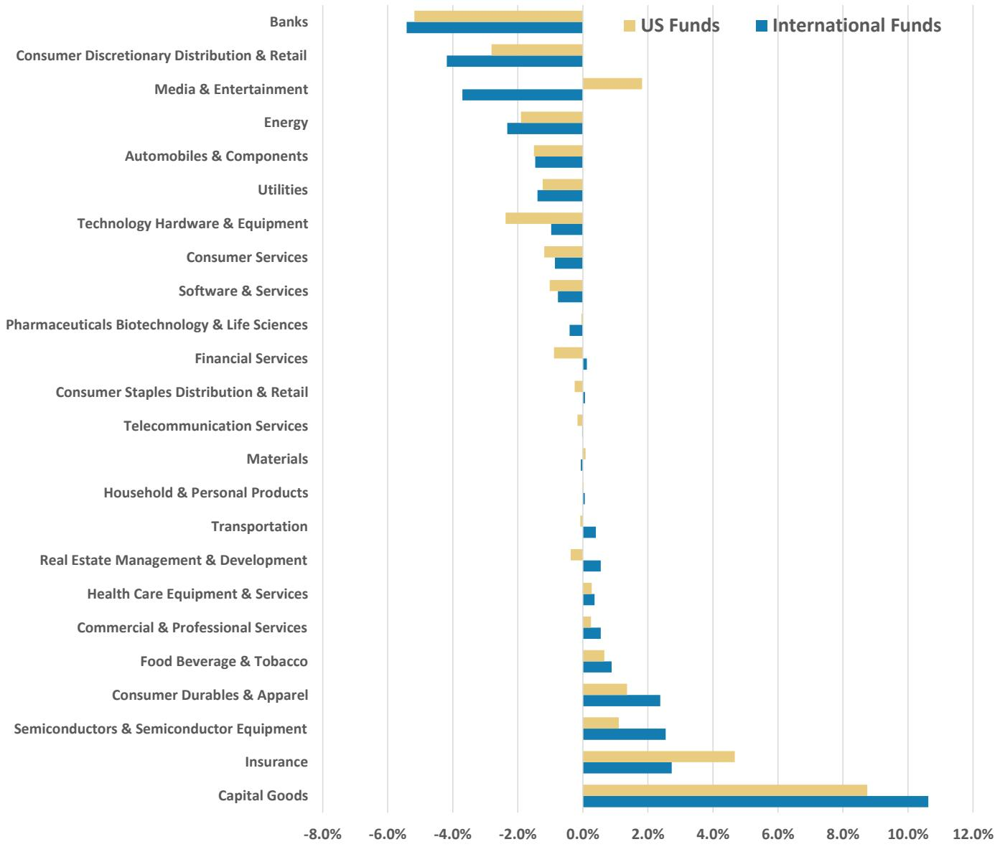

bar

| Sector | US Funds | International Funds |
| --- | --- | --- |
| Banks | -4.5% | -5.0% |
| Consumer Discretionary Distribution & Retail | -3.0% | -4.0% |
| Media & Entertainment | 2.0% | -3.5% |
| Energy | -1.5% | -2.0% |
| Automobiles & Components | -1.0% | -1.5% |
| Utilities | -1.0% | -1.5% |
| Technology Hardware & Equipment | -2.5% | -1.0% |
| Consumer Services | -1.0% | -1.0% |
| Software & Services | -1.0% | -1.0% |
| Pharmaceuticals Biotechnology & Life Sciences | 0.0% | 0.0% |
| Financial Services | -1.0% | 0.0% |
| Consumer Staples Distribution & Retail | 0.0% | 0.0% |
| Telecommunication Services | 0.0% | 0.0% |
| Materials | 0.0% | 0.0% |
| Household & Personal Products | 0.0% | 0.0% |
| Transportation | 0.0% | 0.5% |
| Real Estate Management & Development | 0.5% | 1.0% |
| Health Care Equipment & Services | 0.5% | 0.5% |
| Commercial & Professional Services | 0.5% | 1.0% |
| Food Beverage & Tobacco | 1.0% | 1.5% |
| Consumer Durables & Apparel | 1.5% | 2.5% |
| Semiconductors & Semiconductor Equipment | 1.5% | 2.5% |
| Insurance | 4.5% | 2.5% |
| Capital Goods | 8.5% | 10.5% |

Source: MorningStar, FactSet, MS. Note: Data as of May 31, 2026, most funds have disclosed position data up to April 30. Our fund positioning database methodology is described in section - Methodology of Our Fund Analysis.

# Fund Positions Changes YTD 2026 – By GICS Industry Group

Exhibit 26: Active fund positions in China/HK equities by GICS Industry Group, YTD 

<table><tr><td rowspan="2">GICS Industry Group</td><td rowspan="2">MSCI China Index Weights</td><td colspan="3">US &amp; SICAV Funds</td><td colspan="3">International Funds - UCITS</td><td colspan="3">US Funds</td></tr><tr><td>Portfolio Composite Weights</td><td>Active Weights</td><td>Active Weights Changes YTD</td><td>Portfolio Composite Weights</td><td>Active Weights</td><td>Active Weights Changes YTD</td><td>Portfolio Composite Weights</td><td>Active Weights</td><td>Active Weights Changes YTD</td></tr><tr><td>Capital Goods</td><td>3.8%</td><td>13.6%</td><td>9.7%</td><td>3.0%</td><td>14.4%</td><td>10.6%</td><td>1.3%</td><td>12.6%</td><td>8.8%</td><td>2.8%</td></tr><tr><td>Insurance</td><td>4.9%</td><td>8.5%</td><td>3.6%</td><td>-0.2%</td><td>7.6%</td><td>2.7%</td><td>-0.1%</td><td>9.6%</td><td>4.7%</td><td>-0.3%</td></tr><tr><td>Semiconductors &amp; Semiconductor Equipment</td><td>2.3%</td><td>4.2%</td><td>1.9%</td><td>1.0%</td><td>4.9%</td><td>2.5%</td><td>1.0%</td><td>3.4%</td><td>1.1%</td><td>0.6%</td></tr><tr><td>Consumer Durables &amp; Apparel</td><td>1.7%</td><td>3.6%</td><td>1.9%</td><td>-0.1%</td><td>4.1%</td><td>2.4%</td><td>-0.7%</td><td>3.1%</td><td>1.4%</td><td>0.2%</td></tr><tr><td>Food Beverage &amp; Tobacco</td><td>2.6%</td><td>3.4%</td><td>0.8%</td><td>0.0%</td><td>3.5%</td><td>0.9%</td><td>0.0%</td><td>3.3%</td><td>0.7%</td><td>0.1%</td></tr><tr><td>Commercial &amp; Professional Services</td><td>0.2%</td><td>0.6%</td><td>0.4%</td><td>0.1%</td><td>0.8%</td><td>0.6%</td><td>0.1%</td><td>0.5%</td><td>0.3%</td><td>0.0%</td></tr><tr><td>Health Care Equipment &amp; Services</td><td>0.4%</td><td>0.7%</td><td>0.3%</td><td>0.0%</td><td>0.7%</td><td>0.4%</td><td>-0.1%</td><td>0.6%</td><td>0.3%</td><td>0.1%</td></tr><tr><td>Real Estate Management &amp; Development</td><td>1.5%</td><td>1.7%</td><td>0.1%</td><td>-0.1%</td><td>2.1%</td><td>0.6%</td><td>-0.1%</td><td>1.2%</td><td>-0.4%</td><td>-0.2%</td></tr><tr><td>Transportation</td><td>1.4%</td><td>1.6%</td><td>0.2%</td><td>-0.3%</td><td>1.8%</td><td>0.4%</td><td>-0.3%</td><td>1.4%</td><td>-0.1%</td><td>-0.4%</td></tr><tr><td>Household &amp; Personal Products</td><td>0.1%</td><td>0.2%</td><td>0.0%</td><td>0.0%</td><td>0.2%</td><td>0.1%</td><td>0.0%</td><td>0.2%</td><td>0.0%</td><td>0.0%</td></tr><tr><td>Materials</td><td>5.6%</td><td>5.6%</td><td>0.0%</td><td>-0.1%</td><td>5.5%</td><td>-0.1%</td><td>-1.5%</td><td>5.7%</td><td>0.1%</td><td>0.6%</td></tr><tr><td>Telecommunication Services</td><td>0.3%</td><td>0.2%</td><td>-0.1%</td><td>-0.1%</td><td>0.3%</td><td>0.0%</td><td>-0.1%</td><td>0.1%</td><td>-0.2%</td><td>0.0%</td></tr><tr><td>Consumer Staples Distribution &amp; Retail</td><td>0.4%</td><td>0.3%</td><td>-0.1%</td><td>0.0%</td><td>0.4%</td><td>0.1%</td><td>0.0%</td><td>0.1%</td><td>-0.3%</td><td>0.0%</td></tr><tr><td>Financial Services</td><td>1.9%</td><td>1.5%</td><td>-0.3%</td><td>0.0%</td><td>2.0%</td><td>0.1%</td><td>0.1%</td><td>1.0%</td><td>-0.9%</td><td>-0.2%</td></tr><tr><td>Pharmaceuticals Biotechnology &amp; Life Sciences</td><td>4.6%</td><td>4.4%</td><td>-0.2%</td><td>0.2%</td><td>4.2%</td><td>-0.4%</td><td>-0.3%</td><td>4.6%</td><td>0.0%</td><td>0.5%</td></tr><tr><td>Software &amp; Services</td><td>1.1%</td><td>0.2%</td><td>-0.9%</td><td>-0.4%</td><td>0.4%</td><td>-0.8%</td><td>-0.5%</td><td>0.1%</td><td>-1.0%</td><td>-0.4%</td></tr><tr><td>Consumer Services</td><td>4.9%</td><td>3.9%</td><td>-1.0%</td><td>-0.8%</td><td>4.0%</td><td>-0.9%</td><td>-0.1%</td><td>3.7%</td><td>-1.2%</td><td>-1.3%</td></tr><tr><td>Technology Hardware &amp; Equipment</td><td>6.2%</td><td>4.6%</td><td>-1.6%</td><td>0.9%</td><td>5.2%</td><td>-1.0%</td><td>1.1%</td><td>3.8%</td><td>-2.4%</td><td>1.0%</td></tr><tr><td>Utilities</td><td>1.9%</td><td>0.6%</td><td>-1.3%</td><td>-0.1%</td><td>0.5%</td><td>-1.4%</td><td>-0.1%</td><td>0.7%</td><td>-1.2%</td><td>0.0%</td></tr><tr><td>Automobiles &amp; Components</td><td>4.8%</td><td>3.3%</td><td>-1.5%</td><td>0.0%</td><td>3.3%</td><td>-1.5%</td><td>-0.3%</td><td>3.3%</td><td>-1.5%</td><td>0.2%</td></tr><tr><td>Energy</td><td>3.6%</td><td>1.4%</td><td>-2.1%</td><td>-0.4%</td><td>1.2%</td><td>-2.3%</td><td>-0.8%</td><td>1.7%</td><td>-1.9%</td><td>-0.2%</td></tr><tr><td>Media &amp; Entertainment</td><td>18.4%</td><td>17.2%</td><td>-1.1%</td><td>-0.3%</td><td>14.7%</td><td>-3.7%</td><td>2.7%</td><td>20.2%</td><td>1.8%</td><td>-1.1%</td></tr><tr><td>Consumer Discretionary Distribution &amp; Retail</td><td>15.0%</td><td>11.5%</td><td>-3.5%</td><td>-2.0%</td><td>10.8%</td><td>-4.2%</td><td>-0.6%</td><td>12.2%</td><td>-2.8%</td><td>-2.3%</td></tr><tr><td>Banks</td><td>12.4%</td><td>7.1%</td><td>-5.3%</td><td>-0.4%</td><td>7.0%</td><td>-5.4%</td><td>-1.1%</td><td>7.2%</td><td>-5.2%</td><td>0.2%</td></tr></table>

Source: MorningStar, FactSet, MS. Note: Data as of May 31, 2026, most funds have disclosed position data up to April 30. Our fund positioning database methodology is described in section - Methodology of Our Fund Analysis.

# Methodology of Our Fund Analysis

Coverage: Our SICAV fund universe in this analysis is formed by taking the 40 largest active funds in "International Funds: MorningStar China Equity" and the 40 largest active funds in "International Funds: MorningStar Emerging Markets Equity", covering total AUM of US\$173bn.

Our US fund universe in this analysis is formed by taking the 20 largest active funds in "US Funds: MorningStar China Equity" and the 40 largest active funds in "US Funds: MorningStar Emerging Markets Equity", covering total AUM of US\$312bn.

Rationale: We track only the funds with the largest AUM because of their better data quality. Changes in individual securities positions across different funds are aggregated based on market value. Please note that not every individual fund discloses month-end positions, so our estimations are for best-effort market indication purposes rather than factual reported data.

# Disclosure Section

The information and opinions in MS were prepared or are disseminated by MS Asia Limited (which accepts the responsibility for its contents) and/or MS Asia (Singapore) Pte. (Registration number 199206298Z) and/or MS Asia (Singapore) Securities Pte Ltd (Registration number 200008434H), regulated by the Monetary Authority of Singapore (which accepts legal responsibility for its contents and should be contacted with respect to any matters arising from, or in connection with, MS), and/or MS Taiwan Limited and/or MS & Co International plc, Seoul Branch, and/or MS Australia Limited (A.B.N. 67 003 734 576, holder of Australian financial services license No. 233742, which accepts responsibility for its contents), and/or MS Wealth Management Australia Pty Ltd (A.B.N. 19 009 145 555, holder of Australian financial services license No. 240813, which accepts responsibility for its contents), and/or MS India Company Private Limited having Corporate Identification No (CIN) U22990MH1998PTC115305, regulated by the Securities and Exchange Board of India ("SEBI") and holder of licenses as a Research Analyst (SEBI Registration No. INH000001105); Stock Broker (SEBI Stock Broker Registration No. INZ000244438), Merchant Banker (SEBI Registration No. INM000011203), and depository participant with National Securities Depository Limited (SEBI Registration No. IN-DP-NSDL-567-2021) having registered office at Altimus, Level 39 & 40, Pandurang Budhkar Marg, Worli, Mumbai 400018, India; Telephone no. +91-22-61181000; Compliance Officer Details: Mr. Tejarshi Hardas, Tel. No.: +91-22-61181000 or Email: tejarshi.hardas@morganstanley.com; Grievance officer details: Mr. Tejarshi Hardas, Tel. No.: +91-22-61181000 or Email: msic-compliance@morganstanley.com which accepts the responsibility for its contents and should be contacted with respect to any matters arising from, or in connection with, MS, and their affiliates (collectively, "MS"). MS India Company Private Limited (MSICPL) may use AI tools in providing research services. All recommendations contained herein are made by the duly qualified research analysts.

For important disclosures, stock price charts and equity rating histories regarding companies that are the subject of this report, please see the MS Disclosure Website at www.morganstanley.com/eqr/disclosures/webapp/generalresearch, or contact your investment representative or MS at 1585 Broadway, (Attention: Research Management), New York, NY, 10036 USA.

For valuation methodology and risks associated with any recommendation, rating or price target referenced in this research report, please contact the Client Support Team as follows: US/Canada +1 800 303-2495; Hong Kong +852 2848-5999; Latin America +1 718 754-5444 (U.S.); London +44 (0)20-7425-8169; Singapore +65 6834-6860; Sydney +61 (0)2-9770-1505; Tokyo +81 (0)3-6836-9000. Alternatively you may contact your investment representative or MS at 1585 Broadway, (Attention: Research Management), New York, NY 10036 USA.

# Analyst Certification

The following analysts hereby certify that their views about the companies and their securities discussed in this report are accurately expressed and that they have not received and will not receive direct or indirect compensation in exchange for expressing specific recommendations or views in this report: Daniel K Blake; Kristal Ji; Chloe Liu; Laura Wang; Vicky Wu.

# Global Research Conflict Management Policy

MS has been published in accordance with our conflict management policy, which is available at www.morganstanley.com/institutional/research/conflictpolicies. A Portuguese version of the policy can be found at www.morganstanley.com.br

# Important Regulatory Disclosures on Subject Companies

The equity research analysts or strategists principally responsible for the preparation of MS have received compensation based upon various factors, including quality of research, investor client feedback, stock picking, competitive factors, firm revenues and overall investment banking revenues. Equity Research analysts' or strategists' compensation is not linked to investment banking or capital markets transactions performed by MS or the profitability or revenues of particular trading desks.

MS and its affiliates do business that relates to companies/instruments covered in MS, including market making, providing liquidity, fund management, commercial banking, extension of credit, investment services and investment banking. MS sells to and buys from customers the securities/instruments of companies covered in MS on a principal basis. MS may have a position in the debt of the Company or instruments discussed in this report. MS trades or may trade as principal in the debt securities (or in related derivatives) that are the subject of the debt research report.

Certain disclosures listed above are also for compliance with applicable regulations in non-US jurisdictions.

# STOCK RATINGS

MS uses a relative rating system using terms such as Overweight, Equal-weight, Not-Rated or Underweight (see definitions below). MS does not assign ratings of Buy, Hold or Sell to the stocks we cover. Overweight, Equal-weight, Not-Rated and Underweight are not the equivalent of buy, hold and sell. Investors should carefully read the definitions of all ratings used in MS. In addition, since MS contains more complete information concerning the analyst's views, investors should carefully read MS, in its entirety, and not infer the contents from the rating alone. In any case, ratings (or research) should not be used or relied upon as investment advice. An investor's decision to buy or sell a stock should depend on individual circumstances (such as the investor's existing holdings) and other considerations.

# Global Stock Ratings Distribution

(as of May 31, 2026)

The Stock Ratings described below apply to MS's Fundamental Equity Research and do not apply to Debt Research produced by the Firm.

For disclosure purposes only (in accordance with FINRA requirements), we include the category headings of Buy, Hold, and Sell alongside our ratings of Overweight, Equal-weight, Not-Rated and Underweight. MS does not assign ratings of Buy, Hold or Sell to the stocks we cover. Overweight, Equal-weight, Not-Rated and Underweight are not the equivalent of buy, hold, and sell but represent recommended relative weightings (see definitions below). To satisfy regulatory requirements, we correspond Overweight, our most positive stock rating, with a buy recommendation; we correspond Equal-weight and Not-Rated to hold and Underweight to sell recommendations, respectively.

<table><tr><td></td><td colspan="2">Coverage Universe</td><td colspan="3">Investment Banking Clients (IBC)</td><td colspan="2">Other Material Investment ServicesClients (MISC)</td></tr><tr><td>Stock RatingCategory</td><td>Count</td><td>% of Total</td><td>Count</td><td>% of Total IBC</td><td>% of RatingCategory</td><td>Count</td><td>% of Total OtherMISC</td></tr><tr><td>Overweight/Buy</td><td>1542</td><td>42%</td><td>465</td><td>51%</td><td>30%</td><td>707</td><td>43%</td></tr><tr><td>Equal-weight/Hold</td><td>1571</td><td>43%</td><td>369</td><td>40%</td><td>23%</td><td>723</td><td>44%</td></tr><tr><td>Not-Rated/Hold</td><td>3</td><td>0%</td><td>0</td><td>0%</td><td>0%</td><td>1</td><td>0%</td></tr><tr><td>Underweight/Sell</td><td>551</td><td>15%</td><td>86</td><td>9%</td><td>16%</td><td>201</td><td>12%</td></tr><tr><td>Total</td><td>3,667</td><td></td><td>920</td><td></td><td></td><td>1632</td><td></td></tr></table>

Data include common stock and ADRs currently assigned ratings. Investment Banking Clients are companies from whom MS received investment banking compensation in the last 12 months. Due to rounding off of decimals, the percentages provided in the "% of total" column may not add up to exactly 100 percent.

# Analyst Stock Ratings

Overweight (O). The stock's total return is expected to exceed the average total return of the analyst's industry (or industry team's) coverage universe, on a risk-adjusted basis, over the next 12-18 months.

Equal-weight (E). The stock's total return is expected to be in line with the average total return of the analyst's industry (or industry team's) coverage universe, on a risk-adjusted basis, over the next 12-18 months.

Not-Rated (NR). Currently the analyst does not have adequate conviction about the stock's total return relative to the average total return of the analyst's industry (or industry team's) coverage universe, on a risk-adjusted basis, over the next 12-18 months.

Underweight (U). The stock's total return is expected to be below the average total return of the analyst's industry (or industry team's) coverage universe, on a risk-adjusted basis, over the next 12-18 months.

Unless otherwise specified, the time frame for price targets included in MS is 12 to 18 months.

# Analyst Industry Views

Attractive (A): The analyst expects the performance of his or her industry coverage universe over the next 12-18 months to be attractive vs. the relevant broad market benchmark, as indicated below.

In-Line (I): The analyst expects the performance of his or her industry coverage universe over the next 12-18 months to be in line with the relevant broad market benchmark, as indicated below. Cautious (C): The analyst views the performance of his or her industry coverage universe over the next 12-18 months with caution vs. the relevant broad market benchmark, as indicated below. Benchmarks for each region are as follows: North America - S&P 500; Latin America - relevant MSCI country index or MSCI Latin America Index; Europe - MSCI Europe; Japan - TOPIX; Asia - relevant MSCI country index or MSCI sub-regional index or MSCI AC Asia Pacific ex Japan Index.

# Important Disclosures for MS Smith Barney LLC Customers

Important disclosures regarding any material conflict of interest that can reasonably be expected to have influenced MS Smith Barney LLC's choice of a third-party research provider or the subject company of a third-party research report, are available on the MS Wealth Management disclosure website at www.morganstanley.com/online/researchdisclosures. For MS specific disclosures, you may refer to https://www.morganstanley.com/eqr/disclosures/webapp/generalresearch.

Each MS report is reviewed and approved on behalf of MS Smith Barney LLC. This review and approval is conducted by the same person who reviews the research report on behalf of MS. This could create a conflict of interest.

# Other Important Disclosures

MS policy is to update research reports as and when the Research Analyst and Research Management deem appropriate, based on developments with the issuer, the sector, or the market that may have a material impact on the research views or opinions stated therein. In addition, certain Research publications are intended to be updated on a regular periodic basis (weekly/monthly/quarterly/annual) and will ordinarily be updated with that frequency, unless the Research Analyst and Research Management determine that a different publication schedule is appropriate based on current conditions.

MS is not acting as a municipal advisor and the opinions or views contained herein are not intended to be, and do not constitute, advice within the meaning of Section 975 of the Dodd-Frank Wall Street Reform and Consumer Protection Act.

MS produces an equity research product called a "Tactical Idea." Views contained in a "Tactical Idea" on a particular stock may be contrary to the recommendations or views expressed in research on the same stock. This may be the result of differing time horizons, methodologies, market events, or other factors. For all research available on a particular stock, please contact your sales representative or go to Matrix at http://www.morganstanley.com/matrix.

MS is provided to our clients through our proprietary research portal on Matrix and also distributed electronically by MS to clients. Certain, but not all, MS products are also made available to clients through third-party vendors or redistributed to clients through alternate electronic means as a convenience. For access to all available MS, please contact your sales representative or go to Matrix at http://www.morganstanley.com/matrix.

Any access and/or use of MS is subject to MS's Terms of Use (http://www.morganstanley.com/terms.html). By accessing and/or using MS, you are indicating that you have read and agree to be bound by our Terms of Use (http://www.morganstanley.com/terms.html). In addition you consent to MS processing your personal data and using cookies in accordance with our Privacy Policy and our Global Cookies Policy (http://www.morganstanley.com/privacy\_pledge.html), including for the purposes of setting your preferences and to collect readership data so that we can deliver better and more personalized service and products to you. To find out more information about how MS processes personal data, how we use cookies and how to reject cookies see our Privacy Policy and our Global Cookies Policy (http://www.morganstanley.com/privacy\_pledge.html). Please use the provided link to review the Terms and Conditions and Most Important Terms and Conditions for MS India Company Private Limited (https://www.morganstanley.com/assets/pdfs/about-us-global-offices/india/Terms\_and\_conditions.pdf) and the following link to review the audit report (https://ny.matrix.ms.com/eqr/research/webapp/researchdocs/MSICPL\_Morgan\_Stanley\_Research\_Audit\_Report.pdf).

If you do not agree to our Terms of Use and/or if you do not wish to provide your consent to MS processing your personal data or using cookies please do not access our research.

MS does not provide individually tailored investment advice. MS has been prepared without regard to the circumstances and objectives of those who receive it. MS recommends that investors independently evaluate particular investments and strategies, and encourages investors to seek the advice of a financial adviser. The appropriateness of an investment or strategy will depend on an investor's circumstances and objectives. The securities, instruments, or strategies discussed in MS may not be suitable for all investors, and certain investors may not be eligible to purchase or participate in some or all of them. MS is not an offer to buy or sell or the solicitation of an offer to buy or sell any security/instrument or to participate in any particular trading strategy. The value of and income from your investments may vary because of changes in interest rates, foreign exchange rates, default rates, prepayment rates, securities/instruments prices, market indexes, operational or financial conditions of companies or other factors. There may be time limitations on the exercise of options or other rights in securities/instruments transactions. Past performance is not necessarily a guide to future performance. Estimates of future performance are based on assumptions that may not be realized. If provided, and unless otherwise stated, the closing price on the cover page is that of the primary exchange for the subject company's securities/instruments.

The fixed income research analysts, strategists or economists principally responsible for the preparation of MS have received compensation based upon various factors, including quality, accuracy and value of research, firm profitability or revenues (which include fixed income trading and capital markets profitability or revenues), client feedback and competitive factors. Fixed Income Research analysts', strategists' or economists' compensation is not linked to investment banking or capital markets transactions performed by MS or the profitability or revenues of particular trading desks.

The "Important Regulatory Disclosures on Subject Companies" section in MS lists all companies mentioned where MS owns 1% or more of a class of common equity securities of the companies. For all other companies mentioned in MS, MS may have an investment of less than 1% in securities/instruments or derivatives of securities/instruments of companies and may trade them in ways different from those discussed in MS. Employees of MS not involved in the preparation of MS may have investments in securities/instruments or derivatives of securities/instruments of companies mentioned and may trade them in ways different from those discussed in MS. Derivatives may be issued by MS or associated persons.

With the exception of information regarding MS, MS is based on public information. MS makes every effort to use reliable, comprehensive information, but we make no representation that it is accurate or complete. We have no obligation to tell you when opinions or information in MS change apart from when we intend to discontinue equity research coverage of a subject company. Facts and views presented in MS have not been reviewed by, and may not reflect information known to, professionals in other MS business areas, including investment banking personnel.

MS personnel may participate in company events such as site visits and are generally prohibited from accepting payment by the company of associated expenses unless pre-approved by authorized members of Research management.

MS may make investment decisions that are inconsistent with the recommendations or views in this report.

To our readers based in Taiwan or trading in Taiwan securities/instruments: Information on securities/instruments that trade in Taiwan is distributed by MS Taiwan Limited ("MSTL"). Such information is for your reference only. The reader should independently evaluate the investment risks and is solely responsible for their investment decisions. MS may not be distributed to the public media or quoted or used by the public media without the express written consent of MS. Any non-customer reader within the scope of Article 7-1 of the Taiwan Stock Exchange Recommendation Regulations accessing and/or receiving MS is not permitted to provide MS to any third party (including but not limited to related parties, affiliated companies and any other third parties) or engage in any activities regarding MS which may create or give the appearance of creating a conflict of interest. Information on securities/instruments that do not trade in Taiwan is for informational purposes only and is not to be construed as a recommendation or a solicitation to trade in such securities/instruments. MSTL may not execute transactions for clients in these securities/instruments.

Certain information in MS was sourced by employees of the Shanghai Representative Office of MS Asia Limited for the use of MS Asia Limited. MS is not incorporated under PRC law and the research in relation to this report is conducted outside the PRC. MS does not constitute an offer to sell or the solicitation of an offer to buy any securities in the PRC. PRC investors shall have the relevant qualifications to invest in such securities and shall be responsible for obtaining all relevant approvals, licenses, verifications and/or registrations from the relevant governmental authorities themselves. Neither this report nor any part of it is intended as, or shall constitute, provision of any consultancy or advisory service of securities investment as defined under PRC law. Such information is provided for your reference only.

MS is disseminated in Brazil by MS C.T.V.M. S.A. located at Av. Brigadeiro Faria Lima, 3600, 6th floor, São Paulo - SP, Brazil; and is regulated by the Comissão de Valores Mobiliários; in Mexico by MS México, Casa de Bolsa, S.A. de C.V which is regulated by Comision Nacional Bancaria y de Valores. Paseo de los Tamarindos 90, Torre 1, Col. Bosques de las Lomas Floor 29, 05120 Mexico City; in Japan by MS MUFG Securities Co., Ltd. and, for Commodities related research reports only, MS Capital Group Japan Co., Ltd; in Hong Kong by MS Asia Limited (which accepts responsibility for its contents) and by MS Bank Asia Limited; in Singapore by MS Asia (Singapore) Pte. (Registration number 199206298Z) and/or MS Asia (Singapore) Securities Pte Ltd (Registration number 200008434H), regulated by the Monetary Authority of Singapore (which accepts legal responsibility for its contents and should be contacted with respect to any matters arising from, or in connection with, MS) and by MS Bank Asia Limited, Singapore Branch (Registration number T14FC0118J); in Australia to "wholesale clients" within the meaning of the Australian Corporations Act by MS Australia Limited A.B.N. 67 003 734 576, holder of Australian financial services license No. 233742, which accepts responsibility for its contents; in Australia to "wholesale clients" and "retail clients" within the meaning of the Australian Corporations Act by MS Wealth Management Australia Pty Ltd (A.B.N. 19 009 145 555, holder of Australian financial services license No. 240813, which accepts responsibility for its contents; in Korea by MS & Co International plc, Seoul Branch; in India by MS India Company Private Limited having Corporate Identification No (CIN) U22990MH1998PTC115305, regulated by the Securities and Exchange Board of India ("SEBI") and holder of licenses as a Research Analyst (SEBI Registration No. INH000001105); Stock Broker (SEBI Stock Broker Registration No. INZ000244438), Merchant Banker (SEBI Registration No. INM000011203), and depository participant with National Securities Depository Limited (SEBI Registration No. IN-DP-NSDL-567-2021) having registered office at Altimus, Level 39 & 40, Pandurang Budhkar Marg, Worli, Mumbai 400018, India; Telephone no. +91-22-61181000; Compliance Officer Details: Mr. Tejarshi Hardas, Tel. No.: +91-22-61181000 or Email: tejarshi.hardas@morganstanley.com; Grievance officer details: Mr. Tejarshi Hardas, Tel. No.: +91-22-61181000 or Email: msic-compliance@morganstanley.com. MS India Company Private Limited (MSICPL) may use AI tools in providing research services. All recommendations contained herein are made by the duly qualified research analysts; in Canada by MS Canada Limited; in Germany and the European Economic Area where required by MS Europe S.E., authorised and regulated by Bundesanstalt fuer Finanzdienstleistungsaufsicht (BaFin) under the reference number 149169; in the US by MS & Co. LLC, which accepts responsibility for its contents. MS & Co. International plc, authorized by the Prudential Regulation Authority and regulated by the Financial Conduct Authority and the Prudential Regulation Authority, disseminates in the UK research that it has prepared, and research which has been prepared by any of its affiliates, only to persons who (i) are investment professionals falling within Article 19(5) of the Financial Services and Markets Act 2000 (Financial Promotion) Order 2005 (as amended, the "Order"); (ii) are persons who are high net worth entities falling within Article 49(2)(a) to (d) of the Order; or (iii) are persons to whom an invitation or inducement to engage in investment activity (within the meaning of section 21 of the Financial Services and Markets Act 2000, as amended) may otherwise lawfully be communicated or caused to be communicated. RMB MS Proprietary Limited is a member of the JSE Limited and A2X (Pty) Ltd. RMB MS Proprietary Limited is a joint venture owned equally by MS International Holdings Inc. and RMB Investment Advisory (Proprietary) Limited, which is wholly owned by FirstRand Limited. The information in MS is being disseminated by MS Saudi Arabia, regulated by the Capital

Market Authority in the Kingdom of Saudi Arabia, and is directed at Sophisticated investors only.

The information in MS is being communicated by MS & Co. International plc (DIFC Branch), regulated by the Dubai Financial Services Authority (the DFSA) or by MS & Co. International plc (ADGM Branch), regulated by the Financial Services Regulatory Authority Abu Dhabi (the FSRA), and is directed at Professional Clients only, as defined by the DFSA or the FSRA, respectively. The financial products or financial services to which this research relates will only be made available to a customer who we are satisfied meets the regulatory criteria of a Professional Client. A distribution of the different MS Research ratings or recommendations, in percentage terms for Investments in each sector covered, is available upon request from your sales representative.

The information in MS is being communicated by MS & Co. International plc (QFC Branch), regulated by the Qatar Financial Centre Regulatory Authority (the QFCRA), and is directed at business customers and market counterparties only and is not intended for Retail Customers as defined by the QFCRA.

As required by the Capital Markets Board of Turkey, investment information, comments and recommendations stated here, are not within the scope of investment advisory activity. Investment advisory service is provided exclusively to persons based on their risk and income preferences by the authorized firms. Comments and recommendations stated here are general in nature. These opinions may not fit to your financial status, risk and return preferences. For this reason, to make an investment decision by relying solely to this information stated here may not bring about outcomes that fit your expectations.

The trademarks and service marks contained in MS are the property of their respective owners. Third-party data providers make no warranties or representations relating to the accuracy, completeness, or timeliness of the data they provide and shall not have liability for any damages relating to such data. The Global Industry Classification Standard (GICS) was developed by and is the exclusive property of MSCI and S&P.

MS, or any portion thereof may not be reprinted, sold or redistributed without the written consent of MS.

Indicators and trackers referenced in MS may not be used as, or treated as, a benchmark under Regulation EU 2016/1011, or any other similar framework.

The issuers and/or fixed income products recommended or discussed in certain fixed income research reports may not be continuously followed. Accordingly, investors should regard those fixed income research reports as providing stand-alone analysis and should not expect continuing analysis or additional reports relating to such issuers and/or individual fixed income products. MS may hold, from time to time, material financial and commercial interests regarding the company subject to the Research report.

Registration granted by SEBI and certification from the National Institute of Securities Markets (NISM) in no way guarantee performance of the intermediary or provide any assurance of returns to investors. Investment in securities market are subject to market risks. Read all the related documents carefully before investing.

© 2026 MS