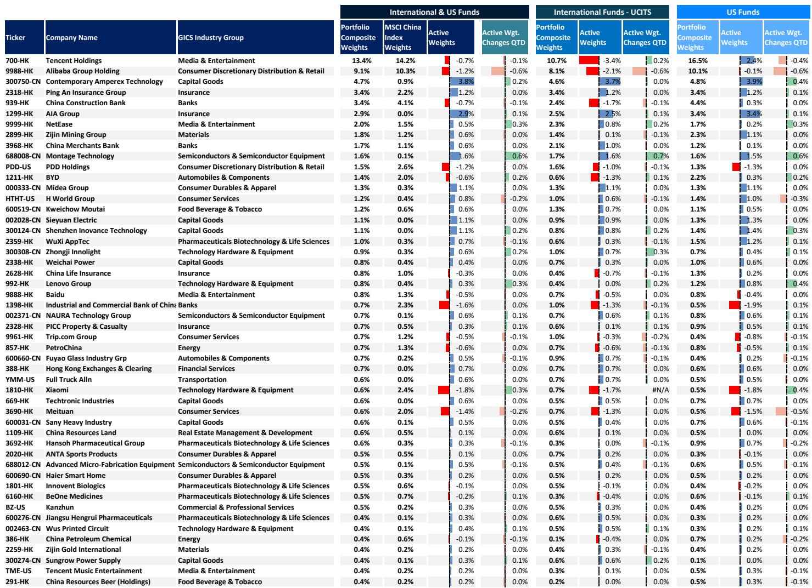
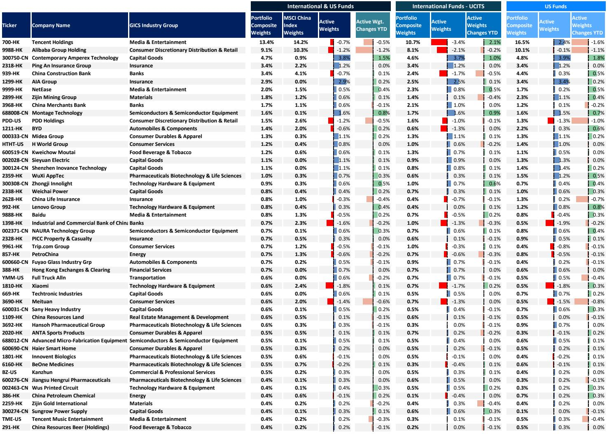
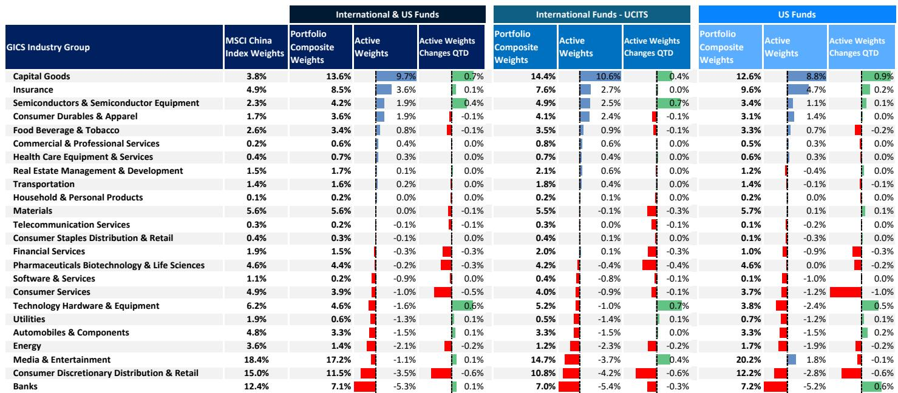

# China's Equity Market Is Undergoing a Structural Shift in Ownership That Rewrites the Rules for Foreign Investors

The narrative around Chinese equities has been dominated by one question for the better part of two years: when will foreign capital return in force? The May 2026 data offers a counterintuitive answer that most market participants have not yet absorbed. Foreign capital is returning, but not in the form that historically defined China exposure. Passive inflows continue, active outflows are accelerating, and the baton of marginal price-setting has passed decisively to domestic retail and private capital. The National Team, once the market's anchor, is now a net seller at an accelerating pace. This is not a temporary rotation. It is a structural reconfiguration of who owns China and, more importantly, who determines its pricing.

The implications are profound for any allocator with China exposure. The old playbook of watching foreign active manager positioning as a signal is breaking down. The new regime demands a different analytical framework—one that tracks margin financing velocity, private fund AUM trajectories, and the behavior of a National Team that is increasingly willing to monetize its holdings into strength. Understanding this shift is no longer optional; it is the prerequisite for any credible China equity strategy in the second half of 2026.

## Foreign Active Managers Are Not Just Underweight; They Are Structurally Exiting China Exposure

The headline number is stark but underappreciated in its significance. US and EU mutual funds recorded a net outflow of USD 0.5 billion from Chinese equities in May 2026, the first outflow month since May 2025, excluding the March 2026 Middle East conflict disruption. The composition matters more than the aggregate. Passive inflows slowed to USD 1.1 billion from USD 2.5 billion in April, while active fund outflows accelerated to USD 1.6 billion from USD 1.2 billion. This is not a pause. This is active managers accelerating their exit into a market that is rallying.

On a cumulative basis, foreign fund flows reached USD 10 billion in the first five months of 2026, representing 80% of the full-year 2025 inflow total. The pace of inflows is compressing into a shorter window, which signals urgency rather than conviction. The positioning data confirms the direction. Global EM funds' China underweight remained stable at 1.3 percentage points, but EM funds deepened their underweight to 6.2 percentage points and Asia ex-Japan funds to 4.0 percentage points. The underweight is not a cyclical hedge; it is a structural conviction that is being reinforced month after month.

The sector-level data from active managers reveals a narrowing of conviction. Managers added to Capital Goods, Tech Hardware, and Semiconductors, while trimming Consumer Discretionary Distribution & Retail, Consumer Services, and Pharmaceuticals Biotech. At the stock level, Montage Technology, Xiaomi, and Lenovo were the most added, while Alibaba, Meituan, and H World were the most trimmed. This is a portfolio that is rotating toward hardware and away from consumer platforms and services. The question this raises is whether this rotation is a tactical trade on AI-related capex or a deeper structural re-rating of China's competitive advantage in hardware versus consumption.

## The National Team Is Selling Into Strength, and That Changes the Liquidity Calculus

The most underreported development in the May data is the acceleration of National Team ETF selling. Proxied by CSI 300 ETF flows, National Team outflows reached an estimated USD 21 billion in May, up sharply from USD 8 billion in April. This is happening against the backdrop of a strong rally in AI and technology stocks. The National Team is not stabilizing the market; it is monetizing the rally.

This behavior has two strategic implications. First, it removes a predictable source of downside support. For years, the National Team's willingness to buy into weakness provided a put option for the broader market. That put is now being unwound. Second, it signals that the authorities are comfortable with a market that is increasingly driven by private capital. The National Team is not exiting because it is bearish; it is exiting because it believes the market no longer needs its stabilizing presence. The risk is that the exit accelerates faster than private capital can absorb, creating a liquidity gap that triggers a sharp correction.

The data on domestic participation suggests that private capital is, for now, absorbing the supply. Private fund AUM increased by RMB 386 billion in May, reflecting active participation from high-net-worth individuals. Margin financing balance rose 7% month-over-month to another record high. Retail participation is strengthening at exactly the moment when institutional foreign capital is retreating and the National Team is stepping back. This is a market that is becoming more retail-driven, more leverage-dependent, and more momentum-sensitive.

## Southbound Flows Are Slowing, but the Composition of Foreign Interest Is Shifting Toward A-Share Exposure

Southbound flows slowed dramatically to USD 1.6 billion in May from USD 7.2 billion in April. On a cumulative basis, 5M26 southbound inflows reached USD 34 billion, representing 20% of the full-year 2025 total. The deceleration is sharp and suggests that Hong Kong-listed Chinese equities are losing their appeal as the primary vehicle for China exposure.

The counterpoint is that foreign passive funds tracking the CSI 300 continued to see inflows in May, indicating sustained interest in A-shares. This is a critical divergence. Foreign capital is not abandoning China; it is shifting its preferred access point from Hong Kong-listed H-shares to onshore A-shares. The passive channel is the primary vector for this shift, and it is happening even as active managers reduce overall China exposure.

The strategic question for allocators is whether this shift is permanent or cyclical. If it is permanent, it implies that A-shares will increasingly trade at a premium to H-shares, and that the liquidity premium of onshore markets will narrow. If it is cyclical, the current divergence represents a relative-value opportunity in Hong Kong-listed names that are being sold down by active managers while passive flows chase A-shares. The data does not yet resolve this question, but the trend is clear enough to warrant active monitoring.

## What the Report Does Not Fully Answer: The Sustainability of Domestic Retail-Led Momentum

The report provides granular data on flows, positioning, and liquidity, but it leaves one critical question open: how sustainable is the current domestic retail-led market? Private fund AUM is surging, margin financing is at record highs, and the National Team is selling. This combination has historically been associated with late-cycle behavior in China's equity markets. Retail investors tend to increase leverage and participation during the final stages of a rally, and the National Team tends to sell into strength before a correction.

The data does not provide a clear signal on whether the current cycle is different. The AI and technology theme has genuine structural tailwinds, and the hardware-focused rotation among active managers suggests that the market is not purely speculative. But the velocity of margin financing growth and the concentration of retail flows into a narrow set of themes raises the risk of a sharp reversal if sentiment shifts.

The report also does not address the macro backdrop in sufficient detail to assess whether domestic liquidity conditions will remain supportive. The PBOC's policy stance, credit growth, and property market stabilization are all relevant to the sustainability of retail participation. Without that context, the flow data is informative but incomplete.

## A Decision Framework for Allocators Navigating the New China Equity Regime

The May 2026 data suggests that allocators should adopt a three-dimensional framework for China equity exposure that goes beyond the traditional foreign-active-manager positioning signal.

First, monitor the velocity of domestic retail leverage as a contrarian indicator. Margin financing at record highs is not inherently bearish, but the rate of change matters. A sharp acceleration in margin growth over a short period has historically preceded corrections. Allocators should track monthly margin financing changes relative to the trailing three-month average and reduce exposure if the ratio exceeds two standard deviations above the mean.

Second, treat National Team ETF flows as a liquidity signal rather than a sentiment signal. The National Team is now a net seller, and the pace of selling is accelerating. Allocators should adjust their expected range for market drawdowns upward, as the implicit put option provided by the National Team is being withdrawn. A reasonable starting assumption is that the market's tolerance for a 10% correction has increased, given the absence of official buying support.

Third, differentiate between passive and active foreign flows. Passive inflows into A-shares are a structural trend that reflects index inclusion and benchmark-driven allocation. Active outflows are a cyclical trend that reflects manager conviction and relative performance concerns. Allocators should overweight A-share exposure through passive vehicles and underweight Hong Kong-listed names that are heavily dependent on active foreign manager buying. The divergence between these two channels is likely to persist, and positioning should reflect that asymmetry.

The unresolved question is whether domestic retail momentum can sustain itself without foreign active support and with the National Team reducing its footprint. The answer will determine whether the current rally is the beginning of a new bull market or the final stage of a liquidity-driven cycle.

Join the community to read the full report and review the original charts.

*This article is for learning and discussion only and does not constitute investment advice.*

Personal reading notes and learning share only. Not investment advice.

