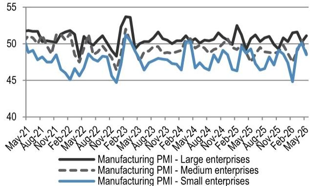
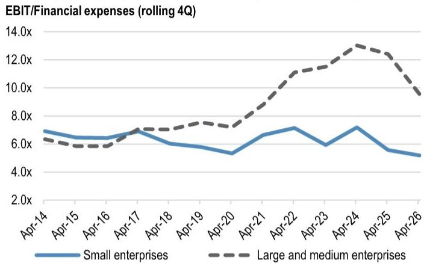
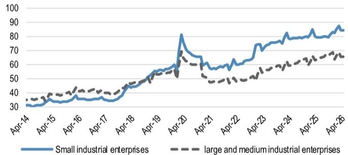
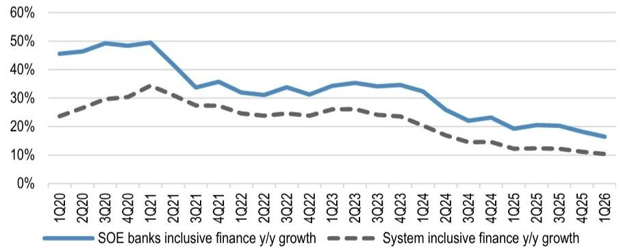
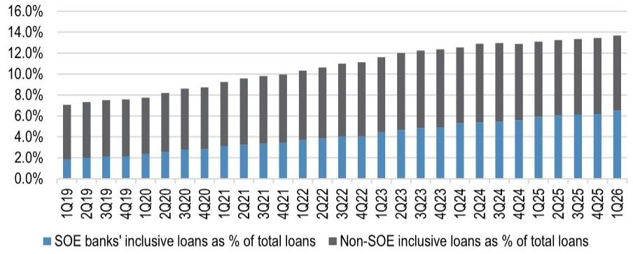
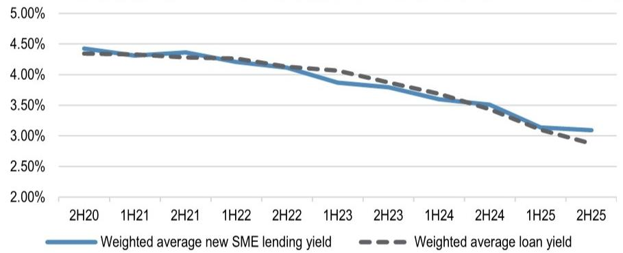
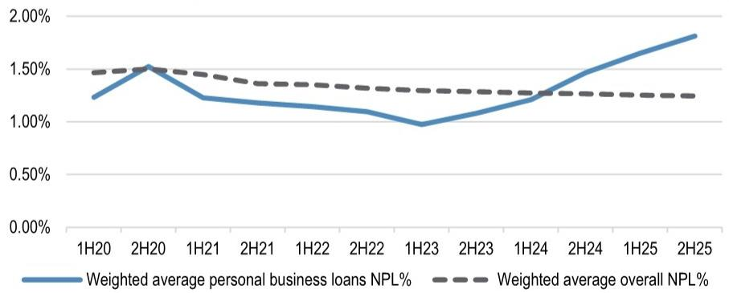
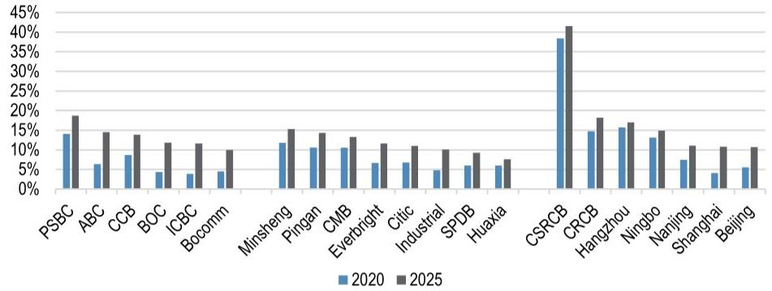
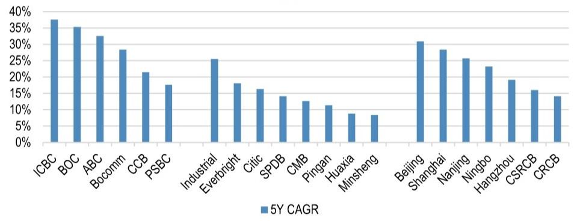

This material is neither intended to be distributed to Mainland China investors nor to provide securities investment consultancy services within the territory of Mainland China. This material or any portion hereof may not be reprinted, sold or redistributed without the written consent of JPM.

# China Banks

# SME policy pivot - near-term AQ pain, medium-term yield recovery. Implications for banks vary

China's financial regulator has pivoted from encouraging banks to grow inclusive loans to instead focusing on the quality and sustainability of the loans (Table 4). We view this shift as a response to rising SME credit risks (Table 2-Table 3) and relatively soft loan demand. Given the worsening debt-servicing ability of SMEs, the deceleration in inclusive loan growth could intensify near-term asset quality pressure. But in the medium term, it may ease pricing competition and support a modest recovery in inclusive loan yields. The implications for banks vary. We prefer CCB, SPDB and CRCB as these three banks reported declines in personal business loan (a sub-category of inclusive finance) NPL ratios in 2025, and look set to benefit from improvement in loan yield. By contrast, we remain cautious on PSBC and CSRCB on this topic, given their larger inclusive finance exposure (Figure 8) and continued asset quality pressure.

\- What's new? On May $19^{\text{th}}$ , the NFRA issued the Notice on MSE Financial Services for 2026 (link), with the most important change being the removal of explicit encouragement of MSE loan growth. Rather than focusing on volume growth, the 2026 Notice reorients the policy objective around credit structure optimization and asset quality improvement.

\- A refresher on the regulatory shift on SME lending - from volume race to quality competition (Table 4). The NAFR formally introduced the "two increases, two controls" (两增两控) framework in 2018, requiring banks to ensure inclusive SME loan growth was no lower than overall loan growth and that the number of SME borrowers was no lower than the prior year level, with a higher target set specifically for the Big 5 banks. Starting in 2023, the "two increases" hard requirement was dropped, but regulators continued to guide banks towards high SME lending growth directionally. The 2026 Notice marks a more decisive pivot from quantity to quality with no mention of the SME loans growth target, while there is an emphasis on asset quality improvement.

\- We see rising asset quality risks for SME loans: NBS PMI data shows that while large enterprises' PMI trended up m/m to 51.1 in May, small enterprises' PMI declined to 48.5 (Figure 1). Data also shows that since Covid, there has been significant divergence in interest coverage ratios and account-receivable turnover days between large and small enterprises. Small enterprises' interest coverage ratio is meaningfully lower (Figure 2) and accounts receivable cycle notably longer than large peers (Figure 3). The guidance change from PBOC may lead to further deceleration of inclusive loan growth (Figure 4, Figure 5); we think this would intensify the asset quality for SME loans in the near term.

\- The economics of SME loans meaningfully deteriorated in recent years: From 2022 to 2025, the lending rate of new inclusive finance loans contracted 1.2pcts to $3.31\%$ , while the NPL ratio of personal business loans, a sub-category of inclusive finance, rose by 70bps to $1.66\%$ . We have not seen an inflexion point for the worsening economics, with the exception of SPDB and CCB whose NPL as a $\%$ of personal business loans saw marginal improvement in 2025 on a y/y basis.

# Banks & Financial Services

# Katherine Lei AC

(852) 2800-8552

katherine.lei@JPM.com

JPM Securities (Asia Pacific) Limited/

JPM Broking (Hong Kong) Limited

# Haomin Chen AC

(86-21) 6106 6347

haomin.chen@JPM.com

SAC Registration Number: S1730524080002

JPM Securities (China) Company

Limited

# Peter Zhang

(852) 2800-8557

peter.zhang@JPM.com

JPM Securities (Asia Pacific) Limited/

JPM Broking (Hong Kong) Limited

# Lincoln Yu

(852) 2800 8523

lincoln.yu@JPM.com

JPM Securities (Asia Pacific) Limited/

JPM Broking (Hong Kong) Limited

- The silver lining is that the lending yield for inclusive finance loans may improve in the medium term: With the deceleration of loan growth, particularly from SOE banks, we may see moderate improvement in loan pricing. But the magnitude is likely to be small as banks' risk appetite remains low, and debt-servicing ability of small enterprises is yet to recover.   
- Implications for SOEs and JSBs – prefer CCB and SPDB and avoid PSBC. We see risk to Minsheng from this topic: On the positive side, CCB and SPDB reported NPL ratio contraction for personal business loans in 2025 (Table 2), thus if lending yield can improve following the ease in competition, economics for inclusive finance may improve. On the negative side, PSBC has the highest exposure to inclusive finance loans, and continued to see lending yield contraction and a rise in NPL ratios for this portfolio in 2025 (Table 1, Table 2). For Minsheng, although it has done a better job in managing assert quality for personal business loans in past three years, its share price performance may still lag due to its relatively sizable inclusive finance portfolio.   
- Implications for city and rural commercial banks: We see short-term pain but long-term gain for regional banks with genuine SME service capabilities. In the short term, the pressure is on AQ. We are yet to observe an inflection point in personal business loans NPL % across our covered banks (Table 3), and any large bank credit withdrawal from the SME segment could amplify repayment stress. In the long term, a reduction in irrational pricing pressure from large banks should create room for NIM recovery and gradual market share stabilization in their key operating regions. Among our covered banks, we think CSRCB is more exposed to near-term AQ downside, given its largest inclusive finance exposure (Figure 8) and continued deterioration in personal business AQ (Table 3). However, the longer-term read through is constructive. Since 2020, CSRCBs' SME growth had been meaningfully constrained by aggressive large bank competition (Figure 9). As competitive dynamics normalize, we believe CSRCB will be best placed to regain share with its deep local knowledge and effective “loan factory” credit model. We stay cautious on CSRCB until we observe positive signs from its AQ. We like CRCB as its NPL ratio on personal business loan contracted 49bps h/h in 2H25, likely supported by local macro recovery and better underwriting capacity (Table 3).

Figure 1: PMI for small and medium enterprises have been trending below that of the large enterprises   

line

| Month    | Manufacturing PMI - Large enterprises | Manufacturing PMI - Medium enterprises | Manufacturing PMI - Small enterprises |
|----------|----------------------------------------|-----------------------------------------|----------------------------------------|
| May-21   | 51.0                                   | 50.5                                    | 49.5                                   |
| Aug-21   | 50.5                                   | 50.0                                    | 48.5                                   |
| Nov-21   | 51.5                                   | 50.5                                    | 49.0                                   |
| Feb-22   | 50.0                                   | 49.5                                    | 47.0                                   |
| May-22   | 51.0                                   | 50.0                                    | 48.0                                   |
| Aug-22   | 50.5                                   | 49.5                                    | 47.5                                   |
| Nov-22   | 50.0                                   | 49.0                                    | 46.5                                   |
| Feb-23   | 53.0                                   | 48.0                                    | 45.0                                   |
| May-23   | 51.5                                   | 47.5                                    | 46.0                                   |
| Aug-23   | 50.0                                   | 47.0                                    | 46.5                                   |
| Nov-23   | 51.0                                   | 48.0                                    | 47.0                                   |
| Feb-24   | 50.5                                   | 47.5                                    | 46.5                                   |
| May-24   | 51.0                                   | 48.0                                    | 47.0                                   |
| Aug-24   | 50.5                                   | 47.5                                    | 46.5                                   |
| Nov-24   | 51.0                                   | 48.0                                    | 47.0                                   |
| Feb-25   | 52.0                                   | 49.0                                    | 48.0                                   |
| May-25   | 51.5                                   | 48.5                                    | 47.5                                   |
| Aug-25   | 50.0                                   | 47.0                                    | 46.0                                   |
| Nov-25   | 51.0                                   | 48.0                                    | 47.0                                   |
| Feb-26   | 50.5                                   | 47.5                                    | 46.5                                   |
| May-26   | 51.0                                   | 48.0                                    | 47.0                                   |

Source: NBS, CEIC. Data as of 1 June 2026.

Figure 2: EBIT/financial expenses for small industrial enterprises have been weaker than large and medium enterprises   

line

| Date   | Small enterprises | Large and medium enterprises |
|--------|-------------------|-------------------------------|
| Apr-14 | 7.0x              | 6.5x                          |
| Apr-15 | 6.5x              | 6.0x                          |
| Apr-16 | 6.5x              | 6.0x                          |
| Apr-17 | 7.0x              | 7.0x                          |
| Apr-18 | 6.0x              | 7.0x                          |
| Apr-19 | 5.5x              | 7.5x                          |
| Apr-20 | 5.0x              | 7.0x                          |
| Apr-21 | 6.5x              | 9.0x                          |
| Apr-22 | 7.0x              | 11.0x                         |
| Apr-23 | 6.0x              | 11.5x                         |
| Apr-24 | 7.0x              | 13.0x                         |
| Apr-25 | 5.5x              | 12.5x                         |
| Apr-26 | 5.0x              | 9.5x                          |

Source: CEIC. Data as of 1 June 2026.

Figure 3: Account receivables for small industrial enterprises is picking up and is higher than for large and medium enterprises   

line

| Date   | Small industrial enterprises | large and medium industrial enterprises |
|--------|------------------------------|----------------------------------------|
| Apr-14 | 30                           | 35                                     |
| Apr-15 | 32                           | 38                                     |
| Apr-16 | 35                           | 40                                     |
| Apr-17 | 38                           | 42                                     |
| Apr-18 | 45                           | 48                                     |
| Apr-19 | 55                           | 52                                     |
| Apr-20 | 80                           | 65                                     |
| Apr-21 | 60                           | 50                                     |
| Apr-22 | 70                           | 55                                     |
| Apr-23 | 75                           | 60                                     |
| Apr-24 | 80                           | 65                                     |
| Apr-25 | 85                           | 70                                     |
| Apr-26 | 90                           | 75                                     |

Source: CEIC. Data as of 1 June 2026.

Figure 4: SOE banks have higher inclusive finance growth than the system level   

line

| Quarter | SOE banks inclusive finance y/y growth (%) | System inclusive finance y/y growth (%) |
|---|---|---|
| 1Q20 | 45.5 | 23.5 |
| 2Q20 | 47.0 | 25.0 |
| 3Q20 | 49.5 | 28.0 |
| 4Q20 | 48.5 | 30.0 |
| 1Q21 | 49.5 | 33.5 |
| 2Q21 | 45.0 | 30.0 |
| 3Q21 | 33.5 | 27.0 |
| 4Q21 | 35.5 | 26.0 |
| 1Q22 | 32.0 | 24.5 |
| 2Q22 | 31.0 | 24.0 |
| 3Q22 | 33.5 | 24.5 |
| 4Q22 | 31.5 | 24.0 |
| 1Q23 | 34.0 | 25.5 |
| 2Q23 | 35.0 | 25.5 |
| 3Q23 | 34.5 | 24.5 |
| 4Q23 | 34.0 | 23.5 |
| 1Q24 | 31.5 | 21.0 |
| 2Q24 | 27.0 | 17.0 |
| 3Q24 | 21.5 | 14.0 |
| 4Q24 | 23.0 | 13.0 |
| 1Q25 | 19.5 | 11.5 |
| 2Q25 | 20.5 | 11.0 |
| 3Q25 | 19.5 | 10.5 |
| 4Q25 | 18.0 | 10.0 |
| 1Q26 | 16.5 | 9.5 |

Source: PBOC (as of 1 June 2026, NAFR (as of 1 June 2026), Wind (as of 1 June 2026).

Figure 5: Inclusive finance loans' contribution to total loans increased from $7\%$ in 1Q19 to $13.7\%$ in 1Q26, and contribution from SOE banks is becoming more significant   

bar_stacked

| Quarter | SOE banks' inclusive loans as % of total loans (%) | Non-SOE inclusive loans as % of total loans (%) |
|---|---|---|
| 1Q19 | 1.8 | 4.5 |
| 2Q19 | 2.0 | 4.7 |
| 3Q19 | 2.2 | 4.8 |
| 4Q19 | 2.3 | 4.9 |
| 1Q20 | 2.5 | 5.0 |
| 2Q20 | 2.7 | 5.2 |
| 3Q20 | 2.9 | 5.4 |
| 4Q20 | 3.0 | 5.5 |
| 1Q21 | 3.2 | 5.7 |
| 2Q21 | 3.4 | 5.9 |
| 3Q21 | 3.6 | 6.0 |
| 4Q21 | 3.7 | 6.1 |
| 1Q22 | 3.9 | 6.3 |
| 2Q22 | 4.0 | 6.4 |
| 3Q22 | 4.1 | 6.5 |
| 4Q22 | 4.2 | 6.6 |
| 1Q23 | 4.4 | 6.8 |
| 2Q23 | 4.6 | 7.0 |
| 3Q23 | 4.8 | 7.1 |
| 4Q23 | 4.9 | 7.2 |
| 1Q24 | 5.3 | 7.3 |
| 2Q24 | 5.5 | 7.4 |
| 3Q24 | 5.6 | 7.5 |
| 4Q24 | 5.7 | 7.6 |
| 1Q25 | 5.9 | 7.7 |
| 2Q25 | 6.0 | 7.8 |
| 3Q25 | 6.1 | 7.9 |
| 4Q25 | 6.2 | 8.0 |
| 1Q26 | 6.5 | 8.1 |

Source: PBOC (as of 1 June 2026, NAFR (as of 1 June 2026), Wind (as of 1 June 2026).

Figure 6: Weighted average new SME lending yield vs overall loan yield for banks with relevant disclosures   

line

| Period | Weighted average new SME lending yield (%) | Weighted average loan yield (%) |
|---|---|---|
| 2H20 | 4.45 | 4.38 |
| 1H21 | 4.38 | 4.36 |
| 2H21 | 4.39 | 4.35 |
| 1H22 | 4.32 | 4.31 |
| 2H22 | 4.18 | 4.17 |
| 1H23 | 3.90 | 4.05 |
| 2H23 | 3.78 | 3.95 |
| 1H24 | 3.60 | 3.75 |
| 2H24 | 3.45 | 3.55 |
| 1H25 | 3.15 | 3.10 |
| 2H25 | 3.08 | 2.90 |

Source: 2H20-2H25 company reports of ICBC, CCB, BOC, ABC, CMB, HXB, MSB, EB, and Industrial. Note: We include only these banks as they made consistent disclosure of new SME lending yields from 2H20-2H25.

Figure 7: Weighted average NPL ratio for personal business loans has trended up since 1H23, while that for overall loans decreased   

line

| Period | Weighted average personal business loans NPL% | Weighted average overall NPL% |
|---|---|---|
| 1H20 | 1.25 | 1.45 |
| 2H20 | 1.50 | 1.48 |
| 1H21 | 1.25 | 1.43 |
| 2H21 | 1.20 | 1.39 |
| 1H22 | 1.15 | 1.36 |
| 2H22 | 1.10 | 1.34 |
| 1H23 | 0.95 | 1.32 |
| 2H23 | 1.05 | 1.30 |
| 1H24 | 1.20 | 1.28 |
| 2H24 | 1.45 | 1.27 |
| 1H25 | 1.60 | 1.26 |
| 2H25 | 1.80 | 1.25 |

Source: 1H20-2H25 company reports of ABC, CCB, ICBC, BoCom, PSBC, CMB, SPDB, MSB, and Industrial. Note: We include only these banks as they made consistent disclosure of new SME lending yields from 1H20-2H25

Figure 8: Inclusive finance as % of total loans in 2020 vs 2025, by bank   

bar

| Company | 2020 (%) | 2025 (%) |
| :--- | :--- | :--- |
| PSBC | 13.5 | 18.5 |
| ABC | 6.0 | 14.0 |
| CCB | 9.0 | 13.5 |
| BOC | 4.0 | 11.5 |
| ICBC | 3.5 | 11.5 |
| Bocomm | 4.0 | 10.0 |
| Minsheng | 11.5 | 15.5 |
| Pingan | 10.5 | 14.5 |
| CMB | 10.5 | 13.5 |
| Everbright | 6.5 | 11.5 |
| Citic Industrial | 7.0 | 11.0 |
| SPDB | 4.5 | 10.0 |
| Huaxia | 6.0 | 9.5 |
| CSRCB | 38.5 | 41.5 |
| CRCB | 14.5 | 18.5 |
| Hangzhou | 15.5 | 17.0 |
| Ningbo | 12.5 | 14.5 |
| Nanjing Shanghai | 7.5 | 11.0 |
| Beijing | 4.5 | 10.5 |

Source: 2020 and 2025 annual reports for the banks mentioned in the chart above. J.P Morgan estimate for CSRCB 2020 inclusive finance loan balance, as the bank did not disclose this data in 2020.

Figure 9: Inclusive finance CAGR in 2020-2025, by bank   

bar

| Company | 5Y CAGR (%) |
|---|---|
| ICBC | 38 |
| BOC | 35 |
| ABC | 32 |
| Bocomm | 28 |
| CCB | 21 |
| PSBC | 17 |
| Industrial | 25 |
| Everbright | 18 |
| Citic | 16 |
| SPDB | 14 |
| CMB | 12 |
| Pingan | 11 |
| Huaxia | 9 |
| Minsheng | 8 |
| Beijing | 31 |
| Shanghai | 28 |
| Nanjing | 25 |
| Ningbo | 23 |
| Hangzhou | 19 |
| CSRCB | 16 |
| CRCB | 14 |

Source: 2020 and 2025 annual reports for the banks mentioned in the chart above. J.P Morgan estimate for CSRCB 2020 inclusive finance loan balance, as the bank did not disclose this data in 2020.

Table 1: New inclusive finance lending yield vs gross loan lending yield by bank in 2022-25 

<table><tr><td rowspan="2"></td><td colspan="6">New Inclusive finance lending yield</td><td colspan="6">Gross loans lending yield</td></tr><tr><td>2022</td><td>2023</td><td>2024</td><td>2025</td><td>2025- YoY</td><td>2025 vs 2022</td><td>2022</td><td>2023</td><td>2024</td><td>2025</td><td>2025- YoY</td><td>2025 vs 2022</td></tr><tr><td>Huaxia</td><td>5.84%</td><td>5.15%</td><td>4.69%</td><td>4.10%</td><td>-0.6 pct</td><td>-1.7 pct</td><td>4.9%</td><td>4.7%</td><td>4.4%</td><td>3.9%</td><td>-0.5 pct</td><td>-1.0 pct</td></tr><tr><td>CMB</td><td>5.15%</td><td>4.48%</td><td>4.22%</td><td>3.65%</td><td>-0.6 pct</td><td>-1.5 pct</td><td>4.5%</td><td>4.3%</td><td>3.9%</td><td>3.3%</td><td>-0.6 pct</td><td>-1.2 pct</td></tr><tr><td>PSBC</td><td>4.85%</td><td>4.61%</td><td>4.16%</td><td>3.57%</td><td>-0.6 pct</td><td>-1.3 pct</td><td>4.5%</td><td>4.1%</td><td>3.8%</td><td>3.2%</td><td>-0.6 pct</td><td>-1.3 pct</td></tr><tr><td>Minsheng</td><td>4.77%</td><td>4.65%</td><td>4.27%</td><td>3.50%</td><td>-0.8 pct</td><td>-1.3 pct</td><td>4.5%</td><td>4.3%</td><td>4.0%</td><td>3.4%</td><td>-0.5 pct</td><td>-1.1 pct</td></tr><tr><td>Everbright</td><td>4.44%</td><td>3.97%</td><td>3.47%</td><td>3.19%</td><td>-0.3 pct</td><td>-1.3 pct</td><td>5.0%</td><td>4.7%</td><td>4.2%</td><td>3.6%</td><td>-0.6 pct</td><td>-1.4 pct</td></tr><tr><td>CCB</td><td>4.00%</td><td>3.75%</td><td>3.54%</td><td>3.10%</td><td>-0.4 pct</td><td>-0.9 pct</td><td>4.2%</td><td>3.8%</td><td>3.4%</td><td>2.8%</td><td>-0.6 pct</td><td>-1.3 pct</td></tr><tr><td>ABC</td><td>3.90%</td><td>3.67%</td><td>3.44%</td><td>3.08%</td><td>-0.4 pct</td><td>-0.8 pct</td><td>4.1%</td><td>3.8%</td><td>3.4%</td><td>2.9%</td><td>-0.5 pct</td><td>-1.2 pct</td></tr><tr><td>Industrial</td><td>4.14%</td><td>3.87%</td><td>3.53%</td><td>3.06%</td><td>-0.5 pct</td><td>-1.1 pct</td><td>4.8%</td><td>4.6%</td><td>4.2%</td><td>3.6%</td><td>-0.6 pct</td><td>-1.2 pct</td></tr><tr><td>ICBC</td><td>3.84%</td><td>3.55%</td><td>3.30%</td><td>2.96%</td><td>-0.3 pct</td><td>-0.9 pct</td><td>4.0%</td><td>3.8%</td><td>3.4%</td><td>2.8%</td><td>-0.6 pct</td><td>-1.2 pct</td></tr><tr><td>BOC</td><td>3.81%</td><td>3.54%</td><td>3.24%</td><td>2.90%</td><td>-0.3 pct</td><td>-0.9 pct</td><td>3.9%</td><td>4.0%</td><td>3.6%</td><td>3.0%</td><td>-0.6 pct</td><td>-0.9 pct</td></tr><tr><td>Average</td><td>4.47%</td><td>4.12%</td><td>3.79%</td><td>3.31%</td><td>-0.5 pct</td><td>-1.2 pct</td><td>4.4%</td><td>4.2%</td><td>3.8%</td><td>3.2%</td><td>-0.6 pct</td><td>-1.2 pct</td></tr></table>

Source: 2022-2025 annual reports for the names mentioned in the table above

Table 2: Personal business loans NPL ratio vs overall loan NPL ratio by banks in 2022-25 

<table><tr><td rowspan="2"></td><td colspan="6">Personal business loan NPL %</td><td colspan="6">Overall NPL %</td></tr><tr><td>2022</td><td>2023</td><td>2024</td><td>2025</td><td>2025-YoY</td><td>2025 vs 2022</td><td>2022</td><td>2023</td><td>2024</td><td>2025</td><td>2025-YoY</td><td>2025 vs 2022</td></tr><tr><td>BoComm</td><td>0.63%</td><td>0.79%</td><td>1.21%</td><td>1.94%</td><td>73 bps</td><td>131 bps</td><td>1.35%</td><td>1.33%</td><td>1.31%</td><td>1.28%</td><td>-2 bps</td><td>-7 bps</td></tr><tr><td>ABC</td><td>0.65%</td><td>0.76%</td><td>1.39%</td><td>1.85%</td><td>46 bps</td><td>119 bps</td><td>1.37%</td><td>1.33%</td><td>1.30%</td><td>1.27%</td><td>-3 bps</td><td>-11 bps</td></tr><tr><td>CCB</td><td>0.65%</td><td>0.95%</td><td>1.59%</td><td>1.58%</td><td>-1 bps</td><td>93 bps</td><td>1.38%</td><td>1.37%</td><td>1.34%</td><td>1.31%</td><td>-2 bps</td><td>-7 bps</td></tr><tr><td>ICBC</td><td>0.91%</td><td>0.86%</td><td>1.27%</td><td>1.82%</td><td>55 bps</td><td>91 bps</td><td>1.38%</td><td>1.36%</td><td>1.34%</td><td>1.31%</td><td>-3 bps</td><td>-8 bps</td></tr><tr><td>PSBC</td><td>1.69%</td><td>1.72%</td><td>2.20%</td><td>2.43%</td><td>23 bps</td><td>74 bps</td><td>0.84%</td><td>0.83%</td><td>0.90%</td><td>0.96%</td><td>6 bps</td><td>12 bps</td></tr><tr><td>Industrial</td><td>0.56%</td><td>0.79%</td><td>0.80%</td><td>1.29%</td><td>49 bps</td><td>73 bps</td><td>1.09%</td><td>1.07%</td><td>1.07%</td><td>1.08%</td><td>1 bps</td><td>-1 bps</td></tr><tr><td>CMB</td><td>0.64%</td><td>0.61%</td><td>0.79%</td><td>1.22%</td><td>43 bps</td><td>58 bps</td><td>0.96%</td><td>0.95%</td><td>0.95%</td><td>0.94%</td><td>-1 bps</td><td>-2 bps</td></tr><tr><td>Pingan</td><td>0.74%</td><td>0.83%</td><td>1.02%</td><td>1.17%</td><td>15 bps</td><td>43 bps</td><td>1.05%</td><td>1.06%</td><td>1.06%</td><td>1.05%</td><td>-1 bps</td><td>1 bps</td></tr><tr><td>SPDB</td><td>1.51%</td><td>1.51%</td><td>1.70%</td><td>1.69%</td><td>-1 bps</td><td>18 bps</td><td>1.52%</td><td>1.48%</td><td>1.36%</td><td>1.26%</td><td>-9 bps</td><td>-26 bps</td></tr><tr><td>Minsheng</td><td>1.61%</td><td>1.20%</td><td>1.54%</td><td>1.63%</td><td>9 bps</td><td>3 bps</td><td>1.68%</td><td>1.48%</td><td>1.47%</td><td>1.49%</td><td>2 bps</td><td>-18 bps</td></tr><tr><td>Average</td><td>0.96%</td><td>1.00%</td><td>1.35%</td><td>1.66%</td><td>31 bps</td><td>70 bps</td><td>1.26%</td><td>1.23%</td><td>1.21%</td><td>1.20%</td><td>-1 bps</td><td>-7 bps</td></tr></table>

Source: 2022-2025 annual reports for the names mentioned in the table above

Table 3: Personal business loan NPL% vs overall NPL% comparison for regional banks 

<table><tr><td rowspan="2"></td><td colspan="6">Personal business loans NPL ratio</td><td colspan="6">Overall NPL ratio</td></tr><tr><td>1H24</td><td>2H24</td><td>1H25</td><td>2H25</td><td>HoH</td><td>YoY</td><td>1H24</td><td>2H24</td><td>1H25</td><td>2H25</td><td>HoH</td><td>YoY</td></tr><tr><td>CRCB</td><td>1.78%</td><td>1.67%</td><td>2.46%</td><td>1.97%</td><td>-49bps</td><td>30bps</td><td>1.19%</td><td>1.18%</td><td>1.17%</td><td>1.08%</td><td>-9bps</td><td>-10bps</td></tr><tr><td>CSRCB</td><td>0.91%</td><td>0.95%</td><td>1.13%</td><td>NA</td><td>NA</td><td>NA</td><td>0.76%</td><td>0.77%</td><td>0.76%</td><td>0.76%</td><td>0bps</td><td>-1bps</td></tr><tr><td>Ningbo</td><td>3.04%</td><td>2.97%</td><td>3.30%</td><td>3.45%</td><td>15bps</td><td>48bps</td><td>0.76%</td><td>0.76%</td><td>0.76%</td><td>0.76%</td><td>0bps</td><td>0bps</td></tr><tr><td>Shanghai</td><td>1.49%</td><td>1.56%</td><td>2.12%</td><td>2.39%</td><td>28bps</td><td>84bps</td><td>1.21%</td><td>1.18%</td><td>1.18%</td><td>1.18%</td><td>0bps</td><td>0bps</td></tr><tr><td>Hangzhou</td><td>0.91%</td><td>0.93%</td><td>1.28%</td><td>1.52%</td><td>24bps</td><td>59bps</td><td>0.76%</td><td>0.76%</td><td>0.76%</td><td>0.76%</td><td>0bps</td><td>0bps</td></tr></table>

Source: 1H24, 2H24, 1H25 and 2H25 earnings reports for the names mentioned in the table above

Table 4: Summary on NAFR's requirements on SME lending in 2018-2026 

<table><tr><td></td><td>Policy Language</td><td>Key requirements</td><td>Special requirements for Big 5 SOE banks</td><td>Link to regulatory documents</td></tr><tr><td>2018-2022</td><td>两增两控Two Increases, Two controls</td><td>1) Inclusive SME loan growth should be no lower than overall loan growth on y/y basis, and SME accounts with loan balance should not be lower than the previous year2) Control asset quality and comprehensive costs of SME loans</td><td>SME loan growth should be no lower than 30%/40%/30% in 2019/20/21, respectively</td><td>link, link, link, link, link</td></tr><tr><td>2023</td><td>增量扩面Incremental growth and broader coverage</td><td>1) Maintain expansion in SME financing volume and borrower coverage2) Reduce comprehensive financing costs for SMEs.</td><td>NA</td><td>link</td></tr><tr><td>2024</td><td>保量、稳价、优结构Maintain volume, stabilize price, optimize structure</td><td>1) Focus on the operating capital needs of small and micro enterprises, reasonably determine the pace of credit provision, and strive to achieve the goal of not less than the growth rate of inclusive small and micro enterprises loans2) Stabilize loan pricing and strengthen the price disclosure3) Improve the loan structure and expand service coverage</td><td>NA</td><td>link</td></tr><tr><td>2025</td><td>保量、提质、稳价、优结构Maintain volume, improve quality, stabilize price, optimize structure</td><td>1) Focus on the operating capital needs of small and micro enterprises, reasonably determine the pace of credit provision, and strive to achieve the goal of not less than the growth rate of inclusive small and micro enterprises loans2) Continue to Improve credit service quality for SMEs3) Stabilize loan pricing and strengthen the price disclosure4) Improve the loan structure and expand service coverage</td><td>NA</td><td>link</td></tr><tr><td>2026</td><td>稳投放、优结构、提质量、可持续Stabilize credit supply, optimize structure, improve quality to maintain sustainable growth</td><td>1) Banks should provide credit supply that is compatible with economic development and with the needs of SMEs2) Improve the loan structure3) Strengthen asset quality monitoring and analysis and implement loan risk classification on actual basis4) Enhance the sustainability of SME ecosystem</td><td>NA</td><td>link</td></tr></table>

Source: National Administration of Financial Regulations (NAFR). 2018 Notice on Promoting the High-Quality Development of Financial Services SMEs in the Banking Industry (31 $^{st}$ Aug 2018), 2019 Notice on Further Improving the Quality and Efficiency of Financial Services for SMEs (4 $^{th}$ Mar 2019); 2020 Notice on Further Strengthening Financial Services for SMEs (2 $^{nd}$ Jun 2020); 2021 Notice on Further Promoting the High-Quality Development of Financial Services SMEs (9 $^{th}$ Apr 2021); 2022 Notice on Further Strengthening Financial Support for the Development of SMEs (8th Apr 2022); 2023 Notice on Improving the Quality of Financial Service for SMEs (27 $^{th}$ Apr 2023); 2024 Notice on SME financial service (28 $^{th}$ Mar 2024); 2025 Notice on SME financial service (7 $^{th}$ May 2025); 2026 Notice on SME financial service (19 $^{th}$ May 2026)

Companies Discussed in This Report (all prices in this report as of market close on 03 June 2026, unless otherwise indicated)

Changshu Rural Commercial Bank - A(601128.SS/Rmb7.06/UW), China Construction Bank - A(601939.SS/Rmb10.06/OW), China Construction Bank - H(0939.HK/HK\$8.57/OW), China Minsheng Banking - A(600016.SS/Rmb3.54/N), China Minsheng Banking - H(1988.HK/HK\$3.44/N), Chongqing Rural Commercial Bank - A(601077.SS/Rmb6.71/OW), Postal Savings Bank of China (1658)(1658.HK/HK\$5.04/N), Shanghai Pudong Development Bank - A(600000.SS/Rmb9.25/OW)

Analyst Certification: The Research Analyst(s) denoted by an “AC” on the cover of this report certifies (or, where multiple Research Analysts are primarily responsible for this report, the Research Analyst denoted by an “AC” on the cover or within the document individually certifies, with respect to each security or issuer that the Research Analyst covers in this research) that: (1) all of the views expressed in this report accurately reflect the Research Analyst’s personal views about any and all of the subject securities or issuers; and (2) no part of any of the Research Analyst's compensation was, is, or will be directly or indirectly related to the specific recommendations or views expressed by the Research Analyst(s) in this report. For all Korea-based Research Analysts listed on the front cover, if applicable, they also certify, as per KOFIA requirements, that the Research Analyst’s analysis was made in good faith and that the views reflect the Research Analyst’s own opinion, without undue influence or intervention.

All authors named within this report are Research Analysts who produce independent research unless otherwise specified. In Europe, Sector Specialists (Sales and Trading) may be shown on this report as contacts but are not authors of the report or part of the Research Department.

# Important Disclosures

Company-Specific Disclosures: JPM does and seeks to do business with companies covered in its research reports. As a result, investors should be aware that the firm may have a conflict of interest that could affect the objectivity of this report. Investors should consider this report as only a single factor in making their investment decision. Important disclosures, including price charts and credit opinion history tables (if applicable), are available for compendium reports and all JPM-covered companies, and certain non-covered companies, by visiting https://www.jpmm.com/research/disclosures, calling 1-800-477-0406, or e-mailing research.disclosure.inquiries@JPM.com with your request.

# Explanation of Equity Research Ratings, Designations and Analyst(s) Coverage Universe:

JPM uses the following rating system: Overweight (over the duration of the price target indicated in this report, we expect this stock will outperform the average total return of the stocks in the Research Analyst's, or the Research Analyst's team's, coverage universe); Neutral (over the duration of the price target indicated in this report, we expect this stock will perform in line with the average total return of the stocks in the Research Analyst's, or the Research Analyst's team's, coverage universe); and Underweight (over the duration of the price target indicated in this report, we expect this stock will underperform the average total return of the stocks in the Research Analyst's, or the Research Analyst's team's, coverage universe. NR is Not Rated. In this case, JPM has removed the rating and, if applicable, the price target, for this stock because of either a lack of a sufficient fundamental basis or for legal, regulatory or policy reasons. The previous rating and, if applicable, the price target, no longer should be relied upon. An NR designation is not a recommendation or a rating. Some stocks under coverage have a rating but no price target; in these cases, we expect the stock will outperform/perform in line/underperform the average total return of the stocks in the Research Analyst's, or the Research Analyst's team's, coverage universe of the relevant duration of the region. In our Asia (ex-Australia and ex-India) and U.K. small- and mid-cap Equity Research, each stock's expected total return is compared to the expected total return of a benchmark country market index, not to those Research Analysts' coverage universe. If it does not appear in the Important Disclosures section of this report, the certifying Research Analyst's coverage universe can be found on JPM's Research website, https://www.JPMmarkets.com.

Coverage Universe: Lei, Katherine : Agricultural Bank of China - A (601288.SS), Agricultural Bank of China - H (1288.HK), Bank of China - A (601988.SS), Bank of China - H (3988.HK), Bank of Communications - A (601328.SS), Bank of Communications - H (3328.HK), China Citic Bank - A (601998.SS), China Citic Bank - H (0998.HK), China Construction Bank - A (601939.SS), China Construction Bank - H (0939.HK), China Everbright Bank - A (601818.SS), China Everbright Bank - H (6818.HK), China Merchants Bank - A (600036.SS), China Merchants Bank - H (3968.HK), China Minsheng Banking - A (600016.SS), China Minsheng Banking - H (1988.HK), Futu Holdings (FUTU), HSBC Holdings plc (0005) (0005.HK), HashKey (3887.HK), Huaxia Bank - A (600015.SS), Industrial Bank - A (601166.SS), Industrial and Commercial Bank of China - A (601398.SS), Industrial and Commercial Bank of China - H (1398.HK), Ping An Bank - A (000001.SZ), Postal Savings Bank of China (1658) (1658.HK), Qfin Holdings (QFIN), Shanghai Pudong Development Bank - A (600000.SS), Standard Chartered Plc (HK) (2888) (2888.HK)

Chen, Haomin : Bank of Beijing - A (601169.SS), Bank of Hangzhou - A (600926.SS), Bank of Nanjing - A (601009.SS), Bank of Ningbo - A (002142.SZ), Bank of Shanghai - A (601229.SS), Changshu Rural Commercial Bank - A (601128.SS), Chongqing Rural Commercial Bank - A (601077.SS)

JPM Equity Research Ratings Distribution, as of April 04, 2026 

<table><tr><td></td><td>Overweight (buy)</td><td>Neutral (hold)</td><td>Underweight (sell)</td></tr><tr><td>JPM Global Equity Research Coverage*</td><td>51%</td><td>37%</td><td>12%</td></tr><tr><td>IB clients**</td><td>83%</td><td>79%</td><td>74%</td></tr><tr><td>JPMS Equity Research Coverage*</td><td>49%</td><td>39%</td><td>13%</td></tr><tr><td>IB clients**</td><td>94%</td><td>93%</td><td>85%</td></tr></table>

\*Please note that the percentages may not add to 100% because of rounding.   
\*\*Percentage of subject companies within each of the "buy," "hold" and "sell" categories for which JPM has provided investment banking services within the previous 12 months.   
For purposes of FINRA ratings distribution rules only, our Overweight rating falls into a buy rating category; our Neutral rating falls into a hold rating category; and our Underweight rating falls into a sell rating category. Please note that stocks with an NR designation are not included in the table above. This information is current as of the end of the most recent calendar quarter.

Equity Valuation and Risks: For valuation methodology and risks associated with covered companies or price targets for covered companies, please see the most recent company-specific research report at http://www.JPMmarkets.com, contact the primary analyst or your JPM representative, or email research.disclosure.inquiries@JPM.com. For material information about the proprietary models used, please see the Summary of Financials in company-specific research reports and the Company Tearsheets, which are available to download on the company pages of our client website, http://www.JPMmarkets.com. This report also sets out within it the material underlying assumptions used.

# History of Investment Recommendations:

A history of JPM investment recommendations disseminated during the preceding 12 months can be accessed on the Research & Commentary page of http://www.JPMmarkets.com where you can also search by analyst name, sector or financial instrument.

Analysts' Compensation: The research analysts responsible for the preparation of this report receive compensation based upon various factors, including the quality and accuracy of research, client feedback, competitive factors, and overall firm revenues.

Registration of non-US Analysts: Unless otherwise noted, the non-US analysts listed on the front of this report are employees of non-US affiliates of JPM Securities LLC, may not be registered as research analysts under FINRA rules, may not be associated persons of JPM Securities LLC, and may not be subject to FINRA Rule 2241 or 2242 restrictions on communications with covered companies, public appearances, and trading securities held by a research analyst account.

# Other Disclosures

JPM is a marketing name for investment banking businesses of JPM Chase & Co. and its subsidiaries and affiliates worldwide.

UK MIFID FICC research unbundling exemption: UK clients should refer to UK MIFID Research Unbundling exemption for details of JPM's implementation of the FICC research exemption and guidance on relevant FICC research categorisation.

All research material made available to clients are simultaneously available on our client website, JPM Markets, unless specifically permitted by relevant laws. Not all research content is redistributed, e-mailed or made available to third-party aggregators. For all research material available on a particular stock, please contact your sales representative.

Any long form nomenclature for references to China; Hong Kong; Taiwan; and Macau within this research material are Mainland China; Hong Kong SAR (China); Taiwan (China); and Macau SAR (China).

JPM may, from time to time, write on issuers or securities targeted by economic or financial sanctions imposed or administered by the governmental authorities of the U.S., EU, UK or other relevant jurisdictions (Sanctioned Securities). Nothing in this report is intended to be read or construed as encouraging, facilitating, promoting or otherwise approving investment or dealing in such Sanctioned Securities. Clients should be aware of their own legal and compliance obligations when making investment decisions.

Any digital or crypto assets discussed in this research report are subject to a rapidly changing regulatory landscape. For relevant regulatory advisories on crypto assets, including bitcoin and ether, please see https://www.JPM.com/disclosures/cryptoasset-disclosure.

The author(s) of this research report may not be licensed to carry on regulated activities in your jurisdiction and, if not licensed, do not hold themselves out as being able to do so.

Exchange-Traded Funds (ETFs): JPM Securities LLC (“JPMS”) acts as authorized participant for substantially all U.S.-listed ETFs. To the extent that any ETFs are mentioned in this report, JPMS may earn commissions and transaction-based compensation in connection with the distribution of those ETF shares and may earn fees for performing other trade-related services, such as securities lending to short sellers of the ETF shares. JPMS may also perform services for the ETFs themselves, including acting as a broker or dealer to the ETFs. In addition, affiliates of JPMS may perform services for the ETFs, including trust, custodial, administration, lending, index calculation and/or maintenance and other services.

Options and Futures related research: If the information contained herein regards options- or futures-related research, such information is available only to persons who have received the proper options or futures risk disclosure documents. Please contact your JPM Representative or visit https://www.theocc.com/components/docs/riskstoc.pdf for a copy of the Option Clearing Corporation's Characteristics and Risks of Standardized Options or https://www.finra.org/sites/default/files/2020-

08/Security\_Futures\_Risk\_Disclosure\_Statement\_2020.pdf for a copy of the Security Futures Risk Disclosure Statement.

Changes to Interbank Offered Rates (IBORs) and other benchmark rates: Certain interest rate benchmarks are, or may in the future become, subject to ongoing international, national and other regulatory guidance, reform and proposals for reform. For more information, please consult: https://www.JPM.com/global/disclosures/interbank\_offered\_rates

Private Bank Clients: Where you are receiving research as a client of the private banking businesses offered by JPM Chase & Co. and its subsidiaries (“JPM Private Bank”), research is provided to you by JPM Private Bank and not by any other division of JPM, including, but not limited to, the JPM Corporate and Investment Bank and its Global Research division.

Legal entity responsible for the production and distribution of research: The legal entity identified below the name of the Reg AC Research Analyst who authored this material is the legal entity responsible for the production of this research. Where multiple Reg AC Research Analysts authored this material with different legal entities identified below their names, these legal entities are jointly responsible for the production of this research. Where more than one legal entity is listed under an analyst's name, the first legal entity is responsible for the production unless stated otherwise. Research Analysts from various JPM affiliates may have contributed to the production of this material but may not be licensed to carry out regulated activities in your jurisdiction (and do not hold themselves out as being able to do so). Unless otherwise stated below in the legal entity disclosures, this material has been distributed by the legal entity responsible for production, or where more than one legal entity is listed under the analyst's name, the first legal entity will be responsible for distribution. If you have any queries, please contact the relevant Research Analyst in your jurisdiction or the entity in your jurisdiction that has distributed this research material.

# Legal Entities Disclosures and Country-/Region-Specific Disclosures:

Argentina: JPM Chase Bank N.A Sucursal Buenos Aires is regulated by Banco Central de la República Argentina ("BCRA"-Central Bank of Argentina) and Comisión Nacional de Valores ("CNV"-Argentinian Securities Commission - ALYC y AN Integral N°51).   
Australia: JPM Securities Australia Limited (“JPMSAL”) (ABN 61 003 245 234/AFS Licence No: 238066) is regulated by the Australian Securities and Investments Commission and is a Market Participant of ASX Limited, a Clearing and Settlement Participant of ASX Clear Pty Limited and a Clearing Participant of ASX Clear (Futures) Pty Limited. This material is issued and distributed in Australia by or on behalf of JPMSAL only to "wholesale clients" (as defined in section 761G of the Corporations Act 2001). A list of all financial products covered can be found by visiting https://www.jpmm.com/research/disclosures. JPM seeks to cover companies of relevance to the domestic and international investor base across all Global Industry Classification Standard (GICS) sectors, as well as across a range of market capitalisation sizes. If applicable, in the course of conducting public side due diligence on the subject company(ies), the Research Analyst team may at times perform such diligence through corporate engagements such as site visits, discussions with company representatives, management presentations, etc. Research issued by JPMSAL has been prepared in accordance with JPM Australia’s Research Independence Policy which can be found at the following link: JPM Australia - Research Independence Policy.   
Brazil: Banco JPM S.A. is regulated by the Comissao de Valores Mobiliarios (CVM) and by the Central Bank of Brazil. Ombudsman JPM: 0800-7700847 / 0800-7700810 (For Hearing Impaired) / ouvidoria.jp.morgan@jpmchase.com.   
Canada: JPM Securities Canada Inc. is a registered investment dealer, regulated by the Canadian Investment Regulatory Organization and the Ontario Securities Commission and is the participating member on Canadian exchanges. This material is distributed in Canada by or on behalf of JPM Securities Canada Inc.   
Chile: Inversiones JPM Limitada is an unregulated entity incorporated in Chile.   
China: JPM Securities (China) Company Limited has been approved by CSRC to conduct the securities investment consultancy business.   
Colombia: Banco JPM Colombia S.A. is supervised by the Superintendencia Financiera de Colombia (SFC). Any reference in this material to products or services offered abroad by entities other than the Bank in Colombia is included exclusively for descriptive purposes. Such references do not constitute, and should not be construed as, promotional activity or the provision of financial products or services within Colombian territory, as defined under applicable Colombian regulation.

Dubai International Financial Centre (DIFC): JPM Chase Bank, N.A., Dubai Branch is regulated by the Dubai Financial Services Authority (DFSA) and its registered address is Dubai International Financial Centre - The Gate, West Wing, Level 3 and 9 PO Box 506551, Dubai, UAE. This material has been distributed by JPM Chase Bank, N.A., Dubai Branch to persons regarded as professional clients or market counterparties as defined under the DFSA rules.

European Economic Area (EEA): Unless specified to the contrary, research is distributed in the EEA by JPM SE (“JPM SE”), which is authorised as a credit institution by the Federal Financial Supervisory Authority (Bundesanstalt für

Finanzdienstleistungsaufsicht, BaFin) and jointly supervised by the BaFin, the German Central Bank (Deutsche Bundesbank) and the European Central Bank (ECB). JPM SE is a company headquartered in Frankfurt with registered address at TaunusTurm, Taunustor 1, Frankfurt am Main, 60310, Germany. The material has been distributed in the EEA to persons regarded as professional investors (or equivalent) pursuant to Art. 4 para. 1 no. 10 and Annex II of MiFID II and its respective implementation in their home jurisdictions (“EEA professional investors”). This material must not be acted on or relied on by persons who are not EEA professional investors. Any investment or investment activity to which this material relates is only available to EEA relevant persons and will be engaged in only with EEA relevant persons.

Hong Kong: JPM Securities (Asia Pacific) Limited (CE number AAJ321) is regulated by the Hong Kong Monetary Authority and the Securities and Futures Commission in Hong Kong, and JPM Broking (Hong Kong) Limited (CE number AAB027) is regulated by the Securities and Futures Commission in Hong Kong. JPM Chase Bank, N.A., Hong Kong Branch (CE Number AAL996) is regulated by the Hong Kong Monetary Authority and the Securities and Futures Commission, is organized under the laws of the United States with limited liability. Where the distribution of this material is a regulated activity in Hong Kong, the material is distributed in Hong Kong by or through JPM Securities (Asia Pacific) Limited and/or JPM Broking (Hong Kong) Limited.

India: JPM India Private Limited (Corporate Identity Number - U67120MH1992FTC068724), having its registered office at JPM Tower, Off. C.S.T. Road, Kalina, Santacruz - East, Mumbai – 400098, is registered with the Securities and Exchange Board of India (SEBI) as a ‘Research Analyst’ having registration number INH000001873. JPM India Private Limited is also registered with SEBI as a member of the National Stock Exchange of India Limited and the Bombay Stock Exchange Limited (SEBI Registration Number – INZ000239730) and as a Merchant Banker (SEBI Registration Number - MB/INM000002970). Telephone: 91-22-6157 3000, Facsimile: 91-22-6157 3990 and Website: http://www.jpmipl.com. JPM Chase Bank, N.A. - Mumbai Branch is licensed by the Reserve Bank of India (RBI) (Licence No. 53/ Licence No. BY.4/94; SEBI - IN/CUS/014/ CDSL : IN-DP-CDSL-444-2008/ IN-DP-NSDL-285-2008/ INBI00000984/ INE231311239) as a Scheduled Commercial Bank in India, which is its primary license allowing it to carry on Banking business in India and other activities, which a Bank branch in India are permitted to undertake. For non-local research material, this material is not distributed in India by JPM India Private Limited. Compliance Officer: Ashutosh Sharma; ashutosh.j.sharma@jpmchase.com; +912261575002. Grievance Officer: Ramprasadh K, jpmipl.research.feedback@JPM.com; +912261573000. Registration granted by SEBI and certification from NISM in no way guarantee performance of the intermediary or provide any assurance of returns to investors. Please visit Terms and Conditions and Most Important Terms and Conditions (MITC). The annual Compliance audit report is available at http://www.jpmipl.com/#research.

Indonesia: PT JPM Sekuritas Indonesia is a member of the Indonesia Stock Exchange and is registered and supervised by the Otoritas Jasa Keuangan (OJK).

Korea: JPM Securities (Far East) Limited, Seoul Branch, is a member of the Korea Exchange (KRX). JPM Chase Bank, N.A., Seoul Branch, is licensed as a branch office of foreign bank (JPM Chase Bank, N.A.) in Korea. Both entities are regulated by the Financial Services Commission (FSC) and the Financial Supervisory Service (FSS). For non-macro research material, the material is distributed in Korea by or through JPM Securities (Far East) Limited, Seoul Branch.

Japan: JPM Securities Japan Co., Ltd. and JPM Chase Bank, N.A., Tokyo Branch are regulated by the Financial Services Agency in Japan.

Malaysia: This material is issued and distributed in Malaysia by JPM Securities (Malaysia) Sdn Bhd (18146-X), which is a Participating Organization of Bursa Malaysia Berhad and holds a Capital Markets Services License issued by the Securities Commission in Malaysia.

Mexico: JPM Casa de Bolsa, S.A. de C.V., JPM Grupo Financiero is member of the Mexican Stock Exchange (“Bolsa Mexicana de Valores”) and the Institutional Stock Exchange (“Bolsa Institucional de Valores”), and it is authorized to act as a broker dealer by the National Banking and Securities Exchange Commission (“Comisión Nacional Bancaria y de Valores”).

New Zealand: This material is issued and distributed by JPMSAL in New Zealand only to "wholesale clients" (as defined in the Financial Markets Conduct Act 2013). JPMSAL is registered as a Financial Service Provider under the Financial Service providers (Registration and Dispute Resolution) Act of 2008.

Philippines: JPM Securities Philippines Inc. is a Trading Participant of the Philippine Stock Exchange and a member of the Securities Clearing Corporation of the Philippines and the Securities Investor Protection Fund. It is regulated by the Securities and Exchange Commission.

Singapore: This material is issued and distributed in Singapore by or through JPM Securities Singapore Private Limited (JPMSS) [MDDI (P) 057/08/2025 and Co. Reg. No.: 199405335R], which is a member of the Singapore Exchange Securities Trading Limited, and/or JPM Chase Bank, N.A., Singapore branch (JPMCB Singapore), both of which are regulated by the Monetary Authority of Singapore. This material is issued and distributed in Singapore only to accredited investors, expert investors and institutional investors, as defined in Section 4A of the Securities and Futures Act, Cap. 289 (SFA). This material is not intended to be issued or distributed to any retail investors or any other investors that do not fall into the classes of “accredited investors,” “expert investors” or “institutional

investors," as defined under Section 4A of the SFA. Recipients of this material in Singapore are to contact JPMSS or JPMCB Singapore in respect of any matters arising from, or in connection with, the material.

South Africa: JPM Equities South Africa Proprietary Limited and JPM Chase Bank, N.A., Johannesburg Branch are members of the Johannesburg Securities Exchange and are regulated by the Financial Services Conduct Authority (FSCA).

Taiwan: JPM Securities (Taiwan) Limited is a participant of the Taiwan Stock Exchange (company-type) and regulated by the Taiwan Securities and Futures Bureau. Material relating to equity securities is issued and distributed in Taiwan by JPM Securities (Taiwan) Limited, subject to the license scope and the applicable laws and the regulations in Taiwan. To the extent that JPM Securities (Taiwan) Limited produces research materials on securities not listed on the Taiwan Stock Exchange or Taipei Exchange (“Non-Taiwan Listed Securities”), these materials shall not constitute securities recommendations for the purpose of applicable Taiwan regulations, and, for the avoidance of doubt, JPM Securities (Taiwan) Limited does not act as broker for Non-Taiwan Listed Securities. According to Paragraph 2, Article 7-1 of Operational Regulations Governing Securities Firms Recommending Trades in Securities to Customers (as amended or supplemented) and/or other applicable laws or regulations, please note that the recipient of this material is not permitted to engage in any activities in connection with the material that may give rise to conflicts of interests, unless otherwise disclosed in the “Important Disclosures” in this material.

Thailand: This material is issued and distributed in Thailand by JPM Securities (Thailand) Ltd., which is a member of the Stock Exchange of Thailand and is regulated by the Ministry of Finance and the Securities and Exchange Commission. The registered address is 548 One City Center Building, 50th Floor, Ploenchit Road, Lymphini, Pathum Wan, Bangkok 10330.

UK: Research is produced in the UK by JPM Securities plc (“JPMS plc”) which is a member of the London Stock Exchange and is authorised by the Prudential Regulation Authority and regulated by the Financial Conduct Authority and the Prudential Regulation Authority or JPM Markets Limited (“JPMML Ltd”) which is authorised and regulated by the Financial Conduct Authority. Unless specified to the contrary, this material is distributed in the UK by JPMS plc and is directed in the UK only to: (a) persons having professional experience in matters relating to investments falling within article 19(5) of the Financial Services and Markets Act 2000 (Financial Promotion) (Order) 2005 (“the FPO”); (b) persons outlined in article 49 of the FPO (high net worth companies, unincorporated associations or partnerships, the trustees of high value trusts, etc.); or (c) any persons to whom this communication may otherwise lawfully be made; all such persons being referred to as "UK relevant persons". This material must not be acted on or relied on by persons who are not UK relevant persons. Any investment or investment activity to which this material relates is only available to UK relevant persons and will be engaged in only with UK relevant persons. A description of JPM EMEA’s policy for prevention and avoidance of conflicts of interest related to the production of Research can be found at the following link: JPM EMEA - Research Independence Policy.

U.S.: JPM Securities LLC (“JPMS”) is a member of the NYSE, FINRA, SIPC, and the NFA. JPM Chase Bank, N.A. is a member of the FDIC. Material published by non-U.S. affiliates is distributed in the U.S. by JPMS who accepts responsibility for its content.

General: Additional information is available upon request. The information in this material has been obtained from sources believed to be reliable. While all reasonable care has been taken to ensure that the facts stated in this material are accurate and that the forecasts, opinions and expectations contained herein are fair and reasonable, JPM Chase & Co. or its affiliates and/or subsidiaries (collectively JPM) make no representations or warranties whatsoever to the completeness or accuracy of the material provided, except with respect to any disclosures relative to JPM and the Research Analyst's involvement with the issuer that is the subject of the material. Accordingly, no reliance should be placed on the accuracy, fairness or completeness of the information contained in this material. There may be certain discrepancies with data and/or limited content in this material as a result of calculations, adjustments, translations to different languages, and/or local regulatory restrictions, as applicable. These discrepancies should not impact the overall investment analysis, views and/or recommendations of the subject company(ies) that may be discussed in the material. Artificial intelligence tools may have been used in the preparation of this material, including assisting in data analysis, pattern recognition, and content drafting for research material. JPM accepts no liability whatsoever for any loss arising from any use of this material or its contents, and neither JPM nor any of its respective directors, officers or employees, shall be in any way responsible for the contents hereof, apart from the liabilities and responsibilities that may be imposed on them by the relevant regulatory authority in the jurisdiction in question, or the regulatory regime thereunder. Opinions, forecasts or projections contained in this material represent JPM's current opinions or judgment as of the date of the material only and are therefore subject to change without notice. Periodic updates may be provided on companies/industries based on company-specific developments or announcements, market conditions or any other publicly available information. There can be no assurance that future results or events will be consistent with any such opinions, forecasts or projections, which represent only one possible outcome. Furthermore, such opinions, forecasts or projections are subject to certain risks, uncertainties and assumptions that have not been verified, and future actual results or events could differ materially. The value of, or income from, any investments referred to in this material may fluctuate and/or be affected by changes in exchange rates. All pricing is indicative as of the close of market for the securities discussed, unless otherwise stated. Past performance is not indicative of future results. Accordingly, investors may receive back less than originally invested. This material is not intended as an offer or solicitation for the purchase or sale of any financial instrument. The opinions and recommendations herein do not take into account individual client circumstances, objectives, or needs and are not intended as recommendations of particular securities, financial instruments or strategies to particular clients. This material may include views on structured securities, options, futures and other derivatives. These are complex instruments, may involve a high degree of risk and may be appropriate investments only for sophisticated investors who are capable of understanding and assuming the risks involved. The recipients of this material must make their own

independent decisions regarding any securities or financial instruments mentioned herein and should seek advice from such independent financial, legal, tax or other adviser as they deem necessary. JPM may trade as a principal on the basis of the Research Analysts' views and research, and it may also engage in transactions for its own account or for its clients' accounts in a manner inconsistent with the views taken in this material, and JPM is under no obligation to ensure that such other communication is brought to the attention of any recipient of this material. Others within JPM, including Strategists, Sales staff and other Research Analysts, may take views that are inconsistent with those taken in this material. Employees of JPM not involved in the preparation of this material may have investments in the securities (or derivatives of such securities) mentioned in this material and may trade them in ways different from those discussed in this material. This material is not an advertisement for or marketing of any issuer, its products or services, or its securities in any jurisdiction.

Confidentiality and Security Notice: This transmission may contain information that is privileged, confidential, legally privileged, and/or exempt from disclosure under applicable law. If you are not the intended recipient, you are hereby notified that any disclosure, copying, distribution, or use of the information contained herein (including any reliance thereon) is STRICTLY PROHIBITED. Although this transmission and any attachments are believed to be free of any virus or other defect that might affect any computer system into which it is received and opened, it is the responsibility of the recipient to ensure that it is virus free and no responsibility is accepted by JPM Chase & Co., its subsidiaries and affiliates, as applicable, for any loss or damage arising in any way from its use. If you received this transmission in error, please immediately contact the sender and destroy the material in its entirety, whether in electronic or hard copy format. This message is subject to electronic monitoring: https://www.JPM.com/disclosures/email

MSCI: Certain information herein (“Information”) is reproduced by permission of MSCI Inc., its affiliates and information providers (“MSCI”) ©2026. No reproduction or dissemination of the Information is permitted without an appropriate license. MSCI MAKES NO EXPRESS OR IMPLIED WARRANTIES (INCLUDING MERCHANTABILITY OR FITNESS) AS TO THE INFORMATION AND DISCLAIMS ALL LIABILITY TO THE EXTENT PERMITTED BY LAW. No Information constitutes investment advice, except for any applicable Information from MSCI ESG Research. Subject also to msci.com/disclaimer

Sustainalytics: Certain information, data, analyses and opinions contained herein are reproduced by permission of Sustainalytics and: (1) includes the proprietary information of Sustainalytics; (2) may not be copied or redistributed except as specifically authorized; (3) do not constitute investment advice nor an endorsement of any product or project; (4) are provided solely for informational purposes; and (5) are not warranted to be complete, accurate or timely. Sustainalytics is not responsible for any trading decisions, damages or other losses related to it or its use. The use of the data is subject to conditions available at https://www.sustainalytics.com/legal-disclaimers. ©2026 Sustainalytics. All Rights Reserved.

"Other Disclosures" last revised May 16, 2026.

Copyright 2026 JPM Securities (China) Company Limited and JPM Chase & Co. All rights reserved. This material or any portion hereof may not be reprinted, sold or redistributed without the written consent of JPM. It is strictly prohibited to use or share without prior written consent from JPM any research material received from JPM or an authorized third-party (“JPM Data”) in any third-party artificial intelligence (“AI”) systems or models when such JPM Data is accessible by a third-party.