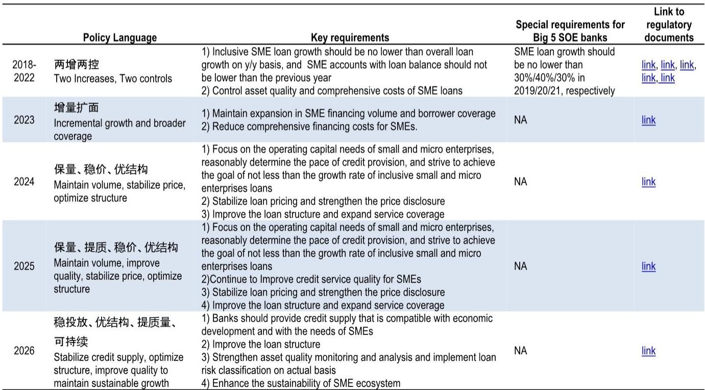
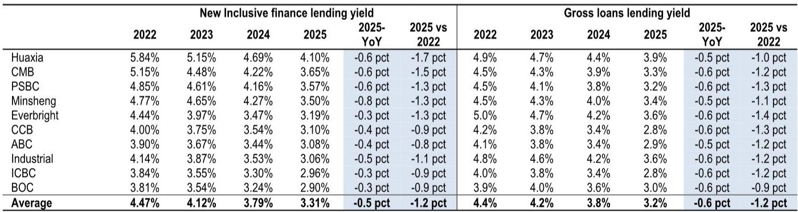
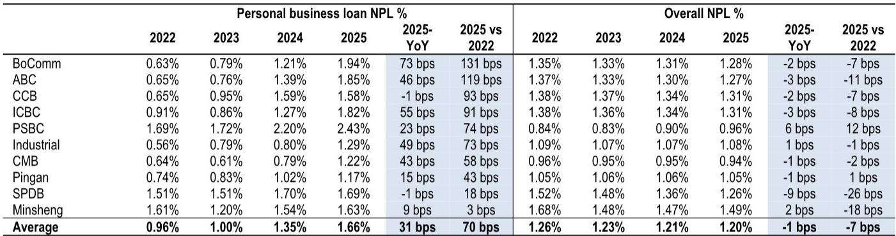

# 监管转向的真正含义：小微贷款从“量”的竞赛进入“质”的清算

过去五年，中国银行业最激进的资产扩张故事之一，是小微企业普惠金融贷款。从2020年到2025年，国有大行的普惠贷款增速常年维持在系统平均增速的两倍以上，部分银行这一资产的五年复合增长率超过30%。但2026年5月19日，国家金融监管总局发布的《关于2026年小微企业金融服务工作的通知》，悄然终结了这一叙事。核心变化只有一句话：不再明确鼓励小微贷款规模增长。

这份投行研报的核心判断是：这一政策转向在短期内将加剧小微贷款的资产质量压力，但中期可能带来贷款定价的温和修复。然而，真正值得投资者关注的，不是这一判断本身，而是它揭示的一个更深层问题——过去几年银行在小微领域的规模竞赛，究竟掩盖了多少结构性风险。

## 1. 规模竞赛的代价：小微贷款的经济学在过去三年持续恶化

从2022年到2025年，新发放普惠小微贷款的平均利率下降了1.2个百分点至3.31%，而同期个人经营性贷款（普惠金融的子类别）的不良率却上升了70个基点至1.66%。这意味着，银行在小微贷款上的风险调整后收益正在加速收窄。

这不是一个对称的变化。利率下行是政策引导和竞争加剧共同作用的结果，而不良率上升则反映了小微企业真实偿债能力的持续弱化。研报引用的数据显示，自疫情以来，大型企业与小型企业在利息覆盖倍数和应收账款周转天数上出现了显著分化。小型工业企业的利息覆盖倍数已降至5倍左右，而大中型企业仍维持在9倍以上；小型企业的应收账款周转天数则攀升至90天，远高于大中型企业的75天。

这些数字合在一起意味着一个残酷的事实：在规模竞赛中，银行以越来越低的价格向风险越来越高的客群投放了越来越多的贷款。当政策从“鼓励增长”转向“关注质量”，这个积累的风险敞口将首先面临清算。

## 2. 国有大行退出的节奏，决定了资产质量压力的节奏和分布

研报中最值得关注的图表之一，是国有大行普惠贷款增速与系统平均增速的对比。数据显示，国有大行的普惠贷款增速从2021年初的近50%持续下行至2026年一季度的16.5%，但仍高于系统平均增速的9.5%。这意味着，国有大行过去五年一直是普惠贷款增长的核心推动力。

政策转向后，国有大行的普惠贷款增速将进一步放缓。但这里的关键问题不是“会不会放缓”，而是“以什么节奏放缓”。如果国有大行快速收缩，小微企业的还款压力将迅速上升，因为许多企业依赖借新还旧来维持现金流。如果缓慢退出，资产质量压力可能被拉长，但定价修复的时间点也会推迟。

研报倾向于认为，短期内资产质量压力将加剧，尤其是在那些对国有大行信贷依赖度较高的区域和行业。但这一判断仍有一个重要的未解问题：国有大行退出的具体节奏取决于监管指导的力度和银行自身的风险偏好，而这两者在当前环境下都存在不确定性。

## 3. 不同银行的处境分化：谁在裸泳，谁有护城河

研报对不同类型银行的判断，本质上是在回答一个问题：当规模竞赛结束时，哪些银行的资产负债表能够承受住压力测试？

对于国有大行和股份制银行，研报的偏好排序清晰：建设银行和浦发银行优于邮储银行。理由在于，建设银行和浦发银行的个人经营性贷款不良率在2025年出现了边际改善，而邮储银行不仅普惠贷款敞口最大（占全部贷款的18.5%），而且贷款收益率持续下降、不良率持续上升。换句话说，邮储银行在小微领域的规模优势，在政策转向后可能变成一种结构性劣势。

对于城商行和农商行，研报的判断更为微妙。短期来看，资产质量压力是普遍性的，尤其是常熟银行，其普惠贷款占比高达41.5%，且个人经营性贷款资产质量仍在恶化。但中期来看，那些具备真实小微服务能力的区域性银行，可能从大型银行退出的过程中获益。研报特别提到，常熟银行的“贷款工厂”模式和对本地市场的深耕，使其在竞争正常化后有望重新获得市场份额。

这里有一个值得深思的观察：过去五年，大型银行凭借资金成本和品牌优势，在普惠贷款领域对区域性银行形成了明显的挤压。政策转向后，这种挤压将逐步解除，但区域性银行能否真正收复失地，取决于它们是否在过去几年中保持了审慎的信贷标准和差异化的客户关系。研报对常熟银行的谨慎态度，恰恰说明这种能力的验证需要时间。

## 4. 报告尚未完全回答的关键问题：定价修复的幅度和资产质量拐点的条件

研报的核心乐观逻辑是：随着贷款增速放缓，尤其是国有大行退出一部分竞争，小微贷款的定价有望温和修复。但这一逻辑有两个关键假设尚未被充分验证。

第一，定价修复的幅度有多大？研报指出，即使竞争缓解，银行的整体风险偏好仍然较低，小微企业的偿债能力尚未恢复。这意味着，贷款定价的上行空间可能受到需求端疲软的限制。从历史数据看，新发放普惠小微贷款利率从2022年的约4.5%降至2025年的约3.3%，如果定价修复，能回到什么水平？3.5%还是4%？这个幅度差异对银行净息差的贡献完全不同。

第二，资产质量的拐点何时出现？研报没有给出明确的时间表。个人经营性贷款的不良率从2023年上半年的0.95%上升至2025年下半年的1.80%，这个上升趋势何时停止，取决于小微企业盈利能力的改善速度。而小微企业盈利能力的改善，又与宏观经济周期、应收账款回收效率、以及政策支持力度密切相关。这些变量在研报的分析框架中有所涉及，但没有形成可量化的预测。

这两个问题——定价修复的幅度和资产质量拐点的条件——是投资者在阅读完整报告时需要重点关注的内容。它们决定了“中期温和修复”这一判断到底是值得下注的路径，还是过于乐观的假设。

## 5. 一个更长期的观察框架：从“规模扩张”到“能力验证”的估值逻辑切换

政策转向的意义，不仅在于短期资产质量和中期定价的变化，更在于它可能改变市场对银行股，尤其是区域性银行的估值逻辑。

过去几年，市场对银行小微业务的评估，主要看两个指标：增速和市场份额。谁能更快地扩大普惠贷款规模，谁就能获得更高的估值溢价。这种逻辑在政策鼓励增长的环境中是有道理的，因为规模意味着政策支持、存款派生和客户粘性。

但政策转向后，评估逻辑将从“规模扩张”切换到“能力验证”。投资者需要关注的不再是“谁增长最快”，而是“谁在风险控制、定价能力和客户关系维护上做得最好”。具体来说，有三个指标值得持续跟踪：

第一，个人经营性贷款的不良率趋势。这是检验银行小微风控能力的核心指标。研报中建设银行和浦发银行的不良率改善，就是一个积极的信号。

第二，新发放小微贷款的定价走势。在竞争缓解后，哪些银行能够率先实现定价修复，反映了它们的议价能力和客户黏性。

第三，区域性银行在本地市场的份额变化。如果大型银行退出后，区域性银行能够重新获得市场份额，说明它们具备真正的本地化竞争优势。

这三个指标合在一起，构成了一个更完整的银行小微业务评估框架。而研报对不同银行的分化判断，本质上就是在这个框架下进行的初步筛选。

## 6. 顺着这些未解问题继续讨论

政策转向的短期冲击已经清晰，但中期演化的路径仍充满不确定性。定价修复的幅度取决于需求端恢复的节奏，资产质量的拐点取决于小微企业盈利能力的改善，而国有大行退出的速度则取决于监管和银行自身的博弈。这些变量中的每一个，都可能改变研报核心判断的成立条件。

在星球微信群里，我们会围绕这些未解问题继续展开讨论：如何跟踪小微企业的真实偿债能力变化，哪些宏观指标可以提前预警资产质量拐点，以及不同银行的敞口差异如何影响投资组合的构建。如果你对这些话题感兴趣，欢迎加入我们的讨论。

---

Personal reading notes and learning share only. Not investment advice.

