# Global Luxury Goods

# Global Luxury Goods: The Future of Small Brands

  
Luca Solca

+41 582 723 126

luca.solca@bernsteinsg.com

  
Maria Meita

+44 20 7170 0540

maria.meita@bernsteinsg.com

Eric Chen, CFA

+852 2123 2628

eric.chen@bernsteinsg.com

Yi-Peng Khoo, CFA

+44 20 7676 6822

yi-peng.khoo@bernsteinsg.com

# Specialist Sales

Alix Turner

+44 20 7762 4044

alix.turner@bernsteinsg.com

It is time to put small luxury brands under the spotlight, following up on our work on mega-brands (The Future of Mega-Brands, 2013) and trailing “tail” brands (How Long Is Your Tail? 2009, Global Luxury Goods: How Long is your Tail? Reloaded 2020).

# A more stable consumer base is producing a better environment for smaller brands.

The fixed cost nature of the industry and new consumers driving most of the growth - all wanting to buy the “luxury essentials” - have favoured mega-brands in the past 30 years. The fixed cost structure of the industry doesn’t change. But a more established consumer base needing something new to part with their money provides a more favourable environment for smaller brands (see Weekend Consumer Blast: The Luxury Mega-Brand Bathtub – Redux).

# A CLEARER SMALL LUXURY BRANDS LANDSCAPE IS EMERGING

We see four major groups:

# High-end specialists

These brands operate at the highest price points and have virtually nothing for aspirational consumers in their assortment. They appear to be best positioned to capture the richest consumers turning to mega-brand alternatives and have been doing so for at least 15 years. Given their scale disadvantage, they are likely to continue to produce substandard retail space productivity, EBIT%, and ROIC. Publicly traded examples of this group are Zegna, Brunello Cucinelli, Loro Piana. Privately held companies include Kiton, Stefano Ricci.

# Category specialists

These brands stand out as recognised specialists in their category, while occupying the upper end of the pricing pyramid within the broader fashion and leather goods space. We find a diverse array of players in this cohort, as a function of their idiosyncratic product origin - e.g.

• Moncler in down jackets   
• Burberry in trench coats   
• Bottega Veneta in handbags

• Tod's and Salvatore Ferragamo in footwear

Most of these brands would like to be bigger and eventually become mega-brands. So they are trying to expand into adjacent product categories. This development path is both appropriate and frustrating: 1) Appeal outside of the core category would sustain growth (as it has for mega-brands before them: see Hermès or Chanel as examples); 2) Yet, moving into spaces occupied by mega-brands and other specialists often results in profit dilution.

Continued on the next page...

... continued from the first page

# Flankers

These brands squarely operate in the same price range and multi-category space that mega-brands occupy. In most cases, they are not differentiated enough to stand out because of either product or price specialisation. They are therefore destined to suffer most of the time. Their strategic role within larger groups is to serve as “flankers”: occupying retail space around mega-brands to keep competitor mega-brands at a distance, as well as sometimes overlapping in their positioning with competitor mega-brands to try and steal some of the tailwind behind them. In this group we have the “tail” we have written about: Fendi, Celine, Loewe, Kenzo, Balenciaga, Alexander McQueen, Miu Miu, etc.

# Meteors

Some flankers sometimes hit gold, manage to stand out and get more prominent than their meagre marketing budgets would normally allow and experience a significant growth spurt - only to most often fade behind the horizon as they become yesterday's stories. The break typically comes from a hero product (think Celine under Phoebe Philo); an aesthetic and marketing statement (think Celine under Hedi Slimane or the most recent Miu Miu); a home run success in a product category (think Alexander McQueen and sneakers); or a combination of several of these elements (think Balenciaga under Demna Gvasalia). The problem with these successes is that they most often cannot sustain. We have yet to see a meteor break into mega-brand territory. While we have seen many disappear back into oblivion.

# A FEW STRATEGIC IMPLICATIONS EMERGE FROM OUR PROPOSED BRAND TAXONOMY:

Shareholder value creation through small brands is structurally difficult, even in the current more favourable consumer environment. Small players are bound to suffer from structurally lower ROIC, as they stand at a scale disadvantage.

- Investors would need to benefit from small brands continuing to sustain growth, ideally above sector average. This is currently possible for high-end specialists like BC and Zegna; debatable for category specialists like Moncler; improbable for most flankers and meteors over the medium to long-term.   
- Alternatively, investors would need to benefit from catching a flanker just before it turns into a meteor. Which would call for a momentum investment approach with near-perfect timing.

Luxury conglomerates without a mega-brand would have little justification to own flankers within the broader luxury fashion and leather goods market. Richemont stands out in this respect, as owning brands like Chloe, Dunhill, Gianvito Rossi or Serapian seems - at best - only responding to a will to learn (at a cost) about soft luxury. But without any prospect of producing profit performance and capital returns anywhere near those of the hard luxury core business. More simply said: if you don't have a mega-brand, your small brands cannot be flankers, hence they serve very little constructive purpose.

Even major luxury conglomerates with deep pockets (courtesy of their mega-brands) benefit from pruning their flankers when markets are tough. The recent examples of Richemont divesting Baume & Mercier and LVMH selling Marc Jacobs are a case in point. Of course, selling loss making businesses is very difficult, which limits Kering's options when dealing with Alexander McQueen at the moment.

BERNSTEIN TICKER TABLE 

<table><tr><td rowspan="2">Ticker</td><td rowspan="2">Rating</td><td colspan="3">4 Jun 2026</td><td rowspan="2">TTMRel.</td><td colspan="4">Adjusted EPS</td><td colspan="3">Adjusted P/E (x)</td></tr><tr><td>ClosingPrice</td><td>PriceTarget</td><td>Target</td><td>Cur</td><td>2025A</td><td>2026E</td><td>2027E</td><td>2025A</td><td>2026E</td><td>2027E</td></tr><tr><td>BIRK (Birkenstock)</td><td>M</td><td>USD</td><td>42.99</td><td>50.00</td><td>(50.0)%</td><td>EUR</td><td>1.85</td><td>2.01</td><td>2.49</td><td>20.0</td><td>18.4</td><td>14.9</td></tr><tr><td>BC.IM (Brunello Cucinelli)</td><td>O</td><td>EUR</td><td>83.10</td><td>108.00</td><td>(35.0)%</td><td>EUR</td><td>1.99</td><td>2.26</td><td>2.65</td><td>41.8</td><td>36.8</td><td>31.3</td></tr><tr><td>BRBY.LN (Burberry)</td><td>O</td><td>GBp</td><td>1,112.00</td><td>1,300.00</td><td>(11.4)%</td><td>GBP</td><td>0.24</td><td>0.39</td><td>0.55</td><td>45.5</td><td>28.6</td><td>20.3</td></tr><tr><td>CFR.SW (Richemont)</td><td>O</td><td>CHF</td><td>164.55</td><td>200.00</td><td>(6.5)%</td><td>EUR</td><td>5.96</td><td>6.89</td><td>7.71</td><td>30.1</td><td>26.0</td><td>23.3</td></tr><tr><td>ZGN</td><td>O</td><td>USD</td><td>14.92</td><td>14.00</td><td>63.6%</td><td>EUR</td><td>0.45</td><td>0.42</td><td>0.60</td><td>28.4</td><td>30.4</td><td>21.3</td></tr><tr><td>RMS.FP (Hermes)</td><td>O</td><td>EUR</td><td>1,582.50</td><td>2,150.00</td><td>(46.8)%</td><td>EUR</td><td>43.12</td><td>44.33</td><td>52.47</td><td>36.7</td><td>35.7</td><td>30.2</td></tr><tr><td>KER.FP (Kering)</td><td>M</td><td>EUR</td><td>249.05</td><td>220.00</td><td>28.9%</td><td>EUR</td><td>4.35</td><td>6.66</td><td>10.04</td><td>57.2</td><td>37.4</td><td>24.8</td></tr><tr><td>MC.FP (LVMH)</td><td>O</td><td>EUR</td><td>474.10</td><td>600.00</td><td>(13.8)%</td><td>EUR</td><td>22.73</td><td>22.22</td><td>26.71</td><td>20.9</td><td>21.3</td><td>17.7</td></tr><tr><td>MONC.IM (Moncler)</td><td>M</td><td>EUR</td><td>53.50</td><td>57.50</td><td>(15.9)%</td><td>EUR</td><td>2.31</td><td>2.44</td><td>2.64</td><td>23.2</td><td>21.9</td><td>20.3</td></tr><tr><td>1913.HK (Prada SpA)</td><td>O</td><td>HKD</td><td>37.00</td><td>50.00</td><td>(72.9)%</td><td>EUR</td><td>0.33</td><td>0.32</td><td>0.36</td><td>12.2</td><td>12.9</td><td>11.4</td></tr><tr><td>SFER.IM (Ferragamo)</td><td>O</td><td>EUR</td><td>9.31</td><td>8.80</td><td>52.8%</td><td>EUR</td><td>(0.30)</td><td>0.04</td><td>0.15</td><td>(31.5)</td><td>247.9</td><td>63.4</td></tr><tr><td>UHR.SW (Swatch)</td><td>O</td><td>CHF</td><td>209.30</td><td>180.00</td><td>35.3%</td><td>CHF</td><td>0.03</td><td>4.32</td><td>8.16</td><td>N/M</td><td>48.4</td><td>25.6</td></tr><tr><td>SPX</td><td></td><td></td><td>7,584.31</td><td></td><td></td><td></td><td></td><td></td><td></td><td></td><td></td><td></td></tr><tr><td>EDME</td><td></td><td></td><td>1,548.21</td><td></td><td></td><td></td><td></td><td></td><td></td><td></td><td></td><td></td></tr><tr><td>EMLSF</td><td></td><td></td><td>6,043.37</td><td></td><td></td><td></td><td></td><td></td><td></td><td></td><td></td><td></td></tr><tr><td>ASIAX</td><td></td><td></td><td>2,024.37</td><td></td><td></td><td></td><td></td><td></td><td></td><td></td><td></td><td></td></tr></table>

O - Outperform, M - Market-Perform, U - Underperform, NR - Not Rated, CS - Coverage Suspended   
BRBY.LN, CFR.SW base year is 2026;   
Source: Bloomberg, Bernstein estimates and analysis.

# INVESTMENT IMPLICATIONS

The trajectory of a recovery in global luxury demand remains uncertain. We find two sources of volatility at play: a) underlying demand gyrations, as consumers navigate a fragile macro-economic environment and a tenser and tenser geopolitical environment; and b) short-term investors playing the sector long and short, amplifying upswings and downswings beyond natural news flow. In this context of heightened uncertainty, we would take a more defensive posture with a core exposure to plain vanilla:

1) We would prefer high-quality names “at fair value”... Richemont is our top preference due to strong jewellery momentum and leadership, with Brunello Cucinelli also favored for their quality and potential mean reversion. It is difficult to be positive on Hermès in the short-term, but one weak quarter can be forgiven by the market, if they return to high single digit growth (Hermès: Valuations already discount a 'Ferrari reset').   
2) ...as well as the self-help stories with more promising trajectories. LVMH sits between high quality and self-help. Lingering concerns around the W&S turnaround and the Arnault family's ‘Darwinian’ succession process are counter-balanced by Dior's revival, cost efficiencies, and Louis Vuitton's strength; Turnaround at Burberry is well on track. One-year anniversary of the Burberry Forward strategy has paid off, in the form of improved brand momentum and stronger full-price sell-through. With a solid foundation in place, the next leg of the turnaround will see focus shifting to driving store productivity, by capitalizing on the extended momentum in other categories from the core outerwear & scarf; Ferragamo is at the earlier stage of and trading at the lower end of the trading range. Recent conversation with management suggests a possible turnaround in the making, as a team of “old hands” are tackling key issues around the brand, assortment and retail store network.

# DETAILS

A more stable consumer base is producing a better environment for smaller brands. The fixed cost nature of the industry and new consumers driving most of the growth - all wanting to buy the “luxury essentials” - have favoured mega-brands in the past 30 years. The fixed cost structure of the industry doesn’t change. But a more established consumer base needing something new to part with their money provides a more favourable environment for smaller brands (see Weekend Consumer Blast: The Luxury Mega-Brand Bathtub – Redux).

# A CLEARER SMALL LUXURY BRANDS LANDSCAPE IS EMERGING

We see four major groups:

EXHIBIT 1: Conceptual charts for (category and high-end) Specialists   
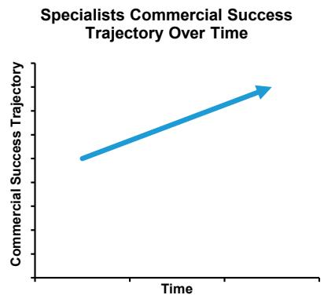

line

| Time | Commercial Success Trajectory |
| ---- | ----------------------------- |
| 0    | 0                             |
| 1    | 1                             |
| 2    | 2                             |
| 3    | 3                             |
| 4    | 4                             |
| 5    | 5                             |
| 6    | 6                             |
| 7    | 7                             |
| 8    | 8                             |
| 9    | 9                             |
| 10   | 10                            |

Source: Bernstein analysis

EXHIBIT 2: Conceptual charts for Flankers   
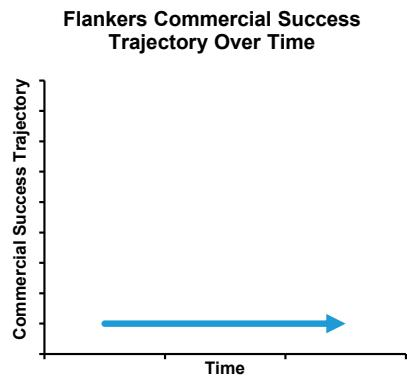

line

| Time | Commercial Success Trajectory |
| ---- | ----------------------------- |
| 0    | 0                             |
| 1    | 1                             |
| 2    | 2                             |
| 3    | 3                             |
| 4    | 4                             |
| 5    | 5                             |
| 6    | 6                             |
| 7    | 7                             |
| 8    | 8                             |
| 9    | 9                             |
| 10   | 10                            |

Source: Bernstein analysis

EXHIBIT 3: Conceptual charts for Meteors   
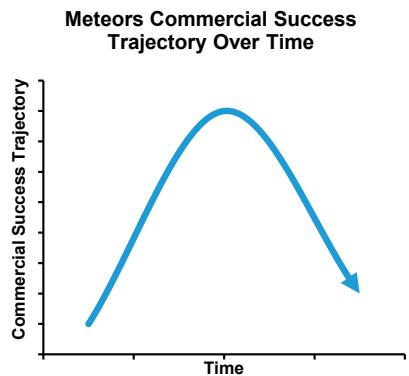

line

| Time | Commercial Success Trajectory |
| ---- | ----------------------------- |
| 0    | 0                             |
| Peak | High                          |
| End  | Low                           |

Source: Bernstein analysis

EXHIBIT 4: Examples of High-end Specialist, Flanker and Meteor   
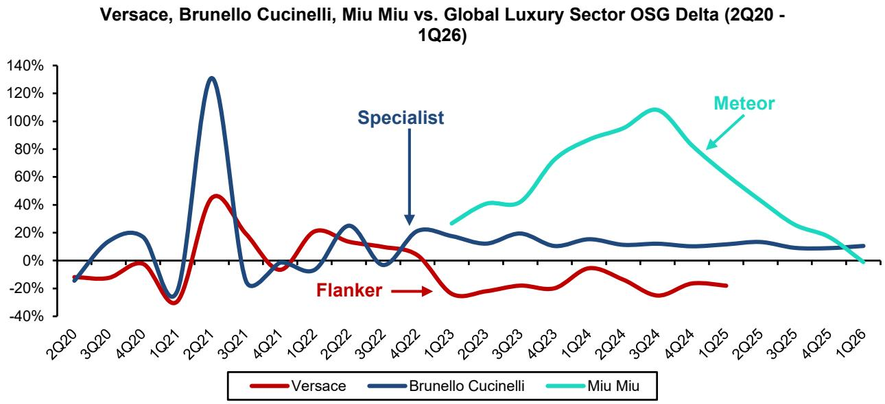

line

| Quarter | Versace | Brunello Cucinelli | Miu Miu |
|---------|---------|---------------------|---------|
| 2Q20    | -15%    | -10%                | -       |
| 3Q20    | -10%    | 15%                 | -       |
| 4Q20    | -5%     | 20%                 | -       |
| 1Q21    | -30%    | -30%                | -       |
| 2Q21    | 45%     | 130%                | -       |
| 3Q21    | 20%     | -20%                | -       |
| 4Q21    | -5%     | -10%                | -       |
| 1Q22    | 20%     | 25%                 | -       |
| 2Q22    | 15%     | 10%                 | -       |
| 3Q22    | 10%     | 5%                  | -       |
| 4Q22    | 5%      | 0%                  | -       |
| 1Q23    | -15%    | 20%                 | 30%     |
| 2Q23    | -10%    | 15%                 | 40%     |
| 3Q23    | -5%     | 10%                 | 50%     |
| 4Q23    | -5%     | 10%                 | 70%     |
| 1Q24    | -5%     | 10%                 | 85%     |
| 2Q24    | -5%     | 10%                 | 95%     |
| 3Q24    | -5%     | 10%                 | 105%    |
| 4Q24    | -5%     | 10%                 | 90%     |
| 1Q25    | -5%     | 10%                 | 70%     |
| 2Q25    | -5%     | 10%                 | 50%     |
| 3Q25    | -5%     | 10%                 | 30%     |
| 4Q25    | -5%     | 10%                 | 15%     |
| 1Q26    | -5%     | 10%                 | 0%      |

Source: Company reports, Bernstein analysis

# High-end specialists

These brands operate at the highest price points and have virtually nothing for aspirational consumers in their assortment. They appear to best positioned to capture the richest consumers turning to mega-brand alternative and have been doing so for at least 15 years. Given their scale disadvantage, they are likely to continue to produce substandard retail space

productivity, EBIT%, and ROIC. Publicly traded examples of this group are Zegna, Brunello Cucinelli, Loro Piana. Privately held companies include Kiton, Stefano Ricci.

EXHIBIT 5: The high-end specialists, operating at the highest price points, are best positioned to capture the richest consumers turning to mega-brand alternative   
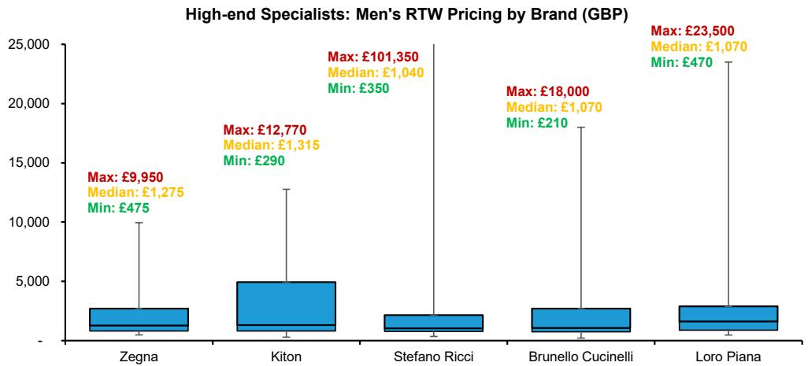

bar

| Brand           | Max     | Median  | Min     |
| --------------- | ------- | ------- | ------- |
| Zegna           | £9,950  | £1,275  | £475    |
| Kiton           | £12,770 | £1,315  | £290    |
| Stefano Ricci   | £101,350| £1,040  | £350    |
| Brunello Cucinelli | £18,000 | £1,070  | £210    |
| Loro Piana      | £23,500 | £1,070  | £470    |

Only menswear RTW products are compared. Prices are obtained from UK brand.com, except Kiton and Stefano Ricci, where prices are only listed in EUR and converted to GBP at EURGBP spot rate  
Source: brand.com

EXHIBIT 6: Given their scale disadvantage, high-end specialists are likely to continue to produce substandard retail space productivity, EBIT%, and ROIC   
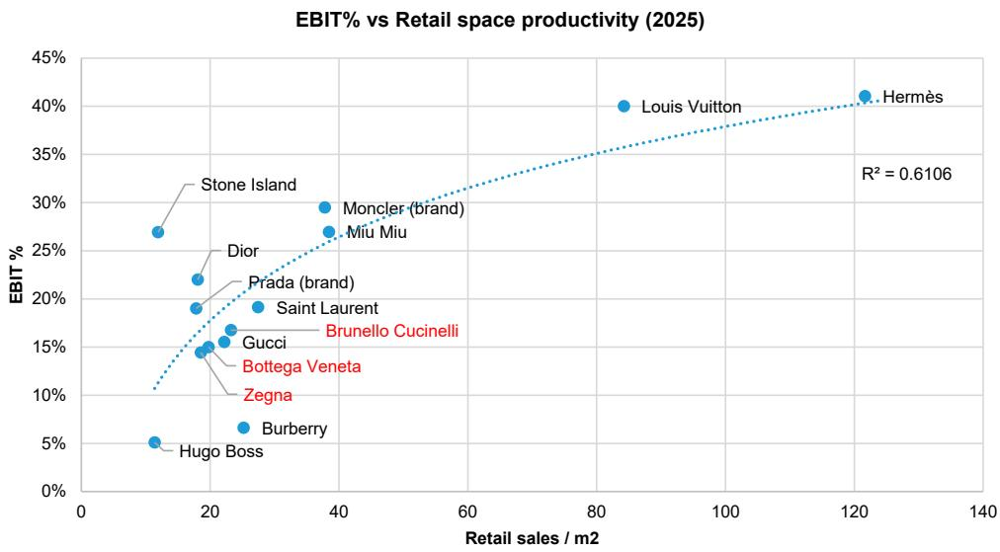

scatter

| Brand             | Retail sales / m2 | EBIT % |
| ----------------- | ----------------- | ------ |
| Hermès            | 120               | 41     |
| Louis Vuitton     | 85                | 40     |
| Moncler (brand)   | 38                | 29     |
| Miù Miu           | 38                | 27     |
| Dior              | 18                | 22     |
| Stone Island      | 12                | 27     |
| Prada (brand)     | 25                | 19     |
| Saint Laurent     | 25                | 19     |
| Gucci             | 20                | 15     |
| Bottega Veneta    | 20                | 15     |
| Brunello Cucinelli| 20                | 16     |
| Zegna             | 20                | 15     |
| Burberry          | 25                | 7      |
| Hugo Boss         | 10                | 5      |

Source: Company reports, Bernstein analysis and estimates

# Category specialists

These brands stand out as recognised specialists in their category, while occupying the upper end of the pricing pyramid within the broader fashion and leather goods space. We find a diverse array of players in this cohort, as a function of their idiosyncratic product origin - e.g.

• Moncler in down jackets

• Burberry in trench coats   
• Bottega Veneta in handbags

• Tod's and Salvatore Ferragamo in footwear

Most of these brands would like to be bigger and eventually become mega-brands. So they are trying to expand into adjacent product categories. This development path is both appropriate and frustrating: 1) Appeal outside of the core category would sustain growth (as it has for mega-brands before them: see Hermès or Chanel as examples); 2) Yet, moving into spaces occupied by mega-brands and other specialists often results in profit dilution.

EXHIBIT 7: Moncler (down jackets) and Burberry (trench coats) are specialist outerwear brands that command the highest pricing within their respective peer groups, though they remain priced below luxury mega-brands   
Category Specialists - Women's Outerwear Pricing by Brand (GBP)   
Ranked by median prices   
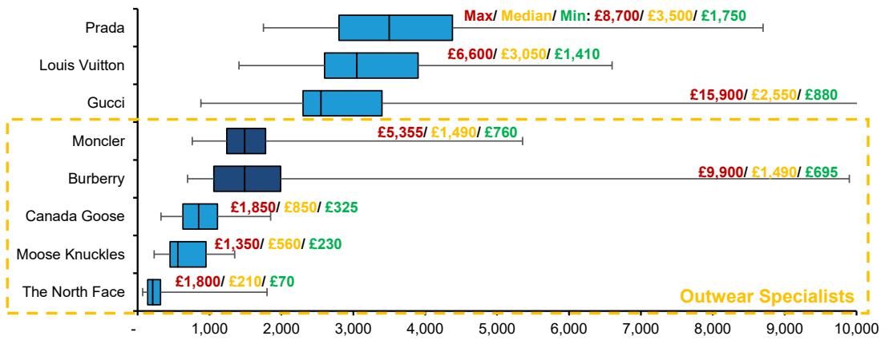

bar

| Brand | Max/ Median/ Min (£) | Outwear Specialists (£) |
| :--- | :--- | :--- |
| Prada | 8,700/ £3,500/ £1,750 | |
| Louis Vuitton | 6,600/ £3,050/ £1,410 | |
| Gucci | 15,900/ £2,550/ £880 | |
| Moncler | 5,355/ £1,490/ £760 | |
| Burberry | 9,900/ £1,490/ £695 | |
| Canada Goose | 1,850/ £850/ £325 | |
| Moose Knuckles | 1,350/ £560/ £230 | |
| The North Face | 1,800/ £210/ £70 | |

All data are collected from the UK brand.com.   
Source: brand.com, Bernstein analysis

EXHIBIT 8: A similar dynamic applies to Tod's and Ferragamo, which lead pricing among footwear peers but still lag behind luxury mega-brands   
Category Specialists - Women's Shoes Pricing Range by Brand (GBP)   
Ranked by median prices   
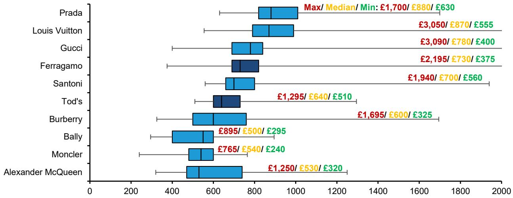

bar

| Brand             | Max/ Median/ Min: | Price     |
| ----------------- | ----------------- | --------- |
| Prada             | £1,700/£880/£630   |           |
| Louis Vuitton     | £3,050/£870/£555   |           |
| Gucci             | £3,090/£780/£400   |           |
| Ferragamo         | £2,195/£730/£375   |           |
| Santoni           | £1,940/£700/£560   |           |
| Tod's             | £1,295/£640/£510   |           |
| Burberry          | £1,695/£600/£325   |           |
| Bally             | £895/£500/£295    |           |
| Moncler           | £765/£540/£240    |           |
| Alexander McQueen | £1,250/£530/£320   |           |

All data are collected from the UK brand.com. Thigh-high boots are excluded.   
Source: brand.com, Bernstein analysis

EXHIBIT 9: Bottega Veneta's women's handbags are positioned at the very top of the pricing spectrum, leading across minimum, median, and maximum price points   
Category Specialists - Women's Hangbag Pricing by Brand (GBP)   
Ranked by median prices   
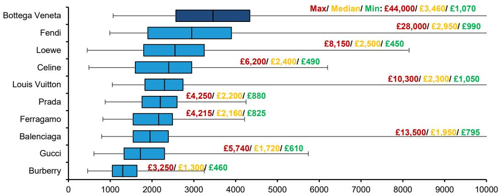

bar

| Brand | Max/ Median/ Min (£) | Max/ Max/ Min (£) |
| :--- | :--- | :--- |
| Bottega Veneta | 44,000/ £3,460/ £1,070 | 44,000/ £3,460/ £1,070 |
| Fendi | 28,000/ £2,950/ £990 | 28,000/ £2,950/ £990 |
| Loewe | 8,150/ £2,500/ £450 | 8,150/ £2,500/ £450 |
| Celine | 6,200/ £2,400/ £490 | 6,200/ £2,400/ £490 |
| Louis Vuitton | 10,300/ £2,300/ £1,050 | 10,300/ £2,300/ £1,050 |
| Prada | 4,250/ £2,200/ £880 | 4,250/ £2,200/ £880 |
| Ferragamo | 4,215/ £2,160/ £825 | 4,215/ £2,160/ £825 |
| Balenciaga | 13,500/ £1,950/ £795 | 13,500/ £1,950/ £795 |
| Gucci | 5,740/ £1,720/ £610 | 5,740/ £1,720/ £610 |
| Burberry | 3,250/ £1,300/ £460 | 3,250/ £1,300/ £460 |

All data are collected from the UK brand.com. Pouches and pouchettes are excluded.
Source: brand.com, Bernstein analysis

EXHIBIT 10: Moncler's OSG, along with its consensus NTM P/E multiple, exhibits a clear seasonal pattern—declining into the summer months and rebounding in winter—despite the company's ongoing efforts to expand its summerwear offering   
Moncler - Quarterly OSG vs. Consensus NTM PE Evolution (1Q21 to 1Q26)   
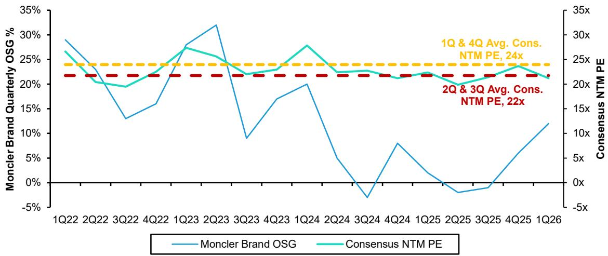

line

| Quarter | Moncler Brand OSG | Consensus NTM PE |
|---------|-------------------|------------------|
| 1Q22    | ~29%              | ~27%             |
| 2Q22    | ~25%              | ~23%             |
| 3Q22    | ~13%              | ~20%             |
| 4Q22    | ~16%              | ~22%             |
| 1Q23    | ~28%              | ~27%             |
| 2Q23    | ~32%              | ~25%             |
| 3Q23    | ~9%               | ~23%             |
| 4Q23    | ~17%              | ~24%             |
| 1Q24    | ~20%              | ~28%             |
| 2Q24    | ~5%               | ~23%             |
| 3Q24    | ~-3%              | ~23%             |
| 4Q24    | ~8%               | ~23%             |
| 1Q25    | ~3%               | ~23%             |
| 2Q25    | ~-1%              | ~20%             |
| 3Q25    | ~0%               | ~21%             |
| 4Q25    | ~5%               | ~24%             |
| 1Q26    | ~12%              | ~21%             |

Source: Company reports, Bloomberg, Bernstein analysis

# Flankers

These brands squarely operate in the same price range and multi-category space that mega-brands occupy. In most cases, they are not differentiated enough to stand out because of either product or price specialisation. They are therefore destined to suffer most of the time. Their strategic role within larger groups is to serve as “flankers”: occupying retail space around mega-brands to keep competitor mega-brands at a distance, as well as sometimes overlapping in their positioning with competitor mega-brands to try and steal some of the tailwind behind them. In this group we have the “tail” we have written about: Fendi, Celine, Loewe, Kenzo, Balenciaga, Alexander McQueen, Miu Miu, etc.

EXHIBIT 11: The flankers squarely operate in the same price range...   
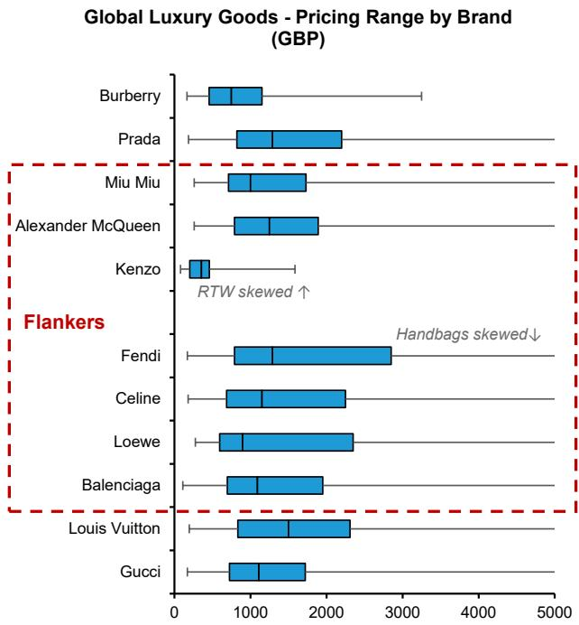

bar

| Brand             | Price Range (GBP) |
| ----------------- | ----------------- |
| Burberry          | ~800–1200         |
| Prada             | ~1000–2200        |
| Miu Miu           | ~800–1600         |
| Alexander McQueen | ~800–1800         |
| Kenzo             | ~400–900          |
| Fendi              | ~1200–2800        |
| Celine            | ~1000–2200        |
| Loewe             | ~800–2400         |
| Balenciaga        | ~800–1900         |
| Louis Vuitton     | ~1200–2200        |
| Gucci             | ~800–1700         |

All data are collected from the UK brand.com. Whiskers represent the minimum and maximum prices, while the bottom, midpoint and top of the box are 1st quartile, median and 3rd quartile prices, across handbags, RTW, shoes and small leather goods   
Source: brand.com, Bernstein analysis

EXHIBIT 12: ...and multi-category space that mega-brands occupy   
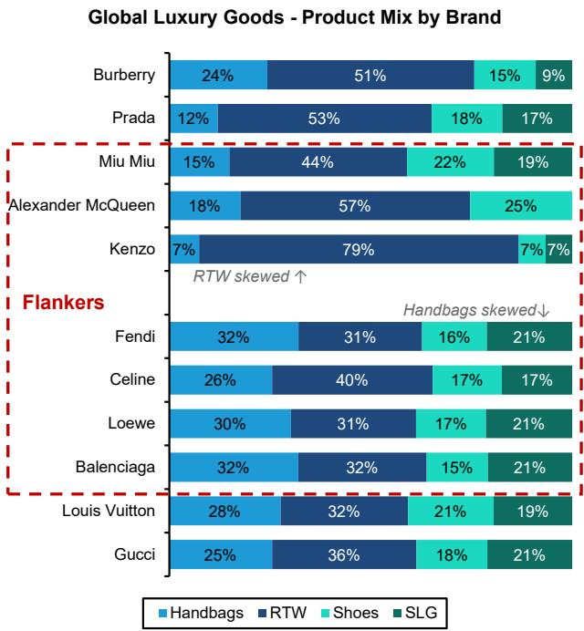

bar_stacked

| Brand             | Handbags | RTW  | Shoes | SLG  |
| ----------------- | -------- | ---- | ----- | ---- |
| Burberry          | 24%      | 51%  | 15%   | 9%   |
| Prada             | 12%      | 53%  | 18%   | 17%  |
| Miu Miu           | 15%      | 44%  | 22%   | 19%  |
| Alexander McQueen | 18%      | 57%  | 25%   |      |
| Kenzo             | 7%       | 79%  | 7%    | 7%   |
| Fendi             | 32%      | 31%  | 16%   | 21%  |
| Celine            | 26%      | 40%  | 17%   | 17%  |
| Loewe             | 30%      | 31%  | 17%   | 21%  |
| Balenciaga        | 32%      | 32%  | 15%   | 21%  |
| Louis Vuitton     | 28%      | 32%  | 21%   | 19%  |
| Gucci             | 25%      | 36%  | 18%   | 21%  |

All data are collected from the UK brand.com. We've excluded accessories/jewellery as a category, as the definition varies across brands
Source: brand.com, Bernstein analysis

EXHIBIT 13: Their strategic role within larger groups is to serve as “flankers”: occupying retail space around mega-brands to keep competitor mega-brands at a distance   
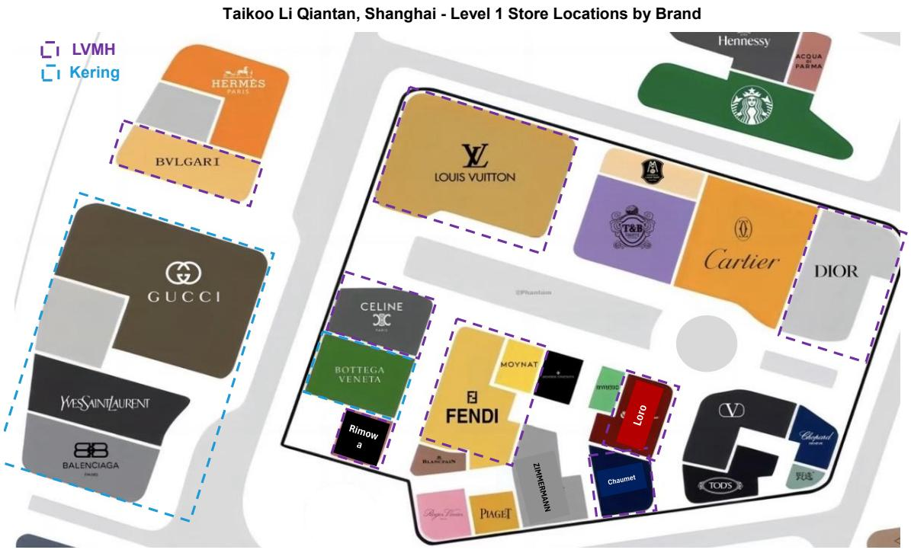

text_image

Taikoo Li Qiantan, Shanghai - Level 1 Store Locations by Brand
LVMH
Kering
HERMES PARIS
BVLGARI
GUCCI
WESAINT LAURENT
BALENCIAGA (PARIS)
CELINE CHINA
BOTTEGA VENETA
FENDI
RIMOWA
MOYNAT
ZIMMERMANN
PIAGET
BLANT PAIN
Chiurnet
TAODS
HENNESSY
ACQUA PARMA
T&B
Cartier
DIOR
@Phantom
LORO
VIVIANDER
Chauemet

Source: Company website, RED, Bernstein analysis

# Meteors

Some flankers sometimes hit gold, manage to stand out and get more prominent than their meagre marketing budgets would normally allow and experience a significant growth spurt - only to most often fade behind the horizon as they become yesterday's stories. The break typically comes from a hero product (think Celine under Phoebe Philo); an aesthetic and marketing statement (think Celine under Hedi Slimane or the most recent Miu Miu); a home run success in a product category (think Alexander McQueen and sneakers); or a combination of several of these elements (think Balenciaga under Demna Gvasalia). The problem with these successes is that they most often cannot sustain. We have yet to see a meteor break into mega-brand territory. While we have seen many disappear back into oblivion.

EXHIBIT 14: Miu Miu recently struck a chord with its distinctive aesthetic positioning; however, the subsequent growth surge appears to have tapered off alongside a moderation in brand momentum   
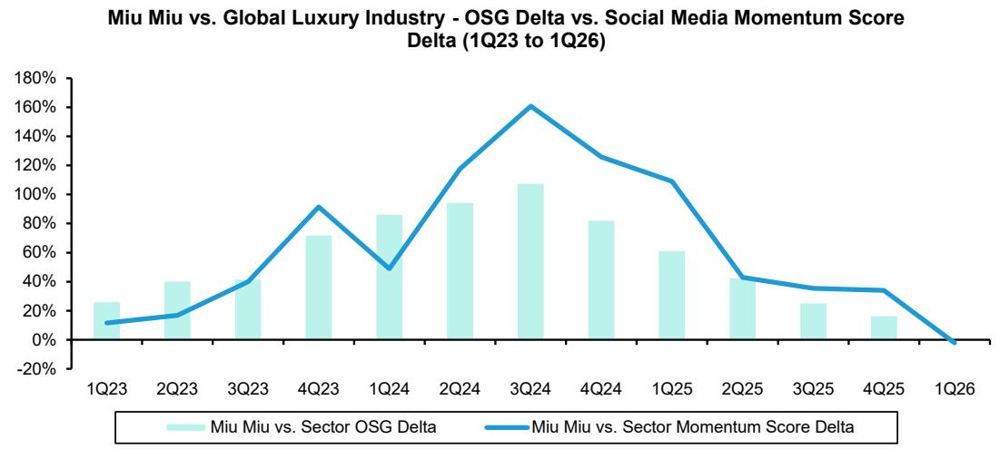

bar_line

Miu Miu vs. Global Luxury Industry - OSG Delta vs. Social Media Momentum Score Delta (1Q23 to 1Q26)
| Quarter | Miu Miu vs. Sector OSG Delta (%) | Miu Miu vs. Sector Momentum Score Delta (%) |
| :--- | :--- | :--- |
| 1Q23 | 25 | 12 |
| 2Q23 | 40 | 18 |
| 3Q23 | 40 | 38 |
| 4Q23 | 72 | 92 |
| 1Q24 | 85 | 48 |
| 2Q24 | 94 | 118 |
| 3Q24 | 107 | 160 |
| 4Q24 | 82 | 126 |
| 1Q25 | 60 | 108 |
| 2Q25 | 40 | 42 |
| 3Q25 | 25 | 35 |
| 4Q25 | 15 | 33 |
| 1Q26 | -5 | -3 |

China and West social media momentum scores are averaged for each brand (excluding Ralph Lauren)
Source: Company reports, Bernstein estimates and analysis

EXHIBIT 15: Balenciaga under Demna is another illustrative example: the brand significantly outperformed the sector between 2017 and 2021 as it capitalised on the broader shift toward streetwear. However, this momentum subsequently reversed, with performance deteriorating following brand marketing controversies and as its aesthetic fell out of favour   
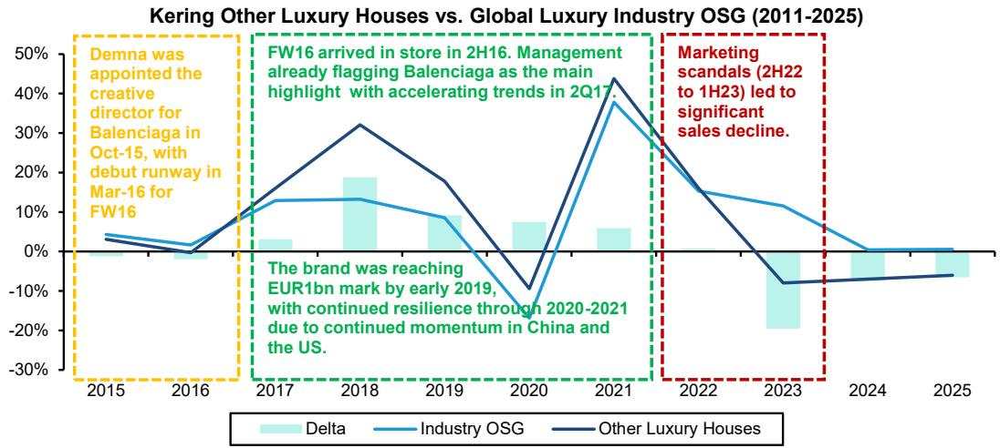

line

| Year | Delta | Industry OSG | Other Luxury Houses |
|------|-------|--------------|---------------------|
| 2015 | 0%    | 0%           | 0%                  |
| 2016 | 0%    | 0%           | 0%                  |
| 2017 | 0%    | 10%          | 10%                 |
| 2018 | 15%   | 15%          | 30%                 |
| 2019 | 5%    | 5%           | 15%                 |
| 2020 | 5%    | -15%         | -10%                |
| 2021 | 5%    | 35%          | 45%                 |
| 2022 | 0%    | 15%          | 15%                 |
| 2023 | -20%  | 10%          | -10%                |
| 2024 | 0%    | 0%           | -5%                 |
| 2025 | 0%    | 0%           | -5%                 |

Source: Company reports, Bernstein analysis

# A FEW STRATEGIC IMPLICATIONS EMERGE FROM OUR PROPOSED BRAND TAXONOMY:

Shareholder value creation through small brands is structurally difficult, even in the current more favourable consumer environment. Small players are bound to suffer from structurally lower ROIC, as they stand at a scale disadvantage.

- Investors would need to benefit from small brands continuing to sustain growth, ideally above sector average. This is currently possible for high-end specialists like BC and Zegna; debatable for category specialists like Moncler; improbable for most flankers and meteors over the medium to long-term.   
- Alternatively, investors would need to benefit from catching a flanker just before it turns into a meteor. Which would call for a momentum investment approach with near-perfect timing.

EXHIBIT 16: The mega-brands virtuous cycle underscores how they can accumulate and compound competitive advantages in periods characterised by strong inflows of new middle-class consumers   
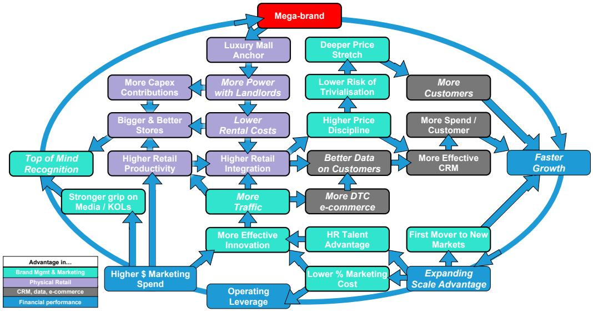

flowchart

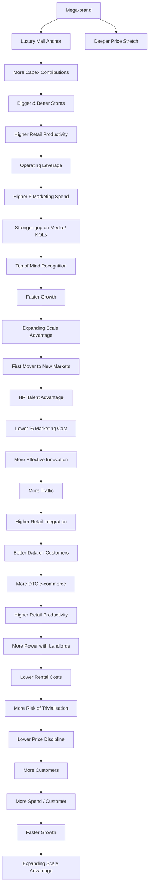

Source: Bernstein analysis   
Numbers in data labels represent CY2025 Marketing Spend (EURmn)

EXHIBIT 17: However, even in the current environment—arguably more supportive of smaller brands—the scale of resources available to large players remains a significant barrier to competition, making it challenging for smaller brands not only to compete effectively but also to sustain outperformance over time

Global Luxury Goods - Group Revenue vs. Marketing Spend (CY2025)

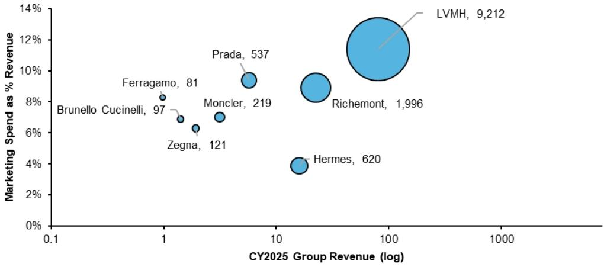

bubble

| Company | CY2025 Group Revenue (log) | Marketing Spend as % Revenue (%) |
| :--- | :--- | :--- |
| LVMH | 9,212 | 11.5 |
| Richemont | 1,996 | 8.8 |
| Prada | 537 | 9.4 |
| Moncler | 219 | 7.0 |
| Ferragamo | 81 | 8.3 |
| Brunello | 97 | 6.9 |
| Cucinelli | 1 | 6.8 |
| Zegna | 121 | 6.2 |
| Hermes | 620 | 3.9 |

Source: Company reports, Bernstein analysis

EXHIBIT 18: Miu Miu, a notable example of a smaller brand that experienced a meteoric rise, also appears to have lost momentum   
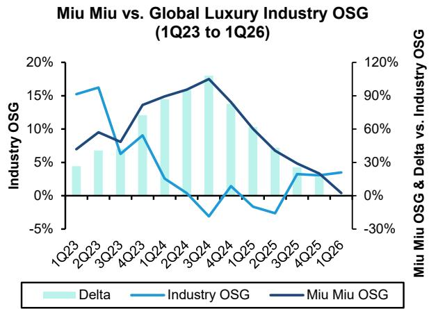

bar_line

Miu Miu vs. Global Luxury Industry OSG (1Q23 to 1Q26)
| Quarter | Delta (%) | Industry OSG (%) | Miu Miu OSG (%) |
|---|---|---|---|
| 1Q23 | 4.5 | 15.0 | 70 |
| 2Q23 | 6.5 | 16.0 | 90 |
| 3Q23 | 6.0 | 8.0 | 80 |
| 4Q23 | 12.0 | 9.0 | 70 |
| 1Q24 | 14.0 | 3.0 | 90 |
| 2Q24 | 15.0 | -1.0 | 100 |
| 3Q24 | 17.0 | -4.0 | 110 |
| 4Q24 | 16.0 | 1.0 | 90 |
| 1Q25 | 10.0 | -2.0 | 70 |
| 2Q25 | 8.0 | -3.0 | 50 |
| 3Q25 | 4.0 | -4.0 | 30 |
| 4Q25 | 3.0 | 3.0 | 20 |
| 1Q26 | 3.0 | 3.0 | 0 |

Source: Company reports, Bernstein analysis

EXHIBIT 19: In contrast, high-end specialists such as Brunello Cucinelli have consistently outperformed the industry, delivering superior performance in 8 of the past 12 years   
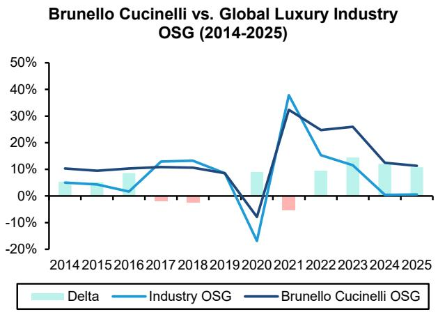

line

| Year | Delta | Industry OSG | Brunello Cucinelli OSG |
|------|-------|--------------|------------------------|
| 2014 | 5%    | 5%           | 10%                    |
| 2015 | 5%    | 5%           | 10%                    |
| 2016 | 10%   | 5%           | 10%                    |
| 2017 | 5%    | 10%          | 10%                    |
| 2018 | 5%    | 10%          | 10%                    |
| 2019 | 5%    | 5%           | 5%                     |
| 2020 | -10%  | -20%         | -10%                   |
| 2021 | 5%    | 40%          | 30%                    |
| 2022 | 5%    | 15%          | 25%                    |
| 2023 | 10%   | 10%          | 25%                    |
| 2024 | 5%    | 0%           | 10%                    |
| 2025 | 5%    | 0%           | 10%                    |

Source: Company reports, Bernstein analysis

Luxury conglomerates without a mega-brand would have little justification to own flankers within the broader luxury fashion and leather goods market. Richemont stands out in this respect, as owning brands like Chloe, Dunhill, Gianvito Rossi or Serapian seems - at best - only responding to a will to learn (at a cost) about soft luxury. But without any prospect of producing profit performance and capital returns anywhere near those of the hard luxury core business. More simply said: if you don't have a mega-brand, your small brands cannot be flankers, hence they serve very little constructive purpose.

EXHIBIT 20: Richemont's "Other" division—comprising soft luxury brands such as Chloé, Dunhill, Gianvito Rossi, and Serapian—has consistently underperformed JM, which houses the two hard luxury mega-brands, Cartier and VCA   
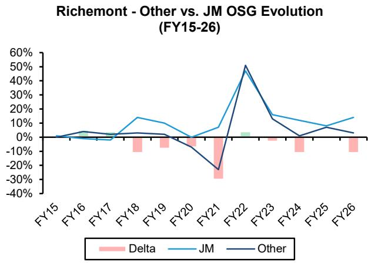

line

| Fiscal Year | Delta | JM   | Other |
|-------------|-------|------|-------|
| FY15        | -     | -    | -     |
| FY16        | -     | -    | 5%    |
| FY17        | -     | -    | 0%    |
| FY18        | -     | 15%  | 0%    |
| FY19        | -     | 10%  | 0%    |
| FY20        | -     | 0%   | -10%  |
| FY21        | -     | 5%   | -25%  |
| FY22        | 0%    | 50%  | 50%   |
| FY23        | -     | 15%  | 15%   |
| FY24        | -     | 10%  | 0%    |
| FY25        | -     | 5%   | 5%    |
| FY26        | -     | 15%  | 0%    |

EXHIBIT 21: Over the past decade, the “Other” division has been profitable in only two years, with a persistent and significant margin gap relative to JM   
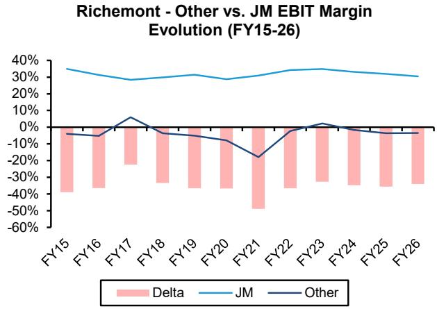

line

| Fiscal Year | Delta   | JM     | Other  |
|-------------|---------|--------|--------|
| FY15        | -40%    | 35%    | -5%    |
| FY16        | -40%    | 30%    | -5%    |
| FY17        | -20%    | 25%    | 5%     |
| FY18        | -30%    | 25%    | -5%    |
| FY19        | -30%    | 25%    | -10%   |
| FY20        | -30%    | 25%    | -10%   |
| FY21        | -50%    | 25%    | -20%   |
| FY22        | -30%    | 30%    | 0%     |
| FY23        | -30%    | 30%    | 5%     |
| FY24        | -30%    | 30%    | -5%    |
| FY25        | -30%    | 30%    | -5%    |
| FY26        | -30%    | 30%    | -5%    |

Source: Company reports, Bernstein analysis   
Source: Company reports, Bernstein analysis

Even major luxury conglomerates with deep pockets (courtesy of their mega-brands) benefit from pruning their flankers when markets are tough. The recent examples of Richemont divesting Baume & Mercier and LVMH selling Marc Jacobs are a case in point. Of course, selling loss making businesses is very difficult, which limits Kering's options when dealing with Alexander McQueen at the moment.

EXHIBIT 22: The smaller non-LV/Dior brands have underperformed the division's overall growth, with many likely operating at a loss today—particularly the 12 brands excluding Loewe and Loro Piana   
LVMH F&LG Revenue Mix - LV & Dlor vs. Others (2016-2025; EUR bn)   
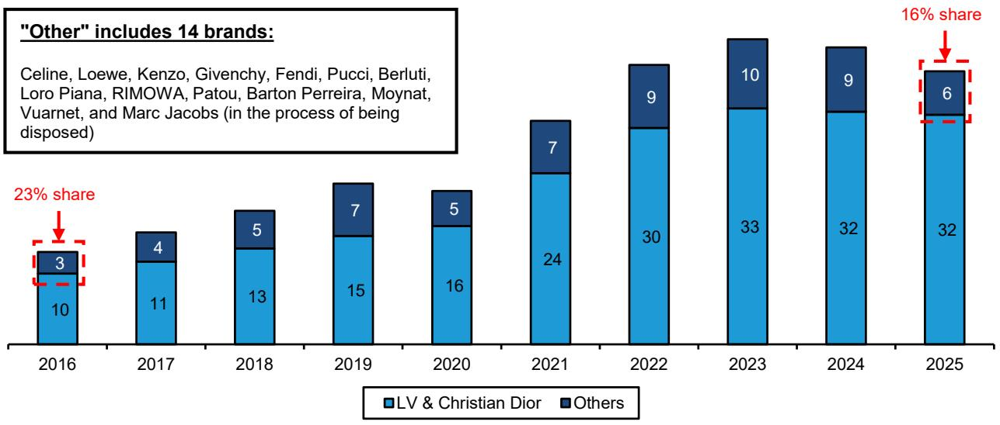

bar_stacked

"Other" includes 14 brands:
| Year | LV & Christian Dior | Others |
| :--- | :--- | :--- |
| 2016 | 10 | 3 |
| 2017 | 11 | 4 |
| 2018 | 13 | 5 |
| 2019 | 15 | 7 |
| 2020 | 16 | 5 |
| 2021 | 24 | 7 |
| 2022 | 30 | 9 |
| 2023 | 33 | 10 |
| 2024 | 32 | 9 |
| 2025 | 32 | 6 |

23% share (indicated by red dashed box) and "Other" includes 14 brands (in process of being disposed). The chart displays the distribution of two categories: "LV & Christian Dior" (light blue) and "Others" (dark blue), with percentages shown above each segment. The total number of shares for each year is labeled as "Other" (including 14 brands). The annotation "Other" includes "16%" in the top-right box. The chart visually represents the proportional share of each category per year.

Source: Company reports, Bernstein estimates and analysis

# I. REQUIRED DISCLOSURES

References to "Bernstein" or the "Firm" in these disclosures relate to the following entities: Bernstein Institutional Services LLC (April 1, 2024 onwards), Bernstein & Co., LLC (pre April 1, 2024), Bernstein Autonomous LLP, BSG France S.A. (April 1, 2024 onwards), Bernstein (Hong Kong) Limited 盛博香港有限公司, Bernstein (Canada) Limited, Bernstein (India) Private Limited (SEBI registration no. INH000006378), Bernstein (Singapore) Private Limited, Bernstein Japan KK (サンフォード・C・バーンスタイン株式会社) and analysts employed by SG Africa Technologies & Services to produce Bernstein under a Global Services Agreement in place between Bernstein and SG.

Bernstein is part of a joint venture between SG (SG) and AllianceBernstein, L.P. (AB). Unless specifically noted otherwise, for purposes of these disclosures, references to Bernstein's “affiliates” relate to both SG and AB and their respective affiliates.

# VALUATION METHODOLOGY

This research publication covers six or more companies. For valuation methodology and other company disclosures:

Please visit: https://bernstein-autonomous.bluematrix.com/sellside/Disclosures.action.

Or, you can also write to the Director of Compliance, Bernstein Institutional Services LLC, 245 Park Avenue, New York, NY 10167.

# RISKS

This research publication covers six or more companies. For risks and other company disclosures:

Please visit: https://bernstein-autonomous.bluematrix.com/sellside/Disclosures.action.

Or, you can also write to the Director of Compliance, Bernstein Institutional Services LLC, 245 Park Avenue, New York, NY 10167.

# RATINGS DEFINITIONS, BENCHMARKS AND DISTRIBUTION

# EQUITY RATINGS DEFINITIONS

# Bernstein brand

The Bernstein brand rates stocks based on forecasts of relative performance for the next 12 months versus the S&P 500 for stocks listed on the U.S. and Canadian exchanges, versus the Bloomberg Europe Developed Markets Large and Mid Cap Price Return Index EUR (EDME) for stocks listed on the European exchanges and emerging markets exchanges outside of the Asia Pacific region, versus the Bloomberg Japan Large and Mid Cap Price Return Index USD (JPL) for stocks listed on the Japanese exchanges, and versus the Bloomberg Asia ex-Japan Large and Mid Cap Price Return Index (ASIAX) for stocks listed on the Asian (ex-Japan) exchanges -unless otherwise specified.

The Bernstein brand has three categories of ratings:

- Outperform: Stock will outpace the market index by more than 15 pp   
• Market-Perform: Stock will perform in line with the market index to within +/-15 pp   
• Underperform: Stock will trail the performance of the market index by more than 15 pp

Coverage Suspended: Coverage of a company under the Bernstein brand has been suspended. Ratings and price targets are suspended temporarily, are no longer current, and should therefore not be relied upon.

Not Rated: A rating assigned when the stock cannot be accurately valued, or the performance of the company accurately predicted, at the present time. The covering analyst may continue to publish research reports on the company to update investors on events and developments.

Not Covered (NC) denotes companies that are not under coverage.

Bernstein brand stock ratings are based on a 12-month time horizon.

# Autonomous brand – common stocks

The Autonomous brand rates common stocks as indicated below. As our benchmarks we use the Bloomberg Europe 500 Banks And Financial Services Index (BEBANKS) and Bloomberg Europe Dev Mkt Financials Large and Mid Cap Price Ret Index EUR (EDMFI) index for developed European banks and Payments, the Bloomberg Europe 500 Insurance Index (BEINSUR) for European insurers, the S&P 500 and S&P Financials for US banks and Payments coverage, S5LIFE for US Insurance, the S&P Insurance Select Industry (SPSIINS) for US Non-Life Insurers coverage, and the Bloomberg Emerging Markets Financials Large, Mid and Small Cap Price Return Index (EMLSF) for emerging market banks and insurers and Payments. Ratings are stated relative to the sector (not the market).

The Autonomous brand has three categories of common stock ratings:

- Outperform (OP): Stock will outpace the relevant index by more than 10 pp   
- Neutral (N): Stock will perform in line with the market index to within +/-10 pp   
- Underperform (UP): Stock will trail the performance of the relevant index by more than 10 pp

Coverage Suspended: Coverage of a company under the Autonomous research brand has been suspended. Ratings and price targets are suspended temporarily, are no longer current, and should therefore not be relied upon.

Not Rated: A rating assigned when the stock cannot be accurately valued, or the performance of the company accurately predicted, at the present time. The covering analyst may continue to publish research reports on the company to update investors on events and developments.

Those denoted as ‘Feature’ (e.g., Feature Outperform FOP, Feature Under Outperform FUP) are our core ideas.

Not Covered (NC) denotes companies that are not under coverage.

Autonomous brand common stock ratings are based on a 12-month time horizon.

# Autonomous brand – preferred stocks

The Autonomous brand has three categories of preferred stock ratings:

- Outperform (OP): The total return of the preferred instrument is expected to outperform preferred securities of other issuers operating in similar sectors or rating categories over the next six months.   
- Neutral (N): The total return of the preferred instrument is expected to perform in line with preferred securities of other issuers operating in similar sectors or rating categories over the next six months.   
- Underperform (UP): The total return of the preferred instrument is expected to underperform preferred securities of other issuers operating in similar sectors or rating categories over the next six months.

Autonomous preferred stock ratings are based on a 6-month time horizon.

# AUTONOMOUS CREDIT RESEARCH

Where this report contains investment recommendations for credit instruments, as defined in article 3(1)(35) of the Market Abuse Regulation, the information below is presented to comply with its disclosure requirements.

The report may also include reference(s) to published opinions by other Autonomous or Bernstein analysts covering the equity securities of the issuer(s) referenced herein. Please note an investment recommendation for credit instruments published by the author(s) of this report may differ from the published view of the analyst covering equity securities for the issuer(s) contained in this report and vice versa.

# CREDIT RATINGS DEFINITIONS

The Autonomous brand has three categories of credit ratings:

\- Credit Outperform (C-OP): The total return of the Reference Credit Instrument is expected to outperform the credit spread of bonds of other issuers operating in similar sectors or rating categories over the next six months.

- Credit Neutral (C-N): The total return of the Reference Credit Instrument is expected to perform in line with the credit spread of bonds of other issuers operating in similar sectors or rating categories over the next six months.   
- Credit Underperform (C-UP): The total return of the Reference Credit Instrument is expected to underperform the credit spread of bonds of other issuers operating in similar sectors or rating categories over the next six months.

Autonomous credit ratings are based on a 6-month time horizon.

A list of all investment recommendations produced by the author(s) of this report alongside credit ratings history are available upon request.

It is at the sole discretion of the Firm as to when to initiate, update and cease research coverage. The Firm has established, maintains and relies on information barriers to control the flow of information contained in one or more areas (i.e. the private side) within the Firm, and into other areas, units, groups or affiliates (i.e. public side) of the Firm

DISTRIBUTION OF EQUITY RATINGS/INVESTMENT BANKING SERVICES 

<table><tr><td>Equity Rating</td><td>Market Abuse Regulation (MAR) and FINRA Rating Category</td><td>Global Rating Distribution</td><td>Investment Banking Relationships*</td></tr><tr><td>Outperform</td><td>BUY</td><td>51.1%</td><td>16.5%</td></tr><tr><td>Market-Perform (Bernstein Brand) Neutral (Autonomous Brand)</td><td>HOLD</td><td>36.3%</td><td>17.8%</td></tr><tr><td>Underperform</td><td>SELL</td><td>12.6%</td><td>14.9%</td></tr></table>

\* These figures represent the percentage of companies within each equity rating category for which affiliates of Bernstein have provided investment banking services within the previous 12 months.
As of March 31, 2026. All figures are updated quarterly.

# PRICE CHARTS/ RATINGS AND PRICE TARGET HISTORY

This research publication covers six or more companies. For price chart and other company disclosures, please visit https://bernstein-autonomous.bluematrix.com/sellside/Disclosures.action or you can write to the Director of Compliance, Bernstein Institutional Services LLC, 245 Park Avenue, New York, NY 10167.

# CONFLICTS OF INTEREST

AB and/or its affiliates beneficially own 1% or more of a class of common equity securities of the following company: Burberry Group PLC.

Bernstein Autonomous LLP or BSG France SA, beneficially, has either a net long or short position of 0.5% or more of the total issued share capital of a class of common equity securities of the following MiFID eligible securities: Burberry Group PLC.

SG and/or its affiliates beneficially own 1% or more of a class of common equity securities of the following company: Burberry Group PLC.

Bernstein and/or affiliates have received compensation for investment banking services in the past twelve months from Burberry Group PLC, Kering SA and LVMH Moet Hennessy Louis Vuitton SE.

Bernstein has received compensation for non-investment banking securities-related products or services in the previous twelve months from the following clients: Birkenstock Holding Plc and Hermes International.

Bernstein and/or affiliates have received compensation for non-investment banking securities-related products or services in the previous twelve months from the following clients: Burberry Group PLC, Cie Financiere Richemont SA, Kering SA, LVMH Moet Hennessy Louis Vuitton SE and Swatch Group AG/The.

Bernstein and/or affiliates expect to receive or intend to seek compensation for investment banking services in the next three months from Kering SA.

Certain affiliates of Bernstein act as market maker or liquidity provider in the equities securities of: Birkenstock Holding Plc, Brunello Cucinelli, Burberry Group PLC, Cie Financiere Richemont SA, Hermes International, Kering SA, LVMH Moet Hennessy Louis Vuitton SE, Moncler SpA, Salvatore Ferragamo SpA and Swatch Group AG/The.

Bernstein and/or affiliates had an investment banking client relationship during the past twelve months with Burberry Group PLC, Kering SA and LVMH Moet Hennessy Louis Vuitton SE.

Certain affiliates of Bernstein act as market maker or liquidity provider in the debt securities of: Cie Financiere Richemont SA, Kering SA and LVMH Moet Hennessy Louis Vuitton SE.

Affiliates of Bernstein managed or co-managed in the past twelve months a public offering of securities of LVMH Moet Hennessy Louis Vuitton SE.

# OTHER MATTERS

The legal entity(ies) employing the analyst(s) listed in this report, and their location, can be determined by the country code of their phone number, as follows:

+1 Bernstein Institutional Services LLC; New York, New York, USA

+44 Bernstein Autonomous LLP; London UK

+212 SG Africa Technologies & Services; Casablanca, Morocco

+33 BSG France S.A.; Paris, France

+34 BSG France S.A.; Madrid, Spain

+41 Bernstein Autonomous LLP; Geneva, Switzerland

+49 BSG France S.A.; Frankfurt, Germany

+91 Bernstein (India) Private Limited; Mumbai, India

+852 Bernstein (Hong Kong) Limited 盛博香港有限公司; Hong Kong, China

+65 Bernstein (Singapore) Private Limited; Singapore

+81 Bernstein Japan KK; Tokyo, Japan

Where this report has been prepared by research analyst(s) employed by a non-US affiliate, such analyst(s), is/are (unless otherwise expressly noted below) not registered as associated persons of Bernstein Institutional Services LLC or any other SEC-registered broker-dealer and are not licensed or qualified as research analysts with FINRA. Accordingly, such analyst(s) may not be subject to FINRA's restrictions regarding (among other things) communications by research analysts with a subject company, interactions between research analysts and investment banking personnel, participation by research analysts in solicitation and marketing activities relating to investment banking transactions, public appearances by research analysts, and trading securities held by a research analyst account.

Where this report has been prepared by research analyst(s) employed by SG Africa Technologies & Services (part of the SG group of companies), it has been prepared on behalf of a Bernstein company under a Global Services Agreement in place between Bernstein and SG.

# CERTIFICATION

Each research analyst listed in this report, who is primarily responsible for the preparation of the content of this report, certifies that all of the views expressed in this publication accurately reflect that analyst's personal views about any and all of the subject securities or issuers and that no part of that analyst's compensation was, is, or will be, directly or indirectly, related to the specific recommendations or views in this publication.

# II. ADDITIONAL GLOBAL CONFLICT DISCLOSURES

It is at the sole discretion of the Firm as to when to initiate, update and cease research coverage. The Firm has established, maintains and relies on information barriers to control the flow of information contained in one or more areas (i.e., the private side) within the Firm, and into other areas, units, groups or affiliates (i.e., public side) of the Firm.

# III. OTHER IMPORTANT INFORMATION AND DISCLOSURES

Separate branding is maintained for “Bernstein” and “Autonomous” research products.

- Bernstein produces a number of different types of research products including, among others, fundamental analysis and quantitative analysis under both the “Autonomous” and “Bernstein” brands. Recommendations contained within one type of research product may differ from recommendations contained within other types of research products, whether as a result of differing time horizons, methodologies or otherwise. Furthermore, views or recommendations within a research product issued under one brand may differ from views or recommendations under the same type of research product issued under the other brand. The Research Ratings System for the two brands and other information related to those Rating Systems are included in the previous section.   
- Autonomous operates as a separate business unit within the following entities: Bernstein Institutional Services LLC, Bernstein Autonomous LLP, Bernstein (Hong Kong) Limited 盛博香港有限公司 and Bernstein (India) Private Limited. For information relating to “Autonomous” branded products (including certain Sales materials) please visit: www.autonomous.com. For information relating to Bernstein branded products please visit: www.bernsteinresearch.com.

Analysts are compensated based on aggregate contributions to the research franchise as measured by account penetration, productivity and proactivity of investment ideas. No analysts are compensated based on performance in, or contributions to, generating investment banking revenues.

This report has been produced by an independent analyst as defined in Article 3 (1)(34)(i) of EU 596/2014 Market Abuse Regulation (“MAR”) and the same article of MAR as it forms part of United Kingdom domestic law by virtue of the European Union (Withdrawal) Act 2018.

To our readers in the United States: Bernstein Institutional Services LLC, a broker-dealer registered with the U.S. Securities and Exchange Commission (“SEC”) and a member of the U.S. Financial Industry Regulatory Authority, Inc. (“FINRA”) is distributing this publication in the United States and accepts responsibility for its contents. Where this material contains an analysis of debt product(s), such material is intended only for institutional investors and is not subject to the US independence and disclosure standards applicable to debt research prepared for retail investors.

Bernstein Institutional Services LLC may act as principal for its own account or as agent for another person (including an affiliate) in sales or purchases of any security which is a subject of this report. This report does not purport to meet the objectives or needs of any specific individuals, entities or accounts.

To our readers in Canada: If this publication pertains to a Canadian domiciled company, it is being distributed in Canada by Bernstein (Canada) Limited, which is licensed and regulated by the Canadian Investment Regulatory Organization. If the publication pertains to a non-Canadian domiciled company, it is being distributed by Bernstein Institutional Services LLC, which is licensed and regulated by both the SEC and FINRA, into Canada under the International Dealers Exemption.

This document may not be passed onto any person in Canada unless that person qualifies as "permitted client" as defined in Section 1.1 of NI 31-103.

To our readers in Brazil: This report has been prepared by Bernstein Institutional Services LLC, and Banco BTG Pactual S.A. ("BTG") is responsible for the distribution of this report in Brazil.

To readers in the United Kingdom: This publication has been issued or approved for issue in the United Kingdom by Bernstein Autonomous LLP, authorised and regulated by the Financial Conduct Authority and located at 60 London Wall, London EC2M 5SH, +44 (0)20-7170-5000. Registered in England & Wales No OC343985.

This document is for distribution only to persons who (i) have professional experience in matters relating to investments falling within Article 19(5) of the Financial Services and Markets Act 2000 (Financial Promotion) Order 2005 (as amended, the “Financial Promotion Order”), (ii) are persons falling within Article 49(2)(a) to (d) (“high net worth companies, unincorporated associations, etc.”) of the Financial Promotion Order, (iii) are outside the United Kingdom, or (iv) are persons to whom an invitation or inducement to engage in investment activity (within the meaning of section 21 of the FSMA) in connection with the issue or sale of any securities may otherwise lawfully be communicated or caused to be communicated (all such persons together being referred to as “relevant persons"). This document is directed only at relevant persons and must not be acted on or relied on by persons who are not relevant persons. Any investment or investment activity to which this document relates is available only to relevant persons and will be engaged in only with relevant persons.

To our readers in the member states of the EEA: This publication is being distributed by BSG France SA, which is authorised and regulated by the Autorité de Contrôle Prudentiel et de Résolution (ACPR) and Autorité des Marchés Financiers (AMF).

To our readers in Hong Kong: This publication is being distributed in Hong Kong by Bernstein (Hong Kong) Limited 盛博香港有限公司, which is licensed and regulated by the Hong Kong Securities and Futures Commission (Central Entity No. AXC846) to carry out Type 4 (Advising on Securities) regulated activities and subject to the licensing conditions mentioned in the SFC Public Register (https://www.sfc.hk/publicregWeb/corp/AXC846/details)). This publication is solely for professional investors, as defined in the Securities and Futures Ordinance (Cap. 571). The purpose of this report is solely to provide an analysis of the issuers referred to in this report and is not intended for any purpose contrary to the laws of Hong Kong.

To our readers in Singapore: This publication is being distributed in Singapore by Bernstein (Singapore) Private Limited, only to accredited investors or institutional investors, as defined in the Securities and Futures Act 2001 of Singapore ("SFA"). Recipients in Singapore should contact Bernstein (Singapore) Private Limited in respect of matters arising from, or in connection with, this publication. Bernstein (Singapore) Private Limited is regulated by the Monetary Authority of Singapore and licensed under the SFA as a capital markets services licence holder for dealing in capital markets products that are securities and collective investment schemes and an exempt financial adviser for advising on, issuing and promulgating analyses and reports on securities. Bernstein (Singapore) Private Limited is registered in Singapore with Company Registration No. 20213710W and located at One Raffles Quay, #27-11 South Tower, Singapore 048583, +65-6230-4612.

To our readers in the People's Republic of China: The securities referred to in this document are not being offered or sold and may not be offered or sold, directly or indirectly, in the People's Republic of China (for such purposes, not including the Hong Kong and Macau Special Administrative Regions or Taiwan, the “PRC”) in contravention of any applicable laws of the PRC.

This document does not constitute an offer to sell or the solicitation of an offer to buy any securities in the PRC to any person to whom it is unlawful to make the offer or solicitation in the PRC.

We do not represent that this document may be lawfully distributed, or that any securities may be lawfully offered, in compliance with any applicable registration or other requirements in the PRC, or pursuant to an exemption available thereunder, or assume any responsibility for facilitating any such distribution or offering. In particular, no action has been taken by us which would permit a public offering of any securities or distribution of this document in the PRC. Accordingly, the securities are not being offered or sold within the PRC by means of this document or any other document. Neither this document nor any advertisement or other offering material may be distributed or published in the PRC, except under circumstances that will result in compliance with any applicable laws and regulations.

To our readers in Japan: This publication is being distributed in Japan by Bernstein Japan KK (サンフォード・C・バーンスタイン株式会社), which is registered in Japan as a Financial Instruments Business Operator with the Kanto Local Finance Bureau (registration number: The Director-General of Kanto Local Finance Bureau (FIBO) No.3387) and regulated by the Financial Services Agency. It is also a member of Japan Investment Advisers Association. This publication is solely for qualified institutional investors in Japan only, as defined in Article 2, paragraph (3), items (i) of the Financial Instruments and Exchange Act.

For the institutional client readers in Japan who have been granted access to the Bernstein website by Daiwa Group Inc. ("Daiwa"), your access to this document should not be construed as meaning that Bernstein is providing you with investment advice for any purposes. Whilst Bernstein has prepared this document, your relationship is, and will remain with, Daiwa, and Bernstein has neither any contractual relationship with you nor any obligations towards you.

To our readers in Australia: Bernstein (Hong Kong) Limited 盛博香港有限公司 is responsible for distributing research in Australia. It is regulated by the Securities and Exchange Commission under U.S. laws, by the Financial Conduct Authority under U.K. laws, which differs from Australian laws. Bernstein (Hong Kong) Limited 盛博香港有限公司 is exempt from the requirement to hold an Australian financial services license under the Corporations Act 2001 in respect of the provision of the following financial services to wholesale clients:

• providing financial product advice;   
• dealing in a financial product;   
• making a market for a financial product; and   
• providing a custodial or depository service.

To our readers in India: This publication is being distributed in India by Bernstein (India) Private Limited (SCB India) which is licensed and regulated by Securities and Exchange Board of India ("SEBI") as a research analyst entity under the SEBI (Research Analyst) Regulations, 2014, having registration no. INH000006378 and as a stock broker having registration no. INZ000213537. SCB India is currently engaged in the business of providing research and stock broking services. Please refer to www.bernsteinresearch.in for more information.

- SCB India is a Private limited company incorporated under the Companies Act, 2013, on April 12, 2017 bearing corporate identification number U65999MH2017FTC293762, and registered office at Level 3A, 4th Floor, First International Financial Centre, Plot Nos C-54 and C-55, G Block, Near CBI Office, Bandra Kurla Complex, Bandra (East), Mumbai 400098, Maharashtra, India (Phone No: +91-22-68421401).   
- For details of Associates (i.e., affiliates/group companies) of SCB India, kindly email MUM-BERNSTEIN-InCompliance@bernsteinsg.com.   
• SCB India does not have any disciplinary history as on the date of this report.   
- Except as noted above, SCB India and/or its Associates (i.e., affiliates/group companies), the Research Analysts authoring this report, and their relatives

• do not have any financial interest in the subject company   
• do not have actual/beneficial ownership of one percent or more in securities of the subject company;   
- is not engaged in any investment banking activities for Indian companies, as such;   
• have not managed or co-managed a public offering in the past twelve months for any Indian companies;   
- have not received any compensation for investment banking services or merchant banking services from the subject company in the past 12 months;   
• have not received compensation for brokerage services from the subject company in the past twelve months;   
- have not received any compensation or other benefits from the subject company or third party related to the specific recommendations or views in this report; and   
- do not currently, but may in the future, act as a market maker in the financial instruments of the companies covered in the report.   
- do not have any conflict of interest in the subject company as of the date of this report.

- Except as noted above, the subject company has not been a client of SCB India during twelve months preceding the date of distribution of this research report. Neither SCB India nor its Associates (i.e., affiliates/group companies) have received compensation for products or services other than investment banking, merchant banking or brokerage services from the subject company in the past twelve months.   
- The principal research analyst(s) who prepared this report, members of the analysts' team, and members of their households are not an officer, director, employee or advisory board member of the companies covered in the report.   
- Our Compliance officer / Grievance officer is Ms. Rupal Talati, who can be reached at +91-22-68421451, or MUM-BERNSTEIN-InCompliance@bernsteinsg.com / Scbin-investorgrievance@bernsteinsg.com   
- The Research investor charter and Terms & Conditions of SCB India are available on its website and may be accessed at Bernstein (India) Private Limited (https://bernsteinresearch.in/) for your reference.   
- Disclaimer: Registration granted by SEBI, and certification from NISM, is in no way a guarantee of performance of the intermediary or provide any assurance of returns to investors. Investments in securities market are subject to market risks. Read all the related documents carefully before investing.

To our readers in Switzerland: This document is provided in Switzerland by or through Bernstein Autonomous LLP, and is provided only to qualified investors as defined in article 10 of the Swiss Collective Investment Scheme Act (“CISA”) and related provisions of the Collective Investment Scheme Ordinance and in strict compliance with applicable Swiss law and regulations. The products mentioned in this document may not be suitable for all types of investors. This document is based on the Directives on the Independence of Financial Research issued by the Swiss Bankers Association (SBA) in January 2008.

To our readers in the Middle East: Bernstein Autonomous LLP, DIFC branch has its principal office at Gate Village 06, DIFC, Dubai, UAE. Bernstein Autonomous LLP, DIFC branch is regulated by the Dubai Financial Services Authority (DFSA) with the registration number CL10040 and is provisioned for Arranging Deals in Investments and Advising on Financial Products. All communications and services are directed at Professional Clients and Market Counterparties only (as defined in the DFSA rulebook). Persons other than Professional Clients and Market Counterparties, such as Retail Clients, are not the intended recipients of our communications or services.

# LEGAL

All research publications are disseminated to our clients through posting on the firm's password protected websites, bernsteinresearch.com and autonomous.com. Certain, but not all, research publications are also made available to clients through third-party vendors or redistributed to clients through alternate electronic means as a convenience.

This publication has been published and distributed in accordance with the Firm's policy for management of conflicts of interest in investment research, a copy of which is available from Bernstein Institutional Services LLC, Director of Compliance, 245 Park Avenue, New York, NY 10167. Additional disclosures and information regarding Bernstein's business are available on our website www.bernsteinresearch.com.

The securities described herein may not be eligible for sale in all jurisdictions or to certain categories of investors where that permission profile is not consistent with the licenses held by the entities noted herein. This document is for distribution only as may be permitted by law. This publication is not directed to, or intended for distribution to or use by, any person or entity who is a citizen or resident of, or located in any locality, state, country or other jurisdiction where such distribution, publication, availability or use would be contrary to law or regulation or which would subject any of the entities referenced herein or any of their subsidiaries or affiliates to any registration or licensing requirement within such jurisdiction. This publication is based upon public sources we believe to be reliable, but no representation is made by us that the publication is accurate or complete. We do not undertake to advise you of any change in the reported information or in the opinions herein. This publication was prepared and issued by entity referred to herein for distribution to eligible counterparties or professional clients. This publication is not an offer to buy or sell any security, and it does not constitute investment, legal or tax advice. The investments referred to herein may not be suitable for you. Investors must make their own investment decisions in consultation with their professional advisors in light of their specific circumstances. The value of investments may fluctuate, and investments that are denominated in foreign currencies may fluctuate in value as a result of exposure to exchange rate movements. Information about past performance of an investment is not necessarily a guide to, indicator of, or assurance of, future performance.

This report is directed to and intended only for our clients who are “eligible counterparties”, “professional clients”, “institutional investors” and/or “professional investors” as defined by the aforementioned regulators, and must not be redistributed to retail clients as defined by the aforementioned regulators. Retail clients who receive this report should note that the services of the entities noted herein are not available to them and should not rely on the material herein to make an investment decision. The result of such act will not hold the entities noted herein liable for any loss thus incurred as the entities noted herein are not registered/authorised/licensed to deal with retail clients and will not enter into any contractual agreement/arrangement with retail clients. This report is provided subject to the terms and conditions of any agreement that the clients may have entered into with the entities noted herein. All research reports are disseminated on a simultaneous basis to eligible clients through electronic publication to our client portal.

The information in this report was prepared by Bernstein solely for the internal business use of our clients. Clients may store, display, analyze, reformat and print the information in this report for this limited use only. Clients may not copy, alter, create derivative works, resell, reverse engineer, commercially exploit, share or distribute any part of the information contained herein for any purpose without Bernstein's express written consent. These restrictions include extracting data or using the content to develop indices or other products. Further, you may not use this report, or any portion of this report, to train or finetune any third-party machine learning or artificial intelligence system, or as a prompt or input into any such system. You also may not, without Bernstein's express written consent, do any of the foregoing in connection with your own internal machine learning or artificial intelligence system.

Bernstein may use artificial intelligence tools in the preparation of its materials. Any such materials are reviewed by Bernstein's research analysts prior to publication.

This report has been prepared for information purposes only and is based on current public information that we consider reliable, but the entities noted herein do not warrant or represent (express or implied) as to the sources of information or data contained herein are accurate, complete, not misleading or as to its fitness for the purpose intended even though the entities noted herein rely on reputable or trustworthy data providers, it should not be relied upon as such. Opinions expressed are the author(s)' current opinions as of the date appearing on the material only and we do not undertake to advise you of any change in the reported information or in the opinions herein.

Any references to SG herein are purely factual, based upon publicly available information, and included for comparative purposes only. They do not constitute an opinion or recommendation with respect to the securities of SG.

This publication was prepared and issued by the entity referred to herein for distribution to eligible counterparties or professional clients. The information in this report is intended for general circulation and does not constitute an offer to buy or sell any security, investment, legal or tax advice nor a personal recommendation, as defined by any of the aforementioned regulators. It does not take into account the particular investment objectives, financial situations, or needs of individual investors. The report has not been reviewed by any of the aforementioned regulators and does not represent any official recommendation from the aforementioned regulators. The investments referred to herein may not be suitable for you. Investors must make their own investment decisions in consultation with advice sought from a financial adviser regarding the suitability of the investment product, taking into account the specific investment objectives, financial situation or particular needs of any recipient of the recommendation, before the recipient makes a commitment to purchase the investment product.

The analysis contained herein is based on numerous assumptions. Different assumptions could result in materially different results. The information in this report does not constitute, or form part of, any offer to sell or issue, or any offer to purchase or subscribe for shares, or to induce engage in any other investment activity. The value of any securities or financial instruments mentioned in this report may fluctuate subject to market conditions. Information about past performance of an investment is not necessarily a guide to, indicative of, or assurance of future performance. Estimates of future performance mentioned by the research analyst in this report are based on assumptions that may not be realized due to unforeseen factors like market volatility/fluctuation. In relation to securities or financial instruments denominated in a foreign currency other than the clients' home currency, movements in exchange rates will have an effect on the value, either favorable or unfavorable. Before acting on any recommendations in this report, recipients should consider the appropriateness of investing in the subject securities or financial instruments mentioned in this report and, if necessary, seek for independent professional advice.

The securities described herein may not be eligible for sale in all jurisdictions or to certain categories of investors where that permission profile is not consistent with the licenses held by the entities noted herein. This document is for distribution only as may be permitted by law. It is not directed to, or intended for distribution to or use by, any person or entity who is a citizen or resident of or located in any locality, state, country or other jurisdiction where such distribution, publication, availability or use would be contrary to law or regulation or would subject the entities noted herein to any regulation or licensing requirement within such jurisdiction.

Source: Bloomberg Index Services Limited. BLOOMBERG® is a trademark and service mark of Bloomberg Finance L.P. and its affiliates (collectively “Bloomberg”). Bloomberg or Bloomberg’s licensors own all proprietary rights in the Bloomberg Indices. Neither Bloomberg nor Bloomberg’s licensors approves or endorses this material, or guarantees the accuracy or completeness of any information herein, or makes any warranty, express or implied, as to the results to be obtained therefrom and, to the maximum extent allowed by law, neither shall have any liability or responsibility for injury or damages arising in connection therewith.

No part of this material may be reproduced, distributed or transmitted or otherwise made available without prior consent of the entities noted herein. Copyright Bernstein Institutional Services LLC Bernstein Autonomous LLP, BSG France S.A., Bernstein (Hong Kong) Limited 盛博香港有限公司, Bernstein (Canada) Limited, Bernstein (India) Private Limited (SEBI registration no. INH000006378), Bernstein (Singapore) Private Limited and Bernstein Japan KK (サンフォード・C・バーンスタイン株式会社). All rights reserved. The trademarks and service marks contained herein are the property of their respective owners. Any unauthorized use or disclosure is strictly prohibited. The entities noted herein may pursue legal action if the unauthorized use results in any defamation and/or reputational risk to the entities noted herein and research published under the Bernstein and Autonomous brands.