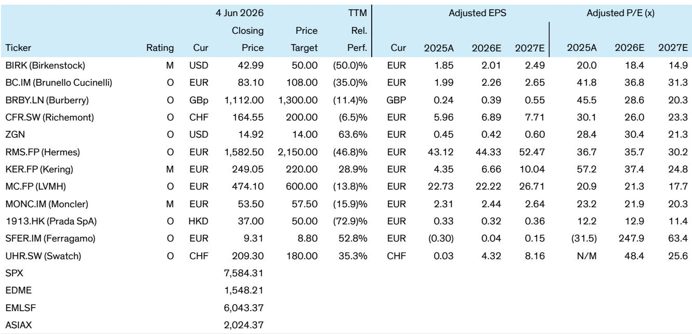

# Small Luxury Brands Are Not a Safe Haven — But a Few Are Built for the Current Cycle

The luxury industry has spent the past three decades bowing to the mega-brand. Scale, fixed-cost leverage, and a relentless influx of first-time luxury buyers created a self-reinforcing cycle that favored the largest houses. Hermès, Louis Vuitton, Chanel, and Gucci captured the lion's share of growth and investor returns. Smaller brands, by contrast, were often dismissed as structurally disadvantaged — too small to absorb fixed costs, too narrow to command pricing power, and too fragile to survive a downturn. That thesis is now being tested. A more mature and discerning consumer base, one that already owns the "luxury essentials," is beginning to look elsewhere for novelty. The question is not whether smaller brands can benefit from this shift. The question is which ones can do so sustainably, and which are merely enjoying a temporary tailwind that will vanish as quickly as it arrived.

This is the central argument of a recent deep-dive from a global investment bank's luxury research team. The report, which builds on decades of work tracking the industry's structural evolution, argues that the current environment is genuinely more favorable for small luxury brands than at any point in the last 30 years. But it also warns that the category "small luxury brand" is far from monolithic. The report proposes a taxonomy that separates these brands into four distinct groups: high-end specialists, category specialists, flankers, and meteors. Each group faces a different strategic reality, and each offers a different risk-return profile for investors. The implications are clear: the tailwind is real, but it will not lift all boats equally.

What makes this moment structurally different is not the fixed-cost nature of the industry — that has not changed — but the composition of demand. The luxury consumer base is now more established. The wave of new entrants that drove growth for decades has slowed. Existing customers, many of whom already own the iconic products of the mega-brands, are now seeking differentiation. They want something new, something that signals taste rather than wealth, something that cannot be bought at every airport duty-free. This shift creates an opening for smaller brands that can offer genuine product distinction and a clear point of view. But it also creates a trap: many small brands will mistake a cyclical uptick in interest for a structural improvement in their competitive position.

The report's taxonomy is the key to understanding which brands are positioned to capitalize on this shift and which are not. High-end specialists, such as Brunello Cucinelli and Zegna, operate at the highest price points and have virtually no exposure to aspirational consumers. They serve the ultra-wealthy, a segment that is both more resilient and more likely to seek alternatives to the mega-brands. These brands have been capturing this shift for at least 15 years, and the report argues they are best positioned to continue doing so. But the trade-off is clear: their scale disadvantage means they will likely continue to produce substandard retail space productivity, EBIT margins, and return on invested capital compared to their larger peers. For investors, the bet is on growth and resilience, not on margin expansion or capital efficiency.

Category specialists, such as Moncler in down jackets, Burberry in trench coats, and Bottega Veneta in handbags, face a more complex strategic challenge. They are recognized leaders in their core categories, but most aspire to become full-fledged mega-brands. This ambition drives them to expand into adjacent product categories, a path that has worked for Hermès and Chanel but is fraught with risk for smaller players. The report notes that moving into spaces already occupied by mega-brands and other specialists often results in profit dilution. The category specialist is caught in a strategic tension: staying focused on its core category limits growth, but expanding beyond it risks eroding margins and brand identity. The investor must assess whether the brand's expansion strategy is disciplined and differentiated, or whether it is a desperate attempt to escape its own limitations.

The report's most provocative category is the "flankers." These are brands that operate in the same price range and multi-category space as the mega-brands but lack the differentiation to stand out. Their strategic role within larger luxury groups is precisely what their name suggests: they occupy retail space around the mega-brands, serving as a defensive buffer against competitors. Fendi, Celine, Loewe, Balenciaga, and Alexander McQueen are among the names in this group. The report is blunt about their prospects: they are destined to suffer most of the time. Without a clear product or price specialization, they lack the structural advantages that drive sustained outperformance. They exist not to create value on their own terms, but to protect the value of the mega-brands that surround them.

Then there are the "meteors." These are flankers that, for a brief period, manage to break out. The catalyst is usually a hero product, a distinctive aesthetic statement, or a combination of both. Celine under Phoebe Philo, Celine under Hedi Slimane, the recent surge of Miu Miu, Balenciaga under Demna Gvasalia — these are all examples of meteors. The report's critical insight is that no meteor has ever broken through to become a mega-brand. The breakout is real, but it is almost always temporary. The marketing budgets of the mega-brands eventually overwhelm the novelty, the creative director moves on, or consumer tastes shift. For investors, catching a meteor at the right moment can generate extraordinary returns. But the timing must be near-perfect, and the exit strategy must be equally precise. The report notes that these successes most often cannot sustain, and many meteors disappear back into obscurity.

The strategic implications of this taxonomy are far-reaching. The report argues that shareholder value creation through small brands is structurally difficult, even in the current more favorable environment. Small players are bound to suffer from a scale disadvantage that depresses ROIC. For investors, there are only two viable paths. The first is to bet on high-end specialists that can sustain growth above the sector average. This is currently possible for Brunello Cucinelli and Zegna, debatable for Moncler, and improbable for most flankers and meteors over the medium to long term. The second path is to attempt to catch a flanker just before it turns into a meteor, which requires a momentum-based approach with near-perfect timing. This is a high-risk, high-reward strategy that is more suited to traders than long-term investors.

The report also raises a provocative question about the structure of luxury conglomerates. It argues that groups without a mega-brand have little justification to own flankers in the broader luxury fashion and leather goods market. Richemont is cited as a case in point: owning brands like Chloe, Dunhill, and Gianvito Rossi may serve as a learning exercise in soft luxury, but it offers no prospect of producing profit performance or capital returns anywhere near those of the hard luxury core business. The logic is simple: if you do not have a mega-brand, your small brands cannot function as flankers, and therefore they serve very little constructive purpose. This is a stark assessment that challenges the portfolio logic of several major luxury groups.

Even for conglomerates with deep pockets, the report suggests that pruning flankers during tough markets is beneficial. Recent examples include Richemont divesting Baume & Mercier and LVMH selling Marc Jacobs. The report notes that selling loss-making businesses is very difficult, which limits the options for groups like Kering when dealing with brands like Alexander McQueen. This raises an uncomfortable question for investors: how many of the brands in the portfolios of LVMH, Kering, and Richemont are truly creating value, and how many are simply occupying space?

## The Report's Unanswered Question: Can a Meteor Become a Mega-Brand?

The report is admirably clear about what it knows and what it does not. It provides a robust framework for categorizing small luxury brands and assessing their strategic prospects. But it leaves one critical question open: is it possible for a meteor to break through and become a sustainable mega-brand? The historical evidence suggests not, but the report does not fully explore whether the current environment might change that dynamic. The shift toward a more established consumer base, the rise of digital-native brand building, and the increasing fragmentation of media could theoretically create a path for a meteor to sustain its momentum. The report acknowledges that we have yet to see this happen, but it does not rule out the possibility. For investors and strategists, this is the most important open question in the small luxury brand space. The answer will determine whether the current tailwind is a temporary phenomenon or the beginning of a structural shift in the industry's power dynamics.

## A Decision Framework for Investors and Strategists

The report's taxonomy can be translated into a practical decision framework for anyone evaluating a small luxury brand. The first question to ask is: what category does the brand belong to? If it is a high-end specialist, the investment case rests on the brand's ability to sustain growth above the sector average. The key metrics are revenue growth, customer retention among the ultra-wealthy, and the brand's ability to maintain its price premium without expanding into lower-priced categories. If it is a category specialist, the critical question is whether the brand's expansion strategy is disciplined. Does it have a clear thesis for how it will enter adjacent categories without diluting its core identity and margins? If the answer is unclear, the brand is likely to face the profit dilution trap that the report describes.

For flankers, the framework suggests a more skeptical approach. The brand's value is largely defensive — it exists to protect the territory of the mega-brands in its group. The investor must assess whether the brand is likely to remain a flanker or whether it has the potential to become a meteor. This requires a judgment call on the brand's creative direction, product innovation, and marketing effectiveness. If the brand is unlikely to break out, its long-term value is limited. If it has meteor potential, the investor must be prepared to time the exit with precision.

Finally, for meteors, the framework is brutally honest: the breakout is real, but it is almost always temporary. The investor must have a clear thesis for why this meteor might be different — why it might sustain its momentum where others have failed. Without such a thesis, the prudent approach is to treat the meteor as a trading opportunity rather than a long-term investment.

## The Full Report and Original Charts

This article has drawn on the analytical framework and key insights from a comprehensive report on the future of small luxury brands. The full report includes detailed financial analysis, historical performance data for each brand category, and proprietary charts that illustrate the conceptual trajectories of specialists, flankers, and meteors. It also includes specific investment recommendations and price targets for publicly traded luxury companies. For investors and strategists who want to go deeper into the data and the analytical models that underpin these conclusions, the original report is essential reading.

Join the community to read the full report and review the original charts.

*This article is for learning and discussion only and does not constitute investment advice.*

Personal reading notes and learning share only. Not investment advice.

