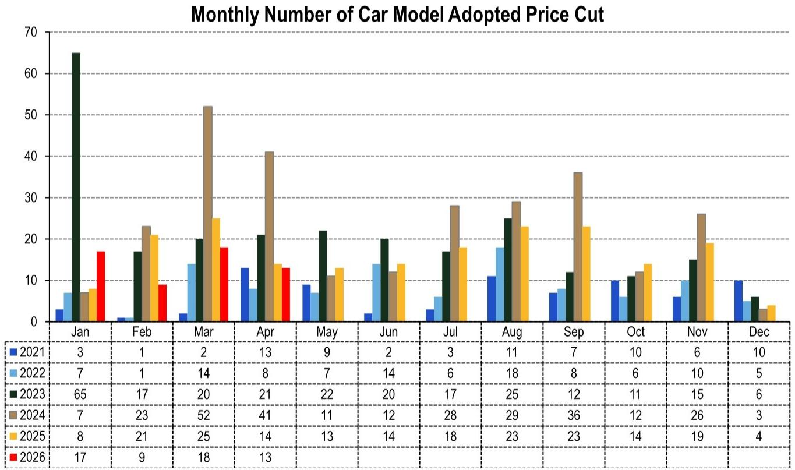
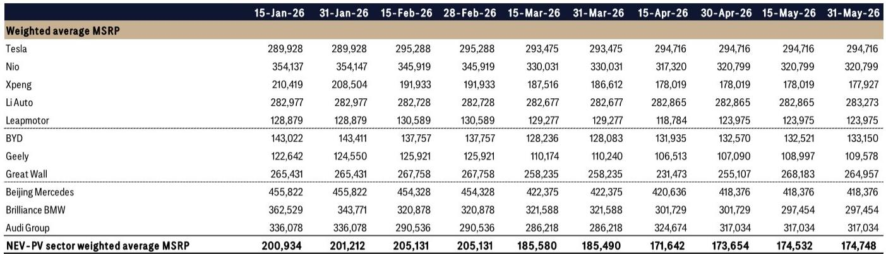
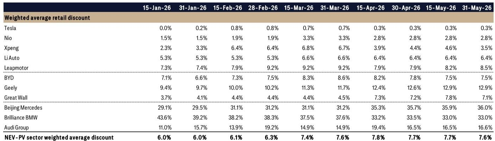

# China’s NEV Price War Is Not Ending — It Is Transforming Into a Structural Test of Brand Power and Cost Discipline

The Chinese new energy vehicle market has entered a phase that looks like calm but behaves like a trap. As of late May 2026, the sector-wide weighted average retail discount for NEV passenger vehicles stood at 7.6%, flat month-over-month. The weighted average MSRP ticked up 0.6% to RMB 174,748. On the surface, pricing appears to have stabilized. But this surface-level stability masks a deeply divergent competitive reality. Some brands are holding price and margin. Others are bleeding discount without gaining volume. The conventional narrative — that the NEV price war is a cyclical phenomenon driven by overcapacity and subsidy phase-downs — is becoming incomplete. What the data from late May reveals is a market that is sorting winners from losers not by who cuts deepest, but by who can sustain pricing power while maintaining cost structure.

The flat discount figure is not a sign of peace. It is a signal that the market has reached a threshold where further discounting yields diminishing returns for most players. The critical insight from the latest bimonthly pricing survey across China’s top 30 cities is this: the dispersion of discount behavior across OEMs is widening, even as the aggregate remains static. This is a classic pattern of structural differentiation. The companies that can hold or narrow discounts are those with genuine brand equity or cost advantages. Those that continue to widen discounts are revealing weakness in product mix, channel power, or unit economics.

For investors and strategists tracking China’s auto sector, the question is no longer whether the price war will end. It is whether your portfolio companies are on the right side of the structural divide. The answer depends on understanding three dimensions: the asymmetry of discount behavior by brand tier, the hidden signal in MSRP movements, and the second-order implications for legacy luxury ICE players who are now being dragged into the NEV pricing vortex.

## The Discount Dispersion Is Not Noise — It Is a Ranking of Strategic Position

The sector average discount of 7.6% is a headline number that conceals more than it reveals. When you disaggregate by OEM, the pattern is unmistakable: the market is bifurcating into three clusters.

At the top, Tesla and Nio operate with negligible discounts — 0.3% and 2.8% respectively — and both were flat month-over-month. This is not accidental. Tesla’s discount has been at or below 1% since mid-April, and Nio has held steady at 2.8% for the entire second quarter. These are brands with enough perceived value that they do not need to buy demand at the point of sale. Their pricing power is intact, and their discount stability suggests that their order books are not under acute pressure.

In the middle, Li Auto and BYD show moderate but stable discounts. Li Auto’s 6.4% discount has been essentially unchanged since mid-April, and BYD’s 7.5% has actually tightened by 0.3 percentage points from its late-March peak of 8.6%. Both companies are using discounts as a tactical tool rather than a survival mechanism. BYD, in particular, has been able to reduce discounting even as it continues to launch new models and expand its product range. This is a sign of operational leverage and scale-driven cost advantages.

At the bottom, Geely and Leapmotor are in a different game entirely. Geely’s discount has risen to 12.9%, the highest among all NEV-focused brands tracked, and it has been climbing steadily since January. Leapmotor’s discount reached 8.5% in late May, up 0.6 percentage points month-over-month. These are brands that are using aggressive discounting to defend or grow market share in segments where product differentiation is thin. The risk is that such discounting becomes self-reinforcing: customers learn to wait for deeper cuts, and the brand’s residual value erodes, making it harder to raise prices later.

The so-what is clear: flat aggregate discounts do not mean stable competition. They mean that the market has reached a pricing equilibrium that is comfortable for some and painful for others. For investors, the discount trajectory of each OEM is a leading indicator of margin pressure and brand health.

## MSRP Trends Reveal Who Is Competing on Product and Who Is Competing on Price

If discounts tell you about short-term pricing tactics, MSRP movements tell you about strategic intent. In late May, the sector weighted average MSRP rose 0.6% month-over-month to RMB 174,748. But this increase was not driven by broad-based price increases. It was driven by a handful of OEMs raising their list prices, while others held flat or declined.

Great Wall and Geely both raised MSRP meaningfully — up 3.9% and 2.3% month-over-month respectively. This is counterintuitive for brands that are simultaneously offering high discounts. The explanation lies in product mix. Both companies have been shifting their NEV portfolios toward higher-priced models. Great Wall’s MSRP jump from RMB 255,107 to RMB 264,957 reflects a shift toward its premium Ora and Wey brand vehicles. Geely’s MSRP increase, from RMB 107,090 to RMB 109,578, is driven by the introduction of higher-trim versions of its Galaxy and Zeekr models.

This is a critical strategic signal. These OEMs are not trying to win on price. They are trying to win on perceived value by moving up the price ladder. The high discount is the cost of that transition. If they succeed, discounts will narrow as the new higher-priced models gain acceptance. If they fail, they will be stuck with a permanently elevated discount structure that destroys margins.

In contrast, Tesla, Nio, and Li Auto have held MSRP essentially flat for the past two months. Their strategy is not to move up in price but to defend their current positioning. This is a lower-risk approach, but it also implies that their growth will come from volume rather than price realization. For BYD, the 0.4% MSRP increase is modest but consistent with its strategy of gradually raising prices as its brand equity strengthens.

The implication for investors is that MSRP trends are a more reliable signal of long-term brand power than discount rates. A rising MSRP combined with stable or narrowing discounts is the ideal combination. A rising MSRP combined with widening discounts is a warning sign that the company is trying to outrun its brand position.

## The Legacy Luxury ICE Segment Is Being Pulled Into the NEV Pricing Vortex

One of the most underappreciated dynamics in the report is the mounting discount pressure on German luxury ICE vehicles. In May 2026, the weighted average discount for German luxury ICE stood at 25.9%, down 0.2 percentage points month-over-month. But the year-over-year comparison is stark: discounts have narrowed by 7.1 percentage points from 33.0% in May 2025. This is not because demand has recovered. It is because the luxury ICE segment is being squeezed from two sides.

On one side, the NEV brands — particularly Nio, Li Auto, and the premium models from BYD and Great Wall — are capturing the high-end consumer who would previously have considered a Mercedes, BMW, or Audi. On the other side, the legacy luxury OEMs are being forced to cut ICE prices to compete with their own NEV models. Brilliance BMW’s ICE discount dropped 1.6 percentage points month-over-month to 21.6%, while Beijing Mercedes’ ICE discount actually rose 0.5 points to 23.4%. Audi remains the most aggressive, with ICE discounts at 32.1%.

The critical pattern is that the discount compression for luxury ICE is happening even as the overall market discount is stable. This suggests that the luxury ICE segment is losing pricing power relative to the broader market. Consumers are voting with their wallets: they are willing to pay closer to MSRP for a premium NEV than for a premium ICE vehicle. This is a structural shift, not a cyclical one.

For investors in joint ventures or legacy OEMs, the implication is uncomfortable. The traditional profit pool from luxury ICE vehicles — which has been a reliable source of margin for decades — is being eroded not just by volume loss but by pricing pressure. The NEV transition is not just about powertrain technology. It is about the complete revaluation of what constitutes a premium automobile.

## What the Report Does Not Fully Answer: The Threshold of Pain for Discount-Driven OEMs

The data gives us a clear picture of where discounts are, but it does not tell us where the floor is. For OEMs like Geely and Leapmotor, whose discounts are in double digits and rising, there is an open question: at what point does further discounting become value-destructive rather than market-share-accretive?

The report does not provide granular data on unit economics, break-even discount levels, or the relationship between discount depth and volume elasticity. For example, Geely’s 12.9% discount may be sustainable if its cost structure allows for it, but if margins are already thin, each additional percentage point of discount is a direct hit to profitability. Similarly, Leapmotor’s 8.5% discount, combined with its low MSRP of RMB 123,975, suggests that the company is operating in a segment where margins are already compressed.

Another unanswered question is the role of channel inventory. The data measures retail discounts at 4S shops, but it does not capture the level of inventory in the channel. If dealers are holding excess stock, they may be offering additional off-invoice incentives that are not reflected in the retail discount data. This could mean that actual transaction prices are even lower than reported.

Finally, the report does not address the potential for a second wave of price cuts in the second half of 2026, when new production capacity from several OEMs comes online. If demand growth slows, the current discount stability could break, and the market could enter a new phase of aggressive price competition.

These gaps are not weaknesses in the report. They are invitations for deeper analysis. For readers who want to understand the full picture, the original data and charts provide the foundation for building a more complete model of pricing dynamics and competitive outcomes.

## A Decision Framework for Investors: How to Read Pricing Signals in a Diverging Market

Given the complexity of the pricing data, investors need a structured way to translate discount and MSRP trends into actionable insights. The following framework can help.

First, classify each OEM into one of four quadrants based on the direction of its discount and MSRP. The ideal quadrant is stable or narrowing discounts combined with stable or rising MSRP. This describes Tesla, Nio, and BYD. These companies have pricing power and are not sacrificing margin for volume.

The warning quadrant is widening discounts combined with stable or declining MSRP. This describes Leapmotor and, to a lesser extent, Geely. These companies are competing on price and may be losing control of their brand positioning.

The transition quadrant is widening discounts combined with rising MSRP. This describes Great Wall and Geely (in its higher-priced models). These companies are trying to move upmarket, but the cost of that transition is high. The key question is whether the MSRP increases will eventually allow discounts to narrow.

The stable quadrant is stable discounts and stable MSRP. This describes Li Auto. These companies are in a holding pattern, which can be good or bad depending on whether they are gaining volume.

Second, look at the month-over-month momentum, not just the level. A company that has been holding discounts flat for three months is in a different position than one that has recently stabilized after a period of widening. The trajectory matters more than the absolute number.

Third, cross-reference discount data with volume data. A company that is cutting discounts while growing volume is in a healthier position than one that is cutting discounts and losing volume. The report does not provide volume data, but investors should seek it from other sources.

Finally, consider the competitive dynamics within each price segment. The NEV market is not monolithic. The pricing behavior of BYD at RMB 133,000 has different implications than the pricing behavior of Nio at RMB 320,000. The relevant competitive set for each OEM is the set of brands that compete in the same price band, not the entire market.

## The Open Questions That Demand a Deeper Look

The data in this report opens more strategic questions than it closes. For example, what happens when the current round of new model launches ends and the market returns to a steady state? Will the discount dispersion narrow as weaker players exit or consolidate? Or will it widen further as brand differentiation becomes more pronounced?

Another question is the role of government policy. The report does not discuss subsidy changes, license plate restrictions, or trade-in programs that could affect demand. Any of these factors could shift the pricing equilibrium in either direction.

Perhaps the most important question is about the sustainability of the current discount structure for the luxury NEV players. Nio and Li Auto are holding discounts low, but they are also burning cash on R&D and infrastructure. If their cost of capital rises or their access to funding tightens, they may be forced to choose between margin and volume. The discount data does not capture that vulnerability.

These are not questions that can be answered with a single data point. They require ongoing monitoring, cross-referencing with financial reports, and a willingness to challenge the consensus. The full report provides the raw material for that analysis.

## Join the community to read the full report and review the original charts.

*This article is for learning and discussion only and does not constitute investment advice.*

Personal reading notes and learning share only. Not investment advice.

