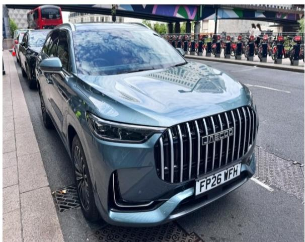
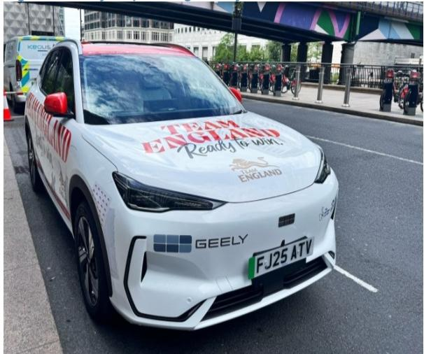
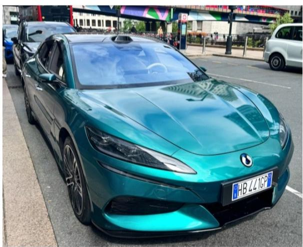

# Chinese Automakers Are No Longer Exporting Cars—They Are Exporting a New Competitive Model, and Europe Is the Test Case

The conversation at a major European auto conference in mid-2026 was not about tariffs, battery supply chains, or European retaliation. It was about something more unsettling for incumbent automakers: the speed at which Chinese original equipment manufacturers are converting their product advantage into a scalable, multi-dimensional overseas business model. The question is no longer whether Chinese brands will gain share in Europe. The question is whether the structural logic of their expansion—powertrain flexibility, channel density, and brand laddering—will allow them to avoid the value destruction that has historically plagued new entrants.

A global investment bank report summarizing meetings with BYD and Geely at the conference reveals that the two leading Chinese OEMs are pursuing fundamentally different go-to-market strategies. Yet both share a critical insight: Europe is not a pure battery electric vehicle market. It is a mixed-propulsion transition market, and the winners will be those who treat it as such. The report’s most striking data point is not a valuation multiple or a margin forecast. It is the sheer scale of the ambition. BYD is targeting 2,000 dealers and stores in Europe by the end of 2026. That is not an export strategy. That is an infrastructure play.

For investors, the implications cut across three dimensions. First, the traditional framework for analyzing auto stocks—market share, volume, price—is insufficient. The new framework must incorporate go-to-market architecture, residual value discipline, and powertrain mix as competitive variables. Second, the divergence between BYD’s vertically integrated, high-investment approach and Geely’s asset-light, partnership-driven model means that the Chinese OEM story is not monolithic. Third, the report leaves open a critical question that no conference panel could fully answer: can these strategies sustain profitability as volume scales, or will the cost of building brand trust in Europe erode the very cost advantage that makes Chinese OEMs competitive today?

## Chinese OEMs Are Rejecting the Single-Powertrain Export Model in Favor of a Portfolio Approach That Treats Europe as a Transition Market

The most important strategic signal from the conference is that both BYD and Geely have abandoned the idea that Europe will be a pure BEV market in the near term. This is not a concession. It is a deliberate commercial calculation. BYD explicitly frames its European product strategy around maintaining a BEV and PHEV balance, with specific PHEV launches planned for the second half of 2026. The Dolphin and the Aito DMi SUV are not afterthoughts. They are the product of a recognition that European consumers, particularly in the mass market, are not ready for a full BEV transition on the timeline that regulators have set.

The implication for incumbent OEMs is uncomfortable. Chinese manufacturers are not waiting for the market to decide. They are building product portfolios that can pivot between powertrains as consumer preferences and regulatory timelines shift. This flexibility is a structural advantage, not a tactical one. It means that Chinese OEMs can capture share in the PHEV segment today while positioning for the BEV transition tomorrow, all without the stranded-asset risk that comes with betting on a single technology pathway.

Geely’s approach is different in emphasis but identical in logic. Rather than leading with a single powertrain headline, Geely is concentrating on software-led competitiveness, integrating AI into ADAS as a differentiator. This is a bet that the European consumer will value the digital experience as much as the driving experience. Whether that bet pays off depends on execution, but the strategic intent is clear: do not compete on the same dimensions as the incumbents.

## Channel Density and Residual Value Discipline Are Becoming the Real Barriers to Entry in Europe, Not Product Specs

The report’s most underappreciated insight is that Chinese OEMs are building distribution networks with a scale and speed that European OEMs have not matched in decades. BYD’s target of 2,000 dealers and stores in Europe by end-2026 is not just an expansion target. It is a competitive moat. With a stated test-drive conversion rate of 45 to 50 percent, BYD is effectively arguing that the bottleneck to adoption is not product quality or price. It is access. Once a consumer sits in the car, the sale is nearly half certain.

This changes the competitive calculus. Traditional European OEMs have spent years rationalizing their dealer networks, closing underperforming locations, and shifting to agency models. Chinese OEMs are doing the opposite. They are flooding the market with points of presence, and they are doing so with a disciplined focus on residual values. BYD explicitly ties its go-to-market strategy to avoiding price competition, protecting residual value, and making monthly payments competitive. This is a sophisticated understanding of the European consumer psyche. The purchase decision is not about the sticker price. It is about the total cost of ownership and the confidence that the car will hold its value.

Geely’s approach is less capital-intensive but equally strategic. By leveraging the Volvo channel for Lynk and Co and pursuing partnership structures with Renault in Korea and Brazil, Geely is building distribution without building a balance sheet. The question for investors is whether this asset-light model can achieve the same density and conversion rates as BYD’s direct approach. The answer likely depends on the market. In the UK, Geely’s Galaxy launch will be a test case. In Hong Kong, Zeekr’s BEV success has already demonstrated that the brand can compete in premium segments.

## The Localization Strategies of BYD and Geely Reveal a Fundamental Divergence in How Chinese OEMs Think About Manufacturing Footprint

The report highlights a business model divergence that has strategic implications for the entire global auto industry. BYD is pursuing vertical integration and direct manufacturing investment. It has completed plants in Thailand and Brazil, and a Hungarian plant is under construction. Geely is pursuing partnership-led localization, including KD parts assembly with Renault in Korea, cooperation in Brazil, and a 49.6 percent stake in Malaysia’s Proton.

This is not a debate about which model is better. It is a debate about which model is more scalable and which model carries more risk. BYD’s approach gives it full control over production quality, cost, and technology transfer. But it also requires significant capital commitment and exposes the company to political and regulatory risk in each market. Geely’s approach reduces capital intensity and political exposure, but it creates dependency on partners whose interests may not always align.

The report does not resolve this tension, and it should not. The divergence is a feature, not a bug. It means that the Chinese OEM ecosystem is producing multiple viable models for global expansion, and that investors should not treat them as interchangeable. The correct question is not whether Chinese OEMs will succeed in Europe. It is which model will succeed in which market, and at what cost.

## What the Report Does Not Fully Answer: Can These Strategies Scale Without Destroying Margins?

For all the detail in the report, one question remains unresolved. The report provides volume targets—BYD potentially topping 1.7 to 1.8 million overseas units, Geely around 1.0 million—but it does not provide a detailed margin pathway. The reason is not that the analysts omitted it. It is that the answer is genuinely uncertain.

Scaling distribution to 2,000 dealers is expensive. Building a flash-charging network with 3,000 posts is expensive. Launching a premium brand like Denza at a starting price of 80,000 pounds is a high-risk, high-reward bet. The report notes that BYD aims to avoid price competition to protect residual values, but residual value protection is a lagging indicator. It takes years to build. In the meantime, the cost of customer acquisition, dealer support, and charging infrastructure will weigh on margins.

Geely faces a different set of margin questions. Its asset-light model reduces upfront cost, but it also reduces control. Partnership structures often involve revenue sharing, and the ability to capture full value from the end consumer is diminished. The report notes that Geely’s export target of 750,000 units for 2026 is explicitly bounded, and that CKD volumes are tracked separately. This suggests a disciplined approach to volume, but it also raises the question of whether the partnership model can deliver the same growth trajectory as BYD’s direct model.

The answer to the margin question will determine whether Chinese OEMs are value creators or value destroyers in Europe. The report provides the data to frame the question, but it does not provide the answer. That is the open analytical challenge for investors.

## A Decision Framework for Investors: Three Questions That Separate Signal from Noise

Based on the report’s findings, investors evaluating Chinese OEM exposure should structure their analysis around three questions. First, what is the company’s powertrain mix strategy in Europe, and does it reflect the reality of a transition market? Companies that treat Europe as a pure BEV market are making a bet that may not pay off. Companies that build flexibility into their product portfolio are hedging intelligently.

Second, is the company investing in distribution and residual value, or is it relying on price to drive volume? The report is clear that BYD is investing in both. Geely is investing in distribution through partners, but its residual value strategy is less explicit. The market will eventually reward companies that build brand trust and punish those that compete on price alone.

Third, does the company’s localization strategy match its risk appetite and capital structure? BYD’s vertical integration is capital-intensive but offers control. Geely’s partnership model is capital-light but offers less control. Neither is inherently superior. The correct answer depends on the investor’s time horizon and risk tolerance.

These three questions do not replace traditional financial analysis. They supplement it. In a market where the competitive landscape is shifting faster than quarterly earnings can capture, the strategic framework matters as much as the numbers.

## The Unfinished Story: Why the Full Report Matters More Than This Summary

The report from which this analysis is drawn contains charts, data, and company-specific disclosures that cannot be fully conveyed in a summary. The original materials include photographs of the vehicles displayed at the conference, detailed breakdowns of BYD’s charging network plans, and the specific margin and volume assumptions that underpin the analysts’ ratings. More importantly, the report includes the full set of disclosures, ratings, and valuation methodologies that allow investors to assess the analysts’ biases and assumptions.

For a serious investor, the summary is a starting point, not an endpoint. The strategic insights are clear. The Chinese OEM expansion into Europe is real, it is multi-dimensional, and it is happening faster than most market participants expected. But the investment implications are not binary. They depend on which companies, which strategies, and which time horizons.

Join the community to read the full report and review the original charts.

*This article is for learning and discussion only and does not constitute investment advice.*

Personal reading notes and learning share only. Not investment advice.

