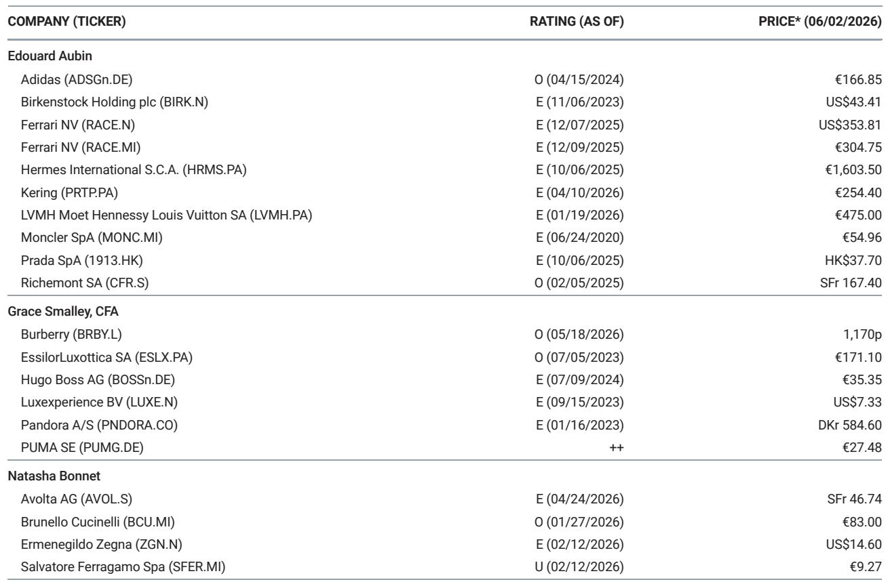
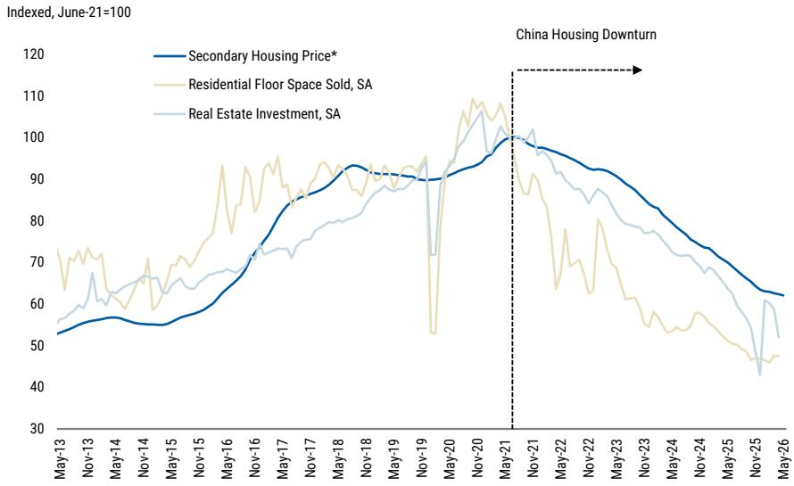

# 中国房价下跌的真正冲击，不是消费力，而是定价权

当中国二手房价格在五月份环比再跌0.5%、累计较2021年6月峰值已下跌38%时，欧洲奢侈品股的投资逻辑正在经历一次被低估的重构。市场普遍关注的是“中国人还买不买得起”，但这份由某外资投行奢侈品研究团队与地产团队联合出具的报告，给出了一个更值得警觉的信号：中国家庭财富结构中超过70%沉淀在房地产，当这部分资产持续缩水，奢侈品消费的“意愿”比“能力”更早开始瓦解。

更关键的是，报告指出一个尚未被充分定价的矛盾：过去18个月，中国股市上涨约22万亿元，而同期房地产市场的价值蒸发约为31万亿元。两者相抵后，中国家庭部门的总财富实际上仍在缩水。这不是简单的“财富搬家”，而是一场结构性的资产负债表再定价。对于欧洲奢侈品品牌而言，这意味着它们在中国市场的增长叙事，正从“消费升级的顺风”转向“财富效应的逆风”。

这份报告的价值不在于罗列了房价数据，而在于它揭示了奢侈品行业与中国房地产之间那条被市场长期忽视的传导链。以下是我们从这份报告中提炼出的五个核心洞察。

## 1. 房价下跌正从“一线城市韧性”转向“全面松动”，奢侈品消费的基本盘正在被侵蚀

报告最直接的信号来自5月的二手房数据：在追踪的85个样本城市中，93%的城市房价环比下跌，64%的城市跌幅较4月扩大。这与4月的数据形成鲜明对比——4月仅有91%的城市下跌，且跌幅加速的城市比例仅为19%。换言之，房价下跌不仅没有收窄，反而在广度与深度上同步恶化。

一线城市此前被视为“最后的堡垒”，但5月的数据显示，即使在北京、上海、广州、深圳，房价也仅能维持环比持平（-0.1%）。广州和深圳在放松政策后曾出现短暂的交易量反弹，但报告谨慎地指出，这种由积压需求推动的反弹正在消退，6月二手房销售可能进一步走弱。

对于奢侈品行业而言，这意味着什么？报告明确指出，中国消费者贡献了欧洲奢侈品行业超过30%的总支出。当房价下跌从三四线城市蔓延至一线城市，当“财富效应”从负向转为持续负向，奢侈品消费的“基本盘”正在经历一次根本性的收缩。这不是短期波动，而是一个持续2-3年的趋势。

## 2. 股市上涨未能弥补地产缩水，家庭总财富仍在净流出，奢侈品消费的“分母”在变薄

一个看似矛盾的现象是：过去12个月，上证指数上涨了约22%，而同期二手房价格累计下跌超过11%。报告做了一个关键的计算：自2024年12月以来，中国房地产市场的价值蒸发约为31万亿元人民币，而同期股市上涨带来的财富增量约为39万亿元。表面上看，股市的增长覆盖了地产的损失。

但这里有一个被忽视的细节：房地产是中国家庭财富的绝对核心，占比超过70%。而股市的财富分布则高度集中。报告没有展开讨论这一点，但逻辑上可以推断：房地产财富的缩水是广泛的、普惠性的，而股市上涨的收益则主要流向高净值人群和机构投资者。对于多数中产家庭而言，他们同时承受了房产贬值与收入预期不确定的双重压力。

这意味着，奢侈品消费的“分母”——即有能力且有意愿消费的潜在客户群体——正在变薄。品牌不能简单地认为“股市涨了，客户就有钱了”。真正的结构性问题是：支撑奢侈品消费的那个“财富基础”正在被重新定价，而品牌尚未找到新的定价锚。

## 3. 政策放松的效果正在递减，市场已进入“预期自我实现”的下行通道

报告的地产团队维持审慎观点，认为需要更多证据才能转为建设性。他们观察到，尽管政策持续放松，但购房者的行为模式已经发生了根本性变化：加杠杆意愿低迷、收入前景不确定、观望情绪浓厚。

更关键的是，挂牌量仍在上升。5月约60%的城市二手房挂牌量环比增加，而4月这一比例仅为49%。这意味着，卖方正在主动降价以促成交易，而买方则在等待更低的价格。这是一种典型的“预期自我实现”机制：越跌，越没人买；越没人买，越跌。

对于奢侈品行业而言，这个动态值得警惕，因为它意味着中国市场的“复苏时间表”可能被不断推后。品牌此前普遍预期2025年下半年会出现温和复苏，但报告暗示，这个复苏可能要到2026-2027年才会出现，且区域分化将更加明显——只有少数库存消化较好的城市（主要是部分一线城市）可能跑赢。

## 4. 奢侈品品牌在中国市场的“定价权”正面临从未有过的压力

这是报告没有明说但逻辑上必然推导出的结论。当中国消费者的财富预期变得不确定，他们的消费行为会从“炫耀性消费”转向“价值敏感型消费”。过去几年，欧洲奢侈品品牌通过持续提价来维持增长，而中国消费者是这一策略的核心支撑。

但当下，这一策略的可持续性正在被削弱。如果中国家庭的资产负债表持续收缩，品牌将面临一个两难选择：要么维持价格体系，但接受销量下滑；要么降价促销，但损害品牌定位和利润率。

报告没有给出明确答案，但数据暗示了一个方向：中国市场的“量价齐升”故事可能已经结束。品牌需要重新思考在中国市场的增长模型——从依赖提价转向依赖客户忠诚度与复购率。而这恰恰是大多数欧洲奢侈品牌尚未证明自己具备的能力。

## 5. 报告未完全回答的关键问题：奢侈品股的估值是否已反映中国风险？

这份报告的核心价值在于提供了中国地产与奢侈品消费之间的数据桥梁，但它留下了一个关键问题没有回答：当前欧洲奢侈品股的估值，是否已经充分定价了中国房地产下行带来的风险？

从报告提供的行业评级“In-Line”来看，分析师认为整体行业风险与回报大致平衡。但考虑到中国需求占比超过30%，且地产下行周期可能持续2-3年，市场是否低估了这一风险的持续性和深度？报告没有给出明确的量化判断，但这恰恰是投资者最需要自己回答的问题。

另一个未解问题是：不同奢侈品品牌对中国市场的依赖度差异巨大。报告列出了覆盖的20多家公司，但并未详细拆解每家公司的中国敞口。对于那些中国收入占比超过40%的品牌（如某些硬奢品牌），其估值是否应该给予更大的折扣？而对于那些中国敞口较低的品牌（如某些欧洲本土消费品牌），它们是否反而获得了相对的避险优势？这些分析仍需进一步的数据和模型支持。

## 沿着这些未解问题，继续深入

这份报告的价值在于它打破了一个常见的认知误区：将中国奢侈品消费简单等同于“消费升级”或“中产崛起”。它提醒我们，中国奢侈品市场本质上是一个“财富效应驱动”的市场，而财富效应的核心锚点——房地产——正在经历一场历史性的再定价。

对于产业决策者和投资者而言，真正的挑战不在于判断房价何时见底，而在于理解这一轮下行如何重塑中国消费者的行为模式，以及哪些品牌能够在这一轮调整中守住定价权。

报告没有给出所有答案，但它的数据框架为我们的讨论提供了坚实的基础。如果你对以下问题感兴趣：不同品牌的中国敞口如何量化、哪些品牌在财富下行周期中更具防御性、以及估值中是否已经隐含了足够的地产风险溢价——欢迎来我们的微信群继续讨论。我们会在群内分享完整的原始报告图表，以及基于这些数据构建的品牌风险评估框架。

Personal reading notes and learning share only. Not investment advice.

