HOUSING AND MORTGAGE MONITOR

Manufacturing a solution to the housing shortage

# Shipments of manufactured homes remain well below pre-2000 levels

Affordability continues to be a major concern in the housing market. Our economics team estimates there is currently a shortage of approximately 3-4 million homes nationwide. One approach for increasing the supply of homes at more affordable price points is to promote access to manufactured housing. Manufactured homes (MH), colloquially also referred to as mobile homes, are residences that are prefabricated in a factory setting and then transported to their final location for installation. This method not only streamlines the construction process but also offers significant cost savings compared to traditional site-built homes, making manufactured housing a promising solution for those seeking affordable housing options. There are currently about 8.4 million manufactured housing units across the country.

Prior to 2000, shipments of manufactured homes averaged about 265k a year (Exhibit 1). Manufactured housing experienced a construction boom in the 1990s driven by overproduction and lax lending standards. However, this ended in a sharp increase in delinquencies, which was then followed by tighter lending standards and increased zoning restrictions. These restrictions reduced the attractiveness of manufactured housing. During the housing boom of the early 2000s, manufactured housing was increasingly viewed as a choice of last resort. The negative sentiment towards this sector has largely persisted with MH shipments averaging just 80,000 units a year since 2010. According to the 2024 American Community Survey, manufactured housing units account for about 6% of all owner-occupied housing in the US, although the share has drifted marginally lower from around 7% in 2010.

The top markets for manufactured homes are in the South and Southeast (Exhibit 2). Interestingly, several states that rank high in manufactured home sales rank low in single family home construction, suggesting the importance of local zoning and land-use regulations as a key constraining factor for the growth of MH. Over 54% of manufactured housing units are in rural areas (defined as territories with fewer than 2,500 people), while single-family homes are primarily in large urban areas (Exhibit 3). Manufactured homes are generally smaller than site-built homes and are historically viewed as starter homes for lower-income households (Exhibit 4).

Arun Manohar

+1(212)902-8763

arun.manohar@gs.com

GS & Co. LLC

Ben Shumway

+1(801)578-2553

ben.shumway@gs.com

GS & Co. LLC

Neth Karunamuni

+1(212)934-0799

neth.karunamuni@gs.com

GS & Co. LLC

# Table of Contents

Housing Forecasts and Key Charts 8   
Economic growth remains positive year over year 9   
US housing affordability is still poor 10   
Home sales volume has fallen 11   
Supply of completed homes remains constrained 12   
33% of new GSE purchase mortgages have DTI above 43% 13   
Homeownership rates have ticked down in Q12026 14   
Sequential home price growth has slowed 15   
Most US metros are seeing home price growth stabilize 16   
Household balance sheet metrics remain resilient 17   
Subprime auto ABS losses have grown 18   
2.2% of mortgaged properties have negative equity 19   
30-year FNMA prepayment rates were down 16% in April vs. March 20   
Conventional MBS prepayment rates decreased for higher coupons in April vs. March 21   
High coupon Ginnie Mae prepayments decreased month-on-month 22   
About 20% of mortgage borrowers are in-the-money for refinancing 23   
The Federal Reserve's agency MBS assets remain below \$2.1 trillion 24   
Agency MBS valuations have improved recently 25

CMBS delinquency rates remain contained despite challenging CRE fundamentals 26   
High CMBS note rates will be an obstacle to debt refinancing 27   
Apartment property prices have declined 28   
CMBS spreads have tightened 29   
Disclosure Appendix 30

Exhibit 1: Shipments of manufactured homes experienced a significant decline after 2000 and continue to stay at low levels today   
Shipments of new manufactured homes   
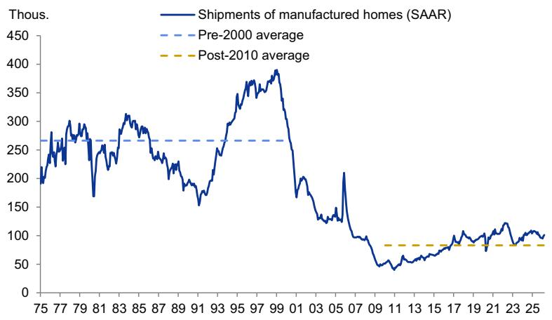

line

| Year | Shipments of manufactured homes (SAAR) (Thous.) |
|------|--------------------------------------------------|
| 75   | ~200                                             |
| 77   | ~280                                             |
| 79   | ~300                                             |
| 81   | ~170                                             |
| 83   | ~310                                             |
| 85   | ~280                                             |
| 87   | ~250                                             |
| 89   | ~220                                             |
| 91   | ~160                                             |
| 93   | ~250                                             |
| 95   | ~350                                             |
| 97   | ~380                                             |
| 99   | ~390                                             |
| 01   | ~200                                             |
| 03   | ~130                                             |
| 05   | ~120                                             |
| 07   | ~100                                             |
| 09   | ~50                                              |
| 11   | ~60                                              |
| 13   | ~70                                              |
| 15   | ~80                                              |
| 17   | ~90                                              |
| 19   | ~85                                              |
| 21   | ~100                                             |
| 23   | ~110                                             |
| 25   | ~105                                             |

Source: US Census, Haver Analytics, GS Global Investment Research

Exhibit 2: Several states that rank high in manufactured home sales rank low in single family home construction   
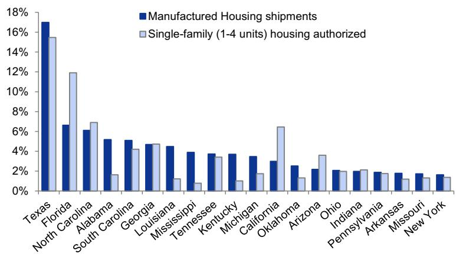

bar

| State | Manufactured Housing Shipments (%) | Single-family (1-4 units) housing authorized (%) |
|---|---|---|
| Texas | 17.0 | 15.6 |
| Florida | 6.7 | 12.0 |
| North Carolina | 6.1 | 7.0 |
| Alabama | 5.2 | 1.6 |
| South Carolina | 5.2 | 4.2 |
| Georgia | 4.8 | 4.8 |
| Louisiana | 4.5 | 1.2 |
| Mississippi | 3.9 | 0.8 |
| Tennessee | 3.8 | 3.4 |
| Kentucky | 3.8 | 1.0 |
| Michigan | 3.6 | 1.8 |
| California | 3.0 | 6.5 |
| Oklahoma | 2.5 | 1.3 |
| Arizona | 2.2 | 3.6 |
| Ohio | 2.1 | 2.0 |
| Indiana | 2.0 | 2.1 |
| Pennsylvania | 1.9 | 1.8 |
| Arkansas | 1.8 | 1.2 |
| Missouri | 1.8 | 1.4 |
| New York | 1.7 | 1.5 |

Source: US Census, GS Global Investment Research

Exhibit 3: Manufactured homes account for a greater share of homes in rural areas   
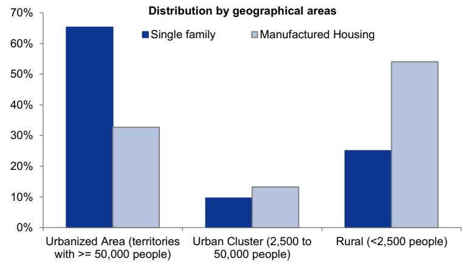

bar

Distribution by geographical areas
| Area | Single family (%) | Manufactured Housing (%) |
| :--- | :--- | :--- |
| Urbanized Area (territories with >= 50,000 people) | 65.5 | 32.8 |
| Urban Cluster (2,500 to 50,000 people) | 9.8 | 13.4 |
| Rural (<2,500 people) | 25.2 | 54.1 |

Source: US Census, 2023 National American Housing Survey, GS Global Investment Research

Exhibit 4: Typically, manufactured homes have less square footage than site-built single-family homes   
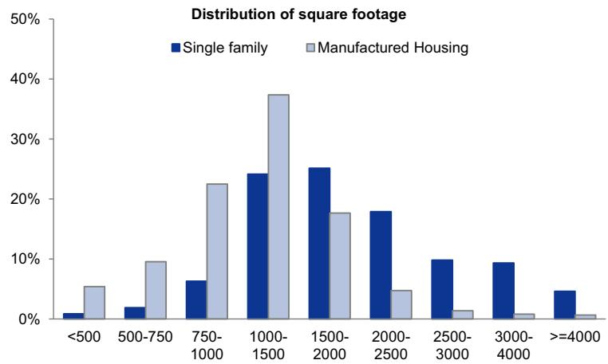

bar

Distribution of square footage
| Square Footage Range | Single family (%) | Manufactured Housing (%) |
| :--- | :--- | :--- |
| <500 | 1 | 5.5 |
| 500-750 | 2 | 9.5 |
| 750-1000 | 6.5 | 22.5 |
| 1000-1500 | 24.5 | 37.5 |
| 1500-2000 | 25.5 | 17.5 |
| 2000-2500 | 18 | 4.5 |
| 2500-3000 | 10 | 1.5 |
| 3000-4000 | 9.5 | 1 |
| >=4000 | 4.5 | 1 |

Source: US Census, 2023 National American Housing Survey, GS Global Investment Research

# The main attraction of manufactured housing is its affordability

Manufactured housing provides a cost-effective alternative to traditional site-built starter homes. Among various actions to enhance housing affordability, expanding access to manufactured housing has received bipartisan support in recent months. Manufactured homes can be produced at a lower cost and are typically smaller, thereby contributing to increased affordability despite higher mortgage rates. As a result, easier access to MH can enable homeownership rates to rise. On average, manufactured housing is approximately half as expensive as site-built homes, excluding land costs (Exhibit 5).

Exhibit 5: Manufactured housing is more affordable vs. site-built housing   
Comparison of average sale price (left panel) and average cost of structure per square foot (right panel) across manufactured homes and site-built homes   
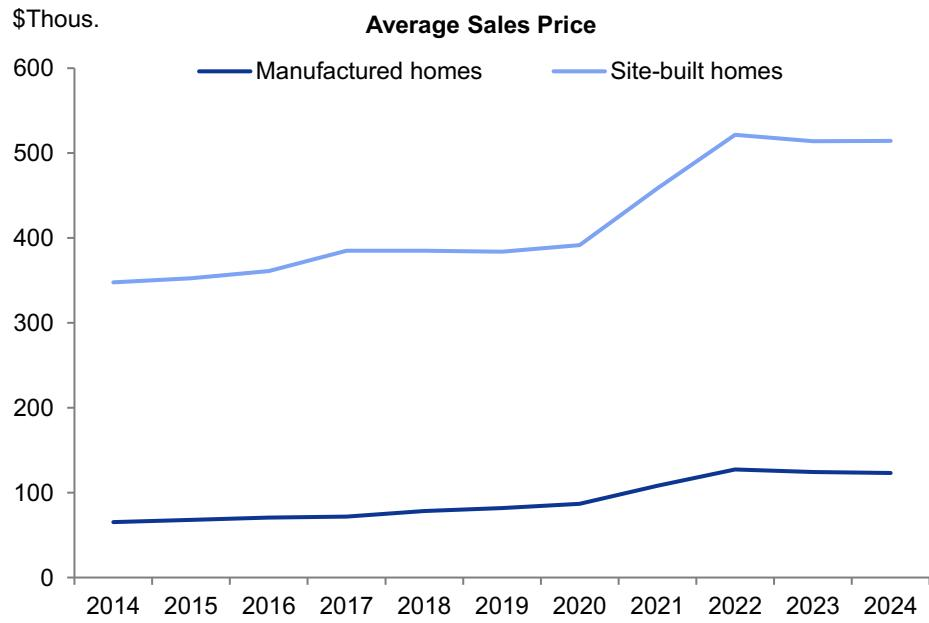

line

| Year | Manufactured homes ($Thous.) | Site-built homes ($Thous.) |
|------|-------------------------------|-----------------------------|
| 2014 | ~65                           | ~350                        |
| 2015 | ~70                           | ~355                        |
| 2016 | ~75                           | ~365                        |
| 2017 | ~80                           | ~390                        |
| 2018 | ~85                           | ~390                        |
| 2019 | ~90                           | ~390                        |
| 2020 | ~95                           | ~395                        |
| 2021 | ~110                          | ~450                        |
| 2022 | ~130                          | ~520                        |
| 2023 | ~125                          | ~515                        |
| 2024 | ~125                          | ~515                        |

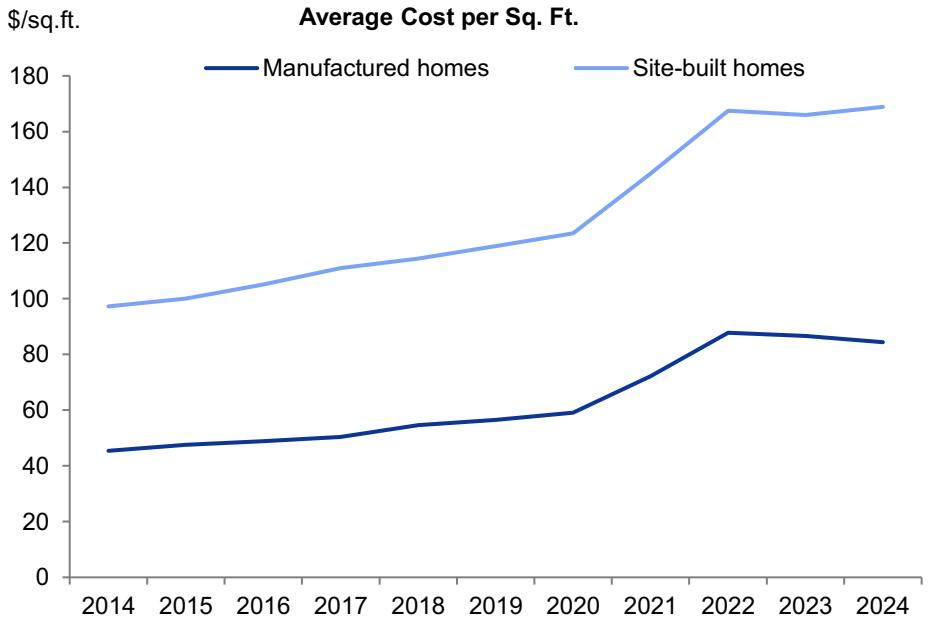

line

| Year | Manufactured homes | Site-built homes |
| ---- | ------------------ | ---------------- |
| 2014 | 45                 | 98               |
| 2015 | 47                 | 100              |
| 2016 | 49                 | 105              |
| 2017 | 51                 | 110              |
| 2018 | 55                 | 115              |
| 2019 | 57                 | 120              |
| 2020 | 60                 | 125              |
| 2021 | 70                 | 145              |
| 2022 | 88                 | 168              |
| 2023 | 86                 | 166              |
| 2024 | 84                 | 170              |

Source: US Census, GS Global Investment Research

# Zoning, financing, and negative perception are key impediments to manufactured housing demand

Manufactured housing demand faces major obstacles from local zoning regulations, financing difficulties, and negative public perception. Broadly, there is a lack of sufficient awareness. In a 2022 Manufactured Housing survey conducted by Freddie Mac, 53% of the respondents reported having never heard of or being unfamiliar with MH, while only 17% reported being very familiar with the sector. Limited access to affordable financing has been a major challenge for the sector in recent years.

Manufactured homes are titled as either real property or personal property based on whether the owner owns the underlying land. Based on industry estimates, about 40% of manufactured housing units are situated within manufactured housing communities, where the homeowner typically does not own the land but rather pays rent to the community operator. When the homebuyer does not own the land on which the home is placed, they use chattel loans to finance the purchase. These loans come with shorter terms, higher interest rates and fewer borrower protections. The combination of shorter terms and higher interest rates makes them less affordable than if the borrower were to obtain a traditional mortgage. Also, in the case of payment defaults, lenders can more easily repossess properties backed by chattel loans (as they are treated as personal property like autos) without having to initiate a foreclosure process.

In response to MH quality issues in the past, HUD published a comprehensive building code in 1976 that set minimum material quality and energy efficiency standards for manufactured housing. As part of this code, HUD required manufactured housing units to be built on a permanent steel chassis. While the presence of this steel structure may have helped improve the structural integrity of the unit, lenders likely viewed the home as more akin to a movable property than an immovable property. The presence of a permanent chassis also increased the cost of the home.

Finally, even if the borrower owns the land and obtains a traditional MH mortgage, the fixed costs of origination may be prohibitively high compared to size of the mortgage.

# Proposed changes are a step in the right direction; however, modifications to local zoning regulations will remain necessary

Support for manufactured housing is a key component of the 21st Century Road to Housing Act, which has recently garnered bipartisan backing. Among other proposals, the bill aims to eliminate the permanent chassis requirement, establishes HUD as the primary authority on construction and safety standards for manufactured homes, and increases the loan limits of FHA-insured manufactured housing loans. Removal of the permanent chassis requirement can reduce the cost of manufactured homes by \$5-10k, enable more floor plan flexibility, and could make it easier to obtain local municipality approval. Without a permanent chassis, lenders may be more likely to treat these homes like site-built properties since they are less likely to be moved. Hence, financing terms for MH borrowers could become more favorable. The industry is optimistic about these proposals (Exhibit 6).

Exhibit 6: The industry is optimistic about the effects of the proposed manufactured housing changes in the 21st Century Road to Housing Act 

<table><tr><td>Ticker</td><td>Company</td><td>Profile</td><td>Date of comments</td><td>Comments</td></tr><tr><td>SUI</td><td>Sun Communities</td><td>REIT operating MH communities</td><td>4/28/2026</td><td>Hugely supportive of anything that supports attainable housing.From a federal perspective, we get the intent, but much of this is local.The removal of the chassis requirement creates some really interesting opportunities potentially, both in the form of cost savings and making the product even more affordable, but at the same time, being able to build houses that have a different spec level and are more appealing to not just the consumers, but to the powers that be at the local level that ultimately provide the approvals for development that we may do someday. So we think all this is positive. We remain optimistic and encouraged by the progress with it.</td></tr><tr><td>SKY</td><td>Champion Homes</td><td>Manufactured housing builder</td><td>5/26/2026</td><td>It&#x27;s clear the bipartisan focus on solving the affordable housing crisis remains strong, including support for manufactured housing. More broadly, we continue to monitor HUD code evolution, chassis rulemaking, and zoning reform activity at the state and local levels.</td></tr><tr><td>CVCO</td><td>Cavco Industries</td><td>Manufactured housing builder</td><td>5/22/2026</td><td>Various parts of the bill enable product innovation, reduce regulatory confusion, improve consumer and commercial funding availability, and encourage zoning improvement.</td></tr></table>

Source: Company earnings transcripts, Bloomberg, GS Global Investment Research

Recently, HUD released a final rule (effective March 2025) updating the national building code for factory-built manufactured homes introducing the flexibility to have up to four units per structure, which could make the units more competitive, especially in urban areas (in addition to other design upgrades).

However, these changes alone may not resolve all the issues facing the industry. In addition to federal initiatives, changes to local zoning laws are also required. The sector will benefit tremendously if states allow manufactured homes to be titled as real property – Montana and Kentucky recently passed legislation to treat MH on par with site-built homes, while a recent law change in Texas will see more areas within the state be available for MH effective September 2026.

Finally, if the GSEs were to launch a program to finance chattel loans, it could serve as an important benchmark for lending standards for the entire industry and increase access to financing.

Thank you to Patricia Pacheco for her contribution to this publication.

# Housing Forecasts and Key Charts

Exhibit 7: We forecast total mortgage origination volume to be around \$2.2 trillion in 2026   
GS housing and mortgage forecasts 

<table><tr><td rowspan="2">Variable</td><td colspan="4">2026</td><td colspan="3">Annual Data</td></tr><tr><td>Q1</td><td>Q2</td><td>Q3</td><td>Q4</td><td>2025</td><td>2026</td><td>2027</td></tr><tr><td>Interest Rates</td><td></td><td></td><td></td><td></td><td></td><td></td><td></td></tr><tr><td>10-Year Treasury (%)</td><td>4.32</td><td>4.30</td><td>4.20</td><td>4.10</td><td>4.17</td><td>4.10</td><td>4.15</td></tr><tr><td>PMMS 30-Year Fixed-Rate Mortgage (%)</td><td>6.38</td><td>6.40</td><td>6.30</td><td>6.15</td><td>6.18</td><td>6.15</td><td>6.20</td></tr><tr><td>Mortgage Originations</td><td></td><td></td><td></td><td></td><td></td><td></td><td></td></tr><tr><td>Total 1-4 Family ($Billions)</td><td>551</td><td>513</td><td>557</td><td>558</td><td>2,050</td><td>2,179</td><td>2,127</td></tr><tr><td>Purchase Originations</td><td>332</td><td>373</td><td>388</td><td>352</td><td>1,356</td><td>1,445</td><td>1,460</td></tr><tr><td>Refinance Originations</td><td>219</td><td>140</td><td>169</td><td>206</td><td>694</td><td>734</td><td>667</td></tr><tr><td>Refinance Share (%)</td><td>40</td><td>27</td><td>30</td><td>37</td><td>34</td><td>34</td><td>31</td></tr></table>

Note 1: Annual data for mortgage originations are the sum of quarterly originations.   
Note 2: Interest rates refer to period end values.   
Note 3: Sources for historical data are Census Bureau, NAR, Moody's Analytics, Federal Reserve, Freddie Mac, and MBA.   
Note 4: Shaded columns reference actual reported values.

# Economic growth remains positive year over year

Exhibit 8: Economic growth remains positive year over year   
Year-over-year change in GDP   
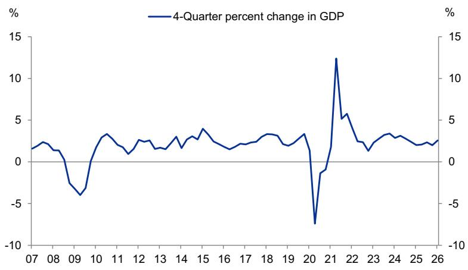

line

| Year | 4-Quarter percent change in GDP |
| ---- | ------------------------------- |
| 07   | ~1.5%                           |
| 08   | ~1.0%                           |
| 09   | ~-4.0%                          |
| 10   | ~3.5%                           |
| 11   | ~2.0%                           |
| 12   | ~2.5%                           |
| 13   | ~2.0%                           |
| 14   | ~3.0%                           |
| 15   | ~4.0%                           |
| 16   | ~2.5%                           |
| 17   | ~3.0%                           |
| 18   | ~3.5%                           |
| 19   | ~3.0%                           |
| 20   | ~3.5%                           |
| 21   | ~-8.0%                          |
| 22   | ~12.0%                          |
| 23   | ~3.0%                           |
| 24   | ~3.5%                           |
| 25   | ~3.0%                           |
| 26   | ~2.5%                           |

Source: US Bureau of Economic Analysis (BEA), GS Global Investment Research

Exhibit 9: Unemployment rate   
Measures of labor under-utilization   
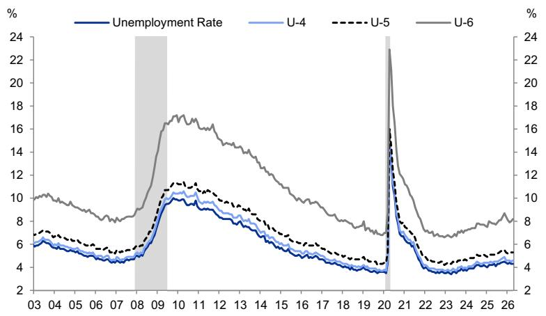

line

| Year | Unemployment Rate | U-4  | U-5  | U-6  |
|------|-------------------|------|------|------|
| 03   | ~6.5%             | ~7.0%| ~7.5%| ~10.0|
| 04   | ~6.0%             | ~6.5%| ~7.0%| ~9.5 |
| 05   | ~5.5%             | ~6.0%| ~6.5%| ~9.0 |
| 06   | ~5.0%             | ~5.5%| ~6.0%| ~8.5 |
| 07   | ~4.5%             | ~5.0%| ~5.5%| ~8.0 |
| 08   | ~4.0%             | ~4.5%| ~5.0%| ~7.5 |
| 09   | ~10.0%            | ~11.0%| ~11.5%| ~17.0|
| 10   | ~10.5%            | ~11.5%| ~12.0%| ~17.5|
| 11   | ~10.0%            | ~11.0%| ~11.5%| ~17.0|
| 12   | ~9.5%             | ~10.5%| ~11.0%| ~16.5|
| 13   | ~9.0%             | ~10.0%| ~10.5%| ~16.0|
| 14   | ~8.5%             | ~9.5%| ~10.0%| ~15.5|
| 15   | ~8.0%             | ~9.0%| ~9.5%| ~15.0|
| 16   | ~7.5%             | ~8.5%| ~9.0%| ~14.5|
| 17   | ~7.0%             | ~8.0%| ~8.5%| ~14.0|
| 18   | ~6.5%             | ~7.5%| ~8.0%| ~13.5|
| 19   | ~6.0%             | ~7.0%| ~7.5%| ~13.0|
| 20   | ~3.5%             | ~4.0%| ~4.5%| ~7.0 |
| 21   | ~3.0%             | ~3.5%| ~4.0%| ~23.0|
| 22   | ~3.5%             | ~4.0%| ~4.5%| ~16.0|
| 23   | ~4.0%             | ~4.5%| ~5.0%| ~14.0|
| 24   | ~4.5%             | ~5.0%| ~5.5%| ~13.0|
| 25   | ~5.0%             | ~5.5%| ~6.0%| ~12.0|
| 26   | ~5.5%             | ~6.0%| ~6.5%| ~11.0|

Source: BLS, GS Global Investment Research

Exhibit 10: Nominal personal income continues to grow   
Disposable personal income per capita   
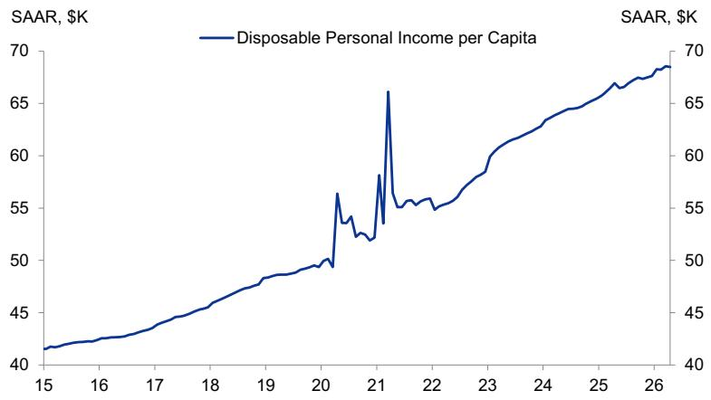

line

| Year | Disposable Personal Income per Capita ($K) |
| ---- | ------------------------------------------ |
| 15   | 41.0                                       |
| 16   | 42.0                                       |
| 17   | 43.0                                       |
| 18   | 45.0                                       |
| 19   | 47.0                                       |
| 20   | 50.0                                       |
| 21   | 58.0                                       |
| 22   | 55.0                                       |
| 23   | 60.0                                       |
| 24   | 63.0                                       |
| 25   | 66.0                                       |
| 26   | 68.0                                       |

Source: BEA, GS Global Investment Research

Exhibit 11: Financial conditions have loosened in the last month   
GS Financial Conditions Index   
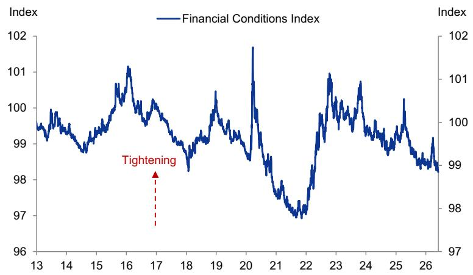

line

| Year | Financial Conditions Index |
| ---- | -------------------------- |
| 17   | Tightening                 |

Source: GS Global Investment Research

# US housing affordability is still poor

Exhibit 12: Rental affordability is superior to mortgage affordability   
Housing vs. Rental Affordability Indices   
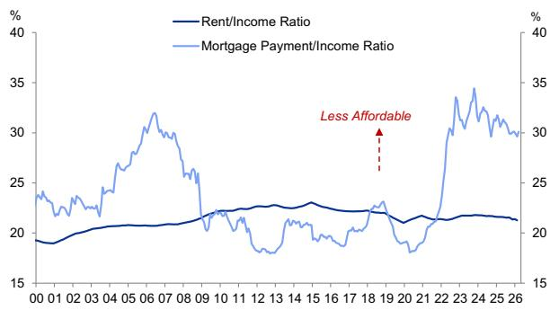

line

| Year | Rent/Income Ratio | Mortgage Payment/Income Ratio |
|------|-------------------|-------------------------------|
| 00   | ~19               | ~24                           |
| 01   | ~19               | ~23                           |
| 02   | ~19               | ~24                           |
| 03   | ~19               | ~25                           |
| 04   | ~19               | ~27                           |
| 05   | ~19               | ~30                           |
| 06   | ~19               | ~32                           |
| 07   | ~19               | ~31                           |
| 08   | ~19               | ~28                           |
| 09   | ~19               | ~25                           |
| 10   | ~19               | ~22                           |
| 11   | ~19               | ~21                           |
| 12   | ~19               | ~20                           |
| 13   | ~19               | ~19                           |
| 14   | ~19               | ~20                           |
| 15   | ~19               | ~21                           |
| 16   | ~19               | ~22                           |
| 17   | ~19               | ~23                           |
| 18   | ~19               | ~24                           |
| 19   | ~19               | ~25                           |
| 20   | ~19               | ~26                           |
| 21   | ~19               | ~27                           |
| 22   | ~19               | ~30                           |
| 23   | ~19               | ~35                           |
| 24   | ~19               | ~34                           |
| 25   | ~19               | ~33                           |
| 26   | ~19               | ~32                           |

Source: GS Global Investment Research

Exhibit 13: Our US housing affordability index remains low   
GS Housing Affordability Index   
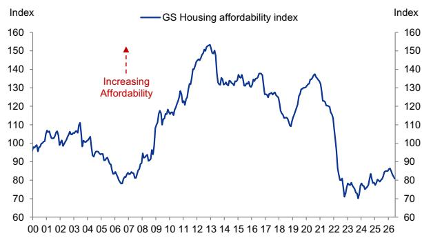

line

| Year | Index |
|------|-------|
| 00   | 100   |
| 01   | 105   |
| 02   | 108   |
| 03   | 110   |
| 04   | 105   |
| 05   | 100   |
| 06   | 95    |
| 07   | 85    |
| 08   | 90    |
| 09   | 100   |
| 10   | 115   |
| 11   | 125   |
| 12   | 135   |
| 13   | 155   |
| 14   | 145   |
| 15   | 135   |
| 16   | 130   |
| 17   | 125   |
| 18   | 115   |
| 19   | 120   |
| 20   | 135   |
| 21   | 140   |
| 22   | 130   |
| 23   | 75    |
| 24   | 80    |
| 25   | 85    |
| 26   | 90    |

Source: GS Global Investment Research

Exhibit 14: Current coupon mortgage basis has tightened to 119bp this month   
Mortgage basis (current coupon mortgage rate—5/10-Year Treasury rate)   
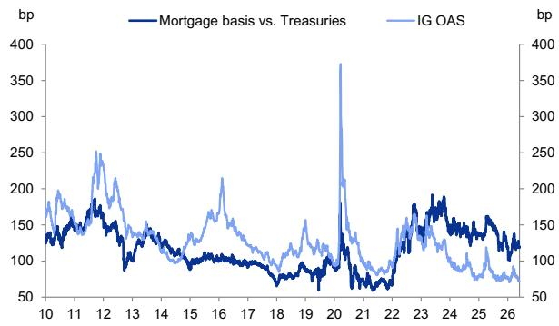

line

| Year | Mortgage basis vs. Treasuries (bp) | IG OAS (bp) |
|------|-------------------------------------|-------------|
| 10   | ~130                                | ~180        |
| 11   | ~140                                | ~200        |
| 12   | ~150                                | ~250        |
| 13   | ~120                                | ~180        |
| 14   | ~110                                | ~160        |
| 15   | ~100                                | ~140        |
| 16   | ~90                                 | ~120        |
| 17   | ~80                                 | ~100        |
| 18   | ~70                                 | ~80         |
| 19   | ~80                                 | ~90         |
| 20   | ~90                                 | ~380        |
| 21   | ~70                                 | ~80         |
| 22   | ~80                                 | ~90         |
| 23   | ~100                                | ~120        |
| 24   | ~120                                | ~140        |
| 25   | ~130                                | ~160        |
| 26   | ~140                                | ~180        |

Source: GS Global Investment Research

# Home sales volume has fallen

Exhibit 15: Existing home sales increased in April   
Pending and existing home sales   
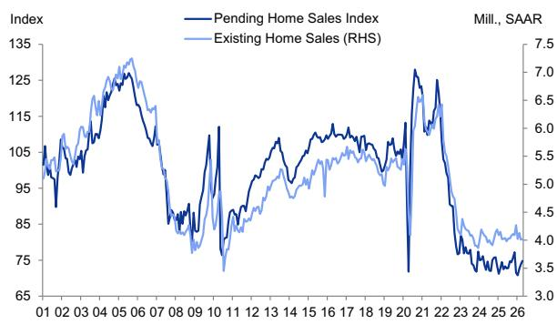

line

| Year | Pending Home Sales Index | Existing Home Sales (RHS) |
|------|--------------------------|---------------------------|
| 01   | ~105                     | ~5.0                      |
| 02   | ~98                      | ~4.8                      |
| 03   | ~105                     | ~5.2                      |
| 04   | ~115                     | ~5.5                      |
| 05   | ~125                     | ~6.0                      |
| 06   | ~120                     | ~6.5                      |
| 07   | ~110                     | ~6.0                      |
| 08   | ~85                      | ~4.5                      |
| 09   | ~80                      | ~4.0                      |
| 10   | ~110                     | ~4.5                      |
| 11   | ~75                      | ~3.5                      |
| 12   | ~85                      | ~4.0                      |
| 13   | ~95                      | ~4.5                      |
| 14   | ~100                     | ~5.0                      |
| 15   | ~105                     | ~5.5                      |
| 16   | ~108                     | ~6.0                      |
| 17   | ~105                     | ~6.5                      |
| 18   | ~100                     | ~6.0                      |
| 19   | ~95                      | ~5.5                      |
| 20   | ~125                     | ~6.5                      |
| 21   | ~130                     | ~7.0                      |
| 22   | ~120                     | ~6.5                      |
| 23   | ~75                      | ~4.5                      |
| 24   | ~70                      | ~4.0                      |
| 25   | ~65                      | ~4.0                      |
| 26   | ~60                      | ~4.0                      |

Source: NAR, GS Global Investment Research

Exhibit 16: Housing starts   
NAHB housing market index and housing starts   
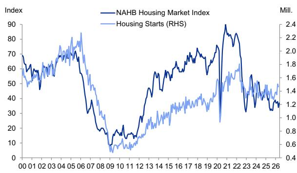

line

| Year | NAHB Housing Market Index | Housing Starts (RHS) |
|------|---------------------------|----------------------|
| 00   | ~65                       | ~1.2                 |
| 01   | ~60                       | ~1.3                 |
| 02   | ~55                       | ~1.4                 |
| 03   | ~65                       | ~1.5                 |
| 04   | ~70                       | ~1.6                 |
| 05   | ~75                       | ~1.7                 |
| 06   | ~80                       | ~1.8                 |
| 07   | ~70                       | ~1.9                 |
| 08   | ~30                       | ~0.6                 |
| 09   | ~15                       | ~0.8                 |
| 10   | ~10                       | ~1.0                 |
| 11   | ~15                       | ~1.2                 |
| 12   | ~20                       | ~1.4                 |
| 13   | ~30                       | ~1.6                 |
| 14   | ~40                       | ~1.8                 |
| 15   | ~50                       | ~2.0                 |
| 16   | ~60                       | ~2.2                 |
| 17   | ~65                       | ~2.4                 |
| 18   | ~70                       | ~2.3                 |
| 19   | ~75                       | ~2.1                 |
| 20   | ~80                       | ~1.9                 |
| 21   | ~90                       | ~1.7                 |
| 22   | ~85                       | ~1.5                 |
| 23   | ~70                       | ~1.3                 |
| 24   | ~60                       | ~1.2                 |
| 25   | ~55                       | ~1.1                 |
| 26   | ~50                       | ~1.0                 |

Source: NAHB, Census Bureau, GS Global Investment Research

Exhibit 17: Homebuyer sentiment has somewhat stabilized   
Fannie Mae Home Purchase Sentiment Index   
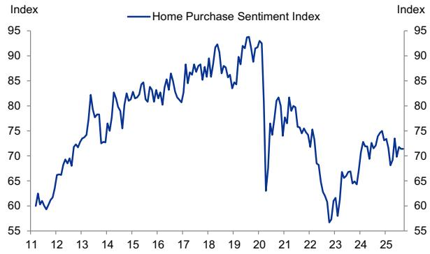

line

| Year | Home Purchase Sentiment Index |
| ---- | ----------------------------- |
| 11   | 60                            |
| 12   | 65                            |
| 13   | 70                            |
| 14   | 75                            |
| 15   | 80                            |
| 16   | 85                            |
| 17   | 90                            |
| 18   | 95                            |
| 19   | 90                            |
| 20   | 85                            |
| 21   | 75                            |
| 22   | 65                            |
| 23   | 60                            |
| 24   | 70                            |
| 25   | 75                            |

Source: Fannie Mae, Haver Analytics, GS Global Investment Research

# Supply of completed homes remains constrained

Exhibit 18: Months supply increased in April for new single-family homes   
Months' supply of single-family homes   
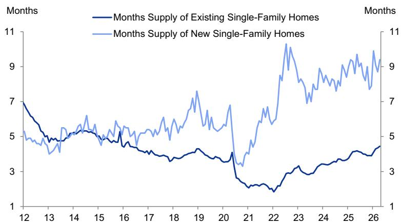

line

| Year | Months Supply of Existing Single-Family Homes | Months Supply of New Single-Family Homes |
|------|-----------------------------------------------|------------------------------------------|
| 12   | 7                                             | 5                                        |
| 13   | 5                                             | 4                                        |
| 14   | 5                                             | 5                                        |
| 15   | 5                                             | 5                                        |
| 16   | 4.5                                           | 5                                        |
| 17   | 4                                             | 5                                        |
| 18   | 4                                             | 6                                        |
| 19   | 4                                             | 7                                        |
| 20   | 3.5                                           | 6                                        |
| 21   | 2.5                                           | 3                                        |
| 22   | 2                                             | 9                                        |
| 23   | 3                                             | 8                                        |
| 24   | 3.5                                           | 9                                        |
| 25   | 4                                             | 9                                        |
| 26   | 4.5                                           | 9                                        |

Source: National Association of Realtors (NAR), Census Bureau, Haver Analytics, GS Global Investment Research

Exhibit 19: Supply of homes listed for sale decreased in April   
Total homes available for sale (seasonally adjusted)   
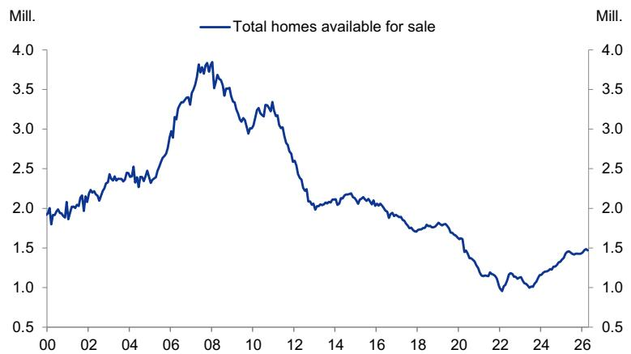

line

| Year | Total homes available for sale (Mill.) |
| ---- | ------------------------------------- |
| 00   | 2.0                                   |
| 02   | 2.2                                   |
| 04   | 2.4                                   |
| 06   | 2.8                                   |
| 08   | 3.8                                   |
| 10   | 3.2                                   |
| 12   | 2.0                                   |
| 14   | 2.1                                   |
| 16   | 2.0                                   |
| 18   | 1.8                                   |
| 20   | 1.5                                   |
| 22   | 1.0                                   |
| 24   | 1.2                                   |
| 26   | 1.5                                   |

Source: National Association of Realtors (NAR), GS Global Investment Research

Exhibit 20: The pipeline of homes not yet completed remains substantial   
For-sale single-family homes available by stage   
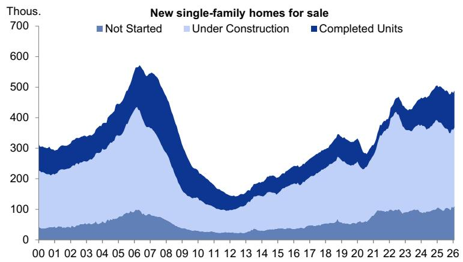

area

| Year | Not Started | Under Construction | Completed Units |
|------|-------------|---------------------|-----------------|
| 00   | 30          | 150                 | 100             |
| 01   | 35          | 160                 | 110             |
| 02   | 40          | 170                 | 120             |
| 03   | 45          | 180                 | 130             |
| 04   | 50          | 190                 | 140             |
| 05   | 55          | 200                 | 150             |
| 06   | 60          | 210                 | 160             |
| 07   | 65          | 220                 | 170             |
| 08   | 70          | 230                 | 180             |
| 09   | 75          | 240                 | 190             |
| 10   | 80          | 250                 | 200             |
| 11   | 85          | 260                 | 210             |
| 12   | 90          | 270                 | 220             |
| 13   | 95          | 280                 | 230             |
| 14   | 100         | 290                 | 240             |
| 15   | 105         | 300                 | 250             |
| 16   | 110         | 310                 | 260             |
| 17   | 115         | 320                 | 270             |
| 18   | 120         | 330                 | 280             |
| 19   | 125         | 340                 | 290             |
| 20   | 130         | 350                 | 300             |
| 21   | 135         | 360                 | 310             |
| 22   | 140         | 370                 | 320             |
| 23   | 145         | 380                 | 330             |
| 24   | 150         | 390                 | 340             |
| 25   | 155         | 400                 | 350             |
| 26   | 160         | 410                 | 360             |

Source: Census Bureau, GS Global Investment Research

Exhibit 21: The share of loans in foreclosure remains very low at 0.53%   
Mortgage foreclosure rate   
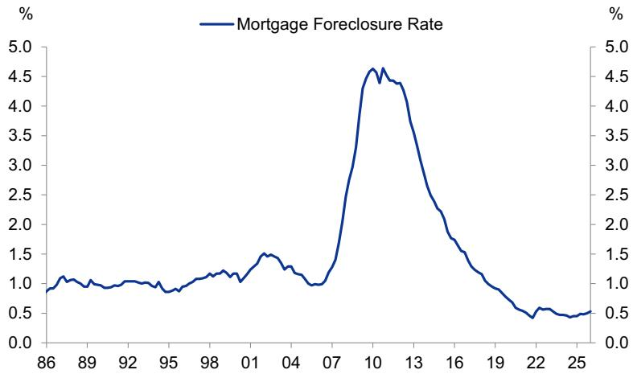

line

| Year | Mortgage Foreclosure Rate (%) |
| ---- | ----------------------------- |
| 86   | 0.9                           |
| 89   | 1.0                           |
| 92   | 1.0                           |
| 95   | 0.9                           |
| 98   | 1.1                           |
| 01   | 1.3                           |
| 04   | 1.4                           |
| 07   | 1.0                           |
| 10   | 4.7                           |
| 13   | 4.5                           |
| 16   | 2.5                           |
| 19   | 1.5                           |
| 22   | 0.5                           |
| 25   | 0.5                           |

Source: MBA, GS Global Investment Research

# 33% of new GSE purchase mortgages have DTI above 43%

Exhibit 22: FRB Senior Loan Officer Opinion Survey on mortgage lending   
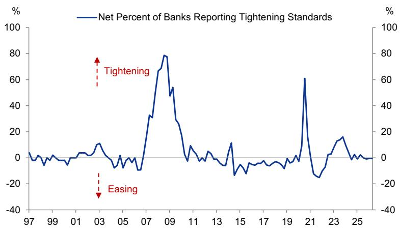

line

| Year | Net Percent of Banks Reporting Tightening Standards (%) |
|------|--------------------------------------------------------|
| 97   | ~0                                                     |
| 99   | ~0                                                     |
| 01   | ~0                                                     |
| 03   | ~10                                                    |
| 05   | ~0                                                     |
| 07   | ~30                                                    |
| 09   | ~80                                                    |
| 11   | ~10                                                    |
| 13   | ~0                                                     |
| 15   | ~-10                                                   |
| 17   | ~0                                                     |
| 19   | ~0                                                     |
| 21   | ~60                                                    |
| 23   | ~15                                                    |
| 25   | ~0                                                     |

Source: FRB, Haver Analytics

Exhibit 23: Jumbo mortgage availability has improved   
MBA Credit Availability Index (March 2012=100)   
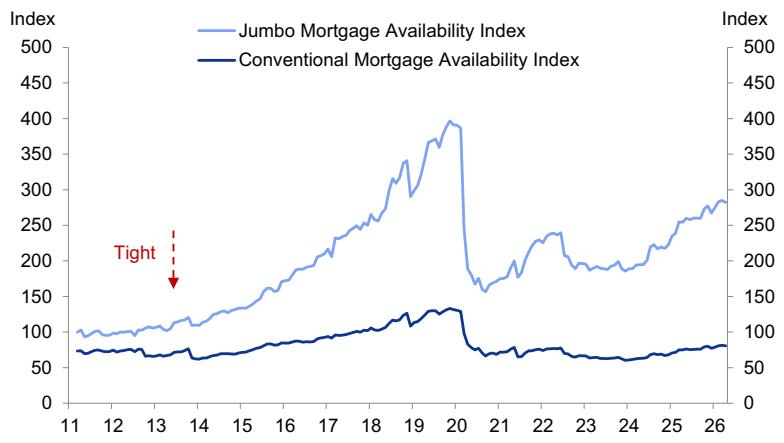

line

| Year | Jumbo Mortgage Availability Index | Conventional Mortgage Availability Index |
|------|-----------------------------------|------------------------------------------|
| 11   | ~100                              | ~70                                      |
| 12   | ~105                              | ~75                                      |
| 13   | ~110                              | ~80                                      |
| 14   | ~120                              | ~85                                      |
| 15   | ~130                              | ~90                                      |
| 16   | ~150                              | ~95                                      |
| 17   | ~180                              | ~100                                     |
| 18   | ~220                              | ~110                                     |
| 19   | ~280                              | ~120                                     |
| 20   | ~400                              | ~130                                     |
| 21   | ~150                              | ~70                                      |
| 22   | ~220                              | ~75                                      |
| 23   | ~200                              | ~70                                      |
| 24   | ~220                              | ~75                                      |
| 25   | ~250                              | ~80                                      |
| 26   | ~280                              | ~85                                      |

Source: MBA

Exhibit 24: FICO scores at origination remain high relative to pre-GFC levels   
Average FICO at origination for purchase mortgages   
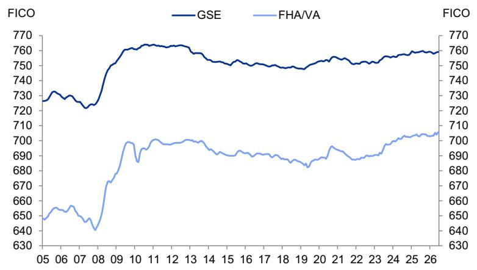

line

| Year | GSE   | FHA/VA |
|------|-------|--------|
| 05   | 730   | 650    |
| 06   | 735   | 655    |
| 07   | 725   | 645    |
| 08   | 720   | 640    |
| 09   | 750   | 670    |
| 10   | 760   | 690    |
| 11   | 765   | 700    |
| 12   | 765   | 700    |
| 13   | 760   | 700    |
| 14   | 755   | 695    |
| 15   | 750   | 690    |
| 16   | 750   | 690    |
| 17   | 750   | 690    |
| 18   | 750   | 690    |
| 19   | 750   | 685    |
| 20   | 755   | 690    |
| 21   | 755   | 695    |
| 22   | 755   | 690    |
| 23   | 755   | 695    |
| 24   | 755   | 700    |
| 25   | 760   | 705    |
| 26   | 760   | 710    |

Source: Black Knight, eMBS, GS Global Investment Research

Exhibit 25: 33% of new GSE purchase mortgages have DTI above 43%   
Share of loans with DTI above 43% for purchase mortgages by origination month   
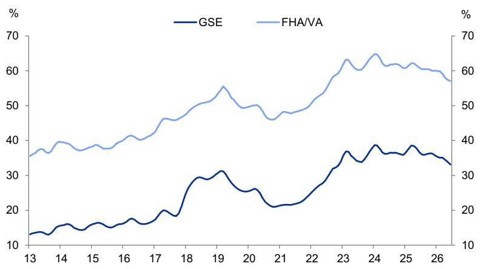

line

| Year | GSE  | FHA/VA |
|------|------|--------|
| 13   | 13   | 36     |
| 14   | 15   | 38     |
| 15   | 14   | 37     |
| 16   | 16   | 39     |
| 17   | 18   | 42     |
| 18   | 28   | 45     |
| 19   | 31   | 55     |
| 20   | 25   | 50     |
| 21   | 21   | 47     |
| 22   | 25   | 52     |
| 23   | 37   | 62     |
| 24   | 39   | 65     |
| 25   | 37   | 62     |
| 26   | 34   | 58     |

Source: eMBS, GS Global Investment Research

# Homeownership rates have ticked down in Q12026

Exhibit 26: The share of young adults living with parents increased in 2025   
Share of 18-34 year old individuals living with parents   
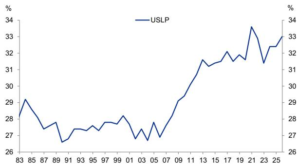

line

| Year | USLP |
| ---- | ---- |
| 83   | 28.5 |
| 85   | 29.5 |
| 87   | 27.5 |
| 89   | 27.0 |
| 91   | 26.5 |
| 93   | 27.5 |
| 95   | 27.5 |
| 97   | 28.0 |
| 99   | 28.5 |
| 01   | 27.0 |
| 03   | 26.5 |
| 05   | 27.5 |
| 07   | 28.5 |
| 09   | 29.5 |
| 11   | 31.0 |
| 13   | 31.5 |
| 15   | 31.5 |
| 17   | 32.0 |
| 19   | 31.5 |
| 21   | 33.5 |
| 23   | 31.5 |
| 25   | 33.0 |

Source: Census Bureau, GS Global Investment Research

Exhibit 27: Homeowner vacancies remain near all-time low rates   
Homeowner vacancy rate   
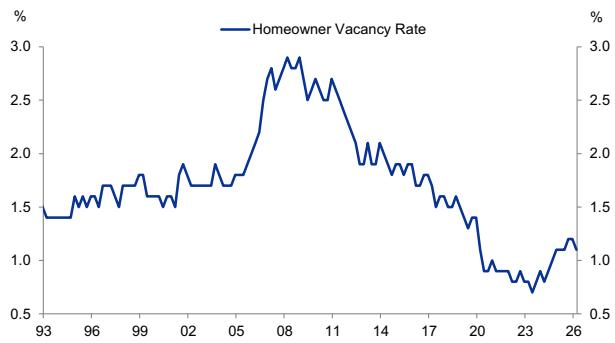

line

| Year | Homeowner Vacancy Rate |
| ---- | ---------------------- |
| 93   | 1.4                    |
| 96   | 1.6                    |
| 99   | 1.7                    |
| 02   | 1.8                    |
| 05   | 2.0                    |
| 08   | 2.9                    |
| 11   | 2.6                    |
| 14   | 2.0                    |
| 17   | 1.8                    |
| 20   | 1.0                    |
| 23   | 0.7                    |
| 26   | 1.2                    |

Source: Census Bureau, GS Global Investment Research

Exhibit 28: US homeownership rate has ticked down in Q1 2026   
Homeownership rate   
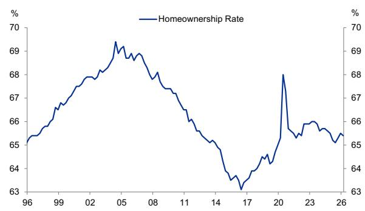

line

| Year | Homeownership Rate |
| ---- | ------------------- |
| 96   | 65.0                |
| 99   | 66.5                |
| 02   | 67.5                |
| 05   | 69.0                |
| 08   | 68.5                |
| 11   | 67.0                |
| 14   | 65.5                |
| 17   | 63.0                |
| 20   | 68.0                |
| 23   | 65.5                |
| 26   | 65.0                |

Source: Census Bureau

# Sequential home price growth has slowed

# Exhibit 29: Most home price indices show underperformance over last month

Annualized HPA across different house price indices and horizons

<table><tr><td rowspan="2">Metric</td><td rowspan="2">End Date</td><td colspan="4">Annualized HPA (%, SA)</td></tr><tr><td>Past 1 Mon</td><td>Past 3 Mon</td><td>Past 6 Mon</td><td>Past 12 Mon</td></tr><tr><td>NAR</td><td>Apr-26</td><td>-6.6</td><td>-1.3</td><td>-1.7</td><td>1.3</td></tr><tr><td>Freddie Mac</td><td>Apr-26</td><td>2.6</td><td>1.8</td><td>1.6</td><td>1.1</td></tr><tr><td>FHFA</td><td>Mar-26</td><td>0.9</td><td>0.4</td><td>1.9</td><td>1.1</td></tr><tr><td>Zillow</td><td>Apr-26</td><td>-1.2</td><td>2.9</td><td>7.3</td><td>-0.6</td></tr><tr><td>Case-Shiller</td><td>Mar-26</td><td>-2.6</td><td>-0.9</td><td>2.2</td><td>0.6</td></tr><tr><td>Median</td><td>Apr-26</td><td>-1.2</td><td>0.4</td><td>1.9</td><td>1.1</td></tr></table>

Source: FHFA, Freddie Mac, S&P, Zillow, GS Global Investment Research

# Exhibit 30: Existing home sales prices have increased in April

Median price of new and existing single-family home sales

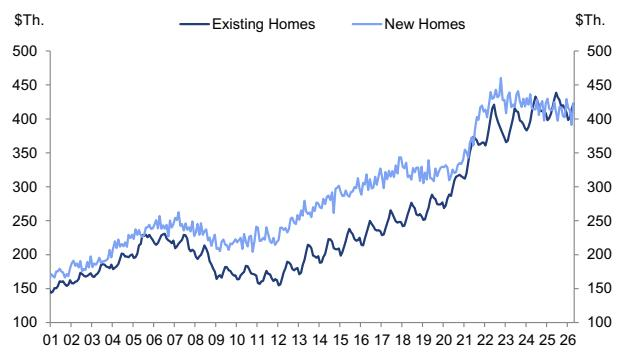

line

| Date | Existing Homes ($Th.) | New Homes ($Th.) |
|------|------------------------|------------------|
| 01   | 150                    | 170              |
| 02   | 160                    | 180              |
| 03   | 170                    | 190              |
| 04   | 180                    | 200              |
| 05   | 190                    | 210              |
| 06   | 200                    | 220              |
| 07   | 210                    | 230              |
| 08   | 220                    | 240              |
| 09   | 230                    | 250              |
| 10   | 240                    | 260              |
| 11   | 250                    | 270              |
| 12   | 260                    | 280              |
| 13   | 270                    | 290              |
| 14   | 280                    | 300              |
| 15   | 290                    | 310              |
| 16   | 300                    | 320              |
| 17   | 310                    | 330              |
| 18   | 320                    | 340              |
| 19   | 330                    | 350              |
| 20   | 340                    | 360              |
| 21   | 350                    | 370              |
| 22   | 360                    | 380              |
| 23   | 370                    | 390              |
| 24   | 380                    | 400              |
| 25   | 390                    | 410              |
| 26   | 400                    | 420              |

Source: NAR, Census Bureau, GS Global Investment Research

# Exhibit 31: House prices decreased at a 2.6 rate in March

Annualized month over month price growth, Case-Shiller US Seasonally-Adjusted index

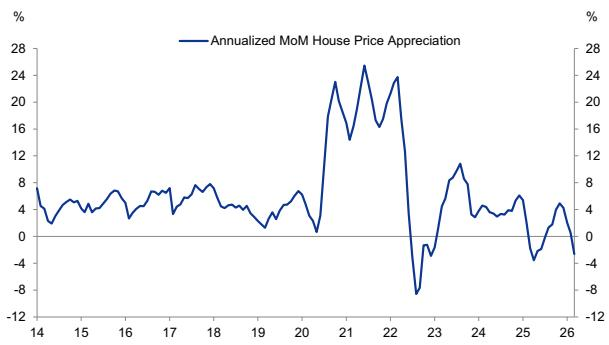

line

| Year | Annualized MoM House Price Appreciation (%) |
|------|------------------------------------------|
| 14   | 8                                        |
| 15   | 4                                        |
| 16   | 6                                        |
| 17   | 8                                        |
| 18   | 6                                        |
| 19   | 4                                        |
| 20   | 8                                        |
| 21   | 24                                       |
| 22   | 28                                       |
| 23   | -8                                       |
| 24   | 12                                       |
| 25   | 4                                        |
| 26   | -4                                       |

Source: S&P, GS Global Investment Research

# Most US metros are seeing home price growth stabilize

Exhibit 32: Chicago and New York year-over-year house price growth is the highest of the top metro areas   
Metro level housing indicators 

<table><tr><td>City</td><td>1/2000 to Current HPA (%)</td><td>Annualized HPA 1/2000-Current (%)</td><td>YoY HPA (%)</td><td>Serious Delinq. (%)</td><td>Unemploy-ment Rate (%)</td><td>Vacancy Rate (%)</td><td>Median Price ($Th)</td><td>Median Income ($Th)</td><td>HOI</td><td>Average FICO</td></tr><tr><td>Chicago</td><td>128</td><td>3</td><td>6.1</td><td>2.9</td><td>5.1</td><td>0.0</td><td>347</td><td>125</td><td>51</td><td>739</td></tr><tr><td>New York</td><td>240</td><td>5</td><td>4.0</td><td>2.6</td><td>4.7</td><td>0.0</td><td>667</td><td>113</td><td>13</td><td>745</td></tr><tr><td>Cleveland</td><td>103</td><td>3</td><td>3.0</td><td>2.9</td><td>3.8</td><td>0.0</td><td>186</td><td>94</td><td>71</td><td>732</td></tr><tr><td>Boston</td><td>250</td><td>5</td><td>2.1</td><td>1.4</td><td>3.8</td><td>0.5</td><td>632</td><td>140</td><td>23</td><td>753</td></tr><tr><td>Minneapolis</td><td>146</td><td>3</td><td>1.8</td><td>1.6</td><td>2.8</td><td>0.2</td><td>350</td><td>125</td><td>60</td><td>753</td></tr><tr><td>Miami</td><td>346</td><td>6</td><td>1.2</td><td>2.4</td><td>2.9</td><td>0.0</td><td>451</td><td>85</td><td>22</td><td>732</td></tr><tr><td>Charlotte</td><td>184</td><td>4</td><td>0.9</td><td>2.1</td><td>3.7</td><td>0.0</td><td>389</td><td>103</td><td>37</td><td>740</td></tr><tr><td>San Diego</td><td>348</td><td>6</td><td>0.8</td><td>0.7</td><td>4.5</td><td>0.0</td><td>828</td><td>117</td><td>4</td><td>762</td></tr><tr><td>San Francisco</td><td>264</td><td>5</td><td>0.6</td><td>0.6</td><td>4.3</td><td>0.0</td><td>1108</td><td>158</td><td>9</td><td>768</td></tr><tr><td>Washington DC</td><td>236</td><td>5</td><td>-0.1</td><td>1.9</td><td>3.1</td><td>0.0</td><td>517</td><td>150</td><td>46</td><td>749</td></tr><tr><td>Atlanta</td><td>148</td><td>4</td><td>-0.5</td><td>3.1</td><td>3.6</td><td>1.3</td><td>375</td><td>104</td><td>40</td><td>735</td></tr><tr><td>Portland</td><td>229</td><td>5</td><td>-0.9</td><td>1.2</td><td>4.2</td><td>1.3</td><td>500</td><td>114</td><td>18</td><td>758</td></tr><tr><td>Las Vegas</td><td>199</td><td>4</td><td>-1.3</td><td>1.8</td><td>6.0</td><td>0.0</td><td>432</td><td>84</td><td>14</td><td>740</td></tr><tr><td>Los Angeles</td><td>344</td><td>6</td><td>-1.6</td><td>1.2</td><td>5.6</td><td>0.7</td><td>905</td><td>105</td><td>3</td><td>755</td></tr><tr><td>Phoenix</td><td>225</td><td>5</td><td>-1.6</td><td>1.8</td><td>3.4</td><td>0.0</td><td>440</td><td>99</td><td>22</td><td>745</td></tr><tr><td>Dallas</td><td>191</td><td>4</td><td>-1.7</td><td>2.2</td><td>3.9</td><td>0.0</td><td>376</td><td>103</td><td>28</td><td>740</td></tr><tr><td>Tampa</td><td>266</td><td>5</td><td>-1.9</td><td>2.5</td><td>3.6</td><td>1.5</td><td>359</td><td>89</td><td>31</td><td>737</td></tr><tr><td>Denver</td><td>214</td><td>4</td><td>-2.0</td><td>1.2</td><td>4.6</td><td>0.0</td><td>560</td><td>126</td><td>24</td><td>758</td></tr><tr><td>Seattle</td><td>288</td><td>5</td><td>-2.5</td><td>0.9</td><td>4.2</td><td>0.8</td><td>673</td><td>139</td><td>25</td><td>758</td></tr></table>

Source: Black Knight, GS Global Investment Research

Exhibit 33: Definitions of housing indicators 

<table><tr><td>Metric</td><td>Definition</td><td>Source</td></tr><tr><td>1/2000-to-Current HPA</td><td>Cumulative house price growth from 1/2000 to current month</td><td>S&amp;P</td></tr><tr><td>Annualized HPA (2000 to Current)</td><td>Annualized average house price growth from 1/2000 to current month</td><td>S&amp;P</td></tr><tr><td>YoY HPA</td><td>Year-over-year house price growth</td><td>S&amp;P</td></tr><tr><td>% Seriously Delinquent</td><td>Percentage of first-lien mortgages 60+ days delinquent or in foreclosure</td><td>Black Knight</td></tr><tr><td>Unemployment Rate</td><td>Seasonally adjusted unemployment rate</td><td>BLS</td></tr><tr><td>Vacancy Rate</td><td>Homeowner vacancy rate</td><td>US Census</td></tr><tr><td>Median Price</td><td>Median home price ($Th)</td><td>NAHB</td></tr><tr><td>Median Income</td><td>Median family income ($Th)</td><td>NAHB</td></tr><tr><td>HOI</td><td>Housing Opportunity Index: 100=affordable, 0=unaffordable</td><td>NAHB</td></tr><tr><td>Average FICO</td><td>Average FICO score at origination among outstanding first-lien mortgages</td><td>Black Knight</td></tr></table>

Source: GS Global Investment Research

# Household balance sheet metrics remain resilient

Exhibit 34: HELOC debt increased by 11% year-over-year through 2026Q1   
Household debt balance by type of debt   
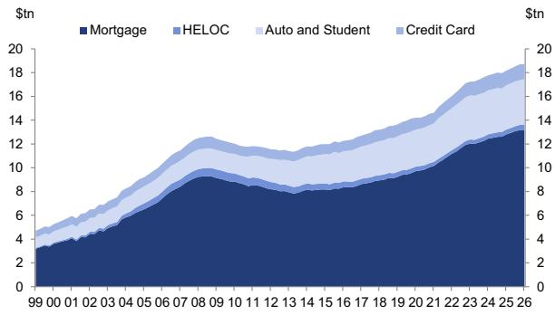

bar_stacked

| Year | Mortgage | HELOC | Auto and Student | Credit Card |
|------|----------|-------|------------------|-------------|
| 99   | 3        | 2     | 1                | 1           |
| 00   | 3        | 2     | 1                | 1           |
| 01   | 4        | 3     | 2                | 2           |
| 02   | 5        | 4     | 3                | 3           |
| 03   | 6        | 5     | 4                | 4           |
| 04   | 7        | 6     | 5                | 5           |
| 05   | 8        | 7     | 6                | 6           |
| 06   | 9        | 8     | 7                | 7           |
| 07   | 10       | 9     | 8                | 8           |
| 08   | 11       | 10    | 9                | 9           |
| 09   | 12       | 11    | 10               | 10          |
| 10   | 12       | 11    | 10               | 10          |
| 11   | 12       | 11    | 10               | 10          |
| 12   | 12       | 11    | 10               | 10          |
| 13   | 12       | 11    | 10               | 10          |
| 14   | 12       | 11    | 10               | 10          |
| 15   | 12       | 11    | 10               | 10          |
| 16   | 12       | 11    | 10               | 10          |
| 17   | 12       | 11    | 10               | 10          |
| 18   | 12       | 11    | 10               | 10          |
| 19   | 12       | 11    | 10               | 10          |
| 20   | 12       | 11    | 10               | 10          |
| 21   | 12       | 11    | 10               | 10          |
| 22   | 13       | 12    | 11               | 11          |
| 23   | 14       | 13    | 12               | 12          |
| 24   | 15       | 14    | 13               | 13          |
| 25   | 16       | 15    | 14               | 14          |
| 26   | 17       | 16    | 15               | 15          |

Source: FRB, FRBNY, GS Global Investment Research

Exhibit 35: Household debt to income ratios increased in 2025Q4   
Debt service ratio and debt-to-income ratio   
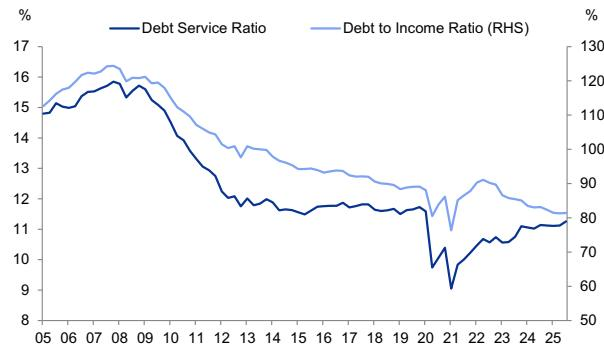

line

| Year | Debt Service Ratio | Debt to Income Ratio (RHS) |
|------|--------------------|----------------------------|
| 05   | 15.0               | 110                        |
| 06   | 15.5               | 115                        |
| 07   | 16.0               | 120                        |
| 08   | 15.8               | 122                        |
| 09   | 15.5               | 120                        |
| 10   | 14.5               | 115                        |
| 11   | 13.5               | 110                        |
| 12   | 12.5               | 105                        |
| 13   | 12.0               | 100                        |
| 14   | 11.8               | 98                         |
| 15   | 11.7               | 96                         |
| 16   | 11.6               | 95                         |
| 17   | 11.5               | 94                         |
| 18   | 11.4               | 93                         |
| 19   | 11.3               | 92                         |
| 20   | 11.2               | 90                         |
| 21   | 9.0                | 80                         |
| 22   | 10.5               | 85                         |
| 23   | 11.0               | 83                         |
| 24   | 11.2               | 82                         |
| 25   | 11.3               | 81                         |

Source: FRB, BEA, GS Global Investment Research

Exhibit 36: Serious delinquency rates increased in Q1   
90+-day delinquency rate by account type   
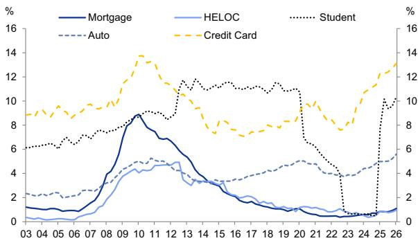

line

| Year | Mortgage | HELOC | Auto | Student | Credit Card |
|------|----------|-------|------|---------|-------------|
| 03   | 1.0      | 0.5   | 2.0  | 6.0     | 9.0         |
| 04   | 1.0      | 0.5   | 2.0  | 6.0     | 9.0         |
| 05   | 1.0      | 0.5   | 2.0  | 6.0     | 9.0         |
| 06   | 1.0      | 0.5   | 2.0  | 6.0     | 9.0         |
| 07   | 1.0      | 0.5   | 2.0  | 6.0     | 9.0         |
| 08   | 2.0      | 1.0   | 2.0  | 7.0     | 10.0        |
| 09   | 4.0      | 2.0   | 3.0  | 8.0     | 11.0        |
| 10   | 8.0      | 3.0   | 4.0  | 9.0     | 14.0        |
| 11   | 7.0      | 3.5   | 4.5  | 10.0    | 13.0        |
| 12   | 6.0      | 3.5   | 4.5  | 11.0    | 12.0        |
| 13   | 5.0      | 3.5   | 4.5  | 12.0    | 11.0        |
| 14   | 4.0      | 3.5   | 4.5  | 11.0    | 10.0        |
| 15   | 3.0      | 3.5   | 4.5  | 11.0    | 9.0         |
| 16   | 2.5      | 3.5   | 4.5  | 11.0    | 8.5         |
| 17   | 2.0      | 3.5   | 4.5  | 11.0    | 8.5         |
| 18   | 1.5      | 3.5   | 4.5  | 11.0    | 8.5         |
| 19   | 1.5      | 3.5   | 4.5  | 11.0    | 8.5         |
| 20   | 1.5      | 3.5   | 4.5  | 11.0    | 8.5         |
| 21   | 1.5      | 3.5   | 4.5  | 11.0    | 8.5         |
| 22   | 1.5      | 3.5   | 4.5  | 11.0    | 8.5         |
| 23   | 1.5      | 3.5   | 4.5  | 11.0    | 8.5         |
| 24   | 1.5      | 3.5   | 4.5  | 11.0    | 8.5         |
| 25   | 1.5      | 3.5   | 4.5  | 11.0    | 9.0         |
| 26   | 1.5      | 3.5   | 4.5  | 11.0    | 9.5         |

Source: FRBNY, GS Global Investment Research

# Subprime auto ABS losses have grown

Exhibit 37: Subprime auto ABS losses have grown   
Subprime auto loan ABS annual loss rate vs. WAC   
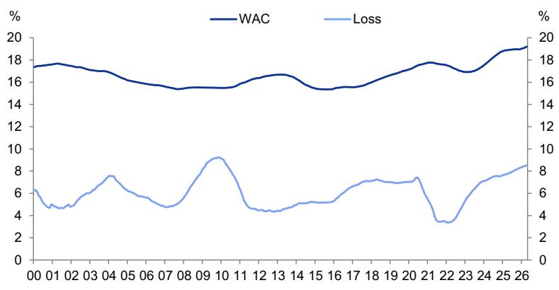

line

| Year | WAC  | Loss |
|------|------|------|
| 00   | 17.5 | 6.0  |
| 01   | 17.8 | 5.0  |
| 02   | 17.6 | 4.5  |
| 03   | 17.4 | 5.5  |
| 04   | 17.2 | 7.0  |
| 05   | 16.8 | 6.0  |
| 06   | 16.5 | 5.0  |
| 07   | 16.2 | 4.5  |
| 08   | 15.8 | 5.5  |
| 09   | 15.5 | 7.0  |
| 10   | 15.8 | 9.0  |
| 11   | 16.0 | 5.0  |
| 12   | 16.2 | 4.5  |
| 13   | 16.5 | 4.8  |
| 14   | 16.8 | 5.0  |
| 15   | 16.5 | 5.2  |
| 16   | 16.2 | 5.5  |
| 17   | 16.8 | 6.0  |
| 18   | 17.0 | 6.5  |
| 19   | 17.2 | 6.8  |
| 20   | 17.5 | 7.0  |
| 21   | 17.8 | 3.5  |
| 22   | 17.5 | 4.0  |
| 23   | 17.8 | 6.0  |
| 24   | 18.0 | 7.0  |
| 25   | 18.5 | 7.5  |
| 26   | 19.0 | 8.0  |

Source: Intex, GS Global Investment Research

Exhibit 38: Auto loan credit scores are at the high end of their historical range   
Auto loan 10th and 50th percentile credit scores by origination quarter   
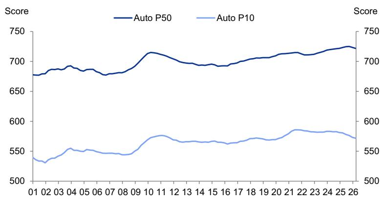

line

| Month | Auto P50 | Auto P10 |
|-------|----------|----------|
| 01    | 680      | 540      |
| 02    | 685      | 535      |
| 03    | 690      | 545      |
| 04    | 695      | 555      |
| 05    | 690      | 550      |
| 06    | 685      | 545      |
| 07    | 680      | 540      |
| 08    | 685      | 545      |
| 09    | 695      | 550      |
| 10    | 710      | 570      |
| 11    | 715      | 575      |
| 12    | 710      | 570      |
| 13    | 705      | 565      |
| 14    | 700      | 560      |
| 15    | 695      | 565      |
| 16    | 690      | 560      |
| 17    | 695      | 565      |
| 18    | 700      | 570      |
| 19    | 705      | 575      |
| 20    | 710      | 580      |
| 21    | 715      | 585      |
| 22    | 710      | 580      |
| 23    | 715      | 585      |
| 24    | 720      | 580      |
| 25    | 725      | 575      |
| 26    | 720      | 570      |

Source: Federal Reserve Bank of New York, GS Global Investment Research

Exhibit 39: Personal bankruptcy filing rates are hovering over multi-decade lows   
Personal bankruptcies per capita (seasonally adjusted)   
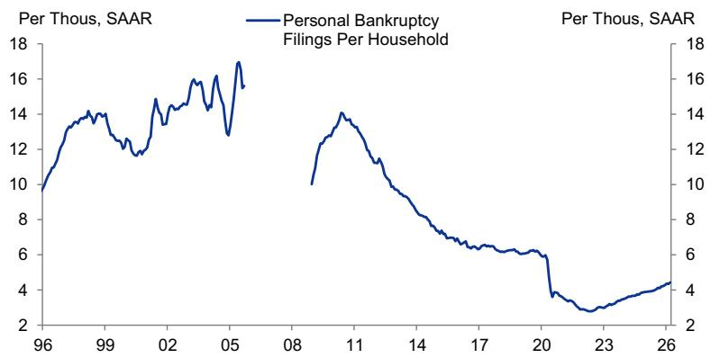

line

| Year | Personal Bankruptcy Filings Per Household |
| ---- | ------------------------------------------ |
| 96   | 10                                         |
| 99   | 14                                         |
| 02   | 12                                         |
| 05   | 17                                         |
| 08   | 10                                         |
| 11   | 14                                         |
| 14   | 8                                          |
| 17   | 6                                          |
| 20   | 4                                          |
| 23   | 3                                          |
| 26   | 4                                          |

2005-2009 data are excluded due to distortions following enactment of the Bankruptcy Abuse Prevention and Consumer Protection Act of 2005.

Exhibit 40: Household debt outstanding as a share of US GDP is down over the past decade   
Household debt outstanding as a percentage of annual nominal US GDP   
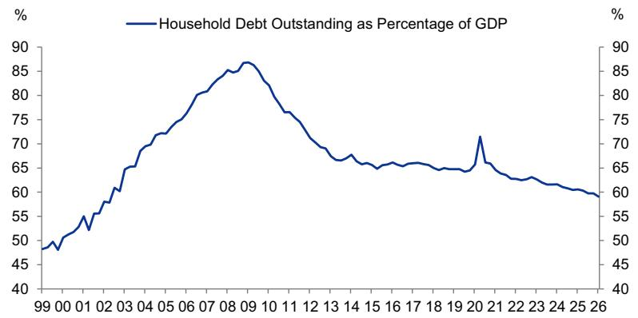

line

| Year | Household Debt Outstanding as Percentage of GDP |
| ---- | ------------------------------------------------- |
| 99   | 48                                                |
| 00   | 50                                                |
| 01   | 55                                                |
| 02   | 60                                                |
| 03   | 65                                                |
| 04   | 70                                                |
| 05   | 75                                                |
| 06   | 80                                                |
| 07   | 85                                                |
| 08   | 87                                                |
| 09   | 86                                                |
| 10   | 84                                                |
| 11   | 80                                                |
| 12   | 75                                                |
| 13   | 70                                                |
| 14   | 68                                                |
| 15   | 66                                                |
| 16   | 65                                                |
| 17   | 64                                                |
| 18   | 63                                                |
| 19   | 62                                                |
| 20   | 72                                                |
| 21   | 65                                                |
| 22   | 63                                                |
| 23   | 62                                                |
| 24   | 61                                                |
| 25   | 60                                                |
| 26   | 59                                                |

Source: BEA, Federal Reserve, GS Global Investment Research   
Source: Admin. Office of the US Courts, Census Bureau, GS Global Investment Research

# 2.2% of mortgaged properties have negative equity

Exhibit 41: 2.2% of mortgaged properties have negative equity   
Percentage of mortgages with negative equity   
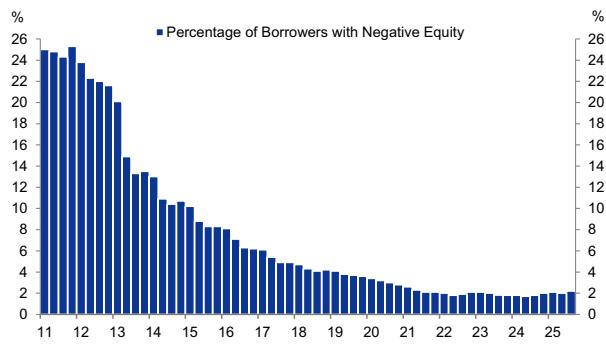

bar

| ID | Percentage of Borrowers with Negative Equity (%) |
|----|--------------------------------------------------|
| 11 | 25.0                                             |
| 12 | 24.0                                             |
| 13 | 20.0                                             |
| 14 | 13.0                                             |
| 15 | 10.0                                             |
| 16 | 8.0                                              |
| 17 | 6.0                                              |
| 18 | 5.0                                              |
| 19 | 4.0                                              |
| 20 | 3.0                                              |
| 21 | 2.0                                              |
| 22 | 1.5                                              |
| 23 | 1.5                                              |
| 24 | 1.5                                              |
| 25 | 1.5                                              |

Source: CoreLogic, GS Global Investment Research

Exhibit 42: Real estate equity and stock market holdings are at historical highs   
Housing and stock market equity held by households   
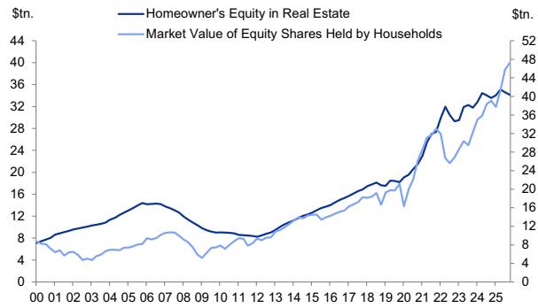

line

| Year | Homeowner's Equity in Real Estate ($tn.) | Market Value of Equity Shares Held by Households ($tn.) |
|------|------------------------------------------|--------------------------------------------------------|
| 00   | 8                                        | 8                                                      |
| 01   | 9                                        | 7                                                      |
| 02   | 10                                       | 6                                                      |
| 03   | 11                                       | 7                                                      |
| 04   | 12                                       | 8                                                      |
| 05   | 13                                       | 9                                                      |
| 06   | 14                                       | 10                                                     |
| 07   | 15                                       | 11                                                     |
| 08   | 14                                       | 12                                                     |
| 09   | 13                                       | 11                                                     |
| 10   | 12                                       | 12                                                     |
| 11   | 11                                       | 13                                                     |
| 12   | 12                                       | 14                                                     |
| 13   | 13                                       | 15                                                     |
| 14   | 14                                       | 16                                                     |
| 15   | 15                                       | 17                                                     |
| 16   | 16                                       | 18                                                     |
| 17   | 17                                       | 19                                                     |
| 18   | 18                                       | 20                                                     |
| 19   | 19                                       | 21                                                     |
| 20   | 20                                       | 22                                                     |
| 21   | 22                                       | 24                                                     |
| 22   | 25                                       | 28                                                     |
| 23   | 30                                       | 32                                                     |
| 24   | 35                                       | 36                                                     |
| 25   | 36                                       | 48                                                     |

Source: FRB, GS Global Investment Research

Exhibit 43: 33% of refinance originations are cash-out transactions   
Cash-out refinance share by origination quarter   
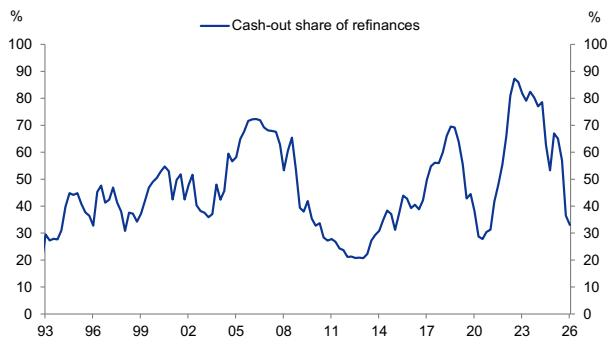

line

| Year | Cash-out share of refinances (%) |
| ---- | ------------------------------- |
| 93   | 25                              |
| 96   | 45                              |
| 99   | 50                              |
| 02   | 55                              |
| 05   | 70                              |
| 08   | 65                              |
| 11   | 30                              |
| 14   | 20                              |
| 17   | 40                              |
| 20   | 70                              |
| 23   | 90                              |
| 26   | 35                              |

Source: FHFA, GS Global Investment Research

# 30-year FNMA prepayment rates were down 16% in April vs. March

Exhibit 44: Agency MBS issuance has picked up off seasonal strength   
Agency MBS gross monthly issuance   
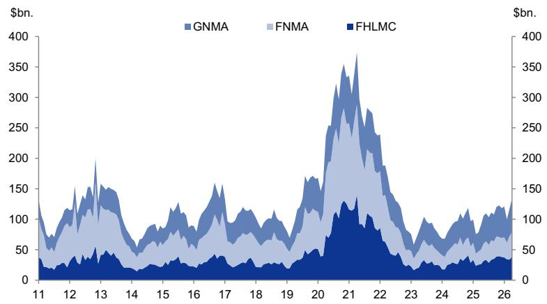

area

| Year | GNMA ($bn) | FNMA ($bn) | FHLMC ($bn) |
|------|------------|------------|-------------|
| 11   | ~100       | ~50        | ~20         |
| 12   | ~120       | ~60        | ~30         |
| 13   | ~150       | ~70        | ~40         |
| 14   | ~80        | ~40        | ~20         |
| 15   | ~90        | ~50        | ~30         |
| 16   | ~100       | ~60        | ~40         |
| 17   | ~120       | ~70        | ~50         |
| 18   | ~110       | ~60        | ~40         |
| 19   | ~130       | ~70        | ~50         |
| 20   | ~150       | ~80        | ~60         |
| 21   | ~350       | ~200       | ~100        |
| 22   | ~250       | ~150       | ~80         |
| 23   | ~100       | ~50        | ~30         |
| 24   | ~80        | ~40        | ~20         |
| 25   | ~100       | ~50        | ~30         |
| 26   | ~120       | ~60        | ~40         |

Source: eMBS, GS Global Investment Research

Exhibit 45: Agency prepayments for 30-year conventionals decreased in April   
30-year conventional and government MBS prepayment speeds (conditional prepayment rate)   
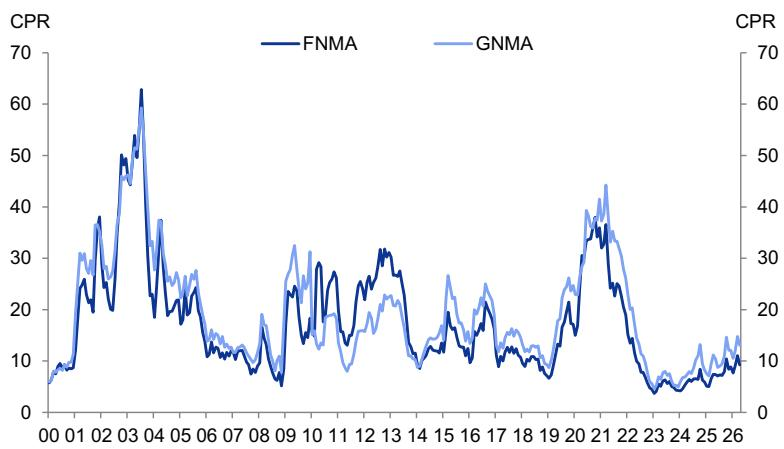

line

| Year | FNMA | GNMA |
|------|------|------|
| 00   | 5    | 5    |
| 01   | 10   | 10   |
| 02   | 20   | 25   |
| 03   | 35   | 40   |
| 04   | 60   | 55   |
| 05   | 25   | 28   |
| 06   | 15   | 18   |
| 07   | 10   | 12   |
| 08   | 8    | 9    |
| 09   | 12   | 15   |
| 10   | 20   | 22   |
| 11   | 18   | 16   |
| 12   | 25   | 28   |
| 13   | 30   | 25   |
| 14   | 20   | 22   |
| 15   | 15   | 18   |
| 16   | 18   | 20   |
| 17   | 22   | 25   |
| 18   | 15   | 18   |
| 19   | 10   | 12   |
| 20   | 20   | 25   |
| 21   | 35   | 40   |
| 22   | 30   | 35   |
| 23   | 10   | 12   |
| 24   | 5    | 8    |
| 25   | 8    | 10   |
| 26   | 10   | 12   |

Source: eMBS, GS Global Investment Research

Exhibit 46: 30-year FNMA prepayment rates were down 16% in April vs. March   
Agency MBS prepayments by product 

<table><tr><td>Product</td><td>Bal ($B)</td><td>WAC</td><td>WALA</td><td>CLTV</td><td>ALS</td><td>% Wells</td><td>% Chase</td><td>% BoA</td><td>Apr CPR</td><td>Mar CPR</td><td>% Chg</td></tr><tr><td>FN30</td><td>2,904</td><td>4.4</td><td>60</td><td>54</td><td>259</td><td>6</td><td>7</td><td>1</td><td>9</td><td>11</td><td>-16%</td></tr><tr><td>GN30-II</td><td>1,909</td><td>4.3</td><td>53</td><td>70</td><td>280</td><td>2</td><td>0</td><td>0</td><td>13</td><td>15</td><td>-12%</td></tr><tr><td>FN15</td><td>292</td><td>3.0</td><td>63</td><td>32</td><td>154</td><td>7</td><td>7</td><td>0</td><td>8</td><td>9</td><td>-1%</td></tr><tr><td>FN20</td><td>130</td><td>3.5</td><td>68</td><td>37</td><td>186</td><td>7</td><td>9</td><td>1</td><td>7</td><td>7</td><td>-6%</td></tr></table>

Source: eMBS, GS Global Investment Research

# Conventional MBS prepayment rates decreased for higher coupons in April vs. March

Exhibit 47: Prepayments for the higher coupon cohort decreased in April vs. March   
FNM 30-year MBS prepayments by coupon and vintage 

<table><tr><td>Product</td><td>Coupon</td><td>Vintage</td><td>Bal ($B)</td><td>WAC</td><td>WALA</td><td>CLTV</td><td>FICO</td><td>ALS ($K)</td><td>Apr CPR</td><td>Mar CPR</td><td>% Chg</td></tr><tr><td rowspan="27"></td><td rowspan="3">1.5</td><td>2021</td><td>35</td><td>2.5</td><td>61</td><td>44</td><td>774</td><td>316</td><td>4</td><td>3</td><td>17%</td></tr><tr><td>2020</td><td>33</td><td>2.5</td><td>65</td><td>42</td><td>774</td><td>304</td><td>4</td><td>3</td><td>16%</td></tr><tr><td>2022</td><td>38</td><td>2.9</td><td>50</td><td>55</td><td>762</td><td>329</td><td>4</td><td>4</td><td>1%</td></tr><tr><td rowspan="3">2.0</td><td>2021</td><td>389</td><td>2.8</td><td>58</td><td>48</td><td>763</td><td>280</td><td>5</td><td>4</td><td>14%</td></tr><tr><td>2020</td><td>233</td><td>2.9</td><td>66</td><td>43</td><td>767</td><td>264</td><td>5</td><td>4</td><td>11%</td></tr><tr><td>2022</td><td>65</td><td>3.3</td><td>50</td><td>59</td><td>749</td><td>303</td><td>6</td><td>5</td><td>15%</td></tr><tr><td rowspan="6">2.5</td><td>2021</td><td>256</td><td>3.2</td><td>57</td><td>53</td><td>744</td><td>242</td><td>6</td><td>6</td><td>12%</td></tr><tr><td>2020</td><td>176</td><td>3.4</td><td>69</td><td>43</td><td>756</td><td>232</td><td>6</td><td>5</td><td>12%</td></tr><tr><td>2019</td><td>11</td><td>3.5</td><td>78</td><td>41</td><td>766</td><td>265</td><td>5</td><td>4</td><td>22%</td></tr><tr><td>2022</td><td>57</td><td>3.7</td><td>49</td><td>61</td><td>744</td><td>283</td><td>7</td><td>6</td><td>7%</td></tr><tr><td>2021</td><td>36</td><td>3.7</td><td>57</td><td>53</td><td>721</td><td>194</td><td>7</td><td>7</td><td>5%</td></tr><tr><td>2020</td><td>51</td><td>3.8</td><td>71</td><td>43</td><td>744</td><td>186</td><td>7</td><td>6</td><td>14%</td></tr><tr><td rowspan="8">3.0</td><td>2019</td><td>38</td><td>3.9</td><td>78</td><td>42</td><td>755</td><td>207</td><td>6</td><td>6</td><td>5%</td></tr><tr><td>2016</td><td>45</td><td>3.6</td><td>116</td><td>32</td><td>761</td><td>179</td><td>6</td><td>5</td><td>10%</td></tr><tr><td>2015</td><td>10</td><td>3.8</td><td>131</td><td>28</td><td>767</td><td>175</td><td>6</td><td>5</td><td>17%</td></tr><tr><td>2013</td><td>33</td><td>3.6</td><td>156</td><td>22</td><td>764</td><td>141</td><td>6</td><td>6</td><td>1%</td></tr><tr><td>2012</td><td>22</td><td>3.6</td><td>162</td><td>21</td><td>769</td><td>142</td><td>6</td><td>6</td><td>0%</td></tr><tr><td>2022</td><td>52</td><td>4.2</td><td>47</td><td>65</td><td>744</td><td>286</td><td>7</td><td>7</td><td>2%</td></tr><tr><td>2019</td><td>21</td><td>4.3</td><td>81</td><td>43</td><td>741</td><td>174</td><td>7</td><td>7</td><td>5%</td></tr><tr><td>2017</td><td>27</td><td>4.0</td><td>104</td><td>36</td><td>754</td><td>169</td><td>7</td><td>6</td><td>10%</td></tr><tr><td rowspan="7">3.5</td><td>2016</td><td>19</td><td>4.1</td><td>117</td><td>33</td><td>739</td><td>137</td><td>7</td><td>6</td><td>7%</td></tr><tr><td>2015</td><td>25</td><td>4.1</td><td>129</td><td>30</td><td>751</td><td>147</td><td>6</td><td>6</td><td>3%</td></tr><tr><td>2013</td><td>15</td><td>4.0</td><td>154</td><td>25</td><td>741</td><td>118</td><td>7</td><td>6</td><td>18%</td></tr><tr><td>2012</td><td>23</td><td>4.0</td><td>166</td><td>21</td><td>757</td><td>119</td><td>7</td><td>7</td><td>0%</td></tr><tr><td>2022</td><td>54</td><td>4.8</td><td>46</td><td>67</td><td>748</td><td>302</td><td>8</td><td>7</td><td>5%</td></tr><tr><td>2019</td><td>11</td><td>4.8</td><td>82</td><td>43</td><td>729</td><td>151</td><td>8</td><td>8</td><td>-5%</td></tr><tr><td>2018</td><td>21</td><td>4.6</td><td>94</td><td>40</td><td>743</td><td>171</td><td>7</td><td>7</td><td>1%</td></tr><tr><td rowspan="23">FNM30</td><td rowspan="3">4.0</td><td>2017</td><td>20</td><td>4.5</td><td>105</td><td>37</td><td>731</td><td>142</td><td>8</td><td>7</td><td>15%</td></tr><tr><td>2014</td><td>12</td><td>4.6</td><td>141</td><td>29</td><td>735</td><td>120</td><td>7</td><td>7</td><td>8%</td></tr><tr><td>2024</td><td>13</td><td>5.5</td><td>19</td><td>75</td><td>764</td><td>356</td><td>7</td><td>7</td><td>-5%</td></tr><tr><td rowspan="5">4.5</td><td>2023</td><td>12</td><td>5.4</td><td>35</td><td>70</td><td>761</td><td>329</td><td>9</td><td>8</td><td>19%</td></tr><tr><td>2022</td><td>56</td><td>5.3</td><td>44</td><td>69</td><td>750</td><td>297</td><td>9</td><td>8</td><td>6%</td></tr><tr><td>2018</td><td>13</td><td>5.1</td><td>93</td><td>41</td><td>720</td><td>135</td><td>9</td><td>8</td><td>7%</td></tr><tr><td>2026</td><td>42</td><td>6.0</td><td>2</td><td>76</td><td>765</td><td>373</td><td>4</td><td>4</td><td>17%</td></tr><tr><td>2025</td><td>48</td><td>6.0</td><td>7</td><td>75</td><td>766</td><td>354</td><td>6</td><td>7</td><td>-13%</td></tr><tr><td rowspan="5">5.0</td><td>2024</td><td>43</td><td>6.0</td><td>19</td><td>73</td><td>763</td><td>328</td><td>9</td><td>12</td><td>-26%</td></tr><tr><td>2023</td><td>44</td><td>6.0</td><td>35</td><td>69</td><td>761</td><td>319</td><td>11</td><td>12</td><td>-5%</td></tr><tr><td>2022</td><td>41</td><td>5.8</td><td>43</td><td>69</td><td>741</td><td>273</td><td>10</td><td>10</td><td>-1%</td></tr><tr><td>2026</td><td>20</td><td>6.4</td><td>2</td><td>79</td><td>747</td><td>347</td><td>7</td><td>6</td><td>7%</td></tr><tr><td>2025</td><td>87</td><td>6.5</td><td>9</td><td>76</td><td>761</td><td>333</td><td>12</td><td>20</td><td>-40%</td></tr><tr><td rowspan="4">5.5</td><td>2024</td><td>72</td><td>6.5</td><td>21</td><td>74</td><td>761</td><td>316</td><td>16</td><td>24</td><td>-31%</td></tr><tr><td>2023</td><td>57</td><td>6.5</td><td>34</td><td>70</td><td>758</td><td>303</td><td>16</td><td>21</td><td>-24%</td></tr><tr><td>2022</td><td>23</td><td>6.3</td><td>42</td><td>69</td><td>740</td><td>269</td><td>13</td><td>14</td><td>-13%</td></tr><tr><td>2025</td><td>82</td><td>6.9</td><td>10</td><td>78</td><td>752</td><td>321</td><td>20</td><td>32</td><td>-38%</td></tr><tr><td rowspan="4">6.0</td><td>2024</td><td>67</td><td>7.0</td><td>22</td><td>75</td><td>755</td><td>310</td><td>26</td><td>38</td><td>-31%</td></tr><tr><td>2023</td><td>44</td><td>6.9</td><td>33</td><td>71</td><td>752</td><td>289</td><td>24</td><td>32</td><td>-25%</td></tr><tr><td>2022</td><td>10</td><td>6.8</td><td>41</td><td>70</td><td>739</td><td>259</td><td>20</td><td>25</td><td>-20%</td></tr><tr><td>2025</td><td>25</td><td>7.3</td><td>10</td><td>78</td><td>729</td><td>293</td><td>28</td><td>36</td><td>-22%</td></tr><tr><td rowspan="2">6.5</td><td>2024</td><td>26</td><td>7.5</td><td>22</td><td>76</td><td>742</td><td>287</td><td>35</td><td>43</td><td>-20%</td></tr><tr><td>2023</td><td>29</td><td>7.4</td><td>32</td><td>72</td><td>744</td><td>278</td><td>33</td><td>41</td><td>-18%</td></tr></table>

Source: eMBS, GS Global Investment Research

# High coupon Ginnie Mae prepayments decreased month-on-month

Exhibit 48: Prepayments for high coupon Ginnie Mae loans decreased in April vs. March   
GNM II 30-year MBS prepayments by coupon and vintage 

<table><tr><td>Product</td><td>Coupon</td><td>Vintage</td><td>Bal ($B)</td><td>WAC</td><td>WALA</td><td>CLTV</td><td>FICO</td><td>ALS ($K)</td><td>CDR</td><td>VCPR</td><td>Apr CPR</td><td>Mar CPR</td><td>% Chg</td></tr><tr><td rowspan="20"></td><td></td><td>2022</td><td>27</td><td>2.5</td><td>50</td><td>68</td><td>725</td><td>302</td><td>1</td><td>6</td><td>7</td><td>6</td><td>18%</td></tr><tr><td rowspan="2">2.0</td><td>2021</td><td>200</td><td>2.4</td><td>58</td><td>60</td><td>727</td><td>264</td><td>0</td><td>6</td><td>6</td><td>6</td><td>4%</td></tr><tr><td>2020</td><td>62</td><td>2.4</td><td>65</td><td>53</td><td>741</td><td>263</td><td>0</td><td>6</td><td>6</td><td>6</td><td>3%</td></tr><tr><td></td><td>2022</td><td>35</td><td>3.0</td><td>50</td><td>70</td><td>697</td><td>244</td><td>1</td><td>6</td><td>7</td><td>7</td><td>6%</td></tr><tr><td rowspan="2">2.5</td><td>2021</td><td>162</td><td>2.9</td><td>57</td><td>65</td><td>689</td><td>250</td><td>1</td><td>6</td><td>7</td><td>6</td><td>8%</td></tr><tr><td>2020</td><td>96</td><td>2.9</td><td>68</td><td>54</td><td>712</td><td>236</td><td>0</td><td>6</td><td>7</td><td>6</td><td>8%</td></tr><tr><td rowspan="3"></td><td>2022</td><td>33</td><td>3.5</td><td>49</td><td>74</td><td>692</td><td>265</td><td>2</td><td>7</td><td>8</td><td>8</td><td>7%</td></tr><tr><td>2021</td><td>40</td><td>3.4</td><td>56</td><td>67</td><td>661</td><td>237</td><td>2</td><td>6</td><td>8</td><td>7</td><td>4%</td></tr><tr><td>2020</td><td>44</td><td>3.5</td><td>72</td><td>54</td><td>686</td><td>203</td><td>1</td><td>7</td><td>8</td><td>7</td><td>14%</td></tr><tr><td rowspan="4">3.0</td><td>2019</td><td>20</td><td>3.5</td><td>79</td><td>51</td><td>706</td><td>202</td><td>0</td><td>7</td><td>7</td><td>6</td><td>17%</td></tr><tr><td>2017</td><td>11</td><td>3.5</td><td>107</td><td>43</td><td>710</td><td>152</td><td>1</td><td>7</td><td>7</td><td>6</td><td>16%</td></tr><tr><td>2016</td><td>28</td><td>3.4</td><td>116</td><td>40</td><td>706</td><td>149</td><td>0</td><td>6</td><td>7</td><td>6</td><td>11%</td></tr><tr><td>2013</td><td>14</td><td>3.3</td><td>156</td><td>30</td><td>718</td><td>115</td><td>0</td><td>6</td><td>6</td><td>6</td><td>8%</td></tr><tr><td rowspan="3"></td><td>2022</td><td>31</td><td>4.0</td><td>47</td><td>76</td><td>690</td><td>275</td><td>2</td><td>7</td><td>8</td><td>8</td><td>7%</td></tr><tr><td>2020</td><td>10</td><td>3.9</td><td>71</td><td>55</td><td>649</td><td>180</td><td>2</td><td>6</td><td>8</td><td>8</td><td>1%</td></tr><tr><td>2019</td><td>17</td><td>4.0</td><td>81</td><td>52</td><td>675</td><td>187</td><td>1</td><td>7</td><td>8</td><td>8</td><td>1%</td></tr><tr><td rowspan="3">3.5</td><td>2017</td><td>24</td><td>3.9</td><td>105</td><td>44</td><td>695</td><td>156</td><td>0</td><td>7</td><td>7</td><td>6</td><td>22%</td></tr><tr><td>2016</td><td>17</td><td>3.9</td><td>118</td><td>40</td><td>676</td><td>135</td><td>1</td><td>7</td><td>7</td><td>7</td><td>4%</td></tr><tr><td>2015</td><td>18</td><td>3.9</td><td>129</td><td>38</td><td>690</td><td>128</td><td>1</td><td>6</td><td>7</td><td>7</td><td>3%</td></tr><tr><td></td><td>2022</td><td>48</td><td>4.5</td><td>45</td><td>79</td><td>699</td><td>304</td><td>2</td><td>7</td><td>9</td><td>9</td><td>9%</td></tr><tr><td rowspan="20">GNM II</td><td rowspan="2">4.0</td><td>2019</td><td>10</td><td>4.5</td><td>84</td><td>51</td><td>656</td><td>168</td><td>2</td><td>7</td><td>8</td><td>8</td><td>2%</td></tr><tr><td>2018</td><td>11</td><td>4.5</td><td>94</td><td>49</td><td>688</td><td>158</td><td>1</td><td>7</td><td>8</td><td>7</td><td>14%</td></tr><tr><td></td><td>2026</td><td>12</td><td>5.1</td><td>2</td><td>92</td><td>727</td><td>400</td><td>0</td><td>1</td><td>1</td><td>2</td><td>-42%</td></tr><tr><td rowspan="3">4.5</td><td>2025</td><td>23</td><td>5.0</td><td>8</td><td>93</td><td>718</td><td>377</td><td>0</td><td>2</td><td>2</td><td>2</td><td>-3%</td></tr><tr><td>2024</td><td>30</td><td>5.0</td><td>19</td><td>91</td><td>717</td><td>364</td><td>1</td><td>5</td><td>7</td><td>6</td><td>5%</td></tr><tr><td>2023</td><td>18</td><td>5.0</td><td>34</td><td>84</td><td>711</td><td>330</td><td>2</td><td>7</td><td>9</td><td>8</td><td>10%</td></tr><tr><td rowspan="3">5.0</td><td>2026</td><td>38</td><td>5.6</td><td>2</td><td>93</td><td>727</td><td>429</td><td>0</td><td>2</td><td>2</td><td>2</td><td>-1%</td></tr><tr><td>2025</td><td>66</td><td>5.6</td><td>8</td><td>91</td><td>724</td><td>407</td><td>1</td><td>6</td><td>7</td><td>9</td><td>-27%</td></tr><tr><td>2024</td><td>55</td><td>5.6</td><td>20</td><td>89</td><td>717</td><td>378</td><td>3</td><td>10</td><td>12</td><td>15</td><td>-20%</td></tr><tr><td></td><td></td><td></td><td></td><td></td><td></td><td></td><td></td><td></td><td></td><td></td><td></td><td></td></tr><tr><td rowspan="4">5.5</td><td>2026</td><td>17</td><td>6.0</td><td>2</td><td>93</td><td>703</td><td>385</td><td>0</td><td>3</td><td>3</td><td>2</td><td>6%</td></tr><tr><td>2025</td><td>87</td><td>6.0</td><td>9</td><td>91</td><td>720</td><td>401</td><td>1</td><td>26</td><td>27</td><td>35</td><td>-23%</td></tr><tr><td>2024</td><td>67</td><td>6.1</td><td>21</td><td>89</td><td>711</td><td>365</td><td>3</td><td>22</td><td>25</td><td>33</td><td></td></tr><tr><td>2023</td><td>46</td><td>6.1</td><td>34</td><td>83</td><td>701</td><td>337</td><td>4</td><td>18</td><td>21</td><td>25</td><td>-14%</td></tr><tr><td rowspan="2">6.0</td><td>2025</td><td>48</td><td>6.5</td><td>9</td><td>92</td><td>698</td><td>361</td><td>3</td><td>50</td><td>52</td><td>58</td><td>-10%</td></tr><tr><td>2024</td><td>36</td><td>6.6</td><td>22</td><td>89</td><td>701</td><td>344</td><td>5</td><td>30</td><td>34</td><td>42</td><td>-19%</td></tr><tr><td></td><td></td><td></td><td></td><td></td><td></td><td></td><td></td><td></td><td></td><td></td><td></td><td></td></tr><tr><td rowspan="3">6.5</td><td>2025</td><td>13</td><td>6.9</td><td>10</td><td>91</td><td>657</td><td>306</td><td>6</td><td>59</td><td>62</td><td>62</td><td>-1%</td></tr><tr><td>2024</td><td>12</td><td>7.0</td><td>22</td><td>89</td><td>674</td><td>309</td><td>10</td><td>33</td><td>40</td><td>43</td><td>-8%</td></tr><tr><td>2023</td><td>14</td><td>7.0</td><td>32</td><td>85</td><td>676</td><td>310</td><td>10</td><td>28</td><td>35</td><td>38</td><td>-7%</td></tr></table>

Source: eMBS, GS Global Investment Research

# About 20% of mortgage borrowers are in-the-money for refinancing

Exhibit 49: Jumbo vs. conforming mortgage rates   
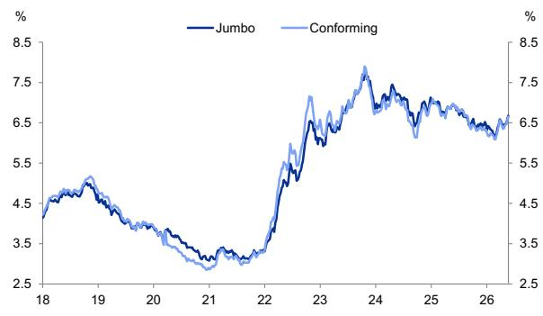

line

| Year | Jumbo | Conforming |
|------|-------|------------|
| 18   | 4.5   | 4.5        |
| 19   | 4.8   | 4.7        |
| 20   | 3.8   | 3.7        |
| 21   | 3.0   | 2.8        |
| 22   | 3.5   | 3.3        |
| 23   | 6.0   | 6.5        |
| 24   | 7.5   | 7.8        |
| 25   | 6.8   | 6.6        |
| 26   | 6.5   | 6.4        |

Source: MBA, GS Global Investment Research

# Exhibit 50: About 86% of outstanding mortgages have interest rates below PMMS

Distribution of outstanding 30-year conventional mortgage borrower interest rates

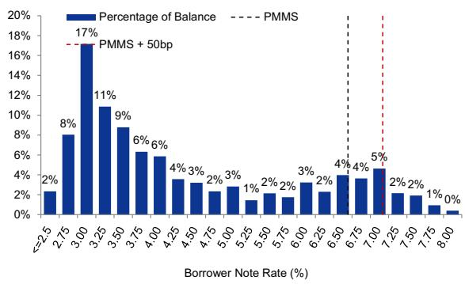

bar

| Borrower Note Rate (%) | Percentage of Balance |
| ---------------------- | --------------------- |
| ≤2.5                   | 2%                    |
| 2.75                   | 8%                    |
| 3.00                   | 17%                   |
| 3.25                   | 11%                   |
| 3.50                   | 9%                    |
| 3.75                   | 6%                    |
| 4.00                   | 6%                    |
| 4.25                   | 4%                    |
| 4.50                   | 3%                    |
| 4.75                   | 2%                    |
| 5.00                   | 3%                    |
| 5.25                   | 1%                    |
| 5.50                   | 2%                    |
| 5.75                   | 2%                    |
| 6.00                   | 3%                    |
| 6.25                   | 2%                    |
| 6.50                   | 4%                    |
| 6.75                   | 4%                    |
| 7.00                   | 5%                    |
| 7.25                   | 2%                    |
| 7.50                   | 2%                    |
| 7.75                   | 1%                    |
| 8.00                   | 0%                    |

Source: eMBS, GS Global Investment Research

# Exhibit 51: 5% of mortgage borrowers are in-the-money for refinancing

Percentage of outstanding 30-year conventional mortgages with at least a 50bp incentive to refinance

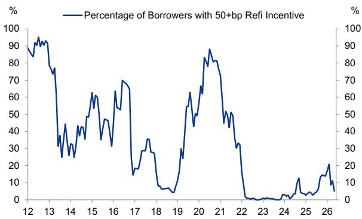

line

| Year | Percentage of Borrowers with 50+bp Refi Incentive |
|------|--------------------------------------------------|
| 12   | 90                                               |
| 13   | 85                                               |
| 14   | 30                                               |
| 15   | 60                                               |
| 16   | 70                                               |
| 17   | 15                                               |
| 18   | 5                                                |
| 19   | 30                                               |
| 20   | 85                                               |
| 21   | 50                                               |
| 22   | 0                                                |
| 23   | 0                                                |
| 24   | 0                                                |
| 25   | 10                                               |
| 26   | 20                                               |

Source: eMBS, GS Global Investment Research

# The Federal Reserve's agency MBS assets remain below \$2.1 trillion

Exhibit 52: US Treasury yields   
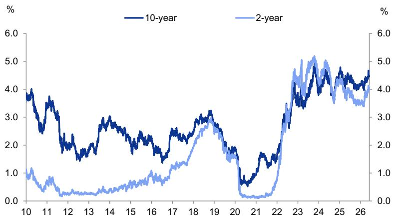

line

| Year | 10-year | 2-year |
|------|---------|--------|
| 10   | 4.0     | 1.0    |
| 11   | 3.5     | 0.8    |
| 12   | 2.5     | 0.5    |
| 13   | 2.0     | 0.4    |
| 14   | 2.5     | 0.6    |
| 15   | 2.8     | 0.7    |
| 16   | 2.6     | 0.9    |
| 17   | 2.4     | 1.2    |
| 18   | 2.8     | 1.8    |
| 19   | 3.2     | 2.5    |
| 20   | 2.0     | 1.5    |
| 21   | 0.5     | 0.3    |
| 22   | 1.5     | 1.0    |
| 23   | 4.5     | 4.0    |
| 24   | 5.0     | 5.5    |
| 25   | 4.8     | 4.5    |
| 26   | 4.5     | 4.0    |

Source: GS Global Investment Research   
Federal Reserve holdings plus commitments to buy agency MBS

Exhibit 53: Federal Reserve holdings of agency MBS have run off

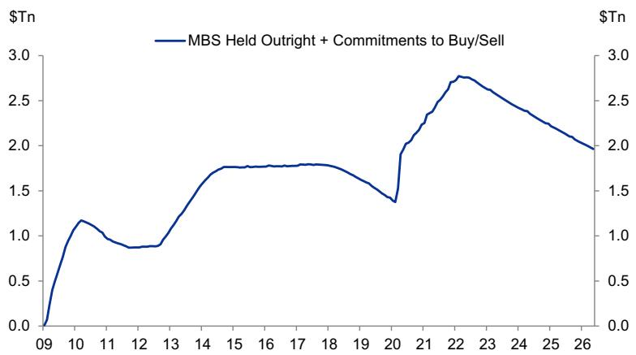

line

| Year | MBS Held Outright + Commitments to Buy/Sell ($Tn) |
|------|--------------------------------------------------|
| 09   | 0.0                                              |
| 10   | 1.2                                              |
| 11   | 1.0                                              |
| 12   | 0.9                                              |
| 13   | 0.9                                              |
| 14   | 1.7                                              |
| 15   | 1.8                                              |
| 16   | 1.8                                              |
| 17   | 1.8                                              |
| 18   | 1.8                                              |
| 19   | 1.7                                              |
| 20   | 1.4                                              |
| 21   | 2.0                                              |
| 22   | 2.8                                              |
| 23   | 2.7                                              |
| 24   | 2.5                                              |
| 25   | 2.3                                              |
| 26   | 2.0                                              |

Source: Federal Reserve, GS Global Investment Research

Exhibit 54: Interest rate volatility has shifted up in the last year
Implied interest rate volatility   
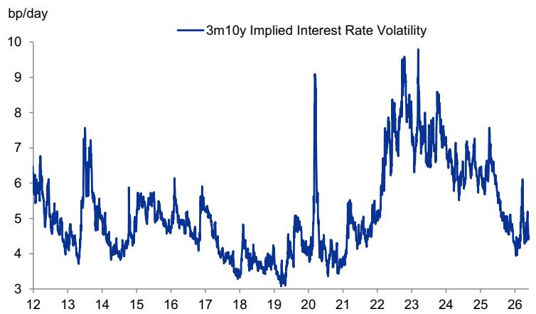

line

| Year | 3m10y Implied Interest Rate Volatility (bp/day) |
|------|-----------------------------------------------|
| 12   | ~6.0                                          |
| 13   | ~4.5                                          |
| 14   | ~7.5                                          |
| 15   | ~5.5                                          |
| 16   | ~6.0                                          |
| 17   | ~5.0                                          |
| 18   | ~4.0                                          |
| 19   | ~3.5                                          |
| 20   | ~9.0                                          |
| 21   | ~4.5                                          |
| 22   | ~7.0                                          |
| 23   | ~9.5                                          |
| 24   | ~8.0                                          |
| 25   | ~7.0                                          |
| 26   | ~6.0                                          |

Source: GS Global Investment Research

Exhibit 55: The Federal Reserve did not make MBS purchases in May
Federal Reserve gross monthly MBS purchase volumes   
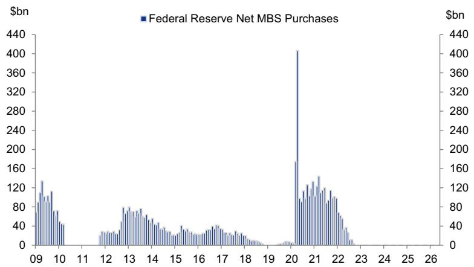

bar

| Year | Federal Reserve Net MBS Purchases ($bn) | Total Net Sales ($bn) |
|------|------------------------------------------|------------------------|
| 09   | ~80                                      | ~120                   |
| 10   | ~120                                     | ~150                   |
| 11   | ~40                                      | ~60                    |
| 12   | ~60                                      | ~80                    |
| 13   | ~80                                      | ~100                   |
| 14   | ~60                                      | ~80                    |
| 15   | ~40                                      | ~60                    |
| 16   | ~60                                      | ~80                    |
| 17   | ~40                                      | ~60                    |
| 18   | ~20                                      | ~40                    |
| 19   | ~10                                      | ~20                    |
| 20   | ~400                                     | ~400                   |
| 21   | ~160                                     | ~180                   |
| 22   | ~80                                      | ~100                   |
| 23   | ~40                                      | ~60                    |
| 24   | ~20                                      | ~40                    |
| 25   | ~10                                      | ~20                    |
| 26   | ~5                                       | ~10                    |

Source: Federal Reserve, GS Global Investment Research

# Agency MBS valuations have improved recently

Exhibit 56: The current coupon mortgage basis is in the 39th percentile of its 1997 - 2023 range   
Current valuation percentiles vs. 1997–present distribution (0th percentile=rich, 100th percentile=cheap)   
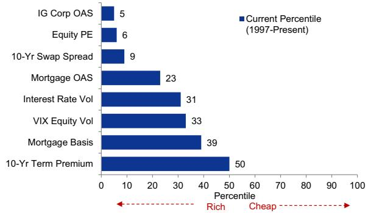

bar

| Category | Current Percentile (1997-Present) |
|---|---|
| IG Corp OAS | 5 |
| Equity PE | 6 |
| 10-Yr Swap Spread | 9 |
| Mortgage OAS | 23 |
| Interest Rate Vol | 31 |
| VIX Equity Vol | 33 |
| Mortgage Basis | 39 |
| 10-Yr Term Premium | 50 |
Rich - Decline - Rich - Cheap - Decade - Decade - Decade - Decade - Decade - Decade - Decade - Decade - Decade - Decade - Decade - Decade - Decade - Decade - Decade - Decade - Decade - Decade - Decade - Decade - Decade - Decade - Decade - Decade - Decade - Decade - Decade - Decade - Decade - Decade - Decade - Decade - Decade - Decade
Percentile

Source: Haver Analytics, Yield Book, GS Global Investment Research

Exhibit 57: Agency MBS has returned +7.0% over the past 12 months vs. +6.3% for IG corporate bonds   
12-month lagging total return   
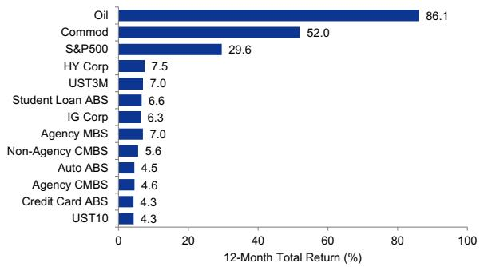

bar

| Entity | 12-Month Total Return (%) |
| :--- | :--- |
| Oil | 86.1 |
| Commod | 52.0 |
| S&P500 | 29.6 |
| HY Corp | 7.5 |
| UST3M | 7.0 |
| Student Loan ABS | 6.6 |
| IG Corp | 6.3 |
| Agency MBS | 7.0 |
| Non-Agency CMBS | 5.6 |
| Auto ABS | 4.5 |
| Agency CMBS | 4.6 |
| Credit Card ABS | 4.3 |
| UST10 | 4.3 |

Source: Bloomberg, Haver Analytics, GS Global Investment Research

Exhibit 58: 15-year agency MBS have delivered positive excess return in 2026   
Excess returns year to date   
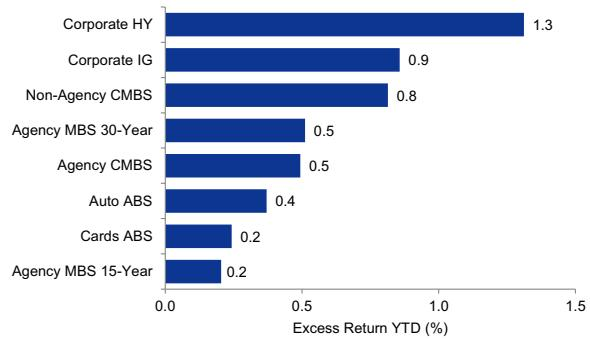

bar

| Category | Excess Return YTD (%) |
| :--- | :--- |
| Corporate HY | 1.3 |
| Corporate IG | 0.9 |
| Non-Agency CMBS | 0.8 |
| Agency MBS 30-Year | 0.5 |
| Agency CMBS | 0.5 |
| Auto ABS | 0.4 |
| Cards ABS | 0.2 |
| Agency MBS 15-Year | 0.2 |

Source: Bloomberg, GS Global Investment Research

# CMBS delinquency rates remain contained despite challenging CRE fundamentals

Exhibit 59: Only 14% of 2025 conduit CMBS loans are collateralized by office properties, the lowest mark in over a decade   
Conduit CMBS origination breakdown and performance by vintage 

<table><tr><td>Vintage</td><td>Balance ($Bn)</td><td>Apartment %</td><td>Lodging %</td><td>Retail %</td><td>Office %</td><td>CA %</td><td>NY %</td><td>TX %</td><td>FL %</td><td>IO %</td><td>DQ/FCL/REO %</td></tr><tr><td>2014</td><td>7</td><td>1</td><td>4</td><td>23</td><td>57</td><td>12</td><td>24</td><td>8</td><td>3</td><td>94</td><td>62</td></tr><tr><td>2015</td><td>9</td><td>2</td><td>9</td><td>24</td><td>53</td><td>8</td><td>26</td><td>7</td><td>1</td><td>93</td><td>56</td></tr><tr><td>2016</td><td>22</td><td>5</td><td>12</td><td>32</td><td>31</td><td>13</td><td>15</td><td>6</td><td>4</td><td>74</td><td>23</td></tr><tr><td>2017</td><td>38</td><td>6</td><td>13</td><td>23</td><td>34</td><td>19</td><td>19</td><td>6</td><td>4</td><td>79</td><td>9</td></tr><tr><td>2018</td><td>34</td><td>10</td><td>14</td><td>26</td><td>28</td><td>17</td><td>12</td><td>5</td><td>8</td><td>80</td><td>11</td></tr><tr><td>2019</td><td>45</td><td>14</td><td>11</td><td>19</td><td>32</td><td>20</td><td>16</td><td>7</td><td>5</td><td>85</td><td>8</td></tr><tr><td>2020</td><td>28</td><td>16</td><td>9</td><td>13</td><td>35</td><td>18</td><td>26</td><td>6</td><td>4</td><td>89</td><td>6</td></tr><tr><td>2021</td><td>32</td><td>20</td><td>3</td><td>17</td><td>30</td><td>17</td><td>21</td><td>7</td><td>6</td><td>84</td><td>4</td></tr><tr><td>2022</td><td>24</td><td>15</td><td>6</td><td>18</td><td>31</td><td>13</td><td>17</td><td>6</td><td>7</td><td>88</td><td>4</td></tr><tr><td>2023</td><td>21</td><td>13</td><td>11</td><td>28</td><td>17</td><td>13</td><td>12</td><td>7</td><td>5</td><td>90</td><td>7</td></tr><tr><td>2024</td><td>34</td><td>24</td><td>11</td><td>24</td><td>14</td><td>13</td><td>19</td><td>8</td><td>6</td><td>91</td><td>4</td></tr><tr><td>2025</td><td>36</td><td>27</td><td>12</td><td>17</td><td>14</td><td>14</td><td>25</td><td>7</td><td>4</td><td>86</td><td>3</td></tr></table>

Source: Trepp, GS Global Investment Research

# High CMBS note rates will be an obstacle to debt refinancing

Exhibit 60: Large CMBS loan maturities are hitting in 2026   
Remaining CMBS loan maturities by maturity date   
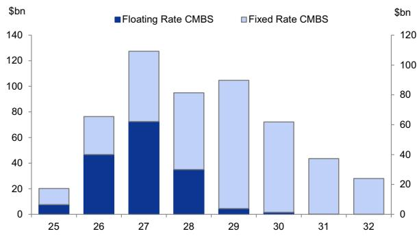

bar_stacked

| X-axis | Floating Rate CMBS ($bn) | Fixed Rate CMBS ($bn) |
|---|---|---|
| 25 | 8 | 14 |
| 26 | 47 | 30 |
| 27 | 72 | 50 |
| 28 | 34 | 60 |
| 29 | 4 | 95 |
| 30 | 1 | 65 |
| 31 | 0 | 40 |
| 32 | 0 | 25 |

Source: Trepp, GS Global Investment Research

Exhibit 61: Recent CMBS loan originations have an average note rate of 6.3%   
Conduit CMBS weighted average coupon by origination date   
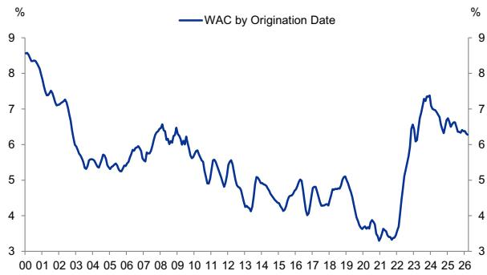

line

| Year | WAC by Origination Date |
| ---- | ------------------------ |
| 00   | 8.5                      |
| 01   | 8.0                      |
| 02   | 7.5                      |
| 03   | 7.0                      |
| 04   | 6.5                      |
| 05   | 6.0                      |
| 06   | 5.5                      |
| 07   | 5.0                      |
| 08   | 6.5                      |
| 09   | 6.0                      |
| 10   | 5.5                      |
| 11   | 5.0                      |
| 12   | 4.5                      |
| 13   | 4.0                      |
| 14   | 4.5                      |
| 15   | 4.0                      |
| 16   | 4.5                      |
| 17   | 5.0                      |
| 18   | 4.5                      |
| 19   | 5.0                      |
| 20   | 4.0                      |
| 21   | 3.5                      |
| 22   | 3.0                      |
| 23   | 6.5                      |
| 24   | 7.5                      |
| 25   | 7.0                      |
| 26   | 6.5                      |

Source: Trepp, GS Global Investment Research

Exhibit 62: Loans maturing in 2026 have an average note rate of 4.3%   
Conduit CMBS weighted average coupon by maturity date   
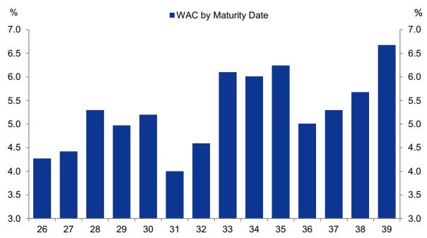

bar

| Maturity Date | WAC by Maturity Date |
| ------------- | -------------------- |
| 26            | 4.3                  |
| 27            | 4.4                  |
| 28            | 5.3                  |
| 29            | 5.0                  |
| 30            | 5.2                  |
| 31            | 4.0                  |
| 32            | 4.6                  |
| 33            | 6.1                  |
| 34            | 6.0                  |
| 35            | 6.2                  |
| 36            | 5.0                  |
| 37            | 5.3                  |
| 38            | 5.7                  |
| 39            | 6.7                  |

Source: Trepp, GS Global Investment Research

# Apartment property prices have declined

Exhibit 63: Office and Retail prices are down year to date   
Commercial property price indices by property type   
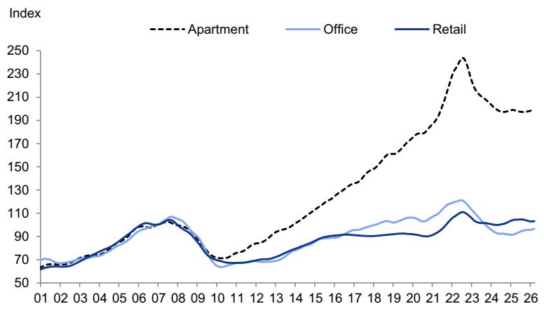

line

| Year | Apartment | Office | Retail |
|------|-----------|--------|--------|
| 01   | 70        | 70     | 65     |
| 02   | 70        | 70     | 65     |
| 03   | 70        | 70     | 65     |
| 04   | 70        | 70     | 65     |
| 05   | 70        | 70     | 70     |
| 06   | 70        | 70     | 80     |
| 07   | 70        | 70     | 90     |
| 08   | 70        | 70     | 95     |
| 09   | 70        | 70     | 90     |
| 10   | 70        | 65     | 80     |
| 11   | 70        | 65     | 80     |
| 12   | 70        | 65     | 80     |
| 13   | 70        | 65     | 80     |
| 14   | 70        | 65     | 80     |
| 15   | 70        | 65     | 80     |
| 16   | 70        | 65     | 80     |
| 17   | 70        | 65     | 80     |
| 18   | 70        | 65     | 80     |
| 19   | 70        | 65     | 80     |
| 20   | 70        | 65     | 80     |
| 21   | 70        | 65     | 80     |
| 22   | 70        | 65     | 80     |
| 23   | 70        | 65     | 80     |
| 24   | 70        | 65     | 80     |
| 25   | 70        | 65     | 80     |
| 26   | 70        | 65     | 80     |

Source: RCA, GS Global Investment Research

Exhibit 64: CBD office prices have declined to post-GFC prices   
Office commercial property price indices   
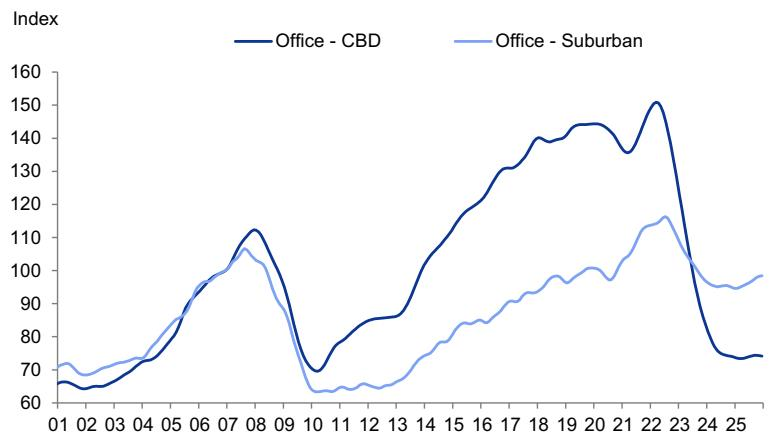

line

| Month | Office - CBD | Office - Suburban |
|-------|--------------|-------------------|
| 01    | 65           | 70                |
| 02    | 64           | 71                |
| 03    | 66           | 72                |
| 04    | 68           | 73                |
| 05    | 72           | 75                |
| 06    | 80           | 85                |
| 07    | 90           | 95                |
| 08    | 110          | 105               |
| 09    | 85           | 90                |
| 10    | 70           | 65                |
| 11    | 75           | 66                |
| 12    | 80           | 67                |
| 13    | 85           | 68                |
| 14    | 90           | 70                |
| 15    | 100          | 75                |
| 16    | 110          | 80                |
| 17    | 120          | 85                |
| 18    | 130          | 90                |
| 19    | 140          | 95                |
| 20    | 145          | 100               |
| 21    | 140          | 105               |
| 22    | 150          | 115               |
| 23    | 140          | 110               |
| 24    | 75           | 95                |
| 25    | 70           | 98                |

Source: RCA, GS Global Investment Research

Exhibit 65: Office cap rates have widened over the past six months   
US commercial property cap rates   
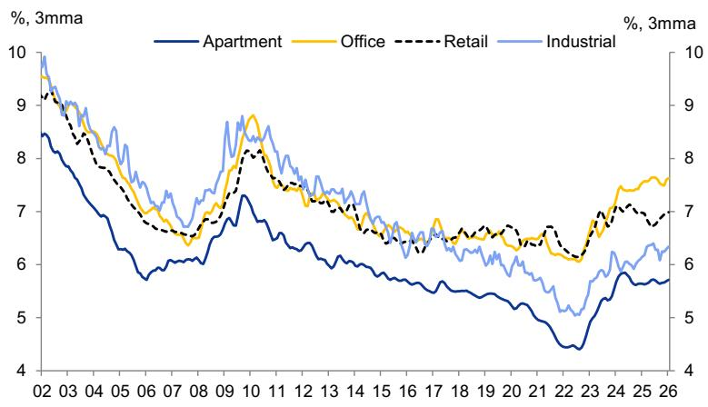

line

| Year | Apartment | Office | Retail | Industrial |
|------|-----------|--------|--------|------------|
| 02   | 8.5       | 9.5    | 9.2    | 10.0       |
| 03   | 8.0       | 9.0    | 8.8    | 9.8        |
| 04   | 7.5       | 8.5    | 8.2    | 9.5        |
| 05   | 7.0       | 8.0    | 7.8    | 9.0        |
| 06   | 6.5       | 7.5    | 7.2    | 8.5        |
| 07   | 6.0       | 7.0    | 6.8    | 8.0        |
| 08   | 6.5       | 7.5    | 7.2    | 8.5        |
| 09   | 7.0       | 8.0    | 7.8    | 9.0        |
| 10   | 7.5       | 8.5    | 8.2    | 9.5        |
| 11   | 7.0       | 8.0    | 7.8    | 9.0        |
| 12   | 6.5       | 7.5    | 7.2    | 8.5        |
| 13   | 6.0       | 7.0    | 6.8    | 8.0        |
| 14   | 5.5       | 6.5    | 6.2    | 7.5        |
| 15   | 5.0       | 6.0    | 5.8    | 7.0        |
| 16   | 4.5       | 5.5    | 5.2    | 6.5        |
| 17   | 4.0       | 5.0    | 4.8    | 6.0        |
| 18   | 4.5       | 5.5    | 5.2    | 6.5        |
| 19   | 5.0       | 6.0    | 5.8    | 7.0        |
| 20   | 5.5       | 6.5    | 6.2    | 7.5        |
| 21   | 6.0       | 7.0    | 6.8    | 8.0        |
| 22   | 6.5       | 7.5    | 7.2    | 8.5        |
| 23   | 7.0       | 8.0    | 7.8    | 9.0        |
| 24   | 7.5       | 8.5    | 8.2    | 9.5        |
| 25   | 8.0       | 9.0    | 8.8    | 10.0       |
| 26   | 8.5       | 9.5    | 9.2    | 10.5       |

Source: RCA, GS Global Investment Research

Exhibit 66: US apartment asking rents are at historical highs   
Apartment asking rent index   
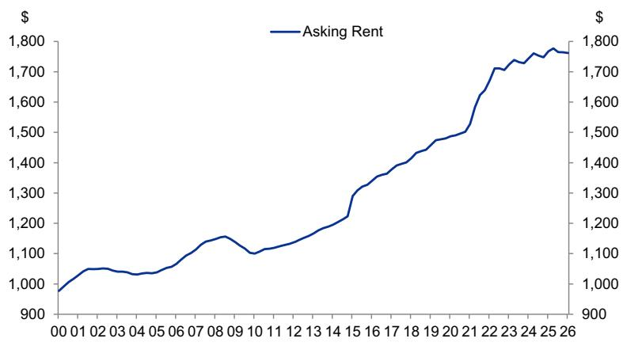

line

| Year | Asking Rent ($) |
| ---- | --------------- |
| 00   | 1000            |
| 01   | 1050            |
| 02   | 1075            |
| 03   | 1060            |
| 04   | 1050            |
| 05   | 1075            |
| 06   | 1100            |
| 07   | 1150            |
| 08   | 1175            |
| 09   | 1150            |
| 10   | 1125            |
| 11   | 1150            |
| 12   | 1175            |
| 13   | 1200            |
| 14   | 1225            |
| 15   | 1300            |
| 16   | 1350            |
| 17   | 1400            |
| 18   | 1450            |
| 19   | 1500            |
| 20   | 1550            |
| 21   | 1650            |
| 22   | 1750            |
| 23   | 1775            |
| 24   | 1800            |
| 25   | 1775            |
| 26   | 1750            |

Source: CoStar, GS Global Investment Research

# CMBS spreads have tightened

Exhibit 67: AAA CMBS spreads have tightened over the past month   
AAA conduit CMBS spreads   
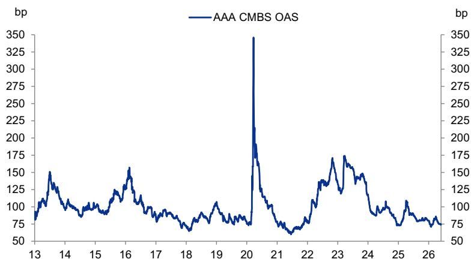

line

| x  | AAA CMBS OAS (bp) |
|----|-------------------|
| 13 | 75                |
| 14 | 150               |
| 15 | 100               |
| 16 | 150               |
| 17 | 100               |
| 18 | 75                |
| 19 | 100               |
| 20 | 350               |
| 21 | 75                |
| 22 | 100               |
| 23 | 175               |
| 24 | 150               |
| 25 | 100               |
| 26 | 75                |

Source: Bloomberg, GS Global Investment Research

Exhibit 68: The spread between CMBX BBB- and CDX HY have widened   
On-the-run CMBX BBB- vs. CDX HY spreads   
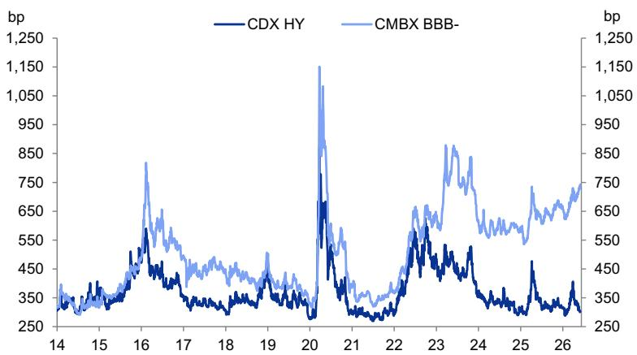

line

| Year | CDX HY | CMBX BBB- |
|------|--------|-----------|
| 14   | 350    | 350       |
| 15   | 375    | 375       |
| 16   | 550    | 800       |
| 17   | 400    | 600       |
| 18   | 350    | 450       |
| 19   | 375    | 475       |
| 20   | 650    | 1,150     |
| 21   | 350    | 550       |
| 22   | 450    | 650       |
| 23   | 550    | 850       |
| 24   | 400    | 750       |
| 25   | 350    | 650       |
| 26   | 375    | 750       |

Source: Markit, GS Global Investment Research

# Disclosure Appendix

# Reg AC

We, Arun Manohar, Ben Shumway and Neth Karunamuni, hereby certify that all of the views expressed in this report accurately reflect our personal views, which have not been influenced by considerations of the firm's business or client relationships.

Unless otherwise stated, the individuals listed on the cover page of this report are analysts in GS' Global Investment Research division.

Contributing Authors: Arun Manohar GS & Co. LLC, Ben Shumway GS & Co. LLC, Neth Karunamuni GS & Co. LLC.

Unless otherwise stated, the individuals listed in the Contributing Authors disclosure of this report are analysts in GS' Global Investment Research division.

# Disclosures

# Regulatory disclosures

# Disclosures required by United States laws and regulations

See company-specific regulatory disclosures above for any of the following disclosures required as to companies referred to in this report: manager or co-manager in a pending transaction; 1% or other ownership; compensation for certain services; types of client relationships; managed/co-managed public offerings in prior periods; directorships; for equity securities, market making and/or specialist role. GS trades or may trade as a principal in debt securities (or in related derivatives) of issuers discussed in this report.

The following are additional required disclosures: Ownership and material conflicts of interest: GS policy prohibits its analysts, professionals reporting to analysts and members of their households from owning securities of any company in the analyst's area of coverage. Analyst compensation: Analysts are paid in part based on the profitability of GS, which includes investment banking revenues. Analyst as officer or director: GS policy generally prohibits its analysts, persons reporting to analysts or members of their households from serving as an officer, director or advisor of any company in the analyst's area of coverage. Non-U.S. Analysts: Non-U.S. analysts may not be associated persons of GS & Co. LLC and therefore may not be subject to FINRA Rule 2241 or FINRA Rule 2242 restrictions on communications with a subject company, public appearances and trading in securities covered by the analysts.

# Additional disclosures required under the laws and regulations of jurisdictions other than the United States

The following disclosures are those required by the jurisdiction indicated, except to the extent already made above pursuant to United States laws and regulations. Australia: GS Australia Pty Ltd and its affiliates are not authorised deposit-taking institutions (as that term is defined in the Banking Act 1959 (Cth)) in Australia and do not provide banking services, nor carry on a banking business, in Australia. This research, and any access to it, is intended only for “wholesale clients” within the meaning of the Australian Corporations Act, unless otherwise agreed by GS. In producing research reports, members of Global Investment Research of GS Australia may attend site visits and other meetings hosted by the companies and other entities which are the subject of its research reports. In some instances the costs of such site visits or meetings may be met in part or in whole by the issuers concerned if GS Australia considers it is appropriate and reasonable in the specific circumstances relating to the site visit or meeting. To the extent that the contents of this document contains any financial product advice, it is general advice only and has been prepared by GS without taking into account a client’s objectives, financial situation or needs. A client should, before acting on any such advice, consider the appropriateness of the advice having regard to the client’s own objectives, financial situation and needs. A copy of certain GS Australia and New Zealand disclosure of interests and a copy of GS’ Australian Sell-Side Research Independence Policy Statement are available at: https://www.goldmansachs.com/disclosures/australia-new-zealand/index.html. Brazil: Disclosure information in relation to CVM Resolution n. 20 is available at https://www.gs.com/worldwide/brazil/area/gir/index.html. Where applicable, the Brazil-registered analyst primarily responsible for the content of this research report, as defined in Article 20 of CVM Resolution n. 20, is the first author named at the beginning of this report, unless indicated otherwise at the end of the text. Canada: This information is being provided to you for information purposes only and is not, and under no circumstances should be construed as, an advertisement, offering or solicitation by GS & Co. LLC for purchasers of securities in Canada to trade in any Canadian security. GS & Co. LLC is not registered as a dealer in any jurisdiction in Canada under applicable Canadian securities laws and generally is not permitted to trade in Canadian securities and may be prohibited from selling certain securities and products in certain jurisdictions in Canada. If you wish to trade in any Canadian securities or other products in Canada please contact GS Canada Inc., an affiliate of The GS Group Inc., or another registered Canadian dealer. Hong Kong: Further information on the securities of covered companies referred to in this research may be obtained on request from GS (Asia) L.L.C. India: Further information on the subject company or companies referred to in this research may be obtained from GS (India) Securities Private Limited, Research Analyst - SEBI Registration Number INH000001493, 10th Floor, Ascent-Worli, Sudam Kalu Ahire Marg, Worli, Mumbai-400 025, India, Corporate Identity Number U74140MH2006FTC160634, Phone +91 22 6616 9000, Fax +91 22 6616 9001. GS may beneficially own 1% or more of the securities (as such term is defined in clause 2 (h) the Indian Securities Contracts (Regulation) Act, 1956) of the subject company or companies referred to in this research report. Investment in securities market are subject to market risks. Read all the related documents carefully before investing. Registration granted by SEBI and certification from NISM in no way guarantee performance of the intermediary or provide any assurance of returns to investors. GS (India) Securities Private Limited compliance officer and investor grievance contact details can be found at:

https://www.goldmansachs.com/worldwide/india/documents/Grievance-Redressal-and-Escalation-Matrix.pdf, and a copy of the annual audit compliance report can be found at this link: https://publishing.gs.com/content/site/india-annual-compliance-report.html. Japan: See below. Korea: This research, and any access to it, is intended only for “professional investors” within the meaning of the Financial Services and Capital Markets Act, unless otherwise agreed by GS. Further information on the subject company or companies referred to in this research may be obtained from GS (Asia) L.L.C., Seoul Branch. New Zealand: GS New Zealand Limited and its affiliates are neither “registered banks” nor “deposit takers” (as defined in the Reserve Bank of New Zealand Act 1989) in New Zealand. This research, and any access to it, is intended for “wholesale clients” (as defined in the Financial Advisers Act 2008) unless otherwise agreed by GS. A copy of certain GS Australia and New Zealand disclosure of interests is available at: https://www.goldmansachs.com/disclosures/australia-new-zealand/index.html. Russia: Research reports distributed in the Russian Federation are not advertising as defined in the Russian legislation, but are information and analysis not having product promotion as their main purpose and do not provide appraisal within the meaning of the Russian legislation on appraisal activity. Research reports do not constitute a personalized investment recommendation as defined in Russian laws and regulations, are not addressed to a specific client, and are prepared without analyzing the financial circumstances, investment profiles or risk profiles of clients. GS assumes no responsibility for any investment decisions that may be taken by a client or any other person based on this research report. Singapore: GS (Singapore) Pte. (Company Number: 198602165W), which is regulated by the Monetary Authority of Singapore, accepts legal responsibility for this research, and should be contacted with respect to any matters arising from, or in connection with, this research. Taiwan: This material is for reference only and must not be reprinted without permission. Investors should carefully consider their own investment risk. Investment results are the responsibility of the individual investor. United Kingdom: Persons who would be categorized as retail clients in the United Kingdom, as such term is defined in the rules of the Financial Conduct Authority, should read this research in conjunction with prior GS on the covered companies referred to herein and should refer to the risk warnings that have been sent to them by GS International. A copy of these risks warnings, and a glossary of certain financial terms used in this report, are available from GS International on request.

European Union and United Kingdom: Disclosure information in relation to Article 6 (2) of the European Commission Delegated Regulation (EU) (2016/958) supplementing Regulation (EU) No 596/2014 of the European Parliament and of the Council (including as that Delegated Regulation is implemented into United Kingdom domestic law and regulation following the United Kingdom's departure from the European Union and the European Economic Area) with regard to regulatory technical standards for the technical arrangements for objective presentation of investment recommendations or other information recommending or suggesting an investment strategy and for disclosure of particular interests or indications of conflicts of interest is available at https://www.gs.com/disclosures/europeanpolicy.html which states the European Policy for Managing Conflicts of Interest in Connection with Investment Research.

Japan: GS Japan Co., Ltd. is a Financial Instrument Dealer registered with the Kanto Financial Bureau under registration number Kinsho 69, and a member of Japan Securities Dealers Association, Financial Futures Association of Japan Type II Financial Instruments Firms Association, and Investment Management Association of Japan. Sales and purchase of equities are subject to commission pre-determined with clients plus consumption tax. See company-specific disclosures as to any applicable disclosures required by Japanese stock exchanges, the Japanese Securities Dealers Association or the Japanese Securities Finance Company.

# Global product; distributing entities

GS Global Investment Research produces and distributes research products for clients of GS on a global basis. Analysts based in GS offices around the world produce research on industries and companies, and research on macroeconomics, currencies, commodities and portfolio strategy. This research is disseminated in Australia by GS Australia Pty Ltd (ABN 21 006 797 897); in Brazil by GS do Brasil Corretora de Títulos e Valores Mobiliários S.A.; Public Communication Channel GS Brazil: 0800 727 5764 and / or contatogoldmanbrasil@gs.com. Available Weekdays (except holidays), from 9am to 6pm. Canal de Comunicação com o Público GS Brasil: 0800 727 5764 e/ou contatogoldmanbrasil@gs.com. Horário de funcionamento: segunda-feira à sexta-feira (exceto feriados), das 9h às 18h; in Canada by GS & Co. LLC; in Hong Kong by GS (Asia) L.L.C.; in India by GS (India) Securities Private Ltd.; in Japan by GS Japan Co., Ltd.; in the Republic of Korea by GS (Asia) L.L.C., Seoul Branch; in New Zealand by GS New Zealand Limited; in Russia by OOO GS; in Singapore by GS (Singapore) Pte. (Company Number: 198602165W); and in the United States of America by GS & Co. LLC. GS International has approved this research in connection with its distribution in the United Kingdom.

GS International (“GSI”), authorised by the Prudential Regulation Authority (“PRA”) and regulated by the Financial Conduct Authority (“FCA”) and the PRA, has approved this research in connection with its distribution in the United Kingdom.

European Economic Area: GS Bank Europe SE (“GSBE”) is a credit institution incorporated in Germany and, within the Single Supervisory Mechanism, subject to direct prudential supervision by the European Central Bank and in other respects supervised by German Federal Financial Supervisory Authority (Bundesanstalt für Finanzdienstleistungsaufsicht, BaFin) and Deutsche Bundesbank and disseminates research within the European Economic Area.

# General disclosures

This research is for our clients only. Other than disclosures relating to GS, this research is based on current public information that we consider reliable, but we do not represent it is accurate or complete, and it should not be relied on as such. The information, opinions, estimates and forecasts contained herein are as of the date hereof and are subject to change without prior notification. We seek to update our research as appropriate, but various regulations may prevent us from doing so. Other than certain industry reports published on a periodic basis, the large majority of reports are published at irregular intervals as appropriate in the analyst's judgment.

GS conducts a global full-service, integrated investment banking, investment management, and brokerage business. We have investment banking and other business relationships with a substantial percentage of the companies covered by Global Investment Research. GS & Co. LLC, the United States broker dealer, is a member of SIPC (https://www.sipc.org).

Our salespeople, traders, and other professionals may provide oral or written market commentary or trading strategies to our clients and principal trading desks that reflect opinions that are contrary to the opinions expressed in this research. Our asset management area, principal trading desks and investing businesses may make investment decisions that are inconsistent with the recommendations or views expressed in this research.

We and our affiliates, officers, directors, and employees will from time to time have long or short positions in, act as principal in, and buy or sell, the securities or derivatives, if any, referred to in this research, unless otherwise prohibited by regulation or GS policy.

The views attributed to third party presenters at GS arranged conferences, including individuals from other parts of GS, do not necessarily reflect those of Global Investment Research and are not an official view of GS.

Any third party referenced herein, including any salespeople, traders and other professionals or members of their household, may have positions in the products mentioned that are inconsistent with the views expressed by analysts named in this report.

This research is focused on investment themes across markets, industries and sectors. It does not attempt to distinguish between the prospects or performance of, or provide analysis of, individual companies within any industry or sector we describe.

Any trading recommendation in this research relating to an equity or credit security or securities within an industry or sector is reflective of the investment theme being discussed and is not a

recommendation of any such security in isolation.

This research is not an offer to sell or the solicitation of an offer to buy any security in any jurisdiction where such an offer or solicitation would be illegal. It does not constitute a personal recommendation or take into account the particular investment objectives, financial situations, or needs of individual clients. Clients should consider whether any advice or recommendation in this research is suitable for their particular circumstances and, if appropriate, seek professional advice, including tax advice. The price and value of investments referred to in this research and the income from them may fluctuate. Past performance is not a guide to future performance, future returns are not guaranteed, and a loss of original capital may occur. Fluctuations in exchange rates could have adverse effects on the value or price of, or income derived from, certain investments.

Certain transactions, including those involving futures, options, and other derivatives, give rise to substantial risk and are not suitable for all investors. Investors should review current options and futures disclosure documents which are available from GS sales representatives or at https://www.theocc.com/about/publications/character-risks.jsp and https://www.goldmansachs.com/disclosures/cftc\_fcm\_disclosures. Transaction costs may be significant in option strategies calling for multiple purchase and sales of options such as spreads. Supporting documentation will be supplied upon request.

Differing Levels of Service provided by Global Investment Research: The level and types of services provided to you by GS Global Investment Research may vary as compared to that provided to internal and other external clients of GS, depending on various factors including your individual preferences as to the frequency and manner of receiving communication, your risk profile and investment focus and perspective (e.g., marketwide, sector specific, long term, short term), the size and scope of your overall client relationship with GS, and legal and regulatory constraints. As an example, certain clients may request to receive notifications when research on specific securities is published, and certain clients may request that specific data underlying analysts' fundamental analysis available on our internal client websites be delivered to them electronically through data feeds or otherwise. No change to an analyst's fundamental research views (e.g., ratings, price targets, or material changes to earnings estimates for equity securities), will be communicated to any client prior to inclusion of such information in a research report broadly disseminated through electronic publication to our internal client websites or through other means, as necessary, to all clients who are entitled to receive such reports.

All research reports are disseminated and available to all clients simultaneously through electronic publication to our internal client websites. Not all research content is redistributed to our clients or available to third-party aggregators, nor is GS responsible for the redistribution of our research by third party aggregators. For research, models or other data related to one or more securities, markets or asset classes (including related services) that may be available to you, please contact your GS representative or go to https://research.gs.com.

Disclosure information is also available at https://www.gs.com/research/hedge.html or from Research Compliance, 200 West Street, New York, NY 10282.

# © 2026 GS.

You are permitted to store, display, analyze, modify, reformat, and print the information made available to you via this service only for your own use. You may not resell or reverse engineer this information to calculate or develop any index for disclosure and/or marketing or create any other derivative works or commercial product(s), data or offering(s) without the express written consent of GS. You are not permitted to publish, transmit, or otherwise reproduce this information, in whole or in part, in any format to any third party without the express written consent of GS. This foregoing restriction includes, without limitation, using, extracting, downloading or retrieving this information, in whole or in part, to train or finetune a machine learning or artificial intelligence system, or to provide or reproduce this information, in whole or in part, as a prompt or input to any such system.